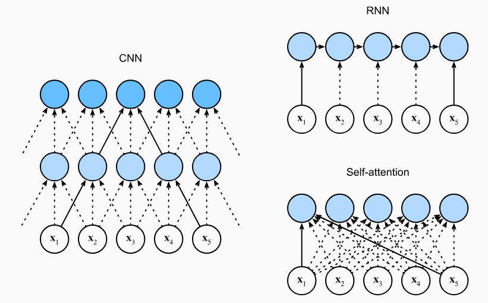

# 从CNN、RNN到Attention

> [!Quote] 本篇导读
> 当前主流的大语言模型几乎全部基于Transformer架构。但在Transformer出现之前，机器是如何理解语言的？旧方法的天花板在哪里？Attention机制又是如何应运而生的？本篇先回答这些问题——只有理解旧方法的根本局限，才能真正理解新设计的必然性。

## 1. 语言理解的本质

### 1.1 语言理解的核心挑战

先来读这句话：

> "他把苹果放进篮子，然后提着**它**走了。"

你几乎不需要思考，就知道"它"指的是篮子。

但你有没有想过，你是怎么知道的？

不是因为"篮子"离"它"更近——虽然在这句话里确实如此，但换一句话就不一定了：

> "他把篮子装进箱子，仔细检查了一下，然后扛着**它**去了车站。"

这里"它"指的是箱子，不是篮子，不是"仔细检查"，也不是"车站"。你的大脑在瞬间完成了一次跨越多个词、综合了上下文逻辑的语义推断。

这种能力，在语言学里有个名字：**指代消解（Coreference Resolution）**，即确定文本中不同的表述是否指向同个实体。具体来说：
- **指代语（Anaphor）**：发起指代的词语，如代词"它""他""这"
- **先行词（Antecedent）**：被指代的实体，如"篮子""箱子"
- **消解（Resolution）**：建立指代语与先行词之间的对应关系

指代消解往往需要跨越句子的语义推理甚至常识判断，人脑可以轻松完成这件事，但对机器来说这很难。

而且，在语言文本理解里，指代消解只是远距上下文依赖的一类。语言中还有其他现象，同样依赖于相距甚远的上下文信息：

> - "那家银行**倒闭**了，但河边那家**银行**还在。"（**词义消歧**：同一个词的不同义项，靠上下文区分）
> - "**虽然**他很累，但他**还是**坚持下来了。"（**篇章关系**：转折逻辑横跨整句，"虽然"和"还是"远距呼应）
> - "The animal didn't cross the street because **it** was too tired."（**指代消解**：it指animal还是street？需要常识推理）

指代消解、词义消歧、篇章关系——这三类现象各不相同，但有一个共同点：**意义的确定都依赖上下文中相距较远的信息**。

更广泛地说：

**语言中的意义，几乎从来不是孤立的、局部的，而是可能依赖于上下文中相距甚远的词语共同构建的。**

这也意味着：在设计语言模型时，如果一个模型如果只能看到局部，就无法真正理解语言。

### 1.2 如何评判语言学习模型的优劣

有了上面的认识，在正式进入和学习各种模型和相关理论之前，让我们先建立一套标准，即如何评判一个语言模型架构的设计优劣。

这套标准围绕两个维度展开：**一是架构能否有效建立远距离的语义联系，二是架构在实际训练和推理中是否具备足够的计算效率。**

在设计上，二者缺一不可，一个架构如果在理解能力上有结构性缺陷，再快也没用；反过来，如果计算开销大到无法扩展到真实数据规模，再强的理论能力也落不了地。

我们先从第一个维度说起。

**维度一：跨位置路径长度（Cross-position Path Length）**

它基于一个核心概念：**长程依赖（Long-range Dependency）**，表示序列中相距较远的两个位置之间存在的语义关联。

语言中的长程依赖无处不在，如：
- **指代关系**：代词与先行词可能相隔数句
- **主谓一致**："The keys **to** the cabinet **are** on the table"（中间夹着介词短语，容易误判）
- **条件与结果**：**If** you work hard today, you **will** succeed tomorrow.（两个关联词相隔整句）
- **篇章逻辑**：在段落乃至文章层面，前后内容的呼应与矛盾

这些现象说明了一件事：**语言模型必须有能力在序列中建立跨越长距离的语义联系。**

但"有能力建立联系"这件事，在语言模型的发展史上，不同架构实现起来的代价却差异悬殊。有些架构需要绕一条很长的路才能让两个遥远的位置"对话"，有些架构则可以直接连通。

这种差异，可以用一个量化指标来刻画：**跨位置路径长度（Cross-position Path Length）**。

它的定义是：在模型的计算图中，序列任意两个位置 $i$ 和 $j$ 之间，信息传递所需经过的最少操作步数。

路径越短，信息传递越直接，两个位置越容易相互影响；路径越长，信息每经过一个中间节点就面临一次变换和潜在损耗，距离越远，理解越模糊。

**维度二：计算复杂度与可并行性**

仅有理解能力是语言模型能否按预期工作的基础，一个架构能否实际用于训练和推理大规模语言模型，还取决于两个关键的工程指标：

- **每层时间复杂度**：处理一条序列需要多少计算量？这直接决定了模型能处理多长的序列、能扩展到多大的数据规模
- **顺序操作数（可并行性）**：计算过程中有多少步骤必须串行执行、无法并行？这决定了能否充分利用现代 GPU/TPU 的并行计算能力，进而决定训练和推理速度的上限

基于这两个维度，我们可以先直观的对比和比较一下RNN、CNN、Self-Attention这三类经典架构各自的表现。

下图直观展示了RNN、CNN、Self-Attention三种架构中信息的流动方式：



其中，
- 白色圆圈代表：输入位置 $\mathbf{x}_1 \sim \mathbf{x}_5$
- 蓝色圆圈代表：中间或输出节点
- 虚线箭头表示：信息流动路径

**RNN：信息沿链条逐步传递，路径长度 $O(n)$，不可并行**

RNN按时间步顺序处理序列，每一步的隐状态 $h_t$ 仅由前一步 $h_{t-1}$ 和当前输入决定：
$$h_t = f(h_{t-1},\ \mathbf{x}_t)$$

从图中可以直观看到：$\mathbf{x}_1$ 的信息要传到第5个输出位置，必须沿 $h_1 \to h_2 \to h_3 \to h_4 \to h_5$ 这条链逐步传递，经过4个中间节点。

推广到长度为 $n$ 的序列，位置 $1$ 与位置 $n$ 之间的路径长度为$n-1$，即：$O(n)$。

计算效率上，由于每步依赖前一步的结果，RNN的计算天然串行，无法在序列长度方向并行，顺序操作数同为$O(n)$，这在长序列场景下是显著的性能瓶颈。

**CNN：信息需逐层扩展，路径长度 $O(n/k)$，可并行**

卷积核大小为 $k$ 的卷积层中，每个节点只能感知周围 $k$ 个位置的邻居。从图中可以看到，CNN分两层：第一层每个节点覆盖3个输入位置，第二层每个节点再覆盖3个第一层节点——这样两层之后，输出才能间接看到所有5个输入。

也就是说，要让距离为 $d$ 的两个位置建立联系，标准卷积需要堆叠 $\lceil d/k \rceil$ 层，路径长度为 $O(n/k)$。

不过，卷积操作在位置维度上可以完全并行，顺序操作数为 $O(1)$，性能效率显著优于RNN。

**Self-Attention：任意两位置直接交互，路径长度 $O(1)$，可并行**

自注意力机制中，每个输出位置的值是对所有输入位置的加权求和：
$$\text{output}_i = \sum_{j=1}^{n} \alpha_{ij} \cdot \mathbf{x}_j$$

从图中可以看到，每个蓝色输出节点都直接连向所有5个输入节点——无论 $\mathbf{x}_1$ 和 $\mathbf{x}_5$ 相距多远，它们都可以在同一层内直接对话，不需要任何中间节点中转，路径长度恒为 $O(1)$，与序列长度无关。

同时，各位置的注意力计算互不依赖，可完全并行。

然而，这里有一个代价：每个输出位置都要与所有 $n$ 个输入位置交互，计算量是 $n \times n$ 的规模，每层时间复杂度为 $O(n^2 d)$。序列越长，计算量以平方速度膨胀。

以上，三种架构的对比可总结为：

| 架构             | 跨位置路径长度  | 顺序操作数（可并行性） | 每层时间复杂度      |
| -------------- | -------- | ----------- | ------------ |
| RNN            | $O(n)$   | $O(n)$，不可并行 | $O(n d^2)$   |
| CNN（核大小$k$）    | $O(n/k)$ | $O(1)$，可并行  | $O(k n d^2)$ |
| Self-Attention | $O(1)$   | $O(1)$，可并行  | $O(n^2 d)$   |

其中 $n$ 为序列长度，$d$ 为特征维度。

我们可以看到，从 RNN 到 CNN，可并行性解决了，但路径长度仍受序列长度制约；到 Self-Attention，路径长度问题彻底解决，可并行性也得以保留，代价是计算复杂度升至 $O(n^2d)$，在长序列场景下成为新的瓶颈。

**路径更短 vs. 计算更轻**，这个权衡将成为此后一系列改进工作的起点，即如何在保住 $O(1)$ 路径长度优势的同时，把计算复杂度从平方级降下来？大家不妨也思考下，我们后续也会接触和学习更多的模型架构优化策略和理论，在这个过程中，也能深刻体会到该权衡在不同方法论下的处理艺术。

## 2. CNN

## 2. RNN——序列建模经典模型

### 2.1 RNN架构设计

循环神经网络（Recurrent Neural Network，RNN）的设计思路，直觉上极其自然：

> **阅读是一个时序过程。读完每个词之后，大脑的"状态"会更新一次。**

RNN把这个直觉数学化了，它维护一个隐状态向量 $h_t$，在读入每个新词 $x_t$ 后更新：
$$h_t = \tanh(W_h h_{t-1} + W_x x_t + b)$$
最终输出 $y_t$ 由当前隐状态决定：
$$y_t = W_o h_t$$

这个结构非常简洁：$h_t$ 就像一个"记忆胶囊"，理论上包含了从位置1到位置t的所有历史信息。读完整个序列后，最后那个 $h_T$ 就是对整句话的"总结"。

这个设计直觉上很合理。

确实，在2000年代到2010年代初，RNN（及其改进版LSTM、GRU）是序列建模的绝对王者，在语言模型、机器翻译、语音识别等任务上全面领先。

但它有三处**结构性的内伤**——"结构性"意味着，这些问题不是调参或换激活函数能解决的，而是由架构本身决定的。

### 2.2 内伤一：梯度消失与梯度爆炸

训练神经网络的核心是反向传播：从损失函数出发，计算每个参数对损失的梯度，然后沿梯度方向更新参数。

对于RNN，我们来看一个关键问题：**在序列末尾产生的误差，如何传递回序列开头的参数？**

数学上，损失 $L$ 对早期参数 $W$ 的梯度需要经过链式法则展开：

$$\frac{\partial L}{\partial W} = \sum_{t=1}^{T} \frac{\partial L}{\partial h_T} \cdot \prod_{k=t+1}^{T} \frac{\partial h_k}{\partial h_{k-1}} \cdot \frac{\partial h_t}{\partial W}$$

其中最关键的是那个连乘项：

$$\prod_{k=t+1}^{T} \frac{\partial h_k}{\partial h_{k-1}} = \prod_{k=t+1}^{T} \text{diag}(\sigma'(h_{k-1})) \cdot W^T$$

这是一个矩阵连乘。想象一下：把同一个矩阵乘以自身很多次，会发生什么？

- **如果矩阵的最大奇异值 < 1：** 连乘后趋向于零矩阵。梯度**消失**。前面层次的参数几乎收不到任何更新信号，模型根本学不到长程依赖。
- **如果矩阵的最大奇异值 > 1：** 连乘后指数级爆炸。梯度**爆炸**。训练直接崩溃，loss变成NaN。

这不是运气不好，这是数学必然。序列越长，连乘项越多，这个问题越严重。

```
直观比喻：

梯度消失就像"传话游戏"——
第1个人说了一句话，经过20个人的口耳相传，
到第20个人那里已经面目全非，甚至什么都没剩下。

RNN的"第一个词"对"最后的损失"的梯度贡献，
在长序列中会以指数速度衰减至零。
```

**LSTM/GRU的修补：** 长短期记忆网络（LSTM）通过引入"门控机制"和"细胞状态"缓解了这个问题——通过遗忘门、输入门、输出门来控制信息的流入流出，让梯度有了更"平坦"的传播路径。

但这只是**缓解**，不是**根治**。在极长序列上，LSTM依然会遭遇梯度消失。更根本的原因，在下一个内伤里。

### 2.3 内伤二：信息瓶颈

让我们换一个角度看 RNN 的局限——从信息论的角度。

RNN的核心假设是：$h_T$（最终隐状态）包含了整个序列的所有必要信息。

但 $h_T$ 是一个固定维度的向量，比如维度是512。

而一个序列可以任意长——100个词、1000个词、10000个词。

**这就像试图把一本书压缩进一张便利贴。** 无论你的压缩算法有多聪明，信息损失是无法避免的。

更精确地说：固定维度的隐状态 $h_t$ 构成了一个**信息瓶颈（Information Bottleneck）**。序列越长，需要"记住"的信息越多，而"记忆容量"（隐状态维度）是固定的，挤不进去的信息就会被遗忘。

从信息论的角度，这个问题更加根本：RNN 是一条**单向信息管道**，每一步的隐状态更新都是一次有损压缩。根据数据处理不等式（Data Processing Inequality），信号经过多次处理后，关于原始输入的信息量只减不增。序列越长，经过的压缩步骤越多，早期输入的信息就越不可避免地损失。这不是实现层面的问题，而是信息论的基本限制。

下图展示了这个问题：

```
序列：词1 → 词2 → 词3 → ... → 词50 → 词51 → ... → 词100
                                         ↓
                            h_100 = [0.3, -0.7, 0.1, ...] （512维）
                                         ↓
                            这512个数字要代表整句话的含义？
                            词1说了什么？早就"忘"了。
```

这就是为什么早期的Seq2Seq机器翻译模型在短句上表现不错，但一遇到长句就质量急剧下降——Encoder的"记忆胶囊"撑不住了。

**LSTM依然无法解决这个问题。** LSTM的细胞状态 $C_t$ 同样是固定维度的向量，同样是信息瓶颈。门控机制让它能更智能地选择"记什么、忘什么"，但总容量没有变。

### 2.4 内伤三：无法并行——GPU时代的反进化

第三个内伤不是数学问题，是工程问题，但在深度学习时代，这个问题同样是致命的。

RNN的计算是**严格串行**的：

$$h_1 \to h_2 \to h_3 \to \cdots \to h_T$$

每一步都依赖上一步的结果。在计算 $h_t$ 之前，必须先算完 $h_{t-1}$。

这意味着，无论你有多少GPU核心，无论你买了多贵的显卡，RNN处理一个序列的时间复杂度都是 **$O(T)$的串行**——你无法通过增加并行度来加速。

而现代GPU的优势恰恰在于**大规模并行矩阵运算**。一个矩阵乘法 $A \times B$，不管 $A$ 有多少行，GPU可以同时计算所有行。这种并行能力，在RNN的时序串行面前，完全施展不开。

```
GPU的能力：同时处理1000个任务 ✓
RNN的要求：任务必须一个接一个地处理 ✗

就像给一条单行道配备了1000辆赛车——没用。
```

随着2010年代GPU算力的爆炸式增长，这个问题越来越突出。训练一个大型RNN模型，不是GPU不够快，而是GPU大量时间在空转等待。

### 2.5 三个内伤的总结

| 内伤 | 本质原因 | LSTM/GRU能否修复？ |
|------|---------|------------------|
| 梯度消失/爆炸 | 长链式连乘的数学性质 | 部分缓解，未根治 |
| 信息瓶颈 | 固定维度向量无法存储任意长序列 | ❌ 无法解决 |
| 无法并行 | 时序串行依赖 | ❌ 无法解决 |

三个内伤，两个是结构性的根本问题，LSTM束手无策。

这就是为什么2017年之后，研究界开始认真思考：**能不能彻底抛弃RNN？**

答案的第一步，来自一个在工程困境中催生的机制。

---

## 4. Attention机制的诞生

### 3.1 2015年的一个翻译困境

让我们回到2015年。那一年，深度学习已经在图像识别领域大放异彩，机器翻译领域也在用Seq2Seq模型（Encoder-Decoder结构）快速进步。

Bahdanau、Cho和Bengio面对的是一个**很具体的工程问题**：

他们的翻译系统在短句上表现还不错，但只要句子一长，翻译质量就明显变差。原因他们也清楚——就是上一章说的信息瓶颈：

```
Encoder：  [我] [爱] [北京] [天安门] [广场] [上] [的] [金水桥]
                                ↓
              压缩成一个固定向量 v = [0.2, -0.5, 0.8, ...]
                                ↓
Decoder：  [I] [love] [???]  ← 从这个向量里还原出"Tian'anmen Square"？
```

信息在压缩时已经部分丢失，Decoder不得不从一个"残缺的记忆"里重建完整的译文。

Bahdanau的解决思路出人意料地直接：

> **既然一个向量装不下，那就不要只用一个向量。让Decoder在生成每个词时，都可以回头去看Encoder的所有隐状态。**

这个想法在今天看来似乎理所当然，但在当时却是一个重要的思维转变——以前的模型是"读完再写"，现在变成了"边写边查"。

### 3.2 Attention的运作机制：软寻址

我们用一个具体的翻译例子来理解Attention的工作方式。

**任务：** 把"我爱北京天安门"翻译成英文。

**传统Seq2Seq的做法：**
- Encoder读完整句，生成一个向量 $c$（context vector）
- Decoder完全依赖这个 $c$ 生成所有英文词

**加入Attention之后：**
- Encoder读完整句，生成一组隐状态 $h_1, h_2, \ldots, h_5$（每个词对应一个）
- 当Decoder要生成第 $i$ 个英文词时：
  1. 用当前的Decoder状态 $s_{i-1}$ 去"询问"每个Encoder隐状态：**"你和我现在要生成的词有多相关？"**
  2. 得到一组相关度分数 $e_{i1}, e_{i2}, \ldots, e_{i5}$
  3. 经过Softmax归一化成权重 $\alpha_{i1}, \alpha_{i2}, \ldots, \alpha_{i5}$（加起来为1）
  4. 按权重对所有Encoder隐状态加权求和，得到**这一步专属的上下文向量** $c_i$
  5. 用 $c_i$ 和 $s_{i-1}$ 共同生成第 $i$ 个英文词

用公式写出来：

$$c_i = \sum_{j=1}^{T_x} \alpha_{ij} h_j, \quad \alpha_{ij} = \frac{\exp(e_{ij})}{\sum_{k=1}^{T_x} \exp(e_{ik})}$$

关键的直觉在这里：

```
生成 "Beijing" 时的注意力权重（示意）：
  我     爱    北京   天安门   广场
 0.02  0.03  0.85   0.08   0.02

↑ 模型把绝大部分注意力集中在"北京"这个词上
  这正是它需要的信息！
```

生成不同英文词时，注意力分布会完全不同——生成"love"时会主要看"爱"，生成"Tiananmen"时会主要看"天安门"。

**每个输出词，都有自己专属的“信息提取视角”。** 信息瓶颈被彻底打破了。

回到第1章建立的框架：从信息通道的视角看，Attention 将 Encoder 与 Decoder 之间的信息通道长度从 $O(n)$（逐词传递）缩短为 $O(1)$（直接访问）。Decoder 不再需要依赖经过多次压缩的“总结向量”，而是可以直接查看任意位置的原始隐状态。

### 3.3 核心直觉：软寻址 vs 硬查询

这里有一个核心直觉值得特别强调：

> **Attention的本质是软寻址（Soft Addressing）。**

什么意思？来做个类比：

**硬查询（Hard Lookup）：** 就像在字典里查一个词。你输入一个确切的键（Key），系统要么找到、要么找不到，返回一个确定的值（Value）。非此即彼，没有中间状态。

**软寻址（Soft Addressing）：** 就像在书店里"找一本关于量子力学入门的书"。你的查询是模糊的，书店的每一本书都对你的查询有一定程度的匹配度，你会按照匹配程度综合参考多本书的内容。

Attention做的就是软寻址：不是精确匹配某一个位置，而是**同时"查询"所有位置，按相关度加权返回混合结果**。

这个视角在后来的Self-Attention和Transformer中会变得更加重要，我们将在第二篇中深入展开。这里先埋下这颗种子。

### 3.4 Attention带来了什么

Attention出现之后，机器翻译的质量出现了显著提升，尤其是长句翻译。但更重要的是，研究者开始意识到：

**Attention本身就是一种强大的信息提取机制，它和RNN并没有本质绑定。**

Bahdanau的原始工作是把Attention"安装"在RNN的Encoder-Decoder之间，让Decoder每一步都能直接看到Encoder的所有输出。这已经大幅改善了信息流动。

但如果我们更大胆地问：**Attention能不能完全取代RNN？**

这个问题在2015年还没人认真回答。要回答它，我们需要更精确地理解Attention的计算方式——这就引出了下一章。

## 第4章：从加性Attention到Scaled Dot-Product——数学与工程的共同进化

### 4.1 相关度怎么算——Attention 最关键的设计选择

Attention的关键步骤是计算"查询向量（Query）和每个键向量（Key）的相关度"。

这个相关度函数的选择，决定了Attention的计算效率、梯度特性，乃至最终能不能Scale Up到大规模模型。

历史上出现了几种主要方案，让我们逐一解析。

### 4.2 加性Attention（Bahdanau，2015）

原始论文的做法：用一个小型前馈网络计算相关度。

$$e_{ij} = v^T \tanh(W_a s_{i-1} + U_a h_j)$$

其中 $v, W_a, U_a$ 都是可学习的参数。Query（$s_{i-1}$，Decoder状态）和Key（$h_j$，Encoder隐状态）分别经过线性变换后相加，再过一个 $\tanh$，最后用 $v^T$ 投影成一个标量。

**优点：** 引入了非线性，理论表达能力强；对Query和Key的维度没有限制。

**缺点：** 每一对 $(i, j)$ 都要跑一次前馈网络，计算量大；参数多，不够简洁；难以向量化以充分利用GPU并行。

对于长序列（假设长度为 $n$），需要计算 $n^2$ 个相关度，每个都需要矩阵运算，这在工程上是个大麻烦。

### 4.3 点积Attention（Luong，2015）

同年，Luong等人提出了一个更简单的方案：直接做向量内积。

$$e_{ij} = s_{i-1}^T h_j$$

**就是两个向量点乘，仅此而已。**

这个方案的优势很明显：
- 不需要额外的参数
- 计算极快，可以直接用矩阵乘法批量计算所有相关度
- 向量化友好，GPU利用率高

但它有一个隐患，而且是个**随着模型变大会越来越严重的隐患**。

### 4.4 点积Attention的隐患：方差爆炸

让我们做一个简单的统计分析。

假设 Query 向量 $q$ 和 Key 向量 $k$ 都是 $d_k$ 维的，且它们的每个分量独立同分布，均值为0、方差为1。

那么点积 $q \cdot k = \sum_{i=1}^{d_k} q_i k_i$ 的方差是多少？

$$\text{Var}(q \cdot k) = \text{Var}\left(\sum_{i=1}^{d_k} q_i k_i\right) = \sum_{i=1}^{d_k} \text{Var}(q_i k_i)$$

由于 $q_i$ 和 $k_i$ 独立，且均值为0：

$$\text{Var}(q_i k_i) = E[q_i^2 k_i^2] - (E[q_i k_i])^2 = E[q_i^2] \cdot E[k_i^2] - 0 = 1 \times 1 = 1$$

所以：

$$\text{Var}(q \cdot k) = d_k$$

**点积的方差等于维度 $d_k$！**

这意味着什么？当 $d_k = 64$ 时，点积的标准差约为8；当 $d_k = 512$ 时，标准差约为23；当 $d_k = 1024$ 时，标准差约为32。

随着模型维度增大，点积值的数量级也在增大，且增长是 $\sqrt{d_k}$ 量级的。

接下来这些点积值要送入 Softmax：

$$\alpha_j = \frac{\exp(e_j)}{\sum_k \exp(e_k)}$$

**当输入值的绝对值很大时，Softmax会进入"饱和区"：**

```
输入：[1.0,  2.0,  3.0]  → Softmax输出：[0.09, 0.24, 0.67]（分布较均匀）
输入：[10.0, 20.0, 30.0] → Softmax输出：[0.00, 0.00, 1.00]（几乎独热）
```

当Softmax的输出接近独热分布时：
1. **梯度几乎为零**——Softmax在这个区域的导数趋近于0，反向传播时梯度消失
2. **注意力失去"软"的特性**——变成了硬选择，失去了"软寻址"的优势

随着 $d_k$ 增大，这个问题在训练初期就会出现，导致模型难以有效训练。

### 4.5 Scaled Dot-Product Attention：一个优雅的修复

修复方案非常简单——**把点积除以 $\sqrt{d_k}$**：

$$\text{Attention}(Q, K, V) = \text{softmax}\left(\frac{QK^T}{\sqrt{d_k}}\right)V$$

为什么除以 $\sqrt{d_k}$？

$$\text{Var}\left(\frac{q \cdot k}{\sqrt{d_k}}\right) = \frac{1}{d_k} \cdot \text{Var}(q \cdot k) = \frac{d_k}{d_k} = 1$$

**除以 $\sqrt{d_k}$ 之后，不管维度 $d_k$ 多大，点积的方差始终是1。** Softmax的输入始终在合理区间，梯度始终有效流动。

这一步改进看似微小，却是Transformer得以Scale Up到数十亿参数的数学基础之一。

> 📌 **记住这个逻辑链：**
> 模型维度增大 → 点积方差增大（∝ $d_k$）→ Softmax饱和 → 梯度消失 → 训练崩溃
> 
> 解决方案：除以 $\sqrt{d_k}$ → 方差归一化回1 → Softmax正常工作 → 训练稳定

### 4.6 完整的Attention公式与矩阵化

在Transformer论文（Vaswani et al., 2017）中，Attention被完整地矩阵化表达：

给定输入序列，我们用三个不同的权重矩阵 $W_Q, W_K, W_V$ 将每个位置的表示分别投影为 Query、Key、Value：

$$Q = X W_Q, \quad K = X W_K, \quad V = X W_V$$

然后一次性计算所有位置的Attention输出：

$$\text{Attention}(Q, K, V) = \text{softmax}\left(\frac{QK^T}{\sqrt{d_k}}\right)V$$

矩阵化的好处是：$QK^T$ 是一次矩阵乘法，可以完全并行，GPU一次搞定所有位置对之间的相关度计算。

这里有个重要细节：**Q、K、V是什么关系？**

- **Q（Query）：** "我现在想找什么信息？"——由当前位置的表示生成
- **K（Key）：** "我有什么信息可以提供？"——由所有位置的表示生成
- **V（Value）：** "如果你选择我，我给你的实际内容是什么？"——由所有位置的表示生成

在原始的Encoder-Decoder Attention中，Q来自Decoder，K和V来自Encoder。
在后来的**Self-Attention**中（这是Transformer的核心），Q、K、V全部来自同一个序列，由同一个输入 $X$ 经过不同投影得到——这意味着序列中的每个位置都可以"自己查询自己"，与任何其他位置直接建立联系。

Self-Attention将是下一篇的主角。

### 4.7 三种Attention的对比

| 方案                 | 相关度计算 | 参数量              | 计算效率 | 适合大模型？    |
| ------------------ | ----- | ---------------- | ---- | --------- |
| 加性Attention        | MLP计算 | 多（$W_a, U_a, v$） | 低    | ❌         |
| 点积Attention        | 向量内积  | 无额外参数            | 高    | ⚠️（有方差问题） |
| Scaled Dot-Product | 缩放内积  | 无额外参数            | 高    | ✅         |

## 第5章：本篇小结与遗留问题

### 5.1 我们走了多远

回顾本篇的核心脉络：

**从"为什么难"出发：**
- 语言理解的核心挑战：长程依赖
- 评判标准：信息通道的长度

**理解旧方法的局限：**
- RNN的三处结构性内伤：梯度消失、信息瓶颈、无法并行
- LSTM/GRU 的缓解与局限

**看到破局的可能：**
- Attention 的诞生：从工程困境中催生的解法
- 核心直觉：软寻址，不是查格子，是按相关度加权
- 数学演进：从加性 Attention 到 Scaled Dot-Product，每一步改进都有其动机

### 5.2 Attention解决了什么问题

| 问题 | Attention的解法 |
|------|---------------|
| 信息通道过长（O(n)） | 任意两位置直接交互，通道长度O(1) ✅ |
| 信息瓶颈 | 每个输出位置可以直接读取所有输入位置，无需压缩 ✅ |
| 无法并行 | $QK^T$ 矩阵运算完全并行 ✅（需完全替代RNN） |
| 梯度消失 | 直接连接消除长链式传播 ✅（需完全替代RNN） |

注意：第 1、2 行的优势在 Bahdanau Attention（附加在 RNN 上）中就已经体现；第 3、4 行的优势则需要用 Attention **完全替代** RNN 才能实现——这正是 Transformer 的核心主张。

从表中看，只要用 Attention 完全替代 RNN，RNN 的三处内伤似乎都能被解决。然而 Attention 自身也有一个根本性缺陷。

### 5.3 遗留问题：Attention的根本缺陷

此时我们来做一个思想实验：

给Attention输入以下两个句子：

> A：猫坐在垫子上
> B：垫子在猫上坐

这两句话的词完全相同，只是顺序不同，意思截然相反。

如果我们直接对这两句话做Attention（不做任何额外处理）……

**Attention会给出完全一样的输出。**

为什么？因为Attention的计算只依赖于词与词之间的相关度，**完全不感知词的位置**。"猫"和"垫子"之间的相关度，无论"猫"在哪个位置，都是一样的。

这是 Attention 本身的盲点：**它天生是“位置盲”的。**

这个性质在数学上有一个正式名称：**置换不变性（Permutation Invariance）**——对输入序列做任意位置置换，Attention 的输出只是对应地被置换，不会产生任何其他变化。“猫吃鱼”和“鱼吃猫”对 Attention 来说是等价的。下一篇我们将给出它的形式化定义，但此处的直觉已经足够。

> **那么，如果我们把 RNN 完全去掉，只用 Attention 来建模序列，如何解决位置感知的问题？**
>
> 这个问题没有显而易见的答案。Transformer 论文提出了一个精巧的解决方案——**位置编码（Positional Encoding）**。而且这个方案背后的设计哲学，远比“往输入里加一个位置向量”这句话要深刻得多。
>
> 下一篇，我们将正面迎战这个问题，并由此进入 Transformer 的完整架构。

### 5.4 预告：第二篇的核心问题

第二篇将以“设计评审”的视角精读 Transformer 原始论文，逐一回答：

1. **位置编码：** 如何让对位置无感的 Attention 获得顺序感知能力？正弦位置编码的设计依据是什么？
2. **Multi-Head Attention：** 为什么单头不够，多头在不同子空间里分别做什么？
3. **FFN：** 为什么这个“沉默的功臣”承载了 Transformer 约 2/3 的参数量？
4. **残差连接与层归一化：** Pre-Norm 为何取代了 Post-Norm？LayerNorm 为何比 BatchNorm 更适合 NLP？
5. **Encoder-Decoder 数据流：** Causal Mask 与 Cross-Attention 的设计含义
6. **计算瓶颈：** $O(n^2)$ 的注意力复杂度意味着什么？

---

> 📚 **本篇参考资料**
>
> - Bahdanau, D., Cho, K., & Bengio, Y. (2015). *Neural Machine Translation by Jointly Learning to Align and Translate.* ICLR 2015.
> - Luong, M. T., Pham, H., & Manning, C. D. (2015). *Effective Approaches to Attention-based Neural Machine Translation.* EMNLP 2015.
> - Hochreiter, S., & Schmidhuber, J. (1997). *Long Short-Term Memory.* Neural Computation.
> - Cho, K., et al. (2014). *Learning Phrase Representations using RNN Encoder-Decoder for Statistical Machine Translation.* EMNLP 2014.
> - Bengio, Y., Simard, P., & Frasconi, P. (1994). *Learning Long-Term Dependencies with Gradient Descent is Difficult.* IEEE Transactions on Neural Networks.

---

*本系列共五篇，本文为第一篇。*
*第二篇：**Attention Is All You Need——原始 Transformer 的每一个设计决策***

