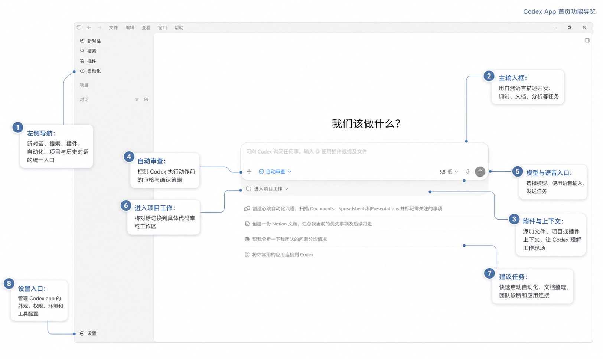
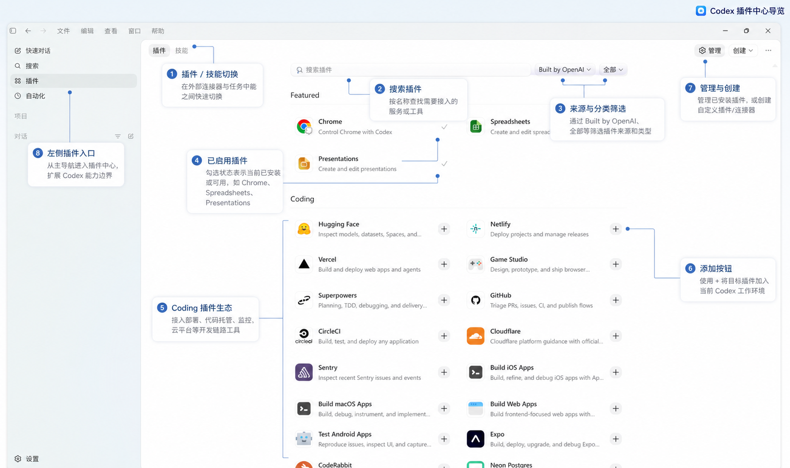
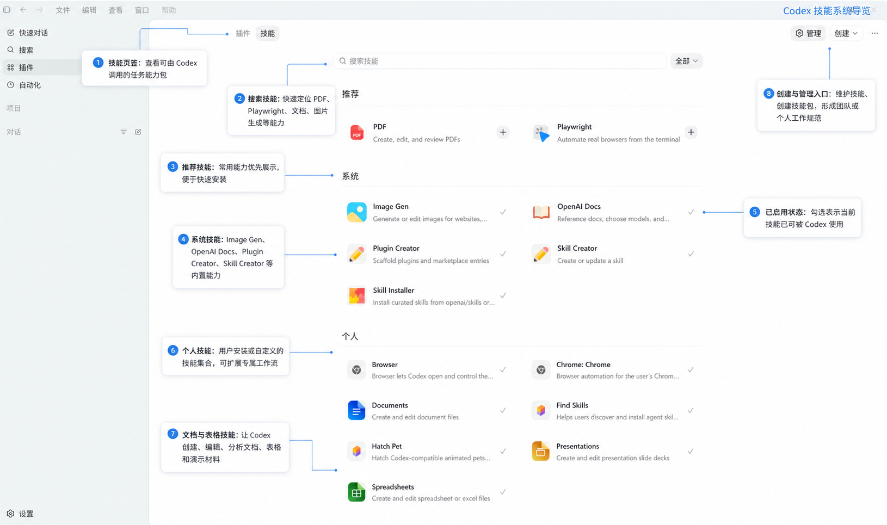
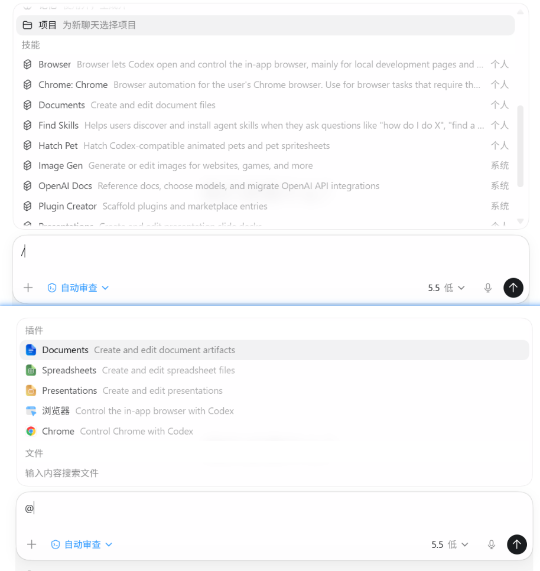
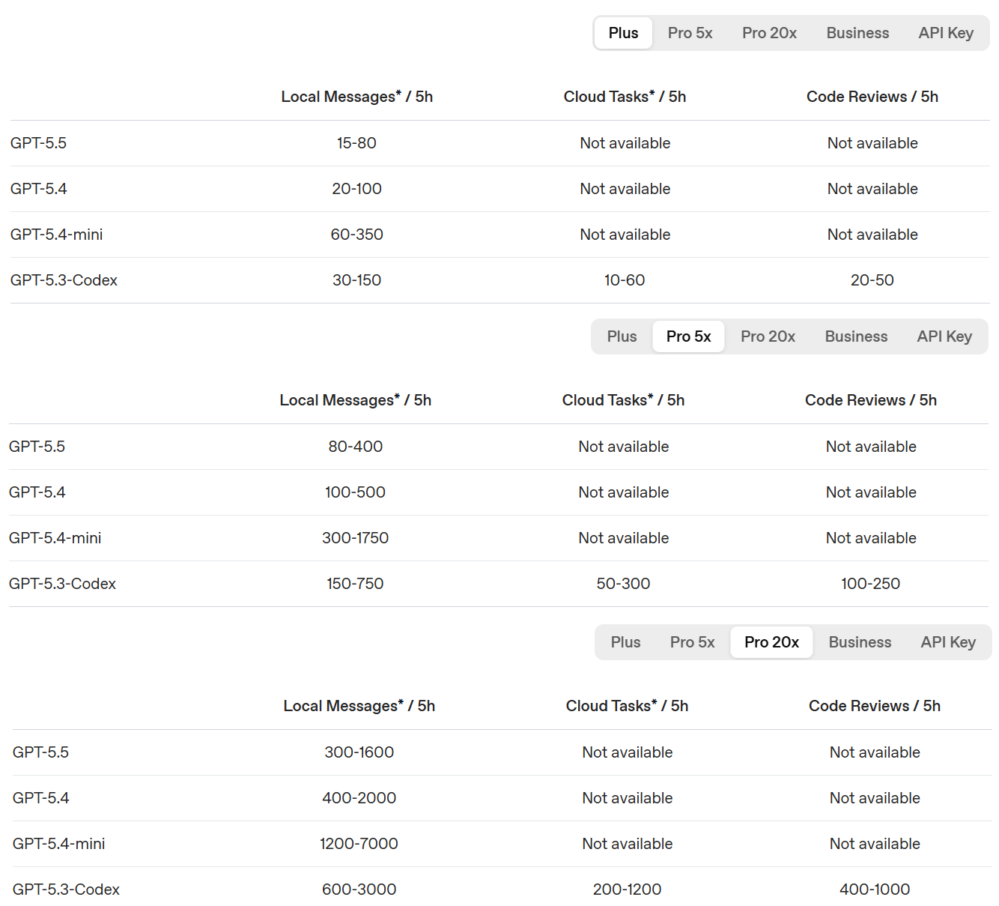

---
tags:
  - codex
  - tools
updated: 2026-05-10
---
## 1 认识Codex
### 1.1 Codex是什么

Codex是OpenAI提供的编程代理，与Claude Code类似，Codex不仅仅是一个能够回答编程问题的聊天机器人，而是一个可以深度参与到真实项目，具备上下文理解、文件读写、运行命令、规划与执行任务的全能型AI Agent。

你可以在多个开发入口调用Codex的Agent能力，包括：
- Codex App；
- IDE Extension；
- Codex CLI；
- Codex Cloud；
- GitHub；
- Slack；
- CI/CD；
- SDK、Agents SDK；

也就是说，Codex的目标不是只存在于某一个编辑器或某一个网页中，而是成为贯穿软件开发流程的智能协作层。

你可以在代码开发流程的任何一个阶段使用它，并享受由Codex带来的极致生产力释放。

### 1.2 Codex开发环境配置

当你购买ChatGPT套餐时，已经默认附带了Codex，ChatGPT官方支持：免费、Go、Plus、Pro四种购买规格。


其中，Plus、Pro套餐均包含了对Codex的可访问和使用权限。

在购买套餐前，请确保你至少能够创建chatgpt账户，它支持通过Google邮箱、Apple账户、国外手机号三种方式去创建。

注意，因为一些政策限制，无法通过国内手机号码创建chatgpt账户，如果你试图创建，则会看到类似如下截图中的报错。


这里推荐Apple ID登录（需要APP Store切区下载chatgpt，下载完后挂梯子登录注册即可），对于没有IPhone设备的，也可以通过使用Google邮箱创建账户，关于Google邮箱申请教程大家可以自行【闲鱼】搜索人工服务。

注册chatgpt账户后，你会发现国内支持的支付方式是无法购买gpt套餐的，这里能够使用的方式就很多了，最快最省事的方法大家可以通过闲鱼自助、搜索代充等等都可以，如果不放心代充等服务，也可以考虑自己购买，这里有一个省钱小Tips，大家可以通过土区购买IPone礼品卡的方式去购买Plus套餐，能够省快一半的钱，因为汇率的原因，土区的Plus套餐会便宜很多，相关教程可参考：[chatgpt_土区购买教程](../coding/chatgpt_土区购买教程.md)。

一切准备就绪后，大家就可以来开启Codex之旅啦，这里先说明下，尽管Codex提供了多种使用方式，但对于新手或者第一次使用Codex的用户，建议从Codex App开始使用，这在体验上会更直观；对于依赖终端工作流或是重度CC迁移过来的用户，可以考虑使用Codex CLI；而如果希望在云端处理任务的，则可以使用Codex Cloud。

接下来依次介绍。

#### 1.2.1 Codex APP

Codex客户端支持在Windows和MacOS系统上使用，首先让我们安装它：
- [Windows下载链接](https://get.microsoft.com/installer/download/9PLM9XGG6VKS?cid=website_cta_psi)
- [MacOS下载链接](https://persistent.oaistatic.com/codex-app-prod/Codex.dmg)

以Windows系统为例，下载完成后，点击运行它会自动从微软应用商店下载Codex应用本体，这里等待下载完成即可。

点击登录，我们选择【使用ChatGPT登录】，这会弹出一个浏览器登录页。

这里选择【继续使用Google登录】，一直下一步即可完成登录。


> 注意，第一次登录Codex时，系统会强制验证手机号，同样国内手机号是无法使用的，这里我们可以使用一些国外短信验证服务，如：[hero-sms](https://hero-sms.com/cn)，使用方便，自助完成短信验证码服务。

登入Codex后，你会看到它的入口界面：


Codex支持项目和对话两种工作空间，通过添加项目来使Codex在你指定的项目下进行工作，或者对于无项目依赖的任务，则通过添加一个新对话来进行。

Codex内置了一套【插件】系统，插件可以理解为一个由提示词、Skills、MCP、脚本或代码等等组件组成的超集，它极大的丰富了模型能力的边界，使得模型能够处理更多事务，并下探以及集成各个应用的工作流。



除此之外，Codex也内置了一些常用的Skills等，Skill指代一些列能够被模型频繁复用的经验或技巧，它可以是一段精心设计的提示词，可以包含代码、脚本，可以包括参考示例等等。



在对话时，我们可以通过反斜杠来使用已经安装过的Skill，使用艾特来使用已经安装过的插件。



关于额度，这里需要注意，Codex的额度显示与常规的Coding工具不太类似，它不是传统的积分或余额的显示模式，而是划定了你在一周或者五小时内可用的额度上限，不同的套餐档位对应不同的上限。

这意味着，你有一个模型调用的限额，每周重置，这一周内可以随意调用，只要额度不为0即可，同时，它还引入了一个5小时的额度上限来限制短时间内的高频调用。

比如，以只调用GPT-5.5为例，假设套餐一周可调用GPT-5.5 High 100次，5小时内可调用GPT-5.5 High 20次，那么你只要保证在使用Codex的每个连续的五小时内不超出20次使用即可。这也意味着，如果你连续5个5小时都使用满了20额度，那么这一周的后续时间将无额度可用。


Codex官方给出了不同套餐价位下的大概用量说明，以供参考：


就先介绍这么多，关于Codex更多的功能说明，大家可以在后续的使用过程中慢慢探索，关于Codex高阶的使用技巧，我会放在后期单独开几篇文章去详细讲解。

#### 1.2.2 Codex CLI

codex-cli推荐通过npm全局安装，安装前先确认Node.js与npm可用：
```powershell
node --version
npm --version
npm config get prefix
```

安装命令：
```powershell
npm install -g @openai/codex
```

安装后验证：
```powershell
codex --version
Get-Command codex
```

如果安装成功，`codex --version`会输出类似：
```text
codex-cli 0.130.0
```

在Windows中，npm全局安装通常会生成以下命令入口，实际路径以`npm config get prefix`输出为准：
```text
<npm-prefix>\codex
<npm-prefix>\codex.cmd
<npm-prefix>\codex.ps1
```

如果已安装codex-cli，也可以使用升级命令：
```powershell
codex --upgrade
```

官方仓库也提供GitHub Release二进制包，在没有npm，或npm没有配置好的机器上，可以从release页面下载适合平台的压缩包，解压后把可执行文件所在目录加入PATH；

参考来源：
- [openai/codex GitHub](https://github.com/openai/codex)；
- [OpenAI Help Center: Codex CLI Getting Started](https://help.openai.com/en/articles/11096431-openai-codex-cli-getting-started)；

安装完成后，在目标项目根目录启动，比如：
```powershell
cd C:\AIWorks\Orin
codex
```

首次启动时按提示登录。官方推荐使用ChatGPT账号登录，以便使用Plus、Pro、Business、Edu或 Enterprise计划中的Codex能力；也可以配置OpenAI API key使用。

> 注意，如果你已经登录的Codex的APP客户端且账户未登出，那么在第一次登录codex-cli时会自动登录你的Codex账户，这样codex-cli在使用时消耗的额度就是Codex的额度，即你充值的chatgpt套餐额度。
> 如果你不想这样做，只想使用codex-cli的能力，但API调用第三方，则需要更改Codex的配置文件，这与Claude Code等的使用方式很类似。

codex-cli的常用模式：
```powershell
codex --suggest
codex --auto-edit
codex --full-auto
```

- `--suggest`：默认模式，适合阅读代码、提出建议、需要人工确认修改的场景；
- `--auto-edit`：允许自动编辑文件，但执行 shell 命令前仍会确认；
- `--full-auto`：允许在受限沙箱里更自主地读写与执行命令，适合长任务或原型验证；

对于未购买官方套餐的用户，或者想在codex-cli使用其它第三方模型服务的用户，可以考虑使用[CCSwitch](https://github.com/farion1231/cc-switch)进行一键切换并管理配置。

比如，可以尝试在Codex的config.toml中写入：

```toml

```


## 2 Codex配置与使用说明

### 2.1 Codex配置文件

Codex的配置体系可以理解为三层：

1. 用户级配置：放在当前用户的Codex Home里，默认是`~/.codex`，在Windows中通常对应`C:\Users\<用户名>\.codex`，用于保存个人长期偏好、登录状态、全局规则、全局技能、MCP等；
2. 项目级配置：放在仓库内的`.codex`目录里，例如`C:\AIWorks\Orin\.codex`，用于保存只对当前项目生效的Codex配置、命令审批规则、hooks等；
3. 项目提示词与技能：项目提示词主要由`AGENTS.md`承载，项目级技能主要放在`.agents/skills`，它们不属于`.codex`目录，但经常会和`.codex`一起构成一个项目的Codex工作流配置；

> 特别注意：Codex支持项目根目录下的`.codex`，但`.codex/rules`里的`rules`不是Claude Code或Cursor那种自然语言项目规则，而是命令执行审批规则。
> 
> 自然语言项目背景、开发规范、写作约束，应该优先写在`AGENTS.md`或`AGENTS.override.md`中；

#### 2.1.1 用户级配置

用户级`.codex`是个人维度的Codex配置目录，适合保存跨项目复用的偏好和能力。

典型位置：
```text
Windows: C:\Users\<用户名>\.codex
macOS/Linux: ~/.codex
```

常见目录结构：
```text
~/.codex/
├── config.toml
├── AGENTS.md
├── AGENTS.override.md
├── rules/
│   └── default.rules
├── hooks.json
└── skills/
    └── <skill-name>/
        ├── SKILL.md
        ├── scripts/
        ├── references/
        ├── assets/
        └── agents/
            └── openai.yaml
```

各文件含义：
- `config.toml`：Codex主配置文件，用于设置默认模型、审批策略、沙盒策略、MCP服务器、profiles、功能开关等；
- `AGENTS.md`：用户级全局自然语言指令，Codex启动时会读取，适合写个人偏好，例如回答风格、默认测试习惯、常用工具选择等；
- `AGENTS.override.md`：用户级临时覆盖指令，如果存在，Codex会优先读取它而不是同级`AGENTS.md`，适合短期切换工作模式；
- `rules/default.rules`：用户级命令审批规则，控制哪些命令可以在沙箱外执行、哪些命令需要询问、哪些命令禁止执行；
- `hooks.json`：用户级生命周期hooks，用于在Codex会话、工具调用、权限请求、停止回复等阶段运行确定性脚本；
- `skills/`：用户级技能目录，适合放个人跨项目复用的工作流技能，例如固定的文档整理流程、数据分析流程、代码审查流程；

用户级配置适合放【**我个人一直想让Codex遵守**】的内容，例如：
- 默认使用某个模型或推理强度；
- 默认启用或禁用Web Search；
- 默认接入常用MCP Server，例如浏览器、Figma、文档检索等；
- 全局命令审批策略；
- 个人写作偏好、工程偏好、回复风格；
- 跨项目复用的skills；

示例`~/.codex/config.toml`：
```toml
model = "gpt-5.5"
approval_policy = "on-request"
sandbox_mode = "workspace-write"
web_search = "cached"

[windows]
sandbox = "elevated"

[features]
codex_hooks = true

[mcp_servers.context7]
command = "npx"
args = ["-y", "@upstash/context7-mcp"]
```

上面示例表示：
1. 默认使用`gpt-5.5`；
2. 当Codex需要越过沙盒或执行敏感操作时走审批；
3. 默认只能写工作区，不直接获得全盘写入权限；
4. Web Search默认使用缓存搜索；
5. Windows下优先使用`elevated`沙盒模式；
6. 开启hooks功能；
7. 配置一个名为`context7`的MCP Server；

#### 2.1.2 项目级配置

项目级`.codex`放在仓库内部，适合保存这个项目独有的Codex运行配置。

推荐结构：
```text
<repo>/
├── .codex/
│   ├── config.toml
│   ├── rules/
│   │   ├── default.rules
│   │   ├── git.rules
│   │   └── package-manager.rules
│   ├── hooks.json
│   └── hooks/
│       ├── pre_tool_use_policy.py
│       ├── post_tool_use_review.py
│       └── stop_validation.py
├── AGENTS.md
└── .agents/
    └── skills/
        └── <repo-skill>/
            └── SKILL.md
```

项目级`.codex`的加载有一个重要前提：项目必须被Codex标记为trusted，即比如在config.toml里设置类似：
```toml
[projects.'xxx']
trust_level = "trusted"
```

对于不可信项目，Codex会跳过项目内`.codex`配置层，包括项目级`config.toml`、`rules`和`hooks`，但用户级配置仍会加载；

项目级`.codex/config.toml`适合放：
- 当前项目专用的模型、审批策略或沙盒策略；
- 当前项目专用的MCP Server；
- 当前项目专用的hooks开关与hooks配置；
- 当前项目专用的profiles；
- 当前项目的工具权限策略；

示例`<repo>/.codex/config.toml`：

```toml
approval_policy = "on-request"
sandbox_mode = "workspace-write"

[features]
codex_hooks = true

[mcp_servers.project-docs]
command = "npx"
args = ["-y", "@modelcontextprotocol/server-filesystem", "notes"]
```

上面示例表示：
1. 当前项目中仍然保留交互式审批；
2. Codex默认只写工作区；
3. 当前项目启用hooks；
4. 当前项目额外接入一个面向`notes`目录的MCP Server；

#### 2.1.3 配置优先级

Codex会从多个位置读取配置。一般情况下，优先级从高到低是：
1. CLI命令行参数和`--config`临时覆盖；
2. 通过`--profile <name>`指定的profile；
3. 项目级`.codex/config.toml`，从项目根目录到当前工作目录逐层读取，越靠近当前目录优先级越高，但仅限trusted项目；
4. 用户级`~/.codex/config.toml`；
5. 系统级配置，例如Unix上的`/etc/codex/config.toml`；
6. Codex内置默认值；

这个优先级适合这样理解：
- 用户级配置解决：我在所有项目里都想这样用Codex；
- 项目级配置解决：这个项目需要特殊规则；
- CLI参数解决：这一次临时这样跑；

#### 2.1.4 config.toml

Codex通过config.toml来管理配置，它支持：
1. 用户级配置：`~/.codex/config.toml`
2. 项目级配置：`.codex/confiig.toml`
不过，项目级配置需要信任项目才生效，这出于安全考虑。

##### 2.1.4.1 常用配置

```toml
# 1. 设置使用的模型
model = "gpt-5.5"

# 控制codex在运行生成的命令之前的行为，支持：
#   untrusted: 只自动执行已知安全的读操作
#   on-request: 需要越界或高风险时询问
#   never: 不弹出审批请求
approval_policy = "on-request"

# 控制网络搜索的模式，支持：
#   cached: 默认值，提供来自openai维护的网页搜索结果缓存
#   live: 从网络获取实时数据
#   disabled: 关闭网页搜索工具
web_search = "live"

# 控制模型推理程度，支持：high、medium、low
model_reasoning_effort = "high"

# 控制模型沟通性格，支持：
#   friendly: 亲和的
#   pragmatic: 务实的
#   none: 不指定
personality = "friendly"

# 控制codex运行时写入的本地日志文件位置
log_dir = "/absolute/path/to/codex-logs"

# codex通过features控制实验性功能是否启用
[features]
shell_snapshot = true
```

Codex支持的特性门控有：

| Key            | 默认值             | 成熟度 | 描述                               |
| -------------- | --------------- | --- | -------------------------------- |
| apps           | false           | 实验性 | 启用ChatGPT应用/连接器支持                |
| codex_hooks    | true            | 稳定  | 启用来自hooks.json或内联hooks的生命周期钩子    |
| fast_mode      | true            | 稳定  | 启用快速模式选择及service_tier = "fast"路径 |
| memories       | false           | 稳定  | 启用记忆功能                           |
| multi_agent    | true            | 稳定  | 启用子代理协作工具                        |
| personality    | true            | 稳定  | 启用个性化选择控件                        |
| shell_snapshot | true            | 稳定  | 快照你的Shell环境以加速重复命令执行             |
| shell_tool     | true            | 稳定  | 启用默认Shell工具                      |
| unified_exec   | true（Windows除外） | 稳定  | 使用统一的PTY支持的执行工具                  |
| undo           | false           | 稳定  | 通过每轮git ghost快照启用撤销功能            |

##### 2.1.4.2 高级配置

Codex的高级配置主要用于解决四类问题：
1. 同一台机器上需要在不同模型、权限、网络策略之间快速切换；
2. 需要把Codex接到OpenAI以外的兼容服务、代理网关、Azure OpenAI、Ollama、LM Studio等模型提供方；
3. 需要控制请求头、鉴权方式、重试、流式超时、模型上下文等运行细节；
4. 需要为团队或长期项目保留审计、观测和安全边界；

官方完整配置项很多，日常更常用、也更值得理解的是下面这些。

**1. Profiles：保存多套配置方案**

`profiles`适合把不同工作模式保存成命名配置，然后通过`codex --profile <name>`切换。

比如一个模式用于日常开发，一个模式用于深度审查，一个模式用于只读分析。

```toml
model = "gpt-5.4"
approval_policy = "on-request"
sandbox_mode = "workspace-write"

[profiles.deep-review]
model = "gpt-5-pro"
model_reasoning_effort = "high"
approval_policy = "on-request"
sandbox_mode = "read-only"

[profiles.fast-edit]
model = "gpt-5.4"
model_reasoning_effort = "medium"
approval_policy = "on-request"
sandbox_mode = "workspace-write"
```

如果想让某个profile成为默认值，可以在顶层写：

```toml
profile = "fast-edit"
```

需要注意，官方文档说明profiles仍属于实验性能力，并且当前不支持Codex IDE Extension，所以更适合CLI用户使用。

**2. 一次性覆盖：临时改配置，不改文件**

有些配置只想在本次运行生效，可以用CLI参数覆盖：

```powershell
codex --model gpt-5.4
codex --config model='"gpt-5.4"'
codex --config sandbox_workspace_write.network_access=true
codex --config 'shell_environment_policy.include_only=["PATH","HOME"]'
```

`--config`后面的值按TOML解析，而不是JSON，嵌套配置可以用点号写法，例如`sandbox_workspace_write.network_access=true`。

**3. API Key与自定义模型提供方**

Codex默认内置`openai`、`ollama`、`lmstudio`等provider ID，自定义provider不能复用这些保留ID，接第三方OpenAI兼容网关、代理服务、Azure OpenAI、Mistral等服务时，通常使用`model_provider`和`[model_providers.<id>]`：

```toml
model = "gpt-5.4"
model_provider = "proxy"

[model_providers.proxy]
name = "OpenAI compatible proxy"
base_url = "https://proxy.example.com/v1"
env_key = "OPENAI_API_KEY"
wire_api = "responses"
```

这里的`env_key`不是直接写API Key，而是告诉Codex从哪个环境变量读取密钥，这样比把真实密钥写进`config.toml`更安全，也更方便在不同机器上复用配置。

如果只是把内置OpenAI provider指向代理、路由或数据驻留域名，官方建议优先使用`openai_base_url`，不要试图覆盖`[model_providers.openai]`：

```toml
openai_base_url = "https://us.api.openai.com/v1"
```

**4. 自定义Headers与命令式鉴权**

如果模型网关要求额外请求头，可以使用`http_headers`或`env_http_headers`：

```toml
[model_providers.proxy]
name = "OpenAI compatible proxy"
base_url = "https://proxy.example.com/v1"
env_key = "OPENAI_API_KEY"
http_headers = { "X-Project" = "orin" }
env_http_headers = { "X-Feature-Flags" = "CODEX_FEATURE_FLAGS" }
```

区别是：
- `http_headers`：明文写入固定header；
- `env_http_headers`：从环境变量读取header值，更适合token、租户标识、实验开关等不宜提交到仓库的值；

如果provider需要通过外部凭据助手动态获取Bearer Token，也可以配置命令式鉴权：

```toml
[model_providers.proxy.auth]
command = "/usr/local/bin/fetch-codex-token"
args = ["--audience", "codex"]
timeout_ms = 5000
refresh_interval_ms = 300000
```

**5. 模型映射、模型目录与本地OSS模式**

当你需要把Codex里选择的模型名和实际provider支持的模型名做适配时，可以使用模型目录相关配置，例如`model_catalog_json`，它可以放在顶层，也可以在profile里覆盖：

```toml
model = "gpt-5.4"
model_catalog_json = "C:\\Users\\<用户名>\\.codex\\model-catalogs\\default.json"

[profiles.deep-review]
model = "gpt-5-pro"
model_catalog_json = "C:\\Users\\<用户名>\\.codex\\model-catalogs\\deep-review.json"
```

如果本地使用Ollama或LM Studio，可以配合`--oss`和`oss_provider`：

```toml
oss_provider = "ollama" # 或 "lmstudio"
```

这类配置适合第三方模型网关、模型别名、模型能力声明不完全一致的场景。

**6. 推理、响应风格与模型限制**

如果某些provider没有完整暴露模型能力，或你希望固定Codex输出风格，可以配置推理、verbosity和上下文窗口：

```toml
model_reasoning_effort = "high"
model_reasoning_summary = "none"
model_verbosity = "low"
model_context_window = 128000
```

其中`model_verbosity`只对使用Responses API的provider生效，Chat Completions provider会忽略它。

**7. Shell环境变量策略**

Codex执行命令时会继承一部分环境变量。为了避免把密钥、云厂商凭据、token等泄露给子进程，可以用`shell_environment_policy`收紧环境变量：

```toml
[shell_environment_policy]
inherit = "core"
ignore_default_excludes = false
exclude = ["AWS_*", "AZURE_*", "*TOKEN*", "*SECRET*"]
include_only = ["PATH", "HOME", "USERPROFILE"]
```

`ignore_default_excludes = false`表示保留Codex默认的敏感变量过滤，对于知识库或开源项目，建议只传必要的`PATH`、`HOME`、`USERPROFILE`等基础变量。

**8. 遥测、观测与匿名指标**

Codex支持两类相关能力：
1. OTel日志导出：默认关闭，需要显式配置`[otel]`；
2. 匿名使用与健康指标：默认开启，可通过`[analytics] enabled = false`关闭；

如果团队希望审计Codex运行、审批、工具调用和API请求，可以启用OTel：

```toml
[otel]
environment = "staging"
exporter = "none"
log_user_prompt = false
```

`log_user_prompt = false`很重要，表示默认不记录用户提示词正文。提示词里可能包含源代码、路径、业务信息或密钥线索，除非团队明确允许，否则不要打开。

如果希望关闭Codex匿名指标：

```toml
[analytics]
enabled = false
```

官方说明匿名指标不包含PII，并且与OTel日志/trace导出相互独立。

**9. 项目根识别与项目级配置加载**

Codex会从当前工作目录向上查找项目根，默认把包含`.git`的目录视为项目根。你可以用`project_root_markers`调整：

```toml
project_root_markers = [".git", ".hg", ".sl"]
```

如果设置为空数组，则不向上查找父目录，而是把当前目录视为项目根：

```toml
project_root_markers = []
```

项目内的`.codex/config.toml`只有在项目被信任时才会加载，未信任项目会忽略项目`.codex`层，包括项目级配置、hooks和rules。

##### 2.1.4.3 沙盒配置

sandbox是Codex的执行边界，用来限制Codex在本机运行命令、读写文件、访问网络时能碰到哪里。理解这一节时，最重要的是把`sandbox_mode`和`approval_policy`分开：
- `sandbox_mode`：决定技术上允许做什么；
- `approval_policy`：决定什么时候必须先问你；

官方文档也强调，Codex本地客户端会通过OS级沙盒限制命令能触碰的范围，并通过审批策略控制什么时候必须暂停并征求授权。

配置位置在：

```toml
sandbox_mode = "workspace-write"
approval_policy = "on-request"

[sandbox_workspace_write]
network_access = false
writable_roots = []
```

**1.`sandbox_mode`的取值**

官方配置参考列出的`sandbox_mode`常见取值是：

```toml
"read-only" | "workspace-write" | "danger-full-access"
```

三种模式区别如下：

**`read-only`：只读模式**

这是最保守的模式。Codex可以读取文件、分析代码、回答问题，但不能直接修改文件或执行会改变状态的操作。适合代码审查、方案讨论、文档阅读、风险分析等场景。

示例：

```toml
sandbox_mode = "read-only"
approval_policy = "on-request"
```

如果Codex确实需要修改文件或运行命令，通常会触发审批；如果审批策略设置成`never`，它就不会弹出请求，而是只能在只读能力内尽力完成。

**`workspace-write`：工作区可写模式**

这是日常开发最常用的模式。Codex可以在当前workspace里读写文件、运行常规本地命令。官方文档说明workspace通常包括当前目录和临时目录，具体范围可以用`/status`查看。

典型配置：

```toml
sandbox_mode = "workspace-write"
approval_policy = "on-request"

[sandbox_workspace_write]
network_access = false
writable_roots = ["D:\\some\\extra\\path"]
```

`[sandbox_workspace_write]`下常见配置包括：

- `network_access`：是否允许沙盒内命令访问网络，默认关闭；
- `writable_roots`：额外允许写入的目录，适合构建缓存、包缓存、临时输出目录等；
- `exclude_tmpdir_env_var`：是否排除`$TMPDIR`指向的临时目录；
- `exclude_slash_tmp`：是否排除`/tmp`；

需要特别注意：即使在`workspace-write`里，也不是workspace内所有内容都一定可写。官方文档列出，默认策略下`<writable_root>/.git`、`.agents`、`.codex`会被递归保护为只读；如果`.git`是`gitdir: ...`指针文件，解析后的真实Git目录也会被保护为只读。

**`danger-full-access`：无沙盒限制模式**

这是最宽松、风险最高的模式。它会移除文件系统和网络边界，让Codex以接近普通终端命令的方式行动。

```toml
sandbox_mode = "danger-full-access"
approval_policy = "never"
```

这组配置等于高权限、高自治：不问你，也不靠sandbox限制它。风险包括修改项目外文件、访问网络、执行破坏性命令、误读或泄露本机敏感信息。只有在隔离环境中才建议使用，例如一次性容器、临时虚拟机、可丢弃测试工作区。官方也把`--dangerously-bypass-approvals-and-sandbox`或`--yolo`归为高风险做法。

**2.`approval_policy`的取值**

`approval_policy`控制Codex什么时候需要向你请求批准。常见取值如下：

```toml
"untrusted" | "on-request" | "never"
```

**`untrusted`：只自动执行已知安全的读操作**

在这个模式下，Codex只会自动运行已知安全的读取类操作。会修改状态、触发外部执行路径或风险更高的命令会要求审批，例如破坏性Git操作，或带配置覆盖、输出执行等风险路径的Git命令，都可能需要批准。

```toml
sandbox_mode = "workspace-write"
approval_policy = "untrusted"
```

这个组合适合你愿意让Codex改文件，但希望它在执行不可信命令前停下来确认的场景。

**`on-request`：需要越界或高风险时询问**

这是日常推荐值。Codex可以在sandbox允许的范围内自动工作，一旦要越过沙盒、访问网络、写workspace外文件、运行需要更高权限的命令，就会请求批准。

```toml
sandbox_mode = "workspace-write"
approval_policy = "on-request"
```

**`never`：不弹出审批请求**

这个模式不会向你要批准。它并不等于高权限，真正的能力边界仍然由`sandbox_mode`决定。

```toml
sandbox_mode = "read-only"
approval_policy = "never"
```

上面这组配置的含义是：Codex不会问你，也不能改文件，只能在只读范围内完成任务。

```toml
sandbox_mode = "danger-full-access"
approval_policy = "never"
```

而这组配置高权限且不询问，风险最大。

**3. 细粒度审批与自动审批审查**

如果希望某些审批类别继续交互确认，另一些类别直接拒绝，可以使用granular policy：

```toml
approval_policy = { granular = {
  sandbox_approval = true,
  rules = true,
  mcp_elicitations = true,
  request_permissions = false,
  skill_approval = false
} }
```

这些字段可以分别控制：
- `sandbox_approval`：沙盒越界审批；
- `rules`：`.codex/rules`中的命令审批；
- `mcp_elicitations`：MCP工具发起的用户确认；
- `request_permissions`：模型主动请求放宽权限；
- `skill_approval`：skill脚本审批；

如果想让符合条件的审批先交给自动审查器评估，而不是全部直接弹给用户，可以配置：

```toml
approval_policy = "on-request"
approvals_reviewer = "auto_review"
```

自动审查不会改变sandbox边界，它只是在本来就需要审批的动作上增加一道模型审查，动作仍可能被批准、拒绝、超时或失败关闭。

**4. 网络访问与Web Search不是一回事**

Codex默认关闭本地命令的网络访问，对于Codex App、CLI、IDE Extension，在`workspace-write`模式下可以这样开启：

```toml
sandbox_mode = "workspace-write"

[sandbox_workspace_write]
network_access = true
```

这允许沙盒内命令访问网络，例如安装依赖、调用接口、下载包等。

但`web_search`是另一层能力，它控制Codex的网页搜索工具，不等同于给本地命令开放网络：

```toml
web_search = "cached"   # 默认，使用OpenAI维护的搜索缓存
# web_search = "live"   # 实时联网搜索
# web_search = "disabled"
```

注意，开启网络访问或实时Web Search都要谨慎，因为网页内容可能携带prompt injection，诱导代理执行不可信指令。

**5. 命名权限Profile：更细的文件与网络边界**

除了`sandbox_mode`，Codex还支持命名权限profile。内置profile包括：

```toml
default_permissions = ":read-only"
default_permissions = ":workspace"
default_permissions = ":danger-no-sandbox"
```

也可以自定义profile，例如允许写项目，但禁止读取`.env`：

```toml
default_permissions = "workspace"

[permissions.workspace.filesystem]
":project_roots" = { "." = "write", "**/*.env" = "none" }
glob_scan_max_depth = 3
```

其中`"none"`表示Codex不应读取匹配路径。这个配置适合项目可写，但`.env`、私钥、凭据文件必须完全不可读的场景。

如果还希望限制网络域名，可以配合网络权限profile：

```toml
default_permissions = "workspace"

[permissions.workspace.network]
enabled = true
mode = "limited"

[permissions.workspace.network.domains]
"api.openai.com" = "allow"
```

**6. Windows、WSL2、容器中的沙盒边界**

Codex在不同系统上的沙盒实现不同：
- macOS使用Seatbelt策略；
- Linux默认使用`bwrap`和`seccomp`；
- Windows原生运行时使用Windows sandbox实现；
- Windows上的WSL2使用Linux沙盒语义；

Windows原生运行时可以配置：

```toml
[windows]
sandbox = "unelevated" # 或 "elevated"
# sandbox_private_desktop = true
```

如果在VS Code的Codex IDE Extension里使用Windows，官方建议可以让Codex优先在WSL2中运行：

```json
{
  "chatgpt.runCodexInWindowsSubsystemForLinux": true
}
```

如果在Docker或Dev Container里运行，外层容器本身也会成为安全边界。官方建议：如果宿主或容器配置无法支持Linux sandbox所需的namespace、setuid `bwrap`或`seccomp`，就应该让容器提供隔离，然后在容器内使用`danger-full-access`，但这只适合可信仓库和隔离环境。参考：[OS-level sandbox](https://developers.openai.com/codex/agent-approvals-security#os-level-sandbox)。

**7. 常见场景配置组合**

日常开发，推荐默认：

```toml
sandbox_mode = "workspace-write"
approval_policy = "on-request"
```

含义：Codex可以在项目内读写和运行命令；越界、联网、高风险操作需要确认。

只读审查、解释代码、整理方案：

```toml
sandbox_mode = "read-only"
approval_policy = "on-request"
```

含义：以阅读和分析为主；真要修改或执行命令时会询问。

CI或无人值守只读检查：

```toml
sandbox_mode = "read-only"
approval_policy = "never"
```

含义：不会弹审批，也不会修改文件；适合非交互式分析。

允许自动改文件，但运行不可信命令前询问：

```toml
sandbox_mode = "workspace-write"
approval_policy = "untrusted"
```

含义：文件编辑更顺滑，命令执行更保守。

需要联网安装依赖，但仍限制在workspace内：

```toml
sandbox_mode = "workspace-write"
approval_policy = "on-request"

[sandbox_workspace_write]
network_access = true
```

含义：允许沙盒内命令联网；适合安装依赖、拉包、访问测试API，但要意识到网络内容有prompt injection风险。

带自动审查的日常开发：

```toml
sandbox_mode = "workspace-write"
approval_policy = "on-request"
approvals_reviewer = "auto_review"
```

含义：需要审批的动作先交给自动审查器评估；低风险请求可减少打断，高风险请求仍会被拦截或要求明确授权。

完全自动化且环境可丢弃：

```toml
sandbox_mode = "danger-full-access"
approval_policy = "never"
```

含义：无沙盒、无审批，不推荐在真实个人工作区使用，只适合一次性容器、临时VM、可重建测试目录。

一句话总结：**`sandbox_mode`是Codex的活动边界，`approval_policy`是Codex的刹车方式。**

日常最推荐`workspace-write + on-request`，只读审查用`read-only + on-request`，无人值守读任务用`read-only + never`，`danger-full-access + never`只放进可丢弃隔离环境。

#### 2.1.4 `.codex/rules`

`.codex/rules`用于命令执行审批，而不是项目背景说明。

规则文件放在活动配置层旁边的`rules/`目录下，文件扩展名是`.rules`：

```text
~/.codex/rules/default.rules
<repo>/.codex/rules/default.rules
```

示例：

```text
prefix_rule(
    pattern = ["git", "status"],
    decision = "allow",
    justification = "Reading git status is safe",
    match = [
        "git status",
        "git status --short",
    ],
)

prefix_rule(
    pattern = ["git", "push"],
    decision = "prompt",
    justification = "Pushing changes should be confirmed",
    match = [
        "git push",
        "git push origin main",
    ],
)

prefix_rule(
    pattern = ["Remove-Item"],
    decision = "prompt",
    justification = "File deletion should be reviewed before execution",
)
```

字段含义：
- `pattern`：命令前缀匹配规则，按参数列表匹配；
- `decision`：匹配后的处理方式，常见值包括`allow`、`prompt`、`forbidden`；
- `justification`：规则存在的原因，Codex可能会在审批提示里展示；
- `match`：正向样例，用于验证规则应该匹配哪些命令；
- `not_match`：反向样例，用于验证规则不应该匹配哪些命令；

适合写入`.codex/rules`的内容：
- 允许安全只读命令自动执行，例如`git status`、`rg`、`Get-ChildItem`；
- 对发布、推送、部署、安装依赖等命令要求确认；
- 禁止高风险命令或组织明确不允许的命令；

不适合写入`.codex/rules`的内容：
- 项目背景；
- 代码风格；
- 文档写作规范；
- 任务完成后需要git commit这类自然语言工作约定；
- AI应该如何理解项目上下文；

这些自然语言约定应该写入`AGENTS.md`；

#### 2.1.5 `AGENTS.md`

`AGENTS.md`是Codex的项目说明与自定义指令文件，适合承载Claude Code/Cursor中rules那类自然语言约定。

Codex启动时会读取`AGENTS.md`，并按层级合并：
1. 用户级Codex Home中的`AGENTS.override.md`或`AGENTS.md`；
2. 项目根目录的`AGENTS.override.md`或`AGENTS.md`；
3. 从项目根目录到当前工作目录之间，每一层目录里的`AGENTS.override.md`或`AGENTS.md`；

同一目录中，如果`AGENTS.override.md`存在，则优先使用它，越靠近当前工作目录的指令越晚进入上下文，因此更适合承载局部规则。

推荐写入`AGENTS.md`的内容：
- 项目是什么，目标是什么；
- 目录结构说明；
- 文档命名、frontmatter、标题层级等知识库规范；
- 代码风格、测试要求、提交要求；
- 任务完成后的交付习惯；
- 不希望Codex触碰的文件或目录；

以项目Orin为例，根目录`AGENTS.md`应该保留为Codex项目入口，因为它会被Codex自动发现。若希望把规则拆细，可以使用下面这种方式：

```text
Orin/
├── AGENTS.md
├── notes/
│   └── AGENTS.md
├── code/
│   └── AGENTS.md
└── rag/
    └── AGENTS.md
```

其中：
- 根目录`AGENTS.md`：写Orin整体目标、目录结构、通用写作规则、git commit要求；
- `notes/AGENTS.md`：写Obsidian笔记规范、frontmatter规范、标题与引用规范；
- `code/AGENTS.md`：写代码脚本规范、测试规范、依赖管理规范；
- `rag/AGENTS.md`：写RAG语料处理、embedding、索引、评测规范；

这种组织方式比把自然语言规则塞进`.codex/rules`更符合Codex机制；

#### 2.1.6 `.agents/skills`

Codex的技能目录不是`.codex/skills`，而是`.agents/skills`。

技能是一种可复用工作流，一个技能至少包含一个`SKILL.md`，也可以包含脚本、参考资料、模板资产和UI元数据。

典型结构：
```text
<repo>/
└── .agents/
    └── skills/
        └── obsidian-note-normalizer/
            ├── SKILL.md
            ├── scripts/
            │   └── normalize_frontmatter.py
            ├── references/
            │   └── orin-note-style.md
            ├── assets/
            │   └── note-template.md
            └── agents/
                └── openai.yaml
```

各目录含义：
- `SKILL.md`：必需，写技能名称、触发描述和执行步骤；
- `scripts/`：可选，放技能执行过程中会调用的脚本；
- `references/`：可选，放较长的参考资料，Codex只在需要时读取；
- `assets/`：可选，放模板、素材、样例文件；
- `agents/openai.yaml`：可选，用于配置Codex App中的技能展示信息、依赖或调用策略；

`SKILL.md`示例：
```markdown
---
name: obsidian-note-normalizer
description: Use when normalizing Orin Obsidian notes with YAML frontmatter, numbered headings, tags, updated date, and semicolon-ending list punctuation.
---

# Obsidian Note Normalizer

When this skill is used, normalize Markdown notes for Orin:

1. Preserve the author's original meaning;
2. Add or update YAML frontmatter;
3. Keep headings numbered and searchable;
4. Prefer concise H2 navigation with limited H3 usage;
5. Ensure list items end with semicolons when appropriate;
```

适合做成项目级skills的内容：
- 重复出现的笔记清洗流程；
- 固定的RAG语料入库流程；
- 固定的日报、周报、复盘模板；
- 固定的代码审查流程；
- 固定的数据处理或导出流程；

不适合做成skills的内容：
- 一两句话就能写清楚的项目背景；
- 只对单次任务有效的临时要求；
- 安全审批规则，这类应放入`.codex/rules`；

#### 2.1.7 `.codex/hooks`

Hooks用于在Codex生命周期中运行确定性脚本，例如在工具调用前做安全检查、在任务结束时做格式校验、在用户提交prompt时做脱敏检测等。

启用hooks需要在`config.toml`里打开功能开关：

```toml
[features]
codex_hooks = true
```

Hooks可以写在：
```text
~/.codex/hooks.json
~/.codex/config.toml
<repo>/.codex/hooks.json
<repo>/.codex/config.toml
```

推荐项目级结构：
```text
<repo>/
└── .codex/
    ├── config.toml
    ├── hooks.json
    └── hooks/
        ├── pre_tool_use_policy.py
        ├── post_tool_use_review.py
        └── stop_validation.py
```

示例`hooks.json`：
```json
{
  "hooks": {
    "Stop": [
      {
        "hooks": [
          {
            "type": "command",
            "command": "python .codex/hooks/stop_validation.py",
            "timeout": 30,
            "statusMessage": "Validating final state"
          }
        ]
      }
    ]
  }
}
```

常见hook事件包括：
- `SessionStart`：会话开始或恢复时触发；
- `PreToolUse`：工具调用前触发；
- `PermissionRequest`：权限请求时触发；
- `PostToolUse`：工具调用后触发；
- `UserPromptSubmit`：用户提交prompt时触发；
- `Stop`：Codex准备停止本轮回复时触发；

Hooks适合做确定性检查，不适合写大段自然语言偏好。例如：
- 检查prompt或文件中是否误包含密钥；
- 在Stop阶段检查Markdown frontmatter是否存在；
- 在PostToolUse阶段记录命令执行日志；
- 在PreToolUse阶段拦截高风险命令；

#### 2.1.8 MCP配置

MCP用于给Codex接入外部工具和上下文，例如浏览器、Figma、文档检索、数据库、内部知识库等。

MCP配置写在`config.toml`中：
```toml
[mcp_servers.context7]
command = "npx"
args = ["-y", "@upstash/context7-mcp"]
env_vars = ["LOCAL_TOKEN"]

[mcp_servers.internal-docs]
url = "https://mcp.example.com"
bearer_token_env_var = "INTERNAL_DOCS_TOKEN"
```

常见字段：
- `command`：STDIO MCP Server的启动命令；
- `args`：启动参数；
- `env`：直接写入的环境变量；
- `env_vars`：允许从本地或远程环境转发的环境变量名；
- `cwd`：MCP Server启动目录；
- `url`：Streamable HTTP MCP Server地址；
- `bearer_token_env_var`：从环境变量读取Bearer Token；
- `enabled`：是否启用该MCP Server；
- `required`：该MCP Server不可用时是否让Codex启动失败；
- `enabled_tools`：工具白名单；
- `disabled_tools`：工具黑名单；

用户级MCP适合放我所有项目都要用的工具，例如通用浏览器、通用文档检索；项目级MCP适合放“只服务当前项目”的工具，例如当前项目数据库、当前项目文件检索、当前项目内部API；
