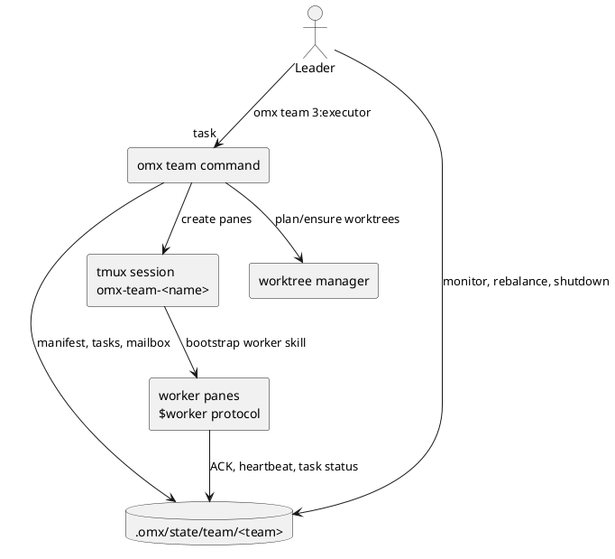

## 1. 什么是OMX？

`oh-my-codex`，简称OMX，是构建在OpenAI Codex CLI之上的工作流层。

简单来说，
- Codex负责读代码、改代码、运行命令、做模型推理、处理审批等；
- OMX负责把常见的工程性工作沉淀成可复用流程，比如澄清需求、制定计划、持续执行、多人并行、自动评审、记录状态、恢复长任务等等；

**Codex原生能力偏【我现在帮你做这个任务】，OMX偏【我用一套稳定流程持续把这个任务做完整、做好，并留下状态、日志和恢复点】，OMX拓展了Codex的执行力、可控性以及可追溯能力。**

在日常使用时，OMX可以被这么使用：

```text
$deep-interview "先把需求问清楚"
$ralplan "把需求变成可批准计划"
$ralph "按计划持续执行到完成"
```

当任务明显可拆、需要并行时，也可以启用team模式：

```text
$team 3:executor "并行执行这个已批准计划"
```

### 2. OMX架构设计

OMX遵循Codex first的设计原则，它的核心设计不是另起一个agent平台，而是让Codex CLI继续负责会话、工具、模型和执行。

而OMX只做三件事：
1. 在启动前把必要的Codex配置、AGENTS、技能、prompt和hook准备好；
2. 在运行中把复杂任务路由到技能、native agent、team runtime或持久状态；
3. 在运行后通过doctor、hook、日志和`.omx/`状态做可恢复、可诊断的闭环；

在安装OMX后，它会覆盖你安装位置下的AGENTS.md，其内容主要是它需要告诉Codex关于OMX的Skill怎么触发、默认工作流是什么、遇到复杂任务怎么规划和验证、什么时候不要乱并行等规则、引导和限制。

如果没有这层指导，很多OMX能力就只能靠用户每次手动解释，效果发挥不佳。

注意，这里OMX默认安装到你的用户目录，此时会覆盖用户目录的AGENTS.md，如果你不希望它被覆盖，可考虑使用`AGENTS.override.md`，在用户级或项目级放置override文件，可以临时覆盖同层AGENTS指导，移除override后恢复原来的AGENTS指导。

亦或者，可以考虑只把OMX安装到某个你要运行或开发的项目下，以不污染全局Codex环境。

同时，安装OMX后，它会自动更新你的config.toml配置，包括启用需要的能力、hooks配置、状态栏配置、默认模型/推理强度、MCP兼容服务开关等；

除上述内容外，OMX内还有几个关键的设计，接下来逐一说明。

### 2.1 状态管理

状态管理可以理解为OMX的外部记忆和运行账本。普通的一轮Codex对话主要依赖当前上下文，而OMX希望支持更长、更复杂的工程流程：任务可能跨多个回合、跨多个worker、跨多次启动继续推进，因此它不能只把状态放在模型上下文里，而是要把关键运行态写到项目目录下，供CLI、Hooks、MCP Server、doctor和后续会话共同读取。

这里的状态不是用户源码的一部分，而是OMX为了管理流程产生的工作状态。它通常回答这些问题：
- 当前是否有某个OMX工作流处于active状态，例如`ralph`、`team`、`ultragoal`等；
- 当前任务进行到了哪一步，是否已经完成、阻塞、失败或等待用户；
- team worker是否已经ACK、是否有心跳、正在处理哪个任务、任务结果是什么；
- hooks是否触发过，是否写入过日志，是否需要继续执行某个未完成流程；
- wiki、goal、performance等长期工作流是否有可恢复的artifact；

OMX将任务的运行态数据外置到`.omx/`：
- `.omx/state/`保存mode、team、HUD、session、hook、通知等状态；
- `.omx/logs/` 保存hook dispatch、运行日志等；
- `.omx/ultragoal`、`.omx/performance-goal`等保存 goal类工作流artifact；
- `omx_wiki/`保存项目wiki；

这样做的收益是可恢复、可审计、可由MCP/CLI/doctor共同读取；

### 2.2 OMX Hooks

Hooks可以理解为Codex生命周期里的自动触发点。OMX把一组受管理的Hooks注册给Codex，是为了在Codex工作的关键时刻自动做记录、提醒、续跑、状态同步和安全检查。它不是一个需要用户每天手动调用的功能，而是OMX让`$ralph`、`$team`、`$wiki`、通知、状态恢复等能力能持续运转的底层机制。

OMX注册到Codex的Hooks主要包括以下几类：

| Hook事件 | 触发时机 | OMX通常做什么 | 目的 |
| --- | --- | --- | --- |
| `SessionStart` | Codex会话启动时； | 初始化或刷新会话状态，恢复必要的OMX上下文，必要时注入项目wiki摘要或启动上下文； | 让一次新会话知道当前项目里是否已有OMX状态、wiki和运行约定； |
| `UserPromptSubmit` | 用户提交提示词后、模型正式处理前； | 识别`$ralph`、`$team`、`$ralplan`等OMX关键字，写入skill激活状态，必要时增加提示路由建议； | 让显式的`$skill`调用变成可追踪的工作流状态，而不是普通文本； |
| `PreToolUse` | Codex准备调用工具前，当前主要针对Bash/命令类工具； | 做危险命令、提交规范、文档刷新等提醒或拦截； | 在工具真正执行前降低误操作、错误提交和流程遗漏风险； |
| `PostToolUse` | 工具调用结束后； | 根据命令结果补充诊断，例如命令不存在、权限不足、路径错误、MCP连接异常等； | 把工具失败转成更可执行的修复建议，而不是只留下原始报错； |
| `Stop` | 一轮回复准备结束时； | 判断某些OMX工作流是否真的完成；如果`ralph`、`autopilot`、`ultrawork`、`ultraqa`、`team`等仍未终止，可能阻止停止并要求继续； | 让长任务不会因为一轮回复结束就草草停下，形成“持续推进直到完成”的能力； |
| `PostCompact` | Codex上下文压缩后； | 记录压缩事件，保持状态一致，避免压缩后工作流丢失关键运行线索； | 支持长会话在上下文压缩后继续可恢复地推进； |

可以用一句话概括：Skill告诉Codex这类任务应该怎么做，Hooks负责在关键节点提醒Codex现在该记录、检查、继续或收尾。

因此，读懂Hooks不需要记住每个内部细节，只要理解它们解决的是跨回合持续性、自动检查、状态恢复和运行证据的问题即可。

### 2.3 OMX Team runtime

`$team`和`omx team`面向大型任务的并行执行。它不是简单地开多个Codex，而是建立共享任务状态：



该执行流可以按以下顺序理解：

1. Leader发起团队任务；
   Leader可以是当前主Codex会话，也可以是用户在终端中直接运行的OMX命令。它负责定义大目标、指定worker数量和角色，例如`3:executor`表示启动3个执行型worker；
2. OMX创建或确认团队运行环境；
   OMX会为这次team任务建立团队状态目录，写入manifest、任务列表、worker信息、mailbox等。这样每个worker不是“各做各的”，而是在同一个共享任务账本上协作；
3. Worktree manager准备隔离工作区；
   worktree可以理解为同一个Git仓库的另一个工作目录。它允许多个worker在相互隔离的目录里并行修改代码，减少直接抢同一份工作区导致的冲突；
4. tmux session承载多个worker pane；
   tmux是终端复用器，可以在一个后台会话里开多个pane/window，并让进程在终端关闭后仍可继续运行。OMX用tmux让多个Codex worker长期存在、可观察、可恢复；
5. worker启动后读取任务并ACK；
   每个worker会通过`$worker`协议确认自己已启动，然后从共享任务状态或mailbox中领取任务，定期写heartbeat、status和结果；
6. Leader监控、重分配和收尾；
   Leader会读取team状态，判断哪些worker完成、哪些阻塞、哪些需要重分配。任务完成后，再做汇总、验证、必要的合并或后续清理；

`$team`和`omx team`的区别在于入口不同：
- `$team`是在Codex对话中调用的Skill入口。它更适合“我正在和Codex协作，现在希望它按OMX团队工作流来拆分和调度任务”的场景；
- `omx team`是终端CLI入口。它更像运维/操作命令，适合直接启动、查看、恢复或关闭某个team runtime，例如`omx team status <team-name>`、`omx team resume <team-name>`、`omx team shutdown <team-name>`；

简单说，`$team`偏“让Codex按团队协作流程做这件事”，`omx team`偏“在终端层面管理这套团队运行时”。

### 2.4 OMX MCP

OMX内置的MCP Server主要是为了给Codex或其他MCP客户端提供**读取OMX状态、项目知识、运行轨迹和协调信息**的兼容入口。

默认情况下，OMX更推荐CLI-first使用方式；只有当你明确需要MCP兼容或外部客户端接入时，才需要启用first-party MCP。

常见的OMX MCP Server包括：

| MCP Server | 作用 |
| --- | --- |
| `omx_state` | 读取或写入OMX mode state，例如当前是否有active工作流、某个工作流处于什么阶段； |
| `omx_memory` | 提供项目记忆相关能力，让长期项目知识可以被MCP客户端读取和复用； |
| `omx_code_intel` | 提供代码智能相关能力，例如诊断、代码结构查询、面向工具的代码理解入口； |
| `omx_trace` | 提供运行轨迹、agent流转、事件时间线和统计信息，适合排查复杂任务如何被推进； |
| `omx_wiki` | 读取和查询项目wiki，适合把项目知识库暴露给支持MCP的客户端； |
| `omx_hermes` | 提供协调、dispatch、artifact等能力，偏向多agent协作和状态中转； |

对普通用户来说，先掌握`omx doctor`、`omx exec`、`$ralph`、`$team`、`$wiki`这些CLI/Skill入口即可。MCP更像把OMX内部状态和项目知识开放给其他工具的桥接层。

## 3. OMX使用说明

OMX适合已经使用OpenAI Codex CLI，但希望获得更强默认工作流的人：
- 需求澄清、计划、执行、review 有统一入口；
- 大任务可用 `$team` 或 `$ralph` 持久推进；
- 技能、提示词、native agents、hooks、HUD、MCP兼容服务可统一安装和诊断；
- 项目运行状态能保存在`.omx/`，便于恢复和排查；

注意，OMX的默认推荐环境是macOS/Linux + Codex CLI。

原生Windows和Codex App不是OMX推荐的默认路径，team/tmux类能力在 Windows上更容易遇到兼容问题；

### 3.1 安装

必需项：
- Node.js 20+；
- OpenAI Codex CLI且可正常使用；

安装命令：
```bash
npm install -g @openai/codex oh-my-codex
```

如果要使用`$team` 或 `omx team`的推荐持久运行时，需要tmux类工具：

| 平台             | 推荐                                   |
| -------------- | ------------------------------------ |
| macOS          | `brew install tmux`                  |
| Ubuntu/Debian  | `sudo apt install tmux`              |
| Fedora         | `sudo dnf install tmux`              |
| Arch           | `sudo pacman -S tmux`                |
| Windows        | `winget install psmux`，但Windows是次要路径 |
| Windows + WSL2 | WSL2内安装`tmux`更推荐                     |

全局安装后运行：
```bash
omx setup
```

如果你希望显式使用plugin mode：
```bash
omx setup --plugin
```

如果你希望项目内安装而不是用户级安装：
```bash
omx setup --scope project
```

安装完成后，验证安装形状：
```bash
omx doctor
```

特别说明，OMX在安装时支持Legacy setup和Plugin setup两种方式，其中：

Legacy setup mode直接把文件安装到Codex root：
- skills复制到 `.codex/skills` 或 `~/.codex/skills`；
- prompts复制到 `.codex/prompts` 或 `~/.codex/prompts`；
- native agents生成到 `.codex/agents` 或 `~/.codex/agents`；
- hooks写入 `.codex/hooks.json` 或 `~/.codex/hooks.json`；

命令：
```bash
omx setup --legacy
```

Plugin setup mode使用Codex plugin discovery提供skills：
- 注册local marketplace；
- 启用`oh-my-codex`plugin；
- skills来自`plugins/oh-my-codex/skills/`；
- legacy OMX-managed prompts/native agents会被清理或归档，避免旧prompt shadow plugin行为；
- hooks/config/HUD/runtime state仍由setup管理；

命令：
```bash
omx setup --plugin
```


### 3.2 启动

可以直接按如下命令启动：

```bash
omx --madmax --high
```

含义：
- `--high`：以 high reasoning 启动 Codex；
- `--madmax`：危险模式，等价于绕过 approvals 和 sandbox，适合你明确接受风险的本地工程环境；
- 默认在支持的交互式 macOS/Linux terminal 中优先使用 OMX-managed detached tmux，这样 HUD/runtime panes 可创建和恢复；

也可以选择直接启动，不使用OMX tmux/HUD管理：

```bash
omx --direct --yolo
```

也可以设置环境变量：

```bash
OMX_LAUNCH_POLICY=direct omx --yolo
```

可选值：
- `auto`；
- `direct`；
- `tmux`；
- `detached-tmux`；

`--yolo`可以理解为让Codex进入更少确认、更偏自动推进的运行模式。它适合你已经信任当前任务和当前目录，希望减少交互式审批打断的场景；但它也意味着误执行命令、误改文件的风险更高。若只是想提高推理强度，用`--high`即可；只有在你明确接受更高自动化风险时，再使用`--yolo`或更激进的`--madmax`。

或者，可以通过非交互执行方式启动：

```bash
omx exec --skip-git-repo-check -C . "Reply with exactly OMX-EXEC-OK"
```

`omx exec`用于非交互任务，会注入OMX overlay/model instructions，并能和hooks、state、follow-up注入配合；

### 3.3 常用工作流

**标准路径：**

```text
$deep-interview "clarify the authentication change"
$ralplan "approve the auth plan and review tradeoffs"
$ralph "carry the approved plan to completion"
```

解释：
1. `$deep-interview`：当需求、边界、非目标不清楚时先问清楚；
2. `$ralplan`：把澄清后的目标变成可批准的实现计划；
3. `$ralph`：按批准计划持续推进到完成，并关注验证证据；


**并行执行路径：**

```text
$team 3:executor "execute the approved plan in parallel"
```

适合：
- 大任务可拆分；
- 多个文件/模块可以并行；
- 需要 worker 心跳、任务分派、mailbox、状态恢复；

不适合：
- 小改动；
- 强耦合、下一步依赖很重的任务；
- 没有tmux/psmux或环境不稳定的场景；


**全自动闭环：**

```text
$autopilot "implement the feature and keep reviewing until clean"
```

`$autopilot`的心智模型是：

```text
$ralplan -> $ralph -> $code-review
```

如果review不干净，则回到计划或修复循环；

还有一些日常推荐的使用习惯如：
1. 新项目先运行`omx doctor`；
2. 复杂需求先`$deep-interview`，再`$ralplan`；
3. 小到中型任务用`$ralph`；
4. 明显可拆的大任务才用`$team`；
5. 涉及UI/视觉时用`$design`或`$visual-ralph`；
6. 完成后用`$code-review`或verifier思路检查证据；
7. 安装或升级后用`omx exec ... OMX-EXEC-OK`做真实执行烟测；

### 3.4 常用CLI命令

| 命令 | 用途 |
| --- | --- |
| `omx setup` | 安装或刷新 skills、config、hooks、AGENTS、prompts/native agents； |
| `omx setup --plugin` | 使用 Codex plugin discovery 交付 OMX skills； |
| `omx update` | 检查 npm 最新版本并刷新 setup； |
| `omx doctor` | 安装健康检查； |
| `omx doctor --team` | team runtime 健康检查； |
| `omx list` | 列出 packaged skills 与 native agent prompts； |
| `omx list --json` | 输出可机器读取的 catalog； |
| `omx exec ...` | 非交互 Codex 执行； |
| `omx team ...` | 启动/管理 tmux 团队运行时； |
| `omx team status <name>` | 查看团队状态； |
| `omx team resume <name>` | 恢复团队； |
| `omx team shutdown <name>` | 关闭团队； |
| `omx hud --watch` | 查看 HUD； |
| `omx wiki ...` | 操作项目 wiki； |
| `omx mcp-serve <target>` | 启动 first-party MCP server； |
| `omx sparkshell ...` | 原生命令检查或 tmux pane 摘要； |
| `omx explore --prompt "..."` | 只读代码库探索； |
| `omx cancel` | 取消 active OMX modes； |
| `omx uninstall` | 移除 OMX-managed 配置； |

### 3.5 MCP compat mode

CLI-first指的是：日常使用OMX时，优先通过`omx`命令和`$skill`工作流完成操作，例如`omx doctor`、`omx exec`、`$ralph`、`$team`、`$wiki`。这种方式最直接，也最接近OMX的默认使用路径。

first-party MCP指的是：OMX自己提供的一组MCP Server，例如`omx_state`、`omx_wiki`、`omx_trace`等。它们不是第三方MCP，而是OMX项目自带的兼容服务，用来把OMX状态、wiki、trace、memory等能力暴露给支持MCP的客户端。

默认CLI-first，不启用first-party MCP server：

```bash
omx setup --mcp none
```

如果需要兼容MCP clients或显式暴露OMX first-party MCP：

```bash
omx setup --with-mcp
```

### 3.6 OMX内置Skills

OMX内置了近30个左右的Skills，它们适合不同的使用常见，如：

| 场景                       | 推荐Skill                   | 示例                                        |
| ------------------------ | ------------------------- | ----------------------------------------- |
| 需求很模糊，只知道“大概想改登录”；       | `$deep-interview`；        | `$deep-interview "澄清登录重构目标、边界和不做什么"`；     |
| 已经知道目标，但需要计划和风险评估；       | `$ralplan`；               | `$ralplan "为登录重构制定可执行计划，列出风险和验证方式"`；      |
| 计划已经批准，希望一直做到完成；         | `$ralph`；                 | `$ralph "按已批准计划完成登录重构，并给出验证证据"`；          |
| 有多个模块可并行改；               | `$team`；                  | `$team 3:executor "并行完成三个独立模块的迁移"`；       |
| 想让 Codex 自动执行、评审、不干净就返工； | `$autopilot`；             | `$autopilot "实现这个小功能，直到 code review 干净"`； |
| 需要只读分析复杂代码库；             | `$analyze`；               | `$analyze "解释请求从入口到数据库的完整流转"`；            |
| 要做 UI/视觉对齐；              | `$visual-ralph`；          | `$visual-ralph "按这个截图实现页面，并用截图证据迭代"`；     |
| 要严肃审查当前改动；               | `$code-review`；           | `$code-review "审查当前分支，优先找 bug 和回归风险"`；    |
| 安装或行为异常；                 | `$doctor` 或 `omx doctor`； | `$doctor "检查为什么 skills 没有出现"`；            |

接下来按模块一一说明。

【TODO】下面每一个skill表格新增一列清晰说明该skill的详细作用是？

#### 3.6.1 核心工作流

| Skill             | 适用场景                 | 详细作用                                                | 示例                                                  |
| ----------------- | -------------------- | --------------------------------------------------- | --------------------------------------------------- |
| `$deep-interview` | 需求不清楚；               | 通过连续追问澄清目标、边界、验收标准、非目标和风险，避免Codex在信息不足时过早写代码；       | `$deep-interview "clarify the billing migration"`；  |
| `$ralplan`        | 批准计划和 tradeoffs；     | 把需求整理成可执行计划，明确步骤、方案取舍、风险、验证方式和是否需要用户批准；             | `$ralplan "plan the auth refactor"`；                |
| `$ralph`          | 持续执行到完成；             | 让一个主执行者围绕已知目标持续推进，遇到失败会诊断和修复，直到给出完成证据或明确阻塞；         | `$ralph "finish the approved auth plan"`；           |
| `$team`           | 并行执行；                | 将大任务拆成多个worker可并行处理的子任务，通过共享状态、mailbox、心跳和汇总机制协作完成； | `$team 3:executor "split and fix failing tests"`；   |
| `$ultragoal`      | 大目标拆成 durable goals； | 把长期目标拆成多个可恢复、可交接、可验证的阶段性goal，适合跨多轮会话推进；             | `$ultragoal "turn this launch into staged goals"`；  |
| `$autopilot`      | 严格自动闭环；              | 按“计划->执行->评审”的闭环自动推进，评审不干净则回到修复或重新计划；               | `$autopilot "ship this small feature with review"`； |

#### 3.6.2 分析、设计、评审

| Skill              | 适用场景             | 详细作用                                         | 示例                                              |
| ------------------ | ---------------- | -------------------------------------------- | ----------------------------------------------- |
| `$analyze`         | 只读分析代码、原因、架构；    | 在不改代码的前提下做跨文件调查，输出证据、推断、置信度和关键文件/模块关系；       | `$analyze "why does session resume fail"`；      |
| `$design`          | 产品/UI/前端设计源文件；   | 将产品、交互、视觉、信息架构等决策整理为可复用设计源，避免前端实现只靠临场口头描述；   | `$design "define dashboard interaction model"`； |
| `$visual-ralph`    | 视觉参考到实现；         | 围绕截图、参考图或目标页面进行实现、截图验证、视觉差异分析和迭代修复；          | `$visual-ralph "match this screenshot"`；        |
| `$code-review`     | 严肃代码评审；          | 按bug、回归风险、测试缺口、API兼容、可维护性等优先级输出评审意见，而不是泛泛总结； | `$code-review "review current branch"`；         |
| `$ai-slop-cleaner` | 清理 AI 味、重复和空洞抽象； | 清理啰嗦、重复、过度抽象、命名含糊和“看起来像AI生成”的代码或文档，同时保持行为不变； | `$ai-slop-cleaner "deslop the modified files"`； |

#### 3.6.3 研究、性能、质量

| Skill                | 适用场景                               | 详细作用                                              | 示例                                                        |
| -------------------- | ---------------------------------- | ------------------------------------------------- | --------------------------------------------------------- |
| `$autoresearch`      | 研究任务需要验证门；                         | 将研究过程拆成假设、证据收集、验证、反驳和结论收敛，适合不确定性较高的问题；            | `$autoresearch "investigate retrieval approaches"`；       |
| `$autoresearch-goal` | professor-critic durable research； | 用更长期的goal形式组织研究，让“提出观点”和“批判验证”分离，保留可恢复研究artifact； | `$autoresearch-goal "evaluate model routing strategies"`； |
| `$performance-goal`  | 性能优化有 evaluator gate；              | 围绕明确性能指标建立优化目标、测量基线、执行改动、用评估结果决定是否达标；             | `$performance-goal "reduce cold start by 30 percent"`；    |
| `$ultraqa`           | 对抗式 E2E QA；                        | 主动生成刁钻场景、执行验证、发现问题、推动修复并复测，适合发布前找坏路径；             | `$ultraqa "stress test the checkout flow"`；               |
| `$pipeline`          | 需要阶段化编排；                           | 将任务拆成计划、执行、评审、打包、交付等阶段，适合希望流程强约束的工作；              | `$pipeline "run plan, execution, review, package"`；       |

#### 3.6.4 工具与维护

| Skill                      | 适用场景            | 详细作用                                                                 | 示例                                           |
| -------------------------- | --------------- | -------------------------------------------------------------------- | -------------------------------------------- |
| `$doctor`                  | 诊断安装；           | 检查Codex CLI、Node、OMX配置、skills、hooks、AGENTS、MCP和team runtime是否处于可用状态； | `$doctor`；                                   |
| `$cancel`                  | 取消 active mode； | 清理或结束当前激活的OMX工作流状态，例如中止卡住的Ralph、team、ultrawork等；                     | `$cancel`；                                   |
| `$hud`                     | 查看/配置状态栏；       | 查看模型、分支、上下文、token、team状态等运行信息，辅助观察长任务进展；                             | `$hud`；                                      |
| `$skill`                   | 管理本地 skills；    | 帮助列出、搜索、添加、移除或编辑本地skills，适合维护Codex技能库；                               | `$skill "list installed skills"`；            |
| `$omx-setup`               | 解释或执行 setup；    | 围绕OMX安装模式、刷新、plugin/legacy选择、配置修复等提供操作指导；                            | `$omx-setup "refresh plugin mode"`；          |
| `$configure-notifications` | 配置通知；           | 统一配置Discord、Slack、Telegram、OpenClaw或自定义通知，让长任务能在关键事件提醒用户；            | `$configure-notifications "set up Discord"`； |
| `$wiki`                    | 项目 wiki；        | 维护和查询项目级知识库，把反复需要的架构、决策、排障记录沉淀为可检索内容；                                | `$wiki "query session lifecycle"`；           |

### 3.7 OMX Agents

OMX中的Agent可以理解为请某个专家新开了一个工作线程，一些适用场景如：

| 场景             | 适合的 Agent   | 示例说法                                 |
| -------------- | ----------- | ------------------------------------ |
| 我只想让它快速找代码位置；  | explore；    | “请用 explore agent 找出登录状态在哪里被写入和读取”；  |
| 我想让它审架构边界；     | architect；  | “请 architect 评估这套插件/运行时边界是否清晰”；      |
| 我想让它实现一个独立子任务； | executor；   | “请 executor agent 只负责实现配置迁移，不碰 UI”；  |
| 我想要独立验证；       | verifier；   | “请 verifier 检查这次修改是否真的满足验收标准”；       |
| 我想写文档；         | writer；     | “请 writer 把这次变更写成用户升级说明”；            |
| 我想查官方资料；       | researcher； | “请 researcher 查官方文档确认这个 API 是否仍受支持”； |
| 我想整理提交历史；      | git-master； | “请 git-master 设计这组改动的提交拆分”；          |

OMX通过`prompts/*.md`和`src/agents/definitions.ts`生成Agents。

下面按OMX中常见的Agent角色补全说明。需要注意：Agent不是Skill。Skill更像“流程说明书”，Agent更像“专业角色/独立工作线程”。当你需要一个专家视角、独立子任务、并行调查或单独验证时，才适合显式使用Agent。

| Agent | 作用 | 适用场景 |
| --- | --- | --- |
| `explore` | 快速、只读地搜索代码库，定位文件、符号、调用链和相关模块； | 你还不知道问题在哪，需要先找入口、找实现位置、找相关测试，但暂时不希望改代码； |
| `analyst` | 澄清需求、约束、验收标准、风险和隐藏前提； | 用户需求较抽象，需要先把“要解决什么问题、成功标准是什么”讲清楚； |
| `planner` | 把目标拆成步骤、阶段、依赖关系和验证计划； | 任务已经明确，但需要执行顺序、风险控制和交付计划； |
| `architect` | 评估系统边界、模块职责、接口设计、长期可维护性和架构取舍； | 涉及跨模块设计、插件边界、运行时边界、数据流或长期演进方案； |
| `debugger` | 做根因分析、复现路径、回归隔离和失败定位； | 测试失败、线上异常、行为不符合预期，但原因不明； |
| `executor` | 执行具体代码实现、重构、修复和功能落地； | 计划已明确，需要有人负责一个可独立完成的实现任务； |
| `team-executor` | 在团队模式中作为受监督的执行worker，按共享任务列表推进； | `$team`或team runtime中需要多个执行者并行处理任务； |
| `verifier` | 检查完成证据、测试充分性、声明是否真实、是否满足验收标准； | 任务做完后需要独立确认“真的完成了”，尤其适合发布前或复杂修复后； |
| `style-reviewer` | 检查格式、命名、风格一致性和代码惯用法； | 代码逻辑大体没问题，但需要风格统一、命名整理、lint/format一致； |
| `quality-reviewer` | 检查逻辑缺陷、维护性问题、隐藏bug和反模式； | 希望从质量角度审查实现，找出可能的回归和技术债； |
| `api-reviewer` | 检查API契约、兼容性、参数语义、错误处理和版本边界； | 修改了公开接口、配置格式、CLI参数、SDK调用或跨模块契约； |
| `security-reviewer` | 检查权限、认证、注入、路径穿越、敏感信息和信任边界； | 涉及用户输入、文件系统、网络、凭据、权限或执行命令； |
| `performance-reviewer` | 检查性能热点、复杂度、内存、启动速度、吞吐和延迟； | 功能可用但担心慢、资源占用高、并发能力不足或复杂度过高； |
| `code-reviewer` | 做综合性代码评审，覆盖bug、回归、测试、兼容、安全和可维护性； | PR前、合并前、重大改动后，需要一份优先级清晰的review； |
| `dependency-expert` | 评估外部依赖、SDK、API、包版本、兼容性和替代方案； | 要引入或升级依赖，或需要比较不同库/API的风险和收益； |
| `test-engineer` | 设计测试策略、补测试、定位flaky test、提高覆盖和验证可靠性； | 修复缺测试、测试不稳定、需要设计单元/集成/E2E验证方案； |
| `quality-strategist` | 从发布质量、风险分级、验证矩阵和交付标准角度制定策略； | 发布前需要判断风险、决定必须验证哪些路径、哪些问题可接受； |
| `build-fixer` | 聚焦构建、类型、打包、工具链和CI失败修复； | `build`、`test`、`typecheck`、CI或打包流程失败； |
| `designer` | 处理产品体验、UI/UX、交互、信息架构和视觉实现策略； | 做前端页面、交互改造、设计系统、视觉还原或体验优化； |
| `writer` | 编写文档、迁移说明、发布说明、用户教程和技术说明； | 需要把实现、配置、使用流程、排障经验写成可读文档； |
| `qa-tester` | 从使用者角度做交互式验证、手工QA、流程走查和边界场景测试； | 功能实现后，需要模拟真实用户路径验证是否可用； |
| `git-master` | 规划提交拆分、rebase、冲突处理、历史整理和提交卫生； | 多文件改动需要拆成清晰commit，或需要整理分支历史； |
| `code-simplifier` | 在不改变行为的前提下简化最近修改的代码，降低复杂度和冗余； | 实现能跑但代码变复杂、重复、难读，需要收敛到更清晰的版本； |
| `researcher` | 查询官方文档、外部资料、版本差异和参考实现，并区分证据与推断； | 问题依赖外部事实、API版本、第三方工具行为或官方文档； |
| `product-manager` | 做问题定义、用户场景、需求优先级、PRD和成功指标； | 不确定要做什么功能、为谁做、优先级和验收标准是什么； |
| `ux-researcher` | 做可用性、可访问性、用户路径、认知负担和体验问题分析； | 页面或流程可用但体验不佳，需要从用户视角审计； |
| `information-architect` | 梳理导航、分类、目录结构、命名体系和内容组织； | 文档、设置页、信息面板或复杂产品结构让用户找不到东西； |
| `product-analyst` | 分析指标、漏斗、实验、用户行为和产品影响； | 需要用数据或指标判断功能效果、优先级或增长/留存问题； |
| `critic` | 对计划、方案、设计进行反方挑战，找漏洞和反例； | 方案看似可行但需要有人专门“挑刺”，避免盲点； |
| `vision` | 分析图片、截图、图表和视觉证据； | UI截图评审、视觉差异分析、图表理解、设计稿解读； |

常见角色：
- `explore`：快速只读搜索；
- `planner`：计划；
- `architect`：架构；
- `debugger`：故障根因；
- `executor`：实现；
- `verifier`：验证；
- `code-reviewer`：综合 review；
- `designer`：UI/UX；
- `writer`：文档；
- `researcher`：外部资料；
- `git-master`：git历史；

### 3.8 升级与卸载

升级：
```bash
omx update
```

或重新安装 npm 包后刷新：
```bash
npm install -g oh-my-codex@latest
omx setup
```

卸载 OMX-managed 配置：
```bash
omx uninstall
```

保留 config：
```bash
omx uninstall --keep-config
```

清理 `.omx/` cache/state：
```bash
omx uninstall --purge
```


