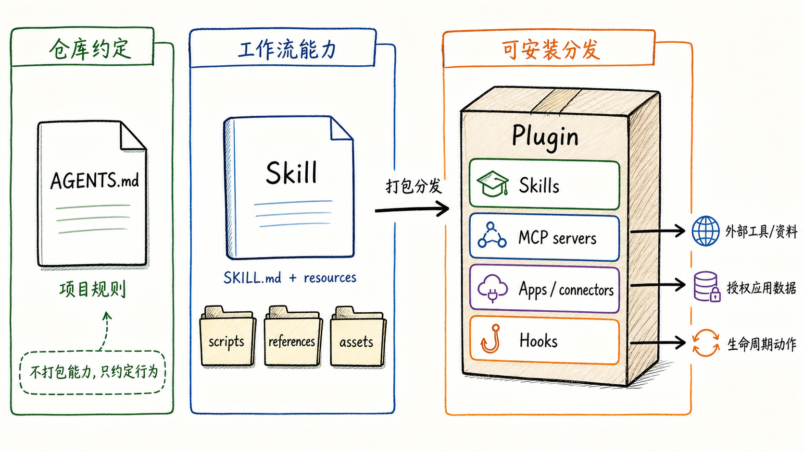
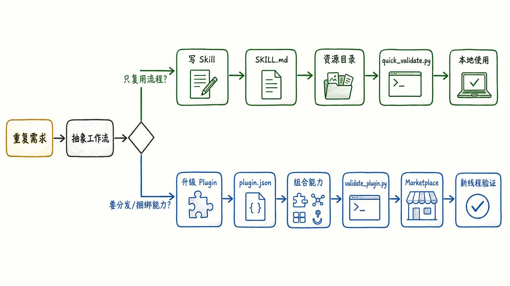

---
tags:
  - AI高效使用
  - Codex
  - Skill
  - Plugin
updated: 2026-06-14
description: 解释 Codex Skill 与 Plugin 的边界、开发流程和验证方法，帮助把重复的 AI 工作流沉淀为可复用能力。
---

# 怎么开发一个自己的plugin或skill？

很多人第一次听到 Skill 和 Plugin 时，会把它们都理解成给 Codex 加能力的东西，这个理解不算错，但还不够精确。真正影响开发决策的是两者的边界：**Skill 是让 Codex 学会某个工作流的作者格式，Plugin 是把一组能力安装、分发、组合起来的包**。

如果只是让 Codex 在某类任务里少问你几遍、少走弯路、按固定标准做事，先写 Skill；如果还要把多个 Skill、MCP、Apps/connectors、Hooks、资产和 marketplace 元数据组合成一个可以安装和分享的能力包，再升级成 Plugin。



这篇笔记只讨论 Codex 语境下的 Skill 与 Plugin，不展开通用浏览器插件、VS Code 插件、完整 MCP server 开发，也不把一次性 prompt 优化包装成工程体系。判断一个能力是否值得沉淀，核心看它是否会重复出现，是否有稳定输入输出，是否需要固定步骤、引用资料、脚本或外部工具配合。

## 1. 什么是 Skill 与 Plugin

Skill 可以理解为 Codex 的**任务说明书**。它通常是一个目录，核心文件是 `SKILL.md`，里面用 frontmatter 写 `name` 和 `description`，再在正文中说明 Codex 遇到这类任务时应该怎样工作。官方文档把 Skill 描述为用于扩展 Codex 的任务特定能力，它可以打包 instructions、resources 和 optional scripts，让 Codex 更可靠地遵循一个工作流。

一个最小 Skill 长这样：

```text
my-skill/
  SKILL.md
```

`SKILL.md` 的最小结构是：

```markdown
---
name: my-skill
description: Use when Codex needs to ...
---

Follow these steps ...
```

但真正有价值的 Skill 往往不只是一段说明，还会把可复用资源拆进不同目录：

```text
my-skill/
  SKILL.md
  agents/
    openai.yaml
  scripts/
    validate_output.py
  references/
    workflow.md
  assets/
    template.md
```

这些目录的分工很重要：`scripts/` 用来放需要确定性的脚本，`references/` 用来放按需加载的背景资料，`assets/` 用来放最终输出会消费的模板、图片、字体或项目骨架。Skill 的核心不是写得越长越好，而是把 Codex **不知道、但完成任务必须知道**的流程和资源放到正确位置。

Plugin 则是更高一层的**安装和分发包**。官方文档把 Plugin 描述为把 skills、app integrations、MCP servers 打包成 Codex 可复用工作流的机制。一个 Plugin 至少需要 `.codex-plugin/plugin.json`，可以包含 `skills/`、`.mcp.json`、`.app.json`、hooks、assets、marketplace 元数据等内容。

一个最小 Plugin 可以这样组织：

```text
my-plugin/
  .codex-plugin/
    plugin.json
  skills/
    my-skill/
      SKILL.md
```

`plugin.json` 是 Plugin 的入口 manifest，最小示例可以先只声明名称、版本、描述和 skills 路径：

```json
{
  "name": "my-plugin",
  "version": "1.0.0",
  "description": "Reusable workflow package for Codex.",
  "skills": "./skills/"
}
```

如果要进入 Codex 的插件列表或团队目录，还需要 marketplace 入口，例如个人 marketplace 常见位置是 `~/.agents/plugins/marketplace.json`，仓库级 marketplace 常见位置是 `$REPO_ROOT/.agents/plugins/marketplace.json`。marketplace 不是 Plugin 本身，而是一个目录索引，告诉 Codex 到哪里找到这个 Plugin、它是否可安装、安装时是否需要认证、属于什么分类。

## 2. Skill 和 Plugin 的核心区别

Skill 和 Plugin 的关系可以用一句话压缩：**Skill 负责教 Codex 怎么做事，Plugin 负责把这套做事能力安装、组合、分发出去**。

| 维度 | Skill | Plugin |
| --- | --- | --- |
| 本质 | 可复用工作流说明 | 可安装、可分发的能力包 |
| 最小入口 | `SKILL.md` | `.codex-plugin/plugin.json` |
| 常见内容 | instructions、references、scripts、assets | skills、MCP、Apps/connectors、Hooks、assets、marketplace metadata |
| 触发方式 | `$skill-name` 显式调用，或由 `description` 隐式匹配 | 安装后可通过 plugin 或其内置 skill/tool 被调用 |
| 适合范围 | 个人流程、仓库流程、团队写作标准、固定任务规范 | 多能力组合、跨团队分发、连接外部工具、绑定授权应用 |
| 验证重点 | 触发描述是否准确，流程是否可执行，资源是否按需加载 | manifest 是否合法，marketplace 是否指向正确，安装后是否可用 |

这个区别直接决定开发顺序。不要一开始就做 Plugin，除非你已经知道这个能力需要安装分发，或必须同时捆绑 MCP、Apps/connectors、Hooks 这类额外能力。对多数个人工作流来说，Skill 是更小、更快、更容易迭代的起点。

还要把 Skill、Plugin 和 `AGENTS.md` 区分开。`AGENTS.md` 是 Codex 进入某个目录前读取的项目指导，它适合放仓库规范、命令、验证方式、代码风格和长期协作约定；Skill 是某类任务被触发时才加载的专门工作流；Plugin 则是把多个能力打包安装的容器。把所有内容都塞进 `AGENTS.md` 会污染每次任务上下文，把一次性规则硬做成 Plugin 又会增加维护成本。

一个实用判断是：

- **长期存在的仓库规则**，放进 `AGENTS.md`；
- **可复用但不总是需要的任务流程**，写成 Skill；
- **要跨项目或团队安装、分享、捆绑外部工具的能力**，做成 Plugin；
- **需要调用外部系统、私有数据或工具动作**，考虑 MCP 或 Apps/connectors，并通常由 Plugin 承载；
- **需要在生命周期节点自动执行脚本**，再考虑 Hooks；

## 3. 为什么需要创建自己的 Skill 或 Plugin

创建 Skill 或 Plugin 的价值，不是为了让 Codex 看起来更复杂，而是为了把反复出现的上下文变成稳定资产。

第一类需求是**重复解释成本**。比如每次写 Orin 笔记都要强调 frontmatter、标题层级、不要写临时上下文、引用资料要可追溯；每次改教程都要强调先读批注、再重构教学路径、最后做 Markdown 校验。这类规则如果只靠 prompt，每次都要重新说，而且容易漏。写成 Skill 后，Codex 可以在任务触发时加载完整流程。

第二类需求是**流程一致性**。有些任务不是知道一个事实就能做好，而是需要稳定顺序：先确认边界，再读资料，再写草稿，再校验，再提交。Skill 很适合保存这种顺序，尤其适合教程写作、PR review、研究笔记整理、PDF 处理、数据报表生成、前端验收等任务。

第三类需求是**确定性工具补足**。模型擅长判断和生成，但不适合每次都临时手写相同脚本。把格式校验、文件转换、批量重命名、图片资产检查、manifest 验证写进 `scripts/`，可以让 Skill 既保留灵活判断，又在关键节点使用确定性工具。

第四类需求是**能力分发和组合**。当一个 Skill 已经稳定，并且你希望给团队成员安装使用，或它必须和 GitHub、Gmail、Figma、Slack、内部 MCP server、Hooks 一起工作，Plugin 才开始有意义。Plugin 的价值在于组合：它不只是一个更大的 Skill，而是把多个 Codex surface 放进同一个安装单元里。



因此，开发顺序通常是：先让一个 Skill 在真实任务里跑顺，再把它升级进 Plugin。直接从 Plugin 开始也可以，但更容易把尚未稳定的流程固化成复杂包，后续每次改动都要同时考虑 marketplace、安装、缓存、重启和新线程验证。

## 4. 如何开发一个 Skill

Skill 开发不是从写目录开始，而是从识别任务形状开始。一个值得做成 Skill 的任务，通常满足三个条件：反复出现、步骤稳定、存在非显而易见的判断或资源。

### 4.1 定义触发边界

先写清楚这个 Skill 应该在什么场景触发，也要写清楚不该覆盖什么场景。`description` 是 Codex 选择 Skill 的关键，官方文档也强调隐式匹配依赖 `description`，因此描述要前置核心触发词，避免只写一个宽泛名称。

弱描述：

```yaml
description: Help with documents.
```

强描述：

```yaml
description: Write, revise, and validate source-backed Chinese technical tutorials with figure planning, citation checks, Markdown hygiene, and repository publishing workflow. Use when the user asks for durable AI/LLM engineering notes, tutorial rewrites, or knowledge-base articles that need structured teaching flow.
```

强描述不会把所有文档任务都吸走，它会告诉 Codex：这是技术教程、中文、来源支撑、教学结构、图文和仓库发布流程相关的 Skill。

### 4.2 设计目录结构

最小 Skill 只需要 `SKILL.md`，但稍复杂的 Skill 应该主动使用渐进披露。`SKILL.md` 只保留核心流程和路由规则，细节放进 references，确定性工具放进 scripts，输出模板放进 assets。

推荐结构：

```text
my-skill/
  SKILL.md
  agents/
    openai.yaml
  references/
    playbook.md
    validation.md
  scripts/
    check_markdown.py
  assets/
    template.md
```

`SKILL.md` 不应该变成一本巨大的说明书。它要像入口路由：告诉 Codex 什么时候用这个 Skill、先做什么、哪些情况需要读取哪个 reference、哪些检查必须执行。真正细节留在 `references/`，这样只有任务需要时才加载。

### 4.3 用 creator 初始化

官方文档建议优先使用内置 creator，本地 `skill-creator` 也提供了初始化脚本。创建新 Skill 时，推荐从脚手架开始，而不是手写所有文件。

在 skill-creator 根目录下，Windows PowerShell 可以使用：

```powershell
python scripts/init_skill.py my-skill --path "$env:USERPROFILE\.codex\skills" --resources scripts,references,assets
```

在类 Unix shell 中可以写成：

```bash
python3 scripts/init_skill.py my-skill --path "${CODEX_HOME:-$HOME/.codex}/skills" --resources scripts,references,assets
```

如果是仓库级 Skill，应该放在仓库的 `.agents/skills/` 下，例如：

```text
<repo-root>/
  .agents/
    skills/
      my-skill/
        SKILL.md
```

仓库级 Skill 适合项目专用流程，用户级 Skill 适合跨仓库个人习惯，系统 Skill 则通常由 Codex 或插件提供，不建议手动修改。

### 4.4 写 `SKILL.md`

`SKILL.md` 的正文应该写给未来的 Codex，而不是写给普通用户做宣传。它需要足够具体，但不要解释模型本来已经知道的常识。

一个可用的正文通常包含：

- **任务入口**：这个 Skill 接手什么类型的请求；
- **执行顺序**：先读什么、再判断什么、什么时候写文件；
- **资源路由**：什么情况下读哪个 `references/*.md`；
- **工具边界**：什么时候必须用脚本，什么时候不能临时手写；
- **验证标准**：完成前必须跑哪些检查；
- **失败处理**：工具不可用、信息不足、验证失败时怎么收口；

示例骨架：

```markdown
# My Skill

Use this workflow when the user asks for ...

## Workflow

1. Inspect the target files and repository rules;
2. Read `references/playbook.md` when the task involves ...;
3. Generate or edit the artifact;
4. Run `scripts/check_markdown.py <target>`;
5. Report the final path and validation result.

## Validation

- The target file exists;
- Required metadata is present;
- The validation script passes;
```

### 4.5 配置 `agents/openai.yaml`

`agents/openai.yaml` 是面向 Codex app 的 UI 和策略元数据。它不是必需文件，但推荐为长期使用的 Skill 添加，因为它能提供更清晰的展示名、简短描述、默认 prompt 和隐式调用策略。

简化示例：

```yaml
interface:
  display_name: "Tutorial Doc Style"
  short_description: "Technical tutorial writing, figures, optional assessments, quality gates."
  default_prompt: "Use $tutorial-doc-style to draft or revise a source-backed technical tutorial."

policy:
  allow_implicit_invocation: true
```

如果不希望 Codex 自动根据描述调用某个 Skill，可以把 `allow_implicit_invocation` 设为 `false`，这样它只会在你显式 `$skill-name` 时使用。

### 4.6 验证 Skill

Skill 写完后，至少跑基础校验：

```bash
python scripts/quick_validate.py <path-to-skill-folder>
```

校验只能发现 frontmatter、字段和命名一类基础问题，不能证明 Skill 好用。真正的验证要靠真实任务：用几条接近真实用户请求的 prompt 触发它，观察 Codex 是否会读对 reference、是否会执行必要脚本、是否会在不该触发时误触发。

如果 Skill 很复杂，还应该做 forward-testing。做法不是把答案泄露给另一个 agent，而是给它一个真实任务和 Skill 路径，看它是否能独立产出合格结果。测试失败时，不要只修 prompt，要回头看 `description`、步骤顺序、reference 路由和验证标准是否写得足够清楚。

## 5. 如何开发一个 Plugin

Plugin 开发适合发生在 Skill 已经稳定之后。官方 Build plugins 文档给出的判断很直接：如果还在一个 repo 或个人流程里迭代，先从 local skill 开始；当你要跨团队分享、捆绑 app integrations 或 MCP config、打包 lifecycle hooks、发布稳定包时，再构建 Plugin。

### 5.1 用 `plugin-creator` 脚手架

本地 `plugin-creator` 的推荐路径是先用脚本创建基础结构。脚本会规范 plugin name，创建 `.codex-plugin/plugin.json`，并可选择生成 marketplace 入口。

在 `plugin-creator` 根目录下：

```bash
python scripts/create_basic_plugin.py my-plugin --with-marketplace
```

如果需要同时创建可选目录，PowerShell 可以写成：

```powershell
python scripts/create_basic_plugin.py my-plugin `
  --with-skills --with-hooks --with-scripts --with-assets --with-mcp --with-apps --with-marketplace
```

PowerShell 里续行符是反引号，Bash 里通常使用反斜杠：

```bash
python3 scripts/create_basic_plugin.py my-plugin \
  --with-skills --with-hooks --with-scripts --with-assets --with-mcp --with-apps --with-marketplace
```

默认个人 marketplace 是 `~/.agents/plugins/marketplace.json`。如果是仓库或团队 marketplace，才需要显式指定 repo 内路径，例如：

```bash
python3 scripts/create_basic_plugin.py my-plugin \
  --path <repo-root>/plugins \
  --marketplace-path <repo-root>/.agents/plugins/marketplace.json \
  --with-marketplace
```

### 5.2 理解 Plugin 结构

一个可维护 Plugin 通常像这样：

```text
my-plugin/
  .codex-plugin/
    plugin.json
  skills/
    my-skill/
      SKILL.md
      references/
      scripts/
      assets/
  .mcp.json
  .app.json
  hooks/
    hooks.json
  assets/
    logo.png
```

不是每个 Plugin 都需要全部目录。只打包一个 Skill 时，`skills/` 和 `.codex-plugin/plugin.json` 就足够；只有真的需要外部工具时才加 `.mcp.json`，只有需要 ChatGPT app connector 时才加 `.app.json`，只有需要生命周期自动化时才加 hooks。

这里有一个容易犯的错：把 `hooks` 字段直接写进 `plugin.json`。本地 `plugin-creator` 明确说明，当前验证会拒绝不支持的 manifest 字段，脚手架也会避免生成不被接受的字段。Plugin 可以有 hooks 目录或相关配置，但不要凭感觉往 manifest 里塞字段。

### 5.3 写 `plugin.json`

`plugin.json` 的核心字段包括：

- `name`：Plugin 标识，使用 kebab-case，通常和文件夹名一致；
- `version`：语义化版本，例如 `1.0.0`；
- `description`：简短目的说明；
- `skills`：指向内置 skills 目录，例如 `./skills/`；
- `mcpServers`：只有存在 `.mcp.json` 时才声明；
- `apps`：只有存在 `.app.json` 时才声明；
- `interface`：展示名、短描述、长描述、分类、图标、默认 prompt 等 UI 元数据；

一个偏完整的示例：

```json
{
  "name": "my-plugin",
  "version": "1.0.0",
  "description": "Reusable Codex workflows for my team.",
  "skills": "./skills/",
  "mcpServers": "./.mcp.json",
  "apps": "./.app.json",
  "interface": {
    "displayName": "My Plugin",
    "shortDescription": "Reusable workflows for my team.",
    "longDescription": "A local plugin that bundles Codex skills and optional integrations.",
    "developerName": "Personal",
    "category": "Productivity",
    "defaultPrompt": [
      "Use My Plugin to prepare this workflow."
    ]
  }
}
```

这只是结构示例，真实项目里要确保声明的文件真的存在。`mcpServers` 和 `apps` 尤其不能先写占位字段，否则 validator 或安装过程会失败。

### 5.4 配 marketplace

marketplace 是 Plugin 被 Codex 发现和安装的目录索引。一个最小 marketplace 入口大致是：

```json
{
  "name": "personal",
  "interface": {
    "displayName": "Personal"
  },
  "plugins": [
    {
      "name": "my-plugin",
      "source": {
        "source": "local",
        "path": "./plugins/my-plugin"
      },
      "policy": {
        "installation": "AVAILABLE",
        "authentication": "ON_INSTALL"
      },
      "category": "Productivity"
    }
  ]
}
```

`source.path` 是相对 marketplace root 的路径，不是相对当前 shell 目录，也不是相对 `.agents/plugins/` 目录。这个细节很容易导致安装后找不到 Plugin。个人 marketplace 与 repo marketplace 的位置不同，但 entry 形状类似。

如果使用默认个人 marketplace，`plugin-creator` 的流程通常不需要额外运行 `codex plugin marketplace add`。如果你指定了非默认 marketplace 路径，则要确认这个 marketplace 已经被 Codex 配置过。

### 5.5 验证 Plugin

生成或修改 Plugin 后，先跑 validator：

```bash
python scripts/validate_plugin.py <plugin-path>
```

验证重点包括：

- `.codex-plugin/plugin.json` 是否存在；
- `name`、`version`、`description` 等字段是否有效；
- `version` 是否符合 semver；
- `interface` 字段是否满足展示要求；
- `composerIcon`、`logo`、`screenshots` 等路径是否真实存在；
- `.app.json`、`.mcp.json` 是否和 manifest 声明一致；
- 是否残留 `[TODO: ...]` 占位符；

修改已有本地 Plugin 时，不要手动乱改 marketplace。推荐用 cachebuster 流程让 Codex 识别更新：

```bash
python scripts/update_plugin_cachebuster.py <plugin-path>
python scripts/read_marketplace_name.py
codex plugin add <plugin-name>@<marketplace-name>
```

重新安装或更新后，用新线程测试。官方插件安装流程也强调，安装插件后要启动新线程再要求 Codex 使用它，因为新线程更稳定地加载新的 plugin、skill 和工具上下文。

## 6. 验证、安装、迭代与常见问题

Skill 和 Plugin 的开发都不应该停在文件写完。真正完成的标准是：Codex 能发现它、能正确触发它、能完成真实任务、验证命令通过，并且失败时有清晰定位路径。

### 6.1 最小验收清单

开发 Skill 时检查：

- `SKILL.md` frontmatter 只有必要字段，至少包含 `name` 和 `description`；
- `description` 明确写出适用场景、触发词和边界；
- `references/` 文件只在需要时读取，不把所有细节塞进 `SKILL.md`；
- `scripts/` 中的脚本能独立运行，并有明确输入输出；
- `agents/openai.yaml` 和 `SKILL.md` 的能力描述一致；
- `quick_validate.py <skill-folder>` 通过；
- 用真实 prompt 测试显式调用和隐式调用；

开发 Plugin 时检查：

- `.codex-plugin/plugin.json` 存在，`name` 与外层目录一致；
- `version` 是合法 semver；
- manifest 没有 `[TODO: ...]`；
- `skills`、`mcpServers`、`apps` 等路径只在文件真实存在时声明；
- marketplace entry 包含 `policy.installation`、`policy.authentication` 和 `category`；
- `source.path` 是相对 marketplace root 的 `./plugins/<plugin-name>` 形式；
- `validate_plugin.py <plugin-path>` 通过；
- 安装或重装后用新线程验证；

### 6.2 常见问题

**Skill 没有被触发，通常不是 Codex 不会用，而是 `description` 太弱。**

把描述从抽象名词改成任务边界：谁会用、处理什么对象、什么时候触发、什么时候不触发。Skill 列表有上下文预算，描述可能被缩短，关键触发词要放在前面。

**Skill 写得太长，反而让 Codex 更难执行。**

如果 `SKILL.md` 变成上万字，说明需要拆分。核心流程留在 `SKILL.md`，长规则、案例、格式表和来源说明放进 `references/`，确定性操作写进 `scripts/`。

**把 Plugin 当成 Skill 的豪华版，是最常见的过度设计。**

Plugin 的价值是安装、分发和组合能力。如果只是让 Codex 按固定流程写教程、处理 PDF、整理会议纪要，先写 Skill；等这个流程稳定，并且确实需要团队安装或捆绑外部工具，再升级 Plugin。

**Plugin 安装后没有出现，要先查 marketplace，而不是先改代码。**

确认 marketplace 文件位置、`source.path` 相对路径、plugin folder 是否存在、Codex 是否重启或开新线程。很多安装问题不是 manifest 内容错，而是 marketplace 指向错。

**修改 Plugin 后旧版本还在，通常是缓存或线程上下文问题。**

使用 `update_plugin_cachebuster.py` 更新版本后缀，重新 `codex plugin add <plugin>@<marketplace>`，再开新线程测试。不要在同一个旧线程里判断新能力是否已经生效。

**需要外部工具时，不要把 API 使用说明硬写成 Skill。**

如果 Codex 需要真正调用外部系统，应该考虑 MCP server 或 Apps/connectors。Skill 可以教 Codex 什么时候调用、按什么顺序调用、如何解释结果，但真正的数据访问和动作执行应该由工具层完成。

### 6.3 推荐开发顺序

一个稳妥路线是：

1. 先把重复任务写成普通 prompt，并观察哪些说明每次都要重复；
2. 把稳定步骤整理成 `SKILL.md`，先做 instruction-only Skill；
3. 把长参考、模板和脚本拆进 `references/`、`assets/`、`scripts/`；
4. 用 `quick_validate.py` 和真实任务测试 Skill；
5. 当 Skill 稳定后，再决定是否需要 Plugin；
6. 用 `plugin-creator` 生成 `.codex-plugin/plugin.json` 和 marketplace；
7. 跑 `validate_plugin.py`，安装后用新线程验证；
8. 每次迭代只改一个明确问题，避免 Skill、Plugin、marketplace、MCP 同时混改；

这个顺序保留了足够弹性：前期让流程快速成型，后期再把成熟能力变成可安装包。真正重要的不是文件夹层级有多完整，而是 Codex 在下一次相同任务里能否少走弯路、少问重复问题，并稳定产出可验证结果。

## 7. 参考资料

1. [OpenAI Developers: Agent Skills](https://developers.openai.com/codex/skills)，用于确认 Skill 的定义、触发方式、目录位置、渐进披露和最佳实践；
2. [OpenAI Developers: Build plugins](https://developers.openai.com/codex/plugins/build)，用于确认 Plugin 作者流程、`.codex-plugin/plugin.json`、marketplace 和本地安装方式；
3. [OpenAI Developers: Plugins](https://developers.openai.com/codex/plugins)，用于确认 Plugin 可以打包 Skills、Apps 和 MCP servers，并通过 Codex app 或 CLI 安装；
4. [OpenAI Developers: Custom instructions with AGENTS.md](https://developers.openai.com/codex/guides/agents-md)，用于区分仓库指导文件与 Skill/Plugin 的职责；
5. [OpenAI Developers: Model Context Protocol](https://developers.openai.com/codex/mcp)，用于确认 MCP 在 Codex 中连接工具与上下文的角色；
6. [OpenAI Developers: Hooks](https://developers.openai.com/codex/hooks)，用于确认 Hooks 的生命周期事件、配置位置和 Plugin 打包关系；
7. 本地 `C:\Users\17335\.codex\skills\.system\skill-creator\SKILL.md`，用于确认 Skill 创建流程、目录结构、命名规则和 `quick_validate.py`；
8. 本地 `C:\Users\17335\.codex\skills\.system\plugin-creator\SKILL.md`，用于确认 Plugin 脚手架、personal marketplace、cachebuster 和 `validate_plugin.py`；
9. 本地 `C:\Users\17335\.codex\skills\.system\plugin-creator\references\plugin-json-spec.md`，用于确认 `plugin.json` 与 `marketplace.json` 字段；
