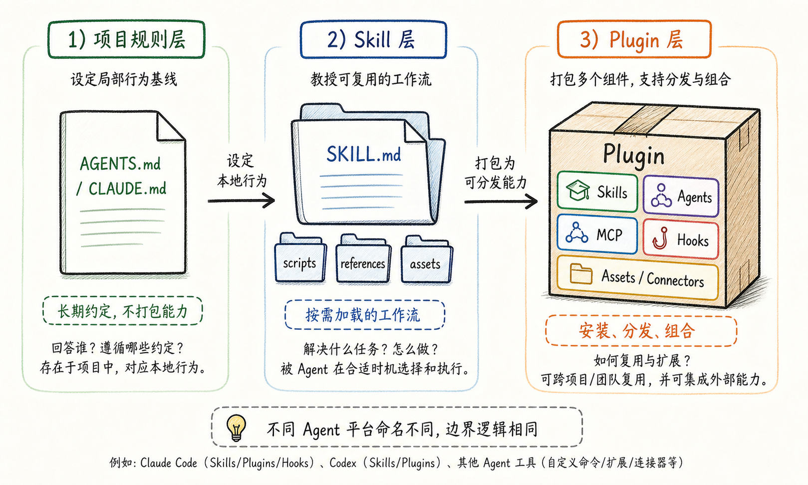
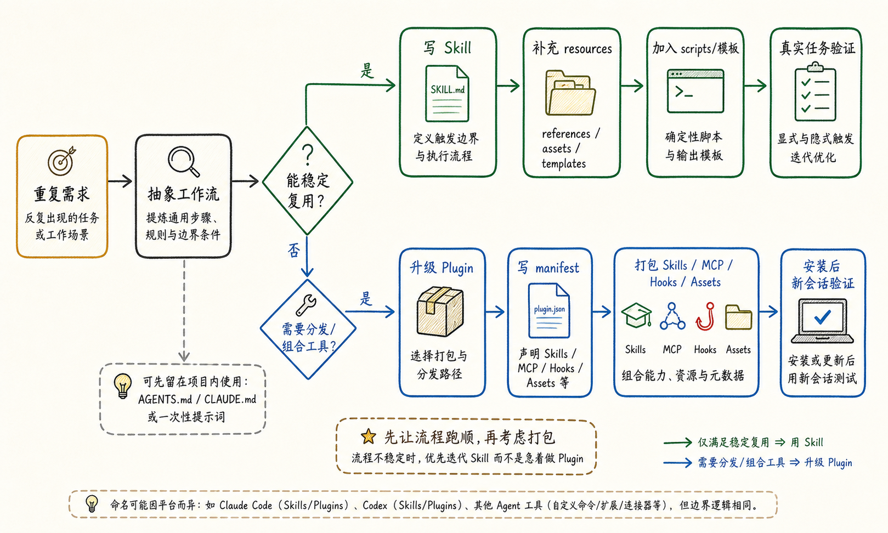

---
tags:
  - AI高效使用
  - Agent工程
  - Skill
  - Plugin
  - ClaudeCode
  - Codex
updated: 2026-06-14
description: 解释 Agent Skill 与 Plugin 的通用边界、开发路径和验证方法，帮助把重复的 AI 工作流沉淀为可复用能力。
---

# 怎么开发一个自己的plugin或skill？

在 coding agent 的日常使用里，真正被反复消耗的往往不是一次提示词，而是同一段上下文。你已经告诉过 Agent 某个仓库的提交规则、某类教程的写作标准、某个项目的启动方式，下一次遇到类似任务时，仍然要重新说明一遍，甚至还要重新纠正它漏掉的检查步骤。

Skill 和 Plugin 解决的就是这种重复上下文问题。Skill 把稳定的任务方法沉淀成按需加载的工作流，Plugin 把一组能力打包成可以安装、分发、更新和组合的扩展包。这个思路不是 Codex 独有，Claude Code、Codex 以及越来越多 Agent 工具都在用相近的能力层，只是目录名、manifest 字段、触发方式和安装命令不同。

因此，开发自己的 Skill 或 Plugin 时，第一步不是追着某个工具的文件格式跑，而是先判断：这件事只是需要一个可复用工作流，还是已经需要被安装、共享、组合外部工具。前者先写 Skill，后者再升级成 Plugin，这个顺序能避免把还没跑顺的流程过早做成复杂包。

## 1. 什么是 Skill 和 Plugin

理解这组概念时，可以先把 Agent 的可复用能力分成三层：项目规则层、任务能力层、安装分发层。不同平台的命名不完全一样，例如 Codex 常见 `AGENTS.md`，Claude Code 常见 `CLAUDE.md`，但它们解决的问题都可以放进这三层里观察。

下图不是目录规范清单，而是一张读图地图。左侧表示长期项目约定，它告诉 Agent 在某个工作空间里应该遵循什么边界，中间表示 Skill，它把某类任务的做法、参考资料和脚本封装起来，右侧表示 Plugin，它把多个能力打包，方便跨项目、跨团队或跨工具复用。



**项目规则层**回答的是“在这个项目里应该遵守什么约定”。它适合放仓库级行为，例如提交方式、测试命令、目录语义、写作规范、禁止修改的文件范围。Codex 里常见的是 `AGENTS.md`，Claude Code 里常见的是 `CLAUDE.md`，这类文件通常跟着项目长期存在，Agent 进入项目时就应该读取。

**Skill 层**回答的是“遇到这类任务时应该怎么做”。它通常以 `SKILL.md` 为入口，配合 `references/`、`scripts/`、`assets/`、`examples/` 等资源，让 Agent 在需要时加载完整流程。Agent Skills 的开放格式把 Skill 描述成一个目录，核心是带元数据和执行说明的 `SKILL.md`，同时可以携带脚本、参考材料和模板，Claude Code 官方文档也明确说明 Skills 遵循这个开放标准，并在此基础上扩展了调用控制、子代理执行和动态上下文注入。

**Plugin 层**回答的是“这组能力如何被安装、共享、更新和组合”。Plugin 通常会有一个 manifest，例如 Codex 使用 `.codex-plugin/plugin.json`，Claude Code 使用 `.claude-plugin/plugin.json`，同时可以打包 Skills、Agents、MCP servers、Hooks、Assets、Connectors 等组件。Plugin 的价值不是比 Skill 更高级，而是它有分发边界，有版本边界，也更适合承载多组件能力。

一个最小 Skill 可以只有一个文件：

```text
my-skill/
  SKILL.md
```

当任务需要额外资料和确定性工具时，它会自然长成这样：

```text
my-skill/
  SKILL.md
  references/
    playbook.md
  scripts/
    validate_output.py
  assets/
    template.md
```

一个最小 Plugin 则至少要有可被平台识别的包结构，下面用两种主流形态做对照：

```text
# Codex 风格
my-plugin/
  .codex-plugin/
    plugin.json
  skills/
    my-skill/
      SKILL.md

# Claude Code 风格
my-plugin/
  .claude-plugin/
    plugin.json
  skills/
    my-skill/
      SKILL.md
```

把这些结构放在一起看，Skill 和 Plugin 的区别就不会停留在“文件夹大小”上。Skill 更像可复用做法，Plugin 更像可安装产品包，前者让 Agent 做对事，后者让能力被分发、组合和治理。

## 2. Skill 和 Plugin 的区别在哪里

很多误用来自一个直觉：既然 Plugin 能包含 Skill，那是不是一开始就做 Plugin 更完整。这个直觉看起来省事，实际会增加维护成本，因为 Plugin 还要处理 manifest、安装来源、版本、命名空间、更新、信任边界和新会话加载，流程还没稳定时，这些东西都会变成额外负担。

更稳的判断方式是先看能力的成熟度。一个任务如果只是反复出现，并且已经能写清楚执行步骤，就适合先变成 Skill，当它已经被多人、多项目复用，或者必须和 MCP、Hooks、Agents、授权应用一起工作，才需要 Plugin 承载。

| 维度 | Skill | Plugin |
| --- | --- | --- |
| 解决的问题 | 让 Agent 在特定任务上按稳定流程工作 | 把一组能力安装、分发、更新和组合 |
| 最小入口 | `SKILL.md` | 平台 manifest，例如 `.codex-plugin/plugin.json` 或 `.claude-plugin/plugin.json` |
| 常见内容 | instructions、references、scripts、assets、examples | skills、agents、MCP servers、hooks、assets、connectors、marketplace 元数据 |
| 触发方式 | 由描述自动匹配，或由用户显式调用 | 安装启用后，通过命名空间、内置组件或平台 UI 调用 |
| 适合阶段 | 个人流程、仓库流程、团队规范的早期沉淀 | 稳定能力的跨项目分发、团队共享、工具组合 |
| 主要风险 | 触发边界太宽、说明过长、缺少验证 | manifest 错误、安装路径错误、版本和信任边界不清 |

项目规则文件也要和 Skill、Plugin 分开看。`AGENTS.md`、`CLAUDE.md` 这类文件适合放“进入这个项目就应该一直遵守”的规则，例如 `notes/` 目录如何组织、提交后是否要 push、Markdown frontmatter 怎么写。Skill 适合放“只有遇到某类任务才需要加载”的流程，例如教程改写、PDF 解析、代码审查、数据报表生成。Plugin 则适合放“这组能力要被安装和共享”的包，例如一个团队的代码质量套件、一个产品设计工作流、一个内部工具连接包。

一个实用判断是：如果你发现自己只是在某个项目里写规则，不要急着做 Skill，如果你发现自己每次都复制同一套任务步骤，可以做 Skill，如果这个 Skill 已经稳定，还要跨项目复用、给同事安装，或要捆绑外部工具，再做 Plugin。

## 3. 为什么需要自己创建 Skill 或 Plugin

创建 Skill 或 Plugin 的价值，不是让 Agent 工具体系显得更复杂，而是把重复上下文变成可维护资产。这个价值需要从工作流里的损耗看出来，而不是从文件格式本身看出来。

第一种损耗是**重复说明**。例如每次写 Orin 笔记都要强调 frontmatter、标题编号、不要写临时上下文、引用资料要可追溯，每次改教程都要强调先重构教学路径、再处理插图、最后做 Markdown 校验。如果这些规则只存在于临时 prompt 里，下一次仍然要重说一遍，而且 Agent 可能记住了风格却漏掉验证。Skill 可以把这类重复说明变成稳定入口。

第二种损耗是**流程漂移**。有些任务不是知道一个事实就能做好，而是需要顺序，先确认边界，再读资料，再写草稿，再校验，再提交。人和 Agent 都容易在赶进度时跳过某一步，Skill 的作用就是把正确顺序写进可复用流程，让每次任务都从同一条主线出发。

第三种损耗是**确定性不足**。模型可以判断和生成，但不适合每次都临时手写相同脚本。格式检查、文件转换、图片路径验证、manifest 校验、批量重命名这些动作更适合放进 `scripts/`，让 Agent 在需要时运行确定性工具，而不是每次靠语言模型猜。

第四种损耗是**分发困难**。一个 Skill 在个人目录里运行良好，并不等于团队能稳定使用它。团队场景还需要安装入口、版本更新、命名空间、防冲突、外部工具连接、权限和信任边界，这时 Plugin 才真正有意义。Plugin 的价值不只是“装起来方便”，更是把一组可复用能力变成可以治理的包。

下面这张图把开发顺序压成两个判断门槛。先判断流程能否稳定复用，能就写 Skill，再判断是否需要分发或组合工具，需要才升级 Plugin。图里没有绑定某个平台命令，因为这一步讲的是能力成熟路径，不是具体产品的脚手架用法。



这也是为什么不建议直接从 Plugin 开始。流程还没有在真实任务里跑顺时，Plugin 会把不稳定的判断、过窄的触发词和没验证过的脚本一起打包，后续每次修改都要同时考虑安装、缓存、版本和新会话验证。先 Skill、后 Plugin，不是保守，而是让能力先通过真实任务打磨。

## 4. 如何开发一个 Skill

Skill 开发的起点不是创建目录，而是识别任务形状。一个值得沉淀为 Skill 的任务，通常具备三个特征：反复出现，步骤相对稳定，并且有一些普通 prompt 容易漏掉的判断、资源或验证动作。

### 4.1 定义触发边界

触发边界决定 Skill 会不会在正确时机被 Agent 发现，也决定它会不会抢走不该处理的任务。描述太宽会导致误触发，描述太窄又会让 Agent 找不到它，因此第一版 Skill 需要先写清楚“处理什么对象、在什么场景触发、输出应该达到什么标准”。

弱描述通常只写能力名：

```yaml
description: Help with documents.
```

强描述会把场景、对象和边界都放进去：

```yaml
description: Write, revise, and validate source-backed Chinese technical tutorials with figure planning, citation checks, Markdown hygiene, and repository publishing workflow. Use when the user asks for durable AI/LLM engineering notes, tutorial rewrites, or knowledge-base articles that need structured teaching flow.
```

这段描述不是为了显得完整，而是让 Agent 在技能列表里快速判断：它面对的是中文技术教程、来源支撑、教学结构、插图和仓库发布流程。如果请求只是改一封邮件，或者写一段普通说明，它就不应该触发。

### 4.2 设计 Skill 目录

`SKILL.md` 应该像入口路由，而不是把所有知识都塞进去。入口文件负责说明什么时候用、按什么顺序做、什么情况下读取哪个 reference、哪些动作必须跑脚本。长规则、案例、模板和资料可以放进其他目录，让 Agent 只在需要时加载。

推荐结构：

```text
my-skill/
  SKILL.md
  references/
    playbook.md
    validation.md
  scripts/
    check_markdown.py
  assets/
    template.md
  examples/
    sample-output.md
```

这种拆法的好处是上下文成本可控。Agent 每次只需要先读 `SKILL.md`，如果任务进入写作质量问题，再读 `references/playbook.md`，如果进入文件校验，再运行 `scripts/check_markdown.py`。Skill 不是越厚越好，它的质量来自清晰路由和稳定执行。

### 4.3 编写 `SKILL.md`

`SKILL.md` 的正文是写给未来 Agent 的工作指令，不是写给用户看的宣传页。它可以保留少量解释，但重点应该是可执行流程、资源路由、工具边界和完成标准。

一个可用骨架：

```markdown
---
name: my-skill
description: Use when the agent needs to ...
---

# My Skill

Use this workflow when ...

## Workflow

1. Inspect the target files and repository rules;
2. Read `references/playbook.md` when the task involves ...;
3. Generate or edit the target artifact;
4. Run `scripts/check_markdown.py <target>`;
5. Report the final path and validation result.

## Validation

- The target file exists;
- Required metadata is present;
- The validation script passes;
```

如果你使用 Claude Code，可以把个人 Skill 放在 `~/.claude/skills/<skill-name>/SKILL.md`，项目 Skill 放在 `.claude/skills/<skill-name>/SKILL.md`，并通过 `/skill-name` 显式调用，或让 Claude 根据 `description` 自动匹配。Claude Code 还支持动态上下文注入、控制是否允许模型自动调用、限制工具和在子代理里运行，这些属于平台扩展能力，不是所有 Agent 平台都会一样。

如果你使用 Codex，可以把用户级 Skill 放在 `$CODEX_HOME/skills`，把仓库级 Skill 放在 `.agents/skills/`，也可以用本地 `skill-creator` 脚手架生成结构。例如在 Windows PowerShell 中：

```powershell
python scripts/init_skill.py my-skill --path "$env:USERPROFILE\.codex\skills" --resources scripts,references,assets
```

类 Unix shell 中可以写成：

```bash
python3 scripts/init_skill.py my-skill --path "${CODEX_HOME:-$HOME/.codex}/skills" --resources scripts,references,assets
```

这些命令只是 Codex 的一种落地方式。通用原则仍然是先写清触发边界，再把稳定流程放进 `SKILL.md`，把长资料和脚本拆出去，最后用真实任务验证它能不能独立工作。

### 4.4 验证 Skill

Skill 的验证不能只看文件格式。格式校验只能发现 frontmatter、字段、命名和目录错误，真正的质量要看它在真实任务里是否按预期触发、是否读对资源、是否执行必要脚本、是否在不该触发时保持安静。

Codex 本地 creator 提供基础校验脚本，可以这样跑：

```bash
python scripts/quick_validate.py <path-to-skill-folder>
```

Claude Code 的验证更适合用真实调用来完成：启动 Claude Code 后，用一个会自动匹配 `description` 的请求测试隐式触发，再用 `/skill-name` 测试显式触发。如果 Skill 带有支持文件，还要确认 Agent 会按说明加载相关文件，而不是一开始把所有资料塞进上下文。

复杂 Skill 还应该做 forward testing。做法是给一个新的 Agent 会话提供 Skill 和真实任务，不透露你期望的答案，看它是否能独立完成。如果失败，不要只补一句提示词，要回头检查 `description` 是否准确、步骤顺序是否自然、reference 路由是否明确、验证标准是否足够具体。

## 5. 如何开发一个 Plugin

Plugin 适合发生在能力已经稳定之后。一个还没跑顺的流程，放在普通 prompt 里最好改，放在 Skill 里也还容易改，一旦做成 Plugin，就进入安装、命名空间、版本、marketplace、缓存和信任边界的世界，维护成本会明显上升。

### 5.1 先确认是否真的需要 Plugin

如果你只是在单个项目里自用，项目规则文件或项目级 Skill 往往足够。如果你正在试验一个流程，Standalone Skill 也更轻。Plugin 的适用场景通常更明确：需要给团队或社区分发，需要跨多个项目复用，需要把 Skills、Agents、MCP servers、Hooks、Assets 放在同一个包里，需要版本化更新，或者需要通过 marketplace 发现和安装。

Claude Code 官方文档把 standalone configuration 和 plugins 放在一起比较，结论很清晰：单项目、个人配置、快速实验，先用 `.claude/`，团队分享、跨项目复用、版本化发布、marketplace 分发，再做 Plugin。Codex 的本地 plugin-creator 也是类似思路，先确认能力要被安装和分发，再创建 `.codex-plugin/plugin.json` 和 marketplace 入口。

### 5.2 设计 Plugin 结构

Plugin 的目录结构取决于平台，但核心思想相同：manifest 只放包元数据和组件路径，真正的能力放在插件根目录下的组件目录里。

Codex 风格示例：

```text
my-plugin/
  .codex-plugin/
    plugin.json
  skills/
    my-skill/
      SKILL.md
      references/
      scripts/
  .mcp.json
  .app.json
  hooks/
    hooks.json
  assets/
    logo.png
```

Claude Code 风格示例：

```text
my-plugin/
  .claude-plugin/
    plugin.json
  skills/
    my-skill/
      SKILL.md
  agents/
  hooks/
    hooks.json
  .mcp.json
  settings.json
  bin/
```

不要把所有可能目录都预先创建。一个只打包一个 Skill 的 Plugin，可以只保留 manifest 和 `skills/`，只有真实需要外部工具时才加 `.mcp.json`，只有需要生命周期自动化时才加 hooks，只有需要自定义 agent 时才加 `agents/`。结构越贴近真实能力，后续安装和排错越简单。

### 5.3 写 manifest

manifest 是 Plugin 的身份说明，也是平台识别组件的入口。不同平台字段不同，但通常都需要名称、描述、版本、作者或展示信息，以及组件路径。

Codex 的简化示例：

```json
{
  "name": "my-plugin",
  "version": "1.0.0",
  "description": "Reusable workflows for my team.",
  "skills": "./skills/",
  "interface": {
    "displayName": "My Plugin",
    "shortDescription": "Reusable workflows for my team.",
    "category": "Productivity",
    "defaultPrompt": [
      "Use My Plugin to prepare this workflow."
    ]
  }
}
```

Claude Code 的简化示例：

```json
{
  "name": "my-first-plugin",
  "description": "A plugin that bundles reusable agent workflows",
  "version": "1.0.0",
  "author": {
    "name": "Your Name"
  }
}
```

这里最容易犯的错，是把平台没有声明支持的字段硬塞进 manifest，或者声明了某个组件路径却没有对应文件。Manifest 不是愿望清单，它应该只描述插件确实拥有的组件。

### 5.4 用平台工具创建和测试

不同平台的脚手架不同，使用时要把“通用开发顺序”和“平台命令”分开看。通用顺序是先确认分发需求，再创建 manifest，再放入 Skill 或其他组件，最后安装到新会话验证。

Codex 的本地 `plugin-creator` 可以这样创建基础 Plugin：

```bash
python scripts/create_basic_plugin.py my-plugin --with-marketplace
```

如果需要同时创建可选目录，PowerShell 可以写成：

```powershell
python scripts/create_basic_plugin.py my-plugin `
  --with-skills --with-hooks --with-scripts --with-assets --with-mcp --with-apps --with-marketplace
```

Claude Code 可以直接在技能目录中初始化一个 Plugin：

```bash
claude plugin init my-tool
```

开发本地 Plugin 时，Claude Code 也支持用 `--plugin-dir` 加载插件目录测试：

```bash
claude --plugin-dir ./my-plugin
```

安装或重新加载后要用新会话或平台推荐的 reload 流程测试。Plugin 的很多问题不是组件本身错误，而是旧线程没有加载新版本、marketplace 路径指错、命名空间冲突，或者 manifest 声明和真实目录不一致。

### 5.5 验证 Plugin

Plugin 验证要覆盖三层：包结构、安装发现、真实任务。只要其中一层失败，用户看到的结果都是“插件不好用”，所以不能只跑一个命令就结束。

Codex 本地 creator 提供 validator：

```bash
python scripts/validate_plugin.py <plugin-path>
```

Claude Code 提供本地验证命令，提交社区 marketplace 前也建议先运行：

```bash
claude plugin validate
```

验证时重点看这些问题：

- manifest 是否存在于平台要求的位置；
- `name`、`version`、`description` 是否符合平台规则；
- 声明的 `skills`、`mcp`、`hooks`、`assets` 路径是否真实存在；
- marketplace 或安装来源是否指向正确目录；
- 安装后是否能在新会话里调用到对应 Skill 或组件；
- 如果插件会执行脚本或连接外部工具，是否明确了信任边界和必要权限；

修改已有 Plugin 后，不要只在旧线程里判断是否生效。Codex 场景下，可能需要更新 cachebuster、重新安装并开新线程，Claude Code 场景下，可以用 `/reload-plugins` 或重新启动会话，但涉及安装来源、manifest 和组件结构的改动，仍然建议用干净会话复测。

## 6. 常见误区和迭代方法

Skill 和 Plugin 的开发质量，最终体现在下一次真实任务里。如果 Agent 能少问重复问题、少走错路径、稳定执行验证，这个能力就有价值，如果它只是多了一层目录，但任务仍然靠临时 prompt 才能完成，那它还没有被真正沉淀。

**误区一：把项目规则写成 Skill。** 项目规则是长期背景，应该一直生效，例如仓库目录语义、提交和 push 规则、固定校验命令。只有当某个流程不是每次都需要、但遇到时需要完整步骤，才适合变成 Skill。

**误区二：把 Skill 写成百科。** Agent 不是因为缺少一本超长手册才做不好任务，更多时候是缺少正确的执行顺序和必要资源路由。`SKILL.md` 应该短而清楚，长资料放进 references，确定性动作放进 scripts。

**误区三：把 Plugin 当作 Skill 的豪华版。** Plugin 的意义是安装、分发、组合和治理。如果能力还没稳定，Plugin 只会提前放大维护成本。

**误区四：插图脱离正文。** 教程里的图不是装饰，它要帮助读者理解边界、流程或机制。图出现前，需要先告诉读者为什么需要这张图、图中各部分代表什么、读图时应该忽略哪些平台细节。

**误区五：结论先行但没有台阶。** “先写 Skill，后做 Plugin”这种判断看似简单，但读者需要先看到重复说明、流程漂移、确定性工具和分发治理这些成本，才会理解这个顺序为什么合理。没有铺垫的结论，会让教程像 checklist，而不是学习路径。

一个稳妥的迭代路线是：先把重复任务写成普通 prompt，观察哪些说明每次都要重复，再把稳定步骤整理成 Skill，在真实任务中测试触发和验证，当 Skill 被多项目、多成员复用，或需要和外部工具组合，再升级成 Plugin，每次迭代只解决一个明确问题，例如触发太宽、reference 路由不清、manifest 路径错误、安装后旧会话未刷新。

这条路线保留了弹性。前期让工作流快速成型，后期再把成熟能力变成可安装包，真正重要的不是文件夹层级多完整，而是下一次相同任务出现时，Agent 是否能更快进入正确上下文，并给出可验证的结果。

## 7. 参考资料

1. [Agent Skills: Overview](https://agentskills.io/home)，用于确认 Agent Skills 作为开放格式的通用定义、`SKILL.md` 入口和资源组织方式；
2. [Anthropic Engineering: Equipping agents for the real world with Agent Skills](https://www.anthropic.com/engineering/equipping-agents-for-the-real-world-with-agent-skills)，用于理解 Skills 为什么把 instructions、scripts 和 resources 放在同一能力目录中；
3. [Claude Code Docs: Extend Claude with skills](https://code.claude.com/docs/en/skills)，用于确认 Claude Code Skills 的目录位置、调用方式、开放标准关系和支持文件机制；
4. [Claude Code Docs: Create plugins](https://code.claude.com/docs/en/plugins)，用于确认 Claude Code Plugin 适用场景、`.claude-plugin/plugin.json`、`skills/` 结构、本地测试和分享流程；
5. [Claude Code Docs: Plugins reference](https://code.claude.com/docs/en/plugins-reference)，用于确认 Claude Code manifest 字段和插件组件规范；
6. [OpenAI Developers: Agent Skills](https://developers.openai.com/codex/skills)，用于确认 Codex Skill 的定义、触发方式、目录位置、渐进披露和最佳实践；
7. [OpenAI Developers: Build plugins](https://developers.openai.com/codex/plugins/build)，用于确认 Codex Plugin 作者流程、`.codex-plugin/plugin.json`、marketplace 和本地安装方式；
8. [OpenAI Developers: Plugins](https://developers.openai.com/codex/plugins)，用于确认 Codex Plugin 可以打包 Skills、Apps 和 MCP servers，并通过 Codex app 或 CLI 安装；
9. [OpenAI Developers: Custom instructions with AGENTS.md](https://developers.openai.com/codex/guides/agents-md)，用于区分仓库指导文件与 Skill/Plugin 的职责；
10. [OpenAI Developers: Model Context Protocol](https://developers.openai.com/codex/mcp)，用于确认 MCP 在 Codex 中连接工具与上下文的角色；
11. [OpenAI Developers: Hooks](https://developers.openai.com/codex/hooks)，用于确认 Hooks 的生命周期事件、配置位置和 Plugin 打包关系；
12. 本地 `C:\Users\17335\.codex\skills\.system\skill-creator\SKILL.md`，用于确认 Codex Skill 创建流程、目录结构、命名规则和 `quick_validate.py`；
13. 本地 `C:\Users\17335\.codex\skills\.system\plugin-creator\SKILL.md`，用于确认 Codex Plugin 脚手架、personal marketplace、cachebuster 和 `validate_plugin.py`；
14. 本地 `C:\Users\17335\.codex\skills\.system\plugin-creator\references\plugin-json-spec.md`，用于确认 Codex `plugin.json` 与 `marketplace.json` 字段。
