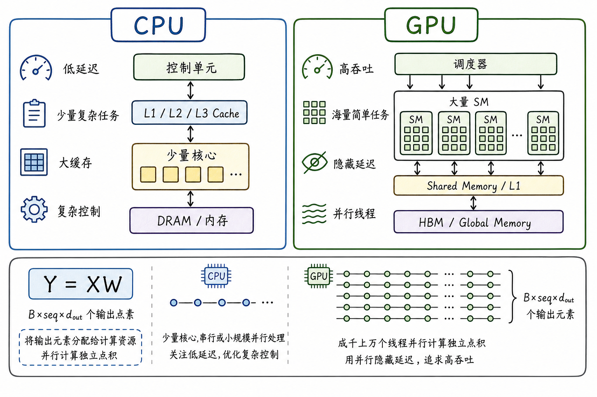

---
tags:
  - LLM
  - GPU
  - CUDA
  - NVIDIA
  - model-serving
updated: 2026-05-28
description: 面向大模型与推理全栈初学者，建立 GPU 设计哲学、存储层级、SM/Warp/Tensor Core 与 CUDA 执行模型的基础心智模型，为后续理解 LLM 性能与推理系统打底。
---

# 大模型与推理全栈精讲系列 01：理解 GPU 架构及其原理

> [!Quote] 本篇导读
> 学大模型不能只从 Transformer 公式开始，也不能只从框架 API 开始。真正运行一个大模型时，文本最终会变成张量，张量会落到矩阵乘、归一化、Attention、logits 处理、采样和通信操作上；其中矩阵乘与规则张量算子最能体现 GPU 高吞吐优势，采样这类小而带控制逻辑的步骤则更容易受框架、batching 和 runtime 组织影响。本文的目标不是教你手写 CUDA kernel，也不是安装 GPU 环境，而是先建立一套底层直觉：GPU 为什么和 CPU 不一样，数据在 GPU 内部怎么移动，SM、Warp、Tensor Core 如何组织计算，CUDA 又如何把软件中的并行任务映射到硬件上。
>
> 读完本篇，你应该能回答四个问题：为什么 GPU 追求高吞吐而不是单线程低延迟；为什么很多 LLM 性能问题首先是数据搬运问题；为什么矩阵乘特别适合 Tensor Core；以及为什么 prefill、decode、多卡通信会呈现不同的瓶颈形态。
>
> 全文会反复使用一个贯穿样例：LLM 中的 `Linear` 层可以写成 $Y = XW$。其中 $X$ 的形状可看作 $[B, seq, d_{model}]$，$W$ 的形状是 $[d_{model}, d_{out}]$，输出 $Y$ 的形状是 $[B, seq, d_{out}]$。理解 GPU，就是理解这类计算如何被拆成海量并行工作，以及这些工作为什么仍然可能被存储、调度或通信拖慢。

本篇的学习路径是：先看 GPU 为什么适合张量并行，再看数据如何喂给计算单元，然后看 SM、Warp、Tensor Core 如何真正消耗这些数据，接着理解 CUDA 如何把软件任务映射到硬件，最后用三类瓶颈把这些概念收束成 LLM 推理诊断能力。后续的 KV cache、FlashAttention、PagedAttention、batching、并行策略和推理服务延迟，都可以回到这条路径上理解。

## 1. GPU 的设计哲学

### 1.1 CPU 与 GPU 解决的是不同问题

CPU 和 GPU 都能执行程序，但它们从一开始就不是为同一种工作负载设计的。

CPU 追求的是低延迟和通用控制能力。它通常拥有少量复杂核心、较强的分支预测、乱序执行能力、多级缓存和复杂控制逻辑，适合操作系统调度、文件网络 I/O、复杂业务逻辑、串行依赖强的程序，以及对单个任务响应时间敏感的场景。

GPU 追求的是高吞吐。它不指望某一个线程像 CPU 核心那样强，而是准备了大量较轻量的执行资源，让成千上万个线程同时做形状相似的工作。GPU 面对显存访问延迟时，也不是主要靠把一次访问变得极低延迟，而是靠同时保留大量可执行的 Warp：一个 Warp 在等数据时，调度器切到另一个已经准备好的 Warp，让计算单元尽量不要空闲。

可以把两者的差异压缩成一句话：

**CPU 擅长把少量复杂任务尽快做完；GPU 擅长把海量相似任务同时铺开。**



这就是为什么大模型离不开 GPU。Transformer 里的大多数核心计算不是“一个复杂线程做很多判断”，而是“同一种张量操作在大量位置上重复”。矩阵乘、向量加法、归一化、softmax、激活函数等都可以被拆成许多形状相似的小任务。采样和部分调度步骤也可能在 GPU 或推理 runtime 中被优化，但它们通常更小、更带控制逻辑，不应和大 GEMM 混为同一种吞吐模型。GPU 的核心优势，首先是在规则张量计算上被释放出来的。

### 1.2 回到 $Y = XW$：并行性从哪里来

设一个 `Linear` 层满足：

$$
X \in \mathbb{R}^{B \times seq \times d_{model}}, \quad
W \in \mathbb{R}^{d_{model} \times d_{out}}, \quad
Y \in \mathbb{R}^{B \times seq \times d_{out}}
$$

通常可以先把 $X$ 展平成二维矩阵：

$$
X' \in \mathbb{R}^{(B \cdot seq) \times d_{model}}
$$

于是计算变成：

$$
Y = X'W
$$

输出矩阵 $Y$ 的每一个元素，本质上都是一个长度为 $d_{model}$ 的点积。也就是说，输出里有：

$$
B \cdot seq \cdot d_{out}
$$

个可以并行组织的输出位置。

如果 $B=1$，$seq=4096$，$d_{out}=4096$，那么输出元素数量约为 1677 万。GPU 喜欢的正是这种问题：不是一个线程把 1677 万个点积从头算到尾，而是把输出矩阵切成许多 tile，让大量线程块、Warp 和 Tensor Core 协作完成。


初学 GPU 时最容易误解的一点是：GPU 的“快”不是简单来自频率更高，也不是来自某个线程更聪明，而是来自任务规模足够大、形状足够规则、数据访问足够友好时形成的吞吐优势。$Y=XW$ 之所以是本文的好样例，是因为它把 GPU 的几个核心主题都压在了一起：并行性、数据搬运、存储复用、SM 调度、Tensor Core 以及性能瓶颈。

到这里，$Y=XW$ 已经有了第一层含义：它不是一条公式，而是一大片可以被切分、分配和并行执行的输出空间。下一步要问的是，这些并行工作需要的数据从哪里来。

## 2. 存储层级

### 2.1 数据从哪里来

在理解 SM 和 Tensor Core 之前，必须先理解一个更底层的问题：计算单元要算得快，前提是数据能及时送到它面前。

GPU 的存储不是一个平坦的大空间，而是一个分层系统。越靠近计算单元，容量通常越小、延迟越低、访问越快；越远离计算单元，容量越大、延迟越高。对大模型来说，权重、激活、KV cache 和中间 buffer 大多驻留在设备显存里；真正计算时，kernel 会尽量把将要复用的数据搬到更靠近计算单元的片上存储中。

| 层级 | 直觉 | 在 LLM 中的角色 |
| --- | --- | --- |
| HBM / Global Memory | 容量大、带宽高，但离计算单元远 | 存放权重、激活、KV cache、临时 buffer； |
| L2 Cache | 全 GPU 共享缓存 | 多个 SM 访问共享数据时的重要缓冲层； |
| Shared Memory / L1 | 靠近 SM，Block 内可协作复用 | 高性能矩阵乘会把 tile 搬进来反复使用； |
| Registers | 每个线程私有，最快但总量有限 | 存放局部变量、累加器和小片段中间值； |

这些存储层级和计算单元不是同一类东西。HBM、L2、Shared Memory/L1、Registers 负责保存或缓存数据；Tensor Core 和 CUDA Core 负责消费数据并执行计算。把二者分清楚，才能理解“算得快”为什么常常先取决于“喂得上”。


一个高性能矩阵乘 kernel 的核心努力，可以粗略理解为：

- 不要让每个输出元素都重新从 HBM 读完整的 $X$ 和 $W$；
- 把 $X$ 和 $W$ 的小块 tile 搬到 Shared Memory / L1 或寄存器附近；
- 让同一块数据被尽可能多的乘加操作复用；
- 把中间累加结果留在寄存器里，最后再写回 HBM；

这也是为什么“存储层级”应该先于“SM 架构”理解。GPU 性能常常不是因为算术单元不够强，而是因为数据没有以合适的节奏、形状和复用方式送到算术单元。

### 2.2 带宽与算力的量级差异

以 NVIDIA A100 80GB SXM 产品实现为例，官方规格给出的 dense FP16 Tensor Core 峰值吞吐为 312 TFLOPS；如果使用结构化稀疏路径，标称峰值可到 624 TFLOPS。它的 HBM2e 带宽约为 2,039 GB/s；A100 80GB PCIe 版本的带宽则约为 1,935 GB/s。本文只用这些数字建立量级感，避免把不同产品形态、dense/sparse 路径和实际 kernel 性能混成一个数字。

注意，这里的数字是硬件峰值，不等于任意 PyTorch 代码都能达到。它们的作用是告诉我们：如果一个算子每从显存读入很少数据就能做大量计算，它更有机会接近计算上限；如果一个算子读写了大量数据却只做很少计算，它就更容易被 HBM 带宽限制。

这引出一个重要概念：Arithmetic Intensity，常译为计算强度。

$$
\text{Arithmetic Intensity} = \frac{\text{FLOPs}}{\text{Bytes moved}}
$$

它描述的是“每搬运 1 byte 数据，能做多少次浮点计算”。计算强度越高，越可能是 compute-bound；计算强度越低，越可能是 memory-bound。实际判断还要看硬件、精度、kernel、缓存复用和访问模式，但这个概念足以帮助初学者建立第一层判断。

### 2.3 回到 $Y=XW$：权重到底有多重

假设 $d_{model}=4096$，$d_{out}=4096$，权重矩阵 $W$ 的元素数量是：

$$
4096 \times 4096 = 16{,}777{,}216
$$

如果用 FP16 或 BF16 存储，每个元素 2 bytes，那么这个权重矩阵约为 32 MiB。它不是一个抽象矩阵，而是一块需要从 HBM 读入、经过缓存层级、再被计算单元消费的数据。

现在比较两个极端场景。

第一种是 prefill。假设一次处理 $seq=4096$ 个 token，那么 $X'$ 的形状大约是 $[4096,4096]$，$W$ 是 $[4096,4096]$，输出也是 $[4096,4096]$。计算量约为：

$$
2 \times 4096^3 \approx 1374 \text{ 亿 FLOPs}
$$

此时同一份 $W$ 可以被许多 token 行复用，矩阵乘规模大，更容易把 Tensor Core 喂饱。

第二种是 decode。假设每次只生成一个 token，$X'$ 的形状接近 $[1,4096]$，$W$ 仍然是 $[4096,4096]$。计算量约为：

$$
2 \times 1 \times 4096 \times 4096 \approx 3355 \text{ 万 FLOPs}
$$

看起来计算量也不小，但权重矩阵仍然可能需要被大量读取，数据复用机会远低于 prefill。于是 decode 阶段更容易受到 HBM 带宽、KV cache 读取、batch 组织和 kernel launch 开销影响。这就是为什么 LLM 推理系统特别重视 batching、KV cache 管理和 attention kernel 优化。

这个例子先不用追求 profiler 级别的精确，只要记住一个稳定直觉：**大矩阵乘能否快，不只看 FLOPs，还要看这些 FLOPs 是否建立在足够高的数据复用之上。**

现在，$Y=XW$ 又多了一层含义：它不仅是一组并行点积，还是一场数据搬运与复用的组织问题。上一节回答了“数据从哪里来”；下一节回答“数据到达计算附近后，哪些硬件单元真正消耗它”。

## 3. SM 架构

### 3.1 SM 是 GPU 的基本计算单元

NVIDIA GPU 的核心执行单位是 SM（Streaming Multiprocessor）。不同 GPU 代际的 SM 细节会变化，但初学者可以先抓住几个稳定组件：

| 组件 | 作用 | 学习重点 |
| --- | --- | --- |
| Warp Scheduler | 选择就绪 Warp 并发射指令 | 用切换 Warp 的方式隐藏访存延迟；
| Register File | 为线程提供私有寄存器 | 寄存器用得太多会限制同时驻留的 Warp 数；
| Shared Memory / L1 | SM 附近的片上存储 | Block 内线程协作复用数据的关键；
| CUDA Core | 通用标量/向量计算单元 | 适合通用算术逻辑，不是所有计算都走 Tensor Core；
| Tensor Core | 矩阵乘累加专用单元 | LLM 中 GEMM、QKV projection、MLP 等高度依赖它；

以 A100 产品实现为例，它启用了 108 个 SM。这个数字意味着什么？它不是说只有 108 个任务能并行，而是说 GPU 有 108 个主要计算“车间”。每个 SM 内部又可以驻留多个 Block、多个 Warp，大量线程在这些 SM 上分批执行。更底层的 GA100 芯片规格与具体产品启用配置可能不同，所以教程里谈硬件数量时要尽量说明产品形态。

回到 $4096 \times 4096$ 的输出矩阵。如果假设一个输出 tile 是 $128 \times 128$，那么输出矩阵可以被切成：

$$
32 \times 32 = 1024
$$

个输出 tile。若粗略假设一个 Block 负责一个或几个输出 tile，这些 Block 会分批分配到 108 个 SM 上执行。真实 cuBLAS 或 CUTLASS 风格 kernel 会更复杂：它们会沿 $M/N/K$ 维度选不同 tile 形状，使用流水、双缓冲和寄存器累加。但对于第一篇教程来说，1024 个 tile 足以说明 GPU 为什么能把一个矩阵乘变成许多并行工作。

### 3.2 Warp：32 个线程绑在一起执行

CUDA 编程里最小的显式执行实例是 Thread，但 NVIDIA GPU 的硬件调度常以 Warp 为单位。一个 Warp 通常包含 32 个 Thread。

NVIDIA 把这种模型称为 SIMT（Single Instruction, Multiple Threads）。可以把它理解为：同一个 Warp 内的线程通常执行同一条指令，但每个线程处理不同数据。Volta 之后的架构引入了更细粒度的 Independent Thread Scheduling，不过对性能直觉来说，同一 Warp 内控制流越一致、访存越规整，通常仍然越容易获得高效率。对矩阵乘来说，这很自然：一组线程可以同时处理不同输出元素、不同矩阵片段，执行路径高度相似。

Warp 模型带来两个关键后果。

第一，访存模式很重要。如果同一个 Warp 内相邻线程访问连续地址，硬件更容易把访问合并成高效的内存事务；如果线程访问地址很分散，就会浪费带宽。

第二，分支发散有代价。如果一个 Warp 内部分线程走 `if` 分支 A，另一部分线程走分支 B，硬件不能让同一 Warp 同时完整执行两条不同路径。通常会分段执行不同分支，未走当前路径的 lanes 被 mask 掉。于是实际有效吞吐下降。

这解释了为什么 LLM 的大矩阵乘天然适合 GPU：矩阵乘结构规则、数据布局可优化、控制分支少，非常适合 Warp 级 SIMT 执行。相反，如果一个算子有大量不规则分支、随机访存或稀疏控制逻辑，GPU 的高吞吐优势就会更难发挥。

### 3.3 Tensor Core：矩阵乘的专用加速器

CUDA Core 可以执行通用数值计算，但 LLM 中最重要的一类工作是矩阵乘累加。为此，NVIDIA GPU 提供了 Tensor Core 这样的专用矩阵计算单元。

Tensor Core 做的不是“理解神经网络”，而是高吞吐地执行类似下面的矩阵 tile 操作：

$$
D = A \times B + C
$$

其中 $A$、$B$、$C$、$D$ 是小矩阵 tile。大型 GEMM 会被拆成许多这样的 tile 级操作，再组合成完整输出。


用 A100 的官方峰值做量级对比：FP32 CUDA Core 峰值约 19.5 TFLOPS，而 FP16 Tensor Core 峰值约 312 TFLOPS，不考虑稀疏加速时峰值差距约为 16 倍。这不是说任意 `float16` 代码都会自动快 16 倍，而是说明：当问题能被组织成 Tensor Core 友好的矩阵乘，并且数据供应、tile 形状、精度路径、kernel 实现都匹配时，硬件提供了远高于通用路径的矩阵吞吐上限。

常见精度路径可以只从硬件层面先这样理解：

| 精度路径 | 本篇需要记住什么 |
| --- | --- |
| FP32 | 通用高精度语义，具体可能走 CUDA Core FP32 路径，也可能在框架默认设置下使用 TF32 Tensor Core 近似加速；
| TF32 | Ampere 之后面向 FP32 矩阵乘代码的 Tensor Core 加速路径；
| FP16 | LLM 训练和推理中的经典半精度路径；
| BF16 | 指数范围接近 FP32，LLM 训练和推理常用；
| FP8 | Hopper/H100、Blackwell 等后续架构上的重要低精度矩阵计算方向，A100 不提供 FP8 Tensor Core 路径；
| INT8 / INT4 | 推理量化常见，但量化策略不属于本篇主线；

这里要克制边界：本篇只解释“为什么低精度矩阵路径能更快”，不展开 INT8/INT4 量化如何校准、哪些层要保护、反量化开销如何权衡。这些属于后续量化与推理优化专题。

### 3.4 回到 $Y=XW$：tile 如何喂给 Tensor Core

在 $Y=XW$ 中，输出矩阵的一个 tile 不是凭空算出来的。它需要读取 $X$ 的某些行块和 $W$ 的某些列块，沿着 $d_{model}$ 这个 K 维度不断做乘加累积。

可以粗略想象成三层切分：

- 输出矩阵 $Y$ 在 $M=(B \cdot seq)$ 和 $N=d_{out}$ 方向上被切成许多输出 tile；
- 每个输出 tile 沿 $K=d_{model}$ 方向分多轮读取 $X$ tile 和 $W$ tile；
- SM 内部的 Warp 和 Tensor Core 处理更小的矩阵片段，并把累加结果留在寄存器中；

这也是为什么高性能 GEMM kernel 会非常重视 tile 形状。tile 太小，不能充分利用 Tensor Core；tile 太大，寄存器和 Shared Memory 压力过高，反而减少可驻留 Warp 或导致调度效率下降。所谓“优化矩阵乘”，不是只把 for 循环改写得漂亮，而是在硬件存储层级、SM 资源、Warp 调度和 Tensor Core tile 之间做平衡。

此时，$Y=XW$ 已经从“很多输出元素”变成了“许多输出 tile 在多个 SM 上分批执行，每个 tile 又被拆成 Tensor Core 可消费的小矩阵片段”。硬件层面讲清楚后，还需要一层软件映射：PyTorch 或 CUDA 程序到底如何把这些工作交给 GPU。

## 4. CUDA 执行模型

### 4.1 从软件层次映射到硬件

大多数大模型学习者不需要一开始就手写 CUDA，但必须知道框架 API 最终会落到怎样的执行模型上。到这里我们已经知道硬件如何组织计算，但 PyTorch 代码不会直接操作 SM 和 Warp，所以还需要一层从软件任务到硬件执行的映射。CUDA 的基本层次是：

```text
Kernel -> Grid -> Block -> Thread
```

硬件执行时，还要理解：

```text
Thread -> Warp -> Block -> SM
```

它们的关系可以这样记：

| 层级 | 含义 | 直觉 |
| --- | --- | --- |
| Kernel | 一段在 GPU 上执行的函数 | 一次提交给 GPU 的并行任务；
| Grid | 一个 kernel 启动时的所有 Block | 整个任务网格；
| Block | 一组可以协作的 Thread | 同一 Block 内可共享 Shared Memory，并可做同步；
| Thread | 最小程序执行实例 | 处理一小份数据；
| Warp | 通常 32 个 Thread 组成的硬件调度单位 | 理解 SIMT、合并访存和分支发散的关键；
| SM | Block 被调度驻留的硬件执行单元 | 常规 thread block 语义下，同一个 Block 必须驻留在同一个 SM 上；


“同一个 Block 必须驻留在同一个 SM 上”是常规 thread block 语义下非常关键的边界。因为 Block 内线程能够共享 Shared Memory，并且可以通过同步原语协作。如果一个 Block 跨多个 SM，Shared Memory 和同步语义就很难成立。CUDA 的设计把 Block 作为一个局部协作单位，把 Grid 作为全局并行任务集合。Hopper 之后的 thread block cluster 和 distributed shared memory 属于更高级的协作模型，本篇不展开。

回到 $Y=XW$，一个直观映射是：Grid 覆盖整个输出矩阵；每个 Block 负责一个或多个输出 tile；Block 内的 Thread 被组织成若干 Warp；Warp 内线程协同加载数据、执行乘加、累加局部结果；最终把对应的 $Y$ tile 写回显存。真实高性能库会比这个模型复杂，但初学者先抓住这个映射，就能把 PyTorch 里的 `matmul` 和 GPU 硬件联系起来。

### 4.2 Kernel launch 与异步执行：为什么测量会错

CUDA kernel 启动通常是异步的。CPU 提交 kernel 后，不一定等 GPU 完成计算才继续执行下一行代码。框架会通过 stream、event 和同步点组织依赖。

这对初学者有一个直接影响：测 GPU 时间时，如果用 CPU 侧墙钟时间，需要在计时边界同步。

不严谨的写法是：

```python
import time
import torch

x = torch.randn(4096, 4096, device="cuda")
w = torch.randn(4096, 4096, device="cuda")

t0 = time.time()
y = x @ w
print(time.time() - t0)
```

这段代码可能主要测到 CPU 提交 kernel 的时间，而不是 GPU 真正完成矩阵乘的时间。更稳的写法是：

```python
import time
import torch

x = torch.randn(4096, 4096, device="cuda")
w = torch.randn(4096, 4096, device="cuda")

torch.cuda.synchronize()
t0 = time.time()
y = x @ w
torch.cuda.synchronize()
print(time.time() - t0)
```

更专业的 kernel 计时可以使用 CUDA events、PyTorch Profiler、Nsight Systems 或 Nsight Compute。这里先记住一点：GPU 不是 CPU 的同步函数调用，很多操作是排队提交、异步执行的。

### 4.3 Occupancy：并发不是越多越好

Occupancy 描述的是一个 SM 上实际驻留的 Warp 数量与理论最大可驻留 Warp 数量之间的比例。它受多种资源限制影响：

- 每个线程使用多少寄存器；
- 每个 Block 使用多少 Shared Memory；
- 每个 Block 有多少 Thread；
- 每个 SM 最多能驻留多少 Block 和 Warp；
- kernel 的实现是否有足够并行工作；

Occupancy 的意义在于 latency hiding。访问 HBM 的延迟很高，如果一个 SM 上只有很少 Warp，一旦它们都在等数据，计算单元就会空闲。更高的 occupancy 往往意味着有更多就绪 Warp 可供调度器切换，从而隐藏内存延迟。

但“occupancy 越高越好”也是错误的。它和性能的关系取决于算子类型。

| 算子类型 | Occupancy 的重要性 | 更关键的观察 |
| --- | --- | --- |
| Memory-bound | 通常更敏感 | LayerNorm、Softmax、element-wise、decode KV cache 读取等场景，需要更多并发来隐藏访存延迟；
| Compute-bound | 不一定越高越好 | 大 GEMM 更关键的是 Tensor Core 利用率、tile 形状、数据复用、流水是否充分；
| 混合型算子 | 需要 profiler 判断 | attention、fused kernel、采样等可能同时受计算、访存和调度影响；

高性能 GEMM kernel 有时会故意使用更多寄存器或 Shared Memory 来提高数据复用，导致 occupancy 不是满的，但整体更快。相反，一个逐元素算子如果 occupancy 太低，可能根本没有足够 Warp 来覆盖显存访问延迟。

因此，正确表述不是“occupancy 不重要”，而是：

**occupancy 是延迟隐藏能力的重要线索，但不是最终目标；最终目标是让当前算子的主要瓶颈被正确缓解。**

### 4.4 回到 $Y=XW$：Grid 和 Block 应该怎么想

如果 $Y$ 是 $4096 \times 4096$，一种教学上的粗略切分是把输出切成 $128 \times 128$ 的 tile，于是得到 1024 个输出 tile。每个 tile 可以由一个或多个 Block 协作完成，Block 内部再由多个 Warp 处理更小片段。

这个划分要同时考虑三件事：

- 输出 tile 要足够大，才能让 Tensor Core 做充分的矩阵 tile 计算；
- Block 使用的寄存器和 Shared Memory 不能过高，否则 occupancy 会过低；
- $X$ tile 和 $W$ tile 要能在片上存储中复用，否则 HBM 读写会拖慢整体；

对初学者来说，不需要马上设计最优 GEMM kernel。更重要的是建立映射：`torch.matmul(x, w)` 不是一个黑盒魔法，它最终会变成一批 kernel；kernel 把输出空间切成许多 Block；Block 被调度到 SM；Warp 执行 SIMT 指令；Tensor Core 消费小矩阵 tile；存储层级负责让数据尽量少从 HBM 重读。

这一章给 $Y=XW$ 加上的含义是“提交与调度”：同一个矩阵乘不仅要能切成 tile，还要被组织成 kernel、Grid、Block、Thread，并在 SM 上以 Warp 为单位执行。接下来，才能讨论这些工作为什么有时快、有时慢。

## 5. 三类性能瓶颈

### 5.1 为什么瓶颈框架应该放在最后

只有理解了设计哲学、存储层级、SM、Warp、Tensor Core 和 CUDA 执行模型，三类瓶颈才不是空洞名词。否则，compute-bound、memory-bound、communication-bound 只是三个英文标签。

现在可以把前面的内容归纳成一个诊断框架：

| 瓶颈类型 | 直觉 | 常见 LLM 场景 |
| --- | --- | --- |
| Compute-bound | 计算单元接近饱和，时间主要花在算 | 大 batch GEMM、prefill 中的大矩阵乘、训练中的 dense GEMM；
| Memory-bound | 计算单元在等数据，时间主要花在搬运 | decode KV cache 读取、LayerNorm、Softmax、element-wise、小 batch 推理；
| Communication-bound | 多设备之间等待数据交换或同步 | TP all-reduce、PP stage 边界、DP 梯度同步、多节点推理；


这三类不是互斥标签。一个 LLM 系统可能 prefill 更接近 compute-bound，decode 更接近 memory-bound，多卡 TP 又在某些层上受 communication-bound 影响。真正的判断通常需要 profiler，但这个框架能帮助你先问对问题。

### 5.2 Compute-bound：算力是主矛盾

Compute-bound 的直觉是：数据供应基本跟得上，主要时间花在计算上。典型例子是大规模 GEMM。此时继续减少一点显存读写未必是最主要收益，真正关键可能是：

- Tensor Core 是否被用上；
- 数据类型是否走到了合适精度路径；
- tile 形状是否适合硬件；
- batch 和序列长度是否足够大；
- kernel 是否有足够高的矩阵吞吐；

在 $Y=XW$ 中，prefill 阶段通常更容易接近 compute-bound。因为一次处理多个 token，$W$ 可以被许多 $X$ 行复用，矩阵形状大，Tensor Core 更容易保持忙碌。不过这不是绝对规律：如果 batch、seq、kernel 选择或硬件资源不同，仍然需要 profiler 验证。

### 5.3 Memory-bound：带宽是主矛盾

Memory-bound 的直觉是：计算单元并没有被喂饱，它们经常在等待数据。典型例子包括 LayerNorm、Softmax、element-wise 操作、采样、decode 阶段频繁读取 KV cache，以及小 batch 下的矩阵乘。

此时优化方向通常不是“再加一点计算单元”，而是：

- 减少 HBM 读写次数；
- 提高数据局部性和复用；
- 改善内存访问连续性；
- 使用 fused kernel 减少中间结果落回 HBM；
- 通过 batching 提高每次读入数据的计算利用率；

这也解释了 FlashAttention 一类 IO-aware 方法为什么重要：它的核心教学价值不是“换了一个 attention 公式”，而是通过 tiling 和重计算等策略减少 HBM 访问，把原本昂贵的数据搬运压力降下来。

在 $Y=XW$ 中，小 batch decode 阶段更容易 memory-bound。每次只处理少量新 token，权重和 KV cache 的读取压力难以被大量计算摊薄。即使 GPU 峰值 FLOPs 很高，也可能因为数据搬运跟不上而跑不满。

### 5.4 Communication-bound：多卡时通信是主矛盾

单卡 GPU 学明白之后，后续还会进入多卡推理和训练。多卡不是把 GPU 数量乘上去就自动线性加速，因为设备之间需要交换数据。

常见通信包括：

- Tensor Parallelism 中的 all-reduce 或 all-gather；
- Pipeline Parallelism 中 stage 之间传递激活；
- Data Parallelism 中训练梯度同步；
- Expert Parallelism 中 token dispatch 和 combine；

当通信时间占主导时，单卡 kernel 本身可能并不慢，但整体 step time 或 token latency 被跨卡链路拖住。此时需要关注 NVLink、PCIe、InfiniBand、NCCL collective、通信重叠、分片策略和拓扑。

本篇不展开多卡算法，只建立一个硬件直觉：**一旦张量被切到多张 GPU 上，性能就不只由每张卡的 SM 和 HBM 决定，还由卡与卡之间的数据交换决定。**

### 5.5 用 Arithmetic Intensity 做第一层判断

Arithmetic Intensity 可以帮助你把问题先归类。

对于矩阵乘：

$$
(M \times K) \cdot (K \times N) \rightarrow (M \times N)
$$

计算量大约是：

$$
2MKN
$$

如果 $M$、$N$、$K$ 都很大，且数据能被有效复用，那么每读入一批数据可以做大量 FLOPs，计算强度高，更可能 compute-bound。

如果 $M$ 很小，例如 decode 中 $M$ 接近 batch 或 token 数，而 $K$、$N$ 很大，那么读取权重和 KV cache 的代价很难被大量计算摊薄，更容易 memory-bound。

这不是最终判决，而是第一层提问方式：

- 如果 compute-bound，是否用上 Tensor Core，矩阵形状是否足够好；
- 如果 memory-bound，是否反复读写 HBM，是否能 fusion、tiling、batching 或减少 KV cache 搬运；
- 如果 communication-bound，是否有多卡 collective、stage 边界或跨节点通信在等待；

后续学习 TP、DP、PP、EP、KV cache、PagedAttention、FlashAttention、量化和 serving scheduler 时，都可以把这些问题带进去。很多“为什么这个优化有效”的答案，本质上都能回到这三类瓶颈。

## 6. 本篇总结与系列导航

GPU 不是“更快的 CPU”，而是为高吞吐并行计算设计的处理器。它牺牲了许多单线程低延迟和复杂控制能力，换来大量线程、SM、Warp、片上存储和专用矩阵计算单元。大模型之所以适合 GPU，是因为 Transformer 中存在大量规则张量计算，尤其是 $Y=XW$ 这类矩阵乘，可以被拆成海量 tile 并行执行。

理解 GPU，要同时抓住两条线：一条是计算如何组织，另一条是数据如何移动。SM、Warp、CUDA Core 和 Tensor Core 解释“怎么算”；HBM、L2、Shared Memory、Registers 解释“数据从哪里来”；CUDA 的 Kernel、Grid、Block、Thread 解释“软件如何把任务交给硬件”。最后，compute-bound、memory-bound、communication-bound 则帮助我们把这些知识变成性能判断能力。

本篇之后，再学习 Attention、Transformer、KV cache、FlashAttention、PagedAttention、Tensor Parallelism、Pipeline Parallelism、Expert Parallelism、量化和推理服务时，就不会只看到一串框架名词。FlashAttention 可以先从减少 HBM 访问理解；PagedAttention 和 KV cache 管理可以先从显存分配与复用理解；TP、PP、EP 可以先从 communication-bound 理解；batching 和 scheduler 可以先从 compute/memory utilization 理解。你会开始追问：这个机制是在减少计算、减少 HBM 访问、提高 Tensor Core 利用率、改善 batching，还是在降低跨卡通信？这正是大模型与推理全栈学习中最重要的底层视角之一。

## 参考资料

1. NVIDIA A100 Tensor Core GPU Datasheet：A100 SM 数量、Tensor Core 峰值吞吐、HBM 带宽等硬件规格；https://www.nvidia.com/content/dam/en-zz/Solutions/Data-Center/a100/pdf/nvidia-a100-datasheet-nvidia-us-2188504-web.pdf；
2. NVIDIA A100 Tensor Core GPU Architecture：Ampere 架构、第三代 Tensor Core、TF32/BF16/FP16 等能力说明；https://images.nvidia.com/aem-dam/Solutions/Data-Center/nvidia-ampere-architecture-whitepaper.pdf；
3. NVIDIA H100 Tensor Core GPU：Hopper 架构、第四代 Tensor Core 与 FP8 Transformer Engine 背景；https://www.nvidia.com/en-us/data-center/h100/；
4. NVIDIA CUDA C++ Programming Guide：CUDA 编程模型、线程层级、内存层级、SIMT、Warp 与 Block 语义；https://docs.nvidia.com/cuda/cuda-c-programming-guide/；
5. NVIDIA CUDA C++ Best Practices Guide：occupancy、内存访问、性能优化和延迟隐藏相关建议；https://docs.nvidia.com/cuda/cuda-c-best-practices-guide/；
6. NVIDIA Matrix Multiplication Background User Guide：矩阵乘的维度、tile、性能背景与深度学习中的 GEMM 形态；https://docs.nvidia.com/deeplearning/performance/dl-performance-matrix-multiplication/index.html；
7. NVIDIA Deep Learning Performance Guide：深度学习算子性能、Tensor Core 使用和通用性能分析入口；https://docs.nvidia.com/deeplearning/performance/index.html；
8. NVIDIA Nsight Compute Documentation：kernel 级 GPU 性能分析、occupancy、memory throughput、roofline 等观察方式；https://docs.nvidia.com/nsight-compute/；
9. NVIDIA Nsight Systems Documentation：系统时间线、CPU/GPU 并发、kernel launch 与多进程/多线程分析；https://docs.nvidia.com/nsight-systems/；
10. FlashAttention: Fast and Memory-Efficient Exact Attention with IO-Awareness：IO-aware attention 与减少 HBM 读写的典型论文；https://arxiv.org/abs/2205.14135；
11. vLLM / PagedAttention：KV cache block 管理和推理 serving 中的内存管理背景；https://docs.vllm.ai/en/latest/design/paged_attention/；

## Learning Assessment

### 题目

1. 单选：本文把 $Y=XW$ 作为贯穿样例，最主要是为了说明什么？
   A. 只要能写成矩阵乘，就一定不会遇到显存瓶颈；
   B. LLM 中许多核心计算可以被拆成大量规则并行工作，并进一步讨论数据复用与硬件映射；
   C. 矩阵乘的性能只取决于输出元素数量；
   D. 只要矩阵足够大，就不需要关心 CUDA 执行模型；

2. 单选：CPU 与 GPU 设计哲学的核心差异，哪项最准确？
   A. CPU 与 GPU 的主要差异只在显存容量，不在执行哲学；
   B. CPU 适合少量复杂控制任务，GPU 适合海量相似任务并行执行；
   C. CPU 的缓存只服务矩阵乘，GPU 的缓存只服务操作系统调度；
   D. GPU 的优势主要来自每个线程都比 CPU 核心更复杂；

3. 多选：以下哪些属于本文讨论的 GPU 存储或缓存层级，而不是计算单元？
   A. Registers；
   B. Shared Memory / L1；
   C. L2 Cache；
   D. Tensor Core；

4. 单选：某个 LLM decode 阶段 GPU compute utilization 不高，但 HBM throughput 接近上限，最合理的第一判断是什么？
   A. Tensor Core 数量一定不够；
   B. 可能更接近 memory-bound，需要关注 KV cache、权重读取、batching 和访存模式；
   C. 一定是 CPU tokenizer 太慢；
   D. 只要改成 FP16 就一定解决；

5. 单选：Arithmetic Intensity 的含义最接近哪一项？
   A. 每秒启动多少个 kernel；
   B. 每搬运 1 byte 数据能做多少 FLOPs；
   C. 每个 Warp 包含多少 Thread；
   D. 每个 Block 能否跨多个 SM；

6. 多选：关于 prefill 与 decode 的性能形态，哪些判断更合理？
   A. prefill 通常矩阵形状更大，更容易把 Tensor Core 喂饱；
   B. decode 每次 token 粒度小，更容易暴露 KV cache 和权重读取压力；
   C. decode 一定完全 compute-bound，因此不用关注 HBM 或 KV cache；
   D. prefill 与 decode 的瓶颈需要结合 batch、seq、kernel 和 profiler 判断；

7. 单选：理解 Warp 通常由 32 个 Thread 组成，最重要的学习价值是什么？
   A. 证明每个 Block 只能包含 32 个 Thread；
   B. 帮助理解 GPU 为什么偏好同一 Warp 内规则控制流和连续访存；
   C. 证明 Tensor Core 只能处理 $32 \times 32$ 矩阵；
   D. 说明 CUDA 程序不需要考虑 Block；

8. 单选：一个 Warp 中 20 个线程走 `if` 分支，12 个线程走 `else` 分支，最合理的性能直觉是什么？
   A. GPU 会把这个 Warp 自动拆成两个完全独立且无额外代价的 Warp；
   B. 分支路径通常需要分段推进，未走当前路径的 lanes 会被 mask，有效利用率下降；
   C. 只要使用 Tensor Core，Warp divergence 就完全不存在；
   D. 这种情况只影响 CPU，不影响 GPU；

9. 多选：Tensor Core 适合加速哪些类型的工作？
   A. 矩阵乘累加；
   B. LLM 中的 QKV projection；
   C. MLP 中的大 GEMM；
   D. 大量不规则分支控制逻辑；

10. 单选：以 A100 的峰值规格做教学对比时，FP16 Tensor Core 峰值远高于 FP32 CUDA Core 峰值，这个事实最应该如何理解？
    A. 任意 FP16 代码都会自动快 16 倍；
    B. 只要模型变成 FP16，就不会有内存瓶颈；
    C. 当工作负载、精度路径、tile 形状和 kernel 都适合 Tensor Core 时，硬件提供了更高的矩阵吞吐上限；
    D. CUDA Core 已经没有任何用途；

11. 多选：CUDA 执行模型中，哪些说法正确？
    A. Kernel 启动一个 Grid；
    B. Grid 包含多个 Block；
    C. 同一个 Block 内线程可以使用 Shared Memory 协作；
    D. 一个常规 Block 可以跨多个 SM 共享同一块 Shared Memory；

12. 单选：为什么用 CPU 侧 `time.time()` 测 GPU 操作时常需要 `torch.cuda.synchronize()`？
    A. 因为 CUDA kernel 启动通常是异步的；
    B. 因为 `time.time()` 会自动读取 Tensor Core 计数器；
    C. 因为 synchronize 会让 kernel 选择更快算法；
    D. 因为没有 synchronize 就无法创建 CUDA 张量；

13. 多选：关于 occupancy，哪些说法正确？
    A. 它与 SM 上可驻留 Warp/Block 的程度有关；
    B. 它受寄存器、Shared Memory 和 Block 大小等资源约束；
    C. 对 memory-bound 算子，高 occupancy 常有助于隐藏访存延迟；
    D. 对所有算子，occupancy 越高性能一定越好；

14. 单选：communication-bound 最可能出现在什么场景？
    A. 单卡上一个小 element-wise kernel 反复读写 HBM；
    B. 多卡 TP all-reduce、PP stage 传递或 DP 梯度同步；
    C. 单个 SM 内 Warp 发生分支发散；
    D. 一个 Block 内线程使用 Shared Memory 复用 tile；

15. 多选：如果一个算子 memory-bound，哪些优化方向更可能有意义？
    A. 减少 HBM 读写；
    B. 使用 fused kernel 减少中间结果落回显存；
    C. 改善内存访问连续性；
    D. 优先增加不会复用数据的额外计算；

16. 单选：为什么本文不把 NPU、安装流程和完整 NVIDIA 软件栈作为主体？
    A. 为了避免把 GPU 架构心智模型与工具安装、厂商生态、推理优化策略混在一起，导致主线发散；
    B. 因为这些主题只影响模型训练，不影响模型推理；
    C. 因为软件栈只影响训练，不影响推理；
    D. 因为 NPU 与端侧部署没有任何关系；

17. 多选：一个算子每次从 HBM 读取大量数据，但只做少量逐元素计算，哪些优化思路更贴近本文框架？
    A. 尝试融合相邻算子，减少中间结果写回；
    B. 改善访存连续性和局部性；
    C. 优先让每个线程执行更多无关分支；
    D. 判断是否能通过 batching 或 tiling 提高数据复用；

18. 单选：关于 FP8，哪种说法更符合本文的边界？
    A. A100 已经提供 FP8 Tensor Core 路径；
    B. FP8 是 Hopper/H100、Blackwell 等后续架构的重要低精度方向，本篇只作为硬件能力伏笔，不展开量化策略；
    C. FP8 只是一种存储压缩格式，和硬件矩阵计算无关；
    D. 只要模型权重保存为 FP8，所有 GPU 都会自动加速；

### 答案与解析

1. 答案：B。$Y=XW$ 能把矩阵乘、tile、存储复用、Warp、Tensor Core 和瓶颈判断串起来，是建立 GPU 心智模型的脚手架。A、C、D 都把某一层直觉绝对化了；

2. 答案：B。CPU 强在少量复杂任务、低延迟和控制逻辑；GPU 强在高吞吐并行，把大量相似任务同时铺开。显存容量、缓存形态和线程数量都重要，但不是最核心的设计哲学差异；

3. 答案：A、B、C。Registers、Shared Memory/L1 和 L2 都属于存储或缓存层级；Tensor Core 是计算单元，不是存储层级；

4. 答案：B。compute utilization 不高而 HBM throughput 接近上限，首先应怀疑 memory-bound。FP16、Tensor Core 或 CPU tokenizer 都可能相关，但不能替代对 KV cache、权重读取和 batching 的判断；

5. 答案：B。Arithmetic Intensity 衡量每搬运 1 byte 数据能做多少 FLOPs，是判断 compute-bound / memory-bound 的重要直觉工具；

6. 答案：A、B、D。prefill 通常矩阵规模大、复用更好；decode token 粒度小，KV cache 与权重读取压力更突出。但最终判断仍要结合实际配置和 profiler。C 把 decode 说成必然 compute-bound，是危险的绝对化；

7. 答案：B。Warp 大小不是为了死记硬背，而是帮助理解 SIMT、合并访存和分支发散。一个 Block 可以有多个 Warp，Tensor Core tile 也不是简单等同于 $32 \times 32$；

8. 答案：B。SIMT 模型下，同一 Warp 中不同分支路径通常要分段推进，未走当前路径的 lanes 会被 mask，导致有效利用率下降。Volta 之后调度更细，但分支一致性仍然是重要性能直觉；

9. 答案：A、B、C。Tensor Core 的核心价值是高吞吐矩阵乘累加，LLM 中 QKV projection、O projection、MLP 等大 GEMM 都高度相关。D 这类不规则分支控制逻辑即使出现在 GPU kernel 中，也不属于 Tensor Core 擅长的矩阵 tile 乘加工作；

10. 答案：C。峰值差距说明硬件为矩阵类低精度计算提供了更高上限，但是否兑现取决于工作负载、数据类型、kernel 和数据供应；

11. 答案：A、B、C。A、B、C 是 CUDA 基本层级和 Block 协作语义。D 错，常规 thread block 不跨多个 SM 共享同一块 Shared Memory；更高级的 thread block cluster 不属于本篇主线；

12. 答案：A。CUDA kernel launch 常异步返回，不同步就可能只测到 CPU 提交任务的时间；

13. 答案：A、B、C。Occupancy 是延迟隐藏的重要线索，但不是所有算子的最终目标。D 错，大 GEMM 可能为了更高数据复用牺牲部分 occupancy；

14. 答案：B。Communication-bound 来自设备之间的数据交换或同步，多卡并行策略中的 collective 和 stage 边界是典型来源；

15. 答案：A、B、C。Memory-bound 的核心是数据搬运压力，减少 HBM 读写、fusion、改善访问连续性都可能有效。D 如果没有提高复用，只是增加无关计算，通常不能解决瓶颈；

16. 答案：A。本篇定位是系列第一篇 GPU 基础，目标是讲清楚硬件与执行模型。NPU、安装、软件栈、量化策略都重要，但放进同一篇会破坏中心命题；

17. 答案：A、B、D。逐元素、低计算强度算子常见瓶颈是数据搬运。fusion、改善局部性、batching/tiling 都是在减少或摊薄 HBM 压力。C 会增加无关控制复杂度，通常不是解法；

18. 答案：B。A100 属于 Ampere，不提供 FP8 Tensor Core 路径；FP8 是 Hopper/H100、Blackwell 等后续架构的重要方向。本文只在硬件层面点到，不展开量化和精度策略；
