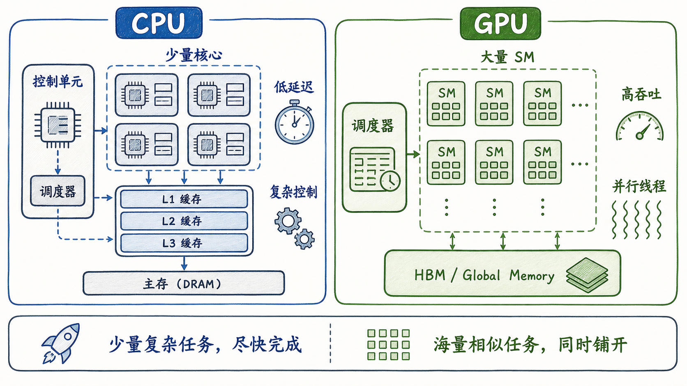
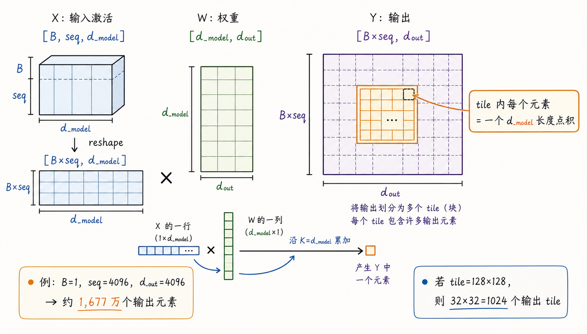
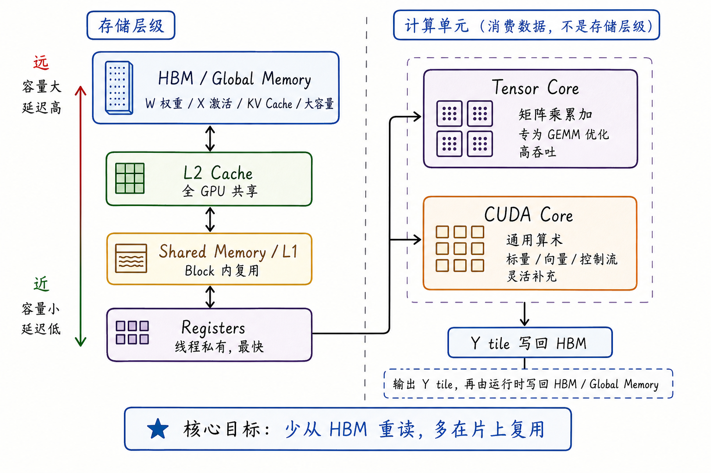
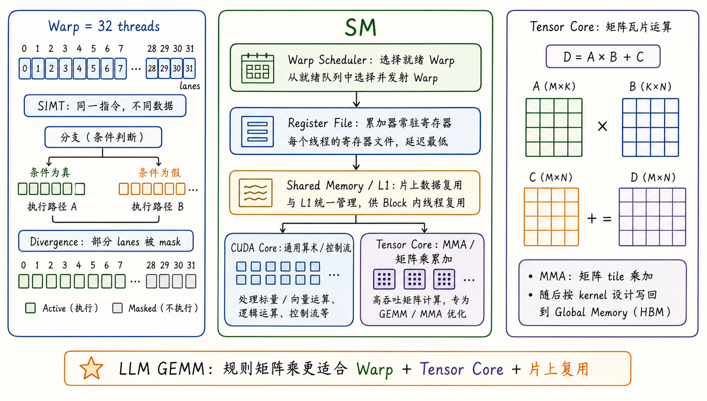
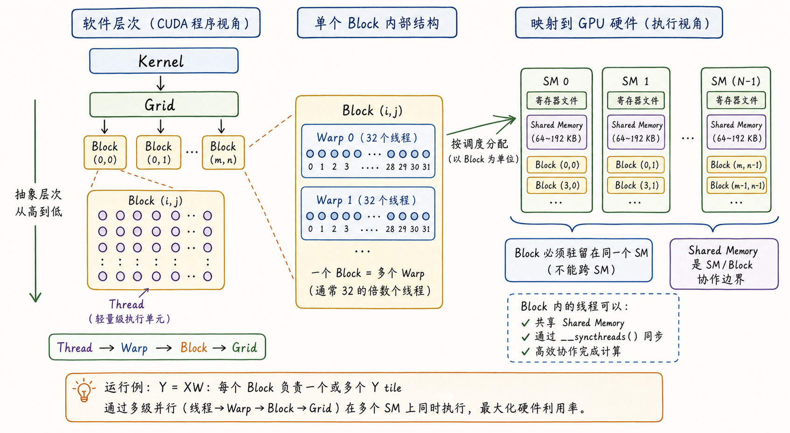
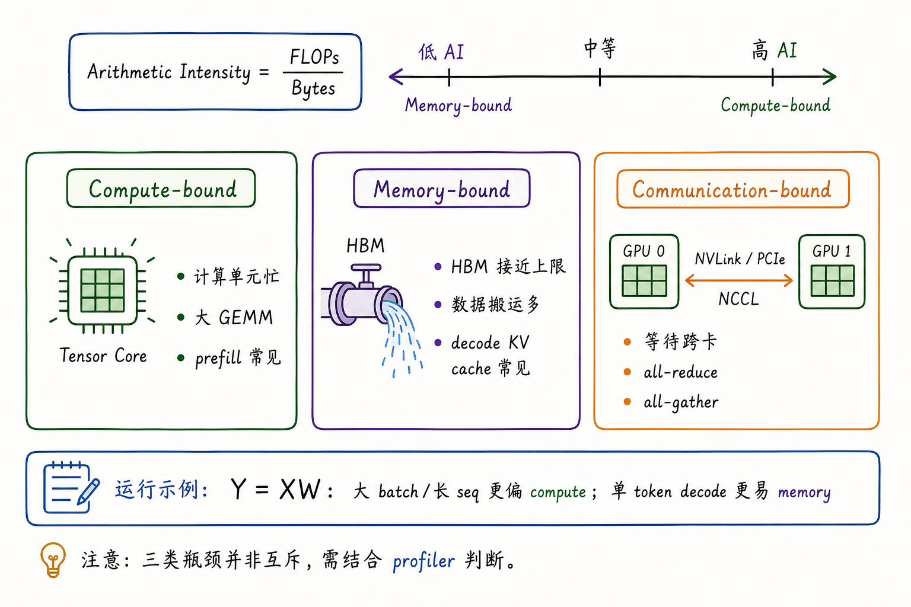

---
tags:
  - LLM
  - GPU
  - CUDA
  - NVIDIA
  - model-serving
updated: 2026-06-06
description: 面向大模型与推理全栈初学者，建立 GPU 设计哲学、存储层级、SM/Warp/Tensor Core 与 CUDA 执行模型的基础心智模型，为后续理解 LLM 性能与推理系统打底。
---

# 大模型与推理全栈精讲系列 01：理解GPU架构及其原理

> [!Quote] 本篇导读
>
> 因为工作、学习等原因，我们或多或少都会和各种算力卡打交道：什么GPU、NPU、昆仑芯诸如此类啦，名字一个比一个多，类似L20、H20、Ascend 300I Duo等等这类算力卡型号也常常出现在文档、部署方案或者性能评测里。很多时候，我们会去看看这张卡的显存多大、算力多少、带宽多高，仿佛这些数字加起来，就能说明一张卡到底有多强。
>
> 但真正用起来之后会发现，事情往往没那么简单。同样标着很高的算力，不同任务上的表现可能差很多。显存看起来够大，性能却不一定跑得起来，换了一张理论上更强的卡，也不意味着所有场景都会等比例变快。算力卡的性能，从来不是几个参数简单相加的结果。
>
> 要理解这些差异，最终还是要回到硬件本身：理解在硬件底层，数据是怎么被搬运的，计算是怎么被并行展开的，任务是怎么被调度到成百上千个计算单元上的，以及算力卡的性能瓶颈到底有哪些。
>
> 这一篇我们先从最典型、也最重要的一类算力卡，即GPU讲起。我们不会急着罗列各种术语，而是从CPU和GPU的差异出发，再通过一个贯穿全文的计算示例，把GPU的存储层次、计算单元、执行模型和性能瓶颈串起来。理解了这些基本原理后，后面再看不同型号的卡、不同任务的性能表现，乃至于进一步学习推理相关知识点时，就会更容易建立自己的判断。

## 1. GPU的设计哲学

### 1.1 CPU与GPU解决的是不同问题

CPU和GPU都能执行程序，但它们从一开始就不是为同一种工作负载设计的。

CPU追求的是低延迟和通用控制能力。它通常拥有少量复杂核心、较强的分支预测、乱序执行能力、多级缓存和复杂控制逻辑，适合操作系统调度、文件网络I/O、复杂业务逻辑、串行依赖强的程序，以及对单个任务响应时间敏感的场景。

GPU追求的是高吞吐。它不指望某一个线程像CPU核心那样强，而是准备了大量较轻量的执行资源，让成千上万个线程同时做形状相似的工作。

总的来说，可以把两者的差异压缩成一句话：**CPU擅长把少量复杂任务尽快做完，GPU擅长把海量相似任务同时铺开。**

其架构差异可以通过下图呈现出来：



到了大模型时代，这种差异被进一步放大。模型推理和训练都不是偶尔做一次小计算，而是反复处理大批量张量：一批 token 会变成一批向量，一层层权重会参与矩阵运算，中间结果还要继续传给下一层。这里最常见的工作形态，正是大量位置上重复执行相似的数值计算。

因此，大模型会大量依赖 GPU，并不是因为 GPU 对模型语义有特殊理解，而是因为矩阵乘、向量加法、归一化、激活函数等操作都能被拆成许多形状相似的小任务。只要任务规模足够大、结构足够规则，GPU 的高吞吐优势就有机会释放出来。

### 1.2 用矩阵乘看并行性

上一小节说 GPU 喜欢海量相似任务，但这句话还比较抽象。下面看一个大模型里反复出现的计算：`Linear` 层。暂时不需要理解它在神经网络里的全部语义，只需要知道它做了一件事：把一批输入向量乘上一块权重矩阵，得到一批新的输出向量。

一个 `Linear` 层常常可以写成矩阵乘。设它满足：
$$
X \in \mathbb{R}^{B \times seq \times d_{model}}, \quad
W \in \mathbb{R}^{d_{model} \times d_{out}}, \quad
Y \in \mathbb{R}^{B \times seq \times d_{out}}
$$

通常可以先把 $X$ 展平成二维矩阵：
$$
X' \in \mathbb{R}^{(B \cdot seq) \times d_{model}}
$$

于是计算变成：
$$
Y = X'W
$$

如果第一次看到这些符号，可以先抓住直觉：$B$ 表示一次处理多少组输入，$seq$ 表示一次处理多少个位置，$d_{model}$ 和 $d_{out}$ 表示每个位置上的向量宽度。

把 $X$ 展平以后，输出矩阵 $Y$ 的每一个元素，本质上都是一个长度为 $d_{model}$ 的点积。也就是说，输出里有：
$$
B \cdot seq \cdot d_{out}
$$
个可以并行组织的输出位置。

如果 $B=1$，$seq=4096$，$d_{out}=4096$，那么输出元素数量约为 1677 万。这里先不要急着关心每个点积具体怎么做，先看任务形状：输出矩阵里有大量彼此相似的位置，每个位置都在做“取一段输入、取一段权重、做乘加累积”这类工作。

这就给了 GPU 发挥空间。它不会让一个线程把 1677 万个输出元素从头算到尾，而是会把输出矩阵切成许多更小的 tile，让不同计算资源分头处理不同 tile。



从这个例子可以看到，GPU 的“快”不是简单来自频率更高，也不是来自某个单独线程更聪明，而是来自任务规模足够大、形状足够规则、数据访问足够友好时形成的吞吐优势。

沿着 $Y=XW$ 继续往下看，会自然遇到几个问题：这些 tile 需要的数据从哪里来；数据到达后由哪些硬件单元计算；软件又如何把整片输出空间交给 GPU 执行。后面的存储层级、SM 架构和 CUDA 执行模型，都会围绕这些问题展开。

第 2 节先回答第一个问题：并行工作开始之前，数据要放在哪里，又要怎样靠近真正执行计算的位置。

## 2. 存储层级

上一节只解决了“工作能不能拆开”。但拆开以后还有一个更实际的问题：每个小任务开始计算之前，都要先拿到自己需要的数据。计算单元再多，如果数据迟迟送不到，它们也只能等。

### 2.1 显存与片上存储

GPU 的存储不是一个平坦的大空间，而是一个分层系统：**越靠近计算单元，容量通常越小、延迟越低、访问越快；越远离计算单元，容量越大、延迟越高。**

对大模型来说，权重、激活、KV cache 和中间 buffer 的规模都很大，通常不可能长期放在离计算单元最近的那一点小容量存储里。它们大多先放在设备显存中，也就是 GPU 自己管理的大容量内存空间里。真正执行某一小块计算时，GPU 会把马上要用、还会被反复使用的数据搬到更靠近计算单元的位置。

为了先建立层级感，可以把这些存储位置粗略分成四层。这里先看它们的直觉和在 LLM 中的角色，具体如何被程序调度，后面讲 CUDA 执行模型时再展开。

| 层级 | 直觉 | 在 LLM 中的角色 |
| --- | --- | --- |
| HBM / Global Memory | 容量大、带宽高，但离计算单元远 | 存放权重、激活、KV cache、临时 buffer； |
| L2 Cache | 全 GPU 共享缓存 | 多个计算区域访问共享数据时的重要缓冲层； |
| Shared Memory / L1 | 靠近计算现场，适合一小组线程协作复用 | 高性能矩阵乘会把 tile 搬进来反复使用； |
| Registers | 每个线程私有，最快但总量有限 | 存放局部变量、累加器和小片段中间值； |

这里先抓住一个简单分工：上面这些层级负责存放或临时缓存数据；真正执行乘法、加法和矩阵乘累加的硬件单元，会在下一节再介绍。也就是说，一次计算能不能顺利展开，不只取决于“有没有足够的计算单元”，还取决于数据能不能以合适的节奏来到这些计算单元附近。

把这个层级放回 $Y=XW$，问题会更具体。$Y$ 里的一个元素需要读取 $X$ 的一段行数据和 $W$ 的一段列数据，然后做点积。相邻的输出元素并不是完全陌生的：同一行的多个输出会反复用到同一段 $X$，同一列方向的多个输出也会反复用到相邻的 $W$ 数据。

如果每个输出元素都独自从 HBM 里把自己需要的数据重新读一遍，很多带宽会浪费在“搬同样或相邻的数据”上。GPU 矩阵乘真正想做的是：先把一小块 $X$ 和一小块 $W$ 搬到更近的位置，让一批输出 tile 反复使用它们；中间累加结果尽量留在寄存器里，等一个 tile 算完后再写回 HBM。



因此，一个高性能矩阵乘实现的核心努力，可以粗略理解为：

- 少从 HBM 重复读取已经能被复用的数据；
- 把 $X$ 和 $W$ 的小块 tile 搬到 Shared Memory / L1 或寄存器附近；
- 让同一块数据被尽可能多的乘加操作复用；
- 把中间累加结果留在寄存器里，最后再写回 HBM；

到这里，$Y=XW$ 又多了一层含义：它不只是一组可以并行的输出位置，还是一场数据搬运与复用的组织问题。接下来用同一块权重矩阵看一个更贴近推理的现象：为什么 prefill 和 decode 的数据压力并不一样。

### 2.2 prefill 与 decode

先把数据搬运的直觉落到具体数字上。假设 $d_{model}=4096$，$d_{out}=4096$，权重矩阵 $W$ 的元素数量是：

$$
4096 \times 4096 = 16{,}777{,}216
$$

如果用 FP16 或 BF16 存储，每个元素 2 bytes，那么这个权重矩阵约为 32 MiB。它不是一个抽象矩阵，而是一块真实占用显存、计算时需要被读取的数据。

但只知道“权重有 32 MiB”还不够。更关键的问题是：这块权重被读进来以后，能服务多少计算。推理时可以先粗略区分两种形态。

第一种是 prefill，也就是一次处理已有上下文中的多个 token。假设一次处理 $seq=4096$ 个 token，那么 $X'$ 的形状大约是 $[4096,4096]$，$W$ 是 $[4096,4096]$，输出也是 $[4096,4096]$。计算量约为：

$$
2 \times 4096^3 \approx 1374 \text{ 亿 FLOPs}
$$

此时同一份 $W$ 可以被许多 token 行复用，读入一批权重后能支撑大量乘加运算。矩阵形状越大、数据复用越充分，GPU 越容易把这些计算组织成高吞吐的大矩阵乘。

第二种是 decode，也就是模型逐步生成新 token。假设每次只生成一个 token，$X'$ 的形状接近 $[1,4096]$，$W$ 仍然是 $[4096,4096]$。计算量约为：

$$
2 \times 1 \times 4096 \times 4096 \approx 3355 \text{ 万 FLOPs}
$$

看起来计算量也不小，但和 prefill 相比，每次新 token 只提供很少的输入行，同一份 $W$ 能被摊薄的计算更少。换句话说，decode 不是“没有计算”，而是每次计算规模更小，权重读取、KV cache 读取和 batch 组织方式更容易影响实际速度。

所以，这里不能只看 FLOPs 的绝对值。prefill 的优势在于大块计算和较好的权重复用；decode 的难点在于逐 token 推进、输入规模小、数据读取压力更容易暴露。后续推理系统之所以重视 batching、KV cache 管理和 attention 优化，就是因为它们都在影响“每次搬数据之后，能不能产生足够多有用计算”。

这个例子先不用追求 profiler 级别的精确，只要记住一个稳定直觉：**大矩阵乘能否快，不只看 FLOPs，还要看这些 FLOPs 是否建立在足够高的数据复用之上。**

### 2.3 带宽与算力的量级差异

上面的例子说明了直觉：prefill 和 decode 面对的数据压力不同。接下来用硬件峰值数字建立量级感，并引入一个判断工具。

以 NVIDIA A100 80GB SXM 产品实现为例，官方规格给出的 dense FP16 矩阵计算峰值为 312 TFLOPS；如果使用结构化稀疏路径，标称峰值可到 624 TFLOPS。这个峰值来自后文会介绍的 Tensor Core 路径。它的 HBM2e 带宽约为 2,039 GB/s；A100 80GB PCIe 版本的带宽则约为 1,935 GB/s。本文只用这些数字建立量级感，避免把不同产品形态、dense/sparse 路径和实际实现性能混成一个数字。

这里最重要的不是记住某个具体数值，而是看到一个事实：算力峰值和显存带宽不是同一个量纲，二者之间的差距会逼出“每搬一次数据，到底能做多少计算”这个问题。

注意，这里的数字是硬件峰值，不等于任意 PyTorch 代码都能达到。它们的作用是告诉我们：如果一个算子每从显存读入很少数据就能做大量计算，它更有机会接近计算上限；如果一个算子读写了大量数据却只做很少计算，它就更容易被 HBM 带宽限制。

这引出一个重要概念：Arithmetic Intensity，常译为计算强度。

$$
\text{Arithmetic Intensity} = \frac{\text{FLOPs}}{\text{Bytes moved}}
$$

它描述的是“每搬运 1 byte 数据，能做多少次浮点计算”。回头看 prefill 和 decode 的对比：prefill 的大矩阵乘让同一份 $W$ 被许多 token 行共享，计算强度高；decode 每次只用一行 $X'$，$W$ 的读取开销难以被大量计算摊薄，计算强度低。这正是两者性能特征不同的核心原因。

计算强度越高，越可能是 compute-bound；计算强度越低，越可能是 memory-bound。实际判断还要看硬件、精度、具体实现、缓存复用和访问模式，但这个概念足以帮助初学者建立第一层判断。第 5 节还会把它直接用于性能瓶颈分类。

现在，$Y=XW$ 又多了一层含义：它不仅是一组并行点积，还是一场数据搬运与复用的组织问题。上面几节回答了“数据从哪里来”；下一节回答“数据到达计算附近后，哪些硬件单元真正消耗它”。

## 3. SM 架构

### 3.1 SM 是 GPU 的基本计算单元

上一节讲的是数据怎么靠近计算发生的位置。现在再看真正执行计算的硬件。可以先把 GPU 想成由很多计算“车间”组成，每个主要车间就是一个 SM（Streaming Multiprocessor）。不同 GPU 代际的 SM 细节会变化，初学者也不需要一开始记住所有硬件细节，先抓住几个稳定组件即可：

| 组件 | 作用 | 说明 |
| --- | --- | --- |
| Warp Scheduler | 选择就绪 Warp 并发射指令 | 本篇 3.2 展开：用切换 Warp 的方式隐藏访存延迟； |
| Register File | 为线程提供私有寄存器 | 寄存器用量会影响一个 SM 上能同时安排多少工作，见 4.3； |
| Shared Memory / L1 | SM 附近的片上存储 | 一组线程协作复用数据的关键，贯穿整篇讨论； |
| CUDA Core | 通用标量/向量计算单元 | 适合通用算术逻辑；与 Tensor Core 的对比见 3.3； |
| Tensor Core | 矩阵乘累加专用单元 | 本篇 3.3 展开：LLM 中 GEMM、QKV projection、MLP 等高度依赖它； |

以 A100 产品实现为例，它启用了 108 个 SM。这个数字意味着什么？它不是说只有 108 个任务能并行，而是说 GPU 有 108 个主要计算“车间”。每个 SM 内部又可以同时安排多组线程，大量线程会在这些 SM 上分批执行。更底层的 GA100 芯片规格与具体产品启用配置可能不同，所以教程里谈硬件数量时要尽量说明产品形态。

继续看 $4096 \times 4096$ 的输出矩阵。如果假设一个输出 tile 是 $128 \times 128$，那么输出矩阵可以被切成：

$$
32 \times 32 = 1024
$$

个输出 tile。可以先粗略理解为：这些 tile 会被分批分配到不同 SM 上执行。真实 cuBLAS 或 CUTLASS 风格的矩阵乘实现会更复杂：它们会沿 $M/N/K$ 维度选择不同 tile 形状，使用流水、双缓冲和寄存器累加。这里暂时不展开这些优化细节；1024 个 tile 已经足以说明 GPU 为什么能把一个矩阵乘变成许多并行工作。

### 3.2 Warp：32 个线程绑在一起执行

CUDA 编程里最小的显式执行实例是 Thread，但 NVIDIA GPU 的硬件调度常以 Warp 为单位。一个 Warp 通常包含 32 个 Thread。

NVIDIA 把这种模型称为 SIMT（Single Instruction, Multiple Threads）。可以把它理解为：同一个 Warp 内的线程通常执行同一条指令，但每个线程处理不同数据。Volta 之后的架构引入了更细粒度的 Independent Thread Scheduling，不过对性能直觉来说，同一 Warp 内控制流越一致、访存越规整，通常仍然越容易获得高效率。对矩阵乘来说，这很自然：一组线程可以同时处理不同输出元素、不同矩阵片段，执行路径高度相似。

Warp 模型带来两个关键后果。

第一，访存模式很重要。如果同一个 Warp 内相邻线程访问连续地址，硬件更容易把访问合并成高效的内存事务；如果线程访问地址很分散，就会浪费带宽。

第二，分支发散有代价。如果一个 Warp 内部分线程走 `if` 分支 A，另一部分线程走分支 B，硬件不能让同一 Warp 同时完整执行两条不同路径。通常会分段执行不同分支，未走当前路径的 lanes 被 mask 掉。于是实际有效吞吐下降。

这解释了为什么 LLM 的大矩阵乘天然适合 GPU：矩阵乘结构规则、数据布局可优化、控制分支少，非常适合 Warp 级 SIMT 执行。相反，如果一个算子有大量不规则分支、随机访存或稀疏控制逻辑，GPU 的高吞吐优势就会更难发挥。

### 3.3 Tensor Core：矩阵乘的专用加速器

CUDA Core 可以执行通用数值计算，但 LLM 中最重要的一类工作是矩阵乘累加。为此，NVIDIA GPU 提供了 Tensor Core 这样的专用矩阵计算单元。

Tensor Core 做的不是“理解神经网络”，而是高吞吐地执行类似下面的矩阵 tile 操作：

$$
D = A \times B + C
$$

其中 $A$、$B$、$C$、$D$ 是小矩阵 tile。大型 GEMM 会被拆成许多这样的 tile 级操作，再组合成完整输出。



用 A100 的官方峰值做量级对比：FP32 CUDA Core 峰值约 19.5 TFLOPS，而 FP16 Tensor Core 峰值约 312 TFLOPS，不考虑稀疏加速时峰值差距约为 16 倍。这不是说任意 `float16` 代码都会自动快 16 倍，而是说明：当问题能被组织成 Tensor Core 友好的矩阵乘，并且数据供应、tile 形状、精度路径、具体实现都匹配时，硬件提供了远高于通用路径的矩阵吞吐上限。

常见精度路径可以只从硬件层面先这样理解：

| 精度路径 | 本篇需要记住什么 |
| --- | --- |
| FP32 | 通用高精度语义，具体可能走 CUDA Core FP32 路径，也可能在框架默认设置下使用 TF32 Tensor Core 近似加速；
| TF32 | Ampere 之后面向 FP32 矩阵乘代码的 Tensor Core 加速路径；
| FP16 | LLM 训练和推理中的经典半精度路径；
| BF16 | 指数范围接近 FP32，LLM 训练和推理常用；
| FP8 | Hopper/H100、Blackwell 等后续架构上的重要低精度矩阵计算方向，A100 不提供 FP8 Tensor Core 路径；
| INT8 / INT4 | 推理量化常见，但量化策略不属于本篇主线；

这里要克制边界：本篇只解释“为什么低精度矩阵路径能更快”，不展开 INT8/INT4 量化如何校准、哪些层要保护、反量化开销如何权衡。这些属于后续量化与推理优化专题。

### 3.4 Tensor Core 如何消费一个输出 tile

理解 Tensor Core 怎么实际工作，需要把注意力放在 K 维度上。一个输出 tile 的每个元素，是 $X$ 的某一行与 $W$ 的某一列沿 $K=d_{model}$ 方向做的完整点积。这个点积不是一次算完的，而是沿 K 方向分成多轮推进。可以把单个输出 tile 的执行过程拆成四步：

1. **取一小段 K**：从 Shared Memory / L1 或寄存器附近取一小块 $X$ tile 和一小块 $W$ tile；
2. **做一次 tile 乘加**：Tensor Core 执行一次 $D = A \times B + C$；
3. **在寄存器里累加**：本轮结果累加到寄存器中的 $C$，而不是立刻写回 HBM；
4. **循环并写回**：继续推进 K 维度，直到完整点积结束，再把最终输出 tile 写回 HBM；

这个过程有一个关键硬件约束：累加器必须留在寄存器中，而不是每轮都写回 Shared Memory 或 HBM。寄存器是 SM 上最快的存储，但总量有限。如果一个输出 tile 需要的累加器太多，SM 上能同时驻留的 Warp 数就会减少。

这就是 tile 形状为什么是高性能 GEMM 里最重要的调参对象：tile 太小，Tensor Core 每次只做很少乘加就要切换，吞吐上不去；tile 太大，寄存器压力过高，反而减少可驻留 Warp，调度器找不到足够就绪 Warp 来隐藏延迟。所谓“优化矩阵乘”，核心是在 Tensor Core 吞吐、寄存器压力和 Warp 级并发之间找到平衡点，而不是简单地让循环跑得快。

此时，$Y=XW$ 的一个输出 tile 有了完整的硬件执行图像：沿 K 轮循环 → 每轮从片上存储取小块 → Tensor Core 做 tile 乘加 → 累加器留在寄存器 → 循环结束写回 HBM。

不过，到这里我们讲的仍然主要是硬件视角：数据放在哪里，SM 里有哪些执行单元，一个 tile 如何被计算。真实写程序时，开发者并不会直接对某个 SM 下命令，也不会手动指定某个 Warp 去执行哪一段输出。还需要一个软件层面的执行模型，把“我要做一次矩阵乘”这样的请求组织成 GPU 能调度的任务。

## 4. CUDA 执行模型

### 4.1 从软件层次映射到硬件

大多数大模型学习者不需要一开始就手写 CUDA，但必须知道框架 API 最终会落到怎样的执行模型上。以 NVIDIA GPU 为代表，CUDA 就是连接“软件请求”和“硬件执行”的核心抽象：上层框架提交一段 GPU 上执行的任务，CUDA 把它组织成一批可以被 GPU 调度的并行工作单元。

从编程视角看，CUDA 的基本层次是：

```text
Kernel -> Grid -> Block -> Thread
```

从硬件执行视角看，还要理解：

```text
Thread -> Warp -> Block -> SM
```

它们的关系可以这样记：

| 层级 | 含义 | 直觉 |
| --- | --- | --- |
| Kernel | 一段在 GPU 上执行的函数 | 一次提交给 GPU 的并行任务；
| Grid | 一个 kernel 启动时的所有 Block | 整个任务网格；
| Block | 一组可以协作的 Thread | 同一 Block 内可共享 Shared Memory，并可做同步；
| Thread | 最小程序执行实例 | 处理一小份数据；
| Warp | 通常 32 个 Thread 组成的硬件调度单位 | 理解 SIMT、合并访存和分支发散的关键；
| SM | Block 被调度驻留的硬件执行单元 | 常规 thread block 语义下，同一个 Block 必须驻留在同一个 SM 上；



“同一个 Block 必须驻留在同一个 SM 上”是常规 thread block 语义下非常关键的边界。因为 Block 内线程能够共享 Shared Memory，并且可以通过同步原语协作。如果一个 Block 跨多个 SM，Shared Memory 和同步语义就很难成立。CUDA 的设计把 Block 作为一个局部协作单位，把 Grid 作为全局并行任务集合。Hopper 之后的 thread block cluster 和 distributed shared memory 属于更高级的协作模型，本篇不展开。

把 $Y=XW$ 交给 CUDA 时，一个直观映射是：Grid 覆盖整个输出矩阵；每个 Block 负责一个或多个输出 tile；Block 内的 Thread 被组织成若干 Warp；Warp 内线程协同加载数据、执行乘加、累加局部结果；最终把对应的 $Y$ tile 写回显存。真实高性能库会比这个模型复杂，但初学者先抓住这个映射，就能把 PyTorch 里的 `matmul` 和 GPU 硬件联系起来。

### 4.2 Kernel launch 与异步执行：为什么测量会错

CUDA kernel 启动通常是异步的。CPU 提交 kernel 后，不一定等 GPU 完成计算才继续执行下一行代码。框架会通过 stream、event 和同步点组织依赖。

理解 kernel launch 不只是为了看懂执行结构，也会直接影响我们如何测量 GPU 程序。对初学者来说，最常见的问题是：测 GPU 时间时，如果用 CPU 侧墙钟时间，需要在计时边界同步。

不严谨的写法是：

```python
import time
import torch

x = torch.randn(4096, 4096, device="cuda")
w = torch.randn(4096, 4096, device="cuda")

t0 = time.time()
y = x @ w
print(time.time() - t0)
```

这段代码可能主要测到 CPU 提交 kernel 的时间，而不是 GPU 真正完成矩阵乘的时间。更稳的写法是：

```python
import time
import torch

x = torch.randn(4096, 4096, device="cuda")
w = torch.randn(4096, 4096, device="cuda")

torch.cuda.synchronize()
t0 = time.time()
y = x @ w
torch.cuda.synchronize()
print(time.time() - t0)
```

更专业的计时可以使用 CUDA events、PyTorch Profiler、Nsight Systems 或 Nsight Compute。这里先记住一点：GPU 不是 CPU 的同步函数调用，很多操作是排队提交、异步执行的。

### 4.3 Occupancy：并发不是越多越好

Occupancy 描述的是一个 SM 上实际驻留的 Warp 数量与理论最大可驻留 Warp 数量之间的比例。它受多种资源限制影响：

- 每个线程使用多少寄存器；
- 每个 Block 使用多少 Shared Memory；
- 每个 Block 有多少 Thread；
- 每个 SM 最多能驻留多少 Block 和 Warp；
- 当前实现是否有足够并行工作；

Occupancy 的意义在于 latency hiding。访问 HBM 的延迟很高，如果一个 SM 上只有很少 Warp，一旦它们都在等数据，计算单元就会空闲。更高的 occupancy 往往意味着有更多就绪 Warp 可供调度器切换，从而隐藏内存延迟。

但“occupancy 越高越好”也是错误的。它和性能的关系取决于算子类型。

| 算子类型 | Occupancy 的重要性 | 更关键的观察 |
| --- | --- | --- |
| Memory-bound | 通常更敏感 | LayerNorm、Softmax、element-wise、decode KV cache 读取等场景，需要更多并发来隐藏访存延迟；
| Compute-bound | 不一定越高越好 | 大 GEMM 更关键的是 Tensor Core 利用率、tile 形状、数据复用、流水是否充分；
| 混合型算子 | 需要 profiler 判断 | attention、fused kernel、采样等可能同时受计算、访存和调度影响；

高性能 GEMM kernel 有时会故意使用更多寄存器或 Shared Memory 来提高数据复用，导致 occupancy 不是满的，但整体更快。相反，一个逐元素算子如果 occupancy 太低，可能根本没有足够 Warp 来覆盖显存访问延迟。

因此，正确表述不是“occupancy 不重要”，而是：

**occupancy 是延迟隐藏能力的重要线索，但不是最终目标；最终目标是让当前算子的主要瓶颈被正确缓解。**

### 4.4 从单个 tile 到整个 Grid

3.4 描述的是单个输出 tile 在硬件上如何执行。现在把视角拉远：整个输出矩阵有 1024 个这样的 tile，CUDA 要解决的是如何把它们组织成一个可以提交、调度和分配的任务集合。

映射关系是这样的：一个 CUDA kernel 覆盖整个矩阵乘任务，对应输出矩阵 $Y$ 的全部计算；kernel 启动一个 Grid，Grid 里的每个 Block 负责一个或多个输出 tile 的计算；Block 内的 Thread 被分组成若干 Warp，每个 Warp 分到更小的片段；GPU 的调度器把这些 Block 分批分配到 108 个 SM 上，每个 SM 上同时驻留若干 Block 并发执行。

从程序员的角度看，写 `torch.matmul(x, w)` 时实际上在做的是：把一个 $4096 \times 4096$ 的输出空间切分成 1024 个任务单元，以 Grid→Block→Thread 的形式提交给 GPU，让调度器决定哪些 Block 先跑、跑在哪个 SM 上。程序员不需要手动指定“这个 Block 去第 7 号 SM”，CUDA 的执行模型把这个调度决策交给硬件。

这和 3.4 的区别在于：3.4 讲的是一个 Block 内部，Warp 怎么沿 K 轮循环推进、Tensor Core 怎么消费 tile、累加器怎么留在寄存器——这是**单个任务单元的执行行为**；4.4 讲的是 1024 个任务单元怎么被编号、打包、提交、分配——这是**整个任务集合的组织与调度**。两者合在一起，才构成从 `torch.matmul` 到硬件执行的完整链路。

这一节给 $Y=XW$ 加上的含义是“提交与分配”：矩阵乘不仅要在硬件上以 tile 为单位执行，还要先以 Grid/Block/Thread 为单位被组织和提交，才能让 GPU 调度器把工作铺到全部 SM 上。接下来，才能讨论这些工作为什么有时快、有时慢。

## 5. 三类性能瓶颈

### 5.1 先把瓶颈变成可判断的问题

现在回到导读中的那些现象：为什么 batch size 翻倍后吞吐不一定翻倍，为什么 prefill 和 decode 的速度差异很大，为什么换了峰值更高的 GPU 也不一定线性变快。前面的几件事已经连起来了：工作要能拆开，数据要能送到计算附近，计算单元要持续有数据可算，软件还要把任务排进 GPU。带着这些背景再看性能瓶颈，compute-bound、memory-bound、communication-bound 就不再只是三个英文标签。

现在可以把前面的内容归纳成一个诊断框架：

| 瓶颈类型 | 直觉 | 常见 LLM 场景 |
| --- | --- | --- |
| Compute-bound | 计算单元接近饱和，时间主要花在算 | 大 batch GEMM、prefill 中的大矩阵乘、训练中的 dense GEMM；
| Memory-bound | 计算单元在等数据，时间主要花在搬运 | decode KV cache 读取、LayerNorm、Softmax、element-wise、小 batch 推理；
| Communication-bound | 多设备之间等待数据交换或同步 | TP all-reduce、PP stage 边界、DP 梯度同步、多节点推理；



这三类不是互斥标签。一个 LLM 系统可能 prefill 更接近 compute-bound，decode 更接近 memory-bound，多卡 TP 又在某些层上受 communication-bound 影响。真正的判断通常需要 profiler，但这个框架能帮助你先问对问题。

### 5.2 Compute-bound：算力是主矛盾

Compute-bound 的直觉是：数据供应基本跟得上，主要时间花在计算上。典型例子是大规模 GEMM。此时继续减少一点显存读写未必是最主要收益，真正关键可能是：

- Tensor Core 是否被用上；
- 数据类型是否走到了合适精度路径；
- tile 形状是否适合硬件；
- batch 和序列长度是否足够大；
- kernel 是否有足够高的矩阵吞吐；

在 $Y=XW$ 中，prefill 阶段通常更容易接近 compute-bound。因为一次处理多个 token，$W$ 可以被许多 $X$ 行复用，矩阵形状大，Tensor Core 更容易保持忙碌。不过这不是绝对规律：如果 batch、seq、kernel 选择或硬件资源不同，仍然需要 profiler 验证。

### 5.3 Memory-bound：带宽是主矛盾

Memory-bound 的直觉是：计算单元并没有被喂饱，它们经常在等待数据。典型例子包括 LayerNorm、Softmax、element-wise 操作、采样、decode 阶段频繁读取 KV cache，以及小 batch 下的矩阵乘。

此时优化方向通常不是“再加一点计算单元”，而是：

- 减少 HBM 读写次数；
- 提高数据局部性和复用；
- 改善内存访问连续性；
- 使用 fused kernel 减少中间结果落回 HBM；
- 通过 batching 提高每次读入数据的计算利用率；

这也解释了 FlashAttention 一类 IO-aware 方法为什么重要：它的核心教学价值不是“换了一个 attention 公式”，而是通过 tiling 和重计算等策略减少 HBM 访问，把原本昂贵的数据搬运压力降下来。

在 $Y=XW$ 中，小 batch decode 阶段更容易 memory-bound。每次只处理少量新 token，权重和 KV cache 的读取压力难以被大量计算摊薄。即使 GPU 峰值 FLOPs 很高，也可能因为数据搬运跟不上而跑不满。

### 5.4 Communication-bound：多卡时通信是主矛盾

单卡 GPU 学明白之后，后续还会进入多卡推理和训练。多卡不是把 GPU 数量乘上去就自动线性加速，因为设备之间需要交换数据。

常见通信包括：

- Tensor Parallelism 中的 all-reduce 或 all-gather；
- Pipeline Parallelism 中 stage 之间传递激活；
- Data Parallelism 中训练梯度同步；
- Expert Parallelism 中 token dispatch 和 combine；

当通信时间占主导时，单卡 kernel 本身可能并不慢，但整体 step time 或 token latency 被跨卡链路拖住。此时需要关注 NVLink、PCIe、InfiniBand、NCCL collective、通信重叠、分片策略和拓扑。

本篇不展开多卡算法，只建立一个硬件直觉：**一旦张量被切到多张 GPU 上，性能就不只由每张卡的 SM 和 HBM 决定，还由卡与卡之间的数据交换决定。**

### 5.5 用 Arithmetic Intensity 做第一层判断

2.3 节已经引入了 Arithmetic Intensity 的定义和 prefill/decode 的对比。这里把它直接用作三类瓶颈的诊断起点。

面对一个具体算子，可以先问：它的计算强度高还是低？如果高，优先检查 compute-bound 方向——是否用上 Tensor Core，矩阵形状是否足够大，精度路径是否匹配；如果低，优先检查 memory-bound 方向——是否反复读写 HBM，是否能通过 fusion、tiling 或 batching 减少搬运次数；如果是多卡场景，还要单独问 communication-bound——collective 时间是否在关键路径上，通信能否与计算重叠。

这不是最终判决，而是第一层提问方式。后续学习 FlashAttention、PagedAttention、TP、PP、EP、KV cache 管理、量化和 serving scheduler 时，都可以把这个框架带进去：很多“为什么这个优化有效”的答案，本质上都可以归入这三类瓶颈之一。

## 6. 本篇总结与系列导航

GPU 不是“更快的 CPU”，而是为高吞吐并行计算设计的处理器。它牺牲了单线程低延迟和复杂控制能力，换来大量线程、SM、Warp、片上存储和专用矩阵计算单元。大模型之所以适合 GPU，是因为 Transformer 中存在大量规则张量计算，尤其是 $Y=XW$ 这类矩阵乘，天然可以被拆成海量 tile 并行执行。

理解 GPU 要同时抓住三条线：**计算如何组织**（SM、Warp、CUDA Core、Tensor Core）、**数据如何移动**（HBM、L2、Shared Memory、Registers）、**软件如何把任务交给硬件**（Kernel、Grid、Block、Thread）。这三条线汇聚成一个性能判断框架：compute-bound、memory-bound、communication-bound。

带着这个框架往后学，遇到每一个新机制都可以先问三个问题：第一，它让计算更容易并行了吗；第二，它减少或重排了数据搬运吗；第三，它把问题切到多设备后引入了什么通信代价。FlashAttention 减少 HBM 访问次数，是 memory-bound 的应对；PagedAttention 改善 KV cache 显存利用率，是存储层级的延伸；TP/PP/EP 把张量切到多卡，通信开销随之而来，是 communication-bound 的起点；batching 和 serving scheduler 提升硬件利用率，是 compute/memory utilization 的工程实践。这个追问习惯，是大模型推理全栈学习里最值得建立的底层视角。

## 参考资料

1. NVIDIA A100 Tensor Core GPU Datasheet：A100 SM 数量、Tensor Core 峰值吞吐、HBM 带宽等硬件规格；https://www.nvidia.com/content/dam/en-zz/Solutions/Data-Center/a100/pdf/nvidia-a100-datasheet-nvidia-us-2188504-web.pdf；
2. NVIDIA A100 Tensor Core GPU Architecture：Ampere 架构、第三代 Tensor Core、TF32/BF16/FP16 等能力说明；https://images.nvidia.com/aem-dam/Solutions/Data-Center/nvidia-ampere-architecture-whitepaper.pdf；
3. NVIDIA H100 Tensor Core GPU：Hopper 架构、第四代 Tensor Core 与 FP8 Transformer Engine 背景；https://www.nvidia.com/en-us/data-center/h100/；
4. NVIDIA CUDA C++ Programming Guide：CUDA 编程模型、线程层级、内存层级、SIMT、Warp 与 Block 语义；https://docs.nvidia.com/cuda/cuda-c-programming-guide/；
5. NVIDIA CUDA C++ Best Practices Guide：occupancy、内存访问、性能优化和延迟隐藏相关建议；https://docs.nvidia.com/cuda/cuda-c-best-practices-guide/；
6. NVIDIA Matrix Multiplication Background User Guide：矩阵乘的维度、tile、性能背景与深度学习中的 GEMM 形态；https://docs.nvidia.com/deeplearning/performance/dl-performance-matrix-multiplication/index.html；
7. NVIDIA Deep Learning Performance Guide：深度学习算子性能、Tensor Core 使用和通用性能分析入口；https://docs.nvidia.com/deeplearning/performance/index.html；
8. NVIDIA Nsight Compute Documentation：kernel 级 GPU 性能分析、occupancy、memory throughput、roofline 等观察方式；https://docs.nvidia.com/nsight-compute/；
9. NVIDIA Nsight Systems Documentation：系统时间线、CPU/GPU 并发、kernel launch 与多进程/多线程分析；https://docs.nvidia.com/nsight-systems/；
10. FlashAttention: Fast and Memory-Efficient Exact Attention with IO-Awareness：IO-aware attention 与减少 HBM 读写的典型论文；https://arxiv.org/abs/2205.14135；
11. vLLM / PagedAttention：KV cache block 管理和推理 serving 中的内存管理背景；https://docs.vllm.ai/en/latest/design/paged_attention/；

## 学习测评

### 题目

1. 单选：CPU 与 GPU 设计哲学的核心差异，哪项最准确？
   A. CPU 主要追求少量复杂任务的低延迟处理，GPU 主要追求大量相似任务的高吞吐处理；
   B. CPU 和 GPU 都主要追求单线程低延迟，只是 GPU 的显存容量更大；
   C. GPU 的优势主要来自每个线程都比 CPU 核心更复杂；
   D. CPU 和 GPU 的差异主要是显存容量，不是执行方式；

2. 单选：把 `Linear` 层写成 $Y=XW$ 后，哪里体现了 GPU 并行性？
   A. 因为输出矩阵中有大量位置可以被切成 tile 分配给不同计算资源；
   B. 因为权重矩阵只需要读取一次，后续不会再产生数据搬运压力；
   C. 因为输出元素之间存在强串行依赖，必须按顺序逐个完成；
   D. 因为只要有矩阵乘，就一定能达到硬件峰值；

3. 多选：以下哪些属于本文讨论的 GPU 存储或缓存层级，而不是计算单元？
   A. Registers；
   B. Shared Memory / L1；
   C. L2 Cache；
   D. Tensor Core；

4. 单选：为什么高性能矩阵乘会重视 tile 和片上复用？
   A. 因为 tile 可以让同一小块 $X$ 和 $W$ 被多个乘加操作复用，减少反复从 HBM 搬数据；
   B. 因为只要 tile 足够大，就一定能消除全部 HBM 访问；
   C. 因为 tile 只影响输出矩阵的编号方式，不影响数据搬运和复用；
   D. 因为 tile 越小越容易调度，所以可以不考虑 Tensor Core 利用率；

5. 单选：Arithmetic Intensity 的含义最接近哪一项？
   A. 每秒启动多少个 kernel；
   B. 每搬运 1 byte 数据能做多少 FLOPs；
   C. 每个 Warp 包含多少 Thread；
   D. 每个 Block 能否跨多个 SM；

6. 多选：关于 prefill 与 decode 的性能形态，哪些判断更合理？
   A. prefill 通常矩阵形状更大，更容易把 Tensor Core 喂饱；
   B. decode 每次 token 粒度小，更容易暴露 KV cache 和权重读取压力；
   C. decode 一定完全 compute-bound，因此不用关注 HBM 或 KV cache；
   D. prefill 与 decode 的瓶颈需要结合 batch、seq、kernel 和 profiler 判断；

7. 单选：SM（Streaming Multiprocessor）在初学阶段可以怎样理解？
   A. GPU 中主要的计算“车间”，Block 和 Warp 会被调度到 SM 上执行；
   B. 专门存放全部模型权重的显存区域；
   C. CPU 上负责提交 kernel 的线程；
   D. 只负责保存 Shared Memory，不参与 Warp 调度和算术执行；

8. 单选：理解 Warp 通常由 32 个 Thread 组成，最重要的学习价值是什么？
   A. 证明每个 Block 只能包含 32 个 Thread；
   B. 帮助理解 GPU 为什么偏好同一 Warp 内规则控制流和连续访存；
   C. 证明 Tensor Core 只能处理 $32 \times 32$ 矩阵；
   D. 说明 CUDA 程序不需要考虑 Block；

9. 单选：一个 Warp 中 20 个线程走 `if` 分支，12 个线程走 `else` 分支，最合理的性能直觉是什么？
   A. GPU 会把这个 Warp 自动拆成两个完全独立且无额外代价的 Warp；
   B. 分支路径通常需要分段推进，未走当前路径的 lanes 会被 mask，有效利用率下降；
   C. 只要使用 Tensor Core，Warp divergence 就完全不存在；
   D. 这种情况只影响 CPU，不影响 GPU；

10. 多选：Tensor Core 适合加速哪些类型的工作？
    A. 矩阵乘累加；
    B. LLM 中的 QKV projection；
    C. MLP 中的大 GEMM；
    D. 大量不规则分支控制逻辑；

11. 单选：以 A100 的峰值规格做教学对比时，FP16 Tensor Core 峰值远高于 FP32 CUDA Core 峰值，这个事实最应该如何理解？
    A. 任意 FP16 代码都会自动快 16 倍；
    B. 只要模型变成 FP16，就不会有内存瓶颈；
    C. 当工作负载、精度路径、tile 形状和 kernel 都适合 Tensor Core 时，硬件提供了更高的矩阵吞吐上限；
    D. CUDA Core 已经没有任何用途；

12. 多选：CUDA 执行模型中，哪些说法正确？
    A. Kernel 启动一个 Grid；
    B. Grid 包含多个 Block；
    C. 同一个 Block 内线程可以使用 Shared Memory 协作；
    D. 一个常规 Block 可以跨多个 SM 共享同一块 Shared Memory；

13. 单选：为什么用 CPU 侧 `time.time()` 测 GPU 操作时常需要 `torch.cuda.synchronize()`？
    A. 因为 CUDA kernel 启动通常是异步的；
    B. 因为 `time.time()` 会自动读取 Tensor Core 计数器；
    C. 因为 synchronize 会让 kernel 选择更快算法；
    D. 因为没有 synchronize 就无法创建 CUDA 张量；

14. 多选：关于 occupancy，哪些说法正确？
    A. 它与 SM 上可驻留 Warp/Block 的程度有关；
    B. 它受寄存器、Shared Memory 和 Block 大小等资源约束；
    C. 对 memory-bound 算子，高 occupancy 常有助于隐藏访存延迟；
    D. 对所有算子，occupancy 越高性能一定越好；

15. 多选：如果一个算子 memory-bound，哪些优化方向更可能有意义？
    A. 减少 HBM 读写；
    B. 使用 fused kernel 减少中间结果落回显存；
    C. 改善内存访问连续性；
    D. 优先增加不会复用数据的额外计算；

16. 单选：communication-bound 最可能出现在什么场景？
    A. 单卡上一个小 element-wise kernel 反复读写 HBM；
    B. 多卡 TP all-reduce、PP stage 传递或 DP 梯度同步；
    C. 单个 SM 内 Warp 发生分支发散；
    D. 一个 Block 内线程使用 Shared Memory 复用 tile；

17. 单选：某个小 batch decode 服务中，profiler 显示 Tensor Core 利用率不高，但 HBM 读写压力明显。最合理的第一层判断是什么？
    A. 它一定是 compute-bound，应优先换成 FP16 峰值更高的 GPU；
    B. 它更可能接近 memory-bound，应优先关注 KV cache、权重读取、batching 和数据复用；
    C. 它一定是 communication-bound，因为所有 decode 都必须跨多卡通信；
    D. 它的主要问题一定是 Block 跨多个 SM 导致 Shared Memory 失效；

18. 多选：batch size 翻倍后吞吐没有线性翻倍，可能有哪些合理原因？
    A. 原瓶颈可能不是纯计算，而是 HBM 访问、kernel 调度或通信；
    B. batch 变大后可能带来额外显存占用、KV cache 压力或调度开销；
    C. 只要 batch 变大，Tensor Core 利用率一定线性翻倍；
    D. 多卡场景下 collective 或跨 stage 传递可能进入关键路径；

19. 单选：一个 GEMM kernel 为了提高 tile 内数据复用使用了更多寄存器，导致 occupancy 没有满，但整体更快。这个现象说明什么？
    A. occupancy 完全没有意义；
    B. 任何时候都应该牺牲数据复用来追求满 occupancy；
    C. occupancy 是延迟隐藏线索，但最终目标是缓解当前算子的主要瓶颈；
    D. Tensor Core 只能在 occupancy 达到 100% 时工作；

### 答案与解析

1. 答案：A。CPU 更偏向低延迟和复杂控制，GPU 更偏向高吞吐和大量相似工作并行。B、C、D 都把差异说窄或说错了；

2. 答案：A。$Y=XW$ 的输出空间包含大量可组织的输出位置，可以被切成许多 tile 分配给不同计算资源。B 忽略权重读取，C 把并行问题说成串行，D 把硬件峰值当成了自动结果；

3. 答案：A、B、C。Registers、Shared Memory/L1 和 L2 都属于存储或缓存层级；Tensor Core 是计算单元，不是存储层级；

4. 答案：A。tile 的价值在于让数据靠近计算单元并被多次复用。B 夸大了 tile 的能力，C 忽略了数据搬运，D 忽略了 tile 形状与硬件资源之间的平衡；

5. 答案：B。Arithmetic Intensity 衡量每搬运 1 byte 数据能做多少 FLOPs，是判断 compute-bound / memory-bound 的重要直觉工具；

6. 答案：A、B、D。prefill 通常矩阵规模大、复用更好；decode token 粒度小，KV cache 与权重读取压力更突出。但最终判断仍要结合实际配置和 profiler。C 把 decode 说成必然 compute-bound，是危险的绝对化；

7. 答案：A。SM 是 GPU 内部主要执行单元，可以先类比成计算车间。它不是显存、CPU 线程或通信链路；

8. 答案：B。Warp 大小不是为了死记硬背，而是帮助理解 SIMT、合并访存和分支发散。一个 Block 可以有多个 Warp，Tensor Core tile 也不是简单等同于 $32 \times 32$；

9. 答案：B。SIMT 模型下，同一 Warp 中不同分支路径通常要分段推进，未走当前路径的 lanes 会被 mask，导致有效利用率下降。Volta 之后调度更细，但分支一致性仍然是重要性能直觉；

10. 答案：A、B、C。Tensor Core 的核心价值是高吞吐矩阵乘累加，LLM 中 QKV projection、O projection、MLP 等大 GEMM 都高度相关。D 这类不规则分支控制逻辑即使出现在 GPU kernel 中，也不属于 Tensor Core 擅长的矩阵 tile 乘加工作；

11. 答案：C。峰值差距说明硬件为矩阵类低精度计算提供了更高上限，但是否兑现取决于工作负载、数据类型、kernel 和数据供应；

12. 答案：A、B、C。A、B、C 是 CUDA 基本层级和 Block 协作语义。D 错，常规 thread block 不跨多个 SM 共享同一块 Shared Memory；更高级的 thread block cluster 不属于本篇主线；

13. 答案：A。CUDA kernel launch 常异步返回，不同步就可能只测到 CPU 提交任务的时间；

14. 答案：A、B、C。Occupancy 是延迟隐藏的重要线索，但不是所有算子的最终目标。D 错，大 GEMM 可能为了更高数据复用牺牲部分 occupancy；

15. 答案：A、B、C。Memory-bound 的核心是数据搬运压力，减少 HBM 读写、fusion、改善访问连续性都可能有效。D 如果没有提高复用，只是增加无关计算，通常不能解决瓶颈；

16. 答案：B。Communication-bound 来自设备之间的数据交换或同步，多卡并行策略中的 collective 和 stage 边界是典型来源。A 更接近 memory-bound，C 是 Warp 内执行效率问题，D 是片上复用策略；

17. 答案：B。小 batch decode 往往难以摊薄权重和 KV cache 的读取压力，如果 profiler 又显示 HBM 压力突出，就应先按 memory-bound 思路检查数据搬运、复用和 batching。A 把峰值算力当成唯一答案，C 和 D 都把问题过早归因到不符合场景的机制；

18. 答案：A、B、D。batch 变大通常有机会提高硬件利用率，但不会自动保证线性吞吐提升。瓶颈可能转移到显存读写、KV cache、调度、显存容量或多卡通信上。C 把 batch 与 Tensor Core 利用率的关系绝对化了；

19. 答案：C。occupancy 能帮助判断 SM 是否有足够 Warp 隐藏延迟，但它不是最终目标。对大 GEMM 来说，更好的 tile 形状、寄存器累加和片上复用可能比满 occupancy 更重要；
