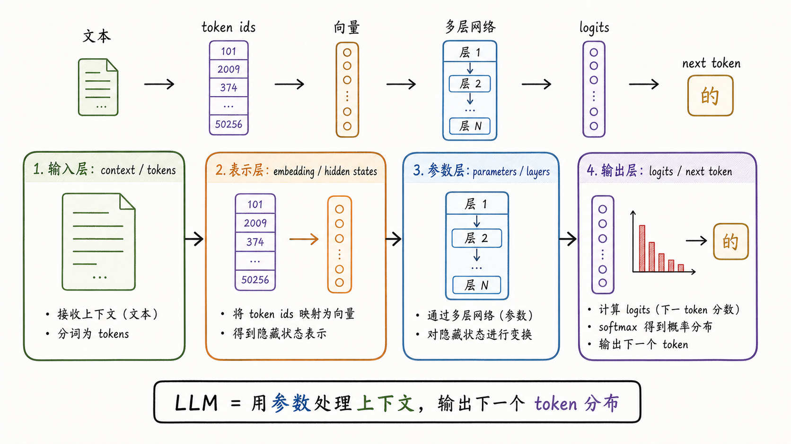
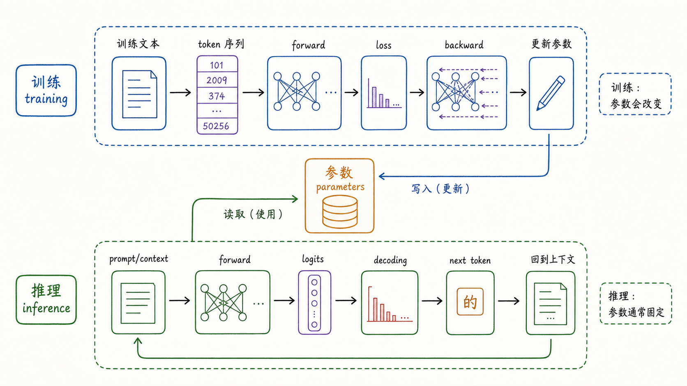
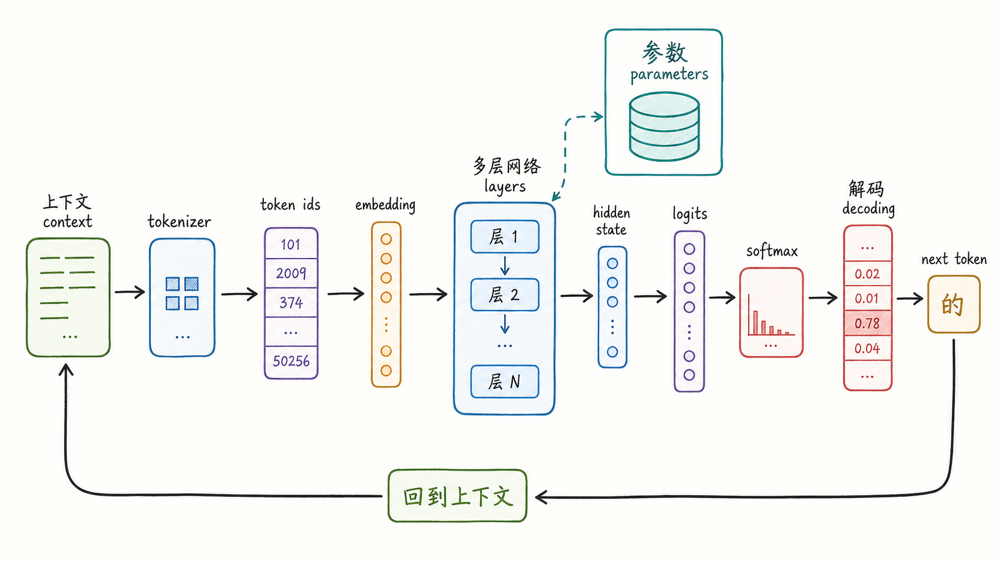
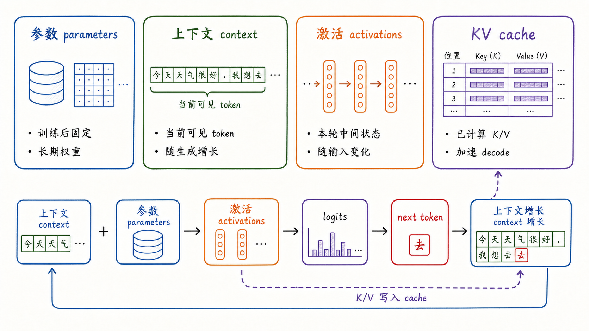

---
tags:
  - LLM
  - language-model
  - foundation-models
  - inference
  - tutorial
updated: 2026-06-10
description: 从 next-token 分布出发，建立 token、embedding、hidden state、logits、参数、上下文、激活与 KV cache 等基础对象的清晰边界，为后续序列建模、Attention 与推理系统打底。
---

# 02 大模型入门及其基本结构

> [!Quote] 本篇导读
> 大模型看起来能聊天、翻译、写代码、总结、问答、推理和调用工具，底层却始终围绕同一件事运转：根据当前上下文计算下一个 token 的概率分布，再把一个个 token 串成完整输出。
>
> 这个入口很简单，但它背后连接着一整套对象关系。文本要先被 tokenizer 切成 token，token id 要变成 embedding，位置关系要进入表示，多层 Transformer block 会不断改写 hidden state，最后的 logits 再变成 next-token distribution。训练负责把长期模式写进参数，推理负责用固定参数处理当前上下文，KV cache 则只是当前生成过程里的缓存状态。
>
> 这张底图能帮助后续概念归位：Attention 解释信息如何跨位置流动，架构演进解释模型为什么这样组织序列，推理系统解释 prefill、decode、batching 和显存压力从哪里来，RAG 与工具调用则解释可靠应用为什么不能只依赖模型参数。

## 1. 从上下文到 next-token 分布

### 1.1 空格背后的概率分布

先看一句普通的话：

```text
今天晚上我想吃 ___
```

人看到这个空格，会自然想到火锅、面条、米饭、烧烤等候选。这些候选不是随机飘出来的，它们受语法、场景、说话习惯、文化经验和前文共同约束。

语言模型做的事，也可以从这个空格开始理解：

**给定已经看到的 token 序列，计算下一个 token 的概率分布。**

用公式写就是：

$$
P(x_t \mid x_1, x_2, \ldots, x_{t-1})
$$

这里的 $x_t$ 不是一个字，也不一定是自然语言里的一个词，而是 tokenizer 切出来的 token。模型每一步并不是直接吐出完整答案，而是先给词表中每个候选 token 一个分数，再由解码策略选出下一个 token。

为了把下一个 token 猜准，模型会被训练压力推着学习很多隐藏结构：

```text
法国的首都是 ___
```

这里需要事实知识；

```text
如果明天下雨，我们就 ___
```

这里需要条件关系；

```text
他把苹果放进篮子，然后提着它走了。这里的它指的是 ___
```

这里需要指代消解和常识；

```python
def binary_search(nums, target):
    left, right = 0, len(nums) - 1
```

这里需要代码结构、变量约定和算法模式。

所以，next-token prediction 不是低级猜字游戏。它是一种训练压力：只要某种语言结构、事实模式、代码规律、推理格式或任务约束能降低预测损失，模型就会倾向于把它压缩进参数。

### 1.2 一个函数里的四类对象

把大语言模型抽象到最核心，可以写成一个函数：

$$
f_\theta(\text{context}) \to P(\text{next token})
$$

其中 $\theta$ 是模型参数，context 是当前可见 token 序列，输出是下一个 token 的概率分布。



这张图可以先建立四层心智模型：

- **输入层**：自然语言、代码、结构化文本、历史对话、检索片段和工具结果，都会被放进上下文，然后切成 tokens；
- **表示层**：token id 会被映射成 embedding，随后在多层网络里不断变成新的 hidden states；
- **参数层**：多层网络中的矩阵、向量和归一化参数，是训练后留下来的长期权重；
- **输出层**：最后的 hidden state 会被投影成 logits，再经过解码策略选出 next token；

大语言模型里的大，也不能单纯理解成参数更多。


一个模型的能力边界，至少由五类因素共同决定：

1. **参数规模**：决定模型可以容纳多少可学习模式，embedding table、Attention 投影矩阵、FFN 权重、输出层权重、归一化参数，都会成为参数的一部分，参数越多，潜在表达能力越强，训练和推理成本也越高；
2. **数据规模与质量**：决定训练信号从哪里来，语料覆盖面、去重质量、领域比例、代码比例、多语言比例、指令数据质量，都会改变模型最终能力；
3. **计算规模**：决定模型能否被充分训练，也决定推理阶段的服务成本，训练时要反复做大规模矩阵运算，推理时每生成一个 token 也要经过一次前向计算；
4. **上下文长度**：决定模型当前请求里最多能看到多少 token，它不是永久记忆长度，而是一次推理的可见窗口；
5. **架构与训练目标**：决定模型如何利用参数、数据和计算，decoder-only Transformer、MoE、GQA、RoPE、RMSNorm、不同 post-training 方法，都会改变能力形态和工程代价；

大不是某一个数字，而是参数、数据、计算、上下文、架构和训练目标共同形成的系统结果。

## 2. 从文本到 logits 的计算链路

### 2.1 Tokenizer 把文本切成离散单元

神经网络不能直接处理自然语言字符。文本进入模型前，要先经过 tokenizer，被切成 token，再映射成整数 id。

示意如下：

```text
输入文本：我喜欢 AI
tokens：我 | 喜欢 | AI
token ids：2769 | 4562 | 9913
```

真实 tokenizer 比这个例子复杂得多。一个 token 可能是一个汉字、一个英文单词、一个子词、一段空格加单词、一个标点、一个代码符号，甚至是一段不完整的变量名。

这里先立住三个边界：

- token 不等于字符；
- token 不等于自然语言里的词；
- context length 通常按 token 计算，而不是按中文字符数或英文单词数计算；

自然语言和代码都有长尾：新词、罕见词、拼写变体、变量名、路径、URL、符号组合层出不穷。如果词表只按完整词存储，会很难覆盖这些变化。subword tokenization 的意义，是让模型用有限词表组合出无限变化的文本形态。

### 2.2 Embedding 与位置共同构成初始表示

token id 只是编号。编号本身没有语义距离，id 100 和 id 101 靠得近，不代表两个 token 意义接近。

模型需要 embedding table，把每个 token id 映射成一个连续向量：

$$
e_i = E[x_i]
$$

这里 $E$ 是 embedding table，$x_i$ 是第 $i$ 个 token id，$e_i$ 是对应向量。

向量的意义在于，神经网络可以对它做矩阵运算，也可以在连续空间中表达相似性、组合关系和上下文变化。早期 word2vec 已经展示过，稠密向量能承载语义相似性；现代 LLM 则进一步把每个 token 的表示放进深层网络里反复更新。

embedding 不是最终语义，它只是输入层的初始表示。进入多层网络后，同一个 token 在不同上下文中的 hidden state 会不断变化。

例如苹果在下面两句话里，初始 token 可能相同，但后续 hidden state 应该变得不同：

```text
我买了一斤苹果。
苹果发布了新的芯片。
```

语言还有顺序。同样的 token 集合，换一个顺序，意义可能完全不同。

```text
狗咬人
人咬狗
```

如果模型只看到一堆 token 向量，而不知道位置，就很难区分这两句话。不同架构会用不同方式注入位置，例如 learned positional embeddings、sinusoidal positional encoding、RoPE 等。本章只保留一个结论：**进入模型的不是孤立 token，而是带有位置关系的一串向量表示。**

### 2.3 Hidden state 在层间不断改写

token 变成向量后，还不是理解。真正的计算发生在一层层网络里。

embedding 进入第 1 层，得到第 1 层 hidden states；再进入第 2 层，得到第 2 层 hidden states，一直到最后一层。

可以写成：

$$
h^{(l)} = F^{(l)}(h^{(l-1)})
$$

其中 $h^{(0)}$ 是输入 embedding，$h^{(l)}$ 是第 $l$ 层输出。

这串公式的直觉很简单：

- 低层更接近 token、词形和局部搭配；
- 中层开始混合语法、句法和局部语义；
- 高层更接近任务相关表示、上下文关系和输出决策；

这里的分层描述只是理解直觉，不是所有模型都严格按这种边界工作。更稳妥的说法是：每一层都会在上一层表示的基础上，继续加工当前上下文中的每个位置。

现代主流 LLM 通常以 decoder-only Transformer 为主干。一个 Transformer block 不只是黑盒，它大致由几类角色协作完成。


**Attention** 负责跨 token 路由信息。当前位置不应该只看自己，还要根据上下文吸收其他位置的信息，例如生成它指代谁、函数变量来自哪里、括号和缩进如何匹配；

**FFN（Feed-Forward Network）** 负责对每个位置的表示做非线性加工。Attention 更像把相关位置的信息混过来，FFN 更像在当前位置上重新加工这些信息；

**Activation Function** 提供非线性。如果只有线性变换，多层线性网络仍然可以合并成一层线性变换，表达能力会非常有限。ReLU、GELU、SwiGLU 等激活函数让网络可以表达复杂函数关系，现代 LLM 的 FFN 往往会使用 GELU、SwiGLU 或类似变体；

**Residual Connection 与 Normalization** 负责稳定深层堆叠。Residual Connection 给信息和梯度提供绕行通道，LayerNorm、RMSNorm 等归一化方法控制激活尺度，使训练更稳定；

一个 block 可以被压缩理解成三类动作：

```text
跨位置混合：Attention
逐位置加工：FFN + Activation
稳定通道：Residual + Normalization
```

这就是大模型主干的基本节奏：每一层都先让位置之间交换信息，再对每个位置的表示做加工，并用残差与归一化保证深层网络可训练。

### 2.4 Logits 是输出前的最后一站

最后一层输出 hidden state 后，模型还没有生成自然语言。自回归生成下一 token 时，通常取最后位置的 hidden state，并投影到词表大小的 logits：

$$
z_t = h_t W_{\text{out}} + b
$$

如果词表有 100,000 个 token，logits 就是一组长度为 100,000 的未归一化分数，每个分数对应一个候选 token。

要把 logits 变成概率，需要经过 softmax：

$$
P(x_{t+1}=v_i \mid x_{\le t}) = \text{softmax}(z_t)_i
$$

softmax 会让所有候选 token 的概率加起来等于 1。分数越高的 token 越可能被选中，但是否一定选它，还取决于解码策略。

这里要抓住一个关键边界：**模型本体输出的是分布，不是直接输出答案。** 答案来自多轮分布计算、token 选择和上下文回写。

## 3. 参数如何被训练出来

### 3.1 训练和推理是两条数据流

训练和推理都要做 forward，但目的完全不同。



训练时，模型看到训练文本，预测下一个 token，计算 loss，再通过 backward 更新参数。推理时，模型读取已经训练好的参数，根据当前 prompt/context 计算 logits，经过 decoding 得到 next token。

最重要的区别可以压缩成两句话：

- **训练**：参数会被更新；
- **推理**：参数通常固定，只使用当前上下文；

| 阶段 | 参数是否更新 | 输入对象 | 输出对象 | 核心目标 |
| --- | --- | --- | --- | --- |
| 预训练 | 是 | 大规模文本 token 序列 | 更新后的参数 | 建立基础语言、知识和模式能力 |
| 继续预训练 | 是 | 某类领域语料 | 更新后的参数 | 适应领域分布 |
| 有监督微调 | 是 | 指令、任务、示例答案 | 更新后的参数 | 学会任务格式和回答习惯 |
| 偏好优化 | 是 | 人类偏好或比较数据 | 更新后的参数 | 更贴近偏好、安全性和可用性目标 |
| 推理 | 通常否 | 当前上下文 | 生成 token 序列 | 使用固定参数完成当前请求 |
| prompt / RAG | 通常否 | 提示词、检索片段、工具结果 | 当前上下文变化 | 改变模型此刻能看到的信息 |

很多工程决策，本质上都在回答同一个问题：这个问题应该通过**改参数**解决，还是通过**改上下文**解决。

### 3.2 Pretraining 与 post-training 共同塑造参数

预训练可以理解为在海量文本上反复做 next-token prediction。给定一段 token 序列，模型预测每个位置后面的 token，并根据真实 token 的概率计算损失：

$$
L = -\log P_\theta(x_t \mid x_{<t})
$$

这里的 $\theta$ 是模型参数。训练的目标，是不断调整 $\theta$，让模型对真实下一个 token 的预测更准确。

**写进参数**不等于**存进数据库**。训练会让参数承载统计规律、语义关系、格式模式和事实关联，但这种承载是分布式的、压缩的、近似的。它能带来泛化，也会带来错误、混淆和幻觉。

这解释了两个常见现象：

1. 模型可以回答没见过的组合问题，因为它不是只做字符串检索，而是在参数空间里组合模式；
2. 模型也会编造看似合理的错误答案，因为它优化的是预测概率，不是数据库一致性；

只经过预训练的语言模型，擅长续写文本，但不一定擅长当一个好助手。它可能继续补全文档、模仿网页格式、输出无关内容，或者不理解按用户指令回答的交互规范。

因此现代大模型通常还会经历 post-training：

- **supervised fine-tuning**：用指令和高质量答案教模型遵守任务格式；
- **preference optimization**：用偏好数据让模型更符合人类对有用性、诚实性和安全性的期待；
- **tool-use / function-calling 数据**：让模型学会在合适位置生成工具调用格式；

这些阶段仍然是在改参数，只是训练目标和数据形态不同。它们不会替代基础预训练，而是在基础能力上塑造如何回答、如何遵守指令、如何和人协作。

## 4. 一次请求的生成生命周期

用户发出一次请求时，模型不是把问题一次性变成答案，而是反复执行同一条循环：

```text
组装上下文 -> tokenization -> embedding -> prefill -> logits -> decoding -> 回写上下文 -> decode 循环
```

一次生成请求可以按下面的生命周期理解：

1. **组装上下文**：system prompt、用户输入、历史对话、RAG 片段、工具结果和已生成 token 被组织成当前 context；
2. **tokenization**：文本被 tokenizer 切成 token ids；
3. **embedding**：token ids 被映射成向量，并带上位置关系；
4. **prefill**：模型对已有上下文做前向计算，得到 hidden states、logits，并写入 KV cache；
5. **decoding**：根据 logits 和采样策略选出 next token；
6. **回写上下文**：next token 被加入当前上下文；
7. **decode 循环**：继续生成下一个 token，直到达到 stop condition；



这条链路能解释很多推理系统术语。**prefill** 处理已有 prompt/context，上下文越长，prefill 要处理的 token 越多；**decode** 是逐 token 生成，每一步通常只新增一个 token，但要不断读参数、读 cache、算 logits；**stop condition** 决定什么时候停止，例如达到 `max_tokens`、生成 stop sequence、遇到特殊结束 token，或被外部系统中断。

推理时最容易混淆四类对象：参数、上下文、激活、KV cache。



| 对象 | 生命周期 | 是否随请求变化 | 主要作用 |
| --- | --- | --- | --- |
| 参数 parameters | 长期保存 | 推理时通常不变 | 承载训练得到的模式 |
| 上下文 context | 当前请求或会话 | 是 | 提供当前可见信息 |
| 激活 activations | 一次 forward 中 | 是 | 表示当前输入的中间计算状态 |
| KV cache | 当前生成过程 | 是 | 复用历史 K/V，加速 decode |

这张表很实用。以后判断问题时，可以先问：

```text
这是参数没有学到？
还是上下文没有给到？
还是激活/注意力没有正确利用？
还是 KV cache / 推理系统的资源问题？
```

很多模型不会、模型忘了、模型变慢了、模型胡说的问题，其实分别落在不同对象上。

模型给出 logits 后，还要决定怎么选 token。不同解码策略会明显改变输出风格：

- **greedy decoding**：总是选择概率最高的 token，结果稳定，但容易单调；
- **temperature sampling**：调整分布尖锐程度，temperature 越低越保守，越高越随机；
- **top-k sampling**：只在概率最高的前 $k$ 个候选里采样；
- **top-p sampling**：保留累计概率达到 $p$ 的最小候选集合，也叫 nucleus sampling；
- **repetition / frequency / presence penalty**：降低重复或提升新话题出现概率；

这些参数通常不改变模型权重，而是改变如何从同一组 logits 里选 token。要稳定、可复现、格式严格，可以降低随机性，必要时使用 greedy 或低 temperature；要创意、头脑风暴、多样表达，可以适度提高 temperature 并配合 top-p；要减少重复，可以使用重复惩罚或改写 prompt 结构；要减少幻觉，不能只调采样参数，更要补足上下文、来源和校验。

解码策略可以改善输出形态，但不能凭空补上模型看不到的事实，也不能把外部知识永久写进参数。

## 5. 边界与系统组合

### 5.1 大模型不是数据库

数据库的核心动作是检索：给定查询条件，找到匹配记录。

语言模型的核心动作是生成：给定上下文，计算下一个 token 分布，再逐步生成文本。

模型参数里确实沉淀了大量事实关联和模式，但它们不是以可精确查表的形式保存。因此模型会出现两类看似矛盾的现象：

- 它能把知识、格式和表达组合出新答案；
- 它也可能生成流畅但错误的内容；

不能把 LLM 当成数据库、搜索引擎或事实源的直接替代品。它更像一个强大的语言与模式处理器，可以解释、重组、生成、规划和转换，但事实可靠性需要外部系统参与。

### 5.2 Prompt、RAG、微调和工具各自解决什么

当模型答不好时，最稳的入口不是立刻微调，而是先判断问题落在哪一层。

第一层是**当前上下文**。如果资料、约束、示例和目标格式没有进入 context，模型只能基于已有参数和当前输入生成。prompt、few-shot 示例、文件注入和长上下文都属于这一层，它们改变的是模型此刻能看到什么，不改变基础权重。

第二层是**外部知识检索**。如果问题依赖大量私有文档、频繁变化的资料或必须可追溯的来源，更适合使用 RAG。RAG 的基本动作是先从文档库检索相关片段，再把片段连同问题一起放入上下文，并在输出中保留来源边界。它解决的是可见信息与可追溯性问题，不等于把资料训练进模型。

第三层是**参数适配**。如果模型长期不适应某个领域的语言分布、任务格式或业务风格，继续预训练、有监督微调或偏好优化才更有意义。它们会更新参数，适合沉淀稳定能力，但成本更高，也不天然提供来源引用。

第四层是**外部动作和系统能力**。如果任务需要查数据库、调用 API、写文件、跑脚本、下单或发消息，模型只负责理解意图、生成调用参数和解释结果，真正动作应该交给 tool calling 或 workflow 完成。

| 问题类型 | 更优先的手段 | 判断依据 |
| --- | --- | --- |
| 当前资料模型看不到 | prompt / 长上下文 / 文件注入 | 资料只需要在当前请求可见 |
| 私有资料多且需要引用 | RAG | 需要检索、引用和可复查来源 |
| 回答格式不稳定 | prompt 模板 / few-shot / SFT | 短期先约束上下文，长期再考虑训练 |
| 领域语言分布差异大 | 继续预训练 / 领域微调 | 需要让参数适应新分布 |
| 事实必须可追溯 | 检索、引用、校验 | 模型参数不是事实数据库 |
| 需要执行外部动作 | tool calling / workflow | 模型生成意图，工具完成动作 |
| 生成太慢或太贵 | KV cache、batching、量化、并行、调度 | 问题落在推理系统与资源管理 |

个人知识库场景尤其适合用这张表判断。稳妥路径通常不是把所有笔记训练进模型，而是把笔记整理成可检索、可引用、可放入上下文的知识资产。模型负责阅读、解释、重组和生成；知识库负责长期沉淀、来源边界和可复查性。

## 6. 本章小结

这一章建立了一张现代大模型的基础底图。

第一，大语言模型的核心函数是：

$$
f_\theta(\text{context}) \to P(\text{next token})
$$

模型用训练得到的参数处理当前上下文，输出下一个 token 的概率分布。

第二，文本进入模型后，会经历：

```text
文本 -> tokens -> token ids -> embedding + position -> hidden states -> logits -> next token
```

这里的 token 不是词，embedding 不是最终语义，hidden state 才是在上下文中被层层改写后的表示。

第三，Transformer block 可以先按角色理解：Attention 负责跨位置路由信息，FFN 负责逐位置非线性加工，Activation 提供表达能力，Residual 与 Normalization 保证深层网络稳定。

第四，训练和推理不是一回事。训练通过 loss 和 backward 更新参数；推理通常固定参数，用当前上下文逐 token 生成。

第五，参数、上下文、激活和 KV cache 是不同对象。参数是长期权重，上下文是当前可见 token，激活是本轮中间状态，KV cache 是当前生成过程里的 K/V 缓存。

第六，大模型不是数据库。可靠系统需要把 LLM 与知识库、RAG、工具、来源引用和校验流程组合起来。

带着这张底图进入下一篇，就可以继续追问一个更结构化的问题：**既然模型要在 token 序列上反复预测下一个 token，那么历史上的模型架构是怎样一步步解决表示、顺序、长程依赖和并行计算这些难题的？**

## 7. 参考资料

来源对应关系：tokenizer 与 subword 讨论主要参考 BPE 和 SentencePiece；embedding 与稠密表示参考 word2vec；Transformer block、Attention、Residual、Normalization、Activation 与位置编码参考对应论文；训练目标、规模规律、post-training 和推理缓存参考 GPT-3、Scaling Laws、Chinchilla、InstructGPT、vLLM 等论文。

1. [Neural Machine Translation of Rare Words with Subword Units](https://arxiv.org/abs/1508.07909)：BPE 在神经机器翻译中的经典应用，可用于理解 subword tokenization 的动机；
2. [SentencePiece: A simple and language independent subword tokenizer and detokenizer for Neural Text Processing](https://arxiv.org/abs/1808.06226)：理解现代 tokenizer 工具设计时很有帮助；
3. [Efficient Estimation of Word Representations in Vector Space](https://arxiv.org/abs/1301.3781)：word2vec 相关论文，适合理解稠密词向量如何承载语义相似性；
4. [Attention Is All You Need](https://arxiv.org/abs/1706.03762)：Transformer 原始论文，是理解现代 LLM 主干结构的基础来源；
5. [Deep Residual Learning for Image Recognition](https://arxiv.org/abs/1512.03385)：Residual Connection 的代表性论文，适合理解深层网络为什么需要绕行通道；
6. [Layer Normalization](https://arxiv.org/abs/1607.06450)：LayerNorm 论文，适合理解序列模型中归一化的稳定作用；
7. [Gaussian Error Linear Units (GELUs)](https://arxiv.org/abs/1606.08415)：GELU 论文，适合理解现代神经网络常用激活函数之一；
8. [GLU Variants Improve Transformer](https://arxiv.org/abs/2002.05202)：理解 SwiGLU 等 FFN 激活变体时有帮助；
9. [RoFormer: Enhanced Transformer with Rotary Position Embedding](https://arxiv.org/abs/2104.09864)：RoPE 的代表性论文，用于理解现代模型常见位置编码思路；
10. [Language Models are Few-Shot Learners](https://arxiv.org/abs/2005.14165)：GPT-3 论文，适合理解大规模语言模型能力如何随参数、数据与任务格式扩展；
11. [Scaling Laws for Neural Language Models](https://arxiv.org/abs/2001.08361)：大模型 scaling law 的代表性论文，用于建立参数、数据、计算之间的规模直觉；
12. [Training Compute-Optimal Large Language Models](https://arxiv.org/abs/2203.15556)：Chinchilla 论文，强调固定计算预算下模型规模与训练 token 数之间的权衡；
13. [Training language models to follow instructions with human feedback](https://arxiv.org/abs/2203.02155)：InstructGPT 论文，有助于理解 post-training 如何让语言模型更像助手；
14. [Efficient Memory Management for Large Language Model Serving with PagedAttention](https://arxiv.org/abs/2309.06180)：vLLM 论文，适合理解 KV cache 与推理服务中的显存管理问题；
15. [Speech and Language Processing, 3rd ed. draft](https://web.stanford.edu/~jurafsky/slp3/)：Jurafsky 与 Martin 的 NLP 教材草稿，适合系统回看语言模型、n-gram、神经语言模型和序列建模基础；

## 8. 学习测评

### 8.1 题目

1. 单选：对 LLM 核心函数的概括，哪一个最准确？
   A. $f_\theta(\text{context}) \to P(\text{next token})$；
   B. $f_\theta(\text{query}) \to \text{retrieved documents}$；
   C. $f_\theta(\text{text}) \to \text{fixed sentence vector}$；
   D. $f_\theta(\text{prompt}) \to \text{updated weights}$；

2. 单选：为什么 next-token prediction 不只是猜字游戏？
   A. 因为预测下一个 token 时，语法、语义、事实、代码模式和任务格式都可能降低 loss；
   B. 因为模型只需要背诵训练语料；
   C. 因为 next-token prediction 天然保证事实正确；
   D. 因为模型每次只看最后一个字符；

3. 多选：关于 token，哪些说法正确？
   A. token 是 tokenizer 的切分单位；
   B. token 一定等于一个自然语言词；
   C. context length 通常按 token 计算；
   D. token 可能是子词、符号、空格相关片段或代码片段；

4. 单选：embedding 的核心作用是什么？
   A. 把 token id 映射成连续向量，使神经网络可以计算；
   B. 把 logits 直接变成自然语言；
   C. 在推理阶段自动更新模型参数；
   D. 把当前上下文压缩成 KV cache；

5. 单选：为什么模型需要位置信息？
   A. 因为语言有顺序，同样 token 集合换顺序可能意义不同；
   B. 因为 token id 的大小天然表示它在句子中的位置；
   C. 因为 softmax 只能处理带位置编号的概率；
   D. 因为参数规模越大，位置信息越可以被忽略；

6. 多选：Transformer block 中的角色分工，哪些说法正确？
   A. Attention 更偏向跨 token 路由信息；
   B. FFN 更偏向逐位置非线性加工；
   C. Residual Connection 有助于信息和梯度通过深层网络；
   D. Normalization 有助于稳定激活尺度；

7. 单选：如果没有激活函数，多层线性网络会有什么问题？
   A. 多层线性变换仍可合并成一层线性变换，表达能力受限；
   B. 网络层数越深，context length 会自动变长；
   C. Attention 会自动替代所有非线性表达能力；
   D. 解码策略会补足网络内部表达能力；

8. 单选：logits 与概率分布的关系是什么？
   A. logits 是未归一化分数，通常经过 softmax 后变成概率分布；
   B. logits 是模型训练语料原文；
   C. logits 是 tokenizer 的词表文件；
   D. logits 是已经生成的完整答案；

9. 单选：训练和推理最关键的区别是？
   A. 训练通常会更新参数，推理通常使用固定参数生成；
   B. 训练不需要 forward，推理才需要 forward；
   C. 推理默认把用户输入永久写入权重；
   D. 训练只负责检索数据库；

10. 多选：哪些因素共同影响大模型的能力边界？
    A. 参数规模；
    B. 数据规模与质量；
    C. 计算规模和上下文长度；
    D. 架构、训练目标和 post-training；

11. 单选：pretraining 把能力写进参数的含义，哪项最准确？
    A. 参数通过训练承载统计规律和模式，但不是精确数据库；
    B. 参数会保存每个网页的完整副本；
    C. 参数只保存当前 prompt；
    D. 参数只保存 tokenizer 词表；

12. 多选：post-training 可能带来的作用包括哪些？
    A. 让模型更好地遵守指令格式；
    B. 让模型更贴近偏好、安全性和可用性目标；
    C. 让模型学习工具调用相关格式；
    D. 完全替代预训练；

13. 单选：prefill 阶段主要在做什么？
    A. 处理已有 prompt/context，并为后续 decode 准备中间状态和 KV cache；
    B. 只对刚生成的一个新 token 做采样；
    C. 根据 loss 和 backward 更新参数；
    D. 把检索文档永久写入模型权重；

14. 多选：关于 KV cache，哪些说法正确？
    A. 它保存当前请求已计算过的 Key / Value；
    B. 它有助于加速 decode；
    C. 它是训练出来的长期知识；
    D. 请求结束或缓存释放后，它通常不会成为模型参数；

15. 多选：参数、上下文、激活的区别，哪些说法正确？
    A. 参数是训练后长期保存的权重；
    B. 上下文是当前请求可见的 token 序列；
    C. 激活是一次 forward 中随输入变化的中间状态；
    D. 上下文进入 prompt 后通常会永久写入参数；

16. 单选：temperature、top-k、top-p 主要影响什么？
    A. 从 logits / 概率分布中如何选择 token；
    B. tokenizer 的词表大小；
    C. 模型权重文件的维度；
    D. 训练语料的去重质量；

17. 多选：当模型回答不了某份私有文档的问题时，更合理的优先判断包括哪些？
    A. 文档是否进入当前上下文；
    B. 是否需要 RAG 或文件注入；
    C. 是否有来源引用和校验；
    D. 直接假设必须重新预训练基础模型；

18. 单选：为什么说 LLM 不是数据库？
    A. 因为它的核心动作是基于上下文生成 token 分布，而不是精确查表；
    B. 因为它不能处理文本；
    C. 因为它没有任何参数；
    D. 因为它每次推理都会删除所有知识；

19. 多选：可靠的知识库型 LLM 系统通常需要哪些组成？
    A. 可检索、可引用的文档资产；
    B. RAG 或其他上下文注入方式；
    C. 来源引用和校验流程；
    D. 不受约束的无来源生成；

20. 单选：如果生成速度慢、显存压力大，更可能优先检查哪类问题？
    A. KV cache、batching、量化、并行和调度等推理系统问题；
    B. 是否只需要调整回答语气和 system prompt；
    C. 是否只需要提高 temperature 和 top-p；
    D. 是否只需要扩大训练语料规模；

### 8.2 答案与题解

错题回看建议：1-2 题回看第 1 章；3-8 题回看第 2 章；9-12 题回看第 3 章；13-16、20 题回看第 4 章；17-19 题回看第 5 章。

1. A。LLM 可以抽象成用参数处理当前上下文，并输出下一个 token 概率分布的函数。B 更像检索系统，C 更像 encoder 表示模型，D 混淆了 prompt 和参数更新；

2. A。next-token prediction 会迫使模型学习能降低预测损失的结构。它不只是背诵，也不保证事实正确；

3. A、C、D。token 是 tokenizer 的切分单位，可能是子词、符号或代码片段；context length 通常按 token 计算。B 错在把 token 等同于自然语言词；

4. A。embedding 把离散 token id 变成连续向量，使后续网络可以进行矩阵运算和表示学习。KV cache 属于推理缓存，不是 embedding 的核心作用；

5. A。语言顺序会改变意义，因此模型需要某种位置信息来区分不同顺序下的 token 序列。token id 大小、softmax 或参数规模本身都不能可靠表达位置；

6. A、B、C、D。Attention、FFN、Residual、Normalization 分别承担跨位置路由、逐位置加工、稳定通道和数值稳定等角色；

7. A。没有非线性激活时，多层线性变换仍可合并为一层线性变换，表达能力会受到限制。层数、Attention 或解码策略都不能替代网络内部非线性；

8. A。logits 是输出层给出的未归一化分数，softmax 会把它们转换为概率分布；

9. A。训练阶段通常通过 loss 和 backward 更新参数，推理阶段通常固定参数，根据当前上下文生成；

10. A、B、C、D。大模型能力由参数、数据、计算、上下文、架构、训练目标和 post-training 共同影响；

11. A。训练会让参数承载统计规律和模式，但这不是精确查表式数据库，也不是网页原文副本；

12. A、B、C。post-training 可以塑造指令遵循、偏好对齐和工具调用格式，但不能完全替代预训练；

13. A。prefill 处理已有上下文，并为后续逐 token decode 准备中间状态和 KV cache。B 更接近 decode 的单步行为，C 是训练，D 混淆了上下文和参数；

14. A、B、D。KV cache 保存当前请求已计算的 K/V，用于加速 decode；它不是长期参数知识；

15. A、B、C。参数、上下文、激活属于不同生命周期。D 错在把当前上下文误解成永久参数更新；

16. A。temperature、top-k、top-p 主要影响从 logits / 概率分布中如何选 token，不改变 tokenizer 词表或模型权重；

17. A、B、C。私有文档答不好，优先检查上下文、RAG、引用和校验。D 过度激进，重新预训练通常不是第一选择；

18. A。数据库核心是精确检索，LLM 核心是基于上下文生成 token 分布。模型参数可承载事实关联，但不是可精确查表的事实存储；

19. A、B、C。可靠知识库系统需要可检索资产、上下文注入、来源引用和校验流程。D 会放大幻觉风险；

20. A。生成速度和显存压力通常落在推理系统层面，需要检查 KV cache、batching、量化、并行和调度等问题。语气、采样随机性或训练语料规模不是这类问题的直接入口；
