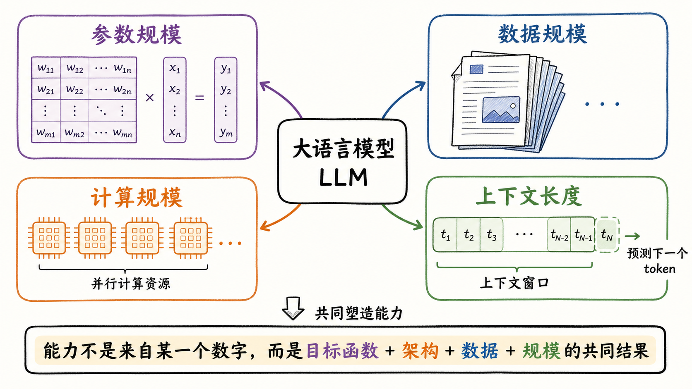
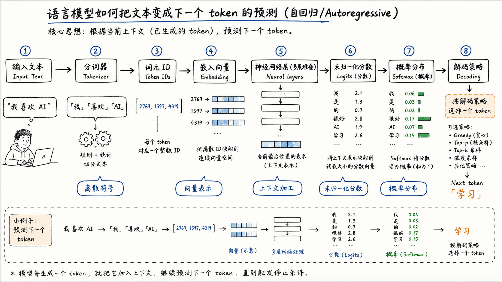
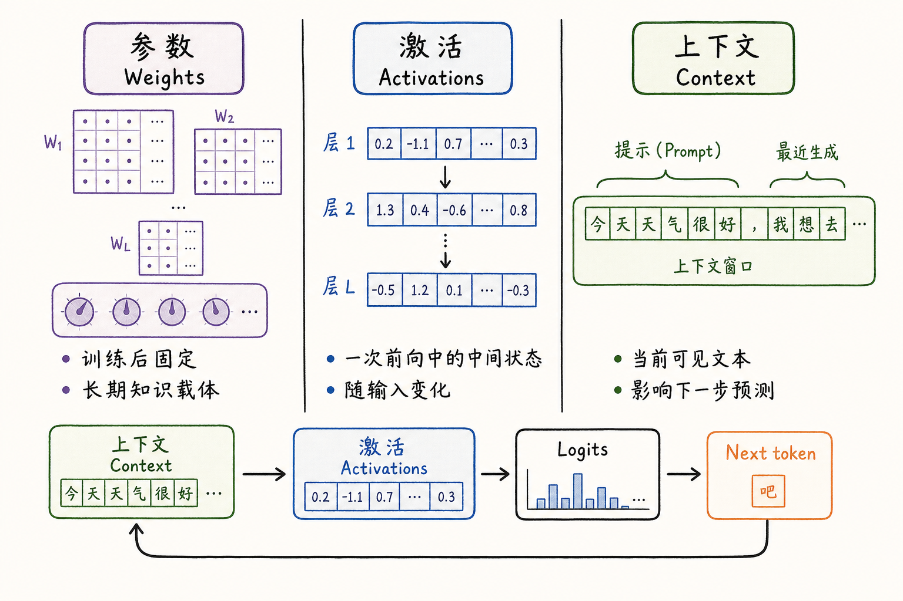
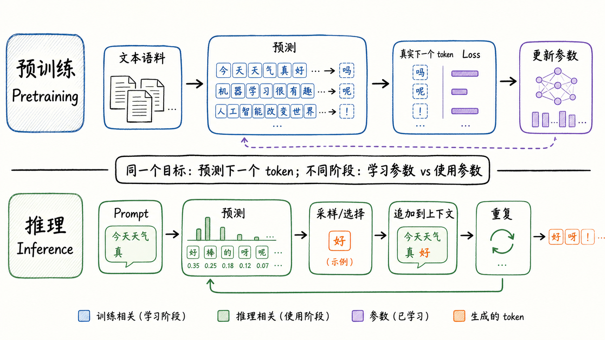
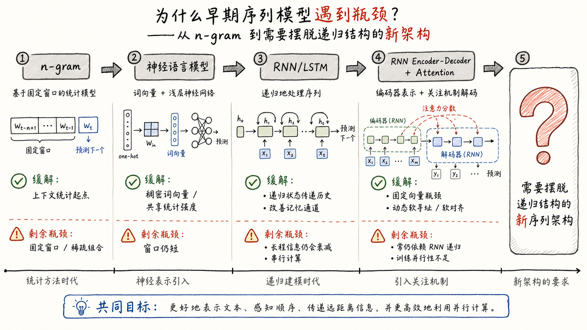

---
tags:
  - LLM
  - language-model
  - foundation-models
  - neural-networks
  - tutorial
updated: 2026-05-27
description: 从 token、参数、激活、训练目标、推理循环和旧序列模型瓶颈建立大模型基础心智模型，为后续进入 Transformer 架构打底。
---

# 大模型精讲系列 00：大模型基础速通

> [!Quote] 本篇导读
> 真正理解大模型，不应从某个流行模型名开始，也不应一上来就背 Transformer 模块。更稳的入口是先抓住一条主线：文本被切成 token，token 被映射成向量，神经网络把上下文加工成下一步的概率分布，模型再按这个分布生成下一个 token。本文从这条主线出发，解释大模型的基本概念、内部结构、训练与推理方式，并一路走到 Transformer 架构登场之前。

## 1. 学习边界

### 1.1 本篇要解决什么

大模型看起来像一个会聊天、会写代码、会推理、会总结的系统，但从最底层看，它首先是一个语言模型。语言模型的核心任务可以压缩成一句话：

**给定已经看到的 token 序列，预测下一个 token 的概率分布。**

本文为了建立生成式大语言模型的主线，主要讨论 autoregressive / causal language model。Masked language modeling、encoder-only 模型和其他训练目标也属于语言模型家族的重要分支，但不作为本文主体。

这句话听起来很窄，却是理解后续所有内容的钥匙。因为大模型的很多能力，都是在反复做这件事时被训练出来的：它必须利用语法、语义、事实、格式、推理模式和上下文线索，才能更准确地预测下一个 token。

本篇不急着讲 Transformer 的内部结构。它先回答几个更基础的问题：

- 为什么语言模型不是简单的“词典补全”；
- 文本为什么必须先变成 token 和向量；
- 参数、激活、上下文分别是什么；
- 预训练和推理为什么都围绕 next-token prediction 展开；
- 为什么早期序列模型一步步走到新的架构需求面前；

这篇文章的作用，是为后面理解 Attention、Transformer、现代 LLM 架构、并行推理和训练系统打地基。

### 1.2 本篇暂不展开什么

为了让基础概念先立稳，本篇会刻意克制几个范围：

- 不展开 Transformer 的 Multi-Head Attention、FFN、残差连接、LayerNorm 和位置编码；
- 不讨论现代模型里的 RoPE、GQA、SwiGLU、MoE、KV cache 等细节；
- 不把训练工程作为主线，只解释理解大模型所必需的训练目标和损失函数；
- 不把 RLHF、SFT、DPO 等对齐方法放进本文主体；
- 不把大模型当作数据库、搜索引擎或人脑来类比到底；

换句话说，本篇的重点不是“某个模型怎么实现”，而是先建立一个稳定心智模型：

**LLM = token 序列上的概率模型 + 可学习参数 + 深层神经网络结构 + 大规模数据与计算。**

## 2. 什么是语言模型

### 2.1 从补全游戏开始

先看一个简单句子：

```text
今天晚上我想吃 ___
```

人类看到这个空格，可能会想到“火锅”“面条”“米饭”“烧烤”。这些候选并不是完全随机的。它们都和前面的上下文有关，也都符合中文语法和常识。

语言模型做的事，本质上就是给这些候选一个概率：

$$
P(\text{火锅} \mid \text{今天晚上我想吃})
$$

更一般地说，给定一个序列 $x_1, x_2, \ldots, x_{t-1}$，语言模型要预测：

$$
P(x_t \mid x_1, x_2, \ldots, x_{t-1})
$$

这里的 $x_t$ 不一定是一个完整汉字或单词，更准确地说是一个 token。token 的概念后面会详细解释。现在只需要先抓住一点：语言模型不是直接输出“答案”，而是输出所有可能下一个 token 的概率分布。

### 2.2 语言模型为什么有用

如果只把语言模型理解成“猜下一个词”，它会显得太简单。真正关键的是：为了猜得准，模型被迫学习很多隐藏结构。

比如要补全：

```text
法国的首都是 ___
```

模型需要知道世界知识。要补全：

```text
如果明天下雨，我们就 ___
```

模型需要理解条件关系。要补全：

```text
他把苹果放进篮子，然后提着它走了。这里的“它”指的是 ___
```

模型需要做指代消解和语义判断。

所以 next-token prediction 看似只是局部任务，实际上会把模型推向更深层的语言结构学习。它不是通过显式规则告诉模型“主语是什么、宾语是什么、事实是什么”，而是让模型在大量文本中不断调整参数，使它对真实文本的下一个 token 预测越来越准确。

这也是理解大模型能力来源时最重要的一点：

**模型不是被逐条灌入规则，而是在预测任务中被迫压缩语言、知识和模式。**

### 2.3 “大”到底大在哪里

大语言模型里的“大”，不是单一指标。它至少包含四层含义：



第一是参数规模。参数是模型中通过训练学出来的数值，例如矩阵里的权重。参数越多，模型潜在表达能力越强，但也更难训练和部署。

第二是数据规模。模型需要从大量文本中看到足够多语言现象、知识片段、任务格式和表达方式。参数多但数据不足，模型容易“装不满”；数据很多但模型太小，又可能表达不下复杂模式。

第三是计算规模。训练大模型需要大量矩阵运算，推理时也需要逐 token 执行前向计算。这里的计算规模不只等于“有多少芯片”，还包括训练和推理 FLOPs、算力预算、并行资源、服务吞吐与延迟约束。算力不只是速度问题，它还决定了能否训练更大的模型、能否服务更多用户、能否支持更长上下文。

第四是上下文长度。上下文长度决定模型一次能看到多少 token。它不等于模型“懂得更多”，但会影响模型能利用多少当前输入、历史对话、文档内容和任务约束。

因此，不能把“大模型能力”粗暴归因于某一个数字。更准确的说法是：

**能力来自目标函数、架构、数据和规模的共同结果。**

### 2.4 大模型不是数据库

很多人第一次使用大模型时，会自然把它想成一个巨大的知识库。这个类比有一点帮助，但也很容易误导。

数据库的核心动作是检索：给定查询条件，找到匹配记录。语言模型的核心动作是生成：给定上下文，计算下一个 token 的概率分布。模型参数中确实会沉淀大量统计规律和事实关联，但它们不是以“可精确查表”的形式存储。

这会带来两个直接后果：

- 大模型可能给出看似流畅但事实错误的内容，因为它优化的是概率预测，不是事实数据库一致性；
- 大模型可以组合已有模式，写出数据库里没有的表达、解释、代码和推理过程；

所以，大模型更像一个被训练出来的语言与模式生成器，而不是一个可直接替代数据库、搜索引擎或文档系统的精确存储层。真正可靠的知识系统通常会把 LLM 与检索、工具、结构化数据、校验流程结合起来。

## 3. 文本如何进入模型

### 3.1 从字符到 token

神经网络不能直接理解字符串。它接收的是数字张量。文本进入模型之前，必须先经过 tokenizer，把原始文本切成 token，并把 token 映射成整数 ID。

例如：

```text
输入文本：我喜欢AI
token：  我 | 喜欢 | AI
token id：2769 | 4562 | 9913
```

这个例子只是示意。真实 tokenizer 可能把中文、英文、空格、标点、罕见词、代码片段切成不同粒度的子词单元。一个 token 可能是一个汉字、一个英文词、一段词根、一个空格加单词，也可能是一段符号。

因此有三个常见误区需要先排除：

- token 不等于字符；
- token 不等于自然语言里的“词”；
- context length 里的长度通常按 token 计算，而不是按字数计算；

tokenizer 的存在，解决了一个非常现实的问题：词表不可能包含世界上所有词、名字、代码变量和新造词。子词 tokenization 让模型可以用有限词表组合出大量文本形态。

### 3.2 从 token id 到向量

token id 只是一个编号。编号本身没有语义距离。比如 id 100 和 id 101 只表示它们在词表中的编号接近，并不代表这两个 token 意义接近。

所以，模型需要一个 embedding table，把每个 token id 映射成一个稠密向量：

$$
e_i = E[x_i]
$$

其中 $E$ 是 embedding table，$x_i$ 是第 $i$ 个 token 的 id，$e_i$ 是对应的向量表示。

向量表示的意义在于：模型可以用连续空间表达 token 之间的相似性、组合关系和上下文变化。早期 word2vec 一类方法已经展示过，稠密向量可以承载大量语义关系。大模型继承了这个思想，但不再只学习孤立词向量，而是在深层网络中不断更新每个位置的上下文表示。

### 3.3 从向量到 logits

token 变成 embedding 之后，会进入多层神经网络。为了不提前引入 Transformer 细节，本篇暂时把这些层统称为：

**stacked neural layers。**

每一层都会接收上一层的表示，并输出新的表示。经过多层加工后，模型会为每个位置得到一个 hidden state。自回归生成下一 token 时，通常使用当前最后位置的 hidden state 映射到词表大小的 logits：

$$
z_t = h_t W_{\text{out}} + b
$$

这里的 $z_t$ 就是当前步的 logits。logits 还不是概率，它们是未归一化分数。要变成概率，需要经过 softmax：

$$
P(x_{t+1}=v_i \mid x_{\le t}) = \text{softmax}(z_t)_i = \frac{e^{z_{t,i}}}{\sum_j e^{z_{t,j}}}
$$

softmax 的作用是把每个候选 token 的分数转成概率，并让所有概率加起来等于 1。

比如三个候选 token 的 logits 分别是 2.8、1.1、0.3，softmax 会把它们转成总和为 1 的概率；分数更高的候选更容易被解码策略选中，但不一定总是被选中。

把这一整条路径连起来，就是最基础的大模型前向过程：



这张图里的重点不是某个具体模块，而是数据类型的变化：

- 原始文本是人类可读的符号；
- tokenizer 把文本变成离散 token 和 token id；
- embedding 把离散 id 变成连续向量；
- 多层神经网络加工上下文表示；
- 输出层给出 logits；
- softmax 把 logits 变成下一个 token 的概率分布；

只要这条路径理解清楚，后面学习 Attention、Transformer、KV cache、并行推理时，就不会把一堆名词看成彼此孤立的组件。

### 3.4 生成不是一次完成的

大模型回答问题时，并不是一次性吐出整段文本。它通常是自回归生成：

```text
给定上下文 -> 预测下一个 token -> 选出一个 token -> 追加到上下文 -> 再预测下一个 token
```

如果 prompt 是：

```text
请用一句话解释语言模型：
```

模型会先预测第一个输出 token。假设选出“语言”，这个 token 会被追加到上下文里。下一步模型看到的是：

```text
请用一句话解释语言模型：语言
```

然后继续预测下一个 token。不断重复，最终形成完整回答。

这解释了为什么生成过程会受前面输出影响。模型不是先在脑子里写好全文再打印出来，而是在每一步都基于当前上下文重新计算下一步分布。

到这里，读者可以先把大模型看成一条数据流：文本变成 token，token 变成向量，向量经过多层网络变成概率分布，概率分布再一步步生成新 token。下一步要分清的是，这条数据流里哪些东西是长期保存的，哪些只是当前计算临时产生的。

## 4. 参数、激活与上下文

### 4.1 参数是什么

参数是模型训练后保留下来的可学习数值。最常见的参数形态是矩阵和向量，例如 embedding table、线性层权重、输出层权重、bias 和归一化相关参数等。图里用 `Weights` 代表最常见的大块权重，但实际参数集合比狭义的 weights 更宽。

用符号表示，模型可以写成：

$$
f_\theta(x)
$$

其中 $\theta$ 就代表全部参数。训练的过程，就是不断调整 $\theta$，让模型对训练文本的预测更接近真实下一个 token。

参数有三个重要特点：

- 它们在训练中被更新；
- 它们在推理时通常固定不变；
- 它们承载了模型从数据中压缩出来的统计规律和模式；

这也是为什么同一个模型文件可以离线保存、复制、加载和部署。模型权重本质上就是训练后的参数集合。

### 4.2 激活是什么

激活是一次前向计算中产生的中间状态。它不是模型文件里长期保存的知识，而是模型处理当前输入时临时产生的向量。

例如第 $l$ 层的表示可以写成：

$$
h^{(l)} = F^{(l)}(h^{(l-1)})
$$

这里的 $h^{(l)}$ 就是当前输入经过第 $l$ 层后的激活。换一个 prompt，激活就会变化；同一个 prompt 换一层，激活也会不同。

参数和激活的区别非常关键：

| 对象 | 是否长期保存 | 是否随输入变化 | 作用 |
| --- | --- | --- | --- |
| 参数 | 是 | 推理时通常不变 | 保存模型学到的模式 |
| 激活 | 否 | 是 | 表示当前输入在模型内部的中间状态 |

如果把模型比作一台机器，参数更像机器内部固定的零件和调好的刻度，激活更像这台机器处理某个输入时临时流动的信号。更严谨地说，参数是长期统计模式和知识痕迹的载体，而不是可精确查表的知识库。

### 4.3 上下文是什么

上下文是模型当前可见的 token 序列。它可以包括用户输入、系统提示、历史对话、检索到的文档、工具返回结果，以及模型已经生成的 token。

上下文不是参数。把一段资料放进 prompt，不等于把它永久写进模型权重。只要下一次请求没有带上这段资料，模型就不一定能使用它。

这一区别对于构建知识库尤其重要：

- 参数记忆是训练阶段形成的长期统计压缩；
- 上下文记忆是推理阶段临时提供的可见信息；
- 检索增强生成（RAG）本质上是在推理前把相关资料放入上下文；
- 微调或继续预训练才可能改变模型参数；

把参数、激活、上下文分开看，大模型的很多现象就会清楚很多：



图里的底部循环也很重要：上下文进入模型后产生激活，激活经过输出层得到 logits，模型选出下一个 token，再把这个 token 追加回上下文。大模型的生成，正是在这个循环里一步步展开的。

### 4.4 为什么这三个概念必须分清

很多混乱的问题，背后都是把这三个概念混在了一起。

比如：

**“我把资料发给模型，它是不是学会了？”**

通常不是。资料进入上下文，只影响当前或当前会话中的推理；除非进行训练或显式记忆写入，否则参数没有被更新。

**“模型为什么同一个问题有时回答不同？”**

可能是采样策略不同，也可能是上下文不同。即使参数完全一样，只要生成时不是总选概率最高 token，输出就可能变化。

**“模型为什么会忘记前文？”**

常见原因不是参数消失，而是上下文窗口有限、历史被截断、或者重要信息没有被有效写入当前 prompt。

**“模型为什么会胡说？”**

因为它输出的是概率分布上的生成结果，不是数据库查证结果。上下文不足、训练数据偏差、问题诱导、采样随机性，都可能导致错误输出。

掌握这组三分法之后，可以用一句话快速定位很多问题：

**这是参数里是否有模式的问题，还是上下文里是否有信息的问题，还是当前激活与采样过程如何使用信息的问题？**

## 5. 训练与推理

### 5.1 预训练在学什么

大模型的预训练，通常可以理解为在海量文本上反复做 next-token prediction。给定一段文本：

```text
人工智能正在改变世界
```

下面用字符片段模拟 token 序列，只为说明训练样本如何由前缀预测下一个单位；真实系统以 tokenizer 产出的 token 为训练单位。

训练样本可以被组织成许多预测任务：

```text
人工 -> 智
人工智能 -> 正
人工智能正 -> 在
人工智能正在 -> 改
...
```

模型每一步都会输出一个概率分布。训练系统会看真实下一个 token 在这个分布里概率有多高。如果真实 token 概率很低，loss 就高；如果真实 token 概率很高，loss 就低。

最常见的损失函数可以写成：

$$
L = -\log P_\theta(x_t \mid x_{<t})
$$

它的含义很直观：模型越确信真实下一个 token，损失越小；模型越把概率分给错误候选，损失越大。

### 5.2 为什么一个简单目标能学到复杂能力

next-token prediction 并不会直接告诉模型“请学习语法”“请学习事实”“请学习推理”。但真实文本里，这些东西都影响下一个 token。

要预测代码里的下一个符号，模型需要学习编程语言的结构。要预测数学推导里的下一步，模型需要学习公式模式。要预测对话里的回答，模型需要学习问答格式、语气、角色和常识。

这不是说模型一定真正理解了一切，而是说：在足够大的数据、参数和计算规模下，预测任务会把很多复杂结构变成降低 loss 的有用信息。

可以把预训练看成一种压缩：

```text
大量文本中的规律 -> 被压缩进参数 -> 推理时根据上下文重新展开
```

这种压缩不是无损的，也不是可解释的数据库索引。它会产生泛化能力，也会产生错误、偏差和幻觉。

### 5.3 推理在做什么

预训练阶段的重点是学习参数；推理阶段的重点是使用参数。



推理时，模型参数通常不再更新。系统给模型一个 prompt，模型计算下一个 token 的概率分布，然后根据解码策略选出 token。图中把预训练和推理放在同一个 next-token prediction 目标下，是为了突出两者的共同数学骨架；SFT、RLHF、DPO 等后续对齐训练不在这张图的范围内。

常见选择方式有几类：

- greedy decoding：总是选择概率最高的 token；
- temperature sampling：通过 temperature 调整分布尖锐程度，temperature 越高越随机；
- top-k sampling：只在概率最高的前 $k$ 个候选中采样；
- top-p sampling：只在累计概率达到 $p$ 的候选集合中采样；

这些策略不会改变模型本身，只改变“如何从概率分布里选 token”。因此，同一个模型、同一个 prompt，在不同采样参数下可能产生不同风格的输出。

### 5.4 预训练、微调和提示词的关系

初学者很容易把预训练、微调和提示词混成一件事。它们其实发生在不同层面：

| 方式 | 是否改参数 | 典型作用 | 成本 |
| --- | --- | --- | --- |
| 预训练 | 是 | 建立基础语言与知识能力 | 最高 |
| 继续预训练 | 是 | 吸收某类领域语料的分布 | 很高 |
| 有监督微调 | 是 | 学会任务格式、指令风格、回答规范 | 中高 |
| 提示词 | 否 | 在当前上下文里约束任务和输出 | 低 |
| RAG | 否，通常不改基础模型参数 | 把外部资料注入当前上下文 | 中低 |

对于个人知识库项目来说，这个区分尤其有用。很多场景并不需要训练模型，而是需要把稳定资料整理成可检索、可引用、可放入上下文的知识资产。模型参数提供通用能力，知识库提供当前任务所需的可靠上下文。

到这里，我们已经知道文本如何进入模型，也分清了训练、推理、参数、激活和上下文。但还有一个问题没有回答：什么样的结构，才能把一串 token 高效地加工成上下文表示？接下来不直接讲 Transformer，而是先看 Transformer 出现之前，序列模型如何一步步被表示、顺序、长程依赖和并行计算这些约束推到新架构门口。

## 6. 从基础结构到序列瓶颈

### 6.1 一层在做什么

不管具体架构如何，大模型内部的层都在做一件事：把输入表示变成更有用的输出表示。

可以抽象成：

$$
h^{(l)} = F^{(l)}(h^{(l-1)})
$$

其中 $h^{(0)}$ 是输入 embedding，$h^{(l)}$ 是第 $l$ 层输出。多层堆叠之后，模型得到更深层的上下文表示。

这句话看似抽象，但它解释了一个关键事实：模型不是只在最后一层才“理解”文本。每一层都在重新组织信息。浅层可能更关注局部形态、词法和短距离模式；更深层可能组合出更抽象的语义、任务格式和推理线索。

### 6.2 结构必须解决哪些问题

要让一个语言模型真正可扩展，它的结构至少要解决四类问题。

第一，表示问题。离散 token 必须变成可计算的连续向量，模型还要在向量空间里表达语义相似性、句法关系和上下文变化。

第二，顺序问题。语言不是袋子里的词。相同词语换顺序，意义可能完全改变：

```text
猫追狗
狗追猫
```

如果架构不能感知顺序，就无法可靠建模语言。

第三，长程依赖问题。一个 token 的意义可能依赖很远处的内容。例如代词指代、条件转折、函数定义与调用、文章前后设定，都可能跨越很长距离。

第四，并行计算问题。现代模型必须在 GPU/TPU 上高效训练。一个架构如果每个位置都必须等前一个位置算完，训练效率就会被序列长度严重限制。

这四个问题共同决定了序列模型的发展方向。历史上的模型并不是突然被替换，而是在不断尝试解决这些约束时逐渐暴露出新的瓶颈。

接下来每个旧模型都只看四件事：它怎样表示文本、怎样处理顺序、怎样传递远距离信息、怎样适配并行计算。这样读，模型史就不会变成名字清单，而会变成一条逐步收束的问题链。

### 6.3 从 n-gram 到神经语言模型

最朴素的语言模型是 n-gram。它用前面固定数量的词预测下一个词：

$$
P(x_t \mid x_{t-n+1}, \ldots, x_{t-1})
$$

n-gram 的优点是简单、可解释、容易统计。缺点也很明显：

- 上下文窗口固定，长程依赖很难处理；
- 稀疏问题严重，很多词组合在训练数据中没出现过；
- 不理解词之间的语义相似性，例如“猫”和“狗”是相近动物，但统计表里可能完全分开；

神经语言模型的重要改进，是把词映射成稠密向量，再用神经网络预测下一个词。Bengio 等人在 2003 年的神经概率语言模型中，就已经把 distributed representation 作为解决稀疏问题的关键思路。

这一步的意义很大：模型不再只记离散组合的频次，而是可以在连续空间里共享统计强度。相似词、相似上下文，可以通过向量表示产生一定程度的泛化。

但早期神经语言模型仍然常用固定窗口。它解决了表示稀疏问题，却还没有真正解决长序列建模。

### 6.4 RNN/LSTM：把历史压进状态

RNN 的想法很自然：既然固定窗口太短，那就让模型从左到右读序列，并维护一个 hidden state：

$$
h_t = f(h_{t-1}, x_t)
$$

这样，$h_t$ 就可以看成“到目前为止读过内容的摘要”。理论上，它能携带任意长历史；实践中，它确实在早期语言模型、语音识别和机器翻译中发挥过巨大作用。

但 RNN 有两个结构性问题。

第一个是信息瓶颈。所有历史都要被压进一个固定维度的 hidden state。序列越长，越难保证早期信息不被覆盖或稀释。

第二个是串行计算。$h_t$ 依赖 $h_{t-1}$，所以第 $t$ 步必须等第 $t-1$ 步算完。训练长序列时，这种依赖很难充分利用并行硬件。

LSTM 和 GRU 通过门控机制缓解了梯度消失和长期记忆问题，但它们没有从根本上改变“沿时间步串行读入”的计算形态。也就是说，它们让 RNN 更能记，但没有让信息通道变短，也没有让训练天然并行。

### 6.5 Encoder-Decoder 与 Attention：打开固定向量瓶颈

机器翻译暴露了另一个问题。源语言和目标语言长度不一定相同，输入句子可能很长，输出句子也可能重新排序。早期 Seq2Seq 模型用 encoder 把整句源语言压缩成一个固定向量，再让 decoder 从这个向量生成目标句子。

这带来了固定向量瓶颈：一整句话的信息都要挤进一个向量。句子越长，翻译质量越容易下降。

Attention 的出现，就是为了打开这个瓶颈。它让 decoder 在生成每个 token 时，都可以回头查看 encoder 的所有 hidden states，并按相关度加权取用：

$$
c_t = \sum_i \alpha_{t,i} h_i
$$

这里的 $c_t$ 是当前生成步骤使用的上下文向量，$\alpha_{t,i}$ 表示 decoder 当前状态对第 $i$ 个 encoder 状态的关注权重。

这个机制的核心直觉是：

**Attention 是软寻址。**

它不像硬查询那样只选一个位置，而是给每个位置一个权重，再加权汇总信息。这样，模型在生成某个目标词时，可以动态决定更应该参考源句中的哪些位置。

这里讲的是 RNN encoder-decoder 语境中的 attention，用来解释固定向量瓶颈如何被缓解；Transformer self-attention 的完整机制留到下一篇展开。

### 6.6 旧序列模型的共同瓶颈

把这些模型放在一条线上，可以看到一条清晰的演进路径：



这张图里的“缓解”非常关键。n-gram 建立了上下文统计的起点，但上下文太短；神经语言模型引入词向量，缓解稀疏表示，但仍受固定窗口限制；RNN/LSTM 通过递归状态传递历史，改善了记忆通道，却没有消除长程信息衰减和串行计算；RNN Encoder-Decoder + Attention 打开了固定向量瓶颈，引入动态软寻址，但常仍依赖递归结构，训练并行性不足。

到这里，新的问题已经被逼出来：

- 能不能让任意两个位置直接建立信息通道；
- 能不能避免把所有历史压进单个状态；
- 能不能让序列中所有位置更充分地并行计算；
- 能不能保留 Attention 的动态取用能力，同时摆脱 RNN 的串行结构；

这就是 Transformer 架构登场前的真正问题背景。Transformer 不是凭空出现的名字，而是旧序列建模路线在表示、长程依赖和并行计算上不断碰壁之后的结构性回应。

## 7. 到 Transformer 门口

### 7.1 新架构需要满足的条件

走到这里，我们还没有讲 Transformer 的内部结构，但已经能列出它必须回答的问题。

一个更适合大规模语言建模的架构，至少需要满足这些条件：

- 每个位置都能高效访问其他位置的信息；
- 信息传递路径不能随着距离变长而线性变差；
- 训练时要尽可能把序列位置并行起来；
- 模型必须知道 token 的顺序，否则“猫追狗”和“狗追猫”无法区分；
- 结构要适合大规模矩阵计算和参数扩展；

这几条条件，就是后面学习 Transformer 时的检查清单。不要把 Transformer 看成一堆模块名，而要把每个模块放回它要解决的问题里：

- 为什么需要某种方式让位置互相取信息；
- 为什么需要处理顺序；
- 为什么需要多层堆叠；
- 为什么需要非线性加工；
- 为什么需要稳定训练深层网络；

这样进入下一篇时，Attention、位置编码、残差连接、归一化和前馈网络就不再是孤立名词，而是对明确问题的工程回答。

### 7.2 读完自检

读完本文，可以用五个问题检查自己的心智模型是否稳住。

- 看到“大模型”，会不会先想到 token 序列上的概率模型，而不是一个会聊天的黑盒；
- 看到“上下文”，会不会把它和参数区分开：prompt 改变当前可见信息，训练才可能改变参数；
- 看到 logits，会不会记得它只是未归一化分数，softmax 后才是概率；
- 看到 RNN/LSTM，会不会说它缓解长程依赖和梯度问题，而不是彻底解决长程依赖；
- 进入 Transformer 前，会不会先问“怎样让序列位置高效、并行、动态地交换信息”，而不是先背模块名；

如果这五个问题都能回答清楚，后面进入 Attention 和 Transformer 时就不容易被术语带偏。

### 7.3 最终心智模型

本篇可以压缩成五句话。

第一，大语言模型首先是 token 序列上的概率模型，它的底层动作是根据上下文预测下一个 token。

第二，文本必须经过 tokenizer 和 embedding，才能从离散符号进入连续向量空间，被神经网络处理。

第三，参数、激活、上下文是三类不同对象。参数是训练后保存的长期数值，激活是一次前向中的临时状态，上下文是当前可见的 token 序列。

第四，预训练通过 next-token prediction 调整参数，推理则用固定参数在当前上下文中一步步生成 token。

第五，早期序列模型不断解决旧问题又暴露新瓶颈，最终把核心矛盾推到一个问题上：如何让长序列里的位置高效、并行、动态地交换信息。

下一篇真正进入 Transformer 时，要带着这个问题去看架构，而不是带着模块清单去背答案。

## 8. 参考资料

来源对应关系：第 3 章的 tokenizer 与 subword 讨论主要参考 BPE 和 SentencePiece；第 6.3 节的神经语言模型脉络参考 Bengio 2003；第 6.5 节的 Seq2Seq 与 Attention 脉络参考 Sutskever、Bahdanau 和 Luong；第 2.3 节的规模直觉参考 Scaling Laws 与 Chinchilla。

1. [A Neural Probabilistic Language Model](https://www.jmlr.org/papers/v3/bengio03a.html)：Bengio 等人在 2003 年提出神经概率语言模型，是理解 distributed representation 与神经语言模型的重要起点；
2. [Efficient Estimation of Word Representations in Vector Space](https://arxiv.org/abs/1301.3781)：word2vec 相关论文，适合理解稠密词向量如何承载语义相似性；
3. [Neural Machine Translation of Rare Words with Subword Units](https://arxiv.org/abs/1508.07909)：BPE 在神经机器翻译中的经典应用，可用于理解 subword tokenization 的动机；
4. [SentencePiece: A simple and language independent subword tokenizer and detokenizer for Neural Text Processing](https://arxiv.org/abs/1808.06226)：理解现代 tokenizer 工具设计时很有帮助；
5. [Sequence to Sequence Learning with Neural Networks](https://arxiv.org/abs/1409.3215)：Seq2Seq 模型的代表性论文，有助于理解 Encoder-Decoder 与固定向量瓶颈；
6. [Neural Machine Translation by Jointly Learning to Align and Translate](https://arxiv.org/abs/1409.0473)：Bahdanau Attention 论文，是理解 attention 作为软对齐和软寻址机制的关键资料；
7. [Effective Approaches to Attention-based Neural Machine Translation](https://arxiv.org/abs/1508.04025)：Luong Attention 论文，展示了不同 attention 评分方式和工程取舍；
8. [Attention Is All You Need](https://arxiv.org/abs/1706.03762)：Transformer 原始论文，本文只把它作为下一阶段边界，不在此展开内部结构；
9. [Language Models are Few-Shot Learners](https://arxiv.org/abs/2005.14165)：GPT-3 论文，适合理解大规模语言模型能力如何随参数、数据与任务格式扩展；
10. [Scaling Laws for Neural Language Models](https://arxiv.org/abs/2001.08361)：大模型 scaling law 的代表性论文，用于建立参数、数据、计算之间的规模直觉；
11. [Training Compute-Optimal Large Language Models](https://arxiv.org/abs/2203.15556)：Chinchilla 论文，强调固定计算预算下模型规模与训练 token 数之间的权衡；
12. [Speech and Language Processing, 3rd ed. draft](https://web.stanford.edu/~jurafsky/slp3/)：Jurafsky 与 Martin 的 NLP 教材草稿，适合系统回看语言模型、n-gram、神经语言模型和序列建模基础；

## 9. 学习测评

### 9.1 题目

1. 单选：本文对语言模型最底层任务的描述，哪一个最准确？
   A. 给定关键词，从数据库中检索最匹配的文档；
   B. 给定已经看到的 token 序列，预测下一个 token 的概率分布；
   C. 把所有输入文本压缩成一个固定摘要；
   D. 根据用户意图直接调用外部工具；

2. 单选：为什么说 next-token prediction 看似简单但很强？
   A. 因为它只要求模型逐字背诵训练语料，不需要泛化；
   B. 因为预测下一个 token 时，语法、语义、事实和任务格式都可能降低 loss；
   C. 因为 next-token prediction 与事实一致性完全等价；
   D. 因为它只依赖最近一个 token 的局部统计；

3. 多选：关于 token 的说法，哪些正确？
   A. token 是 tokenizer 的切分单位；
   B. token 一定等于自然语言里的一个词；
   C. context length 通常按 token 计算；
   D. token 可以是子词、符号、空格相关片段或代码片段；

4. 单选：embedding 的核心作用是什么？
   A. 把 token id 映射为连续向量，使神经网络可以计算；
   B. 把模型输出直接变成自然语言段落；
   C. 在推理时永久更新模型参数；
   D. 把所有上下文压缩成一个数据库索引；

5. 单选：logits 与概率的关系更接近哪一种？
   A. logits 是已经归一化后的概率；
   B. logits 是未归一化分数，通常经过 softmax 后得到概率分布；
   C. logits 是 tokenizer 的词表；
   D. logits 是模型训练语料的原文；

6. 多选：哪些属于模型参数的特点？
   A. 训练中会被更新；
   B. 推理时通常固定不变；
   C. 每次输入都会完全重新随机生成；
   D. 可以承载模型从数据中压缩出的统计规律；

7. 单选：激活（activations）最准确的描述是？
   A. 模型文件中长期保存的全部权重；
   B. 一次前向计算中随当前输入产生的中间状态；
   C. tokenizer 生成的整数编号；
   D. 数据库检索出的文档片段；

8. 多选：关于上下文（context），哪些理解正确？
   A. 上下文是模型当前可见的 token 序列；
   B. 把资料放进上下文通常不等于修改模型参数；
   C. 上下文可以包含 prompt、历史对话、检索资料和已生成 token；
   D. 上下文窗口无限长，所以永远不会丢失前文；

9. 单选：预训练和推理最关键的区别是？
   A. 预训练通常更新参数，推理通常使用固定参数生成；
   B. 预训练不需要文本，推理才需要文本；
   C. 推理会默认把用户输入写入模型权重；
   D. 预训练只负责搜索网页；

10. 多选：哪些因素会影响“大模型”的能力边界？
    A. 参数规模；
    B. 训练数据规模与质量；
    C. 架构与目标函数；
    D. 采样策略、上下文质量和部署约束；

11. 单选：n-gram 语言模型的主要局限是什么？
    A. 只能用于文本分类，不能用于预测下一个词；
    B. 只能使用固定窗口，容易遭遇数据稀疏和长程依赖问题；
    C. 它不能表示任何条件概率；
    D. 只要把 $n$ 增大，就能稳定解决任意长度上下文的语义推理；

12. 多选：神经语言模型相对传统 n-gram 的改进包括哪些？
    A. 引入稠密向量表示，缓解离散稀疏问题；
    B. 可以在连续空间中共享相似上下文的统计强度；
    C. 自动彻底解决所有长程依赖；
    D. 用可学习参数替代纯表格统计的一部分角色；

13. 单选：RNN/LSTM 的结构性瓶颈更接近哪一项？
    A. 完全不能处理序列；
    B. 需要沿时间步串行计算，并把历史压进 hidden state；
    C. 每个时间步之间完全独立，因此无法传递历史；
    D. 它只能使用固定 n-gram 窗口，不能读入更长序列；

14. 多选：早期 RNN Seq2Seq 引入 Attention 后，相比“只把源句压缩成一个固定向量”的做法，关键改进是什么？
    A. decoder 生成每步时可以查看 encoder 的多个 hidden states；
    B. attention 权重提供了一种软寻址机制；
    C. 它彻底摆脱了 RNN 串行计算问题；
    D. 它缓解了把整句源语言压缩进单个固定向量的瓶颈；

15. 单选：读完本文后，进入 Transformer 架构前最应该带着哪个问题？
    A. 如何让长序列里的位置高效、并行、动态地交换信息；
    B. 如何把所有 prompt 永久写入模型参数；
    C. 如何让 token 完全等同于汉字；
    D. 如何只靠 n-gram 实现现代大模型能力；

16. 单选：为什么说语言模型的生成是“逐步展开”的，而不是一次性写完整篇回答？
    A. 因为模型每次只根据当前上下文预测下一个 token，并把已生成 token 继续放回上下文；
    B. 因为 tokenizer 会一次性决定全部输出内容；
    C. 因为 embedding 会自动保存所有未来 token；
    D. 因为 logits 本身就是最终自然语言段落；

17. 多选：一个适合大规模语言建模的架构，在 Transformer 出现前至少需要解决哪些问题？
    A. 离散 token 如何变成可计算的连续表示；
    B. 序列顺序如何被模型感知；
    C. 长距离位置之间如何高效交换信息；
    D. 训练时如何尽可能利用并行计算；

18. 单选：下面哪一项最能区分“把资料放进 prompt”和“微调模型”？
    A. prompt 改变当前上下文，微调通常会通过训练更新参数；
    B. prompt 会永久写入模型权重，微调只改变当前对话；
    C. 两者都只改变 tokenizer 的切词规则；
    D. 两者都不影响模型输出；

### 9.2 答案与题解

错题回看建议：1-5 题回看第 2、3 章；6-8、18 题回看第 4、5 章；9-10、16 题回看第 5 章；11-15、17 题回看第 6、7 章。

1. B。语言模型的底层任务是根据已有 token 序列预测下一个 token 的概率分布。A 是检索系统，C 更像某些编码过程的粗略描述，D 是工具调用系统的行为；

2. B。next-token prediction 会迫使模型学习各种能提升预测准确率的结构，包括语法、语义、事实、格式和推理模式。它不只是逐字背诵训练语料，不保证事实正确，也不只看最近一个 token 的局部统计；

3. A、C、D。token 是 tokenizer 的切分单位，可能是子词、符号或代码片段；上下文长度通常按 token 计算。B 错在把 token 等同于自然语言词；

4. A。embedding 把离散 token id 映射成连续向量，使后续神经网络可以进行矩阵运算和表示学习；

5. B。logits 是输出层给出的未归一化分数，softmax 会把它们转换为概率分布；

6. A、B、D。参数在训练中更新，推理时通常固定，并承载训练数据中压缩出的模式。C 描述的是随机初始化或错误理解，不是推理时参数行为；

7. B。激活是当前输入在一次前向传播中产生的中间状态，会随输入和层数变化；

8. A、B、C。上下文是当前可见 token 序列，放入资料通常只是改变当前可见信息，不改变基础参数。D 错在忽略上下文窗口限制；

9. A。预训练阶段通常通过 loss 和反向传播更新参数，推理阶段通常使用固定参数，根据当前上下文逐 token 生成；

10. A、B、C、D。大模型能力不仅取决于参数规模，还取决于数据、架构、目标函数、采样策略、上下文质量和实际部署约束；

11. B。n-gram 简单有效，但固定窗口和数据稀疏限制了它处理长程依赖和未见组合的能力；

12. A、B、D。神经语言模型用可学习参数和稠密表示缓解稀疏问题，但不自动彻底解决所有长程依赖；

13. B。RNN/LSTM 能处理序列，但 hidden state 成为信息通道和瓶颈，时间步依赖又导致串行计算。C 错在 RNN 的时间步并不独立；D 错在 RNN/LSTM 并不是固定 n-gram 窗口模型；

14. A、B、D。Attention 让 decoder 每步动态取用 encoder 状态，缓解固定向量瓶颈。C 错在早期 Encoder-Decoder + Attention 常仍然附着在 RNN 上，串行问题没有彻底消失；

15. A。Transformer 登场前最核心的问题是：如何让序列中的位置高效、并行、动态地交换信息，同时保留顺序与上下文建模能力；

16. A。语言模型通常以自回归方式生成：先预测下一个 token，再把它加入上下文，继续预测后续 token。B、C、D 都混淆了 tokenizer、embedding、logits 与生成循环的角色；

17. A、B、C、D。表示、顺序、长程依赖和并行计算是推动架构演进的四类核心问题。任何一个没处理好，都会限制模型规模、效率或语言建模能力；

18. A。prompt 主要改变当前可见上下文；微调则通常通过训练过程更新模型参数。这个区别有助于理解“上下文”“参数”和“学习”不是同一件事；
