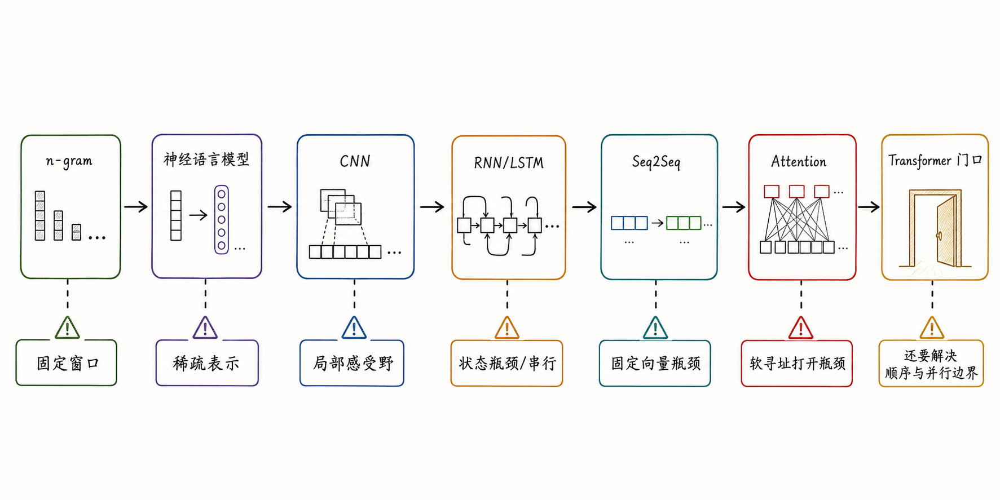
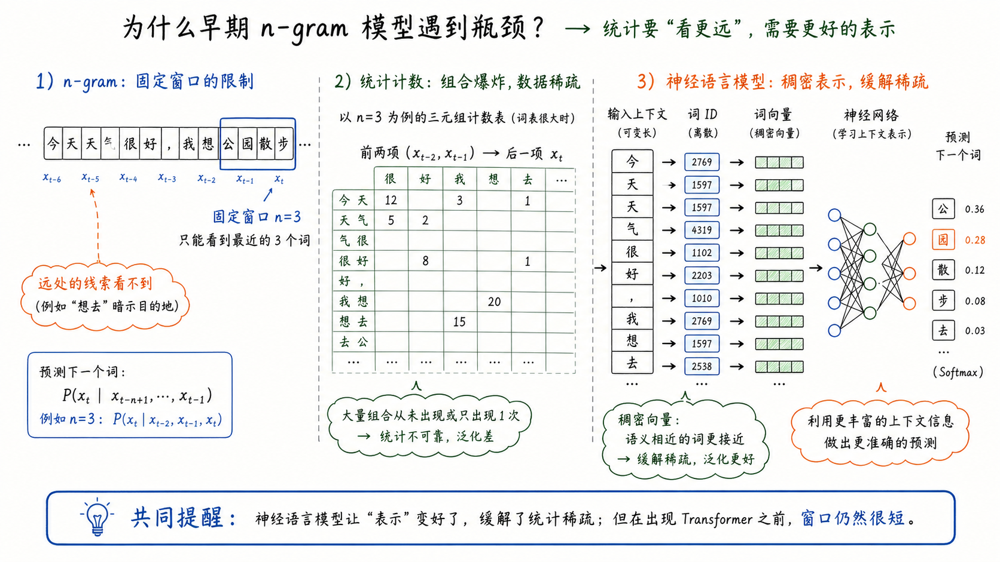
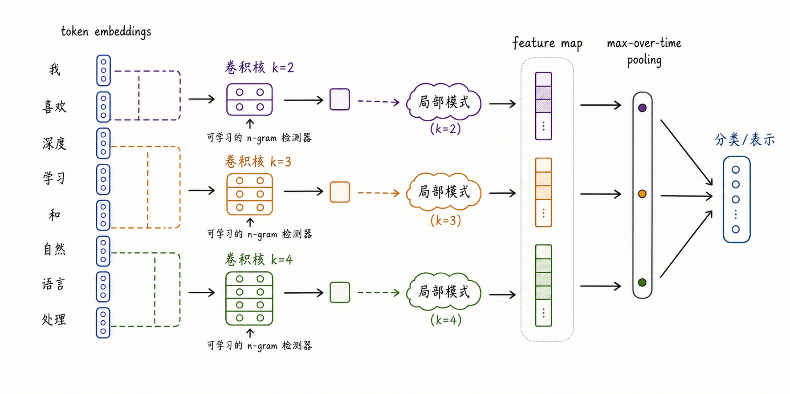
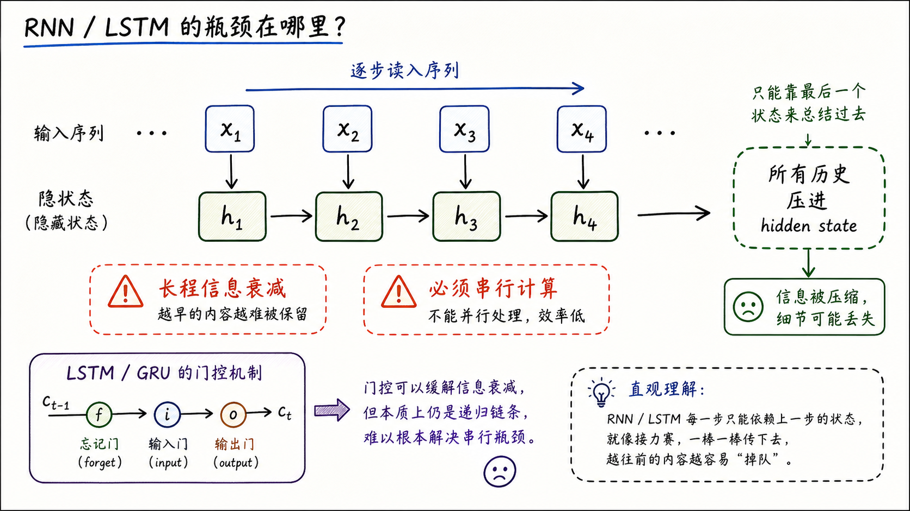
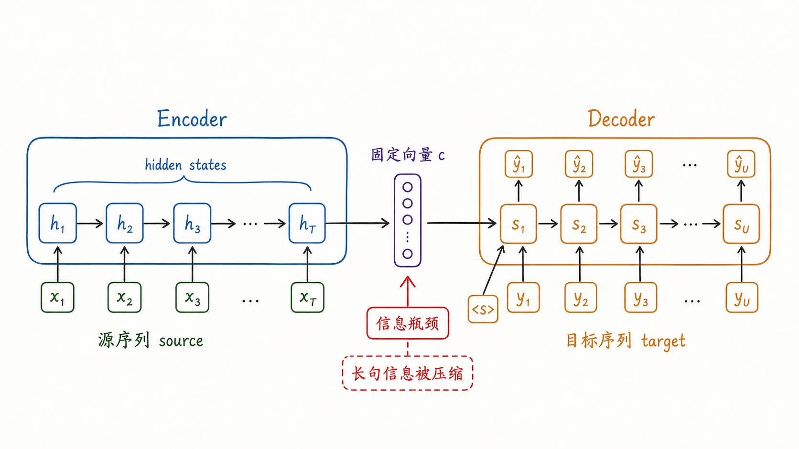

---
tags:
  - LLM
  - sequence-modeling
  - neural-networks
  - tutorial
updated: 2026-06-09
description: 从语言理解的长程依赖问题出发，循序梳理 n-gram、神经语言模型、CNN、RNN/LSTM 与 Seq2Seq 的演进逻辑，并为下一阶段架构问题铺垫。
---
【批注，1）正文不要滥用中文引号，确实需要强调的概念、判断或短句，优先使用加粗；2）控制小段落中的句号密度，能顺畅连接的解释用逗号、分号或重写句式承接，避免每个短句都被句号切碎；3）教程正文避免用作者撰文的过程说明去替代教学内容，不写类似 `接下来会`、`本文将` 这类让读者关心写作安排的句式；需要引导时直接写稳定的学习路径、对象关系或机制递进；4）避免段落用大量并列短句+分号的方式去呈现 全文排查】
# 03 从语言理解本质到序列模型演进

> [!Quote] 本篇导读
> 现代大模型的底层任务是 next-token prediction，但“预测下一个 token”并不自动说明模型结构应该怎样设计。语言不是一袋互不相关的词，意义经常藏在远处、顺序里、上下文关系里。历史上的序列模型演进，正是围绕这些困难一层层展开的。
> 【批注，重构下段，不要什么 本篇xxx的叙述】
> 本篇不急着进入下一代架构，也不把后续答案当成突然出现的技巧。我们从语言理解的本质问题出发，看每一代模型到底解决了什么，又留下了什么结构性瓶颈。这样进入下一篇时，新的结构问题就不会显得孤立，而是旧路线被瓶颈推出来的自然问题。

## 1. 语言理解的本质

### 1.1 意义不是孤立的

先读一句话：

> 他把苹果放进篮子，然后提着**它**走了。

你几乎不需要思考，就知道“它”指的是篮子。

但这个判断并不是靠最近词就能稳定解决。换一句：

> 他把篮子装进箱子，仔细检查了一下，然后扛着**它**去了车站。

这里“它”更可能指箱子，而不是篮子，也不是“仔细检查”或“车站”。人脑在瞬间完成了一次跨越多个词、综合上下文逻辑和常识的语义推断。

这种能力在语言学里叫 **指代消解（Coreference Resolution）**：确定文本中的不同表述是否指向同一个实体。

具体说：

- 指代语（Anaphor）：发起指代的词语，如“它”“他”“这”；
- 先行词（Antecedent）：被指代的实体，如“篮子”“箱子”；
- 消解（Resolution）：建立指代语与先行词之间的对应关系；

指代消解只是长程上下文依赖的一类。语言中还有很多现象，也要求模型把相隔很远的信息放在一起理解：

> “那家银行**倒闭**了，但河边那家**银行**还在。”  
> 这里需要词义消歧，同一个词在不同上下文中含义不同。

> “**虽然**他很累，但他**还是**坚持下来了。”  
> 这里需要理解篇章关系，转折结构横跨整句。

> “The animal did not cross the street because **it** was too tired.”  
> 这里需要常识和上下文共同判断 it 指 animal 还是 street。

这些现象各不相同，但共同点很清楚：**语言中的意义，几乎从来不是孤立的、局部的，而是由上下文中相距不等的词语共同构建。**

### 1.2 序列模型必须回答的四个问题

如果要让机器处理语言，模型至少要面对四类问题。

第一，**表示问题**。离散符号必须变成可计算对象。词、子词、字符、标点、代码符号，都要进入某种向量空间，才能被神经网络处理。

第二，**顺序问题**。语言不是词袋。下面两句话包含相同词语，但意思完全不同：

```text
猫追狗
狗追猫
```

如果模型不能感知顺序，就无法稳定处理语言。

第三，**长程依赖问题**。一个位置的意义可能依赖远处的信息，例如代词指代、函数定义与调用、条件转折、角色设定和段落呼应。

第四，**并行计算问题**。现代模型必须在 GPU/TPU/NPU 上高效训练。如果一个架构要求每个位置都等前一个位置算完，训练长序列时就很难充分利用并行硬件。

序列模型的历史，就是不断试图同时满足这四个要求的历史。每一代模型都不是无缘无故被替换，而是在解决旧问题时暴露出新的天花板。



这张图先给出整条历史线：每一种模型都带来一个改进，也留下一个会把下一代模型逼出来的瓶颈。后文会沿着这条链路逐一拆开。

## 2. 评判架构的尺度

### 2.1 跨位置路径长度

要判断一个序列架构是否适合语言理解，第一件事是看远距离信息如何流动。

假设序列里有两个位置 $i$ 和 $j$，它们相隔很远。模型要让这两个位置交换信息，中间需要经过多少步？这个问题可以用 **跨位置路径长度（Cross-position Path Length）** 来刻画。

路径越短，信息传递越直接；路径越长，信息每经过一个中间状态，就多一次变换、压缩和潜在损耗。

语言中的长程依赖无处不在：

- 指代关系：代词和先行词可能相隔数句；
- 主谓一致：`The keys to the cabinet are on the table` 中，主语和谓语中间夹着介词短语；
- 条件关系：`If ... then ...` 结构可能横跨长句；
- 篇章逻辑：段落前后可能相互解释、转折或反驳；

一个模型如果只能可靠处理局部窗口，就很难真正处理语言理解。

### 2.2 计算复杂度与可并行性

另一个尺度是工程性的：这个架构能不能扩展到真实数据和真实硬件。

两个指标尤其关键：

- 每层时间复杂度：处理一条长度为 $n$ 的序列需要多少计算；
- 顺序操作数：计算过程中有多少步骤必须串行执行；

这两个指标在本篇会反复出现。

RNN 按时间步递推，位置 1 的信息要影响位置 5，需要沿 $h_1 \to h_2 \to h_3 \to h_4 \to h_5$ 逐步传递。路径越长，信息与梯度就越容易在链条中衰减；同时，每一步都依赖前一步状态，顺序操作数随序列长度增加。

CNN 用卷积核局部滑动。卷积在位置维度上可以并行，但两个远距离位置要建立联系，需要堆叠多层卷积。若核大小为 $k$，路径长度会随着距离增加，只是比逐步递推更短。

Seq2Seq 把变长输入输出连接起来，但早期做法仍然依赖 encoder 的压缩状态。它解决了“输入长度和输出长度不同”的问题，却把“源序列全部信息如何被 decoder 使用”推成了新的瓶颈。

所以这张尺度表会贯穿后续理解：**语言建模不只是“能不能看远”，还要看“看远的代价是什么”。**

## 3. 从 n-gram 到神经语言模型

### 3.1 n-gram 的朴素起点

最朴素的语言模型是 n-gram。它假设下一个词只依赖前面固定数量的词：

$$
P(x_t \mid x_{t-n+1}, \ldots, x_{t-1})
$$

二元模型只看前一个词，三元模型看前两个词。它的优点非常直接：简单、可解释、容易统计，也能在局部模式很强的任务里发挥作用。

例如在一个小语料里，模型可以统计：

```text
P(北京 | 我 爱) = count(我 爱 北京) / count(我 爱)
P(上海 | 我 爱) = count(我 爱 上海) / count(我 爱)
```

如果语料里“我 爱 北京”出现得更多，n-gram 就会给“北京”更高概率。这个思路朴素但有效，它把语言建模变成了条件概率估计。

问题也从这里开始。

第一，**窗口固定**。如果 $n=3$，模型只能看前两个词。窗口外的信息无论多重要，都不会进入条件概率。

第二，**组合爆炸**。词表越大、$n$ 越大，可能组合越多。训练语料里很多组合根本没出现过，统计表就会变得稀疏。

第三，**相似性无法共享**。在表格统计里，“猫喝水”和“狗喝水”是两个不同组合，即使语义相近，也很难天然共享统计强度。



所以 n-gram 的真正局限不是“太老”，而是它把语言看成离散组合表。它能捕捉局部频率，却很难表达相似性、泛化和远距离关系。

### 3.2 神经语言模型的关键转向

神经语言模型的重要转向，是把离散词编号变成稠密向量表示（distributed representation），再用神经网络预测下一个词。

Bengio 等人在 2003 年的神经概率语言模型中，就已经把这种表示方式作为解决稀疏问题的关键思路。后来的 word2vec 进一步展示了向量空间可以承载语义相似性和组合规律。

这一步可以这样理解：

```text
离散词 id -> embedding 向量 -> 神经网络 -> 下一个词概率
```

有了 embedding，“猫”和“狗”不再只是两个互不相关的编号，而可以在向量空间里靠得更近。相似词、相似上下文，可以共享一部分统计强度。

这带来四个改变：

- 模型不再只记离散组合频次；
- 相似词可以在连续空间中共享统计强度；
- 没见过的具体组合，也可能通过相似上下文获得一定泛化；
- 参数开始取代表格统计的一部分角色；

但早期神经语言模型通常仍然受固定窗口限制。它解决了表示稀疏问题，却没有真正解决长序列建模。一个 100 词句子的末尾可能依赖开头的线索，而固定窗口只能看到最近几个词。

于是问题向前推进：**既然固定窗口不够，能不能让模型沿着序列读下去，把更长历史带到当前位置？**

## 4. CNN：局部模式检测

### 4.1 为什么 CNN 会进入 NLP

在深度学习进入 NLP 的早期，研究者面对的不只是长程依赖问题，还有一个更基础的工程问题：如果直接用全连接网络处理文本，参数量很快爆炸。

假设词表大小为 50,000，序列长度为 100。如果用 one-hot 表示并直接铺开，输入维度会非常大；全连接层会产生巨量参数，既难训练，也难泛化。

卷积神经网络（Convolutional Neural Network, CNN）在图像中给出了一种漂亮答案：通过 **局部连接（Local Connectivity）** 和 **权值共享（Weight Sharing）** 大幅减少参数。

局部连接意味着每个卷积核只看一个小窗口；

权值共享意味着同一组卷积核在所有位置滑动，负责检测同一种局部模式；

这两个约束让 CNN 成为高效的局部模式检测器。

### 4.2 文本 CNN 如何工作

在图像里，卷积核会覆盖局部像素区域，做点积，写入 feature map。浅层卷积检测边缘、纹理；深层卷积把局部特征组合成更大结构；pooling 则降低空间尺寸，并提供一定平移不变性。

搬到文本后，输入不再是二维像素矩阵，而是一维 token / word embedding 序列。长度为 $n$ 的句子可以表示为一个 $n \times d$ 的矩阵，其中 $d$ 是 embedding 维度。

一维文本卷积的工作方式大概是：

```text
句子 token embedding 序列
    ↓
宽度为 k 的卷积核滑过相邻 k 个词
    ↓
检测局部词组模式
    ↓
pooling 抽取最强响应
    ↓
分类或后续任务
```



从这个角度看，文本 CNN 本质上像一个可学习的 n-gram 检测器。传统 n-gram 统计固定词组频率；CNN 卷积核在训练中学习“哪些局部组合对任务有用”。

例如在情感分类里，卷积核可能学到“非常好”“不太满意”“根本没有”等局部模式；TextCNN 还可以使用不同大小的卷积核，分别捕捉不同长度的局部组合：

```text
k = 2：检测二词模式，如“不 好”；
k = 3：检测三词模式，如“真的 很 好”；
k = 4：检测更长局部片段，如“完全 不 值得 推荐”；
```

max-over-time pooling 的作用，是从整个序列里取出某个卷积核最强的响应。它回答的是：“这个局部模式有没有在句子某处强烈出现过？”

这使 CNN 在文本分类任务中非常有效，因为很多分类任务确实依赖局部触发模式。例如情感分类、问题类型识别、垃圾文本检测，都可能被少数局部片段强烈影响。

### 4.3 CNN 的贡献与局限

CNN 对 NLP 的贡献在于，它把局部模式检测变成了可学习、可并行、参数高效的结构。

它的优势包括：

- 局部模式提取高效；
- 卷积在位置维度上可并行；
- 权值共享带来参数效率；
- 对文本分类等局部特征强的任务很有效；

但语言不是图像，文本中的位置和顺序往往不能被随意池化。

看这两句话：

```text
他没有伤害她
她没有伤害他
```

词汇高度相似，但语义相反。如果 pooling 过度丢失位置信息，模型就可能无法区分角色关系。

更根本的问题是长程依赖。一个核大小为 3 的 CNN，如果要让第 1 个位置和第 30 个位置建立联系，需要堆叠多层。路径长度仍然随距离增长，虽然比 RNN 的逐步链条更短，但没有彻底解决长距离信息通道问题。

| 维度 | CNN 的表现 |
| --- | --- |
| 局部模式 | 高效，适合捕捉固定窗口内的组合特征 |
| 并行性 | 好，卷积位置可并行 |
| 参数效率 | 好，依赖局部连接和权值共享 |
| 长程依赖 | 需要堆叠多层才能扩大感受野 |
| 顺序语义 | pooling 可能丢失关键位置信息 |

CNN 说明了一件重要的事：局部模式检测很有价值，但语言理解不能只靠局部窗口。历史继续往前走，自然会转向一种更“序列原生”的结构：RNN。

## 5. RNN/LSTM：递归状态

### 5.1 RNN 的核心想法

如果固定窗口看不到远处信息，一个自然想法是让模型从左到右逐步读入序列，并维护一个 hidden state，总结到目前为止读过的一切：

$$
h_t = f(h_{t-1}, x_t)
$$

这里的 $h_t$ 是第 $t$ 步的 hidden state。它接收前一步状态 $h_{t-1}$ 和当前输入 $x_t$，再生成新的状态。

直觉上，$h_t$ 就像一份不断更新的读书笔记。每读入一个新 token，模型都会把新信息融入笔记，然后带着这份笔记继续往后读。



RNN 的优势很明显：

- 它天然适合变长序列；
- 它可以在理论上携带任意长历史；
- 它把序列顺序写进了计算过程；
- 它曾经在语言模型、语音识别和机器翻译中发挥重要作用；

相比 n-gram 和 CNN，RNN 的思路更贴近“读文章”的直觉。n-gram 只能看固定窗口，CNN 主要看局部模式，而 RNN 试图维护一个随阅读过程不断更新的整体状态。

### 5.2 RNN 的三处内伤

RNN 的问题也很深。

第一，**信息瓶颈**。所有历史都要压进一个固定维度的 hidden state。序列越长，早期信息越容易被覆盖、稀释或扭曲。

第二，**梯度问题**。训练 RNN 时，反向传播要沿时间步展开。长链式矩阵连乘容易导致梯度消失或梯度爆炸，使模型难以学习远距离依赖。

第三，**串行计算**。$h_t$ 依赖 $h_{t-1}$，所以第 $t$ 步必须等第 $t-1$ 步算完。即使 GPU 有大量并行计算能力，时间步之间的依赖也会限制训练效率。

这三处问题相互叠加：为了理解长句，模型需要把早期信息带到很远的位置；但越远，信息越容易被压缩损耗，梯度越难稳定传回去，计算也越难并行。

可以把 RNN 的困境概括成一句话：**它终于让模型可以沿着序列读下去，但也把所有历史都塞进了一条又长又窄的通道。**

### 5.3 LSTM 和 GRU 缓解了什么

LSTM 和 GRU 通过门控机制缓解了 RNN 的长期记忆问题。

LSTM 引入 cell state 和多个门：

- forget gate 决定丢弃哪些旧信息；
- input gate 决定写入哪些新信息；
- output gate 决定当前输出暴露哪些状态；

这些门让模型不再只能用一个普通 hidden state 被动压缩历史，而是可以更有控制地保留、更新和输出信息。

例如在一句很长的话里，如果开头出现了主语，后面很远处才出现谓语，LSTM 的门控机制理论上可以让某些关键信息沿 cell state 保留更久，而不是每一步都被新的输入完全覆盖。

但 LSTM 没有从根本上改变 RNN 的计算形态。它改善了记忆通道和梯度传播，却仍然沿时间步串行计算，也仍然要求历史信息经过一条长链逐步传递。

所以，RNN/LSTM 的结论不是“它们失败了”，而是：**它们证明了序列状态有价值，同时也暴露了固定状态和串行链条的上限。**

## 6. Seq2Seq：固定向量瓶颈

### 6.1 从语言模型到序列到序列

语言模型预测下一个 token，机器翻译则需要把一个源语言序列变成另一个目标语言序列。源句和目标句长度不一定相同，词序也可能重排。

Seq2Seq（Sequence to Sequence）架构给出了一个通用方案：使用 encoder 读入源序列，再使用 decoder 生成目标序列。

早期 RNN Encoder-Decoder 的核心流程可以写成：

```text
源序列 x1, x2, ..., xn
    ↓
Encoder 逐步读入
    ↓
固定向量 c
    ↓
Decoder 逐步生成 y1, y2, ..., ym
```



这个结构第一次把变长输入到变长输出的问题组织成了端到端神经网络任务，对神经机器翻译非常重要。

encoder 的作用是把源序列读完，并把它压缩成某种内部表示；

decoder 的作用是根据这个内部表示，从起始符号开始一步步生成目标序列；

固定向量 $c$ 则承担源句和目标句之间的信息桥梁。它可以来自 encoder 的最后一个 hidden state，也可以是某种变体中的压缩状态。无论实现细节如何，早期 Seq2Seq 的关键约束都是：源句信息必须先被压进一个固定容量入口，再交给 decoder 使用。

### 6.2 为什么固定向量会过载

固定向量瓶颈在短句中不一定明显。比如把“我爱北京”翻译成 “I love Beijing”，源句短、结构简单，$c$ 需要承载的信息不多。

但当句子变长，问题会迅速放大：

```text
短句：压缩负担较轻，翻译质量尚可；
长句：压缩负担变重，细节开始丢失；
超长句：固定向量过载，结构和语义严重失真；
```

这个瓶颈比普通 RNN 语言模型更尖锐。因为翻译任务要求 decoder 在每一步生成时都可能需要源句的不同部分：生成主语时要看源句主语，生成地点时要看地点短语，生成从句时要看语法结构。

如果所有信息都被挤进同一个向量，decoder 每一步都只能看同一份高度压缩的摘要。它无法在生成不同目标词时，动态回头查看源句的不同位置。

这就是固定向量瓶颈：**模型不是不会读，而是读完之后只允许交给 decoder 一张过度压缩的纸条。**

### 6.3 旧路线被逼出的新问题

到这里，序列建模已经走过几步：

- n-gram 建立了局部上下文统计，但窗口固定、稀疏严重；
- 神经语言模型引入稠密向量，缓解离散稀疏，但仍难处理长序列；
- CNN 学会并行检测局部模式，但远距离关系要靠堆叠扩大感受野；
- RNN/LSTM 用 hidden state 携带历史，但固定状态成为信息瓶颈，时间步又必须串行；
- Seq2Seq 解决变长输入输出，却把源句压进固定向量，使长句翻译质量下降；

这些问题共同把架构推向一个方向：

**能不能既保留神经网络端到端学习的优势，又让模型在需要时访问源序列的不同位置，而不是把所有信息都挤进一个固定向量？**

这就是下一篇真正要处理的问题。注意，这里先不急着解释答案；更重要的是看清问题本身已经被历史一步步逼出来了。

## 7. 本章小结

把本篇压缩成一条线，就是：

```text
n-gram：用固定窗口统计局部上下文；
神经语言模型：用稠密向量缓解离散稀疏；
CNN：用可学习卷积核检测局部模式，并获得并行性；
RNN/LSTM：用递归状态携带历史，但带来状态瓶颈和串行计算；
Seq2Seq：解决变长输入输出，却把源句压进固定向量；
```

【批注，重构小结内容，写的像个弱智一样，还这条线的重点不是“旧模型有哪些名字”，这话是人能写出来的？】
这条线的重点不是“旧模型有哪些名字”，而是每一代模型都在回答同一组问题：如何表示文本，如何处理顺序，如何传递远距离信息，如何适配大规模计算。

到 Seq2Seq 为止，最尖锐的问题已经出现：如果源序列很长，固定向量 $c$ 不可能稳定承载所有细节；如果 decoder 生成每一步都需要源句不同位置的信息，它就不应该只能依赖同一份压缩摘要。

下一篇将从这个问题继续：**模型能不能在生成每一步时，动态决定该看源序列里的哪些位置？** 这个问题会引出 Attention，但它不是凭空出现的技巧，而是固定窗口、递归状态和固定向量瓶颈连续累积之后的结构性回应。

## 8. 参考资料

来源对应关系：第 1、2 章的语言理解与序列建模标准参考 NLP 教材中的语言模型与序列建模脉络；第 3 章参考 Bengio 2003、word2vec 与传统语言模型脉络；第 4 章参考 TextCNN 和 CNN 基础思想；第 5 章参考 RNN 长程依赖困难与 LSTM；第 6 章参考 RNN Encoder-Decoder 与 Seq2Seq。

1. [Speech and Language Processing, 3rd ed. draft](https://web.stanford.edu/~jurafsky/slp3/)：Jurafsky 与 Martin 的 NLP 教材草稿，适合系统回看语言模型、n-gram、神经语言模型和序列建模基础；
2. [A Neural Probabilistic Language Model](https://www.jmlr.org/papers/v3/bengio03a.html)：Bengio 等人在 2003 年提出神经概率语言模型，是理解 distributed representation 与神经语言模型的重要起点；
3. [Efficient Estimation of Word Representations in Vector Space](https://arxiv.org/abs/1301.3781)：word2vec 相关论文，适合理解稠密词向量如何承载语义相似性；
4. [Convolutional Neural Networks for Sentence Classification](https://arxiv.org/abs/1408.5882)：TextCNN 代表性论文，展示 CNN 如何用于文本分类和局部模式提取；
5. [Learning Long-Term Dependencies with Gradient Descent is Difficult](https://ieeexplore.ieee.org/document/279181)：理解 RNN 长程依赖与梯度困难的重要早期论文；
6. [Long Short-Term Memory](https://www.bioinf.jku.at/publications/older/2604.pdf)：LSTM 原始论文，提出通过门控机制缓解长期记忆问题；
7. [Learning Phrase Representations using RNN Encoder-Decoder for Statistical Machine Translation](https://arxiv.org/abs/1406.1078)：RNN Encoder-Decoder 代表性工作，有助于理解变长序列映射；
8. [Sequence to Sequence Learning with Neural Networks](https://arxiv.org/abs/1409.3215)：Seq2Seq 模型代表性论文，有助于理解 Encoder-Decoder 与固定向量瓶颈；

## 9. 学习测评

### 9.1 题目

1. 单选：本文认为语言理解最核心的结构性困难是什么？
   A. 所有词都必须翻译成英文；
   B. 意义经常依赖上下文、顺序和远距离关系；
   C. 语言模型只能处理固定长度图片；
   D. 只要词表足够大，就不需要模型结构；

2. 多选：下列哪些属于序列模型必须处理的问题？
   A. 离散符号如何变成可计算表示；
   B. 序列顺序如何被模型感知；
   C. 长程依赖如何被传递；
   D. 训练时如何利用并行计算；

3. 单选：跨位置路径长度主要刻画什么？
   A. 模型文件占用磁盘大小；
   B. 两个序列位置之间信息传递需要经过的最少操作步数；
   C. tokenizer 切分出的 token 数量；
   D. 训练数据中的文档数量；

4. 单选：n-gram 语言模型的主要局限是什么？
   A. 只能用于图像识别；
   B. 依赖固定窗口，容易遭遇数据稀疏和长程依赖问题；
   C. 完全不能表示条件概率；
   D. 只要增大 $n$ 就能稳定解决任意长上下文；

5. 多选：神经语言模型相对传统 n-gram 的关键改进包括哪些？
   A. 引入稠密向量表示；
   B. 在连续空间中共享相似词和相似上下文的统计强度；
   C. 用可学习参数替代纯表格统计的一部分角色；
   D. 自动彻底解决所有长程依赖和并行问题；

6. 单选：文本 CNN 可以被理解为哪一种结构？
   A. 可学习的局部模式或 n-gram 检测器；
   B. 只能逐时间步串行运行的状态机；
   C. 把整句压缩成固定向量的翻译器；
   D. 完全不使用参数的检索表；

7. 多选：CNN 用于文本时的优势包括哪些？
   A. 局部模式提取高效；
   B. 位置维度上可并行；
   C. 权值共享带来参数效率；
   D. 天然解决所有长距离语义依赖；

8. 单选：RNN 的基本递推关系更接近哪一项？
   A. $h_t = f(h_{t-1}, x_t)$；
   B. $P = QK^T$；
   C. $x = \text{database.lookup}(k)$；
   D. $n = n + 1$；

9. 多选：RNN/LSTM 的结构性瓶颈包括哪些？
   A. 所有历史要通过 hidden state 传递；
   B. 长链反向传播容易出现梯度困难；
   C. 时间步依赖导致串行计算；
   D. 完全不能处理任何变长序列；

10. 单选：LSTM 相对普通 RNN 的关键改进是什么？
    A. 通过门控机制更有控制地保留和更新信息；
    B. 完全取消序列顺序；
    C. 把所有位置一次性直接相互连接；
    D. 把模型变成数据库；

11. 单选：早期 RNN Seq2Seq 的固定向量瓶颈指什么？
    A. 源序列全部信息被压缩进一个固定维度向量，长句容易丢失细节；
    B. decoder 可以直接访问所有源位置，所以信息过多；
    C. tokenizer 不能处理标点；
    D. 模型参数无法保存到磁盘；

12. 多选：Seq2Seq 相比单纯语言模型扩展出了哪些能力或问题？
    A. 可以处理变长输入到变长输出；
    B. encoder 和 decoder 分别承担读入源序列与生成目标序列；
    C. 固定向量 $c$ 成为源句和目标句之间的信息瓶颈；
    D. 它天然解决了所有长句翻译问题；

13. 单选：为什么固定向量 $c$ 在长句翻译中容易过载？
    A. 因为源句所有细节都要被压缩进同一个固定容量入口；
    B. 因为 decoder 完全不需要源句信息；
    C. 因为词表越小，向量越大；
    D. 因为模型不能保存到磁盘；

14. 多选：到 Seq2Seq 为止，旧路线累积出的核心问题包括哪些？
    A. 固定窗口看不到远处信息；
    B. 递归状态需要长链传递；
    C. 时间步串行限制并行训练；
    D. 固定向量难以承载长源句全部信息；

15. 单选：为什么说旧序列模型不是“无用历史”？
    A. 因为每一代模型都暴露了现代架构必须回答的问题；
    B. 因为旧模型可以直接替代所有现代 LLM；
    C. 因为只要背诵旧模型名称就能理解后续架构；
    D. 因为后续架构与旧模型完全无关；

16. 单选：下一篇最自然要回答的问题是什么？
    A. 模型能否在生成每一步时动态决定该看源序列里的哪些位置；
    B. 如何让数据库删除所有记录；
    C. 如何把 tokenizer 改成图片分类器；
    D. 为什么所有序列都不需要顺序信息；

### 9.2 答案与题解

错题回看建议：1-3 题回看第 1、2 章；4-5 题回看第 3 章；6-7 题回看第 4 章；8-10 题回看第 5 章；11-14、16 题回看第 6、7 章；15 题回看第 7 章。

1. B。语言意义经常依赖上下文、顺序和远距离关系。模型如果只能看局部或忽略顺序，就难以稳定理解语言；

2. A、B、C、D。表示、顺序、长程依赖和并行计算是序列模型的四类核心问题；

3. B。跨位置路径长度刻画两个序列位置之间信息传递需要经过多少操作步骤。路径越长，信息越容易被压缩或损耗；

4. B。n-gram 的核心局限是固定窗口、数据稀疏和难以处理长程依赖。D 错在简单增大 $n$ 会导致组合爆炸，不能稳定解决任意长上下文；

5. A、B、C。神经语言模型通过稠密向量和可学习参数缓解离散稀疏问题，但 D 过度夸大，它没有彻底解决长程依赖和并行计算；

6. A。文本 CNN 可以看成可学习的局部模式检测器，类似可训练的 n-gram 特征提取器；

7. A、B、C。CNN 的优势是局部模式、并行性和参数效率。D 错在长距离依赖仍需要堆叠多层扩大感受野；

8. A。RNN 的核心递推关系是用前一步状态和当前输入生成当前状态；

9. A、B、C。RNN/LSTM 的瓶颈包括状态压缩、梯度困难和时间步串行。D 错在 RNN/LSTM 正是为变长序列设计的；

10. A。LSTM 通过门控机制更有控制地保留、遗忘和输出信息，但没有彻底改变时间步串行计算形态；

11. A。固定向量瓶颈是指 encoder 必须把整句压缩进一个固定维度向量，句子越长，信息损失越明显；

12. A、B、C。Seq2Seq 可以处理变长输入输出，encoder 读源序列，decoder 生成目标序列，但固定向量 $c$ 会成为瓶颈。D 过度夸大；

13. A。长句中不同位置的信息都要通过同一个固定容量向量传给 decoder，源句越长，压缩负担越重；

14. A、B、C、D。固定窗口、递归状态、串行计算和固定向量瓶颈共同推动后续结构演进；

15. A。旧模型的价值在于暴露现代架构必须回答的问题。后续架构正是在这些问题上继续推进；

16. A。Seq2Seq 的固定向量瓶颈自然引出下一篇问题：生成每一步时，模型能否动态选择该参考源序列中的哪些位置；
