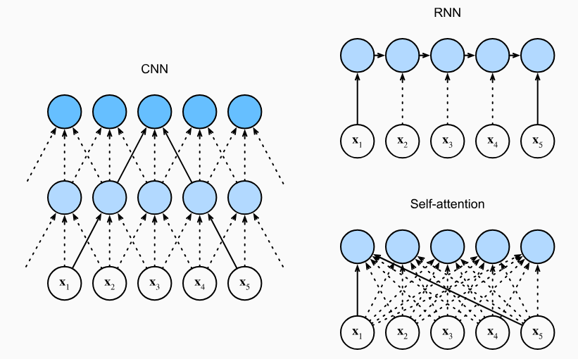

---
tags:
  - LLM
  - sequence-modeling
  - neural-networks
  - attention
  - tutorial
updated: 2026-06-09
description: 从语言理解的长程依赖问题出发，梳理 n-gram、神经语言模型、CNN、RNN/LSTM、Seq2Seq 与 Attention 的演进逻辑。
---

# 03 从语言理解本质到序列模型演进

> [!Quote] 本篇导读
> 现代大模型的底层任务是 next-token prediction，但“预测下一个 token”并不自动说明模型结构应该怎样设计。语言不是一袋互不相关的词，意义经常藏在远处、顺序里、上下文关系里。历史上的序列模型演进，正是围绕这些困难一层层展开的。
>
> 本篇不急着进入 Transformer，也不把 Attention 当成天才灵感。我们从语言理解的本质问题出发，看每一代模型到底解决了什么，又留下了什么结构性瓶颈。这样再进入下一篇 Attention 机制时，它就不再是一个孤立算子，而是旧路线被逼到墙角后的自然回应。

## 1. 语言理解的本质

### 1.1 意义不是孤立的

先读一句话：

> 他把苹果放进篮子，然后提着**它**走了。

你几乎不需要思考，就知道“它”指的是篮子。

但这个判断并不是靠最近词就能稳定解决。换一句：

> 他把篮子装进箱子，仔细检查了一下，然后扛着**它**去了车站。

这里“它”更可能指箱子，而不是篮子，也不是“仔细检查”或“车站”。人脑在瞬间完成了一次跨越多个词、综合上下文逻辑和常识的语义推断。

这种能力在语言学里叫 **指代消解（Coreference Resolution）**：确定文本中的不同表述是否指向同一个实体。

具体说：

- 指代语（Anaphor）：发起指代的词语，如“它”“他”“这”；
- 先行词（Antecedent）：被指代的实体，如“篮子”“箱子”；
- 消解（Resolution）：建立指代语与先行词之间的对应关系；

指代消解只是长程上下文依赖的一类。语言中还有很多现象，也要求模型把相隔很远的信息放在一起理解：

> “那家银行**倒闭**了，但河边那家**银行**还在。”  
> 这里需要词义消歧，同一个词在不同上下文中含义不同。

> “**虽然**他很累，但他**还是**坚持下来了。”  
> 这里需要理解篇章关系，转折结构横跨整句。

> “The animal did not cross the street because **it** was too tired.”  
> 这里需要常识和上下文共同判断 it 指 animal 还是 street。

这些现象各不相同，但共同点很清楚：**语言中的意义，几乎从来不是孤立的、局部的，而是由上下文中相距不等的词语共同构建。**

### 1.2 序列模型必须解决什么

如果要让机器处理语言，模型至少要面对四类问题。

第一，**表示问题**。离散符号必须变成可计算对象。词、子词、字符、标点、代码符号，都要进入某种向量空间，才能被神经网络处理。

第二，**顺序问题**。语言不是词袋。下面两句话包含相同词语，但意思完全不同：

```text
猫追狗
狗追猫
```

如果模型不能感知顺序，就无法稳定处理语言。

第三，**长程依赖问题**。一个位置的意义可能依赖远处的信息，例如代词指代、函数定义与调用、条件转折、角色设定和段落呼应。

第四，**并行计算问题**。现代模型必须在 GPU/TPU/NPU 上高效训练。如果一个架构要求每个位置都等前一个位置算完，训练长序列时就很难充分利用并行硬件。

序列模型的历史，就是不断试图同时满足这四个要求的历史。每一代模型都不是无缘无故被替换，而是在解决旧问题时暴露出新的天花板。


这张图先给出整条历史线：每一种模型都带来一个改进，也留下一个会把下一代模型逼出来的瓶颈。后文会沿着这条链路逐一拆开。

## 2. 评判架构的尺度

### 2.1 跨位置路径长度

要判断一个序列架构是否适合语言理解，第一件事是看远距离信息如何流动。

假设序列里有两个位置 $i$ 和 $j$，它们相隔很远。模型要让这两个位置交换信息，中间需要经过多少步？这个问题可以用 **跨位置路径长度（Cross-position Path Length）** 来刻画。

路径越短，信息传递越直接；路径越长，信息每经过一个中间状态，就多一次变换、压缩和潜在损耗。

语言中的长程依赖无处不在：

- 指代关系：代词和先行词可能相隔数句；
- 主谓一致：`The keys to the cabinet are on the table` 中，主语和谓语中间夹着介词短语；
- 条件关系：`If ... then ...` 结构可能横跨长句；
- 篇章逻辑：段落前后可能相互解释、转折或反驳；

一个模型如果只能可靠处理局部窗口，就很难真正处理语言理解。

### 2.2 计算复杂度与可并行性

另一个尺度是工程性的：这个架构能不能扩展到真实数据和真实硬件。

两个指标尤其关键：

- 每层时间复杂度：处理一条长度为 $n$ 的序列需要多少计算；
- 顺序操作数：计算过程中有多少步骤必须串行执行；

RNN、CNN 和 Self-Attention 在这两个维度上的差异非常鲜明：



RNN 按时间步递推，位置 1 的信息要影响位置 5，需要沿 $h_1 \to h_2 \to h_3 \to h_4 \to h_5$ 逐步传递。路径长度是 $O(n)$，顺序操作数也是 $O(n)$。

CNN 用卷积核局部滑动。卷积在位置维度上可以并行，但两个远距离位置要建立联系，需要堆叠多层卷积。若核大小为 $k$，路径长度大约是 $O(n/k)$。

Self-Attention 允许任意两个位置在同一层直接交互，路径长度是 $O(1)$，也适合矩阵并行。代价是每个位置都要和所有位置计算相关度，每层计算复杂度通常是 $O(n^2 d)$。

| 架构 | 跨位置路径长度 | 顺序操作数 | 每层时间复杂度 | 核心代价 |
| --- | --- | --- | --- | --- |
| RNN | $O(n)$ | $O(n)$ | $O(n d^2)$ | 长链传递与串行计算 |
| CNN | $O(n/k)$ | $O(1)$ | $O(k n d^2)$ | 远距离依赖要靠堆叠扩展 |
| Self-Attention | $O(1)$ | $O(1)$ | $O(n^2 d)$ | 序列越长，位置对越多 |

这张表会贯穿后续理解：**语言建模不只是“能不能看远”，还要看“看远的代价是什么”。**

## 3. 从 n-gram 到神经语言模型

### 3.1 n-gram 的朴素起点

最朴素的语言模型是 n-gram。它假设下一个词只依赖前面固定数量的词：

$$
P(x_t \mid x_{t-n+1}, \ldots, x_{t-1})
$$

例如二元模型只看前一个词，三元模型看前两个词。它的优点非常直接：简单、可解释、容易统计，也能在一些局部模式很强的任务里发挥作用。

但 n-gram 的局限同样直接。

第一，窗口固定。窗口外的信息完全不可见。如果决定当前词的线索在很远处，n-gram 就看不到。

第二，数据稀疏。随着 $n$ 变大，可能的词组合爆炸式增长，训练语料里很多组合根本没出现过。

第三，离散统计不理解相似性。“猫喝水”和“狗喝水”可能语义相近，但在传统 n-gram 表格里，它们是两个不同组合，统计强度难以共享。


### 3.2 神经语言模型的关键转向

神经语言模型的重要转向，是把离散词编号变成稠密向量表示（distributed representation），再用神经网络预测下一个词。

Bengio 等人在 2003 年的神经概率语言模型中，就已经把这种表示方式作为解决稀疏问题的关键思路。后来的 word2vec 进一步展示了向量空间可以承载语义相似性和组合规律。

这一步的意义很大：

- 模型不再只记离散组合频次；
- 相似词可以在连续空间中共享统计强度；
- 没见过的具体组合，也可能通过相似上下文获得一定泛化；
- 参数开始取代表格统计的一部分角色；

但早期神经语言模型通常仍然受固定窗口限制。它解决了表示稀疏问题，却没有真正解决长序列建模。一个 100 词句子的末尾可能依赖开头的线索，而固定窗口只能看到最近几个词。

所以，下一步自然出现的问题是：**能不能让模型沿着序列读下去，把更长历史带到当前位置？**

## 4. CNN：把局部模式变成可学习特征

### 4.1 CNN 为什么会进入 NLP

在深度学习进入 NLP 的早期，研究者面对的不只是长程依赖问题，还有一个更基础的工程问题：如果直接用全连接网络处理文本，参数量很快爆炸。

假设词表大小为 50,000，序列长度为 100。如果用 one-hot 表示并直接铺开，输入维度会非常大；全连接层会产生巨量参数，既难训练，也难泛化。

卷积神经网络（Convolutional Neural Network, CNN）在图像中给出了一种漂亮答案：通过 **局部连接（Local Connectivity）** 和 **权值共享（Weight Sharing）** 大幅减少参数。

局部连接意味着每个卷积核只看一个小窗口；

权值共享意味着同一组卷积核在所有位置滑动，负责检测同一种局部模式；

这两个约束让 CNN 成为高效的局部模式检测器。

### 4.2 从图像卷积到文本卷积

在图像里，卷积核会覆盖局部像素区域，做点积，写入 feature map。浅层卷积检测边缘、纹理；深层卷积把局部特征组合成更大结构；pooling 则降低空间尺寸，并提供一定平移不变性。

搬到文本后，输入不再是二维像素矩阵，而是一维 token / word embedding 序列。长度为 $n$ 的句子可以表示为一个 $n \times d$ 的矩阵，其中 $d$ 是 embedding 维度。

一维文本卷积的工作方式大概是：

```text
句子 token embedding 序列
    ↓
宽度为 k 的卷积核滑过相邻 k 个词
    ↓
检测局部词组模式
    ↓
pooling 抽取最强响应
    ↓
分类或后续任务
```

从这个角度看，文本 CNN 本质上像一个可学习的 n-gram 检测器。传统 n-gram 统计固定词组频率；CNN 卷积核在训练中学习“哪些局部组合对任务有用”。

例如在情感分类里，卷积核可能学到“非常好”“不太满意”“根本没有”等局部模式；TextCNN 还可以使用不同大小的卷积核，分别捕捉不同长度的局部组合。

### 4.3 CNN 的贡献与局限

CNN 对 NLP 的贡献在于，它把局部模式检测变成了可学习、可并行、参数高效的结构。

它的优势包括：

- 局部模式提取高效；
- 卷积在位置维度上可并行；
- 权值共享带来参数效率；
- 对文本分类等局部特征强的任务很有效；

但语言不是图像，文本中的位置和顺序往往不能被随意池化。

看这两句话：

```text
他没有伤害她
她没有伤害他
```

词汇高度相似，但语义相反。如果 pooling 过度丢失位置信息，模型就可能无法区分角色关系。

更根本的问题是长程依赖。一个核大小为 3 的 CNN，如果要让第 1 个位置和第 30 个位置建立联系，需要堆叠多层。路径长度仍然随距离增长，虽然比 RNN 的逐步链条更短，但没有彻底解决长距离信息通道问题。

| 维度 | CNN 的表现 |
| --- | --- |
| 局部模式 | 高效，适合捕捉固定窗口内的组合特征 |
| 并行性 | 好，卷积位置可并行 |
| 参数效率 | 好，依赖局部连接和权值共享 |
| 长程依赖 | 需要堆叠多层才能扩大感受野 |
| 顺序语义 | pooling 可能丢失关键位置信息 |

CNN 说明了一件重要的事：局部模式检测很有价值，但语言理解不能只靠局部窗口。历史继续往前走，自然会转向一种更“序列原生”的结构：RNN。

## 5. RNN/LSTM：把历史压进状态

### 5.1 RNN 的核心想法

如果固定窗口看不到远处信息，一个自然想法是让模型从左到右逐步读入序列，并维护一个 hidden state，总结到目前为止读过的一切：

$$
h_t = f(h_{t-1}, x_t)
$$

这里的 $h_t$ 是第 $t$ 步的 hidden state。它接收前一步状态 $h_{t-1}$ 和当前输入 $x_t$，再生成新的状态。

直觉上，$h_t$ 就像一份不断更新的读书笔记。每读入一个新 token，模型都会把新信息融入笔记，然后带着这份笔记继续往后读。


RNN 的优势很明显：

- 它天然适合变长序列；
- 它可以在理论上携带任意长历史；
- 它把序列顺序写进了计算过程；
- 它曾经在语言模型、语音识别和机器翻译中发挥重要作用；

### 5.2 RNN 的三处内伤

RNN 的问题也很深。

第一，**信息瓶颈**。所有历史都要压进一个固定维度的 hidden state。序列越长，早期信息越容易被覆盖、稀释或扭曲。

第二，**梯度问题**。训练 RNN 时，反向传播要沿时间步展开。长链式矩阵连乘容易导致梯度消失或梯度爆炸，使模型难以学习远距离依赖。

第三，**串行计算**。$h_t$ 依赖 $h_{t-1}$，所以第 $t$ 步必须等第 $t-1$ 步算完。即使 GPU 有大量并行计算能力，时间步之间的依赖也会限制训练效率。

### 5.3 LSTM 和 GRU 缓解了什么

LSTM 和 GRU 通过门控机制缓解了 RNN 的长期记忆问题。

LSTM 引入 cell state 和多个门：

- forget gate 决定丢弃哪些旧信息；
- input gate 决定写入哪些新信息；
- output gate 决定当前输出暴露哪些状态；

这些门让模型不再只能用一个普通 hidden state 被动压缩历史，而是可以更有控制地保留、更新和输出信息。

但 LSTM 没有从根本上改变 RNN 的计算形态。它改善了记忆通道和梯度传播，却仍然沿时间步串行计算，也仍然要求历史信息经过一条长链逐步传递。

所以，RNN/LSTM 的结论不是“它们失败了”，而是：**它们证明了序列状态有价值，同时也暴露了固定状态和串行链条的上限。**

## 6. Seq2Seq：固定向量瓶颈

### 6.1 从语言模型到序列到序列

语言模型预测下一个 token，机器翻译则需要把一个源语言序列变成另一个目标语言序列。源句和目标句长度不一定相同，词序也可能重排。

Seq2Seq（Sequence to Sequence）架构给出了一个通用方案：使用 encoder 读入源序列，再使用 decoder 生成目标序列。

早期 RNN Encoder-Decoder 的核心流程可以写成：

```text
源序列 x1, x2, ..., xn
    ↓
Encoder 逐步读入
    ↓
固定向量 c
    ↓
Decoder 逐步生成 y1, y2, ..., ym
```

这个结构第一次把变长输入到变长输出的问题组织成了端到端神经网络任务，对神经机器翻译非常重要。

### 6.2 固定向量为什么会成为瓶颈

问题在于，整个源句都要被压缩进一个固定维度向量 $c$。不管源句是 5 个词、50 个词，还是 100 个词，decoder 看到的主要入口都是这个 $c$。

这会带来明显退化：

```text
短句：压缩负担较轻，翻译质量尚可；
长句：压缩负担变重，细节开始丢失；
超长句：固定向量过载，结构和语义严重失真；
```

这个瓶颈比普通 RNN 语言模型更尖锐。因为翻译任务要求 decoder 在每一步生成时都可能需要源句的不同部分：生成主语时要看源句主语，生成地点时要看地点短语，生成从句时要看语法结构。

如果所有信息都被挤进同一个向量，decoder 每一步都只能看同一份高度压缩的摘要。它无法在生成不同目标词时，动态回头查看源句的不同位置。

这就是固定向量瓶颈：**模型不是不会读，而是读完之后只允许交给 decoder 一张过度压缩的纸条。**

### 6.3 旧路线被逼出的新问题

到这里，序列建模已经走过几步：

- n-gram 建立了局部上下文统计，但窗口固定、稀疏严重；
- 神经语言模型引入稠密向量，缓解离散稀疏，但仍难处理长序列；
- CNN 学会并行检测局部模式，但远距离关系要靠堆叠扩大感受野；
- RNN/LSTM 用 hidden state 携带历史，但固定状态成为信息瓶颈，时间步又必须串行；
- Seq2Seq 解决变长输入输出，却把源句压进固定向量，使长句翻译质量下降；

这些问题共同把架构推向一个方向：

**能不能让 decoder 在生成每一步时，不再只依赖一个固定向量，而是直接查看源序列的多个位置？**

## 7. Attention：从压缩到软寻址

### 7.1 从“读完再写”到“边写边查”

Attention 的出现，首先是对 Seq2Seq 固定向量瓶颈的回应。

传统 RNN Seq2Seq 像这样：

```text
源句 -> Encoder -> 单一向量 c -> Decoder -> 目标句
```

Attention 改成：

```text
源句 -> Encoder -> h1, h2, ..., hn
                      ↑  ↑       ↑
                 Decoder 每步动态查询
```

decoder 不再被迫依赖同一个压缩向量。它生成每个目标 token 时，都可以查看 encoder 的所有 hidden states，并按相关度加权取用。


这个转变可以用一句话概括：

**模型从“读完再写”变成了“边写边查”。**

读完再写时，encoder 必须把整句压缩成一个向量；边写边查时，decoder 可以在每一步动态决定更该参考源句的哪些位置。

### 7.2 Attention 是软寻址

Attention 的核心直觉是 **软寻址（Soft Addressing）**。

硬寻址像数组下标或数据库主键：给定一个明确 key，返回一个明确位置的值。

软寻址则不是只选一个位置，而是给多个位置分配权重，再加权汇总。每个位置都可能贡献一点信息，权重越高，贡献越大。

在 encoder-decoder attention 中，decoder 当前状态会和每个 encoder hidden state 计算相关度，得到注意力权重：

$$
\alpha_{t,i} = \text{softmax}(e_{t,i})
$$

然后按权重汇总 encoder hidden states：

$$
c_t = \sum_i \alpha_{t,i} h_i
$$

这里的 $c_t$ 不再是整句固定不变的压缩向量，而是当前生成步骤专属的上下文向量。生成不同目标词时，模型可以使用不同的注意力分布。

例如翻译“我爱北京天安门”时，生成 `Beijing` 可能主要看“北京”，生成 `love` 可能主要看“爱”。每一步都有自己的查询视角。

### 7.3 Attention 解决了什么

Attention 带来了三个关键变化。

第一，打开固定向量瓶颈。decoder 不必只依赖一个 $c$，而是可以动态取用多个 encoder states。

第二，缩短信息通道。源句任意位置的信息可以通过 attention 权重直接参与当前生成步骤，不必全部挤过最后一个 hidden state。

第三，形成可微分的动态取用机制。权重来自 softmax，整个过程可以反向传播，模型能学会“什么时候看哪里”。

这些变化让 Attention 在机器翻译中显著改善长句效果，也让人们意识到：Attention 不只是 RNN 的外挂模块，它本身就是一种强大的信息路由机制。

### 7.4 旧序列模型的共同瓶颈

把历史放在一条线上，可以看到每一步都在解决前一步的核心痛点，同时暴露下一步问题：


这张图里的“缓解”很重要。每一代模型都不是彻底解决全部问题，而是在某个方向上推进：

- n-gram 建立局部统计起点，但窗口短、稀疏严重；
- 神经语言模型引入稠密向量，缓解稀疏表示，但仍受固定窗口限制；
- CNN 提供并行局部模式检测，但远距离关系仍要靠堆叠扩展；
- RNN/LSTM 用状态携带历史，却带来信息瓶颈、梯度问题和串行计算；
- RNN Encoder-Decoder 解决变长映射，却把源句压进固定向量；
- Attention 打开固定向量瓶颈，引入动态软寻址，但最初仍常附着在 RNN 上；

走到这里，新的问题已经变得非常清楚：

- 能不能让任意两个位置直接建立信息通道；
- 能不能避免把所有历史压进单个状态；
- 能不能让序列中所有位置充分并行计算；
- 能不能保留 Attention 的动态取用能力，同时摆脱 RNN 的串行结构；
- 如果完全依赖 Attention，又如何让模型知道顺序；

这就是 Transformer 架构登场前的真正背景。Transformer 不是凭空出现的模块清单，而是旧序列建模路线在表示、长程依赖和并行计算上不断碰壁之后的结构性回应。

### 7.5 到下一篇门口

进入下一篇 Attention 机制时，要带着两个问题。

第一个问题：**Attention 作为软寻址机制，具体怎样计算相关度、权重和值的汇总？**

这会引出 Q/K/V、Scaled Dot-Product Attention、mask 和 multi-head attention。

第二个问题：**如果用 Attention 替代 RNN，序列顺序和生成边界从哪里来？**

这会引出 positional encoding、causal mask、decoder-only 主干，以及 Transformer 的完整架构。

读到这里，历史主线已经完成了它的任务：它不是让我们记住一串旧模型名字，而是让我们理解现代 LLM 主干为什么要长成现在这个样子。

## 8. 参考资料

来源对应关系：第 1、2 章的语言理解与序列建模标准参考 NLP 教材与 Transformer 原论文中的路径长度讨论；第 3 章参考 Bengio 2003、word2vec 与传统语言模型脉络；第 4 章参考 TextCNN 和 CNN 基础思想；第 5 章参考 RNN 长程依赖困难与 LSTM；第 6、7 章参考 Seq2Seq、Bahdanau Attention 与 Luong Attention。

1. [Speech and Language Processing, 3rd ed. draft](https://web.stanford.edu/~jurafsky/slp3/)：Jurafsky 与 Martin 的 NLP 教材草稿，适合系统回看语言模型、n-gram、神经语言模型和序列建模基础；
2. [A Neural Probabilistic Language Model](https://www.jmlr.org/papers/v3/bengio03a.html)：Bengio 等人在 2003 年提出神经概率语言模型，是理解 distributed representation 与神经语言模型的重要起点；
3. [Efficient Estimation of Word Representations in Vector Space](https://arxiv.org/abs/1301.3781)：word2vec 相关论文，适合理解稠密词向量如何承载语义相似性；
4. [Convolutional Neural Networks for Sentence Classification](https://arxiv.org/abs/1408.5882)：TextCNN 代表性论文，展示 CNN 如何用于文本分类和局部模式提取；
5. [Learning Long-Term Dependencies with Gradient Descent is Difficult](https://ieeexplore.ieee.org/document/279181)：理解 RNN 长程依赖与梯度困难的重要早期论文；
6. [Long Short-Term Memory](https://www.bioinf.jku.at/publications/older/2604.pdf)：LSTM 原始论文，提出通过门控机制缓解长期记忆问题；
7. [Learning Phrase Representations using RNN Encoder-Decoder for Statistical Machine Translation](https://arxiv.org/abs/1406.1078)：RNN Encoder-Decoder 代表性工作，有助于理解变长序列映射；
8. [Sequence to Sequence Learning with Neural Networks](https://arxiv.org/abs/1409.3215)：Seq2Seq 模型代表性论文，有助于理解 Encoder-Decoder 与固定向量瓶颈；
9. [Neural Machine Translation by Jointly Learning to Align and Translate](https://arxiv.org/abs/1409.0473)：Bahdanau Attention 论文，是理解 attention 作为软对齐和软寻址机制的关键资料；
10. [Effective Approaches to Attention-based Neural Machine Translation](https://arxiv.org/abs/1508.04025)：Luong Attention 论文，展示不同 attention 评分方式和工程取舍；
11. [Attention Is All You Need](https://arxiv.org/abs/1706.03762)：Transformer 原始论文，适合从路径长度、并行性和 self-attention 的角度理解下一阶段架构；

## 9. 学习测评

### 9.1 题目

1. 单选：本文认为语言理解最核心的结构性困难是什么？
   A. 所有词都必须翻译成英文；
   B. 意义经常依赖上下文、顺序和远距离关系；
   C. 语言模型只能处理固定长度图片；
   D. 只要词表足够大，就不需要模型结构；

2. 多选：下列哪些属于序列模型必须处理的问题？
   A. 离散符号如何变成可计算表示；
   B. 序列顺序如何被模型感知；
   C. 长程依赖如何被传递；
   D. 训练时如何利用并行计算；

3. 单选：跨位置路径长度主要刻画什么？
   A. 模型文件占用磁盘大小；
   B. 两个序列位置之间信息传递需要经过的最少操作步数；
   C. tokenizer 切分出的 token 数量；
   D. 训练数据中的文档数量；

4. 单选：n-gram 语言模型的主要局限是什么？
   A. 只能用于图像识别；
   B. 依赖固定窗口，容易遭遇数据稀疏和长程依赖问题；
   C. 完全不能表示条件概率；
   D. 只要增大 $n$ 就能稳定解决任意长上下文；

5. 多选：神经语言模型相对传统 n-gram 的关键改进包括哪些？
   A. 引入稠密向量表示；
   B. 在连续空间中共享相似词和相似上下文的统计强度；
   C. 用可学习参数替代纯表格统计的一部分角色；
   D. 自动彻底解决所有长程依赖和并行问题；

6. 单选：文本 CNN 可以被理解为哪一种结构？
   A. 可学习的局部模式或 n-gram 检测器；
   B. 只能逐时间步串行运行的状态机；
   C. 把整句压缩成固定向量的翻译器；
   D. 完全不使用参数的检索表；

7. 多选：CNN 用于文本时的优势包括哪些？
   A. 局部模式提取高效；
   B. 位置维度上可并行；
   C. 权值共享带来参数效率；
   D. 天然解决所有长距离语义依赖；

8. 单选：RNN 的基本递推关系更接近哪一项？
   A. $h_t = f(h_{t-1}, x_t)$；
   B. $P = QK^T$；
   C. $x = \text{database.lookup}(k)$；
   D. $n = n + 1$；

9. 多选：RNN/LSTM 的结构性瓶颈包括哪些？
   A. 所有历史要通过 hidden state 传递；
   B. 长链反向传播容易出现梯度困难；
   C. 时间步依赖导致串行计算；
   D. 完全不能处理任何变长序列；

10. 单选：LSTM 相对普通 RNN 的关键改进是什么？
    A. 通过门控机制更有控制地保留和更新信息；
    B. 完全取消序列顺序；
    C. 把所有位置一次性直接相互连接；
    D. 把模型变成数据库；

11. 单选：早期 RNN Seq2Seq 的固定向量瓶颈指什么？
    A. 源序列全部信息被压缩进一个固定维度向量，长句容易丢失细节；
    B. decoder 可以直接访问所有源位置，所以信息过多；
    C. tokenizer 不能处理标点；
    D. 模型参数无法保存到磁盘；

12. 多选：Attention 相比固定向量 Seq2Seq 的关键改进包括哪些？
    A. decoder 每步可以查看 encoder 的多个 hidden states；
    B. attention 权重提供软寻址机制；
    C. 当前步骤可以生成专属上下文向量；
    D. 早期 Attention 一出现就完全摆脱了 RNN；

13. 单选：“软寻址”最准确的理解是？
    A. 只用一个硬下标取一个位置；
    B. 给多个位置分配权重，再加权汇总信息；
    C. 把所有文本写入 SQL 表；
    D. 随机删除一半上下文；

14. 多选：为什么 Attention 会把模型推向 Transformer？
    A. 它展示了动态取用多位置的信息路由能力；
    B. 它让人们看到摆脱固定 hidden state 的可能；
    C. 如果完全替代 RNN，还需要解决顺序感和生成边界；
    D. 它证明不再需要任何位置或 mask 机制；

15. 单选：为什么说旧序列模型不是“无用历史”？
    A. 因为每一代模型都暴露了现代架构必须回答的问题；
    B. 因为旧模型可以直接替代所有现代 LLM；
    C. 因为只要背诵旧模型名称就能理解 Transformer；
    D. 因为 Attention 与旧模型完全无关；

16. 多选：进入下一篇 Attention 机制时，应该带着哪些问题？
    A. Attention 怎样计算相关度、权重和值的汇总；
    B. Q/K/V 分别承担什么角色；
    C. mask 如何决定可见性和生成边界；
    D. 为什么所有序列结构都不需要顺序信息；

### 9.2 答案与题解

错题回看建议：1-3 题回看第 1、2 章；4-5 题回看第 3 章；6-7 题回看第 4 章；8-10 题回看第 5 章；11-14 题回看第 6、7 章；15-16 题回看第 7 章。

1. B。语言意义经常依赖上下文、顺序和远距离关系。模型如果只能看局部或忽略顺序，就难以稳定理解语言；

2. A、B、C、D。表示、顺序、长程依赖和并行计算是序列模型的四类核心问题；

3. B。跨位置路径长度刻画两个序列位置之间信息传递需要经过多少操作步骤。路径越长，信息越容易被压缩或损耗；

4. B。n-gram 的核心局限是固定窗口、数据稀疏和难以处理长程依赖。D 错在简单增大 $n$ 会导致组合爆炸，不能稳定解决任意长上下文；

5. A、B、C。神经语言模型通过稠密向量和可学习参数缓解离散稀疏问题，但 D 过度夸大，它没有彻底解决长程依赖和并行计算；

6. A。文本 CNN 可以看成可学习的局部模式检测器，类似可训练的 n-gram 特征提取器；

7. A、B、C。CNN 的优势是局部模式、并行性和参数效率。D 错在长距离依赖仍需要堆叠多层扩大感受野；

8. A。RNN 的核心递推关系是用前一步状态和当前输入生成当前状态；

9. A、B、C。RNN/LSTM 的瓶颈包括状态压缩、梯度困难和时间步串行。D 错在 RNN/LSTM 正是为变长序列设计的；

10. A。LSTM 通过门控机制更有控制地保留、遗忘和输出信息，但没有彻底改变时间步串行计算形态；

11. A。固定向量瓶颈是指 encoder 必须把整句压缩进一个固定维度向量，句子越长，信息损失越明显；

12. A、B、C。Attention 让 decoder 每步动态查看多个 encoder states，并形成专属上下文向量。D 错在早期 Attention 常仍然附着在 RNN 上；

13. B。软寻址不是只选一个硬位置，而是对多个位置计算权重并加权汇总；

14. A、B、C。Attention 展示了动态信息路由能力，也让摆脱固定状态成为可能；但如果完全替代 RNN，还必须处理顺序感、mask 和生成边界。D 是错误结论；

15. A。旧模型的价值在于暴露现代架构必须回答的问题。Transformer 和现代 LLM 正是在这些问题上继续推进；

16. A、B、C。下一篇应关注 Attention 的计算机制、Q/K/V 角色和 mask 可见性。D 错在序列结构必须处理顺序信息，只是处理方式不同；
