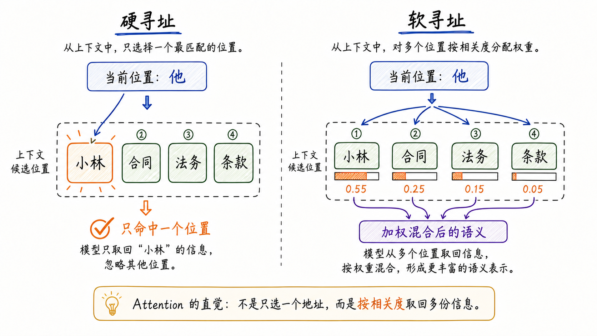
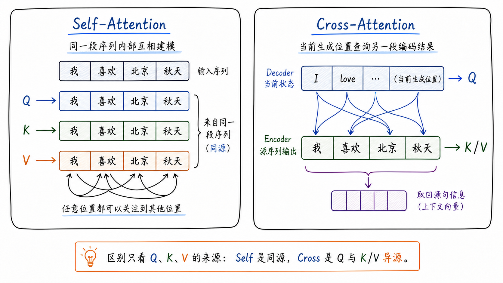
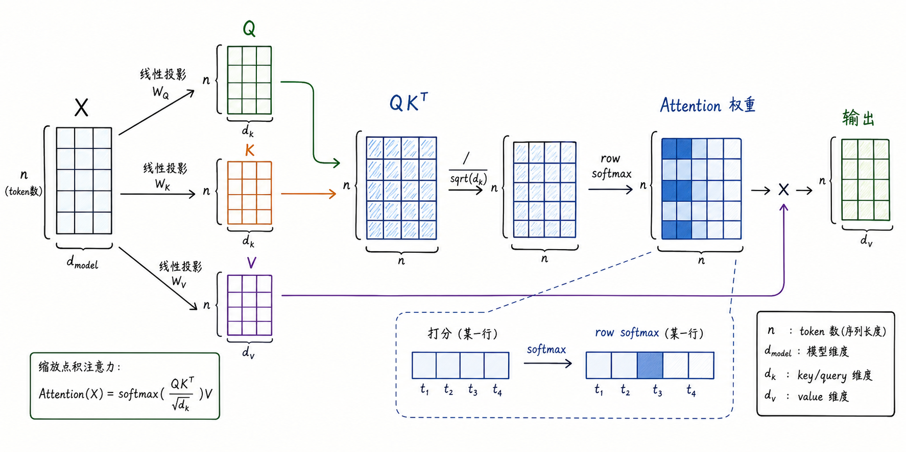
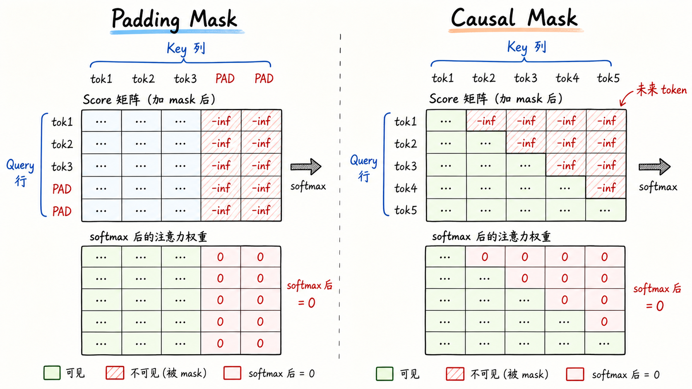
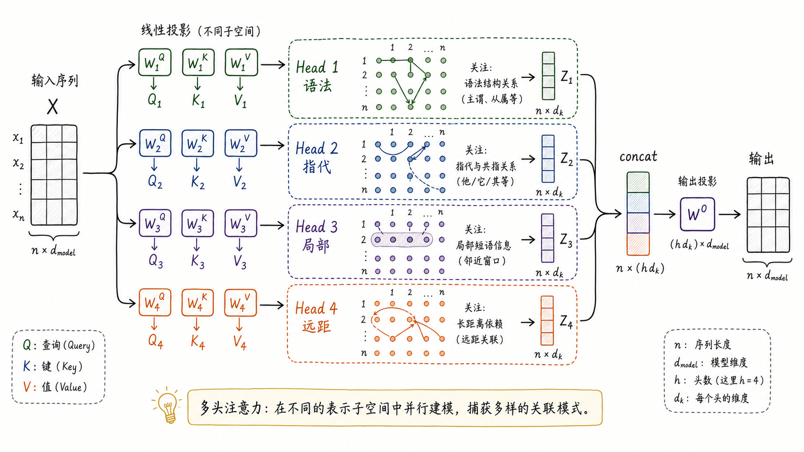
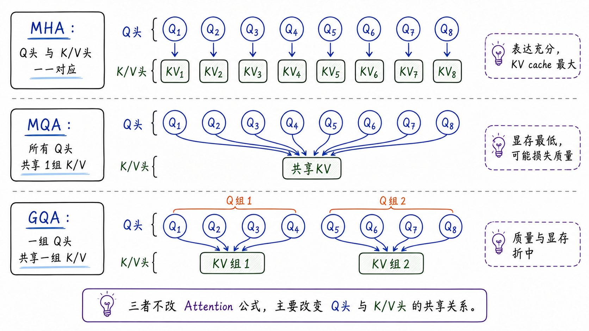

---
tags:
  - LLM
  - attention
  - transformer
  - deep-learning
updated: 2026-06-10
description: 从长程依赖如何逼出 Attention 出发，解释软寻址、Q/K/V、Scaled Dot-Product、Mask、多头机制、MHA/MQA/GQA 与工程优化边界，建立进入 Transformer 架构之前的关键算子心智模型。
---
# 04 深入理解 Attention 机制

> [!Quote] 本篇导读
> 上一章梳理了序列模型的演进：n-gram 只能依赖有限窗口，RNN/LSTM 通过隐藏状态传递历史，Seq2Seq 又试图把整段输入压进一个上下文向量。它们都在处理同一个压力：语言的意义常常不在当前位置附近，也不总能被一条链式状态稳定保存。
>
> 先看一句普通的话：
>
> ```text
> 小林把合同交给法务，因为他担心条款里还有风险。
> ```
>
> 当模型处理 **他** 时，最近的词是 **因为**，但真正有用的信息分散在更远处：**小林**更像指代对象，**合同**、**法务**、**条款**和**风险**共同决定这句话的语义场景。模型需要一种机制，让当前位置不必等待信息沿时间链慢慢传过来，而是能主动比较整段上下文，并按相关程度取回有用内容。
>
> Attention 的核心就在这里。它不是把人类的注意力直觉搬进模型，而是把**当前位置要查什么、上下文哪里可被查到、查到后取回什么内容**组织成一套连续、可训练、可矩阵化的计算过程。

## 1. 从长程依赖到软寻址

在进入公式之前，先把 Attention 要替代的心智模型说清楚。

程序里的寻址通常很硬。数组下标 `arr[3]` 只会取第 4 个元素；数据库按主键查 `id = 42`，要么命中这条记录，要么没有命中。硬寻址清晰、离散、精确，适合确定性的程序操作，却不适合作为神经网络处理语言依赖的核心方式。

语言理解很少是单点命中。仍然看导读里的句子：

```text
小林 / 把 / 合同 / 交给 / 法务 / 因为 / 他 / 担心 / 条款 / 里 / 还有 / 风险
```

处理 **他** 时，最重要的候选可能是 **小林**，但 **法务** 也会参与歧义判断，**合同**、**条款**和**风险**又会帮助模型理解后面的担心对象。如果只允许模型硬选一个位置，很多弱但有用的证据都会被丢掉。

Attention 的第一层心智模型，是把硬寻址改造成**可训练的软寻址**：

- 不只命中一个位置，而是给多个候选位置分配连续权重；
- 权重越高，表示当前位置越多地取用那个位置的信息；
- 输出不是复制某一个 token，而是把多个位置的内容按权重混合成新的表示；



这张图里的硬寻址像是在地址表中只选一个格子，软寻址则更像按相关度同时参考多个格子。对 **他** 这个位置来说，模型可以主要参考 **小林**，少量参考 **合同**、**法务**和**条款**，再把这些内容混合成当前位置的新表示。

更准确地说，Attention 不是先由人写一张规则表，再让模型照表查询。它通过训练学出一套打分方式：什么样的当前位置应该匹配什么样的上下文位置，哪些内容应该被更高权重地混合回来。因为这个过程是连续的、可微的，模型才能在大量样本中自动调整查找与取回策略。

这一节的压缩结论是：

**Attention = 对上下文做可训练的软寻址，并把被寻址位置的内容加权取回。**

## 2. Q/K/V：三种角色

软寻址要落进神经网络，必须把一次取回动作拆成三个问题：

1. 当前位置要查什么；
2. 候选位置怎样暴露可匹配特征；
3. 命中之后真正返回什么内容；

这三个问题对应 Query、Key、Value，也就是 Q/K/V。

### 2.1 三种角色如何分工

一个 token 进入模型后已经有自己的向量表示，但同一份向量如果同时承担查询、索引和内容三种工作，角色会混在一起。Attention 用三组线性投影把它们分开：

| 角色 | 中文直觉 | 在计算中的作用 |
| --- | --- | --- |
| Query | 我现在想找什么 | 由当前位置发出，用来和所有 Key 打分 |
| Key | 我能怎样被查到 | 由候选位置提供，暴露可匹配的索引特征 |
| Value | 我真正贡献什么内容 | 由候选位置提供，被权重加权混合进输出 |

比如 **合同** 这个词在不同角色下需要强调不同特征：

- 作为 Query 时，它可能在寻找解释自身动作或状态的上下文；
- 作为 Key 时，它需要暴露**法律文件实体**这类可被匹配的索引特征；
- 作为 Value 时，它携带可被其他位置取回的语义内容；

因此 Transformer 会学习三组线性投影：

$$
Q = XW^Q,\quad K = XW^K,\quad V = XW^V
$$

这里的 $X$ 是输入序列的表示矩阵，$W^Q$、$W^K$、$W^V$ 是可学习参数。它们把同一份输入分别投影到查询空间、索引空间和内容空间。

回到 **他** 的例子，可以按四步理解：

1. **他** 这个位置生成 Query，表达当前位置需要找到指代对象；
2. **小林**、**合同**、**法务**、**条款**等位置生成 Key，表达各自有哪些可被匹配的特征；
3. Query 与每个 Key 打分，得到 **他** 对每个候选位置的相关度；
4. 权重作用到这些位置的 Value 上，把内容混合回 **他** 的新表示；

真正被取回的是 Value。Key 更像目录索引，Query 更像检索请求，score 和 softmax 决定每份内容被参考多少。

同样的角色分工也能解释翻译中的软对齐：

```text
源句：我 爱 北京 天安门
目标：I love ___
```

当 Decoder 准备生成 **Beijing** 时，当前位置会形成一个 Query，并与源句每个位置的 Key 计算相关度：

| 源 token | 可能的语义 | 相关度直觉 |
| --- | --- | --- |
| 我 | 主语 | 低 |
| 爱 | 动作 | 中 |
| 北京 | 地点实体 | 高 |
| 天安门 | 地点实体的一部分或相关地点 | 中到高 |

softmax 之后，**北京** 对应的权重通常更大，**天安门** 也可能保留一定权重。最终上下文向量不是离散复制 **北京**，而是把多个 Value 按权重混合，再交给后续网络参与生成。

这就是 Attention 与传统离散对齐的关键差别：它可以表达**主要对齐到北京，同时参考天安门**这样的连续关系。

### 2.2 Self-Attention 与 Cross-Attention

Q/K/V 的来源不同，会形成 Self-Attention 和 Cross-Attention 两种常见结构。两者的核心公式相同，区别在于 Query 从哪里来，Key/Value 从哪里来。



Self-Attention 中，Q、K、V 来自同一段序列。比如一句话中的每个 token 都从同一句话里生成 Query、Key、Value，然后句内所有位置互相建模。Encoder-Only 模型里的双向 Attention、Decoder-Only LLM 里的 masked self-attention，本质上都属于 Self-Attention，只是可见性约束不同。

Cross-Attention 中，Q 来自当前正在生成或解码的一侧，K/V 来自另一段已经编码好的信息。典型例子是 Encoder-Decoder 翻译模型：Decoder 当前状态提供 Query，Encoder 的源句输出提供 Key 和 Value。它的语义是：

**当前生成位置向源序列发出查询，并从源序列编码结果中取回内容。**

两者可以放在一张表里：

| 类型 | Q 来自 | K/V 来自 | 典型用途 |
| --- | --- | --- | --- |
| Self-Attention | 当前序列 | 当前序列 | 同一段文本内部各位置互相建模 |
| Cross-Attention | 目标序列或 Decoder 状态 | 源序列或 Encoder 输出 | 生成时查询另一段编码结果 |

现代 Decoder-Only LLM 的主干通常没有传统 Encoder-Decoder 式 Cross-Attention，主体是 masked self-attention。检索增强、多模态模型、工具或外部 memory 融合等场景，可能会重新引入 cross-attention 或与它相似的信息融合结构。

## 3. Scaled Dot-Product Attention

有了 Q/K/V，Attention 剩下的数学任务可以压缩成两步：先让 Query 和 Key 形成匹配分布，再用这份分布汇总 Value。Scaled Dot-Product Attention 就是把这两步写成高效矩阵计算。

### 3.1 从单个位置到矩阵

先看一个 Query 对多个 Key 的打分。单个 Query $q$ 与某个 Key $k_i$ 的相关度通常用点积：

$$
s_i = q \cdot k_i
$$

如果当前序列有 $n$ 个候选位置，单个 Query 会得到 $n$ 个 score。softmax 之后得到权重：

$$
\alpha_i = \frac{\exp(s_i)}{\sum_{j=1}^{n}\exp(s_j)}
$$

输出就是 Value 的加权和：

$$
o = \sum_{i=1}^{n}\alpha_i v_i
$$

Transformer 的关键是把所有位置一次性矩阵化。设输入为：

$$
X \in \mathbb{R}^{n \times d_{\text{model}}}
$$

投影后得到：

$$
Q \in \mathbb{R}^{n \times d_k},\quad
K \in \mathbb{R}^{n \times d_k},\quad
V \in \mathbb{R}^{n \times d_v}
$$

所有 Query 对所有 Key 的打分可以一次写成：

$$
QK^T \in \mathbb{R}^{n \times n}
$$

这个 $n \times n$ 矩阵非常重要。第 $i$ 行表示第 $i$ 个位置作为 Query 时，对所有 Key 的相关度；第 $j$ 列表示第 $j$ 个位置作为 Key 时，被所有 Query 匹配的程度。

完整的 Scaled Dot-Product Attention 写作：

$$
\operatorname{Attention}(Q,K,V)
= \operatorname{softmax}\left(\frac{QK^T}{\sqrt{d_k}}\right)V
$$



图里的流程可以按五步读：

1. 输入 $X$ 通过三组线性投影得到 $Q$、$K$、$V$；
2. $QK^T$ 生成所有位置之间的打分矩阵；
3. 除以 $\sqrt{d_k}$ 调整分数尺度；
4. softmax 按行归一化，得到每个 Query 对所有 Key 的权重分布；
5. 权重矩阵乘以 $V$，得到每个位置的新表示；

一句话理解，就是：**Query 决定我要查什么，Key 决定我能被怎样查到，Value 决定查到后返回什么。**

### 3.2 关键细节

注意力公式很短，但几个细节决定了它能否稳定训练，以及能否被正确理解。

**第一，为什么要除以 $\sqrt{d_k}$？**

如果只做点积 $q \cdot k$，当维度 $d_k$ 变大时，点积的方差会变大。一个简化推导如下。假设 $q$ 和 $k$ 的各维独立，均值为 0，方差为 1，则：

$$
q \cdot k = \sum_{r=1}^{d_k} q_r k_r
$$

每一项 $q_r k_r$ 的方差近似为 1，$d_k$ 项相加后：

$$
\operatorname{Var}(q \cdot k) \approx d_k
$$

维度越大，点积分数越容易变得很大或很小。softmax 的输入一旦过大，就会进入饱和区：最大的值接近 1，其他值接近 0，梯度变弱，模型过早变成接近硬选择的状态。

除以 $\sqrt{d_k}$ 后：

$$
\operatorname{Var}\left(\frac{q \cdot k}{\sqrt{d_k}}\right)
\approx 1
$$

这一步不是装饰性的常数，而是把分数尺度拉回 softmax 更容易工作的范围，让 Attention 在较大维度下仍能稳定训练。

**第二，softmax 为什么按行做？**

因为每一行对应一个 Query。第 $i$ 行表示第 $i$ 个位置要从哪些位置取信息，这一行经过 softmax 后，所有候选 Key 的权重非负且总和为 1，于是每个 Query 都得到自己的一份注意力分布。

**第三，softmax 带来的是竞争性分配。**

某些位置权重变大时，其他位置权重会相对变小。这种竞争让模型能突出重点，也可能在长上下文中稀释小但重要的证据。很多后续改进都围绕这件事展开：有的改变可见范围，如局部窗口或稀疏 Attention；有的保持数学结果但优化实现路径，如 FlashAttention 的 IO-aware 分块计算；有的改变推理阶段缓存的组织方式，如 MQA/GQA 对 K/V head 的共享。

**第四，Attention 权重不是完整解释。**

权重高只说明某一层、某个 head 在这次计算中从某些 Value 混入了更多内容，不能直接等同于模型最终决策原因。Value 本身携带什么信息、输出投影如何混合各 head、残差连接和 FFN 怎样继续改写表示、后续层如何再路由信息，都会影响最终预测。

真实框架里 Attention 通常还会插入 mask、dropout、数值稳定处理和融合 kernel。以 PyTorch 的 `scaled_dot_product_attention` 为例，它把 scale、mask、causal 约束和数值稳定细节组织进同一个接口里；这些工程细节不改变核心公式的直觉，但会影响实际行为。

## 4. 可见性与 Mask

Scaled Dot-Product Attention 默认给出所有位置之间的打分，但打分矩阵本身不知道哪些格子是合法信息。如果没有额外约束，PAD token 会参与语义竞争，Decoder 在训练时也可能偷看未来答案。Mask 的作用，是在 softmax 之前把不可见位置从竞争中移除。

把 mask 写进公式，可以得到：

$$
\operatorname{Attention}(Q,K,V)
= \operatorname{softmax}\left(\frac{QK^T + M}{\sqrt{d_k}}\right)V
$$

其中 $M_{ij}=0$ 表示位置 $i$ 可以看位置 $j$，$M_{ij}=-\infty$ 或一个极大的负数表示位置 $j$ 对位置 $i$ 不可见。经过 softmax 后，不可见位置的权重会变成 0 或近似 0。

这说明 mask 不是在输出后擦掉结果，而是在权重分布形成之前就规定哪些位置不能参与竞争。



最常见的两类 mask 是 Padding Mask 和 Causal Mask。

Padding Mask 处理 batch 对齐带来的非真实 token。不同句子组成 batch 时，长度通常不同，系统会把短句补齐：

```text
句子 A: 我 喜欢 北京
句子 B: 我 喜欢 上海 的 夜景

补齐后:
句子 A: 我 喜欢 北京 PAD PAD
句子 B: 我 喜欢 上海 的 夜景
```

PAD token 不是语义内容。如果 Attention 把它当成普通 token，就会把无意义信息混入输出。Padding Mask 会把 PAD 对应的 Key 位置屏蔽掉，使所有 Query 都不会从 PAD 位置取 Value。

Causal Mask 处理自回归生成的可见边界。语言模型训练的目标是预测下一个 token，假设目标序列是：

```text
我 / 喜欢 / 北京 / 的 / 秋天
```

当模型在位置 2 预测 **北京** 时，它只能看到 **我 / 喜欢**，不能偷看 **北京 / 的 / 秋天**。否则训练会变成泄题。Causal Mask 通常是一个上三角屏蔽矩阵：第 1 个位置只能看自己，第 2 个位置可以看第 1、2 个位置，第 3 个位置可以看第 1、2、3 个位置，依此类推。这样训练时仍能并行计算所有位置，但每个位置的可见信息都符合自回归约束。

不同 mask 对应不同架构语义：

| Mask 类型 | 信息边界 | 对能力的影响 |
| --- | --- | --- |
| 无 causal mask 的双向 Self-Attention | 每个位置可看左右两侧 | 适合理解任务，如 BERT-style encoder |
| Causal Mask | 每个位置只能看过去和当前 | 适合自回归生成，如 GPT-style decoder |
| Padding Mask | 屏蔽非真实 token | 保证 batch 对齐不污染语义 |
| 局部窗口 mask | 只看附近窗口 | 降低长序列成本，但牺牲全局可见性 |

同样是 Self-Attention，只要 mask 不同，模型的任务属性就会不同。Encoder-Only 模型通常使用双向 Self-Attention；Decoder-Only LLM 使用 Causal Mask；Encoder-Decoder 架构则在 Encoder、Decoder self-attention 和 Decoder cross-attention 中分别使用不同的信息边界。

还有一个容易踩坑的实现细节：不同框架里布尔 mask 的语义可能相反。有的 API 用 `True` 表示允许参与，有的用 `True` 表示要屏蔽。写代码时不能只看变量名，必须确认当前 API 的约定。数学上最终都等价于：不可见位置在 softmax 前被压到极小值。

因此，学习 Transformer 时不要把 mask 当成公式之外的小补丁。它是 Attention 能否用于理解、生成、翻译和长上下文建模的关键开关。

## 5. Multi-Head Attention

Mask 确定哪些位置可以通信，但还没有解决另一个问题：一个位置可能需要用多种关系去匹配上下文，而单一 Q/K/V 子空间会把这些关系压在同一种打分方式里。

仍然看这个句子：

```text
小林把合同交给法务，因为他担心条款里还有风险。
```

当模型处理 **担心** 时，它至少需要建立两类关系：一类回到 **小林**，确认动作主体；另一类看到 **条款**和**风险**，理解担心的对象。前者更接近句法和指代，后者更接近语义和主题。如果只有一个 head，模型只能在一套投影空间里同时处理这些关系，表达会被挤压。

Multi-Head Attention 的做法，是把模型维度分成多个子空间，让每个 head 在自己的子空间中独立计算 Attention，再把结果拼接回来。



### 5.1 多头不是重复计算

多头机制可以写成：

$$
\operatorname{head}_i
= \operatorname{Attention}(QW_i^Q, KW_i^K, VW_i^V)
$$

$$
\operatorname{MultiHead}(Q,K,V)
= \operatorname{Concat}(\operatorname{head}_1,\ldots,\operatorname{head}_h)W^O
$$

这个公式里有两个关键点。

第一，每个 head 有自己的投影矩阵。它不是把同一个 Attention 重复算 $h$ 次，而是在不同子空间里学习不同的匹配方式。

第二，拼接后的 $W^O$ 会重新混合各 head 的输出。head 之间不是彼此隔离的专家，而是先并行提取不同关系，再通过输出投影合成为统一表示。

原始 Transformer Base 中：

$$
d_{\text{model}} = 512,\quad h = 8,\quad d_k = d_v = 64
$$

一般情况下：

$$
d_k = d_v = \frac{d_{\text{model}}}{h}
$$

这样做的一个好处是，总计算量大致保持稳定。多头并不是把计算量简单乘以 $h$，因为每个 head 的维度变小了。相较于一个 512 维单头，8 个 64 维头在主要矩阵乘法上的总量接近，但表示结构更丰富。

真实模型中，每个 head 的分工不一定能被人类稳定命名为语法头、指代头或局部头。它们可能有重叠、冗余，也可能在不同层中承担不同功能。把多头理解成**多个子空间的并行信息路由**，比给每个 head 强行贴人类语义标签更稳妥。

### 5.2 MHA、MQA 与 GQA

训练阶段，多头的主要价值是表达能力。进入自回归推理后，另一个瓶颈会变得突出：模型每生成一个 token，当前 Query 都要查询所有历史 token 的 Key 和 Value。为了避免重复计算，系统会把历史 K/V 缓存下来，这就是 KV cache。

KV cache 的显存占用与层数、序列长度、batch、K/V head 数和每头维度有关。上下文越长、并发越高，K/V 的存储和读取压力越大。于是 Q head 与 K/V head 的数量关系成为一个独立设计轴：MHA、MQA、GQA 分别位于这条轴的不同位置。



MHA（Multi-Head Attention）是最直观的形式：多个 Query head 对应多个 Key/Value head。假设有 8 个 Q head，就有 8 组 K/V head。它的表达能力强，但推理时每一层都要缓存多组 K/V，KV cache 占用也最大。

MQA（Multi-Query Attention）保留多个 Query head，但所有 Query head 共享同一组 Key/Value head。这样做会显著减少 K/V 张量大小，也降低增量解码时反复读取 K/V 的内存带宽压力。代价是不同 Query head 可用的 K/V 表示被共享，表达自由度下降，质量可能受到影响。

GQA（Grouped-Query Attention）位于 MHA 和 MQA 之间。它把多个 Query head 分成若干组，每组共享一组 K/V head。比如 32 个 Q head 对应 8 组 K/V head，那么每 4 个 Query head 共享一组 K/V。这样既能减少 KV cache，又比所有 head 共享一组 K/V 更保留表达能力。

可以把三者放在一张表里：

| 机制 | Query head | Key/Value head | 推理侧影响 | 适用直觉 |
| --- | --- | --- | --- | --- |
| MHA | 多个 | 同样多个 | KV cache 最大，表达能力强 | 训练和小规模推理中最直观 |
| MQA | 多个 | 1 组共享 | KV cache 最小，带宽压力最低 | 极端压缩 K/V，追求解码效率 |
| GQA | 多个 | 若干组共享 | KV cache 与质量折中 | 现代 LLM 常见折中方案 |

MHA、MQA、GQA 不改变 Attention 的基本动作：仍然是 Q 与 K 打分，softmax 后加权取回 V。它们改变的是 K/V 在 head 维度上的共享关系。这个设计一旦和长上下文、batch serving、KV cache、TP 分片结合，就会直接影响推理吞吐、显存容量和工程部署方式。

## 6. 性能开销与优化

Attention 的数学直觉很干净，工程成本却不低。理解它的成本时，需要区分训练时的整段计算、推理时的 prefill、逐 token decode，以及不同优化到底在改哪一层问题。

### 6.1 复杂度来自哪里

标准 Self-Attention 的核心成本来自两次矩阵乘法：$QK^T$ 和注意力权重乘 $V$。设序列长度为 $n$，模型维度为 $d_{\text{model}}$，head 数为 $h$，单个 head 维度为 $d_k$，通常有 $h d_k \approx d_{\text{model}}$。

对所有 head 合起来看，$QK^T$ 的主要计算量约为：

$$
O(h n^2 d_k) \approx O(n^2 d_{\text{model}})
$$

权重矩阵再乘以 $V$ 也有同阶成本，因此标准 Attention 常被概括为：

$$
O(n^2 d_{\text{model}})
$$

这个 $n^2$ 来自所有位置两两交互。长度翻倍，注意力打分矩阵从 $n \times n$ 变成 $2n \times 2n$，元素数量约变成四倍。长上下文不是把窗口数字调大那么简单，它会同时压迫计算、显存、中间激活、KV cache、带宽和调度。

朴素训练实现还会显式保存注意力 logits 或概率矩阵，带来：

$$
O(h n^2)
$$

级别的中间显存占用。反向传播还需要保留或重算部分中间状态，所以训练长序列时，显存压力往往比公式里的单次前向更严峻。

推理阶段要再分成 prefill 和 decode。

Prefill 处理的是已有 prompt，它仍然需要让 prompt 内的位置两两建立可见关系，所以长 prompt 的 Attention 成本仍带有 $n^2$ 项。

Decode 每次只生成一个新 token。第 $t$ 步只需要让新 Query 去查询前 $t$ 个历史 K/V，因此单步 Attention 近似是 $O(t d_{\text{model}})$，从第 1 步生成到第 $n$ 步的累计成本仍会随长度增长。KV cache 避免了反复计算历史 K/V，但它把压力转移到显存容量和内存带宽：

$$
O(L \cdot B \cdot n \cdot h_{\text{kv}} \cdot d_{\text{head}})
$$

这里 $L$ 是层数，$B$ 是 batch 或并发序列数，$h_{\text{kv}}$ 是 K/V head 数。上下文越长、并发越高，系统越容易从算力瓶颈转向 KV cache 读写瓶颈。

可以把主要压力整理成一张表：

| 场景 | 主要压力 | 典型表现 |
| --- | --- | --- |
| 训练长序列 | $n^2$ 注意力矩阵与反向激活 | 显存快速增长，batch size 被压缩 |
| Prefill 长 prompt | prompt 内两两交互 | 首 token 延迟上升 |
| Decode 长上下文 | 反复读取历史 K/V | 吞吐受显存带宽和 KV cache 管理影响 |
| 高并发 serving | KV cache 随 batch 和上下文累积 | 容量、调度和碎片管理成为关键 |

### 6.2 优化策略的边界

面对二次复杂度，不同优化路线解决的问题并不一样。

FlashAttention 这类方法通常保持精确 Attention 的数学结果，但改变计算组织方式。它通过分块、在线 softmax 和 IO-aware 的内存访问设计，减少 HBM 与片上 SRAM 之间的读写，避免显式保存完整注意力矩阵。它解决的是**同一个数学结果如何更高效地算出来**。

局部窗口、稀疏 Attention、滑动窗口 Attention 等方法会改变可见范围或连接模式。它们解决的是**是否真的需要每个位置都看见所有位置**。这类方法可能降低复杂度，但也会改变模型能直接访问的信息边界。

KV cache 解决的是自回归推理中的重复计算问题。历史 token 的 K/V 已经算过，就缓存起来供后续 token 查询。它不改变单步 Attention 公式，却显著改变 serving 系统的资源结构：显存中常驻的不再只有模型权重，还有不断增长的请求状态。

MQA/GQA 又是另一类优化。它们不主要改变 $QK^T$ 的序列长度二次项，而是减少 K/V head 的数量，从而降低 KV cache 显存占用和增量解码时的读取带宽。

所以学习 Attention 优化时，要先分清它在优化哪一类瓶颈：

| 优化方向 | 主要改变 | 是否保持标准 Attention 数学结果 |
| --- | --- | --- |
| FlashAttention | 计算与显存读写路径 | 通常保持精确结果 |
| 局部/稀疏 Attention | 可见范围或连接模式 | 改变或近似 |
| MQA/GQA | K/V head 共享关系 | 基本动作不变，但表示容量变化 |
| KV cache | 推理阶段复用历史 K/V | 不改变单步 Attention 公式 |

### 6.3 工程判断

如果训练或 prefill 的长序列成本过高，优先关注 IO-aware Attention、激活重算、序列并行或更好的 kernel；如果 decode 吞吐被 KV cache 读写拖住，MQA/GQA、KV cache 管理、批处理调度和显存布局会更关键；如果任务本身不需要全局两两可见，局部或稀疏可见范围才可能从问题定义上减少工作量。

这几个方向不能简单互相替代。FlashAttention 让标准 Attention 算得更省，局部/稀疏 Attention 改变可见图，MQA/GQA 压缩 K/V 表示，KV cache 复用历史状态。它们常常组合出现，但每一种优化背后的代价都不同。

## 7. 本章小结

可以把 Attention 压缩成一个七步模型：

1. 每个位置产生 Query，表达当前位置需要什么；
2. 每个位置产生 Key，表达自己可以怎样被匹配；
3. 每个位置产生 Value，表达自己能贡献什么内容；
4. Query 与 Key 生成打分矩阵；
5. 打分经过缩放和 mask，形成合法的竞争范围；
6. softmax 生成每个 Query 的权重分布；
7. 权重乘以 Value，得到当前位置的新表示；

这个模型的重要性不在于它像人类一样注意某个词，而在于它把序列中的位置变成了可直接交互的节点。信息不再必须沿时间链一步步传递，而是在一层内通过矩阵乘法建立全局连接。

Q/K/V 解释的是信息如何被查询、索引和取回；Scaled Dot-Product Attention 解释的是这种动作如何被矩阵化；Mask 解释的是哪些信息边界合法；Multi-Head Attention 解释的是模型如何在多个子空间中并行路由不同关系；MHA、MQA、GQA 和 FlashAttention 等工程设计，则把这个机制带入长上下文与高并发推理的成本现实。

Attention 已经解决了位置之间如何通信的问题，但一个完整序列模型还需要顺序信号、非线性变换、残差与归一化、层级堆叠、训练目标和生成边界。下一章进入 Transformer，重点就从单个算子转向完整架构：怎样把 Attention 组织成可训练、可扩展、可生成的深层网络。

## 8. 参考资料

1. Vaswani, A., et al. (2017). *Attention Is All You Need*. https://arxiv.org/abs/1706.03762；
2. Bahdanau, D., Cho, K., & Bengio, Y. (2014). *Neural Machine Translation by Jointly Learning to Align and Translate*. https://arxiv.org/abs/1409.0473；
3. Luong, M. T., Pham, H., & Manning, C. D. (2015). *Effective Approaches to Attention-based Neural Machine Translation*. https://arxiv.org/abs/1508.04025；
4. Shazeer, N. (2019). *Fast Transformer Decoding: One Write-Head is All You Need*. https://arxiv.org/abs/1911.02150；
5. Ainslie, J., et al. (2023). *GQA: Training Generalized Multi-Query Transformer Models from Multi-Head Checkpoints*. https://arxiv.org/abs/2305.13245；
6. Dao, T., et al. (2022). *FlashAttention: Fast and Memory-Efficient Exact Attention with IO-Awareness*. https://arxiv.org/abs/2205.14135；
7. Harvard NLP. *The Annotated Transformer*. https://nlp.seas.harvard.edu/annotated-transformer/；
8. PyTorch Documentation. *torch.nn.functional.scaled_dot_product_attention*. https://docs.pytorch.org/docs/stable/generated/torch.nn.functional.scaled_dot_product_attention.html；

## 9. 学习测评

### 9.1 题目

1. 在 Attention 的 Q/K/V 视角中，Query 最准确的含义是什么？
   A. 当前 token 真正要返回给下一层的内容；
   B. 当前 token 发出的检索请求；
   C. 上下文 token 的位置编号；
   D. softmax 之后的概率分布；

2. 在 Self-Attention 中，Q、K、V 通常来自哪里？
   A. Q 来自 Decoder，K/V 来自 Encoder；
   B. Q/K/V 都来自同一个输入序列的不同线性投影；
   C. Q 来自位置编码，K/V 来自词向量；
   D. Q/K/V 分别来自三份不同训练样本；

3. 为什么 Scaled Dot-Product Attention 要除以 $\sqrt{d_k}$？
   A. 为了减少 Value 的维度；
   B. 为了让点积分数尺度更稳定，避免 softmax 过早饱和；
   C. 为了把 mask 变成 0；
   D. 为了让每个 head 的参数完全共享；

4. 对于一个长度为 $n$ 的序列，标准 Self-Attention 的注意力权重矩阵形状通常是什么？
   A. $n \times d_{\text{model}}$；
   B. $d_{\text{model}} \times d_{\text{model}}$；
   C. $n \times n$；
   D. $h \times d_k$；

5. Padding Mask 的主要作用是什么？
   A. 防止模型看到未来 token；
   B. 屏蔽 batch 补齐产生的非真实 token；
   C. 降低 Query 投影矩阵的参数量；
   D. 让所有 token 的位置编码相同；

6. Causal Mask 对自回归语言模型的意义是什么？
   A. 让当前位置只能看到过去和当前，不能偷看未来；
   B. 让模型忽略所有历史 token，只看当前 token；
   C. 让 Encoder 输出被 Decoder 读取；
   D. 让 softmax 不再归一化；

7. Multi-Head Attention 相比单头 Attention 的核心增益是什么？
   A. 每个 head 都复制同一套 Attention 权重以降低噪声；
   B. 在不同表示子空间中并行学习多种匹配关系；
   C. 完全消除 $O(n^2)$ 复杂度；
   D. 不再需要 Q/K/V 投影；

8. 下列哪项对 Cross-Attention 的描述最准确？
   A. Q 与 K/V 来自同一个序列；
   B. Q 来自当前生成状态，K/V 来自另一个编码结果；
   C. 只用于屏蔽 PAD token；
   D. 只在 CNN 中使用；

9. 为什么不能把 Attention 权重直接等同于模型解释？
   A. 因为 Attention 权重不是数值；
   B. 因为 Value、后续层、FFN、残差等都会继续改变表示；
   C. 因为 Attention 不参与梯度更新；
   D. 因为 softmax 后权重和不等于 1；

10. 标准 Self-Attention 在长上下文中最核心的成本压力来自哪里？
    A. 词表大小随序列长度平方增长；
    B. 任意位置两两交互导致 $n \times n$ 注意力矩阵；
    C. LayerNorm 只能串行执行；
    D. 位置编码需要存储所有训练样本；

11. MQA/GQA 主要试图缓解现代 LLM 推理中的什么问题？
    A. FFN 参数量过少；
    B. KV cache 显存占用和读取压力；
    C. tokenizer 无法切分中文；
    D. Causal Mask 无法训练；

12. 如果一个模型使用双向 Self-Attention 且没有 causal mask，它更自然适合哪类任务？
    A. 自回归逐 token 生成；
    B. 文本理解、分类、抽取等可看完整输入的任务；
    C. 只能做图像分类；
    D. 只能做优化器状态同步；

13. 标准 Scaled Dot-Product Attention 的合理计算顺序是什么？
    A. softmax -> mask -> $QK^T$ -> 乘 $V$；
    B. $QK^T$ -> scale -> mask -> softmax -> 乘 $V$；
    C. $QK^T$ -> 乘 $V$ -> softmax -> mask；
    D. mask -> 乘 $V$ -> $QK^T$ -> scale；

14. 软寻址相比硬寻址的关键差异是什么？
    A. 只能选择一个位置；
    B. 可以对多个位置按权重混合取回 Value；
    C. 不需要 Key；
    D. 不需要可学习投影；

15. 下列哪种说法最准确地区分 MHA、MQA 与 GQA？
    A. 三者都只有一个 Query head；
    B. 三者主要区别在 Q head 与 K/V head 的共享关系；
    C. MQA 会取消 softmax；
    D. GQA 只用于 Encoder，不用于 Decoder；

16. FlashAttention 这类 IO-aware 精确 Attention 优化主要改变的是什么？
    A. 改变 Transformer 的训练目标；
    B. 改变可见范围，让每个 token 只能看局部窗口；
    C. 改变计算组织和显存读写路径，通常保持标准 Attention 数学结果；
    D. 删除 Value 矩阵；

### 9.2 答案与题解

1. B。Query 表示当前位置发出的检索请求，用来和上下文中的 Key 计算相关度。Value 才是被加权取回的内容。

2. B。在 Self-Attention 中，Q/K/V 通常都由同一个输入序列 $X$ 经过不同线性投影得到。Cross-Attention 才是 Q 与 K/V 来源不同。

3. B。点积方差会随 $d_k$ 增大而增大，除以 $\sqrt{d_k}$ 可以让 softmax 输入尺度更稳定，避免分布过早变得极端。

4. C。每个 Query 都要和每个 Key 打分，因此长度为 $n$ 的序列会产生 $n \times n$ 的注意力打分或权重矩阵。

5. B。Padding Mask 屏蔽补齐用的 PAD token，避免模型从非真实位置取回无意义 Value。

6. A。Causal Mask 保证第 $t$ 个位置只能看到 $\leq t$ 的 token，使训练时并行计算仍符合自回归生成约束。

7. B。多头机制通过多组投影让模型在不同子空间里学习不同关系，再把结果拼接和投影回统一表示。

8. B。Cross-Attention 的典型语义是 Decoder 当前状态发出 Query，Encoder 输出提供 Key 和 Value。

9. B。Attention 权重只是局部混合路径的一部分，后续层和 Value 内容都会影响最终预测，所以不能把权重直接当作完整因果解释。

10. B。标准 Self-Attention 需要所有位置两两交互，注意力矩阵随序列长度平方增长。

11. B。MQA/GQA 减少 Key/Value head 的数量或共享范围，主要降低自回归推理中的 KV cache 显存占用和带宽压力。

12. B。没有 causal mask 的双向 Attention 可以看完整输入，更适合理解型任务；自回归生成需要防止看到未来 token。

13. B。标准流程先计算 $QK^T$，再按 $\sqrt{d_k}$ 缩放；mask 通常作用在 softmax 前的 logits 上，最后 softmax 权重再乘以 $V$。

14. B。软寻址不是命中单个地址，而是给多个候选位置分配连续权重，并按这些权重混合取回 Value。

15. B。MHA、MQA、GQA 的主要差别在于多个 Query head 是否拥有独立 K/V head，还是共享一组或分组共享 K/V head。

16. C。FlashAttention 的核心是重组计算和内存访问，减少显存读写与中间矩阵保存；它通常保持标准 Attention 的数学结果，而不是改成局部窗口或删除 Value。
