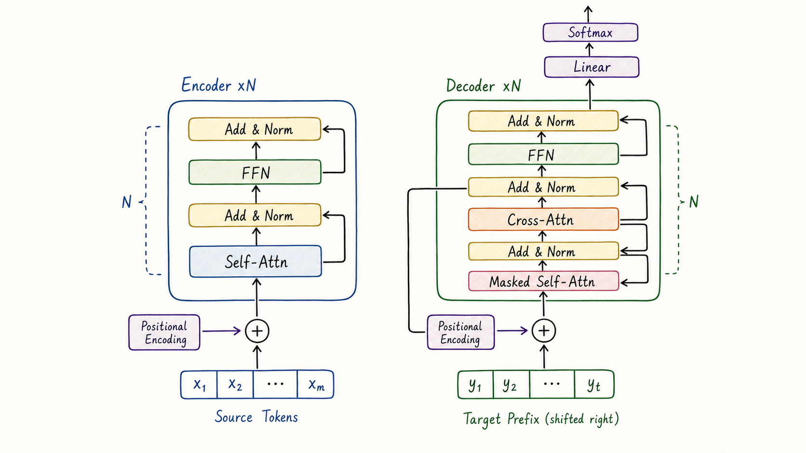
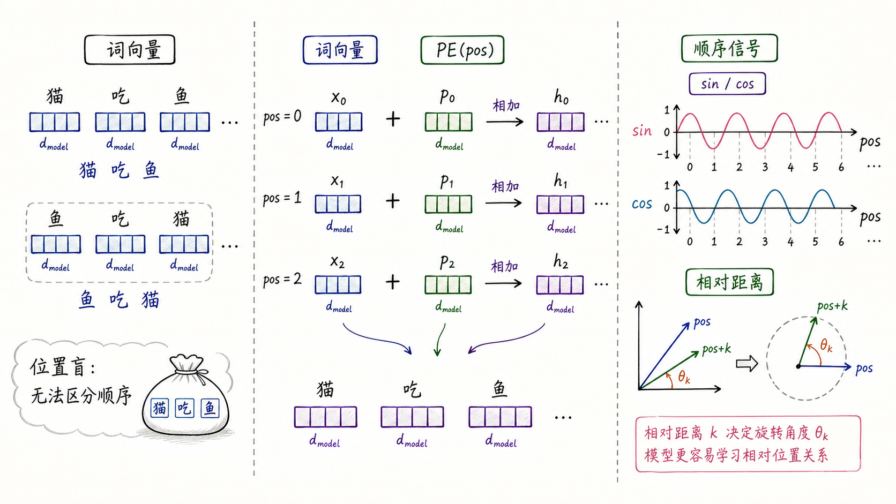
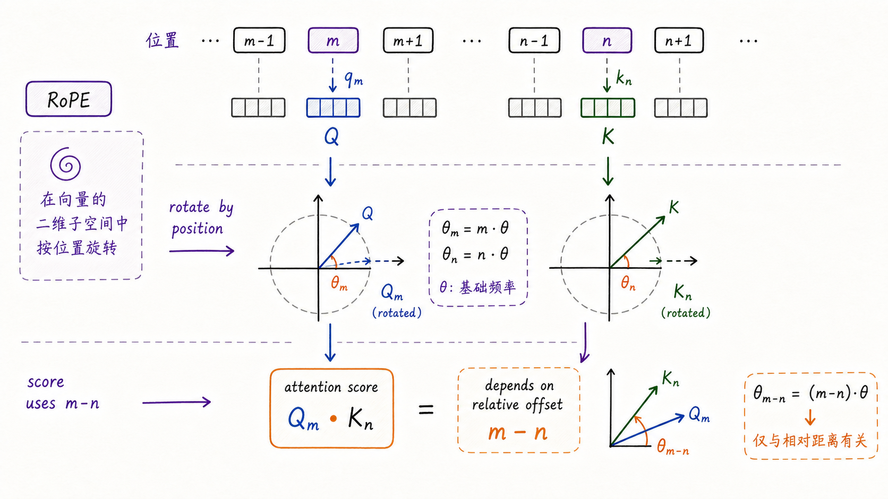
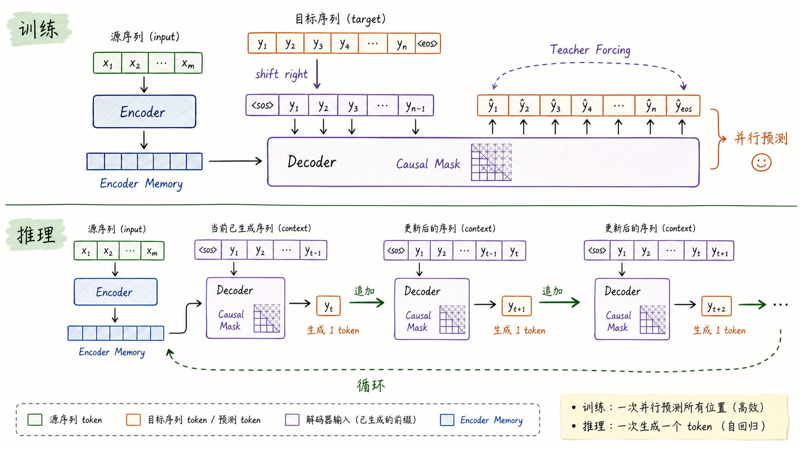
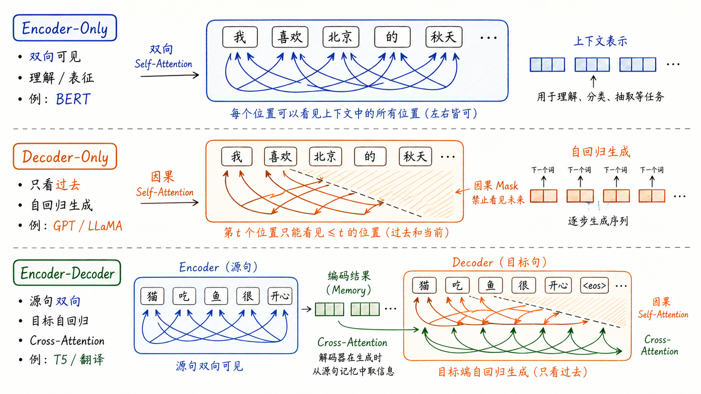

---
tags:
  - LLM
  - transformer
  - attention
  - model-architecture
updated: 2026-06-09
description: 从机器翻译与自回归生成问题出发，解释 Transformer 如何把 Attention 组织成完整可训练、可并行、可生成的序列架构，并连接位置编码、Encoder-Decoder、Block、训练推理与现代 LLM 主干。
---

# 05 Transformer 架构及原理

> [!Quote] 本篇导读
> 先看一个翻译任务：
>
> ```text
> 源句：我 喜欢 北京 的 秋天
> 目标：I like the autumn in Beijing
> ```
>
> 模型要做的事情并不只是“看见每个词”。它要知道“北京”在“秋天”之前出现，但目标句里可能要把地点放到后面；它要在生成 “Beijing” 时回到源句中查询“北京”；它还要保证生成目标句时不能提前偷看未来答案。
>
> Attention 已经让序列中的位置可以彼此取回信息，但如果只有 Attention，仍然缺少顺序、深层非线性变换、稳定堆叠和生成边界。Transformer 的真正价值，是把 Attention 放进一套完整网络骨架里，让它既能并行训练，又能按自回归方式一步步生成。

上一篇 [[04_深入理解Attention机制|04 深入理解 Attention 机制]] 已经解释了 Q/K/V、Scaled Dot-Product Attention、mask 和 Multi-Head Attention。本文不重新推导 Attention 公式，而是回答一个更架构化的问题：

**怎样把 Attention 组织成一个可训练、可扩展、可用于真实序列任务的模型？**

## 1. 从生成问题进入 Transformer

### 1.1 Attention 之后还缺什么

Attention 解决的是“当前位置应该从哪些上下文位置取回信息”这个问题。相比 RNN 的链式传递，它让任意两个位置可以在一层内直接交互，也更容易被组织成大矩阵计算。

但一套完整序列模型不能只会“取信息”。如果让裸 Attention 独立承担机器翻译或语言建模任务，会立刻遇到几个约束：

1. 语言有顺序。同样是“猫 / 吃 / 鱼”，换成“鱼 / 吃 / 猫”，词集合没有变，语义已经完全反转；
2. 位置之间交换信息之后，每个 token 还需要在自己的表示内部继续加工。Attention 更像信息路由，不能替代逐 token 的非线性改写；
3. 模型要堆很多层。层数一深，梯度路径、数值尺度和信息保留都会变成训练问题；
4. 训练和生成的信息边界不同。训练时可以一次看到目标句的所有 token，但预测第 $t$ 个 token 时不能使用未来答案；

Transformer 的设计，就是逐一把这些约束变成结构：

| 约束 | Transformer 中的结构回答 |
| --- | --- |
| 序列顺序从哪里来 | Positional Encoding、RoPE、ALiBi 等位置策略 |
| token 之间如何直接通信 | Multi-Head Self-Attention |
| 每个 token 如何做非线性改写 | Position-wise FFN |
| 深层网络如何稳定训练 | Residual Connection、LayerNorm、Dropout |
| 生成时如何避免偷看未来 | Causal Mask / Masked Self-Attention |
| 翻译时如何查询源句 | Cross-Attention |

这样看，Transformer 不是“Attention 的另一个名字”，而是 Attention 周围的一套完整工程骨架。

### 1.2 原始 Encoder-Decoder 的设计答案

《Attention Is All You Need》提出的是 Encoder-Decoder Transformer，最典型的任务是机器翻译：Encoder 读取源句，Decoder 生成目标句。

这张总图先给出整体地图。读图时不要急着记住每个框，而是抓住两条数据流：

1. 源句进入 Encoder，经过多层双向 Self-Attention 和 FFN，变成一组上下文化 memory；
2. 目标句进入 Decoder，先用 Masked Self-Attention 维护自回归边界，再用 Cross-Attention 查询 Encoder memory，最后逐 token 输出目标语言；



图里的 Encoder 与 Decoder 都会重复堆叠 $N$ 层。原始 Transformer Base 使用 $N=6$、$d_{\text{model}}=512$、$h=8$ 个 attention heads。现代 LLM 的层数、宽度和 head 数都会大很多，但许多核心问题仍然可以从这张图里找到源头：位置如何进入模型、每层如何路由和改写信息、Decoder 为什么要 mask、Cross-Attention 为什么能把源句信息带入生成过程。

接下来先处理最基础但也最容易被低估的问题：如果 Attention 本身只看内容相似度，它怎样知道 token 的顺序？

## 2. 位置编码与顺序感

### 2.1 Attention 为什么天然位置盲

Self-Attention 的输入如果只有词向量，那么它天然不知道 token 的绝对位置。

更严格地说，对于没有任何位置相关信号的双向 Self-Attention，如果把输入序列按某个置换打乱，输出也会按同样方式被打乱。模型只能感知 token 内容之间的相似性，不能从计算本身知道谁在前、谁在后。这个性质称为**置换等变性（permutation equivariance）**。

这对语言是致命的。下面三句话包含同样的词，但语义完全不同：

```text
猫 吃 鱼
鱼 吃 猫
吃 猫 鱼
```

如果模型不知道位置，就只能看到一袋词，而不是一句有顺序的句子。位置编码的作用，就是给 Attention 补上一条独立于词义的顺序信号。

### 2.2 正弦位置编码：把位置加进表示

原始 Transformer 使用绝对位置编码，并把它直接加到 token embedding 上：

$$
H_0 = X + PE
$$

其中 $X$ 是 token embedding，$PE$ 是与位置相关的向量。论文中的正弦/余弦位置编码为：

$$
PE_{(pos,2i)} = \sin\left(\frac{pos}{10000^{2i/d_{\text{model}}}}\right)
$$

$$
PE_{(pos,2i+1)} = \cos\left(\frac{pos}{10000^{2i/d_{\text{model}}}}\right)
$$

直观上，它为每个位置生成一组不同频率的波形信号：低频维度变化慢，适合表达长距离；高频维度变化快，适合表达局部位置差异。这样一来，词向量不再只是“猫”“吃”“鱼”的内容向量，而是内容向量叠加了“我位于第几个位置”的顺序信号。



为什么不直接给每个位置加一个整数编号？因为标量编号与高维词向量不在同一表示空间，大位置值也可能带来尺度问题。正弦位置编码更有价值的一点，是它给模型留下了学习相对距离的机会。

对每个频率 $\omega_i$，有：

$$
\begin{pmatrix}
\sin((pos+k)\omega_i) \\
\cos((pos+k)\omega_i)
\end{pmatrix}
=
\begin{pmatrix}
\cos(k\omega_i) & \sin(k\omega_i) \\
-\sin(k\omega_i) & \cos(k\omega_i)
\end{pmatrix}
\begin{pmatrix}
\sin(pos\omega_i) \\
\cos(pos\omega_i)
\end{pmatrix}
$$

这意味着相隔 $k$ 的两个位置，在每个二维正弦/余弦子空间里存在固定旋转关系。它不是只记住“第几个位置”，而是在高维空间中编码多尺度的顺序变化。

### 2.3 RoPE 与现代位置策略

原始 Transformer 把绝对位置向量加进输入表示。后来的模型逐渐把位置策略放到更接近 Attention score 的地方，尤其是在长上下文和自回归生成场景中。

常见方案可以按“位置放在哪里”来理解：

| 方案 | 位置进入的位置 | 核心直觉 | 常见代表 |
| --- | --- | --- | --- |
| Sinusoidal Absolute PE | 加到 token embedding | 给每个位置一个固定多频信号 | 原始 Transformer |
| Learned Absolute Position | 加到 token embedding | 让位置向量随训练学习 | BERT、早期 GPT |
| Relative Position Bias | 加到 attention score | 让注意力分数感知相对距离 | T5 等 |
| RoPE | 旋转 Q/K | 让 Q/K 点积天然携带相对位移 | LLaMA 系列常见 |
| ALiBi | 加到 attention score | 对远距离 token 加线性偏置 | 长度外推友好 |

RoPE（Rotary Position Embedding）尤其值得展开，因为它是现代 Decoder-Only LLM 中非常常见的位置策略。它不是把一个位置向量加到输入上，而是在每个二维子空间里按位置角度旋转 Query 和 Key。

设第 $m$ 个位置的 Query 被旋转为 $R_m q$，第 $n$ 个位置的 Key 被旋转为 $R_n k$。注意力打分中会出现：

$$
\langle R_m q, R_n k \rangle
$$

由于旋转矩阵之间可以组合，这个点积可以改写成只依赖相对位移 $m-n$ 的形式。直觉上，RoPE 让“当前位置要查询另一个位置”这件事，从一开始就带着相对距离信息，而不是把顺序信号先混进 embedding 再等待模型自己学出来。



图里可以看到，RoPE 的位置感不在 Value 里，也不在单独的绝对位置表里，而在 Q/K 的几何关系里。两个位置分别旋转之后，attention score 会自然感知它们的相对偏移。

ALiBi 则走另一条路线：它不旋转 Q/K，而是给 attention score 加一个随距离增长的线性惩罚。越远的位置分数越容易被压低，从而给模型一种“距离越远越要谨慎使用”的归纳偏置。

这些方案的共同目标，都是补上 Attention 的位置盲；区别在于，它们把顺序信号放进输入表示、注意力分数，还是 Q/K 的几何关系里。

## 3. Encoder：把输入变成可查询的记忆

### 3.1 双向上下文化

Encoder 的任务，是把源序列编码成一组上下文化表示。每个输出位置不再只是原始 token 的向量，而是融合了全句上下文后的表示。

例如输入：

```text
我 喜欢 北京 的 秋天
```

经过多层 Encoder 后，“北京”的表示不只是一个地点名，还会携带它被“喜欢”关联、与“秋天”构成地点和季节关系、处于整句语义中心等上下文信息。

Encoder 中的 Self-Attention 通常是双向的。也就是说，每个真实 token 都可以看见同一句子里的其他真实 token：

$$
H' = \operatorname{MultiHeadSelfAttention}(H)
$$

如果把序列看成一张完全图，Encoder Self-Attention 就是在每一层重新计算边权，并沿这些边汇聚信息。它回答的问题是：

**当前位置应该从整句哪些位置取信息，以及取多少。**

### 3.2 一层 Encoder 的内部分工

一层 Encoder 主要包含两个子层：

1. Multi-Head Self-Attention；
2. Position-wise Feed-Forward Network；

每个子层外面还有 Residual Connection 和 LayerNorm。可以把它理解为三步：

1. Self-Attention 让每个 token 从全句其他位置取回信息；
2. FFN 对每个 token 独立做非线性改写；
3. Residual 和 LayerNorm 保留原始路径并稳定数值尺度；

这里要注意一个常见误解：Encoder 不是“只做理解，不做计算”。它同样有多层 Attention、FFN、残差和归一化；所谓“理解型”，主要指它的信息边界是双向可见，更适合分类、抽取、向量表征等需要完整输入上下文的任务。

Encoder 处理完源句后，得到的不是一个单一向量，而是一组 memory。Decoder 生成目标句时，会通过 Cross-Attention 查询这组 memory。

## 4. Decoder：在信息边界内生成

### 4.1 Masked Self-Attention：并行训练但不偷看

Decoder 的第一个关键子层是 Masked Self-Attention。它与 Encoder Self-Attention 的最大区别，是可见性受 causal mask 限制。

训练翻译模型时，目标句子是已知的。例如：

```text
<sos> I like the autumn in Beijing
```

为了并行训练，模型会把目标序列右移一位作为 Decoder 输入：

```text
目标:   y1 y2 y3 ... yn <eos>
输入: <sos> y1 y2 ... y(n-1) yn
```

看起来 Decoder 一次拿到了整个目标序列，但 causal mask 会保证第 $t$ 个位置只能看见 $\leq t$ 的输入位置，不能看到未来 token。否则模型就不是在学习生成，而是在训练时偷看答案。

因此，Masked Self-Attention 同时满足两个目标：

- 计算上可以一次处理整段目标序列；
- 语义上仍然保持自回归约束；

数学上，自回归目标可以写作：

$$
p(y_t \mid y_{<t}, x)
$$

也就是第 $t$ 个目标 token 只能依赖已知前缀和源句信息。

### 4.2 Cross-Attention：用当前状态查询源句

原始 Encoder-Decoder Transformer 的 Decoder 比 Encoder 多一个关键子层：Cross-Attention。

在 Cross-Attention 中：

- Query 来自 Decoder 当前状态；
- Key 和 Value 来自 Encoder 输出 memory；

公式上可以写作：

$$
\operatorname{CrossAttn}(Q_{\text{dec}}, K_{\text{enc}}, V_{\text{enc}})
$$

直觉上，Decoder 当前要生成一个目标词，于是向源句编码结果发出查询。源句中哪些位置与当前生成最相关，就从那些位置取回信息。

回到翻译例子，当 Decoder 准备生成 “Beijing” 时，当前状态会形成 Query，Encoder memory 中“北京”的 Key/Value 会提供强相关信号，“秋天”也可能提供语义辅助。Cross-Attention 不是复制源句 token，而是在目标生成过程中持续查询源句信息。

### 4.3 Encoder-Decoder 的完整数据流

现在可以把原始 Transformer 的数据流连起来：

1. 源句进入 Encoder，位置编码补上顺序，双向 Self-Attention 让所有位置互相交换信息；
2. 多层 Encoder 输出一组 memory，每个位置都是上下文化表示；
3. 右移后的目标句进入 Decoder，Masked Self-Attention 保证目标端只能看过去；
4. Cross-Attention 让 Decoder 当前状态查询 Encoder memory；
5. FFN、残差、归一化在每层内部继续改写和稳定表示；
6. 输出层把 Decoder 最后一层表示映射到词表分布；

这就是 Encoder-Decoder Transformer 的主线：**源句双向理解，目标句自回归生成，二者通过 Cross-Attention 连接。**

## 5. Transformer Block：路由、改写与稳定

### 5.1 Attention 与 FFN 的分工

一层 Transformer block 可以看成两种变换交替：

- 跨 token 的信息路由：Attention；
- 单 token 的非线性改写：FFN；

Attention 完成的是加权求和：它决定从哪些 token 取信息，再按权重把 Value 混进来。但这个过程本质上仍是加权混合，单个 token 内部的表示还需要更强的非线性变换。

原始 Transformer 使用 Position-wise FFN：

$$
\operatorname{FFN}(x) = \max(0, xW_1 + b_1)W_2 + b_2
$$

它对每个 token 独立应用同一套两层 MLP。也就是说：

1. Attention 在 token 之间交换信息；
2. FFN 在每个 token 内部进行非线性变换；


很多人初学 Transformer 时只盯着 Attention，但在实际参数量中，FFN 往往占据很大比例。现代 LLM 中，FFN 通常进一步演化为 SwiGLU、GeGLU 或 MoE FFN，用来提升容量与训练效率。

### 5.2 残差和归一化为什么重要

如果 Transformer 只有 Attention 和 FFN，层数一深就会遇到训练稳定性问题。残差连接把子层输入直接加到子层输出上：

$$
y = x + F(x)
$$

这有两层意义。

第一，它给信息和梯度提供更短路径。即使某个子层暂时学得不好，模型也能通过近似恒等映射保留原始表示。

第二，它让每个子层更像“在原表示上做增量修正”，而不是每层都必须从头重写全部表示。这种增量式更新对深层网络非常重要。

LayerNorm 则负责控制数值尺度。Attention、FFN、残差相加都会改变激活分布，如果没有归一化，层与层之间的尺度可能越来越难优化。LayerNorm 让每个位置的表示在特征维度上被标准化，从而降低训练难度。

### 5.3 Post-LN、Pre-LN 与现代变体

原始 Transformer 使用的结构常被称为 Post-LN：

$$
\operatorname{LayerNorm}(x + F(x))
$$

也就是先残差相加，再归一化。许多现代大模型改用 Pre-LN：

$$
x + F(\operatorname{LayerNorm}(x))
$$

Pre-LN 通常更利于训练非常深的 Transformer，因为残差主路径上的梯度更稳定。原始论文的 Post-LN 是理解历史架构的起点；现代 LLM 文档和代码里常见的 Pre-LN、RMSNorm、SwiGLU、MoE 等，是这套 block 结构在规模化训练之后的演化。

把这一节压缩成一句话：

**Attention 负责“从哪里取信息”，FFN 负责“如何改写自己”，Residual 和 LayerNorm 负责“深层堆叠时还能稳定学习”。**

## 6. 训练、推理与计算代价

### 6.1 训练为什么可以并行

Transformer 训练时通常已知整段输入和目标序列。以翻译为例，目标序列会右移一位作为 Decoder 输入；causal mask 会屏蔽未来位置，但所有位置仍然可以在一次矩阵计算中并行处理。



这就是 Teacher Forcing 下的并行训练：模型在第 $t$ 个位置使用真实前缀作为输入，预测真实的下一个 token。它不需要等自己先生成 $y_1$，再生成 $y_2$，因为训练样本已经提供了完整目标序列。

### 6.2 推理为什么仍要逐 token

推理时目标序列未知，模型只能一步一步生成：

1. 输入 prompt 或已生成前缀；
2. 模型预测下一个 token 的分布；
3. 采样或选择一个 token；
4. 把新 token 追加到上下文；
5. 重复直到结束；

这就是自回归生成。训练可以并行预测所有位置，是因为正确前缀已知；推理必须串行推进，是因为下一步输入依赖上一步生成结果。

KV cache 可以避免每一步重复计算所有历史 token 的 Key/Value。它不改变自回归依赖，但显著降低每步的重复计算。进入真实推理系统后，KV cache 会进一步牵涉显存容量、显存带宽、batch 调度和并行切分，这也是后续分布式推理章节会反复讨论的主题。

### 6.3 单层 Transformer 的成本地图

设序列长度为 $n$，模型维度为 $d$，单层 Transformer 的主要成本可以粗略理解为：

| 模块 | 主要时间复杂度 | 说明 |
| --- | --- | --- |
| Q/K/V 投影 | $O(nd^2)$ | 每个 token 做线性投影 |
| Attention 打分与加权 | $O(n^2d)$ | 所有位置两两交互 |
| FFN | $O(ndd_{\text{ff}})$ | 通常 $d_{\text{ff}}$ 是 $d$ 的数倍 |
| 输出投影 | $O(nd^2)$ | 多头结果投回模型维度 |

当 $n$ 较短而 $d$ 很大时，FFN 和线性投影可能占据大量计算；当上下文变长时，$n^2$ 的 Attention 成本会迅速凸显。理解 Transformer 的代价，不能只记“Attention 是 $O(n^2)$”，还要看当前阶段是训练、prefill 还是 decode。

这张表更接近训练或 prefill 阶段的全序列计算。进入 decode 阶段后，如果使用 KV cache，历史 token 的 K/V 会被缓存；单步主要计算当前 token 的 Q/K/V、输出投影和 FFN，把当前 K/V 写入 cache，并对长度为 $t$ 的历史 K/V 做 $O(td)$ 级别的注意力读取。

### 6.4 工程上要分清三个瓶颈

Transformer 的工程瓶颈通常不是一个词能概括的。

| 瓶颈 | 常见位置 | 典型优化 |
| --- | --- | --- |
| 计算量 | FFN、Attention matmul、线性投影 | Tensor Parallel、算子融合、低精度 |
| 显存容量 | 参数、激活、KV cache | 量化、GQA、分片、offload |
| 显存带宽与 IO | Attention 中间矩阵、KV cache 读取 | FlashAttention、PagedAttention、cache 布局优化 |

因此，理解 Transformer 架构不能只停留在公式层面。公式告诉你数学等价关系，工程实现还要关心数据布局、缓存复用、并行通信和硬件带宽。

## 7. 从原始架构到现代 LLM 主干

### 7.1 信息边界决定主干类型

原始 Transformer 是 Encoder-Decoder，但后来形成了三类常见主干：Encoder-Only、Decoder-Only、Encoder-Decoder。它们不是“谁更高级”的关系，而是信息可见性、训练目标和任务接口不同。



三类主干可以这样比较：

| 架构 | 信息边界 | 训练与任务直觉 | 代表 |
| --- | --- | --- | --- |
| Encoder-Only | 双向可见 | 适合理解、分类、抽取、向量表征 | BERT |
| Decoder-Only | 只看过去和当前 | 适合自回归生成、对话、代码生成 | GPT、LLaMA |
| Encoder-Decoder | Encoder 双向，Decoder 自回归 | 适合翻译、摘要、条件生成 | 原始 Transformer、T5 |

Encoder-Only 像是“整段输入先读完，再给出理解结果”；Decoder-Only 像是“从左到右持续生成”；Encoder-Decoder 则把两者拆成“先读源句，再按目标端约束生成”。

### 7.2 Decoder-Only 为什么成为主流

现代通用 LLM 普遍采用 Decoder-Only 主干，一个重要原因是它的训练目标和生成接口高度统一：

$$
p(x_1,\ldots,x_n)=\prod_{t=1}^{n}p(x_t \mid x_{<t})
$$

这个形式直接对应 next-token prediction。训练时给定真实前缀预测下一个 token；推理时用已生成前缀预测下一个 token。模型、数据、接口和推理缓存都围绕同一件事展开。

Decoder-Only 的优势包括：

- 预训练目标简单统一，适合海量文本规模化；
- 对话、代码、工具调用等任务都可以表达成“给定上下文继续生成”；
- KV cache 与自回归生成天然匹配，推理工程路径清晰；
- 去掉独立 Encoder 和传统 Cross-Attention 后，主干更统一；

代价也很明确：理解任务也必须通过生成式接口表达；双向完整可见性不如 Encoder-Only 自然；长上下文 decode 阶段会受到 KV cache 容量和读取带宽约束。

所以 Decoder-Only 不是在理论上压倒所有架构，而是在大规模预训练、统一生成接口和推理系统工程之间形成了最强的综合路径。

### 7.3 读任意 Transformer 实现的检查框架

遇到一个具体 Transformer 实现时，不要只问“它是不是 Transformer”。更有用的问题是：它在这些结构点上怎么取舍？

1. 信息边界：是双向、causal、Encoder-Decoder，还是局部窗口 / 混合 attention；
2. 位置策略：是绝对位置、RoPE、ALiBi，还是其他相对位置方案；
3. Attention 头：是 MHA、MQA、GQA，head 数和 KV head 数如何设置；
4. Block 结构：是 Post-LN、Pre-LN、RMSNorm，FFN 是 ReLU、GELU、SwiGLU 还是 MoE；
5. 推理状态：是否使用 KV cache，cache 如何布局，长上下文如何管理；
6. 工程切分：是否做 TP、PP、DP、EP 等并行策略；

这份检查框架能把“Transformer”这个大词拆成可验证的工程部件。现代模型之间的差异，往往不是“有没有 Transformer”，而是这些部件在规模、效率、稳定性和部署约束下如何组合。

### 7.4 常见误区与最终心智模型

**误区一：“Transformer 就等于 Attention。”**

Attention 是核心信息路由机制，但 Transformer 还包括位置编码、FFN、残差、归一化、mask、训练目标和输出层。没有这些结构，Attention 无法稳定构成完整模型。

**误区二：“位置编码只是告诉模型第几个词。”**

位置编码更重要的是提供可学习的顺序关系。RoPE、ALiBi 等方案关注的是相对位置、长度外推和长上下文稳定性，而不只是绝对编号。

**误区三：“Encoder 和 Decoder 只是层数不同。”**

它们的信息边界不同。Encoder 通常双向看完整输入，Decoder 的 self-attention 必须 causal；在 Encoder-Decoder 架构中，Decoder 还要通过 Cross-Attention 查询源序列。

**误区四：“训练并行，所以推理也能并行生成所有 token。”**

训练并行依赖 Teacher Forcing 和已知目标前缀。推理时未来 token 未知，只能自回归生成；优化只能减少每步成本，不能消除 token 之间的因果依赖。

**误区五：“FFN 只是 Attention 后的小附属层。”**

FFN 往往承载大量参数和非线性容量。许多现代架构创新都发生在 FFN 或 FFN 的专家化版本上。

最终可以把 Transformer 压缩成一个循环堆叠的表示更新过程：

1. 输入 token 先变成向量，并加入位置或顺序信息；
2. Attention 让每个位置从其他位置路由信息；
3. 残差保留原始路径，LayerNorm 或 RMSNorm 稳定数值；
4. FFN 对每个位置独立做非线性改写；
5. 多层重复后，输出层把表示映射到任务需要的空间；

如果 Attention 是“谁和谁对话”，那么 Transformer block 就是“对话之后如何消化、稳定、再进入下一轮对话”。现代大模型只是把这套骨架放大、改造和工程化：更好的位置编码、更适合推理的 attention 变体、更强的 FFN、更稳定的归一化、更精细的并行与缓存管理。

> **一句话定义：** Transformer 是以 Attention 为跨 token 信息路由机制、以 Position-wise FFN 为逐 token 非线性变换、以位置策略、mask、残差连接和归一化共同支撑深层训练与序列生成的通用神经网络骨架。

本文到这里完成了对 Transformer 架构的系统梳理。接下来的篇章会把视角从“单个模型如何工作”转移到“真实推理系统如何运行”：KV cache、显存管理、批处理和并行策略如何把理论架构变成可部署服务，以及当模型规模和上下文窗口继续增长时，系统层设计如何演进。

## 8. 参考资料

1. Vaswani, A., et al. (2017). *Attention Is All You Need*. https://arxiv.org/abs/1706.03762；
2. Harvard NLP. *The Annotated Transformer*. https://nlp.seas.harvard.edu/annotated-transformer/；
3. Ba, J. L., Kiros, J. R., & Hinton, G. E. (2016). *Layer Normalization*. https://arxiv.org/abs/1607.06450；
4. He, K., et al. (2015). *Deep Residual Learning for Image Recognition*. https://arxiv.org/abs/1512.03385；
5. Devlin, J., et al. (2018). *BERT: Pre-training of Deep Bidirectional Transformers for Language Understanding*. https://arxiv.org/abs/1810.04805；
6. Su, J., et al. (2021). *RoFormer: Enhanced Transformer with Rotary Position Embedding*. https://arxiv.org/abs/2104.09864；
7. Press, O., Smith, N. A., & Lewis, M. (2021). *Train Short, Test Long: Attention with Linear Biases Enables Input Length Extrapolation*. https://arxiv.org/abs/2108.12409；
8. PyTorch Documentation. *torch.nn.Transformer*. https://docs.pytorch.org/docs/stable/generated/torch.nn.Transformer.html；
9. Kwon, W., et al. (2023). *Efficient Memory Management for Large Language Model Serving with PagedAttention*. https://arxiv.org/abs/2309.06180；

## 9. 学习测评

### 9.1 题目

1. Transformer 相比只使用 Attention，多解决了哪些架构问题？
   A. 只解决 tokenizer 问题；
   B. 补充顺序信号、非线性变换、深层训练稳定性和信息边界控制；
   C. 完全取消矩阵乘法；
   D. 只让模型参数更少；

2. 不加任何位置相关信号的双向 Self-Attention 更准确地具有什么性质？
   A. 置换等变：输入打乱，输出也按同样方式打乱；
   B. 天然知道绝对位置；
   C. 只要加入 FFN 就能自动恢复顺序；
   D. 会把所有 token 压缩成单个向量；

3. 原始 Transformer 的正弦位置编码为什么有价值？
   A. 它让所有位置向量完全相同；
   B. 它让模型有机会通过多频信号和线性关系感知位置与相对距离；
   C. 它取消了 attention score；
   D. 它使 FFN 不再需要激活函数；

4. RoPE 与原始绝对位置编码的关键差异是什么？
   A. RoPE 不使用 Q/K，只使用 Value；
   B. RoPE 通过旋转 Q/K，使 attention score 自然携带相对位移信息；
   C. RoPE 只用于 CNN；
   D. RoPE 会删除 causal mask；

5. Encoder 层的两个核心子层通常是什么？
   A. CNN 与 RNN；
   B. Self-Attention 与 Position-wise FFN；
   C. Embedding 与 tokenizer；
   D. Optimizer 与 scheduler；

6. 在原始 Encoder-Decoder Transformer 中，Decoder 相比 Encoder 多出的关键 attention 子层是什么？
   A. Cross-Attention；
   B. BatchNorm；
   C. 卷积池化；
   D. Word2Vec；

7. Decoder 的 Masked Self-Attention 为什么需要 causal mask？
   A. 为了让模型看到未来答案；
   B. 为了保证当前位置不能使用未来 token 信息；
   C. 为了删除所有源语言信息；
   D. 为了让 softmax 不再计算；

8. Cross-Attention 中 Q、K、V 的来源通常是什么？
   A. Q 来自 Decoder，K/V 来自 Encoder 输出；
   B. Q/K/V 全部来自位置编号；
   C. Q 来自优化器状态，K/V 来自梯度；
   D. Q 来自 PAD token，K/V 来自 mask；

9. FFN 在 Transformer block 中最准确的作用是什么？
   A. 在 token 之间交换信息；
   B. 对每个 token 的表示独立做非线性变换；
   C. 替代所有注意力计算；
   D. 只负责生成位置编码；

10. 残差连接的一个重要作用是什么？
    A. 让每层必须完全重写输入表示；
    B. 提供更短的信息和梯度路径，使子层可做增量修正；
    C. 让序列长度变为 0；
    D. 让模型无法训练；

11. Post-LN 与 Pre-LN 的主要差别在哪里？
    A. 是否使用 tokenizer；
    B. LayerNorm 放在残差相加之后还是子层输入之前；
    C. 是否使用 GPU；
    D. 是否使用词表；

12. 为什么 Transformer 训练时可以并行处理目标序列，而推理时通常仍要逐 token 生成？
    A. 训练时目标前缀已知，可用 Teacher Forcing 和 causal mask 并行计算；推理时下一步输入依赖上一步生成结果；
    B. 推理时不能使用矩阵乘法；
    C. 训练时没有 mask；
    D. 推理时没有 embedding；

13. Decoder-Only 架构成为现代 LLM 主流的重要原因是什么？
    A. 它完全不需要 Attention；
    B. 自回归训练和生成接口统一，适合规模化与 KV cache 复用；
    C. 它只能做分类任务；
    D. 它不需要任何位置编码；

14. 当上下文长度很长时，标准 Attention 的主要压力来自哪里？
    A. 每个 token 都需要一个独立 tokenizer；
    B. 注意力矩阵随序列长度平方增长；
    C. LayerNorm 参数随词表大小平方增长；
    D. 残差连接会复制训练集；

15. 下列哪项最能概括 Transformer block 的分工？
    A. Attention 路由跨 token 信息，FFN 改写逐 token 表示，残差与归一化稳定训练；
    B. Attention 负责全部非线性容量，FFN 只是输出投影；
    C. Encoder 和 Decoder 的区别只在是否共享参数；
    D. 位置编码负责优化器更新；

16. RoPE、ALiBi 等现代位置方案主要关注什么问题？
    A. 取消 token embedding；
    B. 相对位置、长度外推与长上下文稳定性；
    C. 替代 FFN 的非线性；
    D. 让 Decoder 不再需要 causal mask；

17. 下列哪项最准确区分 Encoder-Only、Decoder-Only、Encoder-Decoder？
    A. 三者只差层数；
    B. 三者主要差在信息可见性、训练目标与任务接口；
    C. Encoder-Only 只能生成文本；
    D. Encoder-Decoder 不使用 Attention；

18. 当上下文较短但模型维度很大时，单层 Transformer 的主要计算不一定由 Attention 主导，原因是什么？
    A. FFN 和线性投影也有 $O(nd^2)$ 或 $O(ndd_{\text{ff}})$ 成本；
    B. causal mask 会删除所有计算；
    C. 位置编码占据全部显存；
    D. Cross-Attention 会让 FFN 参数归零；

### 9.2 答案与题解

1. B。Transformer 不是裸 Attention，而是把 Attention 与位置策略、FFN、残差、归一化、mask 和输出层组合成完整可训练架构。

2. A。不加位置信息时，Self-Attention 对输入位置置换是等变的，无法单靠内容区分原始顺序。

3. B。正弦/余弦位置编码用多频信号表达位置，并让相对位移有可由线性关系捕捉的结构。

4. B。RoPE 把位置注入 Q/K 的旋转几何关系中，使 attention score 天然感知相对偏移，而不是只在输入 embedding 上加绝对位置向量。

5. B。Encoder 层核心是 Self-Attention 和 Position-wise FFN，每个子层外有残差与归一化。

6. A。Decoder 在 masked self-attention 与 FFN 之间增加 Cross-Attention，用来查询 Encoder 输出。

7. B。Causal mask 防止当前位置看到未来 token，保证训练目标与自回归推理一致。

8. A。Cross-Attention 中 Decoder 当前状态提供 Query，Encoder 输出提供 Key 和 Value。

9. B。FFN 对每个 token 独立应用同一套非线性网络，负责改写单位置表示；跨 token 信息交换主要由 Attention 完成。

10. B。残差连接保留输入路径，让子层学习增量修正，也为梯度提供更短通道。

11. B。Post-LN 是先残差相加再 LayerNorm；Pre-LN 通常先对输入归一化再进入子层，最后与残差相加。

12. A。训练时目标序列已知，右移输入加 causal mask 可以并行计算；推理时新 token 未知，必须一步步追加。

13. B。Decoder-Only 的自回归形式统一了训练和生成，非常适合规模化预训练、对话生成和 KV cache 推理优化。

14. B。标准 Attention 的权重矩阵是 $n \times n$，上下文越长，计算和显存压力越明显。

15. A。这是 Transformer block 最重要的分工：Attention 负责跨位置路由，FFN 负责逐位置非线性变换，残差归一化负责稳定深层堆叠。

16. B。现代位置方案通常更关注相对位置表达、长度外推和长上下文稳定性，而不只是给 token 加一个绝对编号。

17. B。三种主干的核心区别在于信息可见性、训练目标和任务接口，而不是简单的层数差异。

18. A。全序列 Attention 有 $O(n^2d)$ 成本，但线性投影和 FFN 也有 $O(nd^2)$ 或 $O(ndd_{\text{ff}})$ 成本；当 $n$ 不大而 $d$ 很大时，它们可能占据主要计算。
