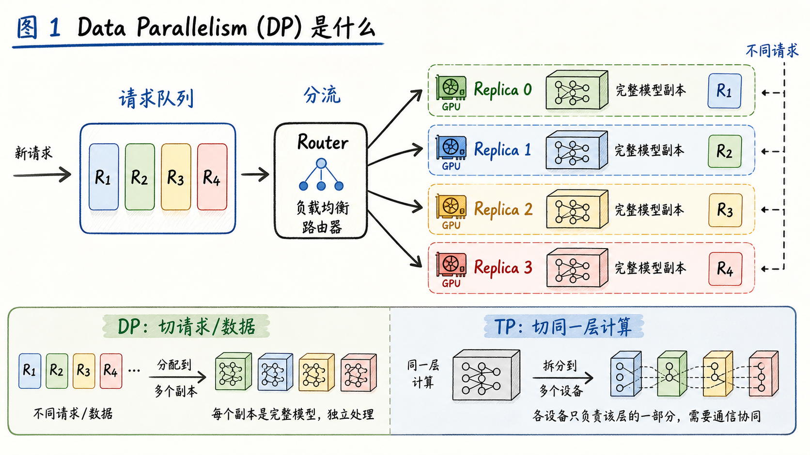
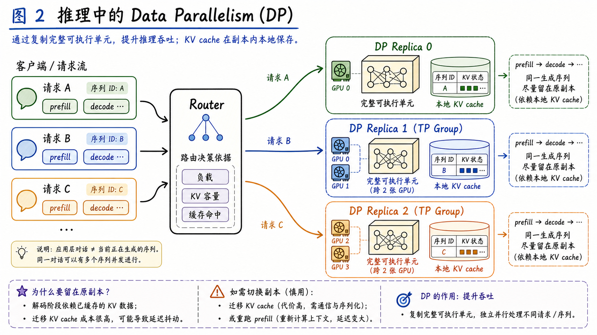
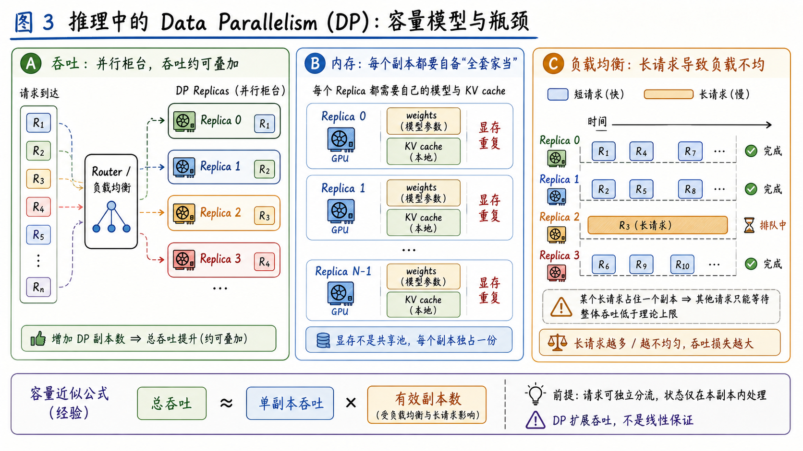
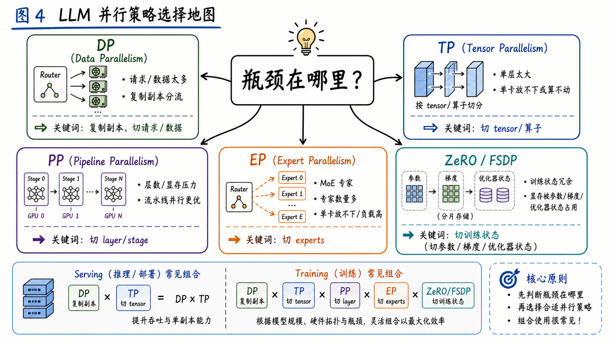
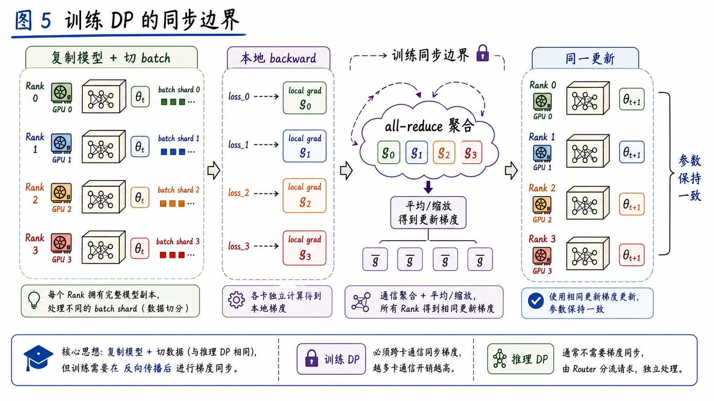

---
tags:
  - LLM
  - distributed-inference
  - data-parallelism
  - model-serving
  - parallelism
updated: 2026-05-26
description: 从推理服务扩容视角解释 Data Parallelism 的副本、路由、容量、状态边界和并行组合，帮助判断什么时候该用 DP，什么时候应转向 TP、PP、EP 或 ZeRO/FSDP。
---

# 大模型精讲系列 02：Data Parallelism（DP）是什么

> [!Quote] 本篇导读
> DP（Data Parallelism，数据并行）最朴素的含义不是“把一张 GPU 变大”，而是“复制可独立运行的模型执行单元，让不同数据或不同请求分头处理”。如果说 TP 的关键词是把同一个 layer 切开共同计算，那么 DP 的关键词就是副本、分流、容量和状态边界。本文面向想理解 LLM 服务扩容与并行选型的读者，训练 DP 只作为必要对照出现，不把训练框架细节作为主线。

## 1. 先从服务现场看 DP

### 1.1 一个排队问题

假设一个 LLM 服务已经能在单张 GPU 上稳定运行。模型能加载，接口能返回，单个请求的延迟也能接受。真正的问题出现在流量上来之后：请求排队越来越长，首 token 延迟开始抖动，GPU 利用率看起来很高，但机器里还有其他 GPU 可以用。

这时有两种完全不同的扩容直觉。

第一种直觉是把一个模型拆到多张 GPU 上。它解决的是“一个模型副本太大或单层计算太重”的问题，这就是 TP、PP 等模型并行策略要处理的方向。

第二种直觉是多开几个同样的服务实例。每个实例都能独立接请求，前面放一个 router 或 load balancer，把不同请求分给不同实例。只要请求之间相对独立，总吞吐就能上去。这个方向就是 DP 的核心。



这张图里最重要的不是 GPU 数量，而是“完整可执行单元”。一个 DP replica 可以是一张 GPU 上的一份完整模型，也可以是一个内部用了 TP 的多 GPU group。只要它能独立完成一次推理请求，它就可以作为一个 DP 副本参与分流。

### 1.2 DP 切的不是模型层，而是工作单元

DP 的关键动作可以压缩成一句话：

**复制模型执行单元，切分独立工作。**

这里的“工作”在不同场景里有不同名字：

| 场景     | DP 切分的对象                      | 每个副本要保留什么            | 是否需要同步梯度 |
| ------ | ----------------------------- | -------------------- | -------- |
| 在线推理   | 用户请求、会话、batch item            | 运行请求所需的模型权重与本地运行状态   | 通常不需要    |
| 离线批量推理 | 数据样本、prompt shard、文件 shard    | 模型权重、本地 batch、输出写入状态 | 不需要      |
| 训练     | mini-batch shard、sample shard | 模型副本、梯度、优化器相关状态      | 通常需要     |

所以，DP 和 TP 的边界非常清楚：

- DP 关心的是“有多少份可独立运行的模型执行单元”；
- TP 关心的是“同一个模型层内部的张量和计算如何拆到多张 GPU”；
- DP 可以包住 TP：一个 DP replica 内部可能由 `TP=2` 或 `TP=4` 共同组成；
- 如果模型单副本已经放不下，先谈 DP 往往没有意义，因为 DP 的普通形态需要复制可运行副本。

### 1.3 一个更准确的定义

**Data Parallelism 指的是：多个 worker 或 replica 在语义上处理同一个模型任务，但各自接收不同的数据分片、请求分片或 batch 分片；它通过复制可执行单元来提升吞吐，并在需要一致性的场景中引入同步机制。**

再短一点：

**DP = 多个副本，处理不同工作。**

这句话故意没有写成“每张 GPU 都有完整模型”。原因是现代系统里，一个 DP 副本不一定等于一张 GPU。它可以是：

- 单张 GPU 上的一份完整模型；
- 一个 `TP=2` 的 tensor parallel group；
- 一个完整的 PP pipeline group，而不是单独一个 pipeline stage；
- 一个外部负载均衡器后面的独立服务实例；

真正不变的是：从 router 或数据分片器视角看，每个 DP replica 都能接收一部分工作，并给出等价的模型服务结果。

## 2. 推理 DP 的运行方式

### 2.1 Router 做了什么

在推理服务里，DP 最常见的形态是请求级分流。用户请求先进入 API server、gateway、scheduler 或外部 load balancer，再被分配给某个 DP replica。

这个分配不是随手一扔。一般来说，一个好的 router 会尽量关心：

- 哪个副本当前 running queue 和 waiting queue 更短；
- 哪个副本还有足够 KV cache 容量接收长上下文请求；
- 请求是否属于一个已经在生成中的 in-flight sequence；
- 多节点环境下是否应优先减少跨节点流量；
- 外部负载均衡是否能拿到足够实时的 telemetry；

vLLM 的 data parallel deployment 文档就把几种形态分得很清楚：内部负载均衡可以用一个 API endpoint 暴露多个 DP ranks；DP 也可以与 TP 组合，例如 `--data-parallel-size 4 --tensor-parallel-size 2` 表示 4 个 DP 副本，每个副本内部用 2 张 GPU 做 TP，总共需要 8 张 GPU。文档还提醒 `--max-num-seqs` 是按 DP rank 生效，而不是全局共享一个值。

```bash
vllm serve $MODEL --data-parallel-size 4 --tensor-parallel-size 2
```

这条命令背后的心智模型不是“8 张 GPU 一起处理同一个请求”，而是“有 4 个可独立接请求的副本，每个副本内部由 2 张 GPU 共同运行一个模型执行单元”。

需要注意，这里说的是概念上一个理想 router 需要哪些信息。vLLM 当前内部 DP load balancing 主要基于各 engine 的 running queue 和 waiting queue；KV cache aware logic 属于文档中提到的未来可增强方向。多节点部署时，还要明确 local DP size、start rank、headless 节点、hybrid LB 或外部 LB 的模式，不要只看 `data_parallel_size` 这一个参数。



### 2.2 KV cache 为什么让推理 DP 更像系统问题

推理 DP 不需要梯度同步，但它不是完全无状态的。LLM 推理里最重要的运行时状态之一是 KV cache。

在一次生成过程中，prefill 会根据 prompt 建立历史 token 的 key/value 状态，decode 会不断读取并追加这些状态。这个状态通常留在处理该请求的 engine 或 replica 内部。于是，推理 DP 的路由至少有一个边界条件：

**同一次正在生成的请求不能被随意拆到另一个副本继续 decode，除非系统显式支持状态迁移或重新计算。**

这里要避免一个常见误解：聊天应用里的多轮对话不一定等于服务端持久会话。如果每次 API 调用都把完整历史上下文重新发给模型，那么新的请求可以重新路由；如果系统做了服务端会话级 KV cache、prefix cache 或跨请求状态复用，那么就需要会话粘性、cache 命中策略或状态迁移机制。

所以，推理 DP 的核心不是梯度同步，而是这三件事：

- 请求如何分给不同副本；
- 每个副本的 KV cache、batching 和调度状态如何管理；
- 当请求长度、并发和副本负载不均时，router 如何避免热点；

### 2.3 DP 副本不是共享显存池

DP 很容易给人一种错觉：既然有 4 张 GPU，总显存是不是就变成 4 倍了？

对推理 DP 来说，答案通常是否定的。DP 增加的是副本数，不是把一个副本的模型权重自动铺到多张卡上。每个副本仍然需要保存自己运行所需的权重、KV cache、workspace、通信 buffer 和调度状态。

如果一个模型副本单卡放不下，普通 DP 不能解决问题。此时要先用 TP、PP、量化、offload 或其他模型放置策略，让一个可执行副本成立；然后再用 DP 复制这个可执行副本来扩吞吐。

可以把推理 DP 的容量近似写成：

$$
C_{\text{total}} \approx \sum_{i=1}^{N} C_i \times u_i
$$

其中 $C_i$ 是第 $i$ 个副本在当前 workload 下的有效服务能力，$u_i$ 是这个副本被路由和调度充分利用的程度。理想情况下，如果每个副本能力接近、请求分布均匀、路由没有瓶颈，那么总吞吐接近副本数倍增长；现实里，长请求、KV cache 压力、router 单点、跨节点链路和 batch 形状都会让 $u_i$ 下降。



这也是为什么 DP 的调优经常不像一个简单参数，而更像服务系统调度：同样是 `DP=4`，短请求、高并发、长度分布稳定时可能很好扩；长上下文、请求长度极不均、prefix cache 命中强依赖路由时，扩容效果就会被状态和调度约束拉低。

### 2.4 一个扩容推演

可以把一次服务扩容想成三步，而不是直接把 GPU 数填进参数。

第一步，`DP=1`。所有请求进入同一个执行单元，KV cache、waiting queue、running queue 都集中在同一个 engine 内。此时如果吞吐不够，但模型单副本本身能稳定运行，DP 是自然候选。

第二步，`DP=4, TP=1`。模型被复制成 4 个独立副本，router 把不同请求分给不同副本。短请求、长度分布稳定、batching 充分时，总吞吐可能明显提升；但每个副本仍要保存自己的 weights 和 KV cache，总显存消耗也会随副本数增加。

第三步，`DP=4, TP=2`。如果单副本需要 2 张 GPU 才能跑，TP 先在副本内部解决“一个执行单元如何成立”，DP 再在副本之间解决“更多请求如何分流”。此时总共通常需要 8 张 GPU，但不是 8 张 GPU 共同服务一个请求，而是 4 个双卡副本共同服务不同请求。

观察这类扩容时，不要只看总吞吐，还要同时看 TTFT、TPOT、每个副本的队列长度、KV cache 使用率、请求长度分布和 router 是否形成热点。DP 的价值来自有效副本数，而不是配置里写了多少副本。

## 3. DP 与其他并行策略的关系

### 3.1 先判断瓶颈在哪里

DP 不是 TP、PP、EP、ZeRO/FSDP 的替代品。它们解决的瓶颈不同。



可以先用一个问题来判断：**瓶颈在哪里？**

| 瓶颈 | 更接近的策略 | 一句话判断 |
| --- | --- | --- |
| 请求或样本太多，单个模型副本能跑但吞吐不够 | DP | 多复制几个可执行副本分流 |
| 一个模型层太大，单卡放不下或算不动 | TP | 把 layer 内部 tensor 和算子切开 |
| 模型层数太深，按层放置更自然 | PP | 把 layers 切成多个 pipeline stage |
| MoE experts 数量多，专家路由成为核心 | EP | 把 experts 分到不同设备或进程组 |
| 训练状态在 DP 副本间重复太多 | ZeRO/FSDP | 切 optimizer state、gradients、parameters |

在真实 LLM 系统里，这些策略经常组合出现。比如：

- 小模型高并发服务：通常优先考虑 DP 或多实例副本；
- 大模型单副本放不下：先用 TP/PP 让一个副本能跑，再用 DP 复制这个副本；
- MoE 模型服务：可能同时出现 DP、TP、EP 和 router；
- 大模型训练：常见组合是 DP x TP x PP x ZeRO/FSDP，而不是单独一个 DP；

### 3.2 DP x TP：服务里最常见的组合之一

当一个模型副本需要两张或多张 GPU 才能跑起来时，TP 负责“副本内部的模型执行”，DP 负责“副本之间的请求分流”。

例如一台 8 卡机器上：

```text
TP=2, DP=4

Replica 0: GPU 0 + GPU 1
Replica 1: GPU 2 + GPU 3
Replica 2: GPU 4 + GPU 5
Replica 3: GPU 6 + GPU 7
```

这个布局意味着：

- 每个 replica 内部有 2 张 GPU 共同运行一个模型执行单元；
- 总共有 4 个 replica 可以并行接不同请求；
- 单个请求通常只进入其中一个 replica，不会同时进入 4 个 replica；
- 如果 router、batching 和 KV cache 都配合得好，总吞吐有机会接近 4 个副本叠加；

这和 `TP=8, DP=1` 完全不同。`TP=8` 是 8 张 GPU 共同服务一个模型副本，目标通常是放下更大的模型或提高单副本计算能力；`DP=4, TP=2` 是 4 个副本共同扩服务吞吐。两者都用 8 张 GPU，但系统行为完全不同。

### 3.3 DP 与 EP：MoE 场景里的额外复杂性

MoE 模型引入 experts 后，DP 的含义会更复杂。普通 dense 模型里，每个副本通常持有同一套完整权重；MoE 场景里，不同 experts 可能分布在不同设备上，token 会被 router 分配给不同 experts。

这时有两层路由同时存在：

- 服务层 router：把用户请求分给某个 DP replica 或某个部署实例；
- 模型层 router：把 token 分给 MoE experts；

如果系统采用 DP + EP，副本之间不只是简单复制 dense 模型，还要考虑专家分布、负载均衡、跨 expert 通信和 coordinator。vLLM 的文档也把 non-MoE 模型的外部负载均衡和 MoE DP+EP 拓扑分开描述，这说明在 MoE DP+EP 拓扑里，DP rank 之间可能还要服务于 expert placement、token routing 和 collective 协调；它不再等同于 non-MoE 场景下多个完全独立服务实例的外部 LB。

更具体地说，vLLM 文档提到 MoE 模型中可以让 attention layers 使用 data parallel，而 expert layers 使用 EP 或 TP；当任一 rank 上仍有请求在执行，而其他 rank 暂无 scheduled requests 时，vLLM 仍需要让空闲 rank 执行 dummy forward，并通过 DP Coordinator 与周期性 collective 协调整体空闲状态。dense 模型读者可以先把 EP 当作边界知识，真正部署 MoE 或遇到 expert imbalance 时再进入 DP+EP 视角。

对学习者来说，可以先记住一句话：

**dense 模型里的推理 DP 主要是请求分流；MoE 模型里的 DP 还可能和 expert placement、token routing、负载均衡耦合在一起。**

## 4. 训练 DP 只是另一种同步边界

### 4.1 同一个核心动作，不同的同步要求

虽然本文不以训练为主线，但 Data Parallelism 这个词最早在很多人脑中是从训练出现的。训练 DP 和推理 DP 的共同点是：复制模型执行单元，切分不同数据。

区别在同步边界。

推理时，不同请求之间通常不需要共享梯度。一个 replica 生成自己的输出即可。训练时，多个 rank 如果各自用不同 batch shard 计算梯度，又各自更新参数，模型副本很快会分叉。因此训练 DP 需要让各副本在 optimizer step 前看到一致的梯度或等价的更新。



经典同步 DP 的数学骨架可以写成：

$$
g_r = \nabla_{\theta}L_r(\theta_t)
$$

$$
g = \frac{1}{p}\sum_{r=0}^{p-1}g_r
$$

$$
\theta_{t+1} = \text{OptimizerUpdate}(\theta_t, g)
$$

第 $r$ 个 rank 只看自己的 batch shard，得到本地梯度 $g_r$；所有 rank 通过 all-reduce 的聚合结果，并由框架按 world size 做平均或等价归一化，得到一致的用于更新的梯度 $g$；然后每个副本用同样的梯度更新参数。只要初始参数一致、梯度同步一致、optimizer step 一致，副本就能保持一致。

PyTorch `DistributedDataParallel` 的官方文档也明确说，它是在 module 级别实现 data parallelism，通过在模型副本之间同步梯度工作；输入数据如何切分并不是 DDP 自动完成，用户通常需要用 `DistributedSampler` 之类的机制保证不同 rank 看到不同数据。

### 4.2 训练同步的两个实现提示

第一个提示是 all-reduce 的语义。NCCL 对 all-reduce 的定义是：每个 rank 提供输入，collective 对这些输入做 reduce，再把相同的 reduce 结果放回每个 rank。这里的 reduce 可以是 sum、min、max 等操作；“平均梯度”是 DDP 训练语义和缩放策略的一部分，不是 NCCL all-reduce 这个 primitive 自带的唯一含义。

这件事有两个重要后果：

- all-reduce 不是把梯度集中到 rank 0 再由 rank 0 更新；
- 每个 rank 最终都拿到同一个聚合结果，所以每个副本都能独立执行相同 optimizer step；

NCCL 文档还强调，collective operation 需要每个 rank 以相同 count 和 datatype 参与，否则可能出现 hang、crash 或数据损坏。实际系统还必须保证参与集合、collective 类型和调用顺序一致。这解释了很多分布式训练错误为什么看起来像“某张卡卡住了”：真正的问题可能是某个 rank 跳过了一个 collective，或者进入 collective 的张量形状与其他 rank 不一致。

第二个提示是 bucket overlap。训练 DP 不是一定等整个 backward 完全结束后才同步所有梯度。PyTorch DDP 会把参数放入多个 bucket；某个 bucket 的梯度准备好后，就可以开始对应的 gradient reduction，从而让通信尽可能与后续 backward 计算重叠。`bucket_cap_mb` 这类参数影响的是通信颗粒度和重叠机会，不改变 DP 的数学语义。

对本文读者来说，不需要把 DDP 的实现细节背下来，只要抓住同步边界：

**训练 DP 的核心成本来自“保持副本一致”；推理 DP 的核心成本来自“把请求和状态合理留在副本内”。**

## 5. 不要把 ZeRO/FSDP 当成推理 DP

### 5.1 它们解决的是训练状态冗余

经典训练 DP 会在每个 rank 上保存完整模型参数、梯度和 optimizer state。对大模型训练来说，真正占显存的不只是权重文件本身，还包括：

- parameters；
- gradients；
- optimizer states；
- activation 与 checkpointing 相关状态；
- communication buffers；

如果每个 rank 都复制这些状态，DP size 越大，集群总显存消耗越重复。经典 DP 提升了样本处理吞吐，但没有降低每个 rank 的模型状态占用。

这就是 ZeRO 和 FSDP 出现的背景。

### 5.2 它们仍然保留训练 DP 语义

DeepSpeed ZeRO 的核心说法是：把 data-parallel processes 之间重复保存的 optimizer states、gradients 和 parameters 分区，而不是在每个进程中完整复制。典型 FSDP / `FULL_SHARD` 也围绕类似目标展开：在 data parallel workers 之间 shard parameters、gradients 和 optimizer states，用 all-gather 在计算前恢复所需参数视图，并在反向传播后通过 reduce-scatter 分发梯度分片。不同 FSDP sharding strategy 的具体状态保留方式会有差异。

可以把它们理解成：

| 方法 | 主要切分对象 | 保留什么语义 | 付出什么代价 |
| --- | --- | --- | --- |
| ZeRO Stage 1 | optimizer states | 数据并行训练语义 | optimizer 状态管理更复杂 |
| ZeRO Stage 2 | optimizer states + gradients | 数据并行训练语义 | 梯度分区与 reduce-scatter 通信 |
| ZeRO Stage 3 | optimizer states + gradients + parameters | 数据并行训练语义 | 参数按需 all-gather，调度更复杂 |
| FSDP / FULL_SHARD | parameters + gradients + optimizer states | 数据并行训练语义 | wrapping、reshard、通信和 checkpoint 复杂度 |

这类方法容易让人误会：参数都被切开了，还算 DP 吗？

从状态布局看，它们不再是经典完整复制；从训练语义看，它们仍然围绕“不同 rank 处理不同数据，并协同完成等价更新”展开。因此更准确的说法是：**ZeRO/FSDP 是 sharded data parallelism，而不是普通推理 DP 的直接替代品。**

### 5.3 为什么它们不是本文主线

如果读者的目标是理解 LLM 服务扩容，ZeRO/FSDP 不应该喧宾夺主。它们主要面向训练状态冗余与超大模型训练显存，而不是在线推理请求分流。

当然，训练和推理会在一个完整平台里同时出现。例如一个团队可能用 FSDP 训练模型，再用 vLLM 做 DP x TP 推理部署。但学习 DP 时，最好先把两条线分开：

- 推理 DP：复制可执行服务副本，路由不同请求；
- 训练 DP：复制训练副本，切分 batch，通过梯度同步保持一致；
- Sharded DP：在训练 DP 语义下切分训练状态，降低每 rank 显存；

这样就不容易把“服务里多开副本”和“训练里切 optimizer state”混成同一个问题。

## 6. 工程判断

### 6.1 什么时候优先考虑 DP

当以下条件成立时，DP 往往是很自然的扩容方式：

- 单个模型执行单元已经能稳定运行；
- 请求或离线样本之间相对独立；
- 目标主要是提升吞吐，而不是降低单请求必须跨越的模型显存；
- 每个副本能获得足够显存保存权重和 KV cache；
- router、scheduler 或外部 load balancer 能拿到足够的负载信息；
- 当前瓶颈不在 tokenizer、API server、数据库、网络出口或下游系统；

在线推理里，DP 常见于这些场景：

- 单模型多副本服务；
- 多租户请求分流；
- 离线评测或批量生成；
- 单节点多副本部署；
- 多节点外部负载均衡；
- DP x TP 组合部署；

### 6.2 什么时候 DP 不够

DP 不是万能扩容按钮。下面这些情况只加 DP 往往解决不了核心问题：

| 问题 | 为什么 DP 不够 | 更应该看什么 |
| --- | --- | --- |
| 单副本模型放不下 | DP 会复制副本，不能让单副本变小 | TP、PP、量化、offload |
| 单请求延迟太高 | DP 提升并发吞吐，不一定减少单请求计算路径 | 模型压缩、kernel、batching、speculative decoding |
| KV cache OOM | 每个副本仍要管理本地 KV cache | max seq、并发、prefix cache、KV cache 策略 |
| 请求长度极不均 | 长请求会占住某些副本 | router telemetry、队列策略、分级服务 |
| API server 成为瓶颈 | 请求没到 engine 前已经排队 | API server 扩容、外部 LB、异步队列 |
| 跨节点通信太重 | DP 内部组合 TP/EP 时可能跨弱链路 | topology-aware placement |

一句话判断：

**如果瓶颈是“更多独立工作要处理”，DP 很合适；如果瓶颈是“一个工作单元本身太重”，通常要先看 TP、PP、量化或模型结构优化。**

### 6.3 常见配置入口

不同框架里，DP 的入口长得不一样。理解时不要只记参数名，而要看它在系统里创建了什么副本边界。

| 系统 | 常见入口 | 心智模型 |
| --- | --- | --- |
| vLLM serving | `--data-parallel-size`、`--data-parallel-rank`、`--data-parallel-hybrid-lb` | 多个 serving engines / DP ranks 处理不同请求 |
| 外部负载均衡 | 多个独立 `vllm serve`、Kubernetes pods、Ingress | 每个部署实例是一个可路由副本 |
| PyTorch DDP | `torch.nn.parallel.DistributedDataParallel` | 多个训练 rank 处理不同 batch shard，并同步梯度 |
| DeepSpeed ZeRO | `zero_optimization.stage` | 在 DP 训练语义上切分训练状态 |
| PyTorch FSDP | `FullyShardedDataParallel`、`fully_shard` | shard 参数、梯度和 optimizer states |

这里有一个重要边界：推理服务的外部 LB 不一定需要框架内部知道 DP。对于 non-MoE 模型，更稳妥的做法通常是把多个独立 `vllm serve` 实例作为可路由副本，由外部 router 平衡 HTTP 请求，而不是一定使用 `--data-parallel-*` 参数；vLLM 文档中 external DP CLI options 主要面向 MoE 部署。此时“DP”更多是部署拓扑，而不是单个进程里的一个参数。

### 6.4 检查清单

部署或评估 DP 前，可以按下面顺序检查：

1. 单个可执行副本是否已经成立？
2. 这个副本是一张 GPU，还是一个 TP/PP group？
3. 副本之间处理的请求或样本是否足够独立？
4. router 是否知道每个副本的 running queue、waiting queue 和 KV cache 压力？
5. `max_num_seqs`、batching、并发限制是按副本生效还是全局生效？
6. 长请求是否会导致某些副本长期被占用？
7. API server 或外部 LB 是否可能成为新瓶颈？
8. 多节点部署时，跨节点链路是否出现在高频路径上？
9. 监控里是否能分 DP rank 观察吞吐、延迟、队列和 OOM？
10. 扩大 DP size 后，真实 workload 的 TTFT、TPOT、throughput 是否真的改善？

## 7. 常见误区

### 7.1 “DP 会把显存加起来”

不准确。普通 DP 复制可执行副本，不会自动把一个副本的模型权重切到多张 GPU 上。如果单副本放不下，应该先考虑 TP、PP、量化或 offload。

### 7.2 “DP 越大吞吐一定线性增长”

不一定。DP 的吞吐收益取决于请求能否独立分流、每个副本能力是否接近、router 是否足够聪明、KV cache 是否充足、API server 是否成为瓶颈。长请求和不均匀 workload 会让有效副本数下降。

### 7.3 “推理 DP 和训练 DP 是同一套通信机制”

不准确。推理 DP 通常靠请求路由和本地状态管理扩吞吐；训练 DP 需要通过梯度同步保持副本一致。两者共享“复制 + 切分”的核心思想，但同步边界完全不同。

### 7.4 “用了 TP 就不需要 DP”

不一定。TP 解决的是单副本内部的问题，DP 解决的是多个独立工作之间的问题。大模型服务里常见的布局正是 DP x TP：TP 让一个副本能跑，DP 让多个副本一起服务更多请求。

### 7.5 “ZeRO/FSDP 就是推理 DP 的高级版”

不准确。ZeRO/FSDP 主要解决训练状态冗余，属于 sharded data parallel training 的范畴。推理服务里的 DP 更关心请求路由、KV cache、本地 batching 和副本容量。

## 8. 最终心智模型

理解 DP，可以始终抓住四句话。

第一，DP 的基本动作是复制可执行单元，切分独立工作。对推理服务来说，这个工作通常是请求；对训练来说，这个工作通常是 batch shard。

第二，DP 副本不一定等于一张 GPU。一个副本内部可以用 TP、PP 或其他模型并行策略，只要它对外表现为一个可接收工作、可返回结果的执行单元。

第三，推理 DP 的难点在系统调度。KV cache、本地 batch、长请求、router telemetry、API server bottleneck 和多节点拓扑，都会决定 DP 扩容是不是有效。

第四，训练 DP 的难点在一致性。DDP 用梯度同步让副本保持一致；ZeRO/FSDP 则在训练 DP 语义上进一步切分训练状态，换取更低的每 rank 显存。

所以，看到 DP 时不要只问“用了几张 GPU”，而要问：

**复制的是哪个执行单元？切分的是哪类工作？状态留在哪里？同步发生在什么边界？**

## 9. 参考资料

1. [vLLM Documentation: Data Parallel Deployment](https://docs.vllm.ai/en/stable/serving/data_parallel_deployment.html)；
2. [PyTorch Documentation: DistributedDataParallel](https://docs.pytorch.org/docs/stable/generated/torch.nn.parallel.DistributedDataParallel.html)；
3. [PyTorch Tutorials: What is Distributed Data Parallel (DDP)](https://docs.pytorch.org/tutorials/beginner/ddp_series_theory.html)；
4. [NVIDIA NCCL Documentation: Collective Operations](https://docs.nvidia.com/deeplearning/nccl/user-guide/docs/usage/collectives.html)；
5. [PyTorch Documentation: FullyShardedDataParallel](https://docs.pytorch.org/docs/stable/fsdp.html)；
6. [PyTorch Documentation: torch.distributed.fsdp.fully_shard](https://docs.pytorch.org/docs/stable/distributed.fsdp.fully_shard.html)；
7. [DeepSpeed Documentation: ZeRO](https://deepspeed.readthedocs.io/en/stable/zero3.html)；
8. [ZeRO: Memory Optimizations Toward Training Trillion Parameter Models](https://arxiv.org/abs/1910.02054)；

## 10. 学习测评

### 10.1 题目

1. 单选：本文中对 DP 最核心的描述是哪一个？
    A. 把一个 Transformer layer 的矩阵切到多张 GPU 上共同计算；
    B. 复制可执行模型单元，让不同数据或请求分头处理；
    C. 把 optimizer state 放到 CPU 上以节省显存；
    D. 把 MoE experts 平均分给所有用户；

2. 单选：推理服务里，`DP=4, TP=2` 更接近哪种含义？
    A. 一共有 4 张 GPU，每张 GPU 都切成 2 个虚拟设备；
    B. 4 个 DP 副本，每个副本内部用 2 张 GPU 做 TP；
    C. 2 个 DP 副本，每个副本内部用 4 张 GPU 做 TP；
    D. 8 张 GPU 同时处理同一个请求，并输出 8 份答案；

3. 多选：为什么说普通推理 DP 不是“共享显存池”？
    A. 每个副本通常要保存运行所需的模型权重；
    B. 每个副本通常要管理自己的 KV cache；
    C. 普通 DP 会自动把一份模型权重切成多片；
    D. 单副本放不下时，普通 DP 不能直接解决问题；

4. 多选：理想或能力更强的推理 DP router 可能需要关心哪些信息？
    A. 每个副本的 running queue 和 waiting queue；
    B. 每个副本的 KV cache 容量压力；
    C. 请求是否属于已经在生成中的 in-flight sequence；
    D. 每个 rank 的 optimizer state 是否已经 all-gather；

5. 单选：为什么同一次正在生成的请求通常不能随意换到另一个副本继续 decode？
    A. 因为 tokenizer 只能在第一个副本上运行；
    B. 因为该请求的 KV cache 状态通常留在原副本或 engine 内部；
    C. 因为 DP 副本之间的权重一定不同；
    D. 因为 all-reduce 只能在同一个副本内执行；

6. 多选：关于“聊天会话”和 DP 路由，下列哪些说法更准确？
    A. 如果每次 API 调用都带完整历史上下文，新请求可以重新路由，但可能牺牲 prefix cache 或 cache locality；
    B. 如果服务端复用会话级 KV cache，就需要考虑会话粘性或状态迁移；
    C. 任何聊天应用都必须永远固定同一 DP 副本；
    D. 正在进行中的一次生成通常应留在处理它的 engine 内；

7. 单选：当模型单副本放不进一张 GPU 时，优先应该考虑什么？
    A. 继续增大 DP size，因为 DP 会把显存自动合并；
    B. 先用 TP、PP、量化或 offload 让一个可执行副本成立；
    C. 把 batch size 设为 1，这样权重就不占显存；
    D. 只增加 API server 数量；

8. 多选：哪些情况会让 DP 吞吐低于理想线性扩展？
    A. 长请求集中占住少数副本；
    B. API server 或 router 成为瓶颈；
    C. 每个副本能力接近且请求长度稳定；
    D. KV cache 容量不足导致频繁拒绝或排队；

9. 单选：训练 DP 和推理 DP 的主要同步差异是什么？
    A. 推理 DP 每个 token 都必须 all-reduce 梯度；
    B. 训练 DP 通常需要梯度同步以保持副本一致，推理 DP 通常靠请求路由；
    C. 训练 DP 不需要切分 batch；
    D. 推理 DP 一定需要 optimizer state；

10. 多选：关于 NCCL all-reduce 的理解，哪些正确？
    A. 它会对所有 rank 的输入做 reduce；
    B. 它会把相同的 reduce 结果返回给每个 rank；
    C. 它等价于只让 rank 0 拿到结果；
    D. collective 参与不一致可能导致 hang、crash 或数据损坏；

11. 单选：在 non-MoE 推理服务里，什么时候外部负载均衡比框架内部 DP 参数更自然？
    A. non-MoE 推理服务需要很多独立 `vllm serve` 实例作为可路由副本；
    B. 单个 Transformer layer 放不下一张 GPU；
    C. 训练时需要同步每个 rank 的梯度；
    D. 想把 optimizer state 切到不同 rank；

12. 多选：MoE 服务里，为什么 DP + EP 比 dense 模型 DP 更复杂？
    A. 服务层 router 要把用户请求分给部署副本；
    B. 模型层 router 还要把 token 分给 experts；
    C. expert placement、负载均衡和跨 rank 协调可能影响执行；
    D. 所有 MoE 模型都不允许使用 DP；

13. 单选：为什么说 DP 和 TP 经常组合使用？
    A. DP 负责副本之间的请求或数据分流，TP 负责副本内部的层内张量计算；
    B. DP 和 TP 是完全相同的策略，只是名字不同；
    C. TP 只能用于训练，DP 只能用于推理；
    D. 使用 TP 后每个请求都会自动复制到所有 DP 副本；

14. 多选：部署 DP 前，哪些检查更有价值？
    A. 单个可执行副本是否已经成立；
    B. `max_num_seqs` 是按副本生效还是全局生效；
    C. 长请求是否会造成负载不均；
    D. 只看总吞吐，不看 TTFT、TPOT 和分副本指标；

15. 单选：读完本文后，看到一个系统写着“DP enabled”，最应该追问什么？
    A. 复制的是哪个执行单元、切分的是哪类工作、状态在哪里、同步边界是什么；
    B. 是否把所有 GPU 显存变成了一个统一大池；
    C. 是否禁用了所有 router；
    D. 是否完全不需要监控；

### 10.2 答案与题解

错题回看建议：1-3 题回看第 1 章；4-8 题回看第 2 章和第 6 章；9-10 题回看第 4 章；11 题回看第 6.3 节；12-13 题回看第 3 章；14-15 题回看第 6 章和第 8 章。

1. B。DP 的核心是复制可执行单元并切分独立工作。A 更像 TP；C 属于训练显存优化手段；D 混入了 MoE expert routing；

2. B。`DP=4, TP=2` 表示有 4 个可路由副本，每个副本内部由 2 张 GPU 做 tensor parallel。总 GPU 数通常是 $4 \times 2 = 8$；

3. A、B、D。普通推理 DP 复制副本，每个副本仍要保存自己运行所需的权重和 KV cache。C 描述的是模型并行或状态分片，不是普通 DP；

4. A、B、C。理想或能力更强的推理 router 会关心负载、KV 容量、请求是否已经在某个 engine 中生成等。D 是训练状态分片语境，不是推理路由核心；

5. B。同一次生成的 decode 需要访问 prefill 建立的 KV cache；如果该状态只在原副本内，随意换副本会丢失状态，除非系统支持迁移或重算；

6. A、B、D。多轮聊天是否必须粘在同一副本，取决于系统是否在服务端保留可复用状态。如果每次都发送完整历史，新请求可以重新路由，但可能牺牲 prefix cache 或 cache locality；正在进行中的一次生成通常仍应留在原 engine；

7. B。普通 DP 不会让单副本显存变小。模型副本放不下时，应先让一个可执行副本成立，再考虑复制副本扩吞吐；

8. A、B、D。长请求、router/API server 瓶颈和 KV cache 压力都会降低有效副本数。C 反而是接近理想扩展的条件；

9. B。训练 DP 需要同步梯度或等价更新以保持副本一致；推理 DP 通常不需要梯度同步，而是通过路由让不同请求进入不同副本；

10. A、B、D。all-reduce 的结果会回到每个 rank；它不是只给 rank 0。collective 参数不一致可能造成 hang、crash 或数据损坏；

11. A。对于 non-MoE 推理服务，大规模部署时常见做法是把多个独立服务实例作为可路由副本，交给外部 LB 平衡 HTTP 请求。B 更像 TP，C 是训练 DDP，D 是 ZeRO/FSDP；

12. A、B、C。MoE 同时存在服务层请求路由和模型层 expert routing；expert placement、token routing、负载均衡和跨 rank 协调都可能影响 DP 的含义。D 是绝对化错误；

13. A。TP 让一个副本内部能放下或加速模型计算，DP 让多个副本处理更多独立请求或数据；这就是 DP x TP 在服务里常见的原因；

14. A、B、C、D。DP 之前要确认副本边界、并发参数语义和负载不均风险；同时不能只看总吞吐，TTFT、TPOT 和分副本指标才能说明扩容是否健康；

15. A。DP 不是一个自解释标签。真正要追问的是副本边界、工作切分对象、状态位置和同步边界，这四个问题能把推理 DP、训练 DP 和 sharded DP 区分开；
