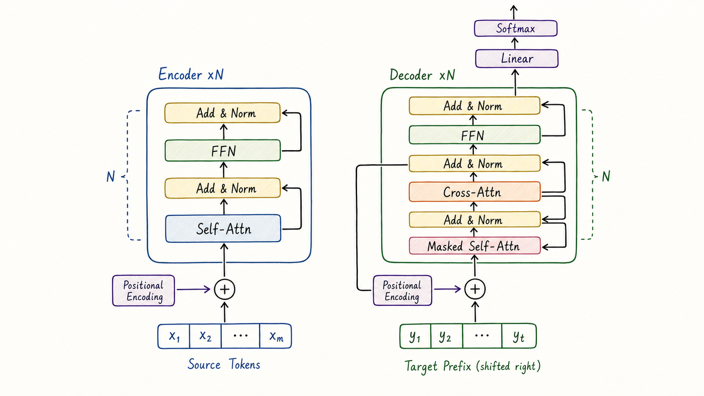
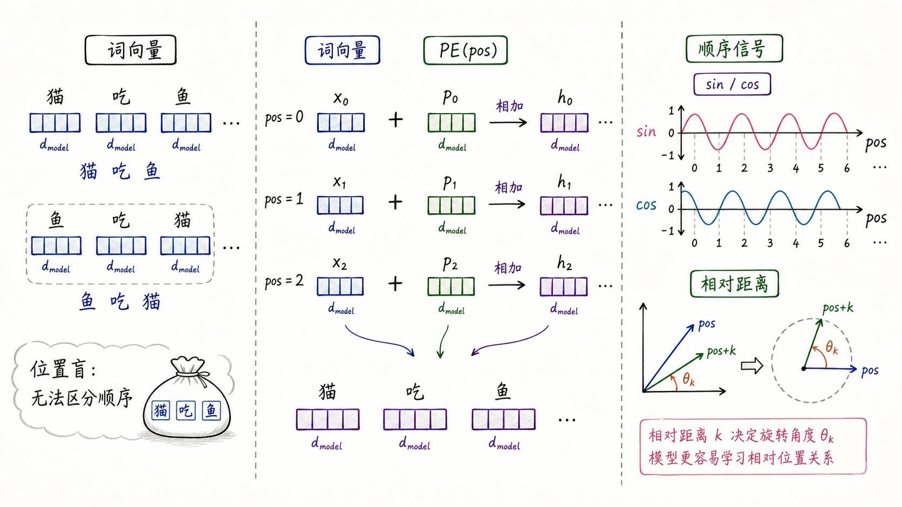
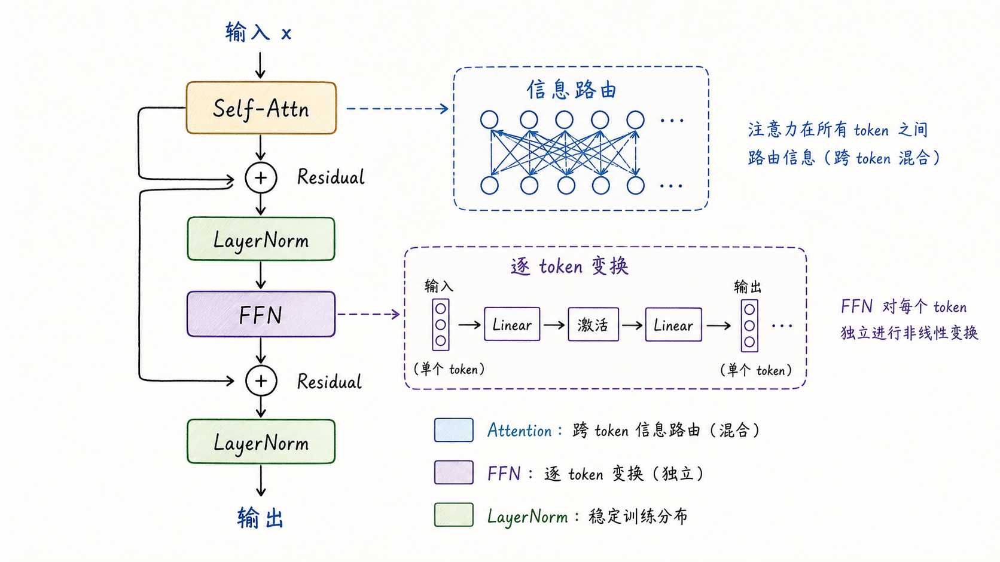
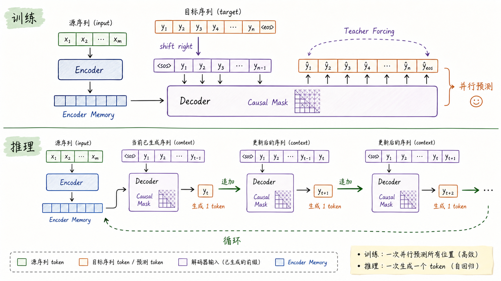

---
tags:
  - LLM
  - transformer
  - attention
  - model-architecture
updated: 2026-05-27
description: 以原始 Transformer 为主线解释位置编码、Encoder-Decoder、Multi-Head Attention、FFN、残差归一化、mask、训练与推理数据流，帮助建立现代大模型架构的基础地图。
---

# 大模型精讲系列 00-B：Transformer 架构及原理

> [!Quote] 本篇导读
> Transformer 的核心主张不是“用了 Attention”，而是“去掉循环结构，让序列中所有位置通过 Attention 直接通信，并用一整套工程结构保证它可以稳定训练、并行计算和自回归生成”。
>
> 理解 Transformer，要把它看成一次架构设计评审：Attention 负责信息路由，位置编码补上顺序感，FFN 提供逐 token 的非线性变换，残差与 LayerNorm 让深层堆叠可训练，mask 决定信息边界，Encoder 与 Decoder 则把理解和生成组织成完整的数据流。

阅读路径：建议先读 [[大模型精讲系列_00：深入理解Attention机制|00-A 深入理解 Attention 机制]]，再读本文；本文不重新推导 Attention 公式，而是解释 Attention 如何被组织成完整 Transformer 架构。

## 1. 为什么需要 Transformer

### 1.1 从 Attention 到完整架构

Attention 解决了一个关键问题：任意两个位置可以在一层内直接交互。相比 RNN 的链式传递，它把长程依赖的信息路径从 $O(n)$ 缩短到 $O(1)$，同时可以用矩阵乘法并行计算。

但 Attention 本身还不是完整架构。它至少缺三样东西：

- 顺序感：不加位置编码时，Self-Attention 不知道 token 的先后；
- 深层变换：Attention 主要负责跨 token 加权聚合，虽然权重计算包含 softmax 非线性，但它缺少像 FFN 这样逐位置、强表达的非线性改写模块；
- 训练稳定性：多层堆叠后需要残差、归一化、dropout 等结构帮助优化；

Transformer 的价值就在于，它把 Attention 放进一个可扩展的网络骨架里。这个骨架既能用于机器翻译这样的 Encoder-Decoder 任务，也能演化出 BERT 的 Encoder-Only、GPT 的 Decoder-Only，以及现代 LLM 的各种变体。

### 1.2 原始论文真正做出的选择

《Attention Is All You Need》提出的是一个 Encoder-Decoder Transformer。它面向机器翻译：输入源语言句子，输出目标语言句子。

原始架构做了几项关键选择：

| 问题 | Transformer 的回答 |
| --- | --- |
| 如何让所有位置直接通信 | Multi-Head Self-Attention |
| 如何注入顺序信息 | 正弦/余弦 Positional Encoding |
| 如何提供非线性容量 | Position-wise Feed-Forward Network |
| 如何稳定堆叠深层网络 | Residual Connection + LayerNorm |
| 如何避免生成时偷看未来 | Masked Self-Attention |
| 如何让 Decoder 查询源句 | Cross-Attention |

这张总图可以先建立整体地图，后文再拆每个部件：



图里的 Encoder 与 Decoder 都会重复堆叠 $N$ 层。原始 Transformer Base 使用 $N=6$，$d_{\text{model}}=512$，$h=8$ 个 attention heads。现代 LLM 的尺寸会大很多，但许多核心结构仍能从这张图里找到源头。

总图中的 Cross-Attention 可以这样读：Decoder 当前状态提供 Query，Encoder memory 提供 Key/Value，Decoder 由此在生成目标 token 时查询源序列信息。

### 1.3 Transformer 的一句话定义

可以把 Transformer 定义为：

**Transformer 是一种基于 Attention 的序列建模架构，它用位置编码补充顺序信息，用多头注意力完成跨位置的信息路由，用 FFN 完成逐位置非线性变换，并通过残差与归一化稳定深层堆叠。**

更短一点：

**Transformer = Attention 路由信息 + FFN 改写表示 + 位置编码提供顺序 + 残差归一化保证可训练。**

## 2. 位置编码

### 2.1 Attention 的位置盲

Self-Attention 的输入如果只有词向量，那么它天然不知道 token 的绝对位置。

更严格地说，在没有位置编码、相对位置偏置、causal mask 等任何位置相关信号的双向 Self-Attention 中，计算具有置换等变性（permutation equivariance）：如果把输入序列按某个置换打乱，输出也会按同样的置换被打乱。模型能知道 token 之间的内容相似性，但不能单靠 Attention 计算本身知道“谁在前，谁在后”。

这对语言是致命的。下面三句话包含同样的词，但语义完全不同：

```text
猫 吃 鱼
鱼 吃 猫
吃 猫 鱼
```

如果模型不知道位置，就只能看到一袋词，而不是一句有顺序的句子。

### 2.2 原始 Transformer 的正弦位置编码

原始 Transformer 把位置编码加到词向量上：

$$
H_0 = X + PE
$$

其中 $X$ 是 token embedding，$PE$ 是与位置相关的向量。论文中的正弦/余弦位置编码为：

$$
PE_{(pos,2i)} = \sin\left(\frac{pos}{10000^{2i/d_{\text{model}}}}\right)
$$

$$
PE_{(pos,2i+1)} = \cos\left(\frac{pos}{10000^{2i/d_{\text{model}}}}\right)
$$

直观上，它为不同位置生成一组不同频率的波形信号。低频维度变化慢，适合表达长距离；高频维度变化快，适合表达局部位置差异。



### 2.3 为什么不是简单编号

直接给位置一个整数编号看起来也可以，例如第 1 个 token 加 1，第 2 个 token 加 2。但这样会有几个问题：

- 标量编号与高维词向量不在同一表示空间；
- 大位置值可能带来尺度问题；
- 模型不容易从编号中学习多尺度相对距离；

正弦位置编码的一个优雅性质是：相隔 $k$ 的两个位置之间存在可由线性变换表达的关系。对每个频率 $\omega_i$，有：

$$
\begin{pmatrix}
\sin((pos+k)\omega_i) \\
\cos((pos+k)\omega_i)
\end{pmatrix}
=
\begin{pmatrix}
\cos(k\omega_i) & \sin(k\omega_i) \\
-\sin(k\omega_i) & \cos(k\omega_i)
\end{pmatrix}
\begin{pmatrix}
\sin(pos\omega_i) \\
\cos(pos\omega_i)
\end{pmatrix}
$$

这意味着模型有机会通过线性运算感知相对距离 $k$。它不是只记住“第几个位置”，而是在高维空间中编码多尺度的顺序变化。

### 2.4 现代位置编码的演化

原始 Transformer 使用绝对位置编码。后来模型逐渐转向更适合长上下文和自回归生成的方案。

| 方案 | 核心想法 | 常见代表 |
| --- | --- | --- |
| Learned Absolute Position | 位置向量可学习 | BERT、早期 GPT |
| Relative Position Bias | 注意力分数加入相对距离偏置 | T5 等 |
| RoPE | 用旋转方式把相对位置信息注入 Q/K | LLaMA 系列常见 |
| ALiBi | 对远距离 attention score 加线性惩罚 | 长度外推友好 |

这些方案的共同目标是补上 Attention 的位置盲。区别在于，它们把位置信息放在输入表示、注意力分数，还是 Q/K 的几何关系里。

## 3. Encoder

### 3.1 Encoder 的任务

Encoder 的任务是把源序列编码成一组上下文化表示。每个输出位置不再只是原始 token 的向量，而是融合了全句上下文后的表示。

例如输入：

```text
我 喜欢 北京 的 秋天
```

经过多层 Encoder 后，“北京”的表示会包含它是地点实体、被“喜欢”修饰、与“秋天”存在从属关系等上下文信息。

Encoder 层通常包含两个子层：

1. Multi-Head Self-Attention；
2. Position-wise Feed-Forward Network；

每个子层外面都有残差连接和 LayerNorm。

### 3.2 Self-Attention 负责信息路由

在 Encoder 中，Self-Attention 通常是双向的。每个位置可以看见所有真实 token：

$$
H' = \operatorname{MultiHeadSelfAttention}(H)
$$

这一步的意义是跨 token 混合信息。它回答的问题是：

**当前位置应该从哪些其他位置取信息，以及取多少。**

如果把序列看成一张完全图，Self-Attention 就是在每层重新计算边权，然后沿边汇聚信息。

### 3.3 FFN 负责逐 token 变换

Attention 混合的是不同 token 之间的信息，但它本身主要是加权求和。Transformer 还需要一个强的非线性变换模块来改写每个位置的表示。

原始 Transformer 使用 Position-wise FFN：

$$
\operatorname{FFN}(x) = \max(0, xW_1 + b_1)W_2 + b_2
$$

它对每个 token 独立应用同一套两层 MLP。也就是说：

- Attention 在 token 之间交换信息；
- FFN 在每个 token 内部进行非线性变换；

这是一条非常重要的分工线。很多人初学 Transformer 时只盯着 Attention，但在实际参数量中，FFN 往往占据很大比例。现代 LLM 中，FFN 通常进一步演化为 SwiGLU、GeGLU 或 MoE FFN，用来提升容量与训练效率。

## 4. Decoder

### 4.1 Decoder 多了什么

原始 Transformer 的 Decoder 比 Encoder 多一个子层：

1. Masked Multi-Head Self-Attention；
2. Cross-Attention；
3. Position-wise FFN；

这三个子层对应三个问题：

| 子层 | 解决的问题 |
| --- | --- |
| Masked Self-Attention | 目标序列内部只能看过去，不能偷看未来 |
| Cross-Attention | 当前生成状态查询 Encoder 输出 |
| FFN | 对每个目标位置做非线性变换 |

### 4.2 Masked Self-Attention

训练翻译模型时，目标句子是已知的。例如：

```text
<sos> I like Beijing autumn
```

但模型在预测目标序列的第 $t$ 个 token 时，只能基于 $y_{<t}$ 和源句信息，不能看到 $y_t$ 及其之后的目标 token。若从右移后的 Decoder 输入位置来描述，则当前位置只能看到自己及之前的输入位置。否则它只是在抄答案。

Causal Mask 让训练可以并行，又不破坏自回归约束：

$$
p(y_t \mid y_{<t}, x)
$$

这意味着每个位置只能基于已生成前缀和源句信息预测下一个 token。

### 4.3 Cross-Attention

Cross-Attention 是 Encoder-Decoder 架构里最有语义的一层。

在这一层：

- Query 来自 Decoder 当前状态；
- Key 和 Value 来自 Encoder 输出；

公式上可以写作：

$$
\operatorname{CrossAttn}(Q_{\text{dec}}, K_{\text{enc}}, V_{\text{enc}})
$$

直觉上，Decoder 当前要生成一个目标词，于是向源句编码结果发出查询。源句中哪些位置与当前生成最相关，就从那些位置取回信息。

这与早期机器翻译中的 Attention 思想一脉相承，只是 Transformer 把它完全矩阵化，并放进多层深度架构中。

### 4.4 Decoder-Only 的转向

现代主流 LLM 大多不是原始 Encoder-Decoder 架构，而是 Decoder-Only。它们保留 masked self-attention，去掉独立 Encoder 和 Cross-Attention，用统一的自回归目标建模：

$$
p(x_1,\ldots,x_n)=\prod_{t=1}^{n}p(x_t \mid x_{<t})
$$

Decoder-Only 的优势是训练和推理形式统一，生成路径自然，KV cache 易于复用，规模化工程更直接。代价是理解任务也要通过生成式接口表达，且双向完整可见性不如 Encoder-Only 自然。

这不是说 Decoder-Only 在所有任务上理论最优，而是在大规模预训练和统一生成接口时代，它成为了最具扩展性的主干。

## 5. 残差、归一化与 FFN

### 5.1 Transformer Block 的内部路径

一个 Transformer block 可以看成两种变换交替：

- 跨 token 的信息路由：Attention；
- 单 token 的非线性改写：FFN；

外面再用 Residual 和 LayerNorm 保证深层网络可训练。



图中按原始 Transformer 的 Post-LN 路径来建立直觉：子层输出先与残差相加，再进入 LayerNorm。现代 LLM 常见的 Pre-LN 或 RMSNorm 会改变归一化位置，但不会改变“Attention 路由信息、FFN 改写表示、残差保留路径”的基本分工。

### 5.2 残差连接为什么重要

残差连接把子层输入直接加到子层输出上：

$$
y = x + F(x)
$$

这有两层意义。

第一，它给梯度提供更短路径。即使 $F(x)$ 暂时学得不好，模型也能通过近似恒等映射保留信息。

第二，它让每个子层更像“在原表示上做增量修正”，而不是每层都必须从头重写全部表示。这对深层网络非常重要。

### 5.3 LayerNorm 的位置

原始 Transformer 使用的结构常被称为 Post-LN：

$$
\operatorname{LayerNorm}(x + F(x))
$$

也就是先残差相加，再归一化。许多现代大模型改用 Pre-LN：

$$
x + F(\operatorname{LayerNorm}(x))
$$

Pre-LN 通常更利于训练非常深的 Transformer，因为梯度路径更稳定。原始论文的 Post-LN 是理解历史架构的起点；现代 LLM 文档和代码里看到的 Pre-LN、RMSNorm 等，是这一设计的后续演化。

### 5.4 FFN 为什么不能省

如果只有 Attention，多层网络会不断做加权混合，但每个位置内部的非线性变换能力不足。FFN 提供了逐 token 的“思考空间”。

可以把一层 Transformer 的分工理解为：

1. Attention：我应该从哪些 token 收集信息；
2. FFN：收集到信息后，我如何改写自己的表示；
3. Residual：不要丢掉原始路径；
4. LayerNorm：让数值尺度保持稳定；

现代 LLM 中，FFN 往往是模型容量的主要来源之一。许多架构改进，如 SwiGLU、MoE、专家路由，本质上都在改造 FFN 这一侧。

## 6. 训练、推理与复杂度

### 6.1 训练时为什么可以并行

Transformer 训练时通常已知整段输入和目标序列。以翻译为例，目标序列会右移一位作为 Decoder 输入：

```text
目标:   y1 y2 y3 ... yn <eos>
输入: <sos> y1 y2 ... y(n-1) yn
```

Decoder 用 causal mask 保证每个位置看不到未来，但计算上仍能一次性处理所有位置。这就是 Teacher Forcing 下的并行训练。



### 6.2 自回归生成推理时为什么必须逐 token

推理时目标序列未知，模型只能一步一步生成：

1. 输入 prompt 或已生成前缀；
2. 模型预测下一个 token 的分布；
3. 采样或选择一个 token；
4. 把新 token 追加到上下文；
5. 重复直到结束；

这就是自回归生成。训练可以并行预测所有位置，是因为正确前缀已知；推理必须串行推进，是因为下一步输入依赖上一步生成结果。

KV cache 可以避免每一步重复计算所有历史 token 的 Key/Value。它不改变自回归依赖，但显著降低每步的重复计算。

### 6.3 复杂度地图

设序列长度为 $n$，模型维度为 $d$，单层 Transformer 的主要成本可粗略理解为：

| 模块 | 主要时间复杂度 | 说明 |
| --- | --- | --- |
| Q/K/V 投影 | $O(nd^2)$ | 每个 token 做线性投影 |
| Attention 打分与加权 | $O(n^2d)$ | 所有位置两两交互 |
| FFN | $O(ndd_{\text{ff}})$ | 通常 $d_{\text{ff}}$ 是 $d$ 的数倍 |
| 输出投影 | $O(nd^2)$ | 多头结果投回模型维度 |

当 $n$ 较短时，FFN 和线性层可能占据大量计算；当上下文变长时，$n^2$ 的 Attention 成本会迅速凸显。现代长上下文模型的许多优化都围绕这一点展开。

这张表更接近训练或 prefill 阶段的全序列计算。进入 decode 阶段后，如果使用 KV cache，历史 token 的 K/V 会被缓存；单步主要计算当前 token 的 Q/K/V、输出投影和 FFN，把当前 K/V 写入 cache，并对长度为 $t$ 的历史 K/V 做 $O(td)$ 级别的注意力读取。

### 6.4 工程上要分清三个瓶颈

Transformer 的工程瓶颈通常不是一个词能概括的。

| 瓶颈 | 常见位置 | 典型优化 |
| --- | --- | --- |
| 计算量 | FFN、Attention matmul | 张量并行、算子融合、低精度 |
| 显存容量 | 参数、激活、KV cache | 量化、GQA、分片、offload |
| 显存带宽与 IO | Attention 中间矩阵、KV cache 读取 | FlashAttention、PagedAttention、cache 布局优化 |

因此，理解 Transformer 架构不能只停留在公式层面。公式告诉你数学等价关系，工程实现还要关心数据布局、缓存复用、并行通信和硬件带宽。

## 7. 架构地图与最终模型

### 7.1 三种 Transformer 主干

原始 Transformer 是 Encoder-Decoder，但后来形成了三类常见主干：

| 架构 | 可见性 | 典型任务 | 代表 |
| --- | --- | --- | --- |
| Encoder-Only | 双向可见 | 理解、分类、抽取、向量表征 | BERT |
| Decoder-Only | 只看过去 | 自回归生成、对话、代码生成 | GPT、LLaMA |
| Encoder-Decoder | Encoder 双向，Decoder 自回归 | 翻译、摘要、条件生成 | T5、原始 Transformer |

这三者不是“谁更高级”的关系，而是信息边界与训练目标不同。现代 LLM 选择 Decoder-Only，是因为自回归生成统一了预训练和推理接口，并且非常适合规模化。

### 7.2 读 Transformer 代码时的检查清单

读任何 Transformer 实现时，可以按下面顺序检查：

1. 输入 embedding 和位置编码如何结合；
2. Attention 是 MHA、MQA 还是 GQA；
3. mask 是 causal、padding、局部窗口还是混合形式；
4. block 是 Pre-LN 还是 Post-LN；
5. 归一化是 LayerNorm 还是 RMSNorm；
6. FFN 是 ReLU、GELU、SwiGLU 还是 MoE；
7. 推理时是否使用 KV cache；
8. 长上下文是否改变 attention pattern；

这份清单能帮助你把“Transformer”这个大词拆成可检查的工程部件。

### 7.3 常见误区

**误区一：“Transformer 就等于 Attention。”**

Attention 是核心，但 Transformer 还包括位置编码、FFN、残差、归一化、mask、训练目标和输出层。没有这些结构，Attention 无法稳定构成完整大模型。

**误区二：“位置编码只是告诉模型第几个词。”**

位置编码更重要的是提供可学习的顺序关系。现代 RoPE、ALiBi 等方案关注的是相对位置、长度外推和长上下文稳定性。

**误区三：“Encoder 和 Decoder 只是层数不同。”**

它们的信息边界不同。Encoder 通常双向看完整输入，Decoder 的 self-attention 必须 causal，且在 Encoder-Decoder 架构中还要通过 cross-attention 查询源序列。

**误区四：“训练并行，所以推理也能并行生成所有 token。”**

训练并行依赖 Teacher Forcing 和已知目标前缀。推理时未来 token 未知，只能自回归生成；优化只能减少每步成本，不能消除 token 之间的因果依赖。

**误区五：“FFN 只是 Attention 后的小附属层。”**

FFN 往往承载大量参数和非线性容量。许多现代架构创新都发生在 FFN 或 FFN 的专家化版本上。

### 7.4 最终心智模型

Transformer 可以被压缩成一个循环堆叠的表示更新过程：

1. 输入 token 先变成向量，并加入位置或顺序信息；
2. Attention 让每个位置从其他位置路由信息；
3. 残差保留原始路径，LayerNorm 稳定数值；
4. FFN 对每个位置独立做非线性改写；
5. 多层重复后，输出层把表示映射到任务需要的空间；

如果 Attention 是“谁和谁对话”，那么 Transformer block 就是“对话之后如何消化、稳定、再进入下一轮对话”。现代大模型只是把这套骨架放大、改造和工程化：更好的位置编码、更适合推理的 attention 变体、更强的 FFN、更稳定的归一化、更精细的并行与缓存管理。

## 8. 参考资料

1. Vaswani, A., et al. (2017). *Attention Is All You Need*. https://arxiv.org/abs/1706.03762
2. Harvard NLP. *The Annotated Transformer*. https://nlp.seas.harvard.edu/annotated-transformer/
3. Ba, J. L., Kiros, J. R., & Hinton, G. E. (2016). *Layer Normalization*. https://arxiv.org/abs/1607.06450
4. He, K., et al. (2015). *Deep Residual Learning for Image Recognition*. https://arxiv.org/abs/1512.03385
5. Devlin, J., et al. (2018). *BERT: Pre-training of Deep Bidirectional Transformers for Language Understanding*. https://arxiv.org/abs/1810.04805
6. Su, J., et al. (2021). *RoFormer: Enhanced Transformer with Rotary Position Embedding*. https://arxiv.org/abs/2104.09864
7. Press, O., Smith, N. A., & Lewis, M. (2021). *Train Short, Test Long: Attention with Linear Biases Enables Input Length Extrapolation*. https://arxiv.org/abs/2108.12409
8. PyTorch Documentation. *torch.nn.Transformer*. https://docs.pytorch.org/docs/stable/generated/torch.nn.Transformer.html
9. Kwon, W., et al. (2023). *Efficient Memory Management for Large Language Model Serving with PagedAttention*. https://arxiv.org/abs/2309.06180

## 9. 学习测评

### 9.1 题目

1. Transformer 相比只使用 Attention 机制，多解决了哪些架构问题？
   A. 只解决 tokenizer 问题；
   B. 补充位置编码、非线性变换、深层训练稳定性和信息边界控制；
   C. 完全取消矩阵乘法；
   D. 只让模型参数更少；

2. 不加任何位置相关信号的双向 Self-Attention 更准确地具有什么性质？
   A. 置换等变：输入打乱，输出也按同样方式打乱；
   B. 天然知道绝对位置；
   C. 只要加入 FFN 就能自动恢复顺序；
   D. 会把所有 token 压缩成单个向量；

3. 原始 Transformer 的正弦位置编码为什么有价值？
   A. 它让所有位置向量完全相同；
   B. 它让模型有机会通过线性关系感知相对距离；
   C. 它取消了 attention score；
   D. 它使 FFN 不再需要激活函数；

4. Encoder 层的两个核心子层通常是什么？
   A. CNN 与 RNN；
   B. Self-Attention 与 Position-wise FFN；
   C. Embedding 与 tokenizer；
   D. Optimizer 与 scheduler；

5. 在原始 Encoder-Decoder Transformer 中，Decoder 相比 Encoder 多出的关键 attention 子层是什么？
   A. Cross-Attention；
   B. BatchNorm；
   C. 卷积池化；
   D. Word2Vec；

6. Decoder 的 Masked Self-Attention 为什么需要 causal mask？
   A. 为了让模型看到未来答案；
   B. 为了保证当前位置不能使用未来 token 信息；
   C. 为了删除所有源语言信息；
   D. 为了让 softmax 不再计算；

7. Cross-Attention 中 Q、K、V 的来源通常是什么？
   A. Q 来自 Decoder，K/V 来自 Encoder 输出；
   B. Q/K/V 全部来自位置编号；
   C. Q 来自优化器状态，K/V 来自梯度；
   D. Q 来自 PAD token，K/V 来自 mask；

8. FFN 在 Transformer block 中最准确的作用是什么？
   A. 在 token 之间交换信息；
   B. 对每个 token 的表示独立做非线性变换；
   C. 替代所有注意力计算；
   D. 只负责生成位置编码；

9. 残差连接的一个重要作用是什么？
   A. 让每层必须完全重写输入表示；
   B. 提供更短的信息和梯度路径，使子层可做增量修正；
   C. 让序列长度变为 0；
   D. 让模型无法训练；

10. Post-LN 与 Pre-LN 的主要差别在哪里？
    A. 是否使用 tokenizer；
    B. LayerNorm 放在残差相加之后还是子层输入之前；
    C. 是否使用 GPU；
    D. 是否使用词表；

11. 为什么 Transformer 训练时可以并行处理目标序列，而推理时通常仍要逐 token 生成？
    A. 训练时目标前缀已知，可用 Teacher Forcing 和 causal mask 并行计算；推理时下一步输入依赖上一步生成结果；
    B. 推理时不能使用矩阵乘法；
    C. 训练时没有 mask；
    D. 推理时没有 embedding；

12. Decoder-Only 架构成为现代 LLM 主流的重要原因是什么？
    A. 它完全不需要 Attention；
    B. 自回归训练和生成接口统一，适合规模化和 KV cache 复用；
    C. 它只能做分类任务；
    D. 它不需要任何位置编码；

13. 当上下文长度很长时，标准 Attention 的主要压力来自哪里？
    A. 每个 token 都需要一个独立 tokenizer；
    B. 注意力矩阵随序列长度平方增长；
    C. LayerNorm 参数随词表大小平方增长；
    D. 残差连接会复制训练集；

14. 下列哪项最能概括 Transformer block 的分工？
    A. Attention 路由跨 token 信息，FFN 改写逐 token 表示，残差与归一化稳定训练；
    B. Attention 负责全部非线性容量，FFN 只是输出投影；
    C. Encoder 和 Decoder 的区别只在是否共享参数；
    D. 位置编码负责优化器更新；

15. RoPE、ALiBi 等现代位置编码方案主要关注什么问题？
    A. 取消 token embedding；
    B. 相对位置、长度外推与长上下文稳定性；
    C. 替代 FFN 的非线性；
    D. 让 Decoder 不再需要 causal mask；

16. 下列哪项最准确区分 Encoder-Only、Decoder-Only、Encoder-Decoder？
    A. 三者只差层数；
    B. 三者主要差在信息可见性、训练目标与任务接口；
    C. Encoder-Only 只能生成文本；
    D. Encoder-Decoder 不使用 Attention；

17. 当上下文较短但模型维度很大时，单层 Transformer 的主要计算不一定由 Attention 主导，原因是什么？
    A. FFN 和线性投影也有 $O(nd^2)$ 或 $O(ndd_{\text{ff}})$ 成本；
    B. causal mask 会删除所有计算；
    C. 位置编码占据全部显存；
    D. Cross-Attention 会让 FFN 参数归零；

### 9.2 答案与题解

1. B。Transformer 不是裸 Attention，而是把 Attention 与位置编码、FFN、残差、归一化、mask 和输出层组合成完整可训练架构。

2. A。不加位置信息时，Self-Attention 对输入位置置换是等变的，无法单靠内容区分原始顺序。

3. B。正弦/余弦位置编码的一个重要性质是，相对位移可以通过线性关系表达，帮助模型学习位置关系。

4. B。Encoder 层核心是 Self-Attention 和 Position-wise FFN，每个子层外有残差与归一化。

5. A。Decoder 在 masked self-attention 与 FFN 之间增加 Cross-Attention，用来查询 Encoder 输出。

6. B。Causal mask 防止当前位置看到未来 token，保证训练目标与自回归推理一致。

7. A。Cross-Attention 中 Decoder 当前状态提供 Query，Encoder 输出提供 Key 和 Value。

8. B。FFN 对每个 token 独立应用同一套非线性网络，负责改写单位置表示；跨 token 信息交换主要由 Attention 完成。

9. B。残差连接保留输入路径，让子层学习增量修正，也为梯度提供更短通道。

10. B。Post-LN 是先残差相加再 LayerNorm；Pre-LN 通常先对输入归一化再进入子层，最后与残差相加。

11. A。训练时目标序列已知，右移输入加 causal mask 可以并行计算；推理时新 token 未知，必须一步步追加。

12. B。Decoder-Only 的自回归形式统一了训练和生成，非常适合规模化预训练、对话生成和 KV cache 推理优化。

13. B。标准 Attention 的权重矩阵是 $n \times n$，上下文越长，计算和显存压力越明显。

14. A。这是 Transformer block 最重要的分工：Attention 负责跨位置路由，FFN 负责逐位置非线性变换，残差归一化负责稳定深层堆叠。

15. B。现代位置方案通常更关注相对位置表达、长度外推和长上下文稳定性，而不只是给 token 加一个绝对编号。

16. B。三种主干的核心区别在于信息可见性、训练目标和任务接口，而不是简单的层数差异。

17. A。全序列 Attention 有 $O(n^2d)$ 成本，但线性投影和 FFN 也有 $O(nd^2)$ 或 $O(ndd_{\text{ff}})$ 成本；当 $n$ 不大而 $d$ 很大时，它们可能占据主要计算。
