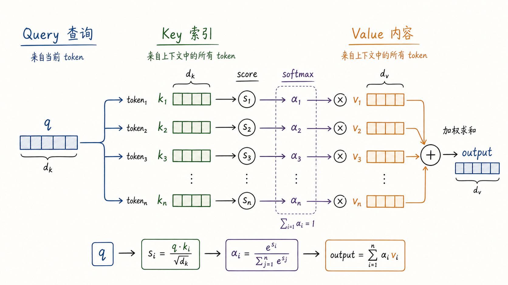
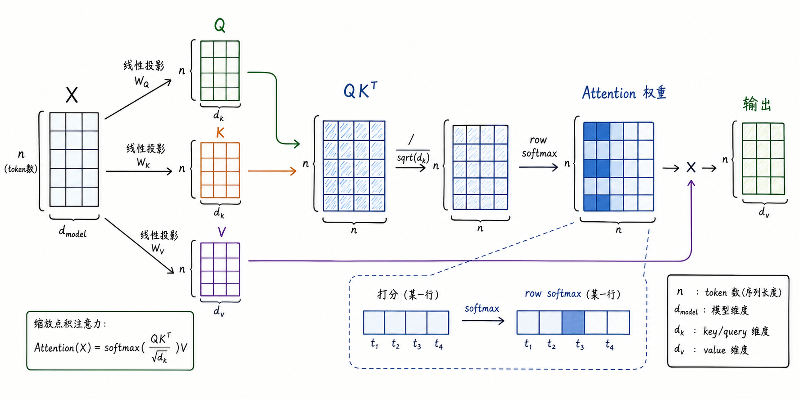
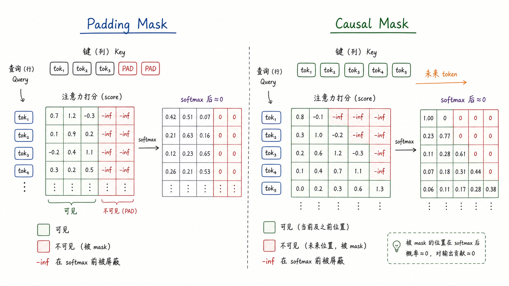
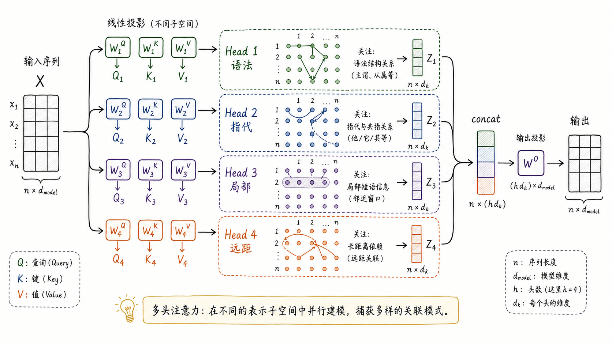

---
tags:
  - LLM
  - attention
  - transformer
  - deep-learning
updated: 2026-05-27
description: 从软寻址、Q/K/V、Scaled Dot-Product、mask、多头机制和工程复杂度解释 Attention，帮助建立进入 Transformer 与现代 LLM 架构之前最关键的算子级心智模型。
---

# 大模型精讲系列 00-A：深入理解 Attention 机制

> [!Quote] 本篇导读
> Attention 不是一个神秘的“注意力”比喻，而是一种可微分的信息检索机制。它让当前位置用 Query 去查询上下文里的 Key，再按相关度加权取回 Value。理解 Attention，最重要的不是背公式，而是看清三件事：它如何把“需要什么信息”与“哪里有这些信息”连接起来；为什么要用 softmax 和 $\sqrt{d_k}$ 缩放；以及 mask、多头、KV cache 等工程设计如何改变它在大模型里的行为边界。

## 1. 从信息检索进入

### 1.1 Attention 解决的不是记忆问题，而是取用问题

序列建模里最难的地方，常常不是“信息是否存在”，而是“当前位置能否在需要时取到正确的信息”。

考虑一句话：

> “小林把合同交给法务，因为他担心条款里还有风险。”

当模型处理“他”这个位置时，需要回到前文判断它更可能指向“小林”而不是“法务”。这个判断不是靠相邻词就能完成的。模型必须知道：当前位置正在提出一个查询，前文多个位置都可能提供候选信息，最后要按相关性取回最有用的内容。

RNN 时代的做法更像“把读过的一切压缩进一个不断更新的状态”。Attention 则改变了问题形式：不再强迫所有历史信息先挤进一个固定向量，而是让当前位置在计算时直接访问上下文中的所有候选位置。

这就是 Attention 的第一层直觉：

**Attention = 可微分的软寻址。**

“寻址”表示当前位置可以去上下文里查找信息；“软”表示它不是只选中一个位置，而是给所有位置分配权重，再把内容加权混合回来。



这张图可以按从左到右的顺序读：

1. 当前 token 产生一个 Query，表示“我现在需要什么信息”；
2. 上下文中的每个 token 产生 Key，表示“我这里有什么索引特征”；
3. Query 与每个 Key 计算 score，得到一组相关度；
4. softmax 把相关度转成权重，使权重非负且总和为 1；
5. 这些权重再作用到 Value 上，得到当前位置的新表示；

注意这里的 Value 才是真正被取回并混合的内容。Key 更像目录索引，Query 更像检索请求，score 和 softmax 决定每本“书”被参考多少。

### 1.2 硬寻址与软寻址

传统程序里的寻址通常是硬寻址。比如数组下标 `arr[3]`，数据库主键查询 `id = 42`，命中就是命中，没命中就是没命中。硬寻址清晰、精确，但不可微，不能方便地作为神经网络中的连续计算单元。

Attention 的软寻址有两个特点：

- 它允许多个位置同时贡献信息；
- 它可以通过梯度学习“怎样打分”和“怎样取回”；

这两个特点非常关键。语言中的很多关系本来就不是单点关系。一个词的含义可能同时依赖主语、谓语、修饰语、前文主题和局部短语。Attention 用加权混合的方式，把这种“主要参考 A，少量参考 B，也保留一点 C”的连续关系表达出来。

### 1.3 先给一个紧凑定义

在现代 Transformer 语境中，Attention 通常指 Scaled Dot-Product Attention：

$$
\operatorname{Attention}(Q,K,V)
= \operatorname{softmax}\left(\frac{QK^T}{\sqrt{d_k}}\right)V
$$

其中：

- $Q$ 是 Query 矩阵，表示每个位置发出的查询；
- $K$ 是 Key 矩阵，表示每个位置可被匹配的索引；
- $V$ 是 Value 矩阵，表示每个位置真正提供的内容；
- $d_k$ 是 Query 与 Key 的向量维度；
- $QK^T$ 得到所有 Query 对所有 Key 的打分矩阵；
- softmax 按行归一化，使每个 Query 对所有 Key 的权重和为 1；

如果只记一句话：

**Query 决定“我要查什么”，Key 决定“我能被怎样查到”，Value 决定“查到后返回什么”。**

## 2. Q/K/V 的机制

### 2.1 为什么同一个 token 要拆成三种向量

初学者常问：既然输入 token 已经有 embedding，为什么还要投影成 Q、K、V 三套向量？

原因是一个位置在 Attention 中扮演了三种不同角色：

| 角色 | 直觉 | 在计算中的作用 |
| --- | --- | --- |
| Query | 我现在想找什么 | 当前行拿它去匹配所有 Key |
| Key | 我有什么可匹配特征 | 被其他 Query 用来计算相关度 |
| Value | 我能贡献什么内容 | 被权重加权求和后进入输出 |

同一个词在不同角色下需要保留的特征不完全相同。

例如“合同”这个词：

- 当它作为 Query 时，可能在问“哪些词解释我的状态或动作？”；
- 当它作为 Key 时，可能需要暴露“我是一个法律文件实体”；
- 当它作为 Value 时，可能携带具体语义内容，供别的位置取用；

因此 Transformer 不直接拿原始输入向量互相点积，而是学习三组线性投影：

$$
Q = XW^Q,\quad K = XW^K,\quad V = XW^V
$$

这里的 $W^Q$、$W^K$、$W^V$ 都是可学习参数。它们让模型在不同表示子空间里分别组织“查询特征”“索引特征”和“内容特征”。

### 2.2 一个小例子：生成“北京”时看哪里

假设模型正在翻译：

> 我 爱 北京 天安门

当 Decoder 准备生成 “Beijing” 时，当前状态会形成一个 Query。这个 Query 会依次和源句中每个位置的 Key 计算相关度：

| 源 token | 可能的语义 | 相关度直觉 |
| --- | --- | --- |
| 我 | 主语 | 低 |
| 爱 | 动作 | 中 |
| 北京 | 地点实体 | 高 |
| 天安门 | 地点实体的一部分或相关地点 | 中到高 |

softmax 后，“北京”对应的权重会更大，“天安门”可能也有一定权重。最终上下文向量不是只复制“北京”，而是把多个 Value 按权重混合。这个混合向量再参与后续生成。

这就是 Attention 与传统对齐的区别。它可以表现出“主要对齐到北京，同时参考天安门”的软关系。

### 2.3 Self-Attention 与 Cross-Attention

Q/K/V 的来源不同，会形成不同类型的 Attention。

| 类型 | Q 来自 | K/V 来自 | 典型用途 |
| --- | --- | --- | --- |
| Self-Attention | 当前序列 | 当前序列 | 同一段文本内部各位置互相建模 |
| Cross-Attention | 目标序列或 Decoder 状态 | 源序列或 Encoder 输出 | 生成时查询另一段编码结果 |

Self-Attention 是 Transformer Encoder 和 Decoder 的核心。它让同一序列中的每个位置都能在一层内直接访问其他位置。

Cross-Attention 常见于 Encoder-Decoder 架构。Decoder 当前要生成的 token 形成 Query，而 Encoder 的输出提供 Key 和 Value。它的语义是：**当前生成位置向源语言编码结果发出查询，按相关度取用源句信息。**

现代 Decoder-Only LLM 通常没有 Encoder-Decoder 式 Cross-Attention，主干几乎全是 masked self-attention。检索增强、工具调用、多模态输入等场景可能重新引入 cross-attention 或类似的外部信息融合结构。

## 3. Scaled Dot-Product

### 3.1 从向量打分到矩阵计算

单个 Query 与单个 Key 的相关度可以写成：

$$
s_i = q \cdot k_i
$$

如果当前序列有 $n$ 个位置，单个 Query 会得到 $n$ 个 score。softmax 之后得到权重：

$$
\alpha_i = \frac{\exp(s_i)}{\sum_{j=1}^{n}\exp(s_j)}
$$

输出就是 Value 的加权和：

$$
o = \sum_{i=1}^{n}\alpha_i v_i
$$

Transformer 的关键是把所有位置一次性矩阵化：



设输入 $X \in \mathbb{R}^{n \times d_{\text{model}}}$，投影后：

$$
Q \in \mathbb{R}^{n \times d_k},\quad
K \in \mathbb{R}^{n \times d_k},\quad
V \in \mathbb{R}^{n \times d_v}
$$

则：

$$
QK^T \in \mathbb{R}^{n \times n}
$$

这个 $n \times n$ 矩阵非常重要。它的第 $i$ 行表示第 $i$ 个位置作为 Query 时，对所有 Key 的相关度；第 $j$ 列表示第 $j$ 个位置作为 Key 时，被所有 Query 匹配的程度。

softmax 通常按行做，因为每一行对应一个 Query 的“注意力分布”。最后乘以 $V$：

$$
\operatorname{softmax}\left(\frac{QK^T}{\sqrt{d_k}}\right)V
\in \mathbb{R}^{n \times d_v}
$$

得到每个位置的新表示。

### 3.2 为什么要除以 $\sqrt{d_k}$

如果只做点积 $q \cdot k$，当维度 $d_k$ 变大时，点积的方差会变大。

一个简化推导如下。假设 $q$ 和 $k$ 的各维独立，均值为 0，方差为 1，则：

$$
q \cdot k = \sum_{r=1}^{d_k} q_r k_r
$$

每一项 $q_r k_r$ 的方差近似为 1，$d_k$ 项相加后：

$$
\operatorname{Var}(q \cdot k) \approx d_k
$$

也就是说，维度越大，点积分数越容易变得很大或很小。softmax 的输入一旦过大，就会进入饱和区：最大的值接近 1，其他值接近 0，梯度变得非常弱。模型会过早变成“硬选择”，训练不稳定。

除以 $\sqrt{d_k}$ 后：

$$
\operatorname{Var}\left(\frac{q \cdot k}{\sqrt{d_k}}\right)
\approx 1
$$

这一步不是装饰性的常数，而是把分数尺度拉回 softmax 更容易工作的范围。它让 Attention 在较大维度下仍能稳定训练。

### 3.3 softmax 的意义与代价

softmax 有三个作用：

- 把任意实数 score 转成非负权重；
- 让每个 Query 的所有权重和为 1；
- 放大高相关位置，压低低相关位置；

但 softmax 也带来代价。它会让 Attention 更像“竞争性分配”：某些位置权重变大时，其他位置权重会相对变小。这种竞争让模型能突出重点，也可能在长上下文中稀释小但重要的证据。

因此，后来的许多改进都在围绕 Attention 的权重分布做文章，例如稀疏 Attention、局部窗口、线性 Attention、FlashAttention 的 IO 优化等。它们的目标各不相同：有的改变可见范围，有的改变计算路径，有的不改变数学结果但减少显存读写。

### 3.4 Attention 的输出不是解释本身

Attention 权重看起来很像解释：权重大，似乎说明模型“关注”了那个位置。这个直觉有帮助，但不能过度使用。

原因至少有三点：

- Value 的内容会经过多层非线性变换，权重大不等于最终决策贡献最大；
- 多头、多层 Attention 会把信息反复混合，单层权重只是局部路径；
- 后续 FFN、残差、LayerNorm 都会继续改变表示；

因此，Attention 权重可以作为观察窗口，但不能直接等同于模型因果解释。它适合帮助理解机制，不适合作为唯一的可解释性证据。

## 4. Mask 与可见性

### 4.1 为什么 Attention 需要 mask

基础 Attention 默认每个位置都能看见所有位置。但真实任务经常需要限制可见范围。

最常见的两类 mask 是：

- Padding Mask：忽略为了对齐 batch 长度而补上的 PAD token；
- Causal Mask：在自回归生成中禁止当前位置看到未来 token；

mask 的核心动作通常是：在 softmax 之前，把不可见位置的 score 加上一个极大的负数，理想化写作 $-\infty$。这样 softmax 后，这些位置的概率近似为 0。



### 4.2 Padding Mask

不同句子组成 batch 时，长度通常不同。为了让它们变成统一形状的张量，系统会把短句补齐：

```text
句子 A: 我 喜欢 北京
句子 B: 我 喜欢 上海 的 夜景

补齐后:
句子 A: 我 喜欢 北京 PAD PAD
句子 B: 我 喜欢 上海 的 夜景
```

PAD token 不是语义内容。如果 Attention 把它当成普通 token，就会把无意义信息混入输出。因此 Padding Mask 会把 PAD 对应的 Key 位置屏蔽掉，使所有 Query 都不会从 PAD 位置取 Value。

这里要注意一个实现细节：不同框架里布尔 mask 的语义可能相反。有的 API 用 `True` 表示“要屏蔽”，有的用 `True` 表示“允许参与”。但数学上最终都等价于：不可见位置在 softmax 前被压到极小值。

### 4.3 Causal Mask

语言模型训练的目标是预测下一个 token。假设目标序列是：

```text
我 / 喜欢 / 北京 / 的 / 秋天
```

当模型在位置 2 预测“北京”时，它只能看到“我 / 喜欢”，不能偷看“北京 / 的 / 秋天”。否则训练会变成泄题。

Causal Mask 通常是一个上三角屏蔽矩阵：

- 第 1 个位置只能看自己；
- 第 2 个位置可以看第 1、2 个位置；
- 第 3 个位置可以看第 1、2、3 个位置；
- 以此类推；

这让训练时可以一次并行计算所有位置，但每个位置的可见信息仍然符合自回归约束。

### 4.4 Mask 不只是“训练技巧”

mask 决定了模型的信息边界，因此它本质上是架构语义的一部分。

| Mask 类型 | 信息边界 | 对能力的影响 |
| --- | --- | --- |
| 无 mask 的双向 Self-Attention | 每个位置可看左右两侧 | 适合理解任务，如 BERT-style encoder |
| Causal Mask | 每个位置只能看过去和当前 | 适合自回归生成，如 GPT-style decoder |
| Padding Mask | 屏蔽非真实 token | 保证 batch 对齐不污染语义 |
| 局部窗口 mask | 只看附近窗口 | 降低长序列成本，但牺牲全局可见性 |

同样是 Self-Attention，只要 mask 不同，模型的任务属性就会不同。这也是理解 Encoder-Only、Decoder-Only、Encoder-Decoder 架构分化的关键入口。

## 5. Multi-Head Attention

### 5.1 单头为什么不够

一个 Attention head 会产生一张注意力分布。它可以同时给多个位置分配权重，但这些权重仍然来自同一个表示子空间、同一套 Q/K/V 投影。

语言中的关系却是多类型的。一个 token 可能同时需要：

- 看局部短语边界；
- 看远处主语；
- 看代词指向；
- 看标点或句法结构；
- 看领域词与定义之间的关系；

让一个 head 承担所有关系，会压缩表达能力。Multi-Head Attention 的做法是：把模型维度分成多个子空间，让每个 head 在自己的子空间里独立计算 Attention，再把结果拼接回来。



### 5.2 多头不是简单重复

多头机制可以写成：

$$
\operatorname{head}_i
= \operatorname{Attention}(QW_i^Q, KW_i^K, VW_i^V)
$$

$$
\operatorname{MultiHead}(Q,K,V)
= \operatorname{Concat}(\operatorname{head}_1,\ldots,\operatorname{head}_h)W^O
$$

这里有两个关键点。

第一，每个 head 有自己的投影矩阵。它不是把同一个 Attention 重复算 $h$ 次，而是在不同子空间里学习不同的匹配方式。

第二，拼接后的 $W^O$ 会重新混合各 head 的输出。head 之间不是彼此隔离的专家，而是先并行提取不同关系，再通过输出投影合成为统一表示。

图里把 head 标成“语法”“指代”“局部”“远距”，是教学上的直觉标签，不表示真实模型中每个 head 都会稳定对应一个人类可命名功能。真实 head 的分工可能更细碎、重叠，甚至存在冗余。

### 5.3 维度如何分配

原始 Transformer 中：

$$
d_{\text{model}} = 512,\quad h = 8,\quad d_k = d_v = 64
$$

也就是把 512 维表示拆成 8 个 64 维 head。一般情况下：

$$
d_k = d_v = \frac{d_{\text{model}}}{h}
$$

这样做的一个好处是，总计算量大致保持稳定。多头并不是把计算量简单乘以 $h$，因为每个 head 的维度变小了。相较于一个 512 维单头，8 个 64 维头在主要矩阵乘法上的总量接近，但表达结构更丰富。

### 5.4 MHA、MQA、GQA 的边界

在现代 LLM 推理中，Attention 的瓶颈不只来自计算，也来自 KV cache 的显存占用。每生成一个 token，模型需要保留历史 token 的 Key 和 Value，后续 token 才能查询它们。

因此出现了几种变体：

| 机制 | Query 头 | Key/Value 头 | 主要目的 |
| --- | --- | --- | --- |
| MHA | 多个 | 同样多个 | 表达能力强，KV cache 最大 |
| MQA | 多个 | 1 组共享 | 大幅减少 KV cache，可能损失质量 |
| GQA | 多个 | 若干组共享 | 在质量与 KV cache 之间折中 |

这些变体不改变 Attention 的基本思想，改变的是 Q 与 K/V 的分组关系。后续学习 LLaMA、Mistral、DeepSeek 等现代架构时，KV cache 与 GQA 会变成非常重要的工程主题。

## 6. 成本、误区与心智模型

### 6.1 Attention 的复杂度

标准 Self-Attention 的主要成本来自 $QK^T$ 和权重乘 $V$。

设序列长度为 $n$，模型维度为 $d$，则时间复杂度通常写作：

$$
O(n^2d)
$$

其中 $n^2$ 来自所有位置两两交互。注意力权重矩阵本身是 $n \times n$，朴素实现还会带来：

$$
O(n^2)
$$

级别的中间显存占用。

这也是为什么 Attention 在长上下文场景中会遇到根本压力：序列长度翻倍，注意力矩阵大小约变成四倍。FlashAttention 通过分块和 IO-aware 计算减少显存读写与中间矩阵保存，但它保持的是精确 Attention 的数学结果；局部窗口、稀疏 Attention 等方法则会改变可见范围或近似方式。

### 6.2 常见误区

**误区一：“Attention 就是找最重要的词。”**

更准确地说，Attention 是对 Value 的加权混合。它可以突出某些位置，但输出不是一个离散选择，也不是人类意义上的注意力解释。

**误区二：“Q、K、V 是三份不同输入。”**

在 Self-Attention 里，Q、K、V 通常都来自同一个输入序列，只是经过不同线性投影。在 Cross-Attention 里，Q 与 K/V 才来自不同序列或不同模块。

**误区三：“mask 只是避免 padding 的小技巧。”**

mask 决定信息可见性。Causal Mask 直接塑造了自回归生成能力；无 causal mask 的双向 Attention 则更适合理解任务。

**误区四：“多头越多越好。”**

head 数增加会改变每个 head 的维度、并行粒度和 KV cache 布局。过多 head 不一定提高能力，可能带来冗余、通信成本或显存压力。

**误区五：“Attention 解决了所有长程依赖问题。”**

Attention 缩短了任意位置之间的信息路径，但没有免费解决长上下文成本、噪声干扰、位置泛化、检索可靠性和训练数据覆盖问题。

### 6.3 最终心智模型

可以把 Attention 压缩成一个四步模型：

1. 每个位置提出查询：我现在需要什么；
2. 每个位置暴露索引：我可以怎样被匹配；
3. 查询与索引打分：哪些位置对我更相关；
4. 按权重取回内容：把相关位置的 Value 混合成新表示；

Transformer 之所以强大，不是因为 Attention 像人类一样“注意”，而是因为它把序列中的任意位置变成了可直接交互的节点。信息不再必须沿时间链一步步传递，而是在一层内通过矩阵乘法建立全局连接。

这也是进入 Transformer 架构的桥梁：如果 Attention 已经能让所有位置直接通信，那么下一步问题就是，如何让这种机制知道顺序、稳定堆叠、表达非线性变换，并用于训练和生成完整序列。

## 7. 参考资料

1. Vaswani, A., et al. (2017). *Attention Is All You Need*. https://arxiv.org/abs/1706.03762
2. Bahdanau, D., Cho, K., & Bengio, Y. (2014). *Neural Machine Translation by Jointly Learning to Align and Translate*. https://arxiv.org/abs/1409.0473
3. Luong, M. T., Pham, H., & Manning, C. D. (2015). *Effective Approaches to Attention-based Neural Machine Translation*. https://arxiv.org/abs/1508.04025
4. Harvard NLP. *The Annotated Transformer*. https://nlp.seas.harvard.edu/annotated-transformer/
5. PyTorch Documentation. *torch.nn.functional.scaled_dot_product_attention*. https://docs.pytorch.org/docs/stable/generated/torch.nn.functional.scaled_dot_product_attention.html
6. Dao, T., et al. (2022). *FlashAttention: Fast and Memory-Efficient Exact Attention with IO-Awareness*. https://arxiv.org/abs/2205.14135

## 8. 学习测评

### 8.1 题目

1. 在 Attention 的 Q/K/V 视角中，Query 最准确的含义是什么？
   A. 当前 token 真正要返回给下一层的内容；
   B. 当前 token 发出的检索请求；
   C. 上下文 token 的位置编号；
   D. softmax 之后的概率分布；

2. 在 Self-Attention 中，Q、K、V 通常来自哪里？
   A. Q 来自 Decoder，K/V 来自 Encoder；
   B. Q/K/V 都来自同一个输入序列的不同线性投影；
   C. Q 来自位置编码，K/V 来自词向量；
   D. Q/K/V 分别来自三份不同训练样本；

3. 为什么 Scaled Dot-Product Attention 要除以 $\sqrt{d_k}$？
   A. 为了减少 Value 的维度；
   B. 为了让点积分数尺度更稳定，避免 softmax 过早饱和；
   C. 为了把 mask 变成 0；
   D. 为了让每个 head 的参数完全共享；

4. 对于一个长度为 $n$ 的序列，标准 Self-Attention 的注意力权重矩阵形状通常是什么？
   A. $n \times d_{\text{model}}$；
   B. $d_{\text{model}} \times d_{\text{model}}$；
   C. $n \times n$；
   D. $h \times d_k$；

5. Padding Mask 的主要作用是什么？
   A. 防止模型看到未来 token；
   B. 屏蔽 batch 补齐产生的非真实 token；
   C. 降低 Query 投影矩阵的参数量；
   D. 让所有 token 的位置编码相同；

6. Causal Mask 对自回归语言模型的意义是什么？
   A. 让当前位置只能看到过去和当前，不能偷看未来；
   B. 让模型忽略所有历史 token，只看当前 token；
   C. 让 Encoder 输出被 Decoder 读取；
   D. 让 softmax 不再归一化；

7. Multi-Head Attention 相比单头 Attention 的核心增益是什么？
   A. 每个 head 都复制同一套 Attention 权重以降低噪声；
   B. 在不同表示子空间中并行学习多种匹配关系；
   C. 完全消除 $O(n^2)$ 复杂度；
   D. 不再需要 Q/K/V 投影；

8. 下列哪项对 Cross-Attention 的描述最准确？
   A. Q 与 K/V 来自同一个序列；
   B. Q 来自当前生成状态，K/V 来自另一个编码结果；
   C. 只用于屏蔽 PAD token；
   D. 只在 CNN 中使用；

9. 为什么不能把 Attention 权重直接等同于模型解释？
   A. 因为 Attention 权重不是数值；
   B. 因为 Value、后续层、FFN、残差等都会继续改变表示；
   C. 因为 Attention 不参与梯度更新；
   D. 因为 softmax 后权重和不等于 1；

10. 标准 Self-Attention 在长上下文中最核心的成本压力来自哪里？
    A. 词表大小随序列长度平方增长；
    B. 任意位置两两交互导致 $n \times n$ 注意力矩阵；
    C. LayerNorm 只能串行执行；
    D. 位置编码需要存储所有训练样本；

11. MQA/GQA 主要试图缓解现代 LLM 推理中的什么问题？
    A. FFN 参数量过少；
    B. KV cache 显存占用和读取压力；
    C. tokenizer 无法切分中文；
    D. Causal Mask 无法训练；

12. 如果一个模型使用双向 Self-Attention 且没有 causal mask，它更自然适合哪类任务？
    A. 自回归逐 token 生成；
    B. 文本理解、分类、抽取等可看完整输入的任务；
    C. 只能做图像分类；
    D. 只能做优化器状态同步；

### 8.2 答案与题解

1. B。Query 表示当前位置发出的检索请求，用来和上下文中的 Key 计算相关度。Value 才是被加权取回的内容。

2. B。在 Self-Attention 中，Q/K/V 通常都由同一个输入序列 $X$ 经过不同线性投影得到。Cross-Attention 才是 Q 与 K/V 来源不同。

3. B。点积方差会随 $d_k$ 增大而增大，除以 $\sqrt{d_k}$ 可以让 softmax 输入尺度更稳定，避免分布过早变得极端。

4. C。每个 Query 都要和每个 Key 打分，因此长度为 $n$ 的序列会产生 $n \times n$ 的注意力打分或权重矩阵。

5. B。Padding Mask 屏蔽补齐用的 PAD token，避免模型从非真实位置取回无意义 Value。

6. A。Causal Mask 保证第 $t$ 个位置只能看到 $\leq t$ 的 token，使训练时并行计算仍符合自回归生成约束。

7. B。多头机制通过多组投影让模型在不同子空间里学习不同关系，再把结果拼接和投影回统一表示。

8. B。Cross-Attention 的典型语义是 Decoder 当前状态发出 Query，Encoder 输出提供 Key 和 Value。

9. B。Attention 权重只是局部混合路径的一部分，后续层和 Value 内容都会影响最终预测，所以不能把权重直接当作完整因果解释。

10. B。标准 Self-Attention 需要所有位置两两交互，注意力矩阵随序列长度平方增长。

11. B。MQA/GQA 减少 Key/Value 头的数量或共享范围，主要降低自回归推理中的 KV cache 显存占用和带宽压力。

12. B。没有 causal mask 的双向 Attention 可以看完整输入，更适合理解型任务；自回归生成需要防止看到未来 token。
