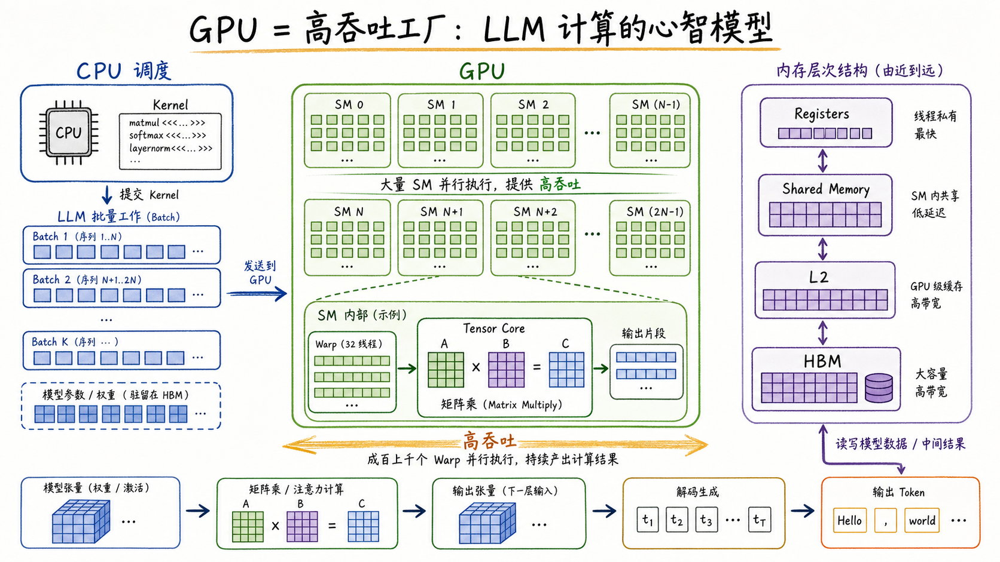
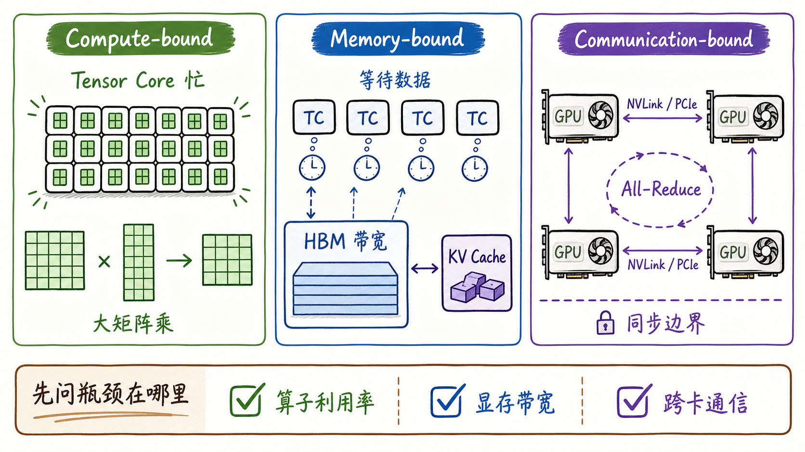
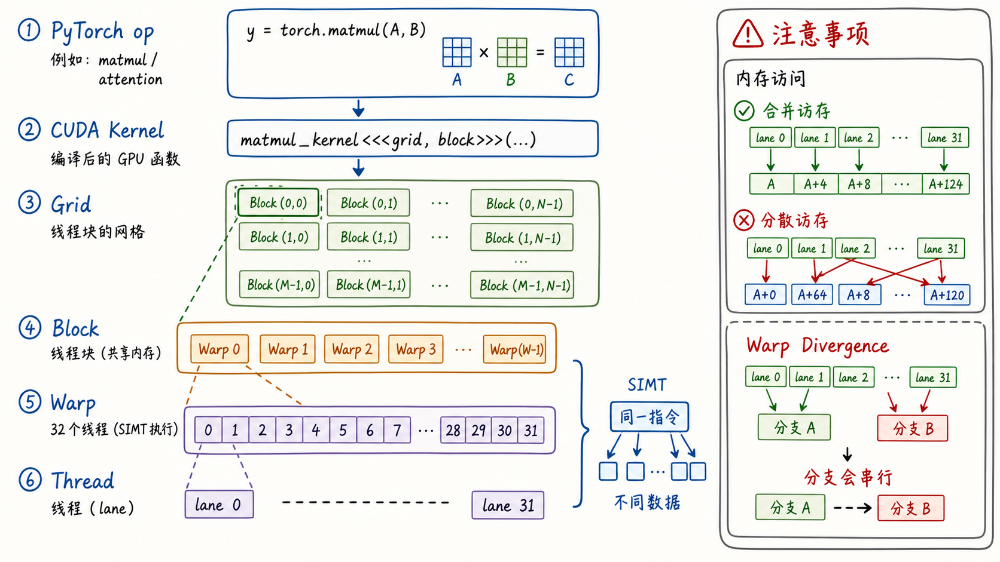
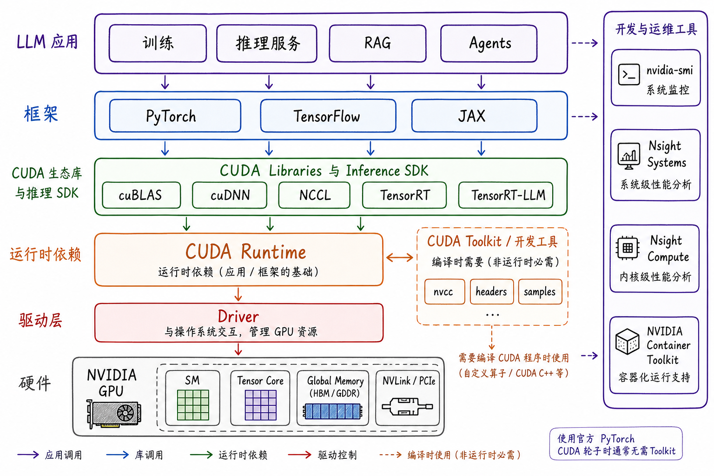
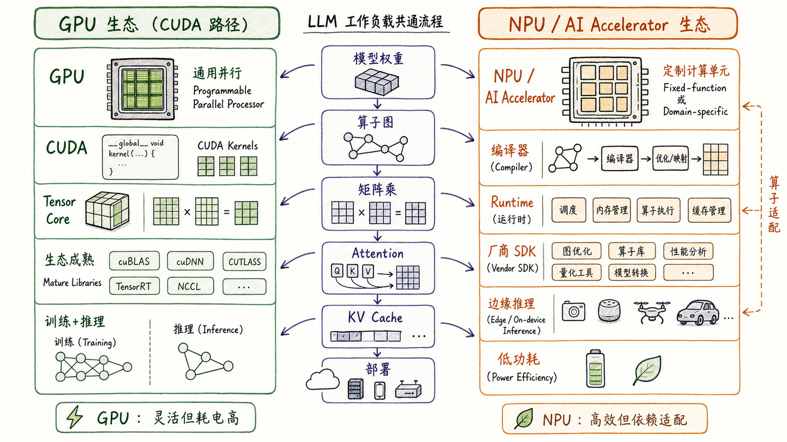
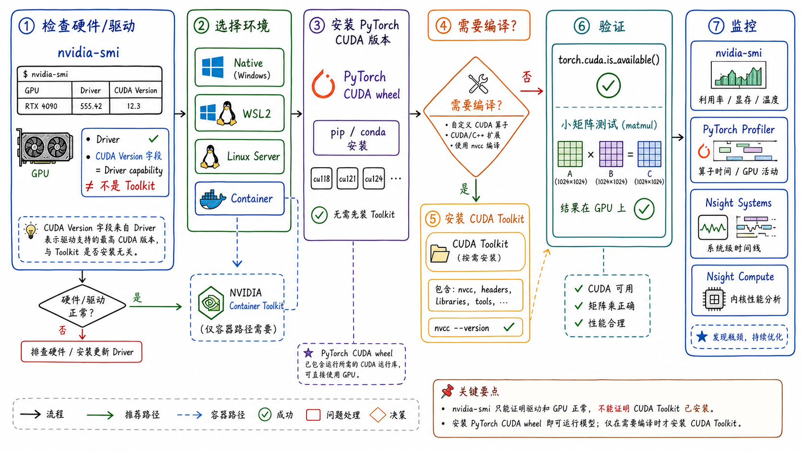

---
tags:
  - LLM
  - GPU
  - CUDA
  - NVIDIA
  - NPU
  - AI-accelerator
  - model-serving
updated: 2026-05-27
description: 从大模型计算需求出发，解释 GPU 架构、CUDA 执行模型、NVIDIA 软件生态、NPU/AI 加速器生态，以及可验证的安装与基本使用路径。
---

# 大模型精讲系列 00：理解 GPU 架构及其原理

> [!Quote] 本篇导读
> 大模型不是只被算法推动，也被硬件推动。Transformer 之所以能在今天的规模上训练和推理，离不开 GPU 把海量矩阵计算铺成并行任务的能力。理解 GPU，不需要一开始就写 CUDA kernel，但必须先明白三件事：GPU 为什么适合 LLM，CUDA 如何把计算组织成 Grid、Block、Warp，NVIDIA 与 NPU 生态分别把“硬件能力”包装成了怎样的软件路径。

## 1. 从 LLM 问题进入

### 1.1 为什么先学 GPU

如果只从模型结构看，大模型像是一堆 Transformer layer、Attention、MLP、Embedding 和 LM Head。但从机器执行的角度看，它更像一条持续流动的张量生产线：

- 权重矩阵从显存中被读出；
- hidden states 进入线性层、Attention 或归一化算子；
- 大量矩阵乘法、逐元素运算和归约操作被提交给硬件；
- 中间激活、KV cache 和 logits 在存储层级之间来回移动；
- 多卡场景下还要通过 NVLink、PCIe、InfiniBand 等链路交换数据；

这意味着，LLM 的性能不是一个单纯的“模型问题”，而是模型、算子、显存、带宽、通信、调度共同形成的系统问题。后续理解 TP、DP、PP、EP、KV cache、量化、推理服务吞吐时，GPU 都是默认背景。

可以把 GPU 在大模型里的角色先压缩成一句话：

**GPU 是为了高吞吐并行计算而设计的处理器，它擅长把大量形状相似的张量计算同时铺开。**

这句话里的关键词不是“更快”，而是“同时”。CPU 强在复杂控制、分支、系统调度和低延迟响应；GPU 强在让成千上万个轻量线程同时执行相似工作。LLM 恰好有大量这样的工作，尤其是矩阵乘法和向量化算子。



这张图里的“高吞吐工厂”不是比喻上的热闹，而是 GPU 设计的核心方向。CPU 负责提交 kernel、调度任务和管理运行环境；GPU 内部有大量 SM（Streaming Multiprocessor）并行执行；存储层级从 Registers、Shared Memory/L1、L2 到 Global Memory 逐级变大、变远、变慢。数据中心 GPU 的 Global Memory 常见物理介质是 HBM，消费级 GPU 常见为 GDDR。LLM 运行时的权重、激活、KV cache 和中间结果就在这个层级里流动。

### 1.2 GPU 解决的不是所有问题

GPU 很强，但它不是魔法。它解决的是“可并行、算子形状清晰、数据布局友好”的问题。下面这些场景会直接影响 GPU 是否真的跑得快：

- 如果算子是大矩阵乘，Tensor Core 可以提供很高吞吐；
- 如果大量时间花在从 HBM 读写数据，瓶颈可能是显存带宽；
- 如果线程访问内存很分散，硬件吞吐会被浪费；
- 如果分支很多，Warp 内不同线程走不同路径，部分 lanes 会被 mask，执行效率会下降；
- 如果模型被切到多张卡，跨卡通信可能成为瓶颈；
- 如果 batch 太小或序列长度太短，GPU 可能来不及被喂饱；

所以，学习 GPU 不是为了背硬件名词，而是为了建立性能判断能力：一次 LLM 运行慢，到底是算不动、读不动、传不动，还是调度没组织好。

### 1.3 三类瓶颈

工程上常见的第一步，不是立刻调参数，而是先问瓶颈在哪里。



可以用三个词建立初始判断：

| 瓶颈类型 | 直觉 | LLM 中的常见位置 | 常见观察 |
| --- | --- | --- | --- |
| Compute-bound | Tensor Core、CUDA Core 很忙，主要时间花在计算 | 大 batch GEMM、训练中的大矩阵乘 | GPU 利用率高，算子吞吐接近硬件上限 |
| Memory-bound | 计算单元在等数据，主要时间花在读写显存 | decode 阶段 KV cache 读取、小 batch 推理、LayerNorm、采样 | HBM 带宽压力大，算子算力利用率不高 |
| Communication-bound | 多卡之间在等待同步或传输 | TP all-reduce、PP stage 边界、训练梯度同步 | 单卡算子不慢，但整体 step 或 token 延迟被通信拉长 |

这三类瓶颈不是互斥的。一个系统可能 prefill 阶段更接近 compute-bound，decode 阶段更接近 memory-bound，多卡 TP 又在某些层上出现 communication-bound。后续讨论并行策略时，很多“为什么这个参数不是越大越好”的答案，都藏在这里。

### 1.4 一个贯穿样例

在进入硬件名词之前，可以先固定一个贯穿样例：一次 LLM 推理中的 `Linear` 层，最终会落到类似 $Y = XW$ 的矩阵乘。框架不会让 CPU 一格一格计算这个矩阵，而是把输出矩阵切成许多 tile；每个 tile 被交给 GPU 上的线程块协作完成；线程块内部的线程以 Warp 为调度单位执行；真正高吞吐的矩阵乘累加路径通常会尽量使用 Tensor Core；权重、激活和中间结果则在 Registers、Shared Memory、L2 与 Global Memory 之间移动。

后面的 SM、Warp、Tensor Core、存储层级和 CUDA kernel，都可以放回这个样例里理解。这样读者不会只记住一串硬件名词，而能看见一行 `torch.matmul(x, w)` 如何穿过软件栈并变成 GPU 上的大量并行工作。

## 2. GPU 硬件架构

### 2.1 CPU 与 GPU 的分工

CPU 和 GPU 都能执行程序，但设计目标不同。

CPU 更像少数能力很强的通用执行单元，擅长：

- 操作系统调度；
- 复杂分支控制；
- 串行逻辑；
- 低延迟响应；
- 外设、文件、网络、进程管理；

GPU 更像大量并行执行单元，擅长：

- 同一类操作重复很多次；
- 数据可以被拆成许多独立小块；
- 每个小块执行路径相似；
- 计算量足够大，能摊薄调度开销；
- 内存访问有规律，便于合并访存；

LLM 里的矩阵乘法正好符合 GPU 的口味。比如一个 Linear 层本质上是：

$$
Y = XW
$$

其中 $X$ 是输入激活，$W$ 是权重矩阵，$Y$ 是输出。矩阵里的每个输出块都可以由许多线程协作计算。GPU 不需要像 CPU 那样让少数核心一行行算，而是把矩阵拆成许多 tile，分配给大量线程块并行处理。

可以把这个过程粗略拆成四步：

1. 输出矩阵 $Y$ 被切成许多 tile，每个 tile 对应一小块输出区域；
2. CUDA Grid 描述这次 kernel 总共有多少块工作，Block 描述一组线程如何协作完成其中一块；
3. Block 内部的 Thread 会按 Warp 分组调度，通常 32 个 Thread 组成一个 Warp；
4. 高性能 GEMM kernel 会尽量把数据搬到更近的存储层级复用，并在合适的数据类型上使用 Tensor Core 做矩阵乘累加；

这四步把第 2 章和第 3 章串起来：硬件里看到的是 SM、Tensor Core 和存储层级；CUDA 执行模型里看到的是 Kernel、Grid、Block、Warp 和 Thread。

### 2.2 SM：GPU 的基本生产车间

NVIDIA GPU 的核心执行单位是 SM（Streaming Multiprocessor）。不同代际 GPU 的 SM 内部细节会变化，但可以先抓住几个稳定概念：

| 组件 | 作用 | 学习重点 |
| --- | --- | --- |
| CUDA Core | 执行通用标量/向量数值计算 | 不是越数核心越等于真实 LLM 性能，还要看数据类型、算子和带宽 |
| Tensor Core | 执行矩阵乘累加类操作 | LLM 中的 GEMM、QKV/O projection、MLP，以及部分 fused attention 的矩阵乘路径高度依赖它 |
| Warp Scheduler | 调度 Warp 执行指令 | 通过切换 Warp 隐藏访存延迟 |
| Register File | 每个线程最快的私有存储 | 寄存器压力会影响 occupancy |
| Shared Memory / L1 | SM 内部可控的低延迟存储 | 适合线程块内复用数据 |
| L2 Cache | GPU 级共享缓存 | 多 SM 之间共享，靠近 HBM |
| Global Memory（HBM/GDDR） | 大容量设备显存 | 容纳权重、激活、KV cache、临时 buffer |

SM 的一个关键设计是“用大量并发隐藏延迟”。访问 HBM 比执行一次算术指令慢得多，如果只有少数线程，计算单元会经常空等。GPU 会让许多 Warp 驻留在同一个 SM 上；当某个 Warp 等内存时，调度器切换到另一个准备好的 Warp 继续执行。

这就是为什么 GPU 编程里经常看到 occupancy、register pressure、shared memory、memory coalescing 这些词。它们不是孤立技巧，而是围绕同一个目标：让硬件持续有活干。

### 2.3 Tensor Core 与数据类型

大模型训练和推理高度依赖低精度矩阵计算。Tensor Core 的价值就在于，它能用专门的矩阵乘累加路径处理小矩阵 tile，然后把 tile 组合成大矩阵结果。

常见数据类型可以这样理解：

| 数据类型 | 常见用途 | 直觉 |
| --- | --- | --- |
| FP32 | 传统高精度训练、累加、某些数值敏感位置 | 精度高，吞吐和显存成本较高 |
| TF32 | NVIDIA Ampere 之后常见的 FP32 友好加速路径 | 对 FP32 代码更透明地使用 Tensor Core |
| FP16 | 训练和推理中的经典半精度 | 吞吐高、显存低，但数值范围较窄 |
| BF16 | 训练中常用，指数范围接近 FP32 | 比 FP16 更稳，许多 LLM 训练偏好它 |
| FP8 | 新一代训练/推理加速的重要方向 | 需要较新 GPU 架构、框架、kernel 和缩放策略配合 |
| INT8/INT4 | 推理量化常见 | 降低显存与带宽，可能带来精度损失 |

这里容易出现一个误解：低精度不是简单“把数字压小”。真正可用的低精度路径需要同时考虑：

- 硬件是否支持对应数据类型；
- 框架是否把算子映射到正确 kernel；
- 量化或混合精度策略是否保护了敏感层；
- 累加精度、缩放因子和反量化位置是否合理；
- 推理服务是否真的被显存带宽或计算吞吐限制；

因此，“换成 FP16/BF16/FP8/INT4 就一定更快”是不完整的说法。更准确的说法是：**低精度通过降低计算、存储与带宽压力创造加速机会，但最后能否变快取决于硬件、kernel、数据布局和瓶颈位置。** FP8 是否可用尤其依赖 GPU 架构、Tensor Core 代际、框架版本和具体 kernel；BF16 也需要硬件和框架支持，旧卡可能只能稳定使用 FP16 或 FP32 路径。

用一个部署场景看会更直观。假设一个 7B 模型准备用来推理：FP16/BF16 权重通常更接近“稳妥基线”，显存占用和带宽压力比 FP32 低很多；INT8 可能继续降低显存和带宽压力，但需要校准、量化 kernel 和精度验证；INT4 可以让单卡容纳更大模型或更长 KV cache，却更容易遇到质量损失、反量化开销和算子覆盖问题。低精度不是单纯压缩文件，而是一组围绕硬件、模型质量和 serving 目标的工程取舍。

### 2.4 存储层级

GPU 的存储系统不是一个平坦的大盒子。越靠近计算单元，容量越小、延迟越低；越远离计算单元，容量越大、延迟越高。严格说，Registers、Shared Memory/L1 和 L2 是片上存储或缓存层级；Global Memory 才是设备全局显存，物理介质可能是 HBM 或 GDDR。

| 层级 | 典型特征 | LLM 相关理解 |
| --- | --- | --- |
| Registers | 每个线程私有，最快 | 存放局部变量和小片段中间值 |
| Shared Memory | 同一线程块内共享 | tile 级复用，手写 kernel 和高性能库会精心使用 |
| L1 / Texture Cache | SM 附近缓存 | 具体行为依架构和算子而变 |
| L2 Cache | 全 GPU 共享缓存 | 多 SM 访问共享数据时很关键 |
| Global Memory（HBM/GDDR） | 大容量设备显存 | 权重、KV cache、激活和 buffer 的主要驻留位置 |
| Host Memory | CPU 内存 | GPU 访问慢，常见于数据加载、offload 或统一内存场景 |

LLM 推理里，KV cache 往往会把这个层级问题暴露得很清楚。prefill 阶段一次处理较长 prompt，矩阵乘规模大，容易把 Tensor Core 喂饱；decode 阶段每次生成一个 token，要不断读取历史 K/V，batch 和矩阵形状可能较小，更容易变成 memory-bound。

这也解释了为什么推理系统会特别重视：

- continuous batching；
- paged KV cache；
- prefix cache；
- attention kernel 优化；
- 量化 KV cache；
- 更高带宽显存；

这些优化不是“框架炫技”，而是在围绕存储层级和访问模式做工程。比如 PagedAttention 关注 KV cache 的块式管理和碎片问题，FlashAttention 关注减少 HBM 读写，continuous batching 关注让 GPU 在请求形状变化时仍保持足够工作量。

## 3. CUDA 执行模型

### 3.1 从 PyTorch op 到 CUDA kernel

多数 LLM 工程师不会一上来手写 CUDA，但每天都在间接使用 CUDA。执行路径大致是：

```text
Python / PyTorch op
  -> 框架选择算子实现
  -> 调用 CUDA runtime / CUDA library
  -> GPU 执行 kernel
  -> 结果回到框架张量
```

例如一行 PyTorch：

```python
y = torch.matmul(x, w)
```

它不是让 Python 循环去算矩阵乘，而是把工作交给底层实现。对常见矩阵乘，框架通常会走 cuBLAS、CUTLASS 风格 kernel 或框架自带融合 kernel；对卷积会走 cuDNN；对多卡 collective 会走 NCCL；对推理优化可能走 TensorRT 或专门的 LLM kernel。

### 3.2 Grid、Block、Thread、Warp

CUDA 的基本执行层级可以理解为：Kernel 启动一个 Grid，Grid 包含多个 Block，Block 内有多个 Thread；硬件调度时，这些 Thread 会按 Warp 分组执行，Warp 通常由 32 个 Thread 组成。

| 层级 | 含义 | 直觉 |
| --- | --- | --- |
| Kernel | 一段在 GPU 上执行的函数 | 一次提交给 GPU 的并行任务 |
| Grid | 一个 kernel 启动时包含的所有 thread blocks | 整个任务网格 |
| Block | 一组可以协作的 threads | 同一 block 内可共享 Shared Memory、可同步 |
| Warp | NVIDIA GPU 上一组通常 32 个 thread 的调度单位 | SIMT 执行的基本单位 |
| Thread | 最小程序执行实例 | 每个 thread 处理一小份数据，在线程束内也可理解为一个 lane |



这张图里最关键的是 Warp。CUDA 写法里你会看到 thread，但硬件调度时往往以 Warp 为单位。NVIDIA 的 SIMT（Single Instruction, Multiple Threads）模型可以理解为：同一个 Warp 里的线程执行同一条指令，但操作不同数据。

这带来两个重要后果。

第一，内存访问要尽量合并。Warp 内相邻线程如果访问连续地址，硬件可以把访问合并成更高效的内存事务；如果访问分散，带宽会被浪费。

第二，要尽量避免 Warp divergence。如果同一个 Warp 里部分线程走 `if` 分支 A，另一部分线程走分支 B，硬件不能真的让它们完全同时走两条不同路径；未执行当前路径的 lanes 会被 mask 掉，分支路径分段推进，导致有效利用率下降。

把层级关系再压成一句话：Grid 描述“一次 kernel 总共要做多少块工作”，Block 描述“一小组线程如何协作完成其中一块工作”，Warp 描述“硬件实际如何成组调度这些线程”。初学者容易把 Thread 当成唯一主角，但在性能理解里，Block 的协作边界和 Warp 的调度行为更关键。

### 3.3 Kernel launch 与异步执行

CUDA kernel 的启动通常是异步的。CPU 提交 kernel 后，不一定等 GPU 计算完成才继续执行下一行 Python。框架会用 stream、event、同步点来组织依赖关系。

这件事有一个非常实际的后果：**用 CPU 墙钟时间测 GPU 操作时，需要在计时边界显式同步；更专业的 kernel 计时可以使用 CUDA events。**

下面这个例子常见但不准确：

```python
import time
import torch

x = torch.randn(4096, 4096, device="cuda")
w = torch.randn(4096, 4096, device="cuda")

t0 = time.time()
y = x @ w
print(time.time() - t0)
```

这段代码测到的可能主要是 kernel 提交时间，而不是矩阵乘真正完成的时间。更稳的写法是：

```python
import time
import torch

x = torch.randn(4096, 4096, device="cuda")
w = torch.randn(4096, 4096, device="cuda")

torch.cuda.synchronize()
t0 = time.time()
y = x @ w
torch.cuda.synchronize()
print(time.time() - t0)
```

这也是很多初学者第一次做 GPU benchmark 会踩的坑：看起来代码跑得飞快，实际上只是 CPU 很快把任务扔给了 GPU。

### 3.4 Occupancy 与延迟隐藏

GPU 不追求让一个线程极快，而追求让大量线程总体吞吐极高。为了做到这一点，SM 上会同时驻留多个 Warp。当某些 Warp 等待显存数据时，调度器切换到其他 Warp。

这就是 latency hiding。它要求：

- 有足够多的 Warp 可以调度；
- 每个线程使用的寄存器不要过多；
- 每个 block 使用的 shared memory 不要过多；
- 内存访问模式不要过度随机；
- 算子形状能提供足够并行度；

occupancy 是衡量 SM 上可驻留 Warp/Block 程度的一个指标，但它不是越高越好。某些高性能矩阵乘 kernel 会为了更高的数据复用或更少访存，故意使用更多寄存器和 shared memory，导致 occupancy 不是满的，但整体速度更快。

所以，occupancy 是观察线索，不是唯一目标。更可靠的判断需要结合 Nsight Compute、Nsight Systems、算子耗时、显存带宽、Tensor Core 利用率一起看。

## 4. NVIDIA 生态

### 4.1 一张栈图

NVIDIA 的优势不只是一块 GPU，而是一整套软硬件生态。对大模型工程来说，真正每天接触的是一层层软件栈：



可以从下往上看：

回到 `torch.matmul(x, w)` 这个贯穿样例：PyTorch 负责发起高层 op，cuBLAS 或框架 kernel 负责把矩阵乘映射到高性能 GPU 实现，CUDA Runtime 负责运行时支撑，Driver 负责与操作系统和硬件交互。大多数时候，开发者不直接碰 SM 或 Warp，但软件栈会把这条路径层层封装好。

| 层级 | 代表 | 作用 |
| --- | --- | --- |
| 硬件 | GPU、SM、Tensor Core、Global Memory、NVLink/PCIe | 提供计算、设备显存和互联能力 |
| Driver | NVIDIA Driver | 让操作系统识别和控制 GPU |
| CUDA Runtime | CUDA runtime library | 提供 CUDA 程序运行时依赖 |
| CUDA Toolkit | nvcc、headers、samples、开发库 | 编译 CUDA 程序或扩展时常需要，不等于运行 PyTorch wheel 的前置条件 |
| CUDA Libraries / Inference SDK | cuBLAS、cuDNN、NCCL、TensorRT、TensorRT-LLM | 把常见高性能算子、通信和推理优化封装成库或 runtime |
| Frameworks | PyTorch、TensorFlow、JAX | 让模型开发者用张量 API 调用底层能力 |
| LLM Systems | vLLM、TensorRT-LLM、NVIDIA Triton Inference Server、Triton kernel、训练框架 | 面向训练、推理、服务化、kernel 编写和部署优化 |
| Tools | nvidia-smi、Nsight Systems、Nsight Compute、Container Toolkit | 监控、分析、容器化和运维 |

初学者容易把 CUDA Toolkit 和 NVIDIA Driver 混在一起。它们不是一回事：

- Driver 是系统级组件，负责让 GPU 能被操作系统和应用使用；
- CUDA Runtime 是程序运行时依赖的 CUDA 组件；
- CUDA Toolkit 是开发工具包，包含编译器、头文件、库、样例等；
- PyTorch CUDA wheel 通常自带运行所需的一批 CUDA runtime/library 依赖，但仍然需要系统上有兼容的 NVIDIA Driver；
- 如果要编译 CUDA extension、自定义 kernel、安装依赖 nvcc 的包，才更常需要本机 CUDA Toolkit；

因此，在很多 PyTorch 用户场景里，正确顺序不是“先随便装一个 CUDA Toolkit”，而是：

1. 装好适配 GPU 的 NVIDIA Driver；
2. 选择和 Driver 兼容的 PyTorch CUDA wheel；
3. 只有在编译或开发 CUDA 扩展时，再安装对应 CUDA Toolkit；

第 6 章会把安装问题按 Driver、Runtime、Toolkit、PyTorch wheel 和容器路径拆开。这里先记住一个原则：**运行官方 PyTorch CUDA wheel 和编译 CUDA 程序是两件事，前者通常不要求你先手动安装完整 CUDA Toolkit。**

### 4.2 CUDA：编程模型与平台基础

CUDA 是 NVIDIA GPU 的核心编程平台。它提供：

- C/C++ CUDA kernel 编程模型；
- Runtime API 和 Driver API；
- 线程层级、内存层级、stream、event 等抽象；
- nvcc 编译器和开发工具链；
- 与高性能库、框架和调试分析工具的接口；

对 LLM 工程师来说，不一定一开始就写 CUDA，但需要能读懂这些词：

| 词 | 含义 | 在 LLM 中的出现方式 |
| --- | --- | --- |
| kernel | GPU 上执行的函数 | matmul、attention、layernorm、sampling 都会落成 kernel |
| stream | GPU 上的任务队列 | 框架用它组织异步执行和重叠 |
| event | 记录 GPU 时间点或同步依赖 | benchmark、pipeline、通信计算重叠 |
| memory copy | CPU/GPU 或 GPU/GPU 数据移动 | 数据加载、offload、跨设备转移 |
| unified memory | CPU/GPU 统一地址空间抽象 | 方便但不等于总能高性能 |

CUDA 的价值不只是允许手写 kernel，更是给上层库和框架一个稳定的硬件抽象。PyTorch 用户写的是 `torch.matmul`，底下可能是 cuBLAS 或专门 kernel；vLLM 用户写的是 `vllm serve`，底下也在调度 CUDA kernel、管理 KV cache、组织 batch。

### 4.3 CUDA Libraries：把难题封装成库

如果每个团队都从零手写矩阵乘、卷积、通信和推理优化，大模型工程会非常低效。NVIDIA 生态的一个核心价值，是把常见高性能路径沉淀成库。

库的意义就是把前文 tile、SM、Tensor Core、存储复用和跨卡通信的复杂实现封装起来。你写的是 `Linear`、`matmul` 或分布式 collective，真正跑起来时往往已经进入 cuBLAS、NCCL、TensorRT-LLM 或框架自带 kernel。

| 库 | 主要作用 | LLM 相关位置 |
| --- | --- | --- |
| cuBLAS | BLAS 与 GEMM 高性能实现 | Linear、QKV projection、MLP、大部分矩阵乘 |
| cuDNN | 深度学习算子库 | 卷积、归一化、RNN、部分 attention/graph API 场景 |
| NCCL | 多 GPU / 多节点 collective communication | all-reduce、all-gather、reduce-scatter、broadcast |
| TensorRT | 推理优化与部署 runtime | 图优化、算子融合、低精度推理、engine 构建 |
| TensorRT-LLM | 面向 LLM 的推理优化栈 | paged KV cache、parallelism、quantization、serving 集成 |
| CUTLASS | CUDA 模板化矩阵计算库 | 自定义高性能 GEMM、kernel 开发参考 |

NCCL 在多卡 LLM 里尤其重要。TP、DP 训练同步、ZeRO/FSDP、MoE expert 通信，最后经常都会落到 collective 操作。比如 all-reduce 的语义不是“把所有数据交给 rank 0”，而是所有参与 rank 提供输入，系统完成 reduce 后把结果分发回所有 rank。

这个语义会影响很多分布式错误的定位：如果某个 rank 跳过 collective、张量形状不一致、调用顺序不一致，系统可能 hang 住，看起来像某张卡“卡死”，真实原因却是 collective contract 被破坏。

### 4.4 工具链：观察比猜更可靠

GPU 性能问题很容易被误判。只看 `nvidia-smi` 的利用率不够，因为它只能告诉你粗粒度状态，不能解释具体 kernel 为什么慢。

常用工具可以按层次理解：

| 工具 | 适合回答的问题 |
| --- | --- |
| `nvidia-smi` | GPU 是否可见、驱动版本、显存占用、进程、功耗、温度 |
| Nsight Systems | 整个程序时间线：CPU、GPU、kernel、通信、数据加载是否互相等待 |
| Nsight Compute | 单个 kernel 的细节：occupancy、访存、Tensor Core、warp stall |
| PyTorch Profiler | PyTorch op 级别的调用栈、耗时、CUDA kernel 关联 |
| NVIDIA Container Toolkit | Docker/容器里安全暴露 GPU |

一个实用原则是：**先用系统时间线确认等待关系，再用 kernel 级分析解释单点瓶颈。**

比如推理服务变慢时，先用 Nsight Systems 看是不是 CPU 调度、数据加载、通信或 GPU kernel 之间出现空洞；确认某个 kernel 占比很高后，再用 Nsight Compute 看它是带宽受限、Tensor Core 利用率低，还是内存访问模式差。

## 5. NPU 生态

### 5.1 NPU 是什么

NPU（Neural Processing Unit）不是一个统一架构名，而是一类面向神经网络工作负载的专用或半专用 AI 加速器。不同厂商的 NPU 差异很大：有的面向手机端低功耗推理，有的面向 PC 端本地 AI，有的面向云端训练/推理，有的更像大型 AI accelerator。

本章不是试图展开所有 NPU，而是帮助读者理解一件事：CUDA 路径不能直接平移到 NPU。GPU 生态更强调通用可编程并行和成熟库，NPU 生态更强调模型图、编译器、runtime、算子覆盖和设备功耗约束。

同样是前文的 `Y = XW`，在 NPU 路径里，问题不再是“如何写 CUDA kernel”或“cuBLAS 会怎样调用 Tensor Core”，而是这段计算能否被编译器识别成目标后端支持的算子，量化格式是否匹配，runtime 是否把它真正放到 NPU 上执行，以及不支持的部分会不会回退、分区或直接失败。

可以先用一句话区分：

**GPU 更像可编程的通用并行处理器；NPU 更像围绕神经网络算子、功耗和部署场景做专门优化的加速器。**



这张图需要注意一个边界：NPU 不是一个单一生态。NVIDIA GPU 的 CUDA 路径相对统一；NPU/AI accelerator 则更依赖厂商 SDK、编译器、runtime、算子库和模型转换工具。学习 NPU 时，不应该只问“算力多少 TOPS”，还要问：

- 模型能不能被编译到目标设备；
- Attention、RMSNorm、RoPE、KV cache、采样等算子支持情况如何；
- 支持哪些数据类型和量化策略；
- 动态 shape、长上下文、batching 是否友好；
- 出问题时 profiler 和错误信息是否足够可用；
- 框架接入路径是 PyTorch、ONNX、OpenVINO、Core ML、TensorFlow Lite、QNN、CANN 还是其他；

### 5.2 GPU 与 NPU 的取舍

| 维度 | GPU / CUDA 路径 | NPU / AI Accelerator 路径 |
| --- | --- | --- |
| 编程灵活性 | 高，CUDA、Triton kernel、框架生态成熟 | 依赖厂商 compiler/runtime，算子适配更关键 |
| 训练支持 | 云端和数据中心训练非常成熟 | 一些云端 AI accelerator 支持训练，端侧 NPU 多数偏推理 |
| 推理部署 | 适合服务器、工作站、多卡大模型 | 适合端侧、低功耗、固定模型、垂直场景 |
| 软件生态 | PyTorch、CUDA 库、NCCL、TensorRT、Nsight | Core ML、OpenVINO、TensorFlow Lite、QNN、CANN、MindSpore 等 |
| 性能调优 | 关注 kernel、显存、通信、batching | 关注模型转换、算子覆盖、量化、编译图和 runtime |
| 可迁移性 | NVIDIA 内部较强，跨厂商需要改造 | 厂商间差异更大，迁移成本通常更高 |

可以把选择规则先写得朴素一点：

- 要训练大模型，优先考虑成熟 GPU 或云端 AI accelerator；
- 要在服务器上做高吞吐 LLM 推理，GPU 生态仍是主流路径；
- 要在手机、PC、IoT、车载等场景做低功耗本地推理，NPU 很重要；
- 要做跨平台端侧部署，模型格式、算子覆盖和量化策略往往比峰值算力更关键；
- 如果模型结构变化频繁，GPU 通常更灵活；
- 如果模型固定、功耗敏感、目标设备明确，NPU 可能更经济；

### 5.3 常见 NPU/AI 加速器生态

下面不是完整厂商清单，而是理解生态差异的入口。

| 生态 | 典型场景 | 软件路径 |
| --- | --- | --- |
| Apple Neural Engine | iPhone、iPad、Mac 上的端侧推理 | Core ML、coremltools；运行时可由系统选择 CPU/GPU/ANE，MPS 主要对应 GPU 路径 |
| Intel NPU / AI Boost | 新一代 PC 本地 AI 推理 | OpenVINO、NPU plugin、ONNX/IR 模型 |
| Android 端侧 AI | Android 设备上的本地 AI 推理 | NNAPI 是历史兼容路径，Android 15 起已 deprecated；生产路径应关注 TensorFlow Lite in Play Services、AICore、TFLite GPU delegate 和厂商 SDK/Delegate |
| Qualcomm AI Engine / Hexagon | 移动端、边缘设备 | QNN SDK、TFLite delegate、ONNX Runtime EP |
| 华为昇腾 Ascend | 数据中心训练/推理、国产 AI 加速 | CANN、AscendCL、MindSpore、torch_npu |
| Google TPU | 云端训练/推理 | XLA、JAX、TensorFlow、PyTorch/XLA |

NPU 生态最容易被低估的是“模型落地成本”。一个模型在 PyTorch GPU 上能跑，不代表能无痛迁移到某个 NPU。迁移通常包含：

1. 导出模型：PyTorch、ONNX、TorchScript、Core ML、SavedModel 或厂商格式；
2. 图优化：常量折叠、算子融合、layout 转换；
3. 量化：FP16、INT8、INT4 或厂商特定格式；
4. 编译：把模型图映射到 NPU 支持的计算单元；
5. 运行：通过 runtime 调度内存、执行图、处理输入输出；
6. 验证：比较精度、延迟、吞吐、功耗和异常输入；

因此，NPU 的核心学习方式不是背厂商参数，而是拿一个真实模型走通“导出、编译、运行、验证、分析”链路。

### 5.4 LLM 与 NPU 的特殊挑战

传统视觉模型常常是静态 shape、固定输入大小、算子图稳定，比较适合 NPU 编译器做图优化。LLM 带来几类额外挑战：

- sequence length 变化大，动态 shape 更常见；
- KV cache 是长生命周期状态，不只是一次性输入输出；
- decode 阶段每 token 计算粒度小，调度和访存很敏感；
- Attention、RoPE、RMSNorm、sampling、MoE routing 等算子需要专门支持；
- 长上下文会放大显存/片上内存/带宽压力；
- 量化不仅影响矩阵乘，也影响 attention、cache 和输出质量；

这就是为什么很多端侧 LLM 方案会围绕固定上下文长度、量化模型、小 batch、专门 runtime 和模型格式做大量工程约束。NPU 的强项是低功耗和专用加速，但代价通常是更严格的模型适配边界。

## 6. 安装与基本使用

### 6.1 先分清要装什么

GPU 环境安装最容易乱，是因为许多教程把 Driver、CUDA Toolkit、框架 wheel、容器 runtime 混在一起。可以先按职责拆开：

为了让前文那行 PyTorch 矩阵乘真正跑到 GPU 上，安装链路至少要满足三件事：系统能通过 Driver 使用 GPU，Python 环境装的是 CUDA 版框架，运行时依赖与 Driver 兼容。只有当你要编译自定义 CUDA/C++ 扩展时，CUDA Toolkit 才从“可选开发工具”变成更强需求。

| 组件 | 必需性 | 作用 |
| --- | --- | --- |
| NVIDIA Driver | 使用 NVIDIA GPU 基本必需 | 让系统识别 GPU，并提供用户态库与内核驱动接口 |
| CUDA Runtime | 运行 CUDA 程序需要 | PyTorch CUDA wheel 通常会携带相应 runtime 依赖 |
| CUDA Toolkit | 编译 CUDA 代码时常需要 | 提供 nvcc、headers、开发库、样例 |
| PyTorch CUDA wheel | 用 PyTorch 跑 GPU 模型需要 | 提供 PyTorch 与对应 CUDA 依赖包 |
| NVIDIA Container Toolkit | Docker 容器使用 GPU 时需要 | 让容器能访问宿主机 GPU 和驱动能力 |

一个稳健安装流程如下：



实际选路径时，可以先按环境分流：

| 场景 | 推荐思路 | 重点风险 |
| --- | --- | --- |
| Windows 原生 | 先装 NVIDIA Driver，再按 PyTorch 官网选择 CUDA wheel | Python 环境混乱、装成 CPU-only wheel |
| WSL2 | Windows 侧驱动 + WSL 内 Python/PyTorch 环境 | WSL 内不要乱装不匹配的 Linux 驱动 |
| Linux 服务器 | 由系统管理员维护 Driver，用户环境安装 PyTorch wheel 或容器 | Driver 与框架 CUDA runtime 兼容性 |
| Docker / 容器 | 宿主机 Driver + NVIDIA Container Toolkit + CUDA/PyTorch 镜像 | 容器没有通过 `--gpus all` 暴露 GPU |

### 6.2 NVIDIA GPU 基础安装流程

第一步，确认硬件和驱动。

```bash
nvidia-smi
```

如果命令不存在，通常说明驱动没有安装好，或者系统 PATH/环境没有暴露相关工具。如果命令能运行，重点看：

- GPU 型号；
- Driver Version；
- CUDA Version 字段；
- 显存占用；
- 当前 GPU 进程；

这里的 `CUDA Version` 字段容易误导。它通常表示当前驱动支持的 CUDA runtime 能力上限，不等于你已经安装了完整 CUDA Toolkit，也不等于 PyTorch 必须安装同名版本。

第二步，选择原生环境或容器环境。

- 原生环境适合本机开发、调试、Windows/WSL 或单人工作站；
- 容器环境适合服务部署、多人协作、复现实验和隔离依赖；
- 容器里使用 GPU 时，宿主机仍然需要正确安装 NVIDIA Driver；
- 容器通常不把驱动打包进去，而是通过 NVIDIA Container Toolkit 暴露宿主机驱动能力；

第三步，安装 PyTorch CUDA 版本。

官方建议以 PyTorch 安装选择器为准，因为支持的 CUDA wheel 会随 PyTorch 版本变化。典型形态如下：

```bash
pip install torch torchvision torchaudio --index-url https://download.pytorch.org/whl/cu128
```

这只是示例形态，实际应以 PyTorch 官网当前选择器输出为准。选择时要同时考虑：

- Python 版本；
- 操作系统；
- 包管理器：pip 或 conda；
- 目标 CUDA wheel；
- NVIDIA Driver 是否满足对应 CUDA runtime 的最低要求；

第四步，如果需要编译 CUDA 扩展，再安装 CUDA Toolkit。

需要 Toolkit 的常见场景包括：

- 编译自定义 CUDA extension；
- 安装依赖 `nvcc` 的包；
- 使用本地 CUDA samples；
- 做 CUDA C++ 开发；
- 某些 Triton/CUTLASS/自定义 kernel 调试场景；

如果只是用官方 PyTorch CUDA wheel 跑模型，很多时候不需要先手动安装完整 Toolkit。先装 Driver，再装匹配的框架 wheel，往往更干净。

### 6.3 基础验证命令

验证 GPU 是否可见：

```bash
nvidia-smi
```

验证 PyTorch 能否看到 CUDA：

```bash
python -c "import torch; print(torch.__version__); print(torch.cuda.is_available()); print(torch.cuda.get_device_name(0) if torch.cuda.is_available() else 'no cuda')"
```

做一个小矩阵测试：

```bash
python -c "import torch; x=torch.randn((4096,4096),device='cuda'); y=x@x; torch.cuda.synchronize(); print(y[0,0].item())"
```

查看当前显存占用：

```bash
nvidia-smi
```

在 Python 中查看显存：

```python
import torch

print(torch.cuda.get_device_name(0))
print(torch.cuda.mem_get_info())
print(torch.cuda.memory_allocated() / 1024**3, "GB allocated")
print(torch.cuda.memory_reserved() / 1024**3, "GB reserved")
```

如果 `torch.cuda.is_available()` 是 `False`，排查顺序通常是：

1. `nvidia-smi` 是否能运行；
2. Python 环境里是否装了 CPU-only 的 PyTorch；
3. PyTorch wheel 的 CUDA 版本是否与驱动兼容；
4. 是否在 Docker/WSL/远程环境里没有暴露 GPU；
5. 是否把 Conda、pip、系统 Python 混在一起；
6. 是否需要重启终端、IDE、Notebook kernel 或系统；

### 6.4 基本使用方式

PyTorch 中把张量放到 GPU：

```python
import torch

device = "cuda" if torch.cuda.is_available() else "cpu"
x = torch.randn(1024, 1024, device=device)
w = torch.randn(1024, 1024, device=device)
y = x @ w
```

把模型放到 GPU：

```python
import torch
from torch import nn

model = nn.Sequential(
    nn.Linear(4096, 4096),
    nn.GELU(),
    nn.Linear(4096, 4096),
).to("cuda")

x = torch.randn(8, 4096, device="cuda")
with torch.no_grad():
    y = model(x)
```

使用自动混合精度：

BF16 需要硬件与 PyTorch 支持；旧卡可以改用 FP16，或先用 `torch.cuda.is_bf16_supported()` 检查。

```python
import torch

model = model.to("cuda")
x = x.to("cuda")

with torch.no_grad(), torch.autocast(device_type="cuda", dtype=torch.bfloat16):
    y = model(x)
```

测量 GPU 时间：

```python
import time
import torch

torch.cuda.synchronize()
t0 = time.time()

with torch.no_grad():
    y = model(x)

torch.cuda.synchronize()
print("elapsed:", time.time() - t0)
```

这些代码都很简单，但背后已经涉及前文所有层级：PyTorch op 调用 CUDA library 或 kernel，kernel 被组织成 Grid/Block/Warp，SM 执行计算，数据在寄存器、缓存和 Global Memory（HBM/GDDR）之间移动。

### 6.5 容器中的 GPU

容器路径适合部署和复现。核心点是：容器使用 GPU 不是靠容器里“自带一张 GPU”，而是宿主机驱动和 NVIDIA Container Toolkit 把 GPU 能力暴露进去。

基本验证形态如下：

```bash
docker run --rm --gpus all nvidia/cuda:<cuda-tag> nvidia-smi
```

其中 `<cuda-tag>` 应替换成 NVIDIA 官方 CUDA 镜像中存在的标签。容器里看到的 `nvidia-smi` 输出应与宿主机 GPU 对应。

容器排查重点：

- 宿主机 `nvidia-smi` 是否正常；
- Docker 是否支持 `--gpus all`；
- NVIDIA Container Toolkit 是否正确安装；
- 容器镜像的 CUDA 用户态库是否与任务需要匹配；
- PyTorch 容器是否装的是 CUDA 版而不是 CPU 版；

### 6.6 NPU 基础使用路径

NPU 没有一个通用命令能覆盖所有生态。更稳的学习方式是按厂商链路走：

| 生态 | 基础路径 | 验证重点 |
| --- | --- | --- |
| Apple Core ML | 使用 coremltools 将 PyTorch 或 TensorFlow 模型转为 Core ML，生成 `.mlpackage`，在 Apple 设备上运行 | 运行时 compute units、精度、延迟和是否适合 ANE |
| Intel OpenVINO NPU | 安装 OpenVINO 与 NPU 驱动，加载 IR/ONNX，指定 device 为 `NPU` | 算子是否被 NPU plugin 支持，是否回退 CPU |
| Android 端侧 AI | 优先关注 TensorFlow Lite in Play Services、AICore、TFLite GPU delegate 和厂商 NPU delegate；NNAPI 作为历史兼容路径理解 | 算子实际落点、delegate 分区、量化和功耗 |
| Qualcomm QNN | 使用 QNN SDK 转换、编译并运行模型 | backend、量化、算子覆盖和性能 profiler |
| 华为 Ascend | 安装驱动、固件、CANN，使用 MindSpore 或 `torch_npu` | `npu-smi`、CANN 版本、框架适配和算子支持 |

NPU 环境排查通常不是只看“设备是否可见”，还要看模型图中有多少算子真正落到了 NPU。不支持的算子可能触发 CPU/GPU 回退、图分区，也可能直接编译失败；需要查看 runtime 的执行设备、partition/profiling 报告，而不能只看模型是否能跑。

## 7. 复盘

把全文压缩成一个长期可复用的心智模型：

**GPU 的本质是高吞吐并行处理器。LLM 之所以离不开 GPU，是因为 Transformer 里的矩阵乘、Attention、MLP 和张量算子能被拆成大量形状相似的并行任务。CUDA 把这些任务组织成 kernel、grid、block、warp 和 thread；SM 通过大量 Warp、缓存层级和 Tensor Core 执行计算；NVIDIA 生态把底层能力封装成 Driver、CUDA、cuBLAS、cuDNN、NCCL、TensorRT、PyTorch、Nsight 和容器工具。**

同时也要记住另一半：

**GPU 不自动解决所有性能问题。LLM 系统可能被计算、显存、通信、调度、算子覆盖或模型适配限制。NPU/AI accelerator 提供了另一条低功耗或专用加速路径，但通常更依赖厂商编译器、runtime、算子支持和模型转换链路。**

如果后续学习 TP、DP、PP、EP，可以带着这几个问题继续往下看：

- 这个并行策略是在解决显存不够、算力不够、吞吐不够，还是通信瓶颈；
- 张量被切开后，哪些地方需要 all-reduce、all-gather 或 reduce-scatter；
- 每张 GPU 保存的是完整模型、副本、权重分片、激活分片，还是 KV cache 分片；
- 当前慢点更像 compute-bound、memory-bound 还是 communication-bound；
- 框架参数背后对应的是硬件事实，还是只是软件调度策略；

能回答这些问题，就不再只是“会用 GPU”，而是开始理解大模型系统为什么这样设计。

## 参考资料

1. NVIDIA CUDA Programming Guide：CUDA 平台、编程模型、线程层级、内存层级与 SIMT 基础；https://docs.nvidia.com/cuda/cuda-programming-guide/
2. NVIDIA CUDA Installation Guide for Linux：CUDA Toolkit 与驱动安装路径；https://docs.nvidia.com/cuda/cuda-installation-guide-linux/
3. NVIDIA CUDA Compatibility：CUDA Toolkit 与 NVIDIA Driver 兼容关系；https://docs.nvidia.com/deploy/cuda-compatibility/
4. PyTorch Get Started Locally：PyTorch 官方安装选择器与 CUDA wheel 安装路径；https://pytorch.org/get-started/locally/
5. NVIDIA Container Toolkit Installation Guide：容器中使用 NVIDIA GPU 的安装与配置；https://docs.nvidia.com/datacenter/cloud-native/container-toolkit/latest/install-guide.html
6. NVIDIA cuBLAS Documentation：BLAS/GEMM GPU 加速库；https://docs.nvidia.com/cuda/cublas/
7. NVIDIA cuDNN Documentation：深度学习 GPU 加速算子库；https://docs.nvidia.com/deeplearning/cudnn/
8. NVIDIA NCCL User Guide：多 GPU collective communication；https://docs.nvidia.com/deeplearning/nccl/user-guide/docs/
9. NVIDIA TensorRT Documentation：推理优化与部署 runtime；https://docs.nvidia.com/deeplearning/tensorrt/
10. NVIDIA TensorRT-LLM KV Cache System：LLM 推理中的 KV cache、paged cache 与复用机制；https://nvidia.github.io/TensorRT-LLM/features/kvcache.html
11. vLLM / PagedAttention：KV cache block 管理与 PagedAttention 机制；https://docs.vllm.ai/en/latest/design/paged_attention/；https://arxiv.org/abs/2309.06180
12. FlashAttention paper：IO-aware attention 与减少 HBM 读写的机制；https://arxiv.org/abs/2205.14135
13. NVIDIA Nsight Systems / Nsight Compute：GPU 程序系统级与 kernel 级性能分析；https://developer.nvidia.com/nsight-systems；https://developer.nvidia.com/nsight-compute
14. Intel OpenVINO NPU Device Documentation：Intel NPU 推理路径与 OpenVINO NPU plugin；https://docs.openvino.ai/2025/openvino-workflow/running-inference/inference-devices-and-modes/npu-device.html
15. Apple Core ML Documentation：Apple 设备上的机器学习模型部署路径；https://developer.apple.com/documentation/coreml
16. Android NNAPI Migration Guide：NNAPI deprecated 之后的迁移方向；https://developer.android.com/ndk/guides/neuralnetworks/migration-guide
17. Qualcomm AI Engine Direct SDK：Qualcomm 端侧 AI 加速与 QNN 路径；https://www.qualcomm.com/developer/software/qualcomm-ai-engine-direct-sdk
18. Ascend PyTorch Adapter / CANN：华为昇腾 PyTorch 适配与 CANN 软件栈入口；https://gitee.com/ascend/pytorch；https://www.hiascend.com/document

## 学习测评

### 题目

1. 单选：一次 `Linear` 层最终落到 $Y = XW$ 的矩阵乘时，为什么 GPU 通常比 CPU 更适合承担主要计算？
   A. GPU 的每个线程都比 CPU 核心更强；
   B. 输出矩阵可以切成大量 tile，并交给许多线程块并行计算；
   C. GPU 不需要访问设备显存；
   D. GPU 会自动理解 Transformer 语义；

2. 单选：一个 PyTorch 程序调用 `torch.matmul` 在 NVIDIA GPU 上运行时，最合理的底层路径是？
   A. Python 直接控制每个 CUDA Core 执行；
   B. PyTorch op 调用 CUDA runtime / CUDA library，最终启动 GPU kernel；
   C. NVIDIA Driver 自动把所有 Python 循环转换成 Tensor Core 指令；
   D. `nvidia-smi` 负责执行矩阵乘；

3. 单选：`nvidia-smi` 输出里的 `CUDA Version` 最准确的理解是？
   A. 本机已经安装的 CUDA Toolkit 版本；
   B. 当前 Driver 支持的 CUDA API / compatibility 能力上限；
   C. PyTorch 必须安装的唯一 CUDA 版本；
   D. GPU 硬件的生产日期；

4. 单选：Grid、Block、Thread、Warp 的关系最准确的是？
   A. Grid 由多个 Block 组成，Block 中有多个 Thread，Warp 是硬件调度时通常由 32 个 Thread 组成的执行单位；
   B. Warp 比 Grid 更大；
   C. Block 只能包含一个 Thread；
   D. Grid 是 CPU 进程，Block 是 Python 函数；

5. 多选：哪些情况可能让 GPU 程序变慢、卡住或 hang？
   A. Warp 内线程访问连续地址；
   B. Warp divergence；
   C. 大量随机或分散访存；
   D. 多卡 collective 调用顺序不一致；

6. 单选：为什么测 GPU 运行时间时常需要 `torch.cuda.synchronize()`？
   A. 因为 CUDA kernel 启动通常是异步的；
   B. 因为 PyTorch 不支持矩阵乘；
   C. 因为 GPU 不能执行多个 kernel；
   D. 因为 synchronize 会让模型精度更高；

7. 多选：下面哪些说法更接近真实情况？
   A. PyTorch CUDA wheel 通常仍然需要系统有兼容的 NVIDIA Driver；
   B. 只跑官方 PyTorch CUDA wheel 时，未必需要手动安装完整 CUDA Toolkit；
   C. 编译自定义 CUDA extension 时，通常更可能需要 CUDA Toolkit；
   D. CUDA Toolkit 可以完全替代 NVIDIA Driver；

8. 单选：decode 阶段为什么更容易出现 memory-bound？
   A. 每次只生成一个 token 时，矩阵形状可能较小，但需要频繁读取 KV cache；
   B. decode 阶段完全不需要显存；
   C. decode 阶段只在 CPU 上运行；
   D. decode 阶段不会执行 Attention；

9. 多选：NPU/AI accelerator 迁移模型时，通常需要关注哪些问题？
   A. 目标 runtime 是否支持模型中的算子；
   B. 模型量化后精度是否可接受；
   C. 编译器是否能处理动态 shape 或目标输入长度；
   D. 不支持的算子是否回退、图分区或直接编译失败；

10. 单选：GPU 与 NPU 的差异，下面哪句话最稳妥？
    A. NPU 永远比 GPU 快；
    B. GPU 永远比 NPU 省电；
    C. GPU 更偏通用可编程并行，NPU 更偏神经网络专用或低功耗场景；
    D. 只要能导出 ONNX，二者性能和算子覆盖就一定等价；

11. 多选：哪些工具更适合用来观察 GPU 性能问题？
    A. Nsight Systems；
    B. Nsight Compute；
    C. PyTorch Profiler；
    D. 只看一次 `nvidia-smi` 的粗粒度利用率；

12. 单选：在多卡场景下，NCCL all-reduce 的核心语义更接近？
    A. 只把所有数据收集到 rank 0；
    B. 所有 rank 提供输入，完成 reduce 后让各 rank 得到结果；
    C. 只负责启动 Python 进程；
    D. 把 CPU 内存自动扩容成显存；

13. 多选：哪些说法有助于解释 SM 如何隐藏 Global Memory 访问延迟？
    A. 一个 SM 上可以驻留多个 Warp；
    B. 某个 Warp 等待内存时，调度器可切换到其他就绪 Warp；
    C. Shared Memory 比 Global Memory 更靠近计算单元；
    D. 只要提高 CPU 主频，就能消除 GPU 内部访存延迟；

14. 多选：`nvidia-smi` 正常，但 `torch.cuda.is_available()` 返回 `False`，优先排查哪些项？
    A. 当前 Python 环境是否安装了 CPU-only PyTorch；
    B. PyTorch CUDA wheel 与 NVIDIA Driver 是否兼容；
    C. 是否混用了 Conda、pip、系统 Python 或 Notebook kernel；
    D. `CUDA_VISIBLE_DEVICES`、Docker 或 WSL2 是否把 GPU 隐藏了；

15. 单选：一个模型在 NPU 上“能跑”，但延迟和功耗都不理想，最应该进一步确认什么？
    A. 是否有不支持的算子回退到 CPU/GPU、发生图分区，或没有真正落到 NPU；
    B. 模型是否已经成功导出为某个中间格式；
    C. 设备管理器或系统工具是否能看到 NPU；
    D. 是否关闭了 profiling 日志；

16. 多选：一次 LLM 推理中，prefill 阶段 GPU 利用率高、矩阵乘规模大；decode 阶段吞吐低且频繁读取 KV cache。合理判断包括？
    A. prefill 更可能接近 compute-bound；
    B. decode 更可能接近 memory-bound；
    C. decode 慢一定说明 GPU 硬件损坏；
    D. 应结合 profiler、batch、序列长度和 KV cache 访问模式判断；

### 答案与解析

1. 答案：B。矩阵乘可以切成大量 tile，每个 tile 又能被线程块和 Warp 协作处理，这正好适合 GPU 的高吞吐并行结构；

2. 答案：B。框架负责把高层 op 映射到底层库或 kernel，Driver/Runtime 提供执行支撑，`nvidia-smi` 只用于观察状态；

3. 答案：B。`nvidia-smi` 的 `CUDA Version` 字段通常表示当前 Driver 支持的 CUDA API / compatibility 能力上限，不代表已经安装完整 Toolkit；

4. 答案：A。CUDA 编程暴露 Grid、Block、Thread；硬件调度时还要理解 Warp。Warp 通常由 32 个 Thread 组成，是 SIMT、合并访存和分支发散的关键单位；

5. 答案：B、C、D。Warp divergence 会让不同分支路径分段推进、部分 lanes 被 mask，导致有效利用率下降；分散访存会浪费带宽，多卡 collective 调用不一致可能 hang。A 是有利情况；

6. 答案：A。CUDA kernel launch 常常异步返回，不同步就可能只测到 CPU 提交任务的时间。这里讨论的是 CPU 墙钟时间计时；CUDA events、profiler 或 Nsight 可以提供更专业的计时方式；

7. 答案：A、B、C。Driver 是基础依赖；PyTorch CUDA wheel 常自带运行时依赖；编译扩展时更常需要 Toolkit。D 错，Toolkit 不能替代 Driver；

8. 答案：A。decode 每步 token 粒度小，同时需要读历史 KV cache，Tensor Core 不一定被充分喂饱，显存带宽和访问模式更容易成为瓶颈；

9. 答案：A、B、C、D。NPU 迁移重点是算子覆盖、量化精度、动态 shape、编译和 runtime 支持；不支持算子的回退、图分区或编译失败也会直接影响真实性能；

10. 答案：C。GPU 和 NPU 都是 AI 计算硬件，但设计目标与生态路径不同。真实性能取决于模型、算子、精度、runtime 和部署约束；

11. 答案：A、B、C。Nsight Systems 看系统时间线，Nsight Compute 看 kernel 细节，PyTorch Profiler 看框架 op 与 kernel 关联。单次 `nvidia-smi` 只能提供粗粒度状态，不能解释具体瓶颈；

12. 答案：B。all-reduce 是 collective operation，各 rank 参与输入与结果分发。它不是简单的 rank 0 收集，也不负责进程启动或显存扩容；

13. 答案：A、B、C。延迟隐藏依赖并发 Warp、调度切换和更近的存储层级。CPU 主频不是 GPU 内部 Global Memory 访问延迟的直接解法；

14. 答案：A、B、C、D。`nvidia-smi` 正常说明驱动和硬件大概率可见，但 PyTorch 仍可能装成 CPU-only wheel、版本不兼容、运行在另一个 Python/Notebook 环境里，或被容器、WSL2、环境变量隐藏了 GPU；

15. 答案：A。NPU 迁移不能只看设备可见和模型可运行，要确认算子实际落点、delegate/partition、量化精度、编译结果和 profiler 数据；

16. 答案：A、B、D。prefill 和 decode 的计算形态不同：prefill 常有大矩阵乘，decode 更频繁读写 KV cache。不能只用一个“GPU 利用率”解释全部性能，也不能把 decode 慢直接归因于硬件损坏；
