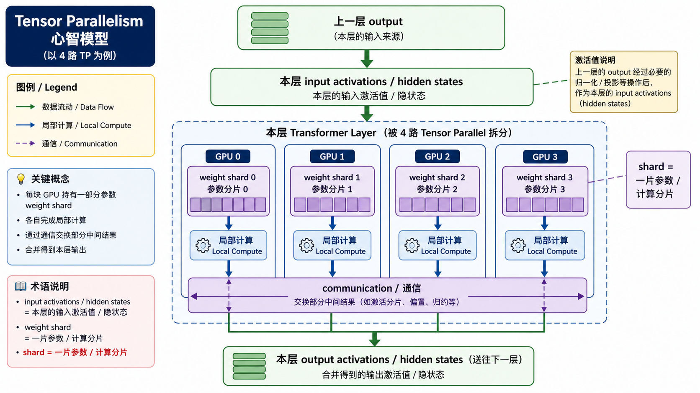
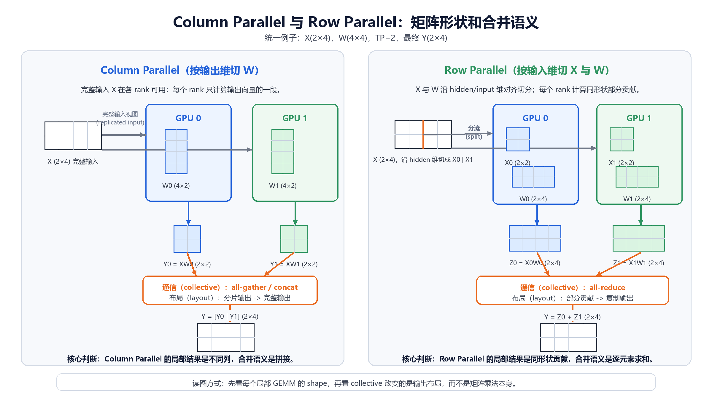
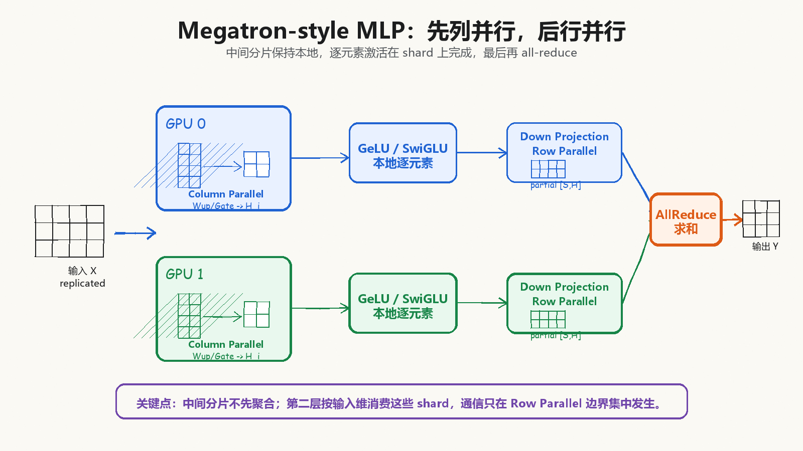
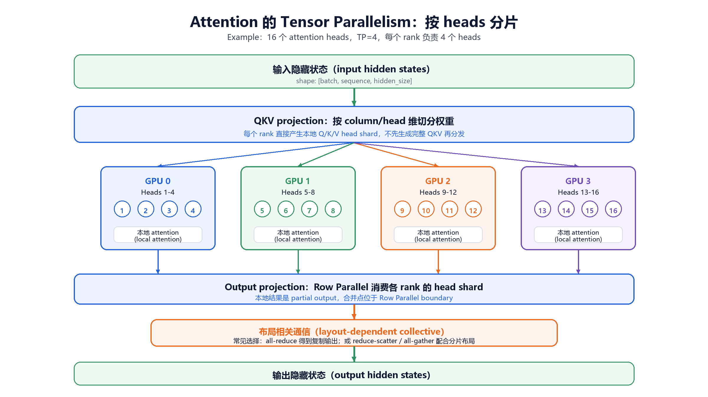
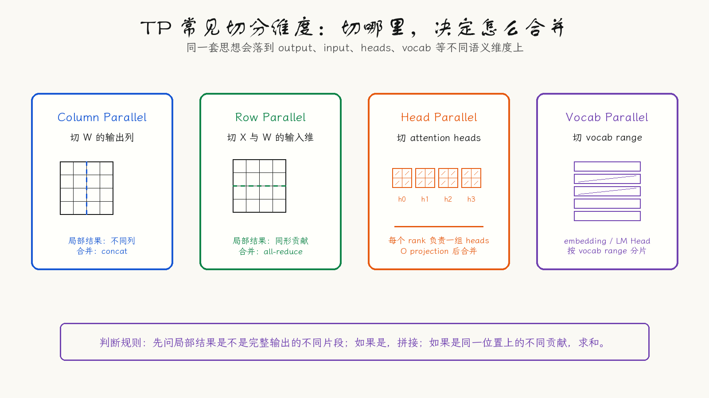
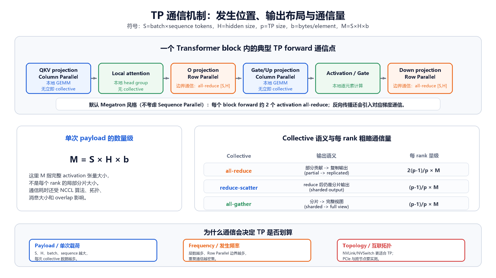
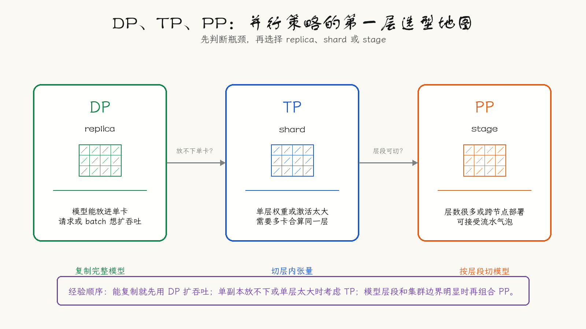

---
tags:
  - LLM
  - distributed-inference
  - tensor-parallelism
  - model-parallelism
updated: 2026-05-26
description: 从问题直觉、张量分片、矩阵机制、通信代价和框架实践解释 Tensor Parallelism，帮助理解大模型如何把同一层拆到多张 GPU 上共同计算。
---

# 大模型精讲系列 01：Tensor Parallelism（TP）是什么

> [!Quote] 本篇导读
> 大模型的并行策略不是一组孤立参数，而是一套围绕显存、计算和通信展开的工程语言。TP（Tensor Parallelism，张量并行）是其中最容易被误解、也最值得先讲透的一环：它让多张 GPU 共同计算同一个 Transformer 层。理解 TP，要同时抓住三件事：张量怎么切、局部结果怎么合并、通信成本为什么会成为关键瓶颈。

## 1. 从真实场景进入

### 1.1 为什么会遇到 TP

很多人第一次真正遇到 TP，不是在论文里，而是在一次看起来很普通的模型部署里。

模型文件已经下载好了，机器也有多张 GPU，按理说资源并不少。你启动服务，看到单卡 OOM，再打开 `nvidia-smi`，发现其他 GPU 仍然空着。直觉会觉得这很反常：明明总显存够，为什么模型不能自动铺到多张卡上？

原因在于，只要模型副本必须完整放进一张 GPU，剩下的 GPU 再空也帮不上忙。于是问题从调参数变成了一个更底层的系统问题：一个 Transformer layer 能不能被多张 GPU 一起算？

这就是 TP 出场的地方。它不是先假设读者已经懂分布式训练，也不是把多卡显存抽象成一个大池子；它关心的是模型层内部的矩阵、head、激活值和通信如何重新组织。

比如你想用 vLLM 启动一个较大的模型，文档里出现了这样的参数：

```bash
vllm serve $MODEL --tensor-parallel-size 4
```

或者你在 Hugging Face Transformers 里看到 `tp_plan="auto"`。再往前一步，可能是模型加载时直接 OOM：单张 GPU 的显存不够，哪怕机器里还有其他 GPU 空着，模型也没法完整放进其中一张卡。

这时直觉上容易冒出一个问题：既然有多张 GPU，为什么不能直接加起来用？TP 要回答的正是这个问题。但它的答案并不是简单把显存拼成一个大池子，而是要深入到 Transformer 层内部，重新安排权重、激活值、矩阵乘法和通信。

### 1.2 复制与拆分

大模型系统扩展通常有两条路。

第一条路是复制。模型本身能放进一张 GPU 时，可以复制多份模型，让不同 GPU 处理不同 batch 或不同请求。这就是 Data Parallelism，也就是 DP。

如果模型能完整放进一张 GPU，DP 很自然：

- GPU 0 跑一份模型，处理一批请求；
- GPU 1 跑另一份模型，处理另一批请求；
- 多张卡通过训练时的梯度同步，或推理时的请求路由来协作；

第二条路是拆分。大模型经常不是先遇到请求太多，而是先遇到一份模型副本本身就放不进单张 GPU。此时继续复制没有意义，因为 DP 的前提是每张 GPU 都能持有完整模型。

于是需要 Model Parallelism，也就是模型并行：把同一个模型拆到多张 GPU 上。TP 是模型并行里最重要的一类，它不是按请求切，也不是简单按层切，而是把一个 layer 内部的张量和计算拆开。

### 1.3 基础术语

在看 TP 总览图之前，需要先把几个词放稳，否则后面很容易把 activation、hidden state、shard 和 rank 混在一起。

| 术语 | 含义 | 在 TP 里的角色 |
| --- | --- | --- |
| hidden states | 模型运行时在每层之间传递的中间向量 | 当前层的输入通常就是上一层输出的 hidden states |
| input activations | 当前层接收到的运行时张量值 | 与 hidden states 在这里基本是同一批输入张量的不同说法 |
| weight shard | 完整权重矩阵被切开后的一片 | 每张 GPU 只保存和计算自己负责的 shard |
| rank | 分布式进程编号 | 实践中常常一个 rank 绑定一张 GPU，但概念上 rank 是进程身份 |

有了这几个词，后面的图才不会变成一堆看似熟悉、实际容易混淆的箭头。

### 1.4 定义与边界

**Tensor Parallelism 指的是：把一个模型层内部的张量参数和张量计算按某个维度切分到多个设备上，每个设备只保存和计算其中一个 shard，再通过 collective communication 把局部结果组合成数学上等价于完整层的输出。**

再短一点：

**TP = 多张 GPU 一起算同一个 layer。**

这句话要和 DP、PP 区分开：

| 并行方式 | 切分对象               | 一句话直觉                       |
| ---- | ------------------ | --------------------------- |
| DP   | 完整模型副本             | 多张 GPU 各自跑一份完整模型，处理不同请求或数据  |
| TP   | 单层内部的张量            | 多张 GPU 共同计算同一个 layer        |
| PP   | Transformer layers | 多张 GPU 各自负责不同 layer 或 stage |

现在可以把 TP 的第一层心智模型看清楚：



这张图把 TP 的运行路径压缩成了一个 Transformer layer。纵向看，上一层的 output 会成为本层的 input activations，也就是本层接收到的 hidden states；横向看，本层不再由单张 GPU 独自完成，而是被拆到 GPU 0、GPU 1、GPU 2、GPU 3 上并行执行。

每张 GPU 内部的 `weight shard` 是完整权重矩阵的一片分片。每张 GPU 先用自己的分片完成本地计算，再通过 `communication / 通信` 交换或合并局部结果，得到当前层约定的输出布局。这个输出有时是每张 GPU 都持有的完整 replicated output，有时会继续保持 sharded output，交给后续 TP 算子直接消费。

可以把 TP 的第一层心智模型压缩成一句话：

**上一层的 hidden states 进入当前层后，被多个 GPU 用各自的 weight shard 并行处理，再通过必要通信得到数学等价的当前层输出。**

## 2. 切分对象

### 2.1 分片对象

TP 切的不是一个抽象的模型文件，而是模型执行中的具体张量。

在 LLM 里，最常见的切分对象包括：

- Linear 层的权重矩阵；
- Attention 的 QKV projection；
- Attention heads；
- MLP 的 up、gate、down projection；
- Embedding 和 LM Head 的 vocab 维；
- 某些实现中的 activation 或 sequence/context 相关张量；

这些切分对象之所以适合 TP，是因为它们背后都能落回矩阵乘法、拼接、求和或 collective communication。

接下来要做的事，就是把这些对象具体落到矩阵和 attention head 上。只要理解 Column Parallel 和 Row Parallel，后面的 Attention、Vocab、部署选型都会顺很多。

### 2.2 切分约束

很多框架会要求 `tensor_parallel_size` 能整除某些模型维度。比如 attention heads 有 32 个，TP=4 时每张 GPU 负责 8 个 heads，很整齐；如果 TP=7，就会变得很别扭，甚至直接不被实现支持。

需要注意：TP 不是任意切一刀就行。好的 TP 切分要满足三个条件：

- 数学上能恢复完整输出；
- 局部计算尽量连续，避免频繁来回通信；
- 切分维度能匹配模型结构和硬件拓扑；

## 3. 矩阵机制

这一章是全文的信息密度最高处，可以按一条路线读：先用 Column Parallel 和 Row Parallel 建立【拼接】与【求和】的基本差异；再看 MLP 和 Attention 如何复用这两种切法；最后把 Vocab Parallel 放进完整机制地图里。这样读的时候就不必把每个小节都当成新的概念，它们本质上是在反复回答同一个问题：局部结果到底代表完整输出的一段，还是代表完整输出的一份贡献。

### 3.1 Column Parallel

假设一个线性层：
$$
Y = XW
$$
其中：

- $X \in \mathbb{R}^{b \times d}$；
- $W \in \mathbb{R}^{d \times 4d}$；
- $Y \in \mathbb{R}^{b \times 4d}$；

如果把 $W$ 按列切成 4 份：
$$
W = [W_0, W_1, W_2, W_3]
$$

每张 GPU 都拿到完整的 $X$，但只保存一个 $W_i$：
$$
Y_i = XW_i
$$

每张 GPU 的局部输出沿输出维排在不同位置。如果后续算子需要完整输出，可以把这些局部输出 all-gather 或拼接起来：
$$
Y = [Y_0, Y_1, Y_2, Y_3]
$$

Column Parallel 的直觉是：每张卡负责算出完整输出向量的一段。

但在 Megatron 风格的 MLP 或 Attention 配对设计里，第一层 Column Parallel 后通常不会立刻 all-gather。它会故意保持 sharded output，让后面的本地激活函数或 Row Parallel 层直接消费分片，从而省掉一次中间通信。

### 3.2 Row Parallel

Row Parallel 从另一个方向切。

如果输入 $X$ 已经沿 hidden 维切开：
$$
X = [X_0, X_1, X_2, X_3]
$$
那么权重可以按行切成：
$$
W =
\begin{bmatrix}
W_0 \\
W_1 \\
W_2 \\
W_3
\end{bmatrix}
$$
每张 GPU 计算一个局部贡献：
$$
Z_i = X_iW_i
$$
最终输出不是拼接，而是求和：
$$
Y = Z_0 + Z_1 + Z_2 + Z_3
$$

这个求和的通信方式要看后续布局：

- 如果希望每张 GPU 都得到完整的 $Y$，通常使用 all-reduce；
- 如果后续还会继续保持 sharded layout，可以使用 reduce-scatter，但 reduce-scatter 的结果仍然是分片输出，不是每张 GPU 都有完整 $Y$；

Row Parallel 的直觉是：每张卡负责算出完整输出的一部分贡献，最后所有卡把贡献加起来。

这一点是 TP 里最容易混淆的机制：Column Parallel 更像【拼接】，Row Parallel 更像【求和】。把两者并排看，会发现它们并不是同一种切法的左右翻转，而是输出语义完全不同：



左半边的 Column Parallel 中，GPU 0 和 GPU 1 各自产生输出向量的一段，最终如果需要完整输出，就沿输出维 concat 或 all-gather。右半边的 Row Parallel 中，两个 GPU 产生的是同一个输出位置上的不同贡献，所以需要 all-reduce 求和，才能让每张 GPU 得到 replicated full output。

图里的 `broadcast` 表示 Column Parallel 侧每个 rank 都需要以完整输入视图参与本地矩阵乘法，不要把它机械理解成每层都一定多做一次显式 broadcast 通信；具体实现里输入可能本来就已经以 replicated layout 存在。

如果后续算子继续消费分片布局，Row Parallel 也可以选择 reduce-scatter，但这不是 all-reduce 的随意替代品。它要求后续 layout 明确需要 sharded output，并且分片维度能被后续算子正确消费；在 Megatron Sequence Parallel 语境里，这类分片常沿 sequence 维，而在 DTensor 等系统里则取决于具体 layout contract。初学时可以先把默认心智模型记成：Row Parallel 若要完整副本输出，就 all-reduce。

用一个 TP=2 的玩具例子可以更直观地区分【拼接】和【求和】：

```text
Column Parallel：
W = [W0 | W1]
GPU 0: Y0 = XW0  -> 输出左半段
GPU 1: Y1 = XW1  -> 输出右半段
完整输出 Y = [Y0 | Y1]  # 拼接

Row Parallel：
X = [X0 | X1]
W = [W0
     W1]
GPU 0: Z0 = X0W0 -> 对完整输出的一部分贡献
GPU 1: Z1 = X1W1 -> 对完整输出的另一部分贡献
完整输出 Y = Z0 + Z1  # 求和
```

所以，Column Parallel 更像每张卡写出答案的一段；Row Parallel 更像每张卡各算一份草稿贡献，最后相加成答案。

### 3.3 MLP 中的组合

Megatron-LM 的经典做法是把 Transformer MLP 的两层线性层配对切分：

1. 第一层 $W_{up}$ 使用 Column Parallel；
2. 对 GeLU MLP，激活函数可以直接在本地 shard 上执行；对 SwiGLU 这类 gated MLP，`gate_proj` 和 `up_proj` 通常都使用 Column Parallel，本地先得到 gate shard 和 up shard，再执行 `SiLU(gate) * up`；
3. 第二层 $W_{down}$ 使用 Row Parallel；
4. 最后通过 all-reduce 合并 partial output；



这张图的重点在中间两步：第一层之后的中间激活保持分片，不立刻 all-gather；GeLU 的逐元素激活，或者 SwiGLU 的本地 gate/up 乘法，都可以在各自 shard 上完成。等到第二层 Row Parallel 产生 partial output 后，才通过 all-reduce 把各 GPU 的贡献相加，让每张 GPU 都得到完整的 $Y$。

这个设计的关键不是平均切参数，而是顺着 MLP 的计算结构把通信压到必要位置。第一层之后不急着通信，因为激活函数可以本地算；第二层之后必须通信，因为不同 GPU 算出来的是同一个输出向量的不同贡献。

### 3.4 Attention 中的组合

Attention 也天然适合 TP，因为 multi-head attention 本来就由多个 head 组成。

简化看，一个 attention 层是：

```text
hidden states
  -> QKV projection
  -> split heads
  -> attention per head
  -> output projection
```

如果有 32 个 attention heads，TP=4 时，常见做法是：

```text
GPU 0: heads 0-7
GPU 1: heads 8-15
GPU 2: heads 16-23
GPU 3: heads 24-31
```



图中展示的是一个 16 heads、TP=4 的例子。更准确地说，QKV projection 的权重本身会按 column/head 维度分片；每个 rank 直接用本地权重 shard 产生自己负责的 Q、K、V head shard，而不是先算出完整 QKV 再分发。随后，每张 GPU 只计算自己负责的一组 heads，output projection 通常以 Row Parallel 方式直接消费这些 head 分片，通信则更多发生在 output projection 之后，用于合并各 GPU 的 partial output。

这里最重要的细节是：不要把 Head Parallel 理解成【每张 GPU 算完 heads 后，立刻 all-gather 成完整 attention output，再做 output projection】。Megatron 风格的关键恰恰是让 output projection 直接消费分片，尽量把通信点推迟到必要位置。

在 GQA、MQA 或 MLA 等结构里，还要额外区分 `num_attention_heads` 和 `num_kv_heads`。Q heads 往往更容易按 attention heads 均匀分片，但 K/V heads 和 KV cache 的分摊会受到 `num_kv_heads`、TP size 和实现策略约束；这也是后面讨论长上下文显存时必须单独看 KV cache 的原因。

图中的 layout-dependent collective 表示不同框架会按输出布局选择 all-reduce、reduce-scatter 或 all-gather，不表示这些通信会按固定顺序全部发生。初学时可以先把默认心智模型记成：本地算 heads，output projection 消费分片，必要时再合并输出。

### 3.5 Vocab Parallel

除了 MLP 和 Attention，词表维度也常被 TP 利用。Embedding 和 LM Head 的权重矩阵通常很大，尤其 vocab size 很高时，把 vocab range 切到不同 rank 上可以减少单卡权重压力。

Embedding lookup 不是按 hidden 维简单拼接。更准确的过程是：每个 rank 只负责自己的 vocab range；输入 token id 会先根据 range 做 mask；本地只查命中本 rank 的 token，非本地 token 对应位置置零；然后通过 sum/reduce 类通信得到 embedding 输出。某些 layout 下也可能继续保持分片，但关键点是：它不是把不同 hidden 片段拼起来，而是按词表归属把命中结果合起来。

举一个 TP=2 的小例子：假设 vocab size 是 100000，rank 0 负责 `[0, 50000)`，rank 1 负责 `[50000, 100000)`。当输入 token id 是 `[42, 70000]` 时，rank 0 只命中 `42`，对 `70000` 的位置填零；rank 1 只命中 `70000`，对 `42` 的位置填零。两个 rank 的本地 embedding 再通过 sum/reduce 合起来，就得到与完整 embedding table 查找等价的输出。

LM Head 方向也类似。每个 rank 只计算自己 vocab shard 上的 logits；训练时常配合 vocab-parallel cross entropy，避免为了 loss 先 all-gather 完整词表 logits。但这并不等于 loss 完全无通信：为了得到全局 max、归一化分母、目标 token 对应 logits 等信息，仍然需要必要的跨 rank reduction。

### 3.6 机制地图

讲完 Column、Row、MLP、Attention 和 Vocab Parallel，再回头看完整的切分维度地图会更容易：



这张图不需要一次性读完。左侧两栏是基础：Column Parallel 按输出维切，Row Parallel 按输入维切；右侧两栏是结构化应用：Head Parallel 把这个思想放到 Attention heads 上，Vocab Parallel 把它放到 Embedding 和 LM Head 的 vocab range 上。

这里有两个细节值得单独记住。第一，Column Parallel 产生的是 sharded output，只有后续算子需要完整输出时才需要 all-gather；Row Parallel 产生的是 partial output，需要 replicated output 时通常用 all-reduce，如果后续继续保持分片布局，则可能用 reduce-scatter。第二，Head Parallel 里的 output projection 通常是 Row Parallel 思路：它消费各 rank 的 head shards，再在必要位置合并 partial output。

因此，TP 在 Transformer 中常常表现为两类模式反复出现：

- MLP：Column Parallel + Row Parallel；
- Attention：QKV/head 分片 + Row Parallel output projection；

把第 3 章的机制压缩成一张表，可以得到下面这个复盘视角：

| 切分方式 | 本地输出语义 | 常见通信 | 典型位置 | 初学误区 |
| --- | --- | --- | --- | --- |
| Column Parallel | 完整输出的一段 | 需要完整输出时 all-gather 或 concat | QKV、MLP up/gate | 以为每次都要立刻 all-gather |
| Row Parallel | 完整输出的一份贡献 | 需要 replicated output 时 all-reduce | attention output projection、MLP down | 误以为它和 Column 一样是拼接 |
| Head Parallel | 一组本地 attention heads | output projection 后按布局合并 | Multi-head Attention | 误以为先算完整 QKV 再分发 |
| Vocab Parallel | 一段 vocab range 的 lookup/logits | embedding 侧 sum/reduce，loss 侧尽量本地化 | Embedding、LM Head、Cross Entropy | 误以为它按 hidden 维拼接 embedding |

## 4. 通信机制

前面解决的是 TP 怎样在数学上算对：哪些张量能切，局部结果怎样恢复等价输出。第 4 章开始换一个视角：这样算会付出多少通信成本，以及为什么通信几乎决定了 TP 是否值得。

### 4.1 通信发生在哪里

TP 的收益很清楚：权重和计算被多张 GPU 分摊。但它的代价也很直接：在典型 Megatron-style dense Transformer block 中，collective communication 通常会进入每一层的关键路径。



这张图不再把多个层画成几条看不出差别的横线，而是把一个 Transformer block 内最常见的 TP 通信点摊开看。

在 Megatron 风格的默认心智模型里，可以先这样理解：

- Attention 的 QKV projection 是 Column Parallel，产生本地 Q/K/V head shard，通常不需要立刻通信；
- 本地 attention 在各 rank 自己负责的 head group 上完成；
- attention output projection 是 Row Parallel，它消费 head shard，产生 partial output，通常需要一次 all-reduce；
- MLP 的 gate/up projection 是 Column Parallel，中间激活或门控乘法可以在本地 shard 上完成；
- MLP 的 down projection 是 Row Parallel，产生 partial output，通常再通过一次 all-reduce 合并；

因此，在不考虑 Sequence Parallel 等优化时，一个 Transformer block 的 forward 可以粗略记成：**两个主要 activation all-reduce 点**，分别对应 attention output projection 和 MLP down projection。Megatron-LM 论文中用互为共轭的通信算子来安排 forward/backward，就是为了把这些通信点压到必要位置，而不是每个 GEMM 后都通信。

需要注意，这不是所有框架、所有模型、所有并行组合的逐行执行规范。实际系统可能会引入 sequence parallel、context parallel、communication overlap、fused kernels 或不同输出布局。但作为入门心智模型，先知道【通信点通常藏在 Row Parallel 的边界】非常重要。

### 4.2 通信量估算

讨论 TP 通信时，不能只说【有通信】。更有用的问题是：一次通信大约搬多少数据，搬多少次，走什么链路。

设：

- $S$ 表示当前 TP group 内参与一次前向计算的 token 数，可以粗略理解为 $batch \times sequence$；
- $H$ 表示 hidden size；
- $b$ 表示每个元素的字节数，例如 FP16/BF16 通常是 2 bytes；
- $p$ 表示 TP size；

这里的 $M$ 按【完整 activation 张量】的字节数估算，而不是按每个 rank 的本地 shard 大小估算。不同 collective 的本地输入/输出 shard 大小不同，但下表统一用完整张量大小作为基准，方便比较量级。

一次 activation 通信的原始张量大小可以先估成：
$$
M = S \times H \times b
$$

如果使用 ring-style 估算，常见 collective 的每 rank 通信量级可以写成：

| Collective | 输出布局 | 每 rank 量级估算 |
| --- | --- | --- |
| all-reduce | replicated output | $\frac{2(p-1)}{p}M$ |
| reduce-scatter | sharded output | $\frac{p-1}{p}M$ |
| all-gather | full / replicated view | $\frac{p-1}{p}M$ |

这组公式不是在预测某个集群的精确耗时，而是在帮你建立数量级直觉：all-reduce 通常可以看成 reduce-scatter + all-gather 的组合，因此它的通信量级约是两者之和。实际耗时还会受 NCCL 算法、链路拓扑、消息大小、并发通信、kernel overlap 和框架调度影响。

把它放回 Transformer block。如果一个 block 的 forward 有两个主要 activation all-reduce，那么每 rank 的通信量级大约是：
$$
2 \times \frac{2(p-1)}{p} \times S \times H \times b
$$

对 $L$ 层模型，forward 粗略就是：
$$
2L \times \frac{2(p-1)}{p} \times S \times H \times b
$$

举一个数字感强一点的例子：如果 $S=4096$，$H=8192$，$b=2$，则 $M \approx 64$ MiB。TP=4 时，单次 all-reduce 每 rank 的通信量级约为：
$$
\frac{2(4-1)}{4} \times 64\text{ MiB} \approx 96\text{ MiB}
$$

如果每层 forward 有两次这样的 all-reduce，单层就是约 192 MiB；32 层 forward 就已经是约 6 GiB 的每 rank 通信量级。这个数字还没有把 backward、额外 layout 转换、跨节点链路、并发请求和框架运行时细节算进去。

所以，TP 不是把显存问题免费消掉，而是把部分显存和计算压力转换成更高频的通信压力。

### 4.3 输出布局

通信算子对应的输出布局要分清，因为很多 TP 误解都来自把它们当成固定流水线：

- `all-reduce`：对 partial output 求和，并让每张 GPU 都得到 replicated output；
- `reduce-scatter`：先 reduce 再 scatter，结果仍是 sharded output，具体分片维度取决于实现与 layout contract；
- `all-gather`：把 sharded output 聚合成 replicated/full view；

在 Row Parallel 后，如果后续算子希望每个 rank 都持有完整 hidden states，就使用 all-reduce 的心智模型最直接。如果后续希望继续保持 sharded layout，就可能使用 reduce-scatter，让每个 rank 只拿到 reduce 后的一块输出。之后如果某个算子又需要 full view，再用 all-gather。

Sequence Parallel 的核心直觉也在这里：不要总是把所有 activation 都恢复成 replicated output，而是让一部分 activation 沿 sequence 维保持分片，从而降低 activation 显存压力。但这会把一些原本的 all-reduce 拆成 reduce-scatter 与 all-gather，并让后续算子必须理解新的 layout。换句话说，reduce-scatter 只说明输出还是分片；分片到底沿 hidden、sequence 还是其他 mesh 维度，要看具体框架的 layout 约定。

所以，通信不是一个孤立算子选择，而是 layout contract：当前层输出是什么布局，下一层或下一个算子是否能消费这种布局。

### 4.4 拓扑与观测

通信量只是第一层判断，真正部署时还要看互联拓扑。

NVLink/NVSwitch 更适合较大 TP，因为它能承受高频 activation collective。PCIe 环境不是一定不能 TP，但需要用真实 workload benchmark；跨节点 TP 则要格外谨慎，因为它可能把每一层的高频通信放到最慢的链路上。

观测 TP 通信时，不要只看显存是否下降。更应该同时看：

- 每层或每次请求里的 NCCL collective 耗时；
- GPU utilization 是否被通信等待拉低；
- TTFT、TPOT、吞吐随 TP size 增大是否真的改善；
- batch size、sequence length、KV cache 策略改变后，通信 payload 是否随之变大；
- 是否存在跨 NUMA、跨 PCIe switch、跨节点导致的异常慢链路；

TP 的工程本质可以概括为：

**TP 用通信换显存和计算并行。网络越强，这笔交易越划算；网络越弱，这笔交易越危险。**

## 5. 部署与框架

### 5.1 DP、TP、PP 选型

这一章会把前面的机制放回主流框架。先分清来源边界：Megatron 部分更偏论文原理与经典实现范式；vLLM、Transformers 和 PyTorch 部分更偏当前框架入口和部署约束。具体参数、支持模型和推荐组合会随版本变化，落地时仍应以对应版本官方文档为准。

理解了通信成本之后，TP 就不能再被看成单纯的显存开关。部署时真正要判断的是：哪些通信留在节点内，哪些边界适合跨节点，哪些场景其实更适合复制副本或切 layer。

下面这张图把 TP 放回 DP、PP 的坐标系里。读它时可以先抓住三个关键词：DP 是 replica，TP 是 shard，PP 是 stage。



DP 的核心是 replica：每张 GPU 有完整模型副本，不同请求分给不同副本；TP 的核心是 shard：同一层被拆到多张 GPU 上，依赖高速互联；PP 的核心是 stage：不同 GPU 或节点负责不同层段，层间传递 activation。

右侧决策指南可以先作为最小判断：单卡放得下且目标是吞吐，通常先评估 DP 或多实例；单卡放不下但单节点多卡能放，通常评估 TP；跨节点才能放下模型时，常见组合是 TP + PP。这里说的是起点，不是铁律；低延迟目标、batching 策略、KV cache 压力和框架调度都可能改变最终选择。

把这张图翻译成部署心法就是：

| 场景 | 常见起点 | 原因 |
| --- | --- | --- |
| 模型单卡可放下，但请求量大 | DP 或多实例 | 用复制副本换吞吐 |
| 模型单卡放不下，单节点多卡可放下 | TP | 同一层横向切到多卡 |
| 模型单节点也放不下 | TP + PP | 节点内 TP，节点间 PP |
| 单节点 GPU 互联较弱 | 较小 TP 或 PP | 避免层内高频通信拖慢 |
| MoE expert 很多 | EP + DP/TP | expert 层本身适合独立切分 |

真正上线前，仍然要用真实 workload benchmark 验证 TTFT、TPOT、吞吐、显存水位和 NCCL 耗时；并行策略的名字不能替代测量结果。

### 5.2 规模选择

选择 TP size 时，不要只看 GPU 数，要按四个问题判断：

1. 模型单卡能放下吗？
   - 能放下：先考虑单卡、DP 或多实例；
   - 放不下：再考虑 TP；

2. 单节点多卡能放下吗？
   - 能放下：优先把 TP 控制在节点内；
   - 放不下：考虑 TP + PP；

3. 互联够快吗？
   - NVLink/NVSwitch：较适合较大 TP；
   - PCIe：需要真实 workload benchmark；
   - 跨节点网络：尽量谨慎，通常优先用 PP 跨节点；

4. 模型维度能整除吗？
   - attention heads、hidden size、intermediate size、vocab size 都可能影响 TP plan；
   - 报错时不要只看显存，也要看模型结构是否支持当前 TP size；

### 5.3 部署案例

假设要在单节点 4 张高互联 GPU 上部署一个较大的 dense LLM，单卡放不下，但 4 卡合起来可以放下。

这时通常会先考虑：

```text
TP = 4
PP = 1
DP = 1
```

原因是：模型的每一层可以横向切到 4 张 GPU 上，层内通信留在同一个节点内部。如果这个节点有 NVLink 或 NVSwitch，TP 的通信成本更可能被硬件带宽覆盖。

如果同一个模型需要跨 2 个节点部署，而每个节点仍然是 4 张 GPU，更常见的思路会变成：

```text
TP = 4       # 每个节点内部
PP = 2       # 两个节点之间
DP = 1
```

这样做的目的不是证明 TP 不能跨节点，而是尽量避免把每一层里高频发生的 TP collective communication 放到跨节点网络上。跨节点更适合承担相对低频的 stage 间 activation 传递。

反过来，如果 8 张 GPU 分布在 2 个节点上，直接设置 `TP=8` 会让每一层的 TP 通信跨节点发生。除非跨节点网络非常强，否则这通常比【节点内 TP=4 + 节点间 PP=2】更危险，因为它会把最频繁的通信放到最慢的链路上。

这个例子也提醒读者：TP size 不是看到几张卡就设几，而是要看模型是否放得下、互联是否足够快、通信是否会进入最热路径。

推理场景还要额外看 KV cache。很多 TP 推理实现会按 head 或 KV head 维度分摊一部分 KV cache，但这不等于 KV cache 问题自动消失。请求越长、并发越高，KV cache 占用越大；如果模型使用 GQA、MQA、MLA 等结构，KV head 数、cache 布局和实现细节也会影响分摊效果。以 vLLM 的语境为例，plain TP 通常沿 KV heads 维度切 KV cache；当 TP size 超过 KV heads 时，可能出现 KV cache duplication，此时常需要进一步考虑 context 维度上的切分能力。有些服务不是被模型权重卡住，而是被 KV cache、batch 调度或通信热路径卡住。

### 5.4 Megatron-LM

Megatron-LM 是理解 TP 的经典源头。它提出的不是泛泛地把矩阵切开，而是一套适合 Transformer 的 intra-layer model parallel 方法：

- MLP 使用 Column Parallel + Row Parallel；
- Attention 按 heads 切分；
- 通过少量 collective communication 恢复数学等价；
- 能与 Pipeline Parallelism 和 Data Parallelism 组合；

典型参数名是：

```bash
--tensor-model-parallel-size 4
```

NVIDIA 后续的 Megatron Core 把 TP、PP、DP、EP、CP 等并行方式整理成更系统的训练组件。

### 5.5 vLLM

vLLM 支持 tensor-parallel inference 和 pipeline-parallel inference。单节点 4 GPU 推理时，常见写法是：

```bash
vllm serve facebook/opt-13b \
  --tensor-parallel-size 4
```

离线推理也可以在 `LLM` 初始化时指定：

```python
from vllm import LLM

llm = LLM("facebook/opt-13b", tensor_parallel_size=4)
```

如果模型大到单节点也放不下，vLLM 文档给出的常见思路是：

```text
tensor_parallel_size = 每个节点的 GPU 数
pipeline_parallel_size = 节点数
```

也就是把高频 TP 通信尽量留在节点内，把跨节点扩展交给 PP。

还要注意一个边界：如果单节点 GPU 之间没有 NVLink，或者模型层数不能均匀切分到 GPU，PP 有时会比更大的 TP 更合适。vLLM 文档也提示，在某些无 NVLink 的环境里，可以考虑用 PP 替代或减少 TP。

### 5.6 Transformers 与 PyTorch

Hugging Face Transformers 中，部分模型支持原生 TP plan。前提是模型配置中声明了可用的 TP plan，例如 `base_model_tp_plan`：

```python
from transformers import AutoModelForCausalLM

model = AutoModelForCausalLM.from_pretrained(
    "Qwen/Qwen3-0.6B",
    dtype="auto",
    tp_plan="auto",
)
```

这里的 `tp_plan` 表示模型加载和层内计算层面的张量并行计划。它和把不同模块放到不同设备上的 `device_map` 不是同一种心智模型，也不应该混用。

PyTorch 的 `torch.distributed.tensor.parallel` 则提供更底层的构件：

```python
from torch.distributed.device_mesh import init_device_mesh
from torch.distributed.tensor.parallel import (
    parallelize_module,
    ColwiseParallel,
    RowwiseParallel,
)

tp_mesh = init_device_mesh("cuda", (8,))
model = parallelize_module(
    model,
    tp_mesh,
    {
        "w1": ColwiseParallel(),
        "w2": RowwiseParallel(),
    },
)
```

这和前面的矩阵解释是同一件事：用 `ColwiseParallel` 和 `RowwiseParallel` 组合出合适的 sharding computation。

## 6. 误区与总结

### 6.1 常见误区

**误区一：TP = 多 GPU 一定更快。**

不一定。TP 降低单卡显存和计算压力，但增加通信。如果模型不大、batch 很小、互联较弱，TP 可能更慢。

**误区二：TP = 请求被分给不同 GPU。**

这更像 DP 或负载均衡。TP 场景下，一个请求通常会进入一个 TP group，由多张 GPU 共同完成一次 forward。

**误区三：TP size 越大越好。**

TP size 变大后，每张卡的局部计算减少，但 collective communication 的参与设备也变多。TP size 是平衡点，不是越大越好。

**误区四：TP 会自动解决所有显存问题。**

TP 主要解决权重和层内计算的分摊，但推理显存还会被请求长度、并发数和 KV cache 强烈影响。KV cache 可以理解为模型为了继续生成后续 token 而保存的历史 key/value 状态；上下文越长、并发请求越多，KV cache 越大。

很多 TP 推理实现会把 KV cache 随 head 或 KV head 一起分摊，但这只是降低压力，不是把它从系统里删除。KV cache 是否能随 TP 均匀下降，取决于 `num_kv_heads`、TP size 和具体实现；当 KV heads 很少，甚至少于 TP size 时，某些实现会复制 KV cache，导致收益不如直觉预期。除此之外，activation、CUDA graph、workspace、通信 buffer、LoRA/adapter 状态和框架运行时状态也都会占显存。

### 6.2 检查清单

真正部署 TP 前，可以按下面的清单过一遍：

- 模型单卡是否能放下；
- 如果单卡能放下，是否真的需要 TP，而不是 DP 或多实例；
- attention heads、hidden size、intermediate size、vocab size 是否支持目标 TP size；
- GPU 间是否有足够强的互联；
- 是否需要把 TP 控制在节点内，并用 PP 跨节点；
- 是否用真实 workload 测过 TTFT、TPOT、吞吐、GPU 利用率和 NCCL 通信耗时；
- KV cache 是否才是真正瓶颈；

### 6.3 最终心智模型

TP 的核心不是一个命令行参数，而是一种看待 Transformer 层的方式。

Transformer 层不是不可拆的黑盒。它由可切分的矩阵乘法、attention heads、embedding 和 projection 组成。TP 正是利用这些结构，把同一层内部的权重和计算拆到多张 GPU 上，再通过通信恢复数学等价性。

所以，当你看到 `tensor_parallel_size`、`ColumnParallelLinear`、`RowParallelLinear`、`all-reduce`、`NVLink`、`TP + PP` 这些词时，可以把它们统一放回同一个问题：

**如何用多张 GPU 共同完成一个大到单卡无法承担的 Transformer layer。**

## 7. 参考资料

1. [Megatron-LM: Training Multi-Billion Parameter Language Models Using Model Parallelism](https://arxiv.org/abs/1909.08053)：Megatron-LM 原始论文，提出适合 Transformer 的 intra-layer model parallel 方法；
2. [Efficient Large-Scale Language Model Training on GPU Clusters Using Megatron-LM](https://arxiv.org/abs/2104.04473)：系统讨论 tensor、pipeline、data parallelism 的组合和大规模训练权衡；
3. [Mesh-TensorFlow: Deep Learning for Supercomputers](https://arxiv.org/abs/1811.02084)：从 tensor 维度可切分的角度讨论模型并行和 SPMD 编程；
4. [GPipe: Efficient Training of Giant Neural Networks using Pipeline Parallelism](https://arxiv.org/abs/1811.06965)：理解 PP 与 TP 区别时很有帮助；
5. [ZeRO: Memory Optimizations Toward Training Trillion Parameter Models](https://arxiv.org/abs/1910.02054)：用于区分 TP 与 ZeRO/FSDP 这类训练状态分片方法；
6. [NVIDIA/Megatron-LM GitHub](https://github.com/NVIDIA/Megatron-LM)：Megatron-LM 与 Megatron Core 仓库，包含 TP、PP、DP、EP、CP 等并行组件；
7. [Megatron Core tensor_parallel package](https://docs.nvidia.com/megatron-core/developer-guide/latest/api-guide/tensor_parallel.html)：Megatron Core 的 tensor parallel API 文档；
8. [vLLM Parallelism and Scaling](https://docs.vllm.ai/en/stable/serving/parallelism_scaling/)：vLLM 对单节点、多节点、TP、PP 选择的部署建议；
9. [Hugging Face Transformers Tensor Parallelism](https://huggingface.co/docs/transformers/main/tensor_parallelism)：Transformers 中 `tp_plan` 的使用方式和约束说明；
10. [PyTorch Tensor Parallelism API](https://docs.pytorch.org/docs/stable/distributed.tensor.parallel.html)：`parallelize_module`、`ColwiseParallel`、`RowwiseParallel`、`SequenceParallel` 等底层接口；
11. [Hugging Face Ultra-Scale Playbook](https://huggingface.co/spaces/nanotron/ultrascale-playbook)：适合建立 DP、TP、PP、SP、CP、ZeRO 等多维并行的全局视角；
12. [vLLM Distributed Inference Blog](https://vllm-project.github.io/2025/02/17/distributed-inference.html)：从推理部署角度理解并行策略如何进入生产系统；
13. [vLLM Context Parallel Deployment](https://docs.vllm.ai/en/latest/serving/context_parallel_deployment/)：用于理解 TP 与 KV cache、KV heads、DCP 等推理上下文切分能力的关系；
14. [NCCL User Guide: Collective Operations](https://docs.nvidia.com/deeplearning/nccl/user-guide/docs/usage/collectives.html)：用于核对 all-reduce、reduce-scatter、all-gather 等 collective 的基本语义；
15. [NVIDIA nccl-tests Performance](https://github.com/NVIDIA/nccl-tests/blob/master/doc/PERFORMANCE.md)：用于建立 bus bandwidth 与 ring-style collective 通信量估算的数量级直觉；
16. [Megatron Core tensor_parallel mappings](https://docs.nvidia.com/megatron-core/developer-guide/latest/apidocs/core/core.tensor_parallel.mappings.html)：用于核对 Megatron Core 中 tensor parallel 通信映射关系；
17. [Megatron Core VocabParallelCrossEntropy](https://docs.nvidia.com/megatron-core/developer-guide/latest/apidocs/core/core.tensor_parallel.cross_entropy.html)：用于核对 vocab-parallel logits 与 cross entropy 的语义；

## 8. 学习测评

### 8.1 题目

1. 单选：TP 最准确的描述是？
   A. 多张 GPU 各自保存完整模型，处理不同请求；
   B. 多张 GPU 按 Transformer layer 或 stage 切分模型；
   C. 多张 GPU 共同计算同一个 layer 内部的张量和算子；
   D. 多张 GPU 只分摊 optimizer state、gradient 和参数副本，不改变层内 forward 计算；

2. 单选：在本文语境里，上一层的 hidden states 到达当前层后，通常可以被称为什么？
   A. 当前层的 input activations；
   B. 当前层的 optimizer state；
   C. 当前层的 vocab shard；
   D. 当前层的 pipeline bubble；

3. 多选：TP 中的 `weight shard` 通常意味着什么？
   A. 完整权重矩阵的一部分；
   B. 每张 GPU 只保存自己负责的权重分片；
   C. 每张 GPU 都保存完整权重，只是不参与计算；
   D. 由 weight shard 参与产生的局部计算结果通常需要在某些边界通过通信协作，以恢复数学等价；

4. 单选：Column Parallel 线性层最典型的切分方式是？
   A. 把输入 batch 分给不同 GPU；
   B. 把权重矩阵按输出维或列方向切分；
   C. 把 Transformer layers 分给不同 GPU；
   D. 把 Embedding 的 vocab range 分给不同 GPU；

5. 单选：Row Parallel 在需要 replicated/full output 时，局部结果为什么通常需要 all-reduce？
   A. 因为每张 GPU 产生的是同一个输出向量的 partial output，需要求和并复制给所有 rank；
   B. 因为每张 GPU 产生的是不同 vocab range 上的 logits，需要按词表维拼接；
   C. 因为每张 GPU 只产生输出向量的一段，需要沿输出维 all-gather；
   D. 因为 Row Parallel 会把不同 pipeline stage 的 activation 合并；

6. 多选：关于 `all-reduce`、`reduce-scatter`、`all-gather` 的说法，哪些正确？
   A. `all-reduce` 常用于把 partial output 求和，并让每张 GPU 得到 replicated output；
   B. `reduce-scatter` 的结果仍然是 sharded output；
   C. `all-gather` 可以把 sharded output 聚合成 replicated/full view；
   D. 三者在每个 TP GEMM 后都会按固定顺序全部执行；

7. 单选：Megatron 风格的 MLP TP 为什么常把第一层设为 Column Parallel，第二层设为 Row Parallel？
   A. 为了让中间激活在本地 shard 上继续计算，并把通信推迟到必要位置；
   B. 为了让每张 GPU 都持有完整中间激活；
   C. 为了避免任何 collective communication；
   D. 为了把 batch size 自动扩大到 TP size 倍；

8. 多选：对 SwiGLU 这类 gated MLP，哪些理解更准确？
   A. `gate_proj` 和 `up_proj` 常采用同样的 Column Parallel 分片布局；
   B. 本地得到 gate shard 和 up shard 后，可以在本地执行 `SiLU(gate) * up`；
   C. gated MLP 必须先 all-gather 完整中间激活才能做门控乘法；
   D. `down_proj` 常与 Row Parallel 配合，用于消费分片中间激活；

9. 单选：Attention TP 中更准确的 QKV/head 分片理解是？
   A. 先在每张 GPU 上算出完整 QKV，再把完整 QKV 平均复制给其他 GPU；
   B. QKV projection 权重按 column/head 维度分片，每个 rank 直接产生本地 Q、K、V head shard；
   C. Attention heads 不能被切分，只能切 batch；
   D. output projection 与 head 分片无关；

10. 多选：以下哪些因素会影响 TP size 的选择？
    A. attention heads、hidden size、intermediate size、vocab size 是否可整除或被实现支持；
    B. GPU 间互联是否足够快；
    C. 模型单卡是否能放下，以及是否需要跨节点才能放下；
    D. 是否可以用 CPU offload 代替所有 GPU 间通信判断；

11. 单选：为什么跨节点 TP 通常需要谨慎？
    A. 因为 TP collective communication 可能出现在每一层关键路径上，跨节点链路会放大延迟和带宽瓶颈；
    B. 因为跨节点通信一定比节点内通信更快，容易导致 TP size 被设置得过小；
    C. 因为 PP 的 stage 间通信一定比 TP 的层内通信更频繁，所以应该永远避免 PP；
    D. 因为 TP 会让每个节点保存完整模型副本，失去模型并行效果；

12. 单选：当模型单卡放得下，但请求量很大时，通常优先考虑什么？
    A. DP、多实例或请求级负载均衡；
    B. 盲目增大 TP size；
    C. 优先用 PP 把 layers 切到多张 GPU，即使每张 GPU 都能放下完整模型；
    D. 用 ZeRO/FSDP 式训练状态分片作为推理吞吐扩展的首选策略；

13. 多选：关于 TP 与 KV cache 的关系，哪些说法更准确？
    A. TP 主要分摊权重和层内计算；
    B. 一些推理实现会按 head 或 KV head 分摊 KV cache；
    C. TP 一定能彻底消除 KV cache 显存压力；
    D. 长上下文和高并发仍可能让 KV cache 成为瓶颈；

14. 单选：在 Hugging Face Transformers 里，`tp_plan="auto"` 更接近哪种含义？
    A. 模型加载和层内计算层面的张量并行计划；
    B. 模块级设备放置计划，等价于把不同子模块放到不同 GPU；
    C. 训练状态分片计划，主要用于 optimizer state 和 gradient；
    D. 请求路由计划，用于把不同用户请求分配到不同 replica；

15. 多选：关于 Vocab Parallel 的理解，哪些正确？
    A. 它可以把 Embedding 或 LM Head 的 vocab range 切到不同 rank；
    B. Embedding lookup 常需要根据本 rank 负责的 vocab range 做 mask 和本地查找；
    C. Vocab Parallel Cross Entropy 可以避免为了 loss 聚合完整词表 logits；
    D. 它与 TP 无关，只属于 Data Parallel；

16. 单选：读完本文后，看到 `tensor_parallel_size=4` 最应该先追问什么？
    A. 模型结构、显存、互联、通信布局和实际 workload 是否支持这个 TP size；
    B. 为什么不是把 batch size 固定设为 4；
    C. 是否应该直接把 `pipeline_parallel_size` 也设成 4，形成更多 stage；
    D. 是否可以继续增大到所有可见 GPU 数，默认更大 TP 一定更快；

17. 单选：`tp_plan="auto"` 与 `device_map` 的心智模型差异更接近哪一种？
    A. `tp_plan` 描述层内张量并行计划，`device_map` 更偏模块或子模块放置；
    B. `tp_plan` 和 `device_map` 都是请求级负载均衡策略，只影响吞吐；
    C. `tp_plan` 主要描述 optimizer state 分片，`device_map` 主要描述 loss 分片；
    D. `tp_plan` 只影响 tokenizer，`device_map` 只影响 KV cache；

18. 多选：一个单节点 8 卡环境没有 NVLink，只通过 PCIe 互联。模型单卡放不下，但 4 卡可能放得下。部署前更合理的判断是？
    A. 不要直接假设 TP=8 一定更快；
    B. 需要用真实 workload benchmark TP、PP 或较小 TP 组合；
    C. 如果层数和框架支持，PP 或 TP+PP 可能比 TP=8 更能控制 PCIe 上的层内通信开销；
    D. 因为有 8 张卡，所以通信成本可以忽略；

19. 多选：长上下文推理服务已经用 TP 放下模型权重，但仍然频繁 OOM。下一步应该优先排查什么？
    A. KV cache 是否因上下文长度和并发数快速增长；
    B. `num_kv_heads`、TP size 和实现是否导致 KV cache 分摊不均或复制；
    C. CUDA graph、workspace、通信 buffer、adapter 状态等额外显存；
    D. 继续增大 TP size，并假设 KV cache 会严格随 GPU 数线性下降；

20. 多选：设 $S=4096$，$H=8192$，$b=2$ bytes，TP size $p=4$。按本文的 ring-style 量级估算，哪些判断正确？
    A. 一次 activation 张量大小 $M=S \times H \times b$，约为 64 MiB；
    B. 单次 all-reduce 每 rank 通信量级约为 96 MiB；
    C. 单次 reduce-scatter 每 rank 通信量级约为 48 MiB；
    D. 因为 TP=4，所以单次 all-reduce 每 rank 通信量一定只有 16 MiB；

### 8.2 答案与题解

错题回看建议：1-3 题回看第 1 章；4-9、15 题回看第 3 章；10-12、16、18 题回看第 5 章；13、19 题回看第 5.3 节和第 6 章；20 题回看第 4.2 节；14、17 题回看第 5.6 节。

1. C。TP 的核心是多张 GPU 共同计算同一个 layer 内部的张量和算子；A 更像 DP，B 更像 PP，D 更像 ZeRO/FSDP 一类训练状态分片；

2. A。上一层输出进入当前层后，就是当前层接收到的运行时张量，因此可称为当前层的 input activations；

3. A、B、D。`weight shard` 是完整权重的一片，本地 rank 保存并计算自己的分片；由这些分片产生的局部结果，通常需要在某些边界通过通信与其他 rank 协作；C 与 TP 的分片目的相反；

4. B。Column Parallel 的典型做法是按输出维或列方向切权重，让每张 GPU 产生输出向量的一段；

5. A。Row Parallel 中每张 GPU 计算的是同一个输出张量上的 partial contribution，所以在需要 replicated/full output 时，合并方式是逐元素求和并复制给所有 rank。B 更像 Vocab Parallel 的 logits 语义；C 更像 Column Parallel 的输出维拼接；D 混入了 Pipeline Parallel 的 stage 概念；

6. A、B、C。三种 collective 对应不同输出布局。`all-reduce` 的结果是每个 rank 都有完整 reduce 结果；`reduce-scatter` 的结果仍是分片；`all-gather` 则从分片恢复 full view。D 错在把它们理解成每个 GEMM 后固定执行的流水线，实际选择取决于当前 layout 和后续算子能消费什么 layout；

7. A。第一层 Column Parallel 产生的中间分片可以被本地激活函数或本地门控继续消费，第二层 Row Parallel 后再合并 partial output，减少不必要的中间通信；

8. A、B、D。SwiGLU 的 gate/up 通常采用匹配的 Column Parallel 分片布局，可以本地配对计算，`down_proj` 再用 Row Parallel 消费分片；C 过度要求 all-gather，会破坏 Megatron 风格的通信优化；

9. B。常见 Attention TP 不是先算完整 QKV 再分发，而是直接让每个 rank 用本地权重 shard 产生本地 heads；

10. A、B、C。TP size 受模型维度、硬件互联、显存与部署边界共同影响；CPU offload 可能影响加载或兜底策略，但它不能替代对 TP 通信路径、输出布局和链路瓶颈的判断；

11. A。TP 的通信频率高，很多 collective 会出现在每层关键路径里。跨节点链路通常在延迟、带宽和稳定性上弱于节点内 NVLink/NVSwitch，因此跨节点 TP 可能把最热的通信放到最弱的链路上。B、C、D 都是常见误判：跨节点通信并不天然更快，PP 也不是永远更频繁，TP 也不是让每个节点复制完整模型；

12. A。如果模型单卡能放下，吞吐扩展通常先考虑复制副本或请求级并行，而不是把同一层拆得更碎。PP 主要解决模型按层放不下或跨节点切层的问题，ZeRO/FSDP 主要面向训练状态和参数分片；它们都不是单卡可放下、请求量很大时的默认推理吞吐首选；

13. A、B、D。TP 可以分摊权重和部分 KV cache 压力，但它不能让 KV cache 消失。长上下文会增加每个请求的历史 key/value 状态，高并发会让这部分状态成倍堆积；同时，KV cache 是否能均匀随 TP 分摊，还取决于 KV heads 数量和具体实现。当 KV heads 少于 TP ranks 时，一些实现可能出现复制或不均匀分摊，所以 C 的绝对说法是错的；

14. A。`tp_plan="auto"` 表示使用模型支持的张量并行计划，把参数和层内算子按 TP plan 分片。`device_map` 更偏把完整模块或子模块放到不同设备上，两者不是同一个心智模型，也不应该把 `tp_plan` 理解成普通模块级搬家；

15. A、B、C。Vocab Parallel 是 TP 在 embedding/logits 维度上的常见应用；D 错在把它排除在 TP 之外。需要注意，Vocab Parallel Cross Entropy 避免的是为了 loss 先聚合完整 vocab logits，但内部仍会有全局 max、归一化分母、目标 logits 等必要 reductions；

16. A。`tensor_parallel_size` 是工程折中，不是单纯等于 GPU 数。真正要判断的是模型结构是否能整除、显存压力在哪里、互联是否足够快、通信 layout 是否合理，以及实际 workload 下 TTFT、TPOT、吞吐是否改善。B 混淆了 TP 与 batch size；C、D 则把并行参数当成越大越好的旋钮；

17. A。`tp_plan` 是模型层内张量切分和通信计划，关心 Linear、Attention、Embedding 等算子如何被 shard；`device_map` 更接近模块或子模块放置策略，关心哪个完整模块放在哪个设备。它们都可能影响多 GPU 使用，但心智模型不同，Transformers 文档也明确不建议把 `tp_plan` 和 `device_map` 混用；

18. A、B、C。PCIe 环境下更大的 TP size 可能被通信拖慢，核心判断仍然要靠真实 workload benchmark；如果模型和框架支持，PP 或 TP+PP 是候选方案，可能比 TP=8 更能控制 PCIe 上的层内高频通信，但不是无条件更快。D 错在忽略通信热路径。真正的部署判断应该看通信是否跨越慢链路、层数能否均匀切 stage、batch/sequence/KV cache 是否改变瓶颈；

19. A、B、C。TP 放下权重之后，长上下文和高并发仍可能被 KV cache 或运行时额外显存限制。尤其是 GQA/MQA/MLA 等结构下，`num_kv_heads`、TP size 和实现方式会影响 KV cache 是否能均匀分摊；当 KV heads 少于 TP size 时，某些实现甚至可能出现重复缓存。D 是很有迷惑性的错误直觉：增大 TP size 不保证 KV cache 严格线性下降，也可能把通信和缓存布局问题变得更复杂；

20. A、B、C。$M=4096 \times 8192 \times 2$ bytes，约为 64 MiB。TP=4 时，ring-style all-reduce 每 rank 通信量级约为 $\frac{2(4-1)}{4}M=1.5M$，也就是约 96 MiB；reduce-scatter 约为 $\frac{4-1}{4}M=0.75M$，约 48 MiB。D 错在把参数或 activation 分片后的大小误当成 all-reduce 通信量；all-reduce 不是只传本地 shard 一次，它需要完成跨 rank 的 reduce 与结果分发；
