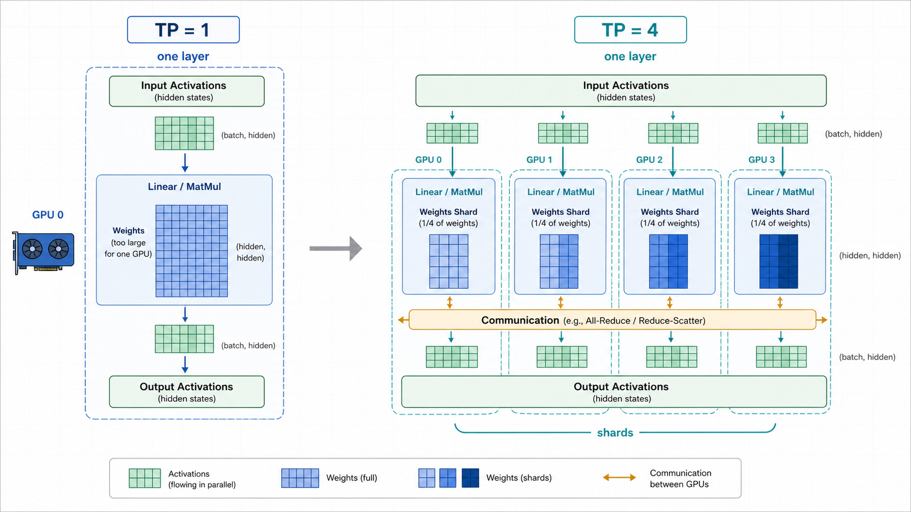
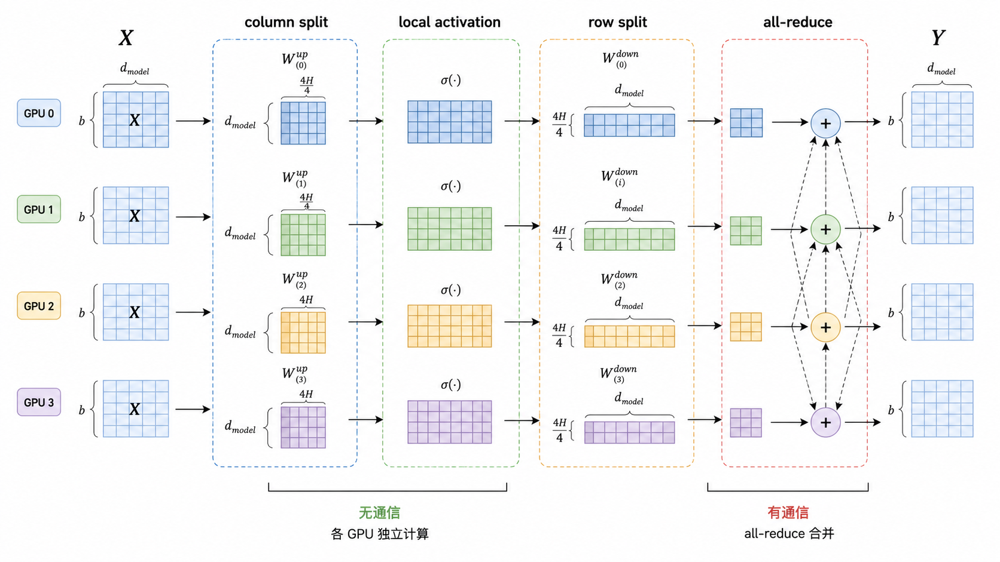
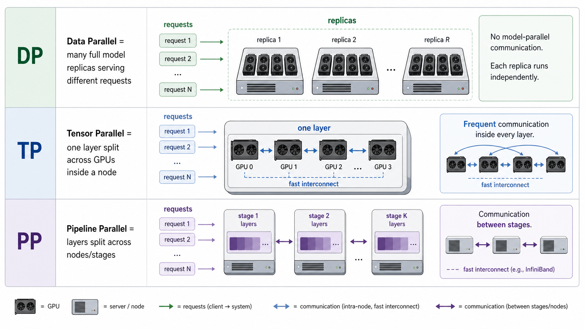

---
tags:
  - LLM
  - distributed-inference
  - tensor-parallelism
  - model-parallelism
updated: 2026-05-26
description: 从直觉、矩阵切分、通信代价和部署决策四个层次解释 Tensor Parallelism，帮助理解大模型如何把单层计算拆到多张 GPU 上。
---

# 大模型精讲系列_01：什么是TP？

> [!Quote] 本篇导读
> TP 是 Tensor Parallelism，也就是张量并行。它不是“多开几个模型副本”，也不是“把请求平均分给多张卡”，而是把一个模型层内部最重的张量计算拆到多张 GPU 上共同完成。理解 TP，本质上是在理解一件事：当一个 Transformer 层已经大到单卡放不下、算不动时，如何让多张卡一起计算同一个层，并且最后得到与单卡数学等价的结果。

## 1. TP要解决什么问题？

### 1.1 大模型首先遇到的是“单副本放不下”

在大模型部署和训练里，最朴素的扩展方式是 Data Parallelism，也就是 DP：每张 GPU 放一份完整模型，不同 GPU 处理不同 batch 或不同请求。

如果模型本身能完整放进一张 GPU，DP 很自然：

- GPU 0 跑一份模型，处理一批请求；
- GPU 1 跑另一份模型，处理另一批请求；
- 多张卡之间只需要在训练时同步梯度，或者在推理时由前端路由分发请求；

但当模型大到单卡放不下时，DP 就失效了。因为 DP 的前提是“每张卡都有完整模型副本”。如果一张卡连一份模型都放不下，再复制多少份都没有意义。

这时我们需要 Model Parallelism，也就是模型并行：把同一个模型拆到多张 GPU 上。

模型并行又可以继续拆成几种思路：

| 并行方式 | 切分对象 | 核心直觉 | 典型用途 |
| --- | --- | --- | --- |
| TP | 单层内部的矩阵、attention heads、embedding、MLP 权重 | 横向切同一层，让多张卡共同算一个 layer | 单层太大，单节点多 GPU 有高速互联 |
| PP | Transformer layers | 纵向切模型，让不同 GPU 负责不同层 | 模型跨节点，或者层数很多、可以分 stage |
| DP | 完整模型副本 | 复制多份模型，处理不同数据或请求 | 模型单副本能放下，但需要更高吞吐 |
| EP | MoE expert | 把专家层分布到不同 GPU | MoE 模型，如 Mixtral、DeepSeek、Qwen-MoE |

TP 的位置很清楚：它处理的是“一个模型副本内部，一层太大或计算太重”的问题。



图 1 展示了 TP 的第一层直觉：左侧是 TP=1，一整层权重和计算都在一张 GPU 上；右侧是 TP=4，同一层被切成 4 个 shard，每张 GPU 保存一部分权重并执行一部分计算，中间通过通信把局部结果组合起来。

### 1.2 为什么不是直接把层切开？

把模型拆到多张 GPU，最直观的想法是按层切，也就是 PP：

```text
GPU 0: layer 0 - layer 9
GPU 1: layer 10 - layer 19
GPU 2: layer 20 - layer 29
GPU 3: layer 30 - layer 39
```

这种方式很容易理解，但它解决的是“层太多、整模型太大”的问题。它不直接解决“单层内部的矩阵太大”的问题。

以 Transformer 的 MLP 为例，一个典型结构是：

$$
X \rightarrow XW_{up} \rightarrow \sigma(XW_{up}) \rightarrow \sigma(XW_{up})W_{down}
$$

其中 $W_{up}$ 往往把 hidden size 从 $d_{model}$ 扩到 $4d_{model}$ 或更高，$W_{down}$ 再把它投回 $d_{model}$。在大模型里，这些矩阵本身就非常大。如果某一层内部的矩阵已经无法优雅地放进单卡，单纯按层切并不够。

TP 的答案是：不要只把“层”当成不可再分的整体，而是继续把层内部的张量计算拆开。

## 2. 一句话定义 TP

### 2.1 TP 的核心定义

**Tensor Parallelism 指的是：把一个模型层内部的张量参数和张量计算按某个维度切分到多个设备上，每个设备只保存和计算其中一个 shard，再通过 collective communication 把局部结果组合成数学上等价于完整层的输出。**

更短一点：

**TP = 多张 GPU 一起算同一个 layer。**

这句话要和另外两句话区分开：

- DP = 多张 GPU 各自跑一份完整模型，处理不同数据或请求；
- PP = 多张 GPU 各自负责不同 layer 或不同 stage；
- TP = 多张 GPU 同时负责同一个 layer 的不同张量分片；

### 2.2 TP 切的通常不是 batch，而是 hidden 维、输出维、输入维、head 维或 vocab 维

在 LLM 里，TP 最常切这些对象：

- Linear 层的权重矩阵；
- Attention 的 QKV projection；
- Attention heads；
- MLP 的 up/gate/down projection；
- Embedding 和 LM Head 的 vocab 维；

以线性层为例：

$$
Y = XW
$$

如果 $W$ 太大，可以把 $W$ 沿某个维度切成多个 shard：

$$
W = [W_0, W_1, W_2, W_3]
$$

于是每张 GPU 只计算：

$$
Y_i = XW_i
$$

最后再根据切分方式，把多个 $Y_i$ 拼接、求和、all-reduce 或 reduce-scatter，得到和原始 $Y=XW$ 等价的输出。

这就是 TP 的数学骨架。

## 3. 从矩阵乘法理解 TP

### 3.1 Column Parallel：按输出维切权重

假设一个线性层：

$$
Y = XW
$$

其中：

- $X \in \mathbb{R}^{b \times d}$；
- $W \in \mathbb{R}^{d \times 4d}$；
- $Y \in \mathbb{R}^{b \times 4d}$；

如果把 $W$ 按列切成 4 份：

$$
W = [W_0, W_1, W_2, W_3]
$$

每张 GPU 都拿到完整的 $X$，但只保存一个 $W_i$：

$$
Y_i = XW_i
$$

最后得到的输出是：

$$
Y = [Y_0, Y_1, Y_2, Y_3]
$$

这种方式叫 Column Parallel。它的特点是：

- 每张 GPU 只保存一部分输出维度对应的权重；
- 每张 GPU 只产生一部分输出 hidden states；
- 输出天然是 sharded 的，沿最后一个维度分布在多张卡上；

### 3.2 Row Parallel：按输入维切权重

再看另一个线性层：

$$
Y = XW
$$

如果 $X$ 已经沿 hidden 维切开了：

$$
X = [X_0, X_1, X_2, X_3]
$$

那么可以把 $W$ 按行切成：

$$
W =
\begin{bmatrix}
W_0 \\
W_1 \\
W_2 \\
W_3
\end{bmatrix}
$$

每张 GPU 计算一个局部乘法：

$$
Z_i = X_iW_i
$$

但最终输出不是拼接，而是求和：

$$
Y = Z_0 + Z_1 + Z_2 + Z_3
$$

这个求和通常通过 all-reduce 完成。

Row Parallel 的特点是：

- 每张 GPU 拿到输入 hidden 维的一部分；
- 每张 GPU 计算一个 partial output；
- partial output 的形状相同，需要通过 collective communication 汇总；

### 3.3 Megatron 风格 MLP：先 Column，再 Row

Megatron-LM 的经典做法是把 MLP 的两层线性层配对切分：

1. 第一层 $W_{up}$ 使用 Column Parallel；
2. 中间的 GeLU/SwiGLU 等逐元素激活在本地 shard 上独立计算；
3. 第二层 $W_{down}$ 使用 Row Parallel；
4. 最后通过 all-reduce 合并 partial output；



图 2 是 TP 最关键的机制图。第一层线性层把输出维切开，激活函数可以直接在每张 GPU 的局部 shard 上执行，不需要通信；第二层线性层把输入维切开，每张 GPU 得到一个 partial output，最终通过 all-reduce 合并。

这个设计漂亮的地方在于：它不是“为了切而切”，而是顺着 Transformer MLP 的结构把通信点压到必要位置。

换句话说，TP 真正关心的不是“怎么平均切参数”，而是“怎么切才能让局部计算尽量连续，让通信次数和通信量尽量可控”。

### 3.4 Attention 里怎么做 TP？

Self-Attention 天然有一个适合 TP 的结构：multi-head。

简化看，一个 attention 层包含：

```text
hidden states
  -> QKV projection
  -> split heads
  -> attention per head
  -> output projection
```

如果有 32 个 attention heads，TP=4 时，常见做法是让每张 GPU 负责 8 个 heads：

```text
GPU 0: heads 0-7
GPU 1: heads 8-15
GPU 2: heads 16-23
GPU 3: heads 24-31
```

每张 GPU 在本地计算自己负责的 heads，最后在 output projection 附近做必要的通信与合并。

这也是为什么许多框架会要求 TP size 与 attention heads、hidden size、vocab size 等维度满足可整除关系。具体限制取决于模型结构和框架实现，但直觉很简单：你要把 heads 或 hidden 维切成几份，就最好能切得整齐。

## 4. TP、DP、PP 到底怎么区分？



图 3 可以作为一个快速判断入口：

| 问题 | 更像哪种并行？ | 原因 |
| --- | --- | --- |
| 模型单副本能放进一张 GPU，但请求量很大 | DP | 复制多个模型副本，提升吞吐 |
| 模型单副本放不进一张 GPU，但能放进单节点多张 GPU | TP | 横向切同一层，依赖节点内高速互联 |
| 模型单副本放不进单节点，需要跨节点 | TP + PP | 节点内用 TP，节点间常用 PP 减少频繁跨节点通信 |
| 单节点多 GPU 没有 NVLink，只有较弱互联 | 可能优先 PP 或较小 TP | TP 在每层内部频繁通信，互联弱时可能拖慢 |
| MoE 模型 expert 很多，需要专家分布 | EP + DP/TP | expert 层本身有并行结构，可以单独切 |

### 4.1 TP 与 DP 的本质区别

DP 是“复制模型”：

```text
request A -> GPU 0 -> full model
request B -> GPU 1 -> full model
request C -> GPU 2 -> full model
```

TP 是“拆一个模型”：

```text
request A -> GPU 0 + GPU 1 + GPU 2 + GPU 3 -> one model replica
```

所以 TP 并不是天然提高并发请求数。一个请求进入 TP 模型时，通常需要一组 GPU 共同服务它。TP 的首要收益是让模型放得下、算得动，其次才是在某些 batch 和硬件条件下提升吞吐。

### 4.2 TP 与 PP 的本质区别

PP 是纵向切层：

```text
GPU 0: early layers
GPU 1: middle layers
GPU 2: later layers
```

TP 是横向切层：

```text
GPU 0: layer k 的 shard 0
GPU 1: layer k 的 shard 1
GPU 2: layer k 的 shard 2
```

PP 的通信通常发生在 stage 之间，传递 intermediate activations；TP 的通信发生在层内部，往往每个 Transformer block 都会触发 collective communication。

这就是为什么 TP 对互联更敏感：它不是偶尔通信，而是在热路径里高频通信。

### 4.3 TP 与 ZeRO/FSDP 的区别

ZeRO/FSDP 也会“分片”，但它们和 TP 的关注点不同。

| 技术 | 主要切分对象 | 目标 | 与 TP 的区别 |
| --- | --- | --- | --- |
| TP | 层内权重和计算 | 让多张 GPU 共同完成同一层计算 | 前向计算本身就是分布式矩阵计算 |
| ZeRO | optimizer state、gradient、parameter | 降低训练状态内存 | 通常围绕训练状态和参数管理展开 |
| FSDP | parameter、gradient、optimizer state | 降低模型副本内存 | 常在计算前后 gather/shard 参数 |

实际大规模训练中，它们经常组合使用。例如 Megatron 风格训练可以同时使用 TP、PP、DP；现代 PyTorch/Transformers 生态也会把 TP 与 FSDP 组合成多维并行。

## 5. TP 的收益与代价

### 5.1 收益：显存压力被摊开

TP 最直接的收益是显存。

如果一个权重矩阵原来需要放在一张 GPU 上，现在 TP=4，每张 GPU 理论上只需要保存其中约四分之一的 shard。注意这里说的是“理论上”，因为实际显存还包括 activation、KV cache、通信 buffer、workspace、CUDA graph、框架运行时状态等。

但从趋势上看，TP 的确能把最重的层内权重和计算拆开，让更大的模型进入可运行范围。

### 5.2 收益：单层计算被并行执行

TP 不只是省显存，也把矩阵乘法分摊到多张 GPU 上。

在理想情况下，TP=4 意味着四张 GPU 同时做一部分 GEMM，单卡计算量下降，吞吐可能提高。

但这个“理想情况”有一个前提：通信不能成为瓶颈。

### 5.3 代价：通信进入每一层的热路径

TP 的代价主要来自 collective communication：

- all-reduce；
- all-gather；
- reduce-scatter；
- broadcast 或其他框架特定通信；

以 Megatron 风格的 MLP 为例，Row Parallel 的结果需要汇总；attention 的 output projection 附近也常需要汇总。对于每个 Transformer block，这些通信都在前向和反向的关键路径上。

这意味着：

- TP size 越大，每张卡的计算量下降，但通信参与者也变多；
- 如果 GPU 间有 NVLink/NVSwitch，TP 往往更有效；
- 如果只有 PCIe，或者跨节点网络不足，TP 可能没有想象中快；
- 跨节点 TP 可行，但通常比节点内 TP 更挑网络；

TP 的一句工程经验是：

**TP 是用通信换显存和计算并行。网络越强，这笔交易越划算；网络越弱，这笔交易越危险。**

## 6. 主流框架里的 TP 怎么落地？

### 6.1 Megatron-LM：经典源头

Megatron-LM 论文把这种方法称为 efficient intra-layer model parallel approach。它的贡献不只是“把矩阵切开”，而是找到了适合 Transformer 的切分位置：

- MLP 使用 Column Parallel + Row Parallel 的组合；
- Attention 按 heads 切分；
- 通过少量通信操作在 PyTorch 中实现，不要求新编译器；
- 可与 Pipeline Parallelism、Data Parallelism 组合；

Megatron-LM 后续又发展出 Megatron Core，把 TP、PP、DP、EP、CP 等并行策略做成可组合的训练构件。

典型参数名是：

```bash
--tensor-model-parallel-size 4
```

### 6.2 vLLM：推理部署里的 TP

vLLM 支持 tensor-parallel inference 和 pipeline-parallel inference，并且官方文档明确写到其实现包含 Megatron-LM 的 tensor parallel algorithm。

单节点 4 GPU 推理时，常见写法是：

```bash
vllm serve facebook/opt-13b \
  --tensor-parallel-size 4
```

离线推理也可以在 `LLM` 初始化时指定：

```python
from vllm import LLM

llm = LLM("facebook/opt-13b", tensor_parallel_size=4)
```

如果模型大到单节点也放不下，vLLM 文档推荐常见配置是：

```text
tensor_parallel_size = 每个节点的 GPU 数
pipeline_parallel_size = 节点数
```

也就是节点内用 TP，节点间用 PP。

### 6.3 Hugging Face Transformers：tp_plan

Transformers 中，部分模型会在 config 中声明 `base_model_tp_plan`。如果模型支持原生 TP，可以用：

```python
from transformers import AutoModelForCausalLM

model = AutoModelForCausalLM.from_pretrained(
    "Qwen/Qwen3-0.6B",
    dtype="auto",
    tp_plan="auto",
)
```

这里有一个容易混淆的点：`tp_plan` 不应该和 `device_map` 混用。`device_map` 更像是把完整模块放到不同设备上；TP 则是在权重加载和层内部计算层面把参数 shard 到多张 GPU 上。

### 6.4 PyTorch DTensor：ColwiseParallel 与 RowwiseParallel

PyTorch 的 `torch.distributed.tensor.parallel` 提供了更底层的 TP building blocks：

```python
from torch.distributed.device_mesh import init_device_mesh
from torch.distributed.tensor.parallel import (
    parallelize_module,
    ColwiseParallel,
    RowwiseParallel,
)

tp_mesh = init_device_mesh("cuda", (8,))
model = parallelize_module(
    model,
    tp_mesh,
    {
        "w1": ColwiseParallel(),
        "w2": RowwiseParallel(),
    },
)
```

这和我们前面讲的矩阵视角是对齐的：复杂模块通常通过组合 `ColwiseParallel` 和 `RowwiseParallel` 来实现期望的 sharding computation。

## 7. 怎么选择 TP size？

### 7.1 先问模型能不能放下

如果模型能完整放进一张 GPU，且你的目标是提高并发吞吐，优先考虑 DP 或多个独立实例，而不是急着上 TP。

如果模型放不进单卡，但能放进单节点多张 GPU，TP 是自然选择。

如果模型连单节点都放不下，通常考虑 TP + PP：

```text
每个节点内部：TP
不同节点之间：PP
```

这能把高频通信尽量留在节点内，把跨节点通信变成相对低频的 stage 间传递。

### 7.2 再问硬件互联够不够强

TP 的核心瓶颈往往不是“能不能切”，而是“切完之后通信能不能跟上”。

可以按这个顺序判断：

1. 单节点有 NVLink/NVSwitch：适合较高 TP；
2. 单节点只有 PCIe：TP 可能可用，但需要 benchmark；
3. 跨节点有 InfiniBand、GPUDirect RDMA 等高速网络：可以尝试跨节点 TP，但需要认真调优；
4. 跨节点网络一般：优先把 TP 限制在节点内，用 PP 跨节点；

vLLM 文档也提醒：在没有 NVLink 的某些环境里，使用 PP 可能比 TP 有更高吞吐和更低通信开销。

### 7.3 还要问模型维度能不能整除

很多 TP 实现要求关键维度能被 TP size 整除，例如：

- attention heads 数；
- hidden size；
- intermediate size；
- vocab size 或 padded vocab size；
- KV heads 或 grouped-query attention 相关维度；

这不是理论上的绝对限制，而是工程实现上的常见约束。遇到报错时，不要只看显存，也要检查模型结构和框架的 TP plan 是否支持当前 TP size。

## 8. 常见误区

### 8.1 误区一：TP = 多 GPU 更快

不一定。

TP 降低单卡计算和显存压力，但增加通信。如果模型不大、batch 很小、互联很弱，TP 可能比单卡更慢。

更准确的说法是：

**TP 让大模型有机会跨多卡运行，并在通信足够快时获得更好的吞吐。**

### 8.2 误区二：TP = 请求被分给不同 GPU

这其实是 DP 或负载均衡。

TP 场景下，一个请求通常会进入一个由多张 GPU 组成的 TP group。这个 group 共同完成一次 forward。

### 8.3 误区三：TP size 越大越好

TP size 变大后：

- 每张 GPU 的权重 shard 变小；
- 每张 GPU 的局部计算变少；
- collective communication 的参与设备变多；
- 通信同步成本更突出；

所以 TP size 是一个平衡点，不是越大越好。生产环境里通常需要用真实模型、真实 batch、真实上下文长度做 benchmark。

### 8.4 误区四：TP 会自动解决所有显存问题

TP 主要切层内参数和计算，但显存还包括：

- KV cache；
- activation；
- CUDA graph 和 workspace；
- 通信 buffer；
- LoRA、adapter、quantization kernel 的额外状态；
- 框架调度器、prefix cache、采样相关缓存；

因此在推理系统里，即使 TP 让模型权重放下了，长上下文或高并发仍可能被 KV cache 限制。

## 9. 一个最小部署心法

可以把 TP 的部署判断压缩成下面几步：

1. 模型单卡能放下吗？
   - 能：先用单卡或 DP；
   - 不能：进入下一步；
2. 单节点多卡能放下吗？
   - 能：优先 TP；
   - 不能：进入下一步；
3. 多节点能部署吗？
   - 节点内设 TP；
   - 节点间设 PP；
4. 互联够快吗？
   - 够快：增加 TP size 可能有效；
   - 不够快：降低 TP，尝试 PP、量化、offload、换模型或改部署拓扑；
5. 真实 workload benchmark 过吗？
   - 没有：不要只看理论显存；
   - 已经 benchmark：以 TTFT、TPOT、吞吐、GPU 利用率、NCCL 通信耗时共同判断；

## 10. 小结

TP 的核心不是一个命令行参数，而是一种看待 Transformer 层的方式：

**Transformer 层不是不可拆的黑盒，它由可切分的矩阵乘法、attention heads、embedding 和 projection 组成。TP 正是利用这些结构，把单层内部的权重和计算拆到多张 GPU 上，再用通信恢复数学等价性。**

理解 TP 后，再看 `tensor_parallel_size`、`ColumnParallelLinear`、`RowParallelLinear`、`all-reduce`、`NVLink`、`TP + PP` 这些词，就不会觉得它们是散乱术语。它们其实都围绕同一个问题展开：

**如何用多张 GPU 共同完成一个大到单卡无法承担的 Transformer 层。**

## 11. 参考资料

### 11.1 论文

1. [Megatron-LM: Training Multi-Billion Parameter Language Models Using Model Parallelism](https://arxiv.org/abs/1909.08053)：Megatron-LM 经典论文，提出适合 Transformer 的 intra-layer model parallel 方法；
2. [Efficient Large-Scale Language Model Training on GPU Clusters Using Megatron-LM](https://arxiv.org/abs/2104.04473)：系统讨论 tensor、pipeline、data parallelism 的组合和大规模训练权衡；
3. [Mesh-TensorFlow: Deep Learning for Supercomputers](https://arxiv.org/abs/1811.02084)：更早从“任意 tensor 维度可切分”的角度讨论模型并行和 SPMD 编程；
4. [GPipe: Efficient Training of Giant Neural Networks using Pipeline Parallelism](https://arxiv.org/abs/1811.06965)：理解 PP 与 TP 区别时很有帮助；
5. [ZeRO: Memory Optimizations Toward Training Trillion Parameter Models](https://arxiv.org/abs/1910.02054)：用于区分 TP 与 ZeRO/FSDP 这类训练状态分片方法；

### 11.2 官方文档与 GitHub 社区

1. [NVIDIA/Megatron-LM GitHub](https://github.com/NVIDIA/Megatron-LM)：Megatron-LM 与 Megatron Core 仓库，包含 TP、PP、DP、EP、CP 等并行组件；
2. [Megatron Core tensor_parallel package](https://docs.nvidia.com/megatron-core/developer-guide/0.15.0/api-guide/tensor_parallel.html)：Megatron Core 的 tensor parallel API 文档；
3. [vLLM Parallelism and Scaling](https://docs.vllm.ai/en/stable/serving/parallelism_scaling/)：vLLM 对单节点、多节点、TP、PP 选择的部署建议；
4. [Hugging Face Transformers Tensor Parallelism](https://huggingface.co/docs/transformers/main/tensor_parallelism)：Transformers 中 `tp_plan` 的使用方式和约束说明；
5. [PyTorch Tensor Parallelism API](https://docs.pytorch.org/docs/2.12/distributed.tensor.parallel.html)：`parallelize_module`、`ColwiseParallel`、`RowwiseParallel`、`SequenceParallel` 等底层接口；

### 11.3 博客与教程

1. [Hugging Face Ultra-Scale Playbook](https://huggingface.co/spaces/nanotron/ultrascale-playbook)：非常适合建立 DP、TP、PP、SP、CP、ZeRO 等多维并行的全局视角；
2. [vLLM Distributed Inference Blog](https://vllm-project.github.io/2025/02/17/distributed-inference.html)：从推理部署角度理解并行策略如何进入生产系统；
