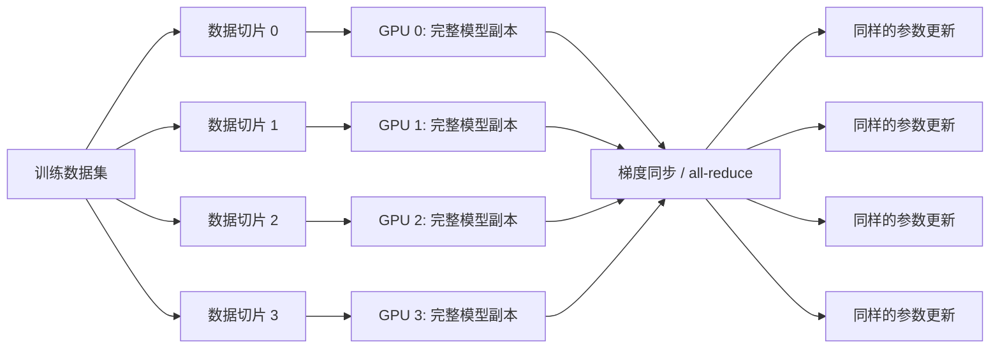
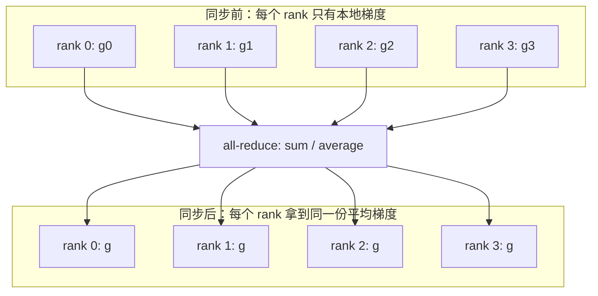
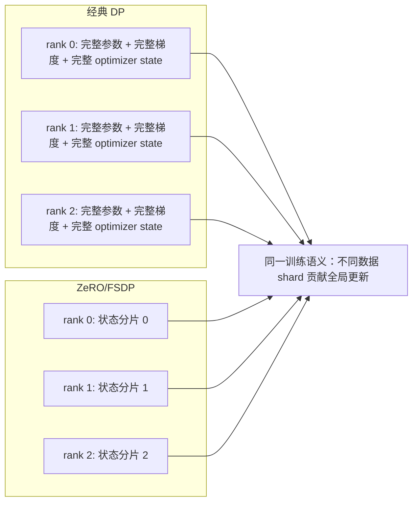
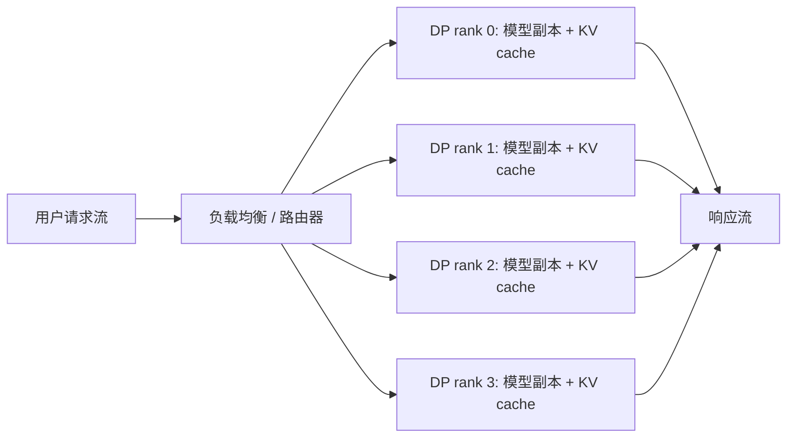

---
tags:
  - LLM
  - distributed-training
  - distributed-inference
  - data-parallelism
updated: 2026-05-26
description: 从训练与推理两个场景解释 Data Parallelism 的复制、数据切分、梯度同步、状态分片和部署决策，帮助区分 DP、TP、PP 与 ZeRO/FSDP。
---

# 大模型精讲系列 02：Data Parallelism（DP）是什么

> [!Quote] 本篇导读
> DP（Data Parallelism，数据并行）是大模型分布式系统里最朴素、最常见，也最容易被一句话讲浅的并行方式。它的核心不是“多卡一起用”这么泛泛的描述，而是：多个 worker 持有同一份模型语义，处理不同的数据或请求；训练时通过梯度同步保持模型副本一致，推理时通过请求路由扩展吞吐。理解 DP，要同时抓住三个问题：模型副本复制了什么，数据或请求切到了哪里，训练状态又为什么后来必须被 ZeRO/FSDP 重新拆开。

## 1. 从真实场景进入

### 1.1 为什么会遇到 DP

很多人第一次遇到 DP，不是在读分布式论文，而是在一个很直接的问题里：

单张 GPU 能跑模型，但训练太慢；或者一个推理服务已经能启动，但请求一多就排队。你打开机器，发现还有 7 张 GPU 空着，于是直觉上会问：能不能让这些 GPU 一起干活？

这时有两种完全不同的“多卡一起干活”。

第一种是前一篇讲的 TP。模型太大，一张 GPU 放不下，或者单层计算太重，所以要把同一个 Transformer layer 拆到多张 GPU 上共同计算。

第二种就是 DP。模型本身可以被每张 GPU 各自持有一份，于是每张 GPU 都像一个独立工人：拿同样的模型，处理不同的数据。训练时，它们处理不同 mini-batch；推理时，它们处理不同用户请求。

这就是 DP 的第一层直觉：

**TP 是多张 GPU 一起算同一个 layer；DP 是多张 GPU 各自跑一份模型，处理不同数据或请求。**

这个区别非常重要。TP 解决的是“一个模型副本或一个层内部计算太大”的问题；DP 解决的是“同一模型要处理更多数据或更多请求”的问题。两者经常组合使用，但它们切分的对象完全不同。

### 1.2 复制与切分

DP 的动作可以拆成两个词：复制模型，切分数据。

在经典训练 DP 中，每个 rank 上都有一份完整模型副本。假设有 4 张 GPU：

- GPU 0 保存一份模型，处理 batch shard 0；
- GPU 1 保存一份模型，处理 batch shard 1；
- GPU 2 保存一份模型，处理 batch shard 2；
- GPU 3 保存一份模型，处理 batch shard 3；

每个 GPU 都独立做 forward 和 backward。问题在于，如果它们各自用自己的梯度更新参数，4 份模型很快就会走向不同方向。于是 DP 训练必须在 backward 后同步梯度，再让每个副本执行同样的 optimizer step。



这张图里最值得记住的不是 all-reduce 这个词，而是同步后的状态：每张 GPU 的参数仍然保持一致。DP 训练并不是让 4 张 GPU 训练 4 个不同模型，而是让它们共同模拟“一个更大的 batch 上的一次训练 step”。

### 1.3 定义与边界

**Data Parallelism 指的是：多个 worker 持有同一模型的等价副本，分别处理不同数据分片；训练时通过梯度或状态同步让副本保持一致，推理时通常通过请求路由让副本处理不同请求，从而提升吞吐或训练样本处理速度。**

再短一点：

**DP = 多份模型副本，处理不同数据。**

它和其他并行方式的边界可以先放成一张表：

| 并行方式 | 切分对象 | 每张 GPU 是否有完整模型 | 主要解决什么问题 |
| --- | --- | --- | --- |
| DP | 数据、batch、请求 | 经典 DP 中是 | 训练吞吐、推理吞吐、横向扩容 |
| TP | 单层内部张量与算子 | 否 | 单层权重或计算太大，单卡放不下或算不过来 |
| PP | Transformer layers 或 stage | 否 | 按层切开模型，缓解单卡显存压力 |
| ZeRO/FSDP | 参数、梯度、optimizer state | 不完全是 | 在保留 DP 训练语义的同时减少训练状态冗余 |
| EP | MoE experts | 否或部分否 | 把不同专家分给不同设备，处理专家路由与负载均衡 |

这张表里最容易混淆的是 DP 与 ZeRO/FSDP。严格说，经典 DP 会复制完整参数、梯度和 optimizer state；ZeRO/FSDP 则是在 DP 的训练语义上，把这些训练状态再分片。它们不是“另一个完全无关的并行世界”，而是 DP 走到大模型训练后，为了解决显存冗余而演化出来的 sharded data parallelism。

## 2. 训练循环

### 2.1 一次 step 如何发生

先看最经典的同步 DP 训练。假设有 $p$ 个 data parallel ranks，当前参数是 $\theta_t$。第 $r$ 个 rank 拿到自己的数据分片 $B_r$，计算本地 loss：

$$
L_r(\theta_t) = \frac{1}{|B_r|}\sum_{x \in B_r}\ell(x;\theta_t)
$$

然后每个 rank 计算本地梯度：

$$
g_r = \nabla_{\theta}L_r(\theta_t)
$$

如果这些 rank 要共同模拟一个全局 batch 上的训练，最终用于更新的梯度应该是所有本地梯度的平均：

$$
g = \frac{1}{p}\sum_{r=0}^{p-1}g_r
$$

于是每个 rank 都用同一个 $g$ 做 optimizer step：

$$
\theta_{t+1} = \text{OptimizerUpdate}(\theta_t, g)
$$

这就是同步 DP 的数学骨架。

```text
每个 rank：
1. 读取不同 batch shard；
2. 用同一模型副本做 forward；
3. 在本地做 backward，得到本地梯度；
4. 通过 all-reduce 得到平均梯度；
5. 用同样的平均梯度更新本地参数；
```

如果所有 rank 起点相同、同步梯度相同、optimizer step 相同，那么更新后的参数仍然相同。这就是 DP 能保持“多副本但同一个模型”的原因。

### 2.2 梯度为什么要平均

很多初学者会问：为什么是平均梯度，不是把梯度直接相加？

答案取决于 loss 的定义。深度学习框架里常见 loss 默认对 batch 取平均。如果每个 rank 的本地 loss 已经是本地 batch 平均，那么要得到全局 batch 平均梯度，就应该对各 rank 梯度再求平均。

假设每张 GPU 的本地 batch size 都是 $m$，DP size 是 $p$，那么全局 batch size 是：

$$
B_{\text{global}} = m \times p
$$

如果每个 rank 计算的是本地平均 loss：

$$
g_r = \frac{1}{m}\sum_{i=1}^{m}\nabla_\theta \ell(x_{r,i};\theta)
$$

全局平均梯度就是：

$$
g = \frac{1}{p}\sum_{r=0}^{p-1}g_r
$$

如果训练代码使用的是 sum loss，或者框架 all-reduce 后没有自动除以 world size，就要手动处理缩放。真正重要的不是死记“平均”或“求和”，而是保证最终梯度的尺度与预期的全局 batch 定义一致。

这件事会直接影响学习率。DP size 变大后，全局 batch 也变大；学习率、warmup、weight decay、gradient clipping 都可能需要重新校准。所谓 linear scaling rule 只是经验启发，不是大模型训练里的自然定律。

### 2.3 Gradient accumulation

大模型训练经常不能把足够大的 batch 一次性塞进 GPU，于是会用 gradient accumulation。

如果每张 GPU 的 micro-batch size 是 $m$，gradient accumulation steps 是 $k$，DP size 是 $p$，那么有效全局 batch size 是：

$$
B_{\text{effective}} = m \times k \times p
$$

在 LLM 训练里更常用 token 数量表达：

$$
T_{\text{effective}} = T_{\text{per micro batch per rank}} \times k \times p
$$

这时每个 rank 会先连续做 $k$ 次 micro-batch forward/backward，把梯度累积起来，然后再进行一次同步和 optimizer step。PyTorch DDP 里常见做法是让前 $k-1$ 个 micro-step 使用 `no_sync()`，只在最后一个 micro-step 触发梯度同步。

```mermaid
sequenceDiagram
  participant R0 as rank 0
  participant R1 as rank 1
  participant AR as all-reduce
  participant OPT as optimizer step

  R0->>R0: micro-batch 1 backward / 不同步
  R1->>R1: micro-batch 1 backward / 不同步
  R0->>R0: micro-batch 2 backward / 不同步
  R1->>R1: micro-batch 2 backward / 不同步
  R0->>AR: 最后一个 micro-batch 梯度
  R1->>AR: 最后一个 micro-batch 梯度
  AR-->>R0: 平均后的累积梯度
  AR-->>R1: 平均后的累积梯度
  R0->>OPT: 更新本地副本
  R1->>OPT: 更新本地副本
```

这里有一个很容易踩坑的点：gradient accumulation 不是“免费扩大 batch”。它会减少同步频率，但也会改变 optimizer step 的节奏；如果总 token 数不变，accumulation 变大意味着 optimizer 更新次数变少。训练曲线、warmup 步数和日志里的 step 解释都要跟着调整。

### 2.4 数据切分与随机性

DP 训练要求不同 rank 看到不同数据，否则就会浪费计算。每张 GPU 如果拿到完全相同的 batch，那么 all-reduce 后得到的梯度和单卡没什么区别，只是把同一件事重复算了多次。

所以数据层通常要满足几个条件：

- 每个 rank 读到不同的数据 shard；
- 每个 epoch 的 shuffle 要在全局视角下合理，而不是每个 rank 私自洗牌后互相重叠；
- 多机训练时要处理 worker 数变化、断点续训和样本顺序可复现；
- LLM 训练中还要关注 token packing、sequence length 分布和 padding 浪费；

PyTorch 的 `DistributedSampler` 就是为这类场景准备的常见组件。真正的大模型训练系统还会进一步把数据切分和 token 预算、sequence packing、resume cursor、数据质量权重结合起来。

DP 的数据切分不是一个边缘细节。它决定了全局 batch 到底是什么，也决定了训练统计量是否稳定。

### 2.5 同步边界

同步 DP 有一个隐含契约：所有 rank 要以兼容的顺序参与通信。

如果某个 rank OOM、某个 rank 跳过 backward、某个 rank 的 control flow 导致少调用了一次 collective，其它 rank 就可能卡在等待中。NCCL 文档也明确要求 collective operation 要由每个 rank 以相同 count 和 datatype 参与，否则可能出现 hang、crash 或数据损坏。

这解释了为什么分布式训练里的错误常常看起来很诡异。真正出错的可能是 rank 3 的一次数据异常，但 rank 0 看到的只是 all-reduce 卡住。DP 的工程稳定性不只取决于数学公式，也取决于所有 rank 是否能稳定地走过同一组同步点。

## 3. 通信机制

### 3.1 All-reduce 的语义

经典 DDP 的核心通信是梯度 all-reduce。

all-reduce 做两件事：

1. 对所有 rank 提供的同形状张量做 reduce，例如求和；
2. 把 reduce 后的结果发送回每个 rank；

在 DP 训练里，这个张量通常是梯度 bucket。每个 rank 先产生自己的梯度，all-reduce 后每个 rank 都拿到相同的平均梯度。



这个状态变化是理解 DP 的关键。all-reduce 不是把梯度集中到一张卡上更新，也不是只让 rank 0 拥有最终结果；它让每个 rank 都得到同样的聚合结果，所以每个副本都能独立执行同样的参数更新。

### 3.2 Bucket 与重叠

如果等整个 backward 都结束后再同步所有梯度，通信会变成一个巨大的尾巴。DDP 的实际实现通常会把参数梯度分进多个 bucket。某个 bucket 里的梯度都准备好后，就可以异步发起 all-reduce，而不是等所有层都反传完。

这样可以让通信和计算重叠：

```text
反向传播后段仍在计算时，
前面已经准备好的 gradient bucket 可以开始 all-reduce。
```

PyTorch DDP 的设计文档也描述了这种机制：当 bucket 中的梯度就绪，Reducer 会对 bucket 发起异步 all-reduce；所有 bucket 完成后，平均梯度写回 `param.grad`，然后 optimizer 看到的是本地模型上的普通梯度。

这就是为什么 DDP 往往比早期单进程多 GPU 的 `DataParallel` 更适合多卡训练：它用多进程、多 rank 和 bucket 化通信，把通信更早插入 backward 的时间线，而不是把所有数据搬到一个主设备上聚合。

### 3.3 通信量级

通信成本可以用一个粗略模型建立直觉。

设所有需要同步的梯度大小总和为 $G$ bytes，DP size 为 $p$。ring-style all-reduce 中，每个 rank 的通信量级大约是：

$$
\frac{2(p-1)}{p}G
$$

当 $p$ 很大时，这个量级接近 $2G$。这说明一个反直觉事实：DP size 变大后，单个 rank 每步的梯度通信量不会趋近于 0。模型梯度有多大，通信热路径就有多重。

DP 的扩展效率大致取决于：

- 每个 rank 的本地计算是否足够重，能掩盖通信；
- bucket all-reduce 是否能与 backward 重叠；
- 网络带宽和延迟是否能承受梯度同步；
- global batch 变大后，模型收敛是否仍然稳定；

因此，DP 不是“加 GPU 就线性加速”。当 batch 太小、模型太小、网络太慢，或者 all-reduce 无法充分重叠时，更多 DP ranks 可能只是在更频繁地等待通信。

### 3.4 同步 DP 与异步 DP

主流 LLM 训练通常使用同步 DP：所有 rank 在一个 step 内共同计算同一个全局 batch，并在更新前同步梯度。

异步 DP 则允许 worker 使用可能已经过期的参数独立计算梯度，再由参数服务器或某种中心机制合并。这可以减少等待，但会引入 stale gradients，使优化行为更难控制。对于大模型预训练这种对稳定性高度敏感的任务，同步 DP 仍然是更常见的基础形态。

所以，在现代 LLM 训练语境里，默认说 DP，通常指同步 data parallel training；如果讨论异步训练，需要明确说明 stale gradient、参数服务器、一致性模型和收敛风险。

## 4. 显存与状态

### 4.1 经典 DP 不省模型显存

DP 最容易被误解的一点是：它使用多张 GPU，但经典 DP 并不会减少每张 GPU 上的模型状态显存。

如果模型参数本身占 $P$，梯度占 $G$，optimizer state 占 $O$，那么经典 DP 每张 GPU 上大体都要保存：

$$
P + G + O + A
$$

其中 $A$ 是 activation、workspace、通信 buffer 等运行时内存。

对 Adam 这类优化器，optimizer state 往往很重。一个常见的混合精度训练估算是：每个参数可能对应 FP16/BF16 参数、梯度、FP32 master weight、Adam 的一阶矩和二阶矩。具体实现会变化，但结论稳定：训练状态经常比“模型权重文件大小”大得多。

因此，如果一个模型单卡放不下，单纯增加经典 DP size 没有帮助。因为每张 GPU 仍然要放完整模型和完整训练状态。

这就是 ZeRO/FSDP 出场的背景。

### 4.2 为什么需要 ZeRO/FSDP

经典 DP 的低效之处在于冗余。每个 rank 都保存完整参数、完整梯度、完整 optimizer state。可是在一次 optimizer step 中，很多状态并不一定需要在每个 rank 上都完整驻留。

ZeRO 的核心思想是：把这些本来在 DP ranks 之间重复保存的状态切开。

| 方法 | 分片对象 | 每张 GPU 上少了什么 | 仍保留什么语义 |
| --- | --- | --- | --- |
| ZeRO Stage 1 | optimizer states | 不再每卡保存完整 optimizer states | 数据并行训练语义 |
| ZeRO Stage 2 | optimizer states + gradients | 梯度也按 rank 分片保存 | 数据并行训练语义 |
| ZeRO Stage 3 | optimizer states + gradients + parameters | 参数也分片，按需 all-gather | 数据并行训练语义 |
| FSDP | 参数、梯度、optimizer state | 通过模块级 all-gather / reduce-scatter 管理完整参数视图 | 数据并行训练语义 |

DeepSpeed 文档对 ZeRO 的描述很直接：它通过在 data-parallel processes 之间切分 optimizer states、gradients 和 parameters，移除经典 DP 中的内存冗余。PyTorch FSDP 则把类似思想做成 PyTorch 原生接口，在 forward 前后插入参数 all-gather 和释放/reshard 逻辑。

### 4.3 Sharded DP 的运行直觉

ZeRO-3 或 FSDP 容易让人困惑：既然参数都被切开了，它还是 DP 吗？

答案是：从训练语义看，它仍然保持 DP 的核心目标；从状态布局看，它已经不再是经典完整复制。

可以这样理解：



训练 step 中，FSDP/ZeRO-3 会在需要计算某个模块时临时 all-gather 参数，让本地 rank 获得当前计算所需的完整参数视图；计算结束后再释放或重新分片。backward 中梯度也会通过 reduce-scatter 等方式回到分片状态。

所以，sharded DP 的代价是更多、更复杂的通信和调度；收益是显著降低每卡训练状态显存。对于超大模型训练，这个交换通常是值得的。

### 4.4 状态分片不是免费午餐

ZeRO/FSDP 解决的是经典 DP 的显存冗余，但它们不是免费的魔法。

它们引入的新问题包括：

- 参数 all-gather 和梯度 reduce-scatter 会进入训练关键路径；
- wrapping granularity 会影响显存峰值和通信频率；
- activation checkpointing、CPU offload、NVMe offload 会进一步改变计算和 IO 平衡；
- checkpoint 保存与恢复需要处理 full state dict、sharded state dict、optimizer state 的转换；
- 混合 TP/PP/DP 时，进程组和通信域会变复杂；

因此，在工程上不要把 ZeRO/FSDP 当作“打开就一定更快”的选项。它们更准确的定位是：当经典 DP 由于训练状态冗余无法承载模型时，用更复杂的通信换取更低的每卡显存。

## 5. 推理 DP

### 5.1 推理里的 DP 没有梯度同步

推理场景里的 DP 和训练 DP 很像，但少了最重的 backward 和梯度同步。

每个 replica 加载一份模型权重，前端或调度器把不同请求分配给不同 replica。请求之间通常互不依赖，所以每个 replica 可以独立完成 prefill、decode 和返回。



这就是在线服务里 DP 最自然的意义：复制服务能力。

如果模型单卡放得下，推理 DP 往往比 TP 更简单、更稳定，因为每个请求不需要在多个 GPU 之间做层内 collective communication。它牺牲的是每张 GPU 都要放一份完整权重，换来的是请求级隔离和横向吞吐。

### 5.2 vLLM 中的 DP

vLLM 的 Data Parallel Deployment 文档把推理 DP 说得很明确：模型权重会在不同 instance/GPU 上复制，用于处理独立 batch 的请求。

一个单节点例子是：

```bash
vllm serve $MODEL --data-parallel-size 4
```

如果每个模型副本内部还需要 TP，可以组合：

```bash
vllm serve $MODEL --data-parallel-size 4 --tensor-parallel-size 2
```

这表示 4 个 DP replicas，每个 replica 内部使用 TP=2。总 GPU 数大体是：

$$
\text{GPUs} = DP \times TP
$$

在这个例子里需要 8 张 GPU。这里不要把 DP 和 TP 混在一起理解：

- DP 维度决定有多少个模型服务副本；
- TP 维度决定每个副本内部是否把同一个 layer 拆到多张 GPU 上；
- `--max-num-seqs` 这类容量参数在 vLLM 文档里需要按 DP rank 理解；
- 每个 DP engine 有自己的 KV cache，路由策略会影响 prefix cache 命中率；

推理 DP 的负载均衡不是简单 round-robin 就万事大吉。长请求、短请求、prefill-heavy 请求、decode-heavy 请求会让 replica 的压力差异很大。好的路由器会考虑排队长度、当前 KV cache 状态、prefix cache 复用和每个 engine 的活动请求。

### 5.3 DP 与 MoE

MoE 模型让推理 DP 变得更微妙。

在 dense 模型里，多个 DP replicas 大多可以独立处理请求。但在一些 MoE 部署里，attention 层可能使用 data parallel，而 expert 层可能使用 EP 或 TP。此时 DP ranks 不一定完全独立：为了让 expert 层同步处理跨 rank 的 token routing，某些实现需要让 forward pass 对齐；当部分 rank 没有真实请求时，还可能需要 dummy forward 来保持执行节奏。

vLLM 文档也特别指出，对 DeepSeek 这类采用 MLA 的 MoE 模型，attention 层使用 DP、expert 层使用 EP 或 TP 可能是有利的组合；但这种情况下 DP ranks 并非完全独立，专家层会在 forward 中同步。

这说明一个重要边界：

**推理 DP 在 dense replica 服务里很像请求级复制；在 MoE + EP/TP 组合里，它可能变成一个需要跨 rank 协调的并行维度。**

### 5.4 KV cache 与容量

推理 DP 不会把单个 replica 的 KV cache 自动分摊到其它 replica。每个 DP engine 管理自己的 KV cache。请求被路由到哪个 replica，它的上下文状态就在哪里增长。

这带来两个工程后果：

- 如果模型单卡放得下但 KV cache 容量不够，增加 DP replicas 可以提高总服务容量，但不能让单个长请求跨 replica 共享 KV cache；
- 如果大量请求有相同前缀，稳定地把相同前缀路由到同一 replica，可能提高 prefix caching 命中率；

当单个请求的上下文太长，或者单 replica 的 KV cache 压力过大时，单纯 DP 可能不够，需要 TP、context parallel、KV cache offload、prefix cache 策略或更细的调度机制。

## 6. 工程选择

### 6.1 什么时候优先考虑 DP

训练场景中，DP 适合下面几类情况：

- 单个模型副本及训练状态能放进每个 rank，或者通过 FSDP/ZeRO 后能放进；
- 主要瓶颈是训练吞吐，而不是单层显存或单个 layer 的计算布局；
- 数据量足够大，global batch 增大后仍能保持有效训练；
- 网络能承受梯度同步，且 backward 计算能覆盖一部分通信；

推理场景中，DP 适合下面几类情况：

- 模型权重能被单个 replica 承载，或者每个 replica 内部可以用 TP/PP 承载；
- 请求量高，需要横向扩展吞吐；
- 请求之间相对独立，不需要每个 token 都跨 replica 协同；
- 需要更好的故障隔离、滚动升级和简单负载均衡；

一句话判断：

**模型能放下，但数据或请求太多，先想 DP；模型本身放不下，再想 TP、PP、FSDP/ZeRO 或组合并行。**

### 6.2 什么时候 DP 不够

DP 不适合解决所有问题。

如果单个模型副本放不进一张 GPU，经典 DP 无法解决，因为它复制的是完整模型。此时需要 TP、PP、FSDP/ZeRO，或者它们的组合。

如果训练时 global batch 已经很大，继续增加 DP size 可能会降低优化效率。你可能看到吞吐上升，但 loss 曲线变差，或者需要更长 warmup 和更精细学习率策略。

如果网络是瓶颈，更多 DP ranks 会让梯度同步更重。尤其在跨节点训练里，慢链路会放大 all-reduce 的等待时间。Megatron-LM 的大规模训练论文也强调，tensor、pipeline 和 data parallelism 需要组合配置，避免天真使用某一种并行方式导致跨节点通信和等待问题。

如果推理服务的瓶颈是单请求延迟或单请求 KV cache，而不是总请求吞吐，DP 也不是直接答案。它能多处理几个请求，但不一定让一个超长请求更快或更省显存。

### 6.3 常见入口

PyTorch DDP 的典型入口是 `torchrun` 启动多个进程，每个进程绑定一个 rank：

```bash
torchrun --nproc_per_node=8 train.py
```

训练代码里常见结构是：

```python
model = torch.nn.parallel.DistributedDataParallel(
    model,
    device_ids=[local_rank],
)
```

数据层则通常配合 `DistributedSampler`，保证不同 rank 读取不同数据分片。

DeepSpeed ZeRO 的配置常见形态是：

```json
{
  "zero_optimization": {
    "stage": 2
  }
}
```

vLLM 推理 DP 的常见入口是：

```bash
vllm serve $MODEL --data-parallel-size 4
```

组合 TP 时：

```bash
vllm serve $MODEL --data-parallel-size 4 --tensor-parallel-size 2
```

这些命令只是入口，不是完整部署方案。真实工程还要配置 rendezvous、网络接口、NCCL 环境变量、checkpoint、日志、监控、容错和 benchmark。

### 6.4 检查清单

训练 DP 前，可以按下面的问题检查：

- 每张 GPU 是否能承载模型参数、梯度、optimizer state、activation 和通信 buffer；
- global batch 是否因为 DP size 增大而改变，学习率和 warmup 是否同步调整；
- 数据 sampler 是否保证不同 rank 读到不同样本；
- gradient accumulation 是否改变了 optimizer step 计数和日志解释；
- all-reduce 是否成为瓶颈，通信是否能与 backward 重叠；
- checkpoint 保存的是 full state dict、sharded state dict，还是框架特定格式；
- 多节点训练时，NCCL 网络接口和拓扑是否经过验证；

推理 DP 前，可以按下面的问题检查：

- 单个 replica 是否能承载模型权重和目标并发下的 KV cache；
- DP 只是复制副本，是否真的能解决当前瓶颈；
- 是否需要在每个 replica 内部再使用 TP 或 PP；
- 路由器是否感知排队长度、请求长度和 prefix cache；
- `max_num_seqs`、batching、KV cache 容量等参数是否按 DP rank 解释；
- MoE 模型是否引入跨 DP ranks 的 expert 同步或 dummy forward；
- benchmark 是否覆盖 TTFT、TPOT、吞吐、P99 延迟和 OOM 边界；

## 7. 误区与总结

### 7.1 常见误区

**误区一：DP 能让一个放不下的模型放下。**

经典 DP 不能。它复制完整模型副本，所以每张 GPU 仍然要放下模型和训练状态。要降低单卡模型状态显存，需要 TP、PP、ZeRO/FSDP 等方法。

**误区二：DP size 越大训练越好。**

不一定。DP size 增大通常会增大全局 batch，改变优化动态；同时 all-reduce 通信也会变重。吞吐提升和收敛质量需要一起看。

**误区三：训练 DP 和推理 DP 是同一套同步逻辑。**

训练 DP 的关键是梯度同步；推理 DP 通常没有梯度同步，关键是请求路由、batching、KV cache 和负载均衡。MoE 组合并行会让推理 DP 出现额外协调，但那不是经典 dense replica 的默认情况。

**误区四：ZeRO/FSDP 已经不是 DP。**

它们不是经典完整复制 DP，但仍然保留了 data parallel training 的核心语义：不同 rank 处理不同数据分片，共同形成全局更新。区别在于训练状态被分片，计算时再按需 all-gather 或 reduce-scatter。

**误区五：DP 与 TP/PP 是互斥选择。**

真实大模型系统经常组合它们。一个 64 GPU 训练任务可能是 TP=4、PP=4、DP=4；一个 8 GPU 推理服务可能是 DP=4、每个 replica 内部 TP=2。关键是弄清每个维度到底切了什么。

### 7.2 最终心智模型

DP 的核心不是“多 GPU”这个表层事实，而是“多份模型副本处理不同数据”这个结构。

训练时，DP 让每个 rank 处理全局 batch 的一部分，再通过梯度同步让所有副本执行同样的参数更新。推理时，DP 让多个 replica 独立处理不同请求，通过路由和 batching 扩展吞吐。经典 DP 的代价是模型状态冗余；ZeRO/FSDP 的出现，就是为了在保留 DP 训练语义的同时，把参数、梯度和 optimizer state 的冗余拆掉。

所以，当你看到 `data_parallel_size`、`DistributedDataParallel`、`DistributedSampler`、`all-reduce`、`ZeRO stage 3`、`FSDP` 这些词时，可以把它们统一放回同一个问题：

**如何让多份模型副本处理不同数据，同时在需要的时候保持它们对同一个模型状态达成一致。**

## 8. 参考资料

1. [PyTorch DistributedDataParallel API](https://docs.pytorch.org/docs/stable/generated/torch.nn.parallel.DistributedDataParallel.html)：PyTorch DDP 的官方 API 文档；
2. [PyTorch Distributed Data Parallel Design Note](https://docs.pytorch.org/docs/stable/notes/ddp.html)：解释 DDP bucket、Reducer、梯度 all-reduce 与通信重叠机制；
3. [PyTorch FullyShardedDataParallel](https://docs.pytorch.org/docs/stable/fsdp.html)：PyTorch FSDP 的官方文档，用于理解参数、梯度和 optimizer state 分片；
4. [DeepSpeed ZeRO Documentation](https://deepspeed.readthedocs.io/en/stable/zero3.html)：DeepSpeed ZeRO 各阶段的官方说明；
5. [ZeRO: Memory Optimizations Toward Training Trillion Parameter Models](https://arxiv.org/abs/1910.02054)：ZeRO 论文，系统解释 DP 训练状态冗余与分片优化；
6. [Efficient Large-Scale Language Model Training on GPU Clusters Using Megatron-LM](https://arxiv.org/abs/2104.04473)：讨论 TP、PP、DP 组合扩展到大规模 GPU 集群的训练权衡；
7. [Megatron-LM: Training Multi-Billion Parameter Language Models Using Model Parallelism](https://arxiv.org/abs/1909.08053)：理解模型并行与 DP 组合边界的重要论文；
8. [NCCL User Guide: Collective Operations](https://docs.nvidia.com/deeplearning/nccl/user-guide/docs/usage/collectives.html)：用于核对 all-reduce、all-gather、reduce-scatter 等 collective 的基本语义；
9. [vLLM Data Parallel Deployment](https://docs.vllm.ai/en/stable/serving/data_parallel_deployment/)：vLLM 推理 DP、DP+TP、MoE 组合部署的官方文档；
10. [vLLM Parallelism and Scaling](https://docs.vllm.ai/en/stable/serving/parallelism_scaling/)：vLLM 对单节点、多节点、TP、PP、DP 组合的部署建议；
11. [Hugging Face Ultra-Scale Playbook](https://huggingface.co/spaces/nanotron/ultrascale-playbook)：用于建立 DP、TP、PP、ZeRO/FSDP 等多维并行的整体视角；
12. [NVIDIA/Megatron-LM GitHub](https://github.com/NVIDIA/Megatron-LM)：Megatron-LM 与 Megatron Core 的训练并行实践入口；

## 9. 学习测评

### 9.1 题目

1. 单选：DP 最准确的描述是？
   A. 多张 GPU 共同计算同一个 Transformer layer；
   B. 多个模型副本处理不同数据或请求，并在训练时同步梯度或状态；
   C. 把 Transformer layers 按 stage 分给不同 GPU；
   D. 只把 optimizer state 放到 CPU 上；

2. 单选：经典训练 DP 中，每个 rank 通常保存什么？
   A. 完整模型副本以及本地训练所需状态；
   B. 只保存一个 attention head；
   C. 只保存一个 pipeline stage；
   D. 只保存 tokenizer；

3. 多选：训练 DP 中为什么需要梯度同步？
   A. 为了让不同 rank 的模型副本执行同样的参数更新；
   B. 为了把不同数据 shard 的梯度合成全局 batch 的梯度；
   C. 为了让每个 rank 拥有相同的 averaged gradients；
   D. 为了把请求路由到延迟最低的 replica；

4. 单选：如果每张 GPU 的 micro-batch size 是 2，gradient accumulation steps 是 8，DP size 是 16，有效全局 batch size 是多少？
   A. 16；
   B. 32；
   C. 128；
   D. 256；

5. 单选：经典 DP 为什么不能解决“模型单卡放不下”的问题？
   A. 因为经典 DP 会把完整模型复制到每个 rank；
   B. 因为经典 DP 不支持多机；
   C. 因为经典 DP 只能用于 CNN；
   D. 因为经典 DP 不允许使用 optimizer；

6. 多选：关于 all-reduce 的说法，哪些正确？
   A. 它可以对所有 rank 的输入张量做 reduce；
   B. 它会让每个 rank 都得到 reduce 后的结果；
   C. 在 DDP 中常用于同步梯度 bucket；
   D. 它只会把结果发送给 rank 0；

7. 单选：DDP 使用 bucket 的主要意义是什么？
   A. 把所有请求缓存到 CPU；
   B. 让已经就绪的梯度分桶尽早通信，并与 backward 计算重叠；
   C. 把模型层切成 pipeline stage；
   D. 自动降低 global batch size；

8. 多选：DP size 增大后，哪些因素可能需要重新检查？
   A. global batch 或 token batch 是否变大；
   B. 学习率、warmup、gradient clipping 是否仍合适；
   C. all-reduce 通信是否成为瓶颈；
   D. tokenizer vocab 是否自动缩小；

9. 单选：ZeRO Stage 1 主要切分什么？
   A. optimizer states；
   B. attention heads；
   C. pipeline stages；
   D. 用户请求；

10. 单选：ZeRO Stage 3 相比经典 DP 的关键变化是？
    A. 参数、梯度和 optimizer states 都可以在 DP ranks 之间分片；
    B. 每个 rank 必须保存完整参数，不能分片；
    C. 不再需要任何通信；
    D. 只用于推理请求路由；

11. 多选：FSDP/ZeRO 这类 sharded DP 的代价可能包括什么？
    A. 参数 all-gather 或梯度 reduce-scatter 进入关键路径；
    B. checkpoint 保存与恢复更复杂；
    C. wrapping granularity 会影响显存峰值和通信频率；
    D. 训练状态分片后一定比经典 DP 更快；

12. 单选：推理 DP 与训练 DP 的最大区别之一是？
    A. 推理 DP 通常没有 backward 和梯度同步；
    B. 推理 DP 不能复制模型；
    C. 推理 DP 一定需要 optimizer state；
    D. 推理 DP 会把单个 token 的计算自动切到所有 replica；

13. 多选：vLLM 中 `--data-parallel-size 4 --tensor-parallel-size 2` 更准确的理解是？
    A. 有 4 个 DP replicas；
    B. 每个 replica 内部使用 TP=2；
    C. 总 GPU 需求大体是 8；
    D. DP 和 TP 指的是同一个并行维度；

14. 多选：推理 DP 中 KV cache 的说法哪些更准确？
    A. 每个 DP engine 通常管理自己的 KV cache；
    B. 请求被路由到哪个 replica，它的上下文状态通常就在该 replica 内增长；
    C. DP 一定能让单个超长请求的 KV cache 自动跨 replica 分摊；
    D. 路由策略会影响 prefix cache 命中率；

15. 单选：当模型单卡能放下，但请求量很大时，通常优先考虑什么？
    A. DP、多实例或请求级负载均衡；
    B. 盲目增大 TP size；
    C. 把 tokenizer 拆到多张 GPU；
    D. 只使用 ZeRO Stage 3；

16. 多选：哪些情况说明单纯 DP 可能不够？
    A. 单个模型副本放不进一张 GPU；
    B. global batch 继续增大会明显伤害收敛；
    C. 跨节点 all-reduce 已经成为主要瓶颈；
    D. 当前瓶颈是总请求吞吐，而模型单卡可放下；

17. 单选：为什么说 ZeRO/FSDP 仍然保留了 DP 训练语义？
    A. 因为不同 rank 仍处理不同数据分片，并共同形成一致的全局更新；
    B. 因为它们不需要任何参数或梯度通信；
    C. 因为它们只用于模型推理；
    D. 因为它们把每个 attention head 发给不同用户；

18. 多选：一个分布式训练任务经常 hang 在 backward 的 all-reduce 附近，合理排查方向包括哪些？
    A. 是否某个 rank OOM 或异常退出；
    B. 是否不同 rank 的 control flow 导致 collective 调用顺序不一致；
    C. 是否不同 rank 传入 collective 的 tensor shape、count 或 dtype 不一致；
    D. 是否学习率太小导致 all-reduce 必然挂起；

### 9.2 答案与题解

错题回看建议：1-5 题回看第 1、2 章；6-8、18 题回看第 3 章；9-11、17 题回看第 4 章；12-16 题回看第 5、6 章。

1. B。DP 的核心是多个模型副本处理不同数据或请求；训练时通过梯度或状态同步保持副本一致。A 更像 TP，C 更像 PP，D 只是 offload 策略的一部分；

2. A。经典 DP 中每个 rank 通常保存完整模型副本，并拥有本地训练所需的梯度、optimizer state 等状态。B、C 分别更接近 TP 和 PP 的切分方式；

3. A、B、C。训练 DP 要让不同数据 shard 共同形成全局 batch 的梯度，并让所有副本使用同样的更新。D 是推理服务里的路由问题，不是训练梯度同步的目的；

4. D。有效全局 batch size 是 $2 \times 8 \times 16 = 256$；

5. A。经典 DP 会复制完整模型和训练状态，所以每张 GPU 仍然要能承载一份模型副本。模型单卡放不下时，需要 TP、PP、ZeRO/FSDP 或组合并行；

6. A、B、C。all-reduce 会对所有 rank 的输入做 reduce，并把结果返回给所有 rank。DDP 常用它同步梯度 bucket。D 更像 reduce 到单个 root 的语义，不是 all-reduce；

7. B。bucket 化让部分梯度一旦就绪就可以发起异步通信，从而与剩余 backward 计算重叠，减少纯等待时间；

8. A、B、C。DP size 改变会影响 global batch、优化超参数和通信瓶颈。tokenizer vocab 不会因为 DP 自动缩小；

9. A。ZeRO Stage 1 主要切分 optimizer states；

10. A。ZeRO Stage 3 会进一步切分参数，使参数、梯度和 optimizer states 都能跨 DP ranks 分片，并在计算需要时按需收集；

11. A、B、C。Sharded DP 用复杂通信和状态管理换显存，不保证一定更快。D 的绝对说法错误；

12. A。推理 DP 通常没有 backward 和梯度同步，核心变成请求路由、batching、KV cache 和负载均衡；

13. A、B、C。这个配置表示 4 个 DP replicas，每个 replica 内部 TP=2，总 GPU 数大体是 $4 \times 2 = 8$。D 错在混淆 DP 和 TP 的切分对象；

14. A、B、D。每个 DP engine 通常管理自己的 KV cache，路由会影响上下文状态和 prefix cache 命中。C 错在把 DP 误解成单请求 KV cache 的自动跨 replica 分片；

15. A。如果模型单卡可放下但请求量很大，复制服务副本通常比把同一个请求拆到多卡更直接。TP、PP 更常用于模型或单请求计算无法由单卡承载的场景；

16. A、B、C。模型副本放不下、global batch 过大影响收敛、all-reduce 成为瓶颈，都说明单纯 DP 可能不够。D 反而是 DP 的典型适用场景；

17. A。ZeRO/FSDP 改变了训练状态布局，但不同 rank 仍处理不同数据分片，并共同形成一致的全局更新，因此保留了 DP 训练语义；

18. A、B、C。Collective 通信需要所有 rank 以兼容方式参与。某个 rank OOM、控制流不一致、shape/count/dtype 不一致，都可能造成 hang、crash 或错误结果。学习率大小不会直接导致 all-reduce 挂起；
