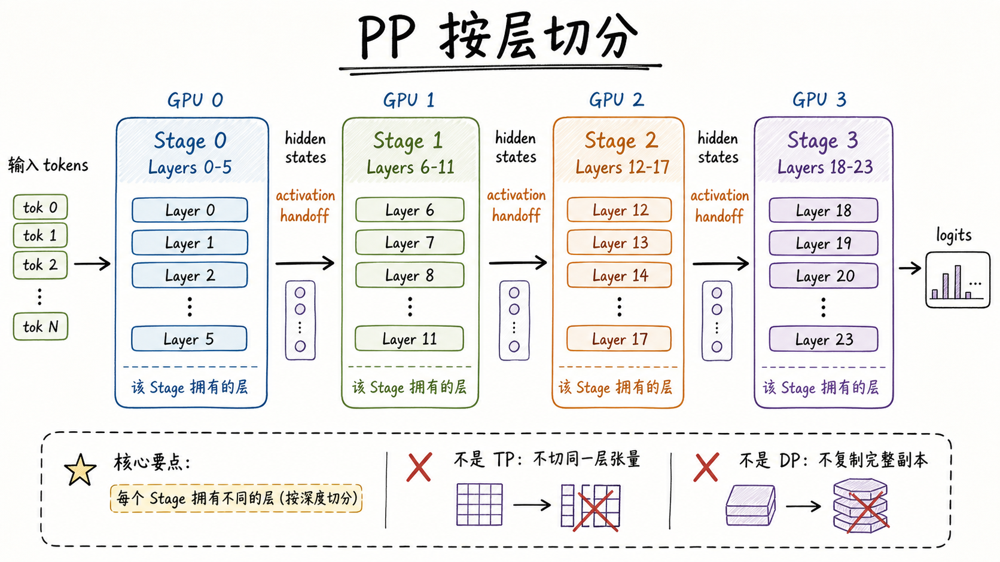
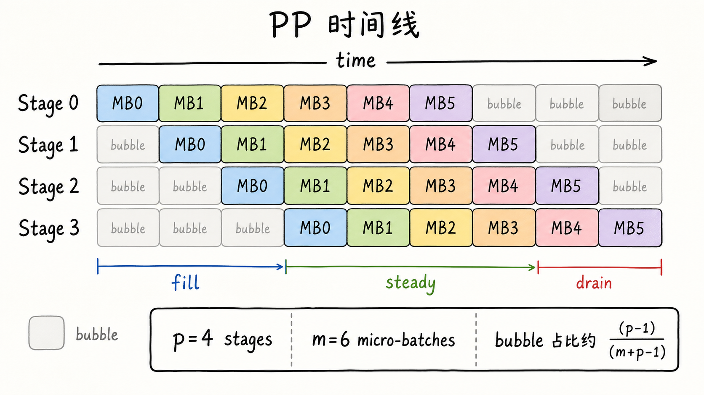
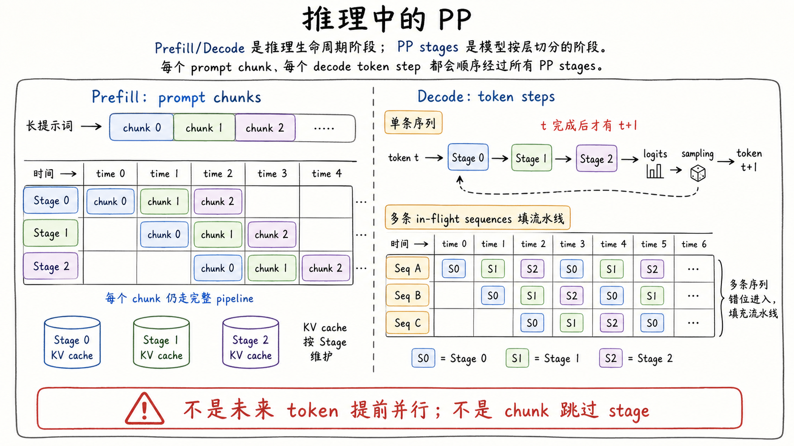
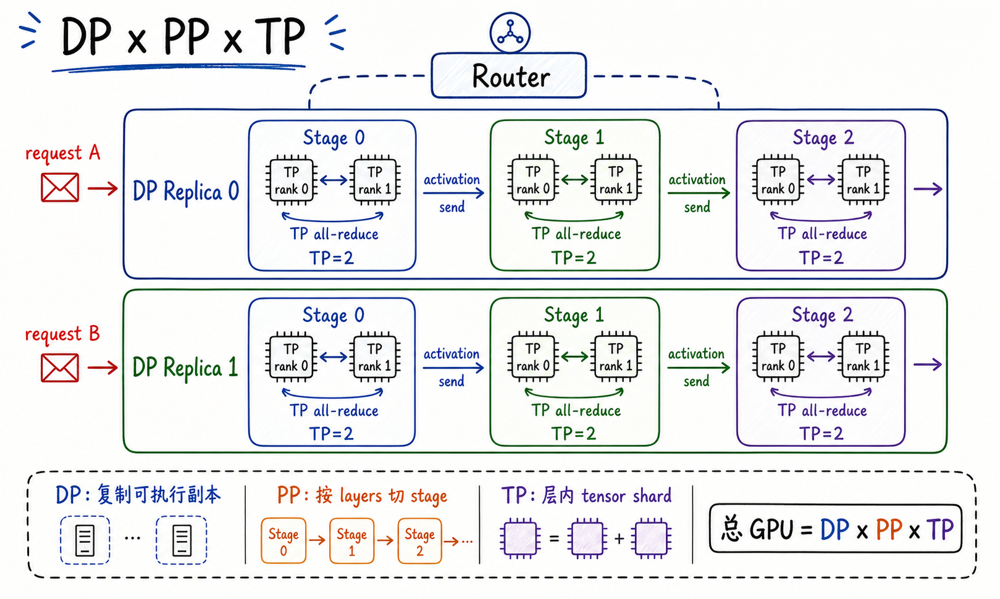
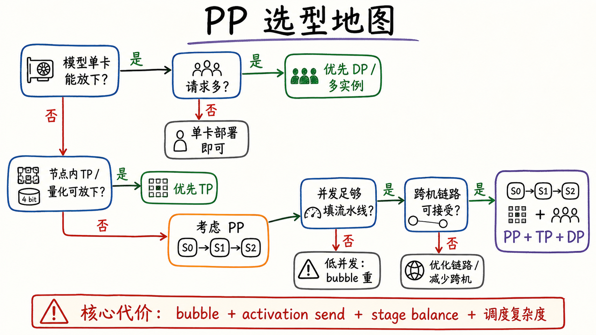

---
tags:
  - LLM
  - distributed-inference
  - pipeline-parallelism
  - model-parallelism
  - model-serving
updated: 2026-05-27
description: 从按层放置、流水线调度、pipeline bubble、推理 prefill/decode 和并行组合视角解释 Pipeline Parallelism，帮助判断什么时候该用 PP，以及它和 TP、DP 的边界。
---

# 大模型精讲系列 03：Pipeline Parallelism（PP）是什么

> [!Quote] 本篇导读
> PP（Pipeline Parallelism，流水线并行）的第一直觉是“把模型按层切到多张 GPU 上”，但真正难懂的部分并不在“切”，而在“切完以后怎样让这些 stage 不要互相空等”。如果说 TP 的灵魂是层内张量和 collective communication，DP 的灵魂是副本、分流和状态边界，那么 PP 的灵魂就是 stage、activation handoff、micro-batch、pipeline bubble、stage balance，以及吞吐和延迟之间的折中。

## 1. 从按层放置开始

### 1.1 为什么会遇到 PP

很多人第一次遇到 PP，不是在论文里看到 GPipe 或 1F1B，而是在一个更朴素的部署困境里。

一个模型有很多 Transformer layers。单张 GPU 放不下完整权重；TP 已经把单层内部的矩阵切开了，但继续扩大 TP size 又会让层内 collective 频繁跨节点，通信开销变得很重；DP 也帮不上忙，因为 DP 的前提是已经有一个可独立运行的模型执行单元可以复制。

这时还有一条路：既然 Transformer 本来就是一层接一层执行，能不能把前几层放到 GPU 0，中间几层放到 GPU 1，后面几层放到 GPU 2 和 GPU 3？

这就是 PP 出场的位置。

它解决的不是“不同请求怎么分流”，也不是“同一层的矩阵怎么切”，而是：

**一个模型的 layers 太多或太大时，能不能把连续层段分给不同设备，让一个请求依次经过多个 stage 完成推理。**

最简单的例子是一个 24 层 Transformer：

```text
Stage 0: layers 0-5
Stage 1: layers 6-11
Stage 2: layers 12-17
Stage 3: layers 18-23
```

输入 tokens 先经过 Stage 0，得到 hidden states；这些 hidden states 被发送给 Stage 1；Stage 1 再继续计算，再把新的 hidden states 发送给 Stage 2。直到最后一个 stage 输出 logits。



这张图要抓住三个点。

第一，PP stage 持有的是不同的层。Stage 0 不是完整模型，Stage 1 也不是完整模型。一个 stage 单独通常不能对外提供完整推理服务。

第二，stage 之间传递的主要运行时对象是 activation，也就是当前层段输出的 hidden states。它不是 TP 里的同层局部矩阵结果，也不是 DP 里的独立请求分流。真实部署里，一个 stage 可以由一张 GPU 承载，也可以由一个包含多个 TP ranks 的设备组承载；图中画成单 GPU 只是为了先抓住按层切分的直觉。

第三，单个请求不会因为 PP 而跳过层序依赖。它仍然必须按 Transformer 的深度顺序从前往后走完所有 stage。

### 1.2 PP 不是“更大的 DP”

PP 很容易被误读成“多张 GPU 各做一段，所以也算分流”。这个说法只对了一半。

如果看一条完整推理请求，PP 的各个 stage 不是并列副本，而是同一条计算路径上的连续环节。请求不能只走 Stage 2，也不能让 Stage 0 和 Stage 3 各自独立返回答案。它必须顺序经过完整 pipeline group。

所以 PP 的基本扩展单位不是单个 stage，而是一整条 pipeline：

```text
Pipeline group = Stage 0 -> Stage 1 -> ... -> Stage p-1
```

只有完整的 pipeline group 才能成为一个可对外接请求的模型执行单元。DP 可以复制这个执行单元，但不能把某个 stage 当成 DP replica。

这也解释了为什么 PP 和 DP 经常组合出现：

- PP 先让一个大模型执行单元成立；
- DP 再复制多条完整 pipeline group 来承接更多请求；

### 1.3 单请求延迟与总吞吐的第一层矛盾

按层切分以后，一个很自然的问题会出现：既然一个请求要依次走过所有 stage，那 PP 会不会让单请求更快？

通常不能这样期待。

对单个请求来说，如果没有足够并发工作可以重叠，PP 更像把一条串行计算路径拆成多段放在不同设备上。它能降低每张 GPU 的权重显存压力，也可能让每个 stage 的本地计算更轻，但它额外引入了 stage 间 activation send，并且下游 stage 必须等待上游 stage 的输出。

因此，PP 的关键收益不是“让一个 token 同时在所有层上并行完成”，而是：

**当有连续进入的 micro-batches、请求或 token 工作单元时，不同 stage 可以在同一时间处理不同工作，从而提高整条 pipeline 的设备利用率。**

这就是 PP 真正的教学主线：它从空间上的按层放置开始，但必须在时间上的流水线调度里才讲得完整。

## 2. 定义与边界

### 2.1 一个更准确的定义

**Pipeline Parallelism 指的是：把模型的连续 layers 划分成多个 pipeline stages，由不同设备或设备组分别保存和执行；运行时，输入 activation 按层序从前一 stage 传给后一 stage，多个 micro-batches 或 in-flight work 通过流水线调度在不同 stage 上重叠执行。**

再短一点：

**PP = 按 layers 切 stage，再用连续工作填流水线。**

这句话里的两个动作都不能少。

只讲“按 layers 切 stage”，容易把 PP 写成普通 model sharding：模型确实被放到多张 GPU 上，但如果没有 micro-batch 或请求级调度，多个 stage 很多时间仍然在等待，吞吐收益有限。

只讲“流水线调度”，又会忘记 PP 的第一约束：stage 的边界来自模型层序，stage 之间传 activation，不能随意把 Transformer 的层依赖打乱。

### 2.2 与 TP、DP 的边界

延续前两篇的心智模型，可以把三种并行策略放在同一张表里：

| 并行方式 | 切分对象 | 一个请求如何执行 | 主要收益 | 主要代价 |
| --- | --- | --- | --- | --- |
| DP | 完整可执行副本之间的工作 | 进入其中一个 replica | 扩请求吞吐 | 每个 replica 都要有完整执行单元和本地状态 |
| TP | 单层内部的张量、矩阵、head | 多个 rank 共同计算同一层 | 降低单层权重/计算压力 | 每层频繁 collective communication |
| PP | Transformer layers / stage | 顺序经过多个 stage | 降低单设备权重压力，减少某些跨节点 TP 热通信 | pipeline bubble、stage 间 activation send、调度复杂度 |

这张表最重要的不是术语，而是“一次请求”的路径。

DP 里，一次请求通常只进入一个 replica；TP 里，一次请求在同一层内部由多个 rank 共同算；PP 里，一次请求沿着 stage 依次向后走。

所以看到 `PP=2, TP=4, DP=3` 时，不应该把它理解成“24 个 stage”。更准确的理解是：

- 有 3 个 DP replicas；
- 每个 replica 是一条 2-stage pipeline；
- 每个 stage 内部由 4 个 TP ranks 共同计算该 stage 持有的 layers；
- 总 GPU 数通常为 $3 \times 2 \times 4 = 24$；

### 2.3 基础术语

PP 的术语不多，但每个都容易和 TP/DP 混在一起。

| 术语 | 含义 | 容易混淆的地方 |
| --- | --- | --- |
| stage | 一组连续 Transformer layers 组成的执行段 | stage 不是完整模型副本，也不一定等于一台机器 |
| pipeline group | 从第一个 stage 到最后一个 stage 的完整执行链路 | 一个 pipeline group 才能作为 DP replica 被复制 |
| micro-batch | 用于填充流水线的调度单位 | 训练里常对应 gradient accumulation 的 micro-batch，推理里可类比 chunk、request batch 或 in-flight work |
| activation handoff | stage 间传递 hidden states 的动作 | 不是 TP 的 all-reduce，也不是 DP 的请求路由 |
| pipeline bubble | stage 因等待上游或下游而空闲的时间 | 不是普通通信开销的同义词 |
| stage balance | 各 stage 计算时间、显存和通信负载是否均衡 | 不均衡时，整条 pipeline 会被最慢 stage 限速 |

把这些词放稳以后，PP 的核心就不再是“几张 GPU”，而是“每个 stage 持有什么、什么时候工作、什么时候等待”。

## 3. 流水线如何跑起来

### 3.1 单个请求的串行瀑布

先看最简单的情况：只有一个请求进入一条 4-stage pipeline。

```text
time 0: Stage 0 处理 request A
time 1: Stage 1 处理 request A，Stage 0 空闲
time 2: Stage 2 处理 request A，Stage 0/1 空闲
time 3: Stage 3 处理 request A，Stage 0/1/2 空闲
```

如果每个 stage 处理一个工作单元都需要同样时间，那么单个请求从头到尾仍然要走 4 个时间片。更糟的是，大多数时间只有一个 stage 在工作，其他 stage 都在等。

这就是 PP 的第一个反直觉点：

**只把模型切成多个 stage，并不会自动让所有 GPU 忙起来。**

要让流水线真的像流水线，需要连续的工作单元进入。

### 3.2 micro-batch 填流水线

假设现在有 6 个 micro-batches：MB0 到 MB5。Stage 0 不再等 MB0 完整走完所有 stage 才处理 MB1，而是在把 MB0 交给 Stage 1 后，立刻开始处理 MB1。

这时每个 micro-batch 仍然按顺序经过 Stage 0、Stage 1、Stage 2、Stage 3；但不同 micro-batches 可以同时位于不同 stage 上。



这张时间线可以分成三段：

- `fill`：流水线刚开始灌入工作，后面的 stage 还没有活干；
- `steady`：每个 stage 都在处理不同 micro-batch，设备利用率最高；
- `drain`：最后几个 micro-batches 逐步离开流水线，前面的 stage 开始空闲；

浅灰色的空闲格子就是 pipeline bubble。bubble 不是某次网络传输本身，而是 stage 因为没有可处理工作而空出来的时间。

### 3.3 一个气泡公式

为了建立数量级直觉，可以先看一个非常理想化的单向流水线模型。

设：

- $p$ 是 pipeline stages 数；
- $m$ 是 micro-batches 数；
- 每个 stage 处理一个 micro-batch 的时间近似相同；
- 暂时忽略通信开销和 stage 不均衡；

那么完成 $m$ 个 micro-batches 的时间步数大约是：

$$
m + p - 1
$$

其中 $m$ 是真正有工作通过最后一个 stage 的部分，$p-1$ 是 fill/drain 带来的额外空泡。于是流水线利用率可以粗略写成：

$$
\text{utilization} \approx \frac{m}{m + p - 1}
$$

这里的 utilization 是平均 stage 利用率和吞吐直觉，而不是说只有最后一个 stage 的输出才算“有效工作”。对应的 bubble 占比约为：

$$
\text{bubble ratio} \approx \frac{p - 1}{m + p - 1}
$$

如果 $p=4$、$m=6$：

$$
\text{bubble ratio} \approx \frac{3}{9} = 33.3\%
$$

把 $p=4$ 固定住，可以更直观看到 micro-batch 数量的影响：

| stages $p$ | micro-batches $m$ | 总步数近似 $m+p-1$ | bubble 占比近似 | 直觉 |
| --- | --- | --- | --- | --- |
| 4 | 1 | 4 | 75% | 单个工作几乎只是串行穿过 pipeline |
| 4 | 2 | 5 | 60% | 有一点重叠，但多数 stage 仍然常空等 |
| 4 | 6 | 9 | 33.3% | 已经能看到稳态区间 |
| 4 | 16 | 19 | 15.8% | bubble 被更长的稳态摊薄 |

这不是一个精确性能模型，但它能解释一个核心事实：**micro-batches 越少，bubble 越明显；stages 越多，流水线越难填满。** 增加 micro-batches 改善的是流水线平均利用率，不是让单个请求绕过所有 stage 的顺序路径。真实系统还要叠加 stage 不均衡、stage 间通信、1F1B、interleaving 或 zero-bubble 类 schedule，因此这个比例更适合做平均空闲占比的第一层直觉，而不是直接当成 benchmark 预测公式。

### 3.4 GPipe、1F1B 与 interleaving

PP 最早被系统化讨论时，训练场景占据了很大篇幅。虽然本文面向推理理解，但这些调度名字值得知道，因为很多框架和文档会沿用它们。

GPipe 的典型调度可以理解成 fill-drain：先把多个 micro-batches 的 forward 灌入 pipeline，再统一做 backward。它的优点是概念清楚，缺点是需要保留较多 forward activations，且 fill/drain bubble 仍然存在。

1F1B 指 one-forward-one-backward。在训练稳态中，每个 stage 尽量交替执行一个 forward 和一个 backward，从而降低 activation 常驻压力，并改善流水线稳态。它仍然有 warmup 和 cooldown，只是比单纯 fill-drain 更适合大规模训练。

Interleaved pipeline parallelism 则把一个物理 rank 上的层再拆成多个 virtual stages 或 model chunks。这样可以让调度粒度更细，理想情况下减少 bubble。但代价也很明确：stage 边界变多，调度和通信更复杂，对模型层数、切分均衡和框架实现都有要求。

推理读者不需要把这些训练 schedule 记成反向传播流程图。更重要的是理解它们背后的共同问题：

**PP 的性能不只取决于模型怎么切，还取决于工作单元如何排班。**

## 4. 气泡、均衡与代价

### 4.1 最慢 stage 决定节拍

在理想公式里，每个 stage 处理一个 micro-batch 的时间一样。但真实模型很少这么整齐。

有些层可能包含更重的 MLP；有些 stage 可能因为 embedding、LM head、MoE expert、KV cache 布局或硬件位置而更慢；跨节点 stage 之间还会有网络传输延迟。

如果第 $i$ 个 stage 的处理时间是 $T_i$，那么流水线稳态的节拍大致受最慢 stage 限制：

$$
T_{\text{cycle}} \approx \max_i T_i
$$

这意味着，只要有一个 stage 明显更慢，其他 stage 即使很快，也会经常等待它。PP 不是平均主义系统，它更像一条装配线：最慢工位决定整条线的节奏。

所以工程上做 PP 切分时，不能只追求“每个 stage 分到相同层数”。更合理的目标是让每个 stage 的计算时间、显存压力和通信位置尽量均衡。

### 4.2 stage 间通信

PP 的通信主要发生在相邻 stage 之间。Forward 时，上游 stage 把 activation 发给下游 stage；训练 backward 时，下游 stage 还要把 activation gradient 传回上游。

在推理里，最常见的 forward activation 大小可以粗略估算为：

$$
M_{\text{activation}} \approx B_{\text{micro}} \times S \times H \times \text{bytes}
$$

其中：

- $B_{\text{micro}}$ 是 micro-batch 大小；
- $S$ 是序列长度或当前 chunk/token 维度；
- $H$ 是 hidden size；
- `bytes` 是每个元素占用字节数，例如 FP16/BF16 通常是 2；

这个通信和 TP 的通信形态不同。

TP 经常在每层内部发生 collective communication，例如 all-reduce、all-gather 或 reduce-scatter。它的频率高，路径热，适合放在 NVLink/NVSwitch 这样的高速互联内。

PP 通常在 stage 边界传 activation，频率相对跟 stage 边界和 micro-batch 调度相关。跨节点部署时，一个常见策略是：尽量让 TP group 留在节点内，把不同节点放在不同 PP stage 上。这样可以避免让每层 TP collective 跨慢链路，但代价是引入 stage 间 activation send 和 pipeline bubble。

这就是为什么 vLLM 文档会建议：如果单节点内可以用 TP 放下模型，优先在节点内使用 TP；当跨节点 TP 代价太高，或模型无法在单节点内放下时，再考虑 PP 或 TP+PP 组合。

### 4.3 PP 对显存的影响

PP 最直接的收益是降低单个 stage 需要保存的权重。

如果一个模型有 $L$ 层，切成 $p$ 个相对均衡的 stages，那么每个 stage 大致保存其中 $\frac{L}{p}$ 层的权重。真实系统还要考虑 embedding、LM head、norm、KV cache、通信 buffer、CUDA graph/workspace 和框架运行时开销，但按层权重压力确实会被分摊。

KV cache 的情况更细一点。

在推理中，每个 stage 只负责自己持有的 layers，因此它维护的 KV cache 也主要对应这些 layers。PP 不会让某个 stage 保存全模型所有层的 KV cache；但它也不会让 KV cache 消失。长上下文和高并发仍然会在各个 stage 上累积运行时状态。

所以可以把 PP 对显存的影响拆开看：

- 权重显存：随 layers 切分明显下降；
- KV cache：按 stage 持有的 layers 分布，但仍随序列长度、并发和 KV heads 增长；
- activation/通信 buffer：随 micro-batch、chunk、hidden size 和调度策略变化；
- 空泡成本：不占显存，但会降低设备利用率；

### 4.4 单请求延迟的代价

PP 对吞吐和延迟的影响经常被混在一起。

对一个低并发、只关心单请求延迟的场景，PP 不一定是好选择。请求必须顺序经过所有 stage，并且每个 stage 边界可能产生通信等待。即使每个 stage 的本地计算少了，端到端路径仍然包含所有 stage。

对高并发或批量推理场景，PP 才更容易发挥价值。因为 Stage 0 正在处理请求 A 的后续 chunk 时，Stage 1 可以处理请求 B 的中间 hidden states，Stage 2 可以处理请求 C 的后续阶段。吞吐收益来自这种时间重叠，而不是单个 token 的层序依赖被消除。

因此，判断 PP 时要同时看：

- TTFT（Time To First Token）是否变差；
- TPOT（Time Per Output Token）是否稳定；
- 总吞吐是否提升；
- 每个 stage 的利用率是否均衡；
- pipeline bubble 是否被足够并发工作稀释；

## 5. 推理部署中的 PP

### 5.1 prefill 与 decode 不是 PP stage

在 LLM 推理里，prefill 和 decode 是两个时序阶段。

Prefill 处理 prompt，把历史 tokens 的 K/V 状态建立起来。它通常是大块矩阵计算，计算密度高，也更容易通过 chunk 或 micro-batch 形成足够工作量。

Decode 每步生成一个新 token。每个新 token 都依赖前面已经生成的 tokens 和 KV cache，所以单条序列本身存在逐 token 依赖。Decode 阶段通常依靠多条 in-flight sequences 的 token steps 来填充流水线；同一 sequence 的下一 token 仍必须等待上一 token sampling 完成。

PP stage 切的是模型 layers。prefill/decode 切的是推理生命周期。它们不是同一维度。



把 prefill/decode 放回 PP 视角后，关键区别在于：它们都要经过完整 pipeline，只是工作形态不同。Prefill 可能以较大的 prompt chunk 形式进入流水线；图中的 chunk 位置表示流水线中的错位执行，每个 chunk 仍会顺序经过所有 PP stages。Decode 则通常依靠多条 in-flight sequences 的 token steps 错位进入流水线。每个 stage 维护自己负责 layers 的 KV cache，最后 stage 输出 logits，再进入 sampling 得到 next token。

用一个具体例子看，单条序列在 decode token $t$ 时，仍然要顺序走完：

```text
token t -> Stage 0 -> Stage 1 -> Stage 2 -> Stage 3 -> logits -> sampling -> token t+1
```

只有当 token $t$ 的 sampling 完成后，下一步 token $t+1$ 才真正存在。PP 能重叠的是不同序列或不同请求的工作。例如 Seq A 的 token $t$ 位于 Stage 2 时，Seq B 的 token $k$ 可以位于 Stage 1，Seq C 的 token $r$ 可以刚进入 Stage 0。这样多个 in-flight sequences 才能把 decode 阶段的 pipeline 填起来。

### 5.2 PP 如何和 TP、DP 组合

大模型服务里常见的并行组合不是单独一个 PP 参数，而是 DP、PP、TP 一起出现。

假设：

```text
DP=2, PP=3, TP=2
```

那么可以理解为：

- 有 2 条完整 pipeline groups，作为 2 个 DP replicas；
- 每条 pipeline group 有 3 个 stages；
- 每个 stage 内部由 2 个 TP ranks 共同计算该 stage 的 layers；
- 总 GPU 数通常为 $2 \times 3 \times 2 = 12$；



这张图要避免一个常见误读：DP replica 之间不传 activation。Router 把不同请求分给不同完整 pipeline group；进入某个 pipeline group 后，请求才沿着 Stage 0、Stage 1、Stage 2 依次前进。TP 通信则发生在每个 stage 内部的 TP group 中。

也就是说：

- DP 的边界在完整 pipeline group 之间；
- PP 的边界在连续 layer stages 之间；
- TP 的边界在同一个 stage 内部的 layer 计算里；

### 5.3 vLLM 中的实践直觉

在 vLLM 的服务配置中，常见入口包括：

```bash
vllm serve $MODEL \
  --tensor-parallel-size 4 \
  --pipeline-parallel-size 2
```

也可以和 DP 组合：

```bash
vllm serve $MODEL \
  --data-parallel-size 2 \
  --pipeline-parallel-size 2 \
  --tensor-parallel-size 4
```

这些参数不能只按乘法记 GPU 数。真正要看的是并行轴含义：

- `--tensor-parallel-size` 决定同一 stage 内部多少 ranks 共同计算层内张量；
- `--pipeline-parallel-size` 决定一条模型执行链路被切成多少 stages；
- `--data-parallel-size` 决定有多少条可接请求的执行副本；

需要注意，vLLM 的数据并行部署还可能涉及 internal、hybrid 或 external load balancing，以及 MoE DP+EP 组合下的额外边界。这里先把 DP 抽象成“完整执行单元之间的请求分流”，是为了帮助读者理解 PP、TP、DP 三个轴的核心差异；具体线上拓扑仍要回到 vLLM 当前文档和启动方式核对。

vLLM 文档给出的一个重要部署直觉是：如果模型能放进单张 GPU，通常不需要为了放下模型而启用分布式并行；如果模型放不进单张 GPU、但能在单节点多 GPU 内放下，优先使用节点内 TP；如果模型需要跨多节点，常见做法是让 TP size 对齐每节点 GPU 数，让 PP size 对齐节点数，从而减少跨节点 TP collective。对于没有 NVLink 的环境，或者模型大小不能被单纯 TP 均匀切分时，PP 也可能是更自然的候选方案。

但这不是说 PP 一定更快。vLLM 的优化文档也提醒，PP 能降低每张 GPU 的权重显存压力，但可能带来 latency penalty。实际部署仍然要用真实 workload benchmark，看 TTFT、TPOT、throughput、GPU utilization 和 OOM 行为。

### 5.4 其他框架里的入口

有了 stage、schedule 和 pipeline group 三个判断标准后，再看框架入口就不容易被参数名误导。不同框架给 PP 的入口不完全一样；与其背参数名，不如看它到底在描述 stage 切分、schedule，还是普通模块放置。

| 框架/生态 | 常见入口 | 更偏向 | 读者应避免的误解 |
| --- | --- | --- | --- |
| PyTorch `torch.distributed.pipelining` | `PipelineStage`、`ScheduleGPipe`、`Schedule1F1B`、`ScheduleInterleaved1F1B` 等代表性 schedule | 通用 pipeline runtime，文档仍带 alpha 色彩 | 不要只记 schedule 名字，要看 stage 形状、microbatch 和运行时调度 |
| Megatron Core | `pipeline_model_parallel_size`、`tensor_model_parallel_size`、`virtual_pipeline_model_parallel_size` | 大规模训练与模型并行组合 | `virtual_pipeline_model_parallel_size` 是 interleaving/model chunks 思路，不是随意打乱层顺序 |
| DeepSpeed | `PipelineModule(layers, num_stages)`、gradient accumulation | 训练流水线 | 训练里的 backward、gradient accumulation 不能直接等同于推理服务里的 request/token 调度 |
| vLLM | `--pipeline-parallel-size`、`--tensor-parallel-size`、`--data-parallel-size` | 推理服务部署 | 不要只按乘法看 GPU 数，要看 DP replica、PP stage、TP group 的边界 |
| Hugging Face Transformers / Accelerate | Transformers 常见 `tp_plan="auto"`；Accelerate 有 `prepare_pippy` | TP 推理更常见，PP 多依托 PyTorch/PiPPy 路线 | `tp_plan` 是 TP 心智模型；`device_map` 把层放到多设备不一定等于有 schedule 的 PP |

工程上最稳妥的做法是看两个问题：

1. 模型是否真的被划成 pipeline stages；
2. 运行时是否有 schedule 在多个 micro-batches 或 in-flight work 上重叠不同 stage；

只有两个条件同时出现，才更接近本文讨论的 PP。

## 6. 工程判断

### 6.1 什么时候考虑 PP

可以先用一个简单选型地图建立判断顺序。



PP 通常适合这些场景：

- 模型单副本放不进单张 GPU，且按 layers 切分比较自然；
- TP 已经使用到节点内高速互联的合理上限，继续扩大 TP 会跨节点触发高频 collective；
- 单节点放不下完整模型，需要跨节点组成一个执行单元；
- 模型层数较深，可以切出相对均衡的 stages；
- 有足够并发请求、chunked prefill、批量推理或 in-flight work 可以填充流水线；
- 单请求延迟不是唯一目标，总吞吐和可部署性更重要；

### 6.2 什么时候不该优先 PP

PP 也有不适合的场景。

如果模型单卡能放下，主要问题是请求太多，优先看 DP、多实例或负载均衡，而不是把一个本来能完整运行的模型切成多个 stages。

如果瓶颈主要在单层矩阵、attention heads 或 MLP 维度，优先看 TP、kernel、量化或模型结构优化。PP 切层不能直接解决单层内部计算太重的问题。

如果请求量很低，或者业务强依赖极低单请求延迟，PP 的 bubble 和 stage 间等待可能让收益不明显，甚至变差。

如果模型层无法均衡切分，某些 stage 明显更慢，整条 pipeline 会被最慢 stage 卡住。继续增加 PP size 只会制造更多边界和 bubble。

如果跨机链路很弱，而 stage 间 activation 很大，也要谨慎。PP 能避免跨节点 TP collective，但不是免费午餐：activation send 仍然可能成为新瓶颈。

### 6.3 部署检查清单

部署或评估 PP 前，可以按下面顺序检查：

1. 模型权重压力主要来自层数/总层权重，还是来自单层内部矩阵；
2. 当前 TP size 是否已经受限于跨节点 collective；
3. 每个 stage 分到的 layers、embedding、LM head、norm 等是否均衡；
4. 相邻 stage 是否跨节点，activation 大小是否可接受；
5. prefill 是否能通过 chunk 或 batch 提供足够工作量；
6. decode 阶段是否有足够 in-flight sequences 填充流水线；
7. KV cache 是否按 stage 分布后仍然可能 OOM；
8. PP 后 TTFT、TPOT、throughput 是否在真实 workload 下改善；
9. 每个 stage 的 GPU utilization 是否接近，还是某个 stage 长期拖后腿；
10. 是否需要 DP 复制完整 pipeline group 来扩请求吞吐；

这份清单的核心不是“PP size 设成多少”，而是追问：**流水线能不能被填满，stage 能不能均衡，通信能不能承受。**

## 7. 常见误区与最终心智模型

### 7.1 “PP 会让单个请求天然更快”

不准确。单个请求仍然要顺序经过所有 stages。PP 的主要收益来自降低单设备显存压力，以及在多个 micro-batches、请求或 token 工作单元之间重叠不同 stage 的计算。低并发时，PP 可能带来更多等待和通信。

### 7.2 “一个 stage 就是一个 DP replica”

不准确。一个 stage 只持有模型的一段 layers，通常不能独立完成推理。完整的 pipeline group 才能作为 DP replica 被复制和路由。

### 7.3 “PP 等于把请求分给不同 GPU”

不准确。把不同请求分给不同完整副本是 DP 或多实例负载均衡。PP 是同一个请求沿着多个 stages 前进。多个请求可以同时处于不同 stages，但它们仍然在各自 pipeline group 中按层序执行。

### 7.4 “PP size 越大越好”

不准确。PP size 越大，每个 stage 的权重压力可能越小，但 pipeline bubble、stage 边界、调度复杂度和通信路径也会增加。没有足够 micro-batches 或 in-flight work 时，更多 stages 反而可能降低利用率。

### 7.5 “device_map 把层放到多卡就是 PP”

不一定。按模块放置只能说明模型被分布到多设备上；是否是 PP，还要看是否存在明确的 pipeline stages、activation handoff 和 micro-batch schedule。如果只是一个请求顺序从 GPU 0 跑到 GPU 1，再跑到 GPU 2，而没有流水线重叠，更接近顺序 model sharding。

### 7.6 最终心智模型

理解 PP，可以始终抓住四句话。

第一，PP 切的是 Transformer layers。每个 stage 持有连续层段，stage 之间传 hidden states。

第二，一个 stage 不是完整模型副本。完整 pipeline group 才是可对外接请求的执行单元，DP 可以复制这个执行单元。

第三，PP 的性能关键在时间调度。没有足够 micro-batches、请求或 token 工作单元填充流水线，就会出现明显 bubble。

第四，PP 是显存、互联和调度之间的工程折中。它常用于模型太大、跨节点 TP 太贵、需要组合 TP/DP 的场景；它不是默认更快的按钮。

所以，看到 `pipeline_parallel_size` 时，不要只问“用了几张 GPU”，而要问：

**模型按哪些 layers 切成 stage？stage 间传什么 activation？流水线由什么工作单元填满？bubble 有多大？这条 pipeline 是否还要被 DP 复制？**

## 8. 参考资料

1. [GPipe: Efficient Training of Giant Neural Networks using Pipeline Parallelism](https://arxiv.org/abs/1811.06965)：用于理解按层切分、micro-batch、fill-drain 和 pipeline bubble 的经典来源；
2. [PipeDream: Generalized Pipeline Parallelism for DNN Training](https://arxiv.org/abs/1806.03377)：用于理解训练流水线、1F1B 思路、负载均衡和跨机器 pipeline 的历史背景；
3. [Efficient Large-Scale Language Model Training on GPU Clusters Using Megatron-LM](https://arxiv.org/abs/2104.04473)：用于理解 TP、PP、DP 组合和 interleaved pipeline parallelism；
4. [PyTorch Documentation: `torch.distributed.pipelining`](https://docs.pytorch.org/docs/stable/distributed.pipelining.html)：用于核对 `PipelineStage`、microbatch 和 GPipe/1F1B/interleaved schedule 术语；
5. [Megatron Core Documentation: pipeline_parallel](https://docs.nvidia.com/megatron-core/developer-guide/latest/api-guide/pipeline_parallel.html)：用于核对 Megatron Core 中 pipeline schedules 和 stage 间通信接口；
6. [Megatron Core Documentation: ModelParallelConfig](https://docs.nvidia.com/megatron-core/developer-guide/latest/apidocs/core/core.model_parallel_config.html)：用于核对 `tensor_model_parallel_size`、`pipeline_model_parallel_size`、`virtual_pipeline_model_parallel_size` 的含义；
7. [DeepSpeed Pipeline Parallelism Tutorial](https://www.deepspeed.ai/tutorials/pipeline/)：用于理解 `PipelineModule`、`num_stages`、micro-batch 和训练流水线实践；
8. [vLLM Documentation: Parallelism and Scaling](https://docs.vllm.ai/en/latest/serving/parallelism_scaling.html)：用于理解 vLLM 中 TP、PP、DP 的部署建议和多节点取舍；
9. [vLLM Documentation: Optimization and Tuning](https://docs.vllm.ai/en/stable/configuration/optimization/)：用于理解 PP 降低权重显存但可能带来 latency penalty，以及 chunked prefill 对推理调度的影响；
10. [vLLM Documentation: Engine Arguments](https://docs.vllm.ai/en/stable/configuration/engine_args/)：用于核对 `--pipeline-parallel-size`、`--tensor-parallel-size`、`--data-parallel-size` 等入口参数；
11. [Hugging Face Accelerate: `prepare_pippy`](https://huggingface.co/docs/accelerate/main/en/package_reference/inference)：用于理解 Hugging Face 生态中依托 PyTorch/PiPPy 的 pipeline inference 入口；
12. [Hugging Face Transformers: Distributed inference with tensor parallelism](https://huggingface.co/docs/transformers/main/perf_infer_gpu_multi)：用于反向区分 `tp_plan="auto"` 属于 TP 心智模型，而不是 PP 主入口；

## 9. 学习测评

### 9.1 题目

1. 单选：PP 最核心的切分对象是什么？
   A. 用户请求；
   B. 单层内部矩阵列和行；
   C. Transformer layers / pipeline stages；
   D. optimizer state；

2. 单选：一个 PP stage 通常意味着什么？
   A. 一份完整可对外服务的模型副本；
   B. 一组连续 Transformer layers 的执行段；
   C. 一个只负责请求路由的 API server；
   D. 一个必须包含全模型 KV cache 的缓存池；

3. 多选：关于 PP、TP、DP 的边界，哪些说法正确？
   A. TP 关注同一层内部张量如何被多个 rank 共同计算；
   B. DP 关注完整可执行副本之间如何切分请求或数据；
   C. PP 关注模型 layers 如何切成多个 stage；
   D. PP stage 可以直接等价为 DP replica；

4. 单选：`PP=2, TP=4, DP=3` 更准确的理解是？
   A. 一共有 24 个 pipeline stages；
   B. 有 3 个 DP replicas，每个 replica 有 2 个 stages，每个 stage 内部 TP=4；
   C. 有 2 个 DP replicas，每个 replica 内部 TP=12；
   D. 24 张 GPU 同时处理同一个 stage；

5. 多选：pipeline bubble 通常来自哪些原因？
   A. 流水线刚开始 fill 时，后面的 stage 暂时没有工作；
   B. 流水线 drain 时，前面的 stage 开始空闲；
   C. micro-batch 或 in-flight work 太少，无法填满所有 stage；
   D. 每个 stage 都永久满载；

6. 单选：在理想单向流水线里，设 $p$ 个 stages、$m$ 个 micro-batches，bubble 占比的常见直觉近似是？
   A. $\frac{m}{p}$；
   B. $\frac{p-1}{m+p-1}$；
   C. $\frac{p}{m-p}$；
   D. $\frac{1}{m \times p}$；

7. 单选：为什么增加 micro-batches 通常能稀释 bubble？
   A. 因为它减少了模型层数；
   B. 因为更多连续工作能让多个 stage 在稳态中同时忙起来；
   C. 因为它消除了所有 stage 间通信；
   D. 因为它让每个 stage 都保存完整模型；

8. 多选：关于 GPipe、1F1B 和 interleaved PP，哪些说法更准确？
   A. GPipe 可理解为 fill-drain 风格的 micro-batch 流水；
   B. 1F1B 在训练稳态中交替 forward/backward，有助于降低 activation 常驻压力；
   C. interleaved PP 通常通过 virtual stages/model chunks 减少 bubble；
   D. interleaved PP 意味着可以随意打乱 Transformer 层顺序；

9. 单选：PP stage 间 forward 通信主要传递什么？
   A. optimizer state；
   B. hidden states / activations；
   C. 下游 stage 需要的完整模型权重；
   D. 完整模型权重副本；

10. 多选：关于 PP 和推理 prefill/decode 的关系，哪些说法正确？
    A. prefill/decode 是推理生命周期阶段，不是 PP stage；
    B. decode 中一个新 token 仍然要顺序经过所有 PP stages；
    C. 每个 stage 通常维护自己负责 layers 的 KV cache；
    D. PP 可以让未来 token 同时被解码，不再受自回归依赖约束；

11. 单选：为什么低并发场景下 PP 可能收益不明显？
    A. 因为没有足够工作填满流水线，bubble 较重；
    B. 因为低并发一定会让 TP collective 变快；
    C. 因为 PP 会复制完整模型副本；
    D. 因为低并发不需要 KV cache；

12. 多选：哪些情况更适合考虑 PP？
    A. 单节点放不下完整模型，需要跨节点组成一个执行单元；
    B. TP 已经到节点内合理上限，继续扩大 TP 会跨慢链路；
    C. 有足够 in-flight work 可以填充流水线；
    D. 模型单卡能放下，唯一问题是请求太多；

13. 单选：对于“模型单卡能放下，但请求很多”的推理服务，通常优先考虑什么？
    A. DP、多实例或请求级负载均衡；
    B. 直接增大 PP size；
    C. 把每个 layer 都切成一个 stage；
    D. 先把每个请求都固定拆成多个 pipeline stages，即使没有显存压力；

14. 多选：PP 的主要代价包括哪些？
    A. pipeline bubble；
    B. stage 间 activation send；
    C. stage balance 难题；
    D. 必然消除所有通信成本；

15. 单选：为什么 `device_map="auto"` 或“把层放到多张 GPU”不一定等于 PP？
    A. 因为它可能只是模块放置，没有明确 micro-batch schedule 和流水线重叠；
    B. 因为只要层在不同 GPU 上，就一定会自动产生 micro-batch 重叠；
    C. 因为 PP 只能在训练中出现；
    D. 因为 PP 不允许按层放置；

16. 多选：部署 PP 前更值得检查哪些指标或条件？
    A. 每个 stage 的 GPU utilization；
    B. TTFT、TPOT 和总吞吐；
    C. 相邻 stage 的 activation 大小和链路位置；
    D. 只看总 GPU 数，不看 stage 切分；

17. 单选：PP x TP x DP 组合中，DP 的边界通常在哪里？
    A. 单个 attention head 之间；
    B. 完整 pipeline group 之间；
    C. 同一个 Linear 层的列分片之间；
    D. 同一 stage 内部的 TP ranks 之间；

18. 多选：关于“PP size 越大越好”的判断，哪些反驳是合理的？
    A. PP size 增大可能增加 bubble；
    B. PP size 增大可能增加 stage 边界和调度复杂度；
    C. 如果没有足够并发工作，更多 stages 可能降低利用率；
    D. PP size 增大一定会让单请求延迟线性下降；

19. 单选：一个 70B 模型单节点 8 卡放不下；继续扩大 TP 会跨节点做高频 collective，业务有较高并发请求。更合理的优先方向是？
    A. 只增加 DP，因为 DP 可以让每个 replica 自动变小；
    B. 让 TP group 尽量留在节点内，再用 PP 跨节点组成完整 pipeline group；
    C. 把每个 stage 当成一个独立 replica 直接接不同请求；
    D. 关闭 batching，只保留单请求串行执行；

20. 多选：如果一条 4-stage pipeline 中 Stage 2 明显慢于其他 stages，哪些判断更合理？
    A. 整条 pipeline 的稳态节拍会被 Stage 2 限制；
    B. 其他 stages 可能出现等待，即使它们本地计算更快；
    C. 单纯继续增加 PP size 一定能解决该瓶颈；
    D. 需要重新检查 layers、embedding/LM head、KV cache、通信位置等是否均衡；

21. 多选：关于 PP 中 KV cache 与 activation 通信，哪些说法正确？
    A. 每个 stage 通常维护自己负责 layers 的 KV cache；
    B. PP 会让 KV cache 完全消失；
    C. stage 间 forward 通信主要传 hidden states / activations；
    D. 长上下文和高并发仍可能让各 stage 的运行时状态增长；

### 9.2 答案与题解

错题回看建议：1-4 题回看第 2 章；5-8 题回看第 3 章；9-11 题回看第 4、5 章；12-18 题回看第 6、7 章；19-21 题回看第 4、5、6 章。

1. C。PP 切的是 Transformer layers / pipeline stages；A 更像 DP；B 更像 TP；D 属于 ZeRO/FSDP 一类训练状态切分；

2. B。一个 stage 是连续层段的执行单元，不是完整模型副本。完整 pipeline group 才能对外完成一次推理；

3. A、B、C。TP、DP、PP 分别对应层内张量、完整副本之间的工作、层序 stage。D 错在把 stage 当成可独立服务的完整副本；

4. B。`PP=2, TP=4, DP=3` 表示 3 个 DP replicas；每个 replica 是 2-stage pipeline；每个 stage 内部有 4 个 TP ranks；

5. A、B、C。Bubble 来自 fill、drain 和工作不足等空等时间。D 是理想稳态，不是 bubble 来源；

6. B。理想单向流水线中，总步数约为 $m+p-1$，平均 stage 利用率约为 $\frac{m}{m+p-1}$，所以空泡直觉约为 $\frac{p-1}{m+p-1}$。它是一个平均利用率模型，不是只统计最后一个 stage；

7. B。更多 micro-batches 能让 Stage 0、Stage 1、Stage 2 等同时处理不同工作，从而延长 steady state，稀释 fill/drain 空泡；

8. A、B、C。Interleaving 是通过 virtual stages/model chunks 调整调度粒度，不是随意打乱模型层序。D 错；

9. B。Forward 阶段相邻 stage 主要传 hidden states / activations。训练 backward 还会传 activation gradient；

10. A、B、C。Prefill/decode 是推理时序阶段；PP stage 是模型层切分维度。多条 in-flight sequences 的 token steps 可以错位填流水线，但同一 sequence 的下一 token 必须等上一 token sampling 完成。Decode 仍受自回归依赖限制，D 错；

11. A。低并发时没有足够 in-flight work 填满 pipeline，多个 stage 容易等待。PP 不会自动复制完整模型副本，也不会取消 KV cache；

12. A、B、C。PP 更适合模型太大、跨节点 TP 太贵、并发足够填流水线的场景。D 更适合优先考虑 DP 或多实例；

13. A。单卡能放下而请求很多时，瓶颈通常是吞吐扩容，DP、多实例或负载均衡更直接；

14. A、B、C。PP 的核心代价包括 bubble、stage 间 activation send、stage balance 和调度复杂度。D 是错误的绝对化说法；

15. A。按模块放置不一定有 pipeline schedule。如果没有 micro-batch 流水重叠，就更接近顺序 model sharding 或 device placement。真正的 PP 需要 stage 边界、activation handoff 和调度机制共同成立；

16. A、B、C。评估 PP 要看 stage 利用率、端到端延迟、吞吐、activation 大小和互联位置。D 是典型误判；

17. B。DP 复制的是完整可执行单元。在 PP 组合里，这个单元通常是一整条 pipeline group；

18. A、B、C。更大的 PP size 会降低单 stage 权重压力，但也可能增加 bubble、边界和调度复杂度。D 错在把 PP 当成单请求延迟加速器；

19. B。跨节点高频 TP collective 通常代价较高，常见做法是让 TP group 尽量留在节点内，用 PP 把不同节点组织成完整 pipeline group。DP 复制的是完整可执行单元，不能让单个 replica 自动变小；stage 也不能当成独立 replica；

20. A、B、D。PP 稳态节拍受最慢 stage 限制，其他 stage 会被迫等待。增加 PP size 可能增加边界、bubble 和调度复杂度，不一定解决 stage imbalance；更应检查层切分、特殊层、KV cache、通信位置和利用率；

21. A、C、D。推理中每个 stage 主要维护自己负责 layers 的 KV cache；stage 间 forward 主要传 activations。PP 能分摊权重和部分 KV cache 压力，但不会让 KV cache 消失，长上下文和高并发仍会累积运行时状态；
