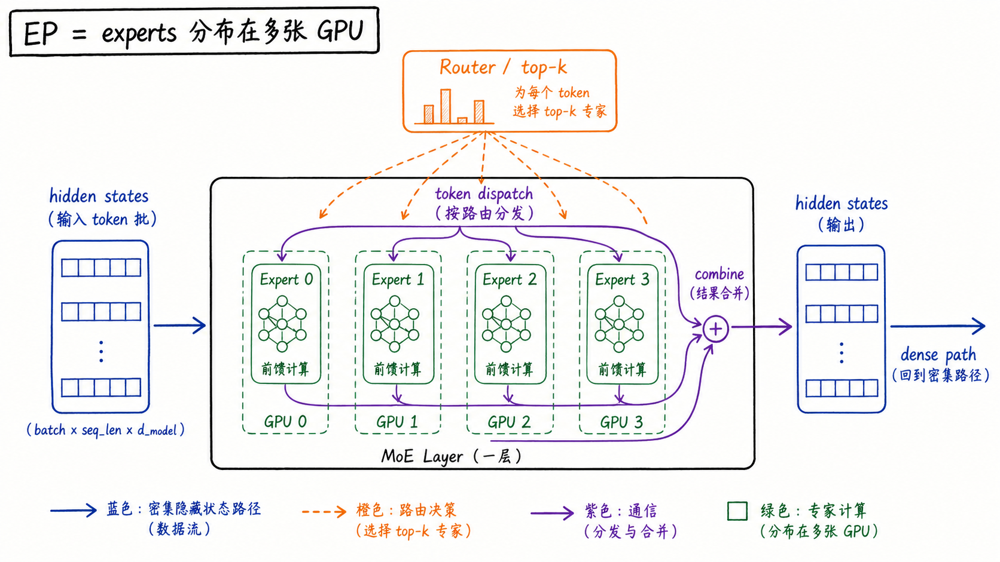
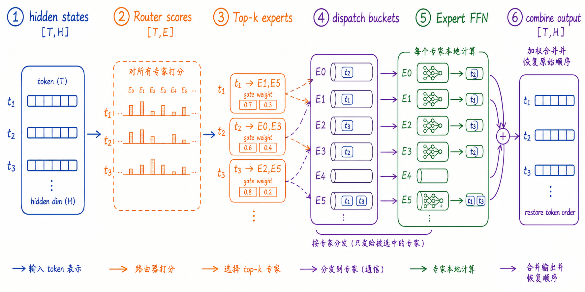
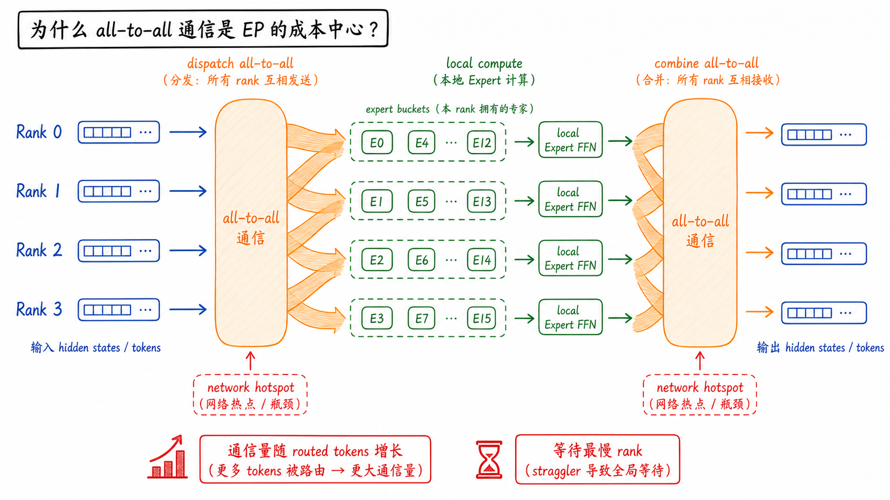
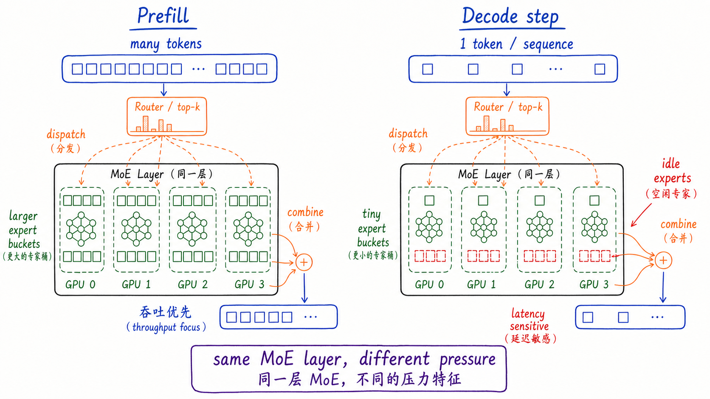
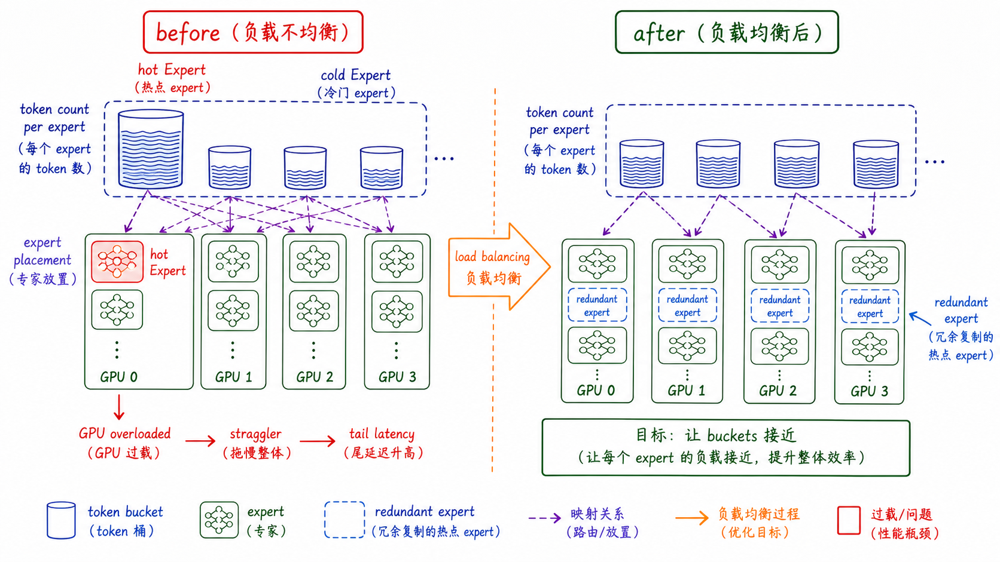
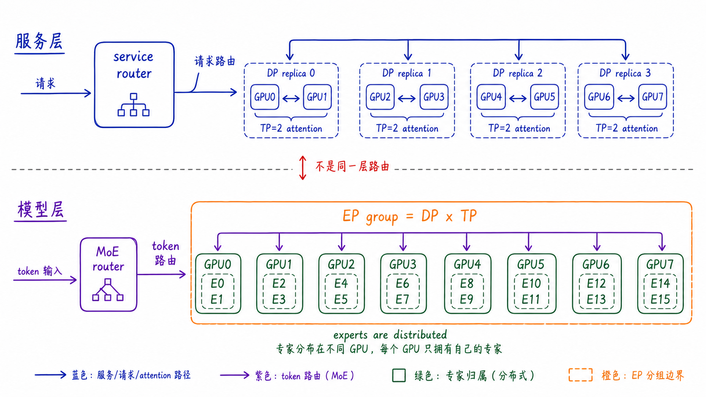

---
tags:
  - LLM
  - distributed-inference
  - expert-parallelism
  - mixture-of-experts
  - model-serving
updated: 2026-05-27
description: 从 MoE 推理中的专家放置、token 路由、dispatch/combine 通信、负载均衡和并行组合解释 Expert Parallelism，帮助判断 EP 适合解决什么问题、又会引入哪些系统成本。
---

# 大模型精讲系列 04：Expert Parallelism（EP）是什么

> [!Quote] 本篇导读
> EP（Expert Parallelism，专家并行）不是把普通 dense layer 再切一遍，也不是把用户请求平均分给多个服务实例。它只在 MoE（Mixture of Experts）这类模型结构里真正成立：专家分布在不同 GPU 或 rank 上，token 先由模型内部的 router 选择少数 experts，再跨设备找到这些 experts 计算，最后把结果合回原来的 token 顺序。理解 EP，要同时抓住三件事：expert 放在哪里、token 怎样过去又怎样回来、负载不均为什么会让某些 rank 成为尾延迟瓶颈。

## 1. 从 MoE 服务现场进入

### 1.1 Dense 模型的问题不够用了

在 TP 和 DP 里，读者已经见过两类很常见的扩展问题。

如果一个模型副本太大，单卡放不下，可以用 TP 把同一个 layer 内部的张量切开，让多张 GPU 共同计算。如果一个模型副本已经能跑，但请求太多，可以用 DP 复制可执行副本，让不同请求分流。

但是 MoE 模型会带来第三类问题。模型看起来有很多参数，甚至总参数量远大于 dense 模型；可每个 token 并不会经过全部参数，而是只激活少数 experts。于是瓶颈不再只是“这个矩阵能不能被切开”或“请求能不能分给不同副本”，还多了一个更细的运行时问题：

**每个 token 到底应该去哪个 expert？这个 expert 在哪张 GPU 上？**

在 dense Transformer 里，FFN 通常是一套固定的 MLP。每个 token 都按同一条路径经过它。在 MoE Transformer 里，FFN 被替换成一组 experts，前面增加一个 router 或 gate。router 会对每个 token 计算 expert 分数，选择 top-k experts，然后只把这个 token 送到被选中的 experts。

这让系统多了一层动态性。即使两个请求进入同一个模型实例，它们内部的 token 也可能走向完全不同的 expert。即使 experts 被平均放到多张 GPU 上，router 也可能让某些 experts 很热、某些 experts 很冷。于是 MoE 推理里常见的现场变成了：

- 某些 GPU 上的 expert bucket 很大，另一些 GPU 几乎空闲；
- all-to-all 通信时间抖动明显，跨节点时尤其敏感；
- decode 阶段每步 token 很少，expert bucket 变小，通信和尾延迟更刺眼；
- 启用 DP 后，dense 层像副本一样运行，但 expert 层又需要跨 DP/TP ranks 协同；
- 没有本地请求的 rank 也可能必须参与 MoE collective，否则 collective 参与集合不一致；

这些现象只用 TP 或 DP 的旧心智模型解释不完整。EP 出场的地方，正是 MoE 把“模型内部路由”变成系统问题的地方。

### 1.2 MoE 改变了 FFN 路径

可以先把 MoE 层看成一个带分流器的 FFN。

普通 dense FFN 的路径是：

```text
token hidden state -> FFN -> output hidden state
```

MoE FFN 的路径是：

```text
token hidden state
  -> Router / Gate
  -> selected experts
  -> weighted combine
  -> output hidden state
```

现代 MoE 里还经常要区分 **routed experts** 和 **shared experts**。Routed experts 是由 router 动态选择的专家，EP 主要讨论的就是这部分专家怎样分布、token 怎样 dispatch/combine。Shared experts 则更像每个 token 都会经过的共享 FFN 分支，是否复制、切分或与 routed experts 并行执行，要看具体模型和框架实现。后文如果没有特别说明，所说的 experts 主要指 routed experts。

其中 experts 通常仍然是 MLP/FFN 结构，只是有很多份。top-k routing 表示一个 token 会被送到分数最高的 k 个 experts。top-1 只选一个 expert，top-2 会让 token 复制到两个 expert 路径上，最后按 gate weight 加权合并。

这就是 MoE 的稀疏性：总 experts 可以很多，但单个 token 每层只走少数 experts。它降低的是每 token 激活计算量，不等于消除了通信，也不等于每张 GPU 的负载天然均衡。

### 1.3 两层路由

EP 最容易被写错的地方，是把服务层 router 和模型层 router 混在一起。

服务层 router 处理的是用户请求。它回答：

**这个请求交给哪个服务实例、哪个 DP replica、哪个 engine？**

模型层 router 处理的是 token。它回答：

**这个 token 在当前 MoE layer 里交给哪些 experts？**

两者的粒度、状态和代价都不同。服务层 router 主要关心队列、KV cache、请求长度和副本负载；模型层 router 主要关心 token-to-expert 映射、expert capacity、dispatch/combine 通信和 expert 负载。MoE 推理复杂，正是因为这两层路由会同时存在。

## 2. 定义与边界

### 2.1 基础术语

在进入 EP 之前，需要先把几个词放稳。

| 术语 | 含义 | 在 EP 里的角色 |
| --- | --- | --- |
| routed expert | MoE 层里由 router 动态选择的专家子网络，通常是 FFN/MLP | 被 router 选中后处理一部分 token，是 EP 主要分布对象 |
| shared expert | 某些 MoE 模型里的共享专家或共享 FFN 分支 | 不一定按 routed expert 的方式参与 token dispatch |
| router / gate | 为每个 token 计算 expert score 的小模块 | 决定 token 去哪些 experts，并产生 combine 权重 |
| top-k | 每个 token 选择分数最高的 k 个 experts | k 越大，token 复制和 combine 成本越高 |
| expert placement | 逻辑 expert 到物理 rank/GPU 的映射 | 决定 token dispatch 是否跨设备、跨节点 |
| token dispatch | 把 token hidden states 发送到持有所选 expert 的 rank | EP 的主要通信入口之一 |
| token combine | 把 expert 输出按原 token 顺序和 gate weight 合回 | EP 的主要通信出口之一 |
| expert load balancing | 让 token bucket 尽量均衡地落到 experts/ranks | 影响吞吐、尾延迟和显存余量 |

这些词共同描述的不是“模型副本”问题，而是 MoE layer 内部的动态计算图。

### 2.2 一个更准确的定义

**Expert Parallelism 指的是：把 MoE layer 中的 routed experts 分布到多个设备或 rank 上，每个设备只持有一部分 experts；运行时，每个 token 根据 router/top-k 结果被 dispatch 到对应 experts 所在的 rank，完成 expert FFN 计算后，再通过 combine 恢复到原 token 顺序和原 hidden state 路径。**

再短一点：

**EP = experts 分布在多张 GPU，token 按路由结果流动。**

这句话里有两个关键词。第一个是 **experts 分布**，说明 EP 切的是专家集合，不是普通 dense layer 的某个矩阵维度。第二个是 **token 流动**，说明 EP 的通信不是固定 all-reduce，而是由 router 决定哪些 token 去哪些 experts。



图里可以看到，hidden states 先进入 Router / top-k，router 为每个 token 选择 experts。Experts 分布在 GPU 0 到 GPU 3 上，token dispatch 会把 token 送到对应 GPU；expert 计算完成后，combine 再把结果合回 dense path。这个 dense path 可以继续进入下一层 Transformer。

### 2.3 EP 与其他并行方式的边界

EP 经常和 DP、TP、PP、CP 同时出现，但它们切的对象完全不同。

| 并行方式 | 切分对象 | 一句话直觉 | 和 EP 的关系 |
| --- | --- | --- | --- |
| DP | 请求、样本或可执行副本 | 多个副本处理不同工作 | MoE 场景中，多个 DP ranks 可能共同组成 EP group |
| TP | dense layer 内部张量、head、矩阵维度 | 多张 GPU 共同算同一个 layer 的矩阵 | 可和 EP 组合，形成 expert 内部或 dense 层的 tensor slicing |
| PP | Transformer layers / stages | 不同 GPU 负责不同层段 | EP 发生在某个 stage 内的 MoE layer 上 |
| CP / DCP | sequence/context 或 decode KV 相关切分 | 长上下文沿 token/上下文维度拆 | 主要服务 attention/KV，不决定 token 去哪个 expert |
| EP | MoE experts | experts 分布，token 找专家 | 只在 MoE expert 层有意义 |

所以，看到 `EP enabled` 时，不要只问“用了几张 GPU”。更应该问：

**专家放在哪里？token 怎样过去？结果怎样回来？这条路径和 DP/TP/PP/CP 的边界在哪里？**

## 3. MoE 层的 token 旅程

### 3.1 Router 不是服务负载均衡器

MoE router 是模型层的一部分。它接收当前 layer 的 token hidden states，为每个 token 计算一个 expert score 向量：

$$
s_t = Router(h_t)
$$

如果共有 $E$ 个 experts，那么 $s_t$ 可以理解为长度为 $E$ 的分数。top-k gating 会选择分数最高的 k 个 experts：

$$
\mathcal{E}_t = TopK(s_t, k)
$$

Router / gate 通常会产生 expert 选择，以及后续 combine 使用的权重。具体做法并不固定：有的模型使用 softmax，有的会用 sigmoid、top-k 后重新归一化、expert bias、group-limited routing 或 auxiliary-loss-free balancing。对本文来说，先抓住一个稳定语义即可：router 决定 token 去哪些 experts，并为这些 expert 输出提供合并权重。对 top-2 routing 来说，一个 token 可能同时去两个 experts，比如：

```text
t1 -> E1, E5
t2 -> E0, E3
t3 -> E2, E5
```

这里的 router 不知道 HTTP endpoint，也不关心请求被哪个 API server 接住。它只关心当前 MoE layer 内每个 token 的 expert 选择。

### 3.2 Dispatch：按 expert 重排 token

Router 选出 experts 以后，系统不能继续按原 batch 顺序直接跑 FFN。因为同一个 batch 里的 token 可能被路由到不同 experts，而这些 experts 又可能分布在不同 GPU 上。

于是需要 token dispatch。它做的事情大致是：

1. 根据 token-to-expert 映射，把 token hidden states 按目标 expert 分桶；
2. 如果 expert 在本 rank，token 留在本地；
3. 如果 expert 在远端 rank，把 token 发送到对应 rank；
4. top-k 大于 1 时，同一个 token 的 hidden state 会被复制到多个 expert bucket；

这一步经常涉及 all-to-all 或类似的 token exchange。它不是把完整 hidden states 广播给所有 GPU，而是按 router 的实际结果，把 token 送到拥有目标 expert 的 rank。

### 3.3 Expert FFN：本地计算也要成批

Token 到达 expert 所在 rank 后，rank 会按 expert bucket 执行本地 Expert FFN。这个 FFN 通常仍是 MLP 结构：

```text
token bucket -> up/gate projection -> activation -> down projection
```

如果一个 rank 上有多个 local experts，直接逐个 expert 调小 GEMM 可能效率很差。很多实现会使用 grouped GEMM、block-sparse kernel、permute/unpermute fusion 等优化，把多个 expert 的小 batch 合成更适合 GPU 的执行形态。

这里要注意一个边界：**all-to-all 和 grouped GEMM 不是一回事。**

- all-to-all 负责跨 rank 搬 token；
- grouped GEMM 负责让本 rank 上多个 experts 的计算更高效；

前者是通信路径，后者是计算路径。EP 性能通常取决于这两条路径能否同时足够顺。

### 3.4 Combine：恢复 token 顺序

Expert 输出完成后，还不能直接交给下一层。因为 dispatch 已经把 token 按 expert 分桶，输出顺序不再等于原 batch/sequence 顺序；top-k 还会让同一个 token 拥有多个 expert 输出。

Combine 阶段要做三件事：

1. 把 expert 输出送回原 token 所在的 rank 或原始 layout；
2. 按 token 的原始位置恢复顺序；
3. 使用 router 的 gate weight 做加权求和；

一个 top-2 token 的输出可以写成：

$$
y_t = w_{t,a} \cdot Expert_a(h_t) + w_{t,b} \cdot Expert_b(h_t)
$$

其中 $a$ 和 $b$ 是 router 选中的两个 experts，$w_{t,a}$ 和 $w_{t,b}$ 是对应 gate weight。合并完成后，输出形状通常回到原来的 hidden states 形态，继续进入下一层。



这张图的关键不在数字，而在顺序：先为每个 token 计算 expert score，再选择 top-k experts，随后按 expert 分桶 dispatch，本地 Expert FFN 计算，最后 combine 并恢复 token order。只要 combine 顺序或 gate weight 错了，token hidden state 就会串位，模型输出会直接失真。

## 4. 通信与负载

### 4.1 All-to-all 为什么成为成本中心

TP 里常见的通信心智模型是 all-reduce：多个 rank 计算同一个输出的不同贡献，然后求和并复制结果。EP 的通信心智模型更像 token exchange：每个 rank 有一些 token，要发给拥有对应 expert 的其他 rank；计算后，再把结果送回去。

这就是为什么 EP 经常和 all-to-all 绑定在一起。一次 MoE forward 里，常见路径可以粗略看成：

```text
dispatch all-to-all -> local expert compute -> combine all-to-all
```



图中故意没有画出 4x4 的所有细箭头，而是用两条橙色通信带表示 dispatch 和 combine。真实系统里，rank 间 token 交换量取决于 router 的 token-to-expert 分布。某个 rank 如果收到特别多 token，其他 rank 即使本地计算结束，也可能要等待它完成。

需要注意，图里的橙色通信带表示逻辑 collective，不是一个中心化网关。真实 all-to-all 通常是多 rank 之间同时交换数据，只是图上用一条宽带来避免线条变成一团。

给一个数量级锚点：如果一次 MoE 层有 1024 个输入 token，hidden size 为 8192，BF16 每元素 2 bytes，top-2 routing 会让 dispatch 侧需要发送大约

$$
1024 \times 2 \times 8192 \times 2 \approx 32 \text{ MiB}
$$

的 hidden states 负载。Combine 侧还要把 expert 输出送回并合并，实际链路开销还会受到跨 rank 分布、padding、metadata、backend 和网络拓扑影响。这个估算不是精确性能模型，只是帮助建立直觉：EP 的通信搬运对象是 token hidden states，而不是一个小小的 expert id 列表。

所以 EP 的性能不只看平均通信量，还要看最慢 rank：

**一次 collective 的尾部经常由最热 expert、最慢 rank 或最弱链路决定。**

### 4.2 动态负载比静态切分更难

如果有 16 个 experts 和 8 张 GPU，看起来可以很自然地每张 GPU 放 2 个 experts。静态 placement 是均匀的，但运行时 token 分布不一定均匀。

Router 会根据 token 内容选择 experts。某些输入分布可能集中触发少数 experts，某些专家可能长期更热。这样会带来几个后果：

- 热门 expert 所在 GPU 的 expert bucket 更大；
- grouped GEMM 的 batch 形状不均匀；
- dispatch/combine all-to-all 的消息大小不均匀；
- 其他 rank 等待最慢 rank，尾延迟升高；
- 热点 rank 的显存、workspace 或临时 buffer 压力更大；

这也是为什么 MoE 训练里常见 auxiliary loss、capacity factor、token dropping/dropless routing、expert-wise bias 等负载均衡机制；而推理系统里仍然可能需要运行时 EPLB（Expert Parallel Load Balancer）或类似策略。

### 4.3 Capacity 与 token dropping

MoE 里常见的 capacity 概念，用来限制每个 expert 在一个 batch 或 micro-batch 中接收多少 token。训练时，如果某个 expert 超过 capacity，一些实现可能 drop tokens 或使用随机 token selection；也有 dropless MoE 让 token 不被丢弃，但需要更强的调度和 kernel 支持。

对推理读者来说，不需要把每种训练 trick 背下来，但要理解 capacity 的工程含义：

**router 的选择不是免费且无限的。热门 expert 会消耗更多计算、通信和 buffer；系统必须决定如何处理过载。**

在在线推理里，通常更不能随意丢 token，因为这会影响输出质量。于是推理侧更常见的压力是：不丢 token，但要承担更不均匀的 bucket、更高的尾延迟，或者通过 expert placement / redundant expert / EPLB 来缓解。

### 4.4 Prefill 与 Decode 的压力不同

LLM 推理里，prefill 和 decode 对 EP 的压力也不一样。

Prefill 阶段一次处理 prompt 中的大量 token。token 多，expert bucket 往往更容易“攒起来”，GPU 计算利用率更容易做高，但 all-to-all 的总通信量也会更大。

Decode 阶段每个 active sequence 通常每步只生成一个新 token。token 少时，expert bucket 可能很小，通信启动开销、负载不均、等待最慢 rank 的问题更明显。这里的“bucket 小”不是绝对结论：如果并发序列很多，decode step 也能攒出较大的 bucket；但和 prefill 相比，它更容易暴露 latency-sensitive 的尾部等待。对用户可感知延迟来说，decode 的每步尾延迟尤其关键。



所以，评估 EP 时最好分开看 prefill 和 decode：

- prefill 更关注大 token 批量下的吞吐、显存和网络带宽；
- decode 更关注小 bucket 下的 latency、tail latency 和 rank 同步等待；
- 同一个 `EP size` 在不同请求长度分布下可能表现完全不同；

### 4.5 EPLB 与热点专家

如果专家负载长期不均，单纯“平均放 experts”就不够了。更进一步的策略是根据真实运行统计调整 expert placement，或者复制热点专家。

vLLM 的 EPLB 就是一个面向推理服务的例子：系统在 forward 中收集负载统计，按窗口和间隔周期性重平衡 expert mapping；也可以配置 redundant experts，让热门专家在更多 rank 上可用。这样做的目标不是重新训练 router，而是在 serving/runtime 层面降低热点和 straggler。



这张图只是示意：运行时可以通过调整 placement 或复制热点 expert 缓解负载，不表示所有 experts 都应该被全量复制到每张 GPU。

不过，冗余 expert 不是免费午餐。它会增加显存占用，可能挤压 KV cache 空间，也会引入 expert 权重迁移、统计窗口和重平衡频率的调参问题。因此，启用 EPLB 前要先确认瓶颈真的是 expert hotspot，而不是 attention、KV cache、API server 或网络出口。

## 5. EP 与 DP、TP、PP、CP 的组合

### 5.1 DP x EP：两层 router 同时存在

在 dense 模型里，DP replica 往往可以被理解为相对独立的模型副本。请求进入某个 replica 后，就在这个 replica 内完成。

MoE + EP 里情况更复杂。服务层 router 仍然可以把请求分给不同 DP replica；但 MoE layer 内部的 token 可能需要跨多个 ranks 找 experts。某些框架会让 dense/attention 层按 DP 或 TP 规则执行，而 expert 层在更大的 EP group 上分布。

这时要特别分清：

- 服务层 router：请求级分流；
- MoE router：token 级 expert 分流；
- DP replica：对外的请求处理边界；
- EP group：expert 层的集体通信边界；

如果一个 rank 在当前 step 没有本地 ready request，但它属于 MoE collective 的参与集合，它仍可能需要执行 dummy forward 或参与协调。否则 collective 调用顺序和参与 rank 不一致，就可能 hang。

### 5.2 TP x EP：切张量与切专家可以叠加

TP 和 EP 切的是不同轴。

TP 切的是 dense 计算里的矩阵、head、hidden 维或 vocab 维。EP 切的是 MoE experts。一个系统可以让 attention 和 dense projection 使用 TP，同时让 MoE experts 使用 EP；也可以在 expert 内部再做 tensor slicing，形成 tensor-expert hybrid。

直观地说：

```text
Attention / dense layers: TP 负责层内矩阵并行
MoE expert layers: EP 负责专家分布，必要时 expert 内部再 TP
```

这也是很多 MoE 部署比 dense 部署更难读的原因。一个参数写着 `TP=2`，不一定说明 expert 层也只是简单做同一套 TP；一个参数写着 `EP enabled`，也不代表 attention 层不再需要 TP。

### 5.3 PP x EP：EP 发生在某个 stage 内

PP 按 layer/stage 切模型。EP 则发生在某个 MoE layer 内部。如果一个 pipeline stage 拥有某些 MoE layers，那么这些 MoE layers 内部可以使用 EP。

常见判断是：

- PP 解决“层太多、跨节点按层放置更自然”的问题；
- EP 解决“某个 MoE layer 里的 experts 太多或专家计算太重”的问题；
- 二者组合时，stage 间传 activation，stage 内 MoE layer 再做 token dispatch/combine；

需要注意，PP 的 stage 边界和 EP 的 collective 边界不应混在一起。一个 stage 的 activation handoff 是层间通信；EP 的 all-to-all 是 MoE layer 内部 token exchange。

### 5.4 CP / DCP 与 EP：不要把长上下文切分当 expert routing

CP 或 DCP 主要处理长上下文带来的 sequence/context 和 KV cache 压力。它关心的是 token 序列怎样分块、attention 如何看到全局 K/V、decode 阶段怎样减少 KV 重复。CP/DCP 会在后续单篇展开；这里先把它理解成面向长上下文和 KV cache 的切分即可。以 vLLM 语境为例，DCP 指 Decode Context Parallelism，它复用 TP group，不增加 worker 数，目标之一是减少 decode 阶段 KV cache 在 TP ranks 上的重复。

EP 关心的是 token 被 router 送到哪些 experts。两者都可能让 token 维度发生重排，但问题不同：

- CP/DCP：为 attention 和 KV cache 服务；
- EP：为 MoE expert FFN 服务；

长上下文 MoE 服务可能同时需要 CP/DCP 和 EP。此时更要分清：一个 token 的上下文分片位置，不等于它在 MoE layer 里选择的 expert。

### 5.5 一个组合例子

理解了 EP 层内 token 如何移动之后，还要追问这些参与通信的 ranks 到底来自哪种并行拓扑。不同框架对 EP group 的构造并不完全一样，下面这张图只用 vLLM-style 的 8 GPU 语义举例：服务层上，4 个 DP replica 各自内部用 TP=2 处理 attention；模型层上，MoE router 把 token 分到由 DP x TP 共同组成的 EP group，experts 分布在所有 8 张 GPU 上。也就是说，在这个示例里可以把 `EP_SIZE` 理解为 `DP_SIZE x TP_SIZE`，但不要把它泛化成所有框架的通用公式。



这张图最重要的不是具体数字，而是边界：蓝色的服务/attention 路径和紫色的 token 路由不是同一层路由。请求先被服务层分配，token 在 MoE layer 内又被模型层 router 分配。只有把这两层分开，才能理解为什么 MoE 部署里的 DP + EP 比 dense 模型 DP 更复杂。

## 6. 部署判断

### 6.1 什么时候优先考虑 EP

当以下条件成立时，EP 往往是自然候选：

- 模型是 MoE 架构，而不是纯 dense Transformer；
- experts 数量多，单卡保存全部 experts 显存压力大；
- 每 token 只激活少数 experts，稀疏计算有机会带来收益；
- attention/dense 部分不是唯一瓶颈，expert 层占据明显计算或权重压力；
- GPU 间互联足够支撑 token dispatch/combine；
- 系统能监控 token-per-expert、rank 负载、all-to-all 时间和尾延迟；
- 需要服务 DeepSeek、Mixtral、Qwen-MoE 等大规模 MoE 模型；

一句话判断：

**如果瓶颈来自 MoE experts 的权重、计算或分布，EP 值得看；如果瓶颈来自普通 dense layer、请求吞吐或长上下文 KV cache，先看 TP、DP 或 CP/DCP。**

### 6.2 什么时候 EP 不够

EP 不是 MoE 推理的万能开关。下面这些情况只开 EP 往往不够：

| 问题 | 为什么 EP 不够 | 更应该一起看 |
| --- | --- | --- |
| Attention 或 dense 层放不下 | EP 只处理 expert 层，不能切所有 dense 矩阵 | TP、PP、量化 |
| KV cache OOM | EP 不会自动消除长上下文 KV 状态 | CP/DCP、KV cache 配置、并发限制 |
| all-to-all 跨弱链路 | token dispatch/combine 会放大网络瓶颈 | 拓扑感知 placement、节点内优先、DeepEP/HybridEP |
| expert 热点严重 | 静态 expert placement 可能让某些 rank 过载 | EPLB、redundant expert、router/负载统计 |
| decode 延迟抖动 | 小 bucket + collective 等待会拉高尾延迟 | batch 策略、通信优化、prefill/decode 分离观测 |
| API server 或 scheduler 成为瓶颈 | token 还没进入 MoE layer 前已经排队 | DP、外部 LB、调度器优化 |

### 6.3 常见框架入口

不同框架对 EP 的入口命名不同，但背后都离不开 expert placement、router、dispatch/combine 和 expert compute。

| 系统 | 常见入口或概念 | 心智模型 |
| --- | --- | --- |
| vLLM | `--enable-expert-parallel`、EPLB、all2all backend、expert placement strategy | 在 vLLM serving 语义下，MoE expert 层可在 `TP x DP` 形成的 EP ranks 上分布；EPLB 用于运行时 expert 负载均衡 |
| Megatron Core / Megatron-LM | `--num-experts`、`--moe-router-topk`、`--moe-token-dispatcher-type alltoall/flex/allgather`、`--moe-grouped-gemm` | router、token dispatcher、GroupedGEMM、DeepEP/HybridEP 等组合成 MoE 执行路径，EP/TP/hybrid 由训练或推理配置显式决定 |
| DeepSpeed-MoE | `ep_size`、`num_experts`、`k`、capacity、MoE inference parallel groups | `ep_size` 表示 expert-parallel world/group 的 rank 数，DeepSpeed 会基于 world size、tensor/model parallel 和 experts 构造对应并行组 |
| TensorRT-LLM | Tensor Parallel、Expert Parallel、hybrid MoE sharding | 区分 TP 对 expert 权重的切分与 EP 对 experts 的分布，也支持 TP + EP 的 hybrid 形态 |
| DeepEP / EPLB | dispatch/combine kernels、expert placement / redundant experts | DeepEP 更偏 dispatch/combine 通信内核；EPLB 更偏运行时 expert placement 和冗余 expert 负载均衡 |

这里不要从参数名反推语义。真正要确认的是四件事：expert group 由哪些 ranks 组成，dispatch backend 是否跨节点，placement / EPLB 是否改变专家映射，KV cache 是否还有足够空间。

### 6.4 检查清单

部署或评估 EP 前，可以按下面顺序检查：

1. 模型是否真的是 MoE，哪些层是 MoE expert layers？
2. 每层总 experts 数、每 token top-k、shared experts 和 routed experts 分别是多少？
3. expert placement 如何映射到 rank/GPU，是否跨节点？
4. EP group 是哪些 ranks，是否来自 DP x TP 或其他并行组？
5. attention/dense 层使用 DP、TP 还是 PP，和 expert 层边界是否清楚？
6. token dispatch/combine 使用什么 backend，all-to-all 是否跨弱链路？
7. Prefill 和 decode 下 token-per-expert 分布是否不同？
8. 是否有 expert 热点、straggler、tail latency 或 rank 空转？
9. 是否需要 EPLB、redundant experts 或 topology-aware placement？
10. 冗余 expert 的显存开销是否会挤压 KV cache？
11. collective 参与集合和调用顺序是否稳定，是否需要 dummy forward 或 coordinator？
12. 真实 workload 下 TTFT、TPOT、throughput、all-to-all 时间是否真的改善？

## 7. 常见误区与最终心智模型

### 7.1 “EP 就是 TP 的 MoE 版本”

不准确。TP 切的是同一个 dense layer 内部的矩阵或张量维度；EP 分布的是不同 experts。TP 的局部结果通常通过 all-reduce、all-gather 或 reduce-scatter 组合；EP 的关键路径通常是 token dispatch/combine，把 token 送到拥有目标 expert 的 rank。

### 7.2 “experts 平均放到 GPU 上，负载就平均”

不一定。静态 expert 数量均匀，不代表运行时 token 数量均匀。Router 可能让少数 experts 成为 hot experts，导致某些 rank 等待、过载或显存压力更高。

### 7.3 “MoE 只减少计算，不增加通信”

不准确。MoE 可以减少每 token 激活的 expert 计算量，但 EP 会引入 token dispatch、combine、排序、重排和跨 rank 同步。跨节点 EP 尤其要小心，因为 all-to-all 可能把最热路径放到较弱网络链路上。

### 7.4 “服务 router 和 MoE router 是同一个东西”

不准确。服务 router 分请求，MoE router 分 token。前者决定请求进入哪个 replica 或 engine，后者决定 token 在当前 MoE layer 里去哪些 experts。

### 7.5 “开启 EP 就能解决所有 MoE 显存问题”

不一定。EP 主要分布 experts，但模型还有 attention、embedding、shared experts、KV cache、activation、workspace、communication buffer 和 adapter 状态。长上下文或高并发下，KV cache 仍可能是瓶颈。

### 7.6 最终心智模型

从开头的问题回看，EP 要回答的不是 GPU 数量，而是 expert 位置、token 流向和负载尾部。

理解 EP，可以始终抓住四句话。

第一，EP 的切分对象是 MoE experts，不是普通 dense layer 的矩阵，也不是用户请求。

第二，EP 的运行核心是 token 旅程：router 选择 experts，dispatch 发送 token，expert 本地计算，combine 恢复顺序并加权合并。

第三，EP 的性能核心是动态负载：token-to-expert 分布、all-to-all 通信、expert bucket 形状和最慢 rank 决定尾延迟。

第四，EP 很少孤立存在。真实 MoE 推理通常还要同时判断 DP 的请求分流、TP 的 dense 层切分、PP 的层段放置、CP/DCP 的长上下文压力。

所以，看到 EP 时不要只问“开没开专家并行”，而要问：

**expert 放在哪里？token 怎样过去又怎样回来？负载是否均衡？EP 和 DP/TP/PP/CP 的边界在哪里？**

## 8. 参考资料

1. [vLLM Documentation: Expert Parallel Deployment](https://docs.vllm.ai/en/stable/serving/expert_parallel_deployment/)；
2. [Megatron Core API: MoE Token Dispatcher](https://docs.nvidia.com/megatron-core/developer-guide/latest/apidocs/core/core.transformer.moe.token_dispatcher.html)；
3. [NVIDIA/Megatron-LM MoE README](https://github.com/NVIDIA/Megatron-LM/blob/main/megatron/core/transformer/moe/README.md)；
4. [DeepSpeed Documentation: Mixture of Experts](https://deepspeed.readthedocs.io/en/latest/moe.html)；
5. [DeepSpeed Tutorial: Mixture of Experts](https://www.deepspeed.ai/tutorials/mixture-of-experts/)；
6. [DeepSpeed Tutorial: MoE Inference](https://www.deepspeed.ai/tutorials/mixture-of-experts-inference/)；
7. [TensorRT-LLM: Expert Parallelism](https://nvidia.github.io/TensorRT-LLM/0.19.0/advanced/expert-parallelism.html)；
8. [GShard: Scaling Giant Models with Conditional Computation and Automatic Sharding](https://arxiv.org/abs/2006.16668)；
9. [Switch Transformers: Scaling to Trillion Parameter Models with Simple and Efficient Sparsity](https://arxiv.org/abs/2101.03961)；
10. [Mixtral of Experts](https://arxiv.org/abs/2401.04088)；
11. [DeepSeekMoE: Towards Ultimate Expert Specialization in Mixture-of-Experts Language Models](https://arxiv.org/abs/2401.06066)；
12. [DeepSeek-V3 Technical Report](https://arxiv.org/abs/2412.19437)；
13. [Auxiliary-Loss-Free Load Balancing Strategy for Mixture-of-Experts](https://arxiv.org/abs/2408.15664)；
14. [DeepSeek EPLB](https://github.com/deepseek-ai/EPLB)；
15. [DeepEP](https://github.com/deepseek-ai/DeepEP)；
16. [NVIDIA NCCL User Guide: Collective Operations](https://docs.nvidia.com/deeplearning/nccl/user-guide/docs/usage/collectives.html)；

## 9. 学习测评

### 9.1 题目

1. 单选：EP 最核心解决的是哪类问题？
   A. 把 Attention 的 QKV 按 head 切到多卡；
   B. 把 MoE experts 分布到多个 rank，并让 token 路由到对应专家；
   C. 把请求平均分给多个 HTTP endpoint；
   D. 把 KV cache 沿上下文切分；

2. 单选：在 MoE 层中，router/top-k gating 的输出通常包含什么？
   A. 每个 token 选择的 expert id 与对应权重；
   B. 每个请求的 HTTP 路由地址；
   C. 每个 rank 的 optimizer state；
   D. 每层的 pipeline stage id；

3. 多选：一次典型 MoE EP forward 的 token 流包括哪些步骤？
   A. router 计算 token-to-expert 映射；
   B. dispatch 将 token 按目标 expert/rank 重排并发送；
   C. 本地 expert MLP 处理收到的 token；
   D. combine 将 expert 输出按原 token 顺序和权重合并；

4. 单选：all-to-all 在 EP 中最常见的作用是什么？
   A. 同步所有 rank 的梯度；
   B. 把 token hidden states 分发到拥有目标 expert 的 rank，并把 expert 输出再送回；
   C. 把最终 logits 广播给 API server；
   D. 把 KV cache 写入磁盘；

5. 多选：为什么 EP 通信比普通 TP all-reduce 更容易成为瓶颈？
   A. token-to-expert 分布是动态且不均匀的；
   B. all-to-all 通信模式对网络拓扑更敏感；
   C. 跨节点时 token 可能频繁穿越 IB/RDMA 网络；
   D. EP 完全不需要本地计算；

6. 单选：EP 与 TP 的最重要区别是什么？
   A. TP 切 dense 层内矩阵，EP 分布 MoE experts；
   B. TP 只能训练用，EP 只能推理用；
   C. EP 会自动复制所有权重，TP 不会；
   D. 二者完全等价；

7. 多选：在某些 MoE serving 实现里，EP 与 DP 组合时，哪些说法更准确？
   A. dense 模型 DP rank 通常更像独立副本；
   B. MoE 的 DP+EP 中，DP ranks 可能参与同一个 MoE collective 拓扑；
   C. 某些 rank 没有本地 ready request 时仍可能需要 dummy forward，避免 collective 不一致；
   D. DP+EP 下所有 rank 可以完全无协调地独立 decode；

8. 单选：EP 与 PP 的关系更接近哪种描述？
   A. PP 按层切 stage，EP 在某个 PP stage 内处理该 stage 的 MoE expert 层；
   B. PP 会替代 router；
   C. EP 必须让每个 pipeline stage 都拥有全部 experts；
   D. PP 只影响 tokenizer；

9. 单选：EP 与 CP/DCP 的区别是什么？
   A. EP 分布 experts，CP/DCP 处理长上下文或 KV/cache 相关的序列维切分；
   B. EP 只切 KV cache；
   C. DCP 会决定每个 token 选择哪个 expert；
   D. CP 与 EP 都是 HTTP 路由策略；

10. 单选：如果一个 MoE 模型的 attention 部分不大，但 experts 很多，单节点 8 卡想提升 expert 层吞吐，更自然的方向是什么？
    A. 只增加 pipeline stages，不改变 expert placement；
    B. 考虑让 experts 分布到多卡，并观察 EP 的 token dispatch/combine 成本；
    C. 把所有请求固定到同一张 GPU；
    D. 只增加 tokenizer 线程；

11. 多选：如果 attention 本身也放不下或计算压力很大，MoE 部署为什么可能需要 DP x TP + EP？
    A. TP 负责切 attention/dense 层；
    B. EP 负责 expert 层跨 ranks 分布；
    C. DP 负责可执行副本或请求分流；
    D. EP 会自动替代所有 KV cache 策略；

12. 多选：专家负载不均衡可能带来哪些现象？
    A. 少数 experts/ranks 成为热点；
    B. all-to-all 等待慢 rank，尾延迟升高；
    C. 某些 GPU 显存或计算利用率异常高；
    D. 所有 token 一定均匀分布；

13. 单选：EPLB / 专家负载均衡的核心目标是什么？
    A. 让 HTTP 请求平均进入 API server；
    B. 根据 expert 负载调整 expert mapping 或引入冗余 expert，缓解热点；
    C. 把 KV cache 全部压缩到 CPU；
    D. 禁用 router；

14. 多选：启用冗余 expert 或 EPLB 前应重点评估什么？
    A. 当前瓶颈是否真的是 expert hotspot；
    B. 冗余 expert 的额外显存是否会挤压 KV cache；
    C. 负载统计窗口和重平衡频率是否会引入抖动；
    D. 是否能减少所有 Attention 通信；

15. 单选：在 vLLM-like 实现中，“EP 不等于新增一组 GPU”更接近什么意思？
    A. EP 通常复用已有 DP/TP ranks，把 MoE expert 层映射到这些 ranks 上；
    B. EP 不需要 GPU；
    C. EP 只在 CPU 上运行；
    D. EP 会自动创建无限 rank；

16. 多选：EP 常见故障模式包括哪些？
    A. collective 参与 rank 不一致导致 hang；
    B. all-to-all backend 与网络拓扑不匹配导致延迟很高；
    C. expert mapping 或 token combine 顺序错误导致输出错乱；
    D. router 永远不会产生负载偏斜；

17. 简答：为什么 combine 阶段必须恢复原 token 顺序，并使用 router 权重？

18. 综合题：看到一个 MoE 推理部署写着 `DP=4, TP=2, EP enabled`，应该追问哪些问题？

19. 多选：关于 capacity、token dropping 和 dropless 推理，哪些理解更准确？
    A. 训练期 capacity 可以限制每个 expert 接收的 token 数；
    B. 在线推理通常不能随意 drop token，因为这会直接影响输出质量；
    C. Dropless 推理消除了所有负载不均问题；
    D. 热门 expert 过载可能转化为尾延迟、buffer 压力和 placement 问题；

20. 场景题：decode 阶段 all-to-all p99 延迟抖动明显，但平均 token-per-expert 看起来还可以，应该优先继续排查哪些方向？

### 9.2 答案与题解

错题回看建议：1-4 题回看第 2、3 章；5、12-16、19-20 题回看第 4、6 章；6-9、11、18 题回看第 5 章；10 题回看第 6.1 节；17 题回看第 3.4 节。

1. B。EP 只在 MoE expert 层真正成立，本质是 expert placement、token routing、dispatch/combine 和 expert compute；

2. A。Router 决定 token 去哪些 experts，并给出 combine 时使用的门控权重。HTTP 路由地址属于服务层 router，不是 MoE router；

3. A、B、C、D。EP 的关键不是每张卡算同一批 token，而是 token 被动态分发给拥有对应 experts 的 rank，再被合回原 token 顺序；

4. B。EP 的主要通信模式通常是 dispatch all-to-all 和 combine all-to-all。它和训练梯度同步、logits 广播、KV cache 落盘都不是同一件事；

5. A、B、C。EP 的 token-to-expert 分布动态变化，all-to-all 对网络拓扑更敏感；跨节点时尤其可能暴露弱链路。D 错，expert MLP 仍然是重要计算路径；

6. A。TP 关注 dense 层内矩阵或张量分片，EP 关注 MoE experts 的分布和 token exchange；

7. A、B、C。Dense DP 更像独立副本；在一些 MoE serving 拓扑里，DP ranks 可能共同组成 MoE collective 拓扑；collective 参与不一致可能导致 hang。D 错在把所有 DP+EP 组合都理解成完全无协调的独立 decode；

8. A。PP 是纵向按层切 stage，EP 是 MoE expert 维度切。EP 可以发生在某个 pipeline stage 内的 MoE layer 上；

9. A。EP 面向 MoE FFN/expert 层；CP/DCP 面向上下文长度、prefill/decode 和 KV 访问压力；

10. B。Experts 多、attention 不大时，EP 是自然候选。但是否真正更快仍要看 all-to-all、expert 负载和真实 workload；

11. A、B、C。TP、EP、DP 解决不同轴上的问题，可以组合使用。TP 解决 attention/dense 的放置与计算压力，EP 解决 expert 层分布，DP 主要解决副本吞吐或请求分流，不解决单副本本身放不下的问题。D 错，KV cache 仍要单独判断；

12. A、B、C。Router 的 token 分布可能高度偏斜，导致热点 expert、慢 rank、尾延迟和资源不均。D 是错误的理想化假设；

13. B。EPLB 是 EP 层面的负载均衡增强，目标是缓解热门专家和 rank 负载不均；它不是 HTTP 负载均衡，也不会禁用 router；

14. A、B、C。冗余 expert 会增加显存开销，统计窗口和重平衡频率也可能影响稳定性。D 错，EPLB 主要处理 expert 负载，不是 attention 通信优化；

15. A。常见实现里，EP group 来自已有并行拓扑；expert 层改变放置方式，attention/dense 层仍按 DP/TP/PP 等规则执行；

16. A、B、C。Collective 参与不一致、all-to-all backend 不适配、combine 顺序错误都是真实风险。D 错，router 偏斜正是 MoE 系统必须面对的问题；

17. Dispatch 会按 expert/rank 对 token 重排，本地 expert 输出的顺序不再等于原 batch 顺序；top-k 还会让一个 token 产生多个 expert 输出。Combine 必须把每个 expert 输出放回对应 token 位置，并按 gate weight 做加权合并，否则 hidden state 会串位。一个完整答案至少应提到：恢复原 token layout、top-k 多 expert 输出、gate weight 加权这三点；

18. 至少要追问：expert group 如何由 DP x TP 或其他 ranks 形成；attention/dense 层是否在每个 DP group 内做 TP；all-to-all 是否跨节点；router 负载是否均衡；是否启用 EPLB 或 redundant experts；KV cache 是否由 DP rank 独立持有；collective wave 如何协调；prefill 和 decode 下 TTFT、TPOT、throughput 是否都改善。一个完整答案至少应覆盖 collective 边界、all-to-all 是否跨节点、prefill/decode 分开观测、EPLB/placement、KV cache 五类问题；

19. A、B、D。Capacity 常用于限制 expert token 数，在线推理通常不能随意 drop token；如果选择 dropless，系统仍要处理热门 expert 造成的尾延迟、buffer 和 placement 压力。C 错在把 dropless 理解成自动负载均衡；

20. 应优先排查 p99 而不是只看平均值：是否存在少数 hot experts 或 hot ranks；decode 并发是否太低导致 bucket 过小；all-to-all 是否跨节点或跨 NUMA 弱链路；通信 backend 是否适配当前拓扑；是否有 collective wave 等待、dummy forward 或 rank 空转；prefill 与 decode 是否混在同一指标里；EPLB 的统计窗口和重平衡是否引入抖动；
