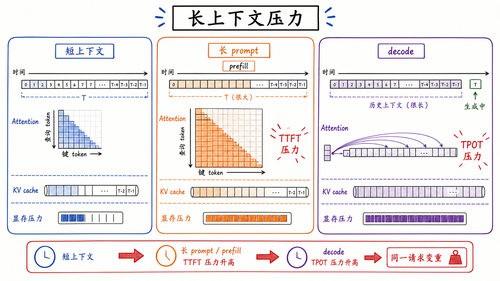
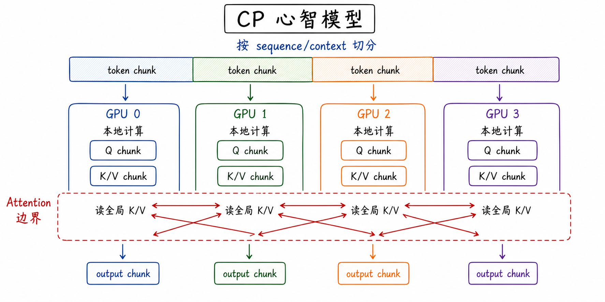
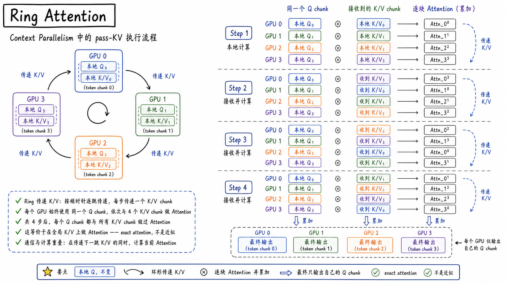
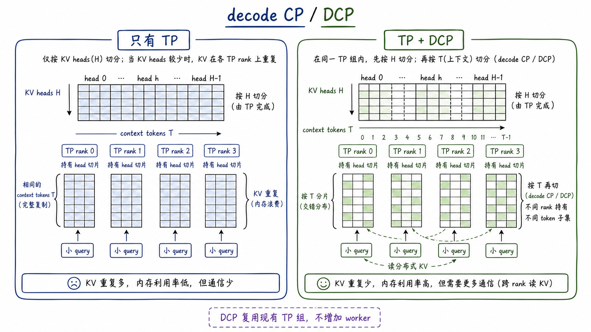
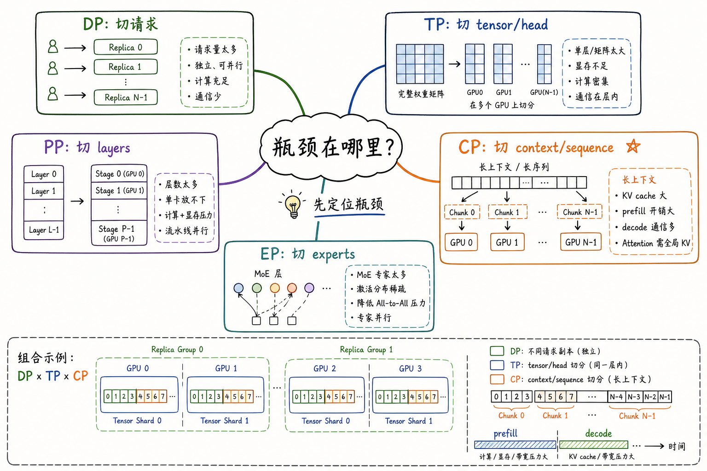

---
tags:
  - LLM
  - distributed-inference
  - context-parallelism
  - long-context
  - kv-cache
updated: 2026-05-27
description: 从长上下文推理与训练中的 Attention、KV cache、sequence 切分和通信边界解释 Context Parallelism，帮助判断 CP 解决什么瓶颈以及如何与 TP、DP、PP、EP 组合。
---

# 大模型精讲系列 05：Context Parallelism（CP）是什么

> [!Quote] 本篇导读
> CP（Context Parallelism，上下文并行）回答的是另一个维度的问题：当模型权重已经能通过 TP、PP 或量化放进多卡系统，甚至 DP 副本也已经能扩吞吐时，为什么一条超长上下文请求仍然会把单个执行单元压得很重？CP 的核心不是复制更多服务副本，也不是继续切 hidden size 或模型层，而是把同一条请求的 sequence/context 维度切开，让多个 GPU 分担长 prompt、Attention 交互和 KV cache 压力。理解 CP，要同时抓住三个边界：普通逐 token 计算可以本地完成，Attention 必须看到全局 K/V，推理中的 prefill 与 decode 有完全不同的目标。

## 1. 从长上下文现场进入

### 1.1 为什么会遇到 CP

很多人第一次遇到 CP，不是在训练论文里，而是在一个看起来已经很“分布式”的推理服务里。

模型很大，所以你已经用了 TP；

请求很多，所以你已经用了 DP 或外部负载均衡；

模型层数深，甚至可能还用了 PP；

如果是 MoE 模型，expert 也可能已经通过 EP 分布到多张 GPU 上。

但是当用户发来一个 128K、256K，甚至更长的 prompt 时，服务仍然会出现两个很具体的症状：

- 首 token 延迟（TTFT）明显变长，因为 prefill 阶段要一次性处理很长的上下文；
- KV cache 占用迅速变大，因为 decode 阶段每个新 token 都要读历史上下文的 K/V 状态；
- 单个请求本身变重，即使请求数量不多，也会把一个模型执行单元压满；
- 单纯增加 DP 副本只能接更多独立请求，不能把同一条超长请求自动拆开；
- 单纯增大 TP 可能缓解部分权重或 KV head 分片问题，但也会让层内通信更频繁，且在 KV heads 很少的 GQA、MQA、MLA 场景里可能出现 KV cache 重复；

这就是 CP 出场的地方。它面对的不是“有多少请求”，而是“同一条请求的上下文太长”。



图里要看的不是某一个参数，而是长上下文让 prefill 和 decode 产生了不同压力。prefill 的输入 token 很多，Attention 计算和激活显存会跟着变重，TTFT 容易被拉长；decode 每步只生成很少的新 token，但每步都要访问历史 KV cache，长上下文和高并发会让 KV cache 变成显存和带宽热点。

### 1.2 CP 的一句话直觉

如果把前几篇的并行策略放在一起看，可以得到一组非常朴素的区分：

| 并行方式 | 切分对象 | 一句话直觉 |
| --- | --- | --- |
| DP | 请求、样本、batch item | 多个可执行副本处理不同工作 |
| TP | 同一层内部的 tensor、head、hidden 维 | 多张 GPU 共同计算同一层 |
| PP | Transformer layers 或 stage | 多张 GPU 负责不同层段 |
| EP | MoE experts | 不同设备负责不同专家 |
| CP | 同一条序列的 context/sequence 维 | 多张 GPU 分担一条长上下文 |

所以，CP 的第一层心智模型可以压缩成一句话：

**CP = 把同一条长序列按 token/context 维切成多个 chunk，让多个 GPU 共同处理同一个请求的上下文。**

这句话有两个刻意强调的地方。

第一，CP 切的是同一条序列，不是把不同请求分给不同 GPU。后者更像 DP；

第二，CP 主要围绕 Attention 和 KV cache 发生复杂协作，不是把所有算子都变成全局通信。很多逐 token 模块在本地 chunk 上就能运行；

### 1.3 定义与边界

更正式地说：

**Context Parallelism 指的是沿 sequence length 或 context length 维度切分模型输入、激活、Attention 中间状态或 KV cache，让一个上下文中的不同 token chunk 分布在多个设备上计算与存储，并在 Attention 或 decode 读取 KV 的边界通过通信恢复数学等价的全局上下文视图。**

用符号写，可以把完整 hidden states 看成：

$$
X \in \mathbb{R}^{B \times T \times H}
$$

其中：

- $B$ 是 batch 维；
- $T$ 是 sequence/context length；
- $H$ 是 hidden size；

TP 典型会在 $H$、head 或 intermediate 维度上切；

DP 典型会在 $B$ 或请求集合上切；

CP 则切 $T$：

$$
X = [X_0, X_1, \ldots, X_{p-1}], \quad X_i \in \mathbb{R}^{B \times T/p \times H}
$$

这里的 $p$ 是 CP size。每个 rank 拿到一段 token chunk，继续跑本地计算。真正困难的是：Self-Attention 不是逐 token 独立运算，一个 token 的 Q 需要和同一序列中所有 token 的 K/V 交互。



这张图给出了 CP 最重要的边界：token chunk 可以分给不同 GPU，LayerNorm、MLP、Linear 等逐 token 模块可以在本地 chunk 上跑；但到了 Attention 边界，每个本地 Q chunk 必须读取全局 K/V，最终输出仍然按自己的 token chunk 保持分片。

### 1.4 CP 不解决什么

CP 很容易被误解成“又一个多卡加速按钮”。实际判断时要先排除几个不属于 CP 主线的问题：

- 如果问题是请求很多，而单个请求并不长，优先看 DP、批处理、路由和 API server；
- 如果问题是权重或单层矩阵放不下，优先看 TP、量化、offload 或 PP；
- 如果问题是层数太深导致单卡无法容纳完整模型，优先看 PP；
- 如果问题是 MoE expert 太多或 expert load imbalance，优先看 EP 与 expert routing；
- 如果问题是外部知识不在上下文里，CP 不能替代 RAG，它只处理已经进入模型上下文的 token；

CP 的价值在于：当一条上下文本身太长，导致 Attention、activation 或 KV cache 成为瓶颈时，给系统增加一个“切 context”的维度。

## 2. CP 切分对象

### 2.1 切 sequence，不切 batch

最容易混淆的是 CP 与 DP。

假设有 4 条请求，每条 8K tokens。DP 会把这些请求分给 4 个 replica：

```text
DP:
GPU group 0 -> request A
GPU group 1 -> request B
GPU group 2 -> request C
GPU group 3 -> request D
```

而 CP 关注的是一条请求本身：

```text
CP:
GPU 0 -> request A 的 token 0-2047
GPU 1 -> request A 的 token 2048-4095
GPU 2 -> request A 的 token 4096-6143
GPU 3 -> request A 的 token 6144-8191
```

所以 CP 会改变单条请求的执行路径，DP 改变的是请求集合的路由方式。一个生产系统完全可以同时使用二者：每个 DP replica 内部又由 TP x CP 的 GPU group 组成。

### 2.2 普通层为什么可以本地跑

Transformer 里并不是所有模块都需要跨 token 交互。

例如 LayerNorm 或 RMSNorm 通常在 hidden 维度上对每个 token 独立归一化。MLP 也是对每个 token 的 hidden vector 做同一组线性变换与非线性变换。只要每个 rank 拿到自己负责的 token chunk，就能在本地完成这些计算。

可以把普通逐 token 模块写成：

$$
Y_t = f(X_t)
$$

这里 $t$ 是 token 位置。$Y_t$ 只依赖 $X_t$，不依赖 $X_0,\ldots,X_{T-1}$ 的其他位置。沿 $T$ 切开后，每个 rank 仍然能独立计算自己的 token chunk。

这也是 NVIDIA Megatron Core 文档强调的一个关键点：CP 会沿 sequence 维切网络输入和所有 activation，但除 Attention 以外的模块通常可以照常运行；真正需要额外处理的是 Attention。

### 2.3 Attention 为什么特殊

Self-Attention 的核心是：

$$
\text{Attention}(Q,K,V)=\text{softmax}\left(\frac{QK^T}{\sqrt{d}}\right)V
$$

如果按 sequence 维切成 4 段：

$$
Q = [Q_0, Q_1, Q_2, Q_3], \quad K = [K_0, K_1, K_2, K_3], \quad V = [V_0, V_1, V_2, V_3]
$$

那么 GPU 0 持有 $Q_0,K_0,V_0$。它要得到自己负责的输出 $O_0$，并不是只做：

$$
\text{Attention}(Q_0,K_0,V_0)
$$

因为 $Q_0$ 里的 token 还需要 attend 到其他 chunk 的历史 token。数学上需要的是：

$$
O_0 = \text{Attention}(Q_0,[K_0,K_1,K_2,K_3],[V_0,V_1,V_2,V_3])
$$

其他 rank 也一样。于是 CP 的核心通信问题出现了：

**每个 rank 的 Q 是本地的，但它需要看到全局 K/V。**

### 2.4 与 Sequence Parallelism 的区别

CP 和 Sequence Parallelism（SP）的名字很容易混在一起。理解时要区分不同框架与论文语境。

| 名称 | 常见语境 | 关键动作 | 与 CP 的关系 |
| --- | --- | --- | --- |
| Megatron 早期 SP | 配合 TP 降低训练 activation 内存 | 主要切 LayerNorm、Dropout 等部分 activation | 范围比完整 CP 小 |
| PyTorch `SequenceParallel` | DTensor TP API | 支持 LayerNorm、Dropout、RMSNorm 等模块的 sequence 维 sharding | 不等同于完整长上下文 Attention CP |
| DeepSpeed Ulysses | 极长序列训练 | 沿 sequence 切输入，再用 all-to-all 在 sequence/head 布局之间变换 | 是长序列并行的一种重要实现路线 |
| Context Parallelism | 长上下文训练或推理 | 切输入、activation、Attention/KV 相关状态 | 本文主线 |

一个实用的判断方法是：如果一个方案只让 LayerNorm、Dropout 等模块在 sequence 维上分片，但 Attention 仍然没有解决全局 K/V 问题，它更接近狭义 SP；如果它把长上下文 Attention 或 KV cache 的跨 rank 交互纳入设计，它才接近本文讨论的 CP。

### 2.5 CP 的收益来自哪里

CP 的收益不是凭空产生的，而是来自三类分摊：

1. 每张 GPU 只保存一段 sequence activation，训练时 peak activation memory 可以随 CP size 降低；
2. prefill 中每张 GPU 只负责部分 query tokens，长 prompt 的 Attention 输出可以分摊计算；
3. decode 中 KV cache 可以沿 context tokens 继续分片，减少 KV 在 TP rank 上的重复；

但 CP 同时引入通信：

1. Attention 前向需要让本地 Q 看到远端 K/V；
2. 反向传播需要把 K/V 相关梯度归还或聚合；
3. decode 每步 query 很小，过多通信可能吞掉收益；

所以 CP 不是“越大越好”，而是“当 sequence/KV 压力足够大，且通信能被计算或内存收益抵消时才好”。

## 3. Attention 机制

### 3.1 All-gather KV

最直接的 CP Attention 做法是收集完整 K/V。

假设 CP size 为 $p$，每个 rank 持有自己的 $K_i,V_i$。在 Attention 边界前，所有 rank 通过 all-gather 得到：

$$
K_{\text{full}}=[K_0,\ldots,K_{p-1}], \quad V_{\text{full}}=[V_0,\ldots,V_{p-1}]
$$

然后每个 rank 用自己的 $Q_i$ 计算：

$$
O_i=\text{Attention}(Q_i,K_{\text{full}},V_{\text{full}})
$$

这种方式最容易理解，也很适合中等长 prompt：每个 rank 只需要输出自己那段 query 的结果，但 Attention 计算中能看到完整上下文。

它的代价也很清楚：每个 rank 在 Attention 时临时持有完整 K/V。如果上下文继续变长，完整 K/V 本身也放不下，就要换成逐块流动的方式。

### 3.2 Ring Attention

Ring Attention 可以理解成“不要一次性聚齐所有 K/V，而是让 K/V chunk 沿环传递”。每个 rank 的 Q chunk 不动，K/V chunk 一轮一轮传过来。每收到一段 K/V，就计算一段 partial attention，并把结果累加到本地输出里。



在 4 张 GPU 的例子里，GPU 0 起初有 $Q_0,K_0,V_0$。第一步它计算 $Q_0$ 对 $K_0,V_0$ 的贡献；第二步收到某个相邻 rank 传来的 $K_3,V_3$，继续计算 $Q_0$ 对这段 K/V 的贡献；经过若干步后，$Q_0$ 已经和全序列所有 K/V 交互过，得到的 $O_0$ 与完整 Attention 在数学上等价。

这里有两个关键点。

第一，Ring Attention 通常不是稀疏注意力，也不是把远处 token 丢掉。它的目标是 exact attention，只是把一次大矩阵注意力拆成多段 blockwise 计算；

第二，Ring Attention 的工程价值来自通信与计算重叠。理想情况下，当 GPU 正在用当前 K/V block 计算 Attention 时，下一个 K/V block 正在网络上传输；

### 3.3 Ulysses 的 all-to-all 思路

DeepSpeed Ulysses 是长序列训练里另一条很重要的路线。

它的核心动作可以概括成：

1. 输入先按 sequence 维切到多个 rank；
2. 到 Attention 时，通过 all-to-all 把数据布局从“每个 rank 有一段 sequence”变成“每个 rank 有完整 sequence 的一部分 heads”；
3. 每个 rank 计算自己负责的 attention heads；
4. 再通过 all-to-all 把布局切回 sequence shard；

这个思路和 Ring Attention 的差异在于：Ulysses 更像是通过 all-to-all 做一次布局变换，让 attention 在 head 维度上局部可算；Ring Attention 更像是保持本地 Q，逐块流动远端 K/V。

Ulysses 的典型约束也很直观：attention heads 数通常要能被 sequence parallel size 整除，否则很难把 heads 均匀分给 rank。DeepSpeed 早期教程还明确说明其当时的 sequence parallelism 与 Megatron-LM 的 TP/PP 不兼容，这提醒我们不要把论文机制直接等同于所有框架里的可组合生产能力。

### 3.4 Causal mask 与负载均衡

在 decoder-only LLM 里，Attention 通常有 causal mask。第 $t$ 个 token 只能看 $0,\ldots,t$ 的历史 token，不能看未来。

这会带来一个容易忽略的负载问题：如果按连续 token chunk 简单切分，靠前 chunk 的 token 可见历史很短，靠后 chunk 的 token 可见历史很长。对于 prefill 的完整 causal attention，后面 rank 的计算量会更重。

一些系统会使用更细的 token 排布、load balancing、interleaving 或特殊 mask 处理，让不同 rank 的 Attention 负载更均衡。Megatron Core 文档也提到 CP 需要避免 lower-triangle causal masking 带来的额外工作，同时保持负载均衡。这里的核心不是“把 mask 画出来”，而是：**sequence 切分改变了每个 rank 面对的三角 Attention 工作量，系统需要显式处理这个不均衡。**

### 3.5 通信量的粗略直觉

如果每层每个 rank 需要临时看到完整 K/V，那么通信对象大致与 K/V tensor 大小相关。用一个很粗的量级看：

$$
M_{KV} \approx 2 \times B \times T_{\text{local}} \times H_{KV} \times b
$$

其中：

- $2$ 表示 K 和 V；
- $B$ 是 batch 或 micro-batch；
- $T_{\text{local}}$ 是本地 token chunk 长度；
- $H_{KV}$ 是 K/V 的总特征维度；
- $b$ 是每个元素的字节数；

在 MHA 中，K/V heads 多，$H_{KV}$ 大；在 MQA、GQA、MLA 中，K/V 表示更小，CP 的 K/V 通信压力可能明显下降。这也是 Megatron Core 文档提到 MQA/GQA 可以降低 CP 通信量的原因之一。

但通信量不是唯一指标。实际性能还取决于：

- Attention kernel 是否支持分块或流式执行；
- 通信是否能与 SDPA/FlashAttention 计算重叠；
- GPU 间链路是 NVLink/NVSwitch、PCIe，还是跨节点 RDMA/TCP；
- 每层 Linear、MLP、Attention 的计算占比是否足以隐藏通信；
- CP group 是否和 TP/PP/DP group 在拓扑上合理排布；

## 4. 推理中的 CP

### 4.1 Prefill 和 decode 要分开看

推理里的 CP 必须把 prefill 和 decode 分开讲，因为它们的工作形态完全不同。

prefill 阶段处理用户输入的 prompt。假设 prompt 长度是 $T$，模型需要为这些新 token 计算 Q/K/V，并完成每一层的 Attention 与 MLP。长 prompt 的 prefill 往往决定 TTFT。

decode 阶段每步通常只新增一个或少量 token。计算新 token 的 Q/K/V 并不大，但它要读历史 KV cache。上下文越长、并发越高，KV cache 越容易成为显存和带宽瓶颈。

vLLM 的 Context Parallel Deployment 文档也明确把二者拆开：长上下文 prefill 关注 TTFT，长上下文 decode 关注为 KV cache 腾出空间以提高 batch size 和吞吐。

### 4.2 Prefill CP

prefill CP 的基本思路是把一个长请求的 $T$ 个新 token 分成 $N$ 个 chunk，每个 GPU 计算其中一段 Q/K/V。

vLLM 文档把 prefill CP 分成两类：

| 策略 | 适合场景 | 心智模型 | 代价 |
| --- | --- | --- | --- |
| partial query, full K/V | prompt 中等长，完整 K/V 还能临时放下 | 每卡算一段 Q，收集完整 K/V 后算自己那段输出 | K/V all-gather 压力 |
| partial query, partial K/V | prompt 极长，完整 K/V 也放不下 | 每卡只持有一段 Q/K/V，通过 Ring Attention 等方式逐块交换 | 实现复杂，通信调度要求高 |

需要注意的是，截至 vLLM 文档页面标注的 2026-01-29，这两类 prefill CP 方案仍处于 active development。写教程时可以讲机制，但部署时要以当前框架版本、backend 支持和 release note 为准。

### 4.3 Decode CP 与 DCP

decode CP 的核心不是把“一个 token 的计算”切得更碎，而是处理 KV cache 的分片。

对一个模型，如果 KV heads 数是 $H$，上下文长度是 $T$，一个请求需要存储的 KV cache 量可以粗略看成：

$$
\text{KV cache} \propto H \times T
$$

TP 通常可以先沿 $H$ 维切 KV cache。问题是，现代模型经常用 GQA、MQA 或 MLA 来减少 KV heads。当 $H$ 很小，而 TP size 继续增大时，KV cache 可能会在多个 TP rank 上重复。此时继续增大 TP 并不一定能继续降低 KV cache 压力。

vLLM 的 Decode Context Parallelism（DCP）就是在这种语境里出现的：先由 TP 沿 KV heads 维切分，再由 DCP 沿 context tokens $T$ 维继续切分，减少 KV 重复。



图里的重点是左、右两种切法的差异。只有 TP 时，KV cache 主要按 KV heads 切；当 KV heads 很少时，继续加 TP rank 会出现重复。TP + DCP 时，在同一个 TP group 内再沿 context tokens 切，减少 KV 重复，但代价是 decode 每步读分布式 KV 时通信更多。

vLLM 文档有一个容易被误读的细节：`-dcp <size>` 不增加需要启动的 GPU 数，而是减少 KV cache duplication。换句话说，DCP 复用已有 TP group 中的 worker，把 KV cache 的 token 维布局变得更细。

### 4.4 DCP 的工程判断

DCP 更适合这些场景：

- 模型使用 GQA、MQA 或 MLA，KV heads 数很少；
- TP size 已经较大，但 KV cache 仍然在 rank 间重复；
- 长上下文或高并发让 KV cache 显存成为主要瓶颈；
- 通信链路足够好，或者 DCP 通信主要限制在节点内；

它不适合这些场景：

- 单 GPU 或普通 TP 已经能稳定容纳 KV cache，性能也满足 SLO；
- decode 每步 query 很小，通信开销超过 KV 节省收益；
- 注意力 backend 不支持 DCP 与当前模型结构的组合；
- 真实 workload 以短请求为主，KV cache 不是瓶颈；

vLLM 文档给出的实践建议也很朴素：先增加 TP size 直到性能满意，再加 DCP 来减少 KV cache duplication。这个顺序背后的原因是 decode 阶段 query token 有限，过度切 context 可能让非 Attention 层上的 GPU 工作不充分。

### 4.5 Prefix cache 与状态边界

长上下文推理经常伴随 prefix cache、automatic prefix caching、会话续写、检索增强上下文复用等机制。CP 不会取消这些状态边界，只会让状态布局更复杂。

需要追问：

1. 一个 prefix 的 KV cache 被切到了哪些 rank 上；
2. 新请求命中 prefix cache 时，路由是否能把它送到持有相关 KV 的执行单元；
3. 如果用了 DP replica，prefix cache 是每个 replica 本地管理，还是存在跨 replica 迁移；
4. DCP 的 token 交错分布是否与未来 token 增长策略一致；
5. 多轮对话是否每次都重新发送完整历史，还是依赖服务端 KV 状态复用；

这也是 CP 进入生产系统后更像“状态布局设计”，而不是单纯改一个并行参数的原因。

## 5. 并行组合

### 5.1 先定位瓶颈

把 CP 放进整个并行策略地图里，最重要的问题仍然是：瓶颈在哪里？



这张图的读法是：

- 请求多、单请求不重，优先 DP；
- 单层矩阵或 head 太大，优先 TP；
- 层数太多、单卡容纳困难，优先 PP；
- MoE expert 太多或 expert 通信重，优先 EP；
- 上下文太长、KV cache 或 Attention 变重，才进入 CP；

如果一个系统同时遇到多个瓶颈，就会出现组合：

```text
总 GPU 数 = DP × PP × TP × CP
```

这是 Megatron Core 文档中对 CP 与 TP、PP、DP 组合关系的基本表达。需要注意，不同框架的参数名、group 组织方式和支持矩阵会不同，不能只拿这个乘法式替代具体部署检查。

### 5.2 CP x TP

CP x TP 是最常见也最容易混淆的组合之一。

TP 在一层内部切 hidden/head/weight；CP 在同一层输入输出上切 sequence/context。二者可能同时存在于一个 Transformer layer：

- Linear、MLP 里的矩阵乘法由 TP 负责；
- 每个 TP rank 内又只处理一段 sequence chunk；
- Attention 中既要处理 TP 的 head/KV 分片，也要处理 CP 的全局上下文通信；

在 Megatron Core 的示意里，TP 和 CP 的通信点不同：Attention 附近的通信更多属于 CP，其余一些层内通信更多属于 TP。初学时不要把所有 collective 都归为同一种“多卡通信”，要问清楚它是在恢复 hidden/head 维，还是在恢复 context/KV 维。

### 5.3 CP x DP

DP 负责复制可执行副本，CP 负责让一个副本内部能承接更长上下文。

例如一个 16 GPU 集群可以组织成：

```text
DP=2, TP=4, CP=2

Replica 0: 8 张 GPU，内部 TP=4, CP=2
Replica 1: 8 张 GPU，内部 TP=4, CP=2
```

这样做的含义是：

- 对外有 2 个可路由的服务副本；
- 每个副本能处理更长上下文；
- 单个请求通常进入某一个 DP replica，而不是同时进入所有 DP replica；
- CP 只在 replica 内部发生，不应该被理解为跨所有服务副本共享 KV cache；

如果 workload 既有大量短请求，又有少量超长请求，还可能需要分层路由：短请求走高 DP、低 CP 的副本；长请求走低 DP、高 CP 的副本。否则长请求会占住所有副本的 KV 空间，影响整体吞吐。

### 5.4 CP x PP

PP 按层切 stage，CP 按 sequence 切 token chunk。两者组合时，一个 token chunk 仍然要顺序经过所有 pipeline stage。

要注意两个问题：

1. PP 解决的是模型深度和 stage 容量问题，不能让单个 token 跳过前面的 stage；
2. CP 会让每个 stage 内部的 Attention 也出现 context 维通信；

当 TP、CP、PP 同时使用时，最需要避免的是把高频 CP/TP 通信放到跨节点慢链路上，同时又让 PP stage 间 activation 传输穿越不合理拓扑。实际部署要看节点内 NVLink/NVSwitch、跨节点 RDMA、stage 划分和模型层数是否匹配。

### 5.5 CP 与 EP

EP 面向 MoE experts，CP 面向 sequence/context。两者可以共存，但关注点完全不同。

在 MoE 模型中，长上下文会增加 token 数，token 数增加会进一步影响 expert routing 的负载形态。此时系统里可能同时有三类“路由”：

- 服务层路由：把请求分给 DP replica；
- expert 路由：把 token 分给 MoE experts；
- context 通信：让 token chunk 的 Attention 看到全局 K/V；

这三类路由不要混在一起。EP 里常见的 all-to-all 是把 token 分发到 experts；CP 里的 ring 或 all-gather 是为了让 Attention 得到全局 K/V。二者都可能消耗网络，但语义不同，排查瓶颈时也要分开看。

## 6. 工程判断

### 6.1 什么时候优先考虑 CP

可以优先考虑 CP 的场景通常具有下面几个特征：

1. 业务确实需要长上下文，而不是可以通过摘要、RAG 分段或 prompt 设计绕开；
2. 长 prompt prefill 明显拉长 TTFT；
3. KV cache 显存成为 batch size 或并发上限；
4. 模型使用 GQA、MQA、MLA 等结构，普通 TP 下 KV cache 可能重复；
5. 单个请求很重，DP 只能接更多请求，不能降低这个请求本身的压力；
6. 框架、attention backend、RoPE/position buffer、mask 和通信拓扑都支持 CP；
7. 真实 workload benchmark 显示 CP 带来的显存或延迟收益超过通信成本；

### 6.2 什么时候不要急着用 CP

不要把 CP 当作默认优化项。下面这些场景更适合先看别的方向：

| 场景 | 为什么 CP 未必合适 | 更应该先看什么 |
| --- | --- | --- |
| 短请求为主 | context/KV 压力不大，CP 通信可能更贵 | DP、batching、scheduler |
| 模型权重放不下 | CP 不主要切权重 | TP、PP、量化、offload |
| 单请求 latency 主要来自采样或 CPU 侧 | CP 不处理 tokenizer、采样、网络出口 | API server、tokenizer、采样优化 |
| 框架没有稳定 CP backend | Attention、mask、RoPE、KV layout 都可能出错 | 升级框架或先用成熟路径 |
| 跨节点网络很弱 | Attention/KV 通信会被慢链路放大 | 拓扑感知放置、限制 CP 在节点内 |
| KV cache 已经足够 | DCP 会增加通信，收益不明显 | 保持 TP/DP 简洁 |

### 6.3 配置入口

不同系统里的入口名字不完全一样，读参数时要看它切的究竟是哪一维。

| 系统或框架 | 常见入口 | 心智模型 |
| --- | --- | --- |
| Megatron Core | `context_parallel_size` | 训练路径中沿 sequence 维切输入和 activation，并在 Attention 交换 K/V |
| PyTorch experimental CP | `context_parallel()`、`buffer_seq_dims`、`set_rotate_method()` | 在上下文管理器中切分 buffer，并把 SDPA 替换为 CP 版 Ring Attention |
| DeepSpeed Ulysses | `--ds-sequence-parallel-size`、`DistributedAttention` | sequence shard 与 attention head 布局通过 all-to-all 转换 |
| vLLM prefill CP | prefill context parallel 相关能力 | 长 prompt 按 token chunk 分摊 prefill 计算 |
| vLLM decode CP / DCP | `-dcp <size>` | 在 TP group 内沿 context tokens 维减少 KV cache duplication |

这里尤其要注意 PyTorch 的两个相邻概念。`torch.distributed.tensor.parallel.SequenceParallel` 当前主要支持 LayerNorm、Dropout、RMSNorm 等 compatible module；而 experimental `context_parallel()` 则会把 SDPA 替换为 Ring Attention，并且要求用户把沿 sequence 维计算的 tensor 放入 buffers。二者不能简单互换。

### 6.4 检查清单

部署或评估 CP 前，可以按下面顺序检查：

1. 当前瓶颈是 prefill TTFT、decode KV cache，还是普通吞吐；
2. 输入上下文长度分布是否真的足够长；
3. KV heads 数量、TP size、DCP size 是否会造成 KV cache 重复或过度通信；
4. CP group 是否限制在高速互联范围内；
5. Attention backend 是否支持当前模型结构、mask、RoPE、GQA/MLA 与 CP；
6. prefix cache、paged KV cache、会话状态是否能与 CP 布局一致；
7. CP 是否和 TP、PP、DP、EP 的 group 排布冲突；
8. 监控是否能按 rank 观察 KV cache、TTFT、TPOT、通信耗时和 OOM；
9. benchmark 是否覆盖真实 prompt 长度、输出长度、并发和 cache 命中率；
10. CP size 增大后，端到端 SLO 是否改善，而不只是单个 microbenchmark 变好；

## 7. 常见误区

### 7.1 “CP 就是把 batch 切开”

不准确。把 batch 或请求切开更接近 DP。CP 切的是同一条序列的 context/sequence 维度，因此会影响同一个请求内部的 Attention 和 KV cache 布局。

### 7.2 “CP 和 SP 是同一个东西”

不准确。狭义 SP 可能只覆盖 LayerNorm、Dropout、RMSNorm 等逐 token 模块，而完整 CP 必须处理 Attention 对全局 K/V 的需求。不同框架文档里 terminology 会漂移，判断时要看它是否真的切了长上下文 Attention 或 KV cache。

### 7.3 “Ring Attention 是近似注意力”

通常不是。Ring Attention 的目标是 exact dense attention，只是通过 blockwise 计算和 K/V 传递来分摊内存与计算。它不等于 sparse attention，也不等于只看局部窗口。

### 7.4 “prefill CP 和 decode CP 是同一回事”

不准确。prefill CP 主要处理长 prompt 的一次性计算与 TTFT；decode CP 或 DCP 主要处理每步读历史 KV cache 的显存和通信权衡。二者目标、通信形态和 backend 支持都可能不同。

### 7.5 “DCP 会增加 GPU 数”

在 vLLM 文档所描述的 DCP 语境中，`-dcp <size>` 不增加需要启动的 GPU 数，而是在已有 TP group 内减少 KV cache duplication。它节省的是 KV 重复，换来的是更多通信。

### 7.6 “CP 一定让长上下文更快”

不一定。CP 能降低单 rank 上的 sequence/KV 压力，但会引入跨 rank K/V 通信。短上下文、慢网络、不支持高效 Ring/SDPA backend 或 decode query 太小的场景，都可能让 CP 收益不明显。

## 8. 最终心智模型

理解 CP，可以始终抓住五句话。

第一，CP 切的是同一条序列的 token/context 维度，不是切请求、切层、切专家或切 hidden size。

第二，普通逐 token 模块通常可以在本地 chunk 上运行，Attention 是 CP 的核心边界，因为本地 Q 需要看到全局 K/V。

第三，训练侧 CP 主要降低长序列 activation 和 Attention 工作集压力；推理侧 CP 要拆成 prefill 与 decode 两条线看。

第四，Ring Attention、Ulysses、vLLM DCP 都可以放在“如何让本地 token chunk 看到足够全局上下文”这个问题下理解，但它们的通信形态和适用场景不同。

第五，CP 的工程价值来自“长上下文压力足够大”与“通信成本可控”的交集。看到 CP 参数时，不要先问用了几张卡，而要问：

**切的是哪段 context？Attention 如何读全局 K/V？KV cache 如何分布？通信在哪条链路上？prefill 和 decode 的 SLO 分别有没有变好？**

## 9. 参考资料

1. [NVIDIA Megatron Core: Context Parallel Package](https://docs.nvidia.com/megatron-core/developer-guide/nightly/user-guide/features/context_parallel.html)：用于核对 CP 沿 sequence 维切分、CP 与 SP 的区别、Attention K/V 通信、TP/CP/PP/DP 组合关系；
2. [PyTorch Tutorial: Introduction to Context Parallel](https://docs.pytorch.org/tutorials/unstable/context_parallel.html)：用于理解 PyTorch experimental `context_parallel()`、Ring Attention 替换 SDPA、all-gather pass-KV 与 all-to-all pass-KV 两类实现；
3. [PyTorch Documentation: SequenceParallel](https://docs.pytorch.org/docs/2.12/distributed.tensor.parallel.html)：用于区分 PyTorch `SequenceParallel` 当前支持的 LayerNorm、Dropout、RMSNorm 等模块范围；
4. [vLLM Documentation: Context Parallel Deployment](https://docs.vllm.ai/en/latest/serving/context_parallel_deployment/)：用于理解 prefill CP、decode CP、DCP、KV cache duplication 与 `-dcp` 的工程语义；
5. [DeepSpeed Tutorial: DeepSpeed-Ulysses for Extreme Long Sequences](https://www.deepspeed.ai/tutorials/ds-sequence/)：用于理解 Ulysses 的 sequence 维切分、DistributedAttention、all-to-all 通信与 heads 整除约束；
6. [DeepSpeed Ulysses: System Optimizations for Enabling Training of Extreme Long Sequence Transformer Models](https://arxiv.org/abs/2309.14509)：用于核对 Ulysses 论文对 sequence parallelism、all-to-all attention 和通信分析的定义；
7. [Ring Attention with Blockwise Transformers for Near-Infinite Context](https://arxiv.org/abs/2310.01889)：用于理解 Ring Attention 如何用 blockwise computation 分布长序列，并重叠 K/V block 通信与 Attention 计算；
8. [Context Parallelism for Scalable Million-Token Inference](https://openreview.net/forum?id=Vmf09yVJhT)：用于理解推理侧 CP、pass-KV/pass-Q、百万 token prefill 和长上下文推理系统实现；
9. [Efficient Memory Management for Large Language Model Serving with PagedAttention](https://arxiv.org/abs/2309.06180)：用于理解 KV cache 为什么会成为 LLM serving 的动态显存瓶颈，以及 vLLM/PagedAttention 的背景；
10. [NVIDIA NCCL User Guide: Collective Operations](https://docs.nvidia.com/deeplearning/nccl/user-guide/docs/usage/collectives.html)：用于核对 all-gather、reduce-scatter、all-to-all 等 collective 的基本语义和参与 rank 一致性要求；

## 10. 学习测评

### 10.1 题目

1. 单选：CP 最准确的描述是？
   A. 多个 GPU 复制完整模型，处理不同请求；
   B. 多个 GPU 按 Transformer layers 切分模型；
   C. 多个 GPU 沿同一条序列的 context/sequence 维度分担长上下文计算或 KV cache；
   D. 多个 GPU 只切 optimizer state 和 gradients；

2. 单选：CP 与 DP 的核心区别是什么？
   A. CP 切同一条请求的 token/context，DP 切不同请求、样本或 batch item；
   B. CP 只能训练使用，DP 只能推理使用；
   C. CP 不需要通信，DP 一定需要 all-to-all；
   D. CP 必须复制完整模型，DP 必须切 layers；

3. 多选：为什么 Attention 是 CP 中最特殊的边界？
   A. 普通逐 token 模块通常可以在本地 token chunk 上运行；
   B. 每个本地 Q chunk 需要和同一序列中的全局 K/V 交互；
   C. Attention 输出必须永远 all-gather 成完整 sequence 后才能进入下一层；
   D. causal mask 可能导致不同 token chunk 的计算量不均衡；

4. 单选：如果一个系统只有短请求很多、单请求上下文不长，通常应优先考虑什么？
   A. CP；
   B. DP、batching、scheduler 或 API server 扩容；
   C. 把所有 GPU 都放入同一个 CP group；
   D. 关闭 KV cache；

5. 多选：关于 CP 与 SP，下列哪些说法更准确？
   A. 一些语境下 SP 只覆盖 LayerNorm、Dropout 等 activation 分片；
   B. 完整 CP 需要处理 Attention 的全局 K/V 交互；
   C. 只要名字里有 SequenceParallel，就一定等价于长上下文 CP；
   D. PyTorch `SequenceParallel` 与 experimental `context_parallel()` 的语义和覆盖范围不同；

6. 单选：Ring Attention 的核心思想是什么？
   A. 把远处 token 丢掉，只保留局部窗口；
   B. 让 K/V chunk 沿环传递，本地 Q 逐块和收到的 K/V 做 Attention 并累加；
   C. 把每个 token 复制到所有 GPU 后不再通信；
   D. 用检索结果替代完整 Attention；

7. 多选：关于 Ring Attention，哪些说法正确？
   A. 它通常目标是 exact attention，而不是近似注意力；
   B. 它可以把 K/V block 通信与 Attention 计算重叠；
   C. 它不需要处理 causal mask 或负载均衡；
   D. 每个 rank 最终只输出自己负责的 query/token chunk；

8. 单选：DeepSpeed Ulysses 的典型机制更接近哪一种？
   A. 先按 sequence 切输入，再用 all-to-all 在 sequence/head 布局之间转换；
   B. 只复制服务副本，不改变 Attention 布局；
   C. 只切 optimizer state；
   D. 只在 CPU 上缓存 KV；

9. 多选：prefill CP 与 decode CP 的区别包括哪些？
   A. prefill 主要面对长 prompt 的一次性计算和 TTFT；
   B. decode 主要面对每步小 query 读取大量历史 KV cache；
   C. 二者的通信形态和 SLO 可能不同；
   D. decode CP 一定比 prefill CP 更适合所有场景；

10. 单选：vLLM 文档中 DCP 的主要目标是什么？
    A. 增加 DP replica 数量；
    B. 在已有 TP group 内沿 context tokens 维减少 KV cache duplication；
    C. 把模型 layers 切到更多 stage；
    D. 用 CPU 内存替代 GPU KV cache；

11. 多选：为什么 GQA、MQA、MLA 模型中 DCP 更值得关注？
    A. KV heads 数可能较少；
    B. 单纯增大 TP size 可能导致 KV cache 在 rank 间重复；
    C. DCP 可以沿 context tokens 维继续切分 KV cache；
    D. 这些模型完全不需要 Attention；

12. 单选：如果 CP size 继续增大但跨节点网络很慢，最可能出现什么问题？
    A. 通信开销吞掉 sequence 分片带来的收益；
    B. 模型参数自动减少；
    C. DP replica 自动增加；
    D. causal mask 不再生效；

13. 多选：部署 CP 前应检查哪些内容？
    A. prompt 长度分布和真实 workload；
    B. Attention backend 是否支持当前模型、mask、RoPE 与 CP；
    C. CP group 是否落在合理通信拓扑上；
    D. 只要 GPU 数足够，就不需要 benchmark；

14. 单选：为什么说 CP 不能替代 RAG？
    A. CP 只处理已经进入上下文的 token 如何被计算和存储，不负责找外部知识；
    B. CP 会删除 prompt 中的检索结果；
    C. RAG 只能训练使用；
    D. CP 与 KV cache 无关；

15. 多选：关于 CP x TP，哪些说法正确？
    A. TP 主要切 hidden/head/weight 等层内维度；
    B. CP 主要切 sequence/context 维度；
    C. 二者可以同时出现在同一个 Transformer layer；
    D. 所有 TP 通信和 CP 通信语义完全一样；

16. 单选：下面哪一句最接近本文的最终心智模型？
    A. CP 就是把所有 GPU 显存合成一个透明大池；
    B. CP 就是让更多请求进入同一个副本；
    C. CP 是在长上下文压力下切 context，让本地 token chunk 通过 Attention 边界读到全局 K/V；
    D. CP 只用于 MoE expert 路由；

17. 多选：decode 阶段的 KV cache 设计需要关注哪些状态边界？
    A. prefix cache 是否本地命中；
    B. KV cache 被切到哪些 rank；
    C. 新生成 token 的 KV 如何继续按布局增长；
    D. tokenizer 词表是否按字母顺序排列；

18. 单选：看到一个配置写着 `TP=4, CP=2, DP=2`，最合理的第一反应是什么？
    A. 总 GPU 一定只需要 4 张；
    B. 需要继续确认每个 DP replica 内 TP/CP group 如何组织、CP 是否处理长上下文瓶颈、通信拓扑是否合理；
    C. CP 会自动替代 TP；
    D. DP 会自动共享所有 replica 的 KV cache；

### 10.2 答案与题解

错题回看建议：1-5 题回看第 1、2 章；6-8 题回看第 3 章；9-11、17 题回看第 4 章；12-16、18 题回看第 5、6、8 章。

1. C。CP 的核心是沿同一条序列的 context/sequence 维切分长上下文；A 更像 DP，B 更像 PP，D 更像训练状态分片；

2. A。DP 切不同请求、样本或 batch item，CP 切同一条请求内部的 token/context；

3. A、B、D。普通逐 token 模块可以本地跑，但 Attention 中本地 Q 需要全局 K/V；causal mask 还可能造成三角计算负载不均。C 过于绝对，很多实现会保持输出按 query chunk 分片；

4. B。短请求很多时，瓶颈通常更接近请求级吞吐、队列、batching 和服务路由，而不是单条长上下文；

5. A、B、D。SP 在不同框架中含义不同，PyTorch `SequenceParallel` 当前覆盖范围与 experimental `context_parallel()` 不同；C 是典型混淆；

6. B。Ring Attention 保持本地 Q chunk，逐块接收 K/V chunk 并计算 Attention 贡献；

7. A、B、D。Ring Attention 通常追求 exact attention，并通过 blockwise 计算与通信重叠降低内存压力；C 错在忽略了 mask 与负载均衡问题；

8. A。Ulysses 的关键是 sequence 维切分与 all-to-all 布局转换，让每个 rank 计算部分 attention heads；

9. A、B、C。prefill 与 decode 的 SLO 和计算形态不同。D 是绝对化说法；

10. B。vLLM DCP 主要是在已有 TP group 内沿 context tokens 维进一步切 KV cache，减少 KV 重复；

11. A、B、C。GQA、MQA、MLA 会减少 KV heads，因此普通 TP 下更容易遇到 KV cache 重复；D 显然错误，这些模型仍然依赖 Attention；

12. A。CP 降低本地 sequence/KV 压力，但会引入通信。慢网络会放大 CP 的副作用；

13. A、B、C。CP 是端到端工程取舍，必须用真实 workload 验证；D 错在把 GPU 数量当成充分条件；

14. A。RAG 解决外部知识检索与上下文构造，CP 解决进入上下文后的计算和状态布局；

15. A、B、C。TP 与 CP 可以组合，但通信语义不同；D 错在把 hidden/head 维通信与 context/KV 维通信混为一谈；

16. C。这句话同时抓住了 CP 的切分维度、适用压力和 Attention 的全局 K/V 边界；

17. A、B、C。decode 中 KV cache 是持续增长的运行时状态，prefix cache 命中、rank 布局和新 token KV 的追加方式都会影响正确性与性能；D 与 CP 无关；

18. B。并行参数只是入口，真正要判断的是 group 组织、瓶颈匹配和通信拓扑。A 计算错误，C 和 D 都混淆了不同并行策略的边界；
