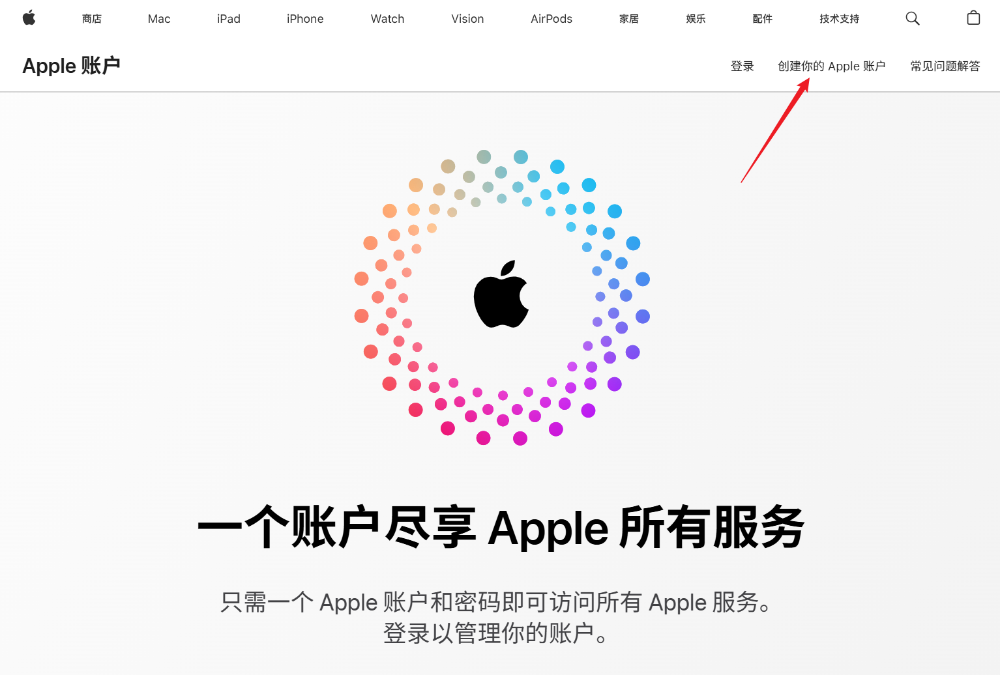
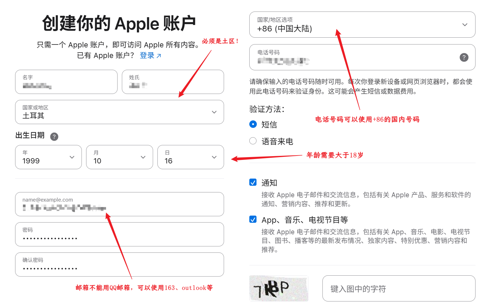
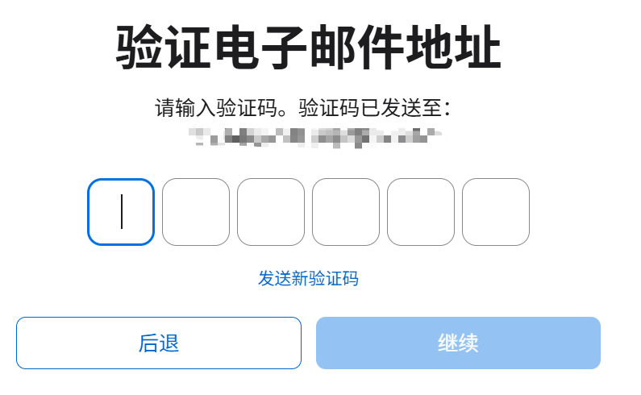
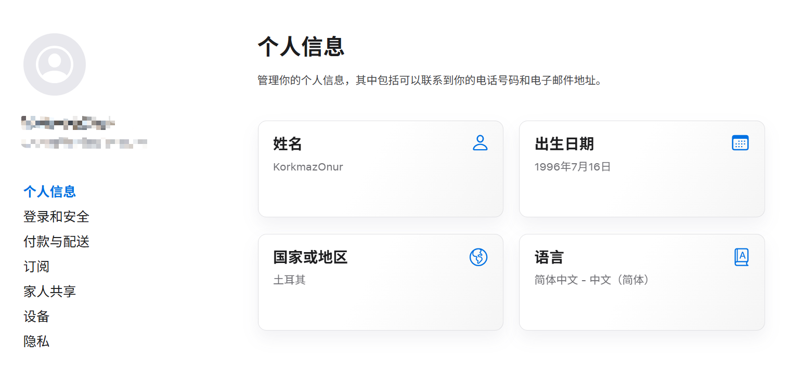
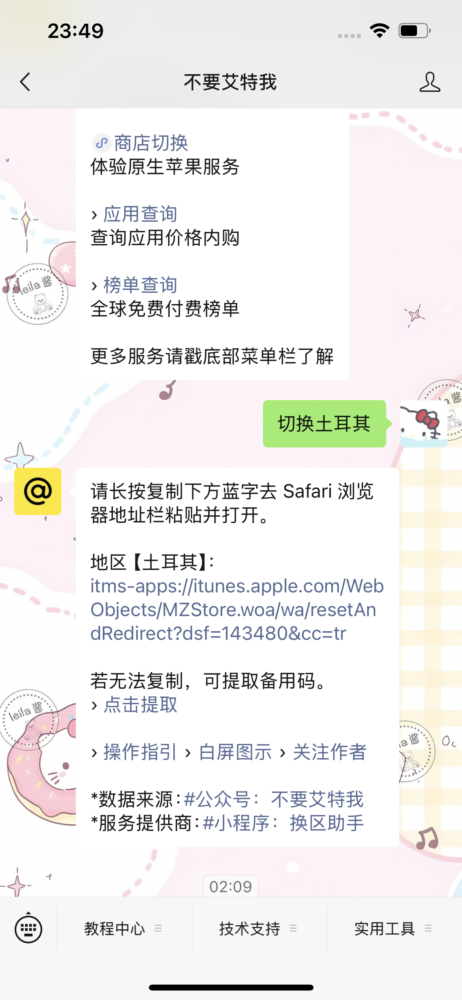
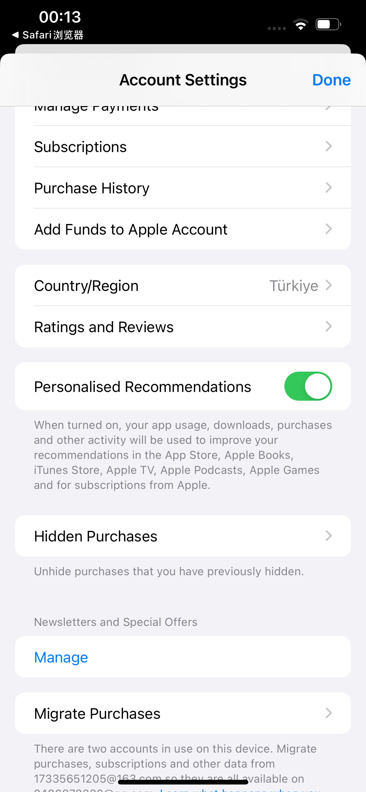
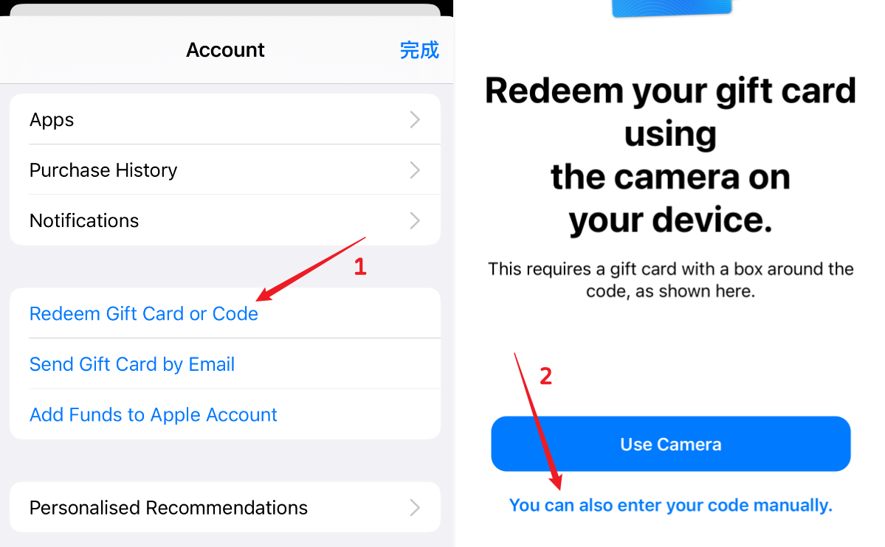

## 1. 背景

### 为什么选择土区购买？

ChatGPT Plus 官方定价为 **$20/月**，折合人民币约 145 元，对于长期用户来说成本不低。土耳其区（简称「土区」）由于当地货币里拉（TRY）汇率较低，同等套餐的定价折合人民币仅需 **30～50 元**，性价比极高，因此成为国内用户的主流低价购买方式。

### 土区购买的原理

App Store 的套餐定价因地区而异。通过注册一个土耳其地区的 Apple ID，并在该账户下购买 ChatGPT Plus 订阅，即可享受土区的本地定价。整个流程的核心是：**用土区 Apple ID 在 App Store 内完成 ChatGPT 的订阅购买**，与直接在 ChatGPT 官网用信用卡订阅是两条完全独立的路径。

### 大致操作流程

1. 注册一个土耳其地区的 Apple ID
2. 将 iPhone/iPad 的 App Store 切换到土区
3. 购买土区 App Store 礼品卡并充值
4. 在 App Store 下载 ChatGPT，登录后订阅 Plus 套餐

### 准备工作

- 一台 **iPhone 或 iPad**（用于在 App Store 完成购买）
- 一个可用的**邮箱**（推荐 Outlook、163，不建议使用 QQ 邮箱）
- 一张**土区 App Store 礼品卡**（可在闲鱼购买，或在 oyunfor.com 自充）
- 稳定的**网络环境**（注册 Apple ID 时建议使用隐私模式，无需科学上网）
- 一个已有的 **ChatGPT 账号**（用于登录 App 后订阅）

### 注意事项

- 注册土区 Apple ID 时，**必须使用浏览器隐私模式**，否则可能因 Cookie 或缓存导致地区识别错误。
- 切换 App Store 地区的操作需在**自己的原账户**上完成，切勿提前登录土区 Apple ID，否则可能导致新账户被系统识别为国区并遣返。
- 土区账户登录后，建议**尽快完成充值和购买**，减少账户被风控的概率。
- 购买完成后，日常使用 ChatGPT 仍需**科学上网**。

## 2. 完整操作教程

1. 打开电脑端浏览器，通过隐私模式登录[Apple官网](http://account.apple.com)，登录后选择【创建你的Apple账户】，注意一定要基于隐私模式访问，保持网络稳定，Apple官网不需要科学上网即可访问。
   
2. 在弹出的创建页面里，填写：姓氏、名字、出生日期、邮箱等信息，注意名字建议全英文，年龄需要大于18岁，信息填写时的一些注意事项如下图所示。
   
3. 点击继续验证手机和邮箱验证码，注意如果验证报错时，可以排查：是否网络环境异常？隐私模式是否开启？邮箱是否可用等？不要QQ邮箱，推荐Outlook、163等，若上述均无问题，可多尝试几次。
   
4. 验证成功后，进入个人信息页，你会发现当前地区信息已经显示为【土耳其】。
   
5. 设备切换至事先准备好的IPhone手机或者IPad，打开微信，搜索公众号【不要艾特我】并关注，私信并发送【切换土耳其】，复制回复中的链接并在Safari浏览器打开，该链接会自动打开App Store应用程序，并将当前App Store登录的账户地区切换为土耳其。**注意，切换土区的操作要在自己账户上完成，不要提前登录刚创建的土区Apple ID，这会导致账户被遣返回国区。**
   
6. 如上，切换成功后，可以看到账户信息的国家/地区一栏已经改为土区，即为切换成功。
   
7. 切换成功后，在APP Store上退出当前账户，登录刚才注册的土区的Apple ID账户，登录成功后，使用预先购买的土区礼品卡兑换码。注意，这一步是为了让我们创建的土区账户尽可能保持稳定从而避免被遣返回国区，因此在登录土区账户后，需要尽快在APP Store充值并购买任一物品。在购买时，系统可能会提示你完善收获地址等信息，这里可以使用[土区地址生成器](https://1ktools.com/zh-cn/tools/developer/turkey-address-generator)随机生成即可。
   
8. 注意，土区礼品卡可以自充，但相对麻烦一些，需要在[oyunfor](https://www.oyunfor.com/)注册账号后购买，这块的详细购买教程后续会另开一篇文档说明，当前最简单的方式可以选择直接在【闲鱼】购买，搜索【土区礼品卡】然后付费购买。
9. 以上一切准备就绪后，在APP Store搜索chatgpt，下载完成后登录gpt账户，选择升级到plus套餐即可。注意，想要正常使用chatgpt需要挂梯子，此处不再详细指导说明。

## 3. 常见问题

**Q：注册 Apple ID 时一直提示验证失败怎么办？**
A：按以下顺序排查：① 确认浏览器已开启隐私模式；② 检查网络是否稳定，避免使用代理或 VPN；③ 更换邮箱（推荐 Outlook 或 163，QQ 邮箱容易被拒）；④ 多尝试几次，偶发性失败属正常现象。

**Q：切换土区后，App Store 显示的地区不对怎么办？**
A：确认操作步骤是否正确——切换地区需通过公众号【不要艾特我】获取专用链接，在 Safari 中打开后才会触发地区切换。直接在 App Store 设置里手动改地区通常会要求绑定当地支付方式，走不通。

**Q：土区礼品卡在哪里买？**
A：最简单的方式是在**闲鱼**搜索「土区礼品卡」，选择信誉好的卖家购买，价格通常在面值的 1.1～1.2 倍左右。如果想自充，可以在 [oyunfor.com](https://www.oyunfor.com/) 注册账号后自行购买，价格更接近面值，但操作相对繁琐，后续会另开文档说明。

**Q：充值时提示需要填写地址怎么办？**
A：使用[土区地址生成器](https://1ktools.com/zh-cn/tools/developer/turkey-address-generator)随机生成一个土耳其地址填入即可，无需真实地址。

**Q：订阅成功后，Plus 套餐会一直有效吗？**
A：订阅是按月自动续费的。只要土区账户余额充足（或绑定了有效支付方式），每月会自动续费。如果礼品卡余额不足导致续费失败，Plus 会在当期结束后自动降级为免费版，补充余额后重新订阅即可。

**Q：土区账户会不会被封或遣返？**
A：有一定风险，但概率不高。主要触发原因是：登录土区 Apple ID 后长时间不购买、频繁切换地区、或在非 iOS 设备上操作。按照本教程的流程操作，登录后尽快完成充值购买，可以有效降低风险。

**Q：购买完成后，ChatGPT 还需要梯子吗？**
A：是的。土区购买只解决了**订阅费用**的问题，ChatGPT 本身在国内仍无法直连，日常使用依然需要科学上网。

