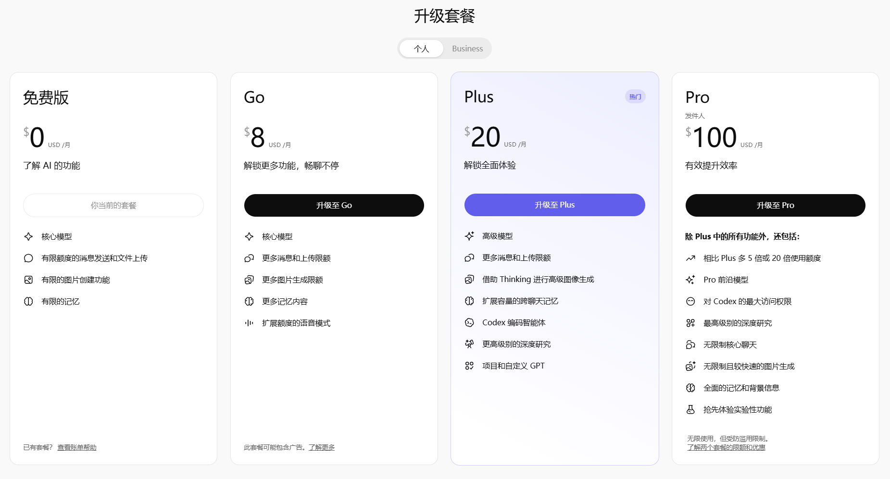
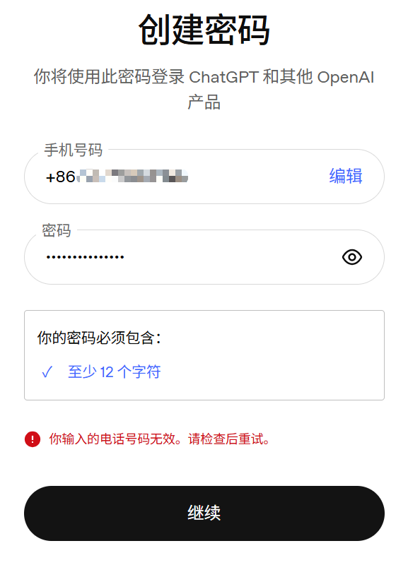
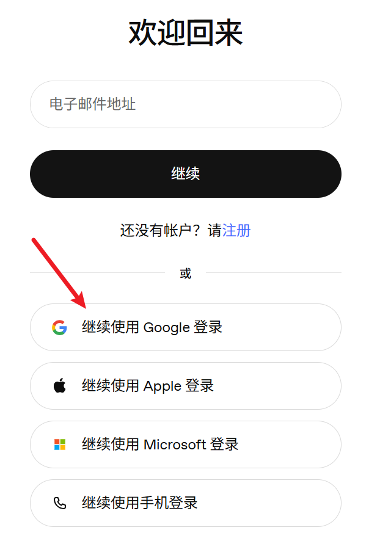

## 1. 认识Codex
### 1.1 Codex是什么

Codex是OpenAI提供的编程代理，与Claude Code类似，Codex不仅仅是一个能够回答编程问题的聊天机器人，而是一个可以深度参与到真实项目，具备上下文理解、文件读写、运行命令、规划与执行任务的全能型AI Agent。

你可以在多个开发入口调用Codex的Agent能力，包括：
- Codex App；
- IDE Extension；
- Codex CLI；
- Codex Cloud；
- GitHub；
- Slack；
- CI/CD；
- SDK、Agents SDK；

也就是说，Codex的目标不是只存在于某一个编辑器或某一个网页中，而是成为贯穿软件开发流程的智能协作层。

你可以在代码开发流程的任何一个阶段使用它，并享受由Codex带来的极致生产力释放。

### 1.2 Codex开发环境配置

当你购买ChatGPT套餐时，已经默认附带了Codex，ChatGPT官方支持：免费、Go、Plus、Pro四种购买规格。

其中，Plus、Pro套餐均包含了对Codex的可访问和使用权限。

在购买套餐前，请确保你至少能够创建chatgpt账户，它支持通过Google邮箱、Apple账户、国外手机号三种方式去创建。

注意，因为一些政策限制，无法通过国内手机号码创建chatgpt账户，如果你试图创建，则会看到类似如下截图中的报错。

推荐直接使用Google邮箱创建，关于Google邮箱申请教程大家可以自行【闲鱼】搜索人工服务。

尽管Codex提供了多种使用方式，但对于新手或者第一次使用Codex的用户，建议从Codex App开始使用，这在体验上会更直观；对于依赖终端工作流或是重度CC迁移过来的用户，可以考虑使用Codex CLI；而如果希望在云端处理任务的，则可以使用Codex Cloud。

接下来依次介绍。

#### 1.2.1 Codex APP

Codex客户端支持在Windows和MacOS系统上使用，首先让我们安装它：
- [Windows下载链接](https://get.microsoft.com/installer/download/9PLM9XGG6VKS?cid=website_cta_psi)
- [MacOS下载链接](https://persistent.oaistatic.com/codex-app-prod/Codex.dmg)

以Windows系统为例，下载完成后，点击运行它会自动从微软应用商店下载Codex应用本体，这里等待下载完成即可。

点击登录，我们选择【使用ChatGPT登录】，这会弹出一个浏览器登录页。

这里选择【继续使用Google登录】，一直下一步即可完成登录。

> 注意，第一次登录Codex时，系统会强制验证手机号，同样国内手机号是无法使用的，这里我们可以使用一些国外短信验证服务，如：[hero-sms](https://hero-sms.com/cn)，使用方便，自助完成短信验证码服务。

登入Codex后，你会看到

