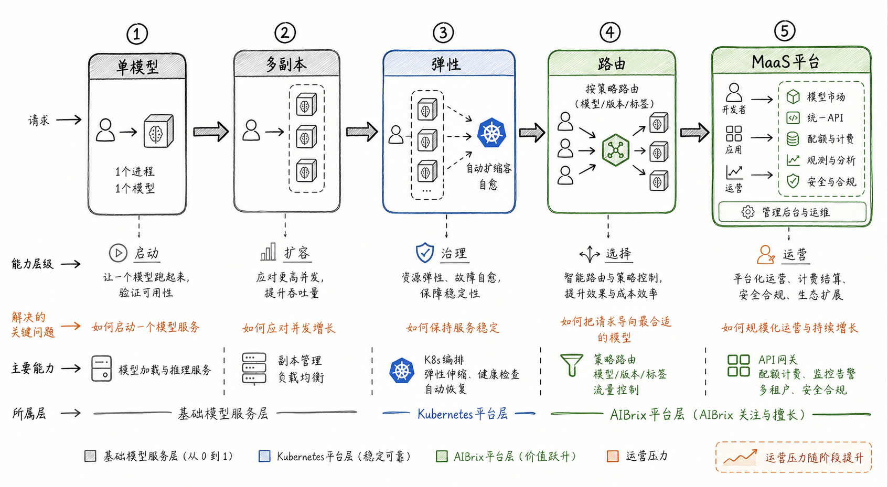
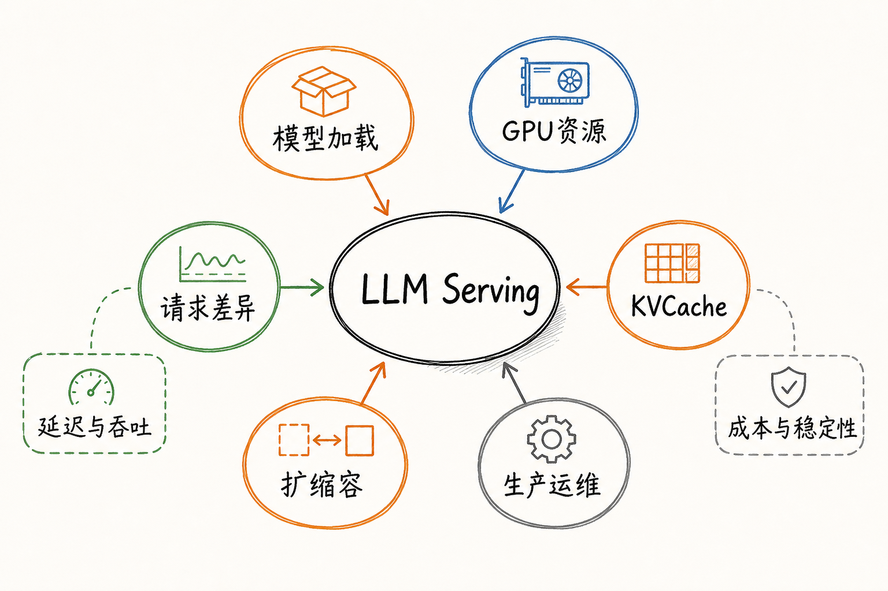
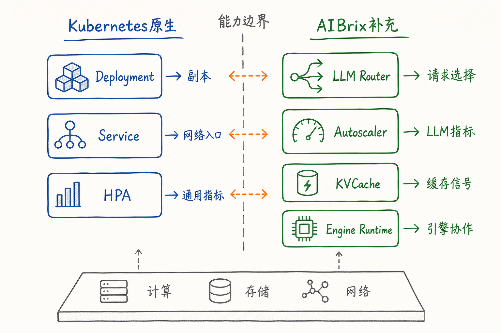
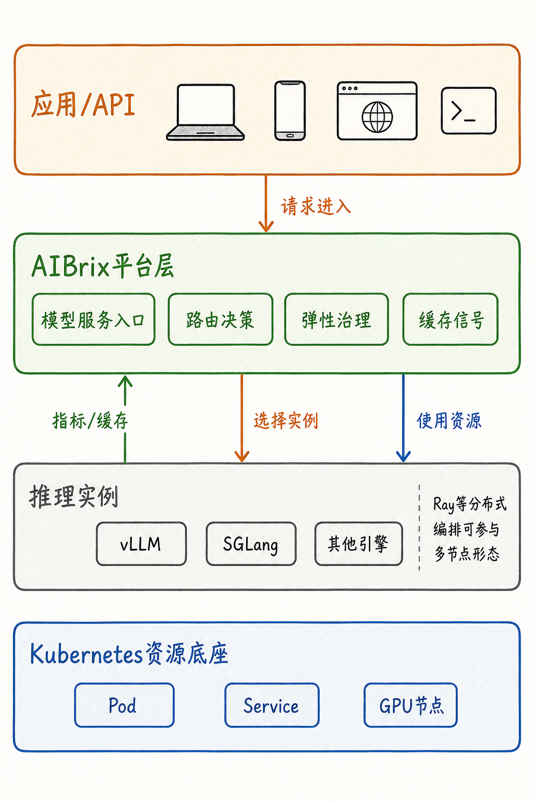
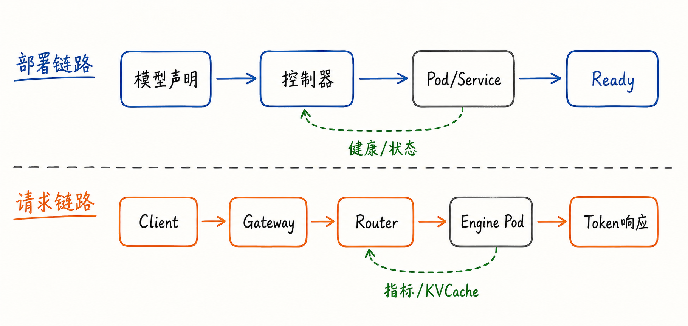

---
tags:
  - MaaS
  - AIBrix
  - LLMServing
  - Kubernetes
  - 架构
updated: 2026-05-31
description: "本文从 LLM Serving 的工程问题出发，解释 AIBrix 为什么需要作为 MaaS 平台抽象出现，以及它与 Kubernetes 原生能力的分工。"
---

# 01. AIBrix要解决什么问题

## 1. 从“能跑模型”到“能运营模型服务”

把一个大模型服务启动起来，和把一个大模型服务长期稳定地运营起来，是两件不同的事。

在最小实验环境里，目标通常很直接：下载模型权重，启动一个 vLLM、SGLang 或其他推理引擎进程，暴露一个兼容 OpenAI API 的 HTTP 端口，然后让客户端发起请求。这个阶段最关心的是“模型能不能跑”“接口能不能通”“显存够不够”。

进入团队共享环境或生产环境后，问题会明显变形。模型不再只是一个进程，而会变成一个需要被部署、扩容、路由、观测、限流、升级、隔离和恢复的在线服务。此时，工程目标也不再只是“启动成功”，而是：

- 多个副本如何对外表现为同一个模型服务；
- 请求应该进入哪个副本，依据是负载、延迟、缓存命中，还是业务优先级；
- 流量突增时怎样扩容，低峰期怎样释放昂贵 GPU 资源；
- 某个副本刚启动但模型尚未加载完成时，网关是否应该把请求发给它；
- 长上下文、多轮对话、Prefix Cache、KVCache 等运行时状态如何参与调度；
- 模型服务如何被观测、限流、分级、升级，并在故障后恢复。

图 1 可以按四条线阅读。第一条线是能力层级：单模型解决“启动”，多副本解决“扩容”，弹性解决“稳定”，路由解决“选择”，MaaS 平台解决“运营”。这条线先把问题从“让一个模型跑起来”推进到“让一组模型服务长期可用”。

第二条线是关键问题。每升一级，问题都会变得更接近生产环境：单模型阶段关心如何启动一个模型服务，多副本阶段关心如何应对并发增长，弹性阶段关心如何保持服务稳定，路由阶段关心如何把请求导向最合适的模型实例，MaaS 平台阶段关心如何规模化运营和持续增长。

第三条线是主要能力。基础模型服务层负责模型加载与推理服务，Kubernetes 平台层提供通用编排、弹性伸缩、健康检查和自动恢复，AIBrix 平台层进一步补充策略路由、模型/版本/标签选择、流量控制、API 网关、配额计费、监控告警和多租户治理等平台能力。

第四条线是所属层。右侧 MaaS 平台中的模型市场、统一 API、配额与计费、观测分析、安全与合规，可以先理解为平台运营的目标集合；本章不会逐项展开，而是先说明为什么这些能力需要建立在 LLM Serving 的路由、弹性和治理之上。

因此，理解 AIBrix 的第一个关键点是：它不是为了替代推理引擎，也不是为了替代 Kubernetes。它试图补齐的是两者之间的空白：推理引擎负责把 token 算出来，Kubernetes 负责把容器调度起来，而 AIBrix 负责把这些推理实例组织成可运营的 MaaS（Model as a Service）能力。

## 2. LLM Serving 的工程问题域

普通 Web 服务的请求通常可以近似看成短任务：请求进入后，服务端读取少量状态、做一次计算、返回结果。副本之间大多可以视为无状态或弱状态，负载均衡器只要把请求均匀分摊到健康实例上，系统就已经具备了基本可用性。

LLM Serving 不一样。一次请求的成本并不只由“请求数量”决定，还与 prompt 长度、输出长度、批处理状态、KVCache 命中、GPU 显存压力、prefill/decode 阶段占比、模型大小和多轮上下文相关。两个 HTTP 请求看起来格式相同，但它们消耗的 GPU 时间、显存、排队延迟和后续缓存价值可能完全不同。

可以把 LLM Serving 的问题域拆成六类。

第一类是模型加载。大模型权重体积巨大，镜像、权重、适配器、缓存和本地存储都会影响冷启动时间。一个 Pod 被 Kubernetes 调度成功，并不等于模型已经可服务。对平台来说，真正可用的状态必须覆盖模型下载、加载、引擎初始化和健康探测。

第二类是 GPU 资源。GPU 不只是“比 CPU 贵”的计算资源，它还带有显存容量、GPU cache 利用率、吞吐曲线、异构型号差异和共享约束。一个模型副本在 CPU 指标上看起来空闲，不代表它还有足够的 KVCache 空间，也不代表它适合接收长上下文请求。

图中的“延迟与吞吐”“成本与稳定性”不是额外两类问题，而是这些问题共同影响的结果：模型加载慢会影响可用时间，GPU 与 KVCache 压力会影响成本，请求差异和扩缩容滞后会放大尾延迟。

第三类是请求差异。LLM 请求的输入长度、输出长度和交互模式差异很大。短问答、长文档总结、多轮对话、批处理推理和低延迟交互并不适合同一种路由策略。AIBrix 文档中的 Router 也将路由算法按通用负载均衡、KV-cache aware、公平性、SLO-aware 和专用策略分组，这说明“选择实例”本身已经是一个 LLM 语义问题。

第四类是 KVCache。KVCache 不只是推理引擎内部的性能优化细节。对于多轮对话、共享前缀、重复 prompt 或长上下文请求，缓存是否已经在某个实例上存在，会直接影响 prefill 重算成本。AIBrix 的论文和文档都把分布式 KV cache、跨引擎复用、prefix-aware routing 放在系统级优化中讨论，而不是只放在单机引擎内部。

第五类是扩缩容。Kubernetes HPA 可以依据 CPU、内存或自定义指标调整副本数，但 LLM 推理的负载并不稳定地映射到传统指标。AIBrix Autoscaler 文档把扩缩容拆成多类机制，包括沿用 Kubernetes 弹性能力、面向请求负载的弹性能力、面向 LLM 工作负载波动的能力，以及依赖 profiling 和求解器的提前规划能力。具体机制会在弹性章节展开，本章只需要先看到一点：扩缩容判断已经不只是“CPU 高不高”。

第六类是生产运维。生产环境需要模型级限流、不同流量类别的 routing profile、readiness、replica sizing、rolling update、可观测性和故障处理。AIBrix 的生产部署文档要求被管理的 Pod 模板至少带有模型名和端口标签，否则 gateway 无法把流量路由到对应模型，这类要求已经超出了“容器是否启动”的层面。

这些问题共同指向一个结论：LLM Serving 的平台层必须理解模型、请求、缓存、GPU、引擎和流量策略之间的关系。只把模型进程塞进容器，并不能自动得到可运营的模型服务。

## 3. Kubernetes 原生能力的边界

Kubernetes 是 AIBrix 的基础，而不是 AIBrix 需要绕开的对象。要理解 AIBrix，必须先看清 Kubernetes 原生能力已经解决了什么。

Kubernetes Deployment 管理一组 Pod，使应用工作负载达到期望状态，并通过 ReplicaSet 提供声明式更新、滚动替换、扩缩容和回滚能力。Service 则把一组可能不断变化的 Pod 暴露成稳定的网络入口，使客户端不需要直接追踪每个 Pod 的 IP。HPA 可以根据 CPU、内存或自定义指标周期性调整目标工作负载的副本数。

这些能力非常关键。没有 Deployment，就很难把模型副本纳入声明式生命周期管理；没有 Service，就很难在 Pod 创建、销毁、重建时维持稳定访问入口；没有 HPA 或类似控制器，就很难把负载变化转化为副本数变化。

但 Kubernetes 的抽象是通用的。它知道 Pod、ReplicaSet、Service、EndpointSlice、指标和控制器，却不会天然理解以下事实：

- `model` 字段对应哪个模型服务；
- 某个请求是否能复用某个副本上的 prefix cache；
- 一个副本 GPU 利用率不高时，是否已经接近 KVCache 容量上限；
- 新 Pod 已经 Running，但模型是否完成加载；
- 多轮对话请求是否应该保持 session affinity；
- 某类客户请求是否应该使用低延迟策略，而另一类批处理请求使用高吞吐策略；
- 一个推理引擎的监控指标如何统一暴露给控制面和路由层。

图 3 的重点是“边界”。Kubernetes 原生对象擅长表达基础运行时资源：副本、网络入口、滚动发布、资源调度、通用扩缩容。AIBrix 补充的是面向 LLM Serving 的平台语义：请求选择、LLM 指标、缓存信号、引擎协作、模型级策略和生产保护。

因此，AIBrix 和 Kubernetes 的关系不是“谁替代谁”。更准确的关系是：Kubernetes 提供稳定的云原生资源底座，AIBrix 在这个底座上增加 LLM 推理所需的控制面和数据面能力。

## 4. AIBrix 的平台定位

截至 2026-05-31，AIBrix 官方文档把它描述为一个开源项目，用于构建可扩展的 GenAI inference infrastructure，并提供面向企业需求的大语言模型推理部署、管理和扩缩容能力。它的 README 也强调 AIBrix 是 cloud-native 的解决方案，优化目标是部署、管理和扩展 LLM inference。

这个定位可以拆成三层理解。

第一，AIBrix 不负责替代底层推理引擎。vLLM、SGLang、TensorRT-LLM 等推理引擎负责具体的模型执行、并行、显存管理和 token 生成；Ray 这类分布式执行或编排框架可以参与多节点推理形态。AIBrix 需要与这些引擎和框架协作，但它的关注点不是重新实现 attention kernel 或 batch scheduler。

第二，AIBrix 不负责替代 Kubernetes。Pod、Service、Deployment、Gateway、控制器、调度和资源状态仍然属于 Kubernetes 生态。AIBrix 更像是在 Kubernetes 上增加面向模型服务的对象、控制器、路由策略和运行时桥接能力。

第三，AIBrix 的核心价值在于把“多个推理实例”组织成“可治理的模型服务”。它需要知道请求从哪里进来、应该进入哪个实例、实例是否健康、模型是否加载完成、负载是否需要扩缩容、缓存状态是否影响路由、生产策略是否允许继续转发请求。

图 4 只表达层次关系，不表达一一对应的实现绑定。应用/API 代表调用方入口；AIBrix 平台层代表模型服务入口、路由决策、弹性治理和缓存信号汇聚；推理实例代表实际执行 token 生成的后端；Kubernetes 资源底座代表 Pod、Service、GPU 节点等通用资源对象。图中的箭头表示请求、资源使用和运行时信号的方向，不表示某个 Service 只服务某个引擎，也不表示 Ray 与 vLLM、SGLang 是同一种角色。

截至 2026-05-31 的 AIBrix 架构文档显示，它同时包含控制面和数据面。控制面组件管理模型元数据注册、autoscaling、model adapter registration，并执行策略；数据面组件负责请求分发、调度和服务推理请求。当前文档列出的控制面能力包括 Model Adapter controller、RayClusterFleet、LLM-Specific Autoscale、GPU Optimizer、AI Engine Runtime 和诊断工具；数据面能力包括 Request Router 和 Distributed KV Cache Runtime。

这种分层解释了 AIBrix 为什么不能被简单理解成“一个网关”。网关和 Router 当然很重要，但如果没有模型元数据、实例状态、指标、缓存信号、弹性控制和引擎侧管理能力，路由层只能做普通转发，无法完成 LLM-aware routing。

也不能把 AIBrix 简化为“一个自动扩缩容工具”。Autoscaler 只是控制面的一个组成部分。它可以决定资源规模，但仍然需要 Router 使用新的实例，需要 Runtime 暴露指标，需要 Kubernetes 承载 Pod 生命周期，需要生产策略约束流量进入方式。

在本文的 MaaS 语境下，可以把 AIBrix 理解为 Kubernetes 与推理引擎之间的平台层。它既向下使用 Kubernetes 的资源编排能力，也向上为应用提供更稳定的模型服务入口；既读取推理引擎暴露的运行时信号，也把这些信号转化为路由、扩缩容、缓存协同和生产治理决策。

## 5. AIBrix 的总体架构

第一章不需要提前深入 CRD 字段或源码路径，但需要先建立两个高层链路：部署链路和请求链路。

部署链路关心的是模型服务如何从声明进入运行态。平台接收模型、适配器、引擎、资源和策略相关配置后，由控制器把目标状态转化为 Kubernetes 资源，并持续观察实际状态是否满足目标。这个过程会涉及 Pod/Service、readiness、模型加载、引擎初始化、指标暴露和副本状态。

请求链路关心的是一次推理请求如何进入系统并找到合适的后端实例。AIBrix Router 文档描述了一个典型路径：Client 发起 `/v1/chat/completions` 请求，请求进入 Envoy，通过 External Processing Hook 到 GatewayPlugin，再由 Router 查询 pod metrics 与 KV state，应用路由算法，最后转发到选中的 InferencePod，并将流式 token 返回给客户端。

这两个链路不是互相独立的。

部署链路决定有哪些模型实例、实例是否 Ready、服务端口在哪里、指标怎样暴露、哪些 Pod 可以接收请求。请求链路则消耗这些状态，把每一次请求导向某个具体实例。与此同时，请求执行后的延迟、吞吐、in-flight requests、KVCache 状态和健康信号又会反向影响后续路由和扩缩容。

可以用一个简单场景把两条链路串起来。

假设平台中部署了一个聊天模型，最初只有两个副本。流量高峰到来后，Router 发现现有副本的排队时间和 token 处理压力上升。Autoscaler 从引擎指标中看到负载持续超过阈值，于是增加副本数。Kubernetes 创建新的 Pod，并等待模型完成加载和 readiness 检查。新副本 Ready 之前，Router 不应该把真实请求转发过去；Ready 之后，它才进入候选后端列表。之后，如果某些多轮对话请求在旧副本上已有 prefix cache，Router 还可能把这些请求继续导向缓存命中更高的实例，而不是简单平均分摊。

这个场景里，Kubernetes 负责把 Pod 创建出来，推理引擎负责实际生成 token，AIBrix 负责把模型服务的运行时事实组织成决策：谁能接流量、谁应该接流量、什么时候需要更多资源、什么时候应该保护模型不被突增流量击穿。

## 6. 本章小结：AIBrix 的架构位置

第一章的核心结论可以收束为三句话。

第一，LLM Serving 的难点不是“把模型进程启动起来”这一件事，而是把模型、GPU、请求、缓存、弹性和生产策略组合成稳定的在线服务。

第二，Kubernetes 提供了非常重要的通用底座：Pod 生命周期、Deployment 声明式更新、Service 网络入口、HPA 扩缩容和控制器模式。但这些对象本身并不理解 LLM 请求成本、KVCache、token 级负载、模型加载状态和推理引擎差异。

第三，AIBrix 的平台价值在于连接 Kubernetes 与推理引擎：向下复用云原生资源编排，向上提供模型服务入口，并在中间增加 LLM-aware 的路由、弹性、缓存、运行时桥接和生产治理能力。

带着这个架构位置继续阅读后续章节，会更容易判断每个机制的归属：CRD 章节讲平台如何表达模型服务目标，工作负载章节讲模型如何变成运行时资源，弹性章节讲副本如何随负载变化，KVCache 章节讲缓存怎样从引擎内部细节变成平台信号，路由章节讲一次请求如何被导向合适的模型实例。

## 7. 参考资料

1. [AIBrix Documentation：Welcome to AIBrix](https://aibrix.readthedocs.io/latest/)；
2. [AIBrix Documentation：AIBrix Architecture](https://aibrix.readthedocs.io/latest/designs/architecture.html)；
3. [AIBrix Documentation：AIBrix Router](https://aibrix.readthedocs.io/latest/designs/aibrix-router.html)；
4. [AIBrix Documentation：AIBrix Autoscaler](https://aibrix.readthedocs.io/latest/designs/aibrix-autoscaler.html)；
5. [AIBrix Documentation：AIBrix Engine Runtime](https://aibrix.readthedocs.io/latest/designs/aibrix-engine-runtime.html)；
6. [AIBrix Documentation：Production Model Deployments](https://aibrix.readthedocs.io/latest/production/model-deployment.html)；
7. [GitHub：vllm-project/aibrix](https://github.com/vllm-project/aibrix)；
8. [AIBrix: Towards Scalable, Cost-Effective Large Language Model Inference Infrastructure](https://arxiv.org/abs/2504.03648)；
9. [Kubernetes Documentation：Deployments](https://kubernetes.io/docs/concepts/workloads/controllers/deployment/)；
10. [Kubernetes Documentation：Service](https://kubernetes.io/docs/concepts/services-networking/service/)；
11. [Kubernetes Documentation：Horizontal Pod Autoscaling](https://kubernetes.io/docs/concepts/workloads/autoscaling/horizontal-pod-autoscale/)。

## 8. 学习测评

### 8.1 题目

1. 单选：第一章中，AIBrix 最核心的定位是什么？
   - A. 替代 vLLM、SGLang 等推理引擎，直接负责 token 生成；
   - B. 替代 Kubernetes，重新实现 Pod 调度和 Service 网络；
   - C. 位于 Kubernetes 与推理引擎之间，补充 LLM Serving 的平台治理能力；
   - D. 只提供一个 HTTP 反向代理，不参与模型服务状态管理；

2. 多选：以下哪些问题属于 LLM Serving 相比普通 Web 服务更突出的工程挑战？
   - A. 请求输入输出长度差异大，单次请求成本不稳定；
   - B. KVCache 命中会影响后续请求的计算成本；
   - C. Pod 只要 Running，就一定可以接收真实推理请求；
   - D. GPU 显存、缓存和 token 吞吐会影响调度判断；

3. 单选：Kubernetes Deployment 原生能力主要解决什么问题？
   - A. 根据 prompt prefix 选择缓存命中最高的推理实例；
   - B. 管理一组 Pod，使应用工作负载逐步达到期望状态；
   - C. 为 LLM 请求计算最优路由策略；
   - D. 统一不同推理引擎的模型加载 API；

4. 单选：为什么 Service 不能直接等同于 LLM-aware Router？
   - A. Service 默认会根据 EndpointSlice 自动选择 KVCache 命中最高的 Pod；
   - B. Service 只要配合 readiness，就能自然识别不同 prompt 的 token 成本；
   - C. Service 提供稳定访问入口，但不会天然理解 token、缓存、延迟和模型级策略；
   - D. Service endpoints 数量增加后，就等价于具备模型级路由策略；

5. 多选：AIBrix Router 做路由决策时，哪些信号可能比普通轮询更有价值？
   - A. ready pod 列表；
   - B. in-flight requests 或近期延迟；
   - C. KV state 或 prefix cache 命中情况；
   - D. 只看 Service 的后端数量，不区分每个后端的运行时状态；

6. 多选：根据本文对控制面和数据面的划分，下列哪些能力更偏 AIBrix 控制面？
   - A. 管理模型元数据和 adapter registration；
   - B. 执行 LLM-specific autoscale 或 GPU Optimizer 这类策略；
   - C. 为每个请求查询 pod metrics 和 KV state 并选择 InferencePod；
   - D. 在推理引擎内部执行 attention kernel；

7. 多选：为什么 HPA 对 LLM Serving 来说常常不够？
   - A. LLM 负载不总是稳定映射到 CPU 或内存指标；
   - B. token 吞吐、请求长度、KVCache 压力等指标会影响真实负载；
   - C. 只要接入一个自定义指标，HPA 就能完整解决所有 LLM 扩缩容问题；
   - D. 冷启动和模型加载会让扩容响应存在额外延迟；

8. 单选：以下哪句话最准确描述 KVCache 在平台层的意义？
   - A. KVCache 只影响单机引擎内部实现，不应该影响跨副本路由；
   - B. KVCache 命中情况只适合用于离线分析，不适合参与在线请求选择；
   - C. KVCache 可以成为路由和性能优化信号，因为缓存命中会改变 prefill 重算成本；
   - D. KVCache 只要存在，就应该永远优先选择缓存命中的实例，不需要考虑排队延迟；

9. 单选：部署链路和请求链路的关系是什么？
   - A. 请求链路只需要 Service endpoints，不需要模型加载、健康和指标状态；
   - B. 部署链路提供实例、readiness、端口和指标等状态，请求链路消费这些状态做转发；
   - C. 部署链路只决定 Pod 数量，请求链路只决定 HTTP path，二者不会互相反馈；
   - D. Router 可以独立发现所有事实状态，因此控制器不需要持续观察运行态；

10. 多选：如果一个新推理 Pod 已经被 Kubernetes 创建，但模型还没有加载完成，平台应该如何理解这个状态？
    - A. Kubernetes 层面可能已经创建资源，但模型服务层面还不能认为它可接流量；
    - B. Router 应该等待 readiness 或等价状态满足后，再把它纳入候选后端；
    - C. 只要 Pod IP 存在，就应该立即转发所有请求；
    - D. 控制面需要继续观察模型加载、健康和指标暴露状态；

11. 多选：聊天模型有两个 Ready 副本。副本 A 有该会话的 prefix cache，但 in-flight requests 较高；副本 B 当前负载较低，但没有缓存命中。Router 判断时哪些说法更合理？
    - A. 只看请求数，必须选择 B；
    - B. 应综合缓存命中收益、排队延迟和 SLO；
    - C. 如果 A 的排队延迟已经明显超过 SLO，缓存命中也不一定优先；
    - D. Service 默认负载均衡能够感知上述权衡；

12. 多选：某模型 CPU 指标不高，但长上下文请求尾延迟升高，GPU 显存和 KVCache 压力接近上限，HPA 没有扩容。平台更合理的判断是什么？
    - A. CPU 低说明模型服务没有负载问题；
    - B. 应引入 token 吞吐、KVCache/GPU 压力、队列延迟等 LLM 指标；
    - C. 即使决定扩容，也要考虑模型加载和 readiness 带来的延迟；
    - D. 只增加 Service endpoints 就能解决延迟问题；

### 8.2 答案与解析

1. 答案：C。AIBrix 的定位不是替代推理引擎或 Kubernetes，而是在二者之间增加面向 LLM Serving 的平台层能力，包括路由、弹性、缓存、运行时桥接和生产治理。

2. 答案：A、B、D。LLM 请求的成本与输入输出 token、KVCache、GPU 显存和运行时状态有关。C 是常见误解，Pod Running 不等于模型已经完成加载并可接收请求。

3. 答案：B。Deployment 的核心是声明式管理 Pod 与 ReplicaSet，使实际状态逐步接近期望状态。它不负责理解 prompt、KVCache 或推理引擎 API。

4. 答案：C。Service 解决稳定网络入口和 Pod 集合暴露问题，但不会自动获得 KVCache 命中、prompt token 成本、近期延迟或模型级策略。A 把 EndpointSlice 误解成缓存感知机制；B 高估 readiness 的语义范围；D 把后端数量增加误解成模型级路由能力。

5. 答案：A、B、C。ready pod 列表决定哪些实例可路由，负载和延迟反映当前压力，KV state 或 prefix cache 能影响请求的真实计算成本。D 是典型的普通负载均衡视角，只看后端数量会忽略实例是否可接流量、是否拥塞、是否有缓存命中。

6. 答案：A、B。模型元数据、adapter registration、LLM-specific autoscale 和 GPU Optimizer 更偏控制面能力。C 描述的是 Router 所在的数据面请求路径，D 属于推理引擎内部执行机制，不是 AIBrix 控制面职责。

7. 答案：A、B、D。HPA 可以扩缩容，但 LLM 推理负载与 CPU/内存之间并不总是线性关系；token、KVCache、请求长度和冷启动都会影响扩缩容效果。C 的误区在于把“接入自定义指标”理解成完整方案，忽略了模型加载、SLO、缓存、GPU 压力和扩容滞后。

8. 答案：C。KVCache 在平台层的意义是把“是否可以复用已有计算”变成调度信号。A、B 低估了缓存对跨副本路由的影响；D 则走向另一个极端，缓存命中有价值，但仍要与排队延迟、SLO 和负载状态一起判断。

9. 答案：B。部署链路产生并维护运行时状态，请求链路使用这些状态做转发。A 和 C 都把两条链路切得过开，忽略 readiness、指标和健康状态的共享；D 则忽略控制器持续观察和修正实际状态的作用。

10. 答案：A、B、D。新 Pod 创建成功只是资源层面的状态；模型服务是否可用还要看模型加载、健康检查、端口、指标和 readiness。直接把未就绪实例纳入路由会增加失败率和尾延迟。

11. 答案：B、C。缓存命中可以降低 prefill 重算成本，但它不是唯一目标。如果缓存命中实例已经拥塞并导致 SLO 风险，Router 需要在缓存收益和排队延迟之间权衡。A 只看请求数，D 高估了普通 Service 默认负载均衡的语义能力。

12. 答案：B、C。CPU 低不代表 LLM 服务没有瓶颈，长上下文请求可能主要受 GPU 显存、KVCache、token 处理和队列影响。即使判断需要扩容，也不能忽略模型加载、readiness 和新副本进入候选后端前的延迟。A 和 D 都把问题过度简化为传统服务指标或网络入口数量。
