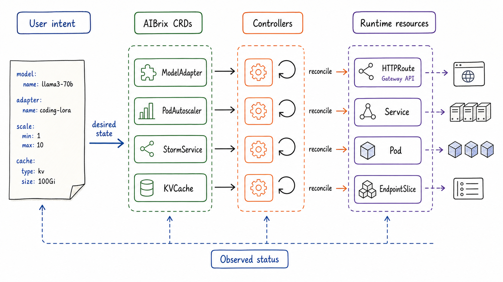
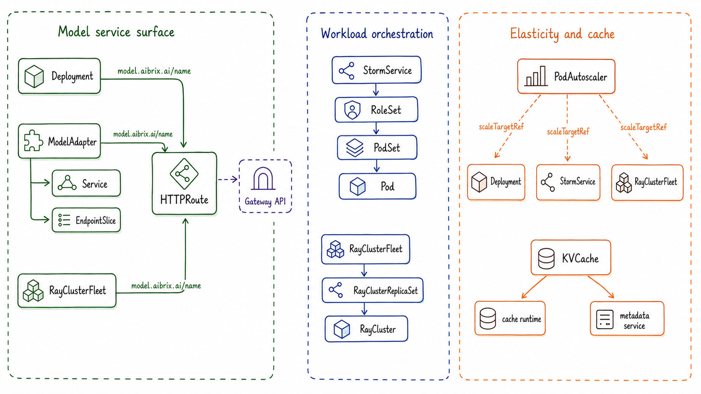
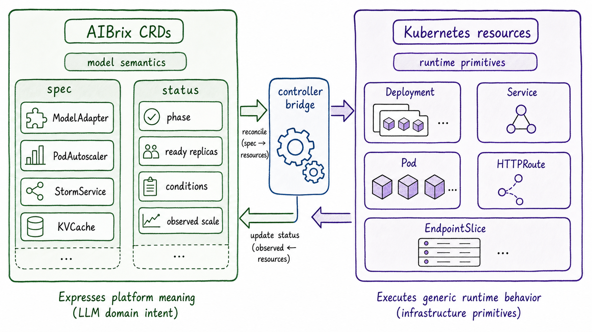
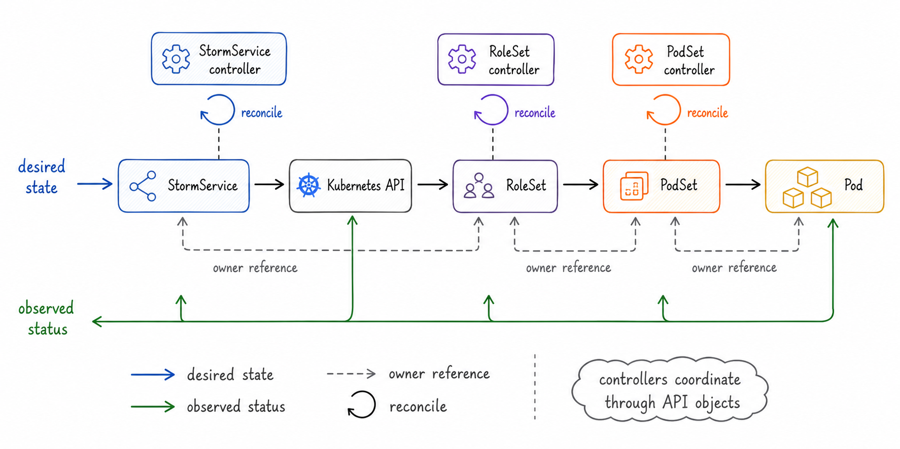

---
tags:
  - MaaS
  - AIBrix
  - LLMServing
  - Kubernetes
  - CRD
  - 架构
updated: 2026-05-31
description: "本文解释 AIBrix 如何以 CRD 作为控制面表达入口，并梳理核心 CRD 与 Kubernetes 原生资源、控制器协作之间的关系。"
---

# 02. CRD中心化架构

## 1. 为什么先看 CRD

第一章已经把 AIBrix 放在了 Kubernetes 与推理引擎之间：Kubernetes 负责通用资源编排，推理引擎负责实际生成 token，AIBrix 负责把多副本、多模型、多策略、多缓存信号组织成可运营的模型服务。进入第二章后，最先需要回答的问题是：这些“平台语义”到底放在哪里表达。

在 Kubernetes 体系里，CRD（Custom Resource Definition）不是简单的 YAML 模板，也不只是给配置文件换一个名字。CRD 的意义在于扩展 Kubernetes API，让平台可以把自己的领域对象放进同一个声明式控制系统里。对象一旦进入 Kubernetes API，就自然拥有 `metadata`、`spec`、`status`、事件、权限、版本、校验、watch、reconcile 和 owner reference 等机制。对于 AIBrix 这类平台来说，这比把所有策略塞进 ConfigMap 或控制器参数更适合长期演化。

AIBrix 的 CRD 中心化架构，可以先理解为三句话：

- 用 CRD 表达 LLM Serving 的平台目标状态，例如 adapter、autoscaling、复杂工作负载和 KVCache；
- 用控制器把 CRD 的 `spec` 转换为 Kubernetes 原生资源、Gateway API 资源、KubeRay 资源或运行时动作；
- 用 CRD 的 `status` 把实际运行结果重新汇总回平台对象，使用户和其他控制器可以继续读取、判断和协作。

截至 2026-05-31，AIBrix 当前源码中的自有 CRD 主要分布在三个 API group 中：

- `model.aibrix.ai`：以 `ModelAdapter` 表达 LoRA adapter 这类模型适配器生命周期；
- `autoscaling.aibrix.ai`：以 `PodAutoscaler` 表达面向模型服务的扩缩容策略；
- `orchestration.aibrix.ai`：以 `StormService`、`RoleSet`、`PodSet`、`RayClusterFleet`、`RayClusterReplicaSet`、`KVCache` 表达复杂推理工作负载、分布式 Ray 工作负载和缓存基础设施。



图 1 的重点不是说所有请求都会经过同一条固定链路，而是给出一个控制面阅读姿势：用户提交的模型、adapter、扩缩容或缓存意图，先被固化为 AIBrix CRD；控制器围绕这些 CRD 做 reconcile；最终被创建或调整的是 `Deployment`、`Service`、`Pod`、`EndpointSlice`、`HTTPRoute` 这类运行时资源。底部的反向箭头表示观测状态会回写到 `status`，否则声明式对象就只能表达“我想要什么”，无法告诉读者“系统现在走到哪里”。

这里要先避免一个过度简化：AIBrix 并不是把所有模型服务都强行变成 AIBrix CRD。基础模型服务仍然可以使用 Kubernetes `Deployment`、`Service` 和一组 `model.aibrix.ai/*` 标签进入 AIBrix 网关与路由体系。CRD 的中心化，指的是 AIBrix 把自己新增的平台语义放到 Kubernetes API 中表达，而不是替代所有原生对象。

## 2. CRD 表达的平台语义

理解 AIBrix 的 CRD，不能从字段名开始，而要先从平台需要表达什么开始。LLM Serving 平台至少要表达五类 Kubernetes 原生对象并不天然理解的语义。

第一类是模型服务身份。普通 `Deployment` 可以声明容器镜像、资源限制和副本数，但它不知道某个 Pod 对外代表哪个模型，也不知道模型的服务端口、指标端口和推理引擎类型。AIBrix 通过 `model.aibrix.ai/name`、`model.aibrix.ai/port`、`model.aibrix.ai/engine` 等标签和注解，把这些模型服务身份信息挂在工作负载或 Pod 上。`ModelRouter` 这类控制器再据此创建 `HTTPRoute`，让网关能够把请求映射到具体模型服务。

第二类是模型适配器生命周期。LoRA adapter 不是一个独立的基础模型副本，它通常依附在已经运行的 base model Pod 上，并要求推理引擎支持动态加载。`ModelAdapter` 的 `spec` 表达 adapter artifact 地址、base model、Pod selector、凭据引用和副本意图；`status` 则汇总候选 Pod、ready replica、实例列表和条件状态。这样，adapter 不再只是“某个 Pod 上执行过一次加载命令”，而是一个可查询、可重试、可诊断的平台对象。

第三类是复杂推理工作负载形态。普通 `Deployment` 的核心抽象是一组相同 Pod 副本，而复杂推理服务经常需要多角色协作，例如 prefill/decode 分离、多个角色按顺序升级、多 Pod 作为一个原子组共同工作，或者对一组角色设置不同的调度策略。`StormService`、`RoleSet` 和 `PodSet` 正是为这类结构准备的：`StormService` 表达较高层的服务副本与更新策略，`RoleSet` 表达角色集合，`PodSet` 表达一组需要一起工作的 Pod。

第四类是分布式推理运行时。AIBrix 支持通过 Ray 承载多节点推理时，需要表达的不是单个 Pod，而是一组 Ray Cluster 实例。`RayClusterFleet` 与 `RayClusterReplicaSet` 在设计上接近 Kubernetes `Deployment` 与 `ReplicaSet` 的分工：前者表达较高层的 fleet 目标，后者负责管理具体 RayCluster 副本。Ray 仍然处理应用内部的细粒度分布式执行，Kubernetes 和 AIBrix 则处理外层资源编排、扩缩容和滚动更新。

第五类是弹性与缓存基础设施。`PodAutoscaler` 表达扩缩容目标、指标来源和策略类型，包括 `HPA`、`KPA` 和 AIBrix 的 `APA`；它还可以通过 `subTargetSelector` 针对 `StormService` 中的某个 role 做角色级扩缩容。`KVCache` 则表达缓存运行时、metadata 服务、watcher 和对外 Service 等缓存基础设施意图。它们不一定处在模型部署主链路上，但会直接影响路由、容量和成本。

这些对象共同说明了 CRD 的价值：CRD 让 AIBrix 可以把“模型服务语义”变成 API 对象，而不是散落在脚本、环境变量和控制器私有内存中。字段当然重要，但字段只是结果；更底层的设计目标是让平台状态可声明、可观察、可被其他控制器消费。

## 3. 核心 CRD 的角色分工

从全景上看，AIBrix 的 CRD 可以分成模型服务表层、工作负载编排、弹性治理和缓存基础设施四组。下面这张表不是字段手册，而是帮助读者先建立对象角色。

| CRD | API group | 主要语义 | 典型下游对象或动作 |
| --- | --- | --- | --- |
| `ModelAdapter` | `model.aibrix.ai/v1alpha1` | 表达 LoRA adapter 的 artifact、podSelector、调度和生命周期状态 | 选择匹配 Pod，加载 adapter，创建 `Service` 与 `EndpointSlice` |
| `PodAutoscaler` | `autoscaling.aibrix.ai/v1alpha1` | 表达扩缩容目标、指标来源、策略类型和 role 级扩缩容目标 | 读取指标，计算期望副本数，调整 scale target 或生成 HPA |
| `StormService` | `orchestration.aibrix.ai/v1alpha1` | 表达复杂推理服务的高层副本、更新策略、角色模板和可用性状态 | 创建/管理 `RoleSet`，汇总 role 级状态 |
| `RoleSet` | `orchestration.aibrix.ai/v1alpha1` | 表达一组具名 role，每个 role 可以有副本数、Pod 模板、调度和升级策略 | 创建 `PodSet` 或 `Pod`，按角色聚合状态 |
| `PodSet` | `orchestration.aibrix.ai/v1alpha1` | 表达需要一起工作的 Pod 原子组，常用于 `podGroupSize > 1` 的场景 | 创建并恢复一组协同 Pod |
| `RayClusterFleet` | `orchestration.aibrix.ai/v1alpha1` | 表达 RayCluster fleet 的副本、模板、滚动更新和可用性状态 | 创建/管理 `RayClusterReplicaSet` 与 KubeRay `RayCluster` |
| `RayClusterReplicaSet` | `orchestration.aibrix.ai/v1alpha1` | 表达一组 RayCluster 副本，类似 ReplicaSet 管理 Pod 副本 | 创建/管理 KubeRay `RayCluster` |
| `KVCache` | `orchestration.aibrix.ai/v1alpha1` | 表达 KVCache metadata、cache runtime、watcher 和服务暴露方式 | 创建缓存相关 `Deployment`、`Service` 或 metadata 连接 |

这张表里有两个容易混淆的点。

第一个点是 `HTTPRoute`。`HTTPRoute` 属于 Gateway API，不是 AIBrix 自己定义的 CRD，但 AIBrix 会通过模型标签和 `ModelRouter` 控制器创建或删除它。也就是说，`HTTPRoute` 是 AIBrix 控制面操作的下游网关资源，而不是 AIBrix 的模型服务 API 本体。

第二个点是 `Deployment`。基础模型服务可以直接以 Kubernetes `Deployment` 的形式存在，并通过 `model.aibrix.ai/name`、`model.aibrix.ai/port` 等标签被 AIBrix 识别。它不是 AIBrix CRD，却可以成为 AIBrix 路由、扩缩容和运行时观测的一部分。AIBrix 的 CRD 中心化并不否定原生资源，反而依赖原生资源承载实际工作负载。



图 2 可以分三块阅读。左侧是模型服务表层：`Deployment`、`ModelAdapter`、`RayClusterFleet` 等对象可以通过模型标签进入网关路由表层，`ModelAdapter` 还会额外生成 `Service` 与 `EndpointSlice` 支持 adapter 发现。中间是工作负载编排：`StormService` 走向 `RoleSet`、`PodSet` 和 `Pod`；`RayClusterFleet` 走向 `RayClusterReplicaSet` 和 `RayCluster`。右侧是横向能力：`PodAutoscaler` 用 `scaleTargetRef` 指向被扩缩容对象，`KVCache` 则管理缓存 runtime 与 metadata service。

这也说明“核心 CRD”不是一个平面列表。它们之间存在层级关系、横向引用关系和下游资源关系。读源码或样例时，如果只把所有 YAML 平铺起来，很容易把 `StormService`、`RoleSet`、`PodSet` 看成三个互不相干的对象；而从控制面设计看，它们其实是在把“复杂推理服务”逐步拆成更具体、更接近运行时的对象。

## 4. CRD 之间的关系

AIBrix 的 CRD 关系可以用三条线索串起来：模型服务表层、工作负载编排链路、横向治理能力。

### 4.1 模型服务表层

模型服务表层解决的是“请求如何知道自己要进入哪个模型服务”。在 AIBrix 中，模型身份通常通过 `model.aibrix.ai/name` 标签表达，服务端口通过 `model.aibrix.ai/port` 表达，必要时还会用 `model.aibrix.ai/config` 或自定义路径注解补充路由配置。`ModelRouter` 控制器会监听带有模型标签的工作负载或模型对象，并创建指向 AIBrix Envoy Gateway 的 `HTTPRoute`。

这一层有一个重要分工：路由入口不是某个 AIBrix CRD 独占的。普通 `Deployment` 可以被路由；`ModelAdapter` 可以被路由；`RayClusterFleet` 也可以被路由。真正把它们连接到网关的，是稳定的模型标签、Service 名称、端口和 Gateway API 资源。

`ModelAdapter` 在这一层比较特殊。它不是创建一个完整 base model，而是把 adapter 加载到匹配的 base model Pod 上。为了让请求能以 adapter 名称访问，它需要配合 `Service` 和 `EndpointSlice` 做服务发现。AIBrix 文档也明确指出，LoRA 场景会打破“一个 Pod 只属于一个 Service”的传统直觉，因为同一个 base model Pod 可能同时承载多个 adapter。

### 4.2 工作负载编排链路

工作负载编排链路解决的是“模型服务如何在集群里被组织成运行态”。这条线在 AIBrix 中有两种典型形态。

第一种是 `StormService -> RoleSet -> PodSet -> Pod`。`StormService` 负责高层服务副本和更新策略，`RoleSet` 负责具名角色，`PodSet` 负责一组协同 Pod，最终由 Kubernetes Pod 运行推理容器。这个结构适合表达普通 `Deployment` 难以自然承载的形态，例如 prefill/decode 角色分离、多角色升级顺序、角色级扩缩容和多 Pod 原子组。

第二种是 `RayClusterFleet -> RayClusterReplicaSet -> RayCluster`。AIBrix 的多节点推理文档把 `RayClusterFleet` 和 `RayClusterReplicaSet` 类比为 Kubernetes 的 `Deployment` 与 `ReplicaSet`，区别在于它们管理的是 Ray Cluster，而不是 Pod。Ray 负责应用内部的分布式执行，AIBrix 与 Kubernetes 负责外部资源生命周期、滚动更新和副本管理。

这两条链路都体现了一个设计取向：AIBrix 不直接把所有复杂性塞进单个 Pod 模板，而是把复杂推理服务拆成可控的层级对象。越上层越接近用户意图，越下层越接近运行时资源。

### 4.3 横向治理能力

`PodAutoscaler` 和 `KVCache` 不像 `StormService` 那样一定处在父子链路中，它们更像横向能力。

`PodAutoscaler` 通过 `scaleTargetRef` 指向要扩缩容的对象。这个对象可以是普通 `Deployment`，也可以是 AIBrix 工作负载对象；在 `StormService` pooled mode 中，还可以通过 `subTargetSelector` 选择某个 role 做独立扩缩容。这样，扩缩容不再只依赖 CPU 或内存，而可以接入 Pod 指标、资源指标、自定义指标、外部服务指标，以及面向 LLM 的队列、KV cache、GPU cache 等信号。

`KVCache` 则表达缓存基础设施本身。它的 `spec` 覆盖 mode、metadata、cache runtime、watcher 和 service。第六章会专门展开 KVCache 系统；在本章中只需要先记住：KVCache CRD 让缓存从“推理引擎内部细节”上升为“平台可声明和可管理的运行时基础设施”。

## 5. 与 Kubernetes 原生资源的边界

CRD 中心化容易被误解为“平台要重新实现 Kubernetes”。AIBrix 的实际设计恰好相反：CRD 表达领域意图，Kubernetes 原生资源执行通用运行时行为。



图 3 把边界拆成两侧。左侧的 AIBrix CRD 更关心模型服务语义：adapter artifact 在哪里、目标 Pod 怎么选、扩缩容策略是什么、复杂工作负载有哪些 role、缓存 runtime 如何部署。右侧的 Kubernetes 资源更关心运行时原语：Pod 如何创建，Service 如何暴露网络入口，EndpointSlice 如何记录后端端点，HTTPRoute 如何挂到 Gateway。

`spec` 与 `status` 是理解这个边界的关键。

`spec` 是用户或上游控制器提交的目标状态。例如 `ModelAdapter.spec.artifactURL` 表达 adapter artifact 地址，`PodAutoscaler.spec.metricsSources` 表达指标来源，`StormService.spec.template` 表达 roleSet 模板，`KVCache.spec.cache` 表达 cache runtime 的容器配置。这些字段本身不执行动作，它们只是把“想要什么”稳定地写进 API。

`status` 是控制器观察之后回写的实际状态。例如 `ModelAdapter.status.phase` 可以表达 Pending、Scheduled、Bound、Running 等生命周期阶段，`PodAutoscaler.status.desiredScale` 和 `actualScale` 可以表达扩缩容判断与实际规模，`StormService.status.roleStatuses` 可以按 role 汇总 ready replica，`KVCache.status.readyReplicas` 可以表达缓存实例可用情况。没有 `status`，平台对象就只能是静态声明；有了 `status`，它才成为可诊断、可联动的控制面对象。

控制器桥接两侧。它读取左侧的 CRD `spec`，创建或更新右侧的资源，再观察右侧资源和运行时指标，最后回写左侧的 CRD `status`。这也是为什么 AIBrix 的 CRD 不应该被当成“部署样例集合”阅读：真正重要的是 `spec -> controller -> resource -> status` 这条闭环。

一个具体例子是 `ModelAdapter`。用户提交的对象里有 adapter artifact、Pod selector 和 replicas 意图。控制器先选出匹配并可用的 Pod，再触发 adapter 加载，随后创建 adapter 对应的 `Service` 和 `EndpointSlice`，最终在 `status` 中写入 phase、ready replica、instances 和 conditions。Kubernetes `Service` 本身并不知道 LoRA adapter 是什么；它只提供网络抽象。理解 adapter 生命周期的是 AIBrix CRD 与控制器。

另一个例子是 `PodAutoscaler`。Kubernetes 原生 HPA 可以扩缩容，但 AIBrix 需要在同一个 CRD 中表达 `HPA`、`KPA`、`APA` 策略，表达指标来源，表达 role 级子目标，还可能接入外部 GPU optimizer 输出。真正执行时，控制器可能创建 HPA，也可能直接根据指标调整目标资源规模。这里的核心不是“抛弃 HPA”，而是把 HPA、KPA、APA 和 LLM 指标选择统一放入 AIBrix 的扩缩容语义中。

因此，读 AIBrix 架构时可以用一个判断规则：凡是表达 LLM Serving 平台意图、策略和状态的，通常属于 AIBrix CRD 或标签/注解语义；凡是负责实际创建容器、暴露网络、承载网关、维护端点的，通常属于 Kubernetes 或 Gateway API 原生资源。

## 6. 控制器协作闭环

CRD 只是控制面的 API 表达，真正让系统动起来的是控制器。AIBrix 的 controller manager 会按功能开关注册多个控制器，包括 `PodAutoscaler`、`ModelAdapter`、`ModelRouter`、`KVCache`、`StormService`、`RoleSet`、`PodSet`，以及在 KubeRay CRD 存在时启用的 `RayClusterFleet` 和 `RayClusterReplicaSet` 控制器。如果集群里没有 KubeRay 的 `rayclusters.ray.io` CRD，分布式 Ray 控制器会被跳过，这也说明某些 AIBrix 能力是可选集成，而不是强制前置。

控制器的基本协作方式可以概括为五步：

1. watch：监听自己负责的 CRD 和子资源变化；
2. reconcile：比较期望状态与实际状态；
3. create or update：创建、更新或删除下游资源；
4. observe：观察 Pod、Service、EndpointSlice、RayCluster、指标或运行时结果；
5. update status：把观察结果写回 CRD `status`。



图 4 以 `StormService` 链路为例说明控制器协作。`StormService controller` 不需要直接调用 `RoleSet controller` 的内部函数，它只需要在 Kubernetes API 中创建或更新带有 owner reference 的 `RoleSet`。`RoleSet controller` 看到 `RoleSet` 后继续创建 `PodSet` 或 `Pod`。`PodSet controller` 再负责一组 Pod 的创建、恢复和状态汇总。状态则从 Pod 向上汇总到 PodSet、RoleSet，最后回到 StormService。

这种协作方式有三个好处。

第一，控制器之间通过 API 对象解耦。一个控制器可以失败重启，另一个控制器仍然能从 Kubernetes API 中读到最新对象状态。系统不依赖进程内调用链保存关键状态。

第二，每一层都可以拥有自己的 `status` 和条件。复杂推理服务不必只暴露一个“成功/失败”布尔值，而可以逐层定位：是 StormService 滚动更新卡住，还是 RoleSet 某个 role 没有 ready，还是 PodSet 中某个 Pod 失败。

第三，owner reference 让资源归属更清晰。下游对象属于哪个上游对象，可以通过 Kubernetes 的对象关系追踪；删除上游对象时，垃圾回收和控制器也更容易保持一致。

不同控制器的协作方式会有差异。`ModelAdapter controller` 更关注 adapter 调度、加载、Service 和 EndpointSlice；`PodAutoscaler controller` 更关注指标采集、扩缩容决策和 scale target；`KVCache controller` 更关注缓存 runtime、metadata 和 service；`ModelRouter controller` 更像模型服务入口的桥接器，它监听带模型标签的 `Deployment`、`ModelAdapter`、`RayClusterFleet` 等对象，并创建 `HTTPRoute` 与必要的 `ReferenceGrant`。这些控制器不一定在同一条父子链上，但都围绕 Kubernetes API 中的对象状态协作。

这就是 AIBrix CRD 中心化架构的关键：平台不是靠一个巨大的中心进程记住所有事情，而是把平台意图拆成 API 对象，再让多个控制器围绕对象状态形成闭环。

## 7. 本章小结

本章可以收束成三条边界。

第一，CRD 是 AIBrix 控制面的领域语言。`ModelAdapter`、`PodAutoscaler`、`StormService`、`RoleSet`、`PodSet`、`RayClusterFleet`、`RayClusterReplicaSet`、`KVCache` 分别表达 adapter 生命周期、扩缩容策略、复杂工作负载、分布式 Ray 工作负载和缓存基础设施。它们不是简单配置片段，而是拥有 `spec`、`status` 和控制器闭环的 API 对象。

第二，CRD 不替代 Kubernetes 原生资源。`Deployment`、`Service`、`Pod`、`EndpointSlice`、`HTTPRoute` 仍然承载实际运行时行为。AIBrix 通过 CRD、标签、注解和控制器，把 LLM Serving 语义映射到这些通用资源上。

第三，控制器是 CRD 之间的协作机制。AIBrix 的控制器通过 watch、reconcile、owner reference、状态汇总和指标读取，把上层意图逐步转化为下层资源，并把实际状态重新反馈给上层对象。理解这一点后，后续章节就更容易展开：第三章会沿着基础模型生命周期解释模型服务如何从声明进入运行态，第四章会继续深入复杂推理部署形态，第五章和第六章则分别展开弹性与 KVCache。

如果只记一个心智模型，可以记住这条链路：

```text
用户意图 -> AIBrix CRD spec -> 控制器 reconcile -> Kubernetes/Gateway/Runtime 资源 -> AIBrix CRD status
```

这条链路是后续理解模型生命周期、复杂工作负载、弹性、缓存和路由系统的基础。

## 8. 参考资料

1. [AIBrix Documentation：AIBrix Architecture](https://aibrix.readthedocs.io/latest/designs/architecture.html)；
2. [AIBrix Documentation：Installation](https://aibrix.readthedocs.io/latest/getting_started/installation/installation.html)；
3. [AIBrix Documentation：Multi-Node Inference](https://aibrix.readthedocs.io/latest/features/multi-node-inference.html)；
4. [AIBrix Documentation：Metric-based Autoscaling](https://aibrix.readthedocs.io/latest/features/autoscaling/metric-based-autoscaling.html)；
5. [AIBrix Documentation：Lora Dynamic Loading](https://aibrix.readthedocs.io/latest/features/lora-dynamic-loading.html)；
6. [AIBrix Documentation：Gateway Plugins](https://aibrix.readthedocs.io/latest/features/gateway-plugins.html)；
7. [AIBrix Documentation：AIBrix StormService](https://aibrix.readthedocs.io/latest/designs/aibrix-stormservice.html)；
8. [AIBrix Documentation：Production Model Deployments](https://aibrix.readthedocs.io/latest/production/model-deployment.html)；
9. [GitHub：vllm-project/aibrix ModelAdapter API](https://github.com/vllm-project/aibrix/blob/353adc0586c777d7c7aed73b0198667048e8678d/api/model/v1alpha1/modeladapter_types.go)；
10. [GitHub：vllm-project/aibrix PodAutoscaler API](https://github.com/vllm-project/aibrix/blob/353adc0586c777d7c7aed73b0198667048e8678d/api/autoscaling/v1alpha1/podautoscaler_types.go)；
11. [GitHub：vllm-project/aibrix StormService API](https://github.com/vllm-project/aibrix/blob/353adc0586c777d7c7aed73b0198667048e8678d/api/orchestration/v1alpha1/stormservice_types.go)；
12. [GitHub：vllm-project/aibrix RoleSet API](https://github.com/vllm-project/aibrix/blob/353adc0586c777d7c7aed73b0198667048e8678d/api/orchestration/v1alpha1/roleset_types.go)；
13. [GitHub：vllm-project/aibrix PodSet API](https://github.com/vllm-project/aibrix/blob/353adc0586c777d7c7aed73b0198667048e8678d/api/orchestration/v1alpha1/podset_types.go)；
14. [GitHub：vllm-project/aibrix RayClusterFleet API](https://github.com/vllm-project/aibrix/blob/353adc0586c777d7c7aed73b0198667048e8678d/api/orchestration/v1alpha1/rayclusterfleet_types.go)；
15. [GitHub：vllm-project/aibrix KVCache API](https://github.com/vllm-project/aibrix/blob/353adc0586c777d7c7aed73b0198667048e8678d/api/orchestration/v1alpha1/kvcache_types.go)；
16. [GitHub：vllm-project/aibrix Controller Registration](https://github.com/vllm-project/aibrix/blob/353adc0586c777d7c7aed73b0198667048e8678d/pkg/controller/controller.go)；
17. [GitHub：vllm-project/aibrix ModelRouter Controller](https://github.com/vllm-project/aibrix/blob/353adc0586c777d7c7aed73b0198667048e8678d/pkg/controller/modelrouter/modelrouter_controller.go)；
18. [Kubernetes Documentation：Custom Resources](https://kubernetes.io/docs/concepts/extend-kubernetes/api-extension/custom-resources/)；
19. [Kubernetes Documentation：Controllers](https://kubernetes.io/docs/concepts/architecture/controller/)；
20. [Gateway API Documentation：HTTPRoute](https://gateway-api.sigs.k8s.io/api-types/httproute/)。

## 9. Learning Assessment

### 9.1 题目

1. 单选：在 AIBrix 的 CRD 中心化架构中，CRD 最核心的作用是什么？
   - A. 替代 Kubernetes API Server，使模型服务不再需要 Kubernetes；
   - B. 把 AIBrix 的 LLM Serving 平台语义表达为 Kubernetes API 对象；
   - C. 把所有推理请求直接转发到最快的 GPU；
   - D. 替代 vLLM、SGLang 等推理引擎执行 token 生成；

2. 多选：截至 2026-05-31，以下哪些属于 AIBrix 自有 CRD？
   - A. `ModelAdapter`；
   - B. `PodAutoscaler`；
   - C. `HTTPRoute`；
   - D. `StormService`；

3. 单选：为什么本文强调 `HTTPRoute` 不是 AIBrix 自有 CRD？
   - A. 因为 `HTTPRoute` 完全不参与 AIBrix 请求入口；
   - B. 因为 `HTTPRoute` 属于 Gateway API，AIBrix 只是通过控制器创建和管理它；
   - C. 因为 `HTTPRoute` 只能用于非 HTTP 协议；
   - D. 因为 `HTTPRoute` 只存在于推理引擎内部；

4. 多选：`ModelAdapter` 相比普通 Kubernetes `Service` 多表达了哪些模型服务语义？
   - A. adapter artifact 地址；
   - B. 匹配 base model Pod 的 `podSelector`；
   - C. Pod 的通用 IP 转发规则本身；
   - D. adapter 加载后的 phase、ready replicas 和 instances；

5. 单选：`StormService -> RoleSet -> PodSet -> Pod` 这条链路主要解决什么问题？
   - A. 把复杂推理服务拆成高层服务、角色集合、Pod 原子组和实际 Pod；
   - B. 让所有模型请求绕过网关直接访问 GPU；
   - C. 把 LoRA adapter artifact 下载到对象存储；
   - D. 替代 Gateway API 的路由规则；

6. 多选：关于 `PodAutoscaler` 的理解，哪些说法是正确的？
   - A. 它通过 `scaleTargetRef` 指向要扩缩容的对象；
   - B. 它只能按照 CPU 指标执行 Kubernetes HPA；
   - C. 它可以表达 HPA、KPA、APA 等不同 scaling strategy；
   - D. 它可以在 StormService 场景中通过 `subTargetSelector` 针对 role 做扩缩容；

7. 单选：`RayClusterFleet` 与 `RayClusterReplicaSet` 的设计意图最接近哪组 Kubernetes 原生概念？
   - A. `ConfigMap` 与 `Secret`；
   - B. `Service` 与 `EndpointSlice`；
   - C. `Deployment` 与 `ReplicaSet`；
   - D. `Namespace` 与 `ResourceQuota`；

8. 多选：为什么说 CRD 的 `status` 对平台很关键？
   - A. 它能记录控制器观察到的实际状态；
   - B. 它能让用户和其他控制器判断对象是否 ready、failed 或 progressing；
   - C. 它可以完全替代 `spec`，用户只需要写 status；
   - D. 它能承载 phase、conditions、ready replicas、actual scale 等运行结果；

9. 单选：在 AIBrix 控制器协作中，owner reference 的主要价值是什么？
   - A. 让所有子资源都只能由同一个进程直接调用创建；
   - B. 表达下游对象归属关系，使资源追踪、汇总和删除更可控；
   - C. 自动把所有 Pod 调度到同一张 GPU 上；
   - D. 绕过 Kubernetes API Server，提高推理吞吐；

10. 多选：以下哪些判断能帮助区分“AIBrix 平台语义”和“Kubernetes 原生运行时资源”？
    - A. 表达 adapter、role、cache、LLM 指标策略的，通常更接近 AIBrix 平台语义；
    - B. 创建 Pod、暴露 Service、维护 EndpointSlice 的，通常更接近 Kubernetes 原生运行时资源；
    - C. 只要对象名字里有 Route，就一定是 AIBrix 自有 CRD；
    - D. 一个普通 Deployment 可以通过模型标签进入 AIBrix 路由体系，但它本身仍是 Kubernetes 原生资源；

11. 单选：为什么不能把 AIBrix 的 CRD 理解成“字段手册”？
    - A. 因为 CRD 字段完全没有意义；
    - B. 因为真正重要的是字段如何参与 `spec -> controller -> resource -> status` 的闭环；
    - C. 因为 CRD 只能手工创建，不能由控制器读取；
    - D. 因为 CRD 只用于离线文档生成；

12. 多选：关于 `KVCache` CRD 的定位，哪些说法更符合本文？
    - A. 它让缓存基础设施成为可声明、可管理的平台对象；
    - B. 它表达 metadata、cache runtime、watcher 和 service 等配置；
    - C. 它只描述 vLLM 内部 attention kernel 的算子实现；
    - D. 它会在后续章节与路由、性能和缓存命中信号继续关联；

### 9.2 答案与解析

1. 答案：B。CRD 的核心价值是把 AIBrix 的平台语义放入 Kubernetes API，使其能够被声明、watch、reconcile 和观测；它既不替代 Kubernetes，也不替代推理引擎。

2. 答案：A、B、D。`ModelAdapter`、`PodAutoscaler`、`StormService` 都是 AIBrix 自有 CRD；`HTTPRoute` 属于 Gateway API，是 AIBrix 控制器可能创建的下游网关资源。

3. 答案：B。AIBrix 的 `ModelRouter` 会根据模型标签创建 `HTTPRoute`，但 `HTTPRoute` 的 API group 属于 Gateway API，不是 `model.aibrix.ai`、`autoscaling.aibrix.ai` 或 `orchestration.aibrix.ai`。

4. 答案：A、B、D。`Service` 负责网络入口和后端端点抽象；`ModelAdapter` 则表达 adapter artifact、目标 Pod 选择、加载生命周期和状态汇总。

5. 答案：A。这条链路把复杂推理服务逐层拆开：高层服务由 `StormService` 表达，角色由 `RoleSet` 表达，多 Pod 原子组由 `PodSet` 表达，最终仍由 Kubernetes `Pod` 执行。

6. 答案：A、C、D。`PodAutoscaler` 不只等于 HPA；它可以表达不同策略，也能通过 `scaleTargetRef` 指向目标对象，并在 `StormService` 场景中针对 role 做更细粒度的扩缩容。

7. 答案：C。AIBrix 文档把 `RayClusterFleet` 与 `RayClusterReplicaSet` 类比为 `Deployment` 与 `ReplicaSet`，区别在于它们管理的是 RayCluster，而不是 Pod。

8. 答案：A、B、D。`status` 是控制器观察后的状态回写，能表达 phase、conditions、ready replicas、actual scale 等结果；用户不应该手写 status 来替代 spec。

9. 答案：B。owner reference 表达对象归属关系，使控制器可以追踪子资源、汇总状态，也让删除和垃圾回收更加一致。

10. 答案：A、B、D。Route 名称并不能说明对象属于 AIBrix 自有 CRD；例如 `HTTPRoute` 属于 Gateway API。普通 `Deployment` 可以被 AIBrix 识别和路由，但它仍是 Kubernetes 原生资源。

11. 答案：B。字段本身当然重要，但读 CRD 更关键的是理解字段如何参与控制器闭环。只逐项背字段，很难理解 AIBrix 为什么这样拆分对象。

12. 答案：A、B、D。`KVCache` CRD 的定位是平台级缓存基础设施对象，不是推理引擎内部算子的字段手册。它会在后续 KVCache 和路由章节继续与缓存命中、性能和调度信号关联。
