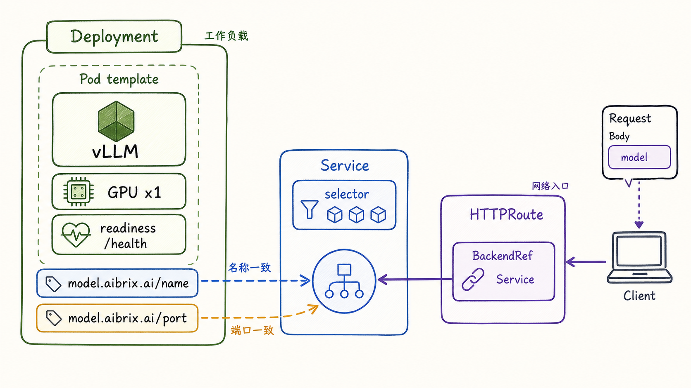
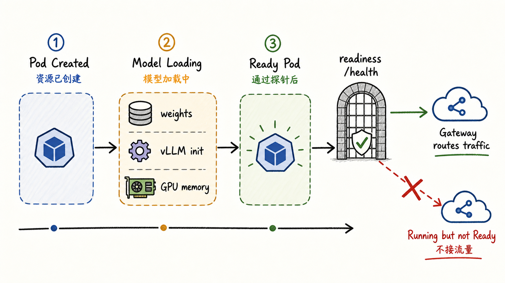
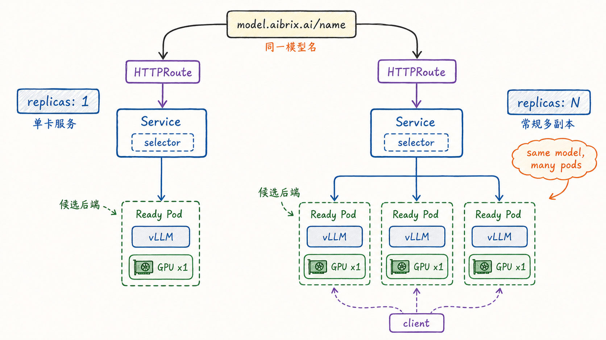

---
tags:
  - MaaS
  - AIBrix
  - LLMServing
  - Kubernetes
  - 推理工作负载
updated: 2026-06-01
description: "本文以基础模型服务生命周期为主线，解释 AIBrix 如何把普通 Kubernetes Deployment 与 Service 组织成可路由、可观测、可扩展的推理工作负载。"
---

# 03. 模型生命周期与基础推理工作负载

## 1. 为什么从生命周期看基础工作负载

前两章已经分别回答了两个问题：AIBrix 为什么需要作为 MaaS 平台层出现，以及它为什么会把平台语义放进 CRD、标签、注解和控制器协作中。进入第三章后，视角需要从“平台有哪些对象”切换为“一个最基础的模型服务怎样真正进入运行态”。

这里的“基础推理工作负载”指的是最常见的一类部署形态：一个模型由一个或多个同构 Pod 承载，每个 Pod 内部运行一个完整的推理引擎进程，例如 vLLM OpenAI-compatible server；每个 Pod 可以独立处理一次请求的 prefill 与 decode；多个 Pod 通过同一个 `Service` 和同一个模型名对外表现为一个模型服务。

本章暂时不讨论以下复杂形态：

- prefill/decode 分离、混合 PD 与标准 Pod 的协作；
- RayCluster、StormService、RoleSet、PodSet 等复杂编排对象；
- KVCache 跨实例同步、prefix-cache 路由和缓存感知调度；
- 自动扩缩容算法、GPU optimizer 和生产治理策略。

这些能力都很重要，但如果一开始就混在一起，读者很容易把“模型服务能被 AIBrix 识别和路由”与“模型服务具备复杂分布式编排能力”混为一谈。第三章只处理最小闭环：声明一个模型服务，生成运行时 Pod 和 Service，让 Pod 完成模型加载并变成 Ready，再让网关把请求送到可接流量的后端。

截至 2026-06-01，AIBrix `main` 分支 HEAD 为 `353adc0586c777d7c7aed73b0198667048e8678d`。本文的源码判断基于这个提交，并与前两章使用的代码版本保持一致。

## 2. 基础模型声明

理解基础工作负载时，最容易犯的错误是先去找一个叫作 `ModelDeployment` 或 `InferenceService` 的 AIBrix CRD，然后认为所有模型都必须通过它声明。AIBrix 当前基础路径并不是这样。对于普通单节点模型服务，模型本体可以直接用 Kubernetes 原生 `Deployment` 和 `Service` 表达，只要补上 AIBrix 需要的模型身份标签。

官方 quickstart 的基础模型样例就是一个普通 `apps/v1 Deployment`。其中关键点不是 YAML 很长，而是有三组必须保持一致的名字：

- `Deployment.metadata.labels["model.aibrix.ai/name"]` 表达模型服务名；
- `Service.metadata.name` 需要与 `model.aibrix.ai/name` 的值一致；
- vLLM 启动参数 `--served-model-name` 也需要与这个模型名一致。

这样做的原因可以从 AIBrix `ModelRouter` 控制器源码中看到：当它监听到带有模型标签的 `Deployment` 时，会取 `model.aibrix.ai/name` 的值作为模型名，并创建名为 `<model-name>-router` 的 `HTTPRoute`；这个 `HTTPRoute` 的 `BackendRef` 会指向同名 `Service`，端口来自 `model.aibrix.ai/port`。换句话说，当前基础路径里，模型名不仅是业务语义，也是路由资源和后端 Service 的连接键。

一个精简后的基础声明可以这样理解：

```yaml
apiVersion: apps/v1
kind: Deployment
metadata:
  name: deepseek-r1-distill-llama-8b
  labels:
    model.aibrix.ai/name: deepseek-r1-distill-llama-8b
    model.aibrix.ai/port: "8000"
spec:
  replicas: 1
  selector:
    matchLabels:
      model.aibrix.ai/name: deepseek-r1-distill-llama-8b
  template:
    metadata:
      labels:
        model.aibrix.ai/name: deepseek-r1-distill-llama-8b
        model.aibrix.ai/port: "8000"
    spec:
      containers:
        - name: vllm-openai
          image: vllm/vllm-openai:v0.11.0
          command:
            - vllm
            - serve
            - --host
            - "0.0.0.0"
            - --port
            - "8000"
            - --model
            - deepseek-ai/DeepSeek-R1-Distill-Llama-8B
            - --served-model-name
            - deepseek-r1-distill-llama-8b
          resources:
            limits:
              nvidia.com/gpu: "1"
            requests:
              nvidia.com/gpu: "1"
          readinessProbe:
            httpGet:
              path: /health
              port: 8000
```

对应的 `Service` 则负责把同一个模型名下的 Pod 暴露成稳定后端：

```yaml
apiVersion: v1
kind: Service
metadata:
  name: deepseek-r1-distill-llama-8b
  labels:
    model.aibrix.ai/name: deepseek-r1-distill-llama-8b
spec:
  selector:
    model.aibrix.ai/name: deepseek-r1-distill-llama-8b
  ports:
    - name: serve
      port: 8000
      targetPort: 8000
```

这段配置里有一个值得单独强调的细节：模型标签最好同时出现在 `Deployment.metadata.labels` 和 `spec.template.metadata.labels` 中。前者让 `ModelRouter` 能从工作负载对象上发现模型并创建 `HTTPRoute`；后者让实际 Pod 继承模型身份，使 Service selector、网关后端候选、运行时指标和路由逻辑可以围绕 Pod 识别模型。

`model.aibrix.ai/port` 也不应该省略。当前 `ModelRouter` 和路由工具函数在端口缺失或解析失败时会退回默认值 `8000`，但生产文档明确把 `model.aibrix.ai/name` 与 `model.aibrix.ai/port` 列为最小必需标签。依赖默认值会让部署看似可用，却在端口变化、镜像迁移或多服务端口场景中埋下隐患。



图 1 可以按三层阅读。左侧 `Deployment` 是工作负载声明，它包含 Pod 模板、vLLM 容器、GPU 资源和 readiness probe。中间 `Service` 是网络入口，它用 selector 选择带有同一模型名标签的 Pod。右侧 `HTTPRoute` 是 AIBrix 控制器自动生成的网关资源，它的 `BackendRef` 指向模型同名 Service。

这三层共同构成基础模型服务的声明面：`Deployment` 负责“跑什么”，`Service` 负责“怎样找到这些 Pod”，`HTTPRoute` 负责“网关怎样把模型请求接到这个 Service 上”。

## 3. 从声明到路由资源

把 YAML 提交给 Kubernetes API 之后，系统并不会因为 `model.aibrix.ai/name` 这个标签而立刻开始推理。基础生命周期可以分成两条并行推进的链路：Kubernetes 原生工作负载链路，以及 AIBrix 路由发现链路。

Kubernetes 原生链路负责把声明变成容器：

1. 用户提交 `Deployment` 与 `Service`；
2. Kubernetes API Server 保存对象；
3. Deployment controller 创建或更新 ReplicaSet；
4. ReplicaSet 按副本数创建 Pod；
5. Scheduler 把 Pod 放到满足 GPU、CPU、内存和调度约束的节点；
6. kubelet 拉取镜像、挂载卷、启动 vLLM 容器；
7. vLLM 下载或读取权重，初始化模型和运行时；
8. readiness probe 通过后，Pod 进入 Kubernetes Ready 状态。

AIBrix 路由发现链路负责把模型身份变成网关路由：

1. `ModelRouter` 控制器监听 `Deployment`、`ModelAdapter`、`RayClusterFleet` 等对象；
2. 当 `Deployment` 带有 `model.aibrix.ai/name` 标签时，控制器读取模型名；
3. 控制器从 `model.aibrix.ai/port` 读取服务端口，解析失败时退回默认端口；
4. 控制器创建位于 `aibrix-system` 命名空间的 `HTTPRoute`；
5. `HTTPRoute` 的 `ParentRef` 指向 AIBrix 使用的 Envoy Gateway；
6. `HTTPRoute` 的 `BackendRef` 指向模型同名 `Service`；
7. 如果 `Service` 位于其他 namespace，控制器会创建 `ReferenceGrant` 允许跨 namespace 后端引用。

这两条链路的关系很微妙。`HTTPRoute` 创建成功，只说明网关知道“某个模型名应该转向哪个 Service”；它不保证后端 Pod 已经完成模型加载。Pod 创建成功，也只说明 Kubernetes 已经调度并启动容器；它不保证网关应该把请求送过去。基础工作负载的真实可用性必须同时满足两个条件：路由资源存在且被 Gateway 接受，后端 Pod 处于可路由的 Ready 状态。

这也是为什么基础章节要把 `Deployment`、`Service`、`HTTPRoute` 和 readiness 放在同一张图里看。它们分别属于不同层，但一次请求能不能真正落到模型实例上，取决于这几层是否同时对齐。

## 4. Ready 才是可接流量的门

LLM Serving 与普通 Web 服务相比，一个核心差异是冷启动非常重。Pod 被创建、容器进程启动、HTTP 端口打开，并不等于模型已经可服务。大模型还需要完成权重读取、GPU 显存分配、推理引擎初始化、可能的 tokenizer 初始化和健康检查。对于大型模型，这个过程可能持续数分钟。

AIBrix 生产部署文档明确要求 readiness probe 等待推理服务完全加载模型后再把 Pod 标记为 Ready。网关只会把请求路由到 Kubernetes 认为 Ready 的 Pod；如果一个 Pod 曾经 Ready 后又因为 OOM 或其他原因探针失败，网关会停止向它路由新请求。

从源码角度看，AIBrix 的 Pod 工具函数也把“可路由 Pod”收得比“Pod 存在”更窄：`FilterReadyPod` 要求 Pod 有 `PodIP`、没有处于 terminating 状态，并且 `PodReady` 条件为 true。`CountReadyPods` 还会同时检查 Pod phase 为 `Running` 且 Ready 条件成立。这说明 AIBrix 的路由候选后端不是“所有 Service endpoints”，而是经过健康状态过滤之后的运行实例。



图 2 的重点是纠正一个常见误解：`Running` 是 Kubernetes 看到容器已经运行，`Ready` 才是平台认为它可以接收流量。对于模型服务来说，最危险的状态是“Pod 已经启动，但模型还没加载完”。如果 readiness probe 过早放行，网关可能把真实用户请求打到还不能推理的实例上，导致 5xx、超时或长时间排队。

一个稳妥的 readiness 设计通常遵循三条原则。

第一，探针应该访问推理服务真实暴露的健康端点，例如 vLLM 常见的 `/health`。不要只检查容器进程是否存在，也不要用一个与模型加载无关的轻量端口代替。

第二，`initialDelaySeconds`、`periodSeconds`、`failureThreshold` 要给模型加载留出足够时间。生产文档给出的示例允许较长的模型加载窗口，避免大模型还在初始化时就被 Kubernetes 判定为失败。

第三，readiness 与 liveness 的语义要分开。readiness 决定是否接新流量，liveness 决定容器是否需要重启。模型加载慢不等于进程死掉，过于激进的 liveness 可能让模型在反复重启中永远无法变成 Ready。

当你排查“模型部署了但请求打不进去”时，可以优先沿着这条路径检查：

```text
Deployment exists
  -> ReplicaSet created
  -> Pod scheduled
  -> container running
  -> model loaded
  -> readiness /health passed
  -> Pod Ready
  -> Service endpoints include Pod
  -> HTTPRoute Accepted
  -> Gateway can route request
```

这个顺序很重要。直接从网关错误开始猜路由策略，常常会漏掉模型还没 Ready、Service selector 不匹配或 HTTPRoute 没有被 Gateway 接受这类更基础的问题。

## 5. 单卡服务与常规多副本

基础模型生命周期跑通后，下一步通常是把 `replicas` 从 `1` 调到 `N`。这一步看起来只是 Kubernetes Deployment 的副本数变化，但在 LLM Serving 语境下需要多理解两层含义。

第一，常规多副本不是分布式推理。每个 Pod 都是一个完整的推理实例，通常各自加载同一份模型权重，各自占用 GPU 资源，各自维护运行时状态。把副本数从 1 扩到 3，并不会自动把一个请求拆到 3 张 GPU 上执行，也不会自动共享 KVCache。它只是让同一个模型名背后出现多个可选后端。

第二，多副本会把“服务稳定入口”和“实例选择”分离得更明显。`Service` 继续提供稳定的模型后端入口，`HTTPRoute` 继续指向这个 Service；但每一次请求最终落到哪个 Ready Pod 上，就进入了 AIBrix Gateway/Router 的职责范围。普通轮询只能看到多个后端，AIBrix 的路由系统可以进一步使用请求数、延迟、GPU cache、KV cache、prefix cache、SLO 或 session affinity 等信号。第三章只需要先看到候选后端集合，具体路由策略会放到第七章。



图 3 左侧是单卡服务：一个模型名、一个 Service、一个 Ready Pod。这个形态最适合功能验证、低流量服务或成本敏感的实验环境。它的优点是链路清晰、状态简单；缺点是容量有限，Pod 更新或故障时容易直接影响可用性。

右侧是常规多副本：同一个模型名下面有多个 Ready Pod。它的优点是可以分摊并发请求，并在某个 Pod 不 Ready 时继续保留其他候选后端；缺点是每个副本都需要独立加载模型，占用 GPU 和显存，冷启动成本也会随副本数上升。

在基础多副本场景中，有四个一致性约束尤其值得记住。

第一，所有副本必须共享同一个模型服务名。`model.aibrix.ai/name`、`Service` 名称、请求 body 中的 `model` 字段、vLLM 的 `--served-model-name` 应保持一致，否则路由、后端选择和推理引擎内部模型名可能互相错位。

第二，`Service.selector` 必须能选中所有目标 Pod。如果 `Deployment` 的 pod template 标签与 Service selector 不一致，Kubernetes 层面就不会把 Pod 放进 Service 后端，AIBrix 网关也无从转发到这些实例。

第三，端口必须一致。`model.aibrix.ai/port`、容器监听端口、Service `targetPort` 和 `HTTPRoute BackendRef` 端口应该指向同一个推理服务端口。端口错位会造成“路由资源存在但连接失败”的问题。

第四，多副本要重新评估容量而不是只堆副本。生产文档建议先测量单副本可持续 QPS，再留出安全余量，最后按目标 QPS 估算副本数。对 LLM 来说，输入长度、输出长度、批处理状态和显存压力都会影响实际容量，不能只按“请求数除以副本数”线性估算。

## 6. 基础控制流与排查边界

把前面几节连起来，基础 AIBrix 推理工作负载可以用一条控制流描述：

```text
用户提交 Deployment/Service
  -> Kubernetes 创建 Pod
  -> 推理容器启动并加载模型
  -> readiness probe 判断 Pod 是否 Ready
  -> Service selector 聚合 Ready 后端
  -> ModelRouter 根据模型标签创建 HTTPRoute
  -> Envoy Gateway 接收 OpenAI-compatible 请求
  -> Gateway/Router 选择某个 Ready Pod
  -> vLLM 返回 token
```

这条链路里，每个对象都有自己的边界。

`Deployment` 的边界是“期望有多少个 Pod，以及 Pod 模板是什么”。它不理解请求中的 prompt，也不负责在多个 Pod 之间选择最合适实例。

`Pod` 的边界是“某个具体推理实例是否运行、是否 Ready、在哪个 IP 和端口监听”。它负责承载 vLLM 进程和 GPU 资源，但不会自己把模型暴露到集群外部。

`Service` 的边界是“用稳定名称选择一组 Pod 后端”。它通过 selector 找 Pod，通过端口暴露网络入口，但不理解模型请求成本、KVCache 命中或 token 级负载。

`HTTPRoute` 的边界是“把网关入口和模型后端 Service 连接起来”。它属于 Gateway API 资源，不是 AIBrix 自有 CRD；AIBrix 控制器只是根据模型标签创建和删除它。

`Gateway/Router` 的边界是“对一次请求选择具体后端”。它会读取模型名、路由策略、Pod 状态和必要指标，最终把请求转发到某个 Ready Pod。具体算法不是本章重点，但从基础生命周期看，它依赖前面几层先把模型实例正确暴露出来。

用这个边界看问题，可以避免两类误判。

第一类误判是把 Kubernetes 对象创建成功等同于模型可用。`kubectl get deployment` 显示 Ready 副本数不足时，问题通常还在 Pod 启动、模型加载、探针或资源调度阶段，不应该先怀疑高级路由策略。

第二类误判是把 Service 可访问等同于 AIBrix 可路由。Service selector 正确只说明集群内部有后端入口；如果 `Deployment` 没有模型标签，`ModelRouter` 可能不会创建对应 `HTTPRoute`。如果 `HTTPRoute` 未被 Gateway 接受，外部请求仍然无法通过 AIBrix 入口抵达模型。

一个实用的排查顺序如下：

1. 看 `Deployment` 是否存在，`spec.replicas` 是否符合预期；
2. 看 Pod 是否被创建并调度到具备 GPU 的节点；
3. 看容器日志是否显示模型加载完成，`/health` 是否成功；
4. 看 Pod 的 `Ready` 条件是否为 true；
5. 看 `Service.selector` 是否匹配 Pod 标签；
6. 看 `Service` 名称是否等于 `model.aibrix.ai/name`；
7. 看 `HTTPRoute` 是否创建、是否在 `aibrix-system` namespace、是否 Accepted；
8. 看请求 body 中的 `model` 是否等于部署标签和 vLLM `--served-model-name`；
9. 看网关是否能连接到后端 Pod 端口；
10. 在前面都成立后，再进入路由策略、指标和缓存信号排查。

这也是第三章的核心教学目标：先把基础工作负载的生命周期、对象边界和状态门控讲清楚，再进入后续复杂部署形态。否则第四章讲 PD 分离、RayCluster 或 StormService 时，读者会分不清哪些问题来自基础模型服务暴露，哪些问题来自复杂编排本身。

## 7. 本章小结

基础 AIBrix 模型服务不是一个神秘的新工作负载类型。它首先是 Kubernetes 原生 `Deployment` 和 `Service`：前者启动推理容器，后者选择后端 Pod。AIBrix 在这个基础上增加模型身份标签、`ModelRouter` 控制器、Gateway API `HTTPRoute` 和 LLM-aware Router，使这些普通运行时资源可以成为 MaaS 平台中的模型服务。

理解第三章时，可以把基础生命周期记成四个关口。

第一个关口是声明一致性：`model.aibrix.ai/name`、`Service` 名称、请求 `model` 字段和 `--served-model-name` 要保持一致。第二个关口是端口一致性：`model.aibrix.ai/port`、容器监听端口、Service 端口和 route 后端端口要指向同一服务。第三个关口是 Ready 门控：只有模型加载完成并通过 readiness probe 的 Pod 才应该进入路由候选。第四个关口是多副本边界：常规 `replicas: N` 表示多个完整推理实例，而不是把一次推理请求自动拆成分布式执行。

带着这四个关口继续阅读后续章节，会更容易理解第四章为什么需要 StormService、RayClusterFleet、PD 分离和多角色工作负载。它们不是替代基础生命周期，而是在基础生命周期之上处理“一个普通 Deployment 难以表达的复杂推理服务形态”。

## 8. 参考资料

1. [AIBrix Documentation：Quickstart](https://aibrix.readthedocs.io/latest/getting_started/quickstart.html)；
2. [AIBrix Documentation：Production Model Deployments](https://aibrix.readthedocs.io/latest/production/model-deployment.html)；
3. [AIBrix Documentation：Gateway Routing](https://aibrix.readthedocs.io/latest/features/gateway-plugins.html)；
4. [AIBrix Documentation：AIBrix Router](https://aibrix.readthedocs.io/latest/designs/aibrix-router.html)；
5. [GitHub：vllm-project/aibrix Quickstart model sample](https://github.com/vllm-project/aibrix/blob/353adc0586c777d7c7aed73b0198667048e8678d/samples/quickstart/model.yaml)；
6. [GitHub：vllm-project/aibrix ModelRouter Controller](https://github.com/vllm-project/aibrix/blob/353adc0586c777d7c7aed73b0198667048e8678d/pkg/controller/modelrouter/modelrouter_controller.go)；
7. [GitHub：vllm-project/aibrix model constants](https://github.com/vllm-project/aibrix/blob/353adc0586c777d7c7aed73b0198667048e8678d/pkg/constants/model.go)；
8. [GitHub：vllm-project/aibrix pod utilities](https://github.com/vllm-project/aibrix/blob/353adc0586c777d7c7aed73b0198667048e8678d/pkg/utils/pod.go)；
9. [Kubernetes Documentation：Deployments](https://kubernetes.io/docs/concepts/workloads/controllers/deployment/)；
10. [Kubernetes Documentation：Service](https://kubernetes.io/docs/concepts/services-networking/service/)；
11. [Kubernetes Documentation：Configure Liveness, Readiness and Startup Probes](https://kubernetes.io/docs/tasks/configure-pod-container/configure-liveness-readiness-startup-probes/)。

## 9. Learning Assessment

### 9.1 题目

1. 单选：在 AIBrix 的基础模型服务路径中，一个普通单节点模型通常首先用什么对象表达？
   - A. 一个必须存在的 `ModelDeployment` 自有 CRD；
   - B. Kubernetes 原生 `Deployment` 与 `Service`，再配合 AIBrix 模型标签；
   - C. 只用 `HTTPRoute`，不需要 Pod 或 Service；
   - D. 只用 vLLM 进程，完全不进入 Kubernetes API；

2. 多选：基础模型部署中，哪些值应尽量保持一致？
   - A. `model.aibrix.ai/name`；
   - B. `Service` 名称；
   - C. 请求 body 中的 `model` 字段；
   - D. vLLM 的 `--served-model-name`；

3. 单选：为什么本文建议模型标签同时出现在 `Deployment.metadata.labels` 和 `spec.template.metadata.labels`？
   - A. 前者帮助 `ModelRouter` 发现工作负载，后者让实际 Pod 继承模型身份；
   - B. 因为 Kubernetes 只允许标签写两份，否则对象无法创建；
   - C. 因为 Service selector 只能读取 `Deployment.metadata.labels`；
   - D. 因为 vLLM 会自动读取 Kubernetes 标签作为模型权重路径；

4. 单选：当前 `ModelRouter` 根据基础 `Deployment` 创建 `HTTPRoute` 时，`BackendRef` 默认指向什么？
   - A. Deployment 本身；
   - B. 与 `model.aibrix.ai/name` 同名的 `Service`；
   - C. 任意一个 Ready Pod 的 IP；
   - D. vLLM 容器中的 `/health` 端点；

5. 多选：以下哪些条件会影响一个 Pod 是否应进入路由候选？
   - A. Pod 有有效 `PodIP`；
   - B. Pod 不处于 terminating 状态；
   - C. Pod 的 `PodReady` 条件为 true；
   - D. Pod 对象刚创建完成，但模型还在加载；

6. 单选：为什么 `Running` 不等于模型服务可接流量？
   - A. 因为 `Running` 只说明容器已运行，不保证模型权重加载、引擎初始化和健康检查完成；
   - B. 因为 Kubernetes 永远不会把模型 Pod 标记为 `Running`；
   - C. 因为 AIBrix 完全忽略 Kubernetes Pod 状态；
   - D. 因为只要 Service 存在，Pod 状态就不重要；

7. 多选：把 `replicas` 从 `1` 调到 `N` 后，以下哪些理解是正确的？
   - A. 同一个模型名背后会出现多个候选后端 Pod；
   - B. 每个 Pod 通常仍是一个完整推理实例；
   - C. 一次请求会自动被拆到多个 Pod 上执行分布式推理；
   - D. 每个副本都会带来模型加载和 GPU 资源成本；

8. 单选：如果请求体里的 `model` 字段与部署中的 `model.aibrix.ai/name` 不一致，最可能出现什么问题？
   - A. 请求无法稳定匹配到预期模型路由或后端；
   - B. Kubernetes 会自动把 Deployment 改名；
   - C. vLLM 会自动创建一个同名 Service；
   - D. AIBrix 会把所有模型标签忽略掉；

9. 多选：排查“模型部署了但请求打不进去”时，哪些检查应该早于高级路由策略分析？
   - A. Pod 是否 Ready；
   - B. Service selector 是否能选中 Pod；
   - C. HTTPRoute 是否创建并 Accepted；
   - D. prefix-cache 命中率是否最高；

10. 单选：第三章与第四章的边界是什么？
    - A. 第三章讲基础 Deployment/Service 生命周期，第四章再讲 PD、Ray、StormService 等复杂形态；
    - B. 第三章只讲 vLLM 内部 attention kernel，第四章只讲 Kubernetes 网络；
    - C. 第三章已经完整覆盖所有复杂推理编排，第四章只做复习；
    - D. 第三章不涉及 Kubernetes，第四章才第一次引入 Pod；

### 9.2 答案与解析

1. 答案：B。基础模型服务可以直接由 Kubernetes 原生 `Deployment` 和 `Service` 承载，AIBrix 通过模型标签、控制器和网关资源把它纳入模型服务体系。

2. 答案：A、B、C、D。这四个值共同构成模型服务身份链路。它们不一致时，可能导致 HTTPRoute 后端、Service 名称、请求模型名和推理引擎内部服务名互相错位。

3. 答案：A。`Deployment.metadata.labels` 让 `ModelRouter` 可以从工作负载对象上发现模型；pod template 标签会被实际 Pod 继承，用于 Service selector、端口识别、指标和路由候选过滤。

4. 答案：B。当前 `ModelRouter` 会用 `model.aibrix.ai/name` 作为模型名，并让 `HTTPRoute BackendRef` 指向同名 `Service`。

5. 答案：A、B、C。AIBrix 的可路由 Pod 判断要求 Pod 有 IP、不在 terminating 状态且 Ready。选项 D 表示模型尚未完成加载，不能作为可接流量状态。

6. 答案：A。`Running` 是容器运行状态，`Ready` 才是健康探针通过后的接流量状态。LLM Pod 可能已经启动进程，但仍在读取权重、初始化 vLLM 或分配 GPU 显存。

7. 答案：A、B、D。常规多副本增加的是多个完整候选后端，不会自动把一次请求拆到多个 Pod 上执行。分布式推理、PD 分离和多角色编排属于后续复杂部署形态。

8. 答案：A。AIBrix 网关、HTTPRoute、Service 和推理引擎都依赖模型名语义。如果请求模型名与部署模型名不一致，请求可能无法进入预期后端。

9. 答案：A、B、C。基础链路没跑通时，优先检查 Pod Ready、Service selector、HTTPRoute Accepted 等对象状态。prefix-cache 属于更后面的缓存感知路由问题。

10. 答案：A。第三章建立普通 `Deployment`/`Service` 模型服务的生命周期心智模型；第四章会在这个基础上讨论复杂推理服务为什么需要更强的编排抽象。
