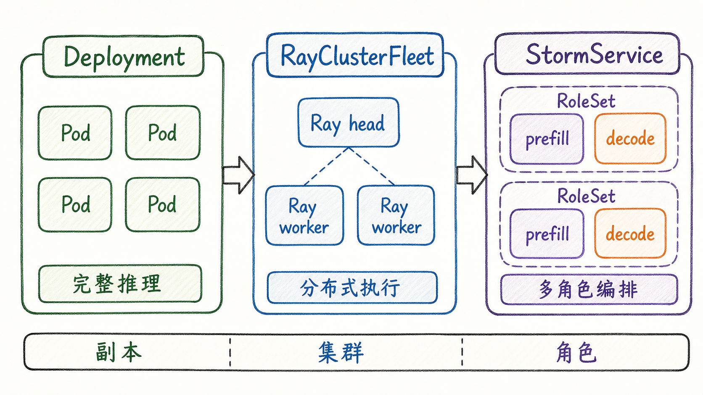
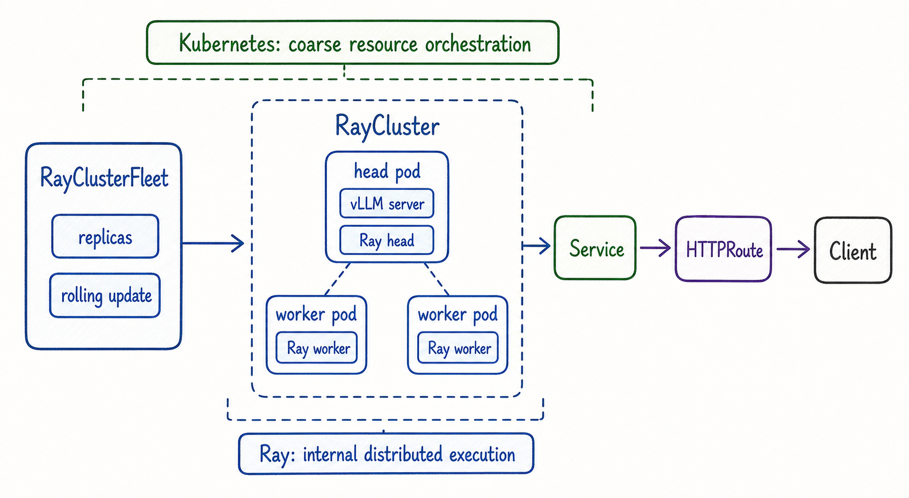
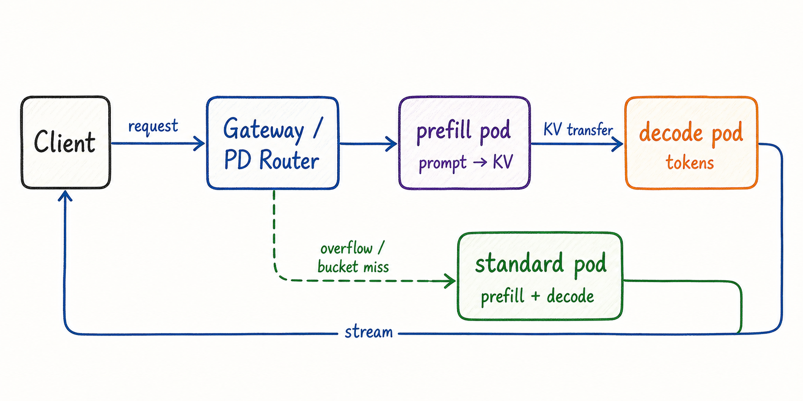
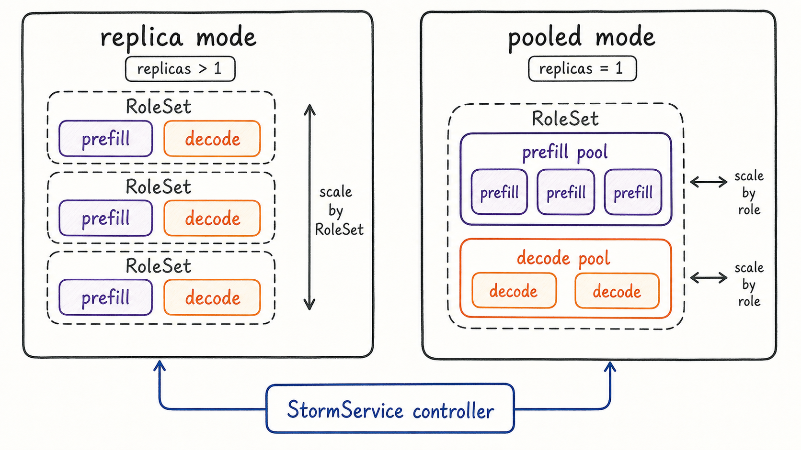

---
tags:
  - MaaS
  - AIBrix
  - LLMServing
  - Kubernetes
  - 分布式推理
  - 推理工作负载
updated: 2026-06-01
description: "本文解释 AIBrix 如何表达复杂推理部署形态，重点梳理 RayClusterFleet、StormService、RoleSet、PodSet 与 Prefill/Decode 分离之间的关系。"
---

# 04. 复杂推理部署形态

## 1. 为什么复杂部署不能只看 replicas

第三章已经建立了基础模型服务的最小闭环：一个模型可以由普通 `Deployment` 和 `Service` 承载，Pod 内部运行完整的推理引擎，AIBrix 通过模型标签、`HTTPRoute` 和 Router 把请求送到 Ready 的后端实例。这个心智模型很重要，因为它告诉我们：在最简单的路径里，一个 Pod 通常就是一个完整推理实例，一个 `replicas: N` 通常表示 N 个完整后端候选。

第四章要进入的世界恰好从这里分叉。复杂推理部署形态并不是简单把 `replicas` 调大，而是回答一组更难的问题：

- 当一个模型太大，单个 Pod 或单台机器放不下时，谁负责把一次推理拆到多个节点上执行；
- 当 prefill 与 decode 的资源画像不同，谁负责把两个阶段拆成不同角色并保持它们可配对；
- 当同一个模型背后既有 P/D 分离实例，又有普通标准实例，谁负责判断一次请求该走哪条执行路径；
- 当一次服务升级不能让 prefill 与 decode 同时缺席时，谁负责控制更新顺序、状态汇总和回滚线索；
- 当一个角色内部又需要多个 Pod 共同组成一个最小执行单元时，谁负责把这组 Pod 当作原子组来管理；

这就是 AIBrix 在基础工作负载之外引入 `RayClusterFleet`、`StormService`、`RoleSet`、`PodSet` 等编排对象的原因。它们不是为了让 YAML 变复杂，而是为了让平台能表达“一个模型服务的真实执行单元可能不再等于一个 Pod”。

截至 2026-06-01，本文核对的 AIBrix `main` 分支 HEAD 为 `a1663b40b86b027829ef4bf0c56f88c9ad43c8b6`。本文重点解释复杂部署形态本身，不展开后续三类主题：

- 自动扩缩容算法与容量治理，这会放到第五章；
- KVCache 系统的缓存拓扑、缓存事件同步和缓存感知路由，这会放到第六章；
- Gateway、Router、Envoy 与多种路由策略的完整请求路径，这会放到第七章；

图 1 可以作为本章的地图。左侧普通 `Deployment` 的核心抽象是“完整推理副本”：每个 Pod 独立完成 prefill 和 decode。中间 `RayClusterFleet` 的核心抽象是“集群副本”：一个服务实例内部可以包含 Ray head 与多个 worker。右侧 `StormService` 的核心抽象是“多角色服务”：同一个模型服务可以包含 prefill、decode、standard 等不同角色，并由控制器管理它们的生命周期。

这三个抽象之间不是互相替代的关系，而是复杂度逐步上升时的表达方式：

| 形态 | 最小可路由/可运行心智模型 | 主要解决的问题 | 典型边界 |
| --- | --- | --- | --- |
| 普通 `Deployment` | 一个 Pod 是一个完整推理实例 | 单卡或常规多副本模型服务 | 不表达一次推理跨多节点执行，也不表达多角色配对 |
| `RayClusterFleet` | 一个 RayCluster 是一个分布式服务实例 | 大模型跨多节点、多设备执行 | Ray 管内部执行，Kubernetes 管外层资源与滚动更新 |
| `StormService` / `RoleSet` | 一个服务由多个角色和角色副本组成 | P/D 分离、多角色、多实例、角色级更新 | 需要清楚区分 RoleSet 副本、role 副本和 Pod 副本 |

理解本章的关键，不是记住更多 CRD 名字，而是把“副本单位”“路由单位”“更新单位”“扩缩容单位”分开看。普通 `Deployment` 往往把这些单位都压缩成 Pod；复杂推理部署会把它们拆开。

## 2. 复杂度来自哪里

复杂推理部署的第一层复杂度来自模型本身。大模型推理既有计算密集阶段，也有显存、带宽、通信和缓存压力。单个 GPU 能跑起来的模型服务可以把这些问题藏在一个进程里；一旦模型规模、上下文长度、并发量或服务等级上升，平台就必须把执行结构显式表达出来。

可以从五个维度观察 AIBrix 的复杂部署抽象。

第一，执行单元可能大于 Pod。分布式推理中，一个 vLLM 服务可能通过 Ray 把 tensor parallel 或其他分布式执行拆到 head 与 worker 节点上。此时一个 Pod 不再等于完整服务实例，RayCluster 才是更接近“一个可运行实例”的单位。

第二，服务角色可能不再完整。P/D 分离中，prefill pod 主要处理输入 prompt 并产生 KV cache，decode pod 主要生成输出 token。单个 role pod 不一定能独立完成完整请求，它需要与另一类角色配合。

第三，副本单位可能不等于扩容单位。`StormService` 的 replica mode 把一个 `RoleSet` 当作一个服务副本；pooled mode 则把同一个 `RoleSet` 里的不同 role 视为共享资源池。前者适合按整组 P/D 配比扩展，后者适合表达 prefill 与 decode 的不同容量需求。

第四，路由候选需要经过角色过滤。基础模型服务只需要过滤 Ready Pod；P/D 路由还要按 `roleset-name` 与 `role-name` 把 pod 分组，跳过不完整的 roleset，并在多节点场景里只选择真正运行 HTTP server 的节点。

第五，更新策略会影响可用性。对于普通 Pod，滚动更新只需要避免同时下线太多完整实例；对于 P/D 分离，prefill 与 decode 若同时缺失，网关会认为某个 roleset 不完整并跳过它。因此更新策略本身也成了部署形态的一部分。

这些维度合在一起，说明 AIBrix 的复杂部署不是“在 Kubernetes 上套一层模型语义”那么简单。它实际在做两件事：

- 用 CRD 把 LLM Serving 的执行结构表达出来；
- 用控制器与 Router 把这些结构变成可运行、可路由、可更新的 Kubernetes 资源；

后面的章节会分别拆解三类关键形态：`RayClusterFleet` 表达多节点分布式推理，`StormService` / `RoleSet` 表达多角色工作负载，P/D disaggregation 表达阶段拆分与角色配对。

## 3. 分布式推理与 RayClusterFleet

AIBrix 官方文档把 multi-node inference 定义为把 LLM 模型切分到多个节点或设备上处理的推理方式，适用于单机内存或显存无法容纳的大模型。它依赖 KubeRay 编排 Ray Cluster，而 AIBrix 在这个基础上引入 `RayClusterFleet` 和 `RayClusterReplicaSet`，让 RayCluster 可以像 Kubernetes `Deployment` / `ReplicaSet` 那样被外层平台管理。

这里要抓住一个分层关系：Ray 负责应用内部的细粒度分布式执行，Kubernetes 和 AIBrix 负责外层资源编排、服务暴露、滚动更新和状态汇总。换句话说，AIBrix 不试图替代 Ray 做内部 task scheduling；它把“一个 RayCluster 作为一个模型服务实例”这件事纳入 Kubernetes 控制面。

图 2 展示的是 `RayClusterFleet` 的典型理解方式。左侧 `RayClusterFleet` 负责声明期望副本数、selector、RayCluster 模板和滚动更新策略；中间的 `RayCluster` 内部包含 head pod 与 worker pod；右侧仍然需要通过 `Service` 和 `HTTPRoute` 把模型服务暴露给网关或客户端。

从 API 设计上看，`RayClusterFleetSpec` 与 `DeploymentSpec` 很相似：它包含 `replicas`、`selector`、`template`、`strategy`、`minReadySeconds`、`revisionHistoryLimit`、`paused`、`progressDeadlineSeconds` 等字段。不同点在于，它的模板不是 Pod 模板，而是 `RayClusterTemplateSpec`；这个模板内部嵌入的是 KubeRay 的 `RayClusterSpec`。

官方 `samples/distributed/fleet-two-node.yaml` 能很好说明这个结构。样例中：

- `RayClusterFleet.spec.replicas: 1` 表示期望一个 RayCluster 服务实例；
- `template.spec.headGroupSpec` 定义 Ray head pod，head 容器里启动 Ray head，并在 Ray dashboard 可用后运行 `vllm serve`；
- `workerGroupSpecs` 定义 worker pod，worker 通过 KubeRay 生成的启动命令加入 Ray 集群；
- vLLM 使用 `--tensor-parallel-size 2` 与 `--distributed-executor-backend ray`，把推理执行交给 Ray 后端；
- 旁边仍然定义了同名 `Service` 和 `HTTPRoute`，让外部请求能进入 head pod 上的 vLLM server；

这说明 `RayClusterFleet` 不是“让多个普通模型 Pod 被 Service 负载均衡”。它更接近“把一个分布式 RayCluster 当成一个服务实例来发布”。普通多副本与 RayClusterFleet 的区别可以这样记：

| 问题 | 普通 `Deployment` 多副本 | `RayClusterFleet` |
| --- | --- | --- |
| 一个副本是什么 | 一个完整推理 Pod | 一个 RayCluster |
| 请求是否跨 Pod 执行 | 通常不会，同一请求落到某个完整 Pod | 可以在 RayCluster 内跨 head/worker 执行 |
| 谁管理内部执行 | 推理引擎进程本身 | Ray 与 vLLM distributed executor |
| 谁管理外部生命周期 | Kubernetes Deployment controller | AIBrix RayClusterFleet / RayClusterReplicaSet 控制器与 KubeRay |
| 常见服务入口 | Service 选择完整模型 Pod | Service 通常选择运行 HTTP server 的 head pod |

这也解释了为什么第三章强调“把 `replicas` 调到 N 不等于分布式推理”。普通 `Deployment` 的 N 个 Pod 是 N 个完整候选后端；`RayClusterFleet` 的一个副本内部可以包含多个协作节点。二者都可能消耗多张 GPU，但它们的执行语义完全不同。

在排查 RayClusterFleet 形态时，也要按分层关系拆问题：

1. 先确认 `RayClusterFleet` 与下层 RayCluster 对象是否创建成功；
2. 再看 head pod 与 worker pod 是否都调度成功并加入同一个 Ray 集群；
3. 再看 vLLM 是否以 Ray backend 启动，`tensor-parallel-size` 是否与实际资源匹配；
4. 再看 `Service` 是否选中正确的服务入口 pod；
5. 最后才看 `HTTPRoute`、Gateway 和 Router 是否能把请求转到后端；

如果这几层混在一起排查，很容易把 Ray worker 未加入集群误判成 AIBrix 路由问题，或者把 Service selector 错误误判成分布式执行问题。

## 4. StormService 与 RoleSet

`RayClusterFleet` 主要解决“一个服务实例内部需要分布式执行”的问题；`StormService` 解决的是另一类问题：一个模型服务可能由多个角色组成，并且这些角色需要被统一声明、更新、扩缩和汇总状态。

官方设计文档把 `StormService` 描述为用于管理 P/D 分离架构中推理容器生命周期的专用组件，同时也可用于 Tensor Parallelism、Pipeline Parallelism 甚至单 GPU 模型部署。它采用三层结构：

- `StormService` 是顶层 CRD，包装整个服务单元，包含副本数、RoleSet 模板、更新策略和服务级状态；
- `RoleSet` 表示一组角色，每个 role 可以承担不同功能，例如 `prefill` 或 `decode`；
- Pod 是实际执行推理任务的容器实例，由 RoleSet controller 根据 role 模板创建；

这三层的核心价值是让“多角色服务”成为一个可声明对象，而不是让用户手动维护一堆互相关联但缺少统一状态的 Deployment。

从源码看，`StormServiceSpec` 中最关键的字段包括：

- `replicas`：期望的 RoleSet 数量；
- `selector`：选择属于该 StormService 的 RoleSet；
- `stateful`：表示服务是否按有状态方式管理；
- `template`：RoleSet 模板，内部包含 `RoleSetSpec`；
- `updateStrategy`：StormService 级别更新策略，当前支持 `RollingUpdate` 与 `InPlaceUpdate`；
- `revisionHistoryLimit`、`paused`、`disruptionTolerance`：用于版本保留、暂停和驱逐容忍；

`RoleSetSpec` 则把注意力放到角色层：

- `roles`：一组 `RoleSpec`，每个 role 有 `name`、`replicas`、`template` 等字段；
- `updateStrategy`：RoleSet 内多个 role 的更新顺序，支持 `Parallel`、`Sequential`、`Interleave`；
- `schedulingStrategy`：可接入 Godel、Coscheduling、Volcano 等调度策略；
- role 内的 `podGroupSize`：当一个 role 的最小实例需要多个 Pod 共同组成时，RoleSet controller 会使用内部 `PodSet` API；

`PodSet` 是理解复杂角色的一个关键细节。它表示一组必须协同工作的 Pod，`PodSetSpec.podGroupSize` 至少为 2，状态中记录 `readyPods`、`totalPods` 和 `phase`。源码注释明确说明它是 RoleSet controller 在 `podGroupSize > 1` 时使用的内部 API。这样一来，AIBrix 不只是能表达“prefill role 有 3 个 Pod”，也能表达“prefill role 的一个最小实例由多个 Pod 组成”。

控制器还会把角色身份注入到下层 Pod。`pkg/controller/constants/stormservice.go` 中定义了多组关键标签和环境变量，例如：

- `roleset-name`：Pod 所属 RoleSet；
- `role-name`：Pod 所属角色；
- `storm-service-name`：Pod 所属 StormService；
- `stormservice.orchestration.aibrix.ai/role-replica-index`：角色副本索引；
- `stormservice.orchestration.aibrix.ai/pod-group-index`：PodSet 内部的 pod group 索引；
- `ROLESET_NAME`、`ROLE_NAME`、`ROLE_REPLICA_INDEX` 等环境变量；

这些标签和环境变量不仅用于控制器回收和状态汇总，也会被 Router、metrics、autoscaler 等横向能力读取。也就是说，`StormService` 的多角色表达会向数据面和治理面传播，成为后续路由、指标和弹性的共同语言。

这里有一个容易混淆的点：`StormService` 并不直接替代推理引擎。它不会自己执行 prefill、decode、tensor parallel 或 pipeline parallel；它只是把这些执行角色变成 Kubernetes 可管理对象。真正的 token 生成仍然发生在 vLLM、SGLang、TensorRT-LLM 等引擎进程里。

## 5. Prefill/Decode 分离

P/D disaggregation 是本章最典型的多角色部署形态。AIBrix 文档把 LLM 推理拆成两个阶段：

- prefill 阶段一次性处理输入 prompt，计算量更集中；
- decode 阶段逐 token 生成输出，通常更受内存带宽和长时间占用影响；

在普通模型 Pod 中，这两个阶段由同一个 GPU 和同一个进程连续完成。这样部署简单，但在长 prompt、高并发或混合负载下，prefill 与 decode 会争夺同一份计算和带宽资源。P/D 分离则把两个阶段放到专用 pod 上，使它们可以独立调参、独立扩展并由网关选择。

图 3 展示的是 P/D 路由的基本路径。客户端请求先到 Gateway / PD Router；Router 选择一个 prefill pod 处理 prompt 并产生 KV；KV 通过后端连接传给 decode pod；decode pod 负责生成 token 并把流式结果返回给客户端。如果配置了 standard pod，且 P/D 资源忙、prompt 长度不在 bucket 范围内，或者策略判断标准路径更合适，请求可以走普通的 `prefill + decode` 合并路径。

官方 PD 文档强调，Gateway 识别角色主要依赖两个标签：

- `role-name`：标识 `prefill` 或 `decode`，standard pod 不使用这个标签表达 P/D 角色；
- `roleset-name`：把一组 prefill 与 decode pod 归到同一个配对组；

这两个标签与 `StormService` 控制器注入的标签名称是一致的。若某个 roleset 只有 prefill pod 或只有 decode pod，文档和源码都表明它不会成为完整 P/D 候选。`pd_disaggregation.go` 中的 `collectAndBucketPods` 会先按 `roleset-name` 分组，再拆成 prefill 与 decode 集合，最终只把同时拥有两类角色的 roleset 放入候选。

在多节点场景中，候选过滤还有一个额外条件。源码中 `isPodWithHTTPServer` 会检查 `stormservice.orchestration.aibrix.ai/pod-group-index`：如果存在这个标签，只有值为 `"0"` 的 Pod 会被选为路由候选，因为多节点 tensor parallel 里通常只有 node rank 0 运行 HTTP server；没有该标签的旧式或单节点 Pod 会继续被兼容性地纳入候选。

一次 P/D 请求的控制流可以拆成六步：

1. Router 从请求中识别模型名、路由策略和请求配置；
2. Router 从 Ready Pod 列表中过滤同模型、同引擎、可接流量的候选；
3. PD 逻辑按 `roleset-name` 聚合 pod，并按 `role-name` 分成 prefill 与 decode；
4. 若启用 prompt-length bucketing，Router 还会按 `promptLenBucketMinLength` 与 `promptLenBucketMaxLength` 过滤适合该 prompt 长度的候选；
5. Router 分别为 prefill 与 decode 计算分数，并在同一 roleset 内寻找可配对组合；
6. 选定后，prefill pod 执行 prompt 阶段并转移 KV，decode pod 继续生成 token；

这里最容易误解的是“prefill 和 decode 是不是可以任意交叉选择”。源码中的 `finalPDScore` 会遍历 roleset，并只在该 roleset 同时拥有 prefill score 与 decode pick 时计算最终分数。这说明 P/D 选择不是把全局最优 prefill pod 和全局最优 decode pod 随便拼起来，而是在 roleset 配对约束下进行选择。

P/D 分离还有一个很实用的渐进迁移机制：standard inference pod。AIBrix 文档把它定位为可选能力，用于处理短交互请求、溢出流量或不匹配 bucket 的请求。配置上，standard pod 通过 `routingConfig` 中的 `combined: true` 表示它运行完整 `prefill + decode` 路径；`AIBRIX_PROMPT_LENGTH_BUCKETING=true` 时，Router 会把 prompt 长度范围也纳入判断。

这样做的好处是，平台不必在“全量 P/D 分离”和“完全普通部署”之间二选一。同一个模型可以逐步迁移：

- 对长 prompt 或 prefill-heavy 请求，优先使用 P/D 分离角色；
- 对短请求或互动式请求，继续使用 standard pod；
- 当 P/D 角色高负载或 bucket 不匹配时，standard pod 可以吸收溢出；
- 当团队还在调优 P/D 配比时，standard pod 可以降低迁移风险；

但是，standard pod 不是 P/D 的“兜底魔法”。它仍然需要和模型名、端口、引擎标签、请求模型名保持一致，也会消耗完整推理实例的 GPU 资源。把它作为溢出路径时，需要在容量规划中单独考虑。

## 6. Replica Mode 与 Pooled Mode

`StormService` 有两个部署模式：replica mode 与 pooled mode。官方文档特别提醒，这两个模式不是通过一个显式 `mode` 字段指定，而是由 `stormservice.spec.replicas` 决定：`replicas > 1` 时是 replica mode，`replicas = 1` 时是 pooled mode。

图 4 左侧是 replica mode。每个 `RoleSet` 都是一个独立服务副本，里面包含一组角色，例如一个 prefill 和一个 decode。扩缩容时，平台主要增加或减少整组 RoleSet。这种方式适合 P/D 配比已经比较明确的场景：例如每组都包含一份 prefill 与一份 decode，多个 RoleSet 形成多个可替换的服务单元。

replica mode 的优点是边界清晰。一个 RoleSet 内部角色完整，升级和回滚也可以围绕整组副本展开。缺点是粒度较粗：如果 decode 压力远高于 prefill，但每个 RoleSet 固定包含相同配比，就可能出现某些角色紧张、某些角色闲置的情况。

图 4 右侧是 pooled mode。`StormService` 只有一个 RoleSet，不同 role 在同一个 RoleSet 内形成共享池。prefill 可以有自己的 `replicas`，decode 也可以有自己的 `replicas`。这种方式更贴近“不同阶段独立容量规划”的目标。

pooled mode 的优点是角色粒度更细，适合表达 prefill 与 decode 负载不对称的场景。它也更自然地对应“prefill 是一个池、decode 是另一个池”的平台心智模型。不过截至本文核对的官方文档，pooled mode 的独立角色自动扩缩容仍有明确限制：文档提示 pooled mode autoscaling 尚未支持，可以手动调整 RoleSet spec 中各 role 的 replicas。

两种模式的差异可以总结为：

| 维度 | Replica Mode | Pooled Mode |
| --- | --- | --- |
| 触发条件 | `spec.replicas > 1` | `spec.replicas = 1` |
| 主要扩展单位 | RoleSet | Role |
| 心智模型 | 多个完整服务组 | 一个服务内的角色池 |
| 适合场景 | P/D 配比已知，按组复制 | prefill 与 decode 需要不同副本数 |
| 典型更新策略 | 更适合 `RollingUpdate` | 更适合 `InPlaceUpdate` |
| 风险点 | 角色配比可能粗糙 | 独立角色自动扩缩容仍需关注支持状态 |

更新策略也要跟部署模式一起理解。`StormServiceUpdateStrategy` 支持 `RollingUpdate` 与 `InPlaceUpdate`：

- `RollingUpdate` 更适合 replica mode，通过创建新 RoleSet、等待其 Ready、再删除旧 RoleSet 的方式替换整组服务副本；
- `InPlaceUpdate` 更适合 pooled mode，直接把新配置传播到现有 RoleSet，减少额外 GPU 资源需求；

RoleSet 内部又有三种更新顺序：

- `Sequential`：按角色顺序逐个更新，适合希望保守控制服务可用性的场景；
- `Parallel`：多个角色同时更新，速度更快，但需要确认容量冗余足够；
- `Interleave`：按步骤在多个角色之间交错推进，适合希望多个角色以相近进度滚动的场景；

这些策略不是装饰性字段。对于 P/D 分离来说，如果 prefill 与 decode 同时大面积不可用，Router 会因为 roleset 不完整而跳过它。官方生产部署文档也提醒：P/D 部署中应分开更新 prefill 与 decode pod，否则可能暂时造成不完整 roleset，从而被 Gateway 跳过。

因此，在复杂部署里，“更新策略”不只是运维细节，而是服务可用性的一部分。读源码或排查问题时，不要只看 `spec.roles` 里有几个角色，也要看这些角色如何被 controller 创建、更新、标记 Ready 和汇总状态。

## 7. 源码视角：为什么维护三层 CR

从当前实现看，`StormService -> RoleSet -> PodSet -> Pod` 不是单纯为了抽象漂亮，而是在把不同层级的控制问题拆开。更准确地说，前三个是 AIBrix 自己维护的 CR，`Pod` 是 Kubernetes 原生运行时对象；当某个 role 不需要多 Pod 原子组时，链路会退化为 `StormService -> RoleSet -> Pod`。

`StormService` 这一层负责服务级语义。`StormServiceSpec.template` 内嵌 `RoleSetTemplateSpec`，`StormServiceStatus` 统计的是 RoleSet 级副本，同时通过 `RoleStatuses` 把下层 role 的 pod 级状态聚合回来。`StormServiceReconciler` 注册为 watch `StormService` 并 own `RoleSet`，在 reconcile 中先同步 headless service，再按 `spec.replicas` 创建或删除 RoleSet，最后根据 `currentRevision`、`updateRevision`、RoleSet Ready 状态和 role 聚合状态回写 `status`。也就是说，它关心的是“这个服务有多少组、当前版本是什么、整组滚动是否满足 `maxSurge` / `maxUnavailable`”。

`RoleSet` 这一层负责角色级语义。`RoleSetSpec.roles` 里每个 `RoleSpec` 都有自己的 `replicas`、`upgradeOrder`、`podGroupSize`、`updateStrategy`、`stateful`、`template` 和可选 `schedulingStrategy`。`RoleSetReconciler` 注册为 watch `RoleSet` 并 own `PodSet` 和 `Pod`，先同步 PodGroup，再根据 `RoleSet.updateStrategy` 选择 `Sequential`、`Parallel` 或 `Interleave` 的 rolling manager。真正创建 Pod 或 PodSet 时，会注入 `storm-service-name`、`roleset-name`、`role-name`、template hash、role revision、role replica index 等标签和环境变量。也就是说，它关心的是“每个角色应该有多少实例、角色之间按什么顺序升级、角色实例是否 ready”。

`PodSet` 这一层只在 `role.podGroupSize > 1` 时出现。`RoleSet` controller 会选择 `PodSetRoleSyncer`，把一个 role replica 表达成一个 `PodSet`；`PodSetReconciler` 再 own 真实 Pod，保证 `PodGroupSize` 个 Pod 被创建、按 `ReplaceUnhealthy` 或 `Recreate` 策略恢复，并把 `readyPods`、`totalPods` 和 `phase` 回写到 PodSet status。这里的关键不是“多包一层”，而是把“一个最小 role 实例由多个 Pod 协同组成”变成可独立观察、可独立恢复、可接入 gang scheduling 的对象。

如果把这些内容压成一层 `StormService`，表面上 YAML 少一层，控制器却会变成一个同时处理服务版本、角色拓扑、角色滚动、多 Pod 原子组、PodGroup、Pod 恢复、状态聚合和垃圾回收的巨大 reconciler。这样会带来几个直接问题：

- 更新边界混乱：服务级 rolling update、role 级 sequential / parallel / interleave，以及 PodSet 内部恢复策略会互相缠在一起；
- 状态不可诊断：用户只能看到顶层对象不 Ready，却难以判断是 RoleSet 没 ready、某个 role 没 ready，还是 PodSet 内某个 Pod 缺失；
- 扩缩容单位不清：`PodAutoscaler` 既要支持 StormService 整组副本扩缩，也要通过 `subTargetSelector.roleName` 修改某个 role 的 replicas；如果没有 RoleSet/role 状态聚合，autoscaler 很难清楚地区分这些单位；
- 路由语义不稳定：P/D Router 依赖 `roleset-name` 和 `role-name` 把 prefill / decode 组成完整候选组，多节点场景还依赖 `pod-group-index=0` 识别真正提供 HTTP server 的 Pod；这些标签来自分层控制器的稳定注入；
- 失败隔离变差：PodSet 的 unhealthy replacement、full recreate、PodGroup 清理和 status phase 如果塞进 StormService，会让一个 Pod 级故障冒泡成服务级控制器复杂分支；
- 所有权关系变弱：当前 owner reference 是 `StormService owns RoleSet`、`RoleSet owns PodSet/Pod`、`PodSet owns Pod`，删除、回收和事件归属都更清楚；

这个设计也和 AIBrix 的另一条链路一致：`RayClusterFleet -> RayClusterReplicaSet -> RayCluster`。`RayClusterFleet` 类似 Deployment，表达 fleet 级副本、selector、RayCluster 模板和滚动策略；`RayClusterReplicaSet` 类似 ReplicaSet，负责把若干 KubeRay `RayCluster` 维持在期望数量。两条链路共同说明 AIBrix 的设计取向：上层 CR 表达用户意图和版本策略，中间 CR 表达可复制、可替换、可汇总的运行单元，下层对象负责真实执行资源。

因此，三层 CR 的目的不是“把简单事情复杂化”，而是为了把 LLM Serving 中不同的工程单位分开：服务副本、角色副本、多 Pod 原子组、真实 Pod、RayCluster、网关路由和扩缩容目标并不是同一个东西。一层 CR 可以承载最小 demo，但很难长期承载 P/D 分离、role 级扩缩容、多节点 role 实例、分阶段升级和可诊断状态。

## 8. 本章小结

复杂推理部署形态的核心，不是 AIBrix 多了几个 CRD，而是模型服务的基本单位发生了变化。

普通 `Deployment` 的心智模型是：一个 Pod 就是一个完整推理实例。`RayClusterFleet` 把这个单位扩展成 RayCluster：Kubernetes 与 AIBrix 管外层资源，Ray 管内部多节点执行。`StormService` 把这个单位扩展成多角色服务：顶层服务声明 RoleSet，RoleSet 管理 prefill、decode 等角色，必要时再用 PodSet 表达一个角色实例内部的多 Pod 原子组。P/D 分离则把推理阶段本身拆成可路由角色，让 Gateway 在 roleset 配对、prompt 长度、负载和 fallback 之间做选择。

带着这个心智模型继续读后续章节会更清楚：

- 第五章讲弹性机制时，要区分扩的是 Pod、role、RoleSet 还是 RayCluster；
- 第六章讲 KVCache 系统时，要区分 KV 是在单实例内部复用，还是在 prefill 与 decode 之间转移；
- 第七章讲路由系统时，要区分普通 Ready Pod 过滤、P/D roleset 配对、standard pod fallback 与缓存感知策略；

如果只记一句话，可以记住：AIBrix 的复杂部署抽象，是把“一个模型服务如何实际运行”从单个 Pod 扩展为集群、角色、角色组和阶段化执行路径。

## 9. 参考资料

1. [AIBrix Documentation：Multi-Node Inference](https://aibrix.readthedocs.io/latest/features/multi-node-inference.html)；
2. [AIBrix Documentation：Prefill-Decode Disaggregation](https://aibrix.readthedocs.io/latest/features/pd-disaggregation.html)；
3. [AIBrix Documentation：AIBrix StormService](https://aibrix.readthedocs.io/latest/designs/aibrix-stormservice.html)；
4. [AIBrix Documentation：Production Model Deployments](https://aibrix.readthedocs.io/latest/production/model-deployment.html)；
5. [AIBrix Documentation：AI Engine Runtime](https://aibrix.readthedocs.io/latest/features/runtime.html)；
6. [AIBrix Documentation：Multi-Engine Support](https://aibrix.readthedocs.io/latest/features/multi-engine.html)；
7. [GitHub：vllm-project/aibrix RayClusterFleet API](https://github.com/vllm-project/aibrix/blob/a1663b40b86b027829ef4bf0c56f88c9ad43c8b6/api/orchestration/v1alpha1/rayclusterfleet_types.go)；
8. [GitHub：vllm-project/aibrix RayCluster template API](https://github.com/vllm-project/aibrix/blob/a1663b40b86b027829ef4bf0c56f88c9ad43c8b6/api/orchestration/v1alpha1/raycluster_type.go)；
9. [GitHub：vllm-project/aibrix StormService API](https://github.com/vllm-project/aibrix/blob/a1663b40b86b027829ef4bf0c56f88c9ad43c8b6/api/orchestration/v1alpha1/stormservice_types.go)；
10. [GitHub：vllm-project/aibrix RoleSet API](https://github.com/vllm-project/aibrix/blob/a1663b40b86b027829ef4bf0c56f88c9ad43c8b6/api/orchestration/v1alpha1/roleset_types.go)；
11. [GitHub：vllm-project/aibrix PodSet API](https://github.com/vllm-project/aibrix/blob/a1663b40b86b027829ef4bf0c56f88c9ad43c8b6/api/orchestration/v1alpha1/podset_types.go)；
12. [GitHub：vllm-project/aibrix StormService controller](https://github.com/vllm-project/aibrix/blob/a1663b40b86b027829ef4bf0c56f88c9ad43c8b6/pkg/controller/stormservice/sync.go)；
13. [GitHub：vllm-project/aibrix StormService RoleSet operations](https://github.com/vllm-project/aibrix/blob/a1663b40b86b027829ef4bf0c56f88c9ad43c8b6/pkg/controller/stormservice/rolesetoperations.go)；
14. [GitHub：vllm-project/aibrix RoleSet controller](https://github.com/vllm-project/aibrix/blob/a1663b40b86b027829ef4bf0c56f88c9ad43c8b6/pkg/controller/roleset/roleset_controller.go)；
15. [GitHub：vllm-project/aibrix RoleSet sync](https://github.com/vllm-project/aibrix/blob/a1663b40b86b027829ef4bf0c56f88c9ad43c8b6/pkg/controller/roleset/sync.go)；
16. [GitHub：vllm-project/aibrix PodSetRoleSyncer](https://github.com/vllm-project/aibrix/blob/a1663b40b86b027829ef4bf0c56f88c9ad43c8b6/pkg/controller/roleset/podset_rollsyncer.go)；
17. [GitHub：vllm-project/aibrix PodSet controller](https://github.com/vllm-project/aibrix/blob/a1663b40b86b027829ef4bf0c56f88c9ad43c8b6/pkg/controller/podset/podset_controller.go)；
18. [GitHub：vllm-project/aibrix PodAutoscaler workload scale](https://github.com/vllm-project/aibrix/blob/a1663b40b86b027829ef4bf0c56f88c9ad43c8b6/pkg/controller/podautoscaler/workload_scale.go)；
19. [GitHub：vllm-project/aibrix PD disaggregation router](https://github.com/vllm-project/aibrix/blob/a1663b40b86b027829ef4bf0c56f88c9ad43c8b6/pkg/plugins/gateway/algorithms/pd_disaggregation.go)；
20. [GitHub：vllm-project/aibrix distributed RayClusterFleet sample](https://github.com/vllm-project/aibrix/blob/a1663b40b86b027829ef4bf0c56f88c9ad43c8b6/samples/distributed/fleet-two-node.yaml)；
21. [GitHub：vllm-project/aibrix quickstart PD model sample](https://github.com/vllm-project/aibrix/blob/a1663b40b86b027829ef4bf0c56f88c9ad43c8b6/samples/quickstart/pd-model.yaml)；
22. [GitHub：vllm-project/aibrix vLLM P/D disaggregation examples](https://github.com/vllm-project/aibrix/blob/a1663b40b86b027829ef4bf0c56f88c9ad43c8b6/samples/disaggregation/vllm/README.md)；
23. [KubeRay Documentation：RayCluster Overview](https://docs.ray.io/en/latest/cluster/kubernetes/user-guides/config.html)。

## 10. Learning Assessment

### 10.1 题目

1. 单选：为什么不能把“普通 `Deployment` 的 `replicas: N`”直接理解为分布式推理？
   - A. 因为普通 `Deployment` 多副本通常表示 N 个完整推理实例，而不是一次请求自动跨多个 Pod 执行；
   - B. 因为 Kubernetes 不支持任何副本数大于 1 的对象；
   - C. 因为 vLLM 只能在单 GPU 上运行；
   - D. 因为 AIBrix Router 不会读取 Ready Pod；

2. 单选：`RayClusterFleet` 最接近哪一种服务副本心智模型？
   - A. 一个 Pod 是一个完整副本；
   - B. 一个 RayCluster 是一个分布式服务实例；
   - C. 一个 `HTTPRoute` 是一个推理执行进程；
   - D. 一个 `Service` 自动把模型权重切分到多台机器；

3. 多选：在 AIBrix multi-node inference 形态中，哪些说法是正确的？
   - A. Ray 更偏向管理应用内部的分布式执行；
   - B. Kubernetes / AIBrix 更偏向管理外层资源、实例和服务暴露；
   - C. `RayClusterFleet.template` 中嵌入的是 RayCluster 规格；
   - D. 只要增加普通 Deployment replicas，就一定会自动启用 Ray 后端；

4. 多选：`StormService` 三层结构中，哪些对应关系是正确的？
   - A. `StormService` 是顶层服务单元；
   - B. `RoleSet` 表示一组角色；
   - C. Pod 是实际执行推理任务的容器实例；
   - D. `ControllerRevision` 是客户端请求体中的模型字段；

5. 单选：`RoleSetSpec.roles[].podGroupSize > 1` 时，最能表达哪种场景？
   - A. 一个 role 的最小执行实例需要多个 Pod 共同组成；
   - B. 一个 Service 必须暴露多个端口；
   - C. 一个 HTTPRoute 必须匹配多个 path；
   - D. 一个模型名需要被写入多个标签；

6. 多选：P/D disaggregation 中，Router 识别 prefill 与 decode 角色时会关注哪些标签？
   - A. `role-name`；
   - B. `roleset-name`；
   - C. `model.aibrix.ai/name`；
   - D. `kubernetes.io/hostname` 作为唯一角色标签；

7. 单选：如果一个 roleset 只有 prefill pod，没有 decode pod，P/D Router 最合理的处理是什么？
   - A. 跳过这个不完整 roleset；
   - B. 把 prefill pod 当作 decode pod 使用；
   - C. 自动创建缺失的 decode pod；
   - D. 把请求改写成普通 Kubernetes Service 请求；

8. 多选：关于 standard inference pod 的理解，哪些是正确的？
   - A. 它可以运行完整的 prefill + decode 路径；
   - B. 它可以作为 P/D 迁移过程中的溢出或 bucket miss 路径；
   - C. 它完全不消耗 GPU 资源；
   - D. 它通过 `combined: true` 这样的 routingConfig 语义进入 PD 策略判断；

9. 单选：`StormService` 的 replica mode 与 pooled mode 默认由什么决定？
   - A. `stormservice.spec.replicas`；
   - B. `HTTPRoute.spec.rules` 数量；
   - C. vLLM 的 `--served-model-name`；
   - D. Gateway 的监听端口；

10. 多选：为什么 P/D 部署的更新策略需要特别谨慎？
    - A. 同时更新 prefill 与 decode 可能暂时造成不完整 roleset；
    - B. Gateway 可能跳过不完整的 roleset；
    - C. LLM pod 启动和模型加载通常较慢，Ready 前不应接流量；
    - D. P/D 部署中所有 Pod 都永远不需要 readiness probe；

### 10.2 答案与解析

1. 答案：A。普通 `Deployment` 的多副本通常是多个完整后端实例，Service 或 Router 在这些实例之间选择目标；分布式推理则需要一次执行在多个节点或设备之间协作。

2. 答案：B。`RayClusterFleet` 把 RayCluster 作为更接近“一个分布式服务实例”的单位来管理，而不是把每个 worker pod 当作独立完整模型后端。

3. 答案：A、B、C。AIBrix multi-node inference 的关键是分层：Ray 管内部执行，Kubernetes / AIBrix 管外层生命周期与服务资源。选项 D 把普通多副本与 Ray 分布式执行混为一谈。

4. 答案：A、B、C。`StormService` 是顶层服务对象，`RoleSet` 表达角色集合，Pod 执行实际推理容器。`ControllerRevision` 是控制器版本记录机制，不是请求模型字段。

5. 答案：A。`PodSet` 用于表达一个 role 内部由多个 Pod 组成的原子执行组，适合多节点或需要 gang scheduling 的角色实例。

6. 答案：A、B、C。`role-name` 区分 prefill / decode，`roleset-name` 表示配对组，`model.aibrix.ai/name` 仍然用于模型身份过滤。`kubernetes.io/hostname` 不是 AIBrix P/D 的角色标签。

7. 答案：A。P/D Router 需要 prefill 与 decode 都存在的完整 roleset；缺少任一角色时，该组不能构成可用 P/D 路径。

8. 答案：A、B、D。standard pod 是完整推理路径，可以用于渐进迁移和溢出处理，但它仍然需要真实推理资源，并不是免费兜底。

9. 答案：A。官方文档说明 StormService 没有单独 mode 字段，`spec.replicas > 1` 对应 replica mode，`spec.replicas = 1` 对应 pooled mode。

10. 答案：A、B、C。P/D 的可用性依赖角色配对和 Ready 状态。若 prefill 与 decode 同时被更新并暂时缺席，Gateway 可能跳过该 roleset；模型 Pod 启动慢也要求滚动更新与 readiness 设计更保守。
