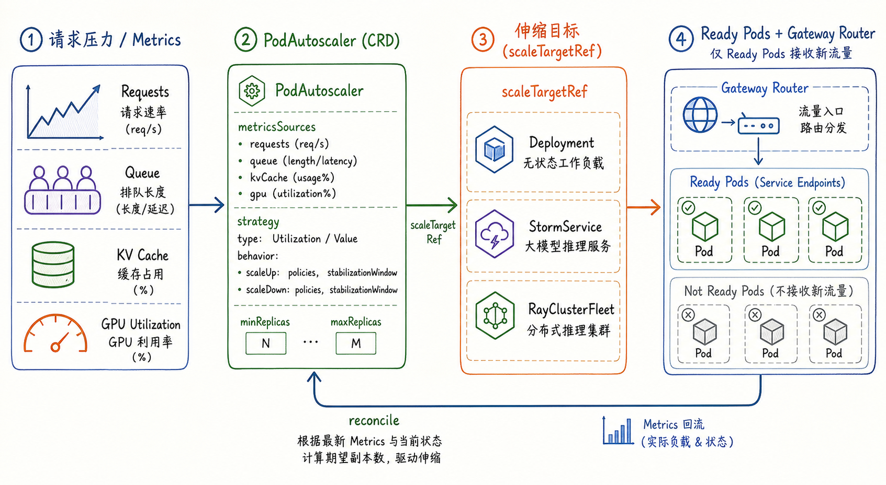
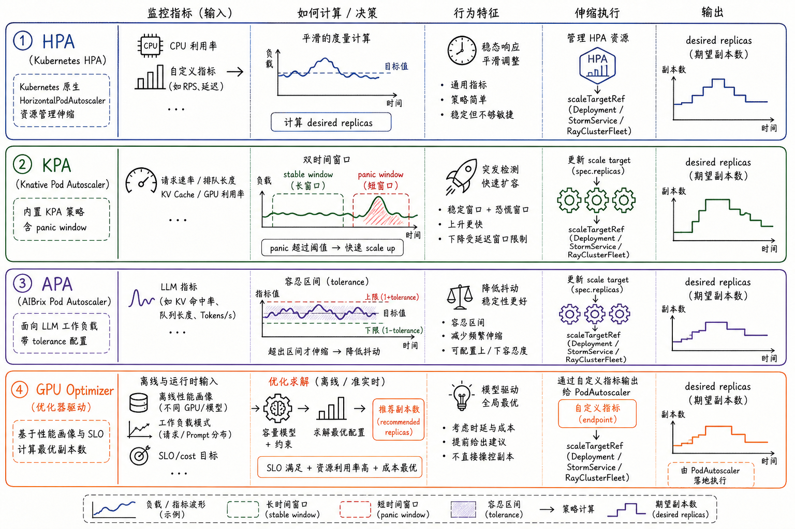
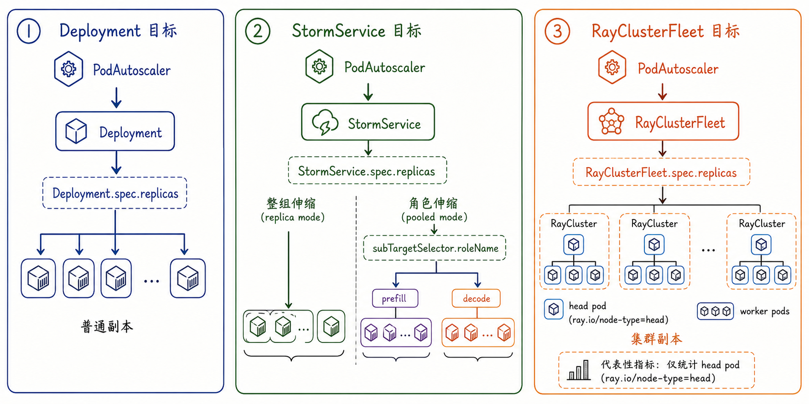
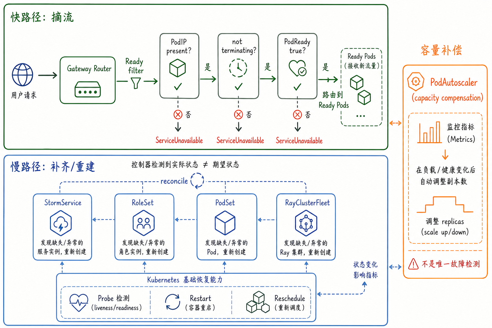

---
tags:
  - MaaS
  - AIBrix
  - LLMServing
  - Kubernetes
  - 弹性伸缩
  - 自愈
updated: 2026-06-01
description: "本文解释 AIBrix 的弹性机制，重点梳理 PodAutoscaler、健康状态、路由摘流、控制器 reconcile 与容量治理之间的关系。"
---

# 05. 弹性机制

## 1. 为什么弹性不是只改 replicas

前两章已经把 AIBrix 的模型工作负载分成了两类心智模型：基础形态中，一个 `Deployment` 可以表达一组同构推理 Pod；复杂形态中，一个模型服务可能由 `StormService`、`RoleSet`、`PodSet` 或 `RayClusterFleet` 表达，副本单位也可能从 Pod 扩展为 role、RoleSet、PodSet 或 RayCluster。

进入第五章后，问题自然变成：当请求压力变化、Pod 不健康、模型加载变慢、某个角色容量不足或分布式实例局部失效时，AIBrix 怎样把服务拉回一个可用、可路由、容量合适的状态？

这就是本章所说的弹性机制。它不等于 Kubernetes 默认的 `restartPolicy`，也不等于把 `spec.replicas` 从 1 改成 3。对 LLM Serving 平台来说，弹性至少包含四件事：

- 容量弹性：根据请求量、队列、KV cache、GPU 利用率、外部优化结果等信号调整副本数；
- 健康弹性：把未 Ready、正在删除、没有 PodIP 或组合不完整的实例排除在请求路径之外；
- 结构弹性：在 `StormService`、`RoleSet`、`PodSet`、`RayClusterFleet` 等对象之间维持期望状态；
- 恢复弹性：当 Pod、PodSet、RoleSet 或 RayCluster 缺失、终态或不可用时，通过 Kubernetes 基础恢复与 AIBrix 控制器 reconcile 补齐或重建；

截至 2026-06-01，本文核对的本地 AIBrix `main` 分支 HEAD 为 `76f7d73fc9a2028819255f4d49d23fed8ac7e3db`。本章重点解释 AIBrix 的弹性闭环，不深入第六章的 KVCache 缓存拓扑与第七章的完整路由策略。



图 1 可以作为本章地图。左侧是负载与状态信号，例如请求速率、队列长度、KV cache 占用和 GPU utilization；中间是 `PodAutoscaler`，它把指标来源、策略、上下界和目标对象声明成 Kubernetes API 对象；右侧是实际伸缩目标，可以是 `Deployment`、`StormService` 或 `RayClusterFleet`；最后，Gateway Router 只把新请求发给 Ready Pods。运行后的指标又回流到弹性控制面，形成下一轮决策。

这张图也提醒一个容易误解的地方：AIBrix 的弹性不是单个组件的能力，而是控制面、数据面、Kubernetes 原生能力和推理工作负载语义共同组成的闭环。

## 2. PodAutoscaler 的弹性意图

AIBrix 的容量弹性核心对象是 `autoscaling.aibrix.ai/v1alpha1` 下的 `PodAutoscaler`。从 API 设计看，它把一次自动伸缩拆成五类信息：

| 字段 | 作用 | 教程理解 |
| --- | --- | --- |
| `scaleTargetRef` | 指向被伸缩对象 | 告诉控制器要写回哪个工作负载的副本数 |
| `subTargetSelector` | 选择目标内部子对象 | 当前主要用于 `StormService` 的 role-level scaling |
| `minReplicas` / `maxReplicas` | 副本边界 | 防止缩到不可接受容量或扩到资源上限之外 |
| `metricsSources` | 指标来源和目标值 | 声明用什么信号判断当前容量是否足够 |
| `scalingStrategy` | `HPA`、`KPA` 或 `APA` | 声明使用哪类决策算法 |

一个最小的 KPA 配置大致如下：

```yaml
apiVersion: autoscaling.aibrix.ai/v1alpha1
kind: PodAutoscaler
metadata:
  name: deepseek-r1-distill-llama-8b-kpa
spec:
  scaleTargetRef:
    apiVersion: apps/v1
    kind: Deployment
    name: deepseek-r1-distill-llama-8b
  minReplicas: 1
  maxReplicas: 8
  scalingStrategy: KPA
  metricsSources:
    - metricSourceType: pod
      protocolType: http
      port: "8000"
      path: /metrics
      targetMetric: gpu_cache_usage_perc
      targetValue: "0.5"
```

这个 YAML 背后的语义比“给 Deployment 加一个 autoscaler”更丰富。`scaleTargetRef` 确定伸缩对象；`metricsSources` 说明从 Pod 的 `/metrics` 抓取 `gpu_cache_usage_perc`；`targetValue` 说明平台希望每个副本维持在怎样的指标水平；`minReplicas` 与 `maxReplicas` 限定自动决策的边界。

`PodAutoscaler` 的 status 也不是简单记录“成功”或“失败”。当前 API 中包含：

- `actualScale`：当前目标对象实际副本数；
- `desiredScale`：本轮根据指标和策略计算出的期望副本数；
- `lastScaleTime`：最近一次记录伸缩决策的时间；
- `conditions`：例如 spec 是否有效、是否 able to scale、是否与其他 `PodAutoscaler` 冲突；
- `scalingHistory`：最近若干次伸缩决策，记录 previous scale、new scale、reason、success 和 error；

这些状态字段让 `PodAutoscaler` 更像一个可审计的弹性控制对象，而不是一个隐藏在 controller-manager 日志里的后台算法。排查伸缩问题时，应该同时看 CRD status、controller-manager 日志、目标 workload 的副本数、Pod Ready 状态和指标端点，而不是只看最终 Pod 数量。

## 3. 指标从哪里来

AIBrix 的 `metricsSources` 支持多种指标来源，源码中主要分成四类：

| `metricSourceType` | 来源 | 典型用途 | 注意点 |
| --- | --- | --- | --- |
| `pod` | 直接访问每个 Pod 的 HTTP metrics endpoint | vLLM、SGLang 等推理引擎指标 | 需要 PodIP、port、path 和 engine 指标映射可靠 |
| `resource` | Kubernetes resource metrics API | CPU、memory | 更像通用 workload 指标，对 GPU 推理压力不一定充分 |
| `custom` | Kubernetes custom metrics API | 平台自定义指标 | 依赖集群中 custom metrics adapter |
| `external` / `domain` | 外部 HTTP 服务或外部指标 | GPU Optimizer 推荐副本数 | `domain` 已被标记为 deprecated，应优先理解为外部指标兼容路径 |

对于 `pod` 类型，AIBrix 会根据 PodIP、端口、路径和 engine 类型抓取指标，并通过统一的 engine metrics fetcher 得到数值。这适合 LLM Serving，因为很多关键压力不在 CPU，而在推理引擎暴露的运行时指标中，例如 KV cache 占用、running requests、waiting requests、tokens/s 或 latency。

对于 `external` 类型，一个重要场景是 GPU Optimizer。GPU Optimizer 不只是看当前某个 Pod 的指标，而是把离线 profiling、请求模式、SLO 和成本模型结合起来，输出推荐副本数。`PodAutoscaler` 再把这个推荐值当作一种外部指标，落到具体 `scaleTargetRef` 上。

当前 autoscaler pipeline 支持多指标。源码中的默认策略是：每个 metric source 独立计算一个推荐副本数，再取其中最大的推荐值作为本轮期望副本数。这个设计很保守，但适合服务可用性：只要某个指标已经表明容量不足，最终副本数就不应被另一个“看起来还好”的指标压低。

不过，指标质量本身仍然决定伸缩质量。对 LLM Serving 来说，错误的 metrics 往往比没有 autoscaler 更危险：

- 如果 readiness 过早放行，Pod 还没加载完模型就参与指标和路由，伸缩会误判可用容量；
- 如果只看 CPU，可能完全看不到 GPU KV cache、队列和 token 生成压力；
- 如果 external metric 是全局推荐值，却被误解成每 Pod 实时负载，就容易高估指标精度；
- 如果指标抓取失败被当成 0，可能触发错误缩容或延迟扩容，需要结合日志与 status 判断；

因此，AIBrix 的弹性治理第一步不是选择 HPA、KPA 还是 APA，而是确认“指标是否真实表达了推理服务压力”。

## 4. 三类策略与优化器路径

AIBrix 文档把自动伸缩分成 metrics-based autoscaling 和 optimizer-based autoscaling。前者依赖实时或近实时指标，后者依赖 profiling、请求模式、成本和 SLO 等输入，先算出资源建议，再通过 `PodAutoscaler` 落地。



图 2 展示了四条常见路径。它们不是互相替代的“谁更高级”关系，而是面向不同负载形态的策略选择。

### 4.1 HPA：复用 Kubernetes 原生伸缩

`HPA` 策略会由 AIBrix 创建或协调 Kubernetes `HorizontalPodAutoscaler` 资源。它适合通用指标、稳定负载或希望尽量复用 Kubernetes 原生行为的场景。

源码中的 `makeHPA` 会根据 `PodAutoscaler` 构造一个 HPA 对象：

- HPA 名称来自 `PodAutoscaler` 名称，例如 `<pa-name>-hpa`；
- `ScaleTargetRef` 复用 `PodAutoscaler.spec.scaleTargetRef`；
- `minReplicas`、`maxReplicas` 和 metrics 从 `PodAutoscaler` 转换而来；
- scale up / scale down behavior 会从 AIBrix 的 scaling context 转换成 HPA behavior；

HPA 的优点是语义成熟、生态兼容、排查路径清楚。缺点是它本身并不理解 LLM 推理中的 KV cache、prefill/decode 不对称、长短请求混合、模型冷启动等领域现象。使用 HPA 时，关键是让输入指标足够贴近推理压力。

### 4.2 KPA：短窗口应对突发流量

`KPA` 策略借鉴 Knative Pod Autoscaler 的双窗口思想：长一些的 stable window 表达稳定趋势，短一些的 panic window 捕捉突发尖峰。当短窗口相对长窗口超过阈值时，KPA 会进入 panic mode，倾向于更快扩容。

AIBrix 的 KPA 计算逻辑里有几个关键参数：

- `panic-threshold`：默认可理解为短窗口相对稳定窗口的突增阈值；
- `max-scale-up-rate`：限制单次扩容速度；
- `max-scale-down-rate`：限制单次缩容速度；
- `scale-up-tolerance` / `scale-down-tolerance`：给指标波动留出容忍带；
- `scale-up-cooldown-window` / `scale-down-cooldown-window`：对推荐副本做稳定化处理；

KPA 适合短时间突刺明显的推理服务。例如大促、批量评测、突发机器人调用、某个模型突然成为热点时，稳定窗口还没完全抬升，panic window 已经能提示需要快速补容量。

它的代价是更容易在不稳定指标下扩得偏快。因此，KPA 通常需要配合可靠的 `maxReplicas`、冷启动预估、模型加载时间、缩容窗口和实际成本约束。

### 4.3 APA：面向 LLM 指标的容忍带

`APA` 是 AIBrix 自己的 Pod Autoscaler 策略。当前代码中的核心不是“已经完成的全自动预测系统”，而是用更适合 LLM workload 的指标与 fluctuation tolerance 控制扩缩容抖动。

它的基本思路可以简化为：

1. 从聚合指标中得到当前每 Pod 使用水平；
2. 读取目标值 `targetValue`；
3. 根据 `scale-up-tolerance` 和 `scale-down-tolerance` 形成上下容忍区间；
4. 如果指标超过上界，按当前值与目标值比例扩容，但受 `max-scale-up-rate` 限制；
5. 如果指标低于下界，按比例缩容，但受 `max-scale-down-rate` 和 cooldown 限制；
6. 如果指标仍在容忍区间内，保持当前副本数；

这解决的是 LLM Serving 中很常见的“指标小幅抖动导致反复扩缩容”问题。长输出、batch 合并、KV cache 利用率、请求长度分布都会让指标曲线不够平滑。如果每次轻微越线就调整副本，模型服务可能陷入频繁冷启动、频繁缩容和成本波动。

因此，APA 的价值不在于名字，而在于它把“推理指标”和“容忍带”作为一等配置。对于 latency-sensitive 服务，容忍带可以收窄；对于成本敏感服务，缩容窗口和下行容忍度可以更保守。

### 4.4 GPU Optimizer：把规划结果接入伸缩闭环

Optimizer-based autoscaling 与前三者不同。它不只依赖在线指标阈值，而是先用离线 profile 和请求模式判断某种 GPU、某个模型、某个 SLO 下需要多少资源。

官方文档中的路径大致是：

1. 对模型和 GPU 类型做 benchmark，生成性能画像；
2. 结合 SLO、成本和请求模式生成 profile；
3. GPU Optimizer 读取负载模式并求解推荐资源配置；
4. 推荐副本数通过 HTTP metrics endpoint 暴露；
5. `PodAutoscaler` 把这个推荐值作为外部指标写回目标 workload；

这适合有明确 SLO、异构 GPU、周期性流量或成本优化目标的场景。它的边界也很清楚：profile 质量、请求分布稳定性、成本模型准确性和模型版本变化都会影响推荐结果。GPU Optimizer 给出的是容量建议，不替代 Gateway 的 Ready 过滤，也不替代控制器对目标对象的 reconcile。

## 5. 伸缩目标的粒度

理解 `PodAutoscaler` 时，最关键的问题不是“能不能扩缩容”，而是“扩缩容写回的是哪个层级”。



图 3 把三类目标放在一起比较。

第一类是普通 `Deployment`。这是最接近 Kubernetes 原生 HPA 的路径：`PodAutoscaler` 读取指标后，写回 `Deployment.spec.replicas`。这种方式适合第三章所说的基础模型服务，每个 Pod 都是一个完整推理实例。

第二类是 `StormService`。这时要先区分 replica mode 和 pooled mode：

- replica mode 更像“整组服务副本”伸缩，`StormService.spec.replicas` 代表 RoleSet 副本数量；
- pooled mode 更像“角色池”伸缩，`StormService.spec.replicas` 通常为 1，不同 role 在同一个 RoleSet 内有自己的 replicas；
- 本地代码与 sample 已出现 `subTargetSelector.roleName`，用于让 `PodAutoscaler` 独立伸缩某个 role，例如只伸缩 `prefill` 或只伸缩 `decode`；

这对 P/D 分离很重要。prefill 和 decode 的资源画像可能不同：prefill 更受 prompt 长度和首轮计算影响，decode 更受长输出、batch、KV cache 和持续生成影响。把它们绑在同一个副本数上，容易让其中一侧过剩或不足。

第三类是 `RayClusterFleet`。在 Ray-based distributed inference 中，一个可用服务副本更接近 RayCluster，而不是单个 Pod。AIBrix 的 autoscaler 在为 `RayClusterFleet` 取指标候选 Pod 时，会添加 `ray.io/node-type=head` 过滤，避免把 worker pod 重复计入同一服务副本的代表性指标。

类似地，StormService 的多节点 role 如果设置了 `podGroupSize > 1`，selector 会倾向于只统计 `pod-group-index=0` 的代表性 Pod。这背后的原则是：一个逻辑推理实例可能包含多个 Pod，但 autoscaling 计算不应把这些协同 Pod 全部误当成独立服务副本。

## 6. 健康状态与恢复闭环

容量弹性只能回答“要多少副本”。健康弹性还要回答“哪些副本现在可以接流量”和“坏掉的结构如何恢复”。



图 4 把 AIBrix 的健康恢复分成三条路径。

第一条是请求快路径。Gateway Router 不应该把新请求发到所有存在的 Pod，而是先做 Ready 过滤。第三章已经看到，AIBrix 的 Pod 过滤会排除没有 PodIP、正在删除或 `PodReady` 不为 true 的 Pod。没有可路由后端时，返回 `ServiceUnavailable` 比继续转发到坏实例更合理。

第二条是控制器慢路径。AIBrix 控制器通过 list/watch/reconcile 把实际状态拉回期望状态：

- `StormService` 维护服务级副本、RoleSet、滚动更新和 status 聚合；
- `RoleSet` 管理角色下的 Pod 或 PodSet，并计算 active、ready、not ready 等状态；
- `PodSet` 用于多节点原子组，状态中有 `totalPods`、`readyPods` 和 `phase`；
- `RayClusterFleet` / `RayClusterReplicaSet` 管理 RayCluster 副本和可用状态；

第三条是 Autoscaler 容量补偿。当部分副本故障、吞吐下降、队列变长或外部优化器认为容量不足时，`PodAutoscaler` 可以把目标副本数调高；当服务恢复、负载下降后，它也可以逐步缩容。

这三条路径不能混为一谈。Autoscaler 不是唯一故障检测器，也不是每个故障的第一响应者。单个 Pod NotReady 时，最快生效的是路由摘流；Pod 被删除或终态时，控制器和 Kubernetes 会补齐；指标压力变化后，`PodAutoscaler` 才根据策略补偿容量。把 autoscaler 当成“自愈全部答案”，会高估它对卡死 Pod、半残 PodSet、RayCluster 内部异常或整集群故障的处理能力。

## 7. 场景化理解弹性边界

### 7.1 普通多副本模型服务

对普通 `Deployment` 或单 Pod role 来说，弹性路径相对直接：

1. 请求压力升高，Pod metrics 或 resource metrics 抬升；
2. `PodAutoscaler` 计算 desired replicas；
3. 控制器写回 `Deployment.spec.replicas`；
4. Kubernetes 创建新 Pod；
5. 新 Pod 完成模型加载与 readiness probe；
6. Gateway Router 将 Ready Pod 纳入候选；

这里最容易忽略的是第 5 步。LLM Pod 的冷启动成本往往远高于普通 Web 服务，尤其涉及镜像拉取、模型权重加载、GPU 显存初始化、KV cache 预热和 tokenizer 准备。扩容决策发生后，容量并不会瞬间可用。因此，短突发场景需要足够激进的扩容策略或预留副本，长尾成本场景需要谨慎缩容窗口。

### 7.2 P/D 分离与角色级伸缩

对 P/D 分离来说，弹性不是“模型服务整体加一个副本”这么简单。prefill 与 decode 的容量可能需要分开看：

- prompt 突然变长时，prefill 压力可能先上升；
- 输出 token 变长或 batch 更大时，decode 压力可能持续更久；
- prefill 和 decode 的理想比例不是固定常数，会随请求分布变化；
- pooled mode 下，用 role-level autoscaling 独立调节 `prefill.replicas` 与 `decode.replicas` 更贴近真实负载；

但角色级伸缩也会引入新边界。如果 prefill 扩得很快而 decode 不够，端到端请求仍然会在 decode 侧排队；如果 decode 扩得很多而 prefill 不足，decode 资源会闲置。更重要的是，P/D 路由要求完整可用组合：某个 RoleSet 只有 prefill 或只有 decode 时，不能被当作完整路径。

因此，P/D 弹性应把 role-level metrics、RoleSet 完整性、Router 候选过滤和升级策略一起看。

### 7.3 多节点 PodSet

多节点推理中，一个 role 的最小执行单位可能是 `PodSet`，而不是单 Pod。`PodSet` 的关键语义是：只有 `readyPods == podGroupSize` 时，这个多 Pod 组才是完整 Ready。

弹性和自愈在这里变得更难：

- autoscaling 统计指标时，不能把同一个 PodSet 内的多个 rank 都当成独立服务副本；
- 调度时需要 PodGroup 或 gang scheduling，避免只调度出一部分 rank；
- 故障恢复时，要选择 `ReplaceUnhealthy` 还是 `Recreate`；
- 对强耦合通信拓扑，局部修复可能不如整组重建可靠；

这就是 AIBrix 在复杂部署中引入 `PodSet` 的原因。它把“多 Pod 原子组”显式放进 API 和 status，而不是靠一堆 label 隐式约定。

### 7.4 RayClusterFleet

RayClusterFleet 的伸缩单位是 RayCluster。AIBrix 管的是外层 RayCluster 副本，Ray 管的是集群内部的 head、worker、task 和 actor。

对弹性来说，这意味着：

- 扩容通常是增加一个新的 RayCluster 副本；
- 指标统计应避免把多个 worker 当成多个完整服务副本；
- 已 provisioned 的 RayCluster 如果不再 Ready，通常要从服务副本角度理解为不可用；
- 新 RayCluster 的冷启动包含 Ray 集群初始化和模型服务启动，恢复时间可能比普通 Pod 更长；

所以 RayClusterFleet 的弹性更像“集群级副本治理”，不是“给 worker pod 加减数量”。

### 7.5 整集群故障

AIBrix 可以在 Kubernetes 对象仍然存在时，通过 informer、cache 和 reconcile 重建内存状态；也可以在 Pod 恢复 Ready 后让 Gateway 重新路由。但它不是跨集群灾备系统。

如果整个 Kubernetes 集群或 etcd 状态丢失，AIBrix 不能凭空恢复所有 `StormService`、`RoleSet`、`PodSet`、`PodAutoscaler` 和业务对象。生产环境需要额外准备：

- GitOps 或 IaC 形式的业务对象声明；
- etcd 备份与恢复演练；
- 镜像仓库、模型制品、Secret、ConfigMap 和对象存储的可恢复性；
- 多集群流量切换或全局负载均衡；
- 模型预热、冷启动预算和客户端重试策略；

这不是 AIBrix 的缺点，而是平台边界。AIBrix 负责集群内的模型服务弹性，集群级灾备要由更外层架构承接。

## 8. 调参与排查建议

写 AIBrix 弹性配置时，可以按以下顺序检查。

第一，确认伸缩目标是否正确。`scaleTargetRef` 指向 `Deployment`、`StormService` 还是 `RayClusterFleet`，决定了“副本”到底是什么。P/D pooled mode 下还要确认是否需要 `subTargetSelector.roleName`。

第二，确认指标是否能代表压力。GPU 推理服务不要只看 CPU。优先考虑请求队列、running requests、KV cache、GPU utilization、tokens/s、latency 或外部优化器推荐，但要确保指标抓取路径可靠。

第三，确认副本上下界是否符合冷启动现实。`maxReplicas` 太低会让 autoscaler 永远追不上突发流量；`minReplicas` 太低会让服务反复冷启动；缩容窗口太短会节省成本但提高下一次突发的延迟风险。

第四，确认 Ready 信号是否可信。readiness probe 过早或过晚都会影响路由与 autoscaling。对模型服务来说，Ready 应该尽量表示“模型已经加载完成并能真实处理请求”，而不是“容器进程刚启动”。

第五，确认多实例是否跨故障域。即使 AIBrix 能摘流和补副本，如果所有副本都落在同一节点、同一 GPU 池或同一故障域，单点故障仍然会击穿服务。

第六，确认状态字段和事件。`PodAutoscaler.status.conditions`、`scalingHistory`、目标 workload 的 status、Pod events、controller-manager 日志和 Gateway 日志要一起看。只看最后的 Pod 数量，容易漏掉指标失败、冲突、边界约束或 Ready 过滤问题。

## 9. 本章小结

AIBrix 的弹性机制可以概括为一句话：用 `PodAutoscaler` 管容量，用 Gateway Ready 过滤管新请求，用控制器 reconcile 管期望状态，用 Kubernetes 基础能力管底层 Pod 与节点恢复。

具体到工作负载时，要始终追问三个问题：第一，副本单位是什么，是 Pod、role、RoleSet、PodSet 还是 RayCluster；第二，指标是否真实表达了当前推理压力；第三，健康状态是否能准确阻止坏实例继续接流量。

如果只把弹性理解为“自动改 replicas”，就会漏掉 AIBrix 最重要的平台语义：它把 LLM Serving 的模型、角色、分布式执行、路由候选、健康状态和容量治理放进同一个 Kubernetes-native 闭环里。

## 10. 参考资料

1. [AIBrix Documentation：AIBrix Autoscaler](https://aibrix.readthedocs.io/latest/designs/aibrix-autoscaler.html)；
2. [AIBrix Documentation：Metric-based Autoscaling](https://aibrix.readthedocs.io/latest/features/autoscaling/metric-based-autoscaling.html)；
3. [AIBrix Documentation：Optimizer-based Autoscaler](https://aibrix.readthedocs.io/latest/features/autoscaling/optimizer-based-autoscaling.html)；
4. [AIBrix Documentation：AIBrix StormService](https://aibrix.readthedocs.io/latest/designs/aibrix-stormservice.html)；
5. [AIBrix Documentation：Multi-Node Inference](https://aibrix.readthedocs.io/latest/features/multi-node-inference.html)；
6. [GitHub：vllm-project/aibrix PodAutoscaler API](https://github.com/vllm-project/aibrix/blob/76f7d73fc9a2028819255f4d49d23fed8ac7e3db/api/autoscaling/v1alpha1/podautoscaler_types.go)；
7. [GitHub：vllm-project/aibrix PodAutoscaler controller](https://github.com/vllm-project/aibrix/blob/76f7d73fc9a2028819255f4d49d23fed8ac7e3db/pkg/controller/podautoscaler/podautoscaler_controller.go)；
8. [GitHub：vllm-project/aibrix workload scale abstraction](https://github.com/vllm-project/aibrix/blob/76f7d73fc9a2028819255f4d49d23fed8ac7e3db/pkg/controller/podautoscaler/workload_scale.go)；
9. [GitHub：vllm-project/aibrix autoscaler pipeline](https://github.com/vllm-project/aibrix/blob/76f7d73fc9a2028819255f4d49d23fed8ac7e3db/pkg/controller/podautoscaler/autoscaler.go)；
10. [GitHub：vllm-project/aibrix KPA algorithm](https://github.com/vllm-project/aibrix/blob/76f7d73fc9a2028819255f4d49d23fed8ac7e3db/pkg/controller/podautoscaler/algorithm/kpa.go)；
11. [GitHub：vllm-project/aibrix APA algorithm](https://github.com/vllm-project/aibrix/blob/76f7d73fc9a2028819255f4d49d23fed8ac7e3db/pkg/controller/podautoscaler/algorithm/apa.go)；
12. [GitHub：vllm-project/aibrix HPA resource builder](https://github.com/vllm-project/aibrix/blob/76f7d73fc9a2028819255f4d49d23fed8ac7e3db/pkg/controller/podautoscaler/hpa_resources.go)；
13. [GitHub：vllm-project/aibrix metrics fetchers](https://github.com/vllm-project/aibrix/blob/76f7d73fc9a2028819255f4d49d23fed8ac7e3db/pkg/controller/podautoscaler/metrics/fetcher.go)；
14. [GitHub：vllm-project/aibrix StormService role-level autoscaling sample](https://github.com/vllm-project/aibrix/blob/76f7d73fc9a2028819255f4d49d23fed8ac7e3db/samples/autoscaling/stormservice-pool.yaml)；
15. [GitHub：vllm-project/aibrix KPA sample](https://github.com/vllm-project/aibrix/blob/76f7d73fc9a2028819255f4d49d23fed8ac7e3db/samples/autoscaling/kpa.yaml)；
16. [GitHub：vllm-project/aibrix APA sample](https://github.com/vllm-project/aibrix/blob/76f7d73fc9a2028819255f4d49d23fed8ac7e3db/samples/autoscaling/apa.yaml)；
17. [GitHub：vllm-project/aibrix optimizer KPA sample](https://github.com/vllm-project/aibrix/blob/76f7d73fc9a2028819255f4d49d23fed8ac7e3db/samples/autoscaling/optimizer-kpa.yaml)；
18. [Kubernetes Documentation：Horizontal Pod Autoscaling](https://kubernetes.io/docs/tasks/run-application/horizontal-pod-autoscale/)。

## 11. Learning Assessment

### 11.1 题目

1. 单选：为什么本章强调 AIBrix 弹性机制不等于简单修改 `replicas`？
   - A. 因为弹性还包含指标采集、路由摘流、健康状态、控制器 reconcile 和工作负载语义；
   - B. 因为 Kubernetes 中所有对象都不能设置 `replicas`；
   - C. 因为 AIBrix 只支持手动扩容，不支持自动伸缩；
   - D. 因为 LLM 服务不需要 Ready 状态；

2. 多选：`PodAutoscaler.spec` 中哪些字段直接影响容量弹性决策？
   - A. `scaleTargetRef`；
   - B. `metricsSources`；
   - C. `minReplicas` / `maxReplicas`；
   - D. `scalingStrategy`；

3. 单选：`metricsSources` 使用 `pod` 类型时，最接近哪种采集路径？
   - A. 直接访问每个 Pod 的 metrics endpoint；
   - B. 只读取 GitHub release note；
   - C. 只读取 Kubernetes Secret 名称；
   - D. 从客户端请求 body 中解析副本数；

4. 多选：关于 AIBrix 多指标伸缩，哪些说法是正确的？
   - A. 每个有效指标可以独立计算推荐副本数；
   - B. 默认选择最高的推荐副本数作为最终结果；
   - C. 多指标意味着所有指标必须完全相等才会扩容；
   - D. 指标失败时需要结合 status 和日志排查；

5. 单选：KPA 中 panic window 的主要作用是什么？
   - A. 捕捉短时间突刺，帮助快速扩容；
   - B. 永久禁用所有扩容；
   - C. 把所有 Pod 标记为 NotReady；
   - D. 替代 Gateway Router；

6. 单选：当前代码中 APA 更核心的特点是什么？
   - A. 使用 LLM 相关指标和 tolerance 控制扩缩容抖动；
   - B. 不读取任何指标；
   - C. 只负责创建 HTTPRoute；
   - D. 自动完成跨集群灾备；

7. 多选：`PodAutoscaler` 作用于 `StormService` 时，哪些说法是正确的？
   - A. replica mode 更偏向伸缩整组 RoleSet；
   - B. pooled mode 下可以用 `subTargetSelector.roleName` 伸缩某个 role；
   - C. prefill 与 decode 可以有不同的指标和副本边界；
   - D. role-level scaling 完全不需要考虑 Router 候选完整性；

8. 单选：为什么 RayClusterFleet 的指标统计需要关注 `ray.io/node-type=head`？
   - A. 避免把同一个 RayCluster 内多个 worker pod 误当作多个完整服务副本；
   - B. 因为 worker pod 永远不会消耗 GPU；
   - C. 因为 RayClusterFleet 不需要任何指标；
   - D. 因为 head pod 是 Kubernetes 的内置控制面组件；

9. 多选：健康恢复闭环中，哪些职责划分是合理的？
   - A. Gateway Router 负责把新请求限制在 Ready 候选中；
   - B. 控制器 reconcile 负责把实际对象拉回期望状态；
   - C. Kubernetes probe、restart、reschedule 提供底层恢复能力；
   - D. PodAutoscaler 是唯一的故障检测来源；

10. 单选：当所有后端 Pod 都不可路由时，Gateway 返回 `ServiceUnavailable` 为什么是合理的？
    - A. 因为继续向不可用实例转发只会放大错误；
    - B. 因为 AIBrix 要隐藏所有故障；
    - C. 因为 Kubernetes 禁止创建新的 Pod；
    - D. 因为 `ServiceUnavailable` 会自动下载模型权重；

11. 多选：生产环境中，为了让 AIBrix 弹性机制更可靠，应优先关注哪些配置？
    - A. readiness probe 是否真实表示模型可服务；
    - B. `minReplicas`、`maxReplicas` 和缩容窗口是否符合冷启动成本；
    - C. Pod 是否跨故障域部署；
    - D. 是否把 CPU 作为所有模型服务的唯一指标；

12. 单选：AIBrix 在整集群故障场景下的边界是什么？
    - A. 它可以在 Kubernetes 对象仍存在时重建控制器内存状态，但不替代 GitOps、etcd 备份和多集群灾备；
    - B. 它可以在没有任何 CRD 对象的情况下凭空恢复所有模型服务；
    - C. 它会自动把所有请求切到另一个云厂商；
    - D. 它不依赖 Kubernetes API；

### 11.2 答案与解析

1. 答案：A。AIBrix 弹性闭环包含指标、策略、目标对象、Ready 过滤、reconcile 和恢复语义。`replicas` 只是最终可能被写回的一个字段。

2. 答案：A、B、C、D。`scaleTargetRef` 决定目标，`metricsSources` 决定输入信号，副本上下界限制输出，`scalingStrategy` 决定计算方式。

3. 答案：A。`pod` 类型指标会访问 Pod 的 HTTP metrics endpoint，再通过 engine metrics fetcher 得到目标指标值。

4. 答案：A、B、D。AIBrix 默认对多个有效指标分别计算推荐副本数，再取最大值；失败指标不会自动变成可靠决策，需要结合 status 和日志排查。

5. 答案：A。KPA 的 panic window 用短窗口观察突刺，帮助系统在 stable window 完全抬升之前快速扩容。

6. 答案：A。当前 APA 的核心是 LLM 指标、目标值和上下 tolerance，减少小幅波动导致的频繁扩缩容。

7. 答案：A、B、C。role-level autoscaling 能让 prefill 和 decode 独立伸缩，但仍要考虑角色组合、Ready 状态和 Router 候选完整性，因此 D 错。

8. 答案：A。RayClusterFleet 的副本单位更接近 RayCluster，统计 head pod 有助于避免把同一集群内部的多个 worker 重复看成服务副本。

9. 答案：A、B、C。PodAutoscaler 是容量补偿机制，不是唯一故障检测来源。健康、路由和恢复需要 Gateway、控制器和 Kubernetes 基础能力协作。

10. 答案：A。没有可路由后端时，返回 `ServiceUnavailable` 比向坏实例继续转发更可控，也更利于客户端重试和上层熔断。

11. 答案：A、B、C。CPU 可以作为某些场景的指标，但不应被当作所有 GPU 推理服务的唯一压力信号。

12. 答案：A。AIBrix 可以在 Kubernetes API 和对象状态仍存在时重新 reconcile，但整集群灾备需要外部 GitOps、备份、制品可用性和流量切换设计。
