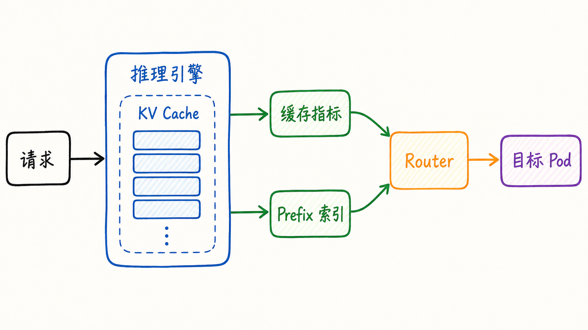
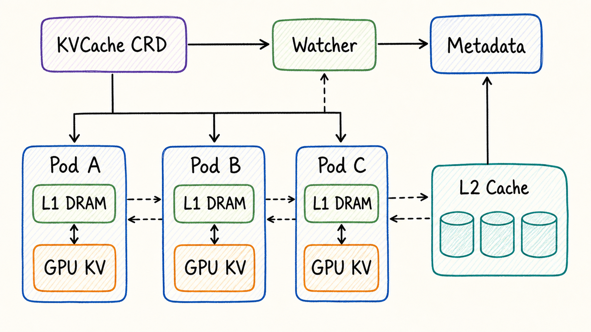
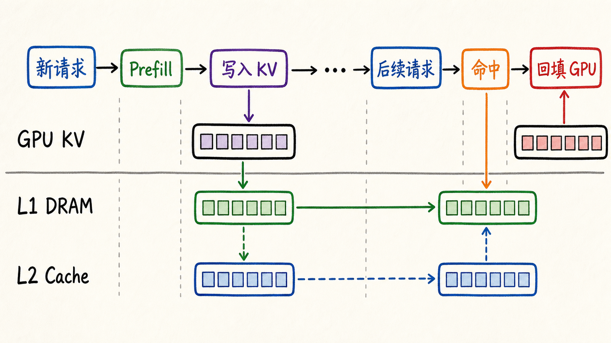
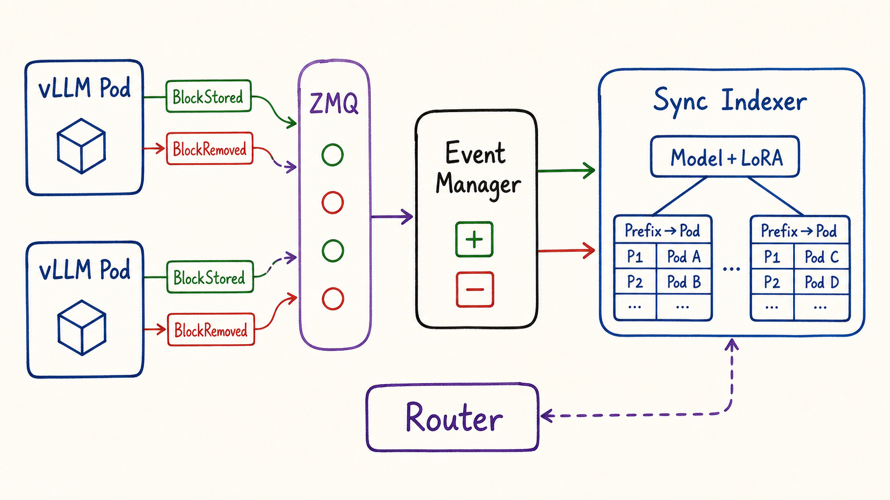
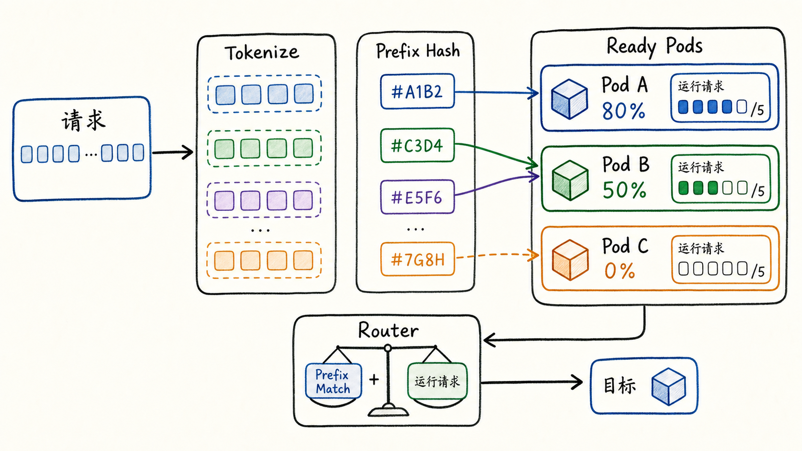
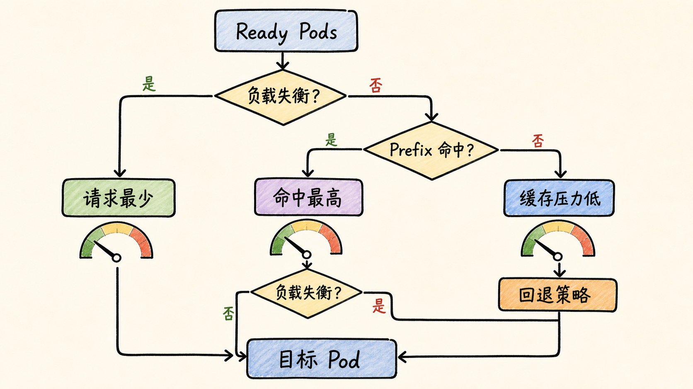
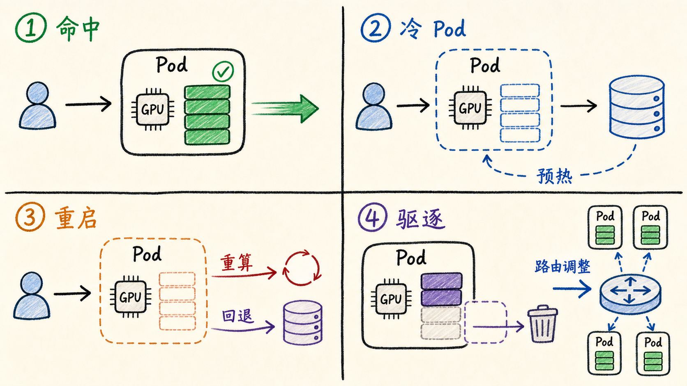

---
tags:
  - MaaS
  - AIBrix
  - LLMServing
  - Kubernetes
  - KVCache
  - 路由
updated: 2026-06-01
description: "本文解释 AIBrix 的 KVCache 系统，重点梳理缓存如何从推理引擎内部状态上升为平台级缓存拓扑、缓存复用和路由调度信号。"
---

# 06. KVCache系统

## 1. 为什么KVCache会变成平台问题

前一章已经把 AIBrix 的弹性机制拆成容量、健康、结构和恢复四类闭环。进入第六章后，平台还要面对另一个更微妙的问题：当一个请求曾经在某个推理实例上计算过长前缀，后续请求是否应该尽量回到同一个实例，或者回到能复用同一段 KV 状态的缓存层。

这就是 KVCache 系统的意义。它不只是推理引擎内部用来加速 decode 的显存对象，也会影响平台怎样理解请求成本、怎样选择后端实例、怎样在多副本之间降低重复 prefill，以及怎样在 P/D 分离、缓存 offloading 和路由策略之间做取舍。

对普通 Web 服务来说，两个请求通常可以近似看成同质任务。只要后端 Ready，负载均衡器把请求分到请求数更少的实例上，大多数时候就足够合理。LLM Serving 不一样。一次请求的真实成本与输入 token、输出 token、prefix 是否复用、GPU KV 空间、CPU/L2 缓存命中、prefill 与 decode 阶段拆分都有关系。同一个模型的两个 Ready Pod，看起来都能接请求，但它们的缓存状态可能完全不同。

可以先抓住一个直觉：

- KVCache 命中意味着某段历史 Key/Value 已经存在，可以减少重复 prefill 或降低外部缓存取回成本；
- KVCache 不命中意味着请求需要重新计算前缀，或者从更慢的缓存层读取并回填；
- KVCache 压力过高意味着继续把请求发到该实例可能引发抢占、驱逐、排队或尾延迟上升；
- KVCache 信息如果只留在单个引擎内部，平台就只能做普通负载均衡；
- KVCache 信息如果被抽象成指标、索引、事件和缓存服务，平台才有机会做 cache-aware routing；

截至 2026-06-01，本文核对的本地 AIBrix `main` 分支 HEAD 为 `76f7d73fc9a2028819255f4d49d23fed8ac7e3db`。本文重点解释 AIBrix 平台视角下的 KVCache 系统，不深入 vLLM 内部 PagedAttention、block allocator、attention kernel 或底层显存布局；这些属于推理引擎内部实现，而不是本章主线。



图 1 是本章的入口。左侧的 `KV Cache` 仍然存在于推理引擎内部，但它向平台暴露出两类信号：一类是缓存指标，例如 GPU/CPU/KV cache usage、prefix cache hit；另一类是 prefix 索引，例如某个 token 前缀在哪些 Pod 上可能命中。Router 消费这些信号后，才可能把请求导向更合适的目标 Pod。

这张图也提示本章最重要的边界：AIBrix 不需要替代 vLLM、SGLang 或 TensorRT-LLM 管理每一个 KV tensor。AIBrix 要做的是把缓存能力提升到平台层，使它能被控制器、缓存服务、指标系统和路由系统共同使用。

## 2. AIBrix里KVCache的三层含义

阅读 AIBrix 代码时，容易把所有带有 cache 的概念混在一起。为了避免这一点，可以把 KVCache 分成三层：

| 层次 | 主要对象 | 平台意义 | 常见误解 |
| --- | --- | --- | --- |
| 引擎内部 KV 状态 | GPU KV blocks、prefix cache、engine metrics | 表达请求已经计算出的 Key/Value 状态，以及当前缓存压力 | 把它误认为 AIBrix 控制器直接管理的 Kubernetes 对象 |
| KVCache offloading 系统 | AIBrix Offloading Connector、L1 DRAM、L2 Cache、backend connector | 扩展缓存容量，支持跨 engine 复用和外部缓存层 | 把 L1/L2 offloading 等同于 Gateway 的路由索引 |
| 路由调度信号 | prefix hash index、KV event sync、`prefix-cache`、`least-kv-cache`、P/D prefill scoring | 让 Router 在 Ready Pod 集合中按缓存亲和、缓存压力和负载选择目标 | 把缓存命中视为唯一目标，忽略负载和健康状态 |

第一层属于推理引擎。vLLM 等引擎在推理过程中维护 KV blocks，prefix cache 命中后可以减少重复计算。AIBrix 通过 metrics、tokenizer、prefix hash 或 KV event 观察这一层的效果，但不把每个 GPU block 变成 Kubernetes API 对象。

第二层是 AIBrix KVCache offloading framework。它把 KV cache 从 GPU 显存扩展到 L1 DRAM，再扩展到可选的 L2 distributed cache。这个框架通过 AIBrix connector 与推理引擎集成，重点解决单节点容量限制、跨引擎复用和缓存后端可插拔问题。

第三层是路由系统。Gateway Router 需要在多个 Ready Pod 之间选择目标。它可以使用 prefix cache index 判断哪些 Pod 可能持有相同前缀，也可以使用 GPU/CPU/KV cache usage 判断哪个 Pod 缓存压力更低，还可以在 P/D 分离中把 prefix 命中与 decode 侧负载组合成最终得分。



图 2 把这三层放在同一张拓扑里。底部每个引擎 Pod 有自己的 `GPU KV` 和可选 `L1 DRAM`；右侧 `L2 Cache` 是可选的分布式缓存层；上方 `KVCache CRD`、`Watcher` 和 `Metadata` 负责把缓存服务本身声明、部署和注册起来。Router 并不直接读写所有 KV tensor，它消费的是缓存服务、缓存指标和 prefix 索引形成的平台视图。

因此，本章后续要分两条线讲：一条是 KVCache 服务怎样被声明和部署；另一条是缓存状态怎样进入路由决策。

## 3. KVCache CRD表达的是缓存服务

AIBrix 在 `orchestration.aibrix.ai/v1alpha1` 下定义了 `KVCache` CRD。这个对象容易被误解成“每个请求的 KV cache 记录”，但从 API 设计看，它表达的是一个缓存服务集群的期望状态，而不是某次推理的缓存内容。

`KVCacheSpec` 的关键字段可以这样理解：

| 字段 | 作用 | 教程理解 |
| --- | --- | --- |
| `mode` | `centralized` 或 `distributed` | 表达缓存服务形态，当前默认值是 `distributed` |
| `metadata` | Redis 或 Etcd 配置 | 为分布式缓存成员、元数据或连接信息提供协调层 |
| `cache` | 缓存数据面 runtime | 声明 cache 容器镜像、副本、环境变量、资源和高级 Pod 模板 |
| `watcher` | watcher runtime | 用于成员注册或缓存集群状态观察 |
| `service` | 对外 Service 配置 | 暴露缓存服务端口和 Service 类型 |

`KVCacheStatus` 当前比较克制，主要包含 `ReadyReplicas` 和 `conditions`。这说明 CRD 的职责边界很清楚：它关心缓存服务是否被部署出来、当前有多少可用副本、控制器是否能把下层对象拉到期望状态，而不是记录每个 prefix 命中了多少次。

`KVCache` 的 webhook 还会处理两个默认值：backend 和 mode。如果对象没有显式标注 backend，默认会落到 AIBrix 预设的 KVCache backend；如果没有指定 mode，也会写入默认模式。这样做的实际意义是，即使用户只写一个较短的 `KVCache` 对象，控制器也有足够信息选择后端 reconciler。

控制器路径可以概括为：

1. `KVCacheReconciler` watch `KVCache` 对象，同时 owns 下层 `Service` 和 `Deployment`，并根据带有 KVCache 标识的 Pod 变化重新入队；
2. Reconcile 时先根据 annotation 解析 backend；
3. backend 支持 `vineyard`、`hpkv` 和 `infinistore` 等路径；
4. distributed backend 会校验对象，然后创建或更新 metadata service、cache `StatefulSet`、cache `Service` 和 watcher 所需的 RBAC/Pod；
5. 下层对象变化后，控制器继续 reconcile，使 Kubernetes 实际状态接近 `KVCache` CRD 的期望状态；

这里要注意 `StatefulSet`。分布式缓存通常比普通无状态服务更需要稳定身份、稳定网络名和可预测的成员关系。AIBrix 用 `KVCache` 把这些细节封装起来，用户不需要手写一组互相关联的 StatefulSet、Service、metadata 和 watcher 对象。

这一层解决的问题是“缓存服务如何存在”。它还没有回答“某个请求该去哪个模型 Pod”。后者要靠 offloading connector、metrics、prefix index 和 Router 继续协作。

## 4. Offloading把缓存容量做成分层系统

AIBrix 的 KVCache offloading framework 解决的是另一个问题：GPU KV cache 很贵，并且单个 engine 内部缓存不容易跨实例共享。随着上下文长度、并发请求和多轮对话增加，KV cache 会持续消耗 GPU 显存。只依靠 GPU 本地缓存，平台很容易遇到容量上限、重复计算和跨实例复用困难。

官方设计文档把 AIBrix KVCache offloading 分成 L1 与 L2 两层：

- L1 DRAM cache：在 engine 侧使用 CPU 内存承接部分 KV cache，主要减轻 GPU 显存压力，部署复杂度较低；
- L2 distributed cache：使用远端或分布式缓存后端承接更大规模的 KV cache，支持跨 engine 复用和多节点共享；



图 3 展示的是 offloading 的生命周期。第一次请求经过 prefill 后，会在 GPU 中形成 KV；随后 connector 可以把 KV 放到 L1 DRAM，或者按配置写入 L2 Cache。后续请求如果命中缓存，可以从 L1 或 L2 取回对应 KV，再回填到 GPU 继续 decode。这样，平台不是简单地“多放几个模型副本”，而是让已经花过的 prefill 成本有机会被后续请求复用。

从实现角度看，AIBrix offloading framework 有几个重要边界：

- 它通过 AIBrix connector 与推理引擎集成，当前文档强调 vLLM 和 SGLang 路径；
- 它支持 L1 cache capacity、eviction policy、device、L2 backend、key builder、ingestion type、operation batch、metadata service 等环境变量；
- L2 backend 通过 connector 接口扩展，接口包含 `exists`、`get`、`put`、`delete`、`mget`、`mput`、`register_slabs` 等能力；
- L2 cache 可以接入 InfiniStore、HPKV、PrisKV、RocksDB、mock、SHFS 等不同连接器或测试后端；
- 是否启用 L2、使用什么 metadata service、是否走 RDMA/GDR，都会影响延迟、带宽、部署复杂度和故障面；

这里有一个关键教学点：offloading 的核心是数据路径，prefix-cache routing 的核心是决策路径。两者可以互相增强，但不是同一个东西。

举例来说，L1 DRAM 可能已经显著降低 GPU 压力，但它不天然告诉 Gateway 某个请求应该去哪个 Pod。反过来，`prefix-cache` Router 可以根据 prefix 索引选择更可能命中的 Pod，但如果没有真实可靠的缓存状态或事件同步，它可能只能基于路由后更新的索引做近似判断。真正的生产设计要同时考虑数据层缓存能力和路由层信号质量。

## 5. Prefix索引把缓存状态变成可查询结构

Router 要利用 KVCache，首先需要把“这个请求的前缀是否在某些 Pod 上存在”变成可查询结构。AIBrix 在 Gateway 侧提供了 prefix cache indexer，核心思想是：

1. 将请求文本 token 化；
2. 把 token 序列按固定 block size 切成 prefix blocks；
3. 对每个完整 block 计算 chained hash；
4. 维护 `prefix hash -> model -> pod` 或 `model + LoRA -> prefix hash -> pod` 的映射；
5. 路由时只在 Ready Pods 集合中查找 prefix match；
6. 选定目标后，把该请求的 prefix hashes 写回 index，使后续请求可以命中；

本地 `prefixcacheindexer.PrefixHashTable` 使用 LRU store 保存 prefix block，默认通过 `AIBRIX_PREFIX_CACHE_BLOCK_NUMBER` 限制 block 数量，通过 eviction interval 和 eviction duration 清理陈旧条目。它的 `MatchPrefix` 会顺序匹配 prefix hashes，只要某一段缺失或没有 Ready Pod 持有对应 prefix，就停止继续匹配。这样得到的不是“这个请求一定能完全复用 KV”，而是“哪些 Ready Pod 对当前前缀有多少比例的匹配”。

`syncprefixcacheindexer.SyncPrefixHashTable` 则更进一步。它的第一层 key 是 `ModelContext`，包含 `ModelName` 和 `LoraID`；第二层是 `prefixHash -> pods`。它还维护 `engine block hash -> AIBrix prefix hash` 的映射，用来处理引擎上报的 block 事件。这样，AIBrix 可以把 engine 内部 block hash 与平台统一 prefix hash 联系起来。

更重要的是 event sync。AIBrix 提供 ZMQ-based KV event client，用来订阅 vLLM Pod 发出的 KV cache 事件。事件类型包括：

- `BlockStored`：某些 KV blocks 被写入；
- `BlockRemoved`：某些 KV blocks 被移除；
- `AllBlocksCleared`：某个 source 的 blocks 被清空，当前在 sync indexer 中仍是占位路径；



图 4 展示的是 event sync 路径。vLLM Pod 把 `BlockStored` 和 `BlockRemoved` 事件通过 ZMQ 发给 Event Manager；Event Manager 更新 Sync Indexer；Sync Indexer 按 `Model+LoRA` 和 `Prefix->Pod` 维护缓存拓扑；Router 在请求到来时查询这个索引。

这条路径比“路由后自己把 prefix 加进本地索引”更接近真实缓存状态，因为它来自 engine 事件。但它也有额外前提：KV event sync 要求远端 tokenizer 可用，并且需要配置 `AIBRIX_PREFIX_CACHE_KV_EVENT_SYNC_ENABLED`、`AIBRIX_PREFIX_CACHE_USE_REMOTE_TOKENIZER`、`AIBRIX_PREFIX_CACHE_TOKENIZER_TYPE=remote` 和 remote tokenizer endpoint。原因很直接：如果 Router 的 tokenization 与 engine 侧不一致，prefix hash 就可能对不上真实 KV blocks。

因此，prefix 索引的本质不是“记录请求字符串”，而是“把可复用的 token prefix 状态压缩成可比较、可过期、可按 model/adapter 隔离的路由索引”。

## 6. Prefix-cache routing怎样选择目标Pod

有了 prefix index 之后，Router 才能做 cache-aware routing。AIBrix 的 `prefix-cache` 路由策略可以分成四步。



第一步，Router 从 `RoutingContext` 里拿到请求内容和模型名，并获取 Ready Pods。这里的 Ready Pods 已经是前面章节讲过的可路由候选集合。KVCache 信号不能绕过 Ready 过滤；一个缓存命中很高但不 Ready 的 Pod，不应该成为目标。

第二步，Router tokenizes request message，并计算 prefix hashes。如果启用远端 tokenizer，就通过 tokenizer pool 获取 model-aware tokenizer；否则使用本地 tokenizer，例如 `character` 或 `tiktoken`。这一步决定了 prefix matching 的粒度和正确性。

第三步，Router 先检查负载失衡。当前 `prefix-cache` 逻辑会比较 Ready Pods 的 running request 数量。如果最大值与最小值之差超过阈值，就只在最少请求的 Pod 集合中继续选择，或者直接进入 least-loaded fallback。这个设计避免了一个危险情况：某个 Pod 因为缓存命中多而持续被选中，最后变成热点。

第四步，Router 查询 prefix index，得到 `matchedPods`，也就是每个候选 Pod 的 prefix match percent。随后按两类信号排序：

1. prefix match percent 越高越优先；
2. match percent 相同时，running requests 越少越优先；

即使某个 Pod 的 prefix match 最高，它还要通过负载阈值检查：running request 不能高于 `mean + factor * standard deviation`。如果没有合适的 matched pod，Router 会回退到 least request count。



图 6 把这个决策过程画成更通用的形式。缓存命中率很重要，但它不是唯一目标。平台至少要同时看四类信号：

- Ready 状态：候选 Pod 是否真的可接请求；
- Prefix 命中：是否能复用已有 KV；
- 运行负载：当前 running requests 是否已经失衡；
- 缓存压力：GPU/CPU/KV cache usage 是否接近上限；

AIBrix 还提供 `least-gpu-cache` 和 `least-kv-cache` 两类策略。`least-gpu-cache` 会读取 `GPUCacheUsagePerc`，选择 GPU cache usage 更低的 Pod；`least-kv-cache` 会读取 GPU cache 和 CPU cache 两类指标，并按总缓存压力选择。它们和 `prefix-cache` 的关注点不同：前者偏“避免把请求发到缓存压力已经很高的实例”，后者偏“把请求发到可能复用前缀的实例”。

在 multi-strategy routing 中，这些策略还能以加权软评分的方式组合。每个策略对所有 Ready Pods 打分，再按 polarity 做归一化，最后加权汇总。这样平台可以表达更细的偏好，例如 `prefix-cache` 权重大一些以提高复用，`least-request` 或 `least-kv-cache` 权重保留一定比例以避免热点。

## 7. P/D分离里的KVCache更像配对信号

第四章已经讲过 P/D 分离：prefill pod 负责处理输入并形成 KV，decode pod 负责后续生成。到了 KVCache 视角，P/D 分离会让“缓存亲和”变得更立体。

在普通多副本服务中，Router 通常只需要选择一个目标 Pod。P/D 分离中，Router 可能要先选择 prefill pod，再选择同一 `RoleSet` 或可配对结构中的 decode pod。AIBrix 的 `pd` Router 会把 Ready Pods 按 `roleset-name` 和 `role-name` 分组，只保留 prefill 与 decode 都存在的完整 RoleSet；多节点场景下，还会用 `pod-group-index=0` 这类标签选择真正运行 HTTP server 的节点。

默认 prefill scoring policy 是 `prefix_cache`。它的得分公式可以简化为：

```text
prefill_score = (100 - matchPercent) * 0.1 + reqCnt / maxReqCnt
```

这个公式很好地表达了 AIBrix 的取舍：

- 如果 prefix match 是 100%，缓存项贡献接近 0，剩下主要看当前 prefill 请求数；
- 如果没有 prefix match，缓存项贡献会明显变大，这个 Pod 就不再优先；
- 即使命中高，running request 很高也会提高得分；
- 得分越低越好；

decode 侧默认走 `load_balancing` policy，组合 running requests、generation throughput 和 free GPU headroom。简化理解是：decode 不只是看请求数，还要看生成吞吐和 GPU cache 余量。最后，AIBrix 在每个 RoleSet 内选出更好的 prefill 与 decode，再把 prefill score 和 decode score 归一化相加，选择总分最低的一组。

这说明 P/D 分离中的 KVCache 不只是“prefill 已经算过，所以一定选那个 pod”。它变成了配对信号：prefill 侧希望利用 prefix cache，decode 侧希望避免排队和 GPU 压力，Router 要在完整 RoleSet 内找到两者都合理的一组。

还有一个细节值得注意：`pd` Router 会异步把 prefix hashes 写入 prefix index。它使用单 worker 串行处理 prefix update，目的是减少 indexer 锁竞争。这个实现细节再次说明，缓存路由不是一个纯数学公式，它还要考虑并发、索引更新、请求生命周期和 router hot path 的开销。

## 8. 命中、失效和扩缩容场景

KVCache 系统最容易被讲得过于理想化，好像只要有 prefix cache，平台就总能更快。真实系统里，缓存状态会不断变化。



图 7 把常见场景放在一起。

第一类是正常命中。请求的 prefix 已经存在于目标 Pod、本地 L1 或 L2 Cache 中，平台可以少做一部分 prefill 或更快恢复 KV。这个场景下，cache-aware routing 的收益最直观。

第二类是冷 Pod。弹性扩容创建的新 Pod 可能已经 Ready，但它的本地 GPU KV 和 L1 cache 还很空。如果 Router 只看 running requests，新 Pod 往往很有吸引力；如果 Router 只看 prefix 命中，新 Pod 又可能长期吃不到请求，预热很慢。生产配置要在“让冷 Pod 快速参与服务”和“减少高价值 prefix 重算”之间平衡。

第三类是 Pod 重启。重启通常会丢失本地 GPU KV，L1 DRAM 也可能随进程生命周期消失。若有 L2 distributed cache，部分 prefix 可以通过外部缓存回填；若没有 L2，就需要重算。Router 的本地 prefix index 如果没有及时清理，也可能短时间内高估这个 Pod 的命中概率。

第四类是缓存驱逐。无论是 LRU、S3FIFO，还是引擎内部 block eviction，缓存都不是无限的。长上下文、高并发和多模型共享会持续挤压缓存空间。驱逐后，prefix index、metrics 和实际 KV 状态之间可能出现短暂不一致。event sync 可以改善这一点，但前提是事件链路稳定、tokenizer 一致、连接和 replay 能处理异常。

第五类是负载热点。高命中 Pod 如果持续被选中，可能出现排队、GPU cache pressure 上升、decode drain rate 下降等问题。AIBrix 在 `prefix-cache` 中加入负载失衡判断，在 P/D Router 中同时看 prefill 与 decode 侧信号，就是为了防止“只看命中率”的策略把热点放大。

这些场景可以归纳成一个原则：KVCache 是强信号，但不是单信号。它应该和 Ready、负载、吞吐、缓存压力、请求长度、SLO 和扩缩容状态一起判断。

## 9. 实践判断框架

配置 AIBrix KVCache 系统时，可以按以下顺序思考。

第一，先判断问题是不是 cache locality 问题。如果主要瓶颈是普通请求排队、GPU 利用率不足或模型冷启动，先调路由、弹性和 readiness；如果大量请求共享长前缀，或者多轮对话、agent 工作流、检索增强 prompt 重复度很高，KVCache 才会成为一等优化对象。

第二，判断是否需要 L1 offloading。L1 DRAM 适合先解决 GPU KV 容量压力，部署复杂度相对低，不一定要求分布式缓存服务。配置时要特别注意 `AIBRIX_KV_CACHE_OL_L1_CACHE_CAPACITY_GB` 与 Pod memory 预算、tensor parallel size、engine 自身内存消耗之间的关系。

第三，判断是否需要 L2 distributed cache。如果目标是跨 engine 复用、容量超过单机、P/D 分离中跨角色传递 KV，或者希望缓存服务独立扩展，就要考虑 L2。L2 会引入 metadata service、网络带宽、RDMA/GDR、backend connector、超时和一致性问题，不应只因为“听起来更强”就默认启用。

第四，选择路由策略。如果目标是提高 prefix 复用，优先理解 `prefix-cache`；如果目标是避免缓存压力高的实例继续接请求，可以看 `least-gpu-cache` 或 `least-kv-cache`；如果多个信号都重要，使用 multi-strategy routing 做加权，而不是在单策略之间来回切换。

第五，确认 tokenizer 和 block size。prefix hash 的正确性取决于 tokenization。使用远端 tokenizer 可以更贴近真实模型 tokenizer，但会增加依赖和延迟；使用本地 tokenizer 简单，但可能只是近似。block size 越小，匹配更细，索引更大；block size 越大，hash 开销更低，但需要更长完全相同前缀才容易命中。

第六，观察指标闭环。至少要关注 GPU cache usage、CPU cache usage、KV cache usage、prefix cache queries/hits、external prefix cache queries/hits、running requests、waiting requests、generation throughput 和请求延迟。不要只用一个 cache hit rate 判断系统是否健康。

第七，准备失败回退。缓存服务不可用、L2 backend 延迟升高、KV event stream 中断、prefix index 过期、Pod 重启或扩缩容都会发生。Router 必须有 least-request、random fallback 或其他保底策略；客户端和上层服务也要能承受个别请求重算带来的尾延迟。

## 10. 本章小结

AIBrix 的 KVCache 系统可以概括为三句话。

第一，KVCache 从推理引擎内部状态上升为平台信号之后，才能参与跨副本路由、P/D 配对和缓存压力治理。否则它只是单个 engine 内部的性能优化。

第二，AIBrix 同时提供缓存服务层和路由信号层。`KVCache` CRD、L1/L2 offloading 和 backend connector 解决“缓存放在哪里、如何复用”的问题；prefix index、KV event sync、`prefix-cache`、`least-kv-cache` 和 P/D scoring 解决“请求该发到哪里”的问题。

第三，缓存命中不是绝对目标。生产级 KVCache 系统必须把命中率、负载、Ready 状态、缓存压力、扩缩容、失效和回退策略放在一起看。只追求最高命中，可能制造热点；只追求最低负载，又会浪费已经计算过的长前缀。

下一章进入路由系统时，可以把本章作为前置心智模型：Router 不是简单转发 HTTP 请求，它是在 Ready 后端、模型状态、负载指标、KVCache 信号和策略配置之间做一次平台级选择。

## 11. 参考资料

1. [AIBrix Documentation：AIBrix KVCache Offloading Framework](https://aibrix.readthedocs.io/latest/designs/aibrix-kvcache-offloading-framework.html)；
2. [AIBrix Documentation：KVCache Offloading](https://aibrix.readthedocs.io/latest/features/kvcache-offloading.html)；
3. [AIBrix Documentation：AIBrix Router](https://aibrix.readthedocs.io/latest/designs/aibrix-router.html)；
4. [GitHub：vllm-project/aibrix KVCache API](https://github.com/vllm-project/aibrix/blob/76f7d73fc9a2028819255f4d49d23fed8ac7e3db/api/orchestration/v1alpha1/kvcache_types.go)；
5. [GitHub：vllm-project/aibrix KVCache controller](https://github.com/vllm-project/aibrix/blob/76f7d73fc9a2028819255f4d49d23fed8ac7e3db/pkg/controller/kvcache/kvcache_controller.go)；
6. [GitHub：vllm-project/aibrix distributed KVCache backend reconciler](https://github.com/vllm-project/aibrix/blob/76f7d73fc9a2028819255f4d49d23fed8ac7e3db/pkg/controller/kvcache/backends/distributed.go)；
7. [GitHub：vllm-project/aibrix KVCache offloading package](https://github.com/vllm-project/aibrix/tree/76f7d73fc9a2028819255f4d49d23fed8ac7e3db/python/aibrix_kvcache)；
8. [GitHub：vllm-project/aibrix prefix-cache routing](https://github.com/vllm-project/aibrix/blob/76f7d73fc9a2028819255f4d49d23fed8ac7e3db/pkg/plugins/gateway/algorithms/prefix_cache.go)；
9. [GitHub：vllm-project/aibrix prefix cache indexer](https://github.com/vllm-project/aibrix/blob/76f7d73fc9a2028819255f4d49d23fed8ac7e3db/pkg/utils/prefixcacheindexer/hash.go)；
10. [GitHub：vllm-project/aibrix sync prefix cache indexer](https://github.com/vllm-project/aibrix/blob/76f7d73fc9a2028819255f4d49d23fed8ac7e3db/pkg/utils/syncprefixcacheindexer/sync_hash.go)；
11. [GitHub：vllm-project/aibrix KV event sync constants](https://github.com/vllm-project/aibrix/blob/76f7d73fc9a2028819255f4d49d23fed8ac7e3db/pkg/constants/kv_event_sync.go)；
12. [GitHub：vllm-project/aibrix least KV cache router](https://github.com/vllm-project/aibrix/blob/76f7d73fc9a2028819255f4d49d23fed8ac7e3db/pkg/plugins/gateway/algorithms/least_kv_cache.go)；
13. [GitHub：vllm-project/aibrix least GPU cache router](https://github.com/vllm-project/aibrix/blob/76f7d73fc9a2028819255f4d49d23fed8ac7e3db/pkg/plugins/gateway/algorithms/least_gpu_cache.go)；
14. [GitHub：vllm-project/aibrix P/D disaggregation router](https://github.com/vllm-project/aibrix/blob/76f7d73fc9a2028819255f4d49d23fed8ac7e3db/pkg/plugins/gateway/algorithms/pd_disaggregation.go)；
15. [GitHub：vllm-project/aibrix P/D prefill scorer](https://github.com/vllm-project/aibrix/blob/76f7d73fc9a2028819255f4d49d23fed8ac7e3db/pkg/plugins/gateway/algorithms/pd/prefill_scorer.go)；
16. [GitHub：vllm-project/aibrix P/D decode scorer](https://github.com/vllm-project/aibrix/blob/76f7d73fc9a2028819255f4d49d23fed8ac7e3db/pkg/plugins/gateway/algorithms/pd/decode_scorer.go)；
17. [GitHub：vllm-project/aibrix metrics registry](https://github.com/vllm-project/aibrix/blob/76f7d73fc9a2028819255f4d49d23fed8ac7e3db/pkg/metrics/metrics.go)；
18. [GitHub：vllm-project/aibrix multi-strategy routing note](https://github.com/vllm-project/aibrix/blob/76f7d73fc9a2028819255f4d49d23fed8ac7e3db/pkg/plugins/gateway/algorithms/multi_router_readme.md)。

## 12. 学习测评

### 12.1 题目

1. 单选：为什么本章说 KVCache 不只是推理引擎内部细节？
   - A. 因为 KVCache 命中、缓存压力和 prefix 位置会影响跨 Pod 路由与请求成本；
   - B. 因为 AIBrix 会替代 vLLM 的 attention kernel；
   - C. 因为 Kubernetes Service 默认会自动计算 prefix cache hit rate；
   - D. 因为 KVCache 只和 CPU 指标有关；

2. 多选：AIBrix 中和 KVCache 相关的层次包括哪些？
   - A. 引擎内部 GPU KV 与 prefix cache 状态；
   - B. L1 DRAM / L2 distributed cache offloading；
   - C. Gateway Router 使用的 prefix index 与缓存指标；
   - D. 完全不需要 Ready Pod 过滤的直接转发路径；

3. 单选：`KVCache` CRD 主要表达什么？
   - A. 每个请求的 token 内容；
   - B. 缓存服务集群的期望状态，例如 cache runtime、metadata、watcher 和 service；
   - C. Router 每次选择 Pod 的最终结果；
   - D. vLLM 内部每个 attention head 的显存地址；

4. 多选：AIBrix KVCache distributed backend reconcile 可能创建或维护哪些对象？
   - A. metadata 相关 Pod/Service；
   - B. cache `StatefulSet`；
   - C. cache `Service`；
   - D. watcher 所需的 ServiceAccount、Role、RoleBinding 和 Pod；

5. 单选：L1 DRAM cache 与 L2 distributed cache 的主要区别是什么？
   - A. L1 更偏 engine 本地 CPU 内存扩容，L2 更偏远端/分布式缓存和跨 engine 复用；
   - B. L1 只能存 HTTP header，L2 只能存日志；
   - C. L1 是 Kubernetes Service，L2 是 Deployment；
   - D. 二者都只能用于 CPU-only 模型；

6. 多选：prefix cache indexer 为什么需要 tokenization 和 block hash？
   - A. 为了把请求前缀转换成可比较的缓存键；
   - B. 为了让 Router 能比较不同 Pod 的 prefix match percent；
   - C. 为了完全跳过模型推理；
   - D. 为了按 model 或 LoRA 隔离不同上下文；

7. 单选：`prefix-cache` Router 在负载严重失衡时为什么会偏向 least-loaded fallback？
   - A. 为了避免高命中 Pod 被持续选中并变成热点；
   - B. 因为 prefix hash 在任何情况下都不能使用；
   - C. 因为 Ready Pods 不再重要；
   - D. 因为 GPU cache usage 越高越好；

8. 多选：关于 KV event sync，哪些说法是合理的？
   - A. 它通过 `BlockStored` 和 `BlockRemoved` 这类事件更新 Sync Indexer；
   - B. 它能让平台索引更接近真实 engine KV 状态；
   - C. 它不需要 tokenizer 一致性；
   - D. 它通常要求远端 tokenizer 和相关环境变量正确配置；

9. 单选：`least-kv-cache` 与 `prefix-cache` 的核心差异是什么？
   - A. `least-kv-cache` 更关注缓存压力低的 Pod，`prefix-cache` 更关注前缀复用可能性；
   - B. 二者完全相同；
   - C. `least-kv-cache` 只用于删除 Pod；
   - D. `prefix-cache` 不能和 Ready Pods 一起使用；

10. 多选：P/D 分离中的 KVCache 影响哪些决策？
    - A. prefill pod 是否有 prefix cache 命中；
    - B. decode pod 的 running requests、throughput 和 GPU headroom；
    - C. prefill 与 decode 是否属于可配对的 RoleSet；
    - D. Kubernetes 是否允许创建 CRD；

11. 单选：为什么“缓存命中最高”不一定永远是最佳目标 Pod？
    - A. 因为高命中 Pod 可能已经负载过高或缓存压力过高，继续路由会制造热点；
    - B. 因为缓存命中率越高说明 Pod 越不健康；
    - C. 因为 Ready 状态永远不需要看；
    - D. 因为所有请求的 prefix 都完全相同；

12. 多选：扩容产生冷 Pod 后，平台应考虑哪些问题？
    - A. 冷 Pod 本地缓存为空，可能需要预热；
    - B. 只按 least request 可能把大量请求打到冷 Pod 并造成重算；
    - C. 只按 prefix 命中可能让冷 Pod 长期没有流量；
    - D. 冷 Pod 一定比热 Pod 更快；

### 12.2 答案与解析

1. 答案：A。KVCache 命中会改变 prefill 重算成本，缓存压力会影响尾延迟和实例选择，因此它可以成为平台路由和治理信号。B、C、D 都把 AIBrix、Kubernetes 和推理引擎的边界混淆了。

2. 答案：A、B、C。AIBrix 的 KVCache 视角包括引擎内部状态、offloading 数据路径和路由信号层。D 错在绕过 Ready 过滤，缓存信号不能替代健康状态。

3. 答案：B。`KVCache` CRD 表达缓存服务集群的期望状态。它不是请求级缓存记录，也不是 vLLM 内部 block 地址表。

4. 答案：A、B、C、D。distributed backend 会围绕 metadata、cache StatefulSet、Service 和 watcher 相关对象做 reconcile，使下层 Kubernetes 对象接近期望状态。

5. 答案：A。L1 DRAM 更偏单 engine 或单节点附近的 CPU 内存扩容；L2 distributed cache 更偏更大容量、跨 engine 复用和远端缓存后端。

6. 答案：A、B、D。prefix cache indexer 需要把 token prefix 变成可比较 key，并按 model/LoRA 隔离上下文。它不能完全跳过推理，命中也只是减少部分重复计算或外部取回成本。

7. 答案：A。只追求 prefix 命中会让高命中 Pod 承担过多请求。负载失衡时回退到 least-loaded 是为了避免 cache locality 反过来制造热点。

8. 答案：A、B、D。KV event sync 依赖 engine 事件更新索引，因此更接近真实状态；但 tokenizer 一致性非常重要，否则 Router 计算出的 prefix hash 可能与 engine 状态不一致。

9. 答案：A。`least-kv-cache` 面向缓存压力，倾向选择 GPU/CPU/KV cache usage 更低的 Pod；`prefix-cache` 面向缓存亲和，倾向选择已有相同前缀的 Pod。

10. 答案：A、B、C。P/D router 需要同时评估 prefill 侧 prefix 命中、decode 侧负载和 GPU headroom，以及二者是否属于完整可配对 RoleSet。D 与请求路由无关。

11. 答案：A。缓存命中高只是一个强信号，不是唯一目标。如果该 Pod 已经过载，排队延迟可能超过重算成本。

12. 答案：A、B、C。冷 Pod 需要流量预热，但过度按 least request 会造成重算，过度按 prefix 命中又可能让冷 Pod 长期得不到流量。D 是错误绝对化。
