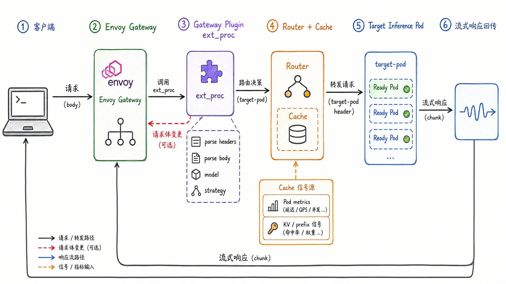
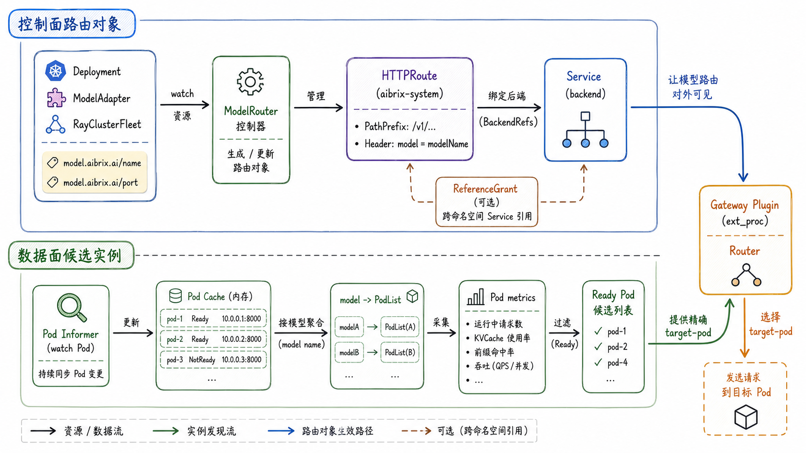
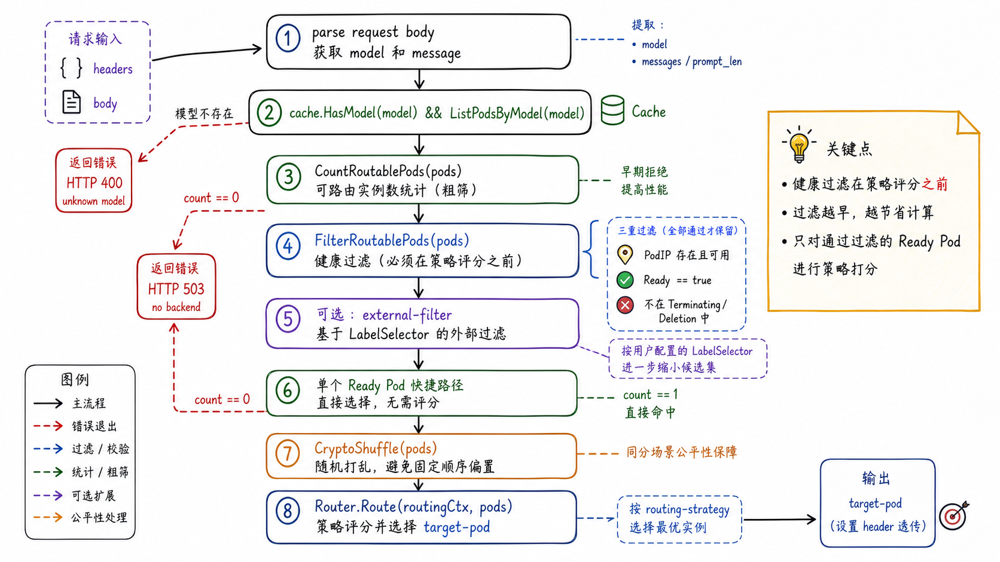
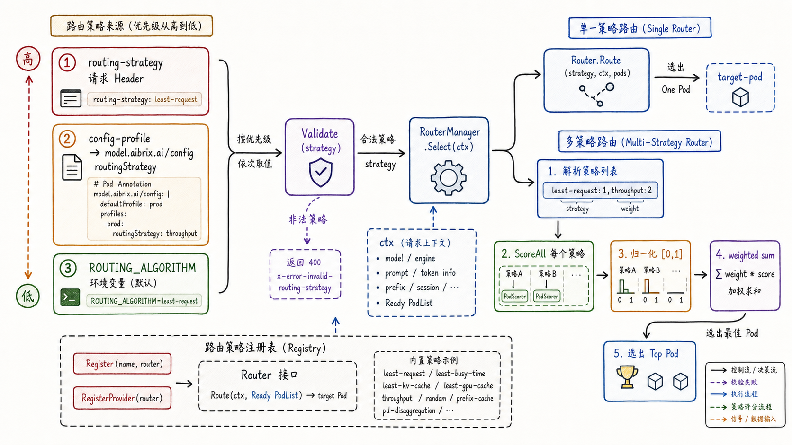
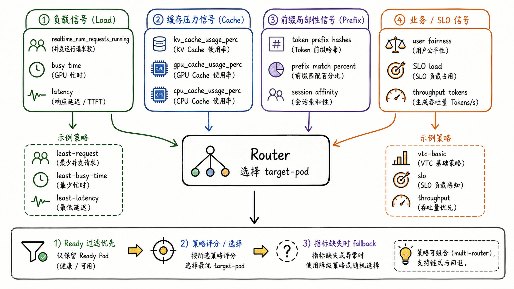
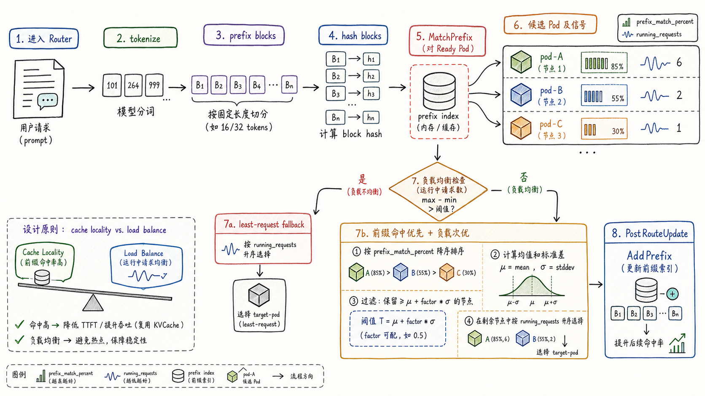
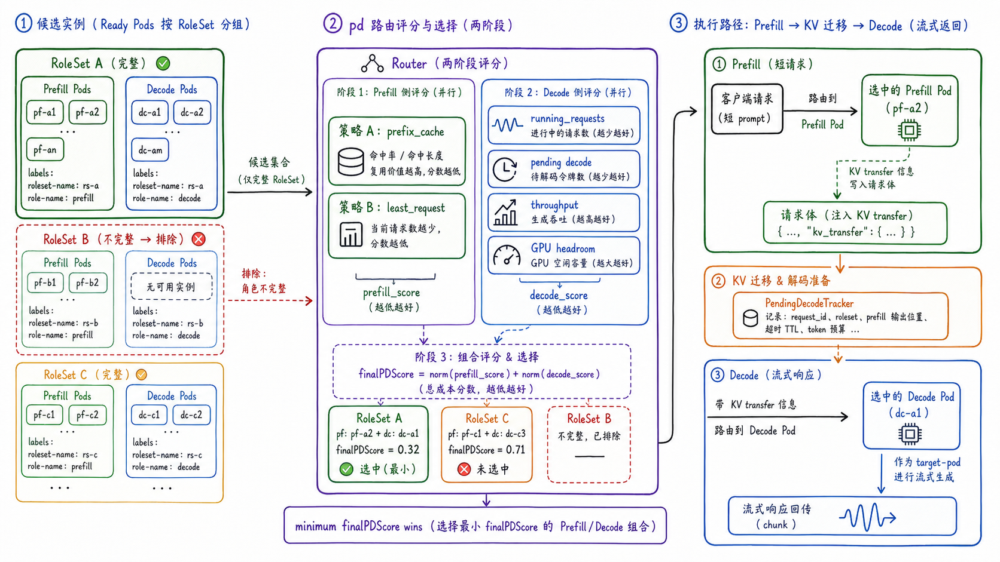

---
tags:
  - MaaS
  - AIBrix
  - LLMServing
  - Kubernetes
  - Gateway
  - 路由
updated: 2026-06-01
description: "本文解释 AIBrix 的路由系统，重点梳理一次推理请求如何经过 Envoy Gateway、Gateway Plugin、候选实例过滤和策略算法，最终被路由到合适的模型实例。"
---

# 07. 路由系统

## 1. 路由为什么是AIBrix的数据面中枢

前两章已经分别讨论了弹性与 KVCache。弹性解决的是“哪些后端应该存在、何时扩缩、何时摘流”的问题；KVCache 解决的是“请求成本和缓存状态如何被平台感知”的问题。进入第七章后，这些能力终于汇合到一个更直接的问题上：一次用户请求进入 AIBrix 之后，平台到底怎样决定把它发给哪个模型实例。

这就是 AIBrix 路由系统的核心职责。它不只是把 HTTP 请求转发给一个 Kubernetes `Service`，而是在模型名、请求路径、请求体、后端 Ready 状态、运行中请求数、延迟、吞吐、KVCache 占用、prefix 命中、P/D 角色、用户公平性和 SLO 等多类信号之间做选择。

普通 Web 服务的负载均衡通常可以先近似成“把请求均匀发给健康实例”。LLM Serving 的路由要复杂得多：

- 同一个模型的不同 Pod 可能持有不同 prefix cache，命中会改变 prefill 成本；
- 同样是 Ready Pod，一个 Pod 可能正在处理长输出请求，另一个 Pod 可能只是短请求排队；
- 新扩容出来的 Pod 请求数低，但本地缓存冷，未必适合所有长上下文流量；
- P/D 分离部署中，一次请求可能要先选 prefill pod，再选 decode pod，而不是只选一个普通副本；
- 多模型网关还要保证请求体中的 `model`、HTTPRoute、Service、Pod label 和策略配置彼此一致；

截至 2026-06-01，本文核对的本地 AIBrix `main` 分支 HEAD 为 `a1663b40b86b027829ef4bf0c56f88c9ad43c8b6`。本文重点解释 AIBrix 平台视角下的请求路由，不展开 Envoy Gateway 自身的完整 xDS 机制，也不把章节写成每个策略的源码逐行注释。读者只需要抓住一个主线：**AIBrix Router 的价值，是在 Ready 后端集合中做一次带 LLM Serving 语义的目标选择**。



图 1 展示了 AIBrix 路由的热路径。客户端请求先进入 `Envoy Gateway`，Envoy 通过 external processing hook 调用 `Gateway Plugin`。Gateway Plugin 解析 header 和 body，得到 `model`、`message`、`stream`、`routing-strategy`、`config-profile` 等上下文。随后 Router 从本地 Cache 中读取模型对应的 Pod 列表和指标，选出目标实例，并把 `target-pod` 等 header 写回 Envoy。最终，Envoy 将请求转发到目标推理 Pod，流式响应再沿原路径返回客户端。

这里有一个重要边界：`Envoy Gateway` 是流量入口和转发执行者，`Gateway Plugin` 才是 AIBrix 路由判断发生的地方。Router 不是单独暴露给用户的 HTTP 服务，而是嵌在 Gateway Plugin 的 ext_proc 处理链路中。

## 2. 路由对象与候选实例是两条线

理解 AIBrix 路由时，最容易混淆的是两类“路由”：

| 层次 | 主要对象 | 作用 | 容易误解 |
| --- | --- | --- | --- |
| Kubernetes 路由对象 | `Gateway`、`HTTPRoute`、`Service`、`ReferenceGrant` | 让 Envoy Gateway 知道某个模型服务的外部访问路径和后端 Service | 以为 HTTPRoute 已经决定了精确 Pod |
| AIBrix 策略路由 | `Gateway Plugin`、`Router`、`RoutingContext`、`PodList`、Cache | 在模型对应的 Ready Pod 集合里选择目标实例 | 以为 Router 可以绕过 Kubernetes 对象和健康状态 |

第一条线是控制面路由对象。AIBrix 的 `ModelRouter` controller 会观察带有 `model.aibrix.ai/name` 和 `model.aibrix.ai/port` 等标签的 `Deployment`、`ModelAdapter`、`RayClusterFleet` 以及可选 workload。当这些对象出现时，controller 会创建对应的 `HTTPRoute`。这个 `HTTPRoute` 通常挂到 `aibrix-system` namespace 下的 `aibrix-eg` Gateway，并把固定 API path prefix，例如 `/v1/chat/completions`、`/v1/completions`、`/v1/embeddings`，与 `model` header 的 exact match 组合起来，指向模型对应的 `Service`。

第二条线是数据面候选实例。Gateway Plugin 内部的 Cache 维护模型到 Pod 的映射，并记录 Pod 指标、模型指标和实时请求状态。真正执行策略路由时，Router 不是从 `HTTPRoute` 里挑 Pod，而是从 Cache 里拿到 `ListPodsByModel(model)` 的结果，再经过 Ready 过滤和策略评分，得到最终 `target-pod`。



图 2 可以帮助区分这两条线。上半部分说明模型 workload 如何驱动 `ModelRouter` 创建 `HTTPRoute`、`Service` 引用和跨 namespace 的 `ReferenceGrant`。下半部分说明 Gateway Plugin 如何维护 `model -> PodList`、Pod metrics 和 Ready candidates。一次请求能被 Envoy 接住，需要上半部分存在；一次请求能被智能地发给某个实例，需要下半部分提供足够新鲜的候选 Pod 和指标。

因此，排查路由问题时也要分层。`HTTPRoute` 未 accepted，通常是 Gateway API 对象、Service 引用或 ReferenceGrant 的问题；`target-pod` 为空或策略失败，通常要看 Gateway Plugin 的 body 解析、模型缓存、Ready Pod 过滤、策略名称、指标缺失或 Router fallback。

## 3. 请求热路径如何形成RoutingContext

AIBrix Gateway Plugin 的请求处理可以分成两个阶段：先处理 headers，再处理 body。

`HandleRequestHeaders` 会从请求头中提取几类信息：

- `user`：用于用户级限流和公平性相关策略；
- `:path`：用于区分 `/v1/chat/completions`、`/v1/completions`、`/v1/embeddings` 等路径；
- `routing-strategy`：用于单请求覆盖路由策略；
- `config-profile`：用于选择模型 annotation 中的 profile；
- `external-filter`：用于在策略路由前按 Kubernetes label selector 缩小候选 Pod；
- `x-session-id`：用于 `session-affinity` 策略；

这些信息会进入 `RoutingContext`。`RoutingContext` 是一次路由决策的上下文对象，它不仅保存 `Model`、`Message`、`Algorithm`、`ReqHeaders`、`ReqBody`、`RequestID`，还会在路由完成后保存目标 Pod、目标端口、路由耗时、P/D prefill 时间、响应 header 和请求统计状态。

真正决定能否路由的是 `HandleRequestBody`。它会根据请求路径解析 body：

- chat completions 与 messages 路径会抽取 `model` 和所有 message content；
- completions 路径会抽取 `model` 和 `prompt`；
- embeddings、rerank、classify、audio、image/video generation 等路径有各自的轻量解析规则；
- 如果请求体非法、缺少模型、stream 参数不符合约束，Gateway Plugin 会提前返回 OpenAI-compatible error；

拿到 `model` 之后，Gateway Plugin 会调用 `validateModelAvailability`。这一步很关键：策略路由不是在任意 Pod 上打分，而是先确认模型存在，并且至少有可路由 Pod。代码路径可以概括为：

1. `cache.HasModel(model)` 检查模型是否已进入 Gateway Plugin 的模型缓存；
2. `cache.ListPodsByModel(model)` 取出该模型关联的 Pod 列表；
3. `utils.CountRoutablePods(pods)` 确认至少有一个 Pod 通过基础可路由条件；
4. 如果模型不存在，返回 `400` 和 `model_not_found` 语义；
5. 如果模型存在但没有可用后端，返回 `503` 和 no model backend 语义；

只有通过这一步，后续策略才有意义。否则所谓 “least request” 或 “prefix cache hit” 都只是空中楼阁，因为候选集合本身不存在。

## 4. Ready Pod过滤是所有策略的地板

第 05 章已经讨论过弹性机制中的健康摘流。到了路由热路径，这个能力落在 `selectTargetPod` 里。Router 在拿到 `PodList` 之后，会先调用 `FilterRoutablePods`，只保留满足以下条件的 Pod：

- `pod.Status.PodIP` 非空；
- Pod 没有处于 terminating 状态；
- Pod 的 `Ready` condition 为 true；

之后，如果请求带了 `external-filter`，Gateway Plugin 会用 Kubernetes label selector 语法继续过滤候选 Pod。例如 `environment=production,tier=frontend` 会把候选集合缩小到同时满足这些 label 的 Pod。这个过滤发生在策略评分之前，因此它不是“给某个策略加权”，而是直接改变策略能看到的候选集合。



图 3 展示了这个管线。注意其中的顺序：先确认模型和 Pod 存在，再过滤 Ready，再执行策略。如果过滤后只剩一个 Pod，且它不是多端口 DP pod，Gateway Plugin 可以直接把它设为目标，不再走复杂策略。若候选列表为空，请求会失败，而不是让策略随便挑一个非 Ready Pod。

过滤后，AIBrix 还会对候选 Pod 做一次 `CryptoShuffle`。这不是为了“随机路由”，而是为了避免多个 Pod 分数相同或策略 tie-break 时总是偏向原始列表中的第一个 Pod。很多策略在分数相同的情况下会选候选列表前面的 Pod；先 shuffle 可以降低稳定排序带来的局部热点。

因此，AIBrix 路由的第一条工程判断是：**健康条件优先于策略偏好**。一个 Pod 即使命中 prefix，也不能绕过 Ready 过滤；一个 Pod 即使当前请求数最低，如果正在删除或没有 PodIP，也不能成为新的目标。

## 5. 策略如何被解析和执行

AIBrix 的路由策略可以来自三个地方，优先级从高到低是：

1. 请求头中的 `routing-strategy`；
2. 模型 annotation `model.aibrix.ai/config` 解析出的 `config-profile` 和 `routingStrategy`；
3. Gateway Plugin 环境变量 `ROUTING_ALGORITHM`；

这三层对应了不同的使用场景。`routing-strategy` 适合调试或单次实验；`config-profile` 适合为同一个模型配置默认策略、批处理策略、低延迟策略或 P/D 策略；`ROUTING_ALGORITHM` 适合给整个 Gateway Plugin 设置默认策略。生产环境更推荐显式配置，而不是依赖调用方临时传 header。

策略名解析后，会经过 `routing.Validate(strategy)`。如果策略不存在，Gateway Plugin 会返回 `400 Bad Request`，而不是静默回退到随机策略。这个行为很重要，因为策略名拼错时静默降级会让线上表现变得不可解释。

策略执行由 `Router` interface 抽象：

```go
type Router interface {
    Route(ctx *RoutingContext, readyPodList PodList) (string, error)
}
```

从这个接口可以看出两点。第一，Router 输入的是已经过滤过的 `readyPodList`，不是原始 Pod 列表。第二，Router 返回的是目标地址，但实际目标 Pod 也会写入 `RoutingContext`，后续请求计数、响应处理、日志和指标都依赖这个上下文。



图 4 还展示了 AIBrix 新一些的 multi-strategy 路径。策略字符串可以写成类似 `least-request:1,throughput:2` 的形式。RouterManager 会解析每个策略及其整数权重，并要求参与组合的策略实现 `PodScorer`：

```go
type PodScorer interface {
    ScoreAll(ctx *RoutingContext, readyPodList PodList) (scores []float64, scored []bool, err error)
    Polarity() Polarity
}
```

multi-strategy 的核心不是先硬过滤再硬选择，而是做 batch soft scoring：

1. 每个策略对所有 Ready Pod 输出一组 raw score；
2. 按策略 polarity 把分数归一化到 `[0, 1]`；
3. 按配置权重求加权和；
4. 选择总分最高的 Pod；

这里有一个细节：对于单个策略，很多实现是 “lower is better”，例如 `least-request` 的 raw score 越低越好；进入 multi-strategy 后，会先根据 polarity 把它转成越高越好的 normalized score。因此读源码时不要把单策略的 raw score 语义和 multi-strategy 的 final score 语义混在一起。

另外，`pd` 和 `slo*` 被视为 exclusive 策略。解析 multi-strategy 字符串时，如果出现 `pd` 或以 `slo` 开头的策略，会忽略其他策略，只保留这个专用策略。这符合它们的语义：P/D 和 SLO 路径本身包含专门的调度流程，不能简单当成普通 scalar scorer 叠加。

## 6. 策略信号分成四类

AIBrix 内置策略很多，但可以按信号来源归为四类。

第一类是负载信号。`least-request` 读取 `RealtimeNumRequestsRunning`，倾向选择当前运行请求数最少的 Pod；`least-busy-time` 使用 GPU busy time ratio；`least-latency` 根据 queue、prefill、decode 和平均 token 等指标估算延迟；`throughput` 使用 prompt/generation token 相关指标，倾向选择历史处理 token 加权量更低的 Pod。

第二类是缓存压力信号。`least-kv-cache` 会读取模型维度的 `KVCacheUsagePerc` 与 `CPUCacheUsagePerc`，选择总缓存占用更低的 Pod；`least-gpu-cache` 会读取 `GPUCacheUsagePerc`，选择 GPU cache 使用率更低的 Pod。这类策略关注的是“这个 Pod 还有多少缓存/显存空间承接新请求”，而不是“它是否已经有我需要的 prefix”。

第三类是缓存亲和信号。`prefix-cache` 会把请求文本 token 化并切成 prefix blocks，用 hash 查询 prefix index，优先选择已经持有相同前缀的 Pod，同时用 running requests 避免热点；`prefix-cache-preble` 则进一步考虑 prefix cache 与负载，借鉴 Preble 思路做更细的 prompt scheduling；`session-affinity` 通过 `x-session-id` 把后续请求尽量路由回同一个 Pod。

第四类是业务与 SLO 信号。`vtc-basic` 会结合用户 token fairness 与 Pod utilization；`slo` 系列策略围绕 SLO-aware load 做选择；P/D 策略会在 prefill 与 decode 角色之间做成对选择。



图 5 的重点不是背策略名，而是建立一张“信号地图”。当请求没有共享前缀时，`least-request` 可能比 `prefix-cache` 更直接；当多轮对话或系统 prompt 重复度很高时，`prefix-cache` 会比单纯请求数更懂成本；当 GPU cache 使用率已经接近危险区时，继续追求 prefix 命中可能反而让尾延迟恶化；当用户间公平性成为目标时，只看 Pod 负载又会忽略租户层面的 token 使用差异。

这也是 AIBrix Router 比普通 LB 更像调度器的地方：它不是只问“谁闲”，而是问“这类请求在当前系统状态下发给谁更划算”。

## 7. Prefix-cache路由如何平衡命中和负载

第 06 章已经解释过 KVCache 为什么会成为平台级信号。这里从 Router 视角再看 `prefix-cache`。

`prefix-cache` 路由的核心流程是：

1. 从 `RoutingContext.Message` 中取得请求文本；
2. 使用 tokenizer 将文本转换成 token 序列；
3. 按固定 block size 切成 prefix blocks；
4. 为每个 block 计算 hash；
5. 在 prefix index 中查询哪些 Ready Pod 命中了这些 hash；
6. 计算每个 Pod 的 `prefix_match_percent`；
7. 同时读取各 Pod 的 running requests；
8. 在命中率和负载之间做选择；

如果集群负载严重不均，例如最大运行请求数与最小运行请求数之差超过阈值，`prefix-cache` 会直接回退到 least-loaded 逻辑。这是一个很有生产味道的设计：缓存命中很重要，但不能让一个“热 Pod”因为命中最多而不断吸入更多流量。

如果负载没有严重失衡，Router 会优先按 `prefix_match_percent` 降序排序，再用 running requests 做次级排序。随后它会检查候选 Pod 是否落在均值与标准差阈值范围内，避免把请求发给过载的高命中 Pod。如果没有合适命中目标，最终会 fallback 到全局 least-loaded Pod。



图 6 中的跷跷板就是这类策略的核心：cache locality 降低 prefill 重算，load balance 保证稳定性。两者不是互斥目标，而是同一条路由决策中的两种约束。

`prefix-cache` 还有一个容易忽略的后置动作：路由完成后，Router 会把本次请求的 prefix hash 写回索引。这样后续请求才能知道这个 Pod 可能持有对应 prefix。启用 KV event sync 时，索引也可以更接近真实引擎状态，但它依赖 tokenizer、KV events 和远端同步配置保持一致。否则，Router 看见的索引可能只是近似视图。

因此，使用 `prefix-cache` 时要特别关注三个问题：

- tokenizer 是否与真实引擎 tokenizer 足够一致；
- block size 与 workload 的前缀重复长度是否匹配；
- 命中率提升是否真的抵消了负载热点和指标同步成本；

## 8. P/D路由选择的是一对角色

`pd` 策略是 AIBrix 路由系统里最不像普通负载均衡的策略。普通策略在一组同构 Ready Pod 中选一个目标；P/D 策略要把一次推理拆成 prefill 与 decode 两个阶段，并为请求选择一对合适的角色 Pod。

P/D 路由首先要识别角色。Pod 会通过类似 `roleset-name`、`role-name`、`model.aibrix.ai/engine` 等 label 表达它属于哪个 RoleSet、承担 prefill 还是 decode，以及使用哪个推理引擎。Router 会把 Pod 按 RoleSet 分组，只保留同时具备 prefill 和 decode 可用实例的完整 RoleSet。不完整的组会被排除，因为它不能独立完成一条 P/D 请求链路。

随后，Router 分别给 prefill 侧和 decode 侧评分：

- prefill 侧可以使用 `prefix_cache` 或 `least_request`，默认更关注 prefix cache 命中与 prefill 请求数；
- decode 侧默认使用 `load_balancing`，结合 running requests、pending decode、generation throughput 和 GPU headroom；
- `PendingDecodeTracker` 会把“已经选中 decode pod 但真实 decode 请求尚未开始”的并发窗口计入考虑，避免大量请求在 prefill 阶段同时挤向同一个 decode pod；
- 最终 `finalPDScore` 会组合归一化后的 prefill score 与 decode score，选择成本分数最低的完整 RoleSet 与 Pod pair；



图 7 显示了 P/D 的三层逻辑。左侧是候选集合：只有完整 RoleSet 进入评分。中间是评分：prefill 侧偏 prefix cache 或最少请求，decode 侧偏运行负载、吞吐和 GPU headroom。右侧是执行：Gateway 会先对 prefill pod 发起短 prefill 请求，并根据引擎类型更新请求体中的 KV transfer 信息，最后把 decode pod 设为真正的 `target-pod` 来承接流式生成。

不同引擎的 P/D 请求改写细节不完全相同。例如 vLLM 的某些路径会通过 `kv_transfer_params` 或 `disagg_prefill_resp` 把 prefill 结果传给 decode；SGLang 会使用 bootstrap host、port 和 room；TensorRT-LLM 会使用 `disaggregated_params` 与 `disagg_request_id`。这些差异说明 P/D 路由已经不是单纯的负载均衡，而是路由、请求改写、阶段协调和 KV transfer 的组合。

因此，P/D 的排查也要比普通策略更分层：

- 角色 label 是否正确，RoleSet 是否完整；
- prefill 与 decode pod 是否都通过 Ready 过滤；
- engine 类型是否一致，P/D router 是否能识别；
- prefill HTTP 请求是否成功；
- KV transfer 参数是否被正确写入 decode 请求；
- pending decode 是否造成局部堆积；

## 9. 多副本Gateway为什么需要共享状态

在生产部署中，Gateway Plugin 和 Envoy Proxy 通常都可能有多个副本。多副本可以提升入口吞吐与可用性，但也带来一个状态一致性问题：路由策略需要的实时请求数、prefix index、rate limit counters、session affinity 等信息，如果只存在单个 Gateway Plugin 进程内，就会出现不同入口副本看到不同世界的情况。

AIBrix 的生产网关文档明确建议：当 Gateway Plugin 多副本运行时，需要 Redis 作为共享状态。代码中也存在 gateway pod snapshot 同步逻辑：每个 Gateway Plugin 实例可以把自己观察到的 per-pod running requests、completed requests 等快照写入 Redis，并周期性扫描 `aibrix:pod:*` keys，把其他 Gateway 的快照读回内存。这样，消费者读取时可以避免在热路径直接访问 Redis。

这类状态同步要解决的是“多入口副本一致地做策略判断”。如果没有共享状态，`least-request` 可能只知道当前 Gateway 副本转发出去的请求；`prefix-cache` 可能只知道当前进程路由后更新过的 prefix；rate limit 和 session affinity 也可能在不同入口之间表现不一致。

但共享状态不是免费午餐。Redis 同步周期、TTL、pipeline 批量大小、键数量和网络延迟都会影响新鲜度。路由系统要在“热路径低延迟”和“跨副本状态一致”之间折中。AIBrix 的设计倾向于本地读缓存、后台同步状态，而不是每次请求都同步查询所有后端和 Redis。

可以把生产网关的状态分成三类：

| 状态类型 | 典型例子 | 一致性要求 | 失效影响 |
| --- | --- | --- | --- |
| 强配置状态 | `HTTPRoute`、Gateway、Service、model labels | 必须和 Kubernetes 对象一致 | 模型路由不可达或后端引用错误 |
| 近实时调度状态 | running requests、pending load、prefix index、GPU/KV cache metrics | 越新越好，但通常允许短暂滞后 | 路由质量下降、热点或 cache miss 增加 |
| 请求内上下文 | `RoutingContext`、target pod、prefill/decode timing、response headers | 单请求内必须一致 | 统计错误、响应处理失败或请求中断 |

这个分类能帮助判断故障严重性。`HTTPRoute` 错误会让请求根本进不来；running request 滞后通常表现为局部热点；`RoutingContext` 处理错误则可能导致某个请求没有正确计数或没有正确结束。

## 10. 生产排查的阅读顺序

遇到 AIBrix 路由问题时，建议按以下顺序排查，而不是一开始就钻进某个算法文件。

第一，确认请求是否进入正确的 Gateway。检查 GatewayClass、Gateway、EnvoyPatchPolicy、EnvoyExtensionPolicy 和相关 `HTTPRoute` 的 conditions 是否 accepted。若 `HTTPRoute` 未 accepted，优先看 ModelRouter、Service backend、ReferenceGrant 和 path/header match。

第二，确认请求体中的 `model` 与模型标签一致。AIBrix 的动态路由依赖请求体 `model` 与 `model.aibrix.ai/name` 对齐。模型名错了，Gateway Plugin 会在 `cache.HasModel` 或 `ListPodsByModel` 处失败。

第三，确认候选 Pod 是否可路由。`kubectl get pod` 看到 Running 不够，还要看 PodIP、Ready condition、DeletionTimestamp，以及是否被 `external-filter` 过滤掉。没有 Ready backend 时，策略算法不会救场。

第四，确认策略名和来源。按 `routing-strategy` header、`config-profile`、`model.aibrix.ai/config`、`ROUTING_ALGORITHM` 的顺序找最终策略。策略名拼错会导致 400，而不是默默 fallback。

第五，确认策略依赖的指标是否存在。`least-request` 依赖 realtime running request；`least-kv-cache` 依赖 KV/CPU cache usage；`least-gpu-cache` 依赖 GPU cache usage；`least-latency` 和 P/D decode scoring 需要更丰富的模型指标。指标缺失时，不同策略可能 fallback，也可能降低候选得分。

第六，确认请求结束统计是否正常。Gateway Plugin 会在 routing 后调用 `AddRequestCount`，响应结束或错误路径上调用 `DoneRequestCount` 或 `DoneRequestTrace`。如果请求计数只增不减，后续路由会误以为某些 Pod 长期繁忙。

第七，确认多副本状态同步。多 Gateway Plugin 副本时，检查 Redis、state sync、gateway snapshot TTL 和 prefix index 同步是否工作。否则不同入口副本可能做出互相矛盾的选择。

## 11. 本章小结

AIBrix 的路由系统可以概括为三句话。

第一，AIBrix 路由不是单层机制。`HTTPRoute` 让模型服务对 Envoy Gateway 可见，Gateway Plugin 的 Cache 提供模型到 Pod 的候选集合，Router 在 Ready Pod 集合里执行策略选择。

第二，策略路由必须建立在健康过滤之上。PodIP、Ready、非 terminating、模型存在性和可选 `external-filter` 都发生在策略评分之前。没有健康候选，缓存命中、最低请求数和最高吞吐都没有意义。

第三，LLM Serving 的路由目标不是“永远平均”，也不是“永远命中缓存”。AIBrix 的策略体系把负载、缓存压力、prefix 亲和、用户公平性、SLO 和 P/D 角色组合起来，最终目标是在当前 workload 下选择成本更低、风险更小、延迟更可控的实例。

下一章进入扩展能力与特殊架构时，可以把本章作为数据面主线：很多扩展能力最终都会反映到路由对象、候选实例、策略信号或请求改写上。

## 12. 参考资料

1. [AIBrix Documentation：AIBrix Router](https://aibrix.readthedocs.io/latest/designs/aibrix-router.html)；
2. [AIBrix Documentation：Gateway Routing](https://aibrix.readthedocs.io/latest/features/gateway-plugins.html)；
3. [AIBrix Documentation：Deploying Gateway](https://aibrix.readthedocs.io/latest/production/gateway.html)；
4. [GitHub：vllm-project/aibrix ModelRouter controller](https://github.com/vllm-project/aibrix/blob/a1663b40b86b027829ef4bf0c56f88c9ad43c8b6/pkg/controller/modelrouter/modelrouter_controller.go)；
5. [GitHub：vllm-project/aibrix Gateway request headers](https://github.com/vllm-project/aibrix/blob/a1663b40b86b027829ef4bf0c56f88c9ad43c8b6/pkg/plugins/gateway/gateway_req_headers.go)；
6. [GitHub：vllm-project/aibrix Gateway request body](https://github.com/vllm-project/aibrix/blob/a1663b40b86b027829ef4bf0c56f88c9ad43c8b6/pkg/plugins/gateway/gateway_req_body.go)；
7. [GitHub：vllm-project/aibrix Gateway selectTargetPod](https://github.com/vllm-project/aibrix/blob/a1663b40b86b027829ef4bf0c56f88c9ad43c8b6/pkg/plugins/gateway/gateway.go)；
8. [GitHub：vllm-project/aibrix routing context](https://github.com/vllm-project/aibrix/blob/a1663b40b86b027829ef4bf0c56f88c9ad43c8b6/pkg/types/router_context.go)；
9. [GitHub：vllm-project/aibrix router interface](https://github.com/vllm-project/aibrix/blob/a1663b40b86b027829ef4bf0c56f88c9ad43c8b6/pkg/types/router.go)；
10. [GitHub：vllm-project/aibrix router manager and multi-strategy routing](https://github.com/vllm-project/aibrix/blob/a1663b40b86b027829ef4bf0c56f88c9ad43c8b6/pkg/plugins/gateway/algorithms/router.go)；
11. [GitHub：vllm-project/aibrix prefix-cache routing note](https://github.com/vllm-project/aibrix/blob/a1663b40b86b027829ef4bf0c56f88c9ad43c8b6/pkg/plugins/gateway/algorithms/prefix_cache_readme.md)；
12. [GitHub：vllm-project/aibrix prefix-cache router](https://github.com/vllm-project/aibrix/blob/a1663b40b86b027829ef4bf0c56f88c9ad43c8b6/pkg/plugins/gateway/algorithms/prefix_cache.go)；
13. [GitHub：vllm-project/aibrix least-request router](https://github.com/vllm-project/aibrix/blob/a1663b40b86b027829ef4bf0c56f88c9ad43c8b6/pkg/plugins/gateway/algorithms/least_request.go)；
14. [GitHub：vllm-project/aibrix least KV cache router](https://github.com/vllm-project/aibrix/blob/a1663b40b86b027829ef4bf0c56f88c9ad43c8b6/pkg/plugins/gateway/algorithms/least_kv_cache.go)；
15. [GitHub：vllm-project/aibrix PD disaggregation router note](https://github.com/vllm-project/aibrix/blob/a1663b40b86b027829ef4bf0c56f88c9ad43c8b6/pkg/plugins/gateway/algorithms/pd_readme.md)；
16. [GitHub：vllm-project/aibrix PD disaggregation router](https://github.com/vllm-project/aibrix/blob/a1663b40b86b027829ef4bf0c56f88c9ad43c8b6/pkg/plugins/gateway/algorithms/pd_disaggregation.go)；
17. [GitHub：vllm-project/aibrix config profiles](https://github.com/vllm-project/aibrix/blob/a1663b40b86b027829ef4bf0c56f88c9ad43c8b6/pkg/plugins/gateway/configprofiles/configprofiles.go)；
18. [GitHub：vllm-project/aibrix cache implementation](https://github.com/vllm-project/aibrix/blob/a1663b40b86b027829ef4bf0c56f88c9ad43c8b6/pkg/cache/cache_impl.go)；
19. [GitHub：vllm-project/aibrix gateway snapshot sync](https://github.com/vllm-project/aibrix/blob/a1663b40b86b027829ef4bf0c56f88c9ad43c8b6/pkg/cache/cache_gateway_snapshot.go)；
20. [GitHub：vllm-project/aibrix Gateway environment variables](https://github.com/vllm-project/aibrix/blob/a1663b40b86b027829ef4bf0c56f88c9ad43c8b6/pkg/plugins/gateway/ENV_VARS.md)。

## 13. 学习测评

### 13.1 题目

1. 单选：AIBrix 路由系统为什么不能只理解成 Kubernetes Service 负载均衡？
   - A. 因为它还会根据 Ready 状态、策略配置、实时负载、KVCache、prefix 命中和 P/D 角色选择具体目标；
   - B. 因为 Kubernetes Service 不能转发 HTTP 请求；
   - C. 因为 Envoy Gateway 不支持 HTTPRoute；
   - D. 因为所有 LLM 请求成本完全相同；

2. 多选：关于 `HTTPRoute` 与 Gateway Plugin 内部 Router 的关系，哪些说法更准确？
   - A. `HTTPRoute` 让模型服务对 Envoy Gateway 可见；
   - B. Gateway Plugin 的 Router 会在模型对应的 Ready Pod 集合中选择目标实例；
   - C. `HTTPRoute` 本身就记录每次请求的最终 `target-pod`；
   - D. 如果模型跨 namespace 指向 Service，可能需要 `ReferenceGrant`；

3. 单选：`HandleRequestHeaders` 主要为路由提取哪类信息？
   - A. `:path`、`user`、`routing-strategy`、`config-profile`、`external-filter` 等请求头上下文；
   - B. 模型权重文件；
   - C. GPU kernel 的执行 trace；
   - D. Kubernetes scheduler 的调度队列；

4. 多选：`validateModelAvailability` 会检查哪些关键条件？
   - A. 模型是否存在于 cache；
   - B. 是否能通过 `ListPodsByModel` 拿到模型对应 Pod；
   - C. 是否至少存在一个可路由 Pod；
   - D. 是否已经完成 PagedAttention kernel 编译；

5. 单选：AIBrix 中一个 Pod 被视为 routable 的基础条件更接近哪一项？
   - A. 有 PodIP、没有 terminating、Ready condition 为 true；
   - B. 只要 Kubernetes phase 是 Pending；
   - C. 只要 GPU 型号足够好；
   - D. 只要 prefix cache 命中最高；

6. 多选：`external-filter` 的作用是什么？
   - A. 使用 Kubernetes label selector 语法缩小候选 Pod 集合；
   - B. 在策略评分之前过滤候选实例；
   - C. 改写模型输出 token；
   - D. 过滤后若没有 Ready Pod，请求可能失败；

7. 单选：AIBrix 路由策略来源的优先级是什么？
   - A. `routing-strategy` header > `config-profile` / `model.aibrix.ai/config` > `ROUTING_ALGORITHM`；
   - B. `ROUTING_ALGORITHM` > `routing-strategy` header > `config-profile`；
   - C. Kubernetes node label > GPU 型号 > 用户名；
   - D. `HTTPRoute` 名称字典序；

8. 多选：multi-strategy routing 中的 batch soft scoring 包含哪些步骤？
   - A. 每个策略通过 `ScoreAll` 对所有 Ready Pod 打 raw score；
   - B. 根据 polarity 将 raw score 归一化；
   - C. 按权重聚合 normalized score；
   - D. 直接跳过 Ready Pod 过滤；

9. 单选：为什么 `least-request` 和 `prefix-cache` 可能在同一时刻给出不同选择？
   - A. 前者主要看当前运行请求数，后者还会考虑请求 prefix 是否可能在某个 Pod 上命中；
   - B. 前者只用于训练，后者只用于删除 Pod；
   - C. 二者读取完全相同的唯一指标；
   - D. 二者都不需要模型名；

10. 多选：关于 `prefix-cache` 路由，哪些说法是合理的？
    - A. 它会将请求文本 token 化并计算 prefix block hash；
    - B. 它会用 prefix 命中率和 running requests 共同做选择；
    - C. 负载严重不均时可能 fallback 到 least-loaded 逻辑；
    - D. 它可以无视 tokenizer 一致性问题；

11. 单选：P/D 路由和普通同构副本路由最大的区别是什么？
    - A. P/D 需要为请求选择 Prefill/Decode 组合，并处理 prefill 请求、KV transfer 与 decode target；
    - B. P/D 只是在所有 Pod 中随机选择一个；
    - C. P/D 不需要 Ready Pod；
    - D. P/D 完全不读取请求体；

12. 多选：P/D decode 侧评分可能会考虑哪些信号？
    - A. running requests；
    - B. pending decode；
    - C. generation throughput；
    - D. GPU headroom；

13. 单选：为什么多 Gateway Plugin 副本可能需要 Redis 或类似共享状态？
    - A. 否则不同 Gateway 副本可能只看到本地请求计数、prefix 索引或限流状态，导致路由判断不一致；
    - B. 因为 Redis 会替代所有推理引擎；
    - C. 因为 Kubernetes 不能创建多个 Pod；
    - D. 因为 HTTPRoute 必须存放在 Redis 中；

14. 多选：排查 AIBrix 路由问题时，哪些顺序更合理？
    - A. 先看 Gateway / HTTPRoute conditions 是否 accepted；
    - B. 再确认请求体 `model` 与 `model.aibrix.ai/name` 是否一致；
    - C. 再看候选 Pod 是否 Ready 且未被 `external-filter` 排除；
    - D. 一开始就修改算法权重，忽略模型和 Ready 状态；

### 13.2 答案与解析

1. 答案：A。AIBrix Router 会在健康候选实例上结合 LLM Serving 语义做目标选择，而不是只依赖 Service 做普通转发。B、C、D 都与实际机制不符。

2. 答案：A、B、D。`HTTPRoute` 负责模型路由可见性和 Service backend 引用，Router 负责具体 target pod 选择。`HTTPRoute` 不记录每次请求的最终 Pod。

3. 答案：A。headers 阶段主要构造请求上下文，body 阶段再解析模型名、message、stream 等核心路由输入。

4. 答案：A、B、C。Gateway Plugin 会先确认模型存在、Pod 列表存在且至少有可路由 Pod。D 属于推理引擎内部实现，不是这一步的检查项。

5. 答案：A。AIBrix 的基础可路由条件包括 PodIP、非 terminating 和 Ready。缓存命中或 GPU 型号不能替代健康状态。

6. 答案：A、B、D。`external-filter` 用 label selector 缩小候选集合，发生在策略评分前。它不改写模型输出。

7. 答案：A。请求头优先，其次是模型 config profile，最后是 Gateway Plugin 的 `ROUTING_ALGORITHM` 环境变量。

8. 答案：A、B、C。multi-strategy 仍建立在 Ready Pod 集合上，不能跳过健康过滤。

9. 答案：A。`least-request` 偏当前负载，`prefix-cache` 还会看前缀命中可能性，并用负载阈值避免热点。

10. 答案：A、B、C。tokenizer 一致性非常重要，不能忽略；否则 prefix hash 与真实缓存状态可能不匹配。

11. 答案：A。P/D 路由选择的是阶段组合，并涉及请求体改写与 KV transfer，而不是普通单目标 Pod 选择。

12. 答案：A、B、C、D。decode 侧默认 load balancing 会组合运行请求、pending decode、吞吐和 GPU headroom 等信号。

13. 答案：A。多 Gateway Plugin 副本如果只保留进程内状态，会导致各副本看到的负载、prefix 和限流状态不一致。

14. 答案：A、B、C。路由排查应先确认入口对象、模型匹配和候选健康，再进入策略与指标细节。D 会把基础问题误判为算法问题。
