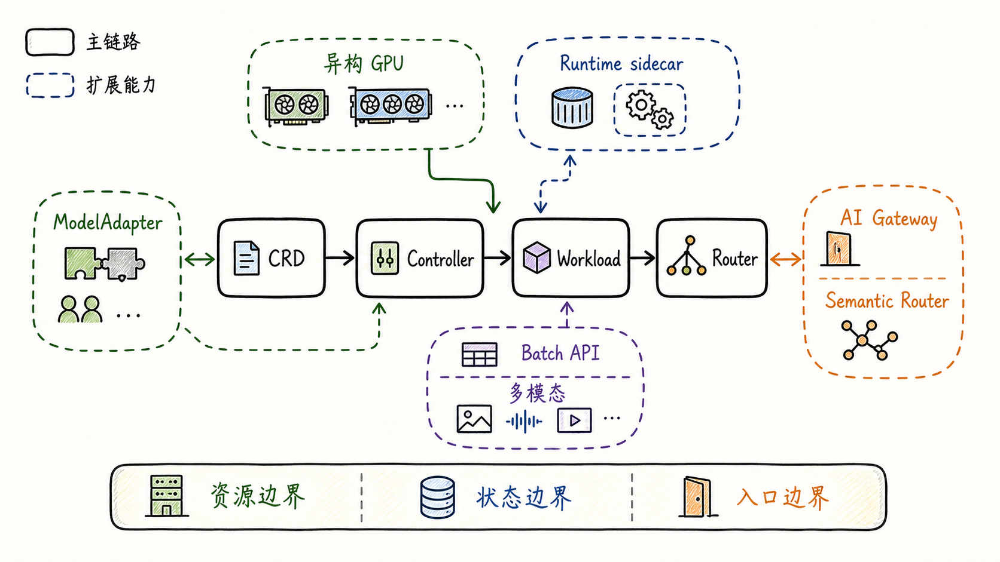
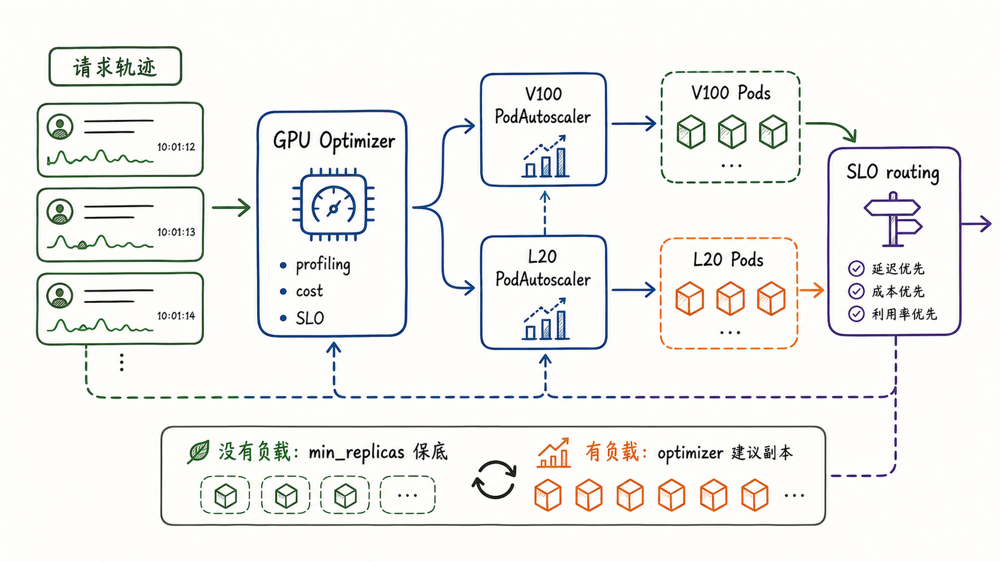
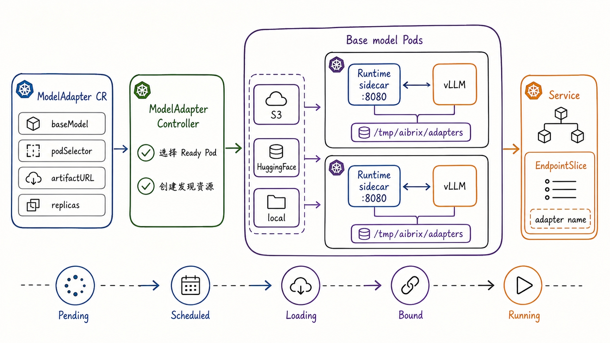
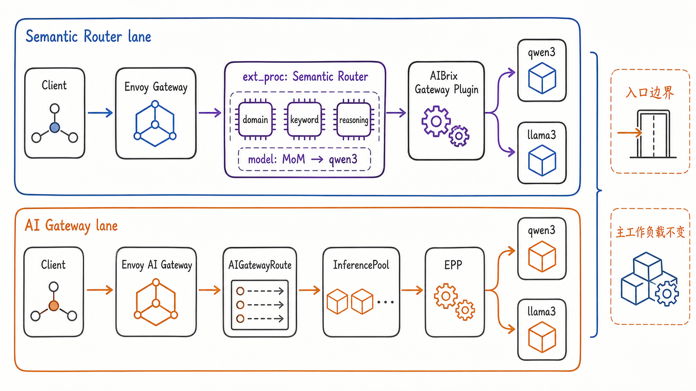
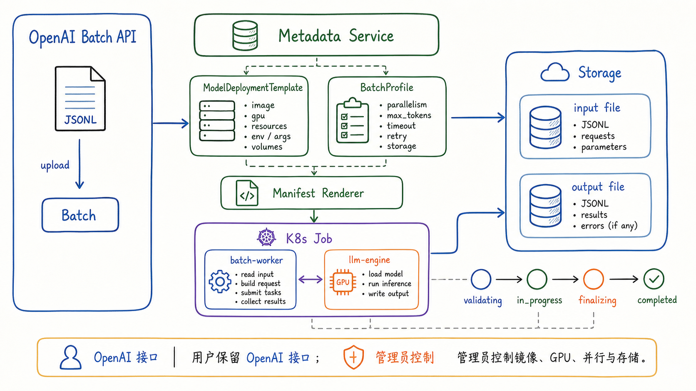

---
tags:
  - MaaS
  - AIBrix
  - LLMServing
  - Kubernetes
  - 扩展能力
  - 特殊架构
updated: 2026-06-01
description: "本文整理 AIBrix 主链路之外的扩展能力与特殊架构，重点说明异构 GPU、Runtime sidecar、ModelAdapter、网关集成、多模态与 Batch API 如何改变平台能力边界。"
---

# 08. 扩展能力与特殊架构

## 1. 为什么第八章不是杂项清单

前面七章已经把 AIBrix 的主链路基本串起来了：CRD 表达模型服务意图，控制器把意图落实为 Kubernetes 资源，推理工作负载承载模型运行，弹性系统维持容量与健康，KVCache 把缓存状态变成平台信号，Router 在 Ready 后端中选择目标实例。

进入第八章后，容易出现一个写作陷阱：把所有还没讲过的功能直接堆成“其他特性”。这样读者虽然能看到很多 feature 名称，却无法判断它们各自改变了 AIBrix 的哪一层边界。第八章真正要回答的问题是：**当 AIBrix 从普通在线文本推理扩展到异构资源、动态 LoRA、多引擎、多入口、多模态和异步批处理时，哪些能力仍然沿用主链路，哪些能力改变了主链路的接口、状态或执行方式**。

截至 2026-06-01，本文核对的本地 AIBrix `main` 分支 HEAD 为 `76f7d73fc9a2028819255f4d49d23fed8ac7e3db`。本文重点解释 AIBrix 平台视角下的扩展机制，不展开第 04 章已经讲过的 RayClusterFleet、StormService、P/D 分离细节，也不把第 09 章会讨论的可观测性、升级和长期运维作为主线。



图 1 给出了本章地图。中心仍然是 `CRD -> Controller -> Workload -> Router` 这条主链路。外围的能力可以按四类理解：

- 资源边界：异构 GPU 让同一个模型可以跨 GPU 类型部署，并让容量决策从单一副本数变成 GPU SKU、成本、SLO 与副本组合的共同选择；
- 状态边界：Runtime sidecar 与 ModelAdapter 让模型 artifact、LoRA adapter、metrics 与运行时 API 变成平台可操作的状态，而不是完全封闭在推理引擎内部；
- 入口边界：Semantic Router、Envoy AI Gateway、Gateway API Inference Extension 等能力改变请求进入 AIBrix 前后的语义处理位置；
- 执行模式：Batch API、多模态和图像/视频生成让 AIBrix 不再只面对同步 chat/completions 请求，而要处理文件、异步任务、不同 OpenAI-compatible endpoint 和不同引擎能力；

这些能力看起来分散，但它们都服务于同一个目标：让 AIBrix 从“能部署一个模型”扩展为“能在更多资源、更复杂请求和更多运行时形态下治理模型服务”。

## 2. 特性开关与控制器边界

理解扩展能力之前，先要理解 AIBrix 如何管理控制器边界。AIBrix 不是把所有控制器都硬编码成必须同时工作，而是通过 controller enablement 决定哪些控制循环参与当前集群。

在安装文档中，AIBrix 支持用 `--controllers` 参数显式控制控制器集合，例如：

```bash
--controllers=*,-distributed-inference-controller
--controllers=stormservice-controller,model-adapter-controller,pod-autoscaler-controller
```

从源码看，`pkg/features/features.go` 中的有效控制器包括：

| 控制器 | 主要职责 | 本系列中的位置 |
| --- | --- | --- |
| `pod-autoscaler-controller` | 处理 `PodAutoscaler`，参与容量弹性 | 第 05 章主讲 |
| `distributed-inference-controller` | Ray-based distributed inference，需要 KubeRay | 第 04 章主讲 |
| `model-adapter-controller` | 管理 LoRA `ModelAdapter` 生命周期 | 本章主讲 |
| `model-route-controller` | 创建模型路由相关对象 | 第 07 章主讲 |
| `kv-cache-controller` | 编排分布式 KV cache 服务 | 第 06 章主讲 |
| `stormservice-controller` | 编排多角色、多 PodSet、P/D 等复杂工作负载 | 第 04 章主讲 |

这说明 AIBrix 的扩展不是“每个 feature 都塞进一个超级控制器”。更合理的心智模型是：每一类平台能力都尽量落到一个清晰的控制边界中。能否关闭某个控制器，通常也反映了它是否是当前部署形态的必需能力。

例如，不使用 KubeRay 时可以跳过 `distributed-inference-controller`；只需要 LoRA adapter 管理时，可以单独部署 `model-adapter-controller`；不需要分布式 KV cache 时，可以不启用 `kv-cache-controller`。这种边界让 AIBrix 更像一个可组合的平台能力集合，而不是单一路径的模型服务脚手架。

这里也有一个工程提醒：**控制器开关不是业务策略开关**。它决定的是某类 Kubernetes API 对象是否被 reconcile，而不是某个请求要使用哪种路由策略，也不是某个模型要使用哪种 GPU。请求级策略、模型配置、运行时 sidecar 和具体 workload spec 仍然要在各自层次配置。

## 3. 异构 GPU：资源边界被平台化

传统模型部署通常默认同一组副本使用同一种 GPU。这个假设在生产环境里经常不成立：某些区域 H100 不够，A100 有余量；高峰期高端 GPU 应优先服务长上下文请求，低峰期可以用更低成本的 GPU 承接普通请求；同一个模型在不同 GPU 上的吞吐、延迟、成本和 KV cache 行为都不同。

AIBrix 的 Heterogeneous GPU Inference 试图把这种情况平台化。它解决的不是“如何给 Pod 写一个 nodeSelector”这么简单的问题，而是三个能力的组合：

1. 监控请求轨迹，观察过去一段时间的请求模式；
2. 用 profiling、成本和 SLO 约束计算不同 GPU 类型的目标容量；
3. 通过 autoscaling 与 routing 把容量建议和请求选择落到具体 GPU 组上；



图 2 展示了异构 GPU 的核心闭环。左侧是请求轨迹，`Gateway Plugin` 可以通过实验配置开启请求 tracing，例如设置 `AIBRIX_GPU_OPTIMIZER_TRACING_FLAG=true`。中间的 `GPU Optimizer` 依赖每种 GPU、每个模型的离线性能 profiling 数据，再结合成本和 SLO 目标生成配置建议。右侧每种 GPU 类型通常对应一组 Deployment 和一个 `PodAutoscaler`，最终由路由策略在不同 GPU 组之间选择目标。

这一设计有几个关键细节：

- 同一个模型可以由多个 Deployment 承载，每个 Deployment 通过相同的 `model.aibrix.ai/name` 暴露为同一个模型名；
- 每个 GPU 类型可以有独立的 `PodAutoscaler`，例如 V100 一组、L20 一组；
- GPU optimizer 的输出会作为 metric source 传给 `PodAutoscaler`，让最终伸缩仍然沿用 AIBrix 的弹性闭环；
- `model.aibrix.ai/min_replicas` 可以在无负载时保留最低 Ready 副本，避免所有 GPU 组都缩到 0 后产生冷启动不可用窗口；
- `PodAutoscaler.spec.minReplicas` 在 GPU optimizer 场景中应允许为 0，否则会干扰 optimizer 对某个 GPU 组缩到 0 的决策；

异构 GPU 也改变了路由问题。普通 `least-request` 在异构 GPU 中可能误判，因为“请求数少”不等于“能满足 SLO”。AIBrix 文档中引入 `slo` routing 策略，就是为了让请求选择考虑不同 GPU 类型对不同请求形态的预计表现。它的变体包括 `slo-pack-load`、`slo-least-load` 和默认的 `slo-least-load-pulling`。它们的共同目标不是平均分流，而是在 profiling 能解释的前提下把请求分到更可能满足延迟目标的 GPU。

因此，异构 GPU 的教程重点不应停留在 YAML 样例，而应理解为：**资源选择从 Kubernetes 调度层上升到 AIBrix 平台层，容量、成本、SLO 和路由必须一起判断**。

## 4. Runtime sidecar：把推理引擎边界变软

Runtime sidecar 是 AIBrix 扩展能力里的一个关键抽象。它的价值在于把控制面与具体推理引擎之间的耦合变弱。没有 sidecar 时，控制器通常要直接调用 vLLM 等引擎的 API；有 sidecar 后，控制器可以先调用 AIBrix runtime，由 runtime 处理 artifact 下载、路径转换、引擎 API 转发和 metrics 标准化。

AIBrix 文档中推荐通过 webhook 自动注入 runtime。对于普通 Deployment，可以在 metadata 上添加：

```yaml
metadata:
  annotations:
    model.aibrix.ai/sidecar-injection: "true"
    model.aibrix.ai/sidecar-runtime-image: "aibrix/runtime:v0.5.0"
```

对于 `StormService`，同样可以通过 annotation 注入。`pkg/webhook/stormservice_webhook.go` 会在每个 role 的 pod template 中加入 `aibrix-runtime` 容器，并确保主容器和 sidecar 共享 `adapter-storage` volume。默认共享目录来自 `pkg/webhook/sidecar_injection.go`：

```text
volume: adapter-storage
mountPath: /tmp/aibrix/adapters
runtime port: 8080
default engine endpoint: http://localhost:8000
```

Runtime sidecar 还有一个全局控制面开关：`--enable-runtime-sidecar=true`。这个开关不是简单地说“所有 Pod 都必须有 sidecar”。AIBrix 的 runtime 检测逻辑更柔和：

- `EnableRuntimeSidecar=false` 时，控制器直接使用引擎 API；
- `EnableRuntimeSidecar=true` 且 Pod 中存在 `aibrix-runtime` 容器时，控制器使用 runtime API；
- `EnableRuntimeSidecar=true` 但 Pod 没有 runtime 容器时，控制器回退到直接引擎 API；

这让 runtime 能够渐进接入，而不是要求所有 workload 一次性改造。

Runtime sidecar 的能力可以分成三类：

- artifact 代理：从 HuggingFace、S3、GCS、TOS、HTTP(S) 或本地路径下载模型或 adapter，并把本地路径交给推理引擎；
- metrics 标准化：把不同引擎暴露的指标转成 AIBrix 更容易消费的命名空间，例如 queue size、prompt tokens、generation tokens 等；
- 引擎 API 适配：对 LoRA load/unload、runtime health、metrics endpoint 等接口提供统一入口；

它的边界也要讲清楚。Runtime sidecar 不是新的调度器，也不是替代 Router 的流量入口。它位于 Pod 内部，作用是把“控制面想做的事情”翻译为“当前引擎能执行的本地动作”。

## 5. ModelAdapter：LoRA 从模型内部状态变成平台对象

LoRA 动态加载是 AIBrix 中最能体现“状态边界外移”的能力之一。没有平台抽象时，LoRA adapter 往往只是 vLLM 进程内部的可加载状态；AIBrix 引入 `ModelAdapter` 后，adapter 被表达成 Kubernetes CR，控制器可以调度它、加载它、观测它，并把它暴露成可被 Gateway 调用的模型名。



`ModelAdapter` 的 spec 重点字段包括：

| 字段 | 作用 | 教程理解 |
| --- | --- | --- |
| `baseModel` | 指定 adapter 依附的基础模型 | adapter 不是完整独立模型，而是挂到 base model 上 |
| `podSelector` | 选择可加载 adapter 的候选 Pod | 把 adapter 调度限制在带有正确 label 的 Ready Pod 集合内 |
| `schedulerName` | 选择 adapter 调度策略 | 可以按随机、最少 adapter、bin pack、最低延迟或最低吞吐等策略选 Pod |
| `artifactURL` | 指向 adapter artifact | 支持 HuggingFace、S3、GCS、TOS、本地路径等来源 |
| `credentialsSecretRef` | 传递私有 artifact 凭据 | 私有存储通常需要 runtime sidecar 参与下载 |
| `replicas` | 控制 adapter 分布 | 省略时加载到所有匹配 Pod；设为 1 时只选一个 Pod |
| `additionalConfig` | 传递额外配置 | 例如对带 API key 的引擎传授权信息 |

从生命周期看，`ModelAdapter` 会经历类似这样的阶段：

```text
Pending -> Scheduled -> Loading -> Bound -> ResourceCreated -> Running
```

这些 phase 的教学意义很清楚：

- `Pending` 表示 CR 刚进入 reconcile；
- `Scheduled` 表示控制器已选出候选 Pod；
- `Loading` 表示 adapter artifact 正在被下载并注册到引擎；
- `Bound` 表示 adapter 已绑定到目标 Pod；
- `ResourceCreated` 表示相关 Service、EndpointSlice 等发现资源已创建；
- `Running` 表示 adapter 可以按自己的模型名被访问；

图 3 中的右侧尤其重要。AIBrix 不是只把 adapter 加载进 Pod 就结束，而是会创建与 `ModelAdapter` 同名的 Kubernetes Service 和 EndpointSlice。这让 Gateway 能够像访问普通模型一样访问 adapter 模型名。换句话说，LoRA adapter 被提升成了可路由的模型服务对象。

`ModelAdapter` 的调度策略也体现了平台语义。`pkg/controller/modeladapter/scheduling` 下有 `random`、`leastAdapters`、`binPack`、`leastLatency`、`leastThroughput` 等 scheduler。它们不解决“请求路由到哪个 Pod”的问题，而是解决“adapter 应该加载在哪些 base model Pod 上”的问题。前者是第 07 章的 Router 选择，后者是本章的 adapter placement。

因此，ModelAdapter 可以总结为一句话：**它把 LoRA 从引擎内部的可加载文件，升级为可声明、可调度、可观测、可发现、可路由的平台对象**。

## 6. Multi-engine 与多模态：协议兼容不等于执行一致

AIBrix 的主线最初更偏 vLLM 文本推理，但平台扩展必须面对更多 engine 和 endpoint。Multi-engine support 的核心是用 `model.aibrix.ai/engine` label 标记某个 Deployment 使用的引擎类型，例如：

```yaml
labels:
  model.aibrix.ai/name: deepseek-llm-7b-chat
  model.aibrix.ai/engine: "sglang"
  model.aibrix.ai/metric-port: "8000"
  model.aibrix.ai/port: "8000"
```

这层 label 的意义不只是“给人看”。AIBrix 会根据 engine 类型理解不同指标名。例如，vLLM 的 `vllm:num_requests_running`、SGLang 的 `sglang:num_running_reqs` 都可以被映射到 AIBrix 需要的运行请求数语义。不同引擎对 GPU cache、throughput、latency 的指标命名和可用性并不一致，因此 Multi-engine support 的核心挑战是 metrics adaptation。

文档中也明确了一个边界：并非所有路由策略都能在所有引擎上工作。如果某个策略需要的指标在目标 engine 上不存在，Router 可能回退到默认策略。这说明“OpenAI-compatible API 相同”并不代表“所有调度和路由信号都相同”。

多模态也是类似问题。AIBrix 的样例中包括：

- vLLM 多模态 chat/completions，例如 Qwen-VL 支持 image URL、pod-local file path 和 base64 encoded image；
- audio transcriptions 与 translations，对应 `/v1/audio/transcriptions` 和 `/v1/audio/translations`；
- xDiT 图像生成，对应 `/v1/images/generations`；
- xDiT 视频生成，对应 `/v1/video/generations`；

这些 endpoint 可以共用 Gateway、模型 label、Service 和 Pod 的很多基础机制，但请求体解析、文件处理、输出结果、运行时耗时、GPU 利用方式和错误形态都不同。第 07 章讲路由时已经看到 Gateway Plugin 会按不同 path 解析 body；到了多模态场景，这种 endpoint 差异会更明显。

所以本章不应把 multi-engine 与 multimodal 写成“支持更多模型”。更准确的说法是：**AIBrix 通过 label、metrics adapter、runtime sidecar 和 Gateway body parsing，把不同引擎与不同 OpenAI-compatible endpoint 纳入同一个平台治理面，但各 engine 的指标与执行语义仍然需要逐项确认**。

## 7. 网关集成：入口边界可以前移或旁路扩展

第 07 章讲的是 AIBrix 自身 Gateway Plugin 的路由热路径。本章补充两类更特殊的入口集成：Semantic Router 与 Envoy AI Gateway / Gateway API Inference Extension。它们的共同点是：扩展发生在请求入口附近，会改变请求进入 AIBrix 前后的语义处理位置。



Semantic Router 的样例把一个 gRPC external processor 接到 Envoy filter chain 中。请求路径可以理解为：

```text
Client
  -> Envoy Gateway
  -> ext_proc: Semantic Router
  -> AIBrix Gateway Plugin
  -> backend model
```

Semantic Router 会读取完整请求体，抽取用户消息，用 domain classifier 或 keyword rule 判断请求类型，然后改写请求。例如客户端统一传 `"model": "MoM"`，Semantic Router 可以把它改写为 `qwen3-8b` 或 `llama3-8b-instruct`，还可以注入 system prompt 或启用 reasoning 参数。

这类集成的价值不是替代 AIBrix Router，而是把“语义层模型选择”放到更靠前的位置。AIBrix Gateway Plugin 后续仍然可以处理认证、限流、目标 Pod 选择、Ready 过滤和底层路由策略。换句话说，Semantic Router 更像“模型名和请求意图的预处理器”，不是 “Pod 级负载均衡器”。

Envoy AI Gateway 集成则是另一类入口形态。AIBrix 样例中会安装 Envoy AI Gateway CRD、AI Gateway controller、Gateway API Inference Extension，并使用 `AIGatewayRoute`、`InferencePool` 和 EPP 等对象描述多模型入口。样例也特别提醒，如果使用内部 AIBrix Helm chart，应设置 `gateway.enable=false`，避免内置 gateway 与 AI Gateway controller 重复部署产生资源冲突。

这说明 AIBrix 并不只能以单一 Gateway 形态出现。它可以在不同入口体系中扮演后端模型服务、控制面能力集合或路由插件的一部分。但无论入口如何变化，底层 workload、Pod readiness、Service、模型 label 和推理引擎状态仍然是请求能否真正成功的基础。

因此，网关集成的判断规则是：**先问它改变的是模型选择、HTTP/Gateway API 对象、请求体改写、还是 Pod 级目标选择；不要把所有入口层能力都混成一个 Router**。

## 8. Batch API：同步请求路径之外的执行模式

在线推理请求通常是同步路径：客户端发一次请求，Gateway 选择后端，后端流式或非流式返回结果。Batch API 改变的是执行模式。它面向的是大量可异步处理的请求，让用户上传 JSONL 文件，创建 batch job，之后再轮询状态和下载输出文件。



AIBrix Batch API 的核心对象不是一个新的在线 Router，而是一组 metadata server workflow：

1. 用户通过 Files API 上传 JSONL 文件；
2. 用户通过 Batch API 创建 batch；
3. Metadata Service 验证输入、创建 Kubernetes Job；
4. Worker Jobs 并行处理请求，并把输出写回 storage；
5. 用户通过 Files API 下载结果；

其状态大致按以下生命周期流转：

```text
validating -> in_progress -> finalizing -> completed
```

失败路径则包括 `failed`、`cancelled` 和 `expired`。这与在线请求的单次成功/失败不同，因为 batch job 需要管理输入文件、输出文件、worker 并行度、失败重试、结果聚合和 24h completion window。

Batch API 还有一层很重要的白盒配置能力：`ModelDeploymentTemplate` 与 `BatchProfile`。它们通过 ConfigMap 注册：

- `aibrix-model-deployment-templates` 描述模型部署模板，包括 engine、image、model source、GPU 类型与数量、并行方式、engine args、quantization 和 supported endpoints；
- `aibrix-batch-profiles` 描述 batch profile，包括 storage backend、completion window、max concurrency、timeout 和 quota；

用户仍然可以用 OpenAI SDK 的 `extra_body.aibrix` 选择模板和 profile，而管理员保留镜像、GPU、并行、存储和安全边界的控制权。这个设计的教学重点是：**Batch API 的兼容性在用户接口层，白盒治理在平台模板层**。

目前文档也明确区分了 honored 与 deferred fields。例如 `deployment_mode: dedicated` 当前被实现，而 `shared` 与 `external` 属于后续阶段；`provider_config` 目前主要 honors `k8s`，其他 provider 类型是未来扩展；`completion_window` 目前主要 honors `24h`。这类边界在教程里必须写清楚，否则读者会把 schema 中可接受的字段误认为运行时已经完整生效。

## 9. 如何组合这些扩展能力

前面几个小节可以汇总成一张判断表。面对一个 AIBrix 扩展能力，先不要问“它属于哪个 feature”，而要问“它改变了哪条边界”。

| 能力                           | 改变的边界                 | 依赖的主链路能力                                                         | 常见误解                                  |
| ---------------------------- | --------------------- | ---------------------------------------------------------------- | ------------------------------------- |
| Heterogeneous GPU            | 资源与 SLO 边界            | `PodAutoscaler`、Gateway tracing、Router strategy、Deployment label | 以为只是两个 GPU Deployment                 |
| Runtime sidecar              | Pod 内运行时与 artifact 边界 | Webhook、controller flag、engine API、shared volume                 | 以为它替代 Gateway 或 Router                |
| ModelAdapter                 | LoRA 状态与服务发现边界        | CRD、controller reconcile、Ready Pod、Service/EndpointSlice         | 以为 LoRA 只是 vLLM 内部参数                  |
| Multi-engine                 | metrics 与 engine 语义边界 | `model.aibrix.ai/engine` label、metrics mapping、Router fallback   | 以为 OpenAI API 兼容就代表策略全兼容              |
| Multimodal endpoints         | 请求体、文件和输出形态边界         | Gateway path parsing、engine capability、runtime image             | 以为所有 endpoint 只是 chat/completions 的别名 |
| Semantic Router              | 语义入口边界                | Envoy ext_proc、请求体改写、后端模型服务                                      | 以为它直接选择具体 Pod                         |
| Envoy AI Gateway integration | Gateway API 对象与入口部署边界 | AIBrix workload、InferencePool、EPP、Gateway resources              | 以为启用后还应同时部署内置 gateway                 |
| Batch API                    | 异步执行与文件存储边界           | Metadata Service、K8s Job、Storage、templates/profiles              | 以为它还是普通同步路由请求                         |

从平台设计角度看，这些扩展可以组合，但组合时要遵守层次：

- 资源层先决定有哪些可运行后端，例如不同 GPU、不同 engine、不同 deployment；
- 控制层决定这些后端如何被创建、扩缩、注入 sidecar 或加载 adapter；
- 状态层决定哪些指标、缓存、adapter、artifact 和 runtime API 可被平台感知；
- 入口层决定请求进入系统前是否需要语义改写、网关对象转换或 Batch metadata workflow；
- 路由层最终仍要在可用后端中做目标选择，不能绕过 Ready、PodIP、terminating、Service 和模型名一致性这些基础条件；

如果读者只能带走一个判断框架，可以记住这句话：**扩展能力可以改变入口、状态、资源和执行模式，但不能跳过 AIBrix 的基本平台事实：声明对象、控制循环、健康后端和可解释路由必须能对上**。

## 10. 本章小结

本章把 AIBrix 的扩展能力从“杂项 feature”重新整理为四类边界变化。

第一，异构 GPU 改变资源边界。它让同一模型能够跨 GPU 类型部署，并通过请求轨迹、profiling、GPU Optimizer、PodAutoscaler 和 SLO routing 把成本、容量和延迟目标一起纳入决策。

第二，Runtime sidecar 与 ModelAdapter 改变状态边界。Runtime sidecar 把 artifact 下载、metrics 标准化和引擎 API 适配放到 Pod 内；ModelAdapter 则把 LoRA adapter 提升成可声明、可调度、可观测、可发现的 Kubernetes 对象。

第三，Semantic Router 与 Envoy AI Gateway 集成改变入口边界。它们可以在请求进入 AIBrix Gateway Plugin 前后做语义分类、请求改写、Gateway API 对象转接或 InferencePool 集成，但底层模型服务仍然依赖 workload、Service、Ready Pod 和路由策略。

第四，Batch API、多引擎和多模态改变执行模式与协议边界。OpenAI-compatible endpoint 给用户统一接口，但平台内部仍要明确 engine metrics、文件处理、异步 job、模板 profile 和未完全实现字段的边界。

下一章讨论生产化设计时，可以把本章当成能力扩展地图：生产环境中的很多稳定性、排查和治理问题，往往不是出在主链路本身，而是出在这些边界被组合之后没有被清楚观测和约束。

## 11. 参考资料

1. [AIBrix Documentation：Heterogeneous GPU Inference](https://github.com/vllm-project/aibrix/blob/76f7d73fc9a2028819255f4d49d23fed8ac7e3db/docs/source/features/heterogeneous-gpu.rst)；
2. [AIBrix Documentation：AI Engine Runtime](https://github.com/vllm-project/aibrix/blob/76f7d73fc9a2028819255f4d49d23fed8ac7e3db/docs/source/features/runtime.rst)；
3. [AIBrix Documentation：LoRA Dynamic Loading](https://github.com/vllm-project/aibrix/blob/76f7d73fc9a2028819255f4d49d23fed8ac7e3db/docs/source/features/lora-dynamic-loading.rst)；
4. [AIBrix Documentation：Multi-Engine Support](https://github.com/vllm-project/aibrix/blob/76f7d73fc9a2028819255f4d49d23fed8ac7e3db/docs/source/features/multi-engine.rst)；
5. [AIBrix Documentation：vLLM Semantic Router](https://github.com/vllm-project/aibrix/blob/76f7d73fc9a2028819255f4d49d23fed8ac7e3db/docs/source/features/semantic-router.rst)；
6. [AIBrix Documentation：Batch API](https://github.com/vllm-project/aibrix/blob/76f7d73fc9a2028819255f4d49d23fed8ac7e3db/docs/source/features/batch-api.rst)；
7. [AIBrix Documentation：Batch Model Deployment Templates and Profiles](https://github.com/vllm-project/aibrix/blob/76f7d73fc9a2028819255f4d49d23fed8ac7e3db/docs/source/features/batch-templates.rst)；
8. [AIBrix Documentation：Installation Controller Selection](https://github.com/vllm-project/aibrix/blob/76f7d73fc9a2028819255f4d49d23fed8ac7e3db/docs/source/getting_started/installation/installation.rst)；
9. [GitHub：AIBrix controller feature flags](https://github.com/vllm-project/aibrix/blob/76f7d73fc9a2028819255f4d49d23fed8ac7e3db/pkg/features/features.go)；
10. [GitHub：AIBrix runtime sidecar injection constants](https://github.com/vllm-project/aibrix/blob/76f7d73fc9a2028819255f4d49d23fed8ac7e3db/pkg/webhook/sidecar_injection.go)；
11. [GitHub：AIBrix StormService runtime sidecar injection](https://github.com/vllm-project/aibrix/blob/76f7d73fc9a2028819255f4d49d23fed8ac7e3db/pkg/webhook/stormservice_webhook.go)；
12. [GitHub：AIBrix ModelAdapter API](https://github.com/vllm-project/aibrix/blob/76f7d73fc9a2028819255f4d49d23fed8ac7e3db/api/model/v1alpha1/modeladapter_types.go)；
13. [GitHub：AIBrix ModelAdapter scheduler factory](https://github.com/vllm-project/aibrix/blob/76f7d73fc9a2028819255f4d49d23fed8ac7e3db/pkg/controller/modeladapter/scheduling/scheduler.go)；
14. [GitHub：AIBrix Envoy AI Gateway integration sample](https://github.com/vllm-project/aibrix/blob/76f7d73fc9a2028819255f4d49d23fed8ac7e3db/samples/ai-gateway-integration/README.md)；
15. [GitHub：AIBrix xDiT multimodality sample](https://github.com/vllm-project/aibrix/blob/76f7d73fc9a2028819255f4d49d23fed8ac7e3db/samples/multimodality/xDiT/README.md)；
16. [GitHub：AIBrix vLLM multimodality sample](https://github.com/vllm-project/aibrix/blob/76f7d73fc9a2028819255f4d49d23fed8ac7e3db/samples/multimodality/vllm/README.md)。

## 12. 学习测评

### 12.1 题目

1. 单选：为什么第八章不应该写成“其他功能清单”？
   - A. 因为扩展能力的关键是理解它们改变了资源、状态、入口或执行模式哪一层边界；
   - B. 因为 AIBrix 没有任何扩展能力；
   - C. 因为所有扩展能力都只属于 Kubernetes scheduler；
   - D. 因为 Router 之外的功能都不重要；

2. 多选：关于 `--controllers` 控制器开关，哪些说法更准确？
   - A. 它可以启用或禁用某些 AIBrix 控制器；
   - B. 它决定某类 CR 是否会被对应控制器 reconcile；
   - C. 它等同于请求级 `routing-strategy`；
   - D. 它可以用于跳过当前部署不需要的控制器；

3. 单选：异构 GPU 推理为什么不能只理解成“同一个模型部署两套 Deployment”？
   - A. 因为它还需要请求监控、profiling、GPU optimizer、PodAutoscaler 和 SLO routing 协同；
   - B. 因为 Kubernetes 不支持多个 Deployment；
   - C. 因为所有 GPU 的性能完全相同；
   - D. 因为异构 GPU 不需要路由；

4. 多选：在 AIBrix Heterogeneous GPU Inference 中，哪些组件或配置属于关键环节？
   - A. `AIBRIX_GPU_OPTIMIZER_TRACING_FLAG`；
   - B. 每种 GPU 类型的 profiling 数据；
   - C. 每个 GPU 类型对应的 `PodAutoscaler`；
   - D. 完全绕过 Gateway 的本地 shell 脚本；

5. 单选：Runtime sidecar 的核心作用更接近哪一项？
   - A. 在 Pod 内提供 artifact 下载、metrics 标准化和引擎 API 适配；
   - B. 替代 Envoy Gateway 成为外部流量入口；
   - C. 替代 Kubernetes scheduler 选择节点；
   - D. 删除所有 CRD；

6. 多选：关于 Runtime sidecar 自动注入，哪些说法合理？
   - A. 可以通过 `model.aibrix.ai/sidecar-injection: "true"` 触发；
   - B. 可以通过 `model.aibrix.ai/sidecar-runtime-image` 指定 runtime image；
   - C. 对 `StormService`，webhook 会把 sidecar 注入到各 role 的 pod template；
   - D. sidecar 必须替代主推理容器；

7. 单选：`ModelAdapter` 把 LoRA adapter 提升成平台对象后，最重要的变化是什么？
   - A. adapter 可以被声明、调度、加载、观测，并通过 Service/EndpointSlice 暴露为可路由模型名；
   - B. adapter 不再需要 base model；
   - C. adapter 会自动训练新模型权重；
   - D. adapter 只能运行在非 Kubernetes 环境；

8. 多选：`ModelAdapterSpec` 中哪些字段有助于控制 adapter 放置和加载？
   - A. `podSelector`；
   - B. `artifactURL`；
   - C. `replicas`；
   - D. `schedulerName`；

9. 单选：Multi-engine support 中 `model.aibrix.ai/engine` label 的重要性是什么？
   - A. 帮助 AIBrix 理解不同 engine 的 metrics 命名和语义差异；
   - B. 让所有 engine 的指标天然完全一致；
   - C. 让 Deployment 不再需要 Service；
   - D. 禁用所有路由策略；

10. 多选：Semantic Router 与 AIBrix Gateway Plugin 的关系，哪些说法更准确？
    - A. Semantic Router 可以作为 Envoy `ext_proc` 提前分类和改写请求；
    - B. 它可以把虚拟模型名改写为真实后端模型名；
    - C. 它直接替代所有 Pod 级 Ready 过滤；
    - D. AIBrix Gateway Plugin 后续仍可执行认证、限流和 Pod 级路由选择；

11. 单选：Batch API 与在线 chat/completions 请求最大的结构差异是什么？
    - A. Batch API 通过 Files API、Metadata Service、Kubernetes Jobs 和 Storage 组织异步执行；
    - B. Batch API 不需要任何模型；
    - C. Batch API 只能在浏览器里运行；
    - D. Batch API 不产生输出文件；

12. 多选：关于 `ModelDeploymentTemplate` 与 `BatchProfile`，哪些说法合理？
    - A. 它们让管理员控制 engine image、GPU、并行、存储和 quota 等执行细节；
    - B. 用户可以通过 OpenAI SDK 的 `extra_body.aibrix` 引用模板；
    - C. schema 中所有字段都已经完整 honors；
    - D. 它们帮助 Batch API 在保持用户接口兼容的同时保留平台治理边界；

13. 单选：多模态 endpoint 给 AIBrix 带来的主要挑战是什么？
    - A. 不同 endpoint 的请求体、文件输入、输出形态和 engine 能力不同，不能简单视为 chat/completions 的别名；
    - B. 多模态请求不需要 Gateway；
    - C. 多模态请求不需要 GPU；
    - D. 所有多模态模型都只返回纯文本 token；

14. 多选：组合多个扩展能力时，哪些判断顺序更稳妥？
    - A. 先确认资源层有哪些可运行后端；
    - B. 再确认控制器、sidecar、adapter、metrics 等状态是否可被平台感知；
    - C. 再确认入口层是否做了语义改写、Gateway API 转换或 Batch workflow；
    - D. 最后仍要确认 Ready 后端、模型名一致性和可解释路由；

### 12.2 答案与解析

1. 答案：A。第八章的关键不是罗列 feature，而是建立边界判断：扩展能力究竟改变资源、状态、入口还是执行模式。B、C、D 都忽略了 AIBrix 的平台组合能力。

2. 答案：A、B、D。`--controllers` 管的是控制器是否参与 reconcile，不是请求级路由策略。C 把控制面开关和数据面策略混淆了。

3. 答案：A。异构 GPU 的价值在于把不同 GPU 的成本、容量和 SLO 表现纳入平台闭环，而不只是写两份 Deployment YAML。

4. 答案：A、B、C。请求 tracing、profiling 数据、每类 GPU 的 PodAutoscaler 都是闭环的一部分。D 不能替代 AIBrix 的控制面与路由机制。

5. 答案：A。Runtime sidecar 位于 Pod 内，负责 runtime 层适配，不是外部网关、调度器或 CRD 删除器。

6. 答案：A、B、C。Sidecar 注入可以通过 annotation 触发，也能指定 image。对于 StormService，webhook 会注入到 role 的 pod template。D 错在 sidecar 是辅助容器，不替代推理主容器。

7. 答案：A。`ModelAdapter` 的价值是把 LoRA adapter 纳入声明式控制面与服务发现体系。B、C、D 都与它的设计目标不符。

8. 答案：A、B、C、D。`podSelector` 决定候选 Pod，`artifactURL` 指向 adapter，`replicas` 控制分布数量，`schedulerName` 选择调度策略。

9. 答案：A。不同 engine 的指标名和可用性不同，AIBrix 需要通过 engine label 做 metrics adaptation。B、C、D 都是错误推断。

10. 答案：A、B、D。Semantic Router 可做语义分类和请求改写，但不替代 Pod 级健康过滤与目标选择。C 把入口层语义路由误解成了底层后端选择。

11. 答案：A。Batch API 的核心是异步文件和 job workflow，而不是一次同步 HTTP 请求。B、C、D 都不符合 Batch API 的工作方式。

12. 答案：A、B、D。模板和 profile 是平台治理边界。C 错在文档明确区分 honored 与 deferred fields，并非 schema 中每个字段都已在运行时完整生效。

13. 答案：A。多模态 endpoint 共享部分网关和服务发现机制，但请求体、文件、输出和 engine 能力不同，不能简单套用普通文本推理心智模型。

14. 答案：A、B、C、D。扩展能力组合时需要从资源、控制、状态、入口到路由逐层确认。任何一层错位，都可能让问题表现成“路由失败”或“模型不可用”，但根因并不一定在 Router。
