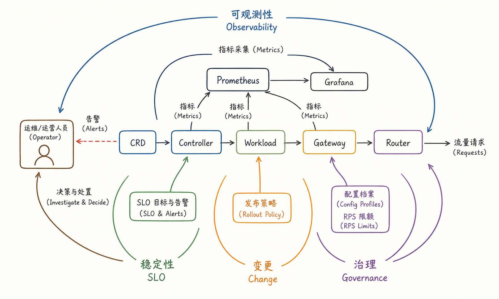
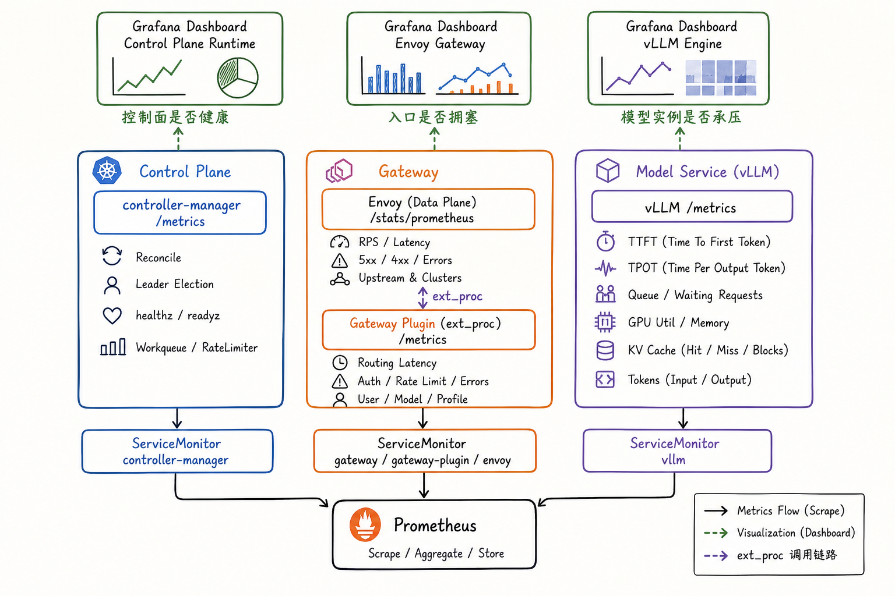
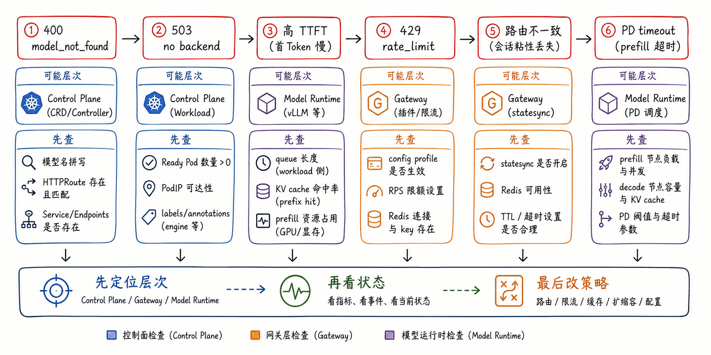
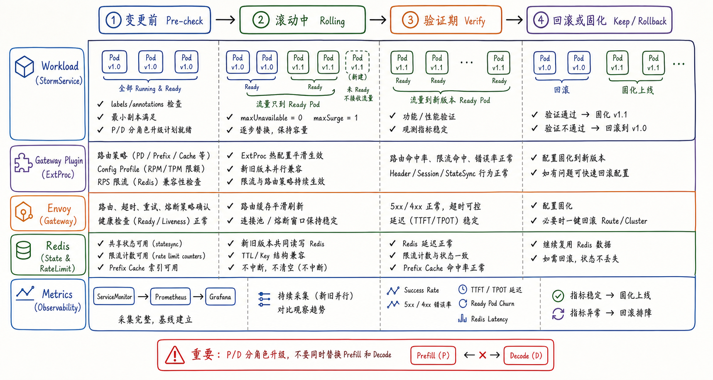

---
tags:
  - MaaS
  - AIBrix
  - LLMServing
  - Kubernetes
  - 生产化
  - 可观测性
updated: 2026-06-01
description: "本文从生产环境视角拆解 AIBrix 如何把模型部署能力延展为长期运营能力，重点串联可观测性、稳定性、故障排查、升级变更和平台治理。"
---

# 09. 生产化设计

## 1. 生产化不是部署完成后的附加项

前面八章已经把 AIBrix 的主要能力拆开讲过：CRD 表达模型服务意图，控制器把意图落成 Kubernetes 资源，基础与复杂工作负载承载模型运行，弹性系统维持容量，KVCache 与路由系统把请求导向更合适的后端，扩展能力把异构 GPU、Runtime sidecar、ModelAdapter、多引擎、多模态和 Batch API 纳入平台边界。

进入第九章后，问题不再是“怎样让一个模型跑起来”，而是：**当模型服务长期面对真实用户、持续流量、故障、发布、扩容、限流、成本约束和多团队协作时，AIBrix 怎样把这些运行事实重新接回架构设计**。

这就是生产化设计的核心。它不是泛泛讲 DevOps，也不是把 Prometheus、Grafana、Helm 和 Redis 名词堆在一起。对 AIBrix 来说，生产化至少包含五类问题：

- 可观测性：控制面、Gateway、模型实例和 Redis 等状态能否被持续观测；
- 稳定性：请求入口、Ready 后端、路由策略、限流和超时是否能保护服务边界；
- 故障排查：当出现 400、503、高 TTFT、429、路由不一致或 PD timeout 时，能否快速定位层次；
- 变更与升级：模型、Gateway、CRD、控制器和复杂 P/D 工作负载能否有节奏地发布；
- 平台治理：不同模型、用户、流量类别、GPU 成本和容量边界能否被清楚表达和执行；

截至 2026-06-01，本文核对的本地 AIBrix `main` 分支 HEAD 为 `a1663b40b86b027829ef4bf0c56f88c9ad43c8b6`。本文重点解释 AIBrix 的生产化心智模型，不把章节写成完整 Helm 参数手册，也不展开 Prometheus、Envoy Gateway 或 Kubernetes controller-runtime 的通用内部实现。



图 1 可以作为本章地图。中间仍然是 `CRD -> Controller -> Workload -> Gateway -> Router`。生产化能力不是在这条链路外面另起一套系统，而是围绕它形成反馈闭环：

- `Observability` 把控制器、工作负载、Gateway 和模型运行时的状态收集到 Prometheus/Grafana；
- `SLO` 把延迟、错误、Ready 状态、容量和告警变成运维决策输入；
- `Change` 把滚动发布、版本升级和回滚策略挂回 Workload 与 Gateway 配置；
- `Governance` 把 config profile、RPS 限额、用户/模型维度策略和成本边界挂到请求入口；

因此，生产化设计不是一个独立章节的“工具合集”，而是对前八章所有机制的反向校验：如果一个能力不能被观测、不能被排查、不能安全变更，也不能被治理，那么它在生产环境里就还没有真正完成。

## 2. 生产就绪从对象边界开始

生产环境里，很多故障不是复杂算法造成的，而是最基础的对象边界没有对齐。AIBrix 的模型服务会穿过 Kubernetes 原生资源、AIBrix CRD、Gateway API、Envoy、Gateway Plugin、推理引擎和可选 Redis。每一层都要保留足够明确的“身份”和“状态”，后续观测和排障才有依据。

最小的生产边界可以按下表理解：

| 边界 | 生产事实 | 错位后的表现 |
| --- | --- | --- |
| 模型身份 | Pod template 至少要有 `model.aibrix.ai/name` 和 `model.aibrix.ai/port` | Gateway 无法把请求中的 `model` 映射到后端 |
| 路由对象 | `HTTPRoute`、`Service`、`ReferenceGrant` 等对象要能被创建和 accepted | 请求能进入网关，但模型路由不可见或后端引用失败 |
| Ready 后端 | Pod 需要 PodIP、Ready 状态、正确端口和真实模型加载完成 | `503 no backend`、高错误率、冷启动流量打到不可服务实例 |
| 引擎指标 | vLLM、SGLang、TRT-LLM 等指标要能被按 engine 映射 | Autoscaler、Router 或 Grafana 看到的负载信号失真 |
| Gateway 状态 | 多 Gateway Plugin 副本需要共享状态和一致的配置 | prefix cache、限流计数、会话亲和或路由判断跨副本不一致 |
| 变更策略 | 滚动发布要保留容量，P/D 角色要分阶段升级 | 新旧版本交替期间容量下降或 roleset 不完整 |

这些边界看起来朴素，却是 AIBrix 能被长期运营的根基。第 03 章讲过，模型名、端口、Service、HTTPRoute 和 readiness 要互相对齐。第 05 章讲过，Autoscaler 依赖指标质量和 Ready 状态。第 07 章讲过，Gateway Plugin 需要从缓存中拿到模型对应的 Ready Pod 集合。到了生产环境，这些内容要从“理解机制”升级成“上线前检查项”。

例如，AIBrix 生产部署文档要求每个被管理 Pod template 至少包含：

```yaml
metadata:
  labels:
    model.aibrix.ai/name: my-model
    model.aibrix.ai/port: "8000"
```

这不是为了好看，而是为了让控制面、路由对象和数据面缓存拥有共同语言。客户端请求体里的 `model`、Pod label、Service/Endpoint、HTTPRoute match、Gateway Plugin cache 和推理引擎 `--served-model-name` 之间越一致，生产排障越简单。

Config Profile 也是同样的逻辑。它不是一个“高级配置入口”，而是把不同流量类别的策略显式挂到模型上。例如交互流量使用低延迟策略，批处理流量使用吞吐优先策略，P/D 流量使用 `pd` 策略，模型级 RPS 限额写在 profile 中。这样，生产环境里的策略不再散落在调用方、网关默认值和临时 header 中，而是沉淀为模型对象的一部分。

## 3. 可观测性要分三层看

AIBrix 的生产可观测性首先依赖 kube-prometheus-stack 或等价的 Prometheus/Grafana 能力。AIBrix 文档提供了内置 Grafana dashboard，覆盖控制面运行时、Envoy Gateway 和模型服务。仓库中还提供了多个 `ServiceMonitor` 样例，用于采集 controller-manager、Envoy、Gateway Plugin 和 vLLM 模型服务的 `/metrics` 或 `/stats/prometheus`。



图 2 把观测信号分成三层。

第一层是控制面。控制面要回答的问题是：AIBrix 控制器是否健康，reconcile 是否持续工作，leader election 是否正常，webhook、CRD status、PodAutoscaler status 和目标资源状态是否一致。`controller-manager` 默认暴露 `/metrics`，并通过 `/healthz` 和 `/readyz` 做 liveness/readiness 检查。生产环境中，如果 CRD 创建成功但下游资源没有出现，或者 status 长时间不变，首先应该看控制器日志、事件、RBAC、leader election 和对应 `ServiceMonitor` 是否采集到了指标。

第二层是 Gateway。Gateway 层要回答的问题是：请求入口是否拥塞，Envoy 是否出现 4xx/5xx、连接池、超时、ext_proc 调用或 upstream cluster 异常，Gateway Plugin 是否正常处理 header/body、解析模型、选择路由策略并写入目标 Pod。AIBrix 的生产网关文档要求生产环境调大 Gateway Plugin 和 Envoy Proxy 的副本数与资源，还要求多 Gateway Plugin 副本使用 Redis 共享状态。否则，不同 Gateway Plugin 副本只维护本进程状态，prefix cache block assignment、rate-limit counter 或 session-like 信息可能不一致。

第三层是模型服务。模型层要回答的问题是：模型实例是否真的承压，TTFT、TPOT、queue time、running/waiting requests、prompt/output tokens、KV cache usage、prefix cache hit/miss 和 GPU/memory 等信号是否解释了用户看到的延迟。AIBrix 的 metrics registry 会把不同 engine 的指标映射到平台语义，例如 vLLM 与 SGLang 对 running requests、waiting requests、latency 和 token throughput 的原始指标命名并不相同。生产监控不能只看“有 `/metrics`”，还要确认 engine label、metric name mapping 和 PromQL 聚合语义是否正确。

这三层之间不能互相替代。一个 503 可能是 Gateway 找不到 Ready 后端，也可能是 HTTPRoute 状态异常；一个高 TTFT 可能是模型队列变长，也可能是路由策略把流量持续打到缓存冷的实例；一个 autoscaling 不生效可能是 `PodAutoscaler` status 失败，也可能是 metrics endpoint 无法抓取。生产观测的价值不在于 dashboard 数量，而在于能把这些层次快速分开。

可以把 AIBrix 的观测对象整理成一张排查表：

| 问题 | 首看对象 | 辅助对象 |
| --- | --- | --- |
| 控制器是否工作 | controller-manager `/metrics`、日志、leader election | CRD status、Kubernetes Events、RBAC |
| 请求入口是否拥塞 | Envoy `/stats/prometheus`、Gateway dashboard | ClientTrafficPolicy、BackendTrafficPolicy、route timeout |
| 路由是否成功 | Gateway Plugin `/metrics`、`request_start` 日志、错误 header | `RoutingContext`、config profile、model cache |
| 模型是否承压 | vLLM/SGLang `/metrics`、TTFT/TPOT、queue、KV cache | Pod Ready、GPU 资源、PodAutoscaler |
| 多副本状态是否一致 | Redis 连接、statesync 周期、rate-limit counter | Prefix cache index、session id、Gateway Plugin 副本数 |

生产告警也应该沿这个结构分层。控制面告警关注 reconcile 停滞和 controller 健康；Gateway 告警关注 5xx/4xx、ext_proc 延迟、路由失败和限流拒绝；模型服务告警关注 TTFT/TPOT、queue、KV cache、OOM、Ready churn 和 token throughput。这样告警触发时，第一反应不是“模型坏了”，而是先定位出错层。

## 4. 稳定性要保护请求路径

AIBrix 生产稳定性首先体现在请求路径上。一次在线请求会经过客户端、Envoy Gateway、Gateway Plugin、Router、Service/Pod，再进入模型运行时。只要其中一层没有边界，故障就可能从单个慢请求扩散成全局不稳定。

### 4.1 Gateway 需要生产规格

生产网关文档给出的第一类建议是资源与副本数。Gateway Plugin 负责 ext_proc 处理、请求解析、路由判断和策略执行；Envoy Proxy 负责真实数据面连接和转发。二者都应根据吞吐、请求体大小、长连接、流式响应和模型延迟调整副本数与资源，而不能长期沿用本地开发默认值。

文档中的示例会把 Gateway Plugin 调到多个副本，并为 CPU/内存设置明确 requests/limits；Envoy Proxy 也应配置多个副本与资源。默认 chart 中还倾向于把 Envoy 与 Gateway Plugin 放在非 GPU 节点上，避免流量入口消耗稀缺 GPU 节点资源。这体现了一个常见生产原则：**GPU 节点应该优先服务模型计算，入口、控制面和共享状态组件要尽量与 GPU 计算隔离**。

第二类建议是 Redis。多 Gateway Plugin 副本如果没有共享状态，每个副本只能看到自己的进程内计数和局部缓存。AIBrix 文档明确指出，Redis 用于让多个 Gateway Plugin 实例在 prefix-cache block assignment、rate-limit counter 等状态上保持一致。`statesync` 的 README 进一步说明，它使用 Redis 中的 per-entity keys、周期性 pull/push、TTL、jitter 和 backoff 来实现最终一致的状态同步。这个机制适合生产多副本，但它不是强一致数据库：sync period、record TTL 和本地 eviction 都会影响状态新鲜度。

第三类建议是 Envoy 流量边界。AIBrix chart 暴露了 `clientTrafficPolicy`、`backendTrafficPolicy` 和 `envoyPatchPolicy`：

- `clientTrafficPolicy` 控制客户端请求体/响应体 buffer、连接数和 HTTP/2 stream；
- `backendTrafficPolicy` 控制到后端 Pod 的连接、并发请求、pending requests、retries 和每连接请求数；
- `envoyPatchPolicy` 控制 route timeout、connect timeout、idle timeout 和 cluster-level circuit breaker；

这些参数不是越大越好。大 prompt、长输出、流式响应、慢模型和批处理流量都可能需要更长 timeout 和更大 buffer，但过大的 pending queue 又会放大尾延迟。生产环境应该把这些参数和模型 SLO、请求大小、最大输出长度、客户端超时一起设计。

### 4.2 路由策略要按流量选择

AIBrix 文档提醒，如果没有显式 `routing-strategy`，Gateway 默认可能走 `random`。这适合测试或低流量场景，但不适合严肃生产。生产模型应通过模型 annotation 中的 config profile 显式设置默认策略，并允许调用方用 `config-profile` header 选择流量类别。

常见策略可以这样理解：

| 流量形态 | 更合适的策略 | 生产含义 |
| --- | --- | --- |
| 多轮对话、共享 system prompt、RAG prompt 重复 | `prefix-cache` | 优先利用已有 KV cache，降低重复 prefill 成本 |
| 独立请求、摘要、一次性 batch-like 请求 | `least-request` | 避免把流量集中到正在忙的实例 |
| 交互式低延迟请求 | `least-latency` | 用近期延迟作为目标选择信号 |
| 高吞吐 P/D 部署 | `pd` | 分别选择 prefill 与 decode 后端 |
| 多用户公平性 | `vtc-basic` | 在用户 token 公平性和 Pod 利用率之间做平衡 |

这里的重点不是背策略名称，而是把策略和流量事实绑定。一个模型可以通过 config profiles 暴露多个生产入口：`default` 面向交互流量，`batch` 面向吞吐流量，`pd` 面向高吞吐分离部署。这样，业务方切换流量类别时不会临时改 Gateway 默认值，而是选择一个可审计的 profile。

### 4.3 限流要区分模型级和用户级

AIBrix 生产模型部署文档提供了 `requestsPerSecond`，用于在模型 profile 上设置模型级 RPS 上限。这个上限是所有用户合计的模型级 cap。超过后，Gateway 会在路由和推理前直接返回 `429 Too Many Requests`，并带上 `x-error-model-rps-exceeded` 语义。源码中的 model RPS limiter 使用 Redis 做 1 秒窗口计数；如果请求预扣额度后路由失败，会回滚计数，避免失败请求消耗 quota。

模型级 RPS 适合保护模型成本、避免误流量冲垮后端、为高优先级模型保留资源。它不等于用户级 RPM/TPM。Gateway header 处理逻辑会读取 `user` header，并在 Redis client 可用时查询用户信息，再执行用户级限制。生产治理时要明确身份来源、用户记录、Redis 可用性和调用方传入 header 的可信边界，否则“用户级限流”容易变成只在部分入口生效的软约束。

### 4.4 容量要考虑冷启动现实

LLM Pod 的启动不是普通 Web 服务启动。模型下载、权重加载、GPU 初始化、KV cache 预分配和 health/readiness 都可能持续数分钟。AIBrix 生产模型部署文档建议先测量单副本容量，再给 60-70% 安全余量，并用目标 QPS 除以单副本可持续 QPS 得到副本数起点。这个公式很粗，但它提醒了一个重要事实：副本数不应只由当前流量决定，还要考虑扩容速度、模型冷启动和突发流量。

对于 P/D 部署，prefill 与 decode 的瓶颈不同。Prefill 更偏输入 token 和计算压力，decode 更偏输出 token、KV cache 和内存带宽。生产容量规划不能只说“模型有 N 个副本”，而要分别看 prefill pods、decode pods、roleset 完整性、P/D timeout 和 Router 对候选角色的过滤。

## 5. 故障排查要先定位层次

生产事故中最危险的习惯，是一看到请求失败就立刻改路由策略、扩副本或重启全部 Pod。AIBrix 的请求路径较长，盲目操作很容易扩大影响面。更稳妥的方式是先判断故障处在哪一层，再看状态，最后才改策略。



图 3 给出了一条排查阶梯。它不是覆盖所有事故的 Runbook，但能帮助读者建立第一反应。

第一类是 `400 model_not_found`。这通常说明 Gateway Plugin 无法在模型缓存中找到请求里的模型，或者模型名没有和 Pod label、HTTPRoute、Service/Endpoint 对齐。优先检查请求体中的 `model`、`model.aibrix.ai/name`、`HTTPRoute` 是否 accepted、Service/Endpoint 是否存在，以及 ModelAdapter 或复杂 workload 是否已经创建了对应服务发现对象。

第二类是 `503 no backend`。模型存在但没有可路由 Pod 时，Gateway 会返回服务不可用语义。优先检查 Ready Pod 数量是否大于 0、Pod 是否有 PodIP、端口 label 是否正确、readiness probe 是否真实代表模型加载完成、Pod 是否 terminating，以及 Gateway Plugin cache 是否已经观察到最新 Pod。

第三类是高 TTFT。高 TTFT 不一定是 Gateway 慢，常见原因包括模型实例 queue 变长、prefix cache 未命中、KV cache 压力升高、新 Pod 缓存冷、prefill 资源不足或路由策略与流量形态不匹配。排查时应同时看 vLLM/SGLang 的 queue、running/waiting requests、TTFT/TPOT、KV cache usage、prefix cache hit rate，以及 Router 是否持续选中少数热点 Pod。

第四类是 `429 rate_limit`。如果出现模型级 RPS 拒绝，先看 config profile 中 `requestsPerSecond` 是否生效，调用方是否选中了正确 `config-profile`，Redis 是否可用，以及多 Gateway Plugin 副本是否共享同一 Redis。对于用户级 RPM/TPM，还要看用户 header、Redis user record 和 stream usage 统计是否满足 Gateway 的限制逻辑。

第五类是路由不一致。典型表现是同一类请求在不同入口副本上命中不同缓存、限流结果不一致、会话亲和失效或 prefix cache 效果忽高忽低。此时不要只看单个 Gateway Plugin 日志，而要检查 `AIBRIX_STATESYNC_ENABLED`、Redis 连接、sync period、TTL、Gateway Plugin 副本数、prefix cache index 和状态同步是否在所有副本上配置一致。`statesync` 是最终一致，短暂滞后是设计边界，不应被误解成强一致路由状态。

第六类是 P/D timeout。P/D 路由把一次请求拆成 prefill 和 decode 两段，故障也会更结构化。需要分别检查 prefill pod 负载、decode pod 容量、roleset 完整性、KV transfer backend、`AIBRIX_PREFILL_REQUEST_TIMEOUT`、prompt length bucketing 和 P/D 评分策略。只扩 decode 不一定能解决 prefill 超时，只扩 prefill 也不一定能解决输出阶段拥塞。

排查时可以记住一个顺序：

1. 先判断请求是否进入了正确模型边界；
2. 再判断模型是否有 Ready 后端；
3. 再判断 Gateway 是否选到了目标 Pod；
4. 再判断模型运行时是否真的能按 SLO 处理请求；
5. 最后再改路由策略、限流、扩缩容或变更配置；

这个顺序看似保守，但它能避免把“对象缺失”误判成“容量不足”，也能避免把“指标失真”误判成“算法选择错误”。

## 6. 变更与升级要按服务语义推进

LLM Serving 的生产变更比普通无状态服务更敏感。新 Pod 启动慢，模型 warm-up 慢，KV cache 冷，P/D 角色可能不完整，Gateway Plugin 和 Redis 还持有实时状态。一次看似普通的滚动升级，如果没有和 AIBrix 的模型服务语义对齐，就可能在数分钟内把尾延迟、错误率和缓存命中率一起打坏。



图 4 把生产变更拆成四个阶段。

第一阶段是变更前检查。至少要确认 labels/annotations、模型端口、config profiles、RPS 限额、Redis 共享状态、ServiceMonitor、Prometheus/Grafana、最小副本数和回滚版本都可用。对于 P/D 部署，还要提前决定 prefill 与 decode 的升级顺序。

第二阶段是滚动中。AIBrix 生产模型部署文档建议 LLM Pod 使用 `maxUnavailable: 0` 和 `maxSurge: 1` 或更高的 surge，避免新 Pod 未 Ready 时先杀旧 Pod。这个策略的关键不是字段本身，而是“流量只打到 Ready Pod”。对于大型模型，readiness probe 应等待模型真实加载完成，而不是容器进程刚启动就放行。

第三阶段是验证期。验证不应只看 Pod 全部 Running，也要看 Gateway 和模型运行时指标：5xx/4xx 是否在正常范围内，TTFT/TPOT 是否明显恶化，Ready churn 是否升高，Redis latency 是否异常，RPS limit 是否误触发，prefix cache 命中是否出现结构性下降。P/D 部署还要看 prefill timeout、decode drain rate 和 roleset 完整性。

第四阶段是回滚或固化。指标稳定后，可以固化新版本配置；指标异常时，应优先回滚到上一组已知可用的镜像、config profile、Gateway 参数或 workload spec。需要注意，CRD schema 或控制器版本变更可能让回滚比镜像回滚更复杂。生产升级前应明确 CRD、controller、webhook、chart values 和镜像 tag 的兼容关系，不能把所有变更混在一个不可逆窗口里。

对 AIBrix 来说，最需要避免的是“同时替换多个关键层”。例如同一窗口里同时升级 Controller、Gateway Plugin、Envoy、模型镜像、Redis 配置和路由策略，一旦出问题很难判断根因。更合理的节奏是：

- 先升级不会改变用户请求路径的观测和配置支撑；
- 再升级控制面或 CRD，并确认 reconcile 与 status 正常；
- 再升级 Gateway Plugin 或 Envoy，并观察入口延迟与错误；
- 再升级模型 workload，并确保 Ready 与性能指标稳定；
- 最后切换策略、profile 或限流参数；

这不是保守主义，而是因为 AIBrix 的生产状态横跨声明对象、控制循环、入口状态、运行时指标和共享缓存。分层变更能保留排障方向。

## 7. 平台治理要落到可执行对象

生产化的最后一层是治理。治理不是“写一份规范”，而是把平台想执行的规则落到 AIBrix 能识别的对象和请求路径上。

首先是模型治理。每个模型应有明确的模型名、端口、engine label、资源规格、副本边界、默认 profile、支持的 endpoint、限流策略和观测归属。否则，Gateway 能不能路由、Autoscaler 能不能采集指标、Grafana 能不能按模型聚合，都取决于隐式约定。

其次是流量治理。不同业务请求对延迟、吞吐、成本和缓存局部性的要求不同。AIBrix 的 config profiles 适合作为“流量类别”的表达方式：交互流量、批处理流量、P/D 流量、低延迟流量和高吞吐流量可以有不同的 routing strategy、RPS cap 和策略参数。调用方通过 `config-profile` 选择流量类别，平台通过 annotation 保留默认与可选策略。

第三是用户与成本治理。模型级 `requestsPerSecond` 可以保护单模型预算；用户级 RPM/TPM 可以限制单用户消耗；VTC 类策略可以在多用户 token 消耗和 Pod 利用率之间做公平性平衡。治理的关键是把身份、模型、profile、Redis 计数和告警打通。如果 Redis 缺失、用户身份不可信或 profile 命名混乱，治理就会停留在配置表面。

第四是运维边界。AIBrix 生产环境通常至少涉及三类角色：

| 角色 | 主要负责 | 不应独自决定 |
| --- | --- | --- |
| 平台运维 | Gateway、Redis、Prometheus/Grafana、controller、CRD、全局策略 | 单模型 prompt、业务 SLO、模型版本语义 |
| 模型服务 owner | 模型镜像、engine 参数、资源规格、readiness、profile 建议 | 全局入口限流、跨模型容量分配 |
| 业务调用方 | 请求形态、用户身份、profile 选择、SLO 反馈 | Gateway 默认策略、Redis 状态、控制器升级 |

这张表的目的不是划分责任墙，而是避免生产事故时所有人都只盯着自己熟悉的层。AIBrix 的平台价值正是把模型、入口、控制器、缓存、弹性和指标统一到一套可操作对象里；治理也必须沿这套对象落地。

## 8. 本章小结

第九章把 AIBrix 从“能部署模型”的角度推进到“能长期运营模型服务”的角度。生产化设计不是额外工具清单，而是对 AIBrix 主链路的反馈闭环：可观测性让状态可见，稳定性让请求路径有边界，故障排查让问题可定位，变更升级让系统可演进，平台治理让模型、用户、成本和流量策略可执行。

如果用一句话总结本章：**AIBrix 的生产化能力，来自声明对象、控制循环、Ready 后端、共享状态、可解释路由和指标体系之间的持续对齐**。任何一个环节失去可见性或可治理性，都会让模型服务回退成“能跑但难运营”的临时部署。

下一章做全局串联时，可以把第九章作为最终校验：一次模型部署不仅要经过 CRD、控制器、工作负载、弹性、KVCache 和路由，还必须能被观测、限流、排障、升级和治理。只有这样，AIBrix 的架构学习才真正落到 MaaS 平台能力上。

## 9. 参考资料

1. [AIBrix Documentation：Observability](https://github.com/vllm-project/aibrix/blob/a1663b40b86b027829ef4bf0c56f88c9ad43c8b6/docs/source/production/observability.rst)；
2. [AIBrix Documentation：Deploying Gateway](https://github.com/vllm-project/aibrix/blob/a1663b40b86b027829ef4bf0c56f88c9ad43c8b6/docs/source/production/gateway.rst)；
3. [AIBrix Documentation：Production Model Deployments](https://github.com/vllm-project/aibrix/blob/a1663b40b86b027829ef4bf0c56f88c9ad43c8b6/docs/source/production/model-deployment.rst)；
4. [AIBrix Documentation：Installation and Controller Selection](https://github.com/vllm-project/aibrix/blob/a1663b40b86b027829ef4bf0c56f88c9ad43c8b6/docs/source/getting_started/installation/installation.rst)；
5. [AIBrix Documentation：Release](https://github.com/vllm-project/aibrix/blob/a1663b40b86b027829ef4bf0c56f88c9ad43c8b6/docs/source/development/release.rst)；
6. [GitHub：AIBrix Helm chart values](https://github.com/vllm-project/aibrix/blob/a1663b40b86b027829ef4bf0c56f88c9ad43c8b6/dist/chart/values.yaml)；
7. [GitHub：AIBrix controller manager manifest](https://github.com/vllm-project/aibrix/blob/a1663b40b86b027829ef4bf0c56f88c9ad43c8b6/config/manager/manager.yaml)；
8. [GitHub：AIBrix Gateway Plugin manifest](https://github.com/vllm-project/aibrix/blob/a1663b40b86b027829ef4bf0c56f88c9ad43c8b6/config/gateway/gateway-plugin/gateway-plugin.yaml)；
9. [GitHub：AIBrix controller-manager ServiceMonitor](https://github.com/vllm-project/aibrix/blob/a1663b40b86b027829ef4bf0c56f88c9ad43c8b6/observability/monitor/service_monitor_controller_manager.yaml)；
10. [GitHub：AIBrix Gateway Plugin ServiceMonitor](https://github.com/vllm-project/aibrix/blob/a1663b40b86b027829ef4bf0c56f88c9ad43c8b6/observability/monitor/service_monitor_gateway_plugin.yaml)；
11. [GitHub：AIBrix Envoy metrics Service and ServiceMonitor](https://github.com/vllm-project/aibrix/blob/a1663b40b86b027829ef4bf0c56f88c9ad43c8b6/observability/monitor/envoy_metrics_service.yaml)；
12. [GitHub：AIBrix vLLM ServiceMonitor](https://github.com/vllm-project/aibrix/blob/a1663b40b86b027829ef4bf0c56f88c9ad43c8b6/observability/monitor/service_monitor_vllm.yaml)；
13. [GitHub：AIBrix metrics registry](https://github.com/vllm-project/aibrix/blob/a1663b40b86b027829ef4bf0c56f88c9ad43c8b6/pkg/metrics/metrics.go)；
14. [GitHub：AIBrix Gateway request headers](https://github.com/vllm-project/aibrix/blob/a1663b40b86b027829ef4bf0c56f88c9ad43c8b6/pkg/plugins/gateway/gateway_req_headers.go)；
15. [GitHub：AIBrix Gateway request body and model RPS enforcement](https://github.com/vllm-project/aibrix/blob/a1663b40b86b027829ef4bf0c56f88c9ad43c8b6/pkg/plugins/gateway/gateway_req_body.go)；
16. [GitHub：AIBrix Gateway state sync](https://github.com/vllm-project/aibrix/blob/a1663b40b86b027829ef4bf0c56f88c9ad43c8b6/pkg/plugins/gateway/statesync/README.md)；
17. [GitHub：AIBrix Gateway rate limiter](https://github.com/vllm-project/aibrix/blob/a1663b40b86b027829ef4bf0c56f88c9ad43c8b6/pkg/plugins/gateway/ratelimiter/README.md)；
18. [GitHub：AIBrix Gateway environment variables](https://github.com/vllm-project/aibrix/blob/a1663b40b86b027829ef4bf0c56f88c9ad43c8b6/pkg/plugins/gateway/ENV_VARS.md)。

## 10. 学习测评

### 10.1 题目

1. 单选：为什么第九章把生产化理解为反馈闭环，而不是部署完成后的工具清单？
   - A. 因为生产化要把观测、SLO、变更和治理反馈回 CRD、控制器、工作负载与 Gateway 主链路；
   - B. 因为 AIBrix 只需要 Prometheus，不需要理解模型服务链路；
   - C. 因为生产化只发生在 Kubernetes scheduler 中；
   - D. 因为 Router 一旦能随机转发，就已经满足生产要求；

2. 多选：上线前检查 `model.aibrix.ai/name` 与 `model.aibrix.ai/port` 的原因包括哪些？
   - A. Gateway 需要用模型名和端口把请求映射到后端；
   - B. Service、Endpoint、HTTPRoute 和 Gateway Plugin cache 需要共同语言；
   - C. 这两个 label 可以替代模型 readiness probe；
   - D. 模型名错位会导致请求体里的 `model` 与后端发现无法对齐；

3. 单选：AIBrix 生产可观测性最合理的三层划分是什么？
   - A. 控制面、Gateway、模型服务；
   - B. CPU、内存、磁盘；
   - C. Docker、Git、IDE；
   - D. 训练数据、模型权重、论文；

4. 多选：关于 Gateway 多副本与 Redis，哪些说法更准确？
   - A. 多 Gateway Plugin 副本需要共享状态来减少路由和限流不一致；
   - B. Redis 可用于 prefix cache block assignment、rate-limit counter 等共享状态；
   - C. 如果没有 Redis，每个 Gateway Plugin 只能依赖本进程状态；
   - D. Redis 会让所有路由状态变成强一致且永远无延迟；

5. 单选：为什么生产环境不应长期依赖默认 `random` 路由？
   - A. 因为生产流量通常需要按 prefix cache、least request、least latency、P/D 或公平性等语义选择策略；
   - B. 因为 random 策略会删除 Pod；
   - C. 因为 random 策略无法处理任何 HTTP 请求；
   - D. 因为所有模型都只能使用 `pd`；

6. 多选：模型级 `requestsPerSecond` 的生产语义包括哪些？
   - A. 它是模型级 RPS cap；
   - B. 超限请求会在路由和推理前被拒绝；
   - C. 它等同于每个用户独立的 TPM 限制；
   - D. 多 Gateway Plugin 副本下需要 Redis 才能共享计数；

7. 单选：遇到 `503 no backend` 时，最先应该排查哪类问题？
   - A. 模型是否有可路由 Ready Pod、PodIP、正确端口和匹配 label；
   - B. 是否需要立即修改所有路由策略；
   - C. 是否应该删除 Prometheus；
   - D. 是否必须把模型改成 Batch API；

8. 多选：高 TTFT 的可能原因包括哪些？
   - A. 模型实例 queue 变长；
   - B. prefix cache 命中率下降；
   - C. prefill 资源不足；
   - D. Gateway Plugin 一定没有启动；

9. 单选：`statesync` 的正确理解是什么？
   - A. 基于 Redis 的最终一致状态同步，受 sync period、TTL 和本地状态变化影响；
   - B. 强一致事务数据库，可以保证所有副本毫秒级完全一致；
   - C. 替代 Kubernetes readiness 的健康检查系统；
   - D. 只用于离线文档构建；

10. 多选：AIBrix 生产滚动升级中，哪些做法更稳妥？
    - A. 对 LLM Pod 使用 `maxUnavailable: 0` 和合适的 `maxSurge` 保留容量；
    - B. 等新 Pod 真实 Ready 后再接流量；
    - C. P/D 部署中同时替换所有 prefill 和 decode 实例；
    - D. 分层观察 Gateway、模型、Redis 和指标状态；

11. 单选：为什么 CRD、controller、Gateway Plugin、Envoy、模型镜像和路由策略不宜在同一窗口全部变更？
    - A. 因为问题一旦出现，很难判断根因处在声明对象、控制循环、入口状态、运行时指标还是共享状态；
    - B. 因为 Kubernetes 不支持任何滚动升级；
    - C. 因为模型镜像升级一定不需要观测；
    - D. 因为 Gateway 永远不会影响请求路径；

12. 多选：平台治理要落到 AIBrix 可执行对象上，通常包括哪些对象或机制？
    - A. 模型 label、engine label、资源规格和副本边界；
    - B. config profiles 与 `config-profile` header；
    - C. RPS/RPM/TPM 限制和 Redis 计数；
    - D. 只写一份团队口头约定，不落到配置；

### 10.2 答案与解析

1. 答案：A。生产化不是外置工具清单，而是把观测、SLO、变更和治理接回 AIBrix 主链路。B、C、D 都把生产化缩窄成单点能力；

2. 答案：A、B、D。模型名和端口 label 是请求、Service、HTTPRoute、Gateway Plugin cache 和后端 Pod 对齐的基础。C 错在 label 不能替代 readiness；

3. 答案：A。AIBrix 生产观测应同时看控制面、Gateway 和模型服务。只看机器资源或外部工具无法定位请求链路中的层次问题；

4. 答案：A、B、C。Redis 能帮助多 Gateway Plugin 副本共享状态，但 `statesync` 是最终一致，不是无延迟强一致系统。D 过度承诺；

5. 答案：A。生产流量需要按请求形态、缓存局部性、延迟、吞吐、P/D 和公平性选择策略。`random` 更适合测试或低流量场景；

6. 答案：A、B、D。`requestsPerSecond` 是模型级 cap，不是用户级 TPM。多副本 Gateway 下需要 Redis 才能跨副本共享计数；

7. 答案：A。`503 no backend` 的第一反应应是确认 Ready Pod、PodIP、端口、label 和 Gateway cache，而不是直接改策略；

8. 答案：A、B、C。高 TTFT 可能来自队列、缓存未命中、prefill 压力或路由策略失配。D 不是必然结论；

9. 答案：A。`statesync` 使用 Redis 做周期性 pull/push、TTL 和最终一致同步。它不能替代 readiness，也不是强一致事务系统；

10. 答案：A、B、D。LLM Pod 启动慢，滚动升级应保留容量并只把流量送到 Ready Pod。P/D 部署不应同时替换所有 prefill 和 decode 角色；

11. 答案：A。一次变更多层会让根因定位变得困难。生产升级应尽量分层推进，保留观测和回滚路径；

12. 答案：A、B、C。平台治理必须落到可执行对象、profile、限流和共享状态上。D 只会让规则停留在不可验证的口头约定中。
