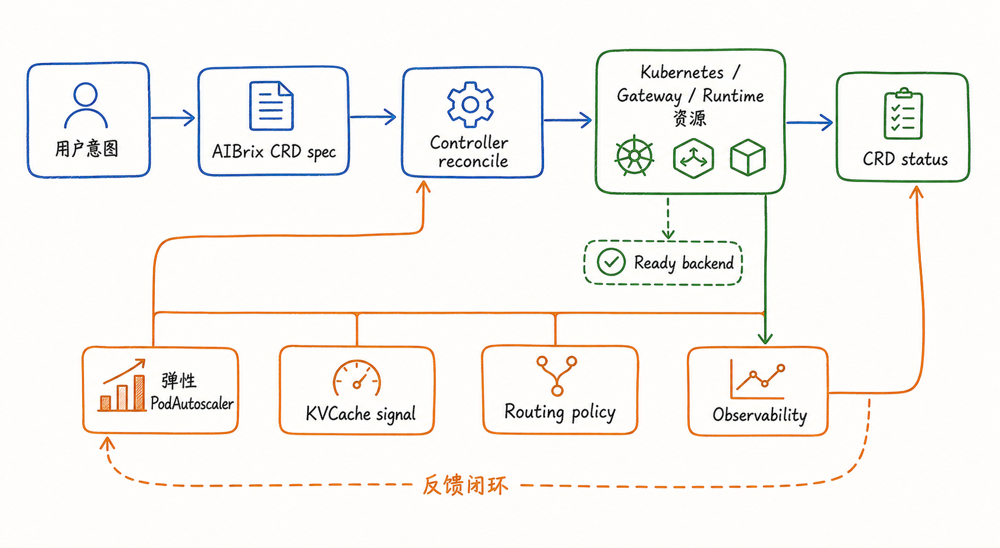
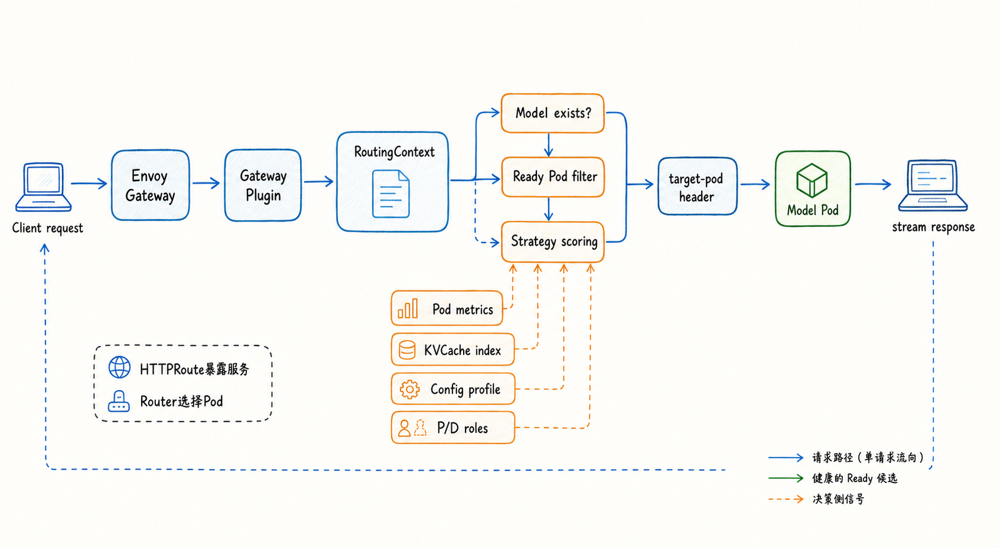
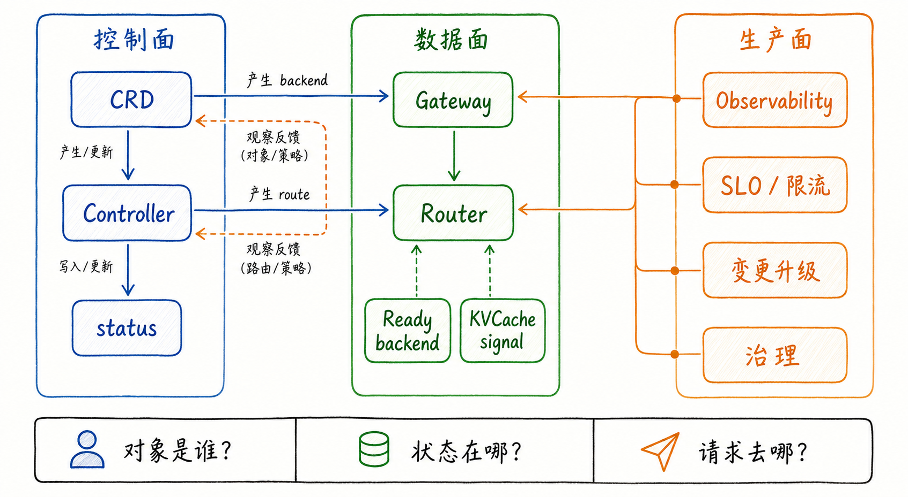

---
tags:
  - MaaS
  - AIBrix
  - LLMServing
  - Kubernetes
  - 架构
  - 全局串联
updated: 2026-06-01
description: "本文把 AIBrix 架构与实现系列前九章串联成一个完整心智模型，重点复盘模型部署闭环、请求热路径与生产反馈之间的协作关系。"
---

# 10. 全局串联

## 1. 为什么最后还要全局串联

前面九章已经分别拆开讲过 AIBrix 的主要机制：第一章说明它为什么是面向 LLM Serving 的 MaaS 平台抽象；第二章解释 CRD 为什么是控制面的领域语言；第三章从基础 `Deployment` 和 `Service` 讲模型生命周期；第四章把复杂推理扩展到 `StormService`、`RoleSet`、`PodSet`、`RayClusterFleet` 和 P/D 分离；第五章讲弹性闭环；第六章讲 KVCache 如何成为平台级缓存信号；第七章讲 Gateway Plugin 和 Router 如何选择后端；第八章整理 Runtime sidecar、ModelAdapter、异构 GPU、多引擎、多模态、Batch API 等扩展能力；第九章把这些机制重新放进可观测性、稳定性、变更和治理的生产语境里。

这些章节单独看都可以成立，但 AIBrix 真正难理解的地方不在某一个对象或某一个策略，而在它们怎样共同把一个模型服务从“声明”推进到“长期运营”。如果读者只记住了若干名词，很容易形成三个错误印象：

- 以为 CRD 只是 YAML 配置，而没有看到 `spec`、`status` 与控制器闭环；
- 以为路由只是 Envoy 转发，而没有看到 Gateway Plugin 在 Ready 后端、指标、KVCache 和策略之间做选择；
- 以为生产化只是监控告警，而没有看到可观测性会反向约束对象边界、伸缩粒度、缓存策略和变更节奏；

因此，第十章不再引入大量新机制，而是把全系列重新装配成两个端到端问题：

1. 一个模型服务从声明到可接流量，要经过哪些对象、控制器、运行时资源和反馈状态；
2. 一次用户请求从进入网关到命中模型实例，要经过哪些解析、过滤、策略选择和生产约束；

如果能把这两个问题讲清楚，AIBrix 的整体架构就不再是散开的组件列表，而会变成一个可推理、可排障、可扩展的 MaaS 平台心智模型。

本文是一篇复盘与总装章节。它会频繁回扣前九章的结论，但不会把每个 CRD 字段、每段源码或每个部署样例重新展开。读者可以把它当作一个全局导航：当后续遇到 AIBrix 的具体问题时，先判断问题落在哪条链路、哪个对象边界、哪个反馈闭环，再回到对应章节深挖。

## 2. 一次模型部署的闭环

理解 AIBrix 的第一条主线，是从“我要部署一个模型”开始。这里的“模型部署”并不总是同一种对象：最基础的模型服务可能直接由 Kubernetes `Deployment`、`Service`、标签和注解表达；复杂推理形态可能由 `StormService`、`RoleSet`、`PodSet` 或 `RayClusterFleet` 表达；弹性能力可能额外挂上 `PodAutoscaler`；缓存服务可能声明 `KVCache`；LoRA adapter 又可能由 `ModelAdapter` 管理。

这些对象形态不同，但它们共享同一个平台化过程：先把用户意图变成 Kubernetes API 可观察的对象，再由控制器把对象推进到运行态，最后把运行事实写回状态、指标和路由候选集合。



图 1 可以作为部署链路的总图。它不是说所有模型服务都必须从同一个 CRD 开始，而是强调 AIBrix 的平台化方式：**上层意图必须被对象化，下层运行必须被反馈化**。

### 2.1 意图层：先确定平台要表达什么

部署链路的起点不是镜像，也不是 Pod，而是平台要表达的服务语义。对于 AIBrix 来说，至少有六类语义会影响后续控制链路：

| 语义 | 常见表达对象 | 决定的问题 |
| --- | --- | --- |
| 模型身份 | `model.aibrix.ai/name`、请求体 `model`、`--served-model-name` | 这个请求应该归属哪个模型服务 |
| 运行入口 | `Service`、`HTTPRoute`、Gateway API 对象 | 外部流量怎样到达模型服务 |
| 计算形态 | `Deployment`、`StormService`、`RoleSet`、`PodSet`、`RayClusterFleet` | 一个服务实例到底是单 Pod、多角色、Pod 组还是 Ray 集群 |
| 伸缩目标 | `PodAutoscaler` 与 scale target | 扩缩的是普通副本、role、RoleSet 还是 RayCluster |
| 缓存能力 | `KVCache`、prefix index、KV event sync | 缓存在哪里维护，缓存状态怎样影响请求选择 |
| 生产策略 | config profile、限流、指标、Gateway 配置 | 不同流量类别怎样被观测、限制和治理 |

这一步最重要的判断是：AIBrix 不会凭空理解“模型服务”。它需要通过标签、注解、CRD `spec`、Gateway API 对象和推理引擎参数，把同一个模型身份传递给控制面、数据面和运行时。第三章反复强调的模型名、端口、Service、`HTTPRoute` 和 readiness 对齐，本质上就是为了让后续每一层都能谈论同一个对象。

### 2.2 控制层：把对象推向运行态

当平台对象进入 Kubernetes API 后，控制器开始承担“把期望状态变成实际状态”的工作。第二章给出的核心链路可以继续作为全系列的控制面公式：

```text
用户意图 -> AIBrix/Kubernetes 对象 spec -> 控制器 reconcile -> 下游运行时资源 -> status / metrics / events
```

不同章节看到的是这条公式的不同展开：

- `ModelRouter` 观察模型相关 workload，并把模型服务暴露成 Gateway API `HTTPRoute`；
- `StormService` 相关控制器把多角色服务拆成 `RoleSet`，再由 `RoleSet` 管理具体角色实例；
- `PodAutoscaler` 控制器读取指标和策略，计算目标副本数，再写入对应 scale target；
- `KVCache` 控制器把缓存声明转化为缓存 backend、runtime 配置或相关基础设施；
- Runtime sidecar webhook 在合适的 workload 上注入 sidecar，让 artifact 管理、指标标准化和引擎适配进入 Pod 边界；

这里要避免一个常见误解：控制器不是一次性生成器。它的职责不是“看到 YAML 后创建几个资源就结束”，而是持续观察对象、下游资源和外部状态之间的差异。只要 Pod 退出、Ready 状态变化、指标波动、路由对象丢失、角色副本不完整或缓存 backend 状态改变，reconcile 就会重新进入。

### 2.3 运行层：真正承载模型的是底层资源

AIBrix 的平台抽象最终仍然要落到 Kubernetes 与推理引擎。`Deployment`、`Pod`、`Service`、`EndpointSlice`、`HTTPRoute`、Envoy Gateway、Gateway Plugin、vLLM 或其他 engine 才是流量真正穿过的地方。

因此，读 AIBrix 架构时必须同时保留两层视角：

- 平台视角：`StormService`、`RoleSet`、`PodAutoscaler`、`KVCache` 等对象表达模型服务语义；
- 运行视角：Pod 是否启动、端口是否一致、Service 是否选择到 Pod、`HTTPRoute` 是否 accepted、Gateway Plugin 是否看到 Ready backend、engine 是否完成模型加载；

一旦这两层断开，就会出现“对象看起来正确，但请求不可用”的问题。例如 `Deployment` 存在并不代表模型已经 Ready；`HTTPRoute` 存在并不代表 Gateway Plugin 能找到可路由 Pod；`PodAutoscaler` 计算出副本数并不代表新 Pod 立即具备缓存和吞吐能力；P/D 分离中的 RoleSet 成功创建，也不代表 prefill 与 decode 角色已经可以稳定配对。

### 2.4 反馈层：状态必须回到系统

第九章强调过，生产化不是部署之后才加的一层工具，而是对主链路的反馈校验。部署闭环只有在状态被持续反馈时才算完整。

反馈至少有四个去向：

- 回到 `status`：让上层对象知道当前是否 Ready、是否完成、是否失败、下游资源是否符合期望；
- 回到指标系统：让 Autoscaler、Grafana、告警和排障流程看到 QPS、延迟、GPU 利用、队列、错误率和缓存状态；
- 回到 Gateway Plugin cache：让 Router 可以基于最新 Pod、模型、指标和策略做选择；
- 回到平台治理：让 config profile、限流、SLO、变更节奏和容量规划可以被重新调整；

从这个角度看，AIBrix 的部署链路不是一条直线，而是一个闭环。声明对象给控制器方向，运行资源给系统事实，指标和状态给下一次决策依据。只要闭环中的任何一段缺失，平台就会退化成“能创建资源，但不能解释服务状态”的普通部署系统。

## 3. 一次请求的流转

第二条主线，是一次用户请求如何被 AIBrix 接住、解析、过滤、评分并转发到目标模型实例。第七章已经深入拆过路由系统，第十章要做的是把它和前面的工作负载、弹性、KVCache、P/D 分离和生产化连接起来。

普通 Web 服务里，路由常常可以粗略理解为“找一个健康后端”。AIBrix 的请求流转更复杂，因为 LLM Serving 的请求成本不是均匀的：prompt 长度、输出长度、运行中请求数、prefix cache 命中、GPU KV 占用、P/D 角色、用户限流和 SLO 都可能改变一次请求的最佳目标。



图 2 把请求热路径压缩成一条线。为了避免混淆，可以把它分成五步。

### 3.1 入口：Envoy Gateway 接住外部请求

外部客户端通常访问 OpenAI-compatible endpoint，例如 chat completions、completions、embeddings、rerank、audio 或 image/video generation 等路径。Envoy Gateway 负责接住 HTTP 请求，并通过 external processing hook 把关键处理交给 AIBrix Gateway Plugin。

这里要区分两个概念：

- `HTTPRoute` 让 Envoy Gateway 知道某个模型服务、路径和后端 Service 的存在；
- Router 在 Gateway Plugin 内部，从模型对应的候选 Pod 中选择具体目标；

也就是说，`HTTPRoute` 是“服务可见性”的一部分，`target-pod` 才是“精确后端选择”的结果。把这两者混为一谈，会导致排障时方向错误：`HTTPRoute` 未 accepted 要看 Gateway API 对象和 Service 引用；策略没有选出目标 Pod 要看 Gateway Plugin cache、Ready 过滤、策略解析、指标和模型状态。

### 3.2 解析：RoutingContext 把请求变成可决策对象

Gateway Plugin 会先从 header 中读取用户、路径、`routing-strategy`、`config-profile`、`external-filter`、`x-session-id` 等信息，再根据请求路径解析 body，提取 `model`、prompt、messages、stream 等字段。解析后的信息进入 `RoutingContext`。

`RoutingContext` 的意义不是“存一下请求字段”，而是把一次请求变成 Router 可以决策的对象。它把以下问题放在同一个上下文里：

- 这次请求要访问哪个模型；
- 请求来自哪个路径和用户；
- 是否指定了策略或 config profile；
- 是否需要 session affinity、external filter 或 P/D 路由；
- prompt 或 messages 是否可以计算 prefix 相关信号；
- 路由完成后目标 Pod、目标端口、响应 header 和请求统计状态应写到哪里；

因此，Router 的选择不是脱离 HTTP 的纯算法，而是由请求语义、模型对象和运行时状态共同塑造的决策。

### 3.3 过滤：Ready 是所有策略的地板

在执行任何策略评分之前，AIBrix 必须确认候选集合存在。这个过程通常包含三层过滤：

1. 模型存在性检查：Gateway Plugin cache 中是否有请求体 `model` 对应的模型；
2. 基础可路由检查：候选 Pod 是否有 PodIP、没有 terminating、Ready condition 为 true；
3. 可选 external filter：请求是否用 label selector 缩小了候选 Pod 集合；

这一步是 AIBrix 路由的工程底线。一个 Pod 即使 prefix cache 命中率很高，只要不 Ready，就不能继续接新请求。一个 Pod 即使当前请求数最低，只要正在删除或没有 PodIP，也不能成为目标。健康条件优先于策略偏好，这条规则贯穿弹性、自愈、路由和生产稳定性。

这也解释了第五章与第七章的关系。弹性机制决定“哪些后端应该存在、何时扩缩、何时恢复”，路由系统决定“当前请求能在已有 Ready 后端里选谁”。二者通过 Ready 状态、指标、缓存和 Gateway Plugin cache 汇合。

### 3.4 评分：策略不是追求单一最优

通过 Ready 过滤之后，Router 才开始执行具体策略。策略来源可能是请求头 `routing-strategy`，也可能来自模型 annotation 中的 config profile，还可能来自 Gateway Plugin 环境变量中的默认策略。

第六章和第七章已经说明，AIBrix 策略信号大致可以分成几类：

| 信号类别 | 代表策略或数据 | 关注的问题 |
| --- | --- | --- |
| 负载信号 | least request、throughput、latency、running request | 哪个后端当前更空、更稳定 |
| 缓存信号 | prefix-cache、least-kv-cache、least-gpu-cache、KV event sync | 哪个后端能复用更多已有计算或缓存容量 |
| 角色信号 | P/D scoring、prefill scorer、decode scorer | 一次请求应该配对哪些 prefill 与 decode 角色 |
| 业务信号 | user、session、config profile、external-filter、SLO | 不同用户、流量类别和服务目标如何被区分 |

生产系统里几乎没有一种策略永远最优。缓存命中高可能带来热点；最低请求数可能选到冷 Pod；吞吐优先可能牺牲交互延迟；P/D 分离提升资源效率的同时会引入角色配对、KV transfer 和 fallback 边界。AIBrix Router 的价值，是让这些信号在同一个可配置框架里被显式选择，而不是散落在调用方或临时脚本中。

### 3.5 转发：target-pod 把决策交还给 Envoy

Router 选出目标后，Gateway Plugin 会把目标写回请求上下文，例如通过 `target-pod` 等 header 让 Envoy 将请求转发到对应模型实例。请求进入模型 Pod 后，流式响应沿原路径返回客户端。

这一刻，控制面和数据面终于闭合：

- 控制器提前创建了 `HTTPRoute`、Service 和 workload；
- Gateway Plugin cache 观察到了模型到 Pod 的候选集合；
- Ready 状态和指标决定了候选质量；
- KVCache、P/D 角色和 config profile 决定了策略偏好；
- Envoy 执行最终转发；
- 指标、日志、请求统计和状态同步又回到生产反馈；

如果只看最后一步，AIBrix 像一个网关；如果看完整链路，它实际上是在 Kubernetes、推理引擎和 LLM Serving 策略之间做了一次平台级协调。

## 4. 机制之间怎样咬合

为了把全系列压缩成一个可复用框架，可以把 AIBrix 看成七个互相咬合的机制层。每一层都回答一个独立问题，但任何生产问题通常都会穿过多层。

| 机制层 | 关键对象或能力 | 回答的问题 | 与其他层的连接 |
| --- | --- | --- | --- |
| 领域表达 | CRD、标签、注解、config profile | 平台怎样描述模型服务、策略和状态 | 给控制器、Gateway 和治理提供共同语言 |
| 控制器闭环 | reconcile、watch、owner reference、status | 期望状态怎样被持续推进 | 把对象转成 Deployment、Service、HTTPRoute、RoleSet 等资源 |
| 工作负载形态 | Deployment、StormService、RoleSet、PodSet、RayClusterFleet | 一个模型实例到底怎样运行 | 决定弹性粒度、Ready 后端和路由候选集合 |
| 弹性治理 | PodAutoscaler、HPA、KPA、APA、Optimizer、健康恢复 | 容量怎样随负载变化 | 依赖指标和 Ready 状态，也影响 Router 可选后端 |
| 缓存系统 | KVCache、offloading、prefix index、KV event sync | 缓存怎样从引擎状态变成平台信号 | 给 Router 提供成本信号，也影响 P/D 与扩缩容效果 |
| 路由系统 | Envoy Gateway、Gateway Plugin、Router、策略算法 | 当前请求应该去哪里 | 汇聚 Ready、负载、缓存、角色、用户和 SLO 信号 |
| 生产反馈 | Observability、限流、变更、治理、故障排查 | 系统如何长期运营 | 反向修正对象边界、策略配置、容量规划和升级节奏 |

这张表可以帮助读者定位问题。例如：

- 创建了 workload 但请求 404 或 route 不可见，优先看领域表达和控制器闭环；
- 请求进入网关但返回 `model_not_found` 或 `no backend`，优先看 Gateway Plugin cache、模型名、Service、Ready 后端；
- 扩容发生但延迟仍然高，优先看弹性指标、冷启动、缓存命中、请求长度和策略选择；
- P/D 分离表现不稳定，优先看 RoleSet 状态、prefill/decode 角色、KV transfer、P/D scoring 和 fallback；
- 线上变更后错误率升高，优先看生产反馈、Gateway Plugin 状态同步、route accepted、Redis/共享状态和模型运行时指标；

这些排查入口并不互斥。AIBrix 的生产问题常常是跨层问题，例如“扩容后命中率下降导致 TTFT 升高”，同时涉及弹性、KVCache、路由和生产观测；“某个模型偶发 503”，可能同时涉及 ModelRouter、HTTPRoute、Ready 过滤、Pod 冷启动和 Gateway Plugin cache 更新。

## 5. 场景化复盘

全局心智模型最好的验证方式，不是背组件名，而是拿真实场景走一遍链路。下面用四个典型场景复盘前九章的知识。

### 5.1 新模型上线

新模型上线时，不应该只问“镜像能不能启动”，而要沿着部署闭环检查：

1. 模型身份是否一致：`model.aibrix.ai/name`、请求体 `model`、Service 名称、`--served-model-name` 是否指向同一模型；
2. 端口是否一致：Pod label、容器端口、Service targetPort、HTTPRoute backend port 是否对齐；
3. 控制器是否完成：ModelRouter 是否创建或更新了 `HTTPRoute`，相关对象是否 accepted；
4. Pod 是否真的可接流量：readiness probe 是否等到模型加载完成，PodIP 是否存在，Ready condition 是否为 true；
5. Gateway Plugin 是否看到后端：cache 中是否有该模型，Ready Pod 数是否大于零；
6. 策略是否明确：默认策略、config profile、限流和 SLO 是否符合该模型的流量性质；

这条链路对应第三章、第七章和第九章。它提醒我们：上线成功不是 `kubectl apply` 成功，而是模型身份、路由对象、Ready 后端和网关策略共同对齐。

### 5.2 流量突增

流量突增时，系统要同时回答两个问题：已有后端怎样保护服务，新容量怎样进入服务。

已有后端侧，Router 需要在 Ready 集合里根据负载、缓存和策略选择目标；Gateway 层可能还要执行用户级或模型级限流；如果某些 Pod 已经过载，策略要避免继续制造热点。新容量侧，`PodAutoscaler` 通过 HPA、KPA、APA 或 Optimizer 路径计算目标规模，再由底层 workload 创建新 Pod。

问题在于，新 Pod 并不是创建完成就立刻等价于成熟副本。模型加载需要时间，readiness 需要通过，缓存可能是冷的，指标也需要采集窗口。第五章讨论弹性时强调过这一点：扩容是容量治理的一部分，不是瞬时吞吐魔法。第六章和第七章又补充了缓存与路由的现实边界：冷 Pod 请求数可能低，但长前缀请求发过去会损失已有缓存；高命中 Pod 可能省 prefill 成本，但继续压过去又会形成热点。

因此，流量突增的正确复盘顺序是：

- 先确认请求是否进入 Gateway，以及限流是否按预期生效；
- 再确认 Ready 后端数量、运行中请求数、延迟和错误率；
- 再看 Autoscaler 是否读取到正确指标并计算出合理目标规模；
- 再看新 Pod 是否完成模型加载并进入 Gateway Plugin cache；
- 最后看路由策略是否在负载与缓存之间做了合理折中；

### 5.3 长前缀复用

长上下文、相似 prompt 或多轮会话场景里，KVCache 会显著影响成本。第六章的关键结论是：KVCache 只有上升为平台信号，才会参与跨副本路由、P/D 配对和缓存压力治理。

在全局链路里，这意味着一次请求不只是“找最空的 Pod”，而是要比较“重算成本”和“负载风险”。如果某个 Pod 命中过长 prefix，把请求发过去可能显著降低 TTFT；但如果该 Pod 已经有很多运行中请求，继续命中会牺牲排队延迟。反过来，把请求发给空闲冷 Pod 可以均衡负载，却会丢掉已有 prefix 的计算价值。

所以，缓存感知路由不是“永远选择最高命中率”，而是在四个因素之间做判断：

- prefix 命中比例与可复用 KV 规模；
- 当前 Pod 运行中请求数、延迟和吞吐；
- GPU KV、L1 DRAM、L2 Cache 或 backend 的容量压力；
- Ready 状态、扩缩容、重启、驱逐和回退策略；

这个场景把第六章、第七章和第九章连在一起：KVCache 提供成本信号，Router 执行策略选择，生产观测负责确认命中率、TTFT、吞吐和热点是否真的改善。

### 5.4 P/D 分离与复杂工作负载

P/D 分离是全系列里最能体现“单 Pod 心智模型不够用”的场景。第四章说明，复杂推理部署把一个模型服务从完整副本扩展成角色、角色组和阶段化执行路径。第七章进一步说明，P/D 路由不是在同构 Pod 里选一个目标，而是在 prefill 与 decode 之间选择一组配对，并处理 KV transfer、fallback 和请求改写。

把它放到全局链路里，可以得到这样的复盘方式：

1. 对象层：`StormService`、`RoleSet`、`PodSet` 是否正确表达 prefill、decode 等角色；
2. 控制层：控制器是否把角色声明落成实际 Pod，并维护 status；
3. 运行层：prefill 与 decode Pod 是否分别 Ready，端口、Service 和模型身份是否一致；
4. 路由层：Gateway Plugin 是否使用 `pd` 策略，并能看到两类角色的候选集合；
5. 缓存层：KV transfer、prefix 信息或 P/D scoring 所需状态是否可用；
6. 生产层：超时、fallback、角色级扩缩容、观测指标和变更节奏是否有保护；

这个场景也解释了为什么 AIBrix 需要比普通 Kubernetes `Deployment` 更高层的编排抽象。不是因为平台喜欢增加对象，而是因为模型服务的执行单位、路由目标和状态边界真的变复杂了。

## 6. 全局心智模型

读完整个系列后，可以把 AIBrix 压缩成三个面：控制面、数据面、生产面。



控制面回答“对象是谁”。它关心 CRD、标签、注解、控制器、`spec`、`status` 和下游资源的 owner/引用关系。读控制面时，要问：这个模型服务用什么对象表达，谁负责 reconcile，状态写在哪里，下游资源归谁管理。

数据面回答“请求去哪”。它关心 Gateway、HTTPRoute、Gateway Plugin、Router、Ready backend、metrics、KVCache signal、P/D roles 和 target Pod。读数据面时，要问：请求如何进入，模型如何被解析，候选 Pod 从哪里来，谁被过滤掉，策略为什么选择这个目标。

生产面回答“系统怎样长期运营”。它关心 Observability、SLO、限流、故障排查、滚动升级、共享状态、Redis、ServiceMonitor、Grafana dashboard 和平台治理。读生产面时，要问：状态是否可见，错误是否可定位，策略是否可解释，变更是否可回滚，容量和成本是否被治理。

这三个面之间不是分层摆设，而是互相反馈：

- 控制面生产 workload、route 和 status，给数据面提供可路由对象；
- 数据面把请求、目标、延迟、错误、缓存和负载暴露为指标，给生产面提供运行事实；
- 生产面根据 SLO、告警、容量和治理要求，反过来影响 CRD、config profile、Autoscaler、路由策略和变更流程；

如果只记一个检查框架，可以记住下面三个问题：

```text
对象是谁：模型身份、CRD、workload、Service、HTTPRoute、RoleSet、KVCache 是否对齐？
状态在哪：spec、status、Ready、metrics、Gateway cache、Redis、日志和事件是否可见？
请求去哪：入口、解析、候选集合、过滤条件、策略信号和 target Pod 是否可解释？
```

这三个问题足够简单，但能覆盖 AIBrix 大部分架构理解和生产排障场景。它们也能帮助读者在遇到新 feature 时判断它属于哪里：如果它改变对象表达，就是控制面扩展；如果它改变请求选择，就是数据面扩展；如果它改变观测、变更、限流或治理，就是生产面扩展；如果三者都改变，就需要重新审视全局边界。

## 7. 本章小结

第十章把 AIBrix 架构重新收束为两条端到端链路和三个全局问题。

第一条链路是模型部署闭环：用户意图通过 CRD、标签、注解和 Kubernetes 对象被平台化，控制器通过 reconcile 把期望状态推进到 `Deployment`、`Service`、`HTTPRoute`、`RoleSet`、`PodSet`、`RayClusterFleet`、`KVCache` 等运行资源，Ready、status、metrics 和 Gateway cache 又把运行事实反馈回来。

第二条链路是请求热路径：客户端请求进入 Envoy Gateway，Gateway Plugin 解析 header 与 body，形成 `RoutingContext`，先做模型存在性和 Ready Pod 过滤，再用负载、KVCache、config profile、P/D 角色、用户和 SLO 等信号执行策略选择，最后通过 target Pod 把请求交给目标模型实例。

三个全局问题是：对象是谁，状态在哪，请求去哪。只要围绕这三个问题检查，AIBrix 的 CRD、控制器、工作负载、弹性、KVCache、路由、扩展能力和生产化设计就能重新回到同一个心智模型里。

如果用一句话总结整个系列：**AIBrix 的价值不是替代 Kubernetes 或推理引擎，而是在二者之间建立一个 LLM-aware 的平台控制层，让模型服务的声明、运行、请求选择、缓存复用、弹性治理和生产反馈可以被同一套对象体系持续协调**。

## 8. 参考资料

1. [AIBrix Documentation：AIBrix Architecture](https://aibrix.readthedocs.io/latest/designs/architecture.html)；
2. [AIBrix Documentation：AIBrix Router](https://aibrix.readthedocs.io/latest/designs/aibrix-router.html)；
3. [AIBrix Documentation：AIBrix Autoscaler](https://aibrix.readthedocs.io/latest/designs/aibrix-autoscaler.html)；
4. [AIBrix Documentation：AIBrix KVCache Offloading Framework](https://aibrix.readthedocs.io/latest/designs/aibrix-kvcache-offloading-framework.html)；
5. [AIBrix Documentation：AIBrix StormService](https://aibrix.readthedocs.io/latest/designs/aibrix-stormservice.html)；
6. [AIBrix Documentation：Production Model Deployments](https://aibrix.readthedocs.io/latest/production/model-deployment.html)；
7. [AIBrix Documentation：Deploying Gateway](https://aibrix.readthedocs.io/latest/production/gateway.html)；
8. [GitHub：vllm-project/aibrix ModelRouter controller](https://github.com/vllm-project/aibrix/blob/a1663b40b86b027829ef4bf0c56f88c9ad43c8b6/pkg/controller/modelrouter/modelrouter_controller.go)；
9. [GitHub：vllm-project/aibrix Gateway selectTargetPod](https://github.com/vllm-project/aibrix/blob/a1663b40b86b027829ef4bf0c56f88c9ad43c8b6/pkg/plugins/gateway/gateway.go)；
10. [GitHub：vllm-project/aibrix routing context](https://github.com/vllm-project/aibrix/blob/a1663b40b86b027829ef4bf0c56f88c9ad43c8b6/pkg/types/router_context.go)；
11. [GitHub：vllm-project/aibrix PodAutoscaler controller](https://github.com/vllm-project/aibrix/blob/76f7d73fc9a2028819255f4d49d23fed8ac7e3db/pkg/controller/podautoscaler/podautoscaler_controller.go)；
12. [GitHub：vllm-project/aibrix KVCache controller](https://github.com/vllm-project/aibrix/blob/76f7d73fc9a2028819255f4d49d23fed8ac7e3db/pkg/controller/kvcache/kvcache_controller.go)；
13. [GitHub：vllm-project/aibrix prefix-cache routing](https://github.com/vllm-project/aibrix/blob/76f7d73fc9a2028819255f4d49d23fed8ac7e3db/pkg/plugins/gateway/algorithms/prefix_cache.go)；
14. [GitHub：vllm-project/aibrix PD disaggregation router](https://github.com/vllm-project/aibrix/blob/a1663b40b86b027829ef4bf0c56f88c9ad43c8b6/pkg/plugins/gateway/algorithms/pd_disaggregation.go)；
15. [Kubernetes Documentation：Custom Resources](https://kubernetes.io/docs/concepts/extend-kubernetes/api-extension/custom-resources/)；
16. [Gateway API Documentation：HTTPRoute](https://gateway-api.sigs.k8s.io/api-types/httproute/)。

## 9. 学习测评

### 9.1 题目

1. 单选：第十章把 AIBrix 全局架构压缩成哪两条端到端主线？
   - A. 镜像构建链路与 Helm 安装链路；
   - B. 模型部署闭环与请求热路径；
   - C. Prometheus 采集链路与 Grafana 展示链路；
   - D. GPU 调度链路与对象存储链路；

2. 单选：为什么说 `HTTPRoute` 不等于 AIBrix 的精确 Pod 路由？
   - A. 因为 `HTTPRoute` 只负责让服务入口和后端 Service 对 Gateway 可见，具体 Pod 选择发生在 Gateway Plugin 与 Router 中；
   - B. 因为 `HTTPRoute` 只能用于 TCP 流量，不能用于 HTTP 请求；
   - C. 因为 AIBrix 完全绕过 Gateway API，不使用 `HTTPRoute`；
   - D. 因为 `HTTPRoute` 会自动根据 KVCache 命中选择目标 Pod；

3. 多选：一次模型部署要进入可接流量状态，通常需要哪些边界对齐？
   - A. 请求体 `model`、Pod label、Service、`HTTPRoute` 和推理引擎 served model name；
   - B. 容器端口、Service port、Pod label 中的模型端口和 route backend port；
   - C. Pod Ready condition、Gateway Plugin cache 中的候选 Pod 和策略可见的后端集合；
   - D. 只要 Kubernetes API 接受 YAML，其他状态都不重要；

4. 单选：在 AIBrix 路由热路径中，Ready Pod 过滤与策略评分的关系是什么？
   - A. Ready 过滤发生在策略评分之前，是所有策略的基础条件；
   - B. Ready 过滤只在 least-request 策略中生效；
   - C. Ready 过滤发生在策略评分之后，用来修正策略结果；
   - D. Ready 过滤会被 prefix cache 命中自动绕过；

5. 多选：为什么缓存感知路由不能简单理解为“永远选择 prefix 命中最高的 Pod”？
   - A. 高命中 Pod 可能已经过载，继续发送请求会制造热点；
   - B. 冷 Pod 请求数低，但可能需要重新计算长前缀；
   - C. Ready 状态、缓存压力、扩缩容和 fallback 都会影响最终选择；
   - D. KVCache 只存在于文档中，不能成为任何路由信号；

6. 单选：`PodAutoscaler` 与 Router 在弹性场景中的关系更接近哪一种？
   - A. `PodAutoscaler` 决定容量目标，Router 在当前 Ready 后端中选择请求目标；
   - B. Router 直接修改 workload 副本数，`PodAutoscaler` 只负责转发请求；
   - C. 二者互相替代，只需要部署其中一个；
   - D. `PodAutoscaler` 只用于离线 Batch API，不影响在线服务；

7. 多选：P/D 分离场景中，哪些问题通常需要同时检查？
   - A. prefill 与 decode 角色是否由 `StormService`、`RoleSet` 或相关对象正确表达；
   - B. 两类角色的 Pod 是否 Ready，并且能被 Gateway Plugin 看到；
   - C. Router 是否使用了合适的 P/D 策略，并能处理 KV transfer 与 fallback 边界；
   - D. 只要普通 `Deployment` 有多个副本，P/D 角色就会自动形成；

8. 单选：第十章提出的三个全局检查问题是什么？
   - A. 镜像多大、节点多少、日志多长；
   - B. 对象是谁、状态在哪、请求去哪；
   - C. 谁写代码、谁发版本、谁看仪表盘；
   - D. YAML 是否缩进、Service 是否存在、Pod 是否重启；

9. 多选：生产反馈为什么会反向影响 AIBrix 的架构配置？
   - A. SLO、错误率、延迟和容量指标会影响 Autoscaler、路由策略和 config profile；
   - B. 可观测性可以暴露对象边界不一致、Gateway 状态不同步或 Ready 后端异常；
   - C. 变更升级需要考虑 workload、Gateway Plugin、Envoy、Redis 和模型运行时的协作；
   - D. 生产反馈只用于事后写报告，不应改变任何平台对象；

10. 单选：如果线上出现“请求进入 Gateway 后返回 no backend”，最合理的第一轮排查方向是什么？
    - A. 先看模型身份、Gateway Plugin cache、Ready Pod 过滤、Service/HTTPRoute 与 Pod 状态是否对齐；
    - B. 先重装整个 Kubernetes 集群；
    - C. 先修改所有路由策略为 prefix-cache；
    - D. 先假设推理引擎算子实现错误；

### 9.2 答案与解析

1. 答案：B。第十章的主线是模型部署闭环和请求热路径。前者解释模型服务怎样从声明进入运行并持续反馈，后者解释一次请求怎样经过网关、解析、过滤、策略和转发；

2. 答案：A。`HTTPRoute` 属于 Gateway API 控制面对象，它让 Envoy Gateway 知道服务入口和后端引用。具体选择哪个 Pod，是 Gateway Plugin 读取模型缓存、Ready 状态、指标和策略后完成的；

3. 答案：A、B、C。模型身份、端口、Ready 后端和 Gateway Plugin cache 都会影响请求能否进入可路由状态。D 错在把 API 接受 YAML 等同于服务可用；

4. 答案：A。Ready 过滤是策略评分的地板。策略不能把流量发给没有 PodIP、terminating 或 Ready condition 不为 true 的 Pod；

5. 答案：A、B、C。缓存命中只是成本信号之一。生产级路由还必须考虑负载、Ready、缓存压力、扩缩容、失效和回退。D 错在否认 KVCache 作为平台信号的作用；

6. 答案：A。`PodAutoscaler` 面向容量闭环，Router 面向单次请求目标选择。扩容后的 Pod 还要经过模型加载、readiness 和 Gateway Plugin cache 才能成为可路由后端；

7. 答案：A、B、C。P/D 分离涉及对象表达、角色 Ready 状态、路由策略、KV transfer 和 fallback。普通 `Deployment` 多副本不会自动产生 prefill/decode 角色；

8. 答案：B。“对象是谁、状态在哪、请求去哪”是第十章给出的全局检查框架，分别对应控制面、反馈状态和数据面路由；

9. 答案：A、B、C。生产反馈不是外部附属物，它会反向影响容量、策略、对象边界、共享状态、升级节奏和治理配置。D 错在把反馈从主链路中剥离；

10. 答案：A。`no backend` 优先说明 Gateway Plugin 没有拿到可路由后端，应该先检查模型名、Pod label、Service/HTTPRoute、cache、Ready 过滤和 Pod 状态。直接重装集群、改策略或怀疑算子实现都不是合理第一步；
