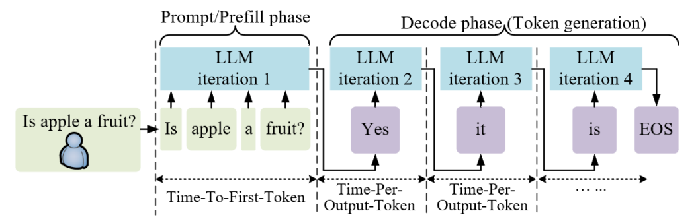
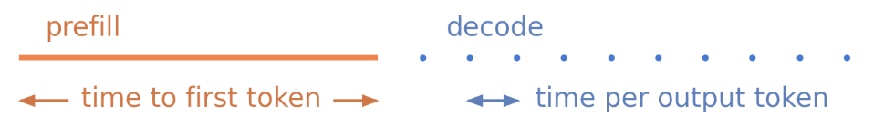
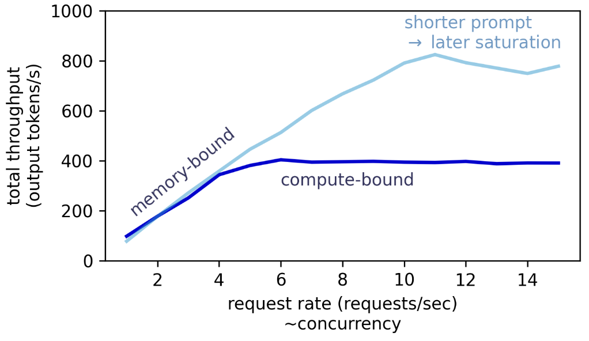

## 1. vLLM项目概述

正如vLLM官方所描述的那样，vLLM是一种用于LLM的**高吞吐量、高内存效率**的推理和服务引擎。它不仅通过一系列优化架构和推理加速技术：诸如PagedAttention、APC（自动前缀缓存）、连续批处理、推测解码、FlashAttention等极大地提升了推理效率，还通过统一的服务层对外提供OpenAI、Anthropic API或CLI等多样式的推理调用能力。

vLLM起源于2023年，它源于加州大学伯克利分校（UC Berkeley）Sky Computing Lab的一项研究工作。

故事要从2022年夏天说起，彼时，Sky Lab的一批博士生正在研究如何将大型深度学习模型的工作负载分布到多块GPU上，当他们架设Demo时，却发现推理速度**极为缓慢**。

"速度慢得离谱"，核心开发者之一Zhuohan Li回忆道，团队随即意识到：**内存管理正在成为服务这些模型的关键瓶颈**。

于是，Li与另一位研究者Woosuk Kwon深入钻研，借鉴操作系统中经典的虚拟内存与分页机制，提出了PagedAttention算法，并以此为核心构建了vLLM系统。

2023年6月，vLLM正式以开源形式发布，同年9月，相关论文《Efficient Memory Management for Large Language Model Serving with PagedAttention》发表于操作系统顶级会议SOSP 2023，奠定了项目的学术根基。

论文的主要作者团队包括：Woosuk Kwon、Zhuohan Li、Simon Mo等人，指导教授为Ion Stoica（曾带领团队创建了Spark和Ray等知名开源项目）。


vLLM发布后，GitHub Star数量便一路飙升，社区热度持续攀升。截至目前，vLLM的Github Star数已达到74K+，吸引了超过2000+名贡献者，支持上百种模型架构，涵盖几乎所有主流开源模型，在2026年初，核心创始团队还以vLLM为核心组建了商业公司**Inferact**，并完成了1.5亿美元种子轮融资，估值8亿美元。

如今，vLLM俨然已经成为开源LLM推理领域的**事实标准**，理解它，就是理解现代LLM推理系统工程的核心。

## 2. LLM推理的核心挑战

在理解vLLM架构和原理之前，我们需要先搞清楚它最初想要解决的问题，这也是所有面向高吞吐、高效率的推理引擎设计所必须要解决和优化的问题。

### 2.1 自回归生成

大语言模型在生成文本时遵循**自回归**（Autoregressive）范式：每次只生成一个token，并将其添加到序列末尾，再以整个新序列为输入生成下一个token。

这个过程有一个天然的**串行依赖性**：第N个token的生成依赖于前N-1个token的结果。这与训练阶段可以在整个序列上并行计算梯度的方式截然不同，是推理效率的核心约束。

比如：

```
输入 Prompt:    ["今天", "天气", "怎么"]
                     ↓  (一次前向传播)
生成 Token 1:   "样"
                     ↓
序列变为:        ["今天", "天气", "怎么", "样"]
                     ↓  (再次前向传播)
生成 Token 2:   "？"
                     ↓
序列变为:        ["今天", "天气", "怎么", "样", "？"]
                     ↓
...直到生成 <EOS>
```

可见，要完整回答一个Prompt，大模型要经历成百上千次的steps，每次仅生成一个token，以此类推，直至输出达到了模型预先定义的最大长度，如4096个tokens，或者遇到输出终止符，如EOF：



大模型的自回归推理特质也带来了一个根本性的问题：**每生成一个token，都需要对整个历史序列重新计算注意力**。如果序列已经有1000个token，生成第1001个token时，我们要对这1000个token全部重新算一遍，这是巨大的计算浪费。


而这正是KV Cache诞生的动机，我们稍后会详细讲解。

### 2.2 Prefill vs Decode

在整个自回归过程中，LLM推理在计算性质上分为两个截然不同的阶段：

**Prefill阶段（预填充）**

处理用户输入的完整Prompt，一次性完成所有Prompt Token的前向传播，并将每个Token在每一层、每个注意力头上对应的Key和Value向量写入KV Cache。

它的特征在于：
- 一次性处理大量token，属于**计算密集型**（Compute-bound）
- 性能瓶颈：GPU算力（FLOPS）

**Decode阶段（解码）**

每次只处理最新生成的1个Token，利用KV Cache中已缓存的历史信息完成注意力计算，采样出下一个Token。

它的特征在于：
- 每步仅处理1个token，但需要加载完整模型权重和KV Cache，属于**内存带宽密集型**（Memory-bound）
- 性能瓶颈：GPU显存带宽

Prefill和Decode之间的差异也体现在文本生成的两个关键指标上：TTFT、TPOT。

TTFT（Time To First Token，首Token延迟）指的是预填充阶段的延迟，而TPOT（Time Per Output Token，Token间延迟）指的是单个解码步骤的延迟。尽管预填充阶段也只生成一个词，但由于模型需要一次性处理所有输入，因此其耗时远长于单个解码步骤。



对于Chat场景较多的AI交互式应用而言，TTFT和TPOT都是重要的指标。比如，如果用户需要等待超过5秒才能看到回复，他们可能会认为应用出现故障而离开，同样，如果文本生成速度慢到每秒只有1个token，用户也没有足够的耐心等待其完成。

因此，对于交互式AI应用或Agent而言，TTFT和TPOT指标往往是判定应用是否满足SLA的首选，而综合根据模型大小、硬件配置、输入输出长度和并发负载等多种因素，同时实现这两个延迟目标有时并不容易。

而对其他非交互式用例场景而言，它们可能并不关心单个请求的延迟，而只关注总吞吐量（每秒处理的Token数，所有并发请求的总和）。例如，当您需要为书籍生成翻译或汇总大型代码库中的代码文件时，类似这种场景，更大的吞吐意味着这项工作能更快完成。

一般来说，吞吐可以随着并发数调大而不断提高，直到GPU的某个资源利用率达到饱和，在Prefill阶段，单个带有较长输入的请求就有可能达到GPU利用率的最大值，比如使得GPU的算力资源达到饱和，而在Decode阶段，因为Decode对算力的消耗更少，则可以通过批量处理多个请求来提高GPU的利用率，直到请求数达到某个阈值，此时可能触及到算力资源达到饱和或者显存带宽资源饱和。

因此，在绘制推理服务吞吐量与并发请求数的二维关系图时，我们会发现低并发量下吞吐量几乎总是呈线性增长，因为当并发量较低时，GPU算力尚未被充分占用，此时瓶颈在于显存带宽，这也意味着，每处理一个新请求，都需要从显存重新加载模型权重。此时增加并发，相当于让同一次权重加载服务于更多请求，分摊了访存开销，因此吞吐量随并发量近似线性增长。当并发量超过某一阈值后，GPU算力被打满，系统进入计算密集型状态，此后继续增加并发，请求只能排队等待，吞吐量不再提升，曲线趋于平坦。


如上图，它展示了推理服务吞吐随并发数在不同场景下的吞吐变化趋势，值得注意的是，饱和发生的时机并非固定，它取决于多种复杂条件的累加，比如它可以与prompt长度呈现一定关联：
- **长prompt**：prefill阶段本身计算量大，少量并发即可打满GPU，饱和点出现更早；
- **短prompt**：单次prefill消耗算力少，需要更多并发才能打满GPU，饱和点出现更晚，峰值吞吐也更高；

> [!Quote] 
> **为什么LLM推理的瓶颈转移路线往往是：先内存带宽，再到算力呢？**
> 
> 1. LLM decode阶段的核心特征是每次只生成一个token，每个请求的计算量极小，但需要把整个模型权重（几十或上百GB）从显存搬到计算单元，并发量低时，这些权重搬运的开销**无法被多个请求分摊**，GPU的计算单元大量空转，瓶颈自然在内存带宽；
> 2. 随着并发增加，同一批权重搬运可以服务更多请求，内存带宽利用率趋于饱和，算力才成为新瓶颈；
> 
> **什么场景下会存在瓶颈"先算力、后内存"？**
> 
> 1. 超长prefill、短decode：如果请求几乎只有prefill（比如summarization任务，输入8~256K+tokens，输出0.5~1K tokens），prefill是大矩阵乘运算，天然算力密集，并发量一增加，算力立刻打满，但后续decode极短，内存带宽瓶颈还没来得及显现任务就结束了；
> 2. 模型极小 + 显存带宽极高：模型权重很小，内存带宽相对充裕，而prefill的矩阵运算依然可以压满算力，此时即使在decode阶段，带宽余量也比较大，瓶颈更多在算力侧；

这里留下几个小问题，大家可以试着思考下：
1. 在推理过程中，模型权重的内存带宽搬运开销是否几乎恒定、不随并发变化？
2. 在实际的并发推理中，不同请求可能会处于不同层、不同的token位置，这会影响权重搬运吗？

### 2.3 注意力机制的计算复杂性

几乎所有主流的大语言模型都沿用了Transformer这一经典架构，而Transformer的注意力机制在推理过程中是极大的开销来源。

让我们来回顾一下，在prefill阶段，所有输入的查询query都需要xx，标准的Scaled Dot-Product Attention计算公式是：

在decode阶段，xx，在每个step阶段，只有一个query，因此注意力计算公式是：

其计算复杂度和内存复杂度分析：

```
计算复杂度（FLOPs）: O(n² · d_k)     ← 随序列长度平方增长！
内存复杂度（注意力矩阵）: O(n²)        ← n×n 的注意力分数矩阵

当 n = 1000 时：注意力矩阵有 1,000,000 个元素
当 n = 8000 时：注意力矩阵有 64,000,000 个元素  (增大 64 倍！)
当 n = 32000 时：注意力矩阵有 1,024,000,000 个元素
```

这种**二次方增长**是长上下文推理面临挑战的根本数学原因。

### 2.3 KV Cache

KV Cache 是 LLM 推理中最重要的优化，也是后续所有问题的根源。让我们彻底搞清楚它。

**为什么需要 KV Cache？**

在自回归解码中，每生成一个新 token，都需要计算它对所有历史 token 的注意力。而历史 token 的 K（Key）和 V（Value）向量在每一步都是完全相同的——它们只由对应的 token 本身决定，不随步骤变化。

如果每步都重新计算所有历史 token 的 K/V，那么生成一个长度为 $m$ 的序列（原始 Prompt 长度为 $n$），总计算量是：

$$\text{Without KV Cache: } \sum_{i=1}^{m} (n+i) = mn + \frac{m(m+1)}{2} = O(m^2)$$

有了 KV Cache，我们只需每步计算新 token 的 K/V 并追加到缓存中，每步计算量变成 $O(1)$，总计算量降到：

$$\text{With KV Cache: } O(m) \quad \text{（线性！）}$$

**KV Cache 究竟存了什么？**

```
一个 Transformer 层的结构（简化）:

输入 Token Embedding
        │
   ┌────▼────┐
   │  线性变换 │  → Q（Query）: 用于"提问"，查询其他 token
   │  W_Q    │
   └─────────┘
   ┌────▼────┐
   │  线性变换 │  → K（Key）:   用于"被查询"，描述自身特征   ← 缓存这个！
   │  W_K    │
   └─────────┘
   ┌────▼────┐
   │  线性变换 │  → V（Value）: 用于"输出信息"，携带实际内容 ← 缓存这个！
   │  W_V    │
   └─────────┘
```

KV Cache 的精确大小公式：

$$\text{KV Cache 大小（字节）} = 2 \times n_{layers} \times n_{heads} \times d_{head} \times n_{tokens} \times \text{sizeof(dtype)}$$

以 **LLaMA-2 7B** 为例（FP16 精度）：
- $n_{layers} = 32$，$n_{heads} = 32$，$d_{head} = 128$
- 每个 token 占用：$2 \times 32 \times 32 \times 128 \times 2 = 524,288$ 字节 ≈ **0.5 MB/token**
- 一个 4096 token 的请求：4096 × 0.5 MB ≈ **2 GB**

```
LLaMA-2 7B KV Cache 内存占用速算表
─────────────────────────────────────────────────
序列长度    单请求 KV Cache    10并发       100并发
─────────────────────────────────────────────────
  512         256 MB          2.5 GB        25 GB
 1024         512 MB          5.0 GB        50 GB
 2048         1.0 GB         10.0 GB       100 GB
 4096         2.0 GB         20.0 GB       200 GB
 8192         4.0 GB         40.0 GB       400 GB
─────────────────────────────────────────────────
注：一张 A100 80GB GPU 减去模型权重(~14GB)后仅剩约 66GB 用于 KV Cache
```

这个数字让人触目惊心：**KV Cache 的内存需求可以轻易超过模型权重本身！** 这就是为什么 KV Cache 的管理方式，是整个 LLM 推理系统设计的核心命题。

## 3. 早期推理框架设计

理解了推理的本质挑战之后，我们来看 vLLM 出现之前，主流框架是如何应对这些挑战的，以及它们的局限在哪里。

### 3.1 HuggingFace Transformers

HuggingFace Transformers 库是最广泛使用的 LLM 推理入口。它的推理方式足够简单直观，但在生产场景下存在明显问题。

**朴素的静态批处理（Static Batching）**

```python
# HuggingFace典型批推理示例（伪代码）
from transformers import AutoModelForCausalLM, AutoTokenizer

model = AutoModelForCausalLM.from_pretrained("meta-llama/Llama-2-7b-hf")
tokenizer = AutoTokenizer.from_pretrained("meta-llama/Llama-2-7b-hf")

# 一批请求同时进入
prompts = ["写一首诗", "解释量子力学", "帮我写个 Python 函数"]
inputs = tokenizer(prompts, return_tensors="pt", padding=True)  # 需要 padding 对齐！

# 所有请求一起开始，一起结束
outputs = model.generate(**inputs, max_new_tokens=200)
# ⚠️ 问题来了：三个请求分别生成了 10、180、50 个 token
# 为了等待"写解释量子力学"的请求完成，
# 另两个请求已经生成完毕的 GPU 算力被完全闲置！
```

下图展示了静态批处理的 GPU 利用率问题：

```
时间轴 →→→→→→→→→→→→→→→→→→→→→→→→→→→→→→→→

请求 A（短）: ████████░░░░░░░░░░░░░░░░░░░░░░░░░░░░  (10 tokens 完成，等待)
请求 B（长）: ████████████████████████████████████  (180 tokens 生成中)
请求 C（中）: ████████████████████░░░░░░░░░░░░░░░░  (50 tokens 完成，等待)

           ▲
           └── 所有请求必须等待最长的请求 B 结束才能释放
                   ░ = GPU 算力浪费（等待）

实际 GPU 利用率:  有效计算 ████  等待浪费 ░░░░
```

**静态批处理的核心痛点总结：**
- 请求长度参差不齐，短请求的 GPU 算力大量空置
- 需要 Padding（补零对齐），浪费计算和内存
- 无法动态插入新请求，实时性差
- KV Cache 必须为每个请求预留 `max_length` 大小的空间，利用率极低

---

### 3.2 HuggingFace TGI

针对静态批处理的问题，HuggingFace 的 Text Generation Inference（TGI）框架引入了**连续批处理（Continuous Batching）**，也称为 In-flight Batching，这是 vLLM 原始论文中引用的重要前驱工作。

**连续批处理的改进思路**：不再等待整个 batch 完成，而是在每个解码步骤（iteration）级别动态地添加新请求、移除完成的请求。

```
连续批处理示意图（Iteration-level Scheduling）:

时间步  Step1  Step2  Step3  Step4  Step5  Step6  Step7
────────────────────────────────────────────────────────
请求 A   [A]    [A]    [A]   [完成]
请求 B   [B]    [B]    [B]    [B]    [B]   [完成]
请求 C   [C]    [C]   [完成]
请求 D                        [D]    [D]    [D]   [D]  ← Step4 动态插入！
请求 E                               [E]    [E]   [完成]
────────────────────────────────────────────────────────
                              ↑
                    不用等 A/B/C 全部完成
                    C 完成后立即插入 D！

GPU 利用率:  ████████████████████████████████████
            每一步 GPU 都被充分利用！
```

这是一个巨大的改进。但 TGI 在实际生产中依然面临一个**致命的内存问题**：

**KV Cache 的静态预分配与内存碎片**

即使有了连续批处理，TGI 仍然需要为每个活跃请求预先分配一整块**连续的**、大小为 `max_sequence_length` 的 GPU 内存来存放 KV Cache。

```
早期系统 GPU 内存布局示意（传统连续分配方式）:

GPU 显存 [80 GB Total]
┌─────────────────────────────────────────────────────────────────────┐
│ 模型权重 (14 GB)  │                   KV Cache 区域                   │
│  (固定占用)        │                                                   │
└───────────────────┴───────────────────────────────────────────────────┘

KV Cache 区域放大（约 60 GB）:
┌──────────┬──────────┬──────────┬──────────────────────────────────────┐
│  请求 A   │  请求 B   │  请求 C   │         未分配 / 碎片              │
│ 预留4096 │ 预留4096 │ 预留4096 │                                      │
│ 实用 200  │ 实用3900 │ 实用 50   │                                      │
│ ░░░░░░░  │ ██████   │ ░░░░░░░  │                                      │
│(浪费3896)│(浪费196) │(浪费4046)│                                      │
└──────────┴──────────┴──────────┴──────────────────────────────────────┘
     ↑            ↑          ↑
  内部碎片    内部碎片     内部碎片

█ = 已使用    ░ = 预留但未使用（内部碎片）
```

这带来了三层内存浪费，正如后来 vLLM 论文中精确测量的那样：

**① 预留但未使用（Reserved）**：为应对最大可能的输出长度，系统预先分配了完整的 `max_length` 空间，但大多数请求根本生成不了那么长。

**② 内部碎片（Internal Fragmentation）**：即使分配的空间最终会被用完，在请求进行的过程中，已分配但还未填入数据的位置始终闲置。

**③ 外部碎片（External Fragmentation）**：不同请求分配和释放了不同大小的内存块后，GPU 内存变得像瑞士奶酪——碎片总量很多，但没有一块足够大的**连续**空间能分配给新请求。

**vLLM 论文的实测数据令人震惊：**


> [!Quote] Title
> 在传统系统中，已分配的 KV Cache 内存中，真正被实际使用的部分 **仅有 20%—38%**。
>
> 《Efficient Memory Management for Large Language Model Serving with PagedAttention》，SOSP 2023

换句话说，**60%—80% 的 GPU KV Cache 内存在传统系统中被白白浪费**。

这不是一个优化空间，这是一个根本性的设计缺陷。

---

### 3.3 动态工作负载 vs 静态内存假设

让我们把问题提炼清楚。LLM 推理的工作负载天然是**动态的、不可预测的**：

```
不可预测性来源:
  • 不同请求的 Prompt 长度不同（10 tokens ~ 10,000 tokens）
  • 不同请求的生成长度不同（系统运行时无法知道会生成多少 token）
  • Beam Search / 并行采样会产生多个分支序列
  • 请求随时到达，随时完成
```

而 GPU 的内存分配机制要求：**高效计算需要连续的、预先分配的内存布局**。

这是一个根本性的矛盾：
```
动态工作负载  ←────矛盾────→  静态内存分配
```

早期的所有框架，包括 TGI，都在用"分配一个足够大的连续块，不管实际用了多少"的方式来回避这个矛盾。结果就是：

- 想提高并发？内存不够，因为每个请求都霸占了一大块碎片化的空间
- 想支持长上下文？KV Cache 需求更大，内存压力直接让系统崩溃
- 连续批处理带来了更多并发请求？内存爆炸得更快

这就是驱动 vLLM 核心创新诞生的根本矛盾。

## 4. PagedAttention：破局的钥匙

### 4.1 灵感来源：向操作系统学习

面对 KV Cache 内存管理的难题，vLLM 的作者们做了一个绝妙的类比：

> **"LLM 推理系统的 KV Cache 管理问题，和操作系统的内存管理问题，在本质上是一样的。"**

在操作系统中，这个问题早在几十年前就被解决了——**虚拟内存与分页（Virtual Memory & Paging）**。

操作系统不会为每个进程预留一整块连续的物理内存，而是：
1. 把内存分成固定大小的**页（Page）**
2. 每个进程拥有一个**连续的虚拟地址空间**（逻辑视图）
3. 通过**页表（Page Table）** 把虚拟地址映射到分散在物理内存各处的物理页
4. 物理页可以按需分配，用完即释放

```
操作系统虚拟内存 → PagedAttention 的直接对应关系:

OS 概念                    PagedAttention 对应概念
──────────────────────────────────────────────────
物理内存页 (Physical Page)  物理 KV 块 (Physical KV Block)
虚拟地址空间               逻辑 KV 序列 (Logical KV Sequence)
页表 (Page Table)          块表 (Block Table)
页面置换 (Page Swap)       KV 块换出到 CPU 或重计算
写时复制 (Copy-on-Write)   共享前缀的 Copy-on-Write
```

这个类比不只是隐喻，而是真正地将 OS 领域几十年的工程智慧移植到了 LLM 推理领域。

---

### 4.2 PagedAttention 的核心设计

PagedAttention 的核心思想可以用一句话概括：

> **把每个请求的 KV Cache 从一整块连续大内存，变成若干固定大小的非连续小块（Block），通过块表动态管理映射关系。**

**关键数据结构：**

```
逻辑块（Logical Block）— 序列的视角:
┌────┬────┬────┬────┬────┬────┬────┬────┐
│ L0 │ L1 │ L2 │ L3 │ L4 │ L5 │ L6 │ L7 │  ← 请求看到的是连续的逻辑序列
└────┴────┴────┴────┴────┴────┴────┴────┘
  每个逻辑块 = 16 个 token 的 KV（block_size = 16）

块表（Block Table）— 逻辑到物理的映射:
┌────────────┬────────────────────┐
│ 逻辑块编号  │   物理块编号        │
├────────────┼────────────────────┤
│     L0     │        P7          │  ← 物理块不需要连续！
│     L1     │        P2          │
│     L2     │        P15         │
│     L3     │        P9          │
└────────────┴────────────────────┘

物理 KV 块（Physical KV Block）— GPU 显存的实际布局:
┌────┐ ┌────┐     ┌────┐     ┌────┐     ┌────┐
│ P0 │ │ P1 │ ... │ P2 │ ... │ P7 │ ... │P15 │
│    │ │空闲│     │(L1)│     │(L0)│     │(L2)│
└────┘ └────┘     └────┘     └────┘     └────┘
物理块分散在 GPU 显存各处，但通过块表可以正确拼接成连续的逻辑序列
```

**内存分配对比：**

```
传统方式 vs PagedAttention 对比（假设 max_len=4096，block_size=16）:

[传统方式] — 请求 A 实际只用了 200 tokens:
GPU 内存: ├─────────── 4096 tokens 空间（256个块大小）────────────┤
         │████████████████████████░░░░░░░░░░░░░░░░░░░░░░░░░░░░░│
         │<── 200 tokens 已用 ──> <──────── 3896 tokens 浪费 ──>│
         利用率: 200/4096 = 4.9%  ❌

[PagedAttention] — 同样请求 A 只用了 200 tokens:
GPU 内存: ├──────────────────────────────────────────────────────┤
         │[P3][P11][P5][P22][P8][P19][P7][P1][P33][P44][P2][P6]│
         只分配了 ceil(200/16) = 13 个物理块
         利用率: 200/208 = 96.2%  ✓（仅最后一块有 8 tokens 的内部碎片）
```

**最大内部碎片 = `block_size - 1` = 最多 15 个 token 的浪费**，这与传统方式动辄几千 token 的浪费相比，几乎可以忽略不计。

---

### 4.3 注意力计算如何适配分块存储？

一个很自然的疑问：注意力计算需要访问所有历史 token 的 K 和 V，如果它们不是连续存储的，怎么计算？

关键在于：**注意力的数学本质是对所有 token 的加权求和，它只需要能够遍历所有历史 K/V，而不要求它们必须连续存储。**

PagedAttention 重写了注意力计算核（CUDA Kernel），使其按块（block-by-block）遍历：

```python
# PagedAttention 注意力计算的伪代码（概念展示）

def paged_attention(query, block_table, kv_cache, num_tokens):
    """
    query:       当前新 token 的 Query 向量
    block_table: 逻辑块 → 物理块的映射表
    kv_cache:    所有物理块的 KV 数据池
    """
    output = zeros_like(query)
    
    # 分块计算注意力（在线 softmax 算法）
    max_score = -inf
    exp_sum = 0
    
    for logical_block_idx in range(num_logical_blocks):
        # 1. 通过块表找到物理块地址
        physical_block_idx = block_table[logical_block_idx]
        
        # 2. 从物理块加载 Key 和 Value（无论它在哪个位置）
        keys   = kv_cache[physical_block_idx].keys    # shape: [block_size, d_k]
        values = kv_cache[physical_block_idx].values  # shape: [block_size, d_v]
        
        # 3. 计算注意力分数（数学上与连续存储完全等价）
        scores = dot_product(query, keys) / sqrt(d_k)
        
        # 4. 在线 softmax 归一化（Flash Attention 思想）
        max_score, exp_sum, output = online_softmax_update(
            output, scores, values, max_score, exp_sum
        )
    
    return output  # 数学结果与传统连续 Attention 完全相同！
```

**核心结论**：分块存储对注意力的数学结果**零影响**，改变的只是内存访问模式。代价是每次注意力计算需要多走一次"查表"的间接寻址，但这个代价相比系统吞吐量的提升微乎其微（论文测量 per-kernel 约有 20-26% 开销，但端到端吞吐提升 2-4 倍）。

### 4.4 共享物理块：Prefix Sharing 与 Copy-on-Write

PagedAttention 还带来了一个传统系统完全无法做到的能力：**多个请求共享相同前缀的 KV Cache 物理块**。

**场景一：System Prompt 共享**

现实中大量请求共享相同的 System Prompt（如"你是一个有帮助的助手..."）。在传统系统中，这段 System Prompt 对应的 KV Cache 会为每个请求各复制一份，造成大量重复存储。

```
传统方式（无共享）:

请求 A:  [System Prompt KV (300 tokens)]  [User Query A KV]
         ─────────────────────────────────────────────────
请求 B:  [System Prompt KV (300 tokens)]  [User Query B KV]
         ─────────────────────────────────────────────────
请求 C:  [System Prompt KV (300 tokens)]  [User Query C KV]
         ─────────────────────────────────────────────────
System Prompt 内存占用 × 3，大量浪费！

PagedAttention 前缀共享:

物理内存:  [P0][P1]...[P18]     [PA_priv]  [PB_priv]  [PC_priv]
           ─────────────────     ─────────  ─────────  ─────────
           System Prompt 的      A 私有块    B 私有块    C 私有块
           19 个共享物理块
                ↑
请求 A 块表: L0→P0, L1→P1, ..., L18→P18, L19→PA_priv
请求 B 块表: L0→P0, L1→P1, ..., L18→P18, L19→PB_priv  ← 共享前 19 块！
请求 C 块表: L0→P0, L1→P1, ..., L18→P18, L19→PC_priv  ← 共享前 19 块！
```

**场景二：Beam Search 的写时复制（Copy-on-Write）**

在 Beam Search 中，多个候选序列（beam）从同一前缀出发，各自往不同方向延伸。在发生分叉之前，所有 beam 的 KV Cache 是完全相同的，可以共享；只有当 beam 开始生成不同 token 时，才需要真正拷贝并独立存储。

```
Beam Search 中的 Copy-on-Write:

        [共享前缀: "The weather today is"]
                        │
              ┌─────────┴──────────┐
              ↓                    ↓
         Beam 1: "sunny"      Beam 2: "cloudy"
              │                    │
       (仍然共享            (发生分叉！
        前缀物理块)          此时才拷贝前缀的物理块
                              并各自独立写入新 token)

内存节省：论文报告 Beam Search 场景下 KV Cache 内存节省高达 55%！
```

### 4.5 vLLM 调度器：把一切串联起来

有了 PagedAttention 作为内存管理基础，vLLM 的调度器（Scheduler）得以实现真正高效的连续批处理。调度器在每个推理步骤中做如下决策：

```
vLLM 每个推理步骤（Step）的调度逻辑:

新到达请求池                正在运行的请求
[Req_new_1]               [Req_A: Decode step 10]
[Req_new_2]  ─── 调度 ──→  [Req_B: Decode step 3 ]  ─→ GPU 前向推理
[Req_new_3]               [Req_C: Decode step 50 ]
                           [Req_new_1: Prefill!  ]  ← 新请求被插入！

调度决策流程:
┌─────────────────────────────────────────────────────────┐
│  1. 检查哪些正在运行的请求已完成 → 移出，释放其物理块       │
│  2. 检查等待队列中的新请求 → 为其分配物理块（如果内存够）   │
│  3. 如果内存不足 → 将低优先级请求的 KV 块换出（Swap）      │
│     或直接抢占（Preemption）并等待重新调度                 │
│  4. 执行本步骤的 Prefill + Decode 混合批次               │
│  5. 为新生成的 token 追加新的物理块（如需要）              │
└─────────────────────────────────────────────────────────┘
```

这个机制的精髓在于：由于 KV Cache 是按块管理的，**每个物理块都可以精确、及时地被分配和回收**，调度器对内存的掌控粒度从"整个请求"缩小到了"一个 16-token 的块"，灵活性提升了数个量级。

### 4.6 量化效果：vLLM 究竟快了多少？

以下是来自 vLLM 原始论文（SOSP 2023）的实验对比数据，对比对象是当时的主流框架 FasterTransformer 和 Orca：

```
吞吐量对比（请求/秒，ShareGPT 数据集，LLaMA-13B，A100×1）:

框架               吞吐量(req/s)    相对 vLLM
──────────────────────────────────────────────
HuggingFace         ~0.3            0.06×
FasterTransformer   ~1.2            0.25×
Orca                ~2.1            0.44×
vLLM (ours)         ~4.8            1.00×  ✓
──────────────────────────────────────────────
vLLM 相较 HuggingFace 实现: ~16× 吞吐提升
vLLM 相较 FasterTransformer: ~4× 吞吐提升
vLLM 相较 Orca:             ~2× 吞吐提升
```

更直观地说：**用同样的硬件，vLLM 可以服务比 HuggingFace 原生推理多出约 16 倍数量的用户请求**，这在工程实践中意味着巨大的成本节省。

## 5. 本章小结：从问题到方案的思维链

让我们用一条清晰的逻辑线把本章的核心思想串联起来：

```
LLM 自回归解码的本质
    │
    ├─→ 每步只生成 1 token，高度串行
    │
    ├─→ 必须缓存历史 KV（否则计算量 O(n²)） → 诞生 KV Cache
    │
    ├─→ KV Cache 体积巨大（0.5 MB/token），随并发线性增长
    │
    └─→ 传统框架用连续预分配处理 KV Cache
            │
            ├─→ 预留浪费 + 内部碎片 + 外部碎片
            │
            ├─→ 实际内存利用率仅 20%-38%
            │
            └─→ 内存不够 → 并发上不去 → 吞吐低下
                    │
                    └─→ [PagedAttention 破局]
                            │
                            ├─→ 借鉴 OS 虚拟内存分页思想
                            ├─→ KV Cache 以固定大小块（Block）管理
                            ├─→ 块表实现逻辑连续、物理分散
                            ├─→ 内存利用率提升至 ~96%
                            ├─→ 支持物理块共享（Prefix Sharing）
                            └─→ 并发大幅提升，吞吐 2-4× 提升
```
