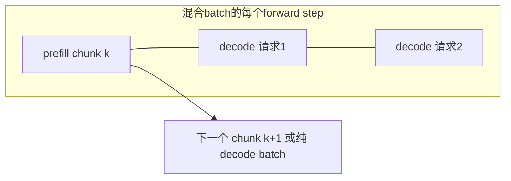
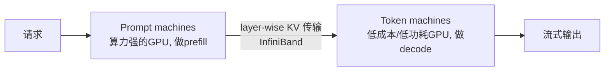
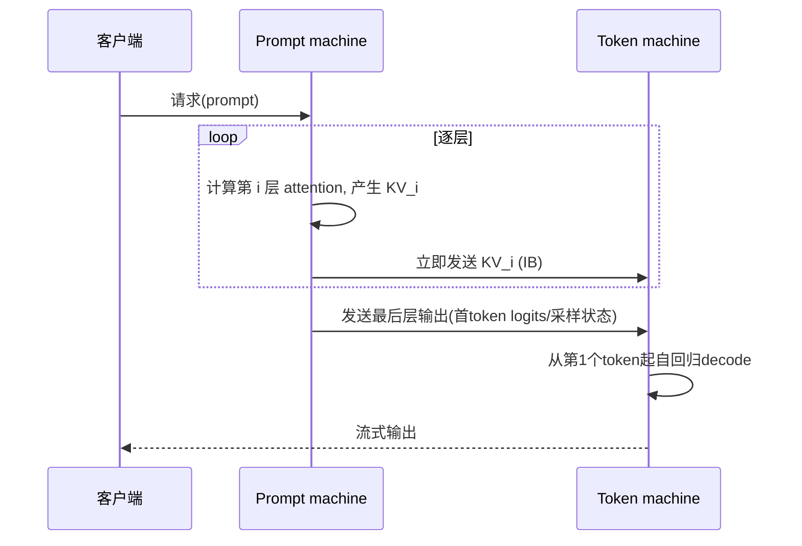
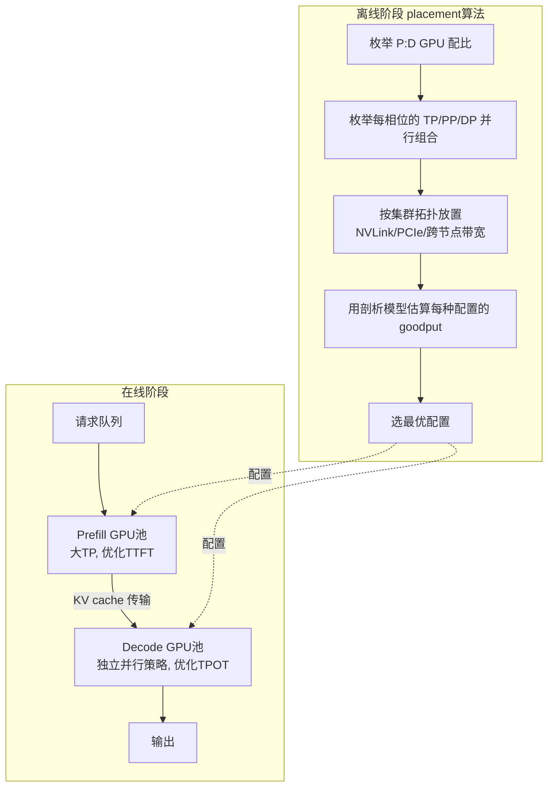
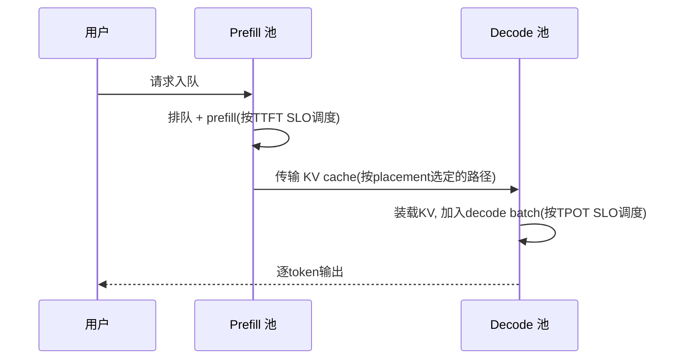
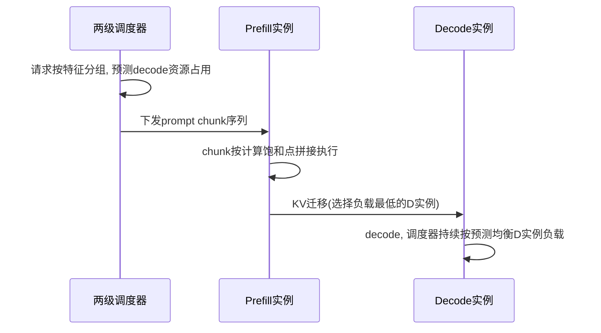
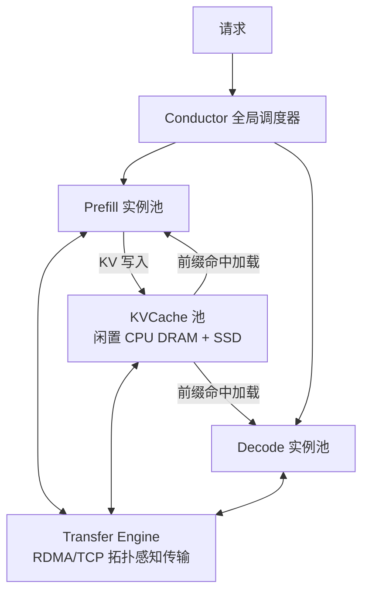
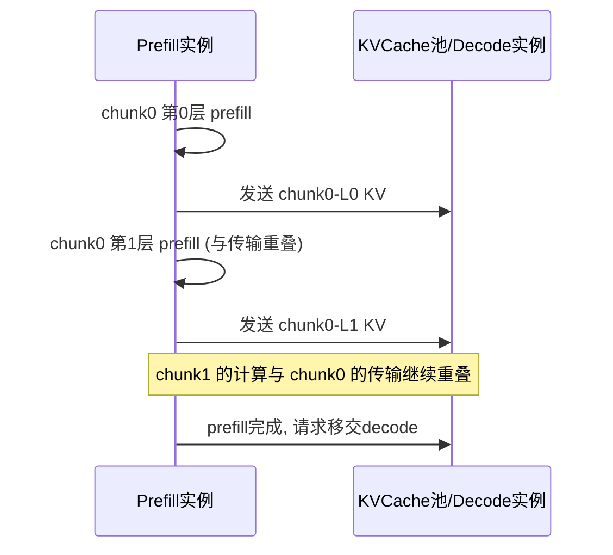
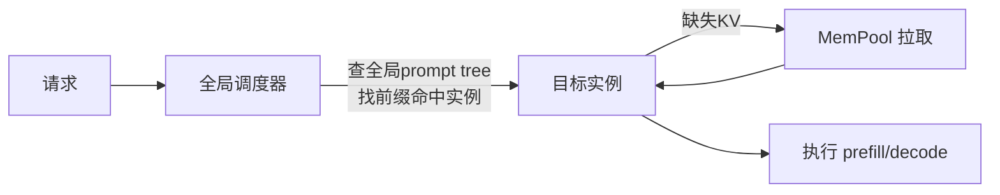
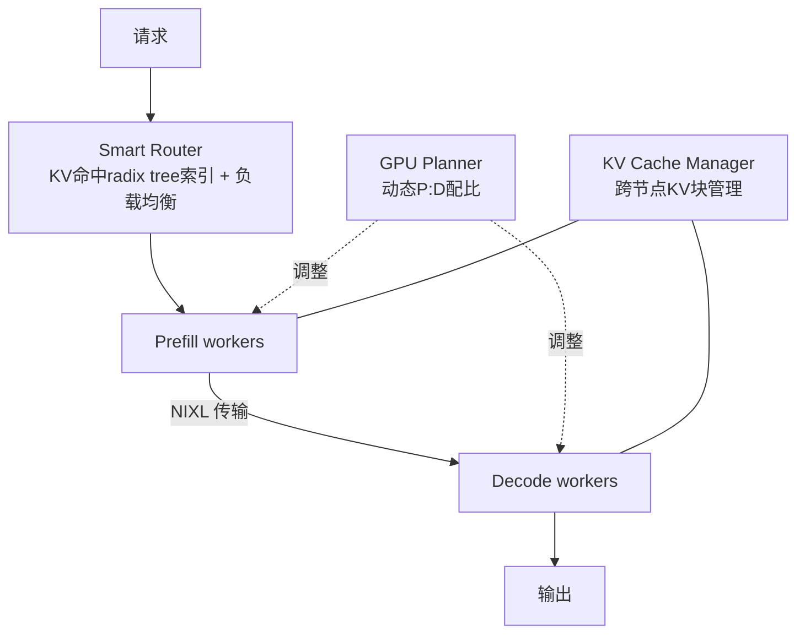

---
tags:
  - vLLM
  - PD分离
  - 调研
updated: 2026-08-07
description: PD 分离方向论文与开源项目的深度调研，逐篇给出链接、核心思想、架构设计、执行流与图示，并梳理与 vLLM 实现的对应关系。
---

# 01 PD分离论文脉络调研

本文逐篇深入 PD 分离（Prefill/Decode Disaggregation）方向的论文与关键开源项目：每篇给出原文链接、要解决的问题、核心思想与逻辑、架构设计、执行流（配 mermaid 图）、关键结果与历史意义。阅读顺序即该领域的发展顺序。

## 1 论文全景索引

| 论文 | 发表 | 链接 | 一句话定位 |
| --- | --- | --- | --- |
| PagedAttention / vLLM | SOSP 2023 | [arXiv 2309.06180](https://arxiv.org/abs/2309.06180) | 奠基：KV cache 分页化，使其可寻址、可搬运 |
| Sarathi-Serve | OSDI 2024 | [arXiv 2403.02310](https://arxiv.org/abs/2403.02310) | 对照路线：chunked prefill + stall-free 调度 |
| Splitwise | ISCA 2024 | [arXiv 2311.18677](https://arxiv.org/abs/2311.18677) | 首次提出相位分离，硬件经济学视角 |
| DistServe | OSDI 2024 | [arXiv 2401.09670](https://arxiv.org/abs/2401.09670) | 第一个系统化 PD 分离 serving，提出 goodput |
| TetriInfer | arXiv 2024 | [arXiv 2401.11181](https://arxiv.org/abs/2401.11181) | chunk 级调度 + 两级调度避免 decode 热点 |
| Mooncake | FAST 2025 最佳论文 | [arXiv 2407.00079](https://arxiv.org/abs/2407.00079) | KVCache-centric 生产架构（Kimi） |
| MemServe | arXiv 2024 | [arXiv 2406.17565](https://arxiv.org/abs/2406.17565) | 弹性 MemPool + 全局 prompt tree 缓存调度 |
| Llumnix | OSDI 2024 | [arXiv 2406.03243](https://arxiv.org/abs/2406.03243) | 请求与 KV 状态的跨实例活迁移（重调度基础） |
| LoongServe | SOSP 2024 | [arXiv 2404.09526](https://arxiv.org/abs/2404.09526) | 长上下文对照路线：弹性序列并行（ESP） |
| EPD Disaggregation | ICML 2025 | [arXiv 2501.05460](https://arxiv.org/abs/2501.05460) | 多模态：Encode/Prefill/Decode 三段分离 |
| DOPD | IEEE TSC 2026 | [arXiv 2511.20982](https://arxiv.org/abs/2511.20982) | 动态 P:D 配比，解决生产者-消费者失衡 |
| MegaScale-Infer | arXiv 2025 | [arXiv 2504.02263](https://arxiv.org/abs/2504.02263) | 分离思想的进一步细化：attention 与 FFN 分离（MoE） |

配套开源项目：

| 项目 | 链接 | 角色 |
| --- | --- | --- |
| Mooncake（Transfer Engine + Store） | [github.com/kvcache-ai/Mooncake](https://github.com/kvcache-ai/Mooncake) | 传输引擎 + 分布式 KV store |
| NIXL | [github.com/ai-dynamo/nixl](https://github.com/ai-dynamo/nixl) | 统一推理数据传输库（事实标准数据面） |
| Dynamo | [github.com/ai-dynamo/dynamo](https://github.com/ai-dynamo/dynamo) | PD 分离一等公民的推理服务框架 |
| LMCache | [github.com/LMCache/LMCache](https://github.com/LMCache/LMCache) | KV 缓存中间层 + 路由 |
| DistServe 开源实现 | [github.com/LLMServe/DistServe](https://github.com/LLMServe/DistServe) | 论文原型系统 |
| EPDServe | [github.com/vbdi/epdserve](https://github.com/vbdi/epdserve) | EPD 论文实现 |
| Llumnix | [github.com/AlibabaPAI/llumnix](https://github.com/AlibabaPAI/llumnix) | 活迁移重调度实现 |
| Sarathi-Serve | [github.com/microsoft/sarathi-serve](https://github.com/microsoft/sarathi-serve) | chunked prefill 参考实现 |

## 2 问题起源：两个相位的资源画像

所有 PD 分离工作共享同一个出发点：一个推理请求的两个相位资源画像完全相反。

| 维度 | Prefill（预填充） | Decode（解码） |
| --- | --- | --- |
| 做什么 | 一次处理全部输入 token，构建 KV cache，产出首 token | 自回归逐 token 生成，每步读全量 KV cache |
| 瓶颈 | 计算密集（compute-bound） | 访存密集（memory-bound），算力利用率常为个位数百分比 |
| 延迟语义 | TTFT | TPOT / ITL |
| 时长特征 | 随 prompt 长度剧烈波动，是干扰源 | 每步稳定，是被干扰方 |

混合部署的两难：continuous batching 让两相位共享每个 forward step，prefill 的大矩阵乘直接拖慢 decode 的逐 token 节奏（尾 ITL 尖刺）；同时两相位被迫共用同一套 TP/PP 并行策略与硬件配置，无法分别优化。Splitwise 论文对此做了系统性实测刻画（DGX-A100 上 prompt 阶段算力饱和、token 阶段带宽饱和而算力闲置），这个刻画成为后续所有论文引用的基础事实。

### 2.1 奠基工作：PagedAttention（SOSP 2023）

[PagedAttention / vLLM](https://arxiv.org/abs/2309.06180) 把 KV cache 切成固定大小的 page（block），用 block table 做非连续寻址。对 PD 分离的意义：KV 从此变成**可按 block 寻址、可离散搬运的结构**——跨实例传输 KV 只需传 block 列表与数据，不必关心逻辑连续性。vLLM 后来的 disagg 协议（remote_block_ids）直接建立在这个结构上。

### 2.2 对照路线：Sarathi-Serve（OSDI 2024）

[arXiv 2403.02310](https://arxiv.org/abs/2403.02310)，Microsoft Research + Georgia Tech。

**要解决的问题**：batch 中 prefill 与 decode 交错导致迭代时长不均，吞吐与尾延迟不可兼得。

**思想与逻辑**：不拆机器，而是拆 prefill——把一个 prefill 切成近似等大的 chunk，调度器构造 stall-free schedule：每个 iteration 要么是纯 decode batch，要么是「一个 prefill chunk + 若干 decode」拼成的**均匀 batch（uniform batching）**，decode 搭便车（piggyback）在 chunk 上执行，任何新请求加入都不暂停进行中的 decode。

**结果**：Mistral-7B 单 A100 上 serving capacity 2.6x，Yi-34B 双 A100 上 3.7x，Falcon-180B + PP 上 5.6x。

**与 PD 分离的关系**：两条路线长期并存竞争。chunked prefill 的局限——chunk size 难调、prefill 算力被 decode 稀释、TTFT 与 ITL 仍耦合在同一批硬件上——正是 PD 分离论点的论据；生产实践中两者并非互斥，P 实例内部仍常用 chunked prefill（vLLM 默认开启）。

## 3 Splitwise：相位分离的提出（ISCA 2024）

[arXiv 2311.18677](https://arxiv.org/abs/2311.18677)，Microsoft（Patel et al.）。

### 3.1 要解决的问题与核心洞察

从数据中心经济学出发：decode 阶段算力利用率极低，却占用着与 prefill 同样昂贵的最新 GPU。论文的关键论断有两条：

1. token 生成不需要最新 GPU 的算力，可以用**更低成本、更低功耗的硬件**承担；
2. 分离的唯一新增成本是 KV 状态迁移，而实测表明在 GPU 集群的背板互连（InfiniBand）下，**该成本可以忽略或被计算掩盖**。

### 3.2 架构设计

1. **Phase splitting**：prompt 计算机器与 token 生成机器物理分离，按相位各自选型、独立供给（provision）；
2. **layer-wise 状态迁移**：不等整个 prefill 结束，每算完一层就立即通过 IB 发送该层 KV，网络传输与剩余层的计算重叠（pipeline），把迁移延迟藏进 prefill 时间里；
3. **集群规划算法**：给定吞吐/成本/功耗三个目标之一，枚举 prompt:token 机器配比与异构机型组合（新卡跑 prefill、旧卡跑 decode），搜索最优集群构成。

### 3.3 执行流

### 3.4 结果与意义

相比不分离的同构集群：1.4x 吞吐且成本低 20%，或同成本同功耗下 2.35x 吞吐。**历史意义**：第一次把 PD 分离从调度技巧上升为集群架构问题，确立了「KV 传输代价可被高速互连消化」这一整个方向赖以成立的关键论断。

## 4 DistServe：第一个系统化实现（OSDI 2024）

[arXiv 2401.09670](https://arxiv.org/abs/2401.09670)，PKU/UCSD 等（Zhong et al.），开源实现 [LLMServe/DistServe](https://github.com/LLMServe/DistServe)。

### 4.1 要解决的问题：两种耦合

论文明确指出混合部署的两种耦合：

1. **干扰耦合**：prefill-decode 互相干扰，尾延迟不可控；
2. **资源耦合**：两相位共享资源分配与并行策略，无法按各自特性优化——应用层对 TTFT 和 TPOT 的要求不同，混合系统只能牺牲一个或过度供给算力。

由此提出目标函数 **goodput**：在同时满足 TTFT 与 TPOT SLO 前提下能服务的最大请求速率。这个指标后来成为整个领域的标准评价口径。

### 4.2 架构设计

1. **双池分离**：prefill 与 decode 分配给不同 GPU，消除干扰；
2. **解耦的并行策略**：每相位独立搜索最优 TP/PP/DP——prefill 计算密集偏向更大 TP，decode 访存密集可选不同形态；
3. **拓扑感知放置**：placement 算法把 KV 传输代价纳入考量，优先让 P/D 落在传输带宽高的位置（同节点 NVLink > 跨节点 IB > 以太网），用离线剖析（profiling）驱动的搜索代替在线试错；
4. **独立调度**：两侧各自 batching，prefill 侧按 TTFT 约束调度，decode 侧按 TPOT 约束调度。

### 4.3 执行流

### 4.4 结果与意义

在多种模型与应用负载上，相比当时 SOTA（vLLM 等）可多服务 7.4x 请求，或在相同请求率下承受 12.6x 更紧的 SLO，且 90%+ 请求满足延迟约束。**历史意义**：定义了 PD 分离的标准系统形态——P 实例 + D 实例 + KV 传输 + 外部编排 + 按 goodput 做配比搜索；vLLM 后来的 disagg 模式（两腿请求 + connector 传输 + 外置 router）是这个形态的直接映射。

## 5 TetriInfer：chunk 级与两级调度（arXiv 2024）

[arXiv 2401.11181](https://arxiv.org/abs/2401.11181)，ICT/中科院等（Hu et al.），论文题 *Inference without Interference: Disaggregate LLM Inference for Mixed Downstream Workloads*。

### 5.1 要解决的问题

面向**混合下游负载**（多个下游任务共享 GPU 池）：不同任务的请求特征差异大，朴素批处理在 prefill 与 decode 两侧都产生干扰与热点。

### 5.2 三大支柱

1. **固定大小 chunk 切分**：把 prompt 切成固定大小的 chunk，使加速器始终运行在接近计算饱和点，不同请求的 chunk 可拼接成均匀 batch；
2. **PD 实例分离**：prefill 实例与 decode 实例独立运行，互不干扰；
3. **两级调度 + 资源用量预测**：调度时预测每个请求未来的 decode 资源占用，避免 decode 实例出现调度热点（多个长输出请求挤到同一实例）。

### 5.3 执行流

### 5.4 结果与意义

资源节省 38% 的同时，平均 TTFT 降低 97%、平均 JCT 降低 47%。**历史意义**：chunk 级执行与「预测驱动的 decode 负载均衡」两个思想后来在 Mooncake（chunked layer-wise prefill）与 Dynamo（GPU Planner/Smart Router）中重现。

## 6 Mooncake：KVCache-centric 生产架构（FAST 2025 最佳论文）

[arXiv 2407.00079](https://arxiv.org/abs/2407.00079)，Moonshot AI + 清华（Qin et al.），开源 [kvcache-ai/Mooncake](https://github.com/kvcache-ai/Mooncake)。

### 6.1 思想跃迁：从相位分离到 KVCache-centric

前两阶段的工作把 KV cache 视为请求的附属状态——随请求产生、交接、销毁。Mooncake 的核心思想转变：**KV cache 是一等公民**，与计算解耦、可独立寻址、可跨请求跨实例复用。动机来自 Kimi 的真实负载：长上下文 + 多轮对话使前缀重复率极高，把 KV 沉淀下来复用的收益远大于单纯消除干扰。

### 6.2 架构设计

1. **三层分离**：Prefill 池、Decode 池之外，利用 GPU 集群中闲置的 CPU DRAM 与 SSD 构建**disaggregated KVCache 池**，前缀缓存从实例本地资源升级为全局共享资源；
2. **Conductor 调度器**：KVCache-centric 全局调度，目标是最大化有效吞吐同时满足延迟 SLO；调度决策优先考虑 KV 局部性（把请求路由到已持有其前缀缓存的实例），减少重复 prefill；
3. **预测式 early rejection**：传统研究假设所有请求都会被服务，而 Kimi 面临真实过载；Conductor 基于排队预测提前拒绝注定无法满足 SLO 的请求，避免资源浪费在必然失败的请求上；
4. **Transfer Engine**：独立的高性能传输组件，拓扑感知选择路径（RDMA 优先、TCP 兜底），对大 KV 做分块流水线传输；后开源成为 vLLM、LMCache 等多个引擎的传输后端。

### 6.3 执行流：chunked layer-wise prefill

Mooncake 把 chunk 级与 layer 级两种流水线叠加：prompt 切成 chunk，每个 chunk 内每算完一层立即发起该层 KV 传输，传输与后续 chunk/层的计算全面重叠。

### 6.4 结果与意义

长上下文仿真场景吞吐提升最高 525%（满足 SLO 前提下）；真实负载下 Kimi 多承接 75% 请求。**历史意义**：确立了 PD 分离的完整生产形态 = 分离计算池 + 全局 KV 池 + KV-aware 调度 + 高性能传输引擎；从这之后，PD 分离与跨实例 prefix caching 绑定演进，vLLM 社区的 MooncakeStore/LMCache/FlexKV 等连接器都在这条路线上。

## 7 MemServe：弹性内存池与全局缓存调度（arXiv 2024）

[arXiv 2406.17565](https://arxiv.org/abs/2406.17565)，华为等（Hu et al.）。

### 7.1 思想与架构

提出 LLM serving 正从 stateless 转向 stateful：context caching 与 PD 分离延长了 KV cache 的生命周期，需要统一的架构。MemServe 的组件：

1. **MemPool**：横跨 serving 实例的弹性分布式内存池，统一管理 DRAM 与 KV cache，提供存取 API；
2. **请求间 + 请求内优化统一**：首次把 context caching（请求间复用）与 disaggregated inference（请求内相位拆分）组合在同一系统中；
3. **全局调度器 + 全局 prompt tree**：用全局 prompt tree 索引所有缓存前缀，调度时做 locality-aware 路由，最大化缓存复用。

### 7.2 执行流

**结果**：显著改善 JCT 与 TTFT。**意义**：与 Mooncake 并行的 KVCache-centric 分支，验证了「缓存复用 + 相位分离」融合的普适性。

## 8 第三阶段：标准化与 Agentic 时代（2025 起）

2025 年 reasoning model（长 CoT）与 agent 负载爆发，带来 GB 级 KV 迁移与极高前缀复用率，关注点从消除干扰扩展到传输吞吐、KV 重用率、异构弹性三个方向。

### 8.1 NIXL：统一传输数据平面（开源项目）

[github.com/ai-dynamo/nixl](https://github.com/ai-dynamo/nixl)，NVIDIA，无学术论文，以开源库形式发布。

**要解决的问题**：各推理引擎（vLLM/SGLang/TensorRT-LLM）各自实现 KV 传输，重复且互不兼容；传输介质又横跨 GPU 显存、CPU 内存、文件、对象存储。

**设计**：统一抽象多种内存/存储类型上的点对点数据传输，API 层面向「描述符列表的批量传输 + 完成通知」，底层 backend 可插（UCX、GPUDirect RDMA、GDS 等），自动选择最优路径。成为 vLLM NixlConnector、Dynamo、SGLang 共同的数据面事实标准。

### 8.2 Dynamo：PD 分离一等公民的服务框架（开源项目）

[github.com/ai-dynamo/dynamo](https://github.com/ai-dynamo/dynamo)，NVIDIA GTC 2025 发布，Rust 实现。

**架构**（对应 PD 分离的调度与路由维度）：

1. **Smart Router**：用 radix tree 索引各 worker 的 KV 缓存，按前缀重叠度 + 负载打分路由；
2. **GPU Planner**：监控负载动态调整 P:D 配比（对应 DistServe 离线 placement 的在线化）；
3. **KV Cache Manager**：跨节点 KV 块生命周期管理，事件可被外部订阅；
4. 引擎后端可插 vLLM / SGLang / TensorRT-LLM，数据面统一走 NIXL。

**意义**：DistServe「外部编排」路线的集大成者；vLLM 社区长期把 router/planner 外置的稳态，很大程度上就是因为 Dynamo 承担了这一层。

### 8.3 EPD Disaggregation：三段分离（ICML 2025）

[arXiv 2501.05460](https://arxiv.org/abs/2501.05460)，字节 vbdi 团队，实现 [vbdi/epdserve](https://github.com/vbdi/epdserve)。

多模态模型引入第三个重相位：图像/音视频的 **Encode**。论文把 Encode、Prefill、Decode 拆到各自专用资源上，贡献包括：多媒体 token 缓存以减少传输、请求内 encode 并行化、分离部署下的最优资源分配模块、以及按负载特征做**角色切换（role switching）**的方法。结果：峰值显存降低最高 15x、batch size 增大 22x、SLO 达成率提升 90–100%、TTFT 降低最高 71%。**意义**：证明分离粒度可以继续按相位细化（P→E-P-D），对应 vLLM 社区后来的 EPD/Disaggregated Everything 讨论。

### 8.4 动态配比与弹性方向

1. **DOPD**（[arXiv 2511.20982](https://arxiv.org/abs/2511.20982)）：指出分离架构的**生产者-消费者失衡**问题——负载变化时静态 P:D 配比导致一侧过载另一侧闲置；DOPD 基于实时负载监控动态调整实例分配与调度策略，goodput 相比 vLLM/DistServe 提升最高 1.5x，P90 TTFT 降低 67.5%；
2. **Llumnix**（[arXiv 2406.03243](https://arxiv.org/abs/2406.03243)，OSDI 2024，阿里 PAI，[开源](https://github.com/AlibabaPAI/llumnix)）：类比 OS 的进程上下文切换，实现请求连同其内存状态（KV）的**跨实例活迁移**，用于负载均衡、资源碎片整理与优先级区分；尾延迟改善一个数量级。活迁移是 PD 分离的泛化：既然 KV 可以跨实例搬，请求就可以在任意时刻搬；
3. **LoongServe**（[arXiv 2404.09526](https://arxiv.org/abs/2404.09526)，SOSP 2024）：长上下文的另一条路线——**弹性序列并行（ESP）**，运行时动态调整序列并行度以适应请求间/相位间的资源差异，减少 KV 迁移开销；论文报告其吞吐高于 chunked prefill 3.85x、高于 PD 分离 5.81x，是「分离不是唯一答案」的代表性论据；
4. **MegaScale-Infer**（[arXiv 2504.02263](https://arxiv.org/abs/2504.02263)，字节）：把分离思想推进到模型内部——MoE 模型的 attention 与 FFN 模块拆到不同 GPU 池独立伸缩，用 ping-pong 流水线掩盖通信，per-GPU 吞吐提升最高 1.90x；说明「按资源画像拆分」的方法论已超越相位层面。

### 8.5 DeepSeek 生产实践

DeepSeek-V3 技术报告（[arXiv 2412.19437](https://arxiv.org/abs/2412.19437)）的推理章节公开了万卡级 PD 分离部署：prefill 节点使用更大的 TP（如 4 节点组成一个 prefill 单元），decode 节点使用不同的 DP/TP 组合以最大化 token 吞吐；KV 传输走节点内 NVLink + 节点间 InfiniBand，冷数据与 KV 持久化依托自研分布式文件系统 3FS；配合细粒度负载均衡。这是 PD 分离在超大规模生产环境最有影响力的公开样本，其「P 大 TP、D 高 DP」的配比直觉与 DistServe 的并行策略解耦结论一致。

## 9 论文脉络的设计维度总结

把所有论文按设计空间归位（后续 02/03 文档将逐一对应到 vLLM 实现）：

| 维度 | 论文选项 | 代表 |
| --- | --- | --- |
| 拆分粒度 | 请求级 → layer 级 → chunk 级 → 三段(EPD) → 模块级 | DistServe → Splitwise → TetriInfer/Mooncake → EPD → MegaScale-Infer |
| 传输模式 | 同步请求级 → 流水线重叠 → 单边读写(pull/push) | Splitwise/Mooncake → NIXL/vLLM |
| KV 生命周期 | 随请求销毁 → 全局 KV 池复用 → 多级分层 | DistServe → Mooncake/MemServe → Offloading 系 |
| 调度路由 | 静态 placement → KV-locality 路由 → 动态配比 → 过载拒绝 | DistServe → Mooncake/Dynamo → DOPD → Mooncake |
| 可靠性 | 学术原型基本不讨论 → 租约/心跳/失败回退 | 生产系统（Mooncake、vLLM、Dynamo） |

两条规律值得注意：

1. **重心从「消除干扰」移向「KV 复用」**：第一阶段论文的卖点是消除相位干扰，第三阶段的核心指标已经是 KV 命中率与传输吞吐——负载从单轮问答变成 agent 多轮长上下文后，复用收益远超干扰消除收益；
2. **编排层持续外移**：DistServe 把 placement 放离线算法，Mooncake 抽出 Conductor，Dynamo 抽出 Router/Planner/KV Manager；引擎本体（vLLM/SGLang）收敛为暴露 connector 接口与 KV 事件的数据面。
