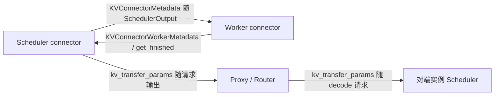
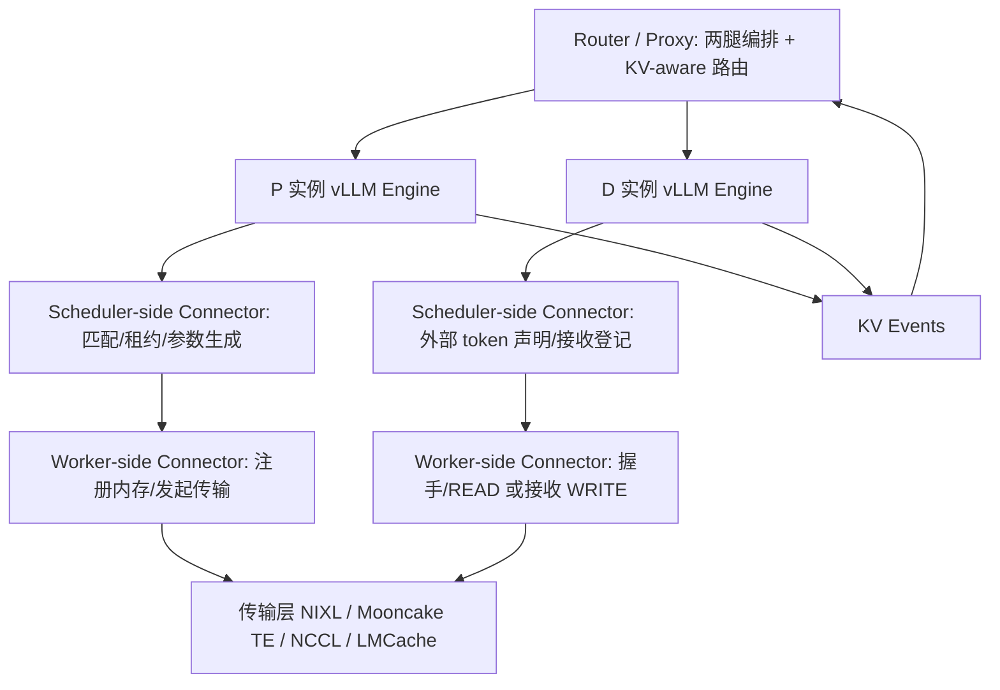

---
tags:
  - vLLM
  - PD分离
  - 调研
updated: 2026-08-07
description: 基于 vLLM 代码仓（含 git 历史）的 PD 分离实现演进调研，覆盖 v0 三层抽象、v1 KV Connector API、NIXL pull/push 及连接器生态。
---

# 02 vLLM PD分离代码演进调研

本文基于本地 vLLM 仓库（截至 2026-08-06，v0.21.x 之后约 3000 个提交）及其完整 git 历史，梳理 vLLM PD 分离实现从 2024-12 初版到 2026 年生产化形态的架构演进。所有 PR 号与日期均出自 git log。

## 1 演进时间线总览

| 时间 | PR | 里程碑 |
| --- | --- | --- |
| 2024-12-01 | #10502 | v0 初版：StatelessProcessGroup 实现 1P1D disagg prefill |
| 2024-12-16 | #10884 | Mooncake Transfer Engine 接入（v0） |
| 2025-02 | #12953 | LMCache connector（v0，KV offload + disagg） |
| 2025-03 | #12957 | MooncakeStore 支持 xPyD（v0） |
| 2025-04-17 | #15960 | **KV Connector API V1**（架构重写） |
| 2025-04-25 | #16625 | LMCache v1 connector |
| 2025-05-12 | #17751 | **NIXL 集成**（此后事实标准） |
| 2025-05 | #17564 | MultiConnector |
| 2025-06 | #18242 | P2pNcclConnector（原生 xPyD） |
| 2025-06 | #18833 | 异构 TP（P 与 D 的 TP 不同） |
| 2025-07 | #18293 | NixlConnector CPU 传输 |
| 2025-08 | #21980 | KV Connector 路径重构 |
| 2025-08 | #21785/#29705 | v0 KVConnectorBase 与 pipe/buffer 组件废弃删除 |
| 2025 下半年 | #19330/#26171 | KV load 失败恢复（回退重算） |
| 2025 下半年 | #22595 | OffloadingConnector（KV 卸载到 CPU/FS） |
| 2025 下半年 | #25542 | LMCache 集成代码迁入 vLLM 原生 |
| 2026 | #25712 等 | HMA（混合内存分配器）与 connector 协同 |
| 2026 | #35264 | **NixlPushConnector**（P 主动 WRITE 到 D） |
| 2026 | #43720/#44528 | PP-aware 握手、Mooncake PP 支持 |

## 2 v0 时代（2024.12 – 2025.04）：三层抽象与实验性 1P1D

### 2.1 设计动机与总体形态

初版由芝加哥大学的 Kuntai Du 团队贡献（#10502），目标是最小侵入地在 v0 引擎上实现 1P1D 的 disaggregated prefill。总体形态：**两个独立 vLLM 实例 + 外部 proxy**。proxy 先把请求发给 prefill 实例（max_tokens=1 只做 prefill），再发给 decode 实例；decode 实例通过 connector 从 prefill 实例拉取 KV cache 与首 token。

代码集中在 `vllm/distributed/kv_transfer/`，分三层抽象（自底向上）：

1. **KV Pipe**：单向 FIFO 张量管道，接口 `send_tensor` / `recv_tensor`；参考实现 `pynccl_pipe.py` 基于 NCCL，底层用自研的 **StatelessProcessGroup**（不依赖 torch.distributed 全局初始化的进程组）建立跨实例通信；
2. **KV LookupBuffer**：KV 缓存的查找缓冲，接口 `insert` / `drop_select`（SQL 语义）；存在理由是 FIFO pipe 无法处理乱序：prefill 侧按 A→B→C 完成，decode 侧可能先要 C；
3. **KV Connector**：把 pipe + buffer 接进 vLLM，接口只有两个方法：`send_kv_caches_and_hidden_states` 与 `recv_kv_caches_and_hidden_states`。

### 2.2 与引擎的耦合方式

v0 的耦合点在 `model_runner.execute_model`：

- prefill 实例：forward 结束后调用 `send_kv_caches_and_hidden_states`，把该 batch 请求的 KV cache 和 hidden states 写入 connector；
- decode 实例：forward 前先调用 `recv_kv_caches_and_hidden_states`；如果 KV 全部取到，返回 `bypass_model_exec=True`——**直接跳过整个模型前向**，用收到的 hidden states 采样出首 token 后进入 decode 循环；取不到则回退为本地正常 prefill。

传输的不仅是 KV cache 还有 hidden states，因为 v0 的 decode 侧需要跳过整个 forward，必须有最后一层的输出来采样首 token。

### 2.3 配置：KVTransferConfig

沿用至今的配置体系在这时确立：`kv_connector`、`kv_role`（kv_producer / kv_consumer / kv_both）、`kv_rank`、`kv_parallel_size`、`kv_ip`、`kv_port`、`kv_buffer_device`、`kv_buffer_size`、`kv_connector_extra_config`。

### 2.4 v0 时代的第三方连接器

1. **MooncakeConnector（v0）**（#10884）：用 Mooncake Transfer Engine 做 RDMA/TCP 传输，绕过 pipe 层；
2. **LMCacheConnector**（#12953）：经 LMCache 服务中转，同时支持 KV offloading；后续支持 chunked prefill（#14505）；
3. **MooncakeStoreConnector**（#12957）：基于 Mooncake 分布式存储实现 xPyD（多 prefill 多 decode），KV 存入共享 store 而非点对点传输；
4. **P2pNcclConnector**：NCCL 点对点直传的轻量实现。

### 2.5 v0 设计的结构性局限

1. 只能支持有限拓扑（初版仅 1P1D），xPyD 依赖外部存储；
2. 同步传输、无异步重叠，KV 传输直接计入 TTFT；
3. 与 v0 引擎紧耦合（改 model_runner），v0 引擎本身在 2025 年被 v1 重写取代；
4. decode 侧跳过 forward 的设计虽简单，但使 connector 必须感知模型结构（hidden states、采样逻辑），无法与 prefix caching 等 v1 调度特性协同。

## 3 转折点：KV Connector API V1（#15960，2025-04）

### 3.1 重写动机

v1 引擎（新调度器、block 级 prefix caching、async scheduling）上线后，v0 connector 的「在 model_runner 里整体收发」模式无法表达新需求：

1. **异步传输**：KV 加载应与引擎步骤重叠，decode 请求可以在 KV 后台搬运的同时不阻塞其他请求；
2. **与 prefix caching 协同**：D 侧可能本地已有部分前缀，只需拉缺失的后缀；connector 必须能参与「已计算 token 数」的计算；
3. **block 粒度生命周期**：P 侧的 block 何时释放、D 侧的 block 何时可复用，都需要与调度器协商；
4. **调度器与 worker 分离**：v1 的调度器是独立进程，connector 也必须在两个进程里各有角色。

### 3.2 核心设计：双角色接口

`KVConnectorBase_V1` 用 `KVConnectorRole`（SCHEDULER / WORKER）把同一 connector 类实例化到两个进程：

**Scheduler 侧（决策）**：

- `get_num_new_matched_tokens(request, num_computed_tokens)`：告诉调度器外部 KV 缓存还能提供多少 token（可返回 None 表示异步待定）；这是 connector 与 v1 prefix caching 的对接点——外部命中被视为「已计算 token」，调度器据此少分配计算；
- `update_state_after_alloc(request, blocks, num_external_tokens)`：block 分配后记录本地目标 block；
- `build_connector_meta(scheduler_output)`：把本步要做的收发操作打包成 `KVConnectorMetadata`，随 SchedulerOutput 下发给 worker；
- `request_finished(request, block_ids)`：请求结束时决定 block 立即释放还是由 connector 接管（延迟释放等待远端读取），并可返回 `kv_transfer_params` 交给上层路由；
- `update_connector_output`、`take_events`：消费 worker 回传的完成状态与 KV 事件。

**Worker 侧（执行）**：

- `register_kv_caches`：启动时注册 paged KV buffer（如 NIXL 需要注册内存区域做零拷贝）；
- `start_load_kv` / `wait_for_layer_load`：forward 前发起异步加载；逐层等待支持 layer 级流水；
- `save_kv_layer` / `wait_for_save`：forward 中逐层保存 KV，forward 结束时确保落盘；
- `get_finished`：报告异步发送/接收完成的请求 id；
- `build_connector_worker_meta`：向调度器回传状态。

这套接口把 PD 分离从「引擎 hack」变成调度器一等公民：connector 声明能力，调度器按能力排期，worker 只负责执行元数据描述的传输。

### 3.3 元数据流与协议

`kv_transfer_params` 是贯穿 P、proxy、D 三方的协调协议（以 NIXL 为例）：

1. proxy 向 P 发请求，附 `do_remote_decode=True`（常配 max_tokens=1 或依赖请求截断）；
2. P 完成 prefill，`request_finished` 返回参数包：`do_remote_prefill=True`、`remote_block_ids`、`remote_engine_id`、`remote_request_id`、`remote_host/port`（NIXL 侧信道）、`tp_size`、`remote_num_tokens`；参数随该请求的响应回到 proxy；
3. proxy 向 D 发请求，附上述参数包（`do_remote_prefill=True`）；
4. D 的 scheduler connector 在 `get_num_new_matched_tokens` 里声明「整个 prompt 可从外部加载」，分配 block 后在 `update_state_after_alloc` 登记待拉取；
5. D worker 与 P 握手后发起 READ，完成后通知 P 释放 block（send_notif），P 侧租约兜底。

## 4 NixlConnector：事实标准的 pull 架构（#17751 起）

NIXL（NVIDIA Inference Xfer Library）接入后迅速成为 vLLM PD 分离的主推路径。当前代码已重构为 `kv_connector/v1/nixl/` 包：`base_scheduler/base_worker` + `pull_scheduler/pull_worker` + `push_scheduler/push_worker` + `tp_mapping` + `stats`。

### 4.1 传输模型：D 拉取（READ）

默认模式是 **pull**：P 完成 prefill 后 block 保留在 P 的 GPU 显存里（带租约），D 直接对 P 的显存发起 NIXL READ，零拷贝读入 D 自己的 paged block。P 全程无需主动发数据，天然适配 xPyD（D 可以从任意 P 读）。

### 4.2 控制面：ZMQ 侧信道握手

- 每个实例的每个 TP rank 开一个 ZMQ REP socket 作为 side channel；
- D worker 首次与某 P 通信时在**后台线程**发起握手（REQ）：交换 NIXL agent 元数据（内存区域描述、engine id）、兼容性哈希（模型/KV 布局/块大小是否匹配）、TP size；
- `tp_mapping`/`transfer_topo` 处理异构 TP：P:D TP 比例任意（如 4:2、2:4），每个 D rank 映射到一组 P rank 拉取对应 KV head 分片（GQA 场景下小 TP 侧复制 KV head）；
- 心跳（heartbeat）维持跨实例请求级租约，防止 D 侧挂死导致 P 侧 block 永久滞留。

### 4.3 数据面：block 粒度与布局

- 以 vLLM paged block 为单位构造传输描述符（descriptor），P 侧在 `register_kv_caches` 时把整个 KV cache 张量注册进 NIXL；
- 处理 P/D 逻辑 block size 不一致（block_size_ratio、物理/逻辑 block 换算）、KV 布局差异（NHD vs FlashInfer 的 HND/block-first 布局，可配置 `enable_permute_local_kv` 做布局转换）；
- 支持 host buffer 中转（`kv_buffer_device=cpu`）：加速器不被 NIXL 直接支持（如 XPU）时先 D2H 再传输；
- MLA（DeepSeek 系列）按 latent 维度传输，hybrid 模型（MLA+Mamba/GDN）按 KV cache group 分区传输。

### 4.4 可靠性设计

- **租约（lease）**：P 侧 `request_finished` 后 block 延迟释放，TTL 到期强制回收；D 侧 READ 完成 send_notif 提前释放；
- **abort 传播**：D 侧请求被 abort 时也要通知 P 释放，避免 block 悬挂；
- **load 失败恢复**（#19330/#26171）：`get_block_ids_with_load_errors` 上报坏 block，配合 `kv_load_failure_policy=recompute` 让调度器重算这些 block 而不是失败整个请求；
- **兼容性校验**：握手时比对 compatibility_hash，不匹配直接拒绝传输。

### 4.5 双向传输（bidirectional / turn-2 readback）

多轮对话场景：第二轮请求的 prompt 包含第一轮的完整上下文，其 KV 在 D 实例上。开启 bidirectional 后 P 也能作为 consumer 从 D 读回这些 block（D 侧 block 用 `decoder_kv_blocks_ttl` 固定超时保留），实现跨轮前缀复用，避免重复 prefill。

## 5 NixlPushConnector：push 模式（#35264）

pull 模式要求 P 的 block 在 D 读取期间保持存活；push 模式让 **P 在 prefill 完成后主动把 KV WRITE 进 D 预分配的 block**，P 可以立即释放显存。设计要点（详见 `docs/design/nixl_kv_push_connector.md`）：

1. 每个 worker 一个专用后台线程 `nixl-push-writer`，独占 push 相关 NIXL 操作；事件驱动 + 空闲休眠，不占用引擎主循环；
2. 流程：D 分配 block 后把注册信息（`PUSH_REG` 通知，含本地逻辑 block ids、engine id、side channel 地址、TP size）发给 P；P 完成 prefill 后暂存 finished blocks；writer 线程双向匹配注册与 block（两侧谁先到都行），匹配成功后执行 WRITE 并通知 D；
3. 可靠性：D 侧注册 watchdog（超时丢弃）、P 侧 block 租约、握手失败不重试而是走失败路径由对端兜底；
4. 调度器侧 `has_pending_push_work` 保持引擎主循环在有 in-flight push 时继续步进。

push 与 pull 的取舍：push 让 P 更快回收显存、P 无需为 D 保留 block，但需要 D 提前分配 block 且握手方向反转；pull 更简单、天然 xPyD。当前 pull 是默认与主推模式。

## 6 连接器生态全景

v1 API 稳定后，社区围绕同一接口长出丰富生态，可按 KV 的「存放位置」分类：

### 6.1 点对点直传类

1. **NixlConnector / NixlPushConnector**：如上；
2. **P2pNcclConnector**（#18242，后于 #44854 删除）：NCCL P2P 的原生 xPyD 实现，曾是 NIXL 不可用时的替代；
3. **MoRIIOConnector**（ROCm）：AMD GPU 的 RDMA（MoRI-IO）实现，支持 READ/WRITE 双模式与异构 TP。

### 6.2 中心化 KV 存储类（KVCache-centric）

1. **MooncakeConnector**（Transfer Engine）：点对点但经 Mooncake TE 传输层，支持多协议；
2. **MooncakeStoreConnector**：KV 存入 Mooncake 分布式 store，天然 xPyD 与前缀复用，近期大量演进（store group、租户、HMA、PP 支持、异步 lookup）；
3. **LMCacheConnectorV1 / LMCacheMPConnector**：LMCache 作为 KV 中间层（可用 NIXL 做底层传输），MP 模式下独立 lmcache server 被多个实例共享；集成代码已迁入 vLLM 原生（#25542）；
4. **FlexKVConnectorV1**：分布式 KV Store + 多级缓存；
5. **HF3FSConnector**：对接 3FS 文件系统的 KV 存取；
6. **SharedStorageConnector / ExampleConnector**：共享文件系统路径的参考实现（教学与测试）。

### 6.3 多级卸载类（KV offloading，PD 分离的泛化）

1. **OffloadingConnector**（#22595）：KV 卸载到 CPU/文件系统/对象存储的分层框架，PD 分离与 prefix caching 的多级存储统一在同一 connector API 下；
2. **SimpleCPUOffloadConnector**：最小 CPU 卸载实现。

### 6.4 组合与其他

1. **MultiConnector**：有序组合多个 connector（如 NIXL + offloading），按序询问匹配、聚合统计；
2. **DecodeBenchConnector**：decode 压测专用（灌入伪造 KV 测纯 decode 性能）；
3. **disaggregated encoder**：把 encoder（视觉编码等）也拆成独立实例，EC（encoder cache）经由独立的 `ec_transfer` 体系传输，是 PD 分离思想向 E-P-D 三阶段的扩展。

## 7 关键横切演进

### 7.1 异构并行

- 异构 TP（#18833 起）：P:D TP 任意比例，worker 握手时建立 rank 映射，KV head 按 GQA 复制或切分；
- DP（数据并行）：每个 DP rank 独立 engine_id 与握手；
- PP-aware（#43720）：流水线并行下 KV 分散在多个 PP stage，握手按 (pp_rank, tp_rank) 聚合各 producer 分片；
- 异构 block size / KV layout / dtype 的协商都收敛进握手与兼容性哈希。

### 7.2 与调度器特性的协同

- prefix caching：外部 token 与本地 hash block 共存，D 侧只拉缺失后缀；本地全命中时仍要通知 P 释放；
- async scheduling：connector 元数据构建与传输完成上报都不能阻塞调度循环（多处 bugfix 围绕 async scheduler 下的时序）；
- preemption：D 侧被抢占的请求其外部 KV 加载状态需要回滚或标记重算；
- speculative decoding：hidden states 传输、draft/verify 与 KV 传输的边界处理。

### 7.3 可观测性

- `KVConnectorStats`（每步收发字节数、传输时延）→ 日志与 Prometheus；
- NIXL telemetry / xfer stats；
- **KV events**（#19737/#28309）：connector 与引擎发布 BlockStored/Removed 事件流，供外部 KV-aware router 订阅（Dynamo/LMCache router 场景）。

### 7.4 HMA 与跨层 block

混合内存分配器（HMA，#25712 起）把不同 KV cache group（full-attn、SWA、MLA、Mamba）打包进同一 block 池；connector 需要支持 `SupportsHMA` 接口（按 group 处理 `request_finished_all_groups`）与 cross-layer block（一个 block 含所有层的 KV，加速批量传输）。

## 8 proxy / router 层的现状

vLLM 自身只提供引擎内能力，两腿请求编排由外部组件完成：

1. 仓库内示例 proxy（`disagg_proxy_demo.py` 等）：round-robin 选 P 与 D，串行转发两腿，演示 XpYd；代码注释表明其只是过渡品，长期方向是引擎内 PDController 与外部框架接管；
2. 生产路由由 NVIDIA Dynamo（Smart Router + GPU Planner）、LMCache KV-aware router 等承担，它们订阅 vLLM 的 KV events 做 locality-aware 路由；
3. 协议层面的稳定成果：`kv_transfer_params`（含 `do_remote_prefill/do_remote_decode/remote_block_ids/...`）已成为跨引擎 PD 编排的通用语言；`return_token_ids` + `prompt_token_ids` 允许 decode 侧跳过重复 tokenization。

## 9 小结：vLLM 视角的架构分层

待社区调研补充：各关键 PR/RFC 的讨论细节（为什么 v1 API 长这样、pull vs push 之争、proxy 归属问题、与 Dynamo 的分工）。
