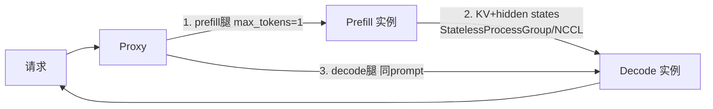
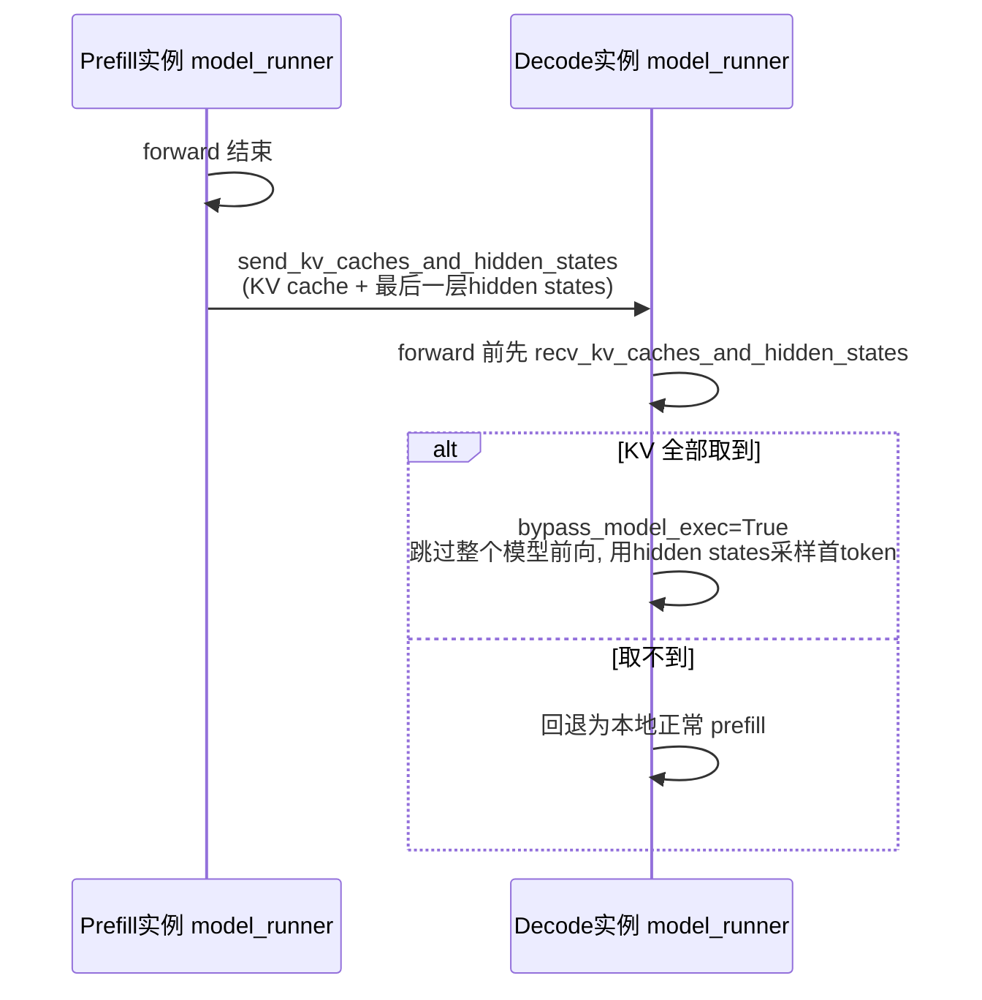
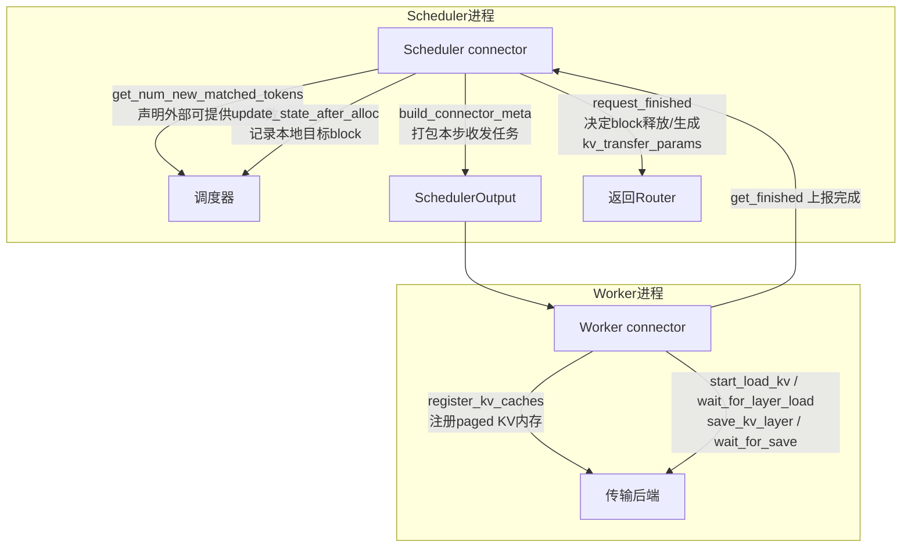
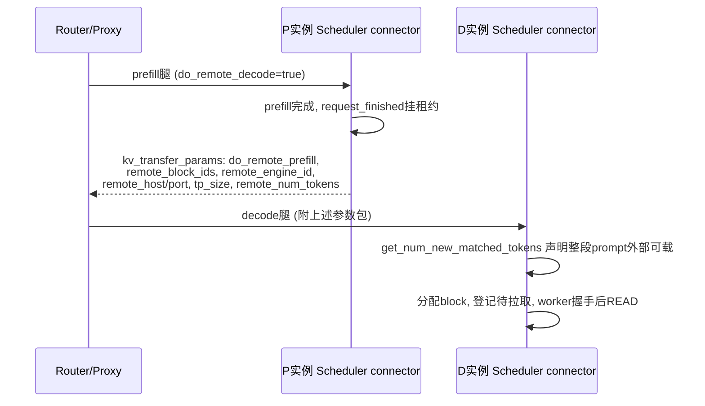
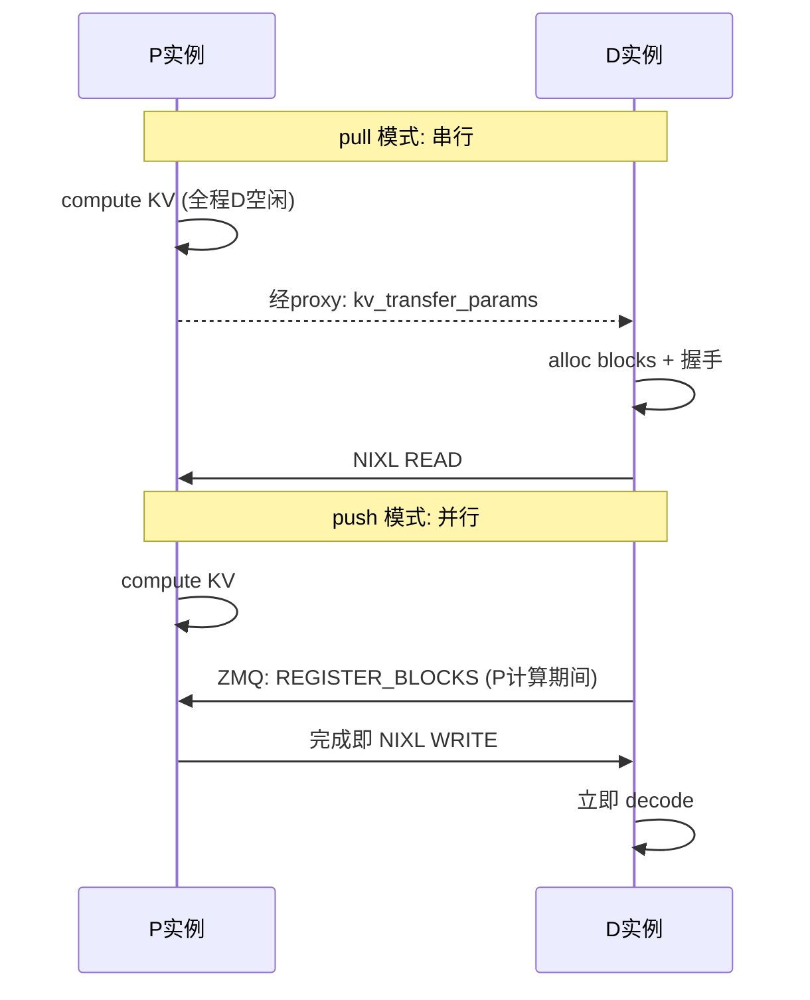
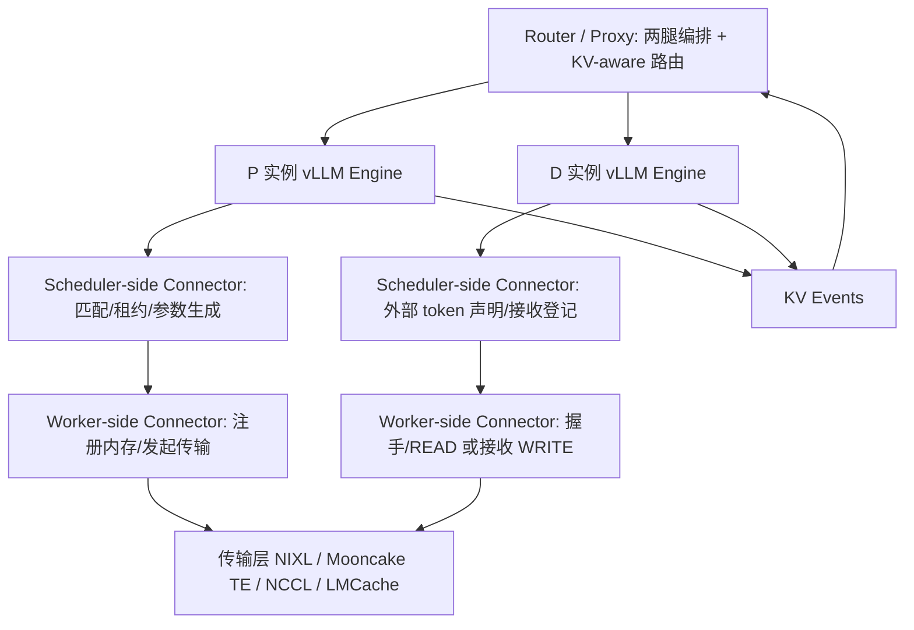

---
tags:
  - vLLM
  - PD分离
  - 调研
updated: 2026-08-07
description: 基于 vLLM 代码仓（含 git 历史）与 GitHub RFC/PR 讨论的 PD 分离实现演进深度调研，逐阶段给出架构、执行流、当时讨论与相关 issue。
---

# 02 vLLM PD分离代码演进调研

本文基于本地 vLLM 仓库（截至 2026-08-06）完整 git 历史与 GitHub RFC/PR 讨论原文，按阶段还原 vLLM PD 分离实现的演进：每个阶段交代背景、架构设计、执行流、当时社区的讨论与争议、相关 issue/PR 清单。所有 PR 号与日期出自 git log，讨论内容出自 issue/PR 原文。

## 1 演进时间线总览

| 时间 | PR / RFC | 里程碑 | 相关讨论 |
| --- | --- | --- | --- |
| 2024-06-14 | RFC #5557 | 方向奠基：communicator + KV database 提案 | 19 条评论，抽象之争 |
| 2024-11-20 | PR #10502（前身 #8498） | v0 初版：StatelessProcessGroup 1P1D | 从 #8498 迁移以修 DCO |
| 2024-12-02 | RFC #10818 | 路线图：xPyD 路线之争、兼容性清单 | 23 条评论 |
| 2024-12-16 | #10884 | Mooncake Transfer Engine 接入（v0） | |
| 2025-02 | #12953 / #13020 | LMCache connector；AWS Neuron 异步传输 RFC | 异步化需求显性化 |
| 2025-03 | #12957 | MooncakeStore 支持 xPyD（v0） | |
| 2025-04-17 | **PR #15960** | **KV Connector API V1**（架构重写） | 附 Google Docs 设计文档 |
| 2025-05-12 | **PR #17751** | **NIXL 集成**，事实标准起点 | 明确 follow-up 清单 |
| 2025-06 | #18833 | 异构 TP | NIXL follow-up 兑现 |
| 2025-06 | #19329/#19330 | KV load 失败恢复 RFC 与实现 | 生产用户反馈驱动 |
| 2025-08 | #21785 / #29705 | v0 组件分两步删除 | |
| 2025 下半年 | #22595 / #25542 / #25712 | OffloadingConnector；LMCache 原生；HMA | |
| 2026-03 | RFC #36923 → PR #35264 | push 模式 RFC → NixlPushConnector | pull vs push 定调 |
| 2026 | #43720 / #44528 | PP-aware 握手、Mooncake PP | 兼容性长尾收尾 |

## 2 阶段零：RFC #5557——一切的起点（2024-06）

[RFC #5557](https://github.com/vllm-project/vllm/issues/5557)，KuntaiDu（芝加哥大学），比第一个实现 PR 早整整半年。这是理解 vLLM PD 分离「为什么长这样」的最重要讨论。

### 2.1 原始提案：communicator + KV database

RFC 的动机列了两个用例：disaggregated prefilling；以及「固定长文档集合的 KV 持久化与按需加载」。第二个用例解释了为什么抽象里长期保留「KV 存储」而不仅是「KV 传输」。提案的形态：

```
vllm <--> communicator <--> KV database
```

- communicator 在 src/dst 间搬数据，两端可以是 vLLM 的 KV block 或 database 条目；
- KV database 以 automatic prefix caching 的 hash 为 key、KV 张量为 value。

RFC 显式列出四个开放问题，后来逐一成为工程课题：如何利用 NVLink 加速传输；如何流水线化传输；**传输期间如何防止 block 被 swap out**（→ 后来的租约/延迟释放机制）；传输中是否压缩 KV、谁来压缩。

### 2.2 讨论中的关键转向（19 条评论）

1. **聚焦收窄**：KuntaiDu 次日自评「先聚焦 disaggregated prefilling，高层架构改动以后再说」，并给出第一版工作流草案：请求先发 prefill 实例（max_tokens=1）→ 在 decode 实例上 reserve KV（以 preempt 方式占位）→ prefill 每算完一层就 layer-wise 传 KV → prefill 完成后解除 decode 侧 preempt，用 automatic prefix caching 取回 KV 继续推理。这个草案已包含后来全部协议的雏形；
2. **基建先行 vs 特性先行**：维护者 cadedaniel 提出质疑——「担心我们在没有窄用例的情况下先建 infra，导致设计无从取舍；应该反过来从一个用户可感知的特性倒推 infra」，并提醒 PD 分离对 KV 传输有极紧的性能约束，泛化抽象可能最终用不上。这个意见直接塑造了初版实现的保守形态（pipe/buffer/connector 三层最小集）；
3. **抽象粒度**：richardliaw 提议先做引擎级状态存取 API（`save/insert_state`）再谈传输；KuntaiDu 回应同意，并定下关键决策——**读写粒度按 vLLM block 对齐**，因为 KV 读写时机天然由 block manager 的分配/换出决策触发；
4. **传输介质之争**：社区提问「nccl 还是 rdma？」——初版选了 NCCL 路线（StatelessProcessGroup），RDMA 路线由后来的 Mooncake/NIXL 连接器补足；
5. **外部参照**：有用户指出阿里 Llumnix（arXiv 2406.03243）已实现 KV 迁移，社区辨析了差异：Llumnix 是 decode 步间迁移，PD 分离是相位间迁移，重叠条件不同。

### 2.3 最终确定的基线方案

KuntaiDu 在 2024-06-30 给出基线实现方案，与最终落地的 #10502 一致：4 进程（prefill 实例、decode 实例、proxy）；新请求先 **padding 到 block_size 整数倍**，以 max_tokens=1 发 prefill 实例，完成后把 KV block 流式搬到 decode 实例，再向 decode 实例发同一请求。他也列出了已知开销与后续优化方向（padding 开销、layer-by-layer 流水、decode 侧重复 prefill 函数调用）。

## 3 阶段一：v0 初版（PR #10502，2024-11 至 12）

[PR #10502](https://github.com/vllm-project/vllm/pull/10502)，KuntaiDu，2024-11-20 提交、12-02 合并。PR 说明只有一句话：「A light-weight implementation of disaggregated prefill. I switched from PR #8498 to here in order to fix DCO issues.」——前身 PR #8498 因 DCO 签名问题放弃重开，这个细节说明该工作从 2024 年秋天就已开发。

### 3.1 总体形态：两个实例 + 外部 proxy



proxy 先把请求发给 prefill 实例（max_tokens=1，只做 prefill），再发给 decode 实例；decode 实例通过 connector 从 prefill 实例拉取 KV cache 与首 token 所需的 hidden states。

### 3.2 三层抽象（代码集中在 `vllm/distributed/kv_transfer/`）

1. **KV Pipe**：单向 FIFO 张量管道，接口 `send_tensor` / `recv_tensor`；参考实现 `pynccl_pipe.py` 基于 NCCL，底层是自研的 **StatelessProcessGroup**——不依赖 torch.distributed 全局初始化即可建立跨实例进程组，这是当时跨实例通信的最小可行方案；
2. **KV LookupBuffer**：接口 `insert` / `drop_select`（SQL 语义）。存在理由：FIFO pipe 无法处理乱序——prefill 侧按 A→B→C 完成，decode 侧可能先要 C，buffer 提供按请求查找与「取走即删」的语义；
3. **KV Connector**：把 pipe + buffer 接进引擎，对外只有两个方法：`send_kv_caches_and_hidden_states` 与 `recv_kv_caches_and_hidden_states`。

### 3.3 与引擎的耦合点：bypass_model_exec

耦合点在 `model_runner.execute_model`：



为什么连 hidden states 一起传：decode 侧要跳过整个 forward，就必须拿到最后一层输出才能采样首 token。这个设计简单但有后遗症——connector 被迫感知模型结构（hidden states、采样逻辑）。

### 3.4 配置体系：KVTransferConfig

此时确立并沿用至今：`kv_connector`、`kv_role`（kv_producer / kv_consumer / kv_both）、`kv_rank`、`kv_parallel_size`、`kv_ip`、`kv_port`、`kv_buffer_device`、`kv_buffer_size`、`kv_connector_extra_config`。

### 3.5 结构性局限（当时已知）

1. 仅支持 1P1D，xPyD 必须依赖外部存储；
2. 同步传输、无重叠，KV 传输时间完整计入 TTFT；
3. 与 v0 引擎（model_runner）紧耦合，而 v0 引擎本身即将被 v1 重写；
4. decode 侧 skip-forward 使 connector 感知模型结构，无法与 prefix caching 等调度特性协同。

## 4 阶段二：v0 生态扩张与路线图（RFC #10818，2024-12）

初版合并当天，KuntaiDu 发布 [路线图 RFC #10818](https://github.com/vllm-project/vllm/issues/10818)（23 条评论），这是 v0 时代社区共识的完整快照，按主题还原其原始决策：

### 4.1 xPyD 路线之争：P2P 直连 vs 中心化 store

路线图原文中两条候选的处理：

1. ~~Xp 与 Yd 之间建立多条直连~~——被划掉，注明「We now go for KVCache-store-based design. If you prefer direct P2P please raise concerns in vLLM #feat-prefill-disaggregation channel」；
2. **Xp 连接到一个 KV cache server，Yd 再从 server 取**（#12957 MooncakeStore）——被选定。

这是社区第一次明确表态：**扩展性上中心化 KV store 优于点对点连接矩阵**。但直连路线没有死亡——NIXL 时代以「D 直接 READ 任意 P 显存」复活（RDMA 单边操作不需要持久连接，连接管理成本被消解），说明争议本质是「连接管理成本 vs 传输路径效率」，答案随传输技术变化。

### 4.2 其余路线图条目（原文语义）

1. **建连**：周期性 dummy 请求保活、`vllm connect` 命令（#11791）、跨节点建连、绕过 API server 直连 Engine；
2. **兼容性清单**：chunked prefill、prefix caching、pipeline parallel（#12301）、多模态——这四项在 v1 时代花了整整一年逐个补齐（PP 直到 2026 年 #43720/#44528 才完整）；
3. **异步与流水线**：KV prefetching、layer-by-layer pipelining（#12523）列为一等目标，直接导向 RFC #13020 与 v1 API；
4. **容错**：「batch 中只收到部分 KV 时仅对缺失 token 做 prefill」（#12285，部分命中思想）；「一个 worker 可被重新用作相反角色」（角色漂移，至今开放）；
5. **编排层**：中心化 orchestrator、动态增删 worker、基于可观测性 API 的 worker 观察、初始路由——这一节在 vLLM 内部长期未落地，最终由 Dynamo/LMCache router 承接；
6. **第三方集成**：已落地 Mooncake（#10884）、LMCache（#12953）；流产 InfiniteStore（#9079）、Valkey（#8724），均因开发者无响应——connector 生态高度依赖背后团队的持续投入。

### 4.3 v0 时代的第三方连接器

| 连接器 | PR | 要点 |
| --- | --- | --- |
| MooncakeConnector | #10884 | Mooncake Transfer Engine 做 RDMA/TCP 传输，绕过 pipe 层 |
| LMCacheConnector | #12953 | 经 LMCache 服务中转，兼顾 KV offloading；后支持 chunked prefill（#14505） |
| MooncakeStoreConnector | #12957 | KV 存入分布式 store 实现 xPyD |
| P2pNcclConnector | 期间落地 | NCCL 点对点直传的轻量实现 |

## 5 阶段三：异步化 RFC 与 v1 API 重写（2025-02 至 04）

### 5.1 RFC #13020：v0 抽象撑不住异步（2025-02）

[RFC #13020](https://github.com/vllm-project/vllm/issues/13020)，AWS Neuron 推理团队。这是社区第一次系统性给出异步 KV 传输设计，也直接证明了 v0 抽象的上限。其方案（在 v0 架构内打补丁）：

1. **LookupBuffer 层**：decode worker 侧维护 `receiver_buffer`；新增 `async_drop_select`——不同于阻塞的 `drop_select`，它把请求入队立即返回；专用 `drop_select_requester` 线程在后台执行查找与传输，完成后写入 buffer；
2. **调度器层**：新增 `transfer queue` 与 `TRANSFERRING` 状态，把 `_schedule_prefills` 拆成两阶段——`_schedule_wait`（分配显存并触发 async_drop_select，移入 transferring queue）与 `_schedule_transferring`（传输完成后移入 running queue）；没有就绪传输时，优先调度已有 decode 请求；
3. **model_runner 层**：prompt 的 KV 保证已在本地，直接从 receiver_buffer 取。

这个方案的启示：**异步化不是传输层单方面的问题，调度器必须理解「传输中」这个新状态与「外部 token」这个新概念**。v0 的 scheduler/model_runner 结构无法干净地表达它——这正是两个月后 v1 API 重写的直接动因。

### 5.2 PR #15960：KV Connector API V1（2025-04-17 合并）

[PR #15960](https://github.com/vllm-project/vllm/pull/15960)，ApostaC（与 KuntaiDu、YaoJiayi 合作），2025-04-02 提交，附 [Google Docs 设计文档](https://docs.google.com/document/d/1uPGdbEXksKXeN4Q9nUm9hzotqEjQhYmnpAhidLuAsjk)。PR 开头即声明「APIS ARE SUBJECT TO CHANGE IN FOLLOW UPS」。

**PR 原文列出的关键设计选择**（逐条还原）：

1. **在 v1 的 prefix caching 与 chunked prefill 语义之下实现 disagg**——调度器负责算出哪些 token 需要 KV store/load，worker 负责执行；外部 KV 命中直接视为「已计算 token」，这是与 prefix caching 协同的核心；
2. 提供 **layer-wise 异步 API**（为流水线传输预留钩子）；
3. **KV prefetching 与请求编排留在 vLLM 之外**，把对引擎核心的改动压到最小——编排外置原则在此正式确立。

**双角色架构**：`KVConnectorBase_V1` 用 `KVConnectorRole`（SCHEDULER / WORKER）把同一 connector 类实例化到两个进程（v1 调度器是独立进程）：



接口语义（完整签名见 `vllm/distributed/kv_transfer/kv_connector/v1/base.py`）：

1. **Scheduler 侧**：`get_num_new_matched_tokens(request, num_computed_tokens)` 告诉调度器外部还能提供多少 token（可返回 None 表示异步待定）；`update_state_after_alloc` 在 block 分配后登记本地目标 block；`build_connector_meta` 把本步收发操作打包成 `KVConnectorMetadata` 随 SchedulerOutput 下发；`request_finished` 决定 block 立即释放还是 connector 接管（延迟释放等远端读取），并返回 `kv_transfer_params` 给上层路由；
2. **Worker 侧**：`register_kv_caches` 启动时注册 paged KV buffer（NIXL 零拷贝需要内存注册）；`start_load_kv`/`wait_for_layer_load` 在 forward 前发起异步加载并支持逐层等待；`save_kv_layer`/`wait_for_save` 逐层保存并收尾；`get_finished` 报告完成的请求 id。

**PR 声明的 follow-up**：更高性能的 P2P connector（#16625，即 LMCache v1）、MLA 支持、KVCacheManager 为 connector 分配临时 block。这套接口把 PD 分离从「引擎 hack」变成调度器一等公民：connector 声明能力，调度器按能力排期，worker 只执行元数据描述的传输。

### 5.3 kv_transfer_params：贯穿三方的协调协议



## 6 阶段四：NIXL 集成与生产化（PR #17751 起，2025-05）

### 6.1 PR #17751 的内容与承诺

[PR #17751](https://github.com/vllm-project/vllm/pull/17751)，robertgshaw2-redhat（Red Hat/NVIDIA 生态），2025-05-06 提交、05-12 合并。PR 原文的首发能力清单：dynamo-style 直连 KV 传输、完全异步 send/recv、运行时 NIXL 握手、xPyD、同构 TP>1、P→D 请求流。

**PR 原文列出的 follow-up 清单**，是此后一年 NIXL 演进的实际路线图，逐条兑现情况：

| follow-up（PR 原文） | 兑现 |
| --- | --- |
| D→P 请求流（dynamo-style） | bidirectional / turn-2 readback |
| 异构 TP | #18833 |
| DP attention | 每个 DP rank 独立 engine_id 与握手 |
| 失败鲁棒性 | #19330/#26171 + kv_load_failure_policy |
| 边界场景（prompt logprobs、并行采样） | 后续 bugfix 长尾 |
| local attention | 后续支持 |

### 6.2 pull 架构细节

当前代码已重构为 `kv_connector/v1/nixl/` 包（base/pull/push 拆分 + tp_mapping + stats）：

1. **传输模型**：P 完成后 block 保留在 P 显存（带租约），D 对 P 显存发起 NIXL READ 单边读入自己的 paged block；P 全程无需主动发数据，天然 xPyD；
2. **控制面**：每个实例每个 TP rank 开 ZMQ REP socket 作侧信道；D worker 首次与某 P 通信时在后台线程握手，交换 NIXL agent 元数据、compatibility hash（模型/KV 布局/block size）、TP size；`tp_mapping`/`transfer_topo` 处理异构 TP 的 rank 映射（小 TP 侧按 GQA 复制 KV head）；心跳维持跨实例租约；
3. **数据面**：以 paged block 为单位构造传输描述符；处理 P/D block size 不一致（block_size_ratio）、KV 布局差异（NHD vs HND/block-first，`enable_permute_local_kv`）；host buffer 中转（`kv_buffer_device=cpu`）支撑 NIXL 不直接支持的加速器；MLA 按 latent 维度传输，hybrid 模型按 KV cache group 分区；
4. **可靠性**：租约 TTL + 完成通知提前释放；abort 跨实例传播防 block 悬挂；`get_block_ids_with_load_errors` 上报坏 block 配合 recompute 策略。

## 7 阶段五：push 模式（RFC #36923 → PR #35264，2026）

### 7.1 RFC #36923 的论证

[RFC #36923](https://github.com/vllm-project/vllm/issues/36923)，snadampal（NVIDIA），2026-03。RFC 指出 pull 模式的结构性局限：**D 必须等 P 完成才能开始传输**，时序严格串行（P 计算 → proxy 转发参数 → D 分配+握手+READ），大 prompt 高 TP 下 D 的空闲时间显著。RFC 列出 push 的六条优势：

1. **降 TTFT**：D 在 P 计算期间就注册 block，P 一完成直接 WRITE，省掉经 proxy 的参数往返；
2. **天然适配 layer-wise 流水**：P 知道每层何时算完，可立即发起 WRITE，是迈向逐层传输的垫脚石；
3. **fan-out 下 P 掌控网卡调度**：P 对多个 D 的 WRITE 可以 pacing/优先级控制，而不是被动响应并发 READ；
4. **proxy 退出传输关键路径**：proxy 可同时向 P、D 派发，协调走 P-D 点对点 ZMQ 侧信道；
5. **P 侧显存更快回收**：WRITE 完成即释放 block，不必持有到 D 读完；
6. **长上下文摊销**：GB 级 KV 的传输准备被藏进 P 的计算时间。

### 7.2 pull vs push 时序对比（RFC 原图语义）



### 7.3 NixlPushConnector 实现（PR #35264）

社区结论：push 是 pull 的**补充而非替代**，两者共享握手与元数据路径。实现要点（权威设计见仓库 `docs/design/nixl_kv_push_connector.md`）：

1. 每个 worker 一个专用后台线程 `nixl-push-writer`，独占 push 相关 NIXL 操作；事件驱动 + 空闲休眠，不占引擎主循环；
2. D 分配 block 后发 `PUSH_REG` 通知（本地逻辑 block ids、engine id、侧信道地址、TP size）给 P；P 完成后暂存 finished blocks；writer 线程**双向匹配**注册与 block（两侧谁先到都正确处理），匹配成功执行 WRITE 并通知 D；
3. 可靠性：D 侧注册 watchdog（超时丢弃）、P 侧 block 租约、握手失败不重试而由对端兜底；
4. 调度器侧 `has_pending_push_work` 保证有 in-flight push 时主循环继续步进。

## 8 阶段六：生态与横切演进（2025 下半年至今）

### 8.1 连接器生态（v1 API 之上）

按 KV 存放位置分类：

1. **点对点直传**：NixlConnector / NixlPushConnector；P2pNcclConnector（#18242，后于 #44854 删除）；MoRIIOConnector（AMD ROCm 的 RDMA 实现，支持 READ/WRITE 双模式与异构 TP）；
2. **中心化 KV 存储（KVCache-centric）**：MooncakeConnector（TE 传输层）、MooncakeStoreConnector（分布式 store，天然 xPyD 与前缀复用）、LMCacheConnectorV1 / LMCacheMPConnector（集成代码已迁入原生，#25542）、FlexKVConnectorV1、HF3FSConnector、SharedStorageConnector；
3. **多级卸载**：OffloadingConnector（#22595，CPU/FS/对象存储分层）、SimpleCPUOffloadConnector；
4. **组合**：MultiConnector（有序组合，如 NIXL + offloading）；DecodeBenchConnector（decode 压测）；disaggregated encoder（E-P-D 扩展，独立 `ec_transfer` 体系）。

### 8.2 横切工程

1. **异构并行**：异构 TP（#18833）、DP（每 rank 独立 engine_id）、PP-aware（#43720，按 (pp_rank, tp_rank) 聚合各 stage 分片）、异构 block size/layout/dtype 协商收敛进握手与兼容性哈希；
2. **调度器协同**：外部 token 与本地 hash block 共存（D 侧只拉缺失后缀）；async scheduling 下元数据构建与完成上报不得阻塞调度循环；preemption 时外部 KV 加载状态回滚；speculative decoding 的 hidden states 边界；
3. **可靠性**：`kv_load_failure_policy`（fail 默认 / recompute，RFC #19329）；心跳与租约相关 bugfix 占 NIXL 提交大头；
4. **可观测性**：KVConnectorStats → Prometheus；**KV events**（#19737/#28309）发布 BlockStored/Removed 事件流供外部 KV-aware router 订阅；
5. **HMA**（#25712 起）：混合内存分配器把不同 KV cache group 打包进同一 block 池，connector 需支持 `SupportsHMA` 与 cross-layer block。

### 8.3 v0 的退场

v0 引擎被 v1 重写取代后，v0 connector 组件分两步删除：#21785（2025-08 删除 KVConnectorBase 及 pipe/buffer）与 #29705（清理残余）。三层抽象中「buffer 解决乱序」的问题在 v1 里由调度器统一排期自然消解；「pipe」则被 NIXL/Mooncake 等成熟传输层取代。

## 9 小结：vLLM 视角的架构分层



复盘五个阶段的因果链：**RFC #5557 定下 block 粒度与保守起步 → #10502 用最小三层验证 1P1D → 路线图 #10818 暴露 xPyD 与异步的缺口 → RFC #13020 证明异步必须进调度器 → #15960 以双角色 API 重写 → #17751 接上 NIXL 成为事实标准 → #36923/#35264 补上 push 半边**。每一步都是上一步局限的直接回应，这也是理解当前架构最好的线索。
