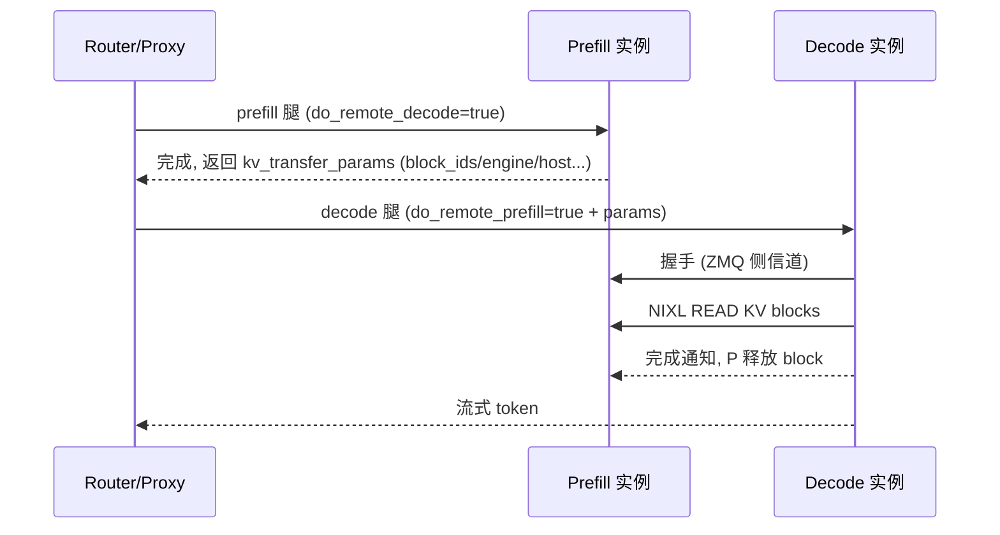
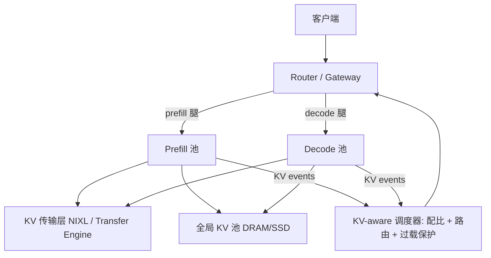

---
tags:
  - vLLM
  - PD分离
  - 架构设计
updated: 2026-08-07
description: PD 分离（Prefill/Decode 分离）架构设计的终版综述，从相位差异出发，循序渐进覆盖发展史、架构要素、协议设计、vLLM 实现演进与生产形态。
---

# PD 分离架构设计全景

本文是 PD 分离方向的终版综述，综合论文调研（见 [[01 PD分离论文脉络调研]]）、vLLM 代码演进调研（见 [[02 vLLM PD分离代码演进调研]]）与社区调研（见 [[03 vLLM 社区PD分离演进调研]]）三份材料写成。结构按从概念到实现、从历史到现状的顺序组织，可顺序通读，也可按章节索引查阅。

## 1 从一个请求的两种形态说起

### 1.1 Prefill 与 Decode 的资源画像

一个 LLM 推理请求的生命周期天然分为两个相位：

| 维度 | Prefill（预填充） | Decode（解码） |
| --- | --- | --- |
| 做什么 | 一次性处理全部输入 token，构建 KV cache，产出首个输出 token | 自回归地逐 token 生成，每步读全量 KV cache |
| 瓶颈 | 计算密集（compute-bound），算力决定速度 | 访存密集（memory-bound），显存带宽决定速度 |
| 延迟语义 | TTFT（首 token 延迟） | TPOT / ITL（token 间延迟） |
| 时长特征 | 与 prompt 长度强相关，波动大 | 每步时长稳定 |
| 批内角色 | 干扰源：一个大 prefill 会拉长同 batch 所有 decode 的步长 | 被干扰方：产生尾延迟尖刺 |

### 1.2 混合部署的两难

把两个相位混在同一实例里（colocated serving），系统面对两个无解的耦合：

1. **干扰耦合**：continuous batching 让 prefill 与 decode 共享每个 forward step，prefill 的大矩阵乘直接拖慢 decode 的逐 token 节奏，尾 ITL 不可控；chunked prefill（把 prefill 切块与 decode 拼批）能缓解，但 chunk size 难调且 prefill 算力被 decode 稀释；
2. **配置耦合**：两相位被迫共用一套并行策略（TP/PP）、同一批硬件，无法分别按 compute-bound / memory-bound 特性优化。

PD 分离（Prefill/Decode disaggregation）的答案很直接：**把两个相位放到不同的实例（乃至不同的硬件）上，各自独立配置，用高速网络搬运它们之间唯一的交接物——KV cache**。

### 1.3 PD 分离的定位澄清

1. PD 分离**不提升单机吞吐**，它优化的是 SLO goodput（同时满足 TTFT 与 TPOT 约束下能服务的最大请求率）与资源效率；
2. 它引入一个新成本：KV cache 的跨实例传输，整套架构设计的核心就是把这个成本压到可忽略；
3. 它与 chunked prefill 不是互斥关系，生产中常混用（P 实例内部仍可 chunked）。

## 2 发展历程：三个阶段

### 2.1 第一阶段：概念提出（2023.11 – 2024.01）

三篇几乎同期的论文从不同角度确立了范式（逐篇深入见 [[01 PD分离论文脉络调研]]）：

1. **[Splitwise](https://arxiv.org/abs/2311.18677)**（Microsoft，ISCA 2024）：从硬件经济学切入，证明 decode 可用更低成本/低功耗硬件；关键论断是「KV 传输代价在高速互连下可忽略」；采用 layer-wise 传输让搬运与计算重叠；结果 1.4x 吞吐且成本低 20%，或同成本功耗下 2.35x 吞吐；
2. **[DistServe](https://arxiv.org/abs/2401.09670)**（PKU/UCSD，OSDI 2024，[开源](https://github.com/LLMServe/DistServe)）：第一个系统化 serving 实现，提出 goodput 目标函数；P/D 独立选择并行策略；placement 算法按集群带宽搜索 P:D 配比；结果多服务 7.4x 请求或承受 12.6x 更紧 SLO；它定义了此后所有工程实现的形态模板——P 实例 + D 实例 + KV 传输 + 外部编排；
3. **[TetriInfer](https://arxiv.org/abs/2401.11181)**：面向混合下游负载，固定大小 chunk 使加速器接近计算饱和，两级调度 + 资源预测避免 decode 热点；资源省 38% 同时平均 TTFT 降 97%。

前置奠基：[PagedAttention](https://arxiv.org/abs/2309.06180)（SOSP 2023）把 KV cache 变成按 block 寻址的离散结构，是 KV 可搬运的物理基础；[Sarathi-Serve](https://arxiv.org/abs/2403.02310)（OSDI 2024）的 chunked prefill + stall-free 调度则是长期并存的替代路线。

### 2.2 第二阶段：生产化与 KVCache-centric（2024 中 – 2024 末）

**[Mooncake](https://arxiv.org/abs/2407.00079)**（Moonshot AI，FAST 2025 最佳论文，[开源](https://github.com/kvcache-ai/Mooncake)）是标志性转折，思想从「相位分离」升级为 **KVCache-centric**：

1. KV cache 从请求的附属状态升格为一等公民，与计算解耦；
2. 利用集群闲置 CPU DRAM/SSD 构建全局 KV 池，前缀缓存从实例本地升级为跨实例共享资源；
3. Conductor 调度器做 KV-locality 感知调度与过载 early rejection；
4. Transfer Engine 独立成高性能传输组件（后开源，成为多家引擎的后端）；
5. chunked layer-wise prefill：prompt 切块 + 逐层发起传输，计算与传输全面重叠。

同期 [MemServe](https://arxiv.org/abs/2406.17565)（弹性 MemPool + 全局 prompt tree locality 调度）、[Llumnix](https://arxiv.org/abs/2406.03243)（请求与 KV 跨实例活迁移）、[LoongServe](https://arxiv.org/abs/2404.09526)（弹性序列并行，PD 分离的对照路线）各自补充。DeepSeek-V3 技术报告（[arXiv 2412.19437](https://arxiv.org/abs/2412.19437)）公开了万卡级生产部署（P 大 TP、D 不同 DP/TP 组合，NVLink + IB + 3FS 分层传输），是最有影响力的公开生产样本。

### 2.3 第三阶段：数据平面标准化与 Agentic 时代（2025 起）

reasoning model 与 agent 负载带来 GB 级 KV 迁移与极高前缀复用率，催生：

1. **[NIXL](https://github.com/ai-dynamo/nixl)**（NVIDIA Inference Xfer Library）：统一的 KV/张量传输数据平面，抽象多种内存类型与 backend（UCX、GDS、RDMA），成为跨引擎事实标准；
2. **[Dynamo](https://github.com/ai-dynamo/dynamo)**（NVIDIA，GTC 2025）：以 PD 分离为一等架构的框架——Smart Router（KV 命中 + 负载均衡）、GPU Planner（动态 P:D 配比）、KV Cache Manager，对接 vLLM/SGLang/TensorRT-LLM；
3. 拆分粒度继续细化：[EPD Disaggregation](https://arxiv.org/abs/2501.05460)（多模态三段分离，ICML 2025）、[MegaScale-Infer](https://arxiv.org/abs/2504.02263)（MoE 的 attention/FFN 模块分离）、[DOPD](https://arxiv.org/abs/2511.20982)（动态 P:D 配比解决生产者-消费者失衡）。

### 2.4 与 vLLM 实现史的对齐

| 时间 | 论文/产业 | vLLM 对应 |
| --- | --- | --- |
| 2024.06 | DistServe/Mooncake 已发表 | RFC #5557 提出 communicator + KV database 抽象 |
| 2024.12 | Mooncake 开源 Transfer Engine | v0 初版（#10502）+ Mooncake 接入（#10884）+ 路线图 RFC #10818 |
| 2025.04 | NIXL 发布 | v1 Connector API（#15960） |
| 2025.05 | Dynamo 发布 | NIXL 集成（#17751） |
| 2025 下半年 | 生产规模化 | 异构 TP、失败恢复、offloading、v0 删除 |
| 2026 | push 模式、EPD、前端分离 | NixlPushConnector、PP-aware、Disaggregated Frontend RFC |

## 3 架构要素：五个设计维度

任何 PD 分离系统都由五个正交维度的选择构成，本章逐一展开。

### 3.1 维度一：拆分粒度与传输时机

1. **请求级**：prefill 全部完成后一次性迁移整段 KV；实现最简单，但传输时间完整计入 TTFT，且 P 侧显存被占用到传输结束；
2. **layer 级流水**：每算完一层立即发送该层 KV，传输与剩余层的计算重叠（Splitwise 首创）；
3. **chunk 级流水**：prompt 切块，chunk0 的 KV 边算边传，chunk1 继续算（Mooncake 的 chunked layer-wise prefill）；
4. vLLM 的工程映射：v1 connector API 的 `save_kv_layer`/`wait_for_layer_load` 就是为 layer 级流水预留的钩子；主流实现（NIXL）当前以请求完成为传输触发点，靠大带宽 RDMA 消化传输时间。

### 3.2 维度二：传输模式 pull vs push

1. **pull（D 主动 READ）**：P 完成后保留 block（带租约），D 对 P 显存发起单边读；
   - 优点：天然 xPyD（D 可从任意 P 读）、P 无需知道 D 的存在、协议简单；
   - 代价：P 侧 block 要保留到 D 读完，租约占用显存；D 挂死需要心跳/看门狗兜底；
2. **push（P 主动 WRITE）**：D 先预分配 block 并把注册信息发给 P，P 完成后直接写入 D 的显存；
   - 优点：P 写完即释放显存，P 侧无租约压力；
   - 代价：需要 D 提前分配、双侧握手、匹配逻辑（注册与 finished blocks 谁先到都要处理）；
3. **社区结论**（RFC #36923）：push 是 pull 的补充而非替代；vLLM 中两者共享握手与元数据路径，push 用独立后台 writer 线程实现，不污染引擎主循环。

传输介质层面另有选择：GPU 直通（NVLink/RDMA GPUDirect）> host 内存中转（加速器不被传输库直接支持时）> 经存储系统（3FS/分布式 KV store，换取持久化与复用）。

### 3.3 维度三：KV 的生命周期

1. **随请求销毁**：KV 只服务一次 P→D 交接，读完即释放（最早期形态）；
2. **租约管理**：P 侧完成后 block 延迟释放，TTL 到期强制回收，正常路径由 D 的完成通知提前释放——这是生产可靠性的核心机制，相关 bugfix 占 vLLM NIXL 提交的大头；
3. **沉淀为全局 KV 池**：KV 写入分布式存储（MooncakeStore、LMCache、FlexKV、HF3FS），供后续请求前缀复用；PD 分离与跨实例 prefix caching 从此融合；
4. **多级分层**：GPU → CPU DRAM → SSD/对象存储（OffloadingConnector 框架），agentic 负载下命中率成为一阶指标；
5. **双向回流**：多轮对话中上一轮的 KV 留在 D 上，第二轮 prefill 时 P 反向从 D 读回（vLLM NIXL bidirectional 模式），实现跨轮前缀复用。

### 3.4 维度四：调度与路由

1. **两腿请求编排**：proxy/router 把一个用户请求拆成 prefill 腿（发 P，常 max_tokens=1）与 decode 腿（发 D），并传递协调参数；
2. **P:D 配比**：离线搜索（DistServe placement 算法）或在线动态（Dynamo GPU Planner）；
3. **KV-locality 路由**：优先把请求发给已有前缀缓存的实例（Dynamo Smart Router 用 radix tree 索引、SGLang cache-aware balancer），KV events 订阅是引擎与路由器的标准接口；
4. **过载保护**：预测式 early rejection（Mooncake）、KV 租约与看门狗兜底；
5. **归属现状**：vLLM 社区长期把编排外置（引擎只暴露 connector 接口与 KV events），由 Dynamo/LMCache router 等承担；2026 年起出现原生化讨论（pull-based queue worker、启发式 pull router RFC）。

### 3.5 维度五：可靠性

1. **传输失败回退**：vLLM 提供 `kv_load_failure_policy`：fail（默认，请求失败）或 recompute（worker 上报坏 block id，调度器重算）；
2. **节点故障**：心跳维持跨实例租约，一端崩溃另一端按 TTL 回收资源；abort 信号跨实例传播防止 block 悬挂；
3. **兼容性防御**：握手阶段交换 compatibility hash（模型、KV 布局、block size），不匹配直接拒绝而不是产生错误输出；
4. **抢占协同**：D 侧请求被抢占时，外部 KV 加载状态要能回滚；P 侧要求可靠投递语义（`requires_kv_delivery`）。

## 4 协调协议：一个请求如何穿过 P、Router、D

以 vLLM + NIXL 的生产形态为例，这是当前最完整的开放协议实现：

### 4.1 kv_transfer_params 协议

1. router 向 P 发 prefill 腿，请求体附 `kv_transfer_params: {do_remote_decode: true}`；
2. P 完成 prefill，请求结束时 scheduler-side connector 的 `request_finished` 决定延迟释放 block（挂租约），并返回参数包——包含 `do_remote_prefill: true`、`remote_block_ids`、`remote_engine_id`、`remote_request_id`、`remote_host/port`（传输侧信道地址）、`tp_size`、`remote_num_tokens`；参数随响应回到 router；
3. router 选一个 D，发 decode 腿，附同一参数包；
4. D 侧 scheduler connector 在 `get_num_new_matched_tokens` 声明「整个 prompt 可从外部加载」（对调度器等价于这些 token 已计算），分配 block 后登记待拉取；
5. D worker 与 P worker 握手（交换内存区域描述、兼容性哈希、TP 映射），对 P 显存发起 READ 到自己的 paged block；
6. READ 完成，D 通知 P，P 提前释放租约；若 D 失联，租约到期兜底；
7. D 开始逐 token decode，流式返回给 router 与用户。

### 4.2 协议设计的三个要点

1. **控制面与数据面分离**：协调走 HTTP 参数与 ZMQ 侧信道（轻量、可跨拓扑），数据走 RDMA/传输库（重、零拷贝）；
2. **block id 的语义分层**：调度器层面传递逻辑 block id，worker 提交传输时按握手学到的比例展开为物理 block——使异构 block size 的 P/D 可互通；
3. **token id 复用**：P 腿可返回 `prompt_token_ids`，D 腿跳过重复的模板渲染与 tokenization（向 Disaggregated Frontend 演进的第一步）。

## 5 vLLM 实现深潜：从 v0 到 v1

（逐阶段展开含讨论原文与 issue 清单，见 [[02 vLLM PD分离代码演进调研]]）

### 5.1 v0 时代（2024.12 – 2025.04）：最小可用

源头是 [RFC #5557](https://github.com/vllm-project/vllm/issues/5557)（2024-06）：KuntaiDu 提案 communicator + KV database 抽象，维护者 cadedaniel 质疑「先建 infra 还是先做特性」，最终共识是保守起步、读写粒度按 vLLM block 对齐。落地为 [PR #10502](https://github.com/vllm-project/vllm/pull/10502)（前身 #8498，因 DCO 问题重开）：

1. 三层抽象：**KV Pipe**（FIFO 张量管道，NCCL + 自研 StatelessProcessGroup）→ **KV LookupBuffer**（insert/drop_select，解决乱序）→ **KV Connector**（接进引擎）；
2. 引擎耦合点在 model_runner：decode 侧收到完整 KV + hidden states 后**直接跳过整个 forward**，用收到的 hidden states 采样首 token——简单但要求 connector 感知模型结构；
3. 同步传输、仅 1P1D、与 prefix caching 无法协同；
4. [路线图 RFC #10818](https://github.com/vllm-project/vllm/issues/10818) 在此时定调：xPyD 走中心化 KV store（放弃 P2P 直连，后被 NIXL 单边 READ 复活）；兼容性、异步、编排层列为待办；
5. 第三方连接器（Mooncake TE #10884、LMCache #12953、MooncakeStore #12957、P2pNccl）绕过 pipe 层直接实现 connector，预示抽象需要重做。

### 5.2 v1 Connector API（2025.04）：调度器一等公民

直接动因是 [RFC #13020](https://github.com/vllm-project/vllm/issues/13020)（AWS Neuron 团队的异步传输方案）证明：异步化必须让调度器理解「传输中」状态与「外部 token」概念，v0 结构内只能打补丁。重写落地为 [PR #15960](https://github.com/vllm-project/vllm/pull/15960)，PR 原文的三条关键设计选择：把 disagg 埋在 v1 的 prefix caching 与 chunked prefill 语义之下；提供 layer-wise 异步 API；KV prefetching 与请求编排留在 vLLM 之外。

1. **双角色单类**：同一 connector 类按 `KVConnectorRole` 实例化到调度器进程与 worker 进程；
2. **scheduler 侧只做决策**：`get_num_new_matched_tokens`（外部有多少 token 可用，与本地 prefix cache 叠加）→ `update_state_after_alloc`（block 分配后登记）→ `build_connector_meta`（打包本步任务）→ `request_finished`（租约与参数生成）；
3. **worker 侧只做执行**：`register_kv_caches`（注册内存区域）→ `start_load_kv`/`wait_for_layer_load`（异步加载 + 逐层同步点）→ `save_kv_layer`/`wait_for_save`（逐层保存）→ `get_finished`（完成上报）；
4. **元数据单向流 + 完成回报**：KVConnectorMetadata 随 SchedulerOutput 下发，worker 元数据聚合后回传调度器；
5. 这套接口使外部 KV 与本地 prefix cache 在调度器视角统一为「已计算 token」，异步加载天然与引擎步进重叠，layer 级流水、offloading、push 模式都成为同一接口上的变体。

### 5.3 NixlConnector：参考实现

[PR #17751](https://github.com/vllm-project/vllm/pull/17751)（2025-05）接入后成为主推路径；PR 声明的 follow-up（D→P 流、异构 TP、DP attention、失败鲁棒、边界场景）就是此后一年 NIXL 演进的实际路线图。pull 模式的生产级形态，要点：

1. 数据面：paged block 粒度的 NIXL READ，P 的整个 KV cache 预注册为可远程访问区域，零拷贝；
2. 控制面：ZMQ 侧信道 + 后台线程握手，交换 agent 元数据、兼容性哈希、TP size；心跳维持请求级租约；
3. 异构能力：P:D 任意 TP 比例（KV head 按 GQA 复制/切分映射）、异构 block size（逻辑/物理换算）、KV 布局转换（NHD/HND）、MLA latent 传输、hybrid 模型（MLA + Mamba/GDN）按 cache group 分区；
4. host buffer 降级路径：加速器不被 NIXL 直接支持时经 CPU 中转；
5. 2026 年重构为 base/pull/push 三包结构，push 模式经 [RFC #36923](https://github.com/vllm-project/vllm/issues/36923)（论证 pull 串行时序下 D 在 P 计算期完全空闲，列六条优势）落地为 `NixlPushConnector`（#35264，独立 writer 线程、PUSH_REG 注册匹配、双侧看门狗/租约）。

### 5.4 连接器生态与泛化

同一 API 长出三类生态：

1. **点对点直传**：NIXL（pull/push）、MoRIIO（ROCm RDMA）；
2. **中心化 KV 存储**：MooncakeStore、LMCache（含多进程 server 模式）、FlexKV、HF3FS——PD 分离与前缀复用、跨实例缓存合一；
3. **多级卸载**：OffloadingConnector（CPU/文件系统/对象存储分层）——PD 分离泛化为「KV 在存储层次间的流动」；
4. 组合能力：MultiConnector 串联多连接器；KV events 对外发布 block 存删事件供路由订阅。

### 5.5 横切工程课题（按解决时间排序）

1. 异构 TP（2025.06）→ DP 握手 → PP-aware 聚合（2026）；
2. KV load 失败恢复（recompute 策略，2025 下半年）；
3. async scheduling 下的时序正确性（大量 bugfix）；
4. 抢占/abort 的跨实例状态回收；
5. HMA（混合内存分配器）与 cross-layer block（2026）；
6. 可观测性：connector stats、NIXL telemetry、Prometheus 指标、KV events；
7. speculative decoding、多模态（EC/encoder 分离，E-P-D 三段）的兼容。

## 6 生产形态全景

一个完整的生产级 PD 分离部署通常包含：

关键运维事实：

1. P 池与 D 池独立扩缩容（K8s 下独立 HPA），配比由负载画像（输入/输出长度比、SLO）决定；
2. 监控必须拆段：prefill queue / prefill exec / KV transfer / decode queue / TPOT / 流抖动，KV transfer 时长是独立的一阶指标；
3. 网络底座决定上限：同机 NVLink > RDMA/RoCE + GPUDirect > TCP；跨机以太网基本不可用；
4. 不适用场景：短 prompt + 短输出的轻量负载（分离开销大于收益）、缺乏高速互连、无法承担双池运维复杂度。

## 7 关键取舍与历史教训

1. **拆分不是免费的**：新增传输成本、协调协议、生命周期管理三类复杂度；收益只有在 SLO 敏感或负载相位严重不对称时才成立；
2. **抽象必须长进调度器**：vLLM v0→v1 重写证明，不进调度器的传输无法异步化、无法与 prefix cache 协同、无法容错；
3. **生命周期比传输更难**：租约、心跳、watchdog、abort 传播占了绝大多数生产 bug；
4. **路线之争没有永久答案**：P2P 直连 vs 中心化 store 的取舍随传输技术演进反复（连接矩阵昂贵 → store 胜 → RDMA 单边操作复活直连）；
5. **编排层外置是当前稳态但非终态**：引擎暴露数据面钩子 + 事件，路由器承担智能；原生化讨论（前端分离、原生 pull router）仍在进行；
6. **兼容性是长尾工程**：PP、异构并行、MLA/Mamba 混合模型、多模态、speculative decoding，每一项都以季度计；
7. **KVCache-centric 是终局方向**：PD 分离、prefix caching、KV offloading 正在收敛为同一件事——KV cache 在计算与存储层次间的流动管理。

## 8 延伸方向

1. **E-P-D 三段分离**：多模态 encoder 独立成池（vLLM ec_transfer、EPD 论文）；
2. **Disaggregated Frontend / Everything**：tokenization、渲染、detokenization 独立服务化，token-in/token-out 引擎接口；
3. **分离式投机解码**：draft 模型独立并行部署；
4. **KV 传输 QoS**：请求优先级下沉到连接器层；
5. **动态角色漂移**：实例在 P/D 角色间按负载切换；
6. **KV 压缩传输**：从 RFC #5557 起悬而未决，随长上下文价值重估。

## 附录：材料索引

1. 论文调研：01 PD分离论文脉络调研（Splitwise / DistServe / TetriInfer / Mooncake / NIXL+Dynamo 等）；
2. 代码调研：02 vLLM PD分离代码演进调研（v0 三层抽象、v1 API、NIXL pull/push、连接器生态、git 时间线）；
3. 社区调研：03 vLLM 社区PD分离演进调研（RFC #5557/#10818/#13020/#19329/#36923/#34407/#49765 等）；
4. 一手代码：vllm/distributed/kv_transfer/（kv_connector/v1/base.py、nixl/ 包）、docs/features/disagg_prefill.md、docs/design/nixl_kv_push_connector.md。
