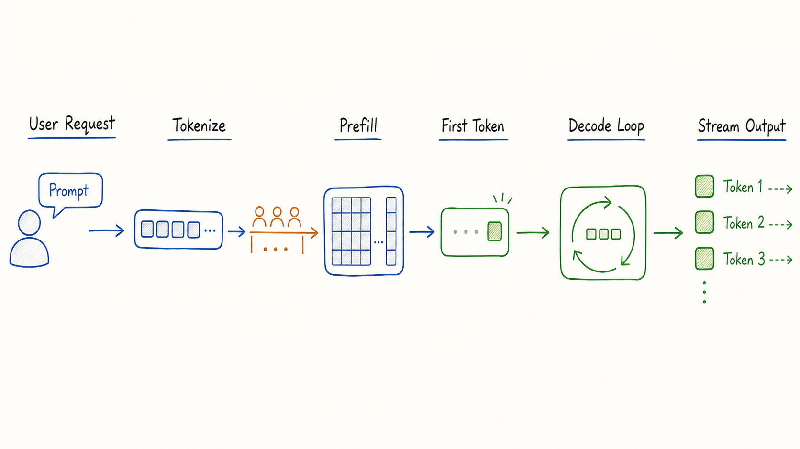
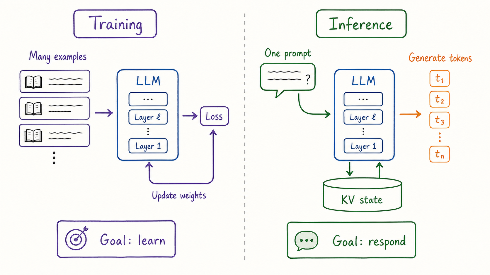
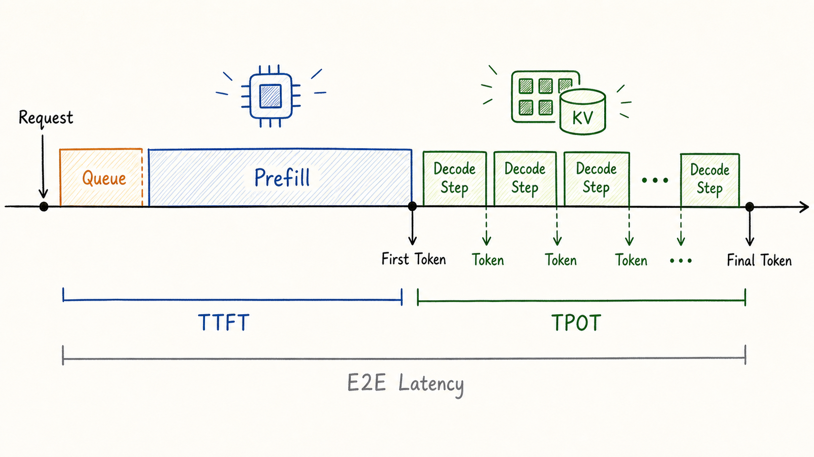
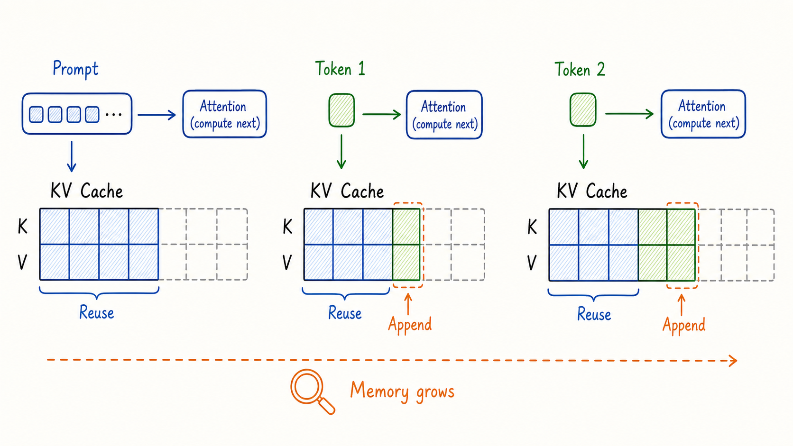
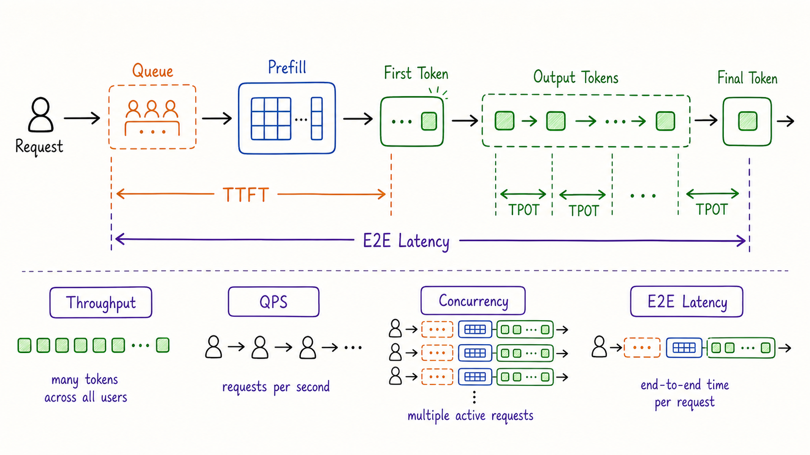
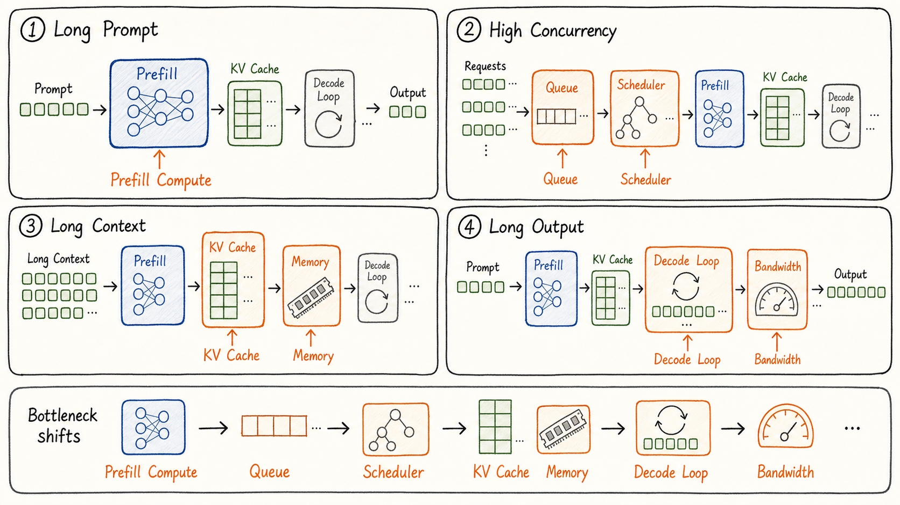
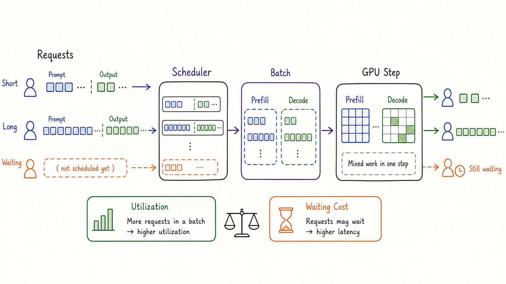
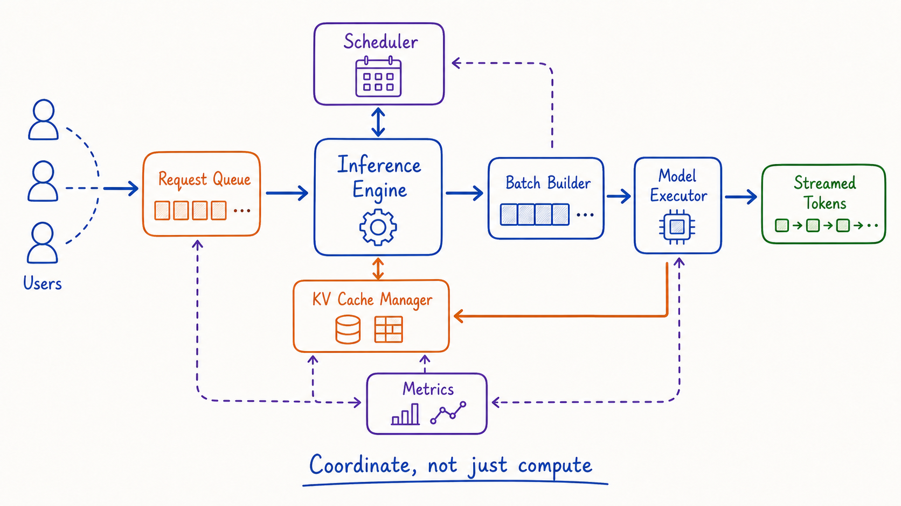

---
tags:
  - vllm
  - llm-inference
  - inference-system
  - llm-serving
updated: 2026-05-27
description: 本文建立 LLM 推理系统的全局认知，解释一次生成请求如何牵出 Prefill、Decode、KV Cache、性能指标、系统瓶颈与推理引擎职责。
---
大模型推理最容易被误解成一次简单的函数调用：输入 prompt，执行模型，得到回答。

这个理解在单机实验里勉强够用，但一旦进入真实服务，它马上会失效。一个在线推理系统面对的不是“模型能不能算出下一个 token”，而是“许多用户同时到来、每个请求长短不同、输出长度未知、显存持续变化、还要尽快返回第一个 token”的系统问题。

这一篇不急着讲具体推理引擎，也不提前进入某个框架的源码。它先回答一个更基础的问题：为什么 LLM 推理本身就是一个系统工程问题。



上图里的每一个小环节都会在后续放大成系统设计问题：请求可能排队，Prompt 需要被整段处理，第一个 token 之后还要逐 token 生成，生成过程中还要保存和复用状态。当并发请求变多时，这条链路不再属于单个用户，而会变成一个共享资源调度问题。


## 1. 为什么需要理解推理系统

推理系统的核心工作，是在固定模型权重的前提下，把用户请求稳定、高效、可观测地转化成输出 token。这里有三个关键词。

- **固定权重**：推理阶段通常不更新模型参数，模型更像一个只读计算图；
- **动态请求**：每个请求的输入长度、输出长度、到达时间、取消时间都可能不同；
- **系统目标**：推理服务要同时关注交互体验、吞吐、显存、成本、稳定性和公平性；

如果只有一个用户、一个 prompt、一个输出，推理看起来很简单。但生产环境会把问题变成下面这样。

- 用户 A 的 prompt 很短，只想要一句回答；
- 用户 B 的 prompt 很长，带着几万 token 的上下文；
- 用户 C 需要流式输出，希望第一个 token 尽快出现；
- 用户 D 请求已经进入系统，但显存中的 KV Cache 快满了；
- 运维侧还要知道 TTFT、TPOT、吞吐、QPS 和错误率是否异常；

此时，系统不能只问“模型怎么前向计算”。它还要问：先处理谁，怎么合批，缓存放哪里，什么时候暂停，如何避免一个长请求拖慢所有短请求，以及怎样用指标判断瓶颈在哪里。

这就是推理系统的学习入口：从一次生成请求出发，逐步看见它背后的状态、指标和资源约束。

## 2. 推理和训练的根本差异

训练和推理都在使用 Transformer，但它们的系统形态完全不同。



训练阶段的目标是让模型学会参数。系统会准备大量样本，计算 loss，反向传播，更新权重。训练任务通常可以把样本组织成相对规整的 batch，并围绕高吞吐的矩阵计算来优化。

推理阶段的目标是响应请求。模型权重固定不变，系统要把用户 prompt 转成一个个输出 token。这里的难点不只是计算，还包括请求到达的不确定性、输出长度的不确定性，以及每个请求在生成过程中留下的动态状态。

| 维度 | 训练 | 推理 |
| --- | --- | --- |
| 目标 | 学习权重，使 loss 下降 | 生成回答，使请求完成 |
| 权重状态 | 持续更新 | 通常只读 |
| 输入形态 | 数据集样本，可离线组织 | 在线请求，长度和到达时间不确定 |
| 输出形态 | loss、梯度、检查点 | token 流、完整回答、日志与指标 |
| 状态重点 | 优化器状态、梯度、激活 | KV Cache、请求队列、生成进度 |
| 性能重点 | 训练吞吐、扩展效率 | TTFT、TPOT、吞吐、QPS、显存与稳定性 |

这个差异决定了：推理优化不是训练优化的缩小版。训练更关心一次大规模计算如何跑满硬件；在线推理更关心许多不规则请求如何共享硬件，同时保持用户可感知的响应速度。

## 3. 一次生成请求的生命周期

一次典型的自回归 LLM 生成请求，可以拆成五个阶段。

1. **请求进入系统**：客户端发送 prompt、采样参数、最大输出长度、停止条件等信息；
2. **Tokenize 与排队**：系统把文本转成 token，并根据当前负载决定何时进入执行；
3. **Prefill**：模型一次性处理整段 prompt，建立后续生成需要的上下文状态；
4. **Decode**：模型每一步基于已有上下文生成一个新 token，并把新 token 追加回上下文；
5. **返回与清理**：系统持续流式返回 token，直到遇到停止条件，然后释放请求状态；

第三步和第四步是理解推理系统的主轴。它们对应两种非常不同的计算形态。

### 3.1 Prefill

Prefill 阶段处理完整 prompt。假设用户输入了 2,000 个 token，模型需要把这些 token 作为上下文整体读入，计算每一层注意力和中间表示，并准备好用于后续生成的 KV Cache。

Prefill 的特点是：

- 输入 token 多，适合形成较大的矩阵计算；
- 计算量通常随 prompt 长度明显增长；
- 它直接影响第一个 token 何时能返回；
- 长 prompt 会显著拉高请求启动成本；

因此，Prefill 更像“读完整份题目并建立上下文”。

### 3.2 Decode

Prefill 建立上下文之后，系统还需要执行一次单 token 生成和采样，才会产生第一个输出 token。为了讲解方便，本文把“首 token 生成”和后续逐 token 生成都放在 Decode 这个大阶段里理解；但观察指标时要更精确：TTFT 覆盖排队、Prefill 和首 token 生成，TPOT 通常衡量首 token 之后相邻输出 token 之间的平均间隔。

Decode 的主体阶段会不断重复同一个动作：模型每次生成一个新 token，然后把这个 token 重新放回上下文，继续生成下一个 token。

Decode 的特点是：

- 每一步只推进一个 token，天然具有自回归顺序依赖；
- 每一步都要读取已有上下文状态；
- 输出越长，Decode 步数越多；
- 用户流式体验主要由 Decode 的节奏决定；

因此，Decode 更像“一个字一个字地写答案”。第一笔决定系统什么时候开口，后面的每一笔决定系统说话是否顺滑。



这张时间线说明了一个关键事实：用户感受到的响应不是单一数字。第一个 token 的等待时间和后续 token 的输出节奏来自不同阶段，也经常受到不同瓶颈影响。

## 4. KV Cache 是核心状态

自回归生成有一个直接问题：生成第 10 个 token 时，模型需要关注 prompt 和前 9 个输出 token；生成第 11 个 token 时，又要关注 prompt 和前 10 个输出 token。如果每一步都从头重算全部历史 token 的 Key 和 Value，计算会大量重复。

KV Cache 的作用就是保存每层注意力里历史 token 的 Key/Value 状态，让后续 Decode 步骤复用这些状态。Hugging Face Transformers 文档也将 KV Cache 描述为生成性能优化的关键机制：缓存 past key/value 可以避免重复计算，并且动态缓存会随着生成推进而增长。



KV Cache 带来了速度收益，也把推理系统变成了状态管理问题。

- 它按请求存在，不同请求有不同的缓存状态；
- 它随 prompt 长度和输出长度增长；
- 它通常占用昂贵的 GPU 显存；
- 它会影响一个系统能够同时服务多少请求；
- 它释放得太晚会浪费显存，释放得太早又会破坏生成连续性；

所以，KV Cache 不是一个实现细节，而是推理系统的核心资源。很多推理引擎的设计，本质上都是围绕“如何高效计算、保存、复用、移动、释放这些状态”展开。

## 5. 性能指标如何读

理解 Prefill、Decode 和 KV Cache 后，推理指标就不再是一串孤立缩写。它们其实是在观察同一条请求生命周期的不同切面。



可以先用四种负载建立直觉。短问答请求通常最敏感的是 TTFT，因为用户想尽快看到系统开始回答；长上下文总结会放大 Prefill 成本，因此 TTFT 和显存占用都会上升；长篇生成会让 Decode 步数变多，因此 TPOT 和 E2E Latency 更容易成为体验关键；高并发聊天则会让队列、batch、KV Cache 和 Concurrency 同时变成系统压力。

### 5.1 TTFT

TTFT 是 Time To First Token，表示从请求进入测量边界到第一个输出 token 可见之间的时间。NVIDIA NIM、Google Cloud 和 Anyscale 的 LLM 指标文档都把它作为衡量首 token 响应速度的核心延迟指标。

TTFT 通常受到这些因素影响。

- 请求排队时间；
- 路由、鉴权、Tokenize 等前置开销；
- Prefill 计算时间；
- 首次 Decode 或采样开销；
- 当前 batch 和调度策略；

对用户来说，TTFT 决定“系统是不是马上开始说话”。在聊天、Agent、代码补全等交互场景里，TTFT 往往比完整回答耗时更敏感。

### 5.2 TPOT

TPOT 是 Time Per Output Token，表示首 token 之后，平均生成一个输出 token 需要多久。NVIDIA NIM 文档给出的常见计算方式是：

```text
TPOT = (E2E Latency - TTFT) / (Total Output Tokens - 1)
```

这里要注意两个细节。

- 如果输出 token 只有 1 个，TPOT 没有稳定意义；
- TPOT 常常是平均值，不能完全反映每两个 token 之间的抖动；

TPOT 更接近用户听到模型“持续说话”的节奏。TTFT 很低但 TPOT 很高，用户会感觉系统很快开口，但后面输出很慢。TTFT 较高但 TPOT 很低，用户会感觉系统先等了一下，然后回答很快刷完。

### 5.3 E2E Latency

E2E Latency 是端到端延迟，表示从请求进入测量边界到完整响应结束的总时间。它通常包含排队、Prefill、Decode、返回、框架开销等完整链路。

对单个请求来说，可以粗略理解为：

```text
E2E Latency ≈ TTFT + TPOT × (输出 token 数 - 1) + 尾部开销
```

这个公式不是精确实现，而是帮助读者建立直觉：长输出会让 Decode 部分主导总耗时，长 prompt 会让 Prefill 和 TTFT 更突出。

### 5.4 Throughput

Throughput 是吞吐，表示系统单位时间完成了多少工作。LLM 服务里常见的吞吐口径包括：

- 输出 token 吞吐：每秒生成多少 output tokens；
- 总 token 吞吐：每秒处理多少 input tokens + output tokens；
- 请求完成吞吐：每秒完成多少请求；

吞吐必须说明统计口径。一个系统可能 output token throughput 很高，但 TTFT 很差；也可能单请求延迟很好，但并发上来后总吞吐很低。

### 5.5 Arrival QPS / Completed RPS

QPS 或 RPS 表示每秒请求数。实际使用时需要说明它指的是 **arrival QPS**，也就是进入系统的请求速率，还是 **completed RPS**，也就是完成请求的速率。前者更像入口压力，后者更像服务产出；在系统稳定且队列不堆积时二者接近，但在突发流量或服务拥塞时，它们可能明显分离。

无论使用哪种口径，QPS/RPS 都不直接说明请求有多重。

两个系统都处理 10 QPS，负载可能完全不同。

- 系统 A：每个请求 200 input tokens，生成 50 output tokens；
- 系统 B：每个请求 8,000 input tokens，生成 1,000 output tokens；

所以，QPS 必须和 token 长度分布一起看。只看 QPS，很容易把轻请求和重请求混在一起，得出错误结论。

### 5.6 Concurrency

Concurrency 是并发数，表示某个时刻系统里同时活跃的请求数量。它不等于 QPS。QPS 是速率，并发是存量。

在稳态系统、测量边界一致、到达速率和完成速率大致平衡时，可以用 Little's Law 建立一个简单近似：

```text
Concurrency ≈ arrival QPS × 平均请求耗时
```

如果请求耗时变长，即使 arrival QPS 不变，系统里同时占用资源的请求也会增加。对 LLM 推理来说，这意味着更多 KV Cache、更复杂的调度、更高的排队风险。

### 5.7 指标之间的关系

这些指标不能孤立优化。推理系统经常面对这样的权衡。

| 优化目标 | 常见收益 | 可能代价 |
| --- | --- | --- |
| 降低 TTFT | 用户更快看到首 token | batch 变小，吞吐可能下降 |
| 降低 TPOT | 流式输出更顺滑 | 可能需要更多硬件或更激进优化 |
| 提高吞吐 | 单位硬件服务更多 token | 单个请求等待可能变长 |
| 提高 QPS | 请求接入能力更强 | 重请求会放大显存和调度压力 |
| 提高并发 | 服务更多同时在线请求 | KV Cache、排队和尾延迟压力上升 |

因此，推理系统不是简单追求“越快越好”。更准确的目标是：在给定硬件、成本和服务等级约束下，找到延迟、吞吐、并发和稳定性之间的平衡。

## 6. 主要瓶颈与工程权衡

推理系统的瓶颈不是固定的。它会随着请求形态、并发水平、上下文长度、输出长度和硬件配置变化。下面的划分是诊断入口，不是绝对规则；同一个系统在不同负载下可能从计算瓶颈转向显存瓶颈，再转向调度或内存带宽瓶颈。



### 6.1 Prefill 计算瓶颈

当 prompt 很长、Prefill batch 较大或 Prefill 占比高时，系统可能主要受计算能力限制。Prefill 需要处理整段上下文，矩阵计算规模较大，GPU 算力利用更容易被拉起来。

Prefill 计算瓶颈常见于：

- 长 prompt 的首 token 等待；
- 大 batch 的上下文处理；
- Prefill 与 Decode 没有被良好调度的混合负载；

这里需要避免一个误区：低并发不自动等于计算瓶颈。对大模型的单请求 Decode 来说，由于每一步只推进少量 token，却仍要读取大量权重和缓存状态，它经常更接近内存带宽或权重读取瓶颈。

### 6.2 显存容量瓶颈

LLM 推理首先要把模型权重放进显存，还要为 KV Cache、临时张量、batch 元数据等保留空间。模型越大、上下文越长、并发越高，显存压力越明显。

显存容量瓶颈的典型现象是：

- 能加载模型，但并发稍高就 OOM；
- 短请求表现正常，长上下文请求显著挤占资源；
- 输出越长，系统可承载并发越少；
- 需要限制最大上下文、最大输出或最大并发；

### 6.3 内存带宽瓶颈

Decode 阶段每次只生成一个 token，但每一步都需要访问模型权重和已有状态。NVIDIA 关于 LLM 推理优化的技术说明，以及 Anyscale 对 LLM serving 指标的解释，都强调过 Decode 的 token-by-token 形态会让内存访问和 token 间隔成为关键问题。这个判断尤其适合单请求、小 batch Decode 或大模型权重读取占主导的场景；负载变大后，调度、缓存和批处理策略也会一起改变瓶颈位置。

这也是为什么“GPU 理论算力很高”不等于“单 token Decode 一定很快”。如果每一步都要从高带宽内存中搬运大量权重和状态，那么数据搬运速度就可能成为主要限制。

### 6.4 KV Cache 管理瓶颈

KV Cache 既是优化手段，也是资源压力来源。它会随请求数、上下文长度和输出长度增长。长上下文请求会占用大量缓存；长输出请求会持续追加缓存；多轮对话还可能带来更复杂的状态复用需求。

KV Cache 管理瓶颈通常表现为：

- GPU 显存被缓存占满；
- 需要在接纳新请求和保留老请求之间做取舍；
- 长短请求混跑时，短请求被长请求占用的缓存间接拖慢；
- 系统需要更精细地分配、复用、迁移或回收缓存；

### 6.5 调度与排队瓶颈

在线推理不是只跑一个请求。多个请求同时进入系统后，调度器必须决定哪些请求进入下一步执行，哪些请求继续等待。



批处理可以提高硬件利用率，但也会引入等待。把更多请求放进同一个 batch，可能让 GPU 更忙；但某些请求需要等 batch 凑齐，或者被长请求拖慢。经典 LLM serving 研究中提出过 iteration-level scheduling 和 selective batching 这样的方向，背后的原因正是生成式模型的请求长度和完成时间高度不规则，传统请求级 batch 很难高效服务。Hugging Face 关于 continuous batching 的系统说明，也把异步批处理、缓存空间和请求完成时间差异放在同一个 serving 问题里讨论。

调度瓶颈经常出现在：

- 并发很高，排队时间成为 TTFT 的主要组成；
- 请求长短差异很大，短请求被长请求影响；
- batch 太小导致 GPU 利用率低，batch 太大又导致交互延迟高；
- 系统缺少面向 token 级进度的调度能力；

### 6.6 尾延迟与稳定性瓶颈

平均指标可能掩盖坏体验。一个系统平均 TTFT 很低，但 P99 TTFT 很高，说明少数请求正在遭遇严重等待。对真实服务来说，P95/P99 延迟、错误率、取消率、重试率同样重要。

尾延迟常常来自：

- 少数超长上下文请求；
- 突发流量导致队列堆积；
- 显存碎片或缓存回收不及时；
- 某些 batch 被异常慢请求拖住；
- 下游网络、网关或客户端消费速度不稳定；

这也是为什么推理系统需要可观测性。没有指标，就很难判断问题是算力不足、显存不足、调度不合理，还是请求分布发生了变化。

从指标反推瓶颈时，可以先用下面的诊断框架建立第一层判断。

| 先恶化的现象 | 优先怀疑的瓶颈 | 典型解释 |
| --- | --- | --- |
| TTFT 上升 | 排队、Prefill、调度 | 请求先等了更久，或者长 prompt 让首 token 前的工作变重 |
| TPOT 上升 | Decode、内存带宽、batch 干扰 | 首 token 之后的逐 token 节奏变慢 |
| E2E Latency 上升 | 长输出、尾部排队、下游返回 | 完整请求生命周期被拉长 |
| 吞吐下降 | GPU 利用率、batch 组织、执行效率 | 单位时间完成的 token 或请求减少 |
| 并发承载下降 | KV Cache、显存容量、缓存回收 | 同时活跃请求占用的状态超过系统可承受范围 |
| P95/P99 延迟升高 | 长短请求混跑、突发流量、资源抖动 | 少数请求被异常负载或调度等待拖慢 |

## 7. 推理引擎的作用

到这里可以看到，LLM 推理系统要解决的不是一个单点问题，而是一组互相牵制的问题。

- Prefill 影响首 token 等待；
- Decode 影响持续输出节奏；
- KV Cache 影响显存和并发；
- Batch 影响吞吐和延迟；
- Scheduler 影响公平性、利用率和尾延迟；
- Metrics 影响问题定位和容量规划；

推理引擎的价值，就是把这些问题放在同一个系统里协调。它不是“替模型多算几步”的薄包装，而是请求管理、批处理、缓存管理、模型执行、流式返回和指标观测之间的协调层。



第一章到这里刻意停在抽象层。只要理解了这张全局地图，后续再进入具体推理引擎时，就不会把某个机制孤立地看成“一个优化技巧”。更好的阅读方式是不断追问：这个模块在降低 TTFT、TPOT、显存压力、调度成本，还是在提升吞吐与稳定性。

下一篇可以开始把这些抽象问题落到具体推理引擎上：它如何接收请求，如何组织执行，如何管理缓存，如何把系统指标变成可优化对象。

## 参考资料

1. [Hugging Face Transformers: KV cache strategies](https://huggingface.co/docs/transformers/v4.53.0/kv_cache)：说明 KV Cache 如何保存 past key/value，避免重复计算，并比较不同缓存策略；
2. [Hugging Face Transformers: LLM inference optimization](https://huggingface.co/docs/transformers/v4.44.0/llm_optims)：解释自回归生成中 KV Cache 的作用，以及静态缓存等推理优化思路；
3. [NVIDIA NIM LLMs Benchmarking: Metrics](https://docs.nvidia.com/nim/benchmarking/llm/latest/metrics.html)：给出 TTFT、TPOT、端到端延迟、吞吐等常见 LLM 推理指标定义；
4. [Google Cloud GKE: Inference performance metrics](https://docs.cloud.google.com/kubernetes-engine/docs/concepts/machine-learning/inference)：从部署视角列出 TTFT、TPOT、吞吐、QPS 等推理服务指标；
5. [Anyscale Docs: Understand LLM latency and throughput metrics](https://docs.anyscale.com/llm/serving/benchmarking/metrics)：解释延迟、吞吐、TPS/RPS、goodput 等指标在 LLM serving 中的关系；
6. [NVIDIA Technical Blog: Mastering LLM Techniques: Inference Optimization](https://developer.nvidia.com/blog/mastering-llm-techniques-inference-optimization/)：讨论自回归生成、内存访问、KV Cache 与推理优化的关系；
7. [ORCA: A Distributed Serving System for Transformer-Based Generative Models](https://www.usenix.org/system/files/osdi22-yu.pdf)：提出面向生成式模型 serving 的 iteration-level scheduling 和 selective batching；
8. [Hugging Face Transformers: Continuous batching architecture](https://huggingface.co/docs/transformers/main/continuous_batching_architecture)：说明连续批处理、KV Cache 空间、异步批处理等推理系统设计问题；

## Learning Assessment

### Questions

1. 单选：为什么不能把在线 LLM 推理简单理解成一次 `model.forward()`？
   A. 因为推理阶段一定要更新模型权重；
   B. 因为在线推理还涉及请求排队、动态输出、KV Cache、调度、指标和资源约束；
   C. 因为只要模型精度足够高，服务侧性能指标就不再重要；
   D. 因为每个请求的输出长度在进入系统前都已经固定；

2. 单选：Prefill 阶段最准确的描述是？
   A. 每次只处理一个新生成 token；
   B. 处理完整 prompt，并建立后续 Decode 需要的上下文状态；
   C. 只负责把 token 转回文本；
   D. 只负责释放 KV Cache；

3. 单选：Decode 阶段为什么天然影响流式输出体验？
   A. 因为 Decode 决定模型训练 loss；
   B. 因为 Decode 通常逐 token 推进，token 间隔会直接影响用户看到输出的节奏；
   C. 因为 Decode 不依赖历史上下文；
   D. 因为 Decode 阶段一定不访问显存；

4. 多选：KV Cache 在推理系统中重要的原因包括哪些？
   A. 它保存历史 token 的 Key/Value 状态以减少重复计算；
   B. 它会随上下文和输出增长，占用显存；
   C. 它让模型权重在推理时持续更新；
   D. 它影响系统可承载的并发请求数量；

5. 单选：TTFT 最接近衡量什么？
   A. 从请求进入到第一个输出 token 可见的时间；
   B. 每两个输出 token 之间的平均时间；
   C. 单位时间总共生成多少 token；
   D. 每秒进入系统的请求数；

6. 单选：在输出 token 数大于 1 时，TPOT 常见计算方式是？
   A. `TTFT / 输出 token 数`；
   B. `(E2E Latency - TTFT) / (输出 token 数 - 1)`；
   C. `QPS / Concurrency`；
   D. `显存占用 / batch size`；

7. 多选：为什么只看 QPS 容易误判 LLM 推理负载？
   A. 不同请求的 input token 数可能差异很大；
   B. 不同请求的 output token 数可能差异很大；
   C. QPS 不直接反映 KV Cache 占用；
   D. QPS 已经完整包含 TTFT、TPOT 和显存信息；

8. 单选：哪个场景更可能让 KV Cache 成为主要压力？
   A. 所有请求都只有 1 个 input token 和 1 个 output token；
   B. 并发请求带有长上下文并生成较长回答；
   C. 系统没有任何并发请求；
   D. 模型权重不需要加载；

9. 多选：提高 batch 大小可能带来的效果包括哪些？
   A. GPU 利用率提高；
   B. 系统吞吐提高；
   C. 某些请求等待时间增加；
   D. 每个请求的 TTFT 必然降低；

10. 单选：为什么 Decode 阶段经常会受到内存带宽影响？
    A. 因为每一步只处理一个 token，所以硬件一定处于高算力利用率状态；
    B. 因为自回归生成每步只推进少量 token，但仍要访问大量权重和状态；
    C. 因为 Decode 的主要成本永远只来自 Tokenize；
    D. 因为 Decode 阶段会反向传播梯度；

11. 多选：推理引擎通常需要协调哪些职责？
    A. 请求队列；
    B. 调度与批处理；
    C. KV Cache 管理；
    D. 模型执行和指标观测；

12. 单选：本章最后引出推理引擎的主要目的是什么？
    A. 立即讲解某个具体框架的源码；
    B. 把 Prefill、Decode、KV Cache、指标和瓶颈收束成一个系统协调问题；
    C. 证明只要 batch 足够大，延迟、显存和公平性就会同时最优；
    D. 说明吞吐和延迟永远不会冲突；

13. 多选：某服务 QPS 基本不变，但平均输出长度明显增加，系统可能出现哪些变化？
    A. 平均并发数上升；
    B. KV Cache 占用增加；
    C. Decode 总步数增加，TPOT 对总耗时的影响更明显；
    D. 负载一定变轻，因为请求数没有增加；

14. 单选：大量短请求和少量超长上下文请求混跑时，如果短请求 TTFT 的 P99 明显升高，最应该优先检查什么？
    A. 是否存在排队、批处理或长请求拖慢短请求的问题；
    B. 是否所有请求都使用了相同的输出长度上限；
    C. 是否 QPS 已经足以完整解释 token 级负载；
    D. 是否只需要提高最大输出 token 数；

15. 单选：两个系统都是 10 QPS，为什么不能直接判断它们推理负载相同？
    A. 因为请求的 input/output token 分布可能不同，token throughput 和 KV Cache 压力可能完全不同；
    B. 因为 QPS 越高，TPOT 必然越低；
    C. 因为 QPS 已经排除了所有长上下文请求；
    D. 因为 QPS 只衡量模型精度，不衡量服务压力；

### Answers and Explanations

1. **B**。在线推理包含请求生命周期管理、动态状态、调度和指标观测，不是单次前向计算就能覆盖；
2. **B**。Prefill 处理完整 prompt，并为后续 Decode 建立上下文状态，通常也是 TTFT 的重要组成；
3. **B**。Decode 逐 token 推进，TPOT 或 token 间隔直接决定流式输出是否顺滑；
4. **A、B、D**。KV Cache 减少重复计算，但会占用显存并限制并发；它不会更新模型权重；
5. **A**。TTFT 关注第一个 token 何时出现，是交互体验的重要指标；
6. **B**。常见 TPOT 口径会排除首 token 等待，再除以首 token 之后的输出 token 间隔数量；
7. **A、B、C**。QPS 只描述请求速率，不说明请求 token 长度、输出长度和缓存占用；
8. **B**。长上下文和长输出都会扩大 KV Cache，占用显存并压缩可承载并发；
9. **A、B、C**。更大的 batch 可能提高利用率和吞吐，但也可能让请求等待更久，并不保证每个请求的 TTFT 下降；
10. **B**。Decode 每步推进很小，但仍要读取权重和上下文状态，因此容易受数据搬运速度限制；
11. **A、B、C、D**。推理引擎的价值正是协调请求、调度、缓存、执行、返回和观测；
12. **B**。第一章的目标是建立全局认知，把分散概念连接成系统问题，为后续具体引擎学习铺路；
13. **A、B、C**。QPS 不变只说明请求到达速率稳定；平均输出变长会让请求在系统内停留更久。按 `Concurrency ≈ arrival QPS × 平均请求耗时` 的稳态近似，并发存量会提高，Decode 步数和 KV Cache 压力也会增加；
14. **A**。P99 TTFT 升高说明少数请求等待严重；长短请求混跑时，应优先检查调度、队列、batch 组织和长请求对短请求的影响；
15. **A**。LLM 推理负载必须结合 input token、output token、并发、吞吐和缓存占用判断，不能只看请求数；
