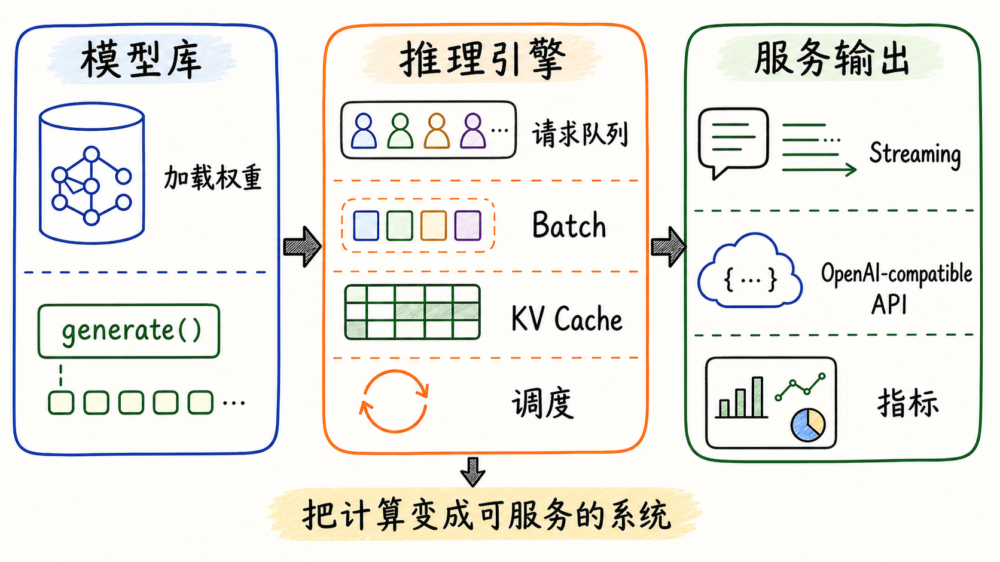
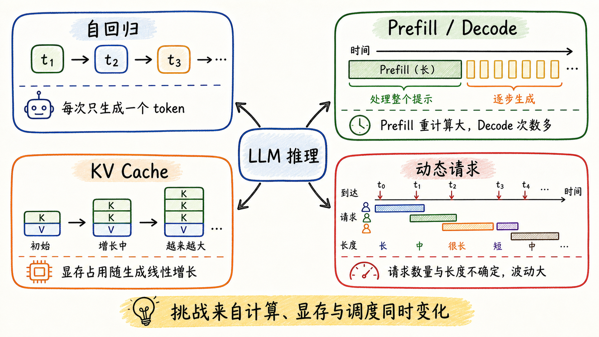
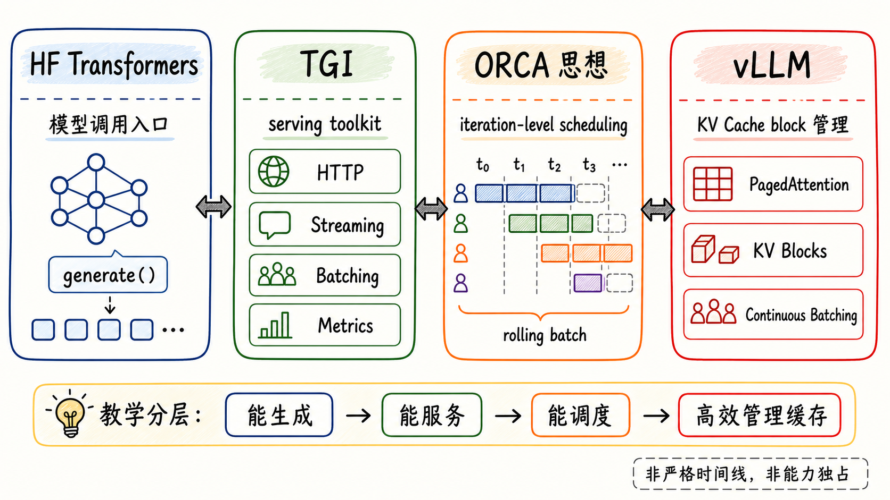
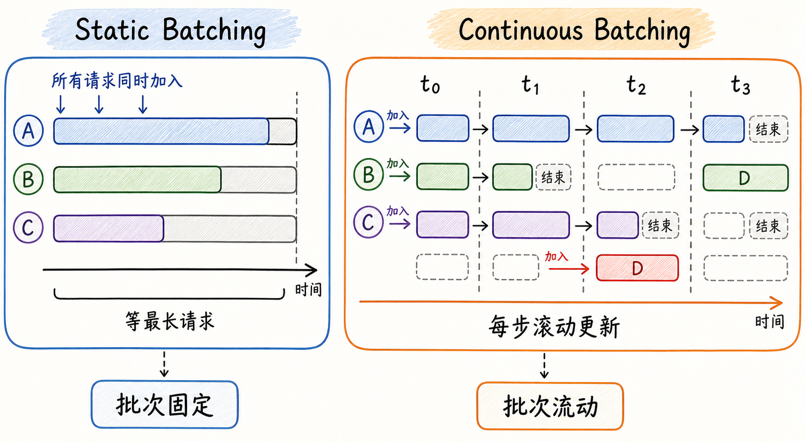
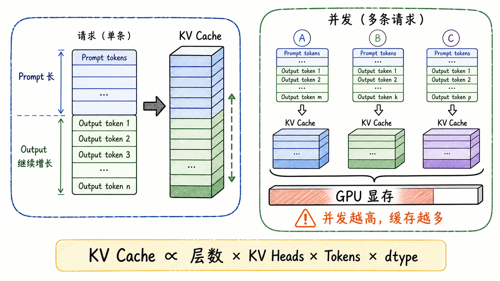
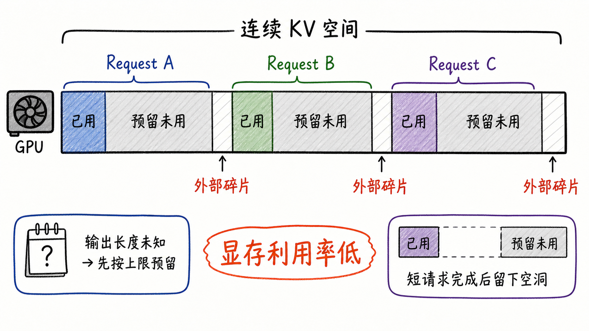
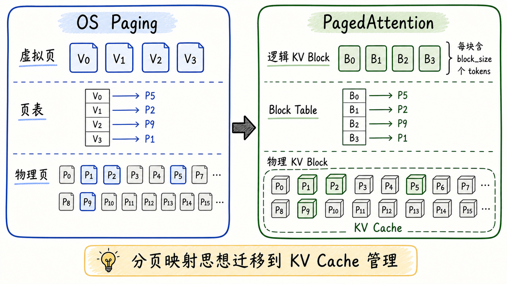
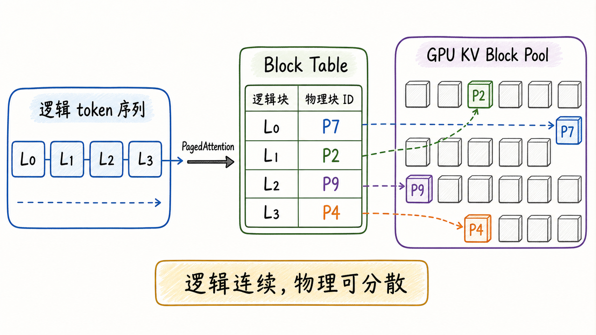
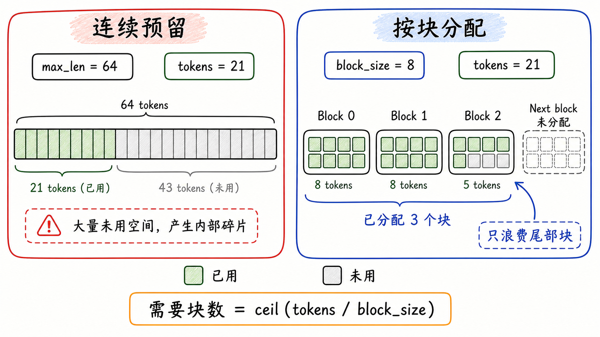
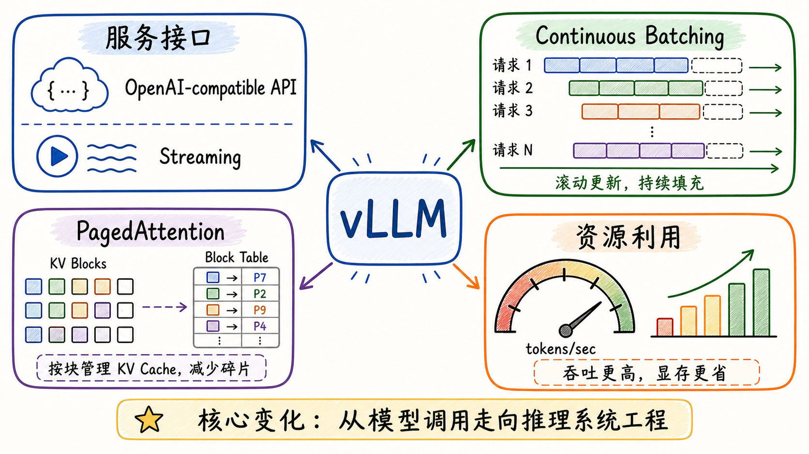

---
tags:
  - vllm
  - llm-inference
  - inference-engine
  - paged-attention
  - kv-cache
updated: 2026-05-27
description: 本文从 vLLM 的定位、早期推理框架演进与 KV Cache 管理难题出发，解释 PagedAttention 为什么成为 vLLM 推理引擎的关键转折点。
---

# 02 初识 vLLM 推理引擎

本文默认读者已经知道 LLM 自回归生成、Prefill、Decode 和 KV Cache 的基本含义。即使没有读过上一篇，也可以先抓住这一章的中心问题：为什么 vLLM 的核心不是单次 `generate()` 调用，而是动态请求下的 KV Cache 管理。

上一篇已经把问题拉到了系统层面：LLM 推理不是一次简单的 `model.forward()`，而是一个由 Prefill、Decode、KV Cache、调度、显存、吞吐和延迟共同构成的在线系统问题。

这一篇正式进入 vLLM。这里暂时不急着展开 Scheduler、Executor、Worker、EngineCore 这些内部组件，因为那样很容易把“初识”写成源码导读。更好的进入方式，是先问一个更朴素的问题：为什么在 Hugging Face Transformers 已经可以调用模型生成文本、TGI 已经可以把模型服务化之后，还需要 vLLM 这样的推理引擎。

答案藏在一个看似局部、实际非常核心的问题里：**KV Cache 如何管理**。



vLLM 的关键价值，不只是让模型“能跑”，而是让模型在真实服务场景下更高效地跑。它把模型执行、请求队列、动态批处理、KV Cache 管理、流式返回和服务接口组织到同一个推理系统里。理解这一点之后，再看 PagedAttention，就不会把它误解成“又一个注意力公式优化”，而会看到它背后真正改变的是推理系统的内存管理方式。

## 1. vLLM 是什么

vLLM 官方文档将它定位为一个用于 LLM inference and serving 的快速、易用库。这个表述看起来很轻，但里面包含两层含义。

第一层是 **inference**：vLLM 能加载模型权重，接收 prompt，执行生成，返回 token。这是所有推理框架都必须具备的基础能力。

第二层是 **serving**：vLLM 不只面向单次脚本调用，还面向在线服务。它要处理多个请求同时到达、请求长短不一、输出长度未知、用户希望流式返回、服务端还要监控吞吐和延迟这些问题。

因此，与其把 vLLM 理解成“比 Transformers 更快的 generate()”，不如把它理解成一个推理引擎：它把模型调用包装成可持续服务的系统。

可以从三个边界来理解 vLLM。

| 维度   | 普通模型库                       | 推理服务框架               | vLLM 推理引擎                   |
| ---- | --------------------------- | -------------------- | --------------------------- |
| 主要目标 | 让模型能被加载和调用                  | 让模型能对外提供服务           | 让模型在高并发下高效服务                |
| 核心对象 | 模型权重、Tokenizer、`generate()` | HTTP 接口、Streaming、监控 | 请求调度、KV Cache、动态 batch、执行效率 |
| 典型问题 | 如何生成文本                      | 如何部署服务               | 如何在显存受限下提高吞吐并控制延迟           |
| 学习入口 | API 调用                      | 服务启动与部署              | 推理系统资源管理                    |

这个边界并不是说模型库和服务框架不重要。恰恰相反，vLLM 站在它们的基础上继续往前走：当“能生成”和“能服务”已经不够时，问题就变成了“怎样以更少硬件服务更多动态请求”。

接下来会先用 Transformers 和 TGI 说明“服务化”为什么仍然没有完全解决推理系统问题，再把主线收束到 KV Cache 的显存管理，最后进入 PagedAttention。为了避免把机制讲散，可以先记住一个贯穿例子：请求 A 是短 prompt 短输出，请求 B 是长 prompt 长输出，请求 C 与 A 共享相同的 System Prompt。后文的静态 batch、连续 batch、连续预留、block 分配和前缀复用，都可以放回这三个请求中理解。

## 2. LLM 推理的核心挑战

理解 vLLM 之前，仍然需要把 LLM 推理的基本矛盾再压缩回顾一遍。上一篇已经展开过细节，这里只保留对 vLLM 最关键的几条线索。



第一，LLM 生成通常是自回归的。模型一次只生成一个 token，下一个 token 依赖前面的上下文。因此，生成一个长回答不是一次大计算，而是一串连续的小步骤。

第二，Prefill 和 Decode 的计算形态不同。Prefill 一次处理完整 prompt，常常更像大矩阵计算；Decode 每步只推进一个 token，但要不断访问模型权重和历史上下文状态。两者对 TTFT、TPOT、吞吐和硬件瓶颈的影响并不相同。

第三，KV Cache 既是加速手段，也是显存压力来源。没有 KV Cache，每一步 Decode 都要反复计算历史 token 的 Key/Value；有了 KV Cache，历史状态可以复用，但它会随着 prompt 长度、输出长度和并发请求数持续增长。

第四，在线请求是动态的。不同用户的 prompt 长度不同，输出长度也无法提前精确知道；短请求可能很快结束，长请求可能占用大量缓存；新请求随时进入，旧请求随时完成。

这四点合在一起，就构成了 vLLM 所面对的核心系统问题：**模型权重基本固定，但请求和 KV Cache 状态持续变化；GPU 显存很贵，而推理服务又必须尽量提高并发和吞吐**。

## 3. 服务化为什么还不够

vLLM 的出现不是凭空发生的。为了教学清晰，本文把推理系统能力拆成三层：先解决“能生成”，再解决“能服务”，最后解决“如何高效服务大量动态请求”。这是一条概念分层路线，不是严格的版本时间线。现实中 TGI、vLLM、SGLang 等系统的能力会相互影响并持续重叠，例如当前 TGI 文档也列出了 Continuous Batching、Paged Attention、Streaming、Prometheus 和 OpenTelemetry 等 serving 能力，同时提示 TGI 进入 maintenance mode，并建议新项目优先关注 vLLM、SGLang 等新一代 serving 框架。



### 3.1 HF Transformers：从模型调用开始

Hugging Face Transformers 是许多人进入 LLM 推理的第一站。它的接口非常直观：加载模型，加载 tokenizer，调用 `generate()`，得到输出。

这种方式特别适合实验、离线脚本、小规模验证和模型功能探索。它把复杂的模型结构、权重加载、分词、采样策略都封装成了相对统一的 API。

但当场景进入在线服务时，仅仅有 `generate()` 还不够。生产环境会遇到一批更系统的问题。

- 请求不是整齐到达，而是不断流入；
- 每个请求的 prompt 长度不同；
- 每个请求最终会生成多少 token 无法提前知道；
- 用户可能要求 Streaming，而不是等完整结果；
- 系统需要在吞吐、延迟、显存和公平性之间做权衡；

Transformers 自身也提供了多种 cache 策略，例如默认的 `DynamicCache` 会随着生成增长，`StaticCache` 会预分配固定大小以配合编译优化。但这类能力的重点仍然是模型生成 API 内部的缓存策略，而不是完整在线推理服务的全局调度系统。

如果把这一步画成一张图，它的核心是“模型调用”。

```text
prompt -> tokenizer -> model.generate() -> output
```

这条链路可以把单个请求跑通，却还没有回答“多个动态请求如何共享同一组 GPU 资源”。

### 3.2 TGI：从模型调用走向服务框架

Hugging Face Text Generation Inference（TGI）把问题往服务化推进了一大步。TGI 的官方文档将它描述为用于部署和服务 LLM 的工具包，并列出了一系列服务侧能力：生产可用的 tracing 和 Prometheus metrics、Tensor Parallelism、Server-Sent Events Streaming、Continuous Batching 等。

这一步的意义在于：LLM 不再只是一个 Python 进程里的对象，而变成了可以对外提供 HTTP 服务、可以流式返回、可以被监控和部署的系统。

其中，Continuous Batching 是理解后续 vLLM 的重要前奏。传统静态 batch 往往要求一批请求一起进入、一起执行、一起等到最长请求完成；但自回归生成的请求长度高度不规则，短请求很容易被长请求拖住。



Continuous Batching 的核心直觉是：不要在“请求级别”固定一个 batch，而是在“生成迭代级别”不断更新 batch。某个请求完成后，可以从 batch 中移出；新请求如果资源允许，可以进入后续迭代。ORCA 论文把类似思想称为 iteration-level scheduling，也就是以一次生成迭代为粒度调度，而不是等整个请求完成后再调整 batch。

这解决了静态 batch 的一部分问题。放回前面的例子里，请求 A 很短，静态 batch 会让它等请求 B 这个长输出完成；Continuous Batching 则可以在 A 完成后释放位置，让新请求进入后续迭代，而不是等整个旧 batch 结束。

不过，Continuous Batching 让另一个问题变得更尖锐：既然请求可以不断进入和退出，那么每个请求的 KV Cache 也必须能被灵活分配、增长、释放和复用。如果内存管理仍然要求大块连续预留，那么调度越灵活，显存碎片和浪费就越容易成为新的瓶颈。

### 3.3 vLLM：把内存管理推到中心

vLLM 的突破口正是在这里。它没有只停留在“把 batch 调度得更聪明”，而是继续追问：如果推理系统的核心状态是 KV Cache，那么能不能像操作系统管理内存一样管理 KV Cache。

PagedAttention 论文的摘要明确指出，高吞吐 LLM serving 需要同时 batch 足够多的请求，但现有系统会受限于巨大的、动态增长和收缩的 KV Cache；如果管理低效，显存会被碎片和重复存储显著浪费，进而限制 batch size。

这句话基本就是 vLLM 的历史入口：它把“推理吞吐问题”重新表述成“KV Cache 内存管理问题”。

## 4. KV Cache 管理为什么成为瓶颈

KV Cache 的作用很直接：保存历史 token 在每层注意力中的 Key/Value 状态，避免 Decode 时反复计算历史上下文。Hugging Face Transformers 文档也将 KV Cache 描述为自回归生成优化的关键机制，因为每次预测都依赖历史 token，而缓存可以复用这些中间结果。

但缓存不是免费的。KV Cache 通常放在 GPU 显存中，而显存恰恰是 LLM 推理服务最紧张的资源之一。



一个简化的 KV Cache 大小可以这样估算。

```text
KV Cache bytes
= 2 × layers × kv_heads × head_dim × tokens × bytes_per_dtype
```

这里的 `2` 分别对应 Key 和 Value；`tokens` 既包括 prompt token，也包括后续生成出来的 output token。这个公式是理解量级的全模型估算，真实系统还要考虑 GQA/MQA 下的 `num_key_value_heads`、Tensor Parallelism 对单卡 KV heads 的切分、KV Cache quantization、sliding window attention、prefix sharing、offload 和具体实现中的元数据开销。

以 FP16 下、没有 GQA 压缩 KV heads 的 LLaMA-2 7B 类结构做一个粗略估算。

- `layers = 32`；
- `kv_heads = 32`；
- `head_dim = 128`；
- `bytes_per_dtype = 2`；

则每个 token 的 KV Cache 大约是：

```text
2 × 32 × 32 × 128 × 2 = 524,288 bytes ≈ 0.5 MB
```

这意味着，4096 tokens 的单请求上下文可能带来约 2 GiB 的 KV Cache。这个数字不是为了记忆某个模型的固定常数，而是为了建立直觉：**KV Cache 会随着 token 数和并发数线性增长，很容易变成比模型调用本身更难管理的系统资源**。

### 4.1 连续预留的浪费

早期系统面对 KV Cache 时，一个自然做法是为每个请求预留一段连续空间。因为输出长度未知，系统往往要按最大长度或较大上限预留。

问题是，大多数请求不会刚好用满这段空间。一个请求可能预留 4096 tokens 的 KV 空间，但最后只生成 200 tokens；另一个请求可能很快结束；还有请求可能占用很长时间。放回 A/B/C 的例子里，A 很快完成但预留空间很大，B 继续占用长上下文空间，C 又可能因为共享 System Prompt 而存在潜在复用机会。连续预留既无法细粒度释放 A 的尾部空洞，也很难自然表达 A/C 的共享前缀。这样一来，显存里就会出现两类浪费。

- **内部浪费**：某个请求已经拿到一段大空间，但其中很多位置还没有被实际 token 使用；
- **外部碎片**：请求释放后留下许多分散空洞，总空闲空间很多，却不一定有足够大的连续空间给新请求；



PagedAttention 论文指出，传统管理方式会受到 fragmentation 和 redundant duplication 的影响，使 KV Cache 内存显著浪费。论文的核心判断是：如果 KV Cache 不能被细粒度管理，那么 batch size 就会被显存而不是算力提前卡住。

这也是为什么“模型已经成功加载到 GPU”并不等于“系统还能服务很多并发请求”。模型权重只是显存的固定部分，KV Cache 才是随着请求不断变化的动态部分。

### 4.2 动态工作负载与静态内存假设

LLM 在线推理天然是动态的。

- 输入长度动态；
- 输出长度动态；
- 请求到达时间动态；
- 请求完成时间动态；
- 多轮对话、共享系统提示词、并行采样还会带来更多状态复用机会；

而连续预留隐含的假设却更接近静态：先给每个请求一大段足够长的连续空间，再让它慢慢填满。

这就是矛盾所在：**工作负载越动态，连续大块预留越容易浪费；并发越高，浪费越会直接挤压吞吐**。

## 5. 引入PagedAttention

PagedAttention 的名字里有 Attention，但它真正想借鉴的是操作系统里的 Paging。

操作系统不会要求每个进程必须占用一整块连续物理内存。它会给进程一个看起来连续的虚拟地址空间，再通过页表把虚拟页映射到分散的物理页。进程看到的是连续地址，硬件实际访问的是被映射后的物理页。

vLLM 把这个思想迁移到了 KV Cache。



在这个类比里，可以这样对应。

| OS 内存管理 | PagedAttention |
| --- | --- |
| 虚拟地址空间 | 请求看到的逻辑 token 序列 |
| 物理页 | GPU 中的物理 KV Block |
| 页表 | Block Table |
| 按需分配页 | 按需分配 KV Block |
| 逻辑连续、物理分散 | token 逻辑连续，KV Block 可分散存储 |

### 5.1 从连续大块变成 KV Block

PagedAttention 的核心设计可以压缩成一句话：**把每个请求的 KV Cache 拆成固定大小的 block，用 Block Table 维护逻辑 token 序列到物理 KV Block 的映射**。



请求仍然可以把自己的上下文看成连续 token 序列，例如 L0、L1、L2、L3；但这些逻辑块不必连续放在 GPU 显存里。Block Table 会记录 L0 对应哪个物理块，L1 对应哪个物理块。注意力计算时，内核通过这张表找到对应的 K/V 数据。

这样一来，系统不再需要为请求一次性预留完整最大长度。请求需要更多 token 空间时，就继续申请新的 block；请求完成后，就释放它占用的 block。

### 5.2 为什么只浪费最后一个块

假设 `block_size = 8`，一个请求现在有 21 个 tokens。如果采用按块分配，它只需要：

```text
ceil(21 / 8) = 3 blocks
```

前两个 block 各自装满 8 个 token，第三个 block 装 5 个 token。在这个理想按需分配模型下，每个序列的内部碎片通常被限制在尾部未填满的 block 里，上限约为 `block_size - 1` 个 token 的空间。



这与连续预留形成鲜明对比。连续预留可能为一个短请求保留几千 token 的空间，而 PagedAttention 把序列内部碎片压到了 block 粒度。

当然，这里也要避免一个误区：PagedAttention 不是让显存浪费绝对归零。它仍然有尾部 block 的内部碎片，也会引入 Block Table、间接寻址、allocator、kernel layout 和实现层元数据成本。但相对大块连续预留，它把最主要的序列内部浪费从“按请求上限”压到了“按 block 粒度”。

### 5.3 注意力结果为什么不变

有读者可能会担心：KV Cache 物理上不连续，会不会改变注意力结果。

答案是不会。Attention 计算需要的是当前 query 能够访问所有历史 token 的 Key 和 Value；这些 K/V 在物理内存里是否连续，不改变数学定义。PagedAttention 改变的是存储和访问路径，而不是注意力公式本身。

可以把它理解成读书时查目录。

- 连续存储像一本从头到尾装订好的书；
- 分块存储像很多分散的小册子；
- Block Table 像目录，告诉你第几章在哪个小册子里；

只要目录正确，读者看到的章节顺序仍然是连续的。PagedAttention 要做的，就是让 GPU 内核能够沿着这张目录高效访问分散的 KV Block。

vLLM 当前的 Paged Attention 设计文档也提醒读者：官方文档中的历史说明基于原始论文，已经不完全描述当前代码；但文档仍然指出，vLLM 的 attention kernel 需要兼容 paged KV caches，其中 key cache 和 value cache 被存储在独立 block 中。对本章而言，这个高层概念正是理解 vLLM 的关键。

### 5.4 共享与复用

PagedAttention 还有一个重要副作用：它更容易支持 KV Cache 的共享。

如果多个请求共享同一段前缀，例如同一个 System Prompt，那么这些前缀 token 对应的 KV Block 理论上可以被复用，而不是每个请求重复保存一份。放回前面的例子，请求 A 和请求 C 共享 System Prompt，那么前缀 block 就有复用价值。vLLM 后续的 Automatic Prefix Caching 就是在 block 级别继续推进复用：它会对已处理请求的 KV Cache block 建立缓存，并在新请求拥有相同前缀时复用这些 block。

这说明 PagedAttention 不只是“省掉一些碎片”。它真正带来的系统能力，是让 KV Cache 成为可以被细粒度分配、查找、共享、回收的资源。

## 6 vLLM 带来的范式变化

现在可以把本章的逻辑线收束起来。

HF Transformers 让我们可以方便地调用模型生成文本；TGI 把模型调用推进到在线服务层，提供 Streaming、监控、Tensor Parallelism、Continuous Batching 等能力；ORCA 这类系统研究指出，生成式模型需要 iteration-level scheduling，因为请求级静态 batch 无法适应自回归、多迭代、长短不一的服务负载。

vLLM 在这条演进线上继续向前走：它把 KV Cache 管理放到推理系统核心，用 PagedAttention 把连续大块缓存改造成按 block 管理的动态缓存。



这带来了三个重要变化。

第一，推理系统从“算模型”变成“管理请求状态”。模型权重相对固定，真正持续变化的是请求、生成进度、KV Cache 和队列状态。

第二，显存从“静态装载空间”变成“动态调度资源”。显存不只是放模型，还要在大量请求之间分配 KV Block；分配粒度越细，系统越有机会提高并发。

第三，吞吐优化不再只是 kernel 优化。Kernel 很重要，但系统吞吐还取决于 batch 如何组织、请求如何进入退出、KV Cache 如何释放复用、显存压力如何被控制。

所以，vLLM 的学习路线不能只盯着某个函数或某个 CUDA kernel。更好的路线是先建立下面这条因果链。

```text
自回归生成
  -> Prefill / Decode 形态不同
  -> Decode 需要复用历史 KV
  -> KV Cache 成为核心动态状态
  -> 连续预留导致显存浪费和碎片
  -> PagedAttention 用 block 管理 KV Cache
  -> 更高并发与更高吞吐成为可能
```

理解到这里，“初识 vLLM”就完成了第一层目标。下一步再进入 vLLM 的具体架构时，Scheduler、KV Cache Manager、Executor、Worker 这些对象就不再是一串陌生组件名，而会自然落到一个问题上：它们各自在这条链路里承担什么系统职责。

## 参考资料

1. [vLLM 官方文档：Welcome to vLLM](https://docs.vllm.ai/en/latest/)：用于确认 vLLM 的 inference and serving 定位、核心能力和官方特性表述，访问日期为 2026-05-27；
2. [Efficient Memory Management for Large Language Model Serving with PagedAttention](https://arxiv.org/abs/2309.06180)：vLLM / PagedAttention 原始论文，解释 KV Cache 动态增长、碎片、重复存储与 PagedAttention 的核心设计；
3. [vLLM Design：Paged Attention](https://docs.vllm.ai/en/latest/design/paged_attention/)：历史设计文档，用于理解 vLLM paged KV caches、block 与 attention kernel 的高层关系，不作为当前代码细节说明；
4. [vLLM Feature：Automatic Prefix Caching](https://docs.vllm.ai/en/latest/features/automatic_prefix_caching/)：用于说明基于 KV Cache block 的前缀复用思想，访问日期为 2026-05-27；
5. [Hugging Face Transformers：Cache strategies](https://huggingface.co/docs/transformers/main/en/kv_cache)：用于说明自回归生成中的 KV Cache 作用、动态缓存和静态缓存取舍，访问日期为 2026-05-27；
6. [Hugging Face Text Generation Inference 文档](https://huggingface.co/docs/text-generation-inference/index)：用于说明 TGI 的 serving 定位、Streaming、Continuous Batching、Paged Attention、生产服务能力与 maintenance mode 状态，访问日期为 2026-05-27；
7. [ORCA: A Distributed Serving System for Transformer-Based Generative Models](https://www.usenix.org/conference/osdi22/presentation/yu)：用于说明 generation serving 中 request-level batch 的局限、iteration-level scheduling 与 selective batching；

## 学习测评

### 题目

1. 单选：本文为什么不把 vLLM 一开始就讲成 Scheduler、Executor、Worker 等组件集合？
   A. 因为这些组件已经不属于 vLLM；
   B. 因为初识阶段更重要的是理解 vLLM 为什么出现，以及它解决了什么系统矛盾；
   C. 因为 vLLM 只包含一个 PagedAttention kernel；
   D. 因为 vLLM 只能用于离线推理；

2. 单选：vLLM 更准确的定位是什么？
   A. 一个只负责离线批量生成的脚本封装；
   B. 一个只比 Transformers 多封装一层 `generate()` 的库；
   C. 一个面向 LLM inference and serving 的推理引擎；
   D. 一个只提供 HTTP 网关、不参与推理执行组织的服务外壳；

3. 多选：在线 LLM 推理区别于单次模型调用的关键因素包括哪些？
   A. 请求随时到达；
   B. 输出长度无法提前精确知道；
   C. KV Cache 会随上下文和生成增长；
   D. 只要 `generate()` 支持 batch，就不再需要额外调度；

4. 单选：HF Transformers 在这条演进路线中的主要意义是什么？
   A. 提供方便的模型加载、Tokenizer 和 `generate()` 调用入口；
   B. 首先提出 PagedAttention；
   C. 完全解决高并发 KV Cache 管理问题；
   D. 主要负责把在线请求调度成 iteration-level batch；

5. 多选：TGI 相比普通脚本调用推进了哪些 serving 能力？
   A. HTTP 服务化；
   B. Streaming 输出；
   C. Prometheus / tracing 等生产观测能力；
   D. 通过服务化自动消除 KV Cache 碎片；

6. 单选：Static Batching 在生成式服务中容易低效的核心原因是什么？
   A. 所有请求总是长度完全相同；
   B. 一批请求往往要被最长请求拖住，短请求完成后仍可能等待；
   C. 它会自动释放所有 KV Cache；
   D. 它不需要 padding 或等待；

7. 单选：ORCA 的 iteration-level scheduling 主要想解决什么问题？
   A. 以请求为单位固定 batch 难以适应多迭代、自回归生成负载；
   B. Tokenizer 无法把文本转成 token；
   C. 模型权重无法加载到 CPU；
   D. KV Cache 完全不占显存；

8. 多选：为什么 KV Cache 管理会成为推理系统瓶颈？
   A. KV Cache 会随 token 数增长；
   B. KV Cache 会随并发请求数增长；
   C. GPU 显存通常很昂贵且有限；
   D. Continuous Batching 越灵活，越要求 KV Cache 能够灵活分配和释放；

9. 多选：传统连续 KV Cache 预留方式的主要问题是什么？
   A. 它必须为每个请求预留一段连续空间，短请求和未知输出长度容易造成浪费；
   B. 输出长度未知时容易按上限预留，造成内部浪费和外部碎片；
   C. 它主要问题是 attention 公式从线性变成二次方；
   D. 它的浪费只来自最后一个 block；

10. 单选：PagedAttention 借鉴操作系统分页思想后，最核心的改变是什么？
    A. 把每个请求都固定分配到一段连续 KV 空间；
    B. 把 KV Cache 拆成固定大小 block，并用 Block Table 维护逻辑到物理的映射；
    C. 删除 KV Cache，改成每步重新计算所有历史 token；
    D. 只优化 HTTP 接口，不改变内存管理；

11. 多选：关于 PagedAttention，下列哪些说法是正确的？
    A. 请求看到的 token 序列可以保持逻辑连续；
    B. 物理 KV Block 可以分散存储；
    C. Block Table 负责记录逻辑块到物理块的映射；
    D. PagedAttention 主要改变 attention 的数学公式，而不是内存布局；

12. 单选：设 `block_size = 8`，某请求当前需要缓存 21 个 tokens。在理想按需分配模型下，下面哪个说法更准确？
    A. 需要预留 64 个 token 空间，因为必须按最大长度分配；
    B. 需要 3 个 block，序列内部浪费主要在最后一个未填满 block；
    C. 需要 21 个 block，因为每个 token 都必须独占一个 block；
    D. 不需要 KV Cache，因为 PagedAttention 会取消历史缓存；

13. 多选：请求 A 与请求 C 共享相同 System Prompt，但用户问题不同。PagedAttention 与前缀缓存为什么有助于减少重复工作？
    A. KV Cache 被拆成可识别、可引用的 block；
    B. 多个请求共享相同前缀时，相关 block 有机会复用；
    C. Block 级管理使缓存查找、引用计数、释放和回收更自然；
    D. 只要共享前缀存在，系统就可以忽略权限隔离、hash 冲突和缓存盐等安全边界；

14. 单选：请求 A 是短输出，请求 B 是长输出，请求 C 在 A 完成后到达。Continuous Batching 最核心的优势是什么？
    A. 它保证 A、B、C 必须同时开始并同时结束；
    B. 它可以在迭代级别移出完成请求并接纳新请求，提高 batch 的流动性；
    C. 它自动解决所有 KV Cache 预留和碎片问题；
    D. 它让 Decode 不再逐 token 推进；

15. 多选：读完本文后，再继续学习 vLLM 架构时，应该重点追问哪些问题？
    A. Scheduler 如何决定哪些请求进入下一步；
    B. KV Cache Manager 如何分配、复用和释放 block；
    C. Executor / Worker 如何把调度结果变成模型执行；
    D. TTFT、TPOT、吞吐和显存指标如何反映这些组件的效果；

### 答案与解析

1. **B**。这一章的目标是建立 vLLM 的出现逻辑，而不是提前进入组件名词表；如果没有先理解推理系统矛盾，后面的组件会变成孤立概念；
2. **C**。vLLM 面向 LLM inference and serving，既包含模型执行，也包含服务、调度和 KV Cache 管理等系统能力；
3. **A、B、C**。在线推理的动态性来自请求到达、输出长度和缓存状态；D 的误区在于把 batch API 当成完整调度系统，实际 serving 还要处理请求进入退出、缓存增长和资源约束；
4. **A**。Transformers 的关键价值是统一模型加载、Tokenizer 和生成 API；它是学习和实验入口，但不是完整高并发推理服务系统；
5. **A、B、C**。TGI 推进了服务化、Streaming 和生产观测能力；D 是常见误解，服务化和 continuous batching 可以改善执行组织，但不会自动消除 KV Cache 内存碎片；
6. **B**。生成长度不一致时，短请求可能被最长请求拖住，导致等待和资源浪费；
7. **A**。ORCA 看到生成式推理是多迭代工作负载，因此提出以迭代为粒度调度，而不是只在请求级固定 batch；
8. **A、B、C、D**。KV Cache 随 token 和并发增长，并占用昂贵 GPU 显存；continuous batching 让请求更频繁地进入和退出，也要求缓存能以更细粒度分配、释放和复用；
9. **A、B**。连续预留的关键问题既包括“必须拿到一段连续空间，短请求和未知输出长度容易浪费”，也包括“按上限预留导致内部浪费和外部碎片”。C 把内存管理问题误说成 attention 公式复杂度变化；D 则把连续预留误解成 PagedAttention 的尾部 block 浪费；
10. **B**。PagedAttention 的核心是 block 化 KV Cache，并用 Block Table 实现逻辑连续、物理可分散；
11. **A、B、C**。PagedAttention 改变的是内存管理和访问路径，不改变 attention 的数学定义；D 把“PagedAttention”这个名字误解成了 attention 公式优化；
12. **B**。21 个 tokens 在 `block_size = 8` 时需要 `ceil(21 / 8) = 3` 个 block，前两个 block 填满，浪费主要在第三个 block 的尾部。A 是连续预留思路，C 过度细碎，D 则否定了 KV Cache 的必要性；
13. **A、B、C**。Block 级管理使相同前缀的 KV Cache 更容易被标识和复用；D 忽略了多租户、安全隔离和 hash 设计等边界，现实系统不能为了复用而牺牲隔离；
14. **B**。Continuous Batching 的关键是迭代级别滚动更新 batch。C 是重要陷阱：它改善调度流动性，但不等于自动解决 KV Cache 内存管理问题；
15. **A、B、C、D**。后续架构学习要沿着请求调度、KV Cache 管理、模型执行和指标反馈继续追问；指标不是附属内容，而是判断组件设计是否有效的观察入口；
