---
tags:
  - vllm
  - llm-inference
  - inference-engine
  - distributed-inference
  - rank
updated: 2026-05-28
description: 本文基于本地 vLLM 源码快照建立 V1 引擎的整体架构地图，解释组件职责、请求执行流、rank 坐标体系以及 TP、PP、DP、EP 等分布式推理部署视图。
---

# 03 vLLM 引擎架构总览

前两章已经把问题从“模型能不能生成文本”推进到了“推理系统如何在动态请求、显存约束和服务化场景下稳定运行”。这一章继续往下走，但仍然不急着深入 PagedAttention、Scheduler、KV Cache Manager、ModelRunner 或某个算子实现。

本章的目标是先建立 vLLM 这台机器的完整地图：请求从哪里进来，怎样变成引擎内部状态，EngineCore 在每一步做什么，Executor 和 Worker 如何把调度结果变成 GPU 上的 forward，rank 又如何把进程、GPU、模型分片和通信组组织起来。本文不是完整分布式部署手册，而是用分布式视角补全引擎架构地图。

本文以 `code/opensource/vllm` 的本地源码快照为依据，源码分支为 `main`，短提交哈希为 `52a31ccec`。由于 vLLM 已进入 V1 架构，本文默认以 V1 路径解释，例如 `vllm/v1/engine`、`vllm/v1/core`、`vllm/v1/executor`、`vllm/v1/worker` 和 `vllm/distributed/parallel_state.py`。vLLM V1 内部仍在快速演进，尤其是 DP/EP、异步调度和服务化拓扑，后续复查时应先确认源码快照。

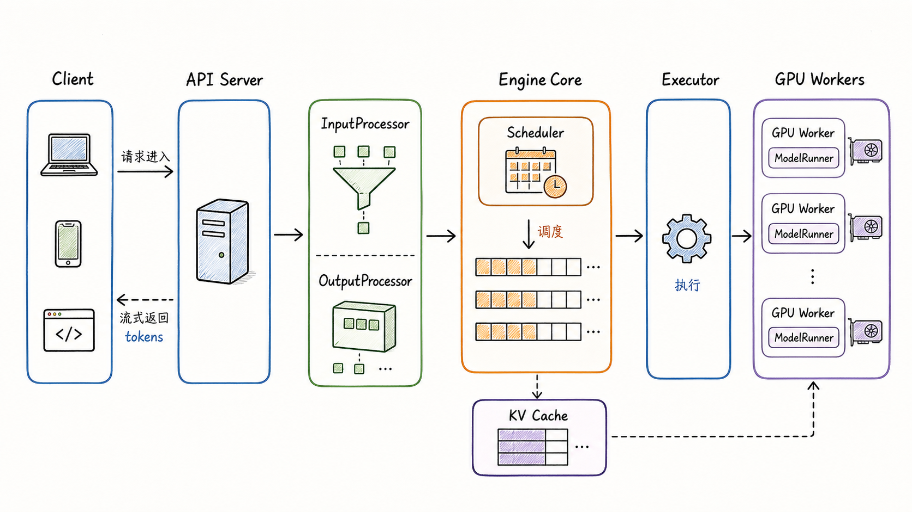

读这张图时，可以先抓住一条主线：**API Server 负责面对用户，EngineCore 负责维护推理系统状态，Executor 负责组织执行，Worker/GPU 负责真正跑模型**。先看状态在哪一层被维护，再看请求跨过哪些边界进入 GPU 执行。vLLM 的价值不在于把这些名字堆在一起，而在于把它们放进一个高吞吐、可并发、可分布式扩展的执行循环里。

## 1. vLLM 引擎架构总览

从在线服务视角看，vLLM V1 可以被拆成四层。

第一层是前端入口层。用户通过 OpenAI-compatible API 或 Python `LLM` / `AsyncLLM` 接口提交请求。在线服务中，API Server 处理 HTTP、鉴权相关协议、请求解析、tokenization、多模态输入预处理，以及 streaming 输出。

第二层是引擎协调层。V1 中更关键的名字是 `EngineCore`。它是推理系统的内循环，负责接收 `EngineCoreRequest`，维护请求状态，调用 Scheduler，管理 KV Cache 元数据，并把每一步的调度结果交给模型执行侧。

第三层是执行编排层。`Executor` 屏蔽了单进程、multiprocessing、Ray 等执行后端差异。对于多 GPU 场景，它负责创建和管理 worker 进程，向所有 worker 广播 `SchedulerOutput`，并从指定输出 rank 收集 `ModelRunnerOutput`。

第四层是设备执行层。每个 GPU 通常由一个 worker 进程管理。worker 持有 `ModelRunner`、模型权重、GPU KV Cache，并执行 forward、采样、KV cache 初始化和显存 profiling 等工作。

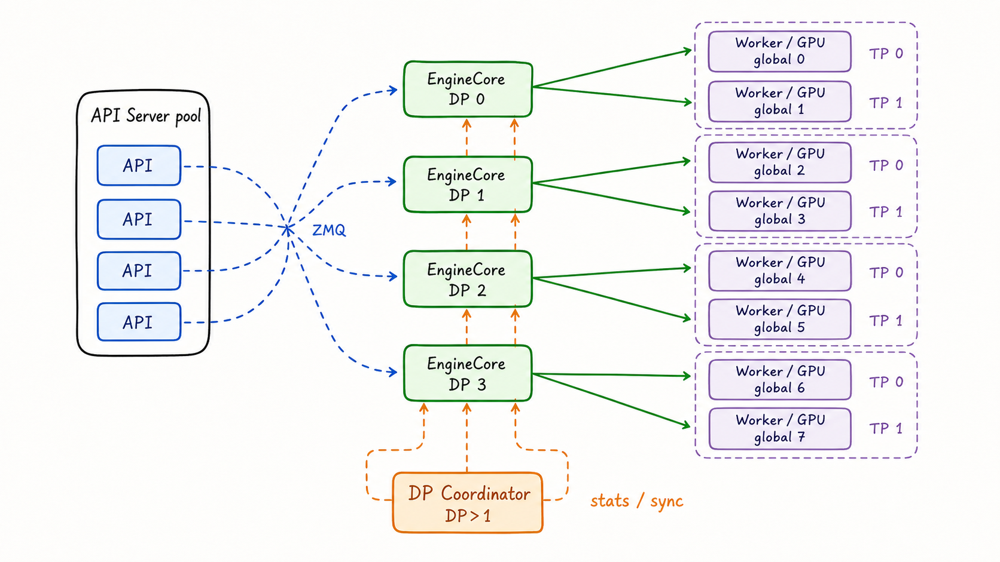

官方设计文档对 V1 进程架构的描述非常直接：API Server 处理 HTTP 与输入输出；EngineCore 运行 scheduler、管理 KV cache 并协调 GPU worker；GPU worker 执行模型 forward；当使用 data parallelism 时，每个 DP rank 有一个 EngineCore，`data_parallel_size > 1` 时 V1 进程架构还会包含一个 DP Coordinator。对 non-MoE 的 internal / hybrid LB，它可以参与队列统计发布和负载信息汇聚；对 MoE 的 DP+EP 场景，它还承担 wave coordination、dummy forward 同步等职责。这个进程视角很重要，因为后文所有 rank 关系最终都会落到“哪个进程控制哪块 GPU、属于哪个通信组”。

一个容易混淆的点是：`LLMEngine` 和 `AsyncLLMEngine` 这些名字仍然会出现在文档和代码里，但 V1 里的核心执行路径已经更明确地拆成了 `AsyncLLM` / `LLMEngine` 前端对象、`EngineCoreClient`、后台 `EngineCore`、`Executor` 和 `Worker`。阅读时要区分 `vllm/engine/*` 中仍然存在的兼容或 V0 路径，以及 `vllm/v1/engine/*` 中当前主线的 V1 路径。

## 2. 核心组件地图

先不要把 vLLM 想成一个巨大的 `model.forward()` 包装器。更准确的理解是：vLLM 把“服务请求”和“模型执行”之间的中间状态显式管理起来。哪些请求已经进入系统，哪些请求正在运行，哪些 token 已经被计算，哪些 KV block 已经分配，哪个 DP rank 当前更适合接收新请求，这些都是引擎需要维护的状态。

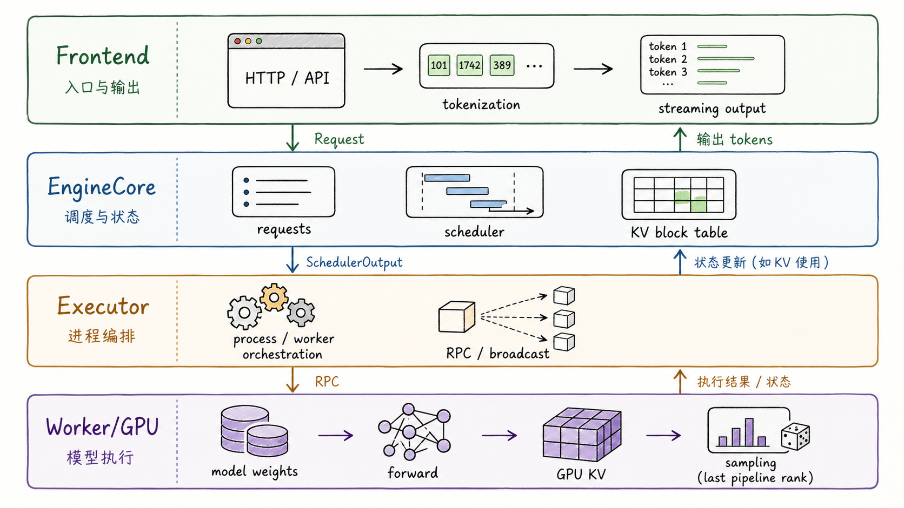

下面用组件地图把主要对象压缩到一个表里。初读时先只记四个主轴：入口负责请求与输出，EngineCore 负责状态与调度，Executor 负责进程编排，Worker 负责 GPU 执行。读表时不要逐格背诵，而是追问每一行“它维护什么状态、它把什么交给下一层”。表格用于后续回查，不需要第一次就把所有字段背下来。

| 组件 | 主要职责 | 典型输入 | 典型输出或状态 |
| --- | --- | --- | --- |
| API Server / Entrypoints | 接收 HTTP 或 Python 调用，完成协议层处理，触发输入预处理和输出 streaming | OpenAI API 请求、Python prompt、sampling params | 面向引擎的请求对象、面向客户端的增量输出 |
| `InputProcessor` | 把外部输入规范化为引擎内部请求 | prompt、tokenization 参数、多模态输入、LoRA 请求 | `EngineCoreRequest` |
| `OutputProcessor` | 把引擎输出转换为用户可见的请求输出 | `EngineCoreOutputs`、token id、finish reason | streaming chunk、最终 `RequestOutput` |
| `EngineCoreClient` | 连接前端进程和后台 EngineCore | add/abort 请求、utility RPC | 通过 ZMQ 或本地路径发送请求、接收输出 |
| `EngineCore` | 推理内循环，维护 scheduler、KV cache、executor 之间的协调 | `EngineCoreRequest`、abort、pause、reconfigure 等控制消息 | `EngineCoreOutputs`、scheduler stats、请求完成状态 |
| `Scheduler` | 决定每一步哪些请求计算多少 token，并申请 KV block | waiting/running 请求、token budget、KV cache 可用块 | `SchedulerOutput` |
| `KVCacheManager` | 管理 KV block 的分配、释放、prefix cache 命中和 block 元数据 | request、num_new_tokens、block hashes | 新分配的 KV blocks、可复用 blocks、释放事件 |
| `Executor` | 管理 worker 后端，广播调度结果，收集执行结果 | `SchedulerOutput`、worker RPC | `ModelRunnerOutput`、worker 状态 |
| `Worker` | 每个设备上的执行进程，负责模型加载、显存 profiling、KV cache 初始化、forward | worker rank、local rank、KV cache config、scheduler output | GPU 上的模型输出、采样结果、KV cache 状态 |
| `ModelRunner` | 将调度结果变成模型可执行的张量输入，调用模型 forward | token ids、positions、block table、attention metadata | logits、sampled token、hidden states 或 pooling 输出 |
| `parallel_state.py` | 初始化 TP、PP、DP、EP 等通信组 | world size、global rank、parallel config | `get_tp_group()`、`get_pp_group()`、`get_dp_group()`、`get_ep_group()` |

源码上，`EngineCore.__init__` 的顺序很能说明架构：它先构造 `model_executor`，再初始化 KV cache 并更新 cache config，然后根据 scheduler config 创建 scheduler，最后准备 batch queue、prefix cache hash、异步调度等运行时状态。也就是说，EngineCore 不是单纯“调用模型”的对象，而是把模型执行、KV cache 资源、调度策略和请求状态组织到同一个循环里的对象。

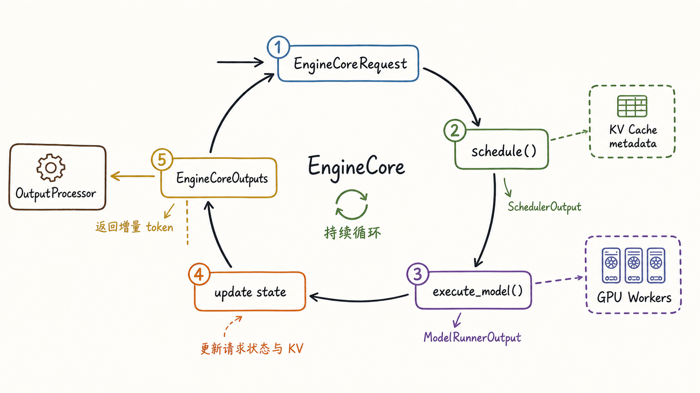

可以把 EngineCore 的每一步理解为下面这个循环：

1. 从前端或队列中接收新的 `EngineCoreRequest`；
2. 把外部请求转换成内部 `Request`，并加入 Scheduler；
3. Scheduler 根据 running/waiting 状态、token budget、KV cache 可用性产生 `SchedulerOutput`；
4. Executor 把 `SchedulerOutput` 交给 worker，worker 在 GPU 上执行模型；
5. EngineCore 根据 `ModelRunnerOutput` 更新请求、KV cache、finish 状态和输出；
6. `OutputProcessor` 将增量 token 或完成信号返回给客户端。

这就是为什么本章先讲架构总览。后续无论深入 Scheduler、KV Cache、PagedAttention 还是分布式通信，都只是这个循环中的一个局部机制。

## 3. 请求执行流

为了让组件地图变得具体，下面用一个请求和一批请求共同看执行流。两者不是两个独立机制，而是同一套系统的不同观察角度：单请求帮助理解生命周期；批请求帮助理解调度、KV block 和 GPU batch。

假设有三个请求进入系统：

- 请求 A：短 prompt，希望生成 32 个 token；
- 请求 B：长 prompt，希望生成 256 个 token；
- 请求 C：与 A 共享一段 system prompt，但到达时间稍晚；

进入 API Server 后，请求首先经过输入处理。文本会被 tokenizer 变成 token ids；chat 请求会被 renderer 套用 chat template；多模态输入会被加载和规范化；sampling params 会被克隆并补齐默认值。随后 `InputProcessor` 产生 `EngineCoreRequest`，其中包含 request id、prompt token ids、sampling params、arrival time、priority、LoRA 信息、trace headers，以及可选的 `data_parallel_rank`。

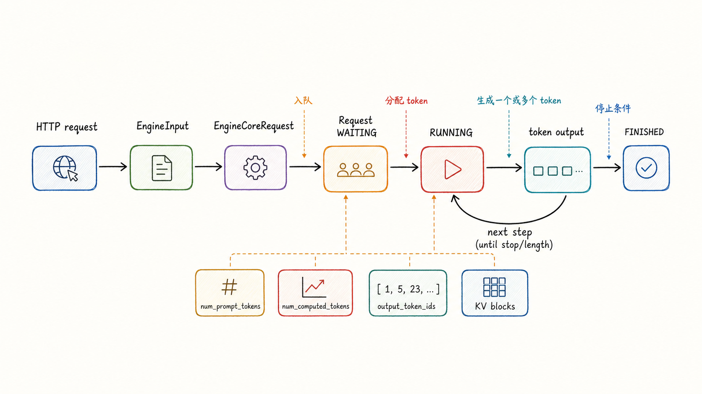

进入 EngineCore 后，`Request.from_engine_core_request()` 会把 `EngineCoreRequest` 转成内部 `Request`。这个对象是理解 vLLM 请求状态的核心，它至少包含这些长期状态：

- `status`：通常初始为 `WAITING`；结构化输出、远端 KV、流式输入等路径可能进入 `WAITING_FOR_STRUCTURED_OUTPUT_GRAMMAR`、`WAITING_FOR_REMOTE_KVS` 或 `WAITING_FOR_STREAMING_REQ`，之后再进入 `RUNNING`、`PREEMPTED` 或各种 `FINISHED_*` 状态；
- `num_prompt_tokens`：prompt 长度；
- `output_token_ids`：已经生成的输出 token；
- `all_token_ids`：prompt token 与输出 token 的合并视图；
- `num_computed_tokens`：已经完成模型计算的位置；
- `block_hashes`：用于 prefix caching 的 block hash；
- `num_preemptions`：被抢占次数；
- `kv_transfer_params`：P/D 分离或 KV connector 场景中的远端 KV 参数；

这里最值得停一下的是 `num_computed_tokens`。在源码注释中，V1 Scheduler 明确指出它内部并没有固定的“prefill phase”或“decoding phase”。每个请求只是有 `num_computed_tokens` 和 `num_tokens_with_spec`，Scheduler 每一步尝试给请求分配要计算的新 token，使 `num_computed_tokens` 追上目标长度。这样一个抽象可以同时覆盖 chunked prefill、prefix caching、speculative decoding 等场景。

这和初学时的“prefill 后 decode”并不矛盾。prefill/decode 仍然是理解推理成本的关键视角，但在 Scheduler 的实现抽象里，请求不是被硬塞进两个阶段，而是在每个 step 中按“还差多少 token 没算”来推进。

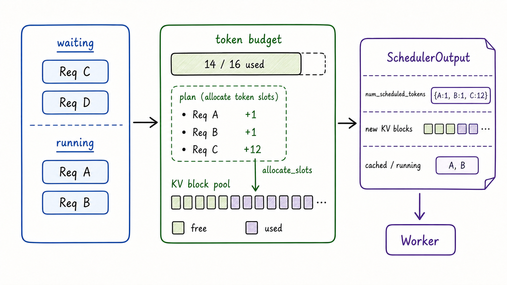

从一批请求看，调度过程可以简化成下面的故事。

首先，Scheduler 维护两个最关键的集合：`waiting` 和 `running`。新请求进入 waiting；已经被接纳并持有部分 KV cache 的请求进入 running。每一步调度时，Scheduler 会优先尝试继续推进 running 请求，因为它们已经占有 KV cache，继续推进通常可以减少中断和重算。

然后，Scheduler 会拿着一个 token budget 逐个请求分配本 step 要计算的 token 数。例如：

- 请求 A 已经完成 prompt，只需要 decode 下一个 token，因此本 step 分配 1 个 token；
- 请求 B prompt 很长，chunked prefill 下本 step 可能只分配 512 个 prompt token 中的一段；
- 请求 C 刚进入 waiting，如果 token budget 和 KV block 都够，就会被接纳进当前 step；

接着，Scheduler 调用 KV cache 管理逻辑申请 slots。申请成功后，本 step 会记录 `num_scheduled_tokens`、新分配的 blocks、已有 cached request 数据、需要释放的 encoder cache、structured output 等附加信息，并打包成 `SchedulerOutput`。

最后，Executor 将 `SchedulerOutput` 广播给 worker。worker 根据请求的 token、position、block table、attention metadata 等信息构造模型输入并执行 forward。输出回来后，EngineCore 侧会把 `ModelRunnerOutput` 交给 scheduler 的更新逻辑消费，追加新 token，推进 `num_computed_tokens`，判断是否满足 stop / length / abort / repetition 等结束条件，必要时释放 KV block。

这时再回到请求 C。C 与 A 共享一段 system prompt，如果 C 被路由到与 A 相同的 DP rank，并且 prefix cache 条件满足，那么 C 可能复用 A 已经计算过的前缀 block；如果 C 被负载均衡到另一个 DP rank，它会落到另一份独立 KV Cache 上，即使文本前缀相同，也不能直接复用 A 所在 DP rank 的本地 KV blocks。这个例子把请求流、KV block 和 DP 路由三件事连在了一起。

在这个视角里，“batch”不是外部用户手工凑出来的静态数组，而是 vLLM 每个 step 根据请求状态、token budget、KV cache 和调度策略动态形成的执行单元。这也是 continuous batching 的系统含义：请求可以在不同时间进入系统，但在每个 engine step 被重新组合成对 GPU 更友好的工作批次。

到这里，单机视角已经解释了请求状态怎样推进。多 GPU 视角还要再回答一个问题：这次推进到底落在哪个 worker、哪张 GPU、哪个通信组上。rank 就是把“请求流”连接到“实际执行拓扑”的坐标系。

## 4. Rank 关系总览

理解分布式推理之前，必须先把 rank 关系理顺。rank 不是“第几块 GPU”这么简单，而是同一个 worker 进程在不同坐标系里的身份。

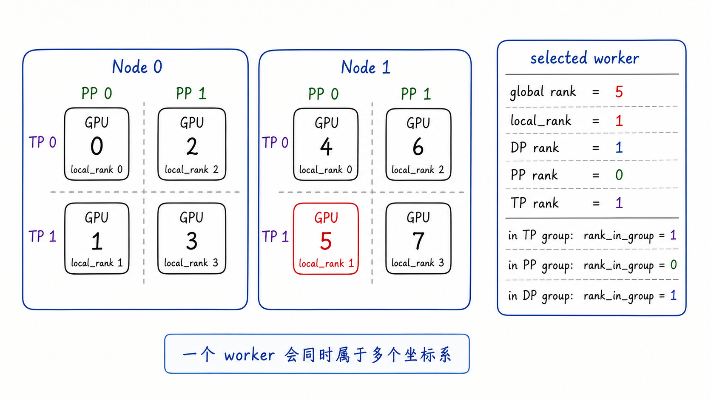

vLLM 中常见的 rank 和局部编号包括下面几类。

| 名称 | 含义 | 常见用途 |
| --- | --- | --- |
| global rank | 分布式 world 中的全局进程编号 | torch distributed 初始化、全局通信、日志定位 |
| local_rank | 当前节点或当前可见设备集合内的本地设备编号 | 选择 `cuda:{local_rank}` 或对应 accelerator |
| TP rank | tensor parallel group 内编号 | 同一层的张量切分、all-reduce、all-gather |
| PP rank | pipeline parallel group 内编号 | 决定当前 worker 执行哪些层，是否是 first/last stage |
| DP rank | data parallel group 内编号 | 区分模型副本、EngineCore、独立请求队列和 KV cache |
| EP rank | expert parallel group 内编号 | MoE 专家层的 expert shard 和 all-to-all 通信 |
| rank_in_group | 任意通信组内部的编号 | `GroupCoordinator` 内部广播、发送、接收、判断首尾 rank |

`local_rank` 和 `rank_in_group` 特别容易混淆。`local_rank` 更接近物理设备选择，例如某个 worker 用本节点的第几张卡；`rank_in_group` 是逻辑通信组里的位置，例如同一个进程在 TP group 内可能是 1，在 PP group 内可能是 0，在 DP group 内又可能是 1。

源码中 `GroupCoordinator` 会记录 `rank`、`ranks`、`world_size`、`local_rank` 和 `rank_in_group`。其中 `rank` 是 global rank，`ranks` 是当前 group 包含的 global rank 列表，`rank_in_group` 是当前 global rank 在这个列表中的下标。这解释了为什么同一个 worker 会同时有多个“rank”：它属于多个通信组，每个组都给它一个局部编号。

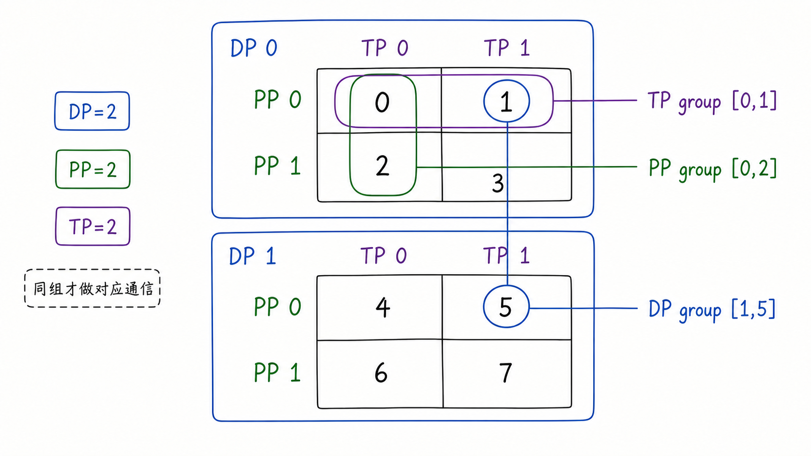

读这张图时重点看三种“同坐标”的含义：TP group 固定 DP/PP，只横向切同一 stage；PP group 固定 DP/TP，只纵向串 stage；DP group 固定 PP/TP，只在副本之间对应。以 `DP=2, PP=2, TP=2` 为例，global ranks 可以被看成一个三维网格。vLLM 在 `parallel_state.py` 中把 rank layout 注释为 `ExternalDP x DP x PP x TP`，默认不考虑 ExternalDP 和 PCP 时，可以先记成 `DP x PP x TP`。ExternalDP、PCP、DCP 等名字在源码里会继续出现，本章只需要知道它们是额外维度，先用 `DP x PP x TP` 建立主模型即可：

```text
DP0:
  PP0: TP0 rank0, TP1 rank1
  PP1: TP0 rank2, TP1 rank3

DP1:
  PP0: TP0 rank4, TP1 rank5
  PP1: TP0 rank6, TP1 rank7
```

在这个例子里：

- TP groups 是同一个 DP rank、同一个 PP stage 内的横向切分，例如 `[0, 1]`、`[2, 3]`、`[4, 5]`、`[6, 7]`；
- PP groups 是同一个 DP rank、同一个 TP rank 上的纵向 stage 链，例如 `[0, 2]`、`[1, 3]`、`[4, 6]`、`[5, 7]`；
- DP groups 是同一个 PP rank、同一个 TP rank 坐标上的不同模型副本，例如 `[0, 4]`、`[1, 5]`、`[2, 6]`、`[3, 7]`；

这个切法能帮助你读懂很多日志。例如某个进程打印“global rank 5, DP rank 1, PP rank 0, TP rank 1”，并不意味着它是“第 5 张卡上的第 1 个 TP”。它的含义是：它是全局第 5 个 worker，属于第二个 DP 副本，处于第一个 pipeline stage，在该 stage 的 TP group 里是第 1 号。

还要注意 `world_size` 的语境。`ParallelConfig.world_size` 在普通模型并行语境里是 `pipeline_parallel_size * tensor_parallel_size * prefill_context_parallel_size`；而 `world_size_across_dp` 会再乘以 `data_parallel_size`。当 DP 被纳入 torch distributed 初始化时，vLLM 会把 rank 按 DP rank 做 offset，并把 world size 调整成跨 DP 的总规模。

## 5. 分布式推理部署视图

rank 坐标清楚后，再看 TP、PP、DP、EP 的部署视图会容易很多。可以先用一句话区分四种并行：

- TP：切同一层里的张量；
- PP：切模型层；
- DP：复制模型副本处理不同请求；
- EP：切 MoE 专家层；

这四种并行可以组合，但组合的前提是你知道每种并行到底改变了什么：改变权重放置，改变请求路由，改变通信组，还是改变进程数量。

### 5.1 Tensor Parallel

Tensor Parallel 适合模型单卡放不下、但一个节点内多卡高速互联比较好的场景。vLLM 官方 scaling 文档也建议：单节点多 GPU 且模型可以放进一个节点时，优先考虑 TP。

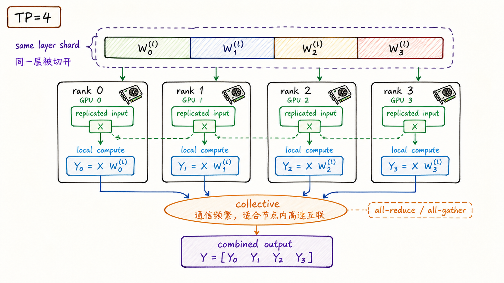

在 `TP=4` 的例子里，4 个 worker 属于同一个 TP group。它们处理同一层的不同张量 shard。图中把输入画成 replicated input 是为了建立直觉；实际实现里，输入可能按具体算子准备、切分或变换。每个 rank 做本地计算，然后通过 operator-dependent collective，例如 all-reduce 或 all-gather，合并下一步所需的结果。

启动命令通常类似：

```bash
vllm serve facebook/opt-13b \
  --tensor-parallel-size 4
```

TP 的优点是能把单层权重摊到多张 GPU 上。代价是层内通信频繁，尤其是跨节点 TP 会非常依赖网络。因此如果跨节点只靠普通 TCP，TP 往往不是理想选择；如果有 InfiniBand、GPUDirect RDMA、NVLink 或其他高速互联，跨节点 TP 才可能更合理。

### 5.2 Pipeline Parallel

Pipeline Parallel 把模型按层切成多个 stage。每个 stage 可以内部再用 TP。vLLM scaling 文档给出的常见多节点策略是：`tensor_parallel_size` 设为每个节点的 GPU 数，`pipeline_parallel_size` 设为节点数。

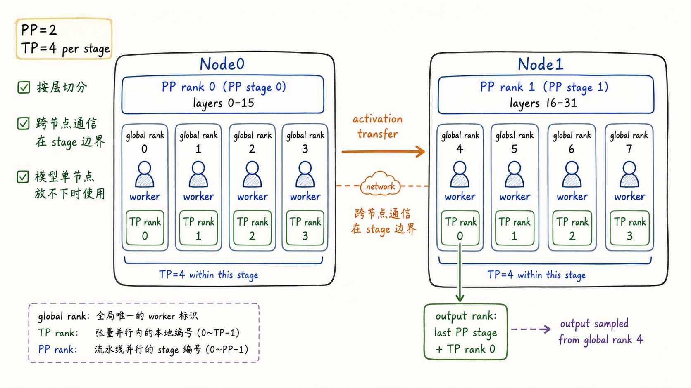

以 2 个节点、每个节点 4 张 GPU 为例，可以配置 `TP=4, PP=2`。Node0 上的 ranks 0-3 负责前半层，Node1 上的 ranks 4-7 负责后半层。这个图按常见的连续 rank 布局来画，实际放置还要以启动方式和 runtime 映射为准。激活值从 PP stage 0 传到 PP stage 1，最后一个 PP stage 的 TP rank 0 负责返回输出，而不是任意 global rank 都能直接作为最终输出 rank。

Ray 多节点命令可以写成：

```bash
vllm serve /path/to/model \
  --tensor-parallel-size 4 \
  --pipeline-parallel-size 2 \
  --distributed-executor-backend ray
```

multiprocessing 多节点模式则需要每个节点各启动一次，并显式指定节点 rank：

```bash
# Node 0
vllm serve /path/to/model \
  --tensor-parallel-size 4 \
  --pipeline-parallel-size 2 \
  --nnodes 2 \
  --node-rank 0 \
  --master-addr <HEAD_NODE_IP>

# Node 1
vllm serve /path/to/model \
  --tensor-parallel-size 4 \
  --pipeline-parallel-size 2 \
  --nnodes 2 \
  --node-rank 1 \
  --master-addr <HEAD_NODE_IP> \
  --headless
```

PP 的优点是可以让超大模型跨节点放下，并且通信主要发生在 stage 边界。代价是 pipeline bubble 和跨 stage 调度复杂度。vLLM 的 EngineCore 中有 batch queue 相关逻辑，用于支持 pipeline parallelism 下的异步调度与执行，减少 stage 空转。

### 5.3 Data Parallel

Data Parallel 复制模型权重，让不同 DP rank 处理不同请求批次。与 TP/PP 不同，DP 不把一个普通 dense 模型的单次 forward 拆到多个 rank 上，而是增加独立副本来扩大吞吐。

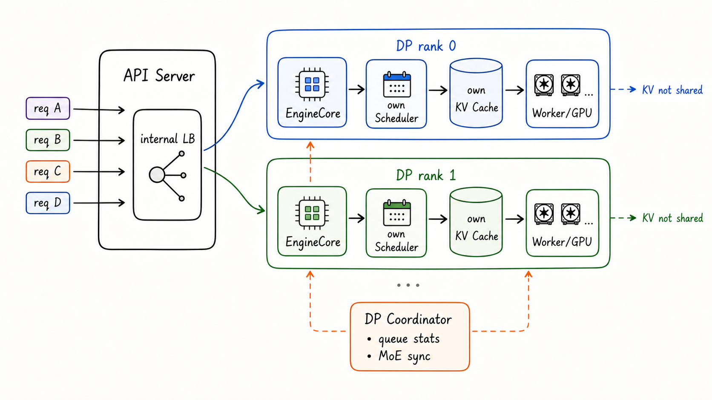

内部负载均衡模式下，vLLM 暴露一个 HTTP endpoint，API Server 内部把请求分发给不同 DP rank。每个 DP rank 有自己的 EngineCore、Scheduler、waiting/running 队列和 KV Cache。这个“KV Cache 不共享”是理解 DP 路由的关键：如果两个请求共享长前缀，但被分到不同 DP rank，它们无法直接复用同一份本地 prefix cache。

单节点 DP 可以这样启动：

```bash
vllm serve $MODEL \
  --data-parallel-size 4 \
  --tensor-parallel-size 2
```

这个配置需要 8 张 GPU。含义是：有 4 个 DP 副本，每个副本内部用 TP=2。V1 进程视角通常是 4 个 EngineCore、8 个 GPU worker，API Server 数量默认会随 DP 扩展；`data_parallel_size > 1` 时还会有 DP Coordinator。它在 internal / hybrid LB 中可用于队列统计发布，在 DP+EP 场景中还可用于 wave coordination 和 dummy forward 同步。

跨节点内部 DP 则需要告诉每个节点拥有哪些本地 DP rank。例如总 DP=4，每个节点 2 个本地 DP rank：

```bash
# Node 0
vllm serve $MODEL \
  --data-parallel-size 4 \
  --data-parallel-size-local 2 \
  --data-parallel-address 10.99.48.128 \
  --data-parallel-rpc-port 13345

# Node 1
vllm serve $MODEL \
  --headless \
  --data-parallel-size 4 \
  --data-parallel-size-local 2 \
  --data-parallel-start-rank 2 \
  --data-parallel-address 10.99.48.128 \
  --data-parallel-rpc-port 13345
```

对于 dense 模型，如果你已经有外部网关，也可以把多个独立 vLLM 实例放到外部负载均衡后面，不一定需要使用 vLLM 的 `--data-parallel-*` 参数。但对于 MoE 的 DP+EP 场景，vLLM 的 DP 参数还承担同步和协调作用，不能简单理解成“多起几个服务”。

### 5.4 External 与 Hybrid DP

vLLM 的 DP 不只有内部 LB。官方文档还区分 external LB 和 hybrid LB。它们的核心差异在于：请求路由到底由 vLLM 内部做，还是由上游系统做。

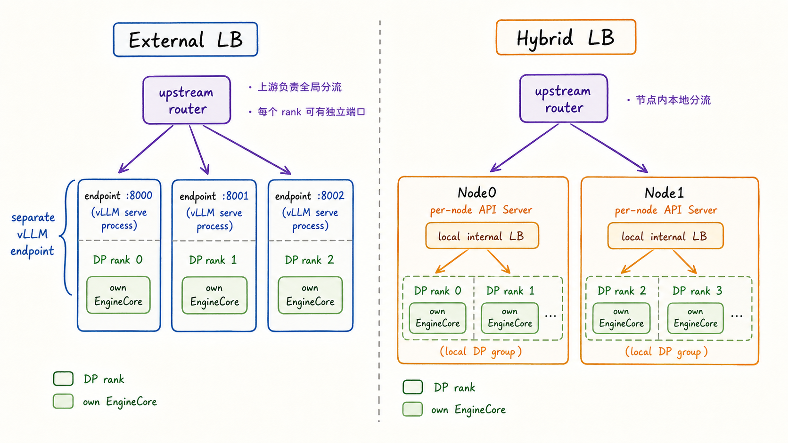

External LB 中，每个 DP rank 可以像独立 endpoint 一样暴露端口，上游 router 负责全局分流。需要先分清边界：下面这种带 `--data-parallel-rank` 的 external DP 示例主要面向 MoE DP+EP；对于普通 dense 模型，外部负载均衡通常更推荐启动多个独立 `vllm serve` 实例，并且不带 `--data-parallel-*` 参数。

```bash
# Rank 0
CUDA_VISIBLE_DEVICES=0 vllm serve $MODEL \
  --data-parallel-size 2 \
  --data-parallel-rank 0 \
  --port 8000

# Rank 1
CUDA_VISIBLE_DEVICES=1 vllm serve $MODEL \
  --data-parallel-size 2 \
  --data-parallel-rank 1 \
  --port 8001
```

Hybrid LB 介于 internal 和 external 之间：每个节点有自己的 API Server，只在本节点内部分发给本地 DP ranks；全局跨节点分流交给上游负载均衡器。读图时重点看“谁决定请求进哪个 DP rank”：internal 由 vLLM 内部入口决定，external 由上游决定，hybrid 则把节点内路由和全局路由拆开。这个模式可以减少大规模 DP 下单个 head node 的压力，并把路由限制在节点本地 DP ranks。按当前官方说明，internal DP LB 主要依据各 EngineCore 的 running / waiting 队列状态；KV-cache-aware routing 更适合作为未来演进方向来理解。

### 5.5 Expert Parallel

Expert Parallel 面向 MoE 模型。它不是 dense 模型通用的并行方式，而是改变专家层的权重放置和 token 路由。

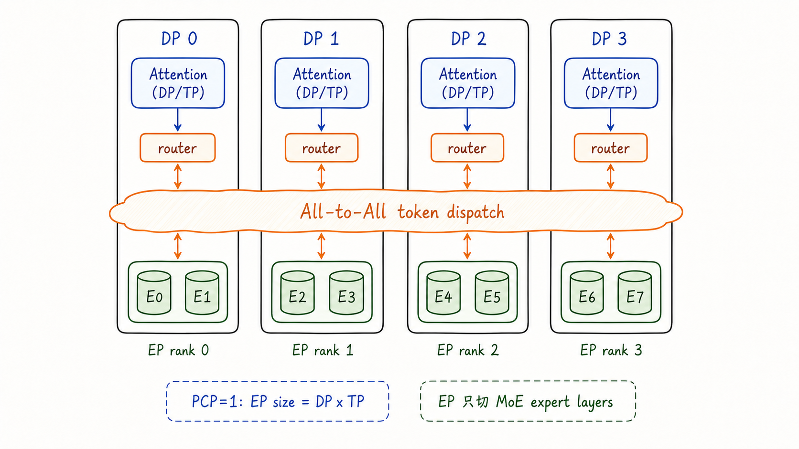

当 `--enable-expert-parallel` 开启时，MoE expert layers 会按 EP group 切分。官方 EP serving 文档给出的常见公式是 `EP_SIZE = TP_SIZE x DP_SIZE`；源码中当 PCP>1 时，EP group size 还会乘上 `prefill_context_model_parallel_size`。本章先按默认 PCP=1 理解即可。

一个典型单节点 MoE 命令是：

```bash
vllm serve deepseek-ai/DeepSeek-V3-0324 \
  --tensor-parallel-size 1 \
  --data-parallel-size 8 \
  --enable-expert-parallel
```

此时 attention 层仍按 DP/TP 规则处理：`TP=1` 时 attention weights 在 DP ranks 间复制；`TP>1` 时 attention weights 在每个 DP group 内按 TP 切分。expert 层则被放到 EP ranks 上，tokens 经过 router 后通过 all-to-all 发到对应专家所在 rank。

DP+EP 的一个重要运行时差异是：MoE expert layers 在多个 rank 之间存在同步需求。即使某些 DP rank 暂时没有真实请求，为了避免 collective 操作不一致导致挂起，也可能需要执行 dummy forward。DP Coordinator 会参与这类 wave coordination、队列统计和同步协调。

EP 还带来 all-to-all backend 的选择，例如 `allgather_reducescatter`、`deepep_high_throughput`、`deepep_low_latency`、`flashinfer_nvlink_*` 等。这里不深入通信内核，只需要先记住：EP 的瓶颈经常从 GEMM 计算转移到 token dispatch、all-to-all、expert load balance 和网络拓扑。

### 5.6 组合场景

实际部署中，TP、PP、DP、EP 往往会组合使用。一个实用判断顺序是：

1. 模型单卡能放下：优先单 GPU 或 DP 扩副本；
2. 模型单卡放不下，但单节点多卡能放下：优先 TP；
3. 模型单节点放不下：用 PP 跨节点，节点内再用 TP；
4. 请求吞吐不够：在每个模型副本外再加 DP；
5. MoE 模型专家层很大或专家负载不均：考虑 DP+EP、DeepEP backend 和 EPLB；

例如 2 个节点、每个节点 8 张 GPU，部署一个 dense 超大模型，常见组合是：

```bash
vllm serve /path/to/model \
  --tensor-parallel-size 8 \
  --pipeline-parallel-size 2 \
  --distributed-executor-backend ray
```

如果是 MoE 模型，并且希望 attention 侧按 DP 扩展、expert 侧按 EP 切分，跨两个 8 卡节点的启动方式需要按节点拆开。下面是贴近官方文档风格的示意：

```bash
# Node 0: primary, handles incoming requests
vllm serve deepseek-ai/DeepSeek-V3-0324 \
  --all2all-backend deepep_low_latency \
  --tensor-parallel-size 1 \
  --data-parallel-size 16 \
  --data-parallel-size-local 8 \
  --data-parallel-address 192.168.1.100 \
  --data-parallel-rpc-port 13345 \
  --enable-expert-parallel \
  --api-server-count 8

# Node 1: secondary, headless
vllm serve deepseek-ai/DeepSeek-V3-0324 \
  --all2all-backend deepep_low_latency \
  --tensor-parallel-size 1 \
  --data-parallel-size 16 \
  --data-parallel-size-local 8 \
  --data-parallel-start-rank 8 \
  --data-parallel-address 192.168.1.100 \
  --data-parallel-rpc-port 13345 \
  --enable-expert-parallel \
  --headless
```

可以把常见组合收束成一个小表。

| 场景 | 常见组合 | 主要收益 | 最容易看错的关系 |
| --- | --- | --- | --- |
| 单节点放得下，但吞吐不够 | DP | 增加模型副本处理更多请求 | DP rank 的 KV Cache 默认不共享 |
| 单卡放不下，单节点放得下 | TP | 把层内张量和权重切到多卡 | TP rank 是层内 shard，不是副本编号 |
| 单节点放不下 | 节点内 TP + 节点间 PP | 跨节点按层放置模型 | PP stage 传递 activation，输出来自 last PP stage |
| MoE 专家层很大 | DP + EP | attention 按 DP/TP，experts 按 EP 切分 | EP 只改变专家层，dense attention 不按 EP 解释 |
| 大规模在线服务 | DP + internal / hybrid / external LB | 扩展入口和请求路由 | dense external LB 与 MoE DP flags 边界不同 |

这类组合场景下，最重要的不是背命令，而是回到 rank 坐标：

- 一个 EngineCore 对应哪个 DP rank；
- 一个 worker 的 global rank 是多少；
- 它在 TP group 里负责哪份张量 shard；
- 它在 PP group 里处于哪个 layer stage；
- 如果是 MoE，它在 EP group 里持有哪些 expert；
- 请求路由到哪个 DP rank 后，会使用哪一份独立 KV cache；

只要这些问题能答清楚，复杂部署图就不会变成一堆参数名。

### 5.7 常见误解

本章最容易留下的误解可以集中收束成几条。

- 误解一：DP rank 默认共享 KV Cache。实际每个 DP rank 通常维护独立的 EngineCore、Scheduler、请求队列和 KV Cache，因此 prefix cache 命中也受路由位置影响；
- 误解二：TP rank 是模型副本编号。实际 TP rank 描述的是同一层内部的张量或权重 shard，通常伴随 collective communication；
- 误解三：`local_rank` 可以替代 global rank。实际 `local_rank` 只说明本节点设备位置，跨节点定位和通信组关系仍要看 global rank 与 `rank_in_group`；
- 误解四：EP 会改变所有层的并行方式。实际 EP 主要作用于 MoE expert layers，dense attention 层仍按 DP/TP 等规则处理；
- 误解五：部署命令本身就是架构。命令最终要落回进程、GPU、模型分片、请求路由和通信组，rank 坐标才是理解这些参数的稳定入口；

## 6. 源码阅读地图

本章不做逐行源码导读，但读完之后应该知道下一步从哪里看。下面这张图把“要回答的问题”映射到当前本地源码中的主要路径。

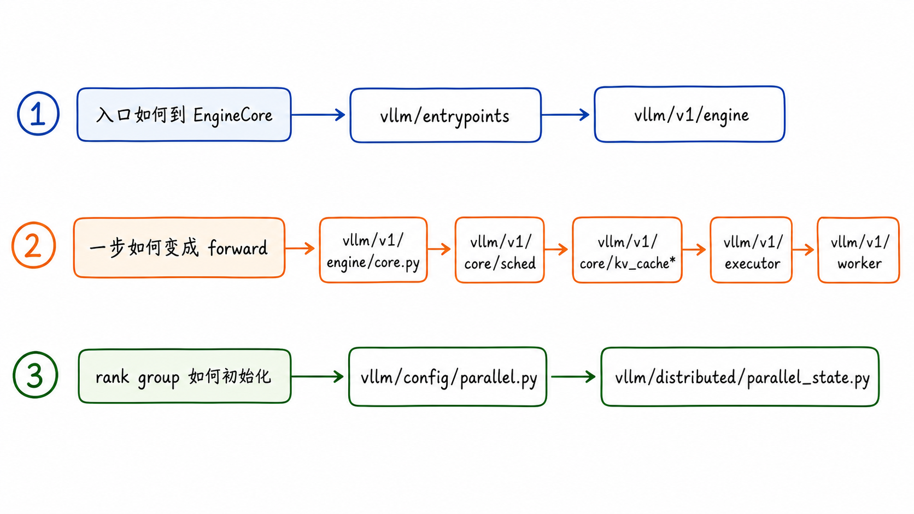

建议按三条线阅读，并给每条线设置一个验收问题。

第一条线是服务入口到 EngineCore。读完这条线，应能回答：一个外部 HTTP 或 Python 请求怎样变成 `EngineCoreRequest`，又怎样被转回用户可见输出。

- `vllm/entrypoints/cli/serve.py`：`vllm serve` 命令入口；
- `vllm/entrypoints/openai/`：OpenAI-compatible API server 相关实现；
- `vllm/v1/engine/async_llm.py`：在线服务中的 `AsyncLLM` 主入口；
- `vllm/v1/engine/input_processor.py`：外部输入到 `EngineCoreRequest`；
- `vllm/v1/engine/output_processor.py`：`EngineCoreOutputs` 到用户输出；

第二条线是 EngineCore 到 worker。读完这条线，应能回答：一个 `SchedulerOutput` 怎样变成一次 GPU forward，以及执行结果怎样回到请求状态和 KV cache 生命周期。

- `vllm/v1/engine/core.py`：EngineCore 初始化、KV cache 初始化、scheduler 创建、step loop；
- `vllm/v1/core/sched/scheduler.py`：请求 waiting/running、token budget、KV block 申请；
- `vllm/v1/core/kv_cache_manager.py`：KV block 分配、释放、prefix cache 相关接口；
- `vllm/v1/executor/abstract.py`：executor 后端选择；
- `vllm/v1/executor/multiproc_executor.py`：multiprocessing worker 管理、rank 和 output rank；
- `vllm/v1/executor/ray_executor.py`、`ray_executor_v2.py`：Ray worker 管理；
- `vllm/v1/worker/gpu_worker.py`：GPU worker 的设备初始化、模型加载、KV cache 初始化、执行模型；

第三条线是分布式配置和通信组。读完这条线，应能回答：TP、PP、DP、EP 的 group 是怎样从 global ranks 中切出来的，以及启动参数怎样改变这些 group。

- `vllm/config/parallel.py`：TP、PP、DP、EP、backend、node rank、world size 等配置；
- `vllm/distributed/parallel_state.py`：world group、TP group、PP group、DP group、EP group 初始化；
- `docs/design/arch_overview.md`：V1 进程架构和组件说明；
- `docs/serving/parallelism_scaling.md`：TP/PP 单节点和多节点部署建议；
- `docs/serving/data_parallel_deployment.md`：DP 内部、外部、混合负载均衡；
- `docs/serving/expert_parallel_deployment.md`：MoE EP、all-to-all backend、EPLB；

读源码时建议先带着问题进入，而不是从文件 1 行读到最后 1 行。例如：

- 想理解请求生命周期：先看 `AsyncLLM.add_request`、`InputProcessor.process_inputs`、`Request`、`EngineCore.add_request`；
- 想理解一个 step 如何形成：先看 `Scheduler.schedule()` 的注释和输出结构；
- 想理解多 GPU worker 如何启动：先看 `ParallelConfig.__post_init__()` 和 `Executor.get_class()`，再看 `MultiprocExecutor._init_executor()`；
- 想理解 rank group：先看 `parallel_state.initialize_model_parallel()` 中 `all_ranks` 的 reshape 和 transpose；
- 想理解 DP 进程拓扑：先看官方 `docs/design/arch_overview.md` 和 `docs/serving/data_parallel_deployment.md`；

## 7. 本章小结

vLLM 的核心不是某一个孤立技巧，而是一套围绕动态请求和 KV Cache 状态建立的推理引擎架构。前端把用户请求规范化为引擎请求；EngineCore 维护请求状态、调度状态和 KV cache 元数据；Scheduler 每一步决定哪些 token 被计算；Executor 把调度结果分发给 worker；Worker 在 GPU 上执行模型并返回输出。

分布式推理的关键是 rank 坐标。TP、PP、DP、EP 不是四个互相独立的口号，而是从 global ranks 中切出不同通信组的方式。TP 解释层内张量如何切，PP 解释模型层如何切，DP 解释副本和请求路由如何扩展，EP 解释 MoE expert 如何切和如何 all-to-all。只要能把一个 worker 放回 global rank、local_rank、TP rank、PP rank、DP rank、EP rank 的坐标系里，就能读懂多数 vLLM 分布式部署图。

后续章节再深入 PagedAttention、Scheduler、KV Cache Manager 或 ModelRunner 时，可以把本章作为地图：每一个细节机制都应该能放回“请求怎样推进、状态在哪里维护、GPU worker 如何执行、rank group 如何通信”这四条主线中。

## 参考资料

1. vLLM 本地源码快照：`code/opensource/vllm`，branch `main`，commit `52a31ccec`；
2. vLLM architecture overview：`code/opensource/vllm/docs/design/arch_overview.md`；
3. vLLM parallelism and scaling：`code/opensource/vllm/docs/serving/parallelism_scaling.md`；
4. vLLM data parallel deployment：`code/opensource/vllm/docs/serving/data_parallel_deployment.md`；
5. vLLM expert parallel deployment：`code/opensource/vllm/docs/serving/expert_parallel_deployment.md`；
6. vLLM V1 engine source：`code/opensource/vllm/vllm/v1/engine/`；
7. vLLM V1 scheduler and KV cache source：`code/opensource/vllm/vllm/v1/core/`；
8. vLLM V1 executor and worker source：`code/opensource/vllm/vllm/v1/executor/`、`code/opensource/vllm/vllm/v1/worker/`；
9. vLLM parallel config and group initialization：`code/opensource/vllm/vllm/config/parallel.py`、`code/opensource/vllm/vllm/distributed/parallel_state.py`；

## Learning Assessment

### 题目

1. 单选题：在 vLLM V1 在线服务路径中，哪一项最准确描述 `EngineCore` 的职责？
   A. 处理 HTTP 协议、鉴权和 OpenAI-compatible API 响应；
   B. 维护请求状态、调度状态和 KV cache 元数据，并协调模型执行；
   C. 只负责把 prompt tokenize 成 token ids；
   D. 只负责在每张 GPU 上保存模型权重；

2. 单选题：一个请求从外部进入 vLLM 后，较合理的主路径顺序是：
   A. Worker -> Executor -> Scheduler -> API Server -> OutputProcessor；
   B. API Server/InputProcessor -> EngineCoreRequest -> EngineCore/Scheduler -> Executor/Worker -> OutputProcessor；
   C. Tokenizer -> Worker -> API Server -> KVCacheManager -> EngineCore；
   D. Scheduler -> API Server -> InputProcessor -> ModelRunner -> EngineCoreClient；

3. 多选题：关于 `InputProcessor` 和 `OutputProcessor`，哪些说法正确？
   A. `InputProcessor` 将 prompt、sampling params、多模态输入等规范化为引擎内部请求；
   B. `OutputProcessor` 将引擎输出转换为 streaming chunk 或最终 `RequestOutput`；
   C. `InputProcessor` 负责在 TP group 内合并 logits；
   D. `OutputProcessor` 是 KV block 分配策略的主要实现位置；

4. 单选题：`EngineCoreClient` 在 V1 架构中的主要作用是什么？
   A. 连接前端进程与后台 `EngineCore`，发送 add/abort 等请求并接收输出；
   B. 在 GPU 上执行 attention kernel；
   C. 负责 expert all-to-all 的通信后端选择；
   D. 直接替代 Scheduler 维护 waiting/running 队列；

5. 多选题：内部 `Request` 对象中，哪些状态与请求生命周期、调度推进或 KV/prefix cache 管理相关？
   A. `status`；
   B. `num_computed_tokens`；
   C. `output_token_ids`；
   D. `block_hashes`；
   E. API Server 的监听端口；

6. 单选题：文章强调 V1 Scheduler 内部“不固定区分 prefill phase 和 decode phase”，最准确的理解是：
   A. vLLM 不再有 prefill/decode 的成本差异；
   B. Scheduler 用 `num_computed_tokens` 等状态统一描述每一步还需要推进多少 token；
   C. decode 请求不会进入 Scheduler；
   D. chunked prefill 与 speculative decoding 只能二选一；

7. 多选题：关于一个 engine step 的形成，哪些说法符合文章描述？
   A. Scheduler 会参考 waiting/running 请求集合；
   B. Scheduler 会受 token budget 和 KV cache 可用性约束；
   C. batch 是用户预先提交的固定数组，进入系统后不会重组；
   D. `SchedulerOutput` 会包含本 step 的 token 分配和 KV block 相关信息；

8. 单选题：请求 C 与请求 A 共享 system prompt，但被路由到不同 DP rank 时，最可能发生什么？
   A. C 一定可以直接复用 A 的本地 KV blocks；
   B. C 通常落到另一份独立 KV Cache 上，不能直接复用 A 所在 DP rank 的本地 prefix cache；
   C. C 会被强制迁回 A 所在 DP rank；
   D. prefix cache 会通过 TP group 自动跨 DP rank 同步；

9. 多选题：`Executor` 在 V1 架构中的职责包括哪些？
   A. 屏蔽 single-process、multiprocessing、Ray 等执行后端差异；
   B. 创建和管理 worker 进程或执行后端实体；
   C. 向 worker 广播 `SchedulerOutput`；
   D. 替代 Scheduler 决定每个请求本 step 计算多少 token；

10. 单选题：`local_rank` 与 `rank_in_group` 的区别，哪项最准确？
   A. `local_rank` 更接近本节点设备选择，`rank_in_group` 是某个通信组内的局部位置；
   B. 二者都表示全局进程编号；
   C. `rank_in_group` 只能用于 DP group；
   D. `local_rank` 可以唯一描述跨节点 worker 的所有通信身份；

11. 多选题：按本文给出的 `DP=2, PP=2, TP=2` rank layout，global ranks 为 0-7 时，哪些划分正确？
    A. `[0, 1]` 可以是一个 TP group；
    B. `[0, 2]` 可以是一个 PP group；
    C. `[1, 5]` 可以是一个 DP group；
    D. `[0, 4]` 可以是一个 TP group；

12. 单选题：如果某个 worker 被描述为 `global rank 5, DP rank 1, PP rank 0, TP rank 1`，下面哪项理解最合理？
    A. 它是第二个 DP 副本中第一个 pipeline stage 的 TP rank 1；
    B. 它一定是第 5 个 API Server；
    C. 它在所有通信组里的 `rank_in_group` 都是 5；
    D. 它负责所有 PP stage 的完整模型层；

13. 单选题：Tensor Parallel 与 Pipeline Parallel 的核心差异是：
    A. TP 主要切层内张量/权重计算，PP 主要切模型层/stage；
    B. TP 主要增加完整模型副本，PP 主要做 HTTP 负载均衡；
    C. TP 主要切请求队列，PP 主要切 tokenizer 流程；
    D. TP 只影响 API Server 数量，PP 只影响端口暴露方式；

14. 单选题：在本文的 PP 示例中，最终输出通常由哪类 rank 返回？
    A. last PP stage 的 TP rank 0；
    B. first PP stage 的任意 TP rank；
    C. 每个 PP stage 同时独立返回完整输出；
    D. API Server 的 local_rank；

15. 多选题：关于 Data Parallel，哪些说法符合文章？
    A. DP 通过模型副本扩展请求处理能力；
    B. 每个 DP rank 通常有独立的 EngineCore、Scheduler、请求队列和 KV Cache；
    C. DP 默认把一次 dense forward 拆到多个 rank 上共同完成；
    D. internal / external / hybrid LB 的差异主要在于请求路由由谁负责；

16. 多选题：关于 DP Coordinator，哪些说法符合本文语境？
    A. `data_parallel_size > 1` 时 V1 进程架构会包含 DP Coordinator；
    B. 它在 internal / hybrid LB 中可参与队列统计发布；
    C. 在 MoE DP+EP 场景中，它可参与 wave coordination 和 dummy forward 同步；
    D. 它负责替代所有 worker 执行模型 forward；

17. 多选题：关于 External LB 与 Hybrid LB，哪些说法正确？
    A. External LB 更强调由上游 router 对多个 endpoint 做全局分流；
    B. Hybrid LB 通常让每个节点的 API Server 只在本节点内部分发给本地 DP ranks；
    C. 两者的核心差异之一是请求路由由 vLLM 内部还是上游系统承担；
    D. 二者都会让所有 DP rank 默认共享同一份 KV Cache；

18. 多选题：关于 Expert Parallel，哪些说法正确？
    A. EP 面向 MoE 专家层，不是 dense 模型通用并行方式；
    B. 开启 EP 后，expert layers 按 EP group 切分，tokens 通过 routing/all-to-all 到达专家；
    C. attention 层仍按 DP/TP 规则处理；
    D. EP 的主要影响只限于本地 GEMM 位置，不会受到 token dispatch 或网络拓扑影响；

19. 单选题：文章建议读分布式部署图时优先回到 rank 坐标，主要原因是：
    A. 命令行参数最终会落到进程、GPU、模型分片和通信组关系上；
    B. rank 坐标可以替代所有源码阅读；
    C. 只要知道 API Server 数量，就能推导 TP/PP/DP/EP group；
    D. local rank 与 global rank 在跨节点场景中总是相等；

20. 单选题：如果想优先理解 vLLM 如何初始化 TP/PP/DP/EP 等 rank group，应从哪条源码路径进入最合适？
    A. `vllm/distributed/parallel_state.py`；
    B. `vllm/entrypoints/openai/`；
    C. `vllm/v1/worker/gpu_worker.py`；
    D. `vllm/v1/engine/output_processor.py`；

### 答案与解析

1. B。`EngineCore` 是 V1 推理内循环的核心，协调 Scheduler、KV cache 元数据和 Executor。A 更接近 API Server，C 是输入处理的一部分，D 更接近 Worker 的设备执行侧职责；

2. B。文章主线是外部请求先经 API Server/InputProcessor 变成 `EngineCoreRequest`，再进入 EngineCore/Scheduler，随后由 Executor/Worker 执行，最后经 OutputProcessor 返回用户可见输出；

3. A、B。`InputProcessor` 负责外部输入到内部请求，`OutputProcessor` 负责引擎输出到用户输出。TP 通信和 KV block 分配分别属于分布式通信/执行与 KV cache 管理范畴；

4. A。`EngineCoreClient` 位于前端对象与后台 `EngineCore` 之间，负责发送 add/abort 等请求并接收引擎输出。它不执行 GPU kernel，也不替代 Scheduler；

5. A、B、C、D。`status`、`num_computed_tokens`、`output_token_ids`、`block_hashes` 都影响请求生命周期、调度推进或 prefix caching。监听端口不是内部 `Request` 的推进状态；

6. B。这不是否认 prefill/decode 的工程差异，而是说 Scheduler 内部用“已经算到哪里、还差多少 token”统一推进请求，从而兼容 chunked prefill、prefix caching、speculative decoding 等场景；

7. A、B、D。vLLM 的 batch 是每个 engine step 动态形成的执行单元，不是用户提交后固定不变的静态数组；

8. B。DP rank 之间通常有独立 KV Cache。即使文本前缀相同，路由到不同 DP rank 后也不能默认复用另一 rank 的本地 KV blocks；

9. A、B、C。Executor 负责执行后端抽象、worker 管理、广播调度结果和收集执行结果；每步 token 分配由 Scheduler 决定；

10. A。`local_rank` 偏物理/本地设备坐标，`rank_in_group` 是逻辑通信组内的位置。同一个 worker 在 TP、PP、DP、EP group 内可能有不同局部编号；

11. A、B、C。按本文示例，`[0,1]` 是同 DP 同 PP 下的 TP group，`[0,2]` 是同 DP 同 TP 下的 PP group，`[1,5]` 是同 PP 同 TP 坐标上的 DP group。`[0,4]` 是 DP group，不是 TP group；

12. A。按照本文的 `DP x PP x TP` 坐标，global rank 5 位于 DP rank 1、PP rank 0、TP rank 1。它不是 API Server，也不负责所有 stage；

13. A。TP 切同一层内的张量/权重计算，PP 按模型层切 stage。二者解决的放置和通信问题不同；

14. A。PP 场景中，最终输出来自最后一个 pipeline stage；在 TP group 内通常由 TP rank 0 作为 output rank 返回 `ModelRunnerOutput`；

15. A、B、D。DP 复制模型副本以扩展吞吐；每个 DP rank 有独立 EngineCore、Scheduler、队列和 KV Cache；internal/external/hybrid 的核心区别是路由位置。C 描述的是把一次 forward 拆分，不能作为 DP 的主要含义；

16. A、B、C。DP Coordinator 不负责 GPU forward；它在 DP 负载信息、队列统计和 MoE 同步协调中发挥作用；

17. A、B、C。External 与 Hybrid 的核心区别是路由边界：前者更依赖上游全局分流，后者通常把节点内 DP 分发留给本节点 API Server。二者都不意味着 DP rank 默认共享 KV Cache；

18. A、B、C。EP 主要针对 MoE expert layers；attention 侧仍按 DP/TP 规则处理。D 错在忽略了 EP 常见瓶颈可能转向 token dispatch、all-to-all、expert load balance 和网络拓扑；

19. A。文章强调不要只背命令，因为参数最终会体现为进程拓扑、global/local rank、TP/PP/DP/EP group、模型分片和请求路由关系；

20. A。`vllm/distributed/parallel_state.py` 是理解 world group、TP group、PP group、DP group、EP group 初始化的核心入口；其他选项分别更偏 API 服务、worker 执行或输出处理；
