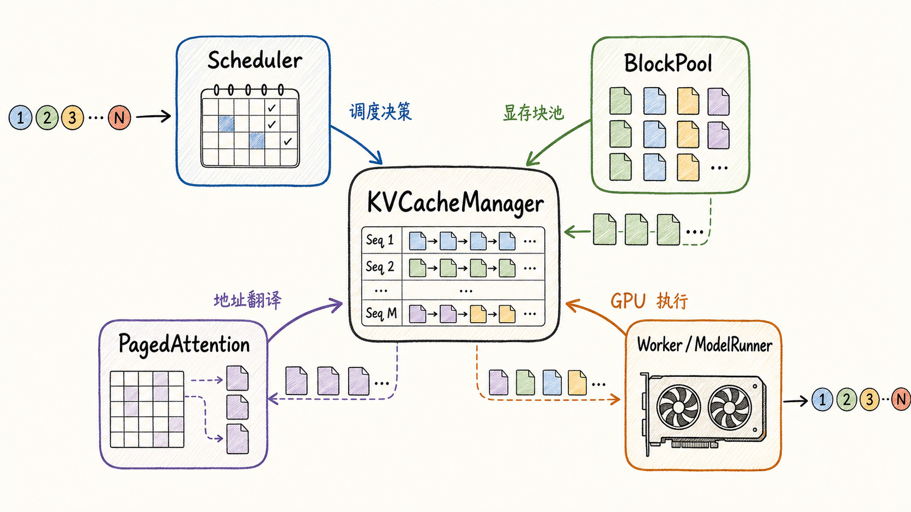
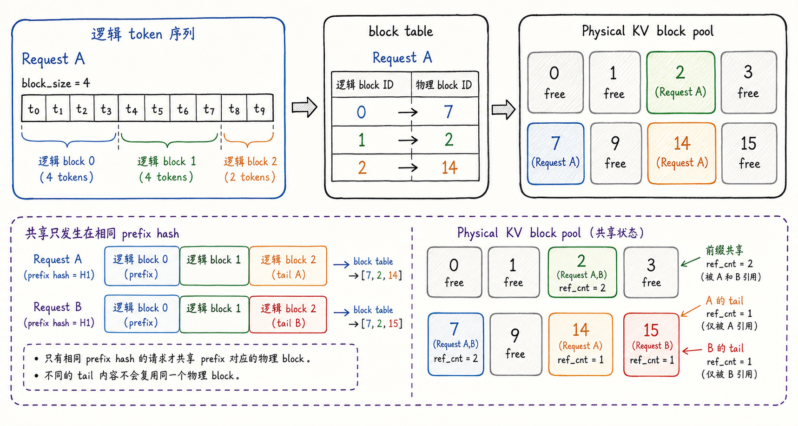
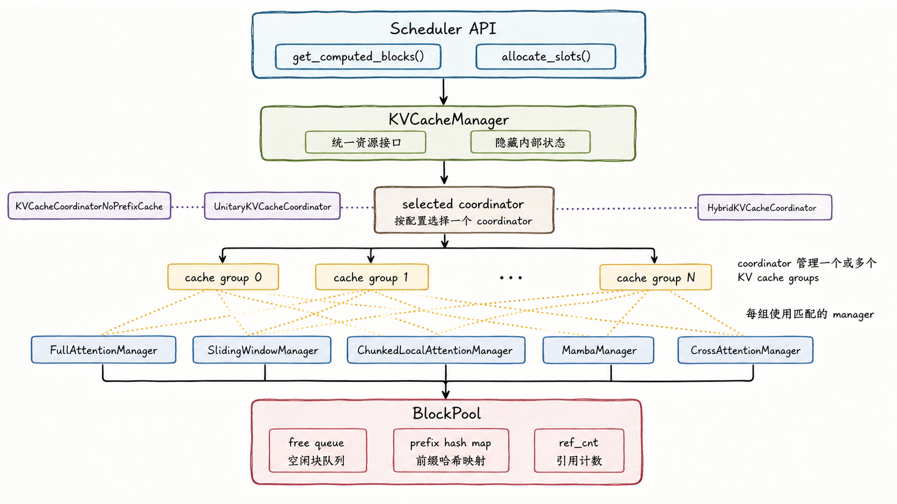
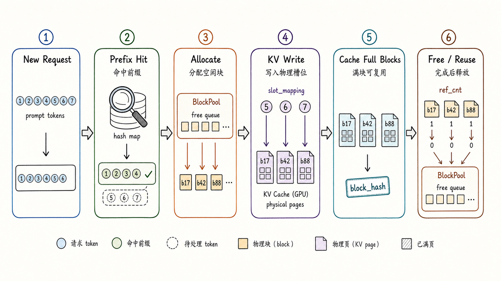
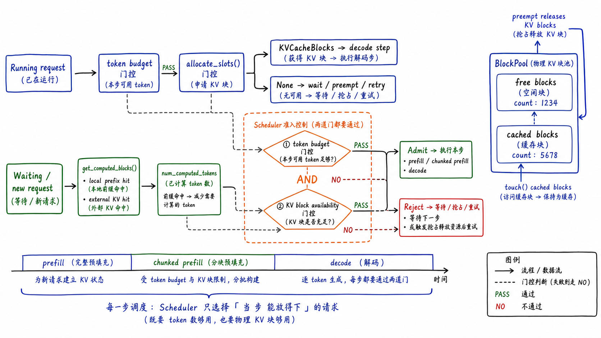
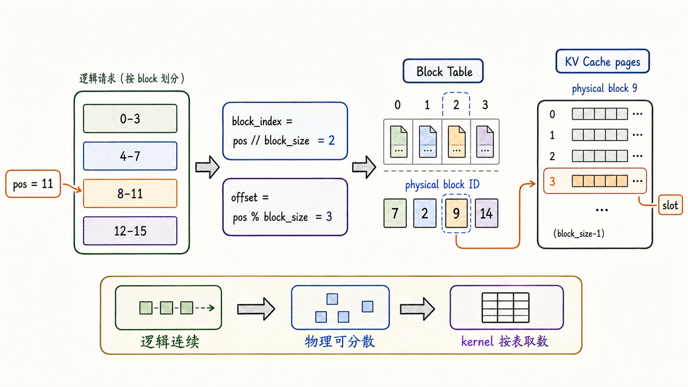
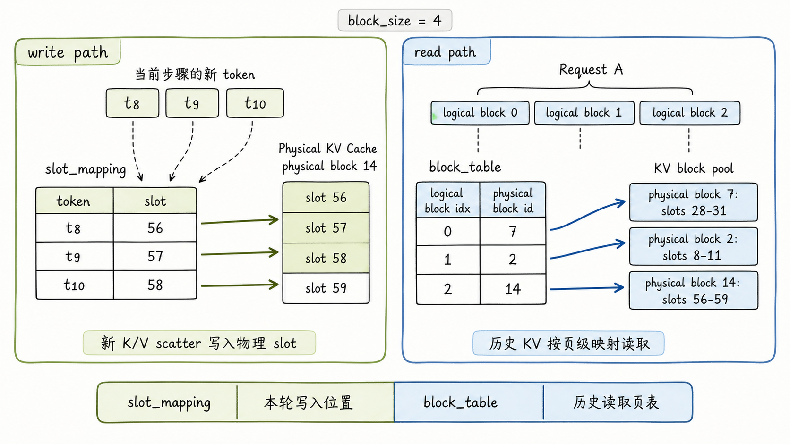
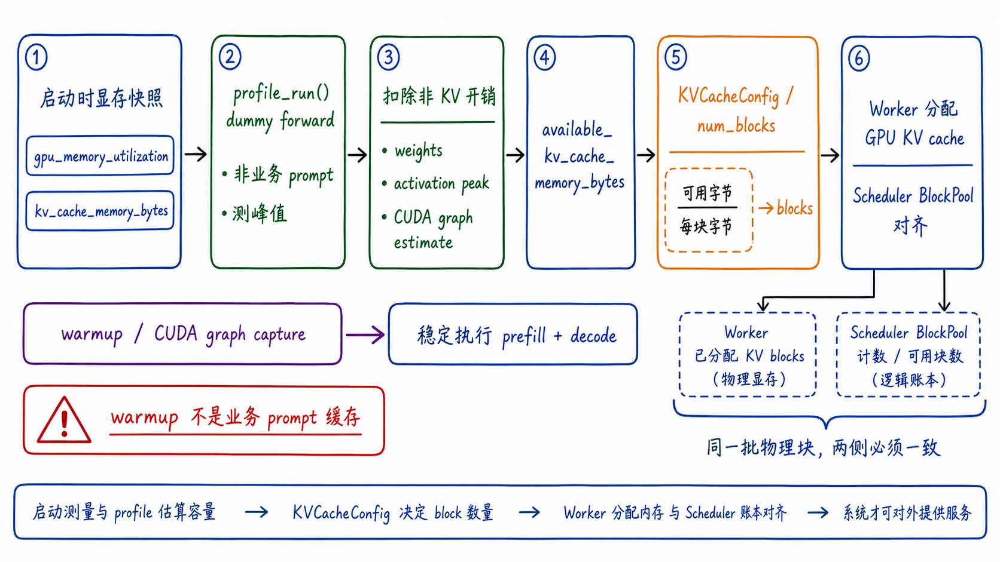
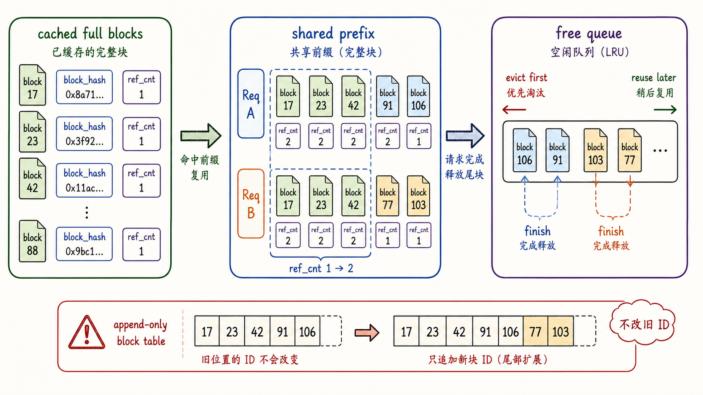

---
tags:
  - vllm
  - llm-inference
  - inference-engine
  - kv-cache
  - paged-attention
updated: 2026-05-28
description: 本文基于本地 vLLM V1 源码快照，系统讲解 KVCacheManager 的分层架构、运行逻辑、Scheduler 交互、PagedAttention 地址翻译以及预热与容量估算机制。
---

# 04 深入 KVCacheManager

前一章已经建立了 vLLM V1 的整体地图：API Server 面向用户，EngineCore 维护推理系统状态，Scheduler 决定每一步让哪些请求前进，Executor 和 Worker 负责把调度结果送到 GPU 上执行。理解这张地图之后，本章开始进入第一个真正需要深挖的核心组件：`KVCacheManager`。

选择它作为第一个组件章并不是因为类名排在前面，而是因为它是很多后续机制的共同地基。Scheduler 要依赖它判断请求能不能进入本轮 batch；PagedAttention 要依赖它产出的 block table 才能在物理不连续的 KV Cache 上做注意力；prefix caching、KV transfer、sliding window、spec decode、preemption 等机制也都绕不开 KV block 的分配、复用、释放和可见性管理。换句话说，`KVCacheManager` 是 vLLM 把“动态 token 序列”变成“可调度运行时状态”的中枢。

本文以 `code/opensource/vllm` 的本地源码快照为依据，源码分支为 `main`，短提交哈希为 `52a31ccec`。文章会立足源码和本地设计文档，但不会逐行展开；重点是把源码背后的架构意图和运行时机制讲清楚。



先抓住一个判断：`KVCacheManager` 不只是“存 KV Cache 的地方”。它面对 Scheduler 时像资源仲裁器，面对 Worker 时像 block ID 生产者，面对 PagedAttention 时像地址翻译的上游，面对 BlockPool 时又像显存页分配策略的组织者。它的价值不在于某个单独方法，而在于把这些角色压进同一个一致的状态系统里。

## 1. 从全局架构走进状态中枢

LLM 推理的难点不是只把一个 prompt 跑完，而是在服务化场景中同时处理大量长度不一、阶段不同、复用机会不同的请求。每个请求都在不断增长：Prefill 阶段一次写入大量 prompt KV，Decode 阶段每一步追加少量新 token 的 KV；有些请求命中 prefix cache，有些请求需要重新计算；有些请求因为显存 block 不足要暂缓，甚至要触发 preemption。

如果把 KV Cache 当成一个连续大数组，系统很快会被两个事实拖住。第一个事实是长度不可预测：用户请求可以很短，也可以逼近 `max_model_len`。第二个事实是生命周期错位：请求 A 的前缀可能已经缓存，请求 B 还在 prefill，请求 C 只需要 decode 一个 token，请求 D 已经结束并释放尾部 block。vLLM 的做法是把 KV Cache 变成固定大小的 block 池，再让 `KVCacheManager` 管理这些 block 的所有权、引用计数、hash、可复用性和 block table 结果。

这也是它适合放在第一个核心组件章的原因。Scheduler、PagedAttention、Worker、KV transfer、prefix caching 都会接触 KV Cache，但它们看见的是不同侧面。`KVCacheManager` 是第一个把这些侧面统一起来的组件：Scheduler 看的是“还能不能分配”；Worker 看的是“本轮新增了哪些 block”；attention backend 看的是“每个 token 应该写到哪里、每个请求的历史 KV 应该从哪里读”。这些问题表面不同，本质上都落在同一套 block 状态上。

一个更准确的心智模型是：`KVCacheManager` 不是 KV Cache 的“容器”，而是 KV Cache 的“运行时账本”。账本里记录的不只是哪些 block 空闲，还包括哪些 block 已经成为可复用前缀，哪些 block 被多个请求共享，哪些 block 虽然已空闲但仍保留在 prefix cache hash map 中等待复用，哪些 block 对 sliding window 来说已经不再参与注意力。

这层账本能力使 vLLM 可以把推理服务中的三个目标绑在一起：更高的吞吐、更稳的并发、更低的显存浪费。如果没有它，PagedAttention 只是一种 kernel 访问技巧；有了它，PagedAttention 才能成为完整的显存管理方案。

## 2. Block 化的 KV Cache 模型

KV Cache 的原始含义很直接：每一层 attention 都会为已经处理过的 token 保存 key/value，后续 token 只需要读取历史 KV，而不必重新计算整个上下文。问题在于，真实服务里每个请求的上下文长度都不同。如果每个请求都预留一段连续显存，系统要么浪费大量尾部空间，要么频繁搬迁数据。

PagedAttention 的关键转向是：逻辑序列可以连续，但物理存储不必连续。vLLM 把 token 序列切成固定大小的 KV block，每个 block 能容纳 `block_size` 个 token 的 KV；请求内部只需要维护一张 block table，把第 0 个逻辑 block、第 1 个逻辑 block、第 2 个逻辑 block 映射到某些物理 block ID。物理 block ID 可以是 7、2、9、14 这样的不连续编号，只要 block table 记录了逻辑顺序，attention kernel 就能按表访问。



这里的重点不是“切块”本身，而是切块后系统获得了一个新的调度单位。请求长度不再直接对应一段连续显存，而是对应若干个可独立分配、释放、复用的 block。这样，短请求不会被迫占用长上下文空间，长请求也可以随着生成过程逐步扩展。最后一个未填满的 block 仍可能浪费一点空间，但浪费被限制在 block 粒度内，而不是整个最大上下文长度。

这里有三个对象容易混淆，需要先区分清楚。

- `KVCacheBlock` 是 Python 侧的 block 元数据，包含 `block_id`、`ref_cnt`、`block_hash` 以及 free queue 链表指针；
- KV Cache tensor 是 GPU 上真正保存 key/value 的物理存储，attention backend 会按 block ID 访问其中的页；
- block table 是请求到物理 block ID 的映射表，它让逻辑 token 顺序和物理显存位置解耦；

因此，`KVCacheManager` 管理的不是一个普通数组，而是“元数据账本 + 物理页池 + 请求映射”之间的一致性。它不直接替代 attention kernel，也不直接执行模型 forward；它让这些 kernel 能在动态请求场景中可靠地找到 KV。

后面可以一直带着一个小例子阅读：假设 `block_size=4`，Request A 的 prompt 有 10 个 token，它会被切成 3 个逻辑 blocks，其中前两个完整 block 各有 4 个 token，最后一个 block 只有 2 个 token。如果前 8 个 token 命中 prefix cache，那么 Scheduler 看到的不是“整个请求都不用管了”，而是“已有两个完整 block 可复用，尾部仍需要继续计算并写入新的 slots”。这个例子会贯穿生命周期、准入判断和地址翻译三条线。

从源码角度看，`vllm/v1/core/kv_cache_utils.py` 中的 `KVCacheBlock` 只保存元数据；`vllm/v1/core/block_pool.py` 中的 `BlockPool` 才负责把这些元数据组织成池；Worker 侧的 `BlockTables` 则把 Scheduler 传来的 block IDs 写成 GPU 可用的 block table。当前 `main` 同时保留 legacy worker 路径和仍处于 experimental 状态的 V2 model runner 路径，源码通过 `GPUWorker.use_v2_model_runner` 在 `vllm/v1/worker/gpu/model_runner.py` 与 `vllm/v1/worker/gpu_model_runner.py` 之间选择；本文主要沿 `vllm/v1/worker/gpu/*` 的 V2 路径说明，legacy `vllm/v1/worker/block_table.py` 与 `vllm/v1/worker/gpu_model_runner.py` 在概念边界上等价。这个分工非常重要：Python 侧做资源决策，GPU 侧做高吞吐访问。

## 3. KVCacheManager 的分层架构

`KVCacheManager` 这个名字容易给人一种误解：似乎所有 KV Cache 策略都堆在一个类里。vLLM V1 的真实设计更像一套分层系统。



最上层是 Scheduler 看到的接口。Scheduler 并不需要知道 full attention、sliding window、Mamba 或 hybrid model 的每个细节，它主要调用两个关键能力：通过 `get_computed_blocks()` 查询 prefix cache 命中，通过 `allocate_slots()` 为即将计算的新 token 申请 KV slots。如果申请成功，Scheduler 得到 `KVCacheBlocks`；如果失败，它知道当前请求不能在这一轮继续推进。

第二层是 `KVCacheManager` 门面。它把 Scheduler 的请求翻译成更底层的协调动作，同时隐藏内部数据结构。`KVCacheBlocks` 的注释明确说明它是 Scheduler 和 `KVCacheManager` 之间的分配结果接口，用来避免 Scheduler 依赖管理器内部结构。这个接口设计很关键：Scheduler 需要 block IDs，但不应该知道 block hash map、free queue、ref count 和不同 attention 类型的细节。

第三层是 `KVCacheCoordinator`。它负责协调多个 KV cache group。普通模型可能只有一个 group，此时可以走 `UnitaryKVCacheCoordinator`；关闭 prefix caching 或不支持 prefix caching 时，可以走 `KVCacheCoordinatorNoPrefixCache`；混合 attention 类型的模型则需要 `HybridKVCacheCoordinator`。本地 `hybrid_kv_cache_manager.md` 适合理解设计动机，但部分边界可能滞后，具体行为应以当前源码为准；例如当前 `HybridKVCacheCoordinator` 会用各 attention 类型 block size 的 LCM 对齐 cache hit，并通过 fixed-point 风格的迭代收敛各 group 的命中长度。这层的存在说明一个事实：现代模型不一定所有层都采用同一种 KV Cache 需求。Full attention 要保留完整上下文；sliding window 只关心窗口内 token；Mamba 或 attention-free 结构又有自己的状态模式。

第四层是 `SingleTypeKVCacheManager` 及其子类。每个子类处理一种 KV cache spec 的特殊逻辑。`FullAttentionManager` 可以从左到右查找最长连续 prefix hit；`SlidingWindowManager` 会把窗口外的 token 视为可跳过，并用 null block 填充不再参与 attention 的位置；`MambaManager` 和 `CrossAttentionManager` 则服务于更特殊的模型结构。注意，这些差异不会暴露给 Scheduler，而是被 coordinator 收敛成统一的分配结果。

最底层是 `BlockPool`。它真正持有所有 `KVCacheBlock` 元数据，并维护三类关键状态：空闲 block 队列、prefix cache hash map、引用计数。初始化时，所有 `KVCacheBlock` 都会预创建，避免运行期频繁创建 Python 对象；free queue 直接利用 `KVCacheBlock` 上的双向链表指针，支持把中间元素移走、把释放的 block 追加回队列；`cached_block_hash_to_block` 则让 prefix cache 可以通过 block hash 找到可复用的完整 block。

这个分层设计的好处是清晰的：Scheduler 只做调度，`KVCacheManager` 只暴露资源语义，coordinator 处理多 group 协调，single-type manager 处理 attention 类型差异，BlockPool 处理物理 block 状态。每一层都在收窄问题，而不是把所有特殊情况推给上层。

## 4. 一次请求的 KV 生命周期

理解 `KVCacheManager` 最好的方式，是跟随一个请求走完整生命周期。这个生命周期不是简单的“申请、使用、释放”，因为 prefix cache、external KV、spec decode、sliding window 都可能改变中间状态。先看主线，再理解分支。



新请求进入 Scheduler 后，如果 `request.num_computed_tokens == 0`，Scheduler 会先询问 `KVCacheManager.get_computed_blocks(request)`。这里的目标是找出 prompt 前缀中已经被计算并缓存的完整 block。源码里有一个容易被忽略的细节：如果整段 prompt 都命中缓存，vLLM 仍然至少需要重新获得最后位置的 logits，以便继续采样。因此 `get_computed_blocks()` 会把最大命中长度限制在 `prompt_length - 1`，而不是盲目认为全命中就可以完全跳过；又因为后续 `allocate_slots()` 要求 `num_computed_tokens` 按 block 对齐，实际可能重算最后一个 block。

沿用前面的 Request A 例子，前 8 个 token 命中 prefix cache 时，`get_computed_blocks()` 返回的是两个完整的 cached blocks，而不是一个任意长度的 token 切片。接下来尾部 2 个 prompt token 和后续 decode token 仍要进入 `allocate_slots()` 的准入与分配流程。

随后 Scheduler 会调用 `allocate_slots()`。这个方法的输入不仅有 `num_new_tokens`，还可能有 `num_new_computed_tokens`、`new_computed_blocks`、`num_lookahead_tokens`、`num_external_computed_tokens`、`num_encoder_tokens` 和 `full_sequence_must_fit`。从这些参数可以看出，vLLM 的 KV 分配不是只服务普通 decode：它同时要覆盖 prefix cache 命中、KV connector 外部加载、spec decode lookahead、encoder-decoder cross-attention，以及 chunked prefill 下的准入控制。

`allocate_slots()` 的核心逻辑可以概括为一条更精确的顺序。第一步，计算本轮已经可视为 computed 的 token 数量，包括本地 prefix cache 命中和外部 KV 命中。第二步，如果 `full_sequence_must_fit` 启用，先做完整序列层面的准入检查，避免只看当前 chunk 而过度接纳请求。第三步，在正式分配新 block 之前，调用 `remove_skipped_blocks()` 清理不再参与 attention 的旧 block，例如 sliding window 窗口外的 block。这个顺序很讲究：先释放窗口外 block，可以减少后续因为 free blocks 不足而发生的失败。第四步，询问 coordinator 需要新增多少 block，并和 `BlockPool.get_num_free_blocks()` 比较；如果不够，直接返回 `None`。最后才是真正把 prefix hit block touch 住、分配新 block、必要时把完整 block 写入 prefix cache。

这里的“touch”值得停一下。prefix cache 命中的 block 可能已经不被任何运行请求引用，因此它位于 free queue 中，理论上是可驱逐候选。新请求命中它之后，`BlockPool.touch()` 会增加引用计数，并把它从 free queue 中移除，避免它在新请求执行期间被驱逐。这说明 prefix cache 不是静态字典，而是和 free queue、引用计数共同维护的动态状态。

当模型 forward 真正执行后，新 token 的 K/V 会写入已经分配好的物理 slots。等一个 block 填满，并且其中 token 已经是可提交的最终 token，`cache_blocks()` 会给这个 block 写入 `block_hash`，把它放入 prefix cache hash map。spec decode 场景下，draft token 可能被拒绝，因此源码会把可缓存 token 数量限制在 `request.num_tokens` 以内，避免把未验证 token 对应的 KV 过早暴露为可复用前缀。

请求完成时，`KVCacheManager.free(request)` 会释放它持有的 blocks。释放并不等同于立刻清空全部缓存状态：如果某些完整 block 仍有 `block_hash`，它们可以作为 prefix cache 候选继续留在 hash map 中；如果之后需要重新分配这些 block，`BlockPool.get_new_blocks()` 会在取出 block 时根据需要驱逐旧 hash，防止其他请求继续命中过期位置。

这个生命周期说明一个核心点：KV Cache 的管理不是“请求结束就删除”。vLLM 真正管理的是 block 在不同状态之间的流转：已分配、被共享、可缓存、可驱逐、可复用、已释放。只理解申请和释放，会错过 vLLM 高吞吐背后的大部分工程设计。

## 5. Scheduler、Worker 与 PagedAttention 的地址协作

### 5.1 Scheduler 怎样依赖 KV 状态

Scheduler 表面上是在分配 token budget：本轮最多跑多少 token，哪些请求优先，长 prefill 是否被截断，decode 请求是否继续推进。但在 vLLM 中，token budget 只是准入条件之一。另一个同等重要的条件是 KV block 是否足够。



运行中的请求会优先被调度。Scheduler 根据请求当前的 `num_computed_tokens`、`num_tokens_with_spec` 和剩余 token budget 计算 `num_new_tokens`，随后调用 `kv_cache_manager.allocate_slots()`。如果返回 `KVCacheBlocks`，请求可以进入本轮执行；如果返回 `None`，说明 token budget 也许还有，但 KV block 不够。此时 Scheduler 会根据策略 preempt 某个低优先级或队尾请求，把它的 KV blocks 释放掉，再尝试继续调度。

等待队列中的新请求还会多一步 prefix cache 查询。Scheduler 先调用 `get_computed_blocks()` 计算本地 prefix hit，再结合 KV connector 可能提供的外部命中，得到 `num_computed_tokens`。这之后才会调用 `allocate_slots()`。如果命中足够多，请求需要新计算的 token 变少；如果命中的是完整 blocks，这些 blocks 还会通过 `touch()` 变成当前请求持有的状态。也就是说，prefix caching 不只是少算 token，它还会改变本轮 block 分配压力。

Scheduler 输出给 Worker 的结果里包含 block 信息。新请求通过 `NewRequestData.block_ids` 携带完整 block IDs；运行中请求通过 `CachedRequestData.new_block_ids` 携带本轮新增 block IDs。Worker 侧的 block table 会根据这些 ID 追加或覆盖对应行。这里有一个重要的不变量：正常追加路径下，block table 是 append-only 的。vLLM 不会因为后续发现两个 block 内容相同，就回头把已经写入的 block ID 改成另一个 ID。

这个 append-only 约束看似保守，实则服务于运行时稳定性。Worker、attention metadata、CUDA graph、异步执行路径都可能假定已下发的 block table 行不会随意被重写。为了去重而改旧 ID，可能引入比节省一个 block 更大的同步成本和正确性风险。因此 vLLM V1 的 prefix caching 文档也指出，重复 block 可以暂时存在，等请求释放后再自然回收。

从这一节开始，`KVCacheManager` 的角色就更清楚了：它不是 Scheduler 的附属工具，而是 Scheduler 决策空间的一部分。Scheduler 决定“谁该运行”；`KVCacheManager` 告诉它“显存状态是否允许这个决定成立”。但调度只解决“能不能跑”，下一步还要看 Worker 和 attention backend 如何消费这些 block IDs，把调度结果变成 GPU 上真实可执行的读写地址。

### 5.2 PagedAttention 背后的地址翻译层

如果只说“`KVCacheManager` 给 PagedAttention 提供 block table”，这句话虽然对，但太浅。更准确的说法是：`KVCacheManager` 把服务层的动态请求状态，翻译成 attention kernel 可以执行的地址结构。PagedAttention 的性能来自 kernel，也来自这层地址翻译能够长期保持正确、低成本、可增量更新。

先看单 KV cache group 基本路径下，读取历史上下文时的地址翻译。对一个逻辑位置 `pos`，attention 需要知道它属于请求的第几个逻辑 block，以及在 block 内的 offset。公式是：

```text
block_index = pos // block_size
offset = pos % block_size
physical_block_id = block_table[request, block_index]
slot = physical_block_id * block_size + offset
```

仍以 Request A 为例，`block_size=4` 且前 8 个 token 命中 prefix cache 时，`pos=8` 会落到 `block_index=2`、`offset=0`。如果本轮为第 2 个逻辑 block 分配到物理 block 14，那么这个位置的写入或读取地址就是 `14 * 4 + 0`。前两个逻辑 blocks 可以复用 cached blocks，尾部 partial block 则需要继续走分配与写入路径；这正是 block table 把“逻辑连续”翻译成“物理可分散”的地方。到这里，Request A 这个小例子已经从 prompt token、prefix hit、block allocation 走到了 physical slot，形成了完整闭环。



这个公式揭示了 PagedAttention 的真正边界：attention kernel 不需要关心某个请求为什么拿到 block 9，也不需要知道 block 9 是新分配的、prefix cache 命中的、外部 KV 传输来的，还是 sliding window 清理后的剩余块。kernel 只需要相信 block table 是对的。只要 block table 把逻辑顺序映射到正确的物理 block，逻辑上连续的上下文就可以分散存储在物理显存里。

这也是 `KVCacheManager` 和 PagedAttention 之间最值得讲清楚的地方：PagedAttention 不是单靠“分页访问”四个字取胜，而是依赖上游维护一个可增量演化的页表。OS 的虚拟内存分页也不是只有页大小和页表项，它还需要分配器、引用关系、换入换出策略、权限和生命周期。vLLM 的 KV Cache 管理也是类似的：block table 只是 attention 看到的结果，背后的分配、共享、驱逐和复用由 `KVCacheManager` 维持。

在 Worker 侧，还有另一张同样重要的表：`slot_mapping`。block table 主要服务读取历史 KV，而 `slot_mapping` 主要服务写入新 K/V。沿 V2 路径看，`vllm/v1/worker/gpu/block_table.py` 中的 `_compute_slot_mappings_kernel` 会根据请求的 positions、block table 和 block size 计算每个新 token 的物理 slot；legacy 路径中同类职责位于 `vllm/v1/worker/block_table.py`。attention backend 中的 `do_kv_cache_update()` 再通过 `reshape_and_cache_flash()` 或对应 backend 的写入路径，把本轮新产生的 key/value scatter 到 KV Cache。



这两张表的分工非常专业，也非常容易被初学者忽略。`slot_mapping` 解决“本轮新 token 写到哪”；`block_table` 解决“attention 读历史上下文时按什么页顺序读”。它们服务同一批请求，但方向不同、使用阶段不同、传给 kernel 的位置也不同。把这两者混成一张抽象“映射表”，就会看不懂 Worker 为什么既要维护 block table，又要计算 slot mapping。

不同 attention backend 对 block table 的消费方式也不完全相同。FlashAttention 路径会把 `block_table` 直接传入 `flash_attn_varlen_func`；FlashInfer 路径可能会把 block table 转换成 `paged_kv_indptr`、`paged_kv_indices` 和 `paged_kv_last_page_len` 等结构；Triton 路径则在 kernel 中根据 block table 查找 KV 页面。hybrid、多 KV group、DCP/PCP、`blocks_per_kv_block` 等路径会让实际元数据更复杂，但共同点是：它们都要求上游把请求级状态提前压缩成可并行访问的页级元数据。

这一点也是 vLLM 的架构深度所在。KV Cache 管理并不是 attention kernel 之外的杂务，而是 kernel 能够高效工作的前提。`KVCacheManager` 把动态、异步、共享、可复用的请求状态整理成 block IDs；Worker 把 block IDs 变成 block table 和 slot mapping；attention backend 再把这些表变成 GPU 上的访问模式。三者连起来，才是完整的 PagedAttention。

## 6. 预热、容量与工程边界

前面讲的是运行期 block 如何流转：命中、touch、分配、写入、释放、复用。现在要反过来看一个更早发生的问题：运行期能流转多少 block，其实在启动期就已经被容量估算和 warmup 路径约束住了。

KV Cache 的容量不是拍脑袋设出来的。vLLM 启动时必须回答一个问题：在当前模型权重、activation 峰值、非 PyTorch 显存、CUDA graph 内存以及用户配置的 `gpu_memory_utilization` 约束下，究竟还能留多少显存给 KV Cache？



Worker 的 `determine_available_memory()` 会通过 `profile_run()` 做一次 dummy forward，测量模型执行的峰值内存增长。随后它把非 KV Cache 的内存消耗从请求的显存预算中扣除，得到 `available_kv_cache_memory_bytes`。如果启用了 CUDA graph 内存估计，还会把相关估计纳入计算。这个结果不是最终 block 数，而是给 KV Cache 使用的字节预算。

接着，`kv_cache_utils.py` 会根据每层 KV cache spec 的 `page_size_bytes`、layer group 结构、可用字节数和配置覆盖项，生成 `KVCacheConfig`。这里的 `num_blocks` 是后续 Scheduler 和 BlockPool 都要共享的关键数字。文档和日志里常见的 `GPU KV cache size` 与 `Maximum concurrency` 也来自这类容量计算：它们不是简单地显示显存大小，而是在解释当前 KV block 池最多能承载多少 token 上下文，以及在 `max_model_len` 假设下大约支持多少并发。

之后 Worker 调用 `initialize_from_config(kv_cache_config)` 分配真正的 GPU KV Cache。这里会把 `cache_config.num_gpu_blocks` 更新为最终 block 数，并初始化 KV transfer、KV Cache tensor、block table、必要的 zeroing metadata 等。注意，Scheduler 侧的 `KVCacheManager` 也使用同一份 scheduler KV cache config 来构造自己的 `BlockPool`，这样调度侧的 block 账本和 Worker 侧的物理 KV Cache 容量才能对齐。

最后才是 warmup 和 CUDA graph capture。`compile_or_warm_up_model()` 会对必要 batch size 做 dummy run，执行 kernel warmup，必要时 capture CUDA graph，并为采样等路径预热缓冲区。这里要特别避免一个误解：预热不是提前缓存真实用户请求，也不是往 prefix cache 里塞业务 prompt。它的作用是确定运行期形状、触发编译、预热 kernel、稳定显存池和 CUDA graph 路径，减少正式服务时的突发延迟。

`KVCacheManager` 本身不负责启动期显存 profile，但它依赖 profile 结果。容量估算决定 `num_blocks`，`num_blocks` 决定 `BlockPool` 大小，`BlockPool` 大小决定 Scheduler 每一步能否给请求分配 slots。也就是说，启动期的 profiling 和 warmup 最终会反馈到运行期的调度准入能力。

这一节还可以顺带看几个工程边界。

- 如果 `num_gpu_blocks_override` 被设置，源码会允许覆盖 profile 得到的 block 数，但这会改变实际可用 KV 容量；
- 如果启用 `kv_cache_memory_bytes`，vLLM 会跳过自动内存 profile 的容量决定，但仍需要 profile run 来编译或准备模型路径；
- 如果模型包含 sliding window 或 chunked local attention，单请求最大持有 block 数不一定等于 `max_model_len / block_size`，启动期容量估算和运行期 admission cap 必须保持一致；
- 如果 prefix cache 被 reset，`BlockPool.reset_prefix_cache()` 只有在除 null block 外没有使用中 block 时才能成功，否则会拒绝重置；

这些边界说明：KV Cache 容量不是纯数学公式，而是启动期 profile、模型结构、attention 类型、运行期 block 回收策略共同作用的结果。

## 7. 工程判断与误解收束

到这里，`KVCacheManager` 的机制已经不只是“分配 block”。更实用的读法，是把它看成一组工程判断：容量约束决定能否接纳，共享复用决定哪些状态值得保留，运行时稳定性决定哪些优化不该立即做。启动期给出的 `num_blocks`、`GPU KV cache size` 和 `Maximum concurrency` 最终都会变成运行期的取舍信号：请求能否接纳、是否要 preempt、窗口外 block 是否应先释放，都绕不开这组容量边界。

长 prompt 的 chunked prefill 是第一个判断场景。现象是 Scheduler 可能不会一次处理完整 prompt，而是受 `max_num_batched_tokens` 和 long prefill threshold 限制，只推进一部分 token。`KVCacheManager` 的参与点不是简单判断“这一小段是否有 block”，而是在某些配置下通过 `full_sequence_must_fit` 做完整序列准入检查，防止请求被过度接纳。判断时要同时看当前 chunk 的 slots 和完整序列的 admission cap；错误心智模型是把 chunked prefill 理解成完全局部的切片调度，忽略后续 chunk 仍然要消耗同一个 KV block 池。

短请求和长请求混跑是第二个判断场景。现象是短请求 decode 每步只需要少量新 slots，但可能与长请求共享某些 prefix blocks；长请求会持续扩展 block table，也可能因为显存紧张导致其他请求被 preempt。`KVCacheManager` 的参与点是用 free queue 和 ref count 让这两类请求在同一个 block pool 里共存。判断时要把 token budget 和 free block 数放在一起看；错误心智模型是以为公平调度只看 token budget，而忽略 KV block 才是另一个准入维度。

prefix cache 命中是第三个判断场景。现象是新请求复用了已有前缀，计算量下降；`KVCacheManager` 的参与点是把命中的 block touch 住、增加引用计数，并在必要时把它从 free queue 中移出。如果新请求继续生成并填满新 block，新 block 又会被 hash 并进入 prefix cache。错误心智模型是把命中理解成“少算几个 token”，却没有看到它也改变了多个状态结构。



duplicated blocks 是第四个判断场景。现象是 vLLM V1 的 prefix caching 设计并不会在发现内容重复时立刻改写请求已持有的 block table。`KVCacheManager` 的参与点是允许重复 cached block 暂时存在，并等待请求释放后自然回收。错误心智模型是认为所有“节省显存”的动作都值得立即做；在推理系统里，append-only block table 带来的稳定性和低同步成本经常更重要。

sliding window 是第五个判断场景。现象是 Full attention 的历史 KV 全都可能被未来 token 读取，而 sliding window 只需要最近窗口内的 token。`KVCacheManager` 的参与点是让 `SlidingWindowManager.get_num_skipped_tokens()` 根据当前 computed tokens 计算窗口外 token 数，并让 `remove_skipped_blocks()` 用 null block 替换已经不再参与 attention 的旧位置。错误心智模型是认为 KV Cache 会单调增长到请求结束；对这类模型来说，它可能随着窗口推进释放旧 block。

这些场景可以帮助纠正常见误解。

- 误解一：`KVCacheManager` 只是 Python 侧的显存分配器。更准确地说，它是调度、缓存、复用、驱逐和地址翻译的状态账本；
- 误解二：PagedAttention 的核心都在 kernel。kernel 很重要，但 block table、slot mapping 和 block 生命周期管理同样是 PagedAttention 能工作的前提；
- 误解三：prefix cache 命中只影响计算量。它还影响 ref count、free queue、eviction candidate 和后续 block 分配；
- 误解四：释放请求就是清空缓存。请求释放后，完整 cached blocks 仍可能作为 prefix cache 候选存在，直到被驱逐或 reset；
- 误解五：预热是在准备业务缓存。预热主要用于 profile、编译、kernel warmup、CUDA graph capture 和显存路径稳定，不是缓存真实请求；

### 7.1 源码阅读地图

如果要回到源码验证本章机制，可以按三条路径阅读。第一条是调度侧路径：`vllm/v1/core/sched/scheduler.py`、`vllm/v1/core/kv_cache_manager.py`、`vllm/v1/core/kv_cache_coordinator.py` 和 `vllm/v1/core/single_type_kv_cache_manager.py`，重点看 `get_computed_blocks()`、`allocate_slots()`、`remove_skipped_blocks()`、`cache_blocks()` 与 `free()` 如何衔接。第二条是 block 状态路径：`vllm/v1/core/block_pool.py` 和 `vllm/v1/core/kv_cache_utils.py`，重点看 `KVCacheBlock`、free queue、`touch()`、prefix hash map 与 `reset_prefix_cache()`。第三条是 Worker/attention 路径：V2 路径主要看 `vllm/v1/worker/gpu/block_table.py` 和 `vllm/v1/worker/gpu/model_runner.py`，legacy 路径可对照 `vllm/v1/worker/block_table.py` 和 `vllm/v1/worker/gpu_model_runner.py`；随后再看 `vllm/v1/attention/backend.py` 和 `vllm/v1/attention/backends/*`，重点看 block IDs 如何变成 block table、slot mapping 和 backend 可消费的页级元数据。

### 7.2 本章小结

`KVCacheManager` 是 vLLM V1 中连接调度和 GPU attention 的状态中枢。它把请求级 token 进度、prefix cache 命中、attention 类型差异、KV block 分配、引用计数、free queue、block hash 和 Worker 需要的 block IDs 组织成一个一致系统。Scheduler 依赖它判断请求能否进入本轮执行；Worker 依赖它下发的 block IDs 维护 block table；attention backend 依赖 block table 和 slot mapping 在物理不连续的 KV Cache 上完成读写。

本章最重要的心智模型可以压缩成一句话：vLLM 的 KV Cache 不是“每个请求一段显存”，而是“请求逻辑序列通过 block table 映射到共享 block 池”。`KVCacheManager` 负责维护这张映射背后的运行时账本，PagedAttention 负责在 GPU 上消费这张账本的结果。理解这一点，后面再看 Scheduler、prefix caching、preemption、KV transfer、spec decode 和 attention backend 时，很多看似分散的设计都会连起来。

## 参考资料

1. vLLM 本地源码：`code/opensource/vllm/vllm/v1/core/kv_cache_manager.py`；
2. vLLM 本地源码：`code/opensource/vllm/vllm/v1/core/kv_cache_coordinator.py`；
3. vLLM 本地源码：`code/opensource/vllm/vllm/v1/core/single_type_kv_cache_manager.py`；
4. vLLM 本地源码：`code/opensource/vllm/vllm/v1/core/block_pool.py`；
5. vLLM 本地源码：`code/opensource/vllm/vllm/v1/core/kv_cache_utils.py`；
6. vLLM 本地源码：`code/opensource/vllm/vllm/v1/core/sched/scheduler.py`；
7. vLLM 本地源码：`code/opensource/vllm/vllm/v1/worker/gpu/block_table.py`；
8. vLLM 本地源码：`code/opensource/vllm/vllm/v1/worker/gpu/model_runner.py`；
9. vLLM 本地源码：`code/opensource/vllm/vllm/v1/worker/block_table.py`；
10. vLLM 本地源码：`code/opensource/vllm/vllm/v1/worker/gpu_model_runner.py`；
11. vLLM 本地源码：`code/opensource/vllm/vllm/v1/attention/backend.py`；
12. vLLM 本地源码：`code/opensource/vllm/vllm/v1/attention/backends/flash_attn.py`；
13. vLLM 本地源码：`code/opensource/vllm/vllm/v1/attention/backends/flashinfer.py`；
14. vLLM 本地源码：`code/opensource/vllm/vllm/v1/attention/backends/triton_attn.py`；
15. vLLM 本地文档：`code/opensource/vllm/docs/design/prefix_caching.md`；
16. vLLM 本地文档：`code/opensource/vllm/docs/design/hybrid_kv_cache_manager.md`，用于理解设计动机，具体边界以当前源码为准；
17. vLLM 本地文档：`code/opensource/vllm/docs/design/paged_attention.md`，作为 PagedAttention 历史背景资料；
18. vLLM 本地文档：`code/opensource/vllm/docs/serving/parallelism_scaling.md`；
19. Woosuk Kwon 等，Efficient Memory Management for Large Language Model Serving with PagedAttention，arXiv:2309.06180；

## Learning Assessment

### 题目

1. 单选题：Scheduler 本轮还有 token budget，但 `allocate_slots()` 对某个请求返回 `None`，最合理的判断是？
   A. token budget 已耗尽；
   B. 当前可用 KV blocks 不足，Scheduler 可能需要等待或 preempt 后重试；
   C. prefix cache 命中失败，请求必须结束；
   D. attention backend 已执行失败；

2. 多选题：关于 `KVCacheManager` 对 Scheduler 的抽象边界，哪些说法正确？
   A. Scheduler 通过 `get_computed_blocks()` 和 `allocate_slots()` 获取可调度资源结果；
   B. Scheduler 不应依赖 free queue、hash map、ref count 等内部结构；
   C. `KVCacheBlocks` 用来承载分配结果并隔离内部实现；
   D. Scheduler 必须直接更新 `cached_block_hash_to_block` 才能使用 prefix cache；

3. 单选题：vLLM 使用 block table 的核心原因是什么？
   A. 让逻辑连续的 token 序列映射到物理不连续的 KV blocks；
   B. 强制所有请求填充到相同长度；
   C. 让 KV Cache tensor 不再需要保存 value；
   D. 让 kernel 每次通过 hash 自行寻找请求所有权；

4. 多选题：`BlockPool` 通常直接维护哪些状态？
   A. `KVCacheBlock` 元数据与引用计数；
   B. free block queue；
   C. prefix cache 的 block hash 到 block 映射；
   D. GPU 上实际存放 key/value 的 KV Cache tensor 内容；

5. 单选题：即使整段 prompt 命中 prefix cache，为什么 vLLM 仍可能重新计算最后位置，甚至重算最后一个 block？
   A. 为获得最后位置的 logits 并继续采样，同时满足 computed token 的 block 对齐约束；
   B. 因为 block hash 永远不可信；
   C. 为了让所有请求都至少执行一个 prefill chunk；
   D. 因为 cached KV 不能被 attention backend 读取；

6. 多选题：新请求命中 prefix cache 中的完整 block 后，`touch` 这些 blocks 的作用包括哪些？
   A. 增加引用计数；
   B. 必要时从 free queue 中移除；
   C. 删除 `block_hash`，避免后续复用；
   D. 防止当前请求使用期间这些 blocks 被重新分配或驱逐；

7. 单选题：在 sliding window 场景中，为什么 `allocate_slots()` 会先执行 `remove_skipped_blocks()` 再分配新 block？
   A. 先释放窗口外不再参与 attention 的旧 block，降低后续分配失败概率；
   B. 先把所有历史 token 转成 full attention；
   C. 先扩展 block table 以容纳完整上下文；
   D. 先把 draft token 写入 prefix cache；

8. 多选题：关于 `slot_mapping` 与 `block_table`，哪些说法正确？
   A. `slot_mapping` 主要决定本轮新 K/V 写入哪个物理 slot；
   B. `block_table` 主要决定读取历史 KV 时按哪些物理 pages 访问；
   C. 二者完全等价，可以互相替代；
   D. 二者都服务于 GPU 侧对物理 KV Cache 的访问；

9. 多选题：哪些机制会影响一个请求本轮实际需要新增多少 KV slots 或 KV blocks？
   A. 本地 prefix cache 命中；
   B. external KV connector 命中；
   C. spec decode 的 lookahead tokens；
   D. sliding window 跳过窗口外 token；

10. 单选题：spec decode 场景下，为什么不能把所有 draft token 对应的 KV 立刻暴露为可复用 prefix cache？
    A. draft token 可能被拒绝，只能缓存已经提交、仍属于 `request.num_tokens` 范围内的 token；
    B. draft token 没有 position 信息；
    C. spec decode 会禁用全部 KV Cache；
    D. draft token 与 accepted token 在缓存语义上完全相同；

11. 单选题：vLLM V1 中 duplicated cached blocks 为什么可能暂时存在？
    A. 为保持 block table append-only，避免运行期回写旧 block IDs 带来的同步与正确性风险；
    B. 因为 prefix cache 没有 hash；
    C. 因为 Worker 不使用 block table；
    D. 因为重复 block 一定比共享 block 更省显存；

12. 多选题：混合 attention 类型模型中，为什么需要 coordinator 层？
    A. 不同 KV cache group 可能有不同 block 需求；
    B. full attention、sliding window、Mamba 等类型的命中与释放规则不同；
    C. 它让 Scheduler 面对统一的资源接口；
    D. 因为 GPU 不能同时存储多个 KV tensor；

13. 多选题：关于启动期 profile、warmup 与 KV Cache 容量，哪些说法正确？
    A. `profile_run()` 用 dummy forward 估计非 KV Cache 的内存消耗与峰值；
    B. `KVCacheConfig` 推导出的 `num_blocks` 需要让 Scheduler 侧账本与 Worker 侧物理 KV Cache 对齐；
    C. warmup 的目标是提前缓存真实业务 prompt；
    D. `kv_cache_memory_bytes` 或 `num_gpu_blocks_override` 会影响容量路径，但不会让运行期调度脱离 block 数约束；

14. 多选题：排查“token budget 仍充足，但某个请求无法继续推进”时，哪些检查方向更符合本章的心智模型？
    A. 同时检查 free KV blocks、prefix hit、sliding window 是否释放旧 block，以及 `full_sequence_must_fit` 是否触发完整序列准入；
    B. 只检查 batch token budget，因为 KV block 压力不会影响调度准入；
    C. 只检查 attention kernel 是否支持当前 dtype，因为 `allocate_slots()` 不参与准入；
    D. 检查是否有被 preempt 的请求释放了 KV blocks，以及当前请求是否仍需要额外 lookahead slots；

### 答案与解析

1. 答案：B。`allocate_slots()` 返回 `None` 通常说明 KV block 准入失败，而不是 token budget 或 kernel 已失败；Scheduler 才会考虑等待、停止推进或 preempt；

2. 答案：A、B、C。Scheduler 需要资源语义和 block IDs，不应直接操作 BlockPool 内部队列、hash map 或引用计数；

3. 答案：A。block table 是逻辑序列到物理 KV pages 的页表；它不是 padding 策略，也不是让 kernel 临时做所有权查找；

4. 答案：A、B、C。BlockPool 管理 Python 侧 block 元数据账本；GPU KV Cache tensor 属于 Worker/attention backend 使用的物理存储；

5. 答案：A。全命中仍需要最后位置的 logits 才能继续采样，所以最大命中长度会被限制到 `prompt_length - 1`；又因为后续分配要求 computed token 按 block 对齐，实际是否重算整个最后 block 取决于 prompt 长度与 block 边界；

6. 答案：A、B、D。`touch` 把可复用但可能处于 free queue 的 cached block 重新变成当前请求持有的安全状态；不会删除 hash；

7. 答案：A。先清理窗口外 block 可以释放容量，再判断新增 block 是否足够，这正是 sliding window 与 full attention 的关键差异；

8. 答案：A、B、D。`slot_mapping` 面向写入，`block_table` 面向历史读取；二者相关但不能合并成同一个抽象；

9. 答案：A、B、C、D。prefix cache 与 external KV 会改变需计算 token 以及需分配 slot/block 的边界；external KV 命中会进入 `num_external_computed_tokens`，减少本轮需要模型计算的 token，但 `allocate_slots()` 仍会为未被 sliding window 跳过的 external computed tokens 分配本地 KV blocks，供 connector load 后被 block table 和 attention backend 访问。lookahead 会增加预留需求，sliding window 会改变旧 block 的保留与释放；

10. 答案：A。draft token 尚未全部接受，过早进入 prefix cache 会让未来请求命中未提交状态；

11. 答案：A。这里牺牲一段时间的去重收益，换取 append-only block table 带来的稳定性和低同步成本；

12. 答案：A、B、C。coordinator 负责收敛多 group、多 attention 类型的差异；D 是典型但不真实的误区；

13. 答案：A、B、D。profile 与配置推导决定可用 KV block 池，warmup 不是在缓存真实请求，而是在稳定执行路径与内存形态；

14. 答案：A、D。token budget 充足只说明计算预算还没耗尽，不能推出 KV block 准入一定成功。排查时要同时看 block pool 压力、sliding window 是否释放旧 block、完整序列准入、preemption 释放效果，以及 spec decode lookahead 等额外 slots 需求；如果对象是 running request，通常不会有新的 prefix hit，如果是 waiting 或 new request，才重点检查 local/external prefix hit、touch 与 connector 状态；
