---
tags:
  - vllm
  - llm-inference
  - inference-engine
  - kv-cache
  - paged-attention
updated: 2026-06-09
description: 基于本地 vLLM V1 源码快照的 KV Cache 管理教程，覆盖显存压力、PagedAttention block 化模型、prefix cache、Hybrid KV Cache Manager、Scheduler 协作、地址翻译以及启动期容量估算。
---

# 04 显存管理的艺术，KVCacheManager架构与原理剖析

前面几章已经建立了 vLLM V1 的整体地图：API Server 面向用户，EngineCore 维护推理系统状态，Scheduler 决定每一步让哪些请求前进，Executor 和 Worker 负责把调度结果送到 GPU 上执行。进入核心组件时，最值得先拆开的不是某个 kernel，也不是某个调度策略，而是 KV Cache 这层长期存在、持续增长、会被多个请求共享和争抢的运行时状态。

`KVCacheManager` 适合作为第一个组件章，不是因为它在源码目录里排在前面，而是因为后续机制几乎都会踩到它维护的同一组 block 状态。Scheduler 要依赖它判断请求能否进入本轮 batch，PagedAttention 要依赖它产出的 block table 才能在物理不连续的 KV Cache 上做注意力，prefix caching、KV transfer、sliding window、spec decode、preemption 也都绕不开 KV block 的分配、复用、释放和可见性管理。

换句话说，`KVCacheManager` 是 vLLM 把**动态 token 序列**变成**可调度运行时状态**的关键中枢。Scheduler 看到的是还能不能分配，Worker 看到的是本轮新增了哪些 block，attention backend 看到的是每个 token 应该写到哪里、每个请求的历史 KV 应该从哪里读。这些问题表面不同，最终都会落回同一套 block 账本。

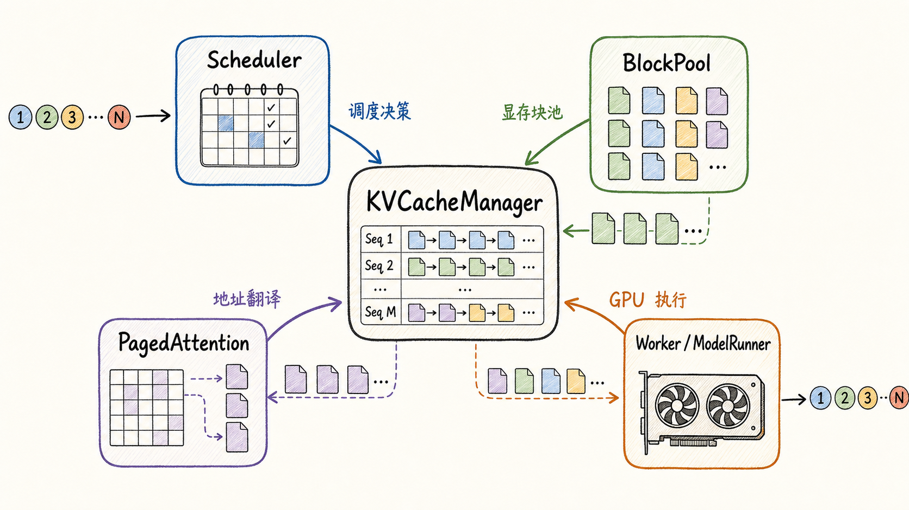

这张图可以从四个方向读。向上看，`KVCacheManager` 面向 Scheduler 暴露的是资源语义，而不是内部队列和哈希表；向下看，它把请求级状态收敛成 `BlockPool` 能维护的物理 block 状态；向左看，prefix cache 和 KV transfer 会改变哪些 block 已经可复用；向右看，PagedAttention 和 Worker 消费的是 block IDs、block table 与 slot mapping，而不是 Python 侧的对象关系。

因此，本章的主线不是逐行解释某个类，而是回答一个工程问题：vLLM 如何在请求长度不定、并发不断变化、模型 attention 类型也不统一的情况下，让 GPU KV Cache 既能高吞吐访问，又不被显存浪费拖垮。

## 1. 从显存压力进入 KV Cache 管理

KV Cache 的原始含义很直接：每一层 attention 都会为已经处理过的 token 保存 key/value，后续 token 只需要读取历史 KV，而不必重新计算整个上下文。这个优化让自回归生成可行，也把显存压力从一次性 activation 转移到了持续增长的 KV 状态上。

一个粗略的量级判断是：KV Cache 与层数、KV heads、head dimension、token 数、数据类型字节数同时相关。GQA / MQA 会让 `num_key_value_heads` 小于 attention heads，Tensor Parallelism 会把部分 KV heads 切到不同设备上，KV Cache quantization、sliding window、prefix sharing 又会继续改变实际占用，但核心事实不变：**上下文越长、并发越高，KV Cache 越容易成为服务化推理的主要显存压力**。

服务化场景会把这个压力继续放大。系统同时处理大量长度不同、阶段不同、复用机会不同的请求：Prefill 阶段一次写入大量 prompt KV，Decode 阶段每一步追加少量新 token 的 KV；有些请求命中 prefix cache，有些请求需要重新计算；有些请求因为显存 block 不足要暂缓，甚至触发 preemption。

如果把 KV Cache 当成一段段连续显存，系统很快会被三类浪费拖住。

1. **预留浪费**：为了容纳可能出现的长上下文，每个请求预留接近最大长度的连续空间，短请求会留下大量尾部空洞；
2. **碎片浪费**：请求完成顺序不同，空闲显存会被切成小段，总空闲量看起来足够，却不一定能容纳新的长上下文；
3. **生命周期错位**：一个 block 可能已经不被运行请求引用，但仍作为 prefix cache 候选保留；另一个 block 可能被多个请求共享，不能因为其中一个请求结束就立刻释放；

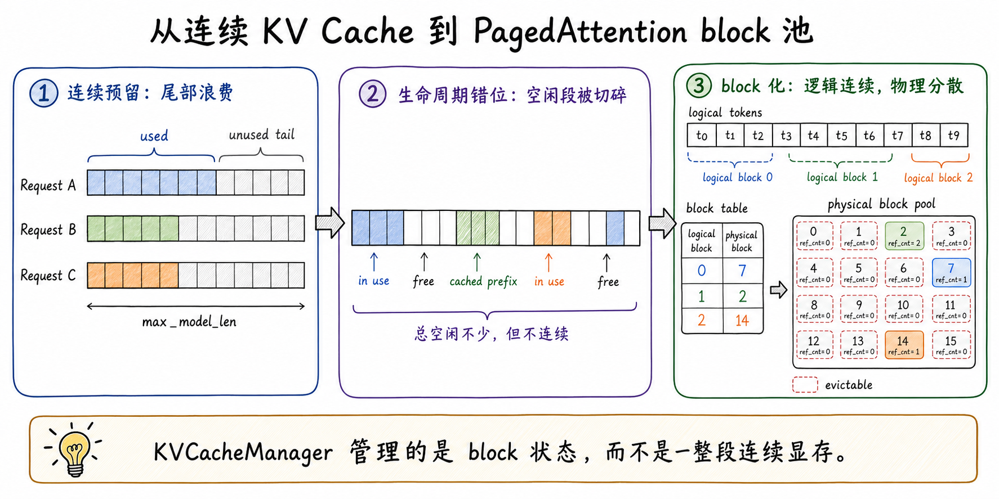

PagedAttention 的出发点就是把这些连续显存问题改成 block 粒度的状态管理问题。请求的逻辑 token 序列仍然连续，但物理 KV Cache 可以分散在固定大小的 blocks 中；显存浪费被限制在最后一个未填满 block 附近，而不是一整段预留空间。与此同时，系统必须维护更复杂的状态：哪些 block 空闲，哪些 block 已经被 hash 成可复用前缀，哪些 block 被多个请求共享，哪些 block 对 sliding window 来说已经不再参与 attention。

这就是 `KVCacheManager` 的职责边界。它不是 KV Cache tensor 本身，也不是 attention kernel；它维护的是**元数据账本、物理页池、请求映射和可复用缓存之间的一致性**。没有这层账本，PagedAttention 只是一种访问技巧；有了这层账本，PagedAttention 才能成为完整的显存管理方案。

## 2. PagedAttention 的 block 化模型

理解了连续显存为什么会浪费之后，PagedAttention 的关键转向就很自然：逻辑序列可以连续，物理存储不必连续。vLLM 把 token 序列切成固定大小的 KV block，每个 block 能容纳 `block_size` 个 token 的 KV；请求内部维护一张 block table，把第 0 个逻辑 block、第 1 个逻辑 block、第 2 个逻辑 block 映射到某些物理 block ID。

物理 block ID 可以是 7、2、14 这样的不连续编号。只要 block table 记录了逻辑顺序，attention backend 就能按表访问正确的 KV 页面。

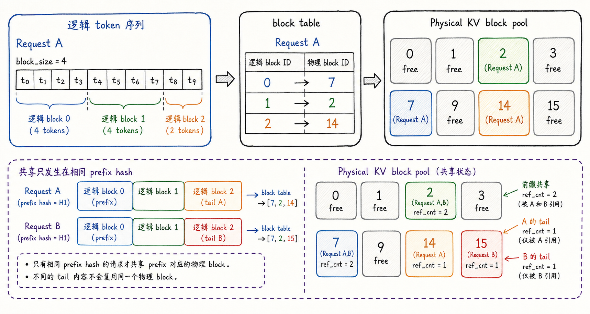

这里的重点不是切块本身，而是切块之后系统获得了一个新的调度单位。请求长度不再直接对应一段连续显存，而是对应若干个可独立分配、释放、复用的 blocks。短请求不会被迫占用长上下文空间，长请求也可以随着生成过程逐步扩展。最后一个未填满的 block 仍可能浪费一点空间，但浪费被限制在 block 粒度内。

三个对象需要先区分清楚。

- `KVCacheBlock` 是 Python 侧的 block 元数据，记录 `block_id`、`ref_cnt`、`block_hash` 以及 free queue 链表指针；
- KV Cache tensor 是 GPU 上真正保存 key/value 的物理存储，attention backend 会按 block ID 访问其中的页；
- block table 是请求到物理 block ID 的映射表，它让逻辑 token 顺序和物理显存位置解耦；

沿用一个小例子：假设 `block_size=4`，Request A 的 prompt 有 10 个 token，它会被切成 3 个逻辑 blocks，其中前两个完整 block 各有 4 个 token，最后一个 block 只有 2 个 token。如果前 8 个 token 命中 prefix cache，Scheduler 看到的不是整个请求都可以跳过，而是已有两个完整 blocks 可复用，尾部仍需要继续计算并写入新的 slots。

这个例子后面还会出现。它贯穿三条线：prefix cache 如何判断前 8 个 token 已经可复用，`allocate_slots()` 如何为尾部 token 分配新 block，Worker 又如何把 block IDs 翻译成 GPU 上的写入 slot。

## 3. Prefix cache 与 block 状态账本

前文已经多次提到 prefix cache，但它不能只被理解成少算 prompt token 的快捷方式。vLLM V1 的 prefix caching 是和 block pool、free queue、引用计数、hash map 绑定在一起的状态系统。

prefix cache 的基本规则是：**只缓存完整 block**。一个 block 的 hash 不只包含当前 block 内的 token，还包含父 block 的 hash，以及 LoRA、多模态输入 hash、cache salt 等额外区分信息。这样，第三个 block 的复用语义不是只看第三段 token 是否相同，而是看从开头到这个 block 为止的完整前缀是否一致。

这个设计有两个直接后果。第一，prompt 中只有部分 token 相同但没有凑满完整 block 时，不能把那段 partial KV 直接作为 prefix cache 命中；第二，命中一个 cached block 之后，系统不能只返回命中长度，还必须把这些 blocks 从可驱逐状态切回当前请求持有状态。

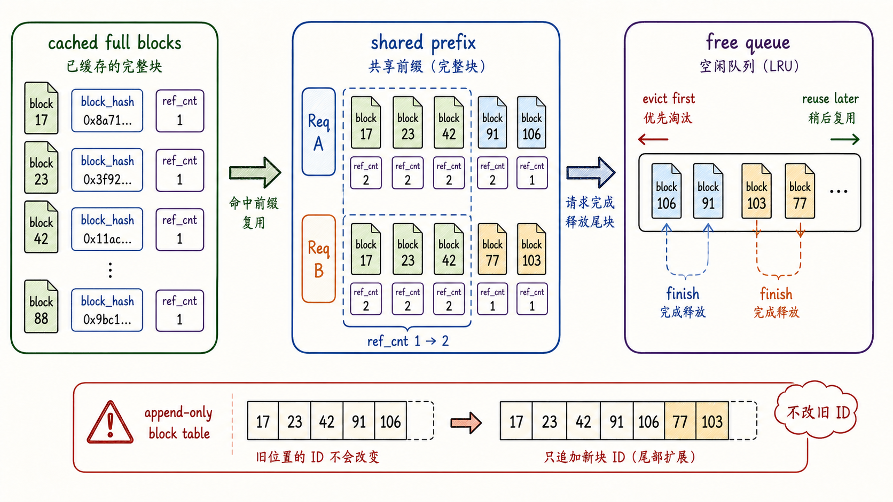

图中最容易忽略的是 free queue 与 prefix hash map 的关系。一个请求结束后，完整 blocks 可能已经不被任何运行请求引用，因此 `ref_cnt=0`，它们会进入 free queue；但只要这些 blocks 仍有 `block_hash`，它们也可能继续留在 prefix cache hash map 中，等待后续请求复用。新请求命中这些 blocks 时，`touch` 会增加引用计数，并把它们从 free queue 中移除，避免运行期间被驱逐。

因此，prefix cache 命中不是静态字典查询，而是一组状态迁移。

1. 新请求到来时，Scheduler 先查询哪些完整 blocks 已经被计算；
2. 命中的 blocks 被 touch，重新变成当前请求安全持有的资源；
3. 新计算出来并填满的 blocks 会被写入 hash，成为后续请求的可复用前缀；
4. 请求完成后，blocks 进入释放流程，但完整 cached blocks 可以继续作为候选留在 hash map 中；
5. block pool 需要重新分配某个 cached block 时，旧 hash 会被驱逐，防止其他请求继续命中过期位置；

vLLM V1 还保留了一个看似不够激进、实际很重要的取舍：重复 cached block 可能暂时存在。假设一个请求已经把 `EFGH` 写成 block 1，另一个请求在运行中又产生了相同内容的 block 3，系统并不会立刻回写后者的 block table，把 block 3 改成 block 1。原因是正常追加路径下 block table 近似 append-only，运行期回写旧 ID 会影响 Worker、attention metadata、CUDA graph 和异步执行路径的稳定性。这里牺牲一段时间的去重收益，换来的是更低同步成本和更明确的正确性边界。

读到这里，`KVCacheManager` 管理的对象已经不只是显存是否空闲，而是 block 在**已分配、被共享、可缓存、可驱逐、可复用、已释放**之间的流转。这个账本能力会直接影响后面的 hybrid attention 管理。

## 4. 不同 attention 类型与 Hybrid KV Cache Manager

如果所有模型都只使用 full attention，KV Cache 管理已经很复杂；现代模型开始混合 sliding window、chunked local attention、Mamba 或其他 state model 后，问题会再上一个台阶。同一个模型内部，不同层可能对历史状态有不同需求，单一的 block 分配规则就不够用了。

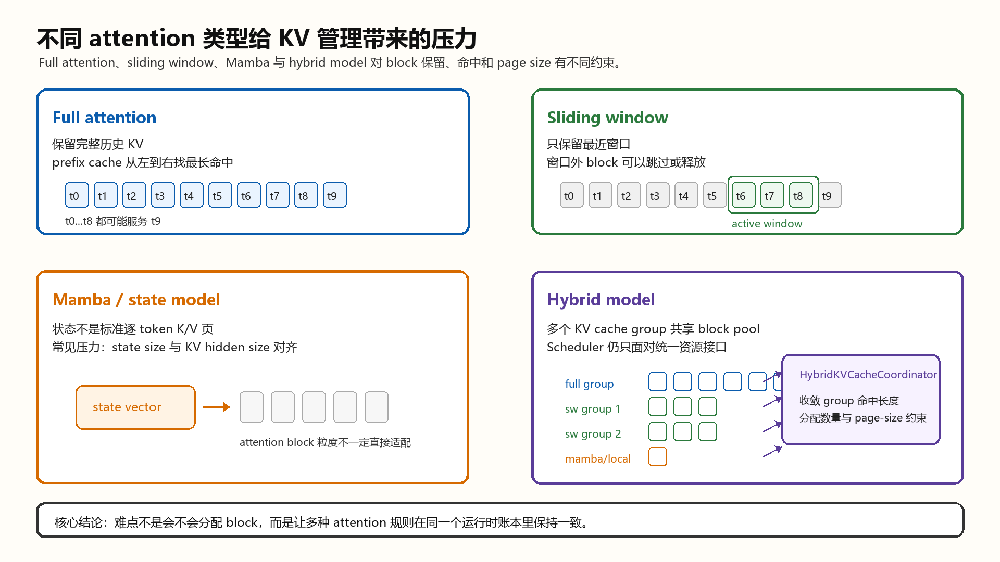

### 4.1 attention 类型先带来规则差异

Full attention 的语义最直接：未来 token 可能读取完整历史上下文，因此历史 KV 通常都要保留。prefix cache 命中也比较自然，从左到右寻找最长连续完整 block 命中即可，遇到 miss 就停止。

Sliding window attention 的语义完全不同。未来 token 只看最近窗口内的 token，窗口外的历史 KV 对后续 attention 已经不可见。这样一来，运行中的请求不一定需要一直持有从开头到当前位置的所有 blocks；窗口推进后，旧 blocks 可以被跳过或释放。prefix cache 的判断也不再只看左侧最长公共前缀，而要保证窗口内需要的 blocks 仍然可用。

Mamba 或 state model 的压力又不同。它们保存的状态不一定是标准的逐 token K/V 页，状态大小可能和 attention 层的 `kv_hidden_size` 差异很大。如果这些层和 full attention 层在同一模型中共存，系统既要支持统一 block pool，又要处理 page size 对齐、padding 和状态布局的问题。

这些差异说明一件事：KV Cache 管理不能只按请求长度分配 block，还必须理解**这一组 block 服务的是哪类 attention 规则**。

### 4.2 为什么需要 Hybrid KV Cache Manager

vLLM 的混合 KV Cache 管理要解决两类问题。

第一类是分配问题。Full attention 层需要为全部历史 token 保留 slots，sliding window 层只需要最近窗口内的 slots，Mamba 类状态可能连 block size 与 page size 的匹配方式都不同。如果仍然让每层独立申请显存，调用次数和元数据复杂度会迅速上升；如果强行把所有层塞进同一规则，又会浪费显存或破坏 attention 语义。

第二类是 prefix cache 问题。对 full attention 来说，一个 cache hit prefix 要求这个前缀中所有历史 KV 都还在；对 sliding window 来说，命中某个前缀更关心最后一个窗口内的 blocks 是否还在；对 hybrid model 来说，最终能对 Scheduler 声称已经 computed 的 token 数，必须是多个 group 的共同结果，而不是某一个 group 的单方面命中。

vLLM 的解法是把层按 KV cache spec 组织成 KV cache groups，并让这些 groups 共享统一的 block pool。每个 group 内部的层具有相同或可统一的 KV 需求，多个 groups 之间再通过 coordinator 收敛成 Scheduler 能理解的统一资源接口。

这个设计有一个非常实际的约束：**同一个 block pool 需要统一 page size**。对于 full-attention-only 模型，page size 很容易理解；对于 hybrid model，不同 attention 类型的层数、状态大小、block size 可能不同，系统就要通过 grouping、padding 或调整 block size 来让 groups 可以放进同一套物理池里。vLLM 设计文档中用 Gemma、Llama 4、Jamba、Bamba、Minimax 等模型说明过这些动机；当前实现仍应以本地源码快照和具体模型配置为准，因为这一块在持续演进。

### 4.3 分层架构怎样收敛复杂性

有了这些背景，再看 `KVCacheManager` 的分层架构就不会觉得它只是类名堆叠。

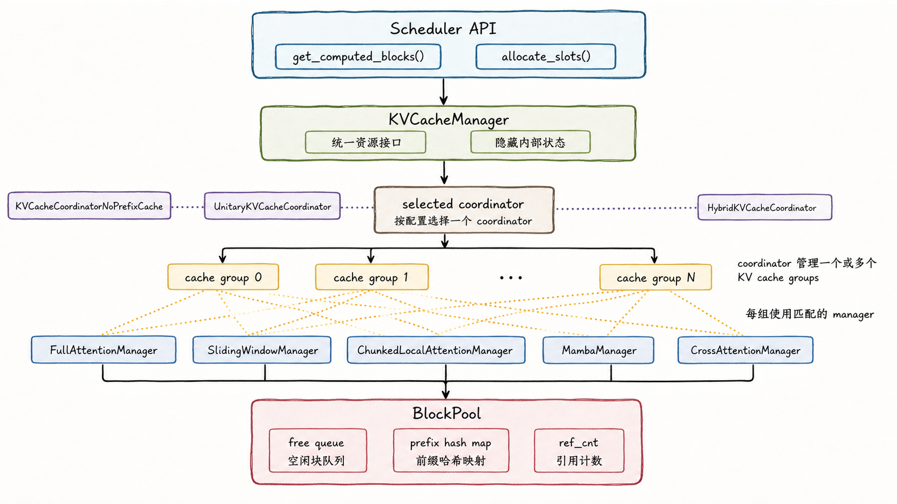

最上层是 Scheduler 看到的接口。Scheduler 不需要知道 full attention、sliding window、Mamba 或 chunked local attention 的全部细节，它只需要两个关键能力：查询已经 computed 的 blocks，以及为本轮即将计算的新 token 申请 KV slots。申请成功时，Scheduler 得到 `KVCacheBlocks`；申请失败时，它知道当前请求不能在这一轮继续推进。

第二层是 `KVCacheManager` 门面。它把 Scheduler 的请求翻译成更底层的协调动作，同时隐藏内部数据结构。Scheduler 需要 block IDs，但不应该知道 block hash map、free queue、ref count 和不同 attention 类型的特殊规则。

第三层是 `KVCacheCoordinator`。普通单一 KV group 可以走 unitary coordinator；关闭 prefix caching 或不支持 prefix caching 时，可以走 no-prefix-cache coordinator；混合 attention 类型的模型则需要 hybrid coordinator。coordinator 的职责不是亲自管理每一个 block，而是把多个 group 的命中长度、分配数量、对齐约束和释放策略收敛成一致结果。

第四层是 single-type managers。Full attention、sliding window、chunked local attention、Mamba、cross attention 等规则都在这一层形成各自的处理边界。Full attention 可以从左到右查找最长连续 prefix hit，sliding window 会把窗口外 token 视为可跳过，Mamba 类路径则处理状态模型的特殊布局。注意，这些差异不会直接暴露给 Scheduler，而是被 coordinator 收敛成统一的分配结果。

最底层是 `BlockPool`。它持有所有 `KVCacheBlock` 元数据，并维护三类关键状态：free block queue、prefix cache hash map、引用计数。初始化时，所有 block 元数据都会预创建，避免运行期频繁创建 Python 对象；free queue 直接利用 `KVCacheBlock` 上的双向链表指针，支持把中间元素移走、把释放的 block 追加回队列；prefix hash map 则让完整 blocks 可以通过 block hash 被后续请求复用。

这套分层的价值在于每一层都在收窄问题。Scheduler 只看资源语义，`KVCacheManager` 只暴露统一接口，coordinator 处理多 group 协调，single-type manager 处理 attention 类型差异，BlockPool 处理物理 block 状态。复杂性没有消失，但被放在了能承受它的位置。

## 5. 一次请求的 KV 生命周期

有了 block 模型、prefix cache 和 hybrid group 的背景之后，可以跟随一个请求走完整生命周期。这个生命周期不是简单的申请、使用、释放，因为 prefix cache、external KV、spec decode、sliding window 都可能改变中间状态。主线是：先找可复用历史，再判断本轮是否能分配，随后写入新 KV，最后在完成或窗口推进时释放和保留 block。

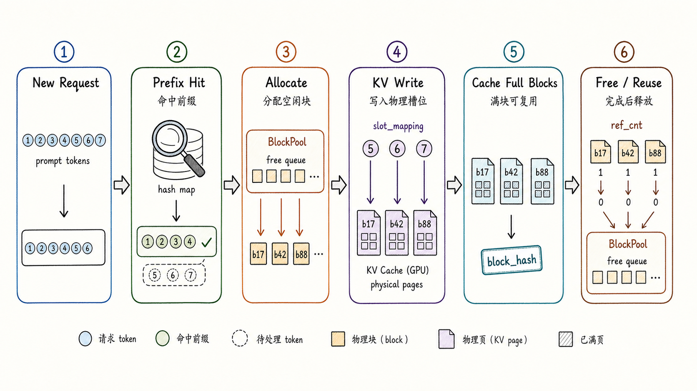

新请求进入 Scheduler 后，如果 `request.num_computed_tokens == 0`，Scheduler 会先询问 `KVCacheManager.get_computed_blocks(request)`。这里的目标是找出 prompt 前缀中已经被计算并缓存的完整 blocks。一个容易忽略的细节是：即使整段 prompt 都命中缓存，vLLM 仍然至少需要重新获得最后位置的 logits，以便继续采样。因此命中长度会被限制在 `prompt_length - 1` 以内；又因为后续分配要求 computed token 按 block 对齐，实际可能重算最后一个 block。

沿用 Request A 例子，前 8 个 token 命中 prefix cache 时，`get_computed_blocks()` 返回的是两个完整 cached blocks，而不是一个任意长度的 token 切片。尾部 2 个 prompt token 和后续 decode token 仍要进入准入与分配流程。

随后 Scheduler 调用 `allocate_slots()`。它的输入不仅有 `num_new_tokens`，还可能有 `num_new_computed_tokens`、`new_computed_blocks`、`num_lookahead_tokens`、`num_external_computed_tokens`、`num_encoder_tokens` 和 `full_sequence_must_fit`。这些参数说明，vLLM 的 KV 分配不是只服务普通 decode：它同时要覆盖 prefix cache 命中、KV connector 外部加载、spec decode lookahead、encoder-decoder cross-attention，以及 chunked prefill 下的完整序列准入控制。

`allocate_slots()` 的顺序可以概括为五步。

1. 计算本轮已经可视为 computed 的 token 数量，包括本地 prefix cache 命中和外部 KV 命中；
2. 如果 `full_sequence_must_fit` 启用，先做完整序列层面的准入检查，避免只看当前 chunk 而过度接纳请求；
3. 在正式分配新 block 之前，清理不再参与 attention 的旧 block，例如 sliding window 窗口外的 block；
4. 询问 coordinator 需要新增多少 block，并和 `BlockPool.get_num_free_blocks()` 比较，不够则返回 `None`；
5. 把 prefix hit blocks touch 住，分配新 blocks，必要时把完整 blocks 写入 prefix cache；

第三步尤其值得注意。对 sliding window 来说，先释放窗口外 block，可以减少后续因为 free blocks 不足而发生的失败。这里体现了 hybrid manager 的意义：不是所有 attention 类型都要求 KV Cache 单调增长到请求结束。

当模型 forward 真正执行后，新 token 的 K/V 会写入已经分配好的物理 slots。等一个 block 填满，并且其中 token 已经是可提交的最终 token，系统会为这个 block 写入 `block_hash`，把它放入 prefix cache hash map。spec decode 场景下，draft token 可能被拒绝，因此可缓存 token 数量会被限制在已提交 token 范围内，避免把未验证 token 对应的 KV 过早暴露为可复用前缀。

请求完成时，`KVCacheManager.free(request)` 会释放它持有的 blocks。释放不等于清空全部缓存状态：如果某些完整 blocks 仍有 `block_hash`，它们可以继续作为 prefix cache 候选存在；如果之后需要重新分配这些 blocks，BlockPool 会在取出 block 时驱逐旧 hash，防止其他请求继续命中过期位置。

这条生命周期说明一个核心点：KV Cache 的管理不是请求结束就删除。vLLM 真正管理的是 block 在不同状态之间的流转，只有理解这些状态迁移，才能看懂高吞吐背后的显存策略。

## 6. Scheduler、Worker 与 PagedAttention 的地址协作

生命周期解释了 block 什么时候被分配和释放，下一层问题是这些 block IDs 如何变成 GPU 上真实可执行的地址。Scheduler、Worker 与 attention backend 的关系可以压缩成一句话：Scheduler 决定哪些请求前进，`KVCacheManager` 给出这些请求可用的 block 结果，Worker 把 block IDs 写成 block table 和 slot mapping，attention backend 再按这些表访问 KV Cache tensor。

### 6.1 Scheduler 怎样依赖 KV 状态

Scheduler 表面上是在分配 token budget：本轮最多跑多少 token，哪些请求优先，长 prefill 是否被截断，decode 请求是否继续推进。但在 vLLM 中，token budget 只是准入条件之一，另一个同等重要的条件是 KV block 是否足够。

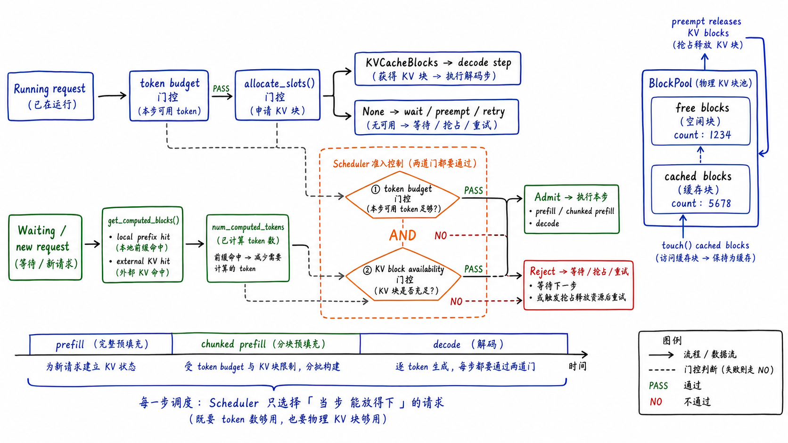

运行中的请求会优先被调度。Scheduler 根据请求当前的 `num_computed_tokens`、`num_tokens_with_spec` 和剩余 token budget 计算 `num_new_tokens`，随后调用 `kv_cache_manager.allocate_slots()`。如果返回 `KVCacheBlocks`，请求可以进入本轮执行；如果返回 `None`，说明 token budget 也许还有，但 KV block 不够。此时 Scheduler 会根据策略 preempt 某个低优先级或队尾请求，把它的 KV blocks 释放掉，再尝试继续调度。

等待队列中的新请求还会多一步 prefix cache 查询。Scheduler 先调用 `get_computed_blocks()` 计算本地 prefix hit，再结合 KV connector 可能提供的外部命中，得到 `num_computed_tokens`。这之后才会调用 `allocate_slots()`。如果命中足够多，请求需要新计算的 token 变少；如果命中的是完整 blocks，这些 blocks 还会通过 touch 变成当前请求持有的状态。prefix caching 不只是少算 token，它还会改变本轮 block 分配压力。

Scheduler 输出给 Worker 的结果里包含 block 信息。新请求通过 `NewRequestData.block_ids` 携带完整 block IDs；运行中请求通过 `CachedRequestData.new_block_ids` 携带本轮新增 block IDs。Worker 侧的 block table 会根据这些 IDs 追加或覆盖对应行。正常追加路径下，block table 近似 append-only，vLLM 不会因为后续发现两个 block 内容相同，就回头把已经写入的 block ID 改成另一个 ID。

这个约束看似保守，实则服务于运行时稳定性。Worker、attention metadata、CUDA graph、异步执行路径都可能假定已下发的 block table 行不会随意被重写。为了去重而改旧 ID，可能引入比节省一个 block 更大的同步成本和正确性风险。

### 6.2 PagedAttention 背后的地址翻译层

如果只说 `KVCacheManager` 给 PagedAttention 提供 block table，这句话虽然正确，但不够深入。更准确的说法是：`KVCacheManager` 把服务层的动态请求状态，翻译成 attention kernel 可以执行的地址结构。PagedAttention 的性能来自 kernel，也来自这层地址翻译能够长期保持正确、低成本、可增量更新。

先看单 KV cache group 的基本路径。读取历史上下文时，对一个逻辑位置 `pos`，attention 需要知道它属于请求的第几个逻辑 block，以及在 block 内的 offset。

```text
block_index = pos // block_size
offset = pos % block_size
physical_block_id = block_table[request, block_index]
slot = physical_block_id * block_size + offset
```

仍以 Request A 为例，`block_size=4` 且前 8 个 token 命中 prefix cache 时，`pos=8` 会落到 `block_index=2`、`offset=0`。如果本轮为第 2 个逻辑 block 分配到物理 block 14，那么这个位置的写入或读取地址就是 `14 * 4 + 0`。前两个逻辑 blocks 可以复用 cached blocks，尾部 partial block 则继续走分配与写入路径。到这里，Request A 已经从 prompt token、prefix hit、block allocation 走到了 physical slot。

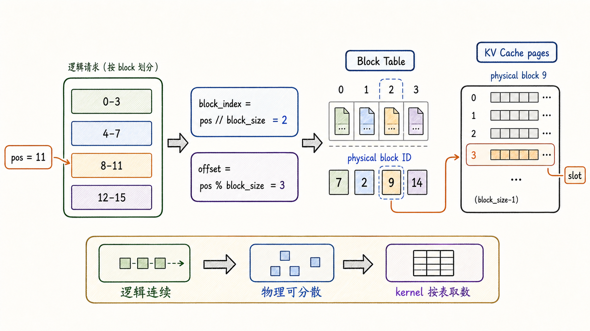

这个公式揭示了 PagedAttention 的边界：attention kernel 不需要关心某个请求为什么拿到 block 14，也不需要知道 block 14 是新分配的、prefix cache 命中的、外部 KV 传输来的，还是 sliding window 清理后的剩余块。kernel 只需要相信 block table 是正确的。只要 block table 把逻辑顺序映射到正确的物理 block，逻辑上连续的上下文就可以分散存储在物理显存里。

Worker 侧还有另一张同样重要的表：`slot_mapping`。block table 主要服务读取历史 KV，`slot_mapping` 主要服务写入新 K/V。沿 V2 路径看，Worker 会根据请求 positions、block table 和 block size 计算每个新 token 的物理 slot；attention backend 中的 KV cache update 路径再把本轮新产生的 key/value scatter 到 KV Cache tensor。

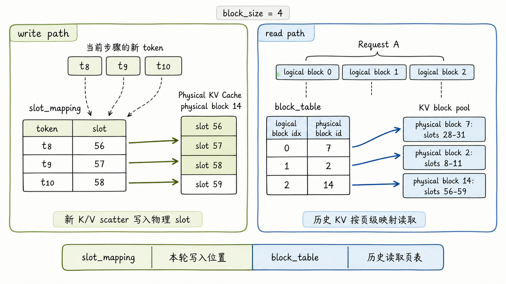

这两张表的分工非常容易被忽略。`slot_mapping` 解决本轮新 token 写到哪，`block_table` 解决 attention 读历史上下文时按什么页顺序读。它们服务同一批请求，但方向不同、使用阶段不同、传给 kernel 的位置也不同。把这两者混成一张抽象映射表，就会看不懂 Worker 为什么既要维护 block table，又要计算 slot mapping。

不同 attention backend 对 block table 的消费方式也不完全相同。FlashAttention 路径可以直接消费 block table，FlashInfer 路径可能会转换成 `paged_kv_indptr`、`paged_kv_indices`、`paged_kv_last_page_len` 等结构，Triton 路径则在 kernel 中根据 block table 查找 KV 页面。hybrid、多 KV group、DCP/PCP、`blocks_per_kv_block` 等路径会让实际元数据更复杂，但共同点是：它们都要求上游把请求级状态提前压缩成可并行访问的页级元数据。

KV Cache 管理不是 attention kernel 之外的杂务，而是 kernel 能够高效工作的前提。`KVCacheManager` 把动态、异步、共享、可复用的请求状态整理成 block IDs；Worker 把 block IDs 变成 block table 和 slot mapping；attention backend 再把这些表变成 GPU 上的访问模式。三者连起来，才是完整的 PagedAttention。

## 7. 启动期容量：vLLM 如何知道能分多少 KV Cache

运行期的 block 生命周期已经清楚了，还剩一个更早发生的问题：拉起 vLLM 推理引擎时，模型不同、显卡不同、`gpu_memory_utilization` 不同，系统怎么知道到底能给 KV Cache 分多少 block？

KV Cache 的容量不是拍脑袋设出来的。vLLM 启动时必须回答一个问题：在当前模型权重、activation 峰值、非 PyTorch 显存、CUDA graph 内存以及用户配置约束下，究竟还能留多少显存给 KV Cache？

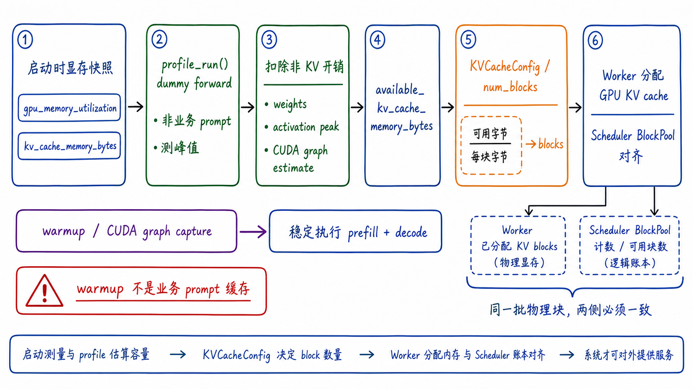

Worker 会先加载模型，并通过 profile run 估计非 KV Cache 的内存消耗。这个过程通常包括一次 dummy forward，用来触发 activation 峰值、编译路径、CUDA graph 相关分配和非 PyTorch 显存记录。profile 的结果不是最终 KV Cache，而是扣除模型运行所需空间后，剩余可用于 KV Cache 的预算。

接着，KV cache 配置推导会根据每层 KV cache spec 的 `page_size_bytes`、layer group 结构、可用字节数和配置覆盖项，生成 `KVCacheConfig`。这里的 `num_blocks` 是后续 Scheduler 和 BlockPool 都要共享的关键数字。日志里常见的 `GPU KV cache size` 与 `Maximum concurrency` 也来自这类容量计算：它们不是简单显示显存大小，而是在解释当前 KV block 池最多能承载多少 token 上下文，以及在 `max_model_len` 假设下大约支持多少并发。

之后 Worker 会按 `KVCacheConfig` 分配真正的 GPU KV Cache，初始化 KV transfer、KV Cache tensor、block table 和必要的元数据。Scheduler 侧的 `KVCacheManager` 也使用同一份 scheduler KV cache config 构造自己的 `BlockPool`，这样调度侧的 block 账本和 Worker 侧的物理 KV Cache 容量才能对齐。

最后才是 warmup 和 CUDA graph capture。warmup 会对必要 batch size 做 dummy run，执行 kernel warmup，必要时 capture CUDA graph，并为采样等路径预热缓冲区。这里要避免一个误解：warmup 不是提前缓存真实用户请求，也不是往 prefix cache 里塞业务 prompt。它的作用是确定运行期形状、触发编译、预热 kernel、稳定显存池和 CUDA graph 路径，减少正式服务时的突发延迟。

几个工程边界需要一起记住。

- 如果设置 `num_gpu_blocks_override`，源码允许覆盖 profile 得到的 block 数，但这会改变实际可用 KV 容量；
- 如果启用 `kv_cache_memory_bytes`，vLLM 会跳过自动 memory profile 的容量决定，但仍需要 profile run 来编译或准备模型路径；
- 如果模型包含 sliding window 或 chunked local attention，单请求最大持有 block 数不一定等于 `max_model_len / block_size`，启动期容量估算和运行期 admission cap 必须保持一致；
- 如果 prefix cache 被 reset，只有在除 null block 外没有使用中 block 时才能安全重置，否则会拒绝重置；

这些边界说明：KV Cache 容量不是纯数学公式，而是启动期 profile、模型结构、attention 类型、运行期 block 回收策略共同作用的结果。启动期给出的 `num_blocks`，最终会变成运行期 Scheduler 能否接纳请求、是否要 preempt、窗口外 block 是否应先释放的取舍信号。

## 8. 本章小结

`KVCacheManager` 是 vLLM V1 中连接调度和 GPU attention 的状态中枢。它把请求级 token 进度、prefix cache 命中、attention 类型差异、KV block 分配、引用计数、free queue、block hash 和 Worker 需要的 block IDs 组织成一个一致系统。Scheduler 依赖它判断请求能否进入本轮执行；Worker 依赖它下发的 block IDs 维护 block table；attention backend 依赖 block table 和 slot mapping 在物理不连续的 KV Cache 上完成读写。

从工程判断看，长 prompt 的 chunked prefill、短请求和长请求混跑、prefix cache 命中、duplicated cached blocks、sliding window 窗口推进，都是同一组问题的不同表面：**token budget 只说明计算预算，KV block 才说明显存状态是否允许请求继续前进**。

几个常见误解可以在这里收束。

- 误解一：`KVCacheManager` 只是 Python 侧的显存分配器。更准确地说，它是调度、缓存、复用、驱逐和地址翻译的状态账本；
- 误解二：PagedAttention 的核心都在 kernel。kernel 很重要，但 block table、slot mapping 和 block 生命周期管理同样是 PagedAttention 能工作的前提；
- 误解三：prefix cache 命中只影响计算量。它还影响 ref count、free queue、eviction candidate 和后续 block 分配；
- 误解四：释放请求就是清空缓存。请求释放后，完整 cached blocks 仍可能作为 prefix cache 候选存在，直到被驱逐或 reset；
- 误解五：hybrid model 只是多几种 attention。真正麻烦的是不同 attention 类型对保留范围、命中规则、page size 和分配数量有不同约束；
- 误解六：warmup 是在准备业务缓存。warmup 主要用于 profile、编译、kernel 预热、CUDA graph capture 和显存路径稳定，不是缓存真实请求；

本章最重要的结论可以压缩成一句话：vLLM 的 KV Cache 不是每个请求一段显存，而是**请求逻辑序列通过 block table 映射到共享 block 池**。`KVCacheManager` 维护这张映射背后的运行时账本，PagedAttention 在 GPU 上消费这张账本的结果。理解这一点，后面再看 Scheduler、preemption、KV transfer、spec decode、Worker 和 attention backend，许多看似分散的设计都会连起来。

## 参考资料

1. vLLM 本地源码：`code/opensource/vllm`，当前快照短提交哈希 `52a31ccec`；
2. vLLM 本地源码：`code/opensource/vllm/vllm/v1/core/kv_cache_manager.py`；
3. vLLM 本地源码：`code/opensource/vllm/vllm/v1/core/kv_cache_coordinator.py`；
4. vLLM 本地源码：`code/opensource/vllm/vllm/v1/core/single_type_kv_cache_manager.py`；
5. vLLM 本地源码：`code/opensource/vllm/vllm/v1/core/block_pool.py`；
6. vLLM 本地源码：`code/opensource/vllm/vllm/v1/core/kv_cache_utils.py`；
7. vLLM 本地源码：`code/opensource/vllm/vllm/v1/core/sched/scheduler.py`；
8. vLLM 本地源码：`code/opensource/vllm/vllm/v1/worker/gpu/block_table.py`；
9. vLLM 本地源码：`code/opensource/vllm/vllm/v1/worker/gpu/model_runner.py`；
10. vLLM 本地源码：`code/opensource/vllm/vllm/v1/worker/block_table.py`；
11. vLLM 本地源码：`code/opensource/vllm/vllm/v1/worker/gpu_model_runner.py`；
12. vLLM 本地源码：`code/opensource/vllm/vllm/v1/attention/backend.py`；
13. vLLM 本地源码：`code/opensource/vllm/vllm/v1/attention/backends/flash_attn.py`；
14. vLLM 本地源码：`code/opensource/vllm/vllm/v1/attention/backends/flashinfer.py`；
15. vLLM 本地源码：`code/opensource/vllm/vllm/v1/attention/backends/triton_attn.py`；
16. vLLM 本地文档：`code/opensource/vllm/docs/design/prefix_caching.md`；
17. vLLM 本地文档：`code/opensource/vllm/docs/design/hybrid_kv_cache_manager.md`，用于理解设计动机，具体边界以当前源码为准；
18. vLLM 本地文档：`code/opensource/vllm/docs/design/paged_attention.md`，作为 PagedAttention 历史背景资料；
19. vLLM 本地文档：`code/opensource/vllm/docs/serving/parallelism_scaling.md`；
20. Woosuk Kwon 等，Efficient Memory Management for Large Language Model Serving with PagedAttention，arXiv:2309.06180；

## 学习测评

### 题目

1. 单选题：传统连续 KV Cache 管理最容易遇到的问题是什么？
   A. 每个请求都必须使用相同采样参数；
   B. 请求长度和生命周期不同，容易产生预留浪费、碎片和复用状态错位；
   C. attention kernel 无法读取 GPU 显存；
   D. KV Cache 只在 prefill 阶段存在；

2. 单选题：Scheduler 本轮还有 token budget，但 `allocate_slots()` 对某个请求返回 `None`，最合理的判断是？
   A. token budget 已耗尽；
   B. 当前可用 KV blocks 不足，Scheduler 可能需要等待或 preempt 后重试；
   C. prefix cache 命中失败，请求必须结束；
   D. attention backend 已执行失败；

3. 多选题：关于 `KVCacheManager` 对 Scheduler 的抽象边界，哪些说法正确？
   A. Scheduler 通过 `get_computed_blocks()` 和 `allocate_slots()` 获取可调度资源结果；
   B. Scheduler 不应依赖 free queue、hash map、ref count 等内部结构；
   C. `KVCacheBlocks` 用来承载分配结果并隔离内部实现；
   D. Scheduler 必须直接更新 `cached_block_hash_to_block` 才能使用 prefix cache；

4. 单选题：vLLM 使用 block table 的核心原因是什么？
   A. 让逻辑连续的 token 序列映射到物理不连续的 KV blocks；
   B. 强制所有请求填充到相同长度；
   C. 让 KV Cache tensor 不再需要保存 value；
   D. 让 kernel 每次通过 hash 自行寻找请求所有权；

5. 多选题：`BlockPool` 通常直接维护哪些状态？
   A. `KVCacheBlock` 元数据与引用计数；
   B. free block queue；
   C. prefix cache 的 block hash 到 block 映射；
   D. GPU 上实际存放 key/value 的 KV Cache tensor 内容；

6. 单选题：即使整段 prompt 命中 prefix cache，为什么 vLLM 仍可能重新计算最后位置，甚至重算最后一个 block？
   A. 为获得最后位置的 logits 并继续采样，同时满足 computed token 的 block 对齐约束；
   B. 因为 block hash 永远不可信；
   C. 为了让所有请求都至少执行一个 prefill chunk；
   D. 因为 cached KV 不能被 attention backend 读取；

7. 多选题：新请求命中 prefix cache 中的完整 block 后，touch 这些 blocks 的作用包括哪些？
   A. 增加引用计数；
   B. 必要时从 free queue 中移除；
   C. 删除 `block_hash`，避免后续复用；
   D. 防止当前请求使用期间这些 blocks 被重新分配或驱逐；

8. 单选题：在 sliding window 场景中，为什么 `allocate_slots()` 会先执行 skipped block 清理再分配新 block？
   A. 先释放窗口外不再参与 attention 的旧 block，降低后续分配失败概率；
   B. 先把所有历史 token 转成 full attention；
   C. 先扩展 block table 以容纳完整上下文；
   D. 先把 draft token 写入 prefix cache；

9. 多选题：关于 `slot_mapping` 与 `block_table`，哪些说法正确？
   A. `slot_mapping` 主要决定本轮新 K/V 写入哪个物理 slot；
   B. `block_table` 主要决定读取历史 KV 时按哪些物理 pages 访问；
   C. 二者完全等价，可以互相替代；
   D. 二者都服务于 GPU 侧对物理 KV Cache 的访问；

10. 多选题：哪些机制会影响一个请求本轮实际需要新增多少 KV slots 或 KV blocks？
    A. 本地 prefix cache 命中；
    B. external KV connector 命中；
    C. spec decode 的 lookahead tokens；
    D. sliding window 跳过窗口外 token；

11. 单选题：spec decode 场景下，为什么不能把所有 draft token 对应的 KV 立刻暴露为可复用 prefix cache？
    A. draft token 可能被拒绝，只能缓存已经提交、仍属于 `request.num_tokens` 范围内的 token；
    B. draft token 没有 position 信息；
    C. spec decode 会禁用全部 KV Cache；
    D. draft token 与 accepted token 在缓存语义上完全相同；

12. 单选题：vLLM V1 中 duplicated cached blocks 为什么可能暂时存在？
    A. 为保持 block table append-only，避免运行期回写旧 block IDs 带来的同步与正确性风险；
    B. 因为 prefix cache 没有 hash；
    C. 因为 Worker 不使用 block table；
    D. 因为重复 block 一定比共享 block 更省显存；

13. 多选题：混合 attention 类型模型中，为什么需要 coordinator 层？
    A. 不同 KV cache group 可能有不同 block 需求；
    B. full attention、sliding window、Mamba 等类型的命中与释放规则不同；
    C. 它让 Scheduler 面对统一的资源接口；
    D. 因为 GPU 不能同时存储多个 KV tensor；

14. 多选题：关于启动期 profile、warmup 与 KV Cache 容量，哪些说法正确？
    A. profile run 用 dummy forward 估计非 KV Cache 的内存消耗与峰值；
    B. `KVCacheConfig` 推导出的 `num_blocks` 需要让 Scheduler 侧账本与 Worker 侧物理 KV Cache 对齐；
    C. warmup 的目标是提前缓存真实业务 prompt；
    D. `kv_cache_memory_bytes` 或 `num_gpu_blocks_override` 会影响容量路径，但不会让运行期调度脱离 block 数约束；

15. 多选题：排查 token budget 仍充足但某个请求无法继续推进时，哪些检查方向更符合本章的分析路径？
    A. 同时检查 free KV blocks、prefix hit、sliding window 是否释放旧 block，以及 `full_sequence_must_fit` 是否触发完整序列准入；
    B. 只检查 batch token budget，因为 KV block 压力不会影响调度准入；
    C. 只检查 attention kernel 是否支持当前 dtype，因为 `allocate_slots()` 不参与准入；
    D. 检查是否有被 preempt 的请求释放了 KV blocks，以及当前请求是否仍需要额外 lookahead slots；

### 答案与解析

1. 答案：B。传统连续分配容易把请求长度不确定性和生命周期错位放大成显存浪费；PagedAttention 的目标是把连续分配问题改成 block 粒度管理；

2. 答案：B。`allocate_slots()` 返回 `None` 通常说明 KV block 准入失败，而不是 token budget 或 kernel 已失败；Scheduler 才会考虑等待、停止推进或 preempt；

3. 答案：A、B、C。Scheduler 需要资源语义和 block IDs，不应直接操作 BlockPool 内部队列、hash map 或引用计数；

4. 答案：A。block table 是逻辑序列到物理 KV pages 的页表；它不是 padding 策略，也不是让 kernel 临时做所有权查找；

5. 答案：A、B、C。BlockPool 管理 Python 侧 block 元数据账本；GPU KV Cache tensor 属于 Worker/attention backend 使用的物理存储；

6. 答案：A。全命中仍需要最后位置的 logits 才能继续采样，所以最大命中长度会被限制到 `prompt_length - 1`；又因为后续分配要求 computed token 按 block 对齐，实际是否重算整个最后 block 取决于 prompt 长度与 block 边界；

7. 答案：A、B、D。touch 把可复用但可能处于 free queue 的 cached block 重新变成当前请求持有的安全状态；不会删除 hash；

8. 答案：A。先清理窗口外 block 可以释放容量，再判断新增 block 是否足够，这是 sliding window 与 full attention 的关键差异；

9. 答案：A、B、D。`slot_mapping` 面向写入，`block_table` 面向历史读取；二者相关但不能合并成同一个抽象；

10. 答案：A、B、C、D。prefix cache 与 external KV 会改变需计算 token 以及需分配 slot/block 的边界；external KV 命中会进入 `num_external_computed_tokens`，减少本轮需要模型计算的 token，但 `allocate_slots()` 仍会为未被 sliding window 跳过的 external computed tokens 分配本地 KV blocks，供 connector load 后被 block table 和 attention backend 访问；lookahead 会增加预留需求，sliding window 会改变旧 block 的保留与释放；

11. 答案：A。draft token 尚未全部接受，过早进入 prefix cache 会让未来请求命中未提交状态；

12. 答案：A。这里牺牲一段时间的去重收益，换取 append-only block table 带来的稳定性和低同步成本；

13. 答案：A、B、C。coordinator 负责收敛多 group、多 attention 类型的差异；D 是典型但不真实的误区；

14. 答案：A、B、D。profile 与配置推导决定可用 KV block 池，warmup 不是在缓存真实请求，而是在稳定执行路径与内存形态；

15. 答案：A、D。token budget 充足只说明计算预算还没耗尽，不能推出 KV block 准入一定成功。排查时要同时看 block pool 压力、sliding window 是否释放旧 block、完整序列准入、preemption 释放效果，以及 spec decode lookahead 等额外 slots 需求；如果对象是 running request，通常不会有新的 prefix hit，如果是 waiting 或 new request，才重点检查 local/external prefix hit、touch 与 connector 状态；
