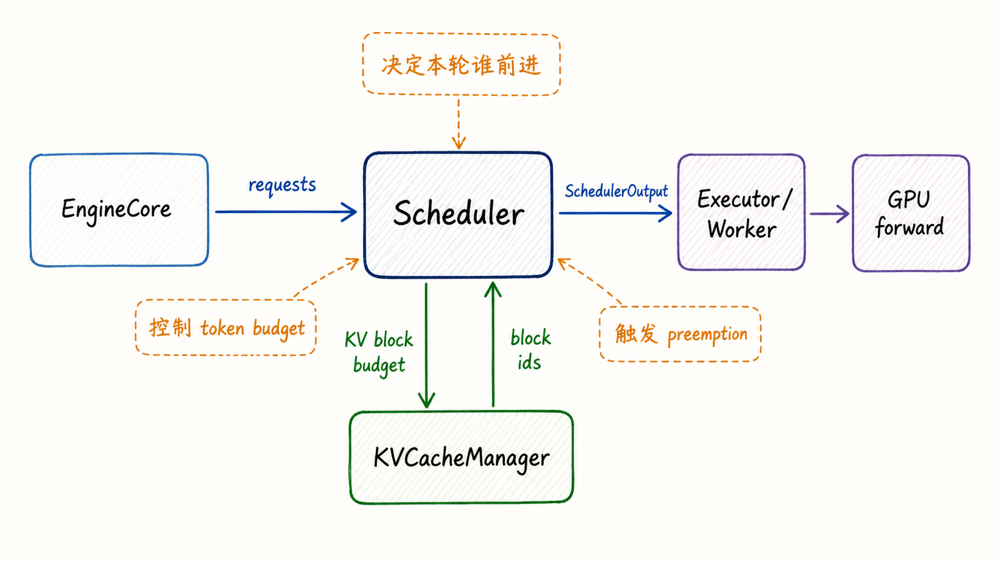
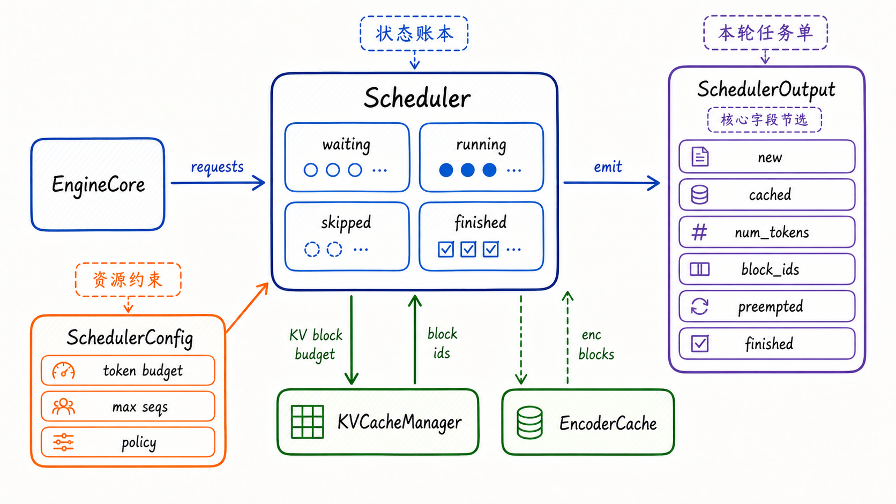
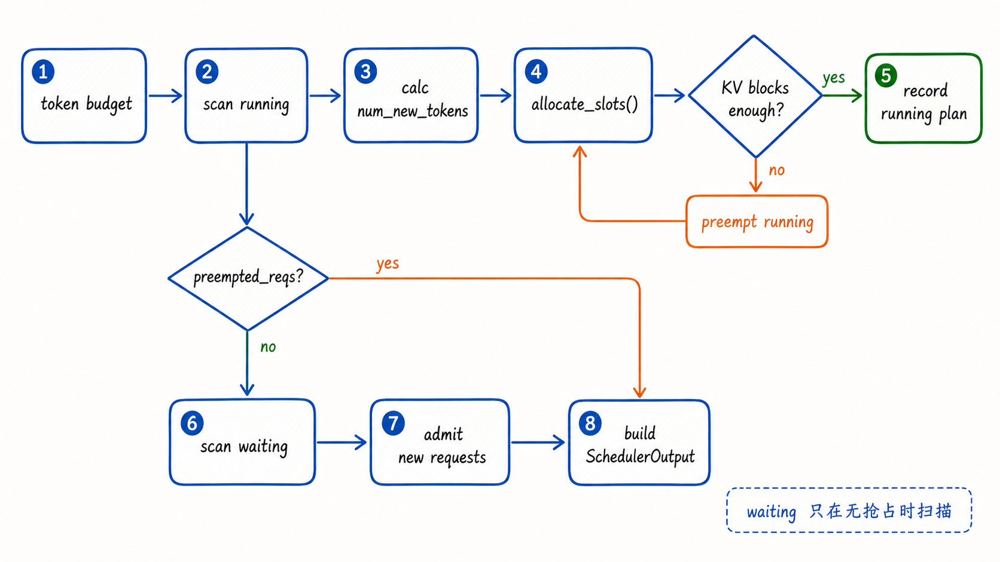
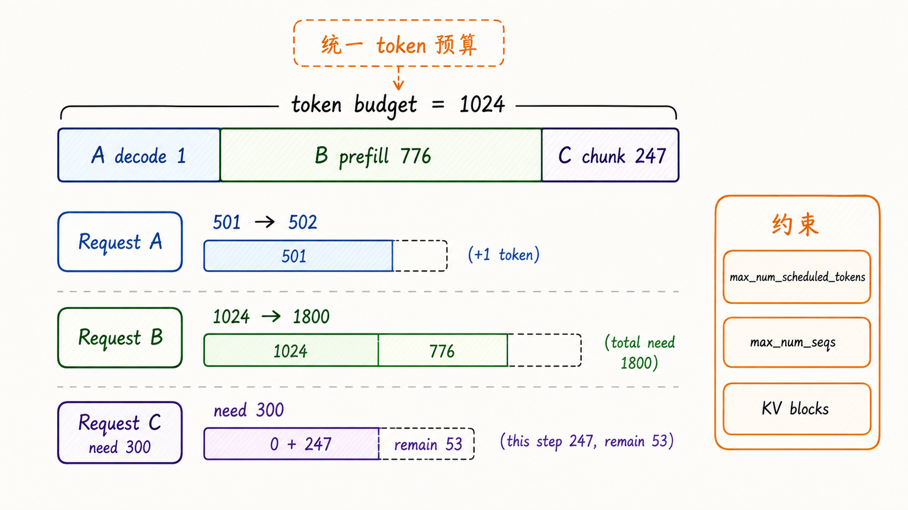
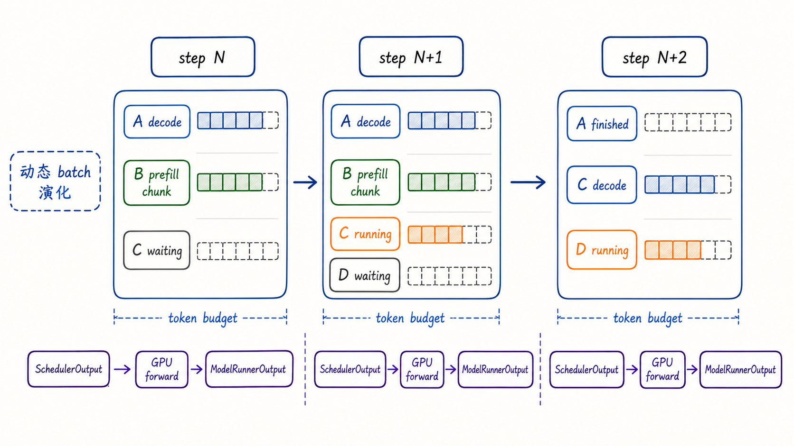
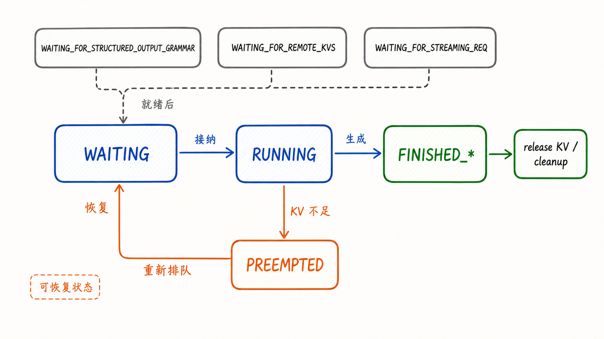
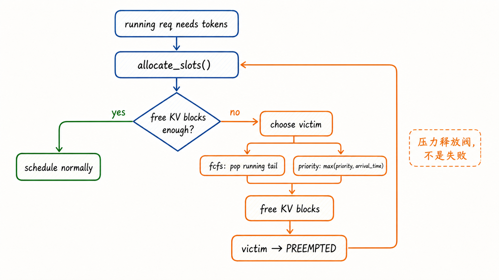
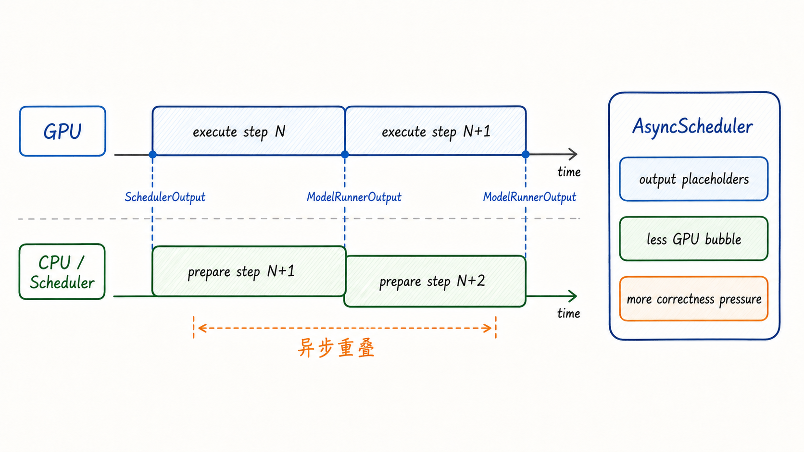
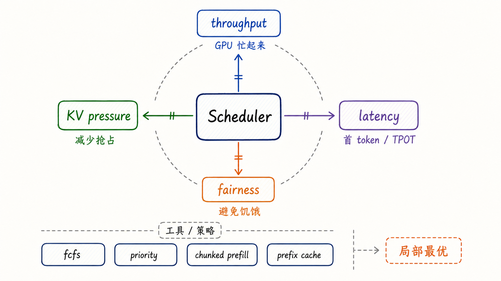

---
tags:
  - vllm
  - llm-inference
  - inference-engine
  - scheduler
  - continuous-batching
updated: 2026-05-28
description: 本文基于本地 vLLM V1 源码快照，解释 Scheduler 如何把请求队列、token budget、KV Cache、状态流转与抢占机制组织成高吞吐推理系统。
---

# 05 调度即吞吐：vLLM Scheduler 的核心架构与底层原理

前两章已经把 vLLM V1 的整体地图和 KVCacheManager 的运行时账本讲清楚了：EngineCore 维护引擎内循环，KVCacheManager 负责把动态增长的 token 序列落到 KV Block 上，Worker/GPU 负责真正执行模型。这一章继续往下走，进入另一个决定 vLLM 性能上限的核心组件：`Scheduler`。

理解 Scheduler 时，很容易掉进源码细节：打开 `scheduler.py`，从 `__init__()` 开始一路读到 `schedule()`、`update_from_output()`、`_preempt_request()`。这种方式能看到很多实现细节，却不一定能建立正确心智模型。本章不会做逐行源码分析，而是基于源码抽象出一个更稳定的问题：**在显存有限、请求动态到达、Prefill 与 Decode 混杂、输出长度未知的服务系统里，vLLM 如何决定每一步让哪些请求前进多少 token**。

本文以 `code/opensource/vllm` 的本地源码快照为依据，源码分支为 `main`，短提交哈希为 `52a31ccec`。本地快照已经处于 vLLM V1 路径，主要关注 `vllm/v1/core/sched/scheduler.py`、`vllm/v1/core/sched/async_scheduler.py`、`vllm/v1/core/kv_cache_manager.py`、`vllm/v1/engine/core.py` 和 `vllm/config/scheduler.py`。vLLM Scheduler 仍在快速演进，尤其是异步调度、spec decode、KV connector、Model Runner V2 与 Pipeline Parallel 的组合，因此复查时应优先确认当前源码和 release notes。



先抓住一个判断：Scheduler 不是“把请求排个队”的薄层组件。它实际上是 EngineCore 内部的吞吐指挥系统。它每一步都要同时回答五个问题：哪些 running 请求应该继续推进；哪些 waiting 请求可以被接纳；每个请求本轮能分到多少 token budget；KV Cache 是否还有足够 block；如果空间不够，应该让谁让出运行位置。

## 1. Scheduler 为什么决定吞吐

LLM 推理服务的吞吐不是只由 GPU 算力决定。GPU 确实负责执行 attention、MLP、sampling 等计算，但 GPU 每一步吃到什么样的 batch，是由 Scheduler 决定的。一个好的调度器会尽量让 GPU 保持忙碌，同时避免把显存占满到无法接纳新请求；一个差的调度器则会让 GPU 在 Prefill 与 Decode 的不均衡之间反复等待。

这和普通批处理不同。传统 batch 可以在开始前固定大小、固定输入长度、固定生命周期。在线 LLM serving 的请求却是流动的：

1. 请求到达时间不同，不能等所有请求凑齐再统一启动；
2. Prompt 长度不同，Prefill 成本差异可能非常大；
3. 输出长度未知，Decode 阶段每一步只追加少量 token；
4. KV Cache 随 token 增长持续占用显存；
5. Prefix caching、speculative decoding、多模态 encoder、KV transfer 等优化会改变“已经算过多少 token”的判断。

这就是 vLLM V1 Scheduler 的核心背景。它不再把 Prefill 和 Decode 当作两个割裂阶段，而是把所有请求统一看成“还有多少 token 需要追上”。源码里的关键心智模型是：

```text
每个请求都有：
  num_computed_tokens
  num_tokens_with_spec

每轮 schedule() 输出：
  {request_id: num_tokens}
```

也就是说，Scheduler 每一步产出的不是“这是一组 prefill 请求”或“这是一组 decode 请求”，而是一个更一般的指令：请求 A 本轮推进 1 个 token，请求 B 本轮推进 512 个 token，请求 C 因为 encoder budget 或 KV block 不足暂时不动。这种统一 token 预算模型让 chunked prefill、prefix caching、spec decode 和未来优化都能落在同一个抽象上。



Scheduler 的吞吐价值来自三个层次。

第一层是 **batch construction**。它决定本轮 forward 里有哪些请求，每个请求处理多少 token。`max_num_batched_tokens`、`max_num_scheduled_tokens` 和 `max_num_seqs` 控制的是这个 batch 的形状。

第二层是 **state arbitration**。它维护 `waiting`、`running`、`skipped_waiting`、`finished_req_ids` 等状态集合，并在请求被接纳、运行、跳过、抢占、恢复和结束时更新这些集合。

第三层是 **memory admission**。它不直接管理 GPU KV tensor，但它会调用 KVCacheManager 询问“这些 token 能不能分到 block”。如果 block 不够，Scheduler 必须决定是暂缓 waiting 请求，还是抢占 running 请求。

所以，“调度即吞吐”不是口号，而是工程事实：Scheduler 决定了 GPU 每一步吃到的工作形状，也决定了 KV Cache 是否被高效使用。

## 2. 架构与状态

从 EngineCore 视角看，Scheduler 位于请求状态与模型执行之间。EngineCore 的 `step()` 大致做三件事：调用 `scheduler.schedule()` 得到 `SchedulerOutput`；把这个输出交给 `model_executor.execute_model()`；拿到 `ModelRunnerOutput` 后再调用 `scheduler.update_from_output()` 更新请求状态。Scheduler 因此不是一次性决策器，而是每个 engine step 都会被反复调用的状态机。

Scheduler 内部最重要的对象可以分成六类。

| 对象 | 作用 | 读者应抓住的心智模型 |
| --- | --- | --- |
| `waiting` | 尚未进入 running 的请求队列 | 等待被接纳的入口队列 |
| `running` | 已经拥有运行时状态的请求列表 | 当前占用 KV block、可能继续 decode/prefill 的活跃集合 |
| `skipped_waiting` | 本轮因依赖或约束暂时跳过的 waiting 请求 | 防止某些暂不可调度请求堵死后续扫描 |
| `KVCacheManager` | Scheduler 侧的 KV block 分配与缓存账本 | admission controller，而不只是内存容器 |
| `EncoderCacheManager` | 多模态或 encoder-decoder 输入相关缓存管理 | 另一个会影响 token 调度的资源预算 |
| `SchedulerOutput` | 传给 Worker/ModelRunner 的本轮执行计划 | 每轮 forward 的结构化任务单 |

这几个对象共同构成了 Scheduler 的运行边界。Scheduler 不直接执行模型，也不直接写 GPU tensor；它维护的是“本轮应该做什么”和“请求状态现在是什么”。Worker 看到的是 `SchedulerOutput`，其中包含新请求数据、缓存请求增量、每个请求的 token 数、block ids、encoder 输入、finished 请求、preempted 请求等信息。

这种分层非常关键。Scheduler 可以只关心 token 与 block 的决策，ModelRunner 可以只关心如何把决策变成 GPU 输入，KVCacheManager 可以只关心 block 分配、缓存和释放。组件边界清晰，vLLM 才能把 prefix caching、chunked prefill、spec decode、KV connector、PP/DP 等特性逐步叠进去。



一次调度循环的主线可以概括为：

1. 计算本轮 token budget；
2. 优先扫描 `running` 请求，尽量让已经活跃的请求继续前进；
3. 对每个 running 请求计算 `num_new_tokens`；
4. 调用 KVCacheManager 分配新增 block；
5. 如果 block 不够，触发 running 请求抢占；
6. 如果本轮没有抢占，再扫描 `waiting` 队列接纳新请求；
7. 构造 `SchedulerOutput`；
8. 在 `_update_after_schedule()` 中推进 `num_computed_tokens` 等内部状态。

这里有一个细节很能体现 vLLM 的工程取舍：Scheduler **先调度 running，再调度 waiting**。原因并不只是“老请求优先”。更深层的原因是 running 请求已经占有 KV block 和 worker 侧缓存状态，继续推进它们通常可以用更小增量换来稳定 decode；如果过度接纳新请求，KV Cache 很容易被长 prompt 或并发 prefill 撑满，反而造成更多抢占和重算。

## 3. 调度循环

Scheduler 的核心循环不是“先 prefill 后 decode”，而是“谁还有 token 没算完，谁就申请一部分本轮预算”。这可以用一个小例子理解。

假设本轮 `max_num_scheduled_tokens = 1024`，系统里有三个请求：

| 请求 | 状态 | 已计算 token | 当前总 token | 本轮理想推进 |
| --- | --- | ---: | ---: | ---: |
| A | running decode | 501 | 502 | 1 |
| B | running chunked prefill | 1024 | 1800 | 776 |
| C | waiting new prefill | 0 | 300 | 300 |

Scheduler 不会先给 A 贴上 decode 标签、给 B/C 贴上 prefill 标签再写两个算法，而是统一计算“当前总 token 与已计算 token 之间还差多少”。在预算充足时，A 可以拿 1 个 token，B 拿 776 个 token，剩余 247 个 token 不够完整覆盖 C 的 300 token prompt；如果 chunked prefill 开启，C 可以先拿 247 个 token，否则 C 可能要等下一轮。



本章理解 Scheduler，最重要的是把几个预算区分开。

| 预算/约束 | 含义 | 对调度的影响 |
| --- | --- | --- |
| `max_num_scheduled_tokens` | Scheduler 本轮最多发出的 token 数 | 控制单轮 forward 的 token 规模 |
| `max_num_batched_tokens` | 模型执行侧 batch token 上限 | 通常作为 scheduled token 上限的默认值 |
| `max_num_seqs` | 同一轮最多活跃序列数 | 限制 running 请求数量 |
| encoder compute budget | 多模态/encoder 输入的本轮计算预算 | 可能让请求只调度文本部分或暂缓 |
| KV block capacity | KV Cache 剩余可分配 block | 决定请求能否被接纳或继续运行 |
| `long_prefill_token_threshold` | 长 prompt 单轮切块阈值 | 防止长 prefill 独占过多预算 |

这些预算彼此不是替代关系。`max_num_scheduled_tokens` 解决“这一轮算多少 token”；`max_num_seqs` 解决“这一轮有多少条序列”；KV block capacity 解决“算完以后状态放在哪里”。真正的 Scheduler 决策发生在三者交汇处。

### 3.1 Running 优先

对 `running` 请求，Scheduler 会计算：

```text
num_new_tokens =
  request.num_tokens_with_spec
  + request.num_output_placeholders
  - request.num_computed_tokens
```

这个公式把普通 decode、chunked prefill、spec decode 和异步调度中的 output placeholders 放到同一个差值模型里。差值大，说明请求还有较多 token 需要追上；差值小，通常就是 decode 阶段的一步。

然后 Scheduler 会做几层裁剪：

1. 不能超过本轮剩余 token budget；
2. 不能超过 `max_model_len - 1 - num_computed_tokens`；
3. 如果设置了长 prefill 阈值，单轮不能超过阈值；
4. 如果有 encoder 输入，还要受 encoder compute/cache 预算影响；
5. 如果是某些 Mamba/hybrid 模型，还可能需要 block-aligned split。

最后才会进入 KV block 分配。注意这个顺序：Scheduler 不是一开始就问“显存够不够”，而是先把本轮想推进的 token 数算出来，再问 KVCacheManager 这些 token 是否有位置可放。

### 3.2 Waiting 接纳

对 `waiting` 请求，Scheduler 的动作更像 admission control。它要先看 prefix cache 是否命中，必要时还要通过 KV connector 查询外部 KV；然后计算新请求本轮真正需要计算的 token 数。

如果 prefix cache 命中，`num_computed_tokens` 可以大于 0，新请求不一定要从 prompt 第一个 token 开始计算。如果整个 prompt 都命中，vLLM 仍然需要重新计算最后一个 token 来获得 logits，这是很多读者容易忽略的点。Prefix caching 省掉的是大部分历史前缀计算，不是让模型凭空生成下一个 logits。

`waiting` 请求能否进入 `running`，最终仍取决于三件事：

1. running 数量没有超过 `max_num_seqs`；
2. token budget 仍有余额；
3. KVCacheManager 能分配出需要的 block。

如果 waiting 请求因为结构化输出 grammar、远程 KV 加载、多模态 encoder budget 或 LoRA 限制暂时不能调度，它可能被放入 `skipped_waiting`，等待后续步骤重新尝试。这个设计避免了某些暂不可调度的请求把整个 waiting 扫描堵死。需要特别区分的是 KV block 不足：当前源码中 waiting 请求在 `allocate_slots()` 返回 `None` 时通常会停止本轮 waiting 扫描，而不是被放入 `skipped_waiting`，等待后续 step 释放资源后再尝试。

## 4. 策略如何改变同一套循环

前面已经看到一次 `schedule()` 循环的主线：先给 running 请求分配本轮推进量，再接纳 waiting 请求，最后把决策打包成 `SchedulerOutput`。下面这些机制不是新的叙事主线，而是在改变同一套循环里的三个关键点：谁先拿 token budget，谁能通过 admission，谁在压力下被抢占。

vLLM V1 Scheduler 的默认策略是 `fcfs`，也支持 `priority`。表面看，这是队列排序策略；实际影响更广，因为排序会影响谁先拿 token budget、谁先占用 KV block、谁在显存压力下更可能被抢占。

`fcfs` 的优势是简单、稳定、可预期。请求按到达顺序进入 waiting，running 队列也大体保持已有请求优先。对于普通在线 serving，FCFS 能避免过多策略干预带来的尾延迟波动。

`priority` 则允许请求携带优先级，数值越小优先级越高。waiting 队列会按 `(priority, arrival_time)` 排序；当 KV block 不够、需要从 running 中选择牺牲者时，Scheduler 会选择优先级最低的 running 请求。这个策略适合混合业务场景，例如交互式请求优先于后台批处理请求。



但是优先级不是免费午餐。它改善了高优先级请求的响应，却可能让低优先级长请求反复被抢占，增加重算成本。对于 LLM serving，公平性、吞吐、延迟、显存效率之间没有单一最优点；Scheduler 的价值就在于把这些取舍显式化。

### 4.1 Chunked Prefill

Chunked prefill 是理解 vLLM Scheduler 的关键机制之一。没有 chunked prefill 时，一个很长 prompt 可能需要一次性占用大量 token budget；如果预算不够，整个请求就要等。开启 chunked prefill 后，长 prompt 可以分多轮推进，短请求有机会插入执行，从而改善整体响应。这个方向也与 Sarathi-Serve 等 LLM serving 研究中的 chunked prefill 思路相呼应：把长 prefill 切成更可调度的块，让系统更容易混合 prefill 与 decode 工作。

但 chunked prefill 也会带来 admission 风险：如果只检查第一块 chunk 能否放入 KV Cache，就可能过度接纳请求，后续 chunk 到来时发现完整序列无法容纳，导致更频繁抢占。当前源码中的 `scheduler_reserve_full_isl` 就是为这个问题服务的：接纳新请求时，可以要求按完整 input sequence length 预检查 KV Cache 是否放得下，而不是只看本轮 chunk。

这里的工程判断是：chunked prefill 提升调度弹性，但不能让接纳策略短视。Scheduler 必须同时看到“本轮能算多少”和“整个请求最终会占多少”。

### 4.2 Prefix Cache

Prefix caching 改变的是 waiting 请求的起跑线。对新请求，Scheduler 会让 KVCacheManager 根据 block hash 查找已经计算过的前缀 block。命中后，Scheduler 本轮只需要安排未命中的尾部 token。

这对调度有两个影响。

第一，命中 prefix cache 的请求消耗更少 token budget，因此更容易进入 batch。第二，prefix block 需要被 touch 或增加引用，避免在本请求使用前被其他请求驱逐。也就是说，prefix caching 不是“少算几个 token”那么简单，它会改变 block 引用计数、free queue、cache map 和请求 block table。

这也是为什么 Scheduler 与 KVCacheManager 必须紧密协作。Scheduler 看见的是 token 预算，KVCacheManager 看见的是 block 账本；两者共同决定一个请求到底是“便宜地进入 batch”，还是“因为 block 不足暂缓”。

### 4.3 Spec Decode

Speculative decoding 让 Scheduler 的 token 模型变得更一般。普通 decode 每轮通常只推进一个输出 token；spec decode 可能带来 draft tokens，Scheduler 需要预留 lookahead tokens，并在后续输出中根据接受/拒绝情况修正状态。

这解释了为什么源码里有 `num_tokens_with_spec`、`scheduled_spec_decode_tokens`、`num_lookahead_tokens` 等字段。Scheduler 不需要把 spec decode 变成另一套完全独立的调度器，而是把“可能会被接受的未来 token”也纳入 token 与 block 的预算模型。

这类设计很漂亮，但也提高了正确性要求。一旦 draft token、output placeholder、KV block 缓存边界和实际采样输出不同步，就可能出现多算、少算、错误复用或流式输出错位。vLLM 近几个版本围绕 async scheduling + spec decode 的大量修复，正是这类复杂组合的工程代价。

这些策略最终都会落到请求状态变化上：某个请求被接纳为 running，某个请求暂时留在 waiting，某个请求因为 KV 压力被 preempted。理解策略之后，下一步就应该看 waiting、running、preempted 和 finished 之间如何流转。

## 5. 状态流转与抢占

Scheduler 最适合用状态机来理解。一个普通请求通常从 `WAITING` 进入 `RUNNING`，生成结束后进入某种 `FINISHED_*` 状态。但真实系统里还有几类中间状态：

1. `WAITING_FOR_STRUCTURED_OUTPUT_GRAMMAR`：结构化输出 grammar 尚未准备好；
2. `WAITING_FOR_REMOTE_KVS`：KV connector 正在异步加载远端 KV；
3. `WAITING_FOR_STREAMING_REQ`：流式输入会话等待下一段输入；
4. `PREEMPTED`：请求曾经运行过，但被释放 KV block 后放回 waiting 队列等待恢复。



`PREEMPTED` 是本章最容易误解的状态。它不是错误，也不是请求失败，而是 vLLM 在显存压力下保持系统继续前进的一种机制。被抢占的请求会释放 KV blocks，`num_computed_tokens` 被重置为 0，然后被放回 waiting 队列。后续它重新被调度时，可以像新请求一样通过 prefix cache 尽量复用已经缓存的完整 block；如果无法复用，就需要重算。

### 5.1 什么时候触发抢占

抢占发生在 running 请求继续推进时。流程是：

1. Scheduler 正在扫描 `running`；
2. 某个 running 请求本轮需要新增 token；
3. Scheduler 调用 `kv_cache_manager.allocate_slots()`；
4. KVCacheManager 返回 `None`，表示当前 KV blocks 分配条件不满足，常见原因是 free blocks 不足；
5. Scheduler 从 running 集合中选择一个请求抢占，释放它的 KV block；
6. 再次尝试给当前请求分配 slots；
7. 如果被抢占的正是当前请求，说明已经没有可让出的请求，本轮无法继续调度它。



在 `fcfs` 下，Scheduler 默认从 running 尾部弹出请求作为牺牲者。这个行为和 running 列表顺序有关，直觉上更接近“让较新的或排在后面的运行请求先让出空间”。在 `priority` 下，Scheduler 会选择 `(priority, arrival_time)` 最大的 running 请求，也就是优先级最差、同优先级下更晚到达的请求。

被抢占时，Scheduler 会调用 KVCacheManager 释放请求的 blocks，同时释放 encoder cache，并把请求状态设为 `PREEMPTED`。如果请求上有 spec tokens，也会清空，因为这些 speculative 状态不应该跨抢占直接复用。

### 5.2 抢占为什么采用重算

vLLM V1 已经移除了旧的 GPU-CPU KV cache swapping 路径。旧模型里，抢占可以理解成把一部分 KV 从 GPU 换出到 CPU；V1 的主路径更倾向于释放 block，后续通过 prefix cache 或重算恢复。这是一个重要变化。

从系统角度看，swapping 的问题是引入了额外数据搬运、复杂状态和更难预测的延迟。重算式抢占的优势是机制更简单：释放 KV block，回到 waiting，后续重新调度。它把复杂性转移到“如何尽量让重算可控”，例如 prefix cache、chunked prefill、合理 admission、优先级策略和更好的 KV block 管理。

这不是说重算没有代价。被抢占请求如果无法复用 prefix cache，就会损失已经计算过的 prefill 或 decode 状态。抢占越频繁，系统越可能在“推进新 token”和“重算旧 token”之间浪费算力。因此，抢占应该被理解成压力释放阀，而不是常规优化目标。

### 5.3 抢占的可观测影响

从用户体验看，抢占可能拉长某些请求的 inter-token latency 或 time-to-first-token。从指标看，vLLM metrics 会记录 preemption 次数；请求级 prefill time、decode time、inference time 等 interval 会把期间发生的 preemption 延迟包含进去。也就是说，metrics 不是把 preemption 简单归因为某个独立阶段，而是让读者能在请求生命周期的时间分解中看到抢占带来的等待成本。

工程上判断抢占是否过多，可以关注：

1. waiting/running 请求数长期高位；
2. KV cache usage 接近上限；
3. preemption 相关日志或指标持续增长；
4. 大量长 prompt 与短交互请求混跑；
5. `max_num_batched_tokens`、`max_num_seqs` 与 GPU KV cache 容量不匹配。

抢占本身不是坏事；抢占频繁才是容量、负载形态或调度参数不匹配的信号。

## 6. 异步调度的边界

本章没有把 async scheduling 展开成主线，是因为它已经足以成为下一章。同步调度主路径回答的是“每个 engine step 如何决定本轮 batch”；异步调度进一步回答的是“CPU 调度和输入准备能否与 GPU 执行重叠，从而减少 GPU 空泡”。

从当前源码看，`async_scheduling=True` 时，`SchedulerConfig.get_scheduler_cls()` 会选择 `AsyncScheduler`。它继承普通 Scheduler，但在 `_update_after_schedule()` 和输出更新路径上加入 output placeholders：当请求已经完成 prefill、进入生成阶段时，Scheduler 可以先把未来会产生的输出位置占住，允许调度器为下一步提前准备工作；模型输出回来后，再用真实 token 消费或抵消这些 placeholder，并修正 `num_output_placeholders`。



异步调度的核心收益是 overlap：GPU 执行 step N 时，CPU 侧可以准备 step N+1 的调度、输入元数据或部分 worker 状态。vLLM 的 Model Runner V2 设计文档也明确把 async-first 当作方向：减少 CPU-GPU 同步点，避免共享 CPU buffer 被 GPU 异步读取时发生 race condition，并把输入准备、状态更新、采样等路径改造成更适合异步流水的结构。

但 async scheduling 不是简单地“把 `schedule()` 放到后台线程”。它会牵涉：

1. output placeholder 与真实 sampled token 的一致性；
2. spec decode draft tokens 的占位、接受与拒绝；
3. structured output grammar 是否能在 token 尚未全部回到 CPU 时推进；
4. Pipeline Parallel 的多 batch in-flight；
5. KV connector 异步加载和请求 abort/preemption 的竞态；
6. worker 侧 persistent batch 与 GPU/CPU buffer 的生命周期。

如果请求在异步输出尚未完全回到 CPU 时被 force-preempt，或者 prefix cache 被重置，已经在路上的 async output 还可能变成过期结果，Scheduler 和 worker 侧都必须知道哪些 placeholder 仍然有效、哪些输出需要丢弃。

这也是为什么 vLLM 近几个版本围绕 async scheduling 出现了大量性能优化和 bug fix：它不是一个孤立开关，而是贯穿 Scheduler、ModelRunner、Executor、KV connector、structured output、spec decode 和 PP 的系统级优化。下一章更适合单独讲它的历史线：从 V0 的 async output processing/multi-step scheduling，到 V1 的 AsyncScheduler，再到 MRV2 的 async-first 设计。

## 7. 源码阅读地图

读 Scheduler 源码时，建议按机制读，而不是按文件顺序逐行读。

第一组路径是调度入口：

1. `vllm/v1/engine/core.py`：看 `EngineCore.step()` 如何调用 `schedule()`、`execute_model()` 和 `update_from_output()`；
2. `vllm/config/scheduler.py`：看 `SchedulerConfig` 暴露了哪些调度参数，以及 async 时如何选择 `AsyncScheduler`；
3. `vllm/v1/core/sched/interface.py`：看 Scheduler 对 EngineCore 暴露的抽象接口。

第二组路径是核心机制：

1. `vllm/v1/core/sched/scheduler.py`：重点读 `schedule()`、`_preempt_request()`、`_update_after_schedule()`、`update_from_output()`；
2. `vllm/v1/core/sched/request_queue.py`：理解 `fcfs` 与 `priority` 队列的真实排序语义；
3. `vllm/v1/core/sched/output.py`：理解 `SchedulerOutput` 如何把调度决策传给 worker。

第三组路径是资源约束：

1. `vllm/v1/core/kv_cache_manager.py`：重点读 `get_computed_blocks()` 与 `allocate_slots()`；
2. `vllm/v1/core/kv_cache_coordinator.py` 与 block pool 相关文件：继续追踪 block 分配、引用和 cache 行为；
3. `docs/design/prefix_caching.md`：用设计文档补足 prefix cache 与 block allocation 的语义。

第四组路径是异步调度入口：

1. `vllm/v1/core/sched/async_scheduler.py`：看 output placeholders 如何修改普通 Scheduler 的状态推进；
2. `vllm/v1/worker/gpu_model_runner.py` 与 `vllm/v1/worker/gpu_input_batch.py`：看 worker 侧如何消费 placeholder、persistent batch 和 scheduler output；
3. `docs/design/model_runner_v2.md`：理解 async-first 为什么会倒逼 ModelRunner 重新设计。



本章最后用一个心智模型收束：Scheduler 是 vLLM 中把“请求流”压成“GPU 可执行 batch”的地方。它不是单纯公平队列，也不是单纯显存分配器，而是在吞吐、延迟、公平性和显存压力之间不断做局部最优决策的运行时控制器。

如果只记住一句话，可以这样理解：

> KVCacheManager 让 token 有地方住，Scheduler 决定哪些 token 现在该往前走。

这句话也解释了前后两章的关系。KVCacheManager 解决的是状态承载，Scheduler 解决的是状态推进。前者把显存变成可复用账本，后者把动态请求变成连续不断的执行计划。两者合在一起，才是 vLLM 能把高并发 LLM serving 做成高吞吐系统的关键。

## 参考资料

1. vLLM 本地源码快照：`code/opensource/vllm`，`main@52a31ccec`，重点文件包括 `vllm/v1/core/sched/scheduler.py`、`vllm/v1/core/sched/async_scheduler.py`、`vllm/v1/core/kv_cache_manager.py`、`vllm/v1/engine/core.py`、`vllm/config/scheduler.py`；
2. vLLM 文档：`docs/usage/v1_guide.md`，关于 V1 unified scheduler、chunked prefill、priority scheduling 与 removed swapping 的说明；
3. vLLM 文档：`docs/design/arch_overview.md`，关于 EngineCore、Scheduler、KV cache 与 worker 进程边界的说明；
4. vLLM 文档：`docs/design/prefix_caching.md`，关于 scheduler 与 KVCacheManager 在 prefix cache/block allocation 中的协作；
5. vLLM 文档：`docs/design/model_runner_v2.md`，关于 async-first、persistent batch 与异步调度压力的设计说明；
6. vLLM Blog，[vLLM V1: A Major Upgrade to vLLM's Core Architecture](https://blog.vllm.ai/2025/01/27/v1-alpha-release.html)，2025-01-27；
7. vLLM Blog，[Inside vLLM: Anatomy of a High-Throughput LLM Inference System](https://blog.vllm.ai/2025/09/05/anatomy-of-vllm.html)，2025-09-05；
8. Woosuk Kwon et al.，[Efficient Memory Management for Large Language Model Serving with PagedAttention](https://arxiv.org/abs/2309.06180)，arXiv；
9. Gyeong-In Yu et al.，[Orca: A Distributed Serving System for Transformer-Based Generative Models](https://www.usenix.org/conference/osdi22/presentation/yu)，OSDI 2022；
10. Amey Agrawal et al.，[SARATHI: Efficient LLM Inference by Piggybacking Decodes with Chunked Prefills](https://arxiv.org/abs/2308.16369)，arXiv；
11. Amey Agrawal et al.，[Taming Throughput-Latency Tradeoff in LLM Inference with Sarathi-Serve](https://arxiv.org/abs/2403.02310)，arXiv；
12. Yinmin Zhong et al.，[DistServe: Disaggregating Prefill and Decoding for Goodput-optimized Large Language Model Serving](https://arxiv.org/abs/2401.09670)，arXiv；
13. vLLM GitHub Issue，[Async Scheduling Plan #27679](https://github.com/vllm-project/vllm/issues/27679)，用于后续异步调度专题复查；
14. vLLM GitHub PR，[Enable async scheduling by default #27614](https://github.com/vllm-project/vllm/pull/27614)，用于后续异步调度专题复查；
15. vLLM GitHub PR，[Fully support async scheduling + PP #32618](https://github.com/vllm-project/vllm/pull/32618)，用于后续异步调度专题复查。

## 学习测评

### 题目

1. vLLM V1 Scheduler 的统一调度抽象，最核心可以概括为什么？
   A. 一个固定 batch size；
   B. 一个 `{request_id: num_tokens}` 形式的本轮 token 推进计划；
   C. 一个完整的 GPU KV tensor；
   D. 一个 tokenizer 输出列表；

2. 为什么说 vLLM V1 Scheduler 不严格区分 Prefill 阶段和 Decode 阶段？
   A. 因为 Prefill 和 Decode 在数学上完全相同；
   B. 因为 V1 只支持 Decode；
   C. 因为 Scheduler 统一使用已计算 token 与目标 token 的差值来决定本轮推进量；
   D. 因为所有请求都会被强制拆成 1 token 一步；

3. `running` 请求通常会优先于 `waiting` 请求被调度，主要原因是什么？
   A. running 请求已经占有运行时状态和 KV block，继续推进通常更稳定；
   B. waiting 请求一定没有 prompt tokens；
   C. running 请求一定比 waiting 请求优先级高；
   D. waiting 请求不能使用 prefix cache；

4. 当 `kv_cache_manager.allocate_slots()` 返回 `None` 时，通常意味着什么？
   A. 该请求已经自然结束；
   B. tokenizer 输出为空；
   C. KV block 分配条件不满足，可能是本轮 slots 或完整序列 admission 容量不足；
   D. prefix cache 命中后不需要再检查 KV block；

5. 关于 `PREEMPTED` 状态，下列哪项说法正确？
   A. 请求失败并需要返回错误；
   B. 请求释放 KV block 后回到等待队列，后续可以重新被调度；
   C. 请求会继续占用原来的全部 KV block；
   D. 请求会跳过输出校验直接结束；

6. 在 `priority` 策略下，KV block 压力导致抢占时，Scheduler 倾向选择什么请求作为牺牲者？
   A. 优先级最高且最早到达的 running 请求；
   B. 优先级最低、同优先级下更晚到达的 running 请求；
   C. waiting 队列中最新的请求；
   D. prompt 最短的请求；

7. Chunked prefill 的主要价值是什么？
   A. 删除 Prefill 阶段；
   B. 让长 prompt 可以分轮推进，避免一次性独占过多 token budget；
   C. 让所有请求都只生成一个 token；
   D. 让 KV Cache 不再需要 block；

8. 为什么 `scheduler_reserve_full_isl` 对 chunked prefill 场景重要？
   A. 它负责把 token 转成字符串；
   B. 它让 Scheduler 在接纳请求时考虑完整输入长度是否能放入 KV Cache，减少过度接纳；
   C. 它会关闭 prefix caching；
   D. 它只检查当前 chunk 是否能放入 KV Cache，不关心完整输入长度；

9. Prefix caching 对 Scheduler 的直接影响是什么？
   A. 命中前缀可以减少本轮需要计算的 token 数；
   B. 命中前缀会让请求无法进入 running；
   C. 命中前缀会禁用 KVCacheManager；
   D. 命中前缀只影响输出文本格式；

10. 为什么 async scheduling 不只是把 `schedule()` 放到后台线程？
    A. 因为它需要 output placeholders、CPU/GPU overlap、worker/model runner 状态推进，以及 spec decode、PP、KV connector 等路径的一致性；
    B. 因为它只影响日志输出，不影响执行路径；
    C. 因为它完全绕过 KVCacheManager，所以没有状态同步问题；
    D. 因为它会强制关闭 SchedulerOutput；

11. 下列哪项最准确描述 Scheduler 与 KVCacheManager 的关系？
    A. Scheduler 直接读写 GPU KV tensor，KVCacheManager 只负责日志；
    B. Scheduler 决定本轮推进哪些 token，KVCacheManager 判断并分配这些 token 所需的 KV blocks；
    C. KVCacheManager 决定 HTTP 请求路由，Scheduler 负责 tokenizer；
    D. 二者没有运行时交互；

12. 如果一个服务中 preemption 指标持续升高，最合理的初步判断是什么？
    A. 应该无条件调大 `max_num_seqs`；
    B. 说明 prefix caching 一定失效；
    C. 系统可能存在 KV 容量、请求长度分布、batch 参数或优先级策略不匹配；
    D. 应该无条件关闭 chunked prefill；

13. 【多选】下列哪些情况可能导致 waiting 请求本轮暂时不能进入 running？
    A. `max_num_seqs` 已达到上限；
    B. KV block 无法满足本轮或完整序列 admission 检查；
    C. 远程 KV 仍在异步加载；
    D. Scheduler 已经完成 tokenizer；

14. 【多选】关于抢占后的恢复，下列哪些说法正确？
    A. 被抢占请求会释放 KV blocks；
    B. `num_computed_tokens` 会被重置；
    C. 后续恢复一定不需要重算；
    D. prefix cache 可能减少恢复时的重算成本；

15. 【多选】AsyncScheduler 中 output placeholders 带来的复杂性包括哪些？
    A. 真实输出回来后需要修正 placeholder 数量；
    B. force-preemption 后可能需要丢弃过期的 in-flight async output；
    C. 它完全绕过 KVCacheManager；
    D. structured output、spec decode、PP 等路径需要额外兼容；

### 答案与解析

1. B。这不是 `SchedulerOutput` 的全部字段，而是理解 V1 unified scheduler 的核心心智模型：每轮先决定每个请求推进多少 token，worker 侧再根据完整结构化信息准备模型输入；

2. C。V1 使用 `num_computed_tokens` 与当前目标 token 数之间的差值来统一处理 prefill、decode、chunked prefill 与 spec decode；

3. A。running 请求已经拥有运行时状态、block table 和 worker 侧缓存，继续推进它们通常比盲目接纳新请求更稳定；

4. C。`allocate_slots()` 返回 `None` 的关键含义是 KV block 分配条件不满足，可能是 free blocks 不足，也可能是 waiting admission 场景下完整输入长度预检查不通过；Scheduler 可能因此触发抢占、停止 waiting 扫描或暂缓调度；

5. B。`PREEMPTED` 是可恢复状态。请求释放 KV block 后回到 waiting 队列，后续重新调度时可能通过 prefix cache 或重算恢复；

6. B。priority 策略下，源码选择 `(priority, arrival_time)` 最大的 running 请求作为抢占对象，即数值更大的低优先级请求，同优先级下更晚到达者更容易被抢占；

7. B。Chunked prefill 把长 prompt 拆成多轮推进，使短请求有机会插入，改善调度弹性和延迟；

8. B。只检查第一块 chunk 会导致过度接纳，`scheduler_reserve_full_isl` 让接纳阶段考虑完整输入长度，从而降低后续 KV thrashing 和抢占风险；

9. A。Prefix cache 命中会提高 `num_computed_tokens`，减少本轮需要真正计算的 token 数，也会改变 block 引用与缓存状态；

10. A。Async scheduling 是系统级优化，不只是调度函数换一个线程。它需要 output placeholders 与真实 sampled token 对齐，还要处理 CPU/GPU overlap、worker/model runner 状态推进、spec decode、structured output、KV connector 和 PP 等组合路径；

11. B。Scheduler 是决策者，KVCacheManager 是 KV block 账本和分配者。Scheduler 只有在 KVCacheManager 允许分配时，才能把请求推进到本轮执行计划里；

12. C。Preemption 持续升高通常说明资源压力或参数策略不匹配。它未必是错误，但值得检查 KV cache usage、请求长度分布、`max_num_batched_tokens`、`max_num_seqs` 和优先级配置；

13. A、B、C。waiting 请求不能进入 running，可能是活跃序列数达到上限，也可能是 KV block admission 不满足，还可能是远程 KV 加载、grammar、encoder budget、LoRA 等条件暂时没有满足；tokenizer 完成并不会阻止调度；

14. A、B、D。被抢占请求会释放 KV blocks，状态变为 `PREEMPTED` 并回到 waiting 队列，`num_computed_tokens` 会被重置。恢复时可能通过 prefix cache 降低重算成本，但不能保证完全不重算；

15. A、B、D。output placeholders 让 Scheduler 可以提前推进状态，但真实输出回来后必须修正数量；强制抢占或 reset cache 可能产生过期 in-flight 输出；structured output、spec decode 和 PP 等路径也需要额外兼容。它并不会绕过 KVCacheManager。
