---
tags:
  - vllm
  - llm-inference
  - inference-engine
  - scheduler
  - continuous-batching
updated: 2026-06-10
description: 基于本地 vLLM V1 源码快照，解释 Scheduler 如何把请求队列、token budget、KV Cache、状态流转与抢占机制组织成高吞吐推理系统。
---
# 05 调度即吞吐：vLLM Scheduler 的核心架构与底层原理

EngineCore 维护引擎内循环，KVCacheManager 把动态增长的 token 序列落到 KV Block 上，Worker/GPU 负责真正执行模型，Scheduler 则站在这三者之间，决定每个 engine step 里哪些请求获得前进机会。

这个位置很容易被低估。LLM serving 的请求并不是排好队以后整齐进入 GPU：长 prompt 会突然吞掉大量 prefill 预算，decode 请求每轮只需要一两个 token 却对 inter-token latency 很敏感，KV Cache 又会随着上下文增长持续占用显存。**在显存有限、请求动态到达、Prefill 与 Decode 混杂、输出长度未知的服务系统里，vLLM 如何决定每一步让哪些请求前进多少 token**，这个问题直接决定吞吐、延迟、抢占频率和显存利用率。

vLLM V1 的 Scheduler 正是在这个问题上持续演进：统一 token 预算模型让 prefill、decode、prefix cache、spec decode 与 KV connector 能够进入同一套调度循环，异步调度和 Model Runner V2 又继续把 CPU 调度、GPU 执行和输出回传推向更高重叠度。理解 Scheduler，不是为了记住某个函数的代码顺序，而是建立一个稳定的系统判断：**吞吐不是 GPU 单独跑出来的，而是调度器不断把动态请求压成 GPU 可执行 batch 的结果**。

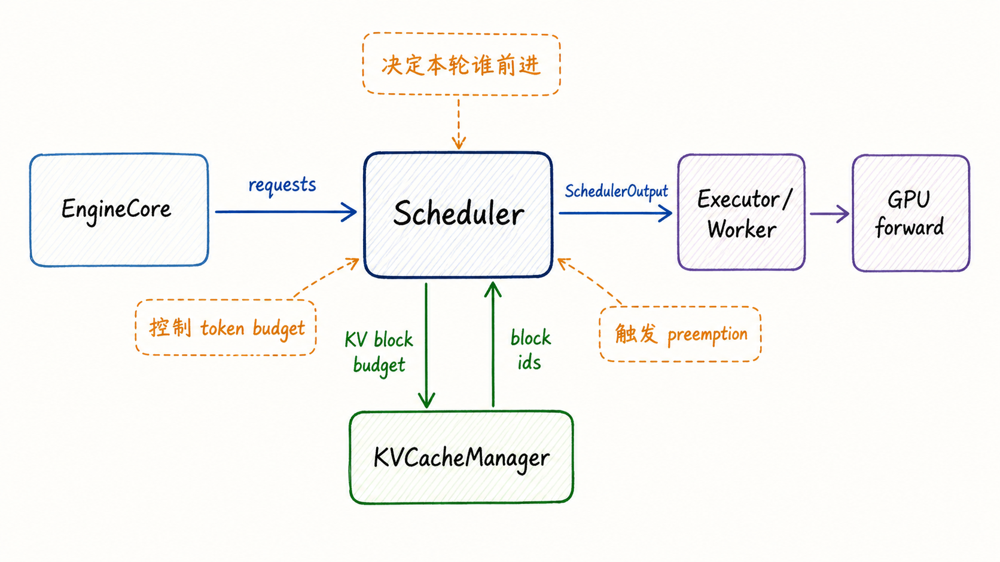

图里的 Scheduler 看起来像一个普通中间层，但它同时连接三类压力。左侧 EngineCore 把新请求、abort、输出更新等事件送进来，Scheduler 需要把它们转化为稳定的请求状态；下方 KVCacheManager 给出 KV block 的可分配边界，Scheduler 不能只看 token 数，还必须确认这些 token 算完后有地方存；右侧 Executor/Worker 只接受结构化的 `SchedulerOutput`，也就是本轮真正能进入 GPU forward 的执行计划。

因此 Scheduler 不是把请求排个队的薄层组件，而是 EngineCore 内部的吞吐指挥系统。它每一步都要同时回答五个问题：哪些 running 请求应该继续推进，哪些 waiting 请求可以被接纳，每个请求本轮能分到多少 token budget，KV Cache 是否还有足够 block，如果空间不够，谁应该让出运行位置。这五个问题如果任何一个回答得太激进，系统会因为显存压力频繁抢占；回答得太保守，GPU 又会因为 batch 形状不饱满而浪费吞吐。

## 1. Scheduler 为什么决定吞吐

LLM 推理服务的吞吐不是只由 GPU 算力决定。GPU 确实负责执行 attention、MLP、sampling 等计算，但 GPU 每一步吃到什么样的 batch，是由 Scheduler 决定的。一个好的调度器会尽量让 GPU 保持忙碌，同时避免把显存占满到无法接纳新请求；一个差的调度器则会让 GPU 在 Prefill 与 Decode 的不均衡之间反复等待。

这和普通批处理不同。传统 batch 可以在开始前固定大小、固定输入长度、固定生命周期。在线 LLM serving 的请求却是流动的：

1. 请求到达时间不同，不能等所有请求凑齐再统一启动；
2. Prompt 长度不同，Prefill 成本差异可能非常大；
3. 输出长度未知，Decode 阶段每一步只追加少量 token；
4. KV Cache 随 token 增长持续占用显存；
5. Prefix caching、speculative decoding、多模态 encoder、KV transfer 等优化会改变已计算 token 的判断；

这就是 vLLM V1 Scheduler 的核心背景。它不再把 Prefill 和 Decode 当作两个割裂阶段，而是把所有请求统一看成**还有多少 token 需要追上**。源码里的关键心智模型是：

```text
每个请求都有：
  num_computed_tokens
  num_tokens_with_spec

每轮 schedule() 输出：
  {request_id: num_tokens}
```

也就是说，Scheduler 每一步产出的不是一组固定类型的 prefill 请求或 decode 请求，而是一个更一般的指令：请求 A 本轮推进 1 个 token，请求 B 本轮推进 512 个 token，请求 C 因为 encoder budget 或 KV block 不足暂时不动。这种统一 token 预算模型让 chunked prefill、prefix caching、spec decode 和未来优化都能落在同一个抽象上。

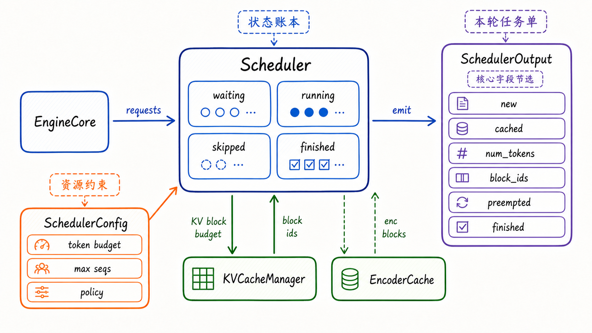

Scheduler 的吞吐价值来自三个层次。

第一层是 **batch construction**。它决定本轮 forward 里有哪些请求，每个请求处理多少 token。`max_num_batched_tokens`、`max_num_scheduled_tokens` 和 `max_num_seqs` 控制的是这个 batch 的形状。

第二层是 **state arbitration**。它维护 `waiting`、`running`、`skipped_waiting`、`finished_req_ids` 等状态集合，并在请求被接纳、运行、跳过、抢占、恢复和结束时更新这些集合。

第三层是 **memory admission**。它不直接管理 GPU KV tensor，但它会调用 KVCacheManager 询问这些 token 能不能分到 block。如果 block 不够，Scheduler 必须决定是暂缓 waiting 请求，还是抢占 running 请求。

所以，**调度即吞吐**不是口号，而是工程事实：Scheduler 决定了 GPU 每一步吃到的工作形状，也决定了 KV Cache 是否被高效使用。

## 2. 架构与状态

从 EngineCore 视角看，Scheduler 位于请求状态与模型执行之间。EngineCore 的 `step()` 大致做三件事：调用 `scheduler.schedule()` 得到 `SchedulerOutput`；把这个输出交给 `model_executor.execute_model()`；拿到 `ModelRunnerOutput` 后再调用 `scheduler.update_from_output()` 更新请求状态。Scheduler 因此不是一次性决策器，而是每个 engine step 都会被反复调用的状态机。

Scheduler 内部最重要的对象可以分成六类。

| 对象 | 作用 | 读者应抓住的心智模型 |
| --- | --- | --- |
| `waiting` | 尚未进入 running 的请求队列 | 等待被接纳的入口队列 |
| `running` | 已经拥有运行时状态的请求列表 | 当前占用 KV block、可能继续 decode/prefill 的活跃集合 |
| `skipped_waiting` | 本轮因依赖或约束暂时跳过的 waiting 请求 | 防止某些暂不可调度请求堵死后续扫描 |
| `KVCacheManager` | Scheduler 侧的 KV block 分配与缓存账本 | admission controller，而不只是内存容器 |
| `EncoderCacheManager` | 多模态或 encoder-decoder 输入相关缓存管理 | 另一个会影响 token 调度的资源预算 |
| `SchedulerOutput` | 传给 Worker/ModelRunner 的本轮执行计划 | 每轮 forward 的结构化任务单 |

这几个对象共同构成了 Scheduler 的运行边界。Scheduler 不直接执行模型，也不直接写 GPU tensor；它维护的是**本轮应该做什么**以及**请求状态现在是什么**。Worker 看到的是 `SchedulerOutput`，其中包含新请求数据、缓存请求增量、每个请求的 token 数、block ids、encoder 输入、finished 请求、preempted 请求等信息。

这种分层非常关键。Scheduler 可以只关心 token 与 block 的决策，ModelRunner 可以只关心如何把决策变成 GPU 输入，KVCacheManager 可以只关心 block 分配、缓存和释放。组件边界清晰，vLLM 才能把 prefix caching、chunked prefill、spec decode、KV connector、PP/DP 等特性逐步叠进去。

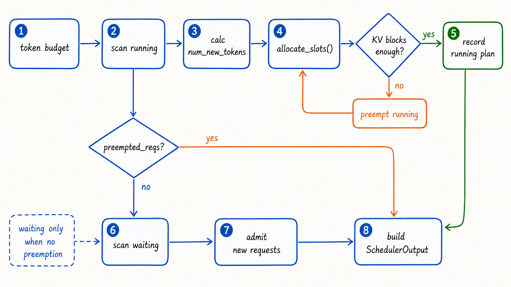

一次调度循环的主线可以概括为：

1. 计算本轮 token budget；
2. 优先扫描 `running` 请求，尽量让已经活跃的请求继续前进；
3. 对每个 running 请求计算 `num_new_tokens`；
4. 调用 KVCacheManager 分配新增 block；
5. 如果 block 不够，触发 running 请求抢占；
6. 如果本轮没有抢占，再扫描 `waiting` 队列接纳新请求；
7. 接纳成功后把 waiting 请求加入本轮计划；
8. 构造 `SchedulerOutput`，并在调度后推进 `num_computed_tokens` 等内部状态；

这里有一个细节很能体现 vLLM 的工程取舍：Scheduler **先调度 running，再调度 waiting**。原因并不只是**已有请求优先**，更深层的原因是 running 请求已经占有 KV block 和 worker 侧缓存状态，继续推进它们通常可以用更小增量换来稳定 decode；如果过度接纳新请求，KV Cache 很容易被长 prompt 或并发 prefill 撑满，反而造成更多抢占和重算。

图中的 `record running plan` 不是最终输出，它只是把已经成功分配 KV block 的 running 请求记录到本轮计划里，包括请求 id、新增 block、计划推进的 token 数和可能的 spec decode token。只要这些 running 计划存在，后续构造 `SchedulerOutput` 时就必须把它们带上；waiting 请求只有在没有发生抢占、并且 token/KV/序列数预算仍有余额时才会被继续扫描。这个顺序解释了图里从步骤 5 到步骤 8 的箭头：running 计划会进入最终执行计划，waiting 接纳只是可选的后续增量。

## 3. 调度循环

理解 V1 Scheduler，最容易卡住的地方是 Prefill 与 Decode 的关系。早期很多推理系统的心智模型都更接近两段式：请求先经历 prompt prefill，生成出第一个 token 以后再进入逐 token decode。这个模型直观，也符合单请求推理的生命周期，但放到在线服务里会暴露两个问题。

第一个问题是 head-of-line blocking。长 prompt 的 prefill 往往是 compute-bound，一次性吃掉大量 token budget 和 KV block，如果调度器把它当成不可拆分的大任务，后面已经进入 decode 的交互式请求就可能被迫等待，inter-token latency 会明显变差。第二个问题是资源视角不统一。Decode 请求每轮通常只需要 1 个 token，长 prefill 可能需要几百到几千个 token，prefix cache 又可能让新请求已经拥有一段可复用前缀，spec decode 还会引入 draft/lookahead token；如果调度器始终先按阶段分类，再分别写规则，后续特性会不断打补丁。

vLLM V1 的优化方向，是把严格的阶段边界弱化成统一的 token debt：谁还有 token 没算完，谁就申请一部分本轮预算。Decode 通常因为已经在 running 集合里、且每轮增量很小而优先获得稳定推进；长 prefill 则通过 chunked prefill 被拆成多轮进入 batch。这个变化不是简单地把 prefill 和 decode 混在一起，而是把调度问题改写成三个可比较的预算问题：本轮还有多少 token budget，本轮还允许多少 active sequence，KV Cache 还能承载多少 block。

假设本轮 `max_num_scheduled_tokens = 1024`，系统里有三个请求：

| 请求  | 状态                      | 已计算 token | 当前总 token | 本轮理想推进 |
| --- | ----------------------- | --------: | --------: | -----: |
| A   | running decode          |       501 |       502 |      1 |
| B   | running chunked prefill |      1024 |      1800 |    776 |
| C   | waiting new prefill     |         0 |       300 |    300 |

Scheduler 不会先给 A 贴上 decode 标签、给 B/C 贴上 prefill 标签再写两个算法，而是统一计算当前总 token 与已计算 token 之间还差多少。在预算充足时，A 可以拿 1 个 token，B 拿 776 个 token，剩余 247 个 token 不够完整覆盖 C 的 300 token prompt；如果 chunked prefill 开启，C 可以先拿 247 个 token，否则 C 可能要等下一轮。

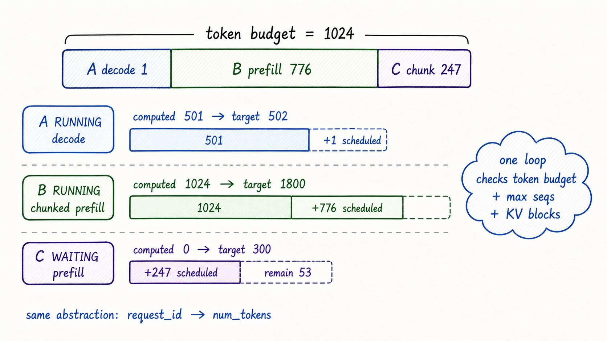

图里的三个请求说明了统一预算模型的好处。A 是 decode，一步只需要 1 个 token；B 是已经在 running 中的 chunked prefill，本轮还差 776 个 token；C 是 waiting 里的新 prefill，完整需求是 300 个 token，但剩余预算只够先推进 247 个 token。Scheduler 的输出不是阶段标签，而是 `{A: 1, B: 776, C: 247}` 这样的本轮推进计划，约束云朵里的 token budget、max seqs、KV blocks 会共同决定这个计划是否成立。

这些预算彼此不是替代关系。`max_num_scheduled_tokens` 解决这一轮算多少 token，`max_num_seqs` 解决这一轮有多少条序列，encoder compute budget 约束多模态或 encoder-decoder 输入，KV block capacity 决定算完后的状态放在哪里，`long_prefill_token_threshold` 则防止长 prompt 在单轮里独占过多预算。真正的 Scheduler 决策发生在这些约束的交汇处。

### 3.1 Running 优先

对 `running` 请求，Scheduler 会计算：

```text
num_new_tokens =
  request.num_tokens_with_spec
  + request.num_output_placeholders
  - request.num_computed_tokens
```

这个公式把普通 decode、chunked prefill、spec decode 和异步调度中的 output placeholders 放到同一个差值模型里。差值大，说明请求还有较多 token 需要追上；差值小，通常就是 decode 阶段的一步。

然后 Scheduler 会做几层裁剪：

1. 不能超过本轮剩余 token budget；
2. 不能超过 `max_model_len - 1 - num_computed_tokens`；
3. 如果设置了长 prefill 阈值，单轮不能超过阈值；
4. 如果有 encoder 输入，还要受 encoder compute/cache 预算影响；
5. 如果是某些 Mamba/hybrid 模型，还可能需要 block-aligned split；

最后才会进入 KV block 分配。注意这个顺序：Scheduler 不是一开始就问显存够不够，而是先把本轮想推进的 token 数算出来，再问 KVCacheManager 这些 token 是否有位置可放。

### 3.2 Waiting 接纳

对 `waiting` 请求，Scheduler 的动作更像 admission control。它要先看 prefix cache 是否命中，必要时还要通过 KV connector 查询外部 KV；然后计算新请求本轮真正需要计算的 token 数。

如果 prefix cache 命中，`num_computed_tokens` 可以大于 0，新请求不一定要从 prompt 第一个 token 开始计算。如果整个 prompt 都命中，vLLM 仍然需要重新计算最后一个 token 来获得 logits，这是很多读者容易忽略的点。Prefix caching 省掉的是大部分历史前缀计算，不是让模型凭空生成下一个 logits。

`waiting` 请求能否进入 `running`，最终仍取决于三件事：

1. running 数量没有超过 `max_num_seqs`；
2. token budget 仍有余额；
3. KVCacheManager 能分配出需要的 block；

如果 waiting 请求因为结构化输出 grammar、远程 KV 加载、多模态 encoder budget 或 LoRA 限制暂时不能调度，它可能被放入 `skipped_waiting`，等待后续步骤重新尝试。这个设计避免了某些暂不可调度的请求把整个 waiting 扫描堵死。需要特别区分的是 KV block 不足：当前源码中 waiting 请求在 `allocate_slots()` 返回 `None` 时通常会停止本轮 waiting 扫描，而不是被放入 `skipped_waiting`，等待后续 step 释放资源后再尝试。

### 3.3 KV Block 分布

`allocate_slots()` 容易被误读成一个简单的显存申请函数。它真正处理的是**一个请求的 token 序列在不同 KV 来源之间如何拼接**，包括已经算过的本地 KV、刚命中的 prefix cache、外部 KV connector 提供的 KV、本轮需要计算的新 token，以及 spec decode 需要预留的 lookahead slots。

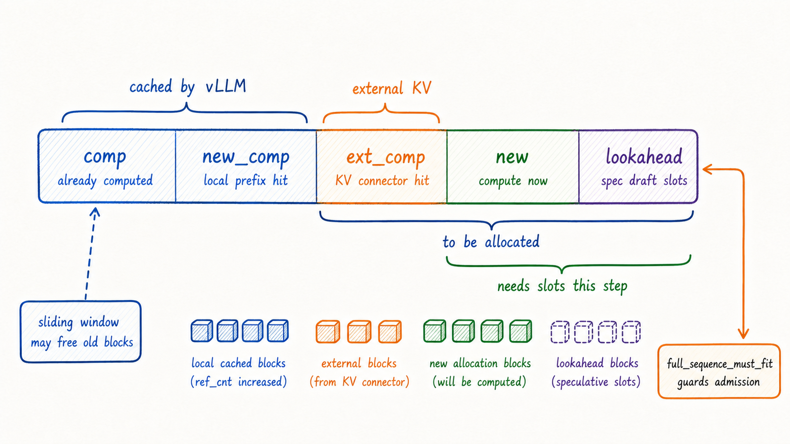

图里的 `comp` 表示请求已经拥有的 computed tokens，它们可能已经对应本地 KV blocks；`new_comp` 是本轮新命中的本地 prefix cache blocks，这部分 KV 已经由 vLLM 管理，只需要把引用和 block table 对齐；`ext_comp` 是外部 KV connector 命中的 tokens，KV 不在 vLLM 本地 cache 里，但 Scheduler 需要把它计入已计算前缀，并为必要的本地 slots 做准备；`new` 是本轮真正要执行模型计算的 tokens；`lookahead` 则是 speculative decoding 预留的 draft slots。

这组分布解释了为什么 KV admission 不能只看本轮新算几个 token。对 chunked prefill 来说，本轮也许只算第一块 chunk，但完整输入最终会占用更多 blocks，`full_sequence_must_fit` 正是为了避免只看第一块就过度接纳请求；对 sliding window 或 chunked-local attention 来说，过旧的 blocks 可能在注意力窗口外被释放，KVCacheManager 会先清理不再需要的旧 blocks，再判断剩余容量；对 KV connector 来说，请求可能已经命中外部 KV，但本地仍然要维护后续计算、缓存和 block table 的一致性。

因此 Scheduler 与 KVCacheManager 的交互不是一句显存够不够，而是一次 admission 计算：已有 KV 能复用多少，外部 KV 需要接入多少，本轮新 token 和 speculative lookahead 要占多少 slots，完整序列是否应该提前验证。理解这张分布图之后，后面的 chunked prefill、prefix cache、spec decode 和 preemption 才能串成同一套机制。

## 4. 策略如何改变同一套循环

前面已经看到一次 `schedule()` 循环的主线：先给 running 请求分配本轮推进量，再接纳 waiting 请求，最后把决策打包成 `SchedulerOutput`。下面这些机制不是新的叙事主线，而是在改变同一套循环里的三个关键点：谁先拿 token budget，谁能通过 admission，谁在压力下被抢占。

vLLM V1 Scheduler 的默认策略是 `fcfs`，也支持 `priority`。表面看，这是队列排序策略；实际影响更广，因为排序会影响谁先拿 token budget、谁先占用 KV block、谁在显存压力下更可能被抢占。

`fcfs` 的优势是简单、稳定、可预期。请求按到达顺序进入 waiting，running 队列也大体保持已有请求优先。对于普通在线 serving，FCFS 能避免过多策略干预带来的尾延迟波动。

`priority` 则允许请求携带优先级，数值越小优先级越高。waiting 队列会按 `(priority, arrival_time)` 排序；当 KV block 不够、需要从 running 中选择牺牲者时，Scheduler 会选择优先级最低的 running 请求。这个策略适合混合业务场景，例如交互式请求优先于后台批处理请求。

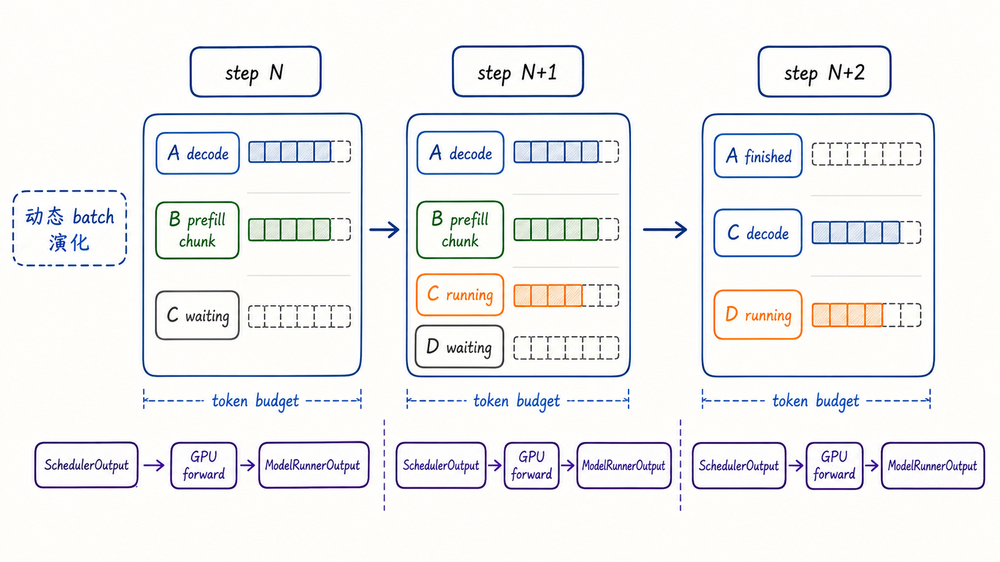

但是优先级不是免费午餐。它改善了高优先级请求的响应，却可能让低优先级长请求反复被抢占，增加重算成本。对于 LLM serving，公平性、吞吐、延迟、显存效率之间没有单一最优点；Scheduler 的价值就在于把这些取舍显式化。

### 4.1 Chunked Prefill

Chunked prefill 解决的是长 prompt 对调度循环的阻塞问题。没有 chunked prefill 时，一个 8K prompt 往往要等到本轮 token budget 足够覆盖完整 prefill 才能进入 batch；即使它被接纳，也可能让后面的 decode 请求在同一轮里拿不到预算。对于在线 serving，这会把长 prompt 的 TTFT 压力传导到其他请求的 ITL 上，表现为某些用户的 token 流突然停顿。

开启 chunked prefill 后，长 prompt 不再是一个不可拆分的大任务，而是变成多个可被 Scheduler 分轮推进的 token chunk。Decode 请求通常先拿走很小的 token 增量，剩余预算再分给部分 prefill；如果短 prompt 或 prefix cache 命中请求刚好能放进剩余预算，也可以插入同一轮执行。这种设计与 Sarathi/Sarathi-Serve 的核心直觉一致：把 compute-bound 的 prefill 切碎，和 memory-bound 的 decode 混合在同一个 batch 里，让 GPU 更少在两种负载之间空转。

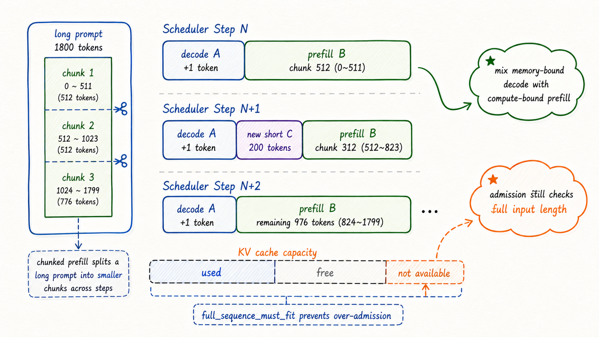

图里的长 prompt 被拆成多个 chunk 后，不同 scheduler step 可以交替安排 decode、短请求和剩余 prefill。这个机制改善的是调度弹性，不是让 prefill 成本消失；长 prompt 的总计算量仍然存在，只是被摊到多个 engine step 中。收益通常体现在两个方向：decode 请求更容易保持稳定 ITL，GPU batch 里也更容易同时包含计算密集和访存密集工作，吞吐与延迟的折中空间变大。

但 chunked prefill 也会带来 admission 风险。如果只检查第一块 chunk 能否放入 KV Cache，调度器可能过度接纳请求，后续 chunk 到来时才发现完整序列无法容纳，系统就会更频繁地抢占和重算。`scheduler_reserve_full_isl` 正是为这个问题服务的：接纳新请求时，可以要求按完整 input sequence length 预检查 KV Cache 是否放得下，而不是只看本轮 chunk。

这里的工程判断是：chunked prefill 提升调度弹性，但不能让接纳策略短视。Scheduler 必须同时看到**本轮能算多少**和**整个请求最终会占多少**，否则短期看起来 batch 更满，长期却可能因为 KV thrashing 把吞吐还给重算成本。

### 4.2 Prefix Cache

Prefix caching 改变的是 waiting 请求的起跑线。对新请求，Scheduler 会让 KVCacheManager 根据 block hash 查找已经计算过的前缀 block。命中后，Scheduler 本轮只需要安排未命中的尾部 token。

这对调度有两个影响。

第一，命中 prefix cache 的请求消耗更少 token budget，因此更容易进入 batch。第二，prefix block 需要被 touch 或增加引用，避免在本请求使用前被其他请求驱逐。也就是说，prefix caching 不只是少算几个 token，它会改变 block 引用计数、free queue、cache map 和请求 block table。

这也是为什么 Scheduler 与 KVCacheManager 必须紧密协作。Scheduler 看见的是 token 预算，KVCacheManager 看见的是 block 账本；两者共同决定一个请求到底是低成本进入 batch，还是因为 block 不足暂缓。

### 4.3 Spec Decode

Speculative decoding 改变的是 Scheduler 对未来 token 的处理方式。普通 decode 每轮通常只推进一个已验证输出 token，KV block 的增长比较直接；spec decode 会先由 draft model 或 proposer 给出若干候选 token，目标模型再验证哪些 token 可以接受。对 Scheduler 来说，这些 draft token 不能当成普通已确认输出，却也不能完全忽略，因为模型执行前就要为它们预留 token budget 和 KV slots。

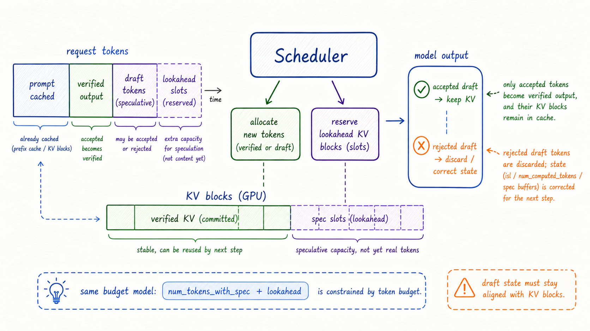

图里可以看到两层状态。绿色部分是已经验证的 output token，它们的 KV 可以稳定留在 cache 中，后续步骤可以继续复用；紫色部分是 draft/lookahead，它们代表 speculative capacity，还不是最终内容。Scheduler 本轮会把 `num_tokens_with_spec` 纳入待推进 token 数，把 `num_lookahead_tokens` 传给 KVCacheManager 预留 slots，并在 `SchedulerOutput` 中记录本轮实际安排的 spec tokens。

模型输出返回后，accepted draft 可以变成 verified output，对应 KV blocks 继续保留；rejected draft 则要丢弃或被真实采样结果替换，Scheduler 需要修正 `num_computed_tokens`、spec buffers、output placeholders 与请求 token 序列。也就是说，spec decode 并没有让 Scheduler 变成另一套调度器，它只是把**可能会被接受的未来 token**纳入同一套 token 与 block 预算模型。

这类设计提高了吞吐潜力，也提高了正确性要求。draft token、output placeholder、KV block 边界和实际采样输出一旦不同步，就可能出现多算、少算、错误复用或流式输出错位。vLLM 围绕 async scheduling、spec decode、PP、structured output 和 KV connector 的大量修复，正是这类复杂组合的工程代价。

这些策略最终都会落到请求状态变化上：某个请求被接纳为 running，某个请求暂时留在 waiting，某个请求因为 KV 压力被 preempted。理解策略之后，下一步就应该看 waiting、running、preempted 和 finished 之间如何流转。

## 5. 状态流转与抢占

Scheduler 最适合用状态机来理解。一个普通请求通常从 `WAITING` 进入 `RUNNING`，生成结束后进入某种 `FINISHED_*` 状态。但真实系统里还有几类中间状态：

1. `WAITING_FOR_STRUCTURED_OUTPUT_GRAMMAR`：结构化输出 grammar 尚未准备好；
2. `WAITING_FOR_REMOTE_KVS`：KV connector 正在异步加载远端 KV；
3. `WAITING_FOR_STREAMING_REQ`：流式输入会话等待下一段输入；
4. `PREEMPTED`：请求曾经运行过，但被释放 KV block 后放回 waiting 队列等待恢复。

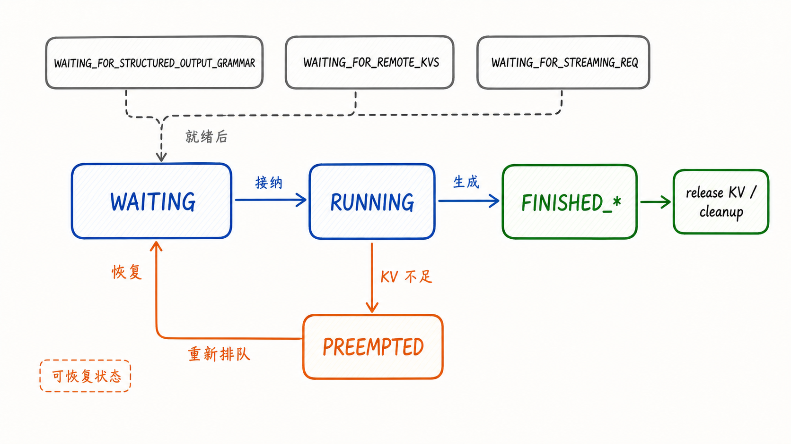

`PREEMPTED` 是本章最容易误解的状态。它不是错误，也不是请求失败，而是 vLLM 在显存压力下保持系统继续前进的一种机制。被抢占的请求会释放 KV blocks，`num_computed_tokens` 被重置为 0，然后被放回 waiting 队列。后续它重新被调度时，可以像新请求一样通过 prefix cache 尽量复用已经缓存的完整 block；如果无法复用，就需要重算。

### 5.1 什么时候触发抢占

抢占发生在 running 请求继续推进时。流程是：

1. Scheduler 正在扫描 `running`；
2. 某个 running 请求本轮需要新增 token；
3. Scheduler 调用 `kv_cache_manager.allocate_slots()`；
4. KVCacheManager 返回 `None`，表示当前 KV blocks 分配条件不满足，常见原因是 free blocks 不足；
5. Scheduler 从 running 集合中选择一个请求抢占，释放它的 KV block；
6. 再次尝试给当前请求分配 slots；
7. 如果被抢占的正是当前请求，说明已经没有可让出的请求，本轮无法继续调度它；

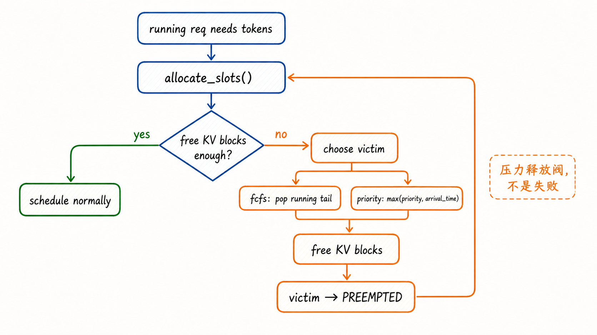

在 `fcfs` 下，Scheduler 默认从 running 尾部弹出请求作为牺牲者。这个行为和 running 列表顺序有关，直觉上更接近让较新的或排在后面的运行请求先让出空间。在 `priority` 下，Scheduler 会选择 `(priority, arrival_time)` 最大的 running 请求，也就是优先级最差、同优先级下更晚到达的请求。

被抢占时，Scheduler 会调用 KVCacheManager 释放请求的 blocks，同时释放 encoder cache，并把请求状态设为 `PREEMPTED`。如果请求上有 spec tokens，也会清空，因为这些 speculative 状态不应该跨抢占直接复用。

### 5.2 重算式抢占与可观测信号

vLLM V1 已经移除了旧的 GPU-CPU KV cache swapping 路径。旧模型里，抢占可以理解成把一部分 KV 从 GPU 换出到 CPU；V1 的主路径更倾向于释放 block，后续通过 prefix cache 或重算恢复。这是一个重要变化。

从系统角度看，swapping 的问题是引入了额外数据搬运、复杂状态和更难预测的延迟。重算式抢占的优势是机制更简单：释放 KV block，回到 waiting，后续重新调度。它把复杂性转移到**如何尽量让重算可控**，例如 prefix cache、chunked prefill、合理 admission、优先级策略和更好的 KV block 管理。

这不是说重算没有代价。被抢占请求如果无法复用 prefix cache，就会损失已经计算过的 prefill 或 decode 状态；抢占越频繁，系统越可能在推进新 token 和重算旧 token 之间浪费算力。因此，抢占应该被理解成压力释放阀，而不是常规优化目标。

从用户体验看，抢占可能拉长某些请求的 inter-token latency 或 time-to-first-token；从指标看，vLLM metrics 会记录 preemption 次数，请求级 prefill time、decode time、inference time 等 interval 也会把期间发生的 preemption 延迟包含进去。metrics 不是把 preemption 简单归因为某个独立阶段，而是让读者能在请求生命周期的时间分解中看到抢占带来的等待成本。

工程上判断抢占是否过多，可以关注：

1. waiting/running 请求数长期高位；
2. KV cache usage 接近上限；
3. preemption 相关日志或指标持续增长；
4. 大量长 prompt 与短交互请求混跑；
5. `max_num_batched_tokens`、`max_num_seqs` 与 GPU KV cache 容量不匹配。

抢占本身不是坏事；抢占频繁才是容量、负载形态或调度参数不匹配的信号。

## 6. 更进一步：异步调度

同步 Scheduler 已经能把 running、waiting、KV budget、token budget 和抢占组织成稳定循环，但它仍然隐含一个限制：CPU 侧调度、输入准备、输出解析和状态更新通常围绕 GPU step 的边界推进。GPU 执行 step N 时，如果 CPU 还在等待输出回来才能准备 step N+1，中间就可能出现 GPU 空泡；负载越复杂，structured output、spec decode、KV connector、PP 等状态越多，这种等待越容易成为新的瓶颈。

异步调度回答的就是这个更进一步的问题：CPU 调度和输入准备能否与 GPU 执行重叠，从而减少 GPU 空泡。同步调度主路径回答每个 engine step 如何决定本轮 batch，异步调度则继续追问下一轮 batch 能不能更早准备好。

异步调度的关键机制是 output placeholder。当请求已经完成 prefill、进入生成阶段时，Scheduler 可以先把未来会产生的输出位置占住，让下一步调度和输入准备提前发生；模型输出返回后，再用真实 sampled token 消费或抵消这些 placeholder，并修正请求状态。这个机制让 CPU 能在 GPU 工作期间继续向前准备，但也要求调度器精确知道哪些占位仍然有效、哪些输出已经过期、哪些 KV slots 对应真实 token。

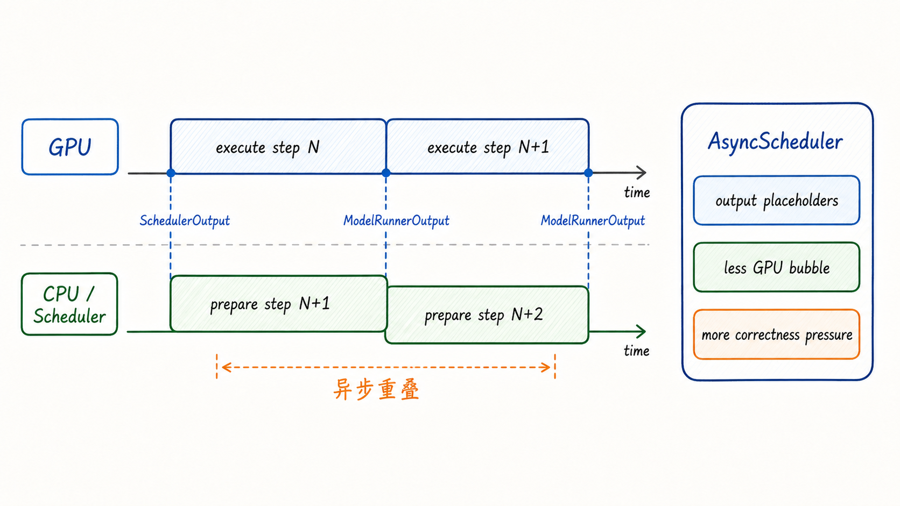

异步调度的核心收益是 overlap：GPU 执行 step N 时，CPU 侧可以准备 step N+1 的调度、输入元数据或部分 worker 状态。vLLM 的 Model Runner V2 设计文档也明确把 async-first 当作方向：减少 CPU-GPU 同步点，避免共享 CPU buffer 被 GPU 异步读取时发生 race condition，并把输入准备、状态更新、采样等路径改造成更适合异步流水的结构。

但 async scheduling 不是简单地把 `schedule()` 放到后台线程。它会牵涉：

1. output placeholder 与真实 sampled token 的一致性；
2. spec decode draft tokens 的占位、接受与拒绝；
3. structured output grammar 是否能在 token 尚未全部回到 CPU 时推进；
4. Pipeline Parallel 的多 batch in-flight；
5. KV connector 异步加载和请求 abort/preemption 的竞态；
6. worker 侧 persistent batch 与 GPU/CPU buffer 的生命周期；

如果请求在异步输出尚未完全回到 CPU 时被 force-preempt，或者 prefix cache 被重置，已经在路上的 async output 还可能变成过期结果，Scheduler 和 worker 侧都必须知道哪些 placeholder 仍然有效、哪些输出需要丢弃。

这也是为什么 vLLM 近几个版本围绕 async scheduling 出现了大量性能优化和 bug fix：它不是一个孤立开关，而是贯穿 Scheduler、ModelRunner、Executor、KV connector、structured output、spec decode 和 PP 的系统级优化。异步调度值得单独成章，因为它不只是改变本轮 batch 如何构造，而是改变 CPU、GPU 和请求状态之间的时间关系。

## 7. 本章小结

Scheduler 的核心不是队列排序，而是把动态请求流压缩成 GPU 可执行 batch。它用统一 token 预算模型处理 prefill、decode、chunked prefill、prefix cache 和 spec decode，用 KVCacheManager 的 block 账本约束 admission，用 waiting/running/preempted/finished 状态维护请求生命周期。

调度循环的第一层判断是 running 优先。已经进入 running 的请求通常拥有 KV block、worker 侧缓存和部分完成状态，继续推进它们能保护 decode 稳定性，也能减少过度接纳新请求导致的 KV 压力。waiting 接纳发生在没有抢占且资源仍有余额时，它更像 admission control：prefix cache、外部 KV、encoder budget、LoRA、结构化输出和 KV block capacity 都可能改变一个请求能否进入本轮计划。

第二层判断是策略改变约束，而不是另起一套调度器。Chunked prefill 把长 prompt 拆成可调度块，prefix cache 改变 waiting 请求的起跑线，spec decode 把未来可能接受的 draft tokens 纳入预算，priority policy 改变谁先拿预算以及谁在压力下让位。这些机制最终都落到同一个问题：本轮哪些 token 前进，前进后 KV 状态是否仍然一致。

第三层判断是抢占与异步都不是免费优化。抢占释放 KV block，让系统在压力下继续前进，但频繁抢占会把算力浪费在重算上；异步调度减少 GPU 空泡，却把 output placeholder、spec token、KV connector、structured output 和 PP 的一致性问题推到系统层。Scheduler 的难点就在这里：它要在吞吐、延迟、公平性、显存压力和正确性之间不断做局部最优决策。

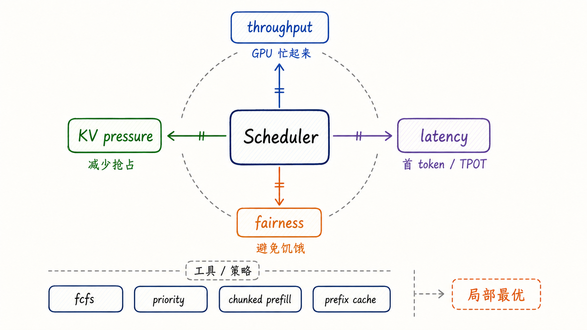

本章最后用一个心智模型收束：Scheduler 是 vLLM 中把**请求流**压成**GPU 可执行 batch**的地方。它不是单纯公平队列，也不是单纯显存分配器，而是在吞吐、延迟、公平性和显存压力之间不断做局部最优决策的运行时控制器。

如果只记住一句话，可以这样理解：

> KVCacheManager 让 token 有地方住，Scheduler 决定哪些 token 现在该往前走。

这句话也解释了前后两章的关系。KVCacheManager 解决的是状态承载，Scheduler 解决的是状态推进。前者把显存变成可复用账本，后者把动态请求变成连续不断的执行计划。两者合在一起，才是 vLLM 能把高并发 LLM serving 做成高吞吐系统的关键。

## 参考资料

1. vLLM 本地源码快照：`code/opensource/vllm`，`main@52a31ccec`，重点文件包括 `vllm/v1/core/sched/scheduler.py`、`vllm/v1/core/sched/async_scheduler.py`、`vllm/v1/core/kv_cache_manager.py`、`vllm/v1/engine/core.py`、`vllm/config/scheduler.py`；
2. vLLM 文档：`docs/usage/v1_guide.md`，关于 V1 unified scheduler、chunked prefill、priority scheduling 与 removed swapping 的说明；
3. vLLM 文档：`docs/design/arch_overview.md`，关于 EngineCore、Scheduler、KV cache 与 worker 进程边界的说明；
4. vLLM 文档：`docs/design/prefix_caching.md`，关于 scheduler 与 KVCacheManager 在 prefix cache/block allocation 中的协作；
5. vLLM 文档：`docs/design/model_runner_v2.md`，关于 async-first、persistent batch 与异步调度压力的设计说明；
6. vLLM Blog，[vLLM V1: A Major Upgrade to vLLM's Core Architecture](https://blog.vllm.ai/2025/01/27/v1-alpha-release.html)，2025-01-27；
7. vLLM Blog，[Inside vLLM: Anatomy of a High-Throughput LLM Inference System](https://blog.vllm.ai/2025/09/05/anatomy-of-vllm.html)，2025-09-05；
8. Woosuk Kwon et al.，[Efficient Memory Management for Large Language Model Serving with PagedAttention](https://arxiv.org/abs/2309.06180)，arXiv；
9. Gyeong-In Yu et al.，[Orca: A Distributed Serving System for Transformer-Based Generative Models](https://www.usenix.org/conference/osdi22/presentation/yu)，OSDI 2022；
10. Amey Agrawal et al.，[SARATHI: Efficient LLM Inference by Piggybacking Decodes with Chunked Prefills](https://arxiv.org/abs/2308.16369)，arXiv；
11. Amey Agrawal et al.，[Taming Throughput-Latency Tradeoff in LLM Inference with Sarathi-Serve](https://arxiv.org/abs/2403.02310)，arXiv；
12. Yinmin Zhong et al.，[DistServe: Disaggregating Prefill and Decoding for Goodput-optimized Large Language Model Serving](https://arxiv.org/abs/2401.09670)，arXiv；
13. vLLM GitHub Issue，[Async Scheduling Plan #27679](https://github.com/vllm-project/vllm/issues/27679)，用于后续异步调度专题复查；
14. vLLM GitHub PR，[Enable async scheduling by default #27614](https://github.com/vllm-project/vllm/pull/27614)，用于后续异步调度专题复查；
15. vLLM GitHub PR，[Fully support async scheduling + PP #32618](https://github.com/vllm-project/vllm/pull/32618)，用于后续异步调度专题复查。

## 学习测评

### 题目

1. vLLM V1 Scheduler 的统一调度抽象，最核心可以概括为什么？
   A. 一个固定 batch size；
   B. 一个 `{request_id: num_tokens}` 形式的本轮 token 推进计划；
   C. 一个完整的 GPU KV tensor；
   D. 一个 tokenizer 输出列表；

2. 为什么说 vLLM V1 Scheduler 不严格区分 Prefill 阶段和 Decode 阶段？
   A. 因为 Prefill 和 Decode 在数学上完全相同；
   B. 因为 V1 只支持 Decode；
   C. 因为 Scheduler 统一使用已计算 token 与目标 token 的差值来决定本轮推进量；
   D. 因为所有请求都会被强制拆成 1 token 一步；

3. `running` 请求通常会优先于 `waiting` 请求被调度，主要原因是什么？
   A. running 请求已经占有运行时状态和 KV block，继续推进通常更稳定；
   B. waiting 请求一定没有 prompt tokens；
   C. running 请求一定比 waiting 请求优先级高；
   D. waiting 请求不能使用 prefix cache；

4. 当 `kv_cache_manager.allocate_slots()` 返回 `None` 时，通常意味着什么？
   A. 该请求已经自然结束；
   B. tokenizer 输出为空；
   C. KV block 分配条件不满足，可能是本轮 slots 或完整序列 admission 容量不足；
   D. prefix cache 命中后不需要再检查 KV block；

5. 关于 `PREEMPTED` 状态，下列哪项说法正确？
   A. 请求失败并需要返回错误；
   B. 请求释放 KV block 后回到等待队列，后续可以重新被调度；
   C. 请求会继续占用原来的全部 KV block；
   D. 请求会跳过输出校验直接结束；

6. 在 `priority` 策略下，KV block 压力导致抢占时，Scheduler 倾向选择什么请求作为牺牲者？
   A. 优先级最高且最早到达的 running 请求；
   B. 优先级最低、同优先级下更晚到达的 running 请求；
   C. waiting 队列中最新的请求；
   D. prompt 最短的请求；

7. Chunked prefill 的主要价值是什么？
   A. 删除 Prefill 阶段；
   B. 让长 prompt 可以分轮推进，避免一次性独占过多 token budget；
   C. 让所有请求都只生成一个 token；
   D. 让 KV Cache 不再需要 block；

8. 为什么 `scheduler_reserve_full_isl` 对 chunked prefill 场景重要？
   A. 它负责把 token 转成字符串；
   B. 它让 Scheduler 在接纳请求时考虑完整输入长度是否能放入 KV Cache，减少过度接纳；
   C. 它会关闭 prefix caching；
   D. 它只检查当前 chunk 是否能放入 KV Cache，不关心完整输入长度；

9. Prefix caching 对 Scheduler 的直接影响是什么？
   A. 命中前缀可以减少本轮需要计算的 token 数；
   B. 命中前缀会让请求无法进入 running；
   C. 命中前缀会禁用 KVCacheManager；
   D. 命中前缀只影响输出文本格式；

10. 为什么 async scheduling 不只是把 `schedule()` 放到后台线程？
    A. 因为它需要 output placeholders、CPU/GPU overlap、worker/model runner 状态推进，以及 spec decode、PP、KV connector 等路径的一致性；
    B. 因为它只影响日志输出，不影响执行路径；
    C. 因为它完全绕过 KVCacheManager，所以没有状态同步问题；
    D. 因为它会强制关闭 SchedulerOutput；

11. 下列哪项最准确描述 Scheduler 与 KVCacheManager 的关系？
    A. Scheduler 直接读写 GPU KV tensor，KVCacheManager 只负责日志；
    B. Scheduler 决定本轮推进哪些 token，KVCacheManager 判断并分配这些 token 所需的 KV blocks；
    C. KVCacheManager 决定 HTTP 请求路由，Scheduler 负责 tokenizer；
    D. 二者没有运行时交互；

12. 如果一个服务中 preemption 指标持续升高，最合理的初步判断是什么？
    A. 应该无条件调大 `max_num_seqs`；
    B. 说明 prefix caching 一定失效；
    C. 系统可能存在 KV 容量、请求长度分布、batch 参数或优先级策略不匹配；
    D. 应该无条件关闭 chunked prefill；

13. 【多选】下列哪些情况可能导致 waiting 请求本轮暂时不能进入 running？
    A. `max_num_seqs` 已达到上限；
    B. KV block 无法满足本轮或完整序列 admission 检查；
    C. 远程 KV 仍在异步加载；
    D. Scheduler 已经完成 tokenizer；

14. 【多选】关于抢占后的恢复，下列哪些说法正确？
    A. 被抢占请求会释放 KV blocks；
    B. `num_computed_tokens` 会被重置；
    C. 后续恢复一定不需要重算；
    D. prefix cache 可能减少恢复时的重算成本；

15. 【多选】AsyncScheduler 中 output placeholders 带来的复杂性包括哪些？
    A. 真实输出回来后需要修正 placeholder 数量；
    B. force-preemption 后可能需要丢弃过期的 in-flight async output；
    C. 它完全绕过 KVCacheManager；
    D. structured output、spec decode、PP 等路径需要额外兼容；

### 答案与解析

1. B。这不是 `SchedulerOutput` 的全部字段，而是理解 V1 unified scheduler 的核心心智模型：每轮先决定每个请求推进多少 token，worker 侧再根据完整结构化信息准备模型输入；

2. C。V1 使用 `num_computed_tokens` 与当前目标 token 数之间的差值来统一处理 prefill、decode、chunked prefill 与 spec decode；

3. A。running 请求已经拥有运行时状态、block table 和 worker 侧缓存，继续推进它们通常比盲目接纳新请求更稳定；

4. C。`allocate_slots()` 返回 `None` 的关键含义是 KV block 分配条件不满足，可能是 free blocks 不足，也可能是 waiting admission 场景下完整输入长度预检查不通过；Scheduler 可能因此触发抢占、停止 waiting 扫描或暂缓调度；

5. B。`PREEMPTED` 是可恢复状态。请求释放 KV block 后回到 waiting 队列，后续重新调度时可能通过 prefix cache 或重算恢复；

6. B。priority 策略下，源码选择 `(priority, arrival_time)` 最大的 running 请求作为抢占对象，即数值更大的低优先级请求，同优先级下更晚到达者更容易被抢占；

7. B。Chunked prefill 把长 prompt 拆成多轮推进，使短请求有机会插入，改善调度弹性和延迟；

8. B。只检查第一块 chunk 会导致过度接纳，`scheduler_reserve_full_isl` 让接纳阶段考虑完整输入长度，从而降低后续 KV thrashing 和抢占风险；

9. A。Prefix cache 命中会提高 `num_computed_tokens`，减少本轮需要真正计算的 token 数，也会改变 block 引用与缓存状态；

10. A。Async scheduling 是系统级优化，不只是调度函数换一个线程。它需要 output placeholders 与真实 sampled token 对齐，还要处理 CPU/GPU overlap、worker/model runner 状态推进、spec decode、structured output、KV connector 和 PP 等组合路径；

11. B。Scheduler 是决策者，KVCacheManager 是 KV block 账本和分配者。Scheduler 只有在 KVCacheManager 允许分配时，才能把请求推进到本轮执行计划里；

12. C。Preemption 持续升高通常说明资源压力或参数策略不匹配。它未必是错误，但值得检查 KV cache usage、请求长度分布、`max_num_batched_tokens`、`max_num_seqs` 和优先级配置；

13. A、B、C。waiting 请求不能进入 running，可能是活跃序列数达到上限，也可能是 KV block admission 不满足，还可能是远程 KV 加载、grammar、encoder budget、LoRA 等条件暂时没有满足；tokenizer 完成并不会阻止调度；

14. A、B、D。被抢占请求会释放 KV blocks，状态变为 `PREEMPTED` 并回到 waiting 队列，`num_computed_tokens` 会被重置。恢复时可能通过 prefix cache 降低重算成本，但不能保证完全不重算；

15. A、B、D。output placeholders 让 Scheduler 可以提前推进状态，但真实输出回来后必须修正数量；强制抢占或 reset cache 可能产生过期 in-flight 输出；structured output、spec decode 和 PP 等路径也需要额外兼容。它并不会绕过 KVCacheManager。
