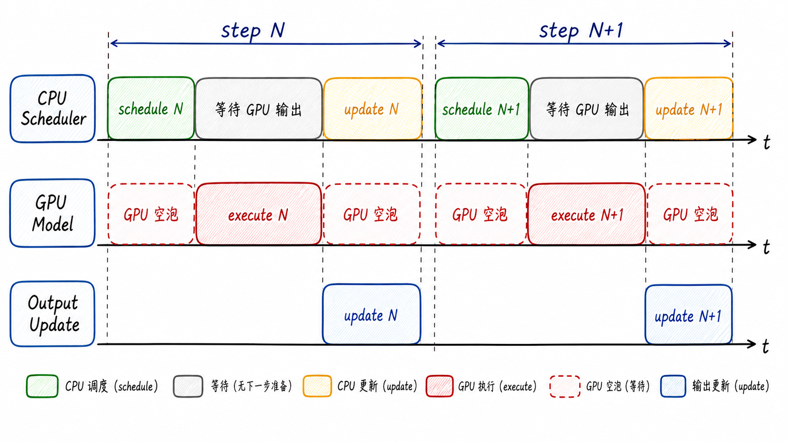
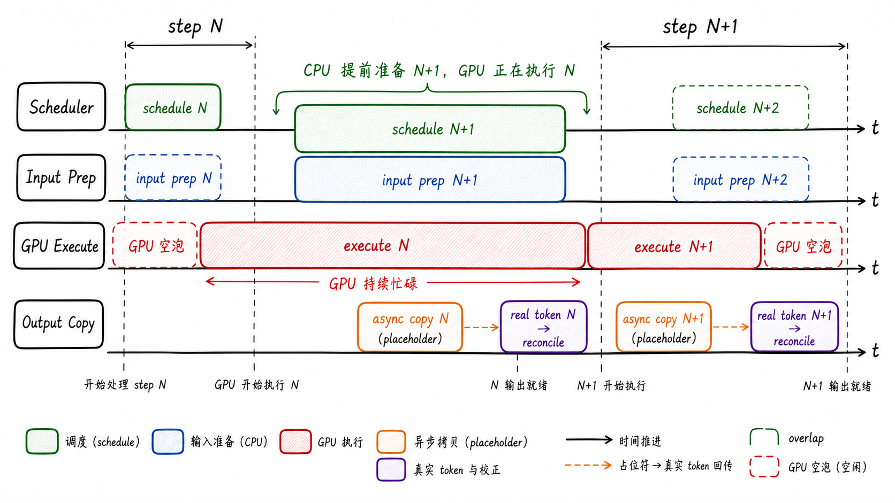
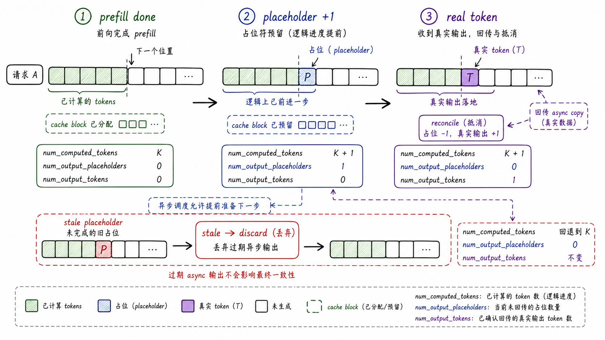
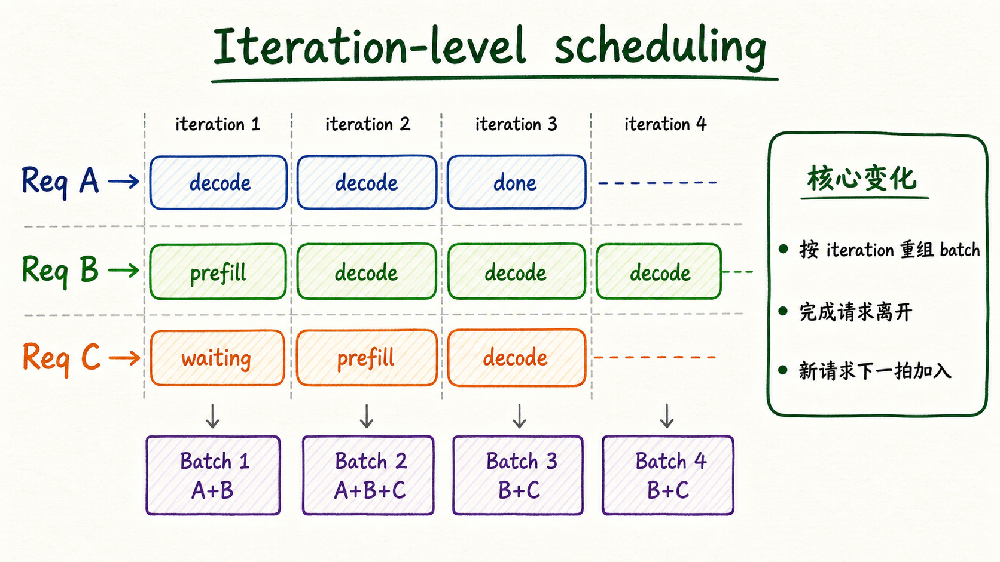
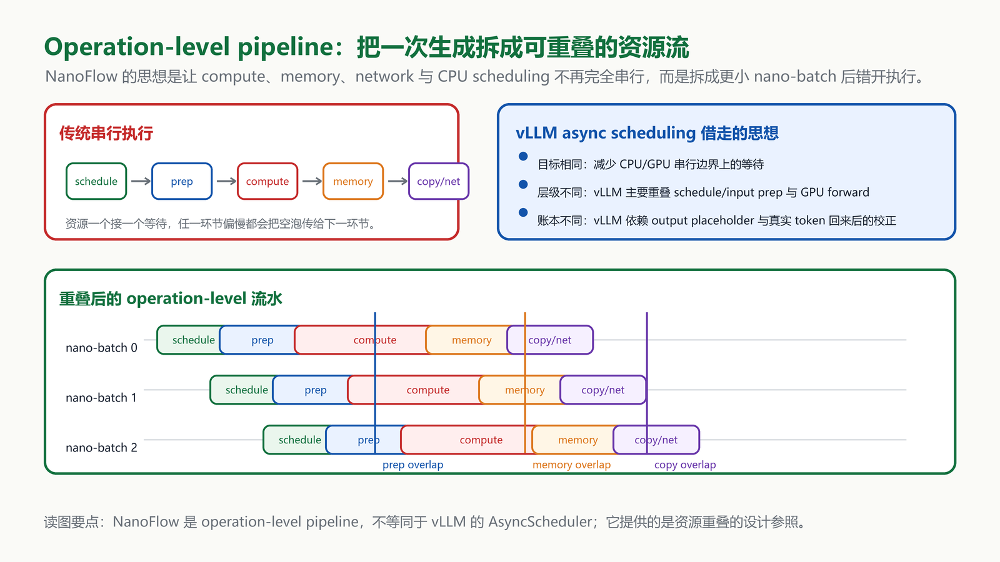
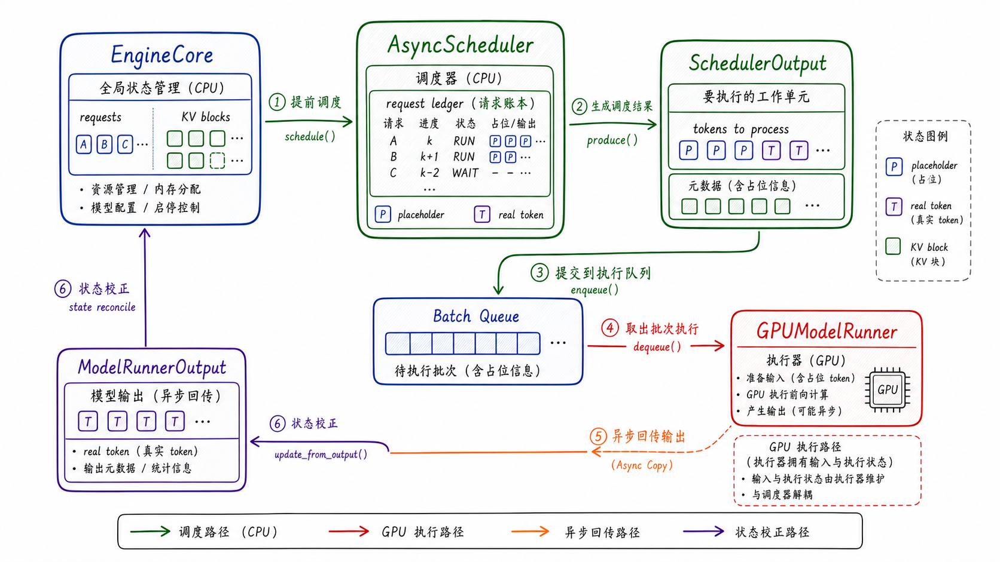
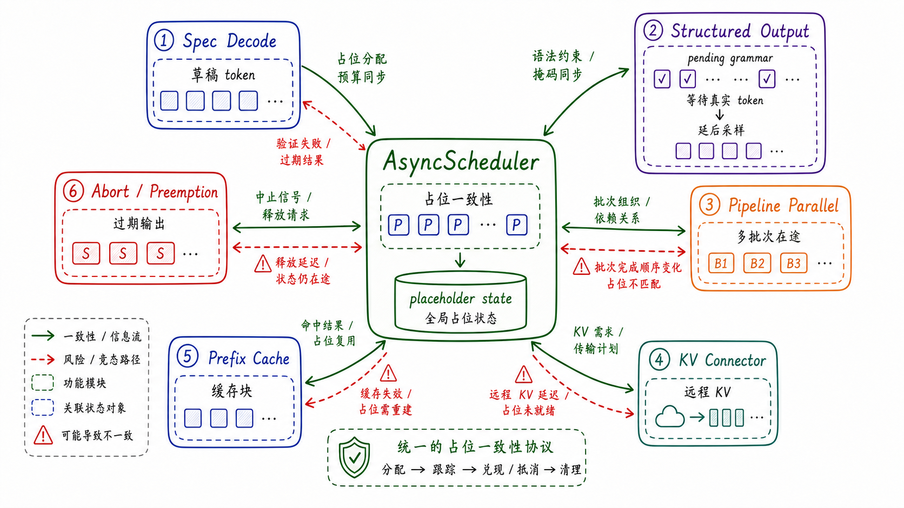
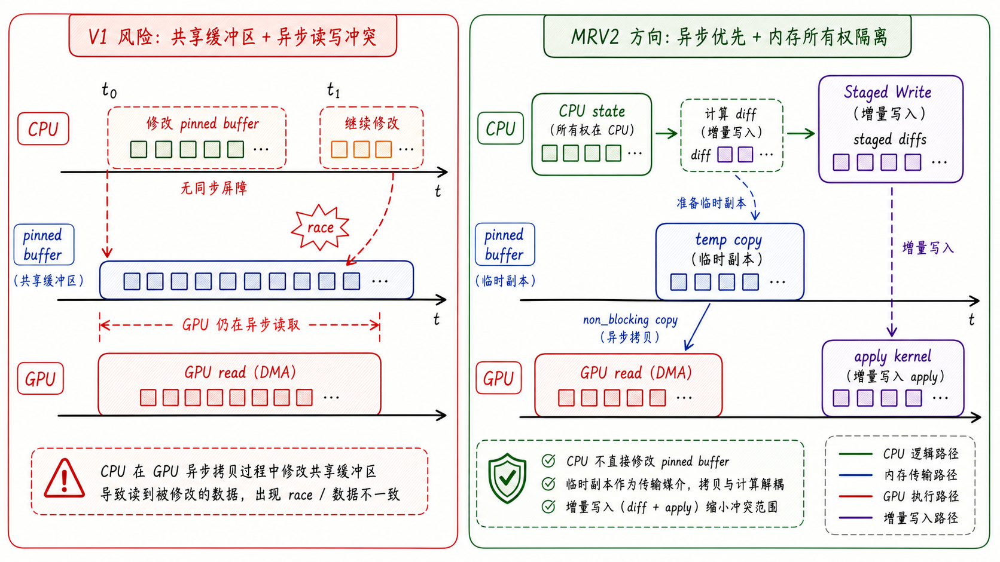
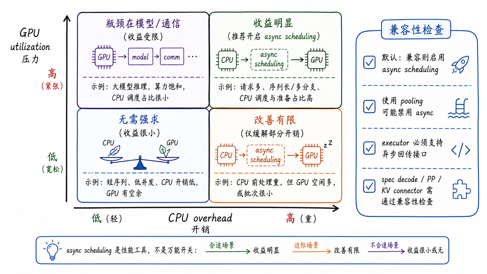

---
tags:
  - vllm
  - llm-inference
  - inference-engine
  - scheduler
  - async-scheduling
updated: 2026-06-10
description: 本文解释 vLLM 异步调度如何把 CPU 调度、输入准备、GPU 执行与输出回传重叠成流水线，并分析其与 spec decode、structured output、PP、KV connector 等机制的系统边界。
---
# 06 让调度跑在前面：vLLM Async Scheduling

上一篇详细拆解了 vLLM Scheduler 的主循环：它不是简单请求队列，而是每个 engine step 的吞吐指挥系统，决定 running 请求继续推进多少 token、waiting 请求能否被接纳、KV Cache 是否还有 block，以及资源压力出现时谁需要被抢占。

在这个基础上，async scheduling 继续追问一个更尖锐的问题：普通 Scheduler 已经能回答**本轮 batch 怎么组成**，但当 GPU 正在执行这个 batch 时，CPU 能不能提前准备下一轮 batch，从而减少 GPU 等待调度、输入准备和输出更新的空泡。

vLLM 的 async scheduling 初版由 [PR #19970](https://github.com/vllm-project/vllm/pull/19970) 引入，PR 描述明确把它和 [NanoFlow: Towards Optimal Large Language Model Serving Throughput](https://arxiv.org/abs/2408.12757) 论文中的资源重叠思想放在一起：调度器一拍提前运行，让 scheduling 与 model execution 尽量重叠。NanoFlow 论文讨论的是更细粒度的 operation-level pipeline，不等同于 vLLM 的具体实现，但它提供了理解异步调度的关键背景，推荐读者抽空读原论文，通常会比只看 PR 或源码得到更完整的系统视角。

这不是把 `schedule()` 丢到后台线程的小改动。异步调度要让调度逻辑先 GPU 一步，就必须先给未来输出预留逻辑位置，再等真实 token 回来后校正状态，它会牵动 output placeholder、spec decode、structured output、Pipeline Parallel、KV connector、prefix cache、abort/preemption 和 ModelRunner 输入准备等一整条链路。

## 1. 同步调度的问题

先回到最普通的 EngineCore step。同步路径可以压缩成一个顺序链：

```text
schedule() -> execute_model() -> sample/output -> update_from_output()
```

这个链条足够清晰，也足够可靠。Scheduler 先根据请求状态、token budget、KV block 和各种约束生成 `SchedulerOutput`，ModelRunner 再把它变成 GPU 输入并执行模型，输出回到 CPU 后，Scheduler 才更新请求状态、释放或缓存 block、处理停止条件。

问题在于，这条链天然把 CPU 工作和 GPU 工作串行化。即使 GPU 上一步已经执行完，它也要等待 CPU 完成下一轮 schedule、输入准备和状态更新；反过来，CPU 在 GPU 执行期间也没有持续把下一步准备好。



可以用一个粗略成本模型理解这个问题：

```text
T_sync_step =
  T_schedule
+ T_input_prepare
+ T_gpu_execute
+ T_output_copy
+ T_update
```

这个模型里的每一项都对应一个真实的系统动作。

| 成本项 | 含义 |
| --- | --- |
| `T_schedule` | Scheduler 扫描 running/waiting 请求、计算 token budget、申请 KV block、处理抢占并构造 `SchedulerOutput`； |
| `T_input_prepare` | ModelRunner 把调度结果展开成 input ids、positions、block table、sampling metadata 等模型输入 tensor； |
| `T_gpu_execute` | GPU 执行 forward、attention、MLP、sampling 相关计算； |
| `T_output_copy` | sampled token、logprobs、routed experts 等结果从 device 回到 CPU 可见状态； |
| `T_update` | Scheduler 根据真实输出推进 request state、停止条件、KV cache 和统计信息； |

同步调度下，这些部分在同一个 step 内大体相加，因为下一段工作通常依赖上一段产物：没有 `SchedulerOutput` 就无法准备输入，没有输入 tensor 就无法执行 GPU forward，没有真实输出就无法更新请求状态。GPU 真正忙碌的部分主要是 `T_gpu_execute`，如果 CPU 侧调度、输入元数据准备、采样约束、KV connector 元数据、structured output grammar、logprobs、请求增删等工作越来越重，每个 step 前后都会出现额外等待。GPU 利用率不只由矩阵乘法决定，也取决于 engine loop 能否持续喂饱 GPU。

这个问题在几类场景中尤其明显：

1. 模型或 batch 较小，单步 GPU 执行时间不够长，CPU overhead 更容易暴露；
2. 并发请求多，每一步都要更新大量 request state、block table、sampling metadata；
3. mixed prefill/decode、chunked prefill、spec decode、structured output 同时存在，调度器需要维护更多中间状态；
4. PP、DP、KV connector、remote KV load 等机制让**本轮输出什么时候真正可用**变得不再简单；
5. 服务端追求低 TPOT 和高 GPU utilization，不能接受 GPU 在每个 token step 之间反复等待。

但是，同步调度本身不是错误设计。它是最容易保证状态一致性的设计：每一步都等真实输出回来，再决定下一步。但当 vLLM 把 continuous batching、PagedAttention、prefix caching、speculative decoding 等机制叠起来后，新的瓶颈开始浮现：**调度器足够聪明了，但调度器还不够提前**。

## 2. 异步调度的核心思想

Async scheduling 的核心思想在于：**一拍提前**。GPU 执行 step N 时，CPU 侧已经开始准备 step N+1。为了做到这一点，Scheduler 必须在真实 token 还没回到 CPU 时，先让请求的逻辑进度继续向前走一步。



更具体地说，异步调度把单步成本从纯串行链改造成近似流水线：

```text
同步：
  CPU 准备 N -> GPU 执行 N -> CPU 更新 N -> CPU 准备 N+1 -> GPU 执行 N+1

异步：
  CPU 准备 N -> GPU 执行 N
                CPU 准备 N+1 -> GPU 执行 N+1
                输出 N 异步回传 -> CPU 校正 N
```

如果 CPU 准备时间能够被 GPU 执行时间覆盖，那么 step 间空泡会显著下降。真实系统里不会完全等于理想流水线，因为输出回传、sampling、grammar、PP 队列、KV connector 和 preemption 都可能引入残余等待；但只要原本的瓶颈来自 CPU/GPU 串行边界，overlap 就有价值。

关键是：异步调度不是提前**伪造 token**。它提前预留的是**逻辑位置**，而不是提前向用户返回未确认 token。这个逻辑位置在源码里体现为 output placeholder。

可以把 placeholder 理解成一张欠条：

```text
Scheduler: 我假设这个请求下一步会生成一个 token，所以先把位置占住；
ModelRunner: GPU 执行后把真实 token 异步拷回 CPU；
Scheduler: 真实 token 回来后，把欠条抵消，写入真实输出；
异常路径: 如果请求被 abort、preempt 或 cache reset，过期输出要被丢弃。
```



这张欠条机制解释了 async scheduling 的两个本质难点。

第一，调度器必须维护**逻辑进度**和**真实输出**之间的差异。`num_computed_tokens` 可以为了下一轮调度先前进，但 `num_output_tokens` 只有真实 token 回来后才能增加。`num_output_placeholders` 就是在这两者之间做账。

第二，异步输出可能过期。请求在 GPU 执行期间可能被 abort，`reset_prefix_cache(reset_running_requests=True)`、force-preempt、`pause_generation(clear_cache=True)` 这类路径也可能改变请求有效历史，让在途 async output 不再对应当前请求状态。spec decode 可能拒绝部分 draft token，structured output 可能需要根据真实 token 推进 grammar。于是异步调度的难点不是**提前一步**本身，而是**提前一步以后如何把账算平**。

## 3. 从 iteration-level batching 到 async-first

异步调度不是凭空出现的，它承接了三类问题：LLM serving 的 batch 边界应该多细、动态 KV 如何让 batch 足够灵活、CPU/GPU/通信资源能否从串行链条变成重叠流水。这三类问题的线索如下：

1. Orca 是 OSDI 2022 的 Transformer 生成模型 serving 系统，它提出的关键设计是 iteration-level scheduling：请求不必等整个序列完成才释放 batch 位置，已经完成的请求可以离开，新到达的请求可以在下一次 decode iteration 加入，长短不一的输出不会被固定 request-level batch 卡死。对 vLLM 来说，这条线索贡献的是**每个 iteration 都可以重新组织 batch**的 serving 调度模型。



2. PagedAttention 把 KV cache 管理变成 block/page 式的内存管理问题，让 continuous batching 可以更积极地接纳请求，而不会被连续显存分配和内部碎片拖垮。于是 vLLM 的吞吐优化从**如何组 batch**进一步变成**如何在动态请求、动态 KV、动态输出长度下持续保持 GPU 忙碌**。这条线索让 async scheduling 有了可操作的资源账本：提前调度下一步之前，Scheduler 必须知道 KV block、computed tokens 和请求状态是否还能自洽。

3. NanoFlow 是一篇 LLM serving 系统论文，它的核心问题是：一次 LLM 生成并不只有 GPU compute，还包含 memory、network、CPU scheduling、input preparation 等异构操作，如果这些操作在单设备内严格串行，GPU、显存带宽、通信链路和 CPU 都会轮流等待。NanoFlow 的做法是把输入拆成更小的 nano-batch，并把 compute、memory、network 等操作错开执行，形成 operation-level pipeline。vLLM async scheduling 不等同于 NanoFlow，前者主要重叠 Scheduler/Worker 输入准备与 GPU forward，后者更细地重叠设备内部异构操作；二者共享的是**把资源等待变成可覆盖时间**的设计思想。



因此，vLLM async scheduling 的关键设计决策可以从原因而不是历史顺序来理解：

1. `AsyncScheduler` 继承普通 `Scheduler`，因为 token budget、running/waiting 队列、KV admission、preemption 这些核心调度语义没有改变，真正新增的是未来输出位置的账本；
2. 引入 output placeholder，因为 CPU 准备 step N+1 时还不知道 step N 的真实 token，只能先预留逻辑位置，等 async output 回来后再把占位抵消；
3. 对 spec decode、structured output、PP、KV connector 等组合逐步补兼容，因为这些机制都要求**真实 token 可见性**、**请求状态所有权**或**KV block 生命周期**有明确边界；
4. 引入 batch queue 与 executor 并发能力判断，因为 Pipeline Parallel 和多 batch in-flight 需要一个缓冲层，否则调度提前了也难以填平 pipeline stage 之间的空泡；
5. 默认启用与显式启用采用不同策略，因为 `async_scheduling=None` 可以根据兼容条件自动启用或禁用，而用户显式开启时，不兼容组合应该 hard fail，避免系统悄悄退回同步路径；

这些决策共同说明 async scheduling 的真实难度不在第一版 `AsyncScheduler`，而在后续兼容性：当更多功能都希望与**下一步提前准备**并存时，系统必须明确谁拥有状态、谁能提前、谁必须等待真实输出。

## 4. AsyncScheduler 如何保持一致性

从源码结构看，`AsyncScheduler` 继承普通 `Scheduler`。这意味着它没有推翻上一章讲过的 token budget、running/waiting 队列、KV block admission、抢占、prefix cache 等主逻辑；它是在普通调度循环的状态推进路径上增加了 placeholder 账本。

本地源码中的配置入口也很直接：`SchedulerConfig.get_scheduler_cls()` 会在 `async_scheduling` 为真时选择 `vllm.v1.core.sched.async_scheduler.AsyncScheduler`，否则选择普通 `Scheduler`。`VllmConfig` 还会根据 executor、pooling model、spec decode 方法等条件决定默认启用、禁用或显式报错。

### 4.1 四层边界

理解 async scheduling 最好不要从某个函数逐行开始，而要先分清四层边界。

第一层在 Scheduler 侧。它维护请求的逻辑状态：哪些 token 已经被认为 computed，哪些输出位置只是 placeholder，哪些 KV block 已经分配、缓存或需要释放。这里的状态决定下一次 `schedule()` 能不能继续推进请求。

第二层在 ModelRunner 侧。Worker 不想每一步从零构造全部输入，所以它维护 persistent batch、block table、token ids、sampling metadata 等 GPU 输入相关状态。异步调度下，ModelRunner 可能还没把上一步真实 token 完整回传给 CPU，就要准备下一步输入，因此它必须知道哪些 token 是占位、哪些 token 已经确认。

第三层在 GPU-side tensors 侧。普通 async decode 中，Scheduler 的 placeholder 账本仍是逻辑主线；但在 zero-bubble async spec decode 这类路径里，draft token 的接受/拒绝、有效 sampled token 数等中间事实会先在 GPU 侧形成，再回头修正 Scheduler 和 ModelRunner 状态。这里不能简单说 **Scheduler 永远拥有全部真相**。

第四层在 async output 侧。GPU 产生的 sampled token、logprobs、routed experts 等输出可以异步从 device 拷回 CPU。这个回传不是立刻阻塞主路径，而是在真正需要 `ModelRunnerOutput` 时再同步。



这四层边界共同保证一个原则：**逻辑调度、执行状态、GPU 临时事实和 CPU 可见输出必须能最终对齐**。任何异步优化都不能只追求提前一拍，而忘记最后要把 placeholder、真实 token、KV block 和 grammar 状态重新合账。

用一个请求 A 串起来看，会更直观。step N 完成 prefill 后，AsyncScheduler 为 A 的下一个 decode 位置放入 placeholder；GPU 还在执行 N 时，CPU 根据这个占位状态准备 N+1；真实 token 回来后，placeholder 被抵消并写入输出。如果同时启用 spec decode，被拒绝的 draft token 还要把 `num_computed_tokens` 与 placeholder 数量往回修正；如果 reset prefix cache 触发 force-preempt，旧的 in-flight output frame 则必须丢弃。

请求 A 的故事到这里结束，后面的几个小节只是把这条故事线分别投影到 placeholder、batch queue、grammar 和 KV connector 上。

### 4.2 placeholder 的更新路径

普通 Scheduler 在 `_update_after_schedule()` 中会推进 `num_computed_tokens`。AsyncScheduler 在此基础上多做一步：对已经过 prefill、进入生成阶段的请求，增加 output placeholder。

简化后的状态变化可以写成：

```text
schedule 前：
  num_computed_tokens = K
  num_output_tokens = M
  num_output_placeholders = 0

schedule 后：
  num_computed_tokens = K + 1
  num_output_tokens = M
  num_output_placeholders = 1

真实 token 回来后：
  num_computed_tokens = K + 1
  num_output_tokens = M + 1
  num_output_placeholders = 0
```

如果使用 spec decode，placeholder 不只是一个 next token，还要包括 draft/spec token 的未来位置。AsyncScheduler 会把当前 step 可能产生的 `1 + num_spec_tokens` 计入 placeholder，并把 spec token ids 先设成占位值；真实输出回来后，再根据接受/拒绝情况修正 `num_computed_tokens` 与 `num_output_placeholders`。

这也是为什么 async scheduling 与 spec decode 的组合需要专门优化。spec decode 本来就有**先猜多个 token，再验证接受多少**的语义，async scheduling 又有**先占位，再等真实输出**的语义。两个 optimistic 机制叠在一起，如果没有严密账本，就会出现 token 多算、少算、回滚错误或 grammar 状态错位。

### 4.3 batch queue 与 in-flight batch

在 EngineCore 里，batch queue 是一个保存**已调度但尚未完成合账的 batch**的缓冲队列。每个队列元素大致包含三类东西：这个 batch 的 `SchedulerOutput`、提交给 model executor 后返回的 future，以及必要时用于追踪 `execute_model()` 是否失败的 future。它不是普通请求队列，里面放的不是 request，而是已经被 Scheduler 组织好的执行计划。

in-flight batch 指的是已经非阻塞提交给 executor、但它的真实输出还没有被 `scheduler.update_from_output()` 消费的 batch。一个 batch 进入 in-flight 状态后，GPU 或 pipeline stage 可能正在执行它，CPU 侧则可以继续尝试调度后续 batch。这个结构可以用下面的状态图理解：

```text
schedule batch N
  -> execute_model(batch N, non_block=True)
  -> batch N 进入 batch_queue，成为 in-flight batch

如果 batch_queue 未满：
  继续 schedule batch N+1，并非阻塞提交给 executor

如果 batch_queue 已满，或没有新请求可调度：
  等最早的 in-flight batch 输出返回
  -> update_from_output()
  -> 消费 placeholder，校正 request state
```

不是所有 async scheduling 都天然有多个 batch in-flight。`step_with_batch_queue()` 只有在 executor 暴露的并发 batch 能力允许时才会成为主路径，队列容量来自 `max_concurrent_batches`。对 Pipeline Parallel 尤其关键：PP 本来就希望不同 microbatch 或 batch 在不同 pipeline stage 上错开执行，如果 async scheduling 能让调度和输入准备提前进入队列，就更容易减少 stage 间等待。

batch queue 也放大了状态一致性要求。请求可能已经出现在 batch N 中，真实输出还在路上；batch N+1 又可能基于 placeholder 状态继续推进同一个请求。于是 abort、preemption、KV block free、PP sampled token broadcast、structured output grammar 都必须能判断**这个 batch 的输出还有效吗**。如果请求有效历史已经变化，旧的 in-flight output frame 必须被丢弃，而不是继续写回当前 request state。

### 4.4 structured output 为什么会让采样延后

structured output 的 grammar bitmask 依赖已经生成的真实 token。同步路径里，真实 token 回来后再算下一步 grammar 约束很自然；异步路径里，如果下一步调度已经发生，而 grammar 还缺少上一步真实 token，就不能盲目采样。

本地 `SchedulerOutput` 中有两个字段非常能说明这个问题：

```text
has_structured_output_requests
pending_structured_output_tokens
```

如果某些请求使用 structured output 且 `pending_structured_output_tokens` 为真，EngineCore 需要先处理前一步真实 token，更新 draft token ids 或 grammar 状态后，再计算 grammar bitmask 并进行采样。也就是说，structured output 不是**一律延后**，而是在 token 语义必须真实可见的位置给 async pipeline 加一个必要刹车。

### 4.5 KV connector、prefix cache 与过期输出

KV connector 让异步调度的状态空间更复杂。请求可能等待远程 KV load，可能发生 invalid block，需要延迟释放已经被异步传输引用的 block，也可能在 abort/preemption 时仍有远程传输没有结束。

prefix cache 也类似。AsyncScheduler 允许逻辑上提前推进请求，但如果 reset prefix cache、force-preempt、或 `pause_generation + clear_cache` 这类组合改变了请求的有效历史，那么已经在路上的 async output 可能对应旧状态。源码中 `async_tokens_to_discard` 这类机制主要就是为了在这类路径里丢弃过期 in-flight output frame，避免旧 token 污染当前请求；它不表示所有 pause/resume 都天然会产生 stale output。



所以 async scheduling 的正确性可以总结成一句话：**所有提前发生的事情都必须有可回滚、可抵消或可丢弃的账本**。如果某个子系统不能提供这种账本，它就必须禁用 async、延后某一步，或者在显式开启时直接报错。

## 5. MRV2 为什么选择 async-first

vLLM 的 Model Runner V2 设计文档把 async-first 写成核心方向之一，这说明 async scheduling 已经不只是 Scheduler 的局部优化，而是倒逼执行侧重新组织数据结构。

先理解为什么 ModelRunner 会有输入 tensor 重构问题。每个 engine step 的 batch 都可能变化：有请求刚进入 waiting，有请求完成，有 running 请求被抢占，有 chunked prefill 只推进一段，有 spec decode 多带了 draft tokens。Scheduler 输出的是结构化计划，GPU 真正需要的却是一批连续 tensor，例如 input ids、positions、query_start_loc、seq_lens、block table、slot mapping、sampling metadata、temperature/top-p/logprobs 等。ModelRunner 的输入准备，就是把**动态请求状态**压平成**本轮 forward 可消费的 tensor 布局**。

最朴素的做法是每个 step 从头扫描所有活跃请求，重新构造这些输入 tensor。它逻辑简单，因为当前 batch 是唯一事实来源，但 CPU 代价很高，尤其是 block table、sampling metadata、logprobs、spec decode 这类结构变大以后，Python 侧拼装和 CPU-GPU 拷贝会暴露成明显 overhead。

V1 ModelRunner 里有一个重要优化叫 persistent batch。它不再每个 step 全量重构输入，而是维护可复用的请求状态和输入 buffer，只对新加入、结束、抢占、token 增量等变化做局部更新。这对降低 CPU overhead 很有效，但也带来复杂耦合：状态 tensor 本身常常也是模型输入 tensor，请求加入、结束、抢占时需要复杂重排，还需要备份 `CachedRequestState` 来防止状态被覆盖。

异步调度会放大这个问题。CPU 想在 GPU 执行时继续修改下一步输入，但 GPU 可能还在异步读取上一步的 pinned buffer。如果 CPU 和 GPU 共享同一块可变内存，就可能出现 race condition；如果加同步屏障保护，又会吃掉 overlap 收益。



读这张图时抓住一个点就够了：async-first 不只是在调度层提前一拍，还要求 CPU 不再修改 GPU 可能仍在异步读取的共享 pinned buffer；否则 overlap 本身就会制造新的 race condition。

MRV2 的方向是把所有权边界拆开：

1. persistent state 与 per-step input tensor 解耦；
2. CPU 维护自己的稳定状态，异步拷贝使用临时 pinned copy；
3. 大型 block table 这类结构用 staged diff 和 GPU apply kernel 做增量写入；
4. input ids、positions、query_start_loc、seq_lens 等输入元数据尽量在 GPU 侧准备；
5. sampling、top-k logprobs、prompt logprobs 等路径更多转向 GPU/Triton 实现；
6. 目标不是减少一两个函数调用，而是减少 CPU-GPU 同步点和共享缓冲区 race；

这能解释为什么 async scheduling 后续有那么多跨模块 PR。只改 Scheduler 可以让系统先跑起来，但要把 async 变成默认路径，ModelRunner、输入元数据、采样、PP、spec decode、structured output、KV connector 都要接受同一个约束：**CPU 不能随便假设 GPU 已经读完，GPU 也不能依赖 CPU 立刻知道真实输出**。

MRV2 当前仍在演进，设计文档也明确它尚未完全 feature-complete。但它给出的方向很清晰：未来 vLLM 的高吞吐路径不是**同步主循环 + 少量异步补丁**，而是以 async-first 为前提重新组织运行时。

## 6. 异步调度的收益分析

Async scheduling 的收益来自 overlap，但 overlap 不是万能开关。可以用下面这个近似判断：

```text
同步残余开销：
  CPU 准备/更新时间全部暴露在 step 间

异步残余开销：
  如果 T_cpu <= T_gpu，CPU 大多被隐藏；
  如果 T_cpu > T_gpu，超出的 CPU tail 仍会暴露；
  如果瓶颈在模型计算、通信或显存，async 只能改善调度空泡，不能改变主瓶颈。
```



本地源码的默认策略也体现了这种边界。`async_scheduling` 为 `None` 时，vLLM 会在兼容条件满足时启用；如果是 pooling model、executor 不支持、某些 spec decode 配置不兼容，则自动禁用或警告。若用户显式启用 async scheduling，vLLM 会对不兼容项 hard fail，而不是悄悄回退。

公开 PR 里的性能讨论也提醒我们要看 workload：初版 async scheduling 的收益更偏向小模型或大 batch 等 CPU overhead 更容易暴露的场景，TPOT 往往更容易改善，但 TTFT 可能因为队列、提前调度或 deferred sampling 略有上升。后续 PP 与 zero-bubble spec decode 的 PR 又说明，收益会随着执行拓扑和解码策略变化而改变。

从工程上看，适合优先关注 async scheduling 的场景通常有这些特征：

1. GPU 利用率在 token step 间有明显锯齿或空泡；
2. 每步 CPU 调度和输入准备成本较高；
3. 并发请求多，decode 阶段持续时间长；
4. workload 需要低 TPOT 和高 throughput；
5. 当前 workload 计划使用的 executor、spec decode、PP、structured output、KV connector 组合已经被当前版本支持。

不适合把 async scheduling 当成万能解法的场景也很明确：

1. 单请求、低并发、CPU overhead 很小；
2. 主要瓶颈在大模型 forward、通信、显存容量或 KV transfer 带宽；
3. pooling 或 embedding 类模型不适合当前 async 路径；
4. 使用未支持的 executor 或 spec decode 方法；
5. 业务强依赖复杂 logits processor、structured output 或 pause/resume，需要先做正确性回归。

验证 async scheduling 时，不应只看一条 throughput 数字。更稳妥的检查维度包括：

1. TPOT、throughput、GPU utilization 是否同时改善；
2. TTFT 是否因 batch queue 或 deferred sampling 被拉高；
3. spec decode acceptance rate 是否异常；
4. structured output 的 grammar 结果是否与同步路径一致；
5. abort、preemption、pause/resume、reset_prefix_cache 是否丢 token 或重复 token；
6. PP、DP、KV connector 场景下是否有 stuck、deadlock、double free 或 stale output。

这也是 vLLM 测试里大量组合测试存在的原因。async scheduling 本身很短，但它的正确性面很宽。

## 7. 本章小结

同步 Scheduler 的强项是状态清晰：先 schedule，再 execute，再用真实输出更新 request state。这个顺序让 token、KV block、grammar、停止条件和统计信息都能在一个稳定边界上合账，但代价是 CPU 调度、输入准备、输出回传和状态更新容易暴露在 GPU step 之间，形成反复出现的空泡。

AsyncScheduler 的核心不是把调度函数后台化，而是让调度状态**一拍提前**。它用 output placeholder 预留未来输出位置，让 CPU 可以在 GPU 执行 step N 时准备 step N+1；真实 token 回来后，placeholder 被抵消，请求输出、computed tokens、KV cache 和 grammar 状态再重新对齐。这个机制把性能问题转化成账本问题：提前发生的每一步，都必须能被抵消、修正或丢弃。

这种账本越过 Scheduler 后会触达整个执行系统。spec decode 需要处理 draft token 的接受与拒绝，structured output 需要等待真实 token 推进 grammar，batch queue 会让多个 batch in-flight，KV connector 和 prefix cache 会让过期输出与 block 生命周期更复杂，MRV2 则把问题进一步推到输入 tensor、pinned buffer、GPU-native metadata 和同步点移除上。

判断 async scheduling 是否值得开启，不能只看一个 throughput 数字。它真正改善的是 CPU/GPU 串行边界上的等待，因此更适合 CPU 调度和输入准备成本明显、并发 decode 较多、TPOT 与 GPU utilization 对业务更关键的场景；如果主要瓶颈在模型 forward、跨卡通信、显存容量或 KV transfer 带宽，收益会受到限制。稳定的心智模型可以概括为：同步路径等结果回来再走下一步，异步路径先占住下一步的位置让 GPU 继续跑，再等结果回来把账算平。

## 参考资料

1. `code/opensource/vllm` 本地源码快照，分支 `main`，提交 `52a31ccec`；
2. vLLM 本地设计文档：`code/opensource/vllm/docs/design/model_runner_v2.md`；
3. Gyeong-In Yu et al., [Orca: A Distributed Serving System for Transformer-Based Generative Models](https://www.usenix.org/conference/osdi22/presentation/yu), OSDI 2022；
4. Woosuk Kwon et al., [Efficient Memory Management for Large Language Model Serving with PagedAttention](https://arxiv.org/abs/2309.06180), arXiv 2023；
5. Hao Zhang et al., [NanoFlow: Towards Optimal Large Language Model Serving Throughput](https://arxiv.org/abs/2408.12757), arXiv 2024；
6. vLLM PR [#19970 Implement Async Scheduling](https://github.com/vllm-project/vllm/pull/19970)；
7. vLLM PR [#26866 Async scheduling + structured outputs compatibility](https://github.com/vllm-project/vllm/pull/26866)；
8. vLLM PR [#24799 Async Scheduling X Spec Decoding Compatibility](https://github.com/vllm-project/vllm/pull/24799)；
9. vLLM PR [#27614 Enable async scheduling by default](https://github.com/vllm-project/vllm/pull/27614)；
10. vLLM PR [#32618 Fully support for async scheduling + PP](https://github.com/vllm-project/vllm/pull/32618)；
11. vLLM PR [#32951 Zero-bubble async scheduling + spec decoding](https://github.com/vllm-project/vllm/pull/32951)；

## 学习测评

### 题目

1. 单选：vLLM async scheduling 最核心的性能收益来自哪里？
   A. 把所有请求强制变成固定长度 batch；
   B. 让 CPU 调度、输入准备与 GPU 执行发生重叠；
   C. 跳过 KV Cache 分配；
   D. 取消 Scheduler 的状态维护；

2. 单选：output placeholder 在 AsyncScheduler 中最接近什么含义？
   A. 已经返回给用户的真实 token；
   B. 一个临时占位，用来表示未来输出位置已经被逻辑上预留；
   C. 一个必须写入 prompt 的特殊 token；
   D. 一个只用于多模态输入的 image placeholder；

3. 多选：为什么 async scheduling 与 spec decode 的组合更复杂？
   A. spec decode 本身有 draft token 接受/拒绝；
   B. async scheduling 会提前为未来输出预留 placeholder；
   C. draft token 被拒绝时需要修正 `num_computed_tokens` 和 placeholder 账本；
   D. spec decode 会完全禁用 KV Cache；

4. 单选：structured output 在 async scheduling 中可能导致采样延后，主要原因是什么？
   A. grammar bitmask 可能依赖上一轮真实 token；
   B. structured output 必须使用 Pipeline Parallel；
   C. structured output 不允许 continuous batching；
   D. grammar 编译只能在 GPU 上完成；

5. 多选：以下哪些情况可能产生 stale async output？
   A. 请求在 GPU 执行期间被 abort；
   B. prefix cache reset 或 clear cache 改变了请求有效历史；
   C. force preempt 后旧的异步输出仍然回到 CPU；
   D. batch 中只有一个请求且没有任何状态变化；

6. 单选：为什么说 async scheduling 不是简单的**后台线程化**？
   A. 因为它只是把 `schedule()` 包进一个 asyncio event loop；
   B. 因为它需要 placeholder、batch queue、异步输出、状态校正和跨模块一致性协议；
   C. 因为它只改变 OpenAI server 的 response streaming；
   D. 因为它只减少日志和 metrics 开销；

7. 多选：MRV2 的 async-first 设计试图解决哪些问题？
   A. 共享 pinned CPU buffer 被 GPU 异步读取时发生 race；
   B. persistent state 与 per-step input tensor 过度耦合；
   C. 每一步输入元数据准备过度依赖 CPU 同步；
   D. 所有请求输出长度必须预先知道；

8. 单选：在本地 vLLM 配置逻辑中，如果 `async_scheduling=None`，系统通常会怎么做？
   A. 无条件启用；
   B. 无条件禁用；
   C. 根据 pooling model、executor、spec decode 等兼容性条件决定启用或禁用；
   D. 只在 CPU 后端启用；

9. 多选：评估 async scheduling 是否值得开启时，应该关注哪些指标或现象？
   A. TPOT 和 throughput；
   B. GPU utilization 的 step 间空泡；
   C. structured output 与同步路径的一致性；
   D. TTFT 是否因 batch queue 或 deferred sampling 被拉高；
   E. 只看模型参数量；

10. 单选：Pipeline Parallel 与 async scheduling 组合后，为什么 batch queue 变得重要？
    A. 它让多个 batch 可以 in-flight，更容易重叠 pipeline stage 和调度工作；
    B. 它会把所有 PP stage 合并成一个 GPU；
    C. 它让 KV Cache 不再需要 block；
    D. 它只负责日志打印；

11. 多选：当 async scheduling 与 spec decode 组合时，某些 draft token 被拒绝后，系统为什么必须校正 placeholder 账本？
    A. 被拒绝的 draft token 不能继续计入有效输出位置；
    B. `num_computed_tokens` 与 KV/cache 进度需要避免向前多算；
    C. structured output 或后续采样可能依赖真实 token 序列；
    D. 因为 spec decode 会关闭 Scheduler；

12. 多选：Orca、PagedAttention、NanoFlow 与 vLLM async scheduling 的关系，更接近哪些表述？
    A. Orca 提供 iteration-level scheduling 的 serving 思想基础；
    B. PagedAttention 让动态 KV 管理支撑 continuous batching；
    C. NanoFlow 与 async scheduling 都关注资源重叠，但二者处在不同实现层级；
    D. 三者都只是 CUDA kernel 优化；

13. 单选：如果某个 workload 的主要瓶颈在模型计算或跨 GPU 通信，而 CPU 调度开销很低，async scheduling 的预期收益通常如何？
    A. 仍然一定显著改善，因为所有瓶颈都能被调度隐藏；
    B. 可能有限，因为它主要减少 CPU/GPU 串行调度空泡；
    C. 应该关闭 continuous batching，因为 async scheduling 与它冲突；
    D. 主要收益会表现为 KV block 容量自动增加；

### 答案与解析

1. B。Async scheduling 的核心收益来自 overlap：GPU 执行当前 step 时，CPU 侧提前准备下一步；

2. B。placeholder 是逻辑占位，不是已经确认的用户输出。真实 token 回来后，placeholder 才会被抵消；

3. A、B、C。spec decode 的 draft token 可能被接受或拒绝；async scheduling 又提前预留输出位置，两套 optimistic 机制叠加后必须修正账本。D 错，spec decode 不会完全禁用 KV Cache；

4. A。grammar bitmask 需要基于已经确认的 token 推进。如果仍有 pending placeholder，就可能必须等真实 token 回来后再采样；

5. A、B、C。只要请求有效历史改变，已经在路上的 async output 就可能过期。D 本身不构成 stale output；

6. B。async scheduling 牵涉 Scheduler、EngineCore、ModelRunner、batch queue、异步输出、placeholder 与各类兼容性路径，不是线程封装；

7. A、B、C。MRV2 的 async-first 重点是减少同步点、隔离内存所有权、降低输入准备 overhead。D 是在线 LLM serving 无法假设的条件；

8. C。本地配置逻辑会在兼容时默认启用，在 pooling、不支持 executor 或不兼容 spec decode 等情况下禁用或告警；

9. A、B、C、D。性能指标、GPU 空泡、TTFT 权衡和正确性都要看；E 错，模型参数量无法判断 CPU/GPU overlap 是否有收益；

10. A。batch queue 让调度与执行解耦；在 executor 支持多个 concurrent batches 时，它可以让多个 batch in-flight，是 PP 与 async scheduling 组合时减少空泡的重要结构；

11. A、B、C。被拒绝的 draft token 不能继续占住有效输出位置，也不能让 `num_computed_tokens` 和 KV/cache 进度向前多算；如果后续 grammar 或采样依赖真实 token 序列，账本错位会继续放大。D 错，spec decode 不会关闭 Scheduler；

12. A、B、C。Orca 解决动态 iteration 组批问题，PagedAttention 支撑动态 KV 管理，NanoFlow 与 async scheduling 都强调 overlap，但 NanoFlow 的 operation-level pipeline 不能直接等同于 vLLM 的 step-level async scheduling。D 错，它们不是同一种 CUDA kernel 优化；

13. B。async scheduling 主要减少 CPU 调度和输入准备暴露出来的空泡；如果瓶颈不在这里，收益会受限；
