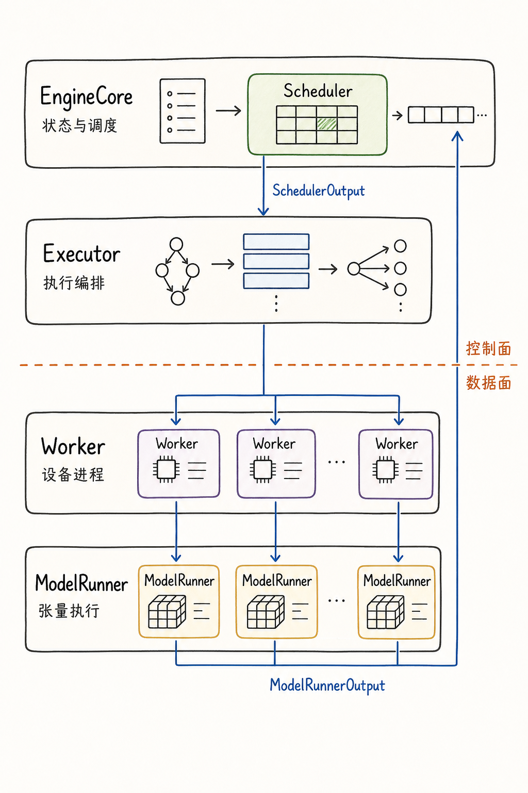
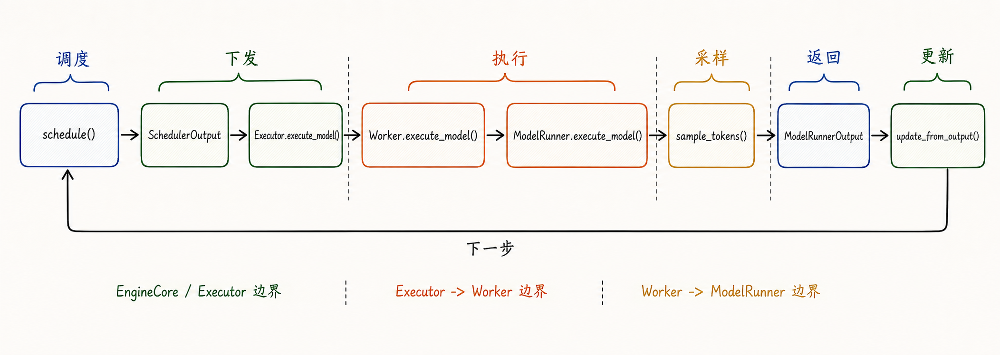
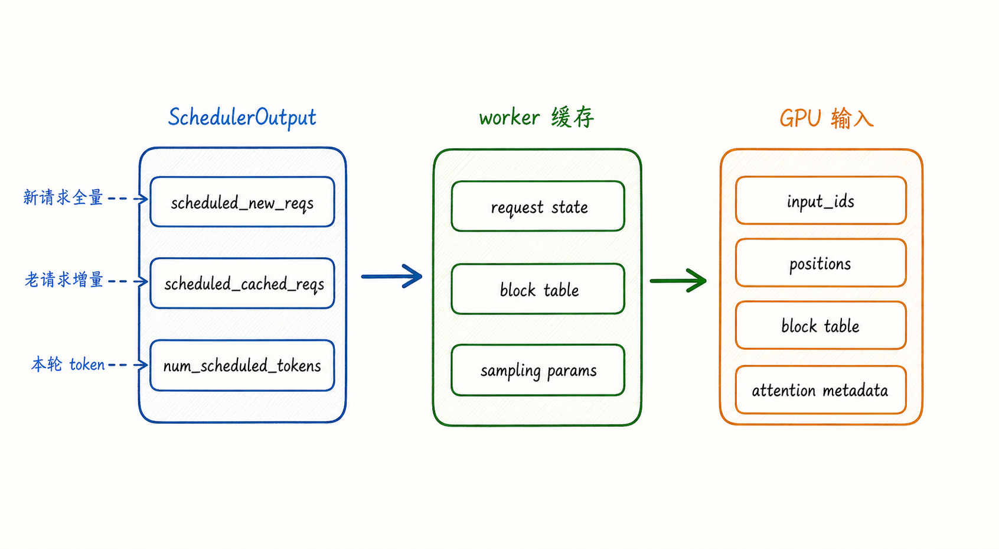
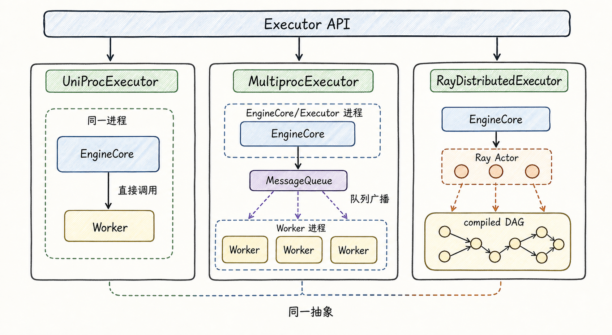
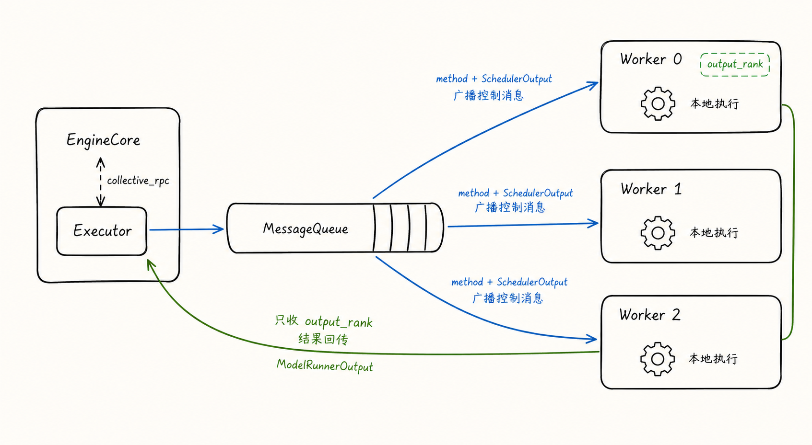
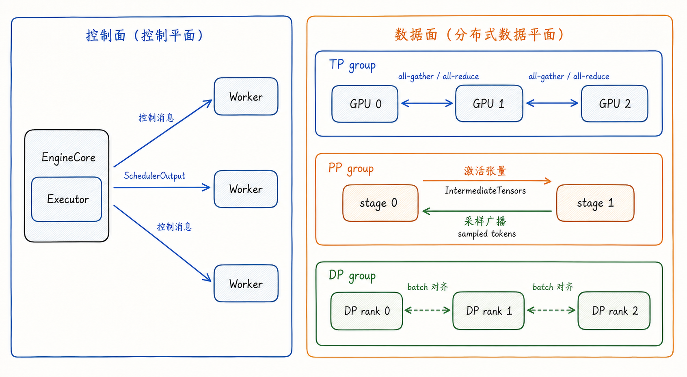
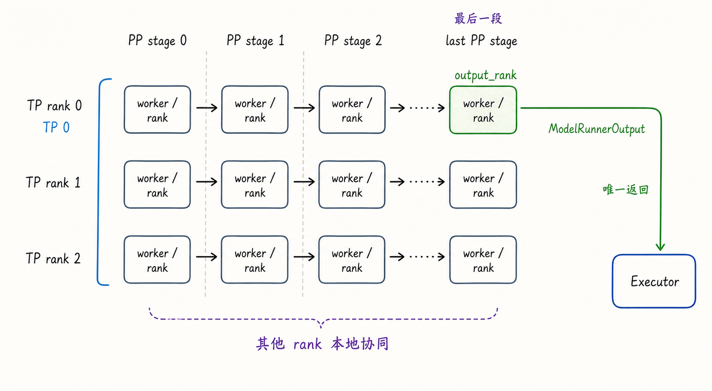

---
tags:
  - vllm
  - llm-inference
  - inference-engine
  - executor
  - worker
  - model-runner
  - distributed-inference
updated: 2026-05-31
description: 本文基于本地 vLLM V1 源码快照，解释 SchedulerOutput 如何经由 Executor、Worker 与 ModelRunner 变成模型执行，并重点梳理控制面、数据面、rank 与 output_rank 的通信机制。
---

# 07 Executor、Worker 与 ModelRunner 的协同执行与通信机制

前几章已经把 vLLM V1 的关键状态层讲到这里：`EngineCore` 是推理内循环，`Scheduler` 决定每一步哪些请求推进多少 token，`KVCacheManager` 管理 KV block 的 admission 与释放，async scheduling 试图让 CPU 调度和 GPU 执行重叠起来。

但还有一个很容易被一句话带过的问题：**Scheduler 产出的 `SchedulerOutput` 到底怎样变成 GPU 上的一次 forward**。

如果只看 `EngineCore.step()`，这一步似乎很简单：

```text
scheduler.schedule()
model_executor.execute_model(scheduler_output)
scheduler.update_from_output(scheduler_output, model_output)
```

这三行背后其实跨过了 vLLM 执行侧最重要的一组边界：`Executor` 屏蔽执行后端，`Worker` 管理设备进程，`ModelRunner` 把调度结果翻译成张量输入并调用模型。更麻烦的是，通信不是一条线，而是两条线叠在一起：控制面把方法调用、请求元数据和 `SchedulerOutput` 发到 worker；数据面则在 TP、PP、DP、KV connector、Ray compiled DAG 等路径里搬运激活张量、采样结果和同步状态。

本文以 `code/opensource/vllm` 的本地源码快照为依据，源码分支为 `main`，短提交哈希为 `52a31ccec`。本文仍然不做逐行源码讲解，而是建立一个稳定的执行心智模型：**EngineCore/Scheduler 负责决定做什么，Executor 负责把这件事发给谁，Worker 负责在哪个设备进程里做，ModelRunner 负责怎样把它变成一次可执行的模型调用**。

下面这张图先给出本文的阅读地图：先看 `SchedulerOutput` 和 `ModelRunnerOutput` 的上下往返，再看中间三层各自负责哪一段边界。



先读这张图：`SchedulerOutput` 从 `EngineCore/Scheduler` 往下走，`ModelRunnerOutput` 从执行侧往上回。中间的 `Executor` 和 `Worker` 不是“多余包装”，而是把同一套调度语义适配到不同后端、不同进程、不同 GPU rank、不同并行策略上的执行编排层。

## 1. 为什么需要执行侧三层

最朴素的推理代码可以写成 `model(input_ids)`。vLLM 做不到这么薄，因为在线推理系统面对的输入不是一个静态 batch，而是一组持续变化的请求状态。每一步调度出来的 batch 可能同时包含：

1. 第一次进入 worker 的新请求；
2. 已经在 worker 侧缓存过状态的老请求；
3. prefill、decode、chunked prefill 混在一起的 token 推进量；
4. 新分配的 KV block、已经缓存的 block table、需要释放的请求；
5. structured output、spec decode、多模态 encoder、KV connector、LoRA 等附加元数据；
6. TP、PP、DP、EP、PCP/DCP 等不同 rank 坐标上的通信约束；

所以，`SchedulerOutput` 不是一个普通的 `input_ids` 列表。它是一份本轮执行任务单，既包含“哪些请求推进多少 token”，也包含“worker 侧缓存状态应该怎样变化”。执行侧三层的存在，就是为了让这份任务单被正确下发、缓存、翻译和执行。

可以先把三层职责压缩成下面这张表。

| 层级 | 主要对象 | 维护什么 | 输入 | 输出 |
| --- | --- | --- | --- | --- |
| 执行编排层 | `Executor` | worker 后端、RPC 广播、返回收集、失败回调、最大 in-flight batch 数 | `SchedulerOutput`、utility RPC、配置操作 | `ModelRunnerOutput` 或 future |
| 设备进程层 | `Worker` / `WorkerWrapperBase` | 设备、模型权重、KV cache、分布式组、worker 生命周期 | executor 发来的方法调用和参数 | 本 worker 的执行结果或本地状态更新 |
| 张量执行层 | `ModelRunner` | 请求缓存、block table、输入张量、attention metadata、采样状态 | `SchedulerOutput`、PP intermediate tensors、grammar output | hidden states、sampled tokens、`ModelRunnerOutput` |

这三层不是为了好看而分出来的抽象。`Executor` 解决的是“同一份 EngineCore 逻辑如何跑在 uni/mp/Ray 后端上”；`Worker` 解决的是“每个进程如何拥有自己的设备和分布式身份”；`ModelRunner` 解决的是“如何把调度器的结构化任务单变成模型可吃的张量”。

一个常见误解是把 `Executor` 当成“真正跑模型”的组件。更准确地说，`Executor` 负责组织执行，真正调用模型的是 worker 内部的 `ModelRunner`。另一个常见误解是把 `Worker` 和 `ModelRunner` 混在一起。`Worker` 更像设备进程的外壳，负责初始化设备、加载模型、建立通信组、处理 sleep/wake/profile/LoRA 等控制调用；`ModelRunner` 才是每一步把 batch 状态、block table、attention metadata、采样逻辑组织起来的对象。

这也是本文与第 03 篇的区别。第 03 篇先建立 vLLM 的全局地图；本文把镜头推进到 `SchedulerOutput` 离开 Scheduler 之后：它经过哪些通信边界，在哪些地方被复制、缓存、广播、聚合，又在哪里变成 GPU 上的张量计算。

## 2. 一次 step 的往返路径

先看同步路径。`EngineCore.step()` 的执行顺序非常适合做主线：

1. `scheduler.schedule()` 生成 `SchedulerOutput`；
2. `model_executor.execute_model(scheduler_output, non_block=True)` 把任务交给执行侧；
3. `scheduler.get_grammar_bitmask(scheduler_output)` 准备 structured output 需要的 grammar 信息；
4. 等待 future 返回 `ModelRunnerOutput`；
5. 如果当前后端或 runner 需要把 forward 与采样拆开，再调用 `sample_tokens(grammar_output)` 完成采样；
6. 处理执行期间到达的 abort；
7. `scheduler.update_from_output(scheduler_output, model_output)` 更新请求状态并产出 `EngineCoreOutputs`；



这条路径的关键不是“调用了哪些函数”，而是每个阶段的所有权变化。

`Scheduler` 持有引擎侧请求状态。它知道哪些请求在 `waiting`，哪些在 `running`，哪些 token 已经计算，哪些 KV block 已经分配。它生成 `SchedulerOutput` 时，已经把本轮的执行计划、状态增量和资源元数据装进结构化对象。

`Executor` 接管的是执行分发。对 `EngineCore` 来说，`model_executor` 暴露的是统一接口；至于是直接调用本进程里的 worker、通过 multiprocessing message queue 广播给多个 worker，还是通过 Ray actor / compiled DAG 运行，都被藏在 executor 后端里。

`Worker` 接管的是设备进程上下文。worker 已经初始化了设备、模型权重、KV cache、通信组和 worker-local 缓存。它收到 `execute_model` 后，会保证在正确设备和正确 rank 身份下执行。

`ModelRunner` 接管的是张量执行。它会更新本地请求状态，准备 `input_ids`、`positions`、block table、slot mapping、attention metadata、LoRA 状态、多模态 embedding、PP intermediate tensors，然后调用模型 forward。最后一个 PP stage 才能完成采样并构造 `ModelRunnerOutput`；非最后 PP stage 往往只产出 `IntermediateTensors`，由 worker 发送给下一段。

这里还要把 `execute_model()` 和 `sample_tokens()` 的关系讲清楚。vLLM 的执行侧并不总是在同一个调用里直接返回最终 token。在 worker / model runner 层，常见语言模型路径会先用 `execute_model()` 完成 forward 并暂存 hidden states，再由 `sample_tokens()` 结合 grammar bitmask、sampling params、spec decode 等信息完成采样。在 Ray executor 层还要再区分一种情况：`execute_model()` 可以先缓存 `SchedulerOutput` 并返回 `None`，真正的 compiled DAG 执行延后到随后的 `sample_tokens()` 调用中。这样做不是为了增加接口复杂度，而是为了在 forward、grammar、PP、Ray DAG 与采样之间保留清晰的同步点。

如果开启 batch queue 或 PP，`EngineCore.step_with_batch_queue()` 会让多个 batch in-flight。它先尝试继续 schedule 新 batch，把 `execute_model(..., non_block=True)` 的 future 放入队列；当不能继续填队列或队列已满时，再取最早的 future 回来更新 Scheduler。这就是 async scheduling 与 PP 能减少空泡的基础：调度和执行不再严格一轮一轮排队。

所以，一次 step 的主线可以记成一句话：**Scheduler 输出本轮任务单，Executor 把任务单送到执行后端，Worker 在正确设备进程里调用 ModelRunner，ModelRunner 返回本轮结果，Scheduler 用结果修正全局请求状态**。

## 3. SchedulerOutput 怎样变成 GPU 输入

理解执行侧通信之前，必须先理解 `SchedulerOutput` 里到底有什么。它不是只包含 token ids，而是把“新请求全量数据”和“老请求增量数据”分开传。



`SchedulerOutput` 中最值得抓住的是这几类字段。

| 字段 | 含义 | 为什么影响通信 |
| --- | --- | --- |
| `scheduled_new_reqs` | 第一次被调度的新请求数据 | worker 侧还没有缓存，需要发送 prompt token、sampling params、LoRA、多模态特征、block ids 等较完整信息 |
| `scheduled_cached_reqs` | 已经调度过的请求增量 | worker 已经缓存请求主体，只需要发送新增 block ids、`num_computed_tokens`、输出 token 数等差分 |
| `num_scheduled_tokens` | 每个请求本轮推进多少 token | ModelRunner 用它决定 input batch 形状、query length、采样位置 |
| `total_num_scheduled_tokens` | 本轮总 token 数 | 决定是否真的 forward，也影响 CUDA graph / DP padding / batch queue |
| `scheduled_spec_decode_tokens` | spec decode draft token | 影响输入 token、采样和接受/拒绝账本 |
| `scheduled_encoder_inputs` | 本轮需要处理的 encoder / 多模态输入 | 影响多模态 encoder cache 和输入 embedding |
| `finished_req_ids` | 上一轮到本轮之间完成的请求 | worker 和 ModelRunner 需要释放本地请求状态 |
| `preempted_req_ids` | 本轮被抢占的请求 | v2 ModelRunner 需要清掉对应本地状态 |
| `kv_connector_metadata` / `ec_connector_metadata` | 外部 KV / encoder connector 元数据 | 可能改变是否 forward、是否等待外部传输、是否聚合多个 worker 输出 |
| `new_block_ids_to_zero` | 本轮新分配且需要清零的 block id | 只在 `needs_kv_cache_zeroing` 为真时出现；worker 需要在使用前清零相关 GPU KV memory，避免脏数据污染 |

`new_block_ids_to_zero` 不应理解成“所有模型每轮都会清零新 block”。在当前快照里，它是特定 KV cache zeroing 需求下的保护路径，主要用来避免含状态类缓存的层读到旧数据。

这个拆分解释了 vLLM 为什么不每一步都把完整请求重新发给 worker。新请求第一次出现时，worker 还没有它的本地缓存，所以 `scheduled_new_reqs` 携带完整得多的信息。之后这个请求继续 decode 或 chunked prefill 时，worker 已经持有 request state、block table、sampling params、LoRA 状态等，只需要通过 `scheduled_cached_reqs` 接收增量。

在 V2 `GPUModelRunner` 里，这个过程大致分成几步：

1. `finish_requests()` 根据 `finished_req_ids` 和 `preempted_req_ids` 清理已结束或被抢占请求；
2. `free_states()` 释放 encoder cache 等本地资源；
3. `add_requests()` 把 `scheduled_new_reqs` 加入本地 request state、model state、block table、sampler 与 LoRA state；
4. `update_requests()` 用 `scheduled_cached_reqs` 更新 `num_computed_tokens` 和新增 block ids；
5. `prepare_inputs()` 准备 `input_ids`、`positions` 等输入；
6. `prepare_attn()` 和 `model_state.prepare_attn()` 构造 attention metadata、slot mapping、block table 视图；
7. 只有在需要 forward 时，才进入模型调用；

这说明 `SchedulerOutput` 到 GPU 输入之间不是“拷贝 token ids”这么简单。它更像一次 worker-local 状态同步：Scheduler 维护全局逻辑账本，worker 维护本地执行账本，`SchedulerOutput` 是两份账本每一步对齐的协议。

从通信角度看，这个设计有两个好处。

第一，减少控制面传输量。老请求每步只发增量，避免把 prompt、sampling params、多模态特征等重复序列化。

第二，明确状态所有权。Scheduler 不直接修改 worker 的 block table；worker 也不重新决定哪些请求该跑多少 token。Scheduler 只发“本轮应该发生的状态变化”，worker 按这份变化更新自己的执行缓存。

但它也带来一个代价：一旦某条路径会让请求状态提前推进、回滚、抢占或异步返回，Scheduler 和 worker 账本就必须继续保持一致。第 06 篇讲的 async scheduling placeholder，本质上就是这种账本一致性问题的放大版。

## 4. Executor 的控制面通信

`Executor` 是本文通信机制的第一层核心。它提供 `collective_rpc()`，并在默认 `execute_model()` 里把 `SchedulerOutput` 作为参数发给所有 worker。抽象类里还专门提醒：这个 API 推荐用于控制消息，真正的数据面通信应另行建立。

这句话非常关键。vLLM 执行侧通信要分成两类。

| 通信类型 | 搬运什么 | 典型对象 | 主要路径 |
| --- | --- | --- | --- |
| 控制面 | 方法名、请求元数据、`SchedulerOutput`、配置变更、profile/sleep/wake/LoRA 等命令 | Python 对象、pickle/cloudpickle/Ray 序列化对象、worker RPC 参数 | `Executor.collective_rpc()`、`MessageQueue`、Ray remote method |
| 数据面 | 激活张量、PP intermediate tensors、TP collective、DP batch 对齐、采样 token 广播、KV connector 数据 | GPU tensor、CPU tensor、distributed group、Ray compiled DAG channel | `get_tp_group()`、`get_pp_group()`、`get_dp_group()`、Ray compiled DAG、KV transfer group |

不要把这两类混成一条“RPC”。`SchedulerOutput` 可以通过 RPC 广播给 worker，但 PP stage 之间的 `IntermediateTensors` 不应该靠 Python RPC 一份份传；TP 内部的 all-gather/all-reduce 也不是 executor 在 Python 层循环调用出来的，而是模型执行期间通过已初始化的通信组发生。

读后端对比图时，先不要追每个框里的通信细节，只抓住一件事：`EngineCore` 面向同一个 `Executor API`，后端差异被收进 executor 内部。



### 4.1 UniProcExecutor

`UniProcExecutor` 是最简单的后端。它在同一个进程里创建 `WorkerWrapperBase(rpc_rank=0)`，初始化 worker、设备和模型。`collective_rpc()` 实际上就是对 `driver_worker` 做一次本地方法调用，然后把结果包装成单元素 list 或 future。

这个路径最适合理解抽象接口：即使没有多进程，`EngineCore` 也只认 `Executor`。它不直接依赖 `GPUWorker` 或 `GPUModelRunner`。这样单进程、本地多进程、Ray 后端都可以复用同一个 EngineCore/Scheduler 主逻辑。

### 4.2 MultiprocExecutor

`MultiprocExecutor` 是理解 vLLM V1 默认多 GPU 执行的重点。它会为本地 worker 创建子进程，每个 worker 子进程运行 `WorkerProc.worker_main()`，并在初始化后进入 `worker_busy_loop()`。

控制面通信主线如下：

1. Executor 侧创建一个用于广播 RPC 的 `MessageQueue`；
2. 每个 worker 根据 handle 创建自己的接收端；
3. `collective_rpc()` 把 `(method, args, kwargs, output_rank)` 放入广播队列；
4. 每个 worker 从队列取出同一条消息，找到对应方法并执行；
5. 如果 `output_rank is None`，所有 worker 都向响应队列返回结果；
6. 如果指定了 `output_rank`，只有该 rank 把结果放回响应队列；
7. Executor 根据是否 `non_block` 返回结果或 future；

下图里的 `Worker 0 / output_rank` 是一个示例 rank，不表示所有部署都固定由 0 号 worker 返回。后面第 6 节会把 PP/TP 布局中的 output rank 规则单独展开。



`execute_model()` 在 multiproc 后端里会设置 `unique_reply_rank=self.output_rank`。也就是说，所有 worker 都会执行本轮模型逻辑，但 Executor 通常只从 `output_rank` 收一个 `ModelRunnerOutput`。这是合理的，因为 TP/PP 场景里并不是每个 rank 都拥有完整可返回的采样结果。

如果有 KV connector 需要聚合多个 worker 的输出，路径会不同。`MultiprocExecutor.collective_rpc()` 可以接收 `kv_output_aggregator`，这时它不再只把 `unique_reply_rank` 当成唯一结果来源，而是收集多个 worker 输出后聚合。这是通信复杂性的一个典型来源：绝大多数普通生成路径只需要 output rank 返回，但 connector 路径可能需要跨 worker 汇总额外元数据。

multiproc 里还有一个容易忽略的异步细节。`AsyncModelRunnerOutput` 不能直接当普通对象长期跨进程传。`WorkerProc.enqueue_output()` 在发现输出是 `AsyncModelRunnerOutput` 时，会调用 `get_output()`，等待设备到主机的异步拷贝完成，并把真正的 `ModelRunnerOutput` 放入响应队列。async scheduling 开启时，worker 还会使用 `WorkerAsyncOutputCopy` 线程处理这件事，以便主执行循环继续往前走。

### 4.3 RayDistributedExecutor

Ray 后端分两类通信。普通 utility RPC 通过 Ray actor 的 `execute_method.remote()` 运行在所有 worker 上；模型 forward 则倾向走 Ray compiled DAG。compiled DAG 会把 `(SchedulerOutput, GrammarOutput)` 作为图输入，沿着 PP/TP worker 图执行，并在 PP stage 之间传递 `IntermediateTensors`。

普通路径没有 connector 时，Ray executor 通常只从一个输出 ref 取 `ModelRunnerOutput`。有 connector 时，它会从多个 worker 取结果并通过 `KVOutputAggregator` 聚合。Ray 还要处理 shared-memory channel 返回的 zero-copy buffer 生命周期，源码中有专门的 `detach_zero_copy_from_model_runner_output()`，避免 `ModelRunnerOutput.logprobs` 等 numpy-backed 数据继续别名 Ray SHM buffer。

因此，Ray 后端不是“把 multiproc 改成远程调用”这么简单。Ray compiled DAG 把模型执行的数据面也纳入图执行，尤其在 PP 场景里，它需要表达 `SchedulerOutput -> PP stage 0 -> IntermediateTensors -> PP stage 1 -> ModelRunnerOutput` 这种链路。

## 5. Worker 与 ModelRunner 的数据面通信

控制面把“做什么”送到 worker，数据面负责“执行时各 rank 怎样协作”。这部分是 vLLM 通信实现最复杂的地方，也是最容易被误解的地方。

### 5.1 Worker 是设备进程外壳

`WorkerBase` 的注释说得很直接：它既抽象不同硬件实现，也抽象控制面通信。GPU 场景下，`Worker` 负责：

1. 设置本进程的 `rank`、`local_rank`、`distributed_init_method`；
2. 初始化 CUDA/XPU/CPU 等设备；
3. 加载模型权重；
4. 初始化 KV cache、workspace、warmup、profile、sleep/wake 等设备侧资源；
5. 构造 V1 或 V2 `GPUModelRunner`；
6. 接收 executor 的 `execute_model()`、`sample_tokens()` 等调用；

在 `gpu_worker.py` 中，worker 根据 `vllm_config.use_v2_model_runner` 选择 `vllm/v1/worker/gpu/model_runner.py` 的 V2 runner，或回落到 `vllm/v1/worker/gpu_model_runner.py` 的旧 runner。当前快照里默认 V2 选择受模型架构、Triton、unsupported features 等条件影响；默认判断发现不支持时会使用旧 runner。如果用户通过环境变量强制 V2，则不支持的组合会在校验阶段报错，而不是安静回落。对本文主线来说，两者外层角色相同：worker 负责把 executor 的调用转交给本地 model runner。

### 5.2 ModelRunner 把状态变成张量

V2 `GPUModelRunner.execute_model()` 的主线可以压缩成：

1. 清理 finished / preempted 请求；
2. 释放 encoder cache；
3. 添加新请求；
4. 更新老请求的 block table 和 computed token；
5. 如果没有本轮 token，走 no-forward 输出；
6. 根据本轮请求数、token 数和 DP rank 同步 batch descriptor；
7. 准备 input batch、attention metadata、slot mapping、LoRA 和多模态 embedding；
8. 进入 model forward；
9. 非最后 PP rank 返回 `IntermediateTensors`；
10. 最后 PP rank 暂存 hidden states，后续 `sample_tokens()` 构造 `ModelRunnerOutput`；

这个阶段里有三类数据面通信特别重要。

第一类是 TP 通信。Tensor Parallel 切的是同一层内的张量/权重计算。模型 forward 内部会通过 TP group 做 all-reduce、all-gather 等 collective。PP 发送 tensor dict 时还可能借用 TP group 做 all-gather 优化：如果某个 tensor 在 TP ranks 之间可按片发送，接收端可以重构完整 tensor。

第二类是 PP 通信。Pipeline Parallel 切的是模型层/stage。非第一个 PP stage 在 forward 前通过 `get_pp_group().irecv_tensor_dict()` 接收上一段的 `IntermediateTensors`；非最后 PP stage forward 后通过 `get_pp_group().isend_tensor_dict()` 把自己的 intermediate tensors 发给下一段。最后 PP stage 采样后，还需要把 sampled tokens 广播回非最后 stage，让它们更新本地请求状态。

第三类是 DP 同步。Data Parallel 在 serving 里常常意味着多个副本各自处理请求，但某些模型和执行模式仍要求同一 DP group 内协调 batch shape、CUDA graph mode 或 padding。V2 runner 的 `dispatch_cg_and_sync_dp()` 会在 `dp_size > 1` 时通过 CPU group all-reduce 汇总每个 DP rank 的 token 数、CUDA graph mode 和 uniform token count，从而避免各 rank 对 batch descriptor 的判断不一致。

这三类通信解释了为什么 Executor 的 `collective_rpc()` 不能承担所有数据交换。`collective_rpc()` 适合把 `execute_model(SchedulerOutput)` 发给 worker；但一旦进入模型执行，真正高频、张量级、rank-aware 的通信必须走分布式通信组。

现在再读控制面 / 数据面图会更稳：左侧是 `SchedulerOutput` 这类控制消息怎样进入 worker，右侧是进入模型执行后 TP、PP、DP 各自承担的张量或同步协作。



### 5.3 sample_tokens 为什么要单独看

很多读者会把 forward 和 sampling 当成一个不可分的模型调用。vLLM 执行侧会刻意把它们拆开，因为采样位置常常有额外条件。

在 V2 runner 中，`execute_model()` 让最后 PP stage 得到 hidden states，并保存到 `execute_model_state`。随后 `sample_tokens(grammar_output)` 读取这份状态，结合 grammar bitmask、sampling params、prompt logprobs、spec decode 等信息产生 sampled token ids。

如果不是最后 PP rank，`sample_tokens()` 不会自己采样。它会通过 `pp_receive()` 接收最后 PP rank 广播过来的 sampled tokens、`num_sampled` 和 `num_rejected`，再更新本地状态。最后 PP rank 则调用 sampler，必要时通过 `pp_broadcast()` 把采样结果发回其他 PP stage。

所以，PP 下“谁返回结果”和“谁更新本地状态”是两个问题。最终 `ModelRunnerOutput` 只需要从 output rank 回到 EngineCore，但各个 stage 的本地 request state 也必须跟上 sampled token，否则下一轮 forward 的输入历史就会错位。

## 6. output_rank 与 rank 协同

多 worker 场景里，`ModelRunnerOutput` 通常只从一个 rank 返回。multiproc 后端的 `_get_output_rank()` 给出的规则很直观：返回最后一个 PP stage 中的第一个 TP worker。源码注释用 `TP=8, PP=4` 举例，world size 是 32，最后 PP stage 的起点是 `32 - 8 = 24`，所以 output rank 是 24。

如果考虑 PCP，当前公式是：

```text
output_rank =
  world_size - tensor_parallel_size * prefill_context_parallel_size
```

这个 rank 选择背后的语义是：最后 PP stage 才拥有最终 hidden states，TP rank 0 通常作为该 stage 的返回代表。因此，其他 TP ranks 和更早 PP stages 并不是“不工作”，它们只是不会把最终 `ModelRunnerOutput` 作为 executor 要收的唯一结果返回。



这张图最重要的是绿色格子：`output_rank` 不是任意 worker，而是“最后 PP stage + TP rank 0”的返回点。其他 rank 仍然参与本地协同、TP collective、PP tensor 传递和 sampled token 同步。

把这个点讲清楚，可以避免三个常见误解。

第一个误解是“只有 output_rank 在跑模型”。错。所有相关 worker 都会收到 `execute_model`，并在自己的 rank 位置执行对应计算。output rank 只是返回给 executor 的代表。

第二个误解是“Executor 收一个输出就说明其他通信不重要”。错。Executor 收一个 `ModelRunnerOutput` 是控制面聚合策略；模型内部的数据面通信仍然可能非常重，尤其是 TP/PP/EP、跨节点和 MoE 场景。

第三个误解是“PP 只把激活往后传，不需要回传”。也不完整。forward 的 `IntermediateTensors` 往后传，但 sampled tokens 需要广播回非最后 stage，帮助它们更新本地请求历史。否则下一轮输入准备会缺少最后 stage 真实采样出来的 token。

从 EngineCore/Scheduler 角度看，这一切被压缩成一个 `ModelRunnerOutput`。Scheduler 不需要知道每个 PP stage 如何发送 tensor dict，也不需要知道每个 TP layer 内部怎样 all-reduce；它只需要拿到本轮每个请求生成了哪些 token、logprobs、KV connector 输出、pooling output 等结果，然后调用 `update_from_output()` 继续推进全局状态。

这就是 vLLM 执行侧抽象的价值：Scheduler 专心做全局状态机，worker group 专心做分布式执行。代价是通信层次多、边界多、异常路径多，一旦读源码时把控制面和数据面混在一起，就会觉得所有东西都像 RPC，结果越读越乱。

## 7. 源码阅读地图

如果要从源码复查本文内容，可以按下面顺序读，而不是一上来跳进 `gpu_model_runner.py` 的几千行实现。

第一层读 `EngineCore` 主循环：

1. `vllm/v1/engine/core.py`：看 `EngineCore.__init__()`、`step()`、`step_with_batch_queue()` 和 `collective_rpc()`；
2. `vllm/v1/core/sched/output.py`：看 `SchedulerOutput`、`NewRequestData`、`CachedRequestData`、`GrammarOutput`；
3. `vllm/v1/core/sched/scheduler.py`：看 `schedule()` 末尾如何构造 `SchedulerOutput`，以及 `update_from_output()` 如何消费 `ModelRunnerOutput`；

第二层读 Executor 后端：

1. `vllm/v1/executor/abstract.py`：看 `Executor.get_class()`、`collective_rpc()`、`execute_model()`、`sample_tokens()`；
2. `vllm/v1/executor/uniproc_executor.py`：看同进程 direct call 的最小路径；
3. `vllm/v1/executor/multiproc_executor.py`：重点看 `MessageQueue`、`WorkerProc.worker_busy_loop()`、`unique_reply_rank` 和 `_get_output_rank()`；
4. `vllm/v1/executor/ray_executor.py` 与 `vllm/v1/executor/ray_utils.py`：看 Ray actor RPC、compiled DAG、PP intermediate tensors 和 zero-copy output detach；

第三层读 Worker 与 ModelRunner：

1. `vllm/v1/worker/worker_base.py`：看 `WorkerBase`、`WorkerWrapperBase`、worker lazy init 和 wrapper 如何转发 `execute_model()`；
2. `vllm/v1/worker/gpu_worker.py`：看设备初始化、V1/V2 ModelRunner 选择、PP send/recv 外壳；
3. `vllm/v1/worker/gpu/model_runner.py`：看 V2 `GPUModelRunner.execute_model()`、`sample_tokens()`、`add_requests()`、`update_requests()`；
4. `vllm/v1/worker/gpu_model_runner.py`：看旧 runner 在当前快照里仍然保留的兼容路径；

第四层读分布式通信：

1. `vllm/distributed/parallel_state.py`：看 `get_tp_group()`、`get_pp_group()`、`get_dp_group()`、`send_tensor_dict()`、`irecv_tensor_dict()`；
2. `vllm/v1/worker/gpu/pp_utils.py`：看 PP sampled tokens 的 broadcast / receive；
3. `vllm/v1/worker/gpu/dp_utils.py`：看 V2 runner 如何同步 DP batch descriptor；
4. `docs/design/arch_overview.md`：用官方设计文档核对 V1 process architecture；

本篇已经把通信主线讲到“能读懂执行流”的程度，但还没有把每个通信场景完整展开。vLLM 这部分确实足够复杂，值得后续单独拆一篇第 8 篇：可以专门讲 `EngineCoreClient/ZMQ`、`Executor.collective_rpc`、`MessageQueue`、Ray compiled DAG、TP/PP/DP/EP 数据面、KV connector 与跨节点通信如何组成一张完整通信地图。本文先把外层协同讲清楚，避免第 7 篇变成通信源码大杂烩。

## 参考资料

1. vLLM 本地源码快照：`code/opensource/vllm`，branch `main`，short commit `52a31ccec`；
2. vLLM V1 process architecture：`code/opensource/vllm/docs/design/arch_overview.md`；
3. EngineCore 主循环：`code/opensource/vllm/vllm/v1/engine/core.py`；
4. SchedulerOutput 数据结构：`code/opensource/vllm/vllm/v1/core/sched/output.py`；
5. Scheduler 输出与更新：`code/opensource/vllm/vllm/v1/core/sched/scheduler.py`；
6. Executor 抽象接口：`code/opensource/vllm/vllm/v1/executor/abstract.py`；
7. UniProcExecutor：`code/opensource/vllm/vllm/v1/executor/uniproc_executor.py`；
8. MultiprocExecutor 与 WorkerProc：`code/opensource/vllm/vllm/v1/executor/multiproc_executor.py`；
9. Ray executor 与 Ray worker utils：`code/opensource/vllm/vllm/v1/executor/ray_executor.py`、`code/opensource/vllm/vllm/v1/executor/ray_utils.py`；
10. Worker 抽象与 GPU worker：`code/opensource/vllm/vllm/v1/worker/worker_base.py`、`code/opensource/vllm/vllm/v1/worker/gpu_worker.py`；
11. V2 GPUModelRunner：`code/opensource/vllm/vllm/v1/worker/gpu/model_runner.py`；
12. V1 GPUModelRunner 兼容路径：`code/opensource/vllm/vllm/v1/worker/gpu_model_runner.py`；
13. 分布式通信组：`code/opensource/vllm/vllm/distributed/parallel_state.py`；
14. PP sampled token 同步与 DP batch 对齐：`code/opensource/vllm/vllm/v1/worker/gpu/pp_utils.py`、`code/opensource/vllm/vllm/v1/worker/gpu/dp_utils.py`；

## Learning Assessment

### 题目

1. 单选：本文中 `Executor` 的最核心职责是什么？
   A. 直接决定每个请求本轮推进多少 token；
   B. 屏蔽执行后端差异，把 EngineCore 的执行请求分发给 worker 并收集结果；
   C. 替代 ModelRunner 构造 attention metadata；
   D. 负责 tokenizer 和 OpenAI API streaming；

2. 单选：`SchedulerOutput` 为什么要区分 `scheduled_new_reqs` 和 `scheduled_cached_reqs`？
   A. 因为新请求只能在 CPU 上执行，老请求只能在 GPU 上执行；
   B. 因为 worker 对新请求还没有缓存，需要完整数据；老请求已经缓存，只需要状态增量；
   C. 因为 spec decode 只支持新请求；
   D. 因为这两个字段分别对应 Prefill 和 Decode 的固定阶段；

3. 多选：下列哪些信息可能出现在 `SchedulerOutput` 或其关联结构中？
   A. 每个请求本轮 scheduled token 数；
   B. 新请求的 prompt token、sampling params 和 block ids；
   C. 需要释放的 finished request ids；
   D. TP group 内每一层 all-reduce 的实际通信时间；

4. 单选：在普通 multiproc 执行路径中，`execute_model()` 为什么通常只从 `output_rank` 收 `ModelRunnerOutput`？
   A. 因为只有 output_rank 收到了 `SchedulerOutput`；
   B. 因为 output_rank 通常位于最后 PP stage 的 TP rank 0，拥有最终可返回的采样结果；
   C. 因为其他 rank 没有加载模型权重；
   D. 因为其他 rank 只负责 tokenizer；

5. 多选：为什么不能把 vLLM 的所有执行侧通信都理解成 `collective_rpc()`？
   A. `collective_rpc()` 更偏控制面，适合广播方法调用和调度元数据；
   B. TP/PP/DP 的张量通信需要走分布式通信组或 Ray compiled DAG；
   C. PP stage 之间的 `IntermediateTensors` 属于数据面；
   D. `collective_rpc()` 会自动完成所有模型层内 all-reduce；

6. 单选：`Worker` 与 `ModelRunner` 的关系更接近哪项？
   A. Worker 是设备进程外壳，ModelRunner 是每步张量执行与输入准备的核心；
   B. ModelRunner 管理所有 worker 子进程，Worker 只保存字符串日志；
   C. Worker 和 ModelRunner 是完全同义词；
   D. Worker 只存在于 Ray 后端，multiproc 后端没有 Worker；

7. 多选：V2 `GPUModelRunner.execute_model()` 在进入模型 forward 前，通常会做哪些事情？
   A. 清理 finished / preempted 请求；
   B. 添加新请求并更新老请求的 block table；
   C. 准备 input batch、slot mapping 和 attention metadata；
   D. 直接把 `SchedulerOutput` 返回给客户端；

8. 单选：PP 场景中，非最后 PP rank 在 `sample_tokens()` 阶段通常做什么？
   A. 自己独立采样并返回完整 `ModelRunnerOutput`；
   B. 接收最后 PP rank 广播的 sampled tokens，并更新本地请求状态；
   C. 删除所有本地 KV cache；
   D. 通知 Scheduler 重新分配 token budget；

9. 多选：哪些机制会让执行侧通信明显变复杂？
   A. Pipeline Parallel 的 `IntermediateTensors` 传递；
   B. Tensor Parallel 的 collective；
   C. KV connector 需要聚合多个 worker 输出；
   D. 单进程 UniProcExecutor 中只有一个 worker 且没有分布式通信；

10. 单选：`dispatch_cg_and_sync_dp()` 这类 DP 同步主要解决什么问题？
    A. 让所有 DP rank 共享同一份 HTTP 请求队列；
    B. 在需要时同步 batch descriptor、token 数和 CUDA graph 相关选择，避免 DP rank 执行形态不一致；
    C. 把 DP rank 合并成一个 TP rank；
    D. 直接生成用户可见的文本输出；

11. 多选：关于 Ray 后端，下列哪些说法符合本文？
    A. utility RPC 可通过 Ray actor remote method 执行；
    B. forward 路径可通过 Ray compiled DAG 表达 PP/TP 执行图；
    C. 没有 connector 时通常只需要取一个输出 ref；
    D. Ray 后端不需要处理任何 shared-memory 或 zero-copy 输出生命周期；

12. 单选：如果读源码时发现 `EngineCore` 只拿到了一个 `ModelRunnerOutput`，最合理的理解是什么？
    A. 只有一个 worker 真的运行了模型；
    B. 其他 worker 都执行失败；
    C. 多 worker 可能都参与执行，只是控制面通常只把最终输出 rank 的结果返回给 EngineCore；
    D. Scheduler 跳过了所有请求；

13. 多选：如果要为 vLLM 新增一个执行后端，哪些设计边界应该尽量保持？
    A. `EngineCore` 继续只面向 `Executor` 的统一接口，不直接依赖具体 `GPUWorker`；
    B. `SchedulerOutput` 作为控制面任务单下发给 worker，worker 再同步本地执行账本；
    C. TP/PP/DP 的张量级通信应尽量放在模型执行阶段，通过分布式通信组或后端图通道表达；
    D. 为了保证状态一致，所有 worker 都必须把完整 `ModelRunnerOutput` 返回给 Scheduler；

### 答案与解析

1. B。`Executor` 是执行后端抽象层，负责把 EngineCore 的统一调用适配到 uni、multiprocessing、Ray 等执行形态；

2. B。新请求还没有 worker-local 状态，所以需要发送较完整数据；老请求已经缓存在 worker 中，只需要 block、token 计数等增量；

3. A、B、C。`SchedulerOutput` 描述本轮调度结果和 worker 状态增量；TP all-reduce 的实际耗时属于运行时通信测量，不是 `SchedulerOutput` 的字段；

4. B。最后 PP stage 才拥有最终 hidden states，TP rank 0 通常作为返回代表。其他 rank 仍然参与执行，只是不作为唯一返回点；

5. A、B、C。`collective_rpc()` 适合控制面广播；张量级通信由 TP/PP/DP 通信组或 Ray compiled DAG 等路径承担。D 错在把模型内部 collective 错归给 Python RPC；

6. A。Worker 管理设备进程和生命周期，ModelRunner 负责把调度结果变成张量输入、执行 forward 和采样；

7. A、B、C。ModelRunner 会先同步本地请求状态和输入元数据，再进入模型 forward。D 是错误方向，客户端输出由 EngineCore/OutputProcessor 之后处理；

8. B。非最后 PP rank 没有最终 hidden states，通常通过 `pp_receive()` 接收最后 PP rank 广播的采样结果，并更新本地状态；

9. A、B、C。PP、TP、KV connector 都会增加通信层次。D 是最简单路径，通信复杂度最低；

10. B。DP rank 可能各自看到不同 batch 形态，V2 runner 需要在某些场景同步 CUDA graph mode、token 数和 padding 相关决策，避免执行路径不一致；

11. A、B、C。Ray 后端既有 actor RPC，也有 compiled DAG forward 路径。D 错，源码里专门处理 Ray SHM channel 的 zero-copy buffer detach；

12. C。一个 `ModelRunnerOutput` 不等于只有一个 worker 工作；它通常表示 executor 的返回聚合策略只把最终 output rank 的结果交给 EngineCore；

13. A、B、C。新增后端也应保留 `EngineCore -> Executor -> Worker -> ModelRunner` 的边界：EngineCore 不直接绑定设备进程；`SchedulerOutput` 负责控制面状态同步；张量级协作走通信组或图通道。D 错在把“状态一致性”误解成“所有 worker 都返回完整输出”；普通路径通常只需要 output rank 返回，其他 worker 通过本地状态更新、PP sampled token 同步和必要的 connector 聚合保持一致；
