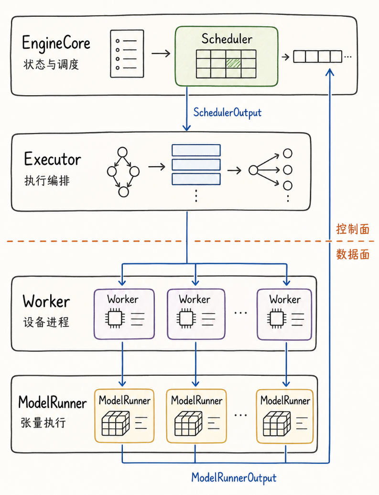
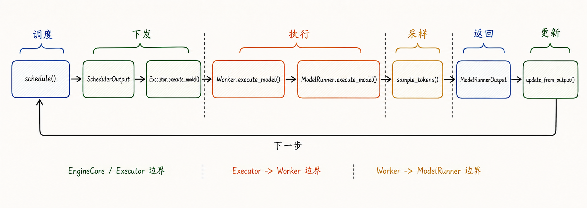
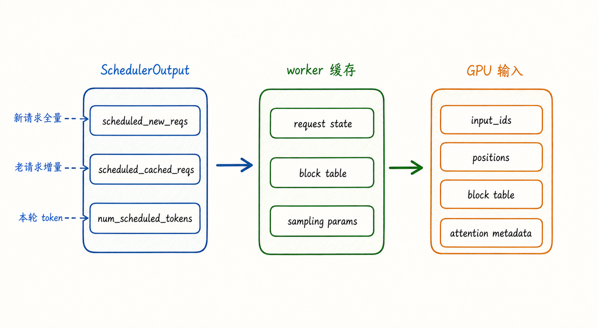
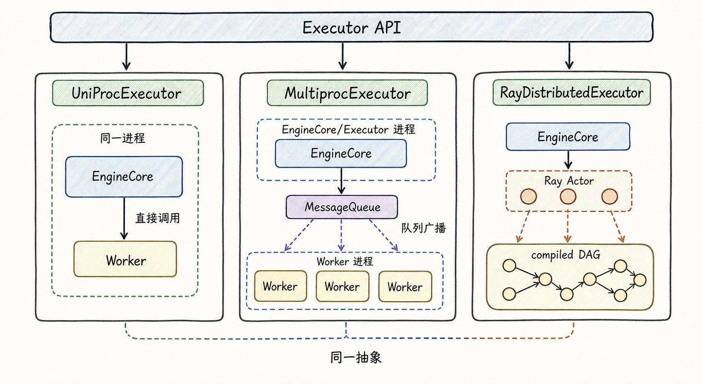
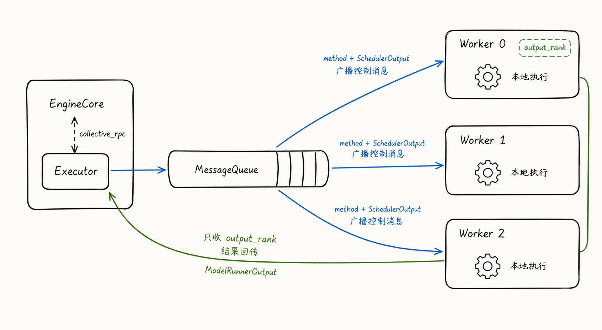
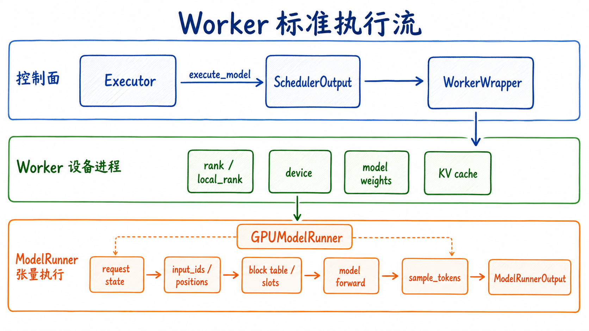
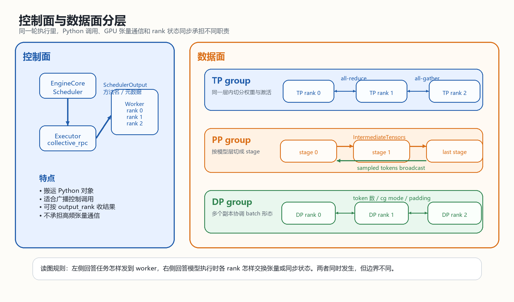
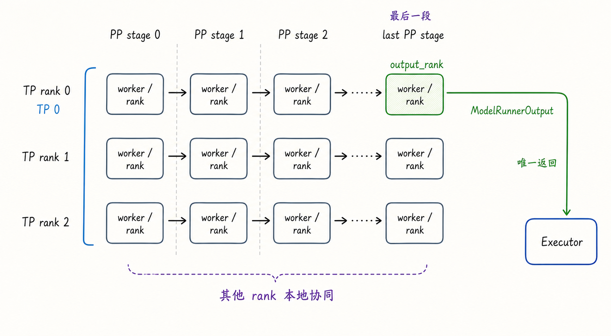

---
tags:
  - vllm
  - llm-inference
  - inference-engine
  - executor
  - worker
  - model-runner
  - distributed-inference
updated: 2026-06-10
description: 解释 SchedulerOutput 在执行侧如何被 Executor 下发给 Worker，再由 ModelRunner 转成张量执行，并区分控制面、数据面、rank 与 output_rank 的协作边界。
---
# 07 Executor、Worker 与 ModelRunner

vLLM 的一轮推理可以从一个很小的问题切入：`Scheduler` 已经决定哪些请求推进多少 token，这份结果怎样变成 GPU 上的一次模型执行？

如果只看 `EngineCore.step()` 的主线，执行过程像三行伪代码：

```text
scheduler.schedule()
model_executor.execute_model(scheduler_output)
scheduler.update_from_output(scheduler_output, model_output)
```

真正的复杂性藏在第二行。`SchedulerOutput` 不是普通的 `input_ids`，它同时携带新请求、老请求增量、KV block 变化、结构化输出、spec decode、多模态输入、并行 rank 约束等信息。执行侧要把这份任务单发到正确的后端、正确的进程、正确的 GPU rank，并在模型 forward、采样、PP/TP/DP 通信之后，把最终可见的 `ModelRunnerOutput` 交回调度器。

这条链路可以压缩成一个稳定心智模型：**EngineCore/Scheduler 决定做什么，Executor 决定发给谁，Worker 决定在哪个设备进程里做，ModelRunner 决定怎样把它变成张量执行**。机制描述的版本边界是本地 `code/opensource/vllm` 源码快照，branch `main`，short commit `52a31ccec`。



这张图有三条阅读线索。

第一条是任务下行链路。`SchedulerOutput` 从 `EngineCore/Scheduler` 下发，先进入 `Executor`，再被转交到一个或多个 `Worker`，最终由 worker 内部的 `ModelRunner` 转成输入张量、attention metadata、block table 视图和采样状态。

第二条是结果上行链路。`ModelRunnerOutput` 并不一定由每个 worker 都返回给 `EngineCore`，在普通 TP/PP 场景中，executor 通常只从一个代表 rank 收结果，这个代表就是后面展开的 `output_rank`。其他 rank 仍然参与执行，只是不作为最终控制面返回点。

第三条是控制面与数据面的分界。图中的蓝色路径表达方法调用、调度结果和请求元数据的传播，橙色边界之后还有 TP collective、PP intermediate tensor 传递、DP batch descriptor 同步、sampled token broadcast 等张量级协作。把这两类通信混在一起，是阅读 vLLM 执行侧源码时最常见的混乱来源。

## 1. 执行侧边界

最朴素的推理代码可以写成 `model(input_ids)`，在线 serving 系统不能这么薄，因为它面对的不是一个静态 batch，而是一组不断变化的请求状态。某一轮调度出来的 batch 可能同时包含：

1. 第一次进入 worker 的新请求；
2. 已经在 worker 侧缓存过状态的老请求；
3. prefill、decode、chunked prefill 混在一起的 token 推进量；
4. 新分配的 KV block、已有 block table、需要释放的请求；
5. structured output、spec decode、多模态 encoder、KV connector、LoRA 等附加元数据；
6. TP、PP、DP、EP、PCP/DCP 等不同 rank 坐标上的通信约束；

所以 `SchedulerOutput` 更像一份本轮执行任务单，既说明哪些请求推进多少 token，也说明 worker 侧缓存状态应该怎样变化。执行侧三层的意义，就是让这份任务单被正确下发、缓存、翻译和执行。

| 层级 | 主要对象 | 维护什么 | 输入 | 输出 |
| --- | --- | --- | --- | --- |
| 执行编排层 | `Executor` | worker 后端、RPC 广播、返回收集、失败回调、最大 in-flight batch 数 | `SchedulerOutput`、utility RPC、配置操作 | `ModelRunnerOutput` 或 future |
| 设备进程层 | `Worker` / `WorkerWrapperBase` | 设备、模型权重、KV cache、分布式组、worker 生命周期 | executor 发来的方法调用和参数 | 本 worker 的执行结果或本地状态更新 |
| 张量执行层 | `ModelRunner` | 请求缓存、block table、输入张量、attention metadata、采样状态 | `SchedulerOutput`、PP intermediate tensors、grammar output | hidden states、sampled tokens、`ModelRunnerOutput` |

三层边界分别解决不同问题。`Executor` 屏蔽 uni、multiprocessing、Ray 等后端差异，`EngineCore` 不需要知道任务是在本进程直接调用 worker，还是通过消息队列或 Ray actor 执行。`Worker` 持有设备进程上下文，它知道自己的 `rank`、`local_rank`、设备、权重、KV cache 和分布式通信组。`ModelRunner` 才负责把调度器的结构化任务单变成模型可吃的张量，并在需要时完成采样。

两个误解需要先排除。`Executor` 不是直接跑模型的组件，它组织执行并收集结果；`Worker` 和 `ModelRunner` 也不是同义词，worker 是设备进程外壳，model runner 是每一步输入准备、forward、采样和本地状态更新的核心。

## 2. step 往返路径

同步 `EngineCore.step()` 适合做第一条主线：

1. `scheduler.schedule()` 生成 `SchedulerOutput`；
2. `model_executor.execute_model(scheduler_output, non_block=True)` 把任务交给执行侧；
3. `scheduler.get_grammar_bitmask(scheduler_output)` 准备 structured output 需要的 grammar 信息；
4. future 返回 `ModelRunnerOutput`，如果返回 `None`，再调用 `sample_tokens(grammar_output)`；
5. 执行期间到达的 abort 被处理；
6. `scheduler.update_from_output(scheduler_output, model_output)` 更新请求状态并产出 `EngineCoreOutputs`；



这条路径的关键不是调用了哪些函数，而是每个阶段的状态所有权发生了变化。

`Scheduler` 持有引擎侧请求状态，它知道哪些请求在 `waiting`，哪些在 `running`，哪些 token 已经计算，哪些 KV block 已经分配。生成 `SchedulerOutput` 时，它把本轮执行计划、状态增量和资源元数据装进结构化对象。

`Executor` 接管执行分发。对 `EngineCore` 来说，`model_executor` 暴露统一接口；至于是本进程 direct call、多进程 message queue，还是 Ray actor / compiled DAG，都收在 executor 后端内部。

`Worker` 接管设备进程上下文。worker 已经初始化设备、模型权重、KV cache、通信组和 worker-local 缓存，收到 `execute_model` 后，会在正确设备和正确 rank 身份下执行。

`ModelRunner` 接管张量执行。它更新本地请求状态，准备 `input_ids`、`positions`、block table、slot mapping、attention metadata、LoRA 状态、多模态 embedding 和 PP intermediate tensors，然后调用模型 forward。最后 PP stage 才拥有最终 hidden states 并完成采样，非最后 PP stage 往往只产出 `IntermediateTensors`，由 worker 发送给下一段。

`execute_model()` 和 `sample_tokens()` 的拆分也在这条路径里出现。`WorkerBase.execute_model()` 的接口允许返回 `None`，此时调用者需要立即调用 `sample_tokens()` 来获得 `ModelRunnerOutput`。V2 `GPUModelRunner` 的常见路径是先在 `execute_model()` 中完成 forward 并把 hidden states 暂存在 `execute_model_state`，再由 `sample_tokens(grammar_output)` 结合 grammar bitmask、sampling params、prompt logprobs、spec decode 等信息生成 sampled token。

开启 batch queue 或 PP 后，`EngineCore.step_with_batch_queue()` 会让多个 batch in-flight。它先尝试继续 schedule 新 batch，把 `execute_model(..., non_block=True)` 的 future 放入队列；当队列已满或不能继续调度时，再取最早的 future 回来更新 Scheduler。async scheduling 与 PP 减少空泡，依赖的正是这种调度与执行错开的队列化路径。

一次 step 可以记成一个完整句子：**Scheduler 输出任务单，Executor 把任务单送到执行后端，Worker 在设备进程里调用 ModelRunner，ModelRunner 产出本轮结果，Scheduler 用结果修正全局请求状态**。

## 3. SchedulerOutput 到 GPU 输入

`SchedulerOutput` 的核心设计是区分新请求全量数据与老请求增量数据。新请求第一次到 worker 时，本地还没有 request state；老请求继续 decode 或 chunked prefill 时，worker 已经持有请求主体，只需要知道这一轮发生了什么变化。



`SchedulerOutput` 中最值得抓住的是这些字段。

| 字段 | 含义 | 为什么影响通信 |
| --- | --- | --- |
| `scheduled_new_reqs` | 第一次被调度的新请求数据 | worker 侧还没有缓存，需要发送 prompt token、sampling params、LoRA、多模态特征、block ids 等较完整信息 |
| `scheduled_cached_reqs` | 已经调度过的请求增量 | worker 已经缓存请求主体，只需要发送新增 block ids、`num_computed_tokens`、输出 token 数等差分 |
| `num_scheduled_tokens` | 每个请求本轮推进多少 token | ModelRunner 用它决定 input batch 形状、query length、采样位置 |
| `total_num_scheduled_tokens` | 本轮总 token 数 | 决定是否真的 forward，也影响 CUDA graph、DP padding、batch queue |
| `scheduled_spec_decode_tokens` | spec decode draft token | 影响输入 token、采样和接受/拒绝账本 |
| `scheduled_encoder_inputs` | 本轮需要处理的 encoder / 多模态输入 | 影响多模态 encoder cache 和输入 embedding |
| `finished_req_ids` | 上一轮到本轮之间完成的请求 | worker 和 ModelRunner 需要释放本地请求状态 |
| `preempted_req_ids` | 本轮被抢占的请求 | V2 ModelRunner 需要清掉对应本地状态 |
| `kv_connector_metadata` / `ec_connector_metadata` | 外部 KV / encoder connector 元数据 | 可能改变是否 forward、是否等待外部传输、是否聚合多个 worker 输出 |
| `new_block_ids_to_zero` | 本轮新分配且需要清零的 block id | 只在 `needs_kv_cache_zeroing` 为真时出现，worker 需要在使用前清零相关 GPU KV memory，避免脏数据污染 |

`new_block_ids_to_zero` 不等于所有模型每轮都会清零新 block。在当前快照里，它是特定 KV cache zeroing 需求下的保护路径，主要用于避免含状态类缓存的层读到旧数据。

这个拆分解释了 vLLM 为什么不每一步都把完整请求重新发给 worker。新请求第一次出现时，worker 没有本地缓存，`scheduled_new_reqs` 携带完整得多的信息；之后同一个请求继续推进，worker 已经持有 request state、block table、sampling params、LoRA 状态等，只需要通过 `scheduled_cached_reqs` 接收增量。

V2 `GPUModelRunner.execute_model()` 的请求账本更新可以分成几步：

1. `finish_requests()` 根据 `finished_req_ids` 和 `preempted_req_ids` 清理已结束或被抢占请求；
2. `free_states()` 释放 encoder cache 等本地资源；
3. `add_requests()` 把 `scheduled_new_reqs` 加入本地 request state、model state、block table、sampler 与 LoRA state；
4. `update_requests()` 用 `scheduled_cached_reqs` 更新 `num_computed_tokens` 和新增 block ids；
5. `prepare_inputs()` 准备 `input_ids`、`positions`、query start location 和采样位置；
6. `prepare_attn()` 与 `model_state.prepare_attn()` 构造 attention metadata、slot mapping、block table 视图；
7. 只有在 `total_num_scheduled_tokens > 0` 且 connector 不走 no-forward 路径时，才进入模型调用；

这说明 `SchedulerOutput` 到 GPU 输入之间不是简单拷贝 token ids，而是一次 worker-local 状态同步。Scheduler 维护全局逻辑账本，worker 维护本地执行账本，`SchedulerOutput` 是两份账本每一步对齐的协议。

这种设计有两个好处。第一，老请求每步只发增量，控制面传输量更低，prompt、sampling params、多模态特征不需要反复序列化。第二，状态所有权更清楚，Scheduler 不直接修改 worker 的 block table，worker 也不重新决定哪些请求该跑多少 token。

代价是账本一致性更敏感。只要某条路径会让请求状态提前推进、回滚、抢占或异步返回，Scheduler 和 worker 就必须继续对齐。第 06 篇讨论的 async scheduling placeholder，本质上就是这种一致性问题在异步执行下被放大。

## 4. Executor 的控制面

`Executor` 提供 `collective_rpc()`，并在默认 `execute_model()` 中把 `SchedulerOutput` 作为参数发给 worker。抽象接口的注释专门强调：这个 API 推荐用于控制消息，真正的数据面通信应该另行建立。

| 通信类型 | 搬运什么 | 典型对象 | 主要路径 |
| --- | --- | --- | --- |
| 控制面 | 方法名、请求元数据、`SchedulerOutput`、配置变更、profile/sleep/wake/LoRA 等命令 | Python 对象、pickle/cloudpickle/Ray 序列化对象、worker RPC 参数 | `Executor.collective_rpc()`、`MessageQueue`、Ray remote method |
| 数据面 | 激活张量、PP intermediate tensors、TP collective、DP batch 对齐、采样 token 广播、KV connector 数据 | GPU tensor、CPU tensor、distributed group、Ray compiled DAG channel | `get_tp_group()`、`get_pp_group()`、`get_dp_group()`、Ray compiled DAG、KV transfer group |

不要把这两类通信都理解成 RPC。`SchedulerOutput` 可以通过 RPC 广播给 worker，但 PP stage 之间的 `IntermediateTensors` 不应该靠 Python RPC 一份份传；TP 内部的 all-gather/all-reduce 也不是 executor 在 Python 层循环调用出来的，而是在模型执行期间通过已初始化的通信组发生。

不同后端可以共用同一个 `Executor API`。



### 4.1 UniProcExecutor

`UniProcExecutor` 是最简单的后端。它在同一个进程里创建 `WorkerWrapperBase(rpc_rank=0)`，初始化 worker、设备和模型。`collective_rpc()` 实际上就是对 `driver_worker` 做一次本地方法调用，然后把结果包装成单元素 list 或 future。

这个路径最适合理解抽象接口：即使没有多进程，`EngineCore` 也只面向 `Executor`。它不直接依赖 `GPUWorker` 或 `GPUModelRunner`，因此单进程、本地多进程、Ray 后端都能复用同一套 EngineCore/Scheduler 主逻辑。

### 4.2 MultiprocExecutor

`MultiprocExecutor` 是理解 vLLM V1 默认多 GPU 执行的重点。它为本地 worker 创建子进程，每个 worker 子进程运行 `WorkerProc.worker_main()`，初始化设备、加载模型，之后进入 `worker_busy_loop()`。

这里需要提前引入一个概念：`rank` 是分布式 worker 的全局编号，表示这个 worker 在 TP/PP/DP 布局中的位置；`output_rank` 是 executor 在普通生成路径里选出的控制面返回代表。所有相关 worker 都会执行本轮模型逻辑，但 executor 通常只从 `output_rank` 收一个最终 `ModelRunnerOutput`。

multiproc 控制面通信主线如下：

1. Executor 侧创建用于广播 RPC 的 `MessageQueue`；
2. 每个 worker 根据 handle 创建自己的接收端；
3. `collective_rpc()` 把 `(method, args, kwargs, output_rank)` 放入广播队列；
4. 每个 worker 从队列取出同一条消息，找到对应方法并执行；
5. 如果 `output_rank is None`，所有 worker 都向响应队列返回结果；
6. 如果指定了 `output_rank`，只有该 rank 把结果放回响应队列；
7. Executor 根据是否 `non_block` 返回结果或 future；

下图里的 `Worker 0 / output_rank` 是示例，不表示所有部署都固定由 0 号 worker 返回。



`MultiprocExecutor.execute_model()` 会设置 `unique_reply_rank=self.output_rank`。这不表示只有 output rank 在运行模型，而是普通路径只需要从最终代表 rank 收结果。TP/PP 场景里，并不是每个 rank 都拥有完整可返回的采样结果。

KV connector 会让返回策略变复杂。如果 `collective_rpc()` 收到 `kv_output_aggregator`，它不再只把 `unique_reply_rank` 当成唯一结果来源，而是收集多个 worker 输出后聚合。普通生成路径只需要 output rank 返回，connector 路径可能需要跨 worker 汇总额外元数据。

multiproc 还有一个异步细节。`AsyncModelRunnerOutput` 不能直接当普通对象长期跨进程传，`WorkerProc.enqueue_output()` 会在需要时调用 `get_output()`，等待设备到主机的异步拷贝完成，再把真正的 `ModelRunnerOutput` 放入响应队列。async scheduling 开启时，worker 还会使用 `WorkerAsyncOutputCopy` 线程处理输出拷贝，让主执行循环继续向前推进。

### 4.3 RayDistributedExecutor

Ray 后端把通信分成 utility RPC 与模型执行图。utility RPC 通过 Ray actor 的 `execute_method.remote()` 运行在所有 worker 上；模型 forward 更倾向走 Ray compiled DAG。compiled DAG 可以把 `(SchedulerOutput, GrammarOutput)` 作为图输入，沿着 PP/TP worker 图执行，并在 PP stage 之间传递 `IntermediateTensors`。

没有 connector 时，Ray executor 通常只从一个输出 ref 取 `ModelRunnerOutput`。存在 connector 时，它会从多个 worker 取结果并通过 `KVOutputAggregator` 聚合。Ray 还要处理 shared-memory channel 返回的 zero-copy buffer 生命周期，源码中有 `detach_zero_copy_from_model_runner_output()`，避免 `ModelRunnerOutput.logprobs` 等 numpy-backed 数据继续别名 Ray SHM buffer。

Ray 后端不是把 multiproc 改成远程调用那么简单。Ray compiled DAG 把模型执行的数据面也纳入图执行，尤其在 PP 场景里，它要表达 `SchedulerOutput -> PP stage 0 -> IntermediateTensors -> PP stage 1 -> ModelRunnerOutput` 这样的链路。

## 5. Worker 与 ModelRunner 的数据面

控制面把任务送到 worker，数据面回答模型执行时各 rank 怎样协作。vLLM 的执行侧复杂性，大多来自这两类问题交织：worker 如何持有设备上下文，ModelRunner 如何把状态变成张量，TP/PP/DP 又如何在模型执行期间同步。

### 5.1 Worker 标准执行流

`WorkerBase` 的注释把 worker 定位得很清楚：它既抽象不同硬件实现，也抽象控制面通信。GPU 场景下，worker 至少承担这些职责：

1. 保存本进程的 `rank`、`local_rank`、`distributed_init_method`；
2. 初始化 CUDA/XPU/CPU 等设备；
3. 建立分布式通信环境；
4. 加载模型权重；
5. 初始化 KV cache、workspace、warmup、profile、sleep/wake 等设备侧资源；
6. 构造 V1 或 V2 `GPUModelRunner`；
7. 接收 executor 的 `execute_model()`、`sample_tokens()` 等调用；



这张图把 worker 的执行流拆成三层。控制面从 `Executor.execute_model(SchedulerOutput)` 进入，`WorkerWrapper` 只是把方法调用转发给真实 worker。worker 设备进程层负责把 rank、device、model weights、KV cache、通信组这些长期上下文准备好。进入 ModelRunner 后，任务才真正变成每轮张量执行：同步请求账本，准备输入，准备 attention 所需的 block table 与 slot mapping，调用 forward，最后采样或接收 sampled tokens。

在 `gpu_worker.py` 中，worker 根据 `vllm_config.use_v2_model_runner` 选择 `vllm/v1/worker/gpu/model_runner.py` 的 V2 runner，或回落到 `vllm/v1/worker/gpu_model_runner.py` 的旧 runner。当前快照里，V2 选择会受模型架构、Triton、unsupported features 等条件影响；如果用户强制 V2，不支持的组合会在校验阶段报错，而不是安静回落。对执行侧主线来说，两者外层角色一致：worker 把 executor 调用转交给本地 model runner。

### 5.2 ModelRunner 状态转换

V2 `GPUModelRunner.execute_model()` 可以理解成从调度状态到张量状态的转换器。它先让 worker-local 账本跟上 Scheduler，再把这一轮要执行的 token 摆成模型输入。

主线可以压缩为：

1. 清理 finished / preempted 请求；
2. 释放 encoder cache；
3. 添加新请求；
4. 更新老请求的 block table 和 computed token；
5. 如果没有本轮 token，走 no-forward 输出；
6. 根据本轮请求数、token 数和 DP rank 同步 batch descriptor；
7. 准备 input batch、attention metadata、slot mapping、LoRA 和多模态 embedding；
8. 进入 model forward；
9. 非最后 PP rank 返回 `IntermediateTensors`；
10. 最后 PP rank 暂存 hidden states，后续 `sample_tokens()` 构造 `ModelRunnerOutput`；

这个阶段里有三类数据面通信特别重要。

TP 通信处理同一层内的张量与权重切分。Tensor Parallel 会在模型 forward 内部通过 TP group 做 all-reduce、all-gather 等 collective。PP 发送 tensor dict 时也可能借用 TP group 做 all-gather 优化，让接收端重构完整 tensor。

PP 通信处理模型层或 stage 的切分。非第一个 PP stage 在 forward 前通过 `get_pp_group().irecv_tensor_dict()` 接收上一段的 `IntermediateTensors`；非最后 PP stage forward 后通过 `get_pp_group().isend_tensor_dict()` 把自己的 intermediate tensors 发给下一段。最后 PP stage 采样后，还要把 sampled tokens 广播回非最后 stage，让它们更新本地请求状态。

DP 同步处理多个副本之间的执行形态一致性。Data Parallel 在 serving 里常常意味着多个副本各自处理请求，但某些模型和执行模式仍要求同一 DP group 内协调 batch shape、CUDA graph mode 或 padding。V2 runner 的 `dispatch_cg_and_sync_dp()` 会在 `dp_size > 1` 时通过 CPU group all-reduce 汇总每个 DP rank 的 token 数、CUDA graph mode 和 uniform token count，避免各 rank 对 batch descriptor 的判断不一致。

现在再看控制面与数据面分层图，左右两边的边界会更清楚。



左侧控制面回答任务怎样发到 worker，右侧数据面回答模型执行时各 rank 怎样交换张量或同步状态。`collective_rpc()` 适合广播 `execute_model(SchedulerOutput)` 这类控制调用；一旦进入模型执行，高频、张量级、rank-aware 的通信必须交给分布式通信组或 Ray compiled DAG。

### 5.3 采样边界

forward 与 sampling 需要单独看，不是因为接口形式特殊，而是因为它们在分布式执行中承担不同状态职责。forward 负责把本轮 token 变成 hidden states 或 `IntermediateTensors`，sampling 负责根据 hidden states、grammar bitmask、sampling params、prompt logprobs、spec decode 等信息产生下一批 token，并把这些 token 写回各个 stage 的本地请求历史。

V2 runner 中，`execute_model()` 会让最后 PP stage 得到 hidden states，并保存到 `execute_model_state`。随后 `sample_tokens(grammar_output)` 读取这份状态并调用 sampler，构造 `ModelRunnerOutput`。如果不是最后 PP rank，`sample_tokens()` 不会自己采样，而是通过 `pp_receive()` 接收最后 PP rank 广播的 sampled tokens、`num_sampled` 和 `num_rejected`，再更新本地状态。最后 PP rank 则调用 `pp_broadcast()` 把采样结果发回其他 PP stage。

这一区分解决的是 PP 下的两个问题：**谁拥有最终输出**，以及 **谁需要更新本地请求状态**。最终 `ModelRunnerOutput` 只需要从 output rank 回到 EngineCore；但各个 PP stage 的本地 request state 都必须跟上 sampled token，否则下一轮 forward 准备输入时，早期 stage 会缺少最后 stage 真实采样出来的 token。

## 6. output_rank 协同

多 worker 场景里，`rank` 是每个 worker 的全局位置，`output_rank` 是普通控制面返回路径中负责把最终结果交给 executor 的代表。理解它需要先分清 TP 与 PP 的切分方向。

TP 切同一层内的张量或权重。多个 TP rank 合起来完成同一层计算，单个 TP rank 通常只拥有一部分中间结果。PP 切模型层或 stage。前面的 PP stage 只拥有中间激活，最后 PP stage 才拥有最终 hidden states，才能完成语言模型采样。

因此，普通 multiproc 路径的 `_get_output_rank()` 选择最后一个 PP stage 中的第一个 TP worker。源码注释用 `TP=8, PP=4` 举例，world size 是 32，最后 PP stage 的起点是 `32 - 8 = 24`，所以 output rank 是 24。

如果考虑 PCP，当前公式是：

```text
output_rank =
  world_size - tensor_parallel_size * prefill_context_parallel_size
```

在常见 `prefill_context_parallel_size = 1` 的情况下，这个公式就是 `world_size - TP size`，指向最后 PP stage 的 TP rank 0。



图中的绿色格子不是任意 worker，而是最后 PP stage 的 TP rank 0。其他 rank 仍然参与本地协同、TP collective、PP tensor 传递和 sampled token 同步，只是不把完整 `ModelRunnerOutput` 作为 executor 的唯一普通返回结果。

这个点可以排除三个常见误解。

第一个误解是只有 output_rank 在跑模型。实际情况是所有相关 worker 都会收到 `execute_model`，并在自己的 rank 位置执行对应计算。output rank 只是返回给 executor 的代表。

第二个误解是 executor 收一个输出就说明其他通信不重要。executor 收一个 `ModelRunnerOutput` 是控制面聚合策略；模型内部的数据面通信仍然可能很重，尤其是 TP/PP/EP、跨节点和 MoE 场景。

第三个误解是 PP 只把激活往后传，不需要回传。forward 的 `IntermediateTensors` 往后传，但 sampled tokens 需要广播回非最后 stage，帮助它们更新本地请求历史。否则下一轮输入准备会缺少最后 stage 真实采样出的 token。

从 EngineCore/Scheduler 角度看，这些复杂通信最终被压缩成一个 `ModelRunnerOutput`。Scheduler 不需要知道每个 PP stage 如何发送 tensor dict，也不需要知道每个 TP layer 内部怎样 all-reduce；它只需要拿到本轮每个请求生成了哪些 token、logprobs、KV connector 输出、pooling output 等结果，然后调用 `update_from_output()` 继续推进全局状态。

## 7. 本章小结

Executor、Worker 与 ModelRunner 不是三层随意包装，而是 vLLM 把调度状态、设备进程和张量执行拆开的关键边界。Scheduler 只负责生成全局任务单，Executor 只负责选择执行后端并分发控制调用，Worker 只负责持有设备进程上下文，ModelRunner 才把本轮任务翻译成输入张量、attention metadata、forward 和 sampling。

这套边界让同一个 EngineCore/Scheduler 可以运行在 uni、multiprocessing、Ray 等后端上，也让 worker-local 缓存、KV block、LoRA、多模态输入和并行通信各自有明确归属。代价是通信层次多，读源码时必须持续区分控制面与数据面。控制面搬运方法调用、`SchedulerOutput` 和元数据；数据面搬运张量、intermediate tensors、sampled tokens 和 batch descriptor 同步。

`output_rank` 是这套抽象的一个缩影。它不表示只有一个 worker 工作，而是表示 executor 普通路径只需要从最终代表 rank 拿回结果。其他 rank 的工作留在数据面和本地状态同步里完成。只要抓住这条线，后续阅读第 8 篇控制面通信、Ray compiled DAG、KV connector 或跨节点通信时，就不会把所有边界都误读成一层 RPC。

## 参考资料

1. vLLM 本地源码快照：`code/opensource/vllm`，branch `main`，short commit `52a31ccec`；
2. vLLM V1 process architecture：`code/opensource/vllm/docs/design/arch_overview.md`；
3. EngineCore 主循环：`code/opensource/vllm/vllm/v1/engine/core.py`；
4. SchedulerOutput 数据结构：`code/opensource/vllm/vllm/v1/core/sched/output.py`；
5. Scheduler 输出与更新：`code/opensource/vllm/vllm/v1/core/sched/scheduler.py`；
6. Executor 抽象接口：`code/opensource/vllm/vllm/v1/executor/abstract.py`；
7. UniProcExecutor：`code/opensource/vllm/vllm/v1/executor/uniproc_executor.py`；
8. MultiprocExecutor 与 WorkerProc：`code/opensource/vllm/vllm/v1/executor/multiproc_executor.py`；
9. Ray executor 与 Ray worker utils：`code/opensource/vllm/vllm/v1/executor/ray_executor.py`、`code/opensource/vllm/vllm/v1/executor/ray_utils.py`；
10. Worker 抽象与 GPU worker：`code/opensource/vllm/vllm/v1/worker/worker_base.py`、`code/opensource/vllm/vllm/v1/worker/gpu_worker.py`；
11. V2 GPUModelRunner：`code/opensource/vllm/vllm/v1/worker/gpu/model_runner.py`；
12. V1 GPUModelRunner 兼容路径：`code/opensource/vllm/vllm/v1/worker/gpu_model_runner.py`；
13. 分布式通信组：`code/opensource/vllm/vllm/distributed/parallel_state.py`；
14. PP sampled token 同步与 DP batch 对齐：`code/opensource/vllm/vllm/v1/worker/gpu/pp_utils.py`、`code/opensource/vllm/vllm/v1/worker/gpu/dp_utils.py`；

## 学习测评

### 题目

1. 单选：`Executor` 的核心职责是什么？
   A. 直接决定每个请求本轮推进多少 token；
   B. 屏蔽执行后端差异，把 EngineCore 的执行请求分发给 worker 并收集结果；
   C. 替代 ModelRunner 构造 attention metadata；
   D. 负责 tokenizer 和 OpenAI API streaming；

2. 单选：`SchedulerOutput` 为什么区分 `scheduled_new_reqs` 和 `scheduled_cached_reqs`？
   A. 新请求只能在 CPU 上执行，老请求只能在 GPU 上执行；
   B. worker 对新请求还没有缓存，需要完整数据，老请求已经缓存，只需要状态增量；
   C. spec decode 只支持新请求；
   D. 两个字段分别固定对应 Prefill 与 Decode；

3. 多选：下列哪些信息可能出现在 `SchedulerOutput` 或其关联结构中？
   A. 每个请求本轮 scheduled token 数；
   B. 新请求的 prompt token、sampling params 和 block ids；
   C. 需要释放的 finished request ids；
   D. TP group 内每一层 all-reduce 的实际通信时间；

4. 单选：普通 multiproc 路径中，`execute_model()` 为什么通常只从 `output_rank` 收 `ModelRunnerOutput`？
   A. 只有 output_rank 收到了 `SchedulerOutput`；
   B. output_rank 通常位于最后 PP stage 的 TP rank 0，拥有最终可返回的采样结果；
   C. 其他 rank 没有加载模型权重；
   D. 其他 rank 只负责 tokenizer；

5. 多选：为什么不能把 vLLM 的所有执行侧通信都理解成 `collective_rpc()`？
   A. `collective_rpc()` 更偏控制面，适合广播方法调用和调度元数据；
   B. TP/PP/DP 的张量通信需要走分布式通信组或 Ray compiled DAG；
   C. PP stage 之间的 `IntermediateTensors` 属于数据面；
   D. `collective_rpc()` 会自动完成所有模型层内 all-reduce；

6. 单选：`Worker` 与 `ModelRunner` 的关系更接近哪项？
   A. Worker 是设备进程外壳，ModelRunner 是每步张量执行与输入准备的核心；
   B. ModelRunner 管理所有 worker 子进程，Worker 只保存字符串日志；
   C. Worker 和 ModelRunner 是完全同义词；
   D. Worker 只存在于 Ray 后端，multiproc 后端没有 Worker；

7. 多选：V2 `GPUModelRunner.execute_model()` 在进入模型 forward 前，通常会做哪些事情？
   A. 清理 finished / preempted 请求；
   B. 添加新请求并更新老请求的 block table；
   C. 准备 input batch、slot mapping 和 attention metadata；
   D. 直接把 `SchedulerOutput` 返回给客户端；

8. 单选：PP 场景中，非最后 PP rank 在 `sample_tokens()` 阶段通常做什么？
   A. 自己独立采样并返回完整 `ModelRunnerOutput`；
   B. 接收最后 PP rank 广播的 sampled tokens，并更新本地请求状态；
   C. 删除所有本地 KV cache；
   D. 通知 Scheduler 重新分配 token budget；

9. 多选：哪些机制会让执行侧通信明显变复杂？
   A. Pipeline Parallel 的 `IntermediateTensors` 传递；
   B. Tensor Parallel 的 collective；
   C. KV connector 需要聚合多个 worker 输出；
   D. 单进程 UniProcExecutor 中只有一个 worker 且没有分布式通信；

10. 单选：`dispatch_cg_and_sync_dp()` 这类 DP 同步主要解决什么问题？
    A. 让所有 DP rank 共享同一份 HTTP 请求队列；
    B. 在需要时同步 batch descriptor、token 数和 CUDA graph 相关选择，避免 DP rank 执行形态不一致；
    C. 把 DP rank 合并成一个 TP rank；
    D. 直接生成用户可见的文本输出；

11. 多选：关于 Ray 后端，下列哪些说法符合执行侧设计？
    A. utility RPC 可通过 Ray actor remote method 执行；
    B. forward 路径可通过 Ray compiled DAG 表达 PP/TP 执行图；
    C. 没有 connector 时通常只需要取一个输出 ref；
    D. Ray 后端不需要处理 shared-memory 或 zero-copy 输出生命周期；

12. 单选：如果 `EngineCore` 只拿到一个 `ModelRunnerOutput`，最合理的理解是什么？
    A. 只有一个 worker 真的运行了模型；
    B. 其他 worker 都执行失败；
    C. 多 worker 可能都参与执行，只是控制面通常只把最终 output rank 的结果返回给 EngineCore；
    D. Scheduler 跳过了所有请求；

13. 多选：如果要新增一个执行后端，哪些设计边界应该尽量保持？
    A. `EngineCore` 继续只面向 `Executor` 的统一接口，不直接依赖具体 `GPUWorker`；
    B. `SchedulerOutput` 作为控制面任务单下发给 worker，worker 再同步本地执行账本；
    C. TP/PP/DP 的张量级通信应尽量放在模型执行阶段，通过分布式通信组或后端图通道表达；
    D. 为了保证状态一致，所有 worker 都必须把完整 `ModelRunnerOutput` 返回给 Scheduler；

### 答案与解析

1. B，`Executor` 是执行后端抽象层，负责把 EngineCore 的统一调用适配到 uni、multiprocessing、Ray 等执行形态；
2. B，新请求还没有 worker-local 状态，所以需要发送较完整数据；老请求已经缓存在 worker 中，只需要 block、token 计数等增量；
3. A、B、C，`SchedulerOutput` 描述本轮调度结果和 worker 状态增量；TP all-reduce 的实际耗时属于运行时通信测量，不是 `SchedulerOutput` 的字段；
4. B，最后 PP stage 才拥有最终 hidden states，TP rank 0 通常作为返回代表。其他 rank 仍然参与执行，只是不作为唯一返回点；
5. A、B、C，`collective_rpc()` 适合控制面广播，张量级通信由 TP/PP/DP 通信组或 Ray compiled DAG 等路径承担。D 错在把模型内部 collective 错归给 Python RPC；
6. A，Worker 管理设备进程和生命周期，ModelRunner 负责把调度结果变成张量输入、执行 forward 和采样；
7. A、B、C，ModelRunner 会先同步本地请求状态和输入元数据，再进入模型 forward。D 是错误方向，客户端输出由 EngineCore/OutputProcessor 后续处理；
8. B，非最后 PP rank 没有最终 hidden states，通常通过 `pp_receive()` 接收最后 PP rank 广播的采样结果，并更新本地状态；
9. A、B、C，PP、TP、KV connector 都会增加通信层次。D 是最简单路径，通信复杂度最低；
10. B，DP rank 可能各自看到不同 batch 形态，V2 runner 需要在某些场景同步 CUDA graph mode、token 数和 padding 相关决策，避免执行路径不一致；
11. A、B、C，Ray 后端既有 actor RPC，也有 compiled DAG forward 路径。D 错，源码里专门处理 Ray SHM channel 的 zero-copy buffer detach；
12. C，一个 `ModelRunnerOutput` 不等于只有一个 worker 工作；它通常表示 executor 的返回聚合策略只把最终 output rank 的结果交给 EngineCore；
13. A、B、C，新增后端也应保留 `EngineCore -> Executor -> Worker -> ModelRunner` 的边界。D 错在把状态一致性误解成所有 worker 都返回完整输出，普通路径通常只需要 output rank 返回，其他 worker 通过本地状态更新、PP sampled token 同步和必要的 connector 聚合保持一致；
